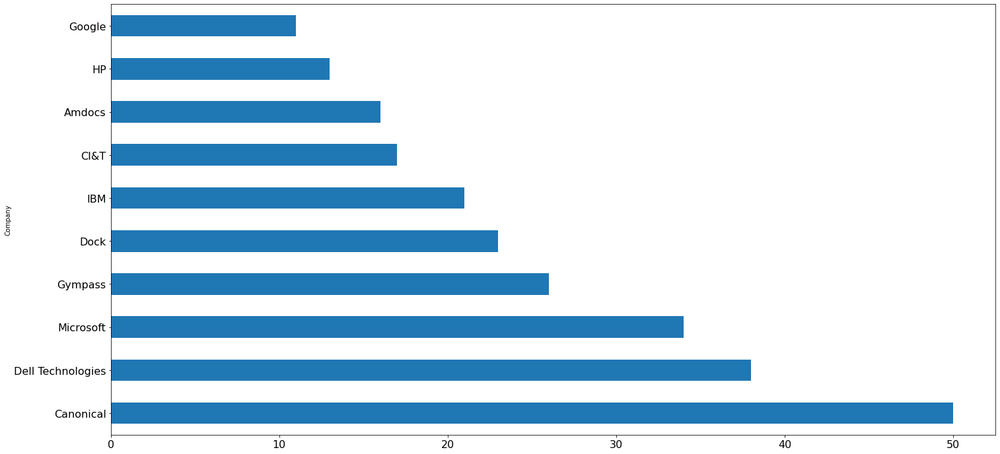

```python
import requests
import time
import pandas as pd
from selenium import webdriver
from selenium.webdriver.chrome.service import Service
from selenium.webdriver.chrome.options import Options
from selenium.webdriver.common.by import By
chrome_service = Service('/Users/rcsousa/Downloads/chromedriver')
import json
from bs4 import BeautifulSoup as soup
import random
import matplotlib.pyplot as plt
import requests
import json
import unidecode
import folium
from folium import plugins
import numpy as np
```

Gera lista de estados e coordenadas


```python
estados = json.loads(requests.get("https://servicodados.ibge.gov.br/api/v1/localidades/estados/").text)
UF = []
estado_nome = []
for x in estados:
    UF.append(x['sigla'])
    estado_nome.append(x['nome'])
    
coordenadas = []
for x in estados:
    coordenadas.append(json.loads(requests.get("http://servicodados.ibge.gov.br/api/v3/malhas/estados/"+x['sigla']+"/metadados").text))


latitude = []
longitude = []
for x in coordenadas:
    latitude.append(x[0]['centroide']['latitude'])
    longitude.append(x[0]['centroide']['longitude'])
    
coord = list(zip(UF, estado_nome, latitude, longitude))
df_coord = pd.DataFrame(coord, columns = ['UF', 'Location', 'latitude', 'longitude'])
coord_plot = list(zip(estado_nome, latitude, longitude))
```

Define parametros de busca


```python
url = 'https://www.linkedin.com/jobs/search?keywords=Site%20Reliability%20Engineer&location=Brasil&geoId=106057199&trk=public_jobs_jobs-search-bar_search-submit&position=1&pageNum=0'
options = Options()
options.headless = False
driver=webdriver.Chrome
s = driver(service=chrome_service, options=options)
n = random.randint(3,7)
s.get(url)
time.sleep(n)
scroll_pause_time = 1 
screen_height = s.execute_script("return window.screen.height;")
i = 1
```

Faz loop automático até último registro publico


```python
while True:
    # scroll one screen height each time
    s.execute_script("window.scrollTo(0, {screen_height}*{i});".format(screen_height=screen_height, i=i))  
    i += 1
    time.sleep(scroll_pause_time)
    # update scroll height each time after scrolled, as the scroll height can change after we scrolled the page
    scroll_height = s.execute_script("return document.body.scrollHeight;")  
    # Break the loop when the height we need to scroll to is larger than the total scroll height
    try:
        s.find_element(By.XPATH, "//button[@class='infinite-scroller__show-more-button infinite-scroller__show-more-button--visible']").click()
    except:
        pass
    if (screen_height) * i > scroll_height:
        break 
```


```python
bsobj = soup(s.page_source, 'html.parser')
```


```python
job_title = []
company = []
location = []
age = []
link = []

for item in bsobj.findAll('h3', {'class' : 'base-search-card__title'}):
    job_title.append(item.get_text().strip())
job_title
    
for item in bsobj.findAll('a', {'class' : 'hidden-nested-link'}):
    company.append(item.get_text().strip())
company
    
for item in bsobj.findAll('span', {'class' : 'job-search-card__location'}):
    location.append(item.get_text().strip())

    
for item in bsobj.findAll('time', {'class' : 'job-search-card__listdate'}):
    age.append(item.get_text().strip())
```


```python
postings = list(zip(job_title, company, location, age))
```


```python
df = pd.DataFrame(postings, columns = ['Job Opening', 'Company', 'Location', 'Age'])
```


```python
s.quit()
```

Consolida estados


```python
localidades = json.loads(requests.get("https://servicodados.ibge.gov.br/api/v1/localidades/municipios/").text)
for x in localidades:
    df.loc[df['Location'].str.contains(unidecode.unidecode(x['nome']), case=False), unidecode.unidecode('Location')] = x['microrregiao']['mesorregiao']['UF']['nome']
    df.loc[df['Location'].str.contains(x['microrregiao']['mesorregiao']['UF']['nome'], case=False), 'Location'] = x['microrregiao']['mesorregiao']['UF']['nome']
```

Tratamento de excessão


```python
df.loc[df['Location'].str.contains('Federal District', case=False), 'Location'] = 'Distrito Federal'
df.loc[df['Location'].str.contains('Ribeirão Preto', case=False), 'Location'] = 'São Paulo'
```


```python
jobs_per_company = df.groupby('Company').count()
```


```python
df = df.merge(df_coord, on='Location', how='left')
```


```python
df = df[df.latitude.notnull()]
```


```python
prep_chart_company = jobs_per_company.sort_values("Job Opening", ascending=False).head(10)
```


```python
df2 = pd.DataFrame(prep_chart_company['Job Opening'])
df2.plot(kind="barh", \
         legend=False, \
         figsize=(24, 12), \
         rot=0, \
         fontsize = 16, \
         sort_columns = False)
```


    <AxesSubplot:ylabel='Company'>


    

    


Gera Total de vagas por localidade


```python
df['Openings'] = df.groupby('Location')['Location'].transform('count')
```

Remove colunas desnecessárias


```python
for x in 'Company', 'Age', 'UF', 'Job Opening':
    df.drop(x, axis='columns', inplace=True)
```

Define HTTP Header


```python
headers = {
    'Content-Type': 'application/json;charset=UTF-8',
    'User-Agent': 'google-colab',
    'Accept': 'application/json, text/plain, */*',
    'Accept-Encoding': 'gzip, deflate, br',
    'Accept-Language': 'pt-BR,pt;q=0.9,en-US;q=0.8,en;q=0.7',
    'Connection': 'keep-alive',
}
```

Coleta Geojson do IBGE e atribui variável


```python
meshes_url = 'https://servicodados.ibge.gov.br/api/v2/malhas/?resolucao=2&formato=application/vnd.geo+json'
meshes_data = requests.get(meshes_url, headers=headers).json()
```

Coleta informacoes dos estados (com id) do IBGE e atribui variável


```python
states_url = 'https://servicodados.ibge.gov.br/api/v1/localidades/estados'
states_data = requests.get(states_url, headers=headers).json()
```


```python
# creating lists to be populated by IBGE requested data
meshes_ids = []
states_ids = []
states_names = []
states_codes = []

# populating information about meshes
for feature in meshes_data['features']:
    meshes_ids.append( str(feature['properties']['codarea']) )

meshes_ids.sort()

# populating information about Federative Units
for state in states_data:
    states_ids.append( str(state['id']) )
    states_names.append( state['nome'] )
    states_codes.append( state['sigla'] )

states_ids.sort()
```


```python
# creating a dataframe of Federative Units to be merged
states = pd.DataFrame( {'id': states_ids, 'nome': states_names, 'sigla': states_codes} )

# appending centroid coordinates columns
states['lat'] = 0
states['lng'] = 0

states.set_index('id', inplace=True)

# retrieving centroid data
for feature in meshes_data['features']:
    
    centroid = feature['properties']['centroide']
    lat = centroid[1]
    lng = centroid[0]
    
    cod = str(feature['properties']['codarea'])
    
    states.loc[cod,'lat'] = lat
    states.loc[cod,'lng'] = lng

states.reset_index(inplace=True)
```

Faz merge dos dataframes df e localidades com ids


```python
df = df.merge(states, left_on='Location', right_on='nome').drop(columns=['nome'])
```

Remove entradas duplicadas


```python
df = df.drop_duplicates()
```


```python
df
```


<div>
<style scoped>
    .dataframe tbody tr th:only-of-type {
        vertical-align: middle;
    }

    .dataframe tbody tr th {
        vertical-align: top;
    }

    .dataframe thead th {
        text-align: right;
    }
</style>
<table border="1" class="dataframe">
  <thead>
    <tr style="text-align: right;">
      <th></th>
      <th>Location</th>
      <th>latitude</th>
      <th>longitude</th>
      <th>Openings</th>
      <th>id</th>
      <th>sigla</th>
      <th>lat</th>
      <th>lng</th>
    </tr>
  </thead>
  <tbody>
    <tr>
      <th>0</th>
      <td>Ceará</td>
      <td>-5.0932</td>
      <td>-39.6158</td>
      <td>59</td>
      <td>23</td>
      <td>CE</td>
      <td>-5.093338</td>
      <td>-39.615608</td>
    </tr>
    <tr>
      <th>59</th>
      <td>São Paulo</td>
      <td>-22.2635</td>
      <td>-48.7340</td>
      <td>464</td>
      <td>35</td>
      <td>SP</td>
      <td>-22.263541</td>
      <td>-48.733659</td>
    </tr>
    <tr>
      <th>523</th>
      <td>Rio de Janeiro</td>
      <td>-22.1885</td>
      <td>-42.6524</td>
      <td>69</td>
      <td>33</td>
      <td>RJ</td>
      <td>-22.188569</td>
      <td>-42.651667</td>
    </tr>
    <tr>
      <th>592</th>
      <td>Bahia</td>
      <td>-12.4753</td>
      <td>-41.7212</td>
      <td>8</td>
      <td>29</td>
      <td>BA</td>
      <td>-12.475101</td>
      <td>-41.720804</td>
    </tr>
    <tr>
      <th>600</th>
      <td>Pernambuco</td>
      <td>-8.3261</td>
      <td>-37.9988</td>
      <td>6</td>
      <td>26</td>
      <td>PE</td>
      <td>-8.326050</td>
      <td>-37.998299</td>
    </tr>
    <tr>
      <th>606</th>
      <td>Paraná</td>
      <td>-24.6359</td>
      <td>-51.6166</td>
      <td>30</td>
      <td>41</td>
      <td>PR</td>
      <td>-24.635840</td>
      <td>-51.616400</td>
    </tr>
    <tr>
      <th>636</th>
      <td>Minas Gerais</td>
      <td>-18.4562</td>
      <td>-44.6734</td>
      <td>41</td>
      <td>31</td>
      <td>MG</td>
      <td>-18.456155</td>
      <td>-44.673385</td>
    </tr>
    <tr>
      <th>677</th>
      <td>Distrito Federal</td>
      <td>-15.7812</td>
      <td>-47.7969</td>
      <td>13</td>
      <td>53</td>
      <td>DF</td>
      <td>-15.780746</td>
      <td>-47.797341</td>
    </tr>
    <tr>
      <th>690</th>
      <td>Amazonas</td>
      <td>-4.1541</td>
      <td>-64.6531</td>
      <td>9</td>
      <td>13</td>
      <td>AM</td>
      <td>-4.154223</td>
      <td>-64.653187</td>
    </tr>
    <tr>
      <th>699</th>
      <td>Goiás</td>
      <td>-16.0412</td>
      <td>-49.6225</td>
      <td>3</td>
      <td>52</td>
      <td>GO</td>
      <td>-16.042109</td>
      <td>-49.623608</td>
    </tr>
    <tr>
      <th>702</th>
      <td>Pará</td>
      <td>-3.9810</td>
      <td>-53.0722</td>
      <td>3</td>
      <td>15</td>
      <td>PA</td>
      <td>-3.974815</td>
      <td>-53.064197</td>
    </tr>
    <tr>
      <th>705</th>
      <td>Rio Grande do Sul</td>
      <td>-29.7046</td>
      <td>-53.3208</td>
      <td>27</td>
      <td>43</td>
      <td>RS</td>
      <td>-29.705809</td>
      <td>-53.319974</td>
    </tr>
    <tr>
      <th>732</th>
      <td>Espírito Santo</td>
      <td>-19.5749</td>
      <td>-40.6712</td>
      <td>5</td>
      <td>32</td>
      <td>ES</td>
      <td>-19.575078</td>
      <td>-40.670847</td>
    </tr>
    <tr>
      <th>737</th>
      <td>Maranhão</td>
      <td>-5.0789</td>
      <td>-45.2892</td>
      <td>1</td>
      <td>21</td>
      <td>MA</td>
      <td>-5.060433</td>
      <td>-45.279153</td>
    </tr>
  </tbody>
</table>
</div>


Gera Mapa


```python
# Coordenadas de Brasilia
federal_district = [-15.7757875,-48.0778477]

# Cria objeto Mapa
basemap = folium.Map(
    location=federal_district,
    zoom_start=4,
    tiles='openstreetmap'
)

# Permite alterar tipo de layout do mapa
tiles = ['openstreetmap', 'cartodbpositron']

# iterating over the tiles and creating the maps
for tile in tiles:
  folium.TileLayer(tile).add_to(basemap)


# Define plot
legends = 'SRE Jobs Opening in Brazil 2021'
folium.Choropleth(
    geo_data=meshes_data,
    data=df,
    name=legends,
    columns=['id','Openings'],
    key_on='feature.properties.codarea',
    fill_color='YlOrRd',
    fill_opacity=1.0,
    line_opacity=0.7,
    legend_name=legends
).add_to(basemap)

# controles do mapa
folium.LayerControl().add_to(basemap)

# Renderiza Mapa
basemap
```


<div style="width:100%;"><div style="position:relative;width:100%;height:0;padding-bottom:60%;"><span style="color:#565656">Make this Notebook Trusted to load map: File -> Trust Notebook</span><iframe src="about:blank" style="position:absolute;width:100%;height:100%;left:0;top:0;border:none !important;" data-html=%3C%21DOCTYPE%20html%3E%0A%3Chead%3E%20%20%20%20%0A%20%20%20%20%3Cmeta%20http-equiv%3D%22content-type%22%20content%3D%22text/html%3B%20charset%3DUTF-8%22%20/%3E%0A%20%20%20%20%0A%20%20%20%20%20%20%20%20%3Cscript%3E%0A%20%20%20%20%20%20%20%20%20%20%20%20L_NO_TOUCH%20%3D%20false%3B%0A%20%20%20%20%20%20%20%20%20%20%20%20L_DISABLE_3D%20%3D%20false%3B%0A%20%20%20%20%20%20%20%20%3C/script%3E%0A%20%20%20%20%0A%20%20%20%20%3Cstyle%3Ehtml%2C%20body%20%7Bwidth%3A%20100%25%3Bheight%3A%20100%25%3Bmargin%3A%200%3Bpadding%3A%200%3B%7D%3C/style%3E%0A%20%20%20%20%3Cstyle%3E%23map%20%7Bposition%3Aabsolute%3Btop%3A0%3Bbottom%3A0%3Bright%3A0%3Bleft%3A0%3B%7D%3C/style%3E%0A%20%20%20%20%3Cscript%20src%3D%22https%3A//cdn.jsdelivr.net/npm/leaflet%401.6.0/dist/leaflet.js%22%3E%3C/script%3E%0A%20%20%20%20%3Cscript%20src%3D%22https%3A//code.jquery.com/jquery-1.12.4.min.js%22%3E%3C/script%3E%0A%20%20%20%20%3Cscript%20src%3D%22https%3A//maxcdn.bootstrapcdn.com/bootstrap/3.2.0/js/bootstrap.min.js%22%3E%3C/script%3E%0A%20%20%20%20%3Cscript%20src%3D%22https%3A//cdnjs.cloudflare.com/ajax/libs/Leaflet.awesome-markers/2.0.2/leaflet.awesome-markers.js%22%3E%3C/script%3E%0A%20%20%20%20%3Clink%20rel%3D%22stylesheet%22%20href%3D%22https%3A//cdn.jsdelivr.net/npm/leaflet%401.6.0/dist/leaflet.css%22/%3E%0A%20%20%20%20%3Clink%20rel%3D%22stylesheet%22%20href%3D%22https%3A//maxcdn.bootstrapcdn.com/bootstrap/3.2.0/css/bootstrap.min.css%22/%3E%0A%20%20%20%20%3Clink%20rel%3D%22stylesheet%22%20href%3D%22https%3A//maxcdn.bootstrapcdn.com/bootstrap/3.2.0/css/bootstrap-theme.min.css%22/%3E%0A%20%20%20%20%3Clink%20rel%3D%22stylesheet%22%20href%3D%22https%3A//maxcdn.bootstrapcdn.com/font-awesome/4.6.3/css/font-awesome.min.css%22/%3E%0A%20%20%20%20%3Clink%20rel%3D%22stylesheet%22%20href%3D%22https%3A//cdnjs.cloudflare.com/ajax/libs/Leaflet.awesome-markers/2.0.2/leaflet.awesome-markers.css%22/%3E%0A%20%20%20%20%3Clink%20rel%3D%22stylesheet%22%20href%3D%22https%3A//cdn.jsdelivr.net/gh/python-visualization/folium/folium/templates/leaflet.awesome.rotate.min.css%22/%3E%0A%20%20%20%20%0A%20%20%20%20%20%20%20%20%20%20%20%20%3Cmeta%20name%3D%22viewport%22%20content%3D%22width%3Ddevice-width%2C%0A%20%20%20%20%20%20%20%20%20%20%20%20%20%20%20%20initial-scale%3D1.0%2C%20maximum-scale%3D1.0%2C%20user-scalable%3Dno%22%20/%3E%0A%20%20%20%20%20%20%20%20%20%20%20%20%3Cstyle%3E%0A%20%20%20%20%20%20%20%20%20%20%20%20%20%20%20%20%23map_e4c56d0da84e45269330c9543f3e0f40%20%7B%0A%20%20%20%20%20%20%20%20%20%20%20%20%20%20%20%20%20%20%20%20position%3A%20relative%3B%0A%20%20%20%20%20%20%20%20%20%20%20%20%20%20%20%20%20%20%20%20width%3A%20100.0%25%3B%0A%20%20%20%20%20%20%20%20%20%20%20%20%20%20%20%20%20%20%20%20height%3A%20100.0%25%3B%0A%20%20%20%20%20%20%20%20%20%20%20%20%20%20%20%20%20%20%20%20left%3A%200.0%25%3B%0A%20%20%20%20%20%20%20%20%20%20%20%20%20%20%20%20%20%20%20%20top%3A%200.0%25%3B%0A%20%20%20%20%20%20%20%20%20%20%20%20%20%20%20%20%7D%0A%20%20%20%20%20%20%20%20%20%20%20%20%3C/style%3E%0A%20%20%20%20%20%20%20%20%0A%20%20%20%20%3Cscript%20src%3D%22https%3A//cdnjs.cloudflare.com/ajax/libs/d3/3.5.5/d3.min.js%22%3E%3C/script%3E%0A%3C/head%3E%0A%3Cbody%3E%20%20%20%20%0A%20%20%20%20%0A%20%20%20%20%20%20%20%20%20%20%20%20%3Cdiv%20class%3D%22folium-map%22%20id%3D%22map_e4c56d0da84e45269330c9543f3e0f40%22%20%3E%3C/div%3E%0A%20%20%20%20%20%20%20%20%0A%3C/body%3E%0A%3Cscript%3E%20%20%20%20%0A%20%20%20%20%0A%20%20%20%20%20%20%20%20%20%20%20%20var%20map_e4c56d0da84e45269330c9543f3e0f40%20%3D%20L.map%28%0A%20%20%20%20%20%20%20%20%20%20%20%20%20%20%20%20%22map_e4c56d0da84e45269330c9543f3e0f40%22%2C%0A%20%20%20%20%20%20%20%20%20%20%20%20%20%20%20%20%7B%0A%20%20%20%20%20%20%20%20%20%20%20%20%20%20%20%20%20%20%20%20center%3A%20%5B-15.7757875%2C%20-48.0778477%5D%2C%0A%20%20%20%20%20%20%20%20%20%20%20%20%20%20%20%20%20%20%20%20crs%3A%20L.CRS.EPSG3857%2C%0A%20%20%20%20%20%20%20%20%20%20%20%20%20%20%20%20%20%20%20%20zoom%3A%204%2C%0A%20%20%20%20%20%20%20%20%20%20%20%20%20%20%20%20%20%20%20%20zoomControl%3A%20true%2C%0A%20%20%20%20%20%20%20%20%20%20%20%20%20%20%20%20%20%20%20%20preferCanvas%3A%20false%2C%0A%20%20%20%20%20%20%20%20%20%20%20%20%20%20%20%20%7D%0A%20%20%20%20%20%20%20%20%20%20%20%20%29%3B%0A%0A%20%20%20%20%20%20%20%20%20%20%20%20%0A%0A%20%20%20%20%20%20%20%20%0A%20%20%20%20%0A%20%20%20%20%20%20%20%20%20%20%20%20var%20tile_layer_1951a5e4a1da4020b51bce912dac5e9b%20%3D%20L.tileLayer%28%0A%20%20%20%20%20%20%20%20%20%20%20%20%20%20%20%20%22https%3A//%7Bs%7D.tile.openstreetmap.org/%7Bz%7D/%7Bx%7D/%7By%7D.png%22%2C%0A%20%20%20%20%20%20%20%20%20%20%20%20%20%20%20%20%7B%22attribution%22%3A%20%22Data%20by%20%5Cu0026copy%3B%20%5Cu003ca%20href%3D%5C%22http%3A//openstreetmap.org%5C%22%5Cu003eOpenStreetMap%5Cu003c/a%5Cu003e%2C%20under%20%5Cu003ca%20href%3D%5C%22http%3A//www.openstreetmap.org/copyright%5C%22%5Cu003eODbL%5Cu003c/a%5Cu003e.%22%2C%20%22detectRetina%22%3A%20false%2C%20%22maxNativeZoom%22%3A%2018%2C%20%22maxZoom%22%3A%2018%2C%20%22minZoom%22%3A%200%2C%20%22noWrap%22%3A%20false%2C%20%22opacity%22%3A%201%2C%20%22subdomains%22%3A%20%22abc%22%2C%20%22tms%22%3A%20false%7D%0A%20%20%20%20%20%20%20%20%20%20%20%20%29.addTo%28map_e4c56d0da84e45269330c9543f3e0f40%29%3B%0A%20%20%20%20%20%20%20%20%0A%20%20%20%20%0A%20%20%20%20%20%20%20%20%20%20%20%20var%20tile_layer_bb8e7740a8084cf1925deb7a67ef4990%20%3D%20L.tileLayer%28%0A%20%20%20%20%20%20%20%20%20%20%20%20%20%20%20%20%22https%3A//%7Bs%7D.tile.openstreetmap.org/%7Bz%7D/%7Bx%7D/%7By%7D.png%22%2C%0A%20%20%20%20%20%20%20%20%20%20%20%20%20%20%20%20%7B%22attribution%22%3A%20%22Data%20by%20%5Cu0026copy%3B%20%5Cu003ca%20href%3D%5C%22http%3A//openstreetmap.org%5C%22%5Cu003eOpenStreetMap%5Cu003c/a%5Cu003e%2C%20under%20%5Cu003ca%20href%3D%5C%22http%3A//www.openstreetmap.org/copyright%5C%22%5Cu003eODbL%5Cu003c/a%5Cu003e.%22%2C%20%22detectRetina%22%3A%20false%2C%20%22maxNativeZoom%22%3A%2018%2C%20%22maxZoom%22%3A%2018%2C%20%22minZoom%22%3A%200%2C%20%22noWrap%22%3A%20false%2C%20%22opacity%22%3A%201%2C%20%22subdomains%22%3A%20%22abc%22%2C%20%22tms%22%3A%20false%7D%0A%20%20%20%20%20%20%20%20%20%20%20%20%29.addTo%28map_e4c56d0da84e45269330c9543f3e0f40%29%3B%0A%20%20%20%20%20%20%20%20%0A%20%20%20%20%0A%20%20%20%20%20%20%20%20%20%20%20%20var%20tile_layer_5025137a6fd54fc5a385610238139b58%20%3D%20L.tileLayer%28%0A%20%20%20%20%20%20%20%20%20%20%20%20%20%20%20%20%22https%3A//cartodb-basemaps-%7Bs%7D.global.ssl.fastly.net/light_all/%7Bz%7D/%7Bx%7D/%7By%7D.png%22%2C%0A%20%20%20%20%20%20%20%20%20%20%20%20%20%20%20%20%7B%22attribution%22%3A%20%22%5Cu0026copy%3B%20%5Cu003ca%20href%3D%5C%22http%3A//www.openstreetmap.org/copyright%5C%22%5Cu003eOpenStreetMap%5Cu003c/a%5Cu003e%20contributors%20%5Cu0026copy%3B%20%5Cu003ca%20href%3D%5C%22http%3A//cartodb.com/attributions%5C%22%5Cu003eCartoDB%5Cu003c/a%5Cu003e%2C%20CartoDB%20%5Cu003ca%20href%20%3D%5C%22http%3A//cartodb.com/attributions%5C%22%5Cu003eattributions%5Cu003c/a%5Cu003e%22%2C%20%22detectRetina%22%3A%20false%2C%20%22maxNativeZoom%22%3A%2018%2C%20%22maxZoom%22%3A%2018%2C%20%22minZoom%22%3A%200%2C%20%22noWrap%22%3A%20false%2C%20%22opacity%22%3A%201%2C%20%22subdomains%22%3A%20%22abc%22%2C%20%22tms%22%3A%20false%7D%0A%20%20%20%20%20%20%20%20%20%20%20%20%29.addTo%28map_e4c56d0da84e45269330c9543f3e0f40%29%3B%0A%20%20%20%20%20%20%20%20%0A%20%20%20%20%0A%20%20%20%20%20%20%20%20%20%20%20%20var%20choropleth_f7451128fce84d089c8a26685b92d730%20%3D%20L.featureGroup%28%0A%20%20%20%20%20%20%20%20%20%20%20%20%20%20%20%20%7B%7D%0A%20%20%20%20%20%20%20%20%20%20%20%20%29.addTo%28map_e4c56d0da84e45269330c9543f3e0f40%29%3B%0A%20%20%20%20%20%20%20%20%0A%20%20%20%20%0A%20%20%20%20%20%20%20%20function%20geo_json_beac22c8b4b945b9902932b1cdcdcd52_styler%28feature%29%20%7B%0A%20%20%20%20%20%20%20%20%20%20%20%20switch%28feature.properties.codarea%29%20%7B%0A%20%20%20%20%20%20%20%20%20%20%20%20%20%20%20%20case%20%2215%22%3A%20case%20%2213%22%3A%20case%20%2221%22%3A%20case%20%2223%22%3A%20case%20%2226%22%3A%20case%20%2229%22%3A%20case%20%2231%22%3A%20case%20%2232%22%3A%20case%20%2233%22%3A%20case%20%2241%22%3A%20case%20%2243%22%3A%20case%20%2252%22%3A%20case%20%2253%22%3A%20%0A%20%20%20%20%20%20%20%20%20%20%20%20%20%20%20%20%20%20%20%20return%20%7B%22color%22%3A%20%22black%22%2C%20%22fillColor%22%3A%20%22%23ffffb2%22%2C%20%22fillOpacity%22%3A%201.0%2C%20%22opacity%22%3A%200.7%2C%20%22weight%22%3A%201%7D%3B%0A%20%20%20%20%20%20%20%20%20%20%20%20%20%20%20%20case%20%2235%22%3A%20%0A%20%20%20%20%20%20%20%20%20%20%20%20%20%20%20%20%20%20%20%20return%20%7B%22color%22%3A%20%22black%22%2C%20%22fillColor%22%3A%20%22%23bd0026%22%2C%20%22fillOpacity%22%3A%201.0%2C%20%22opacity%22%3A%200.7%2C%20%22weight%22%3A%201%7D%3B%0A%20%20%20%20%20%20%20%20%20%20%20%20%20%20%20%20default%3A%0A%20%20%20%20%20%20%20%20%20%20%20%20%20%20%20%20%20%20%20%20return%20%7B%22color%22%3A%20%22black%22%2C%20%22fillColor%22%3A%20%22black%22%2C%20%22fillOpacity%22%3A%201.0%2C%20%22opacity%22%3A%200.7%2C%20%22weight%22%3A%201%7D%3B%0A%20%20%20%20%20%20%20%20%20%20%20%20%7D%0A%20%20%20%20%20%20%20%20%7D%0A%0A%20%20%20%20%20%20%20%20function%20geo_json_beac22c8b4b945b9902932b1cdcdcd52_onEachFeature%28feature%2C%20layer%29%20%7B%0A%20%20%20%20%20%20%20%20%20%20%20%20layer.on%28%7B%0A%20%20%20%20%20%20%20%20%20%20%20%20%7D%29%3B%0A%20%20%20%20%20%20%20%20%7D%3B%0A%20%20%20%20%20%20%20%20var%20geo_json_beac22c8b4b945b9902932b1cdcdcd52%20%3D%20L.geoJson%28null%2C%20%7B%0A%20%20%20%20%20%20%20%20%20%20%20%20%20%20%20%20onEachFeature%3A%20geo_json_beac22c8b4b945b9902932b1cdcdcd52_onEachFeature%2C%0A%20%20%20%20%20%20%20%20%20%20%20%20%0A%20%20%20%20%20%20%20%20%20%20%20%20%20%20%20%20style%3A%20geo_json_beac22c8b4b945b9902932b1cdcdcd52_styler%2C%0A%20%20%20%20%20%20%20%20%7D%29%3B%0A%0A%20%20%20%20%20%20%20%20function%20geo_json_beac22c8b4b945b9902932b1cdcdcd52_add%20%28data%29%20%7B%0A%20%20%20%20%20%20%20%20%20%20%20%20geo_json_beac22c8b4b945b9902932b1cdcdcd52%0A%20%20%20%20%20%20%20%20%20%20%20%20%20%20%20%20.addData%28data%29%0A%20%20%20%20%20%20%20%20%20%20%20%20%20%20%20%20.addTo%28choropleth_f7451128fce84d089c8a26685b92d730%29%3B%0A%20%20%20%20%20%20%20%20%7D%0A%20%20%20%20%20%20%20%20%20%20%20%20geo_json_beac22c8b4b945b9902932b1cdcdcd52_add%28%7B%22crs%22%3A%20%7B%22properties%22%3A%20%7B%22name%22%3A%20%22urn%3Aogc%3Adef%3Acrs%3AEPSG%3A%3A4674%22%7D%2C%20%22type%22%3A%20%22name%22%7D%2C%20%22features%22%3A%20%5B%7B%22geometry%22%3A%20%7B%22coordinates%22%3A%20%5B%5B%5B-62.7943%2C%20-8.0275%5D%2C%20%5B-62.7862%2C%20-8.0263%5D%2C%20%5B-62.738%2C%20-8.05%5D%2C%20%5B-62.7331%2C%20-8.0565%5D%2C%20%5B-62.6788%2C%20-8.1114%5D%2C%20%5B-62.6855%2C%20-8.1164%5D%2C%20%5B-62.673%2C%20-8.1453%5D%2C%20%5B-62.6866%2C%20-8.1737%5D%2C%20%5B-62.6598%2C%20-8.1996%5D%2C%20%5B-62.655%2C%20-8.229%5D%2C%20%5B-62.6%2C%20-8.2722%5D%2C%20%5B-62.5619%2C%20-8.284%5D%2C%20%5B-62.5611%2C%20-8.3138%5D%2C%20%5B-62.5395%2C%20-8.3581%5D%2C%20%5B-62.5184%2C%20-8.3847%5D%2C%20%5B-62.4789%2C%20-8.3456%5D%2C%20%5B-62.4654%2C%20-8.3397%5D%2C%20%5B-62.4397%2C%20-8.3678%5D%2C%20%5B-62.4245%2C%20-8.3749%5D%2C%20%5B-62.384%2C%20-8.3775%5D%2C%20%5B-62.3608%2C%20-8.3985%5D%2C%20%5B-62.3692%2C%20-8.4461%5D%2C%20%5B-62.366%2C%20-8.4935%5D%2C%20%5B-62.3539%2C%20-8.5117%5D%2C%20%5B-62.3373%2C%20-8.5166%5D%2C%20%5B-62.3258%2C%20-8.5637%5D%2C%20%5B-62.341%2C%20-8.6028%5D%2C%20%5B-62.2895%2C%20-8.639%5D%2C%20%5B-62.2793%2C%20-8.6291%5D%2C%20%5B-62.2943%2C%20-8.6054%5D%2C%20%5B-62.2893%2C%20-8.5889%5D%2C%20%5B-62.2688%2C%20-8.5757%5D%2C%20%5B-62.2286%2C%20-8.5905%5D%2C%20%5B-62.1883%2C%20-8.5905%5D%2C%20%5B-62.1746%2C%20-8.6282%5D%2C%20%5B-62.2005%2C%20-8.6442%5D%2C%20%5B-62.165%2C%20-8.6793%5D%2C%20%5B-62.1717%2C%20-8.695%5D%2C%20%5B-62.1488%2C%20-8.7183%5D%2C%20%5B-62.155%2C%20-8.7396%5D%2C%20%5B-62.1249%2C%20-8.8016%5D%2C%20%5B-62.098%2C%20-8.8089%5D%2C%20%5B-62.0743%2C%20-8.7985%5D%2C%20%5B-62.031%2C%20-8.7997%5D%2C%20%5B-62.0213%2C%20-8.8235%5D%2C%20%5B-62.0039%2C%20-8.83%5D%2C%20%5B-61.9852%2C%20-8.8786%5D%2C%20%5B-61.9791%2C%20-8.8732%5D%2C%20%5B-61.9381%2C%20-8.8814%5D%2C%20%5B-61.9058%2C%20-8.8745%5D%2C%20%5B-61.903%2C%20-8.8628%5D%2C%20%5B-61.8793%2C%20-8.8624%5D%2C%20%5B-61.8597%2C%20-8.8529%5D%2C%20%5B-61.861%2C%20-8.8036%5D%2C%20%5B-61.8433%2C%20-8.7794%5D%2C%20%5B-61.8448%2C%20-8.7551%5D%2C%20%5B-61.8365%2C%20-8.7327%5D%2C%20%5B-61.8062%2C%20-8.7477%5D%2C%20%5B-61.7746%2C%20-8.7482%5D%2C%20%5B-61.7636%2C%20-8.7287%5D%2C%20%5B-61.7488%2C%20-8.7237%5D%2C%20%5B-61.7418%2C%20-8.6951%5D%2C%20%5B-61.7132%2C%20-8.6878%5D%2C%20%5B-61.7053%2C%20-8.7075%5D%2C%20%5B-61.6735%2C%20-8.705%5D%2C%20%5B-61.6264%2C%20-8.7288%5D%2C%20%5B-61.6295%2C%20-8.7529%5D%2C%20%5B-61.606%2C%20-8.7947%5D%2C%20%5B-61.5831%2C%20-8.7986%5D%2C%20%5B-61.5683%2C%20-8.801%5D%2C%20%5B-61.543%2C%20-8.819%5D%2C%20%5B-61.5271%2C%20-8.8168%5D%2C%20%5B-61.5137%2C%20-8.8369%5D%2C%20%5B-61.5124%2C%20-8.8605%5D%2C%20%5B-61.4921%2C%20-8.8848%5D%2C%20%5B-61.4845%2C%20-8.9059%5D%2C%20%5B-61.4692%2C%20-8.9201%5D%2C%20%5B-61.4895%2C%20-8.9372%5D%2C%20%5B-61.5057%2C%20-8.9661%5D%2C%20%5B-61.5279%2C%20-9.0193%5D%2C%20%5B-61.5298%2C%20-9.0393%5D%2C%20%5B-61.5416%2C%20-9.0539%5D%2C%20%5B-61.5557%2C%20-9.0924%5D%2C%20%5B-61.5553%2C%20-9.1314%5D%2C%20%5B-61.5242%2C%20-9.1779%5D%2C%20%5B-61.5195%2C%20-9.1973%5D%2C%20%5B-61.5293%2C%20-9.2486%5D%2C%20%5B-61.5741%2C%20-9.2369%5D%2C%20%5B-61.5996%2C%20-9.256%5D%2C%20%5B-61.6283%2C%20-9.257%5D%2C%20%5B-61.6333%2C%20-9.2742%5D%2C%20%5B-61.6119%2C%20-9.2807%5D%2C%20%5B-61.6113%2C%20-9.3157%5D%2C%20%5B-61.6237%2C%20-9.3345%5D%2C%20%5B-61.6259%2C%20-9.363%5D%2C%20%5B-61.6136%2C%20-9.3557%5D%2C%20%5B-61.5946%2C%20-9.3687%5D%2C%20%5B-61.5793%2C%20-9.3684%5D%2C%20%5B-61.5531%2C%20-9.389%5D%2C%20%5B-61.5603%2C%20-9.4034%5D%2C%20%5B-61.5505%2C%20-9.4147%5D%2C%20%5B-61.5567%2C%20-9.4356%5D%2C%20%5B-61.5817%2C%20-9.4591%5D%2C%20%5B-61.5627%2C%20-9.4857%5D%2C%20%5B-61.5265%2C%20-9.501%5D%2C%20%5B-61.5491%2C%20-9.5124%5D%2C%20%5B-61.5271%2C%20-9.5332%5D%2C%20%5B-61.5134%2C%20-9.5285%5D%2C%20%5B-61.5103%2C%20-9.565%5D%2C%20%5B-61.4949%2C%20-9.5849%5D%2C%20%5B-61.5037%2C%20-9.6126%5D%2C%20%5B-61.4769%2C%20-9.6298%5D%2C%20%5B-61.495%2C%20-9.6598%5D%2C%20%5B-61.5068%2C%20-9.6619%5D%2C%20%5B-61.5021%2C%20-9.6828%5D%2C%20%5B-61.5324%2C%20-9.7117%5D%2C%20%5B-61.553%2C%20-9.7071%5D%2C%20%5B-61.5746%2C%20-9.7177%5D%2C%20%5B-61.5646%2C%20-9.7298%5D%2C%20%5B-61.5315%2C%20-9.7399%5D%2C%20%5B-61.5326%2C%20-9.7579%5D%2C%20%5B-61.5462%2C%20-9.7888%5D%2C%20%5B-61.5249%2C%20-9.7957%5D%2C%20%5B-61.5312%2C%20-9.8215%5D%2C%20%5B-61.5197%2C%20-9.8215%5D%2C%20%5B-61.5079%2C%20-9.861%5D%2C%20%5B-61.511%2C%20-9.8955%5D%2C%20%5B-61.5249%2C%20-9.9065%5D%2C%20%5B-61.5228%2C%20-9.9466%5D%2C%20%5B-61.5394%2C%20-9.964%5D%2C%20%5B-61.5279%2C%20-9.9704%5D%2C%20%5B-61.5558%2C%20-10.0389%5D%2C%20%5B-61.5848%2C%20-10.0615%5D%2C%20%5B-61.5787%2C%20-10.0792%5D%2C%20%5B-61.5886%2C%20-10.104%5D%2C%20%5B-61.5968%2C%20-10.1623%5D%2C%20%5B-61.5624%2C%20-10.1718%5D%2C%20%5B-61.5517%2C%20-10.1977%5D%2C%20%5B-61.574%2C%20-10.2089%5D%2C%20%5B-61.5767%2C%20-10.2485%5D%2C%20%5B-61.544%2C%20-10.3009%5D%2C%20%5B-61.5533%2C%20-10.307%5D%2C%20%5B-61.5301%2C%20-10.3333%5D%2C%20%5B-61.5214%2C%20-10.3307%5D%2C%20%5B-61.5017%2C%20-10.3537%5D%2C%20%5B-61.497%2C%20-10.3895%5D%2C%20%5B-61.4715%2C%20-10.4051%5D%2C%20%5B-61.4617%2C%20-10.4199%5D%2C%20%5B-61.4808%2C%20-10.4877%5D%2C%20%5B-61.4779%2C%20-10.5316%5D%2C%20%5B-61.4663%2C%20-10.5412%5D%2C%20%5B-61.4799%2C%20-10.5691%5D%2C%20%5B-61.4762%2C%20-10.6076%5D%2C%20%5B-61.4895%2C%20-10.6298%5D%2C%20%5B-61.4789%2C%20-10.643%5D%2C%20%5B-61.4844%2C%20-10.6737%5D%2C%20%5B-61.4993%2C%20-10.6986%5D%2C%20%5B-61.4723%2C%20-10.7149%5D%2C%20%5B-61.4884%2C%20-10.7364%5D%2C%20%5B-61.4765%2C%20-10.7666%5D%2C%20%5B-61.486%2C%20-10.8006%5D%2C%20%5B-61.4932%2C%20-10.7845%5D%2C%20%5B-61.511%2C%20-10.7948%5D%2C%20%5B-61.5034%2C%20-10.8084%5D%2C%20%5B-61.5099%2C%20-10.8368%5D%2C%20%5B-61.5251%2C%20-10.8558%5D%2C%20%5B-61.5148%2C%20-10.9064%5D%2C%20%5B-61.5204%2C%20-10.9194%5D%2C%20%5B-61.53%2C%20-10.979%5D%2C%20%5B-61.5502%2C%20-10.986%5D%2C%20%5B-61.0005%2C%20-10.9922%5D%2C%20%5B-61.0005%2C%20-10.9883%5D%2C%20%5B-60.46%2C%20-10.9898%5D%2C%20%5B-60.46%2C%20-10.9898%5D%2C%20%5B-60.4379%2C%20-11.0166%5D%2C%20%5B-60.4465%2C%20-11.0421%5D%2C%20%5B-60.4296%2C%20-11.0374%5D%2C%20%5B-60.4114%2C%20-11.0467%5D%2C%20%5B-60.4143%2C%20-11.0674%5D%2C%20%5B-60.4041%2C%20-11.0693%5D%2C%20%5B-60.3915%2C%20-11.0937%5D%2C%20%5B-60.3732%2C%20-11.0941%5D%2C%20%5B-60.35%2C%20-11.1083%5D%2C%20%5B-60.3419%2C%20-11.0826%5D%2C%20%5B-60.3012%2C%20-11.0571%5D%2C%20%5B-60.2823%2C%20-11.064%5D%2C%20%5B-60.2808%2C%20-11.0915%5D%2C%20%5B-60.2412%2C%20-11.0968%5D%2C%20%5B-60.1914%2C%20-11.1141%5D%2C%20%5B-60.1764%2C%20-11.0988%5D%2C%20%5B-60.1592%2C%20-11.0956%5D%2C%20%5B-60.1424%2C%20-11.1057%5D%2C%20%5B-60.1126%2C%20-11.1025%5D%2C%20%5B-60.0961%2C%20-11.1107%5D%2C%20%5B-60.0842%2C%20-11.0968%5D%2C%20%5B-60.0667%2C%20-11.1255%5D%2C%20%5B-59.9767%2C%20-11.1223%5D%2C%20%5B-59.9849%2C%20-11.147%5D%2C%20%5B-59.995%2C%20-11.1482%5D%2C%20%5B-59.9804%2C%20-11.1795%5D%2C%20%5B-59.964%2C%20-11.1891%5D%2C%20%5B-59.9811%2C%20-11.2037%5D%2C%20%5B-59.9796%2C%20-11.2395%5D%2C%20%5B-59.9679%2C%20-11.2529%5D%2C%20%5B-59.9594%2C%20-11.2947%5D%2C%20%5B-59.9277%2C%20-11.3104%5D%2C%20%5B-59.9171%2C%20-11.3384%5D%2C%20%5B-59.9254%2C%20-11.3617%5D%2C%20%5B-59.9206%2C%20-11.398%5D%2C%20%5B-59.9344%2C%20-11.4236%5D%2C%20%5B-59.9523%2C%20-11.4364%5D%2C%20%5B-59.9762%2C%20-11.4392%5D%2C%20%5B-59.9854%2C%20-11.4693%5D%2C%20%5B-60.0312%2C%20-11.4931%5D%2C%20%5B-60.0267%2C%20-11.5056%5D%2C%20%5B-60.0415%2C%20-11.5166%5D%2C%20%5B-60.0574%2C%20-11.542%5D%2C%20%5B-60.0992%2C%20-11.5708%5D%2C%20%5B-60.0944%2C%20-11.5858%5D%2C%20%5B-60.1109%2C%20-11.5824%5D%2C%20%5B-60.1099%2C%20-11.6155%5D%2C%20%5B-60.1174%2C%20-11.6433%5D%2C%20%5B-60.1145%2C%20-11.6613%5D%2C%20%5B-60.1224%2C%20-11.6824%5D%2C%20%5B-60.1073%2C%20-11.7489%5D%2C%20%5B-60.1088%2C%20-11.7757%5D%2C%20%5B-60.0968%2C%20-11.7953%5D%2C%20%5B-60.1033%2C%20-11.8191%5D%2C%20%5B-60.0988%2C%20-11.8455%5D%2C%20%5B-60.0658%2C%20-11.8908%5D%2C%20%5B-60.0334%2C%20-11.8986%5D%2C%20%5B-60.0068%2C%20-11.8946%5D%2C%20%5B-59.9841%2C%20-11.9148%5D%2C%20%5B-59.9887%2C%20-11.9294%5D%2C%20%5B-59.9803%2C%20-11.9464%5D%2C%20%5B-59.9869%2C%20-11.96%5D%2C%20%5B-59.9713%2C%20-11.9699%5D%2C%20%5B-59.9671%2C%20-12.0026%5D%2C%20%5B-59.9793%2C%20-12.0295%5D%2C%20%5B-59.9695%2C%20-12.0324%5D%2C%20%5B-59.962%2C%20-12.0563%5D%2C%20%5B-59.9292%2C%20-12.0784%5D%2C%20%5B-59.923%2C%20-12.0946%5D%2C%20%5B-59.8998%2C%20-12.1172%5D%2C%20%5B-59.8996%2C%20-12.1663%5D%2C%20%5B-59.9108%2C%20-12.1864%5D%2C%20%5B-59.9017%2C%20-12.2238%5D%2C%20%5B-59.8863%2C%20-12.2454%5D%2C%20%5B-59.7743%2C%20-12.3409%5D%2C%20%5B-59.7929%2C%20-12.3457%5D%2C%20%5B-59.8187%2C%20-12.3898%5D%2C%20%5B-59.8325%2C%20-12.4013%5D%2C%20%5B-59.8425%2C%20-12.4248%5D%2C%20%5B-59.8441%2C%20-12.4671%5D%2C%20%5B-59.8981%2C%20-12.5015%5D%2C%20%5B-59.896%2C%20-12.5364%5D%2C%20%5B-59.9463%2C%20-12.5988%5D%2C%20%5B-59.9753%2C%20-12.6094%5D%2C%20%5B-59.981%2C%20-12.5922%5D%2C%20%5B-59.9972%2C%20-12.5907%5D%2C%20%5B-60.0111%2C%20-12.6093%5D%2C%20%5B-60.0287%2C%20-12.6183%5D%2C%20%5B-60.0448%2C%20-12.6402%5D%2C%20%5B-60.0457%2C%20-12.6618%5D%2C%20%5B-60.0596%2C%20-12.6639%5D%2C%20%5B-60.0659%2C%20-12.6928%5D%2C%20%5B-60.056%2C%20-12.705%5D%2C%20%5B-60.0751%2C%20-12.7332%5D%2C%20%5B-60.0622%2C%20-12.7589%5D%2C%20%5B-60.0586%2C%20-12.7859%5D%2C%20%5B-60.0826%2C%20-12.8526%5D%2C%20%5B-60.0791%2C%20-12.8739%5D%2C%20%5B-60.0881%2C%20-12.9024%5D%2C%20%5B-60.1015%2C%20-12.9134%5D%2C%20%5B-60.1171%2C%20-12.9595%5D%2C%20%5B-60.1397%2C%20-12.9702%5D%2C%20%5B-60.1506%2C%20-12.964%5D%2C%20%5B-60.1833%2C%20-12.9676%5D%2C%20%5B-60.2136%2C%20-13.007%5D%2C%20%5B-60.2152%2C%20-13.0269%5D%2C%20%5B-60.2375%2C%20-13.0349%5D%2C%20%5B-60.2676%2C%20-13.0772%5D%2C%20%5B-60.2784%2C%20-13.0777%5D%2C%20%5B-60.2846%2C%20-13.0976%5D%2C%20%5B-60.2771%2C%20-13.1126%5D%2C%20%5B-60.2806%2C%20-13.1356%5D%2C%20%5B-60.2685%2C%20-13.1449%5D%2C%20%5B-60.3038%2C%20-13.1783%5D%2C%20%5B-60.3082%2C%20-13.1994%5D%2C%20%5B-60.3297%2C%20-13.2354%5D%2C%20%5B-60.3248%2C%20-13.2504%5D%2C%20%5B-60.339%2C%20-13.2723%5D%2C%20%5B-60.3518%2C%20-13.273%5D%2C%20%5B-60.3518%2C%20-13.2917%5D%2C%20%5B-60.3734%2C%20-13.3244%5D%2C%20%5B-60.366%2C%20-13.3322%5D%2C%20%5B-60.3713%2C%20-13.3675%5D%2C%20%5B-60.3795%2C%20-13.3752%5D%2C%20%5B-60.3718%2C%20-13.4088%5D%2C%20%5B-60.381%2C%20-13.4205%5D%2C%20%5B-60.3879%2C%20-13.4546%5D%2C%20%5B-60.4115%2C%20-13.4616%5D%2C%20%5B-60.432%2C%20-13.4884%5D%2C%20%5B-60.4655%2C%20-13.4891%5D%2C%20%5B-60.5109%2C%20-13.5035%5D%2C%20%5B-60.5316%2C%20-13.518%5D%2C%20%5B-60.5357%2C%20-13.5373%5D%2C%20%5B-60.5776%2C%20-13.5652%5D%2C%20%5B-60.6003%2C%20-13.5727%5D%2C%20%5B-60.6321%2C%20-13.5717%5D%2C%20%5B-60.6455%2C%20-13.5928%5D%2C%20%5B-60.686%2C%20-13.6252%5D%2C%20%5B-60.6995%2C%20-13.6541%5D%2C%20%5B-60.6996%2C%20-13.6708%5D%2C%20%5B-60.7139%2C%20-13.6759%5D%2C%20%5B-60.7093%2C%20-13.693%5D%2C%20%5B-60.7695%2C%20-13.6842%5D%2C%20%5B-60.7705%2C%20-13.6651%5D%2C%20%5B-60.81%2C%20-13.6552%5D%2C%20%5B-60.8285%2C%20-13.6295%5D%2C%20%5B-60.8449%2C%20-13.6315%5D%2C%20%5B-60.8798%2C%20-13.6175%5D%2C%20%5B-60.8941%2C%20-13.5939%5D%2C%20%5B-60.9089%2C%20-13.5848%5D%2C%20%5B-60.9247%2C%20-13.557%5D%2C%20%5B-60.9165%2C%20-13.5466%5D%2C%20%5B-60.9338%2C%20-13.5407%5D%2C%20%5B-60.951%2C%20-13.5518%5D%2C%20%5B-60.9674%2C%20-13.5368%5D%2C%20%5B-61.0056%2C%20-13.5502%5D%2C%20%5B-61.0122%2C%20-13.531%5D%2C%20%5B-61.0009%2C%20-13.5309%5D%2C%20%5B-61.009%2C%20-13.5064%5D%2C%20%5B-60.9883%2C%20-13.5003%5D%2C%20%5B-61.0149%2C%20-13.4875%5D%2C%20%5B-61.0411%2C%20-13.485%5D%2C%20%5B-61.0509%2C%20-13.4953%5D%2C%20%5B-61.0411%2C%20-13.5077%5D%2C%20%5B-61.0603%2C%20-13.5118%5D%2C%20%5B-61.0635%2C%20-13.502%5D%2C%20%5B-61.0877%2C%20-13.492%5D%2C%20%5B-61.1061%2C%20-13.5316%5D%2C%20%5B-61.1259%2C%20-13.5199%5D%2C%20%5B-61.1443%2C%20-13.5286%5D%2C%20%5B-61.1712%2C%20-13.5106%5D%2C%20%5B-61.1878%2C%20-13.5168%5D%2C%20%5B-61.1942%2C%20-13.5364%5D%2C%20%5B-61.2079%2C%20-13.5254%5D%2C%20%5B-61.2217%2C%20-13.5301%5D%2C%20%5B-61.2437%2C%20-13.5128%5D%2C%20%5B-61.2483%2C%20-13.4962%5D%2C%20%5B-61.2752%2C%20-13.506%5D%2C%20%5B-61.2883%2C%20-13.4828%5D%2C%20%5B-61.3025%2C%20-13.4789%5D%2C%20%5B-61.3039%2C%20-13.5018%5D%2C%20%5B-61.3286%2C%20-13.5035%5D%2C%20%5B-61.3557%2C%20-13.5215%5D%2C%20%5B-61.3897%2C%20-13.5197%5D%2C%20%5B-61.4024%2C%20-13.5378%5D%2C%20%5B-61.4699%2C%20-13.5552%5D%2C%20%5B-61.5082%2C%20-13.5479%5D%2C%20%5B-61.5217%2C%20-13.5354%5D%2C%20%5B-61.5789%2C%20-13.5099%5D%2C%20%5B-61.573%2C%20-13.494%5D%2C%20%5B-61.6228%2C%20-13.5146%5D%2C%20%5B-61.645%2C%20-13.5068%5D%2C%20%5B-61.6514%2C%20-13.5187%5D%2C%20%5B-61.6687%2C%20-13.505%5D%2C%20%5B-61.6938%2C%20-13.508%5D%2C%20%5B-61.7308%2C%20-13.5265%5D%2C%20%5B-61.7577%2C%20-13.5241%5D%2C%20%5B-61.7645%2C%20-13.5392%5D%2C%20%5B-61.7692%2C%20-13.5193%5D%2C%20%5B-61.7899%2C%20-13.5378%5D%2C%20%5B-61.8171%2C%20-13.5274%5D%2C%20%5B-61.841%2C%20-13.5489%5D%2C%20%5B-61.8403%2C%20-13.5269%5D%2C%20%5B-61.8529%2C%20-13.5384%5D%2C%20%5B-61.8688%2C%20-13.5282%5D%2C%20%5B-61.8832%2C%20-13.4972%5D%2C%20%5B-61.8874%2C%20-13.4407%5D%2C%20%5B-61.8992%2C%20-13.4268%5D%2C%20%5B-61.9075%2C%20-13.4341%5D%2C%20%5B-61.9288%2C%20-13.4255%5D%2C%20%5B-61.9403%2C%20-13.4078%5D%2C%20%5B-61.9479%2C%20-13.4153%5D%2C%20%5B-61.9706%2C%20-13.4061%5D%2C%20%5B-61.9623%2C%20-13.3911%5D%2C%20%5B-61.9773%2C%20-13.388%5D%2C%20%5B-61.9804%2C%20-13.3654%5D%2C%20%5B-62.0115%2C%20-13.3583%5D%2C%20%5B-62.0172%2C%20-13.3272%5D%2C%20%5B-62.0327%2C%20-13.3336%5D%2C%20%5B-62.0569%2C%20-13.3117%5D%2C%20%5B-62.0569%2C%20-13.2882%5D%2C%20%5B-62.0842%2C%20-13.2903%5D%2C%20%5B-62.1156%2C%20-13.2584%5D%2C%20%5B-62.109%2C%20-13.219%5D%2C%20%5B-62.1149%2C%20-13.2038%5D%2C%20%5B-62.1197%2C%20-13.1535%5D%2C%20%5B-62.151%2C%20-13.1512%5D%2C%20%5B-62.1695%2C%20-13.1342%5D%2C%20%5B-62.166%2C%20-13.119%5D%2C%20%5B-62.1839%2C%20-13.1231%5D%2C%20%5B-62.1782%2C%20-13.143%5D%2C%20%5B-62.2002%2C%20-13.1505%5D%2C%20%5B-62.201%2C%20-13.1245%5D%2C%20%5B-62.2147%2C%20-13.1113%5D%2C%20%5B-62.245%2C%20-13.1208%5D%2C%20%5B-62.2459%2C%20-13.1451%5D%2C%20%5B-62.2785%2C%20-13.1554%5D%2C%20%5B-62.2846%2C%20-13.142%5D%2C%20%5B-62.2993%2C%20-13.1505%5D%2C%20%5B-62.3167%2C%20-13.1344%5D%2C%20%5B-62.3214%2C%20-13.152%5D%2C%20%5B-62.3305%2C%20-13.1399%5D%2C%20%5B-62.3725%2C%20-13.1407%5D%2C%20%5B-62.3973%2C%20-13.1301%5D%2C%20%5B-62.3993%2C%20-13.1133%5D%2C%20%5B-62.4139%2C%20-13.1283%5D%2C%20%5B-62.4359%2C%20-13.0984%5D%2C%20%5B-62.4334%2C%20-13.0858%5D%2C%20%5B-62.4591%2C%20-13.0811%5D%2C%20%5B-62.4572%2C%20-13.0638%5D%2C%20%5B-62.472%2C%20-13.0788%5D%2C%20%5B-62.4758%2C%20-13.0574%5D%2C%20%5B-62.4861%2C%20-13.0779%5D%2C%20%5B-62.5026%2C%20-13.0831%5D%2C%20%5B-62.5238%2C%20-13.0655%5D%2C%20%5B-62.5412%2C%20-13.0755%5D%2C%20%5B-62.6125%2C%20-13.0412%5D%2C%20%5B-62.6068%2C%20-13.011%5D%2C%20%5B-62.633%2C%20-13.0106%5D%2C%20%5B-62.6314%2C%20-12.9902%5D%2C%20%5B-62.6521%2C%20-12.9893%5D%2C%20%5B-62.6452%2C%20-12.9745%5D%2C%20%5B-62.6606%2C%20-12.9694%5D%2C%20%5B-62.6749%2C%20-12.9909%5D%2C%20%5B-62.6943%2C%20-12.9922%5D%2C%20%5B-62.6985%2C%20-13.0028%5D%2C%20%5B-62.7251%2C%20-13.0012%5D%2C%20%5B-62.734%2C%20-13.0218%5D%2C%20%5B-62.7522%2C%20-13.002%5D%2C%20%5B-62.7564%2C%20-13.0171%5D%2C%20%5B-62.779%2C%20-13.0095%5D%2C%20%5B-62.7943%2C%20-12.9952%5D%2C%20%5B-62.8089%2C%20-12.9621%5D%2C%20%5B-62.8033%2C%20-12.945%5D%2C%20%5B-62.8229%2C%20-12.9337%5D%2C%20%5B-62.8458%2C%20-12.9487%5D%2C%20%5B-62.8455%2C%20-12.9231%5D%2C%20%5B-62.8702%2C%20-12.9106%5D%2C%20%5B-62.894%2C%20-12.873%5D%2C%20%5B-62.8921%2C%20-12.8588%5D%2C%20%5B-62.9213%2C%20-12.8408%5D%2C%20%5B-62.9378%2C%20-12.8429%5D%2C%20%5B-62.9474%2C%20-12.8586%5D%2C%20%5B-62.9632%2C%20-12.8473%5D%2C%20%5B-62.9709%2C%20-12.8589%5D%2C%20%5B-62.9834%2C%20-12.8441%5D%2C%20%5B-63.0122%2C%20-12.8341%5D%2C%20%5B-63.0103%2C%20-12.8083%5D%2C%20%5B-63.0338%2C%20-12.7807%5D%2C%20%5B-63.0419%2C%20-12.75%5D%2C%20%5B-63.0545%2C%20-12.7311%5D%2C%20%5B-63.0789%2C%20-12.7281%5D%2C%20%5B-63.0805%2C%20-12.7038%5D%2C%20%5B-63.0609%2C%20-12.6875%5D%2C%20%5B-63.0957%2C%20-12.6836%5D%2C%20%5B-63.0942%2C%20-12.6573%5D%2C%20%5B-63.1123%2C%20-12.659%5D%2C%20%5B-63.1535%2C%20-12.6294%5D%2C%20%5B-63.1644%2C%20-12.6157%5D%2C%20%5B-63.1621%2C%20-12.6392%5D%2C%20%5B-63.1734%2C%20-12.6409%5D%2C%20%5B-63.193%2C%20-12.6237%5D%2C%20%5B-63.1903%2C%20-12.6411%5D%2C%20%5B-63.2023%2C%20-12.6568%5D%2C%20%5B-63.2182%2C%20-12.6557%5D%2C%20%5B-63.2453%2C%20-12.6667%5D%2C%20%5B-63.2315%2C%20-12.6846%5D%2C%20%5B-63.239%2C%20-12.691%5D%2C%20%5B-63.2622%2C%20-12.6834%5D%2C%20%5B-63.2955%2C%20-12.6818%5D%2C%20%5B-63.3502%2C%20-12.6567%5D%2C%20%5B-63.3678%2C%20-12.6597%5D%2C%20%5B-63.4022%2C%20-12.634%5D%2C%20%5B-63.4085%2C%20-12.6129%5D%2C%20%5B-63.4391%2C%20-12.6077%5D%2C%20%5B-63.427%2C%20-12.598%5D%2C%20%5B-63.4373%2C%20-12.5846%5D%2C%20%5B-63.4346%2C%20-12.5658%5D%2C%20%5B-63.4739%2C%20-12.5615%5D%2C%20%5B-63.5017%2C%20-12.5673%5D%2C%20%5B-63.5272%2C%20-12.5456%5D%2C%20%5B-63.5504%2C%20-12.5084%5D%2C%20%5B-63.6139%2C%20-12.4852%5D%2C%20%5B-63.6211%2C%20-12.4735%5D%2C%20%5B-63.6547%2C%20-12.4622%5D%2C%20%5B-63.673%2C%20-12.4631%5D%2C%20%5B-63.6915%2C%20-12.4494%5D%2C%20%5B-63.7337%2C%20-12.4386%5D%2C%20%5B-63.7671%2C%20-12.4412%5D%2C%20%5B-63.7863%2C%20-12.4279%5D%2C%20%5B-63.7987%2C%20-12.4434%5D%2C%20%5B-63.818%2C%20-12.447%5D%2C%20%5B-63.8283%2C%20-12.4603%5D%2C%20%5B-63.8503%2C%20-12.4603%5D%2C%20%5B-63.8873%2C%20-12.4472%5D%2C%20%5B-63.9009%2C%20-12.4828%5D%2C%20%5B-63.898%2C%20-12.5007%5D%2C%20%5B-63.9519%2C%20-12.5316%5D%2C%20%5B-63.9633%2C%20-12.5296%5D%2C%20%5B-63.9912%2C%20-12.5053%5D%2C%20%5B-64.0401%2C%20-12.5151%5D%2C%20%5B-64.0531%2C%20-12.495%5D%2C%20%5B-64.082%2C%20-12.5013%5D%2C%20%5B-64.0899%2C%20-12.4843%5D%2C%20%5B-64.1154%2C%20-12.5039%5D%2C%20%5B-64.1302%2C%20-12.477%5D%2C%20%5B-64.1447%2C%20-12.484%5D%2C%20%5B-64.1466%2C%20-12.5017%5D%2C%20%5B-64.1608%2C%20-12.5146%5D%2C%20%5B-64.1733%2C%20-12.507%5D%2C%20%5B-64.1713%2C%20-12.4704%5D%2C%20%5B-64.1967%2C%20-12.4728%5D%2C%20%5B-64.2344%2C%20-12.4554%5D%2C%20%5B-64.2844%2C%20-12.5031%5D%2C%20%5B-64.2985%2C%20-12.4876%5D%2C%20%5B-64.2947%2C%20-12.4578%5D%2C%20%5B-64.345%2C%20-12.4598%5D%2C%20%5B-64.4061%2C%20-12.447%5D%2C%20%5B-64.4492%2C%20-12.4068%5D%2C%20%5B-64.4616%2C%20-12.3858%5D%2C%20%5B-64.4994%2C%20-12.3672%5D%2C%20%5B-64.513%2C%20-12.3438%5D%2C%20%5B-64.5013%2C%20-12.3313%5D%2C%20%5B-64.4928%2C%20-12.2942%5D%2C%20%5B-64.5032%2C%20-12.2351%5D%2C%20%5B-64.5127%2C%20-12.2228%5D%2C%20%5B-64.5522%2C%20-12.2419%5D%2C%20%5B-64.58%2C%20-12.2143%5D%2C%20%5B-64.6162%2C%20-12.2147%5D%2C%20%5B-64.6715%2C%20-12.1926%5D%2C%20%5B-64.698%2C%20-12.1877%5D%2C%20%5B-64.7129%2C%20-12.1735%5D%2C%20%5B-64.7153%2C%20-12.1285%5D%2C%20%5B-64.6983%2C%20-12.1035%5D%2C%20%5B-64.7066%2C%20-12.0882%5D%2C%20%5B-64.7385%2C%20-12.1%5D%2C%20%5B-64.7336%2C%20-12.1181%5D%2C%20%5B-64.7417%2C%20-12.1512%5D%2C%20%5B-64.7499%2C%20-12.1575%5D%2C%20%5B-64.7685%2C%20-12.1459%5D%2C%20%5B-64.7598%2C%20-12.1022%5D%2C%20%5B-64.7884%2C%20-12.0857%5D%2C%20%5B-64.8075%2C%20-12.0914%5D%2C%20%5B-64.8219%2C%20-12.1188%5D%2C%20%5B-64.8326%2C%20-12.1217%5D%2C%20%5B-64.8424%2C%20-12.0945%5D%2C%20%5B-64.81%2C%20-12.0644%5D%2C%20%5B-64.8126%2C%20-12.0448%5D%2C%20%5B-64.8395%2C%20-12.0106%5D%2C%20%5B-64.8836%2C%20-12.0136%5D%2C%20%5B-64.917%2C%20-12.0283%5D%2C%20%5B-64.9299%2C%20-12.0206%5D%2C%20%5B-64.9483%2C%20-11.9934%5D%2C%20%5B-64.9808%2C%20-12.0168%5D%2C%20%5B-65.0005%2C%20-11.9933%5D%2C%20%5B-65.0289%2C%20-11.9976%5D%2C%20%5B-65.0354%2C%20-11.9869%5D%2C%20%5B-65.0255%2C%20-11.9716%5D%2C%20%5B-65.042%2C%20-11.9627%5D%2C%20%5B-65.0276%2C%20-11.9458%5D%2C%20%5B-65.0149%2C%20-11.9041%5D%2C%20%5B-65.0188%2C%20-11.892%5D%2C%20%5B-65.054%2C%20-11.8854%5D%2C%20%5B-65.0706%2C%20-11.8691%5D%2C%20%5B-65.0607%2C%20-11.82%5D%2C%20%5B-65.0602%2C%20-11.7868%5D%2C%20%5B-65.0905%2C%20-11.7077%5D%2C%20%5B-65.1282%2C%20-11.7205%5D%2C%20%5B-65.1829%2C%20-11.7217%5D%2C%20%5B-65.1739%2C%20-11.7531%5D%2C%20%5B-65.2047%2C%20-11.7494%5D%2C%20%5B-65.2506%2C%20-11.7213%5D%2C%20%5B-65.2608%2C%20-11.7048%5D%2C%20%5B-65.2313%2C%20-11.6737%5D%2C%20%5B-65.2179%2C%20-11.652%5D%2C%20%5B-65.2318%2C%20-11.6183%5D%2C%20%5B-65.2248%2C%20-11.601%5D%2C%20%5B-65.2345%2C%20-11.5704%5D%2C%20%5B-65.2174%2C%20-11.5526%5D%2C%20%5B-65.2117%2C%20-11.5328%5D%2C%20%5B-65.2289%2C%20-11.5156%5D%2C%20%5B-65.2573%2C%20-11.5144%5D%2C%20%5B-65.3049%2C%20-11.5015%5D%2C%20%5B-65.319%2C%20-11.4473%5D%2C%20%5B-65.3261%2C%20-11.3908%5D%2C%20%5B-65.3354%2C%20-11.3549%5D%2C%20%5B-65.324%2C%20-11.3386%5D%2C%20%5B-65.292%2C%20-11.3311%5D%2C%20%5B-65.2986%2C%20-11.316%5D%2C%20%5B-65.3323%2C%20-11.3141%5D%2C%20%5B-65.346%2C%20-11.305%5D%2C%20%5B-65.3616%2C%20-11.2495%5D%2C%20%5B-65.3606%2C%20-11.2233%5D%2C%20%5B-65.3454%2C%20-11.2108%5D%2C%20%5B-65.3256%2C%20-11.2116%5D%2C%20%5B-65.3196%2C%20-11.1934%5D%2C%20%5B-65.3508%2C%20-11.1863%5D%2C%20%5B-65.3634%2C%20-11.1472%5D%2C%20%5B-65.3615%2C%20-11.1348%5D%2C%20%5B-65.328%2C%20-11.1049%5D%2C%20%5B-65.2888%2C%20-11.0942%5D%2C%20%5B-65.2798%2C%20-11.0791%5D%2C%20%5B-65.2834%2C%20-11.0577%5D%2C%20%5B-65.3005%2C%20-11.0393%5D%2C%20%5B-65.2971%2C%20-11.0259%5D%2C%20%5B-65.2508%2C%20-10.9845%5D%2C%20%5B-65.2669%2C%20-10.9639%5D%2C%20%5B-65.2851%2C%20-10.92%5D%2C%20%5B-65.2669%2C%20-10.9228%5D%2C%20%5B-65.2755%2C%20-10.8711%5D%2C%20%5B-65.3168%2C%20-10.8253%5D%2C%20%5B-65.3407%2C%20-10.8074%5D%2C%20%5B-65.3625%2C%20-10.8016%5D%2C%20%5B-65.3655%2C%20-10.78%5D%2C%20%5B-65.345%2C%20-10.7709%5D%2C%20%5B-65.3491%2C%20-10.7388%5D%2C%20%5B-65.3433%2C%20-10.7138%5D%2C%20%5B-65.346%2C%20-10.6815%5D%2C%20%5B-65.3617%2C%20-10.6545%5D%2C%20%5B-65.4051%2C%20-10.6405%5D%2C%20%5B-65.4164%2C%20-10.6207%5D%2C%20%5B-65.3978%2C%20-10.5894%5D%2C%20%5B-65.4046%2C%20-10.5537%5D%2C%20%5B-65.4184%2C%20-10.5397%5D%2C%20%5B-65.4105%2C%20-10.5129%5D%2C%20%5B-65.4297%2C%20-10.4809%5D%2C%20%5B-65.4244%2C%20-10.4659%5D%2C%20%5B-65.4047%2C%20-10.464%5D%2C%20%5B-65.3801%2C%20-10.4242%5D%2C%20%5B-65.3813%2C%20-10.3978%5D%2C%20%5B-65.3918%2C%20-10.3744%5D%2C%20%5B-65.3444%2C%20-10.3184%5D%2C%20%5B-65.3273%2C%20-10.3052%5D%2C%20%5B-65.3067%2C%20-10.2498%5D%2C%20%5B-65.2942%2C%20-10.2377%5D%2C%20%5B-65.2894%2C%20-10.2106%5D%2C%20%5B-65.307%2C%20-10.1605%5D%2C%20%5B-65.3002%2C%20-10.1394%5D%2C%20%5B-65.3002%2C%20-10.1036%5D%2C%20%5B-65.3261%2C%20-10.0661%5D%2C%20%5B-65.3293%2C%20-10.0431%5D%2C%20%5B-65.32%2C%20-10.0009%5D%2C%20%5B-65.3222%2C%20-9.9776%5D%2C%20%5B-65.3319%2C%20-9.968%5D%2C%20%5B-65.3318%2C%20-9.93%5D%2C%20%5B-65.3212%2C%20-9.906%5D%2C%20%5B-65.2958%2C%20-9.8784%5D%2C%20%5B-65.2873%2C%20-9.8398%5D%2C%20%5B-65.3219%2C%20-9.8113%5D%2C%20%5B-65.3268%2C%20-9.784%5D%2C%20%5B-65.3568%2C%20-9.7201%5D%2C%20%5B-65.3916%2C%20-9.6876%5D%2C%20%5B-65.4434%2C%20-9.6693%5D%2C%20%5B-65.4435%2C%20-9.6926%5D%2C%20%5B-65.4718%2C%20-9.7136%5D%2C%20%5B-65.4898%2C%20-9.713%5D%2C%20%5B-65.4857%2C%20-9.7291%5D%2C%20%5B-65.501%2C%20-9.7298%5D%2C%20%5B-65.502%2C%20-9.7858%5D%2C%20%5B-65.5135%2C%20-9.7931%5D%2C%20%5B-65.534%2C%20-9.7829%5D%2C%20%5B-65.5373%2C%20-9.7988%5D%2C%20%5B-65.5643%2C%20-9.8102%5D%2C%20%5B-65.5547%2C%20-9.8419%5D%2C%20%5B-65.5969%2C%20-9.8419%5D%2C%20%5B-65.6058%2C%20-9.8245%5D%2C%20%5B-65.6305%2C%20-9.8343%5D%2C%20%5B-65.6372%2C%20-9.8045%5D%2C%20%5B-65.6538%2C%20-9.8075%5D%2C%20%5B-65.6473%2C%20-9.7914%5D%2C%20%5B-65.6709%2C%20-9.781%5D%2C%20%5B-65.6893%2C%20-9.7998%5D%2C%20%5B-65.6884%2C%20-9.8109%5D%2C%20%5B-65.7105%2C%20-9.8073%5D%2C%20%5B-65.7%2C%20-9.7881%5D%2C%20%5B-65.7041%2C%20-9.7638%5D%2C%20%5B-65.6892%2C%20-9.7688%5D%2C%20%5B-65.6849%2C%20-9.749%5D%2C%20%5B-65.7336%2C%20-9.763%5D%2C%20%5B-65.746%2C%20-9.7815%5D%2C%20%5B-65.7726%2C%20-9.7581%5D%2C%20%5B-65.7666%2C%20-9.7396%5D%2C%20%5B-65.7779%2C%20-9.7368%5D%2C%20%5B-65.7753%2C%20-9.7668%5D%2C%20%5B-65.7837%2C%20-9.7863%5D%2C%20%5B-65.8057%2C%20-9.788%5D%2C%20%5B-65.8154%2C%20-9.755%5D%2C%20%5B-65.8606%2C%20-9.7951%5D%2C%20%5B-65.8715%2C%20-9.7909%5D%2C%20%5B-65.8618%2C%20-9.7677%5D%2C%20%5B-65.8713%2C%20-9.7533%5D%2C%20%5B-65.8859%2C%20-9.7524%5D%2C%20%5B-65.9039%2C%20-9.7668%5D%2C%20%5B-65.9216%2C%20-9.7527%5D%2C%20%5B-65.9372%2C%20-9.7688%5D%2C%20%5B-65.9442%2C%20-9.7603%5D%2C%20%5B-65.9735%2C%20-9.7773%5D%2C%20%5B-65.9821%2C%20-9.8087%5D%2C%20%5B-66.0022%2C%20-9.7951%5D%2C%20%5B-66.026%2C%20-9.811%5D%2C%20%5B-66.0332%2C%20-9.7889%5D%2C%20%5B-66.0711%2C%20-9.7842%5D%2C%20%5B-66.0905%2C%20-9.8127%5D%2C%20%5B-66.1058%2C%20-9.7831%5D%2C%20%5B-66.1228%2C%20-9.7911%5D%2C%20%5B-66.152%2C%20-9.7856%5D%2C%20%5B-66.195%2C%20-9.8063%5D%2C%20%5B-66.1944%2C%20-9.8287%5D%2C%20%5B-66.2133%2C%20-9.8342%5D%2C%20%5B-66.2376%2C%20-9.8145%5D%2C%20%5B-66.2528%2C%20-9.832%5D%2C%20%5B-66.2835%2C%20-9.8332%5D%2C%20%5B-66.2861%2C%20-9.8447%5D%2C%20%5B-66.3133%2C%20-9.8325%5D%2C%20%5B-66.3553%2C%20-9.848%5D%2C%20%5B-66.3583%2C%20-9.864%5D%2C%20%5B-66.4029%2C%20-9.8687%5D%2C%20%5B-66.4237%2C%20-9.8908%5D%2C%20%5B-66.431%2C%20-9.8672%5D%2C%20%5B-66.4606%2C%20-9.8785%5D%2C%20%5B-66.4728%2C%20-9.8683%5D%2C%20%5B-66.52%2C%20-9.8852%5D%2C%20%5B-66.5438%2C%20-9.8774%5D%2C%20%5B-66.5673%2C%20-9.8946%5D%2C%20%5B-66.5875%2C%20-9.9003%5D%2C%20%5B-66.6267%2C%20-9.8981%5D%2C%20%5B-66.8102%2C%20-9.818%5D%2C%20%5B-66.7805%2C%20-9.7913%5D%2C%20%5B-66.7753%2C%20-9.753%5D%2C%20%5B-66.7584%2C%20-9.7603%5D%2C%20%5B-66.7253%2C%20-9.756%5D%2C%20%5B-66.6918%2C%20-9.7338%5D%2C%20%5B-66.6849%2C%20-9.7146%5D%2C%20%5B-66.6241%2C%20-9.6808%5D%2C%20%5B-66.6094%2C%20-9.6648%5D%2C%20%5B-66.5863%2C%20-9.6735%5D%2C%20%5B-66.5517%2C%20-9.658%5D%2C%20%5B-66.5368%2C%20-9.6435%5D%2C%20%5B-66.5006%2C%20-9.6335%5D%2C%20%5B-66.4949%2C%20-9.6015%5D%2C%20%5B-66.4674%2C%20-9.5822%5D%2C%20%5B-66.4389%2C%20-9.5543%5D%2C%20%5B-66.4288%2C%20-9.5331%5D%2C%20%5B-66.3924%2C%20-9.5004%5D%2C%20%5B-66.389%2C%20-9.4642%5D%2C%20%5B-66.3961%2C%20-9.4375%5D%2C%20%5B-66.4147%2C%20-9.4219%5D%2C%20%5B-66.4088%2C%20-9.4069%5D%2C%20%5B-66.3747%2C%20-9.4263%5D%2C%20%5B-66.3533%2C%20-9.4166%5D%2C%20%5B-66.3416%2C%20-9.427%5D%2C%20%5B-66.3189%2C%20-9.4199%5D%2C%20%5B-66.3074%2C%20-9.4368%5D%2C%20%5B-66.2841%2C%20-9.4321%5D%2C%20%5B-66.2904%2C%20-9.4124%5D%2C%20%5B-66.2596%2C%20-9.4109%5D%2C%20%5B-66.2434%2C%20-9.4293%5D%2C%20%5B-66.2047%2C%20-9.4259%5D%2C%20%5B-66.1736%2C%20-9.4344%5D%2C%20%5B-66.1543%2C%20-9.4204%5D%2C%20%5B-66.1238%2C%20-9.4087%5D%2C%20%5B-66.0597%2C%20-9.4182%5D%2C%20%5B-66.0424%2C%20-9.4023%5D%2C%20%5B-66.0025%2C%20-9.4042%5D%2C%20%5B-65.9703%2C%20-9.4131%5D%2C%20%5B-65.9516%2C%20-9.4362%5D%2C%20%5B-65.9318%2C%20-9.4475%5D%2C%20%5B-65.9179%2C%20-9.4781%5D%2C%20%5B-65.9055%2C%20-9.488%5D%2C%20%5B-65.8809%2C%20-9.4874%5D%2C%20%5B-65.8603%2C%20-9.5107%5D%2C%20%5B-65.8466%2C%20-9.5164%5D%2C%20%5B-65.8482%2C%20-9.5323%5D%2C%20%5B-65.825%2C%20-9.53%5D%2C%20%5B-65.818%2C%20-9.5622%5D%2C%20%5B-65.8%2C%20-9.585%5D%2C%20%5B-65.7565%2C%20-9.5689%5D%2C%20%5B-65.7503%2C%20-9.5536%5D%2C%20%5B-65.7299%2C%20-9.563%5D%2C%20%5B-65.7141%2C%20-9.5449%5D%2C%20%5B-65.696%2C%20-9.5076%5D%2C%20%5B-65.6809%2C%20-9.5004%5D%2C%20%5B-65.6794%2C%20-9.4513%5D%2C%20%5B-65.6498%2C%20-9.4472%5D%2C%20%5B-65.6416%2C%20-9.4334%5D%2C%20%5B-65.5881%2C%20-9.4137%5D%2C%20%5B-65.5482%2C%20-9.426%5D%2C%20%5B-65.5224%2C%20-9.4469%5D%2C%20%5B-65.5065%2C%20-9.4476%5D%2C%20%5B-65.5031%2C%20-9.4699%5D%2C%20%5B-65.4769%2C%20-9.4726%5D%2C%20%5B-65.4678%2C%20-9.4592%5D%2C%20%5B-65.4566%2C%20-9.4705%5D%2C%20%5B-65.432%2C%20-9.4586%5D%2C%20%5B-65.4433%2C%20-9.4201%5D%2C%20%5B-65.4566%2C%20-9.4012%5D%2C%20%5B-65.4472%2C%20-9.3794%5D%2C%20%5B-65.4491%2C%20-9.3245%5D%2C%20%5B-65.4402%2C%20-9.3117%5D%2C%20%5B-65.4097%2C%20-9.3224%5D%2C%20%5B-65.3935%2C%20-9.3395%5D%2C%20%5B-65.3775%2C%20-9.3244%5D%2C%20%5B-65.3512%2C%20-9.3231%5D%2C%20%5B-65.3426%2C%20-9.3094%5D%2C%20%5B-65.3073%2C%20-9.2914%5D%2C%20%5B-65.2703%2C%20-9.2636%5D%2C%20%5B-65.2466%2C%20-9.2576%5D%2C%20%5B-65.2117%2C%20-9.2789%5D%2C%20%5B-65.2089%2C%20-9.3096%5D%2C%20%5B-65.1883%2C%20-9.3448%5D%2C%20%5B-65.1961%2C%20-9.3752%5D%2C%20%5B-65.1735%2C%20-9.3854%5D%2C%20%5B-65.1843%2C%20-9.407%5D%2C%20%5B-65.1773%2C%20-9.4266%5D%2C%20%5B-65.1428%2C%20-9.4468%5D%2C%20%5B-65.0889%2C%20-9.425%5D%2C%20%5B-65.0922%2C%20-9.4093%5D%2C%20%5B-65.0779%2C%20-9.4009%5D%2C%20%5B-65.0535%2C%20-9.4021%5D%2C%20%5B-65.0356%2C%20-9.3748%5D%2C%20%5B-65.0393%2C%20-9.3595%5D%2C%20%5B-65.0058%2C%20-9.3435%5D%2C%20%5B-65.0127%2C%20-9.3286%5D%2C%20%5B-64.9861%2C%20-9.2919%5D%2C%20%5B-64.9628%2C%20-9.2927%5D%2C%20%5B-64.936%2C%20-9.2558%5D%2C%20%5B-64.9196%2C%20-9.2202%5D%2C%20%5B-64.9399%2C%20-9.1245%5D%2C%20%5B-64.9156%2C%20-9.0746%5D%2C%20%5B-64.9172%2C%20-9.0431%5D%2C%20%5B-64.894%2C%20-9.0437%5D%2C%20%5B-64.8705%2C%20-9.0121%5D%2C%20%5B-64.8393%2C%20-8.9941%5D%2C%20%5B-64.8078%2C%20-8.9855%5D%2C%20%5B-64.7779%2C%20-8.9945%5D%2C%20%5B-64.7611%2C%20-9.0205%5D%2C%20%5B-64.7305%2C%20-9.0125%5D%2C%20%5B-64.7136%2C%20-8.9938%5D%2C%20%5B-64.6833%2C%20-8.9936%5D%2C%20%5B-64.6713%2C%20-9.0147%5D%2C%20%5B-64.6415%2C%20-9.0066%5D%2C%20%5B-64.611%2C%20-9.0164%5D%2C%20%5B-64.5879%2C%20-9.0095%5D%2C%20%5B-64.5788%2C%20-8.9884%5D%2C%20%5B-64.5501%2C%20-8.9782%5D%2C%20%5B-64.4963%2C%20-8.979%5D%2C%20%5B-64.4711%2C%20-8.9737%5D%2C%20%5B-64.4465%2C%20-8.9768%5D%2C%20%5B-64.3799%2C%20-8.9467%5D%2C%20%5B-64.3233%2C%20-8.9288%5D%2C%20%5B-64.3095%2C%20-8.9344%5D%2C%20%5B-64.3252%2C%20-8.988%5D%2C%20%5B-64.3113%2C%20-8.9964%5D%2C%20%5B-64.2566%2C%20-8.9883%5D%2C%20%5B-64.2332%2C%20-8.9923%5D%2C%20%5B-64.175%2C%20-8.9605%5D%2C%20%5B-64.1494%2C%20-8.9589%5D%2C%20%5B-64.1417%2C%20-8.945%5D%2C%20%5B-64.1517%2C%20-8.8891%5D%2C%20%5B-64.1487%2C%20-8.873%5D%2C%20%5B-64.1582%2C%20-8.8431%5D%2C%20%5B-64.1294%2C%20-8.8051%5D%2C%20%5B-64.1447%2C%20-8.7764%5D%2C%20%5B-64.143%2C%20-8.743%5D%2C%20%5B-64.1245%2C%20-8.7167%5D%2C%20%5B-64.0947%2C%20-8.7283%5D%2C%20%5B-64.0588%2C%20-8.7099%5D%2C%20%5B-64.0278%2C%20-8.7156%5D%2C%20%5B-64.0354%2C%20-8.6935%5D%2C%20%5B-64.0164%2C%20-8.6676%5D%2C%20%5B-64.0048%2C%20-8.6259%5D%2C%20%5B-63.991%2C%20-8.6174%5D%2C%20%5B-63.9802%2C%20-8.5806%5D%2C%20%5B-63.9459%2C%20-8.6094%5D%2C%20%5B-63.9245%2C%20-8.5755%5D%2C%20%5B-63.9231%2C%20-8.5592%5D%2C%20%5B-63.9456%2C%20-8.5504%5D%2C%20%5B-63.9437%2C%20-8.5266%5D%2C%20%5B-63.9708%2C%20-8.4993%5D%2C%20%5B-63.9731%2C%20-8.4784%5D%2C%20%5B-63.9408%2C%20-8.4522%5D%2C%20%5B-63.9537%2C%20-8.4279%5D%2C%20%5B-63.9778%2C%20-8.4201%5D%2C%20%5B-63.9769%2C%20-8.4097%5D%2C%20%5B-63.9453%2C%20-8.3878%5D%2C%20%5B-63.9441%2C%20-8.3311%5D%2C%20%5B-63.9108%2C%20-8.3285%5D%2C%20%5B-63.8949%2C%20-8.302%5D%2C%20%5B-63.8707%2C%20-8.2888%5D%2C%20%5B-63.8253%2C%20-8.3061%5D%2C%20%5B-63.7912%2C%20-8.3332%5D%2C%20%5B-63.7735%2C%20-8.3207%5D%2C%20%5B-63.7465%2C%20-8.2701%5D%2C%20%5B-63.7227%2C%20-8.2494%5D%2C%20%5B-63.7485%2C%20-8.2078%5D%2C%20%5B-63.7415%2C%20-8.19%5D%2C%20%5B-63.7037%2C%20-8.1645%5D%2C%20%5B-63.6934%2C%20-8.1583%5D%2C%20%5B-63.6698%2C%20-8.1217%5D%2C%20%5B-63.6624%2C%20-8.1011%5D%2C%20%5B-63.667%2C%20-8.0816%5D%2C%20%5B-63.6387%2C%20-8.0471%5D%2C%20%5B-63.6266%2C%20-8.0411%5D%2C%20%5B-63.6214%2C%20-7.9765%5D%2C%20%5B-63.1183%2C%20-7.9771%5D%2C%20%5B-62.8666%2C%20-7.9758%5D%2C%20%5B-62.8328%2C%20-7.9943%5D%2C%20%5B-62.8099%2C%20-8.0253%5D%2C%20%5B-62.7943%2C%20-8.0275%5D%5D%5D%2C%20%22type%22%3A%20%22Polygon%22%7D%2C%20%22properties%22%3A%20%7B%22centroide%22%3A%20%5B-62.84169849643017%2C%20-10.91332465228205%5D%2C%20%22codarea%22%3A%20%2211%22%7D%2C%20%22type%22%3A%20%22Feature%22%7D%2C%20%7B%22geometry%22%3A%20%7B%22coordinates%22%3A%20%5B%5B%5B%5B-46.0609%2C%20-1.0947%5D%2C%20%5B-46.0695%2C%20-1.0973%5D%2C%20%5B-46.0907%2C%20-1.0689%5D%2C%20%5B-46.0725%2C%20-1.0615%5D%2C%20%5B-46.0609%2C%20-1.0947%5D%5D%5D%2C%20%5B%5B%5B-46.4392%2C%20-1.0097%5D%2C%20%5B-46.4392%2C%20-1.0097%5D%2C%20%5B-46.4392%2C%20-1.0097%5D%2C%20%5B-46.4392%2C%20-1.0097%5D%5D%5D%2C%20%5B%5B%5B-46.3753%2C%20-1.0114%5D%2C%20%5B-46.3858%2C%20-1.0037%5D%2C%20%5B-46.3745%2C%20-0.9875%5D%2C%20%5B-46.3753%2C%20-1.0114%5D%5D%5D%2C%20%5B%5B%5B-46.4684%2C%20-0.9643%5D%2C%20%5B-46.4684%2C%20-0.9643%5D%2C%20%5B-46.4684%2C%20-0.9643%5D%2C%20%5B-46.4684%2C%20-0.9643%5D%5D%5D%2C%20%5B%5B%5B-46.3624%2C%20-0.9604%5D%2C%20%5B-46.3624%2C%20-0.9604%5D%2C%20%5B-46.3624%2C%20-0.9604%5D%2C%20%5B-46.3624%2C%20-0.9604%5D%5D%5D%2C%20%5B%5B%5B-46.3169%2C%20-0.9464%5D%2C%20%5B-46.3169%2C%20-0.9464%5D%2C%20%5B-46.3169%2C%20-0.9464%5D%2C%20%5B-46.3169%2C%20-0.9464%5D%5D%5D%2C%20%5B%5B%5B-46.2003%2C%20-0.9422%5D%2C%20%5B-46.2003%2C%20-0.9422%5D%2C%20%5B-46.2003%2C%20-0.9422%5D%2C%20%5B-46.2003%2C%20-0.9422%5D%5D%5D%2C%20%5B%5B%5B-46.2661%2C%20-0.9332%5D%2C%20%5B-46.2661%2C%20-0.9332%5D%2C%20%5B-46.2661%2C%20-0.9332%5D%2C%20%5B-46.2661%2C%20-0.9332%5D%5D%5D%2C%20%5B%5B%5B-46.4027%2C%20-0.9535%5D%2C%20%5B-46.4122%2C%20-0.9709%5D%2C%20%5B-46.4374%2C%20-0.9865%5D%2C%20%5B-46.4336%2C%20-0.967%5D%2C%20%5B-46.4024%2C%20-0.9329%5D%2C%20%5B-46.4027%2C%20-0.9535%5D%5D%5D%2C%20%5B%5B%5B-46.5995%2C%20-0.8591%5D%2C%20%5B-46.5995%2C%20-0.8591%5D%2C%20%5B-46.5995%2C%20-0.8591%5D%2C%20%5B-46.5995%2C%20-0.8591%5D%5D%5D%2C%20%5B%5B%5B-46.5997%2C%20-0.8327%5D%2C%20%5B-46.5997%2C%20-0.8327%5D%2C%20%5B-46.5997%2C%20-0.8327%5D%2C%20%5B-46.5997%2C%20-0.8327%5D%5D%5D%2C%20%5B%5B%5B-46.9454%2C%20-0.7852%5D%2C%20%5B-46.9454%2C%20-0.7852%5D%2C%20%5B-46.9454%2C%20-0.7852%5D%2C%20%5B-46.9454%2C%20-0.7852%5D%5D%5D%2C%20%5B%5B%5B-47.0326%2C%20-0.7183%5D%2C%20%5B-47.0326%2C%20-0.7183%5D%2C%20%5B-47.0326%2C%20-0.7183%5D%2C%20%5B-47.0326%2C%20-0.7183%5D%5D%5D%2C%20%5B%5B%5B-47.0172%2C%20-0.7134%5D%2C%20%5B-47.0172%2C%20-0.7134%5D%2C%20%5B-47.0172%2C%20-0.7134%5D%2C%20%5B-47.0172%2C%20-0.7134%5D%5D%5D%2C%20%5B%5B%5B-47.024%2C%20-0.6918%5D%2C%20%5B-47.0054%2C%20-0.7006%5D%2C%20%5B-47.0339%2C%20-0.7082%5D%2C%20%5B-47.024%2C%20-0.6918%5D%5D%5D%2C%20%5B%5B%5B-47.8317%2C%20-0.6592%5D%2C%20%5B-47.8317%2C%20-0.6592%5D%2C%20%5B-47.8317%2C%20-0.6592%5D%2C%20%5B-47.8317%2C%20-0.6592%5D%5D%5D%2C%20%5B%5B%5B-54.8722%2C%202.4337%5D%2C%20%5B-54.8746%2C%202.4153%5D%2C%20%5B-54.8075%2C%202.3416%5D%2C%20%5B-54.7958%2C%202.3094%5D%2C%20%5B-54.8072%2C%202.2978%5D%2C%20%5B-54.8114%2C%202.2663%5D%2C%20%5B-54.7989%2C%202.2455%5D%2C%20%5B-54.7631%2C%202.2023%5D%2C%20%5B-54.7678%2C%202.1809%5D%2C%20%5B-54.8062%2C%202.1389%5D%2C%20%5B-54.8046%2C%202.1078%5D%2C%20%5B-54.8138%2C%202.1008%5D%2C%20%5B-54.8061%2C%202.0763%5D%2C%20%5B-54.8113%2C%202.0394%5D%2C%20%5B-54.7909%2C%202.0072%5D%2C%20%5B-54.769%2C%201.9962%5D%2C%20%5B-54.7721%2C%201.9784%5D%2C%20%5B-54.7559%2C%201.9742%5D%2C%20%5B-54.7701%2C%201.9256%5D%2C%20%5B-54.7635%2C%201.8924%5D%2C%20%5B-54.753%2C%201.8757%5D%2C%20%5B-54.7531%2C%201.8509%5D%2C%20%5B-54.734%2C%201.8319%5D%2C%20%5B-54.7506%2C%201.8142%5D%2C%20%5B-54.7544%2C%201.7978%5D%2C%20%5B-54.7447%2C%201.7758%5D%2C%20%5B-54.6711%2C%201.7656%5D%2C%20%5B-54.6436%2C%201.7686%5D%2C%20%5B-54.6258%2C%201.7806%5D%2C%20%5B-54.6019%2C%201.7845%5D%2C%20%5B-54.5305%2C%201.7671%5D%2C%20%5B-54.5239%2C%201.756%5D%2C%20%5B-54.4959%2C%201.7469%5D%2C%20%5B-54.4648%2C%201.7591%5D%2C%20%5B-54.4346%2C%201.7541%5D%2C%20%5B-54.4039%2C%201.7597%5D%2C%20%5B-54.3874%2C%201.7451%5D%2C%20%5B-54.3777%2C%201.7636%5D%2C%20%5B-54.3516%2C%201.754%5D%2C%20%5B-54.3446%2C%201.7406%5D%2C%20%5B-54.3295%2C%201.7438%5D%2C%20%5B-54.2744%2C%201.7104%5D%2C%20%5B-54.2627%2C%201.6883%5D%2C%20%5B-54.2008%2C%201.6455%5D%2C%20%5B-54.1874%2C%201.6279%5D%2C%20%5B-54.1857%2C%201.6537%5D%2C%20%5B-54.1524%2C%201.6393%5D%2C%20%5B-54.123%2C%201.6074%5D%2C%20%5B-54.1313%2C%201.5969%5D%2C%20%5B-54.1185%2C%201.5814%5D%2C%20%5B-54.102%2C%201.5906%5D%2C%20%5B-54.1175%2C%201.5581%5D%2C%20%5B-54.0987%2C%201.5505%5D%2C%20%5B-54.0845%2C%201.5263%5D%2C%20%5B-54.0887%2C%201.4919%5D%2C%20%5B-54.0691%2C%201.5009%5D%2C%20%5B-54.0519%2C%201.4944%5D%2C%20%5B-54.0399%2C%201.5061%5D%2C%20%5B-54.0245%2C%201.4998%5D%2C%20%5B-54.0275%2C%201.5168%5D%2C%20%5B-54.0061%2C%201.5173%5D%2C%20%5B-54.0018%2C%201.4836%5D%2C%20%5B-53.9761%2C%201.4722%5D%2C%20%5B-53.967%2C%201.4843%5D%2C%20%5B-53.9258%2C%201.4654%5D%2C%20%5B-53.9383%2C%201.4354%5D%2C%20%5B-53.9224%2C%201.4422%5D%2C%20%5B-53.9175%2C%201.4569%5D%2C%20%5B-53.8959%2C%201.4551%5D%2C%20%5B-53.8767%2C%201.4354%5D%2C%20%5B-53.8877%2C%201.4077%5D%2C%20%5B-53.8549%2C%201.4015%5D%2C%20%5B-53.8503%2C%201.3918%5D%2C%20%5B-53.807%2C%201.3918%5D%2C%20%5B-53.8227%2C%201.4138%5D%2C%20%5B-53.8039%2C%201.4235%5D%2C%20%5B-53.7837%2C%201.4028%5D%2C%20%5B-53.7323%2C%201.3862%5D%2C%20%5B-53.7154%2C%201.4053%5D%2C%20%5B-53.724%2C%201.4282%5D%2C%20%5B-53.6958%2C%201.4181%5D%2C%20%5B-53.7134%2C%201.3964%5D%2C%20%5B-53.7014%2C%201.3779%5D%2C%20%5B-53.6874%2C%201.3857%5D%2C%20%5B-53.6804%2C%201.3725%5D%2C%20%5B-53.6648%2C%201.3752%5D%2C%20%5B-53.6552%2C%201.4067%5D%2C%20%5B-53.6446%2C%201.4055%5D%2C%20%5B-53.6435%2C%201.3638%5D%2C%20%5B-53.663%2C%201.3494%5D%2C%20%5B-53.6418%2C%201.3349%5D%2C%20%5B-53.6332%2C%201.3473%5D%2C%20%5B-53.5952%2C%201.3581%5D%2C%20%5B-53.5706%2C%201.3373%5D%2C%20%5B-53.5638%2C%201.3496%5D%2C%20%5B-53.5385%2C%201.3408%5D%2C%20%5B-53.5333%2C%201.3224%5D%2C%20%5B-53.5626%2C%201.3065%5D%2C%20%5B-53.5527%2C%201.2802%5D%2C%20%5B-53.5305%2C%201.2736%5D%2C%20%5B-53.5233%2C%201.2613%5D%2C%20%5B-53.5463%2C%201.2285%5D%2C%20%5B-53.5298%2C%201.2102%5D%2C%20%5B-53.4699%2C%201.2399%5D%2C%20%5B-53.4509%2C%201.2326%5D%2C%20%5B-53.4265%2C%201.2427%5D%2C%20%5B-53.4174%2C%201.2027%5D%2C%20%5B-53.396%2C%201.1792%5D%2C%20%5B-53.402%2C%201.1539%5D%2C%20%5B-53.4212%2C%201.1473%5D%2C%20%5B-53.4443%2C%201.1513%5D%2C%20%5B-53.4591%2C%201.1336%5D%2C%20%5B-53.4558%2C%201.0773%5D%2C%20%5B-53.4359%2C%201.0595%5D%2C%20%5B-53.4223%2C%201.0337%5D%2C%20%5B-53.4299%2C%201.0198%5D%2C%20%5B-53.4268%2C%200.9924%5D%2C%20%5B-53.4108%2C%200.982%5D%2C%20%5B-53.4114%2C%200.9293%5D%2C%20%5B-53.3219%2C%200.872%5D%2C%20%5B-53.2874%2C%200.8457%5D%2C%20%5B-53.2551%2C%200.8092%5D%2C%20%5B-53.1875%2C%200.7644%5D%2C%20%5B-53.1846%2C%200.7475%5D%2C%20%5B-53.1574%2C%200.729%5D%2C%20%5B-53.1469%2C%200.6997%5D%2C%20%5B-53.1241%2C%200.6973%5D%2C%20%5B-53.1057%2C%200.6794%5D%2C%20%5B-53.1227%2C%200.63%5D%2C%20%5B-53.1473%2C%200.6003%5D%2C%20%5B-53.1548%2C%200.5633%5D%2C%20%5B-53.152%2C%200.5318%5D%2C%20%5B-53.1697%2C%200.4937%5D%2C%20%5B-53.1551%2C%200.4801%5D%2C%20%5B-53.1677%2C%200.4457%5D%2C%20%5B-53.1592%2C%200.4203%5D%2C%20%5B-53.1612%2C%200.3985%5D%2C%20%5B-53.1753%2C%200.3817%5D%2C%20%5B-53.1364%2C%200.326%5D%2C%20%5B-53.1313%2C%200.2962%5D%2C%20%5B-53.1119%2C%200.2865%5D%2C%20%5B-53.0941%2C%200.2589%5D%2C%20%5B-53.1058%2C%200.2373%5D%2C%20%5B-53.0942%2C%200.1953%5D%2C%20%5B-53.0521%2C%200.1573%5D%2C%20%5B-53.0292%2C%200.1047%5D%2C%20%5B-53.0111%2C%200.095%5D%2C%20%5B-53.0149%2C%200.0596%5D%2C%20%5B-53.0036%2C%200.0438%5D%2C%20%5B-52.9833%2C%200.0333%5D%2C%20%5B-52.969%2C%20-0.0497%5D%2C%20%5B-52.96%2C%20-0.0632%5D%2C%20%5B-52.9327%2C%20-0.1423%5D%2C%20%5B-52.904%2C%20-0.1549%5D%2C%20%5B-52.8817%2C%20-0.1436%5D%2C%20%5B-52.8515%2C%20-0.1501%5D%2C%20%5B-52.836%2C%20-0.1861%5D%2C%20%5B-52.7604%2C%20-0.2375%5D%2C%20%5B-52.7544%2C%20-0.2621%5D%2C%20%5B-52.7162%2C%20-0.2926%5D%2C%20%5B-52.7009%2C%20-0.2928%5D%2C%20%5B-52.6841%2C%20-0.3143%5D%2C%20%5B-52.6818%2C%20-0.3399%5D%2C%20%5B-52.6959%2C%20-0.372%5D%2C%20%5B-52.6973%2C%20-0.3929%5D%2C%20%5B-52.6791%2C%20-0.4236%5D%2C%20%5B-52.7026%2C%20-0.4592%5D%2C%20%5B-52.691%2C%20-0.4771%5D%2C%20%5B-52.6954%2C%20-0.4964%5D%2C%20%5B-52.6672%2C%20-0.5251%5D%2C%20%5B-52.6698%2C%20-0.5381%5D%2C%20%5B-52.64%2C%20-0.5849%5D%2C%20%5B-52.6129%2C%20-0.5948%5D%2C%20%5B-52.5858%2C%20-0.5785%5D%2C%20%5B-52.5351%2C%20-0.574%5D%2C%20%5B-52.5231%2C%20-0.589%5D%2C%20%5B-52.5131%2C%20-0.6196%5D%2C%20%5B-52.51%2C%20-0.6514%5D%2C%20%5B-52.5158%2C%20-0.6635%5D%2C%20%5B-52.4974%2C%20-0.7112%5D%2C%20%5B-52.5018%2C%20-0.7467%5D%2C%20%5B-52.5182%2C%20-0.7755%5D%2C%20%5B-52.5169%2C%20-0.809%5D%2C%20%5B-52.5418%2C%20-0.8365%5D%2C%20%5B-52.5374%2C%20-0.8583%5D%2C%20%5B-52.511%2C%20-0.8566%5D%2C%20%5B-52.4443%2C%20-0.8341%5D%2C%20%5B-52.4123%2C%20-0.8626%5D%2C%20%5B-52.4012%2C%20-0.8819%5D%2C%20%5B-52.4047%2C%20-0.9127%5D%2C%20%5B-52.4267%2C%20-0.919%5D%2C%20%5B-52.4395%2C%20-0.9347%5D%2C%20%5B-52.4187%2C%20-0.9721%5D%2C%20%5B-52.4167%2C%20-1.0256%5D%2C%20%5B-52.4275%2C%20-1.0378%5D%2C%20%5B-52.42%2C%20-1.0527%5D%2C%20%5B-52.4001%2C%20-1.0436%5D%2C%20%5B-52.3581%2C%20-1.0625%5D%2C%20%5B-52.3329%2C%20-1.1158%5D%2C%20%5B-52.2957%2C%20-1.1174%5D%2C%20%5B-52.2733%2C%20-1.1285%5D%2C%20%5B-52.2386%2C%20-1.1262%5D%2C%20%5B-52.2147%2C%20-1.1349%5D%2C%20%5B-52.1789%2C%20-1.1295%5D%2C%20%5B-52.1467%2C%20-1.1487%5D%2C%20%5B-52.1202%2C%20-1.1461%5D%2C%20%5B-52.1067%2C%20-1.183%5D%2C%20%5B-52.1109%2C%20-1.2149%5D%2C%20%5B-52.0987%2C%20-1.2279%5D%2C%20%5B-52.0704%2C%20-1.2359%5D%2C%20%5B-52.0515%2C%20-1.2305%5D%2C%20%5B-52.0475%2C%20-1.2142%5D%2C%20%5B-52.0639%2C%20-1.1859%5D%2C%20%5B-52.0409%2C%20-1.1701%5D%2C%20%5B-51.9911%2C%20-1.1718%5D%2C%20%5B-51.9939%2C%20-1.1347%5D%2C%20%5B-51.9853%2C%20-1.1214%5D%2C%20%5B-51.9655%2C%20-1.1258%5D%2C%20%5B-51.9659%2C%20-1.153%5D%2C%20%5B-51.9494%2C%20-1.1687%5D%2C%20%5B-51.9309%2C%20-1.1341%5D%2C%20%5B-51.9229%2C%20-1.1329%5D%2C%20%5B-51.8971%2C%20-1.162%5D%2C%20%5B-51.882%2C%20-1.1663%5D%2C%20%5B-51.809%2C%20-1.1571%5D%2C%20%5B-51.7783%2C%20-1.1404%5D%2C%20%5B-51.7554%2C%20-1.1141%5D%2C%20%5B-51.7004%2C%20-1.0632%5D%2C%20%5B-51.6881%2C%20-1.0392%5D%2C%20%5B-51.6856%2C%20-1.0128%5D%2C%20%5B-51.6955%2C%20-0.9247%5D%2C%20%5B-51.6834%2C%20-0.794%5D%2C%20%5B-51.634%2C%20-0.7105%5D%2C%20%5B-51.5955%2C%20-0.6504%5D%2C%20%5B-51.5151%2C%20-0.566%5D%2C%20%5B-51.4867%2C%20-0.5456%5D%2C%20%5B-51.4577%2C%20-0.5132%5D%2C%20%5B-51.4324%2C%20-0.4733%5D%2C%20%5B-51.4236%2C%20-0.4366%5D%2C%20%5B-51.3683%2C%20-0.3762%5D%2C%20%5B-51.3477%2C%20-0.2996%5D%2C%20%5B-51.323%2C%20-0.2637%5D%2C%20%5B-51.3024%2C%20-0.2526%5D%2C%20%5B-51.2163%2C%20-0.1186%5D%2C%20%5B-51.1717%2C%20-0.1039%5D%2C%20%5B-51.1132%2C%20-0.0966%5D%2C%20%5B-51.0656%2C%20-0.0762%5D%2C%20%5B-51.0173%2C%20-0.0107%5D%2C%20%5B-50.9969%2C%200.0034%5D%2C%20%5B-50.9748%2C%200.0417%5D%2C%20%5B-50.921%2C%200.0761%5D%2C%20%5B-50.7847%2C%200.1121%5D%2C%20%5B-50.7435%2C%200.1304%5D%2C%20%5B-50.6681%2C%200.185%5D%2C%20%5B-50.6236%2C%200.2317%5D%2C%20%5B-50.5963%2C%200.2503%5D%2C%20%5B-50.5529%2C%200.3124%5D%2C%20%5B-50.5238%2C%200.3723%5D%2C%20%5B-50.5039%2C%200.435%5D%2C%20%5B-50.4859%2C%200.4589%5D%2C%20%5B-50.4712%2C%200.4996%5D%2C%20%5B-50.4672%2C%200.5309%5D%2C%20%5B-50.4365%2C%200.6001%5D%2C%20%5B-50.3978%2C%200.6325%5D%2C%20%5B-50.3585%2C%200.66%5D%2C%20%5B-50.3285%2C%200.6743%5D%2C%20%5B-50.2717%2C%200.6882%5D%2C%20%5B-50.2105%2C%200.699%5D%2C%20%5B-50.1569%2C%200.7051%5D%2C%20%5B-50.0939%2C%200.702%5D%2C%20%5B-50.092%2C%200.6471%5D%2C%20%5B-50.0594%2C%200.6164%5D%2C%20%5B-50.0408%2C%200.5735%5D%2C%20%5B-50.0355%2C%200.5088%5D%2C%20%5B-50.0434%2C%200.4861%5D%2C%20%5B-50.0525%2C%200.3722%5D%2C%20%5B-50.0612%2C%200.3384%5D%2C%20%5B-50.028%2C%200.3358%5D%2C%20%5B-49.9672%2C%200.3206%5D%2C%20%5B-49.9581%2C%200.3312%5D%2C%20%5B-49.9033%2C%200.311%5D%2C%20%5B-49.8378%2C%200.3396%5D%2C%20%5B-49.828%2C%200.3263%5D%2C%20%5B-49.8143%2C%200.3338%5D%2C%20%5B-49.783%2C%200.3355%5D%2C%20%5B-49.7631%2C%200.349%5D%2C%20%5B-49.7394%2C%200.3223%5D%2C%20%5B-49.7421%2C%200.3495%5D%2C%20%5B-49.6823%2C%200.3662%5D%2C%20%5B-49.6423%2C%200.3419%5D%2C%20%5B-49.6129%2C%200.3072%5D%2C%20%5B-49.6015%2C%200.2666%5D%2C%20%5B-49.5622%2C%200.2029%5D%2C%20%5B-49.511%2C%200.1325%5D%2C%20%5B-49.4755%2C%200.0789%5D%2C%20%5B-49.458%2C%200.0649%5D%2C%20%5B-49.4353%2C%200.0677%5D%2C%20%5B-49.4167%2C%200.0525%5D%2C%20%5B-49.3934%2C%200.0477%5D%2C%20%5B-49.3834%2C%200.0326%5D%2C%20%5B-49.3969%2C%200.0157%5D%2C%20%5B-49.3676%2C%20-0.0003%5D%2C%20%5B-49.0082%2C%20-0.1604%5D%2C%20%5B-49%2C%20-0.1819%5D%2C%20%5B-48.9544%2C%20-0.2064%5D%2C%20%5B-48.9135%2C%20-0.2331%5D%2C%20%5B-48.889%2C%20-0.2214%5D%2C%20%5B-48.8419%2C%20-0.2188%5D%2C%20%5B-48.7872%2C%20-0.2215%5D%2C%20%5B-48.7752%2C%20-0.2403%5D%2C%20%5B-48.7382%2C%20-0.2527%5D%2C%20%5B-48.7028%2C%20-0.2571%5D%2C%20%5B-48.6378%2C%20-0.2319%5D%2C%20%5B-48.5878%2C%20-0.232%5D%2C%20%5B-48.5602%2C%20-0.2421%5D%2C%20%5B-48.5524%2C%20-0.2359%5D%2C%20%5B-48.5084%2C%20-0.2444%5D%2C%20%5B-48.4727%2C%20-0.2318%5D%2C%20%5B-48.4122%2C%20-0.2572%5D%2C%20%5B-48.3928%2C%20-0.2771%5D%2C%20%5B-48.3841%2C%20-0.3013%5D%2C%20%5B-48.3904%2C%20-0.3632%5D%2C%20%5B-48.4338%2C%20-0.4033%5D%2C%20%5B-48.4445%2C%20-0.4249%5D%2C%20%5B-48.4572%2C%20-0.4737%5D%2C%20%5B-48.4725%2C%20-0.499%5D%2C%20%5B-48.0004%2C%20-0.6642%5D%2C%20%5B-47.9969%2C%20-0.7047%5D%2C%20%5B-47.9626%2C%20-0.6627%5D%2C%20%5B-47.9635%2C%20-0.6398%5D%2C%20%5B-47.9526%2C%20-0.6283%5D%2C%20%5B-47.9195%2C%20-0.6293%5D%2C%20%5B-47.9025%2C%20-0.6026%5D%2C%20%5B-47.9083%2C%20-0.5881%5D%2C%20%5B-47.8965%2C%20-0.5723%5D%2C%20%5B-47.9014%2C%20-0.5552%5D%2C%20%5B-47.8689%2C%20-0.5539%5D%2C%20%5B-47.8546%2C%20-0.5734%5D%2C%20%5B-47.8423%2C%20-0.6225%5D%2C%20%5B-47.8538%2C%20-0.6521%5D%2C%20%5B-47.8712%2C%20-0.6774%5D%2C%20%5B-47.8487%2C%20-0.6672%5D%2C%20%5B-47.8409%2C%20-0.6802%5D%2C%20%5B-47.8222%2C%20-0.665%5D%2C%20%5B-47.818%2C%20-0.6269%5D%2C%20%5B-47.8226%2C%20-0.6029%5D%2C%20%5B-47.808%2C%20-0.5744%5D%2C%20%5B-47.8149%2C%20-0.561%5D%2C%20%5B-47.8001%2C%20-0.5503%5D%2C%20%5B-47.7876%2C%20-0.5658%5D%2C%20%5B-47.8023%2C%20-0.5865%5D%2C%20%5B-47.7715%2C%20-0.5811%5D%2C%20%5B-47.7628%2C%20-0.6177%5D%2C%20%5B-47.7694%2C%20-0.6364%5D%2C%20%5B-47.7548%2C%20-0.6263%5D%2C%20%5B-47.7494%2C%20-0.5939%5D%2C%20%5B-47.7614%2C%20-0.5625%5D%2C%20%5B-47.7383%2C%20-0.5641%5D%2C%20%5B-47.7148%2C%20-0.535%5D%2C%20%5B-47.6987%2C%20-0.5491%5D%2C%20%5B-47.6835%2C%20-0.5891%5D%2C%20%5B-47.6593%2C%20-0.5802%5D%2C%20%5B-47.6482%2C%20-0.586%5D%2C%20%5B-47.6272%2C%20-0.6261%5D%2C%20%5B-47.6307%2C%20-0.6596%5D%2C%20%5B-47.64%2C%20-0.6892%5D%2C%20%5B-47.6264%2C%20-0.7014%5D%2C%20%5B-47.6092%2C%20-0.6973%5D%2C%20%5B-47.5798%2C%20-0.6359%5D%2C%20%5B-47.5805%2C%20-0.602%5D%2C%20%5B-47.5924%2C%20-0.5885%5D%2C%20%5B-47.5794%2C%20-0.5813%5D%2C%20%5B-47.5187%2C%20-0.6229%5D%2C%20%5B-47.4704%2C%20-0.5938%5D%2C%20%5B-47.438%2C%20-0.5885%5D%2C%20%5B-47.4146%2C%20-0.5992%5D%2C%20%5B-47.4279%2C%20-0.6421%5D%2C%20%5B-47.4069%2C%20-0.6574%5D%2C%20%5B-47.3888%2C%20-0.6442%5D%2C%20%5B-47.3871%2C%20-0.6302%5D%2C%20%5B-47.3667%2C%20-0.6259%5D%2C%20%5B-47.3858%2C%20-0.6092%5D%2C%20%5B-47.3619%2C%20-0.596%5D%2C%20%5B-47.3215%2C%20-0.5888%5D%2C%20%5B-47.2828%2C%20-0.5956%5D%2C%20%5B-47.2748%2C%20-0.6263%5D%2C%20%5B-47.2589%2C%20-0.6513%5D%2C%20%5B-47.2607%2C%20-0.6191%5D%2C%20%5B-47.2135%2C%20-0.6317%5D%2C%20%5B-47.1989%2C%20-0.6652%5D%2C%20%5B-47.2189%2C%20-0.6864%5D%2C%20%5B-47.2412%2C%20-0.6844%5D%2C%20%5B-47.2442%2C%20-0.7075%5D%2C%20%5B-47.2015%2C%20-0.6894%5D%2C%20%5B-47.168%2C%20-0.6632%5D%2C%20%5B-47.1578%2C%20-0.6752%5D%2C%20%5B-47.1686%2C%20-0.6949%5D%2C%20%5B-47.1658%2C%20-0.7286%5D%2C%20%5B-47.1777%2C%20-0.7439%5D%2C%20%5B-47.1731%2C%20-0.7624%5D%2C%20%5B-47.1577%2C%20-0.773%5D%2C%20%5B-47.1669%2C%20-0.7446%5D%2C%20%5B-47.1444%2C%20-0.706%5D%2C%20%5B-47.1413%2C%20-0.6877%5D%2C%20%5B-47.1298%2C%20-0.6883%5D%2C%20%5B-47.1065%2C%20-0.67%5D%2C%20%5B-47.091%2C%20-0.6695%5D%2C%20%5B-47.0686%2C%20-0.7045%5D%2C%20%5B-47.0861%2C%20-0.7112%5D%2C%20%5B-47.0696%2C%20-0.7305%5D%2C%20%5B-47.0723%2C%20-0.7722%5D%2C%20%5B-47.063%2C%20-0.766%5D%2C%20%5B-47.0595%2C%20-0.705%5D%2C%20%5B-47.0491%2C%20-0.7161%5D%2C%20%5B-47.0561%2C%20-0.745%5D%2C%20%5B-47.0568%2C%20-0.7858%5D%2C%20%5B-47.0284%2C%20-0.8028%5D%2C%20%5B-47.0492%2C%20-0.7789%5D%2C%20%5B-47.0423%2C%20-0.7714%5D%2C%20%5B-47.0411%2C%20-0.7293%5D%2C%20%5B-47.0302%2C%20-0.7407%5D%2C%20%5B-47.0188%2C%20-0.7242%5D%2C%20%5B-46.9822%2C%20-0.7053%5D%2C%20%5B-46.9631%2C%20-0.7078%5D%2C%20%5B-46.9496%2C%20-0.739%5D%2C%20%5B-46.9703%2C%20-0.7551%5D%2C%20%5B-46.9605%2C%20-0.7596%5D%2C%20%5B-46.98%2C%20-0.7773%5D%2C%20%5B-46.9517%2C%20-0.7873%5D%2C%20%5B-46.9553%2C%20-0.8058%5D%2C%20%5B-46.9265%2C%20-0.8526%5D%2C%20%5B-46.9214%2C%20-0.804%5D%2C%20%5B-46.8996%2C%20-0.7976%5D%2C%20%5B-46.8955%2C%20-0.767%5D%2C%20%5B-46.8745%2C%20-0.746%5D%2C%20%5B-46.8625%2C%20-0.7234%5D%2C%20%5B-46.8317%2C%20-0.727%5D%2C%20%5B-46.8146%2C%20-0.7479%5D%2C%20%5B-46.8149%2C%20-0.8178%5D%2C%20%5B-46.7935%2C%20-0.8244%5D%2C%20%5B-46.8012%2C%20-0.8623%5D%2C%20%5B-46.7824%2C%20-0.8859%5D%2C%20%5B-46.7943%2C%20-0.845%5D%2C%20%5B-46.7835%2C%20-0.834%5D%2C%20%5B-46.7658%2C%20-0.8514%5D%2C%20%5B-46.7663%2C%20-0.8174%5D%2C%20%5B-46.747%2C%20-0.8285%5D%2C%20%5B-46.7331%2C%20-0.9019%5D%2C%20%5B-46.7216%2C%20-0.8845%5D%2C%20%5B-46.7288%2C%20-0.8636%5D%2C%20%5B-46.7216%2C%20-0.827%5D%2C%20%5B-46.7036%2C%20-0.8216%5D%2C%20%5B-46.6896%2C%20-0.8485%5D%2C%20%5B-46.6661%2C%20-0.8569%5D%2C%20%5B-46.6879%2C%20-0.8175%5D%2C%20%5B-46.6857%2C%20-0.8068%5D%2C%20%5B-46.6614%2C%20-0.811%5D%2C%20%5B-46.6723%2C%20-0.7974%5D%2C%20%5B-46.6521%2C%20-0.7829%5D%2C%20%5B-46.6484%2C%20-0.7979%5D%2C%20%5B-46.625%2C%20-0.8127%5D%2C%20%5B-46.6067%2C%20-0.8513%5D%2C%20%5B-46.6295%2C%20-0.8475%5D%2C%20%5B-46.6238%2C%20-0.861%5D%2C%20%5B-46.6319%2C%20-0.8878%5D%2C%20%5B-46.6523%2C%20-0.8936%5D%2C%20%5B-46.6327%2C%20-0.9132%5D%2C%20%5B-46.6346%2C%20-0.9285%5D%2C%20%5B-46.6523%2C%20-0.9446%5D%2C%20%5B-46.6883%2C%20-0.9634%5D%2C%20%5B-46.674%2C%20-0.97%5D%2C%20%5B-46.6475%2C%20-0.9585%5D%2C%20%5B-46.6495%2C%20-0.9708%5D%2C%20%5B-46.6115%2C%20-0.9529%5D%2C%20%5B-46.5974%2C%20-0.9708%5D%2C%20%5B-46.5799%2C%20-0.9733%5D%2C%20%5B-46.5609%2C%20-0.9284%5D%2C%20%5B-46.5603%2C%20-0.908%5D%2C%20%5B-46.5425%2C%20-0.9176%5D%2C%20%5B-46.5421%2C%20-0.9639%5D%2C%20%5B-46.5361%2C%20-0.9483%5D%2C%20%5B-46.5182%2C%20-0.9453%5D%2C%20%5B-46.5316%2C%20-0.9308%5D%2C%20%5B-46.5074%2C%20-0.8967%5D%2C%20%5B-46.511%2C%20-0.8842%5D%2C%20%5B-46.4845%2C%20-0.8731%5D%2C%20%5B-46.4668%2C%20-0.8951%5D%2C%20%5B-46.4497%2C%20-0.8624%5D%2C%20%5B-46.4269%2C%20-0.8579%5D%2C%20%5B-46.4182%2C%20-0.8714%5D%2C%20%5B-46.4275%2C%20-0.8963%5D%2C%20%5B-46.4447%2C%20-0.9061%5D%2C%20%5B-46.4567%2C%20-0.8996%5D%2C%20%5B-46.4794%2C%20-0.9247%5D%2C%20%5B-46.4656%2C%20-0.9428%5D%2C%20%5B-46.4743%2C%20-0.9562%5D%2C%20%5B-46.493%2C%20-0.9607%5D%2C%20%5B-46.5002%2C%20-0.9733%5D%2C%20%5B-46.4708%2C%20-0.9708%5D%2C%20%5B-46.4645%2C%20-0.9997%5D%2C%20%5B-46.4866%2C%20-1.0003%5D%2C%20%5B-46.4733%2C%20-1.0168%5D%2C%20%5B-46.483%2C%20-1.0377%5D%2C%20%5B-46.4686%2C%20-1.0533%5D%2C%20%5B-46.463%2C%20-1.0199%5D%2C%20%5B-46.4271%2C%20-1.0138%5D%2C%20%5B-46.4128%2C%20-1.0197%5D%2C%20%5B-46.4164%2C%20-1.0497%5D%2C%20%5B-46.4087%2C%20-1.0619%5D%2C%20%5B-46.4103%2C%20-1.0177%5D%2C%20%5B-46.4192%2C%20-0.9964%5D%2C%20%5B-46.3904%2C%20-0.9871%5D%2C%20%5B-46.3928%2C%20-1.0171%5D%2C%20%5B-46.3753%2C%20-1.0522%5D%2C%20%5B-46.3726%2C%20-1.0253%5D%2C%20%5B-46.3498%2C%20-0.9952%5D%2C%20%5B-46.3367%2C%20-1.0157%5D%2C%20%5B-46.3338%2C%20-1.0421%5D%2C%20%5B-46.3489%2C%20-1.0726%5D%2C%20%5B-46.3334%2C%20-1.0691%5D%2C%20%5B-46.3197%2C%20-1.0401%5D%2C%20%5B-46.3206%2C%20-1.022%5D%2C%20%5B-46.2971%2C%20-0.9937%5D%2C%20%5B-46.2718%2C%20-0.9915%5D%2C%20%5B-46.287%2C%20-0.9826%5D%2C%20%5B-46.2725%2C%20-0.9653%5D%2C%20%5B-46.2681%2C%20-0.943%5D%2C%20%5B-46.2433%2C%20-0.9285%5D%2C%20%5B-46.2696%2C%20-0.929%5D%2C%20%5B-46.265%2C%20-0.9178%5D%2C%20%5B-46.2276%2C%20-0.9062%5D%2C%20%5B-46.2046%2C%20-0.8863%5D%2C%20%5B-46.1856%2C%20-0.9035%5D%2C%20%5B-46.1871%2C%20-0.9332%5D%2C%20%5B-46.2101%2C%20-0.9301%5D%2C%20%5B-46.2171%2C%20-0.953%5D%2C%20%5B-46.2027%2C%20-0.9505%5D%2C%20%5B-46.2038%2C%20-0.9686%5D%2C%20%5B-46.2325%2C%20-0.9829%5D%2C%20%5B-46.2477%2C%20-0.9992%5D%2C%20%5B-46.2216%2C%20-0.9897%5D%2C%20%5B-46.2066%2C%20-1.0398%5D%2C%20%5B-46.209%2C%20-1.0586%5D%2C%20%5B-46.2291%2C%20-1.0709%5D%2C%20%5B-46.2629%2C%20-1.1266%5D%2C%20%5B-46.2597%2C%20-1.1387%5D%2C%20%5B-46.2769%2C%20-1.1691%5D%2C%20%5B-46.2535%2C%20-1.1501%5D%2C%20%5B-46.2299%2C%20-1.0951%5D%2C%20%5B-46.194%2C%20-1.0663%5D%2C%20%5B-46.1865%2C%20-1.0487%5D%2C%20%5B-46.1888%2C%20-1.0259%5D%2C%20%5B-46.1802%2C%20-1.0005%5D%2C%20%5B-46.1663%2C%20-0.9935%5D%2C%20%5B-46.1556%2C%20-1.0035%5D%2C%20%5B-46.1561%2C%20-1.0497%5D%2C%20%5B-46.1664%2C%20-1.0605%5D%2C%20%5B-46.1899%2C%20-1.1176%5D%2C%20%5B-46.2053%2C%20-1.1315%5D%2C%20%5B-46.1841%2C%20-1.128%5D%2C%20%5B-46.1663%2C%20-1.1548%5D%2C%20%5B-46.182%2C%20-1.1198%5D%2C%20%5B-46.1684%2C%20-1.0882%5D%2C%20%5B-46.1518%2C%20-1.0793%5D%2C%20%5B-46.1373%2C%20-1.0576%5D%2C%20%5B-46.09%2C%20-1.0325%5D%2C%20%5B-46.0729%2C%20-1.0185%5D%2C%20%5B-46.0742%2C%20-1.0359%5D%2C%20%5B-46.0948%2C%20-1.0517%5D%2C%20%5B-46.1007%2C%20-1.0709%5D%2C%20%5B-46.0733%2C%20-1.1108%5D%2C%20%5B-46.0871%2C%20-1.1344%5D%2C%20%5B-46.0871%2C%20-1.1576%5D%2C%20%5B-46.1041%2C%20-1.202%5D%2C%20%5B-46.1301%2C%20-1.2064%5D%2C%20%5B-46.1459%2C%20-1.2271%5D%2C%20%5B-46.1374%2C%20-1.2428%5D%2C%20%5B-46.1539%2C%20-1.2694%5D%2C%20%5B-46.1401%2C%20-1.2993%5D%2C%20%5B-46.1191%2C%20-1.3048%5D%2C%20%5B-46.1234%2C%20-1.3193%5D%2C%20%5B-46.0991%2C%20-1.3232%5D%2C%20%5B-46.1074%2C%20-1.3566%5D%2C%20%5B-46.1238%2C%20-1.3739%5D%2C%20%5B-46.1315%2C%20-1.4003%5D%2C%20%5B-46.1471%2C%20-1.4152%5D%2C%20%5B-46.1298%2C%20-1.4294%5D%2C%20%5B-46.1352%2C%20-1.4408%5D%2C%20%5B-46.1695%2C%20-1.4703%5D%2C%20%5B-46.1396%2C%20-1.5143%5D%2C%20%5B-46.1312%2C%20-1.5785%5D%2C%20%5B-46.1496%2C%20-1.5879%5D%2C%20%5B-46.1446%2C%20-1.6095%5D%2C%20%5B-46.1619%2C%20-1.633%5D%2C%20%5B-46.152%2C%20-1.6736%5D%2C%20%5B-46.1704%2C%20-1.6963%5D%2C%20%5B-46.2008%2C%20-1.7031%5D%2C%20%5B-46.2163%2C%20-1.7272%5D%2C%20%5B-46.2427%2C%20-1.7172%5D%2C%20%5B-46.2617%2C%20-1.7287%5D%2C%20%5B-46.2911%2C%20-1.7234%5D%2C%20%5B-46.3122%2C%20-1.7346%5D%2C%20%5B-46.3239%2C%20-1.7655%5D%2C%20%5B-46.3192%2C%20-1.7907%5D%2C%20%5B-46.307%2C%20-1.8042%5D%2C%20%5B-46.2578%2C%20-1.7929%5D%2C%20%5B-46.2293%2C%20-1.8005%5D%2C%20%5B-46.2086%2C%20-1.8308%5D%2C%20%5B-46.2428%2C%20-1.8754%5D%2C%20%5B-46.2301%2C%20-1.8837%5D%2C%20%5B-46.2204%2C%20-1.9148%5D%2C%20%5B-46.2307%2C%20-1.9332%5D%2C%20%5B-46.2352%2C%20-1.9667%5D%2C%20%5B-46.2478%2C%20-1.9927%5D%2C%20%5B-46.2397%2C%20-2.018%5D%2C%20%5B-46.2498%2C%20-2.0503%5D%2C%20%5B-46.2626%2C%20-2.0563%5D%2C%20%5B-46.2676%2C%20-2.0808%5D%2C%20%5B-46.2599%2C%20-2.0937%5D%2C%20%5B-46.2629%2C%20-2.1214%5D%2C%20%5B-46.2928%2C%20-2.1486%5D%2C%20%5B-46.2754%2C%20-2.1562%5D%2C%20%5B-46.3122%2C%20-2.1807%5D%2C%20%5B-46.3298%2C%20-2.1982%5D%2C%20%5B-46.3422%2C%20-2.2271%5D%2C%20%5B-46.3616%2C%20-2.2339%5D%2C%20%5B-46.3847%2C%20-2.2549%5D%2C%20%5B-46.4069%2C%20-2.2322%5D%2C%20%5B-46.4282%2C%20-2.2397%5D%2C%20%5B-46.414%2C%20-2.2649%5D%2C%20%5B-46.414%2C%20-2.2804%5D%2C%20%5B-46.4287%2C%20-2.2986%5D%2C%20%5B-46.432%2C%20-2.3353%5D%2C%20%5B-46.4659%2C%20-2.3693%5D%2C%20%5B-46.4559%2C%20-2.3841%5D%2C%20%5B-46.4259%2C%20-2.3608%5D%2C%20%5B-46.4084%2C%20-2.3723%5D%2C%20%5B-46.4398%2C%20-2.4121%5D%2C%20%5B-46.4397%2C%20-2.4483%5D%2C%20%5B-46.432%2C%20-2.4651%5D%2C%20%5B-46.4399%2C%20-2.4745%5D%2C%20%5B-46.4287%2C%20-2.4965%5D%2C%20%5B-46.4361%2C%20-2.5126%5D%2C%20%5B-46.4182%2C%20-2.5245%5D%2C%20%5B-46.473%2C%20-2.5448%5D%2C%20%5B-46.4943%2C%20-2.5365%5D%2C%20%5B-46.5018%2C%20-2.5559%5D%2C%20%5B-46.4897%2C%20-2.5626%5D%2C%20%5B-46.4908%2C%20-2.5814%5D%2C%20%5B-46.5099%2C%20-2.5934%5D%2C%20%5B-46.505%2C%20-2.6149%5D%2C%20%5B-46.5813%2C%20-2.6328%5D%2C%20%5B-46.597%2C%20-2.6629%5D%2C%20%5B-46.6059%2C%20-2.6391%5D%2C%20%5B-46.6219%2C%20-2.6445%5D%2C%20%5B-46.6211%2C%20-2.6681%5D%2C%20%5B-46.6359%2C%20-2.6864%5D%2C%20%5B-46.6639%2C%20-2.6941%5D%2C%20%5B-46.6718%2C%20-2.711%5D%2C%20%5B-46.668%2C%20-2.734%5D%2C%20%5B-46.6508%2C%20-2.7569%5D%2C%20%5B-46.6402%2C%20-2.7505%5D%2C%20%5B-46.6319%2C%20-2.7671%5D%2C%20%5B-46.6366%2C%20-2.7936%5D%2C%20%5B-46.6273%2C%20-2.8044%5D%2C%20%5B-46.5989%2C%20-2.7956%5D%2C%20%5B-46.6005%2C%20-2.813%5D%2C%20%5B-46.5878%2C%20-2.8449%5D%2C%20%5B-46.6139%2C%20-2.8289%5D%2C%20%5B-46.6181%2C%20-2.8592%5D%2C%20%5B-46.6366%2C%20-2.8511%5D%2C%20%5B-46.6295%2C%20-2.8658%5D%2C%20%5B-46.6388%2C%20-2.8846%5D%2C%20%5B-46.6686%2C%20-2.8758%5D%2C%20%5B-46.6796%2C%20-2.8817%5D%2C%20%5B-46.6625%2C%20-2.9042%5D%2C%20%5B-46.6538%2C%20-2.931%5D%2C%20%5B-46.6672%2C%20-2.936%5D%2C%20%5B-46.6662%2C%20-2.9543%5D%2C%20%5B-46.648%2C%20-2.9616%5D%2C%20%5B-46.6618%2C%20-2.9731%5D%2C%20%5B-46.652%2C%20-2.9965%5D%2C%20%5B-46.6692%2C%20-2.9931%5D%2C%20%5B-46.6591%2C%20-3.0112%5D%2C%20%5B-46.6729%2C%20-3.0169%5D%2C%20%5B-46.6728%2C%20-3.0655%5D%2C%20%5B-46.6821%2C%20-3.0752%5D%2C%20%5B-46.6756%2C%20-3.0924%5D%2C%20%5B-46.7067%2C%20-3.0999%5D%2C%20%5B-46.7033%2C%20-3.122%5D%2C%20%5B-46.7244%2C%20-3.1109%5D%2C%20%5B-46.7318%2C%20-3.1241%5D%2C%20%5B-46.7492%2C%20-3.1235%5D%2C%20%5B-46.7442%2C%20-3.1364%5D%2C%20%5B-46.7277%2C%20-3.13%5D%2C%20%5B-46.7269%2C%20-3.1615%5D%2C%20%5B-46.7488%2C%20-3.1658%5D%2C%20%5B-46.7437%2C%20-3.1758%5D%2C%20%5B-46.7711%2C%20-3.2025%5D%2C%20%5B-46.757%2C%20-3.2087%5D%2C%20%5B-46.7783%2C%20-3.2165%5D%2C%20%5B-46.7788%2C%20-3.241%5D%2C%20%5B-46.8061%2C%20-3.2444%5D%2C%20%5B-46.8019%2C%20-3.2651%5D%2C%20%5B-46.8194%2C%20-3.2751%5D%2C%20%5B-46.8099%2C%20-3.2893%5D%2C%20%5B-46.8255%2C%20-3.2958%5D%2C%20%5B-46.8133%2C%20-3.3095%5D%2C%20%5B-46.8302%2C%20-3.3114%5D%2C%20%5B-46.8593%2C%20-3.3425%5D%2C%20%5B-46.8894%2C%20-3.3355%5D%2C%20%5B-46.9009%2C%20-3.3577%5D%2C%20%5B-46.9397%2C%20-3.373%5D%2C%20%5B-46.9416%2C%20-3.416%5D%2C%20%5B-46.9563%2C%20-3.4374%5D%2C%20%5B-46.942%2C%20-3.4469%5D%2C%20%5B-46.956%2C%20-3.4616%5D%2C%20%5B-46.9479%2C%20-3.4764%5D%2C%20%5B-46.9693%2C%20-3.4735%5D%2C%20%5B-46.96%2C%20-3.4893%5D%2C%20%5B-46.9823%2C%20-3.4962%5D%2C%20%5B-46.9702%2C%20-3.5149%5D%2C%20%5B-46.9773%2C%20-3.5303%5D%2C%20%5B-47.0028%2C%20-3.534%5D%2C%20%5B-47.0181%2C%20-3.5479%5D%2C%20%5B-47.0184%2C%20-3.5655%5D%2C%20%5B-47.0388%2C%20-3.5621%5D%2C%20%5B-47.0302%2C%20-3.5809%5D%2C%20%5B-47.0523%2C%20-3.6353%5D%2C%20%5B-47.0406%2C%20-3.6406%5D%2C%20%5B-47.057%2C%20-3.6545%5D%2C%20%5B-47.037%2C%20-3.6679%5D%2C%20%5B-47.0545%2C%20-3.685%5D%2C%20%5B-47.0462%2C%20-3.7054%5D%2C%20%5B-47.0603%2C%20-3.7311%5D%2C%20%5B-47.0533%2C%20-3.7465%5D%2C%20%5B-47.065%2C%20-3.7605%5D%2C%20%5B-47.0559%2C%20-3.7726%5D%2C%20%5B-47.068%2C%20-3.8033%5D%2C%20%5B-47.0782%2C%20-3.8116%5D%2C%20%5B-47.0887%2C%20-3.8615%5D%2C%20%5B-47.1001%2C%20-3.8607%5D%2C%20%5B-47.1082%2C%20-3.8811%5D%2C%20%5B-47.1295%2C%20-3.8769%5D%2C%20%5B-47.1324%2C%20-3.8995%5D%2C%20%5B-47.1469%2C%20-3.8962%5D%2C%20%5B-47.1484%2C%20-3.9144%5D%2C%20%5B-47.1734%2C%20-3.9244%5D%2C%20%5B-47.1815%2C%20-3.967%5D%2C%20%5B-47.1928%2C%20-3.9688%5D%2C%20%5B-47.2226%2C%20-4.0013%5D%2C%20%5B-47.2405%2C%20-4.0003%5D%2C%20%5B-47.2446%2C%20-4.0122%5D%2C%20%5B-47.2763%2C%20-4.0301%5D%2C%20%5B-47.305%2C%20-4.0588%5D%2C%20%5B-47.3186%2C%20-4.0476%5D%2C%20%5B-47.3341%2C%20-4.0798%5D%2C%20%5B-47.3314%2C%20-4.0914%5D%2C%20%5B-47.3465%2C%20-4.1017%5D%2C%20%5B-47.3494%2C%20-4.1391%5D%2C%20%5B-47.3401%2C%20-4.1763%5D%2C%20%5B-47.3658%2C%20-4.1806%5D%2C%20%5B-47.3654%2C%20-4.2058%5D%2C%20%5B-47.379%2C%20-4.2205%5D%2C%20%5B-47.3725%2C%20-4.2449%5D%2C%20%5B-47.3886%2C%20-4.2498%5D%2C%20%5B-47.401%2C%20-4.2678%5D%2C%20%5B-47.4292%2C%20-4.2868%5D%2C%20%5B-47.442%2C%20-4.2874%5D%2C%20%5B-47.4795%2C%20-4.3284%5D%2C%20%5B-47.4763%2C%20-4.3564%5D%2C%20%5B-47.4886%2C%20-4.369%5D%2C%20%5B-47.5027%2C%20-4.4037%5D%2C%20%5B-47.5373%2C%20-4.4515%5D%2C%20%5B-47.5618%2C%20-4.4724%5D%2C%20%5B-47.5835%2C%20-4.5229%5D%2C%20%5B-47.6119%2C%20-4.5573%5D%2C%20%5B-47.637%2C%20-4.571%5D%2C%20%5B-47.6799%2C%20-4.6086%5D%2C%20%5B-47.7248%2C%20-4.6064%5D%2C%20%5B-47.754%2C%20-4.5908%5D%2C%20%5B-47.7925%2C%20-4.5864%5D%2C%20%5B-47.8161%2C%20-4.6147%5D%2C%20%5B-48.0014%2C%20-4.7588%5D%2C%20%5B-48.3737%2C%20-5.0523%5D%2C%20%5B-48.419%2C%20-5.0857%5D%2C%20%5B-48.4367%2C%20-5.0786%5D%2C%20%5B-48.4331%2C%20-5.098%5D%2C%20%5B-48.7551%2C%20-5.3491%5D%2C%20%5B-48.7368%2C%20-5.3739%5D%2C%20%5B-48.6805%2C%20-5.3787%5D%2C%20%5B-48.6504%2C%20-5.3849%5D%2C%20%5B-48.6291%2C%20-5.41%5D%2C%20%5B-48.5967%2C%20-5.4225%5D%2C%20%5B-48.5575%2C%20-5.4167%5D%2C%20%5B-48.5139%2C%20-5.4298%5D%2C%20%5B-48.4915%2C%20-5.4259%5D%2C%20%5B-48.4645%2C%20-5.4122%5D%2C%20%5B-48.3935%2C%20-5.3942%5D%2C%20%5B-48.3734%2C%20-5.4027%5D%2C%20%5B-48.3515%2C%20-5.4278%5D%2C%20%5B-48.341%2C%20-5.467%5D%2C%20%5B-48.3255%2C%20-5.4937%5D%2C%20%5B-48.3007%2C%20-5.523%5D%2C%20%5B-48.2786%2C%20-5.5404%5D%2C%20%5B-48.238%2C%20-5.5527%5D%2C%20%5B-48.2261%2C%20-5.5506%5D%2C%20%5B-48.1947%2C%20-5.563%5D%2C%20%5B-48.1381%2C%20-5.6026%5D%2C%20%5B-48.1322%2C%20-5.6181%5D%2C%20%5B-48.1412%2C%20-5.6543%5D%2C%20%5B-48.1759%2C%20-5.7122%5D%2C%20%5B-48.2306%2C%20-5.7292%5D%2C%20%5B-48.2757%2C%20-5.7265%5D%2C%20%5B-48.2902%2C%20-5.7435%5D%2C%20%5B-48.2997%2C%20-5.7959%5D%2C%20%5B-48.2919%2C%20-5.8368%5D%2C%20%5B-48.2703%2C%20-5.8714%5D%2C%20%5B-48.2399%2C%20-5.9041%5D%2C%20%5B-48.2301%2C%20-5.9225%5D%2C%20%5B-48.2316%2C%20-5.9461%5D%2C%20%5B-48.2608%2C%20-5.9629%5D%2C%20%5B-48.2968%2C%20-5.9698%5D%2C%20%5B-48.3214%2C%20-5.9855%5D%2C%20%5B-48.3347%2C%20-6.0042%5D%2C%20%5B-48.3383%2C%20-6.0283%5D%2C%20%5B-48.3297%2C%20-6.0398%5D%2C%20%5B-48.2984%2C%20-6.0501%5D%2C%20%5B-48.2831%2C%20-6.0815%5D%2C%20%5B-48.288%2C%20-6.0975%5D%2C%20%5B-48.3245%2C%20-6.1327%5D%2C%20%5B-48.3654%2C%20-6.1473%5D%2C%20%5B-48.4082%2C%20-6.1534%5D%2C%20%5B-48.4319%2C%20-6.1772%5D%2C%20%5B-48.4361%2C%20-6.2013%5D%2C%20%5B-48.4127%2C%20-6.2813%5D%2C%20%5B-48.4171%2C%20-6.2985%5D%2C%20%5B-48.3887%2C%20-6.3215%5D%2C%20%5B-48.3752%2C%20-6.3467%5D%2C%20%5B-48.3826%2C%20-6.3796%5D%2C%20%5B-48.4216%2C%20-6.3584%5D%2C%20%5B-48.4477%2C%20-6.3511%5D%2C%20%5B-48.5002%2C%20-6.3509%5D%2C%20%5B-48.5112%2C%20-6.3569%5D%2C%20%5B-48.5405%2C%20-6.4008%5D%2C%20%5B-48.6071%2C%20-6.448%5D%2C%20%5B-48.6462%2C%20-6.5088%5D%2C%20%5B-48.6645%2C%20-6.5676%5D%2C%20%5B-48.6539%2C%20-6.6015%5D%2C%20%5B-48.6519%2C%20-6.6399%5D%2C%20%5B-48.6709%2C%20-6.669%5D%2C%20%5B-48.6976%2C%20-6.6837%5D%2C%20%5B-48.7291%2C%20-6.6892%5D%2C%20%5B-48.7478%2C%20-6.7026%5D%2C%20%5B-48.769%2C%20-6.7307%5D%2C%20%5B-48.8258%2C%20-6.7546%5D%2C%20%5B-48.8511%2C%20-6.7486%5D%2C%20%5B-48.9138%2C%20-6.7573%5D%2C%20%5B-48.9637%2C%20-6.7794%5D%2C%20%5B-49.0188%2C%20-6.7842%5D%2C%20%5B-49.0437%2C%20-6.8157%5D%2C%20%5B-49.103%2C%20-6.8571%5D%2C%20%5B-49.1152%2C%20-6.8699%5D%2C%20%5B-49.1504%2C%20-6.8888%5D%2C%20%5B-49.1719%2C%20-6.8929%5D%2C%20%5B-49.2095%2C%20-6.9254%5D%2C%20%5B-49.2174%2C%20-6.9614%5D%2C%20%5B-49.1952%2C%20-7.0262%5D%2C%20%5B-49.1914%2C%20-7.0554%5D%2C%20%5B-49.1937%2C%20-7.1298%5D%2C%20%5B-49.1831%2C%20-7.2145%5D%2C%20%5B-49.1852%2C%20-7.2351%5D%2C%20%5B-49.2067%2C%20-7.2707%5D%2C%20%5B-49.2339%2C%20-7.3289%5D%2C%20%5B-49.2543%2C%20-7.3494%5D%2C%20%5B-49.3007%2C%20-7.4108%5D%2C%20%5B-49.3779%2C%20-7.4964%5D%2C%20%5B-49.384%2C%20-7.5434%5D%2C%20%5B-49.3815%2C%20-7.5691%5D%2C%20%5B-49.3351%2C%20-7.6686%5D%2C%20%5B-49.2399%2C%20-7.7407%5D%2C%20%5B-49.226%2C%20-7.7571%5D%2C%20%5B-49.1856%2C%20-7.7836%5D%2C%20%5B-49.1655%2C%20-7.7887%5D%2C%20%5B-49.15%2C%20-7.8121%5D%2C%20%5B-49.1649%2C%20-7.8328%5D%2C%20%5B-49.1677%2C%20-7.8543%5D%2C%20%5B-49.1627%2C%20-7.9005%5D%2C%20%5B-49.1696%2C%20-7.9547%5D%2C%20%5B-49.182%2C%20-7.9769%5D%2C%20%5B-49.1732%2C%20-8.0209%5D%2C%20%5B-49.1767%2C%20-8.0615%5D%2C%20%5B-49.1931%2C%20-8.0764%5D%2C%20%5B-49.2072%2C%20-8.1271%5D%2C%20%5B-49.2038%2C%20-8.14%5D%2C%20%5B-49.2158%2C%20-8.1942%5D%2C%20%5B-49.2486%2C%20-8.2553%5D%2C%20%5B-49.2674%2C%20-8.3341%5D%2C%20%5B-49.2833%2C%20-8.3795%5D%2C%20%5B-49.2991%2C%20-8.3953%5D%2C%20%5B-49.3494%2C%20-8.4183%5D%2C%20%5B-49.377%2C%20-8.4552%5D%2C%20%5B-49.3914%2C%20-8.4897%5D%2C%20%5B-49.4005%2C%20-8.5587%5D%2C%20%5B-49.4098%2C%20-8.58%5D%2C%20%5B-49.4514%2C%20-8.6124%5D%2C%20%5B-49.4713%2C%20-8.648%5D%2C%20%5B-49.4898%2C%20-8.692%5D%2C%20%5B-49.5434%2C%20-8.7613%5D%2C%20%5B-49.565%2C%20-8.801%5D%2C%20%5B-49.5924%2C%20-8.8394%5D%2C%20%5B-49.6843%2C%20-8.8564%5D%2C%20%5B-49.7334%2C%20-8.9027%5D%2C%20%5B-49.745%2C%20-8.9061%5D%2C%20%5B-49.7676%2C%20-8.9336%5D%2C%20%5B-49.7936%2C%20-8.9794%5D%2C%20%5B-49.8425%2C%20-9.0273%5D%2C%20%5B-49.8516%2C%20-9.0654%5D%2C%20%5B-49.8712%2C%20-9.1039%5D%2C%20%5B-49.8968%2C%20-9.1436%5D%2C%20%5B-49.91%2C%20-9.1535%5D%2C%20%5B-49.9054%2C%20-9.1697%5D%2C%20%5B-49.9462%2C%20-9.2039%5D%2C%20%5B-49.9661%2C%20-9.2308%5D%2C%20%5B-49.9969%2C%20-9.2376%5D%2C%20%5B-50.0027%2C%20-9.2653%5D%2C%20%5B-50.0377%2C%20-9.2894%5D%2C%20%5B-50.0554%2C%20-9.3346%5D%2C%20%5B-50.0528%2C%20-9.3726%5D%2C%20%5B-50.0655%2C%20-9.4008%5D%2C%20%5B-50.0901%2C%20-9.4315%5D%2C%20%5B-50.1053%2C%20-9.4754%5D%2C%20%5B-50.1079%2C%20-9.5086%5D%2C%20%5B-50.0909%2C%20-9.5328%5D%2C%20%5B-50.091%2C%20-9.5495%5D%2C%20%5B-50.1073%2C%20-9.5725%5D%2C%20%5B-50.1073%2C%20-9.5942%5D%2C%20%5B-50.1377%2C%20-9.6248%5D%2C%20%5B-50.15%2C%20-9.6927%5D%2C%20%5B-50.1612%2C%20-9.7128%5D%2C%20%5B-50.199%2C%20-9.7617%5D%2C%20%5B-50.2037%2C%20-9.7909%5D%2C%20%5B-50.2248%2C%20-9.8411%5D%2C%20%5B-50.5005%2C%20-9.8239%5D%2C%20%5B-50.8428%2C%20-9.8008%5D%2C%20%5B-51.3042%2C%20-9.7728%5D%2C%20%5B-52.0003%2C%20-9.7258%5D%2C%20%5B-53.0004%2C%20-9.6552%5D%2C%20%5B-53.6453%2C%20-9.607%5D%2C%20%5B-54.1066%2C%20-9.5719%5D%2C%20%5B-54.6134%2C%20-9.5358%5D%2C%20%5B-55.1521%2C%20-9.4927%5D%2C%20%5B-55.6041%2C%20-9.4559%5D%2C%20%5B-56.2755%2C%20-9.4005%5D%2C%20%5B-56.6718%2C%20-9.3673%5D%2C%20%5B-56.7083%2C%20-9.3732%5D%2C%20%5B-56.7542%2C%20-9.4063%5D%2C%20%5B-56.7723%2C%20-9.3909%5D%2C%20%5B-56.7759%2C%20-9.3266%5D%2C%20%5B-56.7851%2C%20-9.3165%5D%2C%20%5B-56.8034%2C%20-9.2674%5D%2C%20%5B-56.8201%2C%20-9.2463%5D%2C%20%5B-56.8603%2C%20-9.2316%5D%2C%20%5B-56.8723%2C%20-9.2391%5D%2C%20%5B-56.9417%2C%20-9.2292%5D%2C%20%5B-56.9493%2C%20-9.2239%5D%2C%20%5B-56.9955%2C%20-9.2338%5D%2C%20%5B-57.0226%2C%20-9.2197%5D%2C%20%5B-57.0393%2C%20-9.197%5D%2C%20%5B-57.0601%2C%20-9.1819%5D%2C%20%5B-57.0524%2C%20-9.1584%5D%2C%20%5B-57.0604%2C%20-9.1371%5D%2C%20%5B-57.0414%2C%20-9.115%5D%2C%20%5B-57.0392%2C%20-9.0982%5D%2C%20%5B-57.0632%2C%20-9.0785%5D%2C%20%5B-57.0596%2C%20-9.0642%5D%2C%20%5B-57.09%2C%20-9.0382%5D%2C%20%5B-57.0946%2C%20-9.0171%5D%2C%20%5B-57.1382%2C%20-8.9946%5D%2C%20%5B-57.1822%2C%20-8.9406%5D%2C%20%5B-57.2037%2C%20-8.9208%5D%2C%20%5B-57.2455%2C%20-8.906%5D%2C%20%5B-57.2894%2C%20-8.9158%5D%2C%20%5B-57.306%2C%20-8.9099%5D%2C%20%5B-57.3178%2C%20-8.8857%5D%2C%20%5B-57.3843%2C%20-8.8795%5D%2C%20%5B-57.4162%2C%20-8.8589%5D%2C%20%5B-57.4161%2C%20-8.7958%5D%2C%20%5B-57.4275%2C%20-8.7832%5D%2C%20%5B-57.4635%2C%20-8.7847%5D%2C%20%5B-57.523%2C%20-8.7497%5D%2C%20%5B-57.5623%2C%20-8.7612%5D%2C%20%5B-57.5929%2C%20-8.7564%5D%2C%20%5B-57.601%2C%20-8.7412%5D%2C%20%5B-57.5936%2C%20-8.7074%5D%2C%20%5B-57.6053%2C%20-8.6628%5D%2C%20%5B-57.6225%2C%20-8.645%5D%2C%20%5B-57.6222%2C%20-8.5911%5D%2C%20%5B-57.6474%2C%20-8.5797%5D%2C%20%5B-57.6505%2C%20-8.5533%5D%2C%20%5B-57.6334%2C%20-8.5268%5D%2C%20%5B-57.6376%2C%20-8.5135%5D%2C%20%5B-57.659%2C%20-8.5003%5D%2C%20%5B-57.6539%2C%20-8.465%5D%2C%20%5B-57.6831%2C%20-8.4301%5D%2C%20%5B-57.6865%2C%20-8.407%5D%2C%20%5B-57.6678%2C%20-8.3639%5D%2C%20%5B-57.6802%2C%20-8.3269%5D%2C%20%5B-57.6637%2C%20-8.2909%5D%2C%20%5B-57.663%2C%20-8.2685%5D%2C%20%5B-57.6416%2C%20-8.2198%5D%2C%20%5B-57.6581%2C%20-8.1864%5D%2C%20%5B-57.6728%2C%20-8.1726%5D%2C%20%5B-57.7046%2C%20-8.168%5D%2C%20%5B-57.7187%2C%20-8.1512%5D%2C%20%5B-57.7325%2C%20-8.0891%5D%2C%20%5B-57.7765%2C%20-8.0521%5D%2C%20%5B-57.8019%2C%20-8.0067%5D%2C%20%5B-57.8288%2C%20-7.9728%5D%2C%20%5B-57.8318%2C%20-7.9615%5D%2C%20%5B-57.835%2C%20-7.8814%5D%2C%20%5B-57.8409%2C%20-7.8614%5D%2C%20%5B-57.8684%2C%20-7.8127%5D%2C%20%5B-57.8796%2C%20-7.7819%5D%2C%20%5B-57.8829%2C%20-7.7467%5D%2C%20%5B-57.8967%2C%20-7.6778%5D%2C%20%5B-57.9161%2C%20-7.6573%5D%2C%20%5B-57.9395%2C%20-7.6531%5D%2C%20%5B-57.9422%2C%20-7.6187%5D%2C%20%5B-57.952%2C%20-7.5801%5D%2C%20%5B-57.9725%2C%20-7.5345%5D%2C%20%5B-58.0021%2C%20-7.4881%5D%2C%20%5B-58.0398%2C%20-7.4463%5D%2C%20%5B-58.0613%2C%20-7.3951%5D%2C%20%5B-58.1214%2C%20-7.3517%5D%2C%20%5B-58.137%2C%20-7.3561%5D%2C%20%5B-58.17%2C%20-7.3132%5D%2C%20%5B-58.1748%2C%20-7.2714%5D%2C%20%5B-58.168%2C%20-7.2313%5D%2C%20%5B-58.1809%2C%20-7.1817%5D%2C%20%5B-58.2095%2C%20-7.1342%5D%2C%20%5B-58.2227%2C%20-7.1242%5D%2C%20%5B-58.2458%2C%20-7.0888%5D%2C%20%5B-58.2685%2C%20-7.0795%5D%2C%20%5B-58.2882%2C%20-7.0616%5D%2C%20%5B-58.3354%2C%20-6.9863%5D%2C%20%5B-58.3556%2C%20-6.9716%5D%2C%20%5B-58.3802%2C%20-6.9705%5D%2C%20%5B-58.4345%2C%20-6.9088%5D%2C%20%5B-58.4628%2C%20-6.8372%5D%2C%20%5B-58.4817%2C%20-6.7814%5D%2C%20%5B-58.4784%2C%20-6.6996%5D%2C%20%5B-58.4651%2C%20-6.67%5D%2C%20%5B-58.4475%2C%20-6.6513%5D%2C%20%5B-58.4273%2C%20-6.6161%5D%2C%20%5B-58.3806%2C%20-6.5805%5D%2C%20%5B-58.3498%2C%20-6.5624%5D%2C%20%5B-58.3323%2C%20-6.5329%5D%2C%20%5B-58.327%2C%20-6.5003%5D%2C%20%5B-58.2931%2C%20-6.4938%5D%2C%20%5B-58.2667%2C%20-6.4755%5D%2C%20%5B-58.2552%2C%20-6.4541%5D%2C%20%5B-58.0336%2C%20-5.9781%5D%2C%20%5B-57.5855%2C%20-5.0007%5D%2C%20%5B-57.4753%2C%20-4.7675%5D%2C%20%5B-57.0004%2C%20-3.7591%5D%2C%20%5B-56.9137%2C%20-3.5622%5D%2C%20%5B-56.8872%2C%20-3.499%5D%2C%20%5B-56.8096%2C%20-3.3334%5D%2C%20%5B-56.6562%2C%20-3.0003%5D%2C%20%5B-56.6097%2C%20-2.8963%5D%2C%20%5B-56.4263%2C%20-2.5015%5D%2C%20%5B-56.4021%2C%20-2.4566%5D%2C%20%5B-56.4644%2C%20-2.4315%5D%2C%20%5B-56.4655%2C%20-2.4231%5D%2C%20%5B-56.4256%2C%20-2.3691%5D%2C%20%5B-56.4127%2C%20-2.3217%5D%2C%20%5B-56.3843%2C%20-2.2704%5D%2C%20%5B-56.3642%2C%20-2.2592%5D%2C%20%5B-56.3072%2C%20-2.2424%5D%2C%20%5B-56.2202%2C%20-2.1958%5D%2C%20%5B-56.1873%2C%20-2.1673%5D%2C%20%5B-56.1694%2C%20-2.1455%5D%2C%20%5B-56.1419%2C%20-2.1002%5D%2C%20%5B-56.1171%2C%20-2.0695%5D%2C%20%5B-56.0975%2C%20-2.0371%5D%2C%20%5B-56.0981%2C%20-2.0269%5D%2C%20%5B-56.1367%2C%20-2.0373%5D%2C%20%5B-56.1867%2C%20-2.0428%5D%2C%20%5B-56.197%2C%20-2.0569%5D%2C%20%5B-56.2283%2C%20-2.0562%5D%2C%20%5B-56.2561%2C%20-2.0883%5D%2C%20%5B-56.2974%2C%20-2.1008%5D%2C%20%5B-56.2998%2C%20-2.1191%5D%2C%20%5B-56.3167%2C%20-2.1401%5D%2C%20%5B-56.3511%2C%20-2.1488%5D%2C%20%5B-56.3677%2C%20-2.137%5D%2C%20%5B-56.4138%2C%20-2.1759%5D%2C%20%5B-56.4441%2C%20-2.1539%5D%2C%20%5B-56.4778%2C%20-2.1703%5D%2C%20%5B-56.5076%2C%20-2.1437%5D%2C%20%5B-56.527%2C%20-2.1391%5D%2C%20%5B-56.5408%2C%20-2.1538%5D%2C%20%5B-56.5804%2C%20-2.1794%5D%2C%20%5B-56.5977%2C%20-2.1749%5D%2C%20%5B-56.6129%2C%20-2.2101%5D%2C%20%5B-56.6354%2C%20-2.2035%5D%2C%20%5B-56.679%2C%20-2.2125%5D%2C%20%5B-56.7025%2C%20-2.2017%5D%2C%20%5B-56.7077%2C%20-2.1839%5D%2C%20%5B-56.7609%2C%20-2.174%5D%2C%20%5B-56.7694%2C%20-2.1406%5D%2C%20%5B-56.7532%2C%20-2.1116%5D%2C%20%5B-56.7327%2C%20-2.0917%5D%2C%20%5B-56.7213%2C%20-2.0591%5D%2C%20%5B-56.7266%2C%20-2.0309%5D%2C%20%5B-56.7478%2C%20-2.0115%5D%2C%20%5B-56.7669%2C%20-2.0086%5D%2C%20%5B-56.7932%2C%20-2.0209%5D%2C%20%5B-56.8412%2C%20-2.0216%5D%2C%20%5B-56.859%2C%20-2.0159%5D%2C%20%5B-56.8762%2C%20-1.9923%5D%2C%20%5B-56.9236%2C%20-1.9643%5D%2C%20%5B-56.9445%2C%20-1.9638%5D%2C%20%5B-56.9611%2C%20-1.9529%5D%2C%20%5B-56.9663%2C%20-1.9349%5D%2C%20%5B-56.9883%2C%20-1.9071%5D%2C%20%5B-57.0266%2C%20-1.915%5D%2C%20%5B-57.0372%2C%20-1.9115%5D%2C%20%5B-57.0735%2C%20-1.8316%5D%2C%20%5B-57.0604%2C%20-1.8157%5D%2C%20%5B-57.0794%2C%20-1.8011%5D%2C%20%5B-57.0978%2C%20-1.7751%5D%2C%20%5B-57.1158%2C%20-1.7917%5D%2C%20%5B-57.1293%2C%20-1.7641%5D%2C%20%5B-57.1632%2C%20-1.7685%5D%2C%20%5B-57.1718%2C%20-1.7497%5D%2C%20%5B-57.1617%2C%20-1.729%5D%2C%20%5B-57.2012%2C%20-1.7239%5D%2C%20%5B-57.2037%2C%20-1.7109%5D%2C%20%5B-57.2307%2C%20-1.7259%5D%2C%20%5B-57.2448%2C%20-1.7204%5D%2C%20%5B-57.2437%2C%20-1.7042%5D%2C%20%5B-57.2976%2C%20-1.7114%5D%2C%20%5B-57.3055%2C%20-1.7302%5D%2C%20%5B-57.3279%2C%20-1.7159%5D%2C%20%5B-57.347%2C%20-1.714%5D%2C%20%5B-57.352%2C%20-1.7331%5D%2C%20%5B-57.3731%2C%20-1.7141%5D%2C%20%5B-57.3926%2C%20-1.723%5D%2C%20%5B-57.401%2C%20-1.7126%5D%2C%20%5B-57.3879%2C%20-1.6952%5D%2C%20%5B-57.4119%2C%20-1.6732%5D%2C%20%5B-57.4275%2C%20-1.6917%5D%2C%20%5B-57.4399%2C%20-1.6884%5D%2C%20%5B-57.4386%2C%20-1.6664%5D%2C%20%5B-57.4752%2C%20-1.6779%5D%2C%20%5B-57.4805%2C%20-1.6554%5D%2C%20%5B-57.4936%2C%20-1.6569%5D%2C%20%5B-57.5071%2C%20-1.6412%5D%2C%20%5B-57.5287%2C%20-1.6527%5D%2C%20%5B-57.5252%2C%20-1.6267%5D%2C%20%5B-57.5456%2C%20-1.6105%5D%2C%20%5B-57.5859%2C%20-1.5962%5D%2C%20%5B-57.6025%2C%20-1.5702%5D%2C%20%5B-57.6114%2C%20-1.5828%5D%2C%20%5B-57.6537%2C%20-1.5886%5D%2C%20%5B-57.657%2C%20-1.5808%5D%2C%20%5B-57.6786%2C%20-1.5943%5D%2C%20%5B-57.6941%2C%20-1.5762%5D%2C%20%5B-57.7124%2C%20-1.5356%5D%2C%20%5B-57.7131%2C%20-1.5041%5D%2C%20%5B-57.7298%2C%20-1.5099%5D%2C%20%5B-57.7448%2C%20-1.5013%5D%2C%20%5B-57.7836%2C%20-1.508%5D%2C%20%5B-57.8098%2C%20-1.4701%5D%2C%20%5B-57.8126%2C%20-1.4523%5D%2C%20%5B-57.8463%2C%20-1.4295%5D%2C%20%5B-57.8798%2C%20-1.4232%5D%2C%20%5B-57.8942%2C%20-1.4335%5D%2C%20%5B-57.9185%2C%20-1.4198%5D%2C%20%5B-57.9104%2C%20-1.4102%5D%2C%20%5B-57.9375%2C%20-1.3983%5D%2C%20%5B-57.9603%2C%20-1.4015%5D%2C%20%5B-57.9554%2C%20-1.383%5D%2C%20%5B-57.9771%2C%20-1.375%5D%2C%20%5B-57.9708%2C%20-1.3591%5D%2C%20%5B-57.984%2C%20-1.3562%5D%2C%20%5B-58.0009%2C%20-1.3301%5D%2C%20%5B-57.9908%2C%20-1.313%5D%2C%20%5B-57.9745%2C%20-1.2326%5D%2C%20%5B-57.9654%2C%20-1.206%5D%2C%20%5B-57.9789%2C%20-1.193%5D%2C%20%5B-57.9709%2C%20-1.1735%5D%2C%20%5B-57.9791%2C%20-1.1544%5D%2C%20%5B-58.0071%2C%20-1.1457%5D%2C%20%5B-58.0175%2C%20-1.1061%5D%2C%20%5B-58.0422%2C%20-1.1033%5D%2C%20%5B-58.0818%2C%20-1.1264%5D%2C%20%5B-58.0819%2C%20-1.1475%5D%2C%20%5B-58.0942%2C%20-1.1605%5D%2C%20%5B-58.1236%2C%20-1.1645%5D%2C%20%5B-58.1193%2C%20-1.1863%5D%2C%20%5B-58.1278%2C%20-1.19%5D%2C%20%5B-58.1626%2C%20-1.2296%5D%2C%20%5B-58.1811%2C%20-1.206%5D%2C%20%5B-58.1946%2C%20-1.1997%5D%2C%20%5B-58.2152%2C%20-1.1656%5D%2C%20%5B-58.2433%2C%20-1.1566%5D%2C%20%5B-58.2547%2C%20-1.1325%5D%2C%20%5B-58.2738%2C%20-1.139%5D%2C%20%5B-58.3232%2C%20-1.1432%5D%2C%20%5B-58.3198%2C%20-1.1343%5D%2C%20%5B-58.3444%2C%20-1.1085%5D%2C%20%5B-58.3613%2C%20-1.105%5D%2C%20%5B-58.3684%2C%20-1.066%5D%2C%20%5B-58.3926%2C%20-1.0398%5D%2C%20%5B-58.4116%2C%20-1.0442%5D%2C%20%5B-58.43%2C%20-1.0271%5D%2C%20%5B-58.4194%2C%20-1.0101%5D%2C%20%5B-58.4234%2C%20-0.9914%5D%2C%20%5B-58.4107%2C%20-0.9813%5D%2C%20%5B-58.4147%2C%20-0.967%5D%2C%20%5B-58.4508%2C%20-0.926%5D%2C%20%5B-58.453%2C%20-0.8981%5D%2C%20%5B-58.4338%2C%20-0.8919%5D%2C%20%5B-58.459%2C%20-0.8639%5D%2C%20%5B-58.4682%2C%20-0.8731%5D%2C%20%5B-58.4938%2C%20-0.8461%5D%2C%20%5B-58.4919%2C%20-0.8317%5D%2C%20%5B-58.5122%2C%20-0.8397%5D%2C%20%5B-58.5206%2C%20-0.8279%5D%2C%20%5B-58.5606%2C%20-0.8046%5D%2C%20%5B-58.5926%2C%20-0.7652%5D%2C%20%5B-58.6137%2C%20-0.7554%5D%2C%20%5B-58.6348%2C%20-0.7189%5D%2C%20%5B-58.664%2C%20-0.7131%5D%2C%20%5B-58.6836%2C%20-0.6872%5D%2C%20%5B-58.7051%2C%20-0.6789%5D%2C%20%5B-58.7096%2C%20-0.6484%5D%2C%20%5B-58.732%2C%20-0.6273%5D%2C%20%5B-58.7271%2C%20-0.6078%5D%2C%20%5B-58.7291%2C%20-0.5621%5D%2C%20%5B-58.7109%2C%20-0.547%5D%2C%20%5B-58.7107%2C%20-0.5214%5D%2C%20%5B-58.7353%2C%20-0.4715%5D%2C%20%5B-58.7252%2C%20-0.4422%5D%2C%20%5B-58.744%2C%20-0.4174%5D%2C%20%5B-58.766%2C%20-0.409%5D%2C%20%5B-58.7908%2C%20-0.3853%5D%2C%20%5B-58.8178%2C%20-0.3796%5D%2C%20%5B-58.8465%2C%20-0.365%5D%2C%20%5B-58.8745%2C%20-0.3357%5D%2C%20%5B-58.8749%2C%20-0.2958%5D%2C%20%5B-58.8653%2C%20-0.2655%5D%2C%20%5B-58.8793%2C%20-0.2293%5D%2C%20%5B-58.881%2C%20-0.1965%5D%2C%20%5B-58.8652%2C%20-0.1689%5D%2C%20%5B-58.8638%2C%20-0.078%5D%2C%20%5B-58.8865%2C%20-0.0591%5D%2C%20%5B-58.8867%2C%20-0.0343%5D%2C%20%5B-58.8983%2C%20-0.0179%5D%2C%20%5B-58.8955%2C%200.0009%5D%2C%20%5B-58.8954%2C%200.2635%5D%2C%20%5B-58.8954%2C%201.2276%5D%2C%20%5B-58.8821%2C%201.2287%5D%2C%20%5B-58.8593%2C%201.2041%5D%2C%20%5B-58.8563%2C%201.1863%5D%2C%20%5B-58.8318%2C%201.1879%5D%2C%20%5B-58.8252%2C%201.1713%5D%2C%20%5B-58.7916%2C%201.1905%5D%2C%20%5B-58.7699%2C%201.1865%5D%2C%20%5B-58.7513%2C%201.2085%5D%2C%20%5B-58.7396%2C%201.1999%5D%2C%20%5B-58.7252%2C%201.2187%5D%2C%20%5B-58.7104%2C%201.2899%5D%2C%20%5B-58.6802%2C%201.2962%5D%2C%20%5B-58.6641%2C%201.2793%5D%2C%20%5B-58.6527%2C%201.2882%5D%2C%20%5B-58.6288%2C%201.2885%5D%2C%20%5B-58.5827%2C%201.2635%5D%2C%20%5B-58.5777%2C%201.2832%5D%2C%20%5B-58.5646%2C%201.2946%5D%2C%20%5B-58.5402%2C%201.2879%5D%2C%20%5B-58.536%2C%201.2657%5D%2C%20%5B-58.5229%2C%201.2579%5D%2C%20%5B-58.5129%2C%201.2776%5D%2C%20%5B-58.4963%2C%201.268%5D%2C%20%5B-58.4951%2C%201.2949%5D%2C%20%5B-58.471%2C%201.3194%5D%2C%20%5B-58.4743%2C%201.3484%5D%2C%20%5B-58.4579%2C%201.3715%5D%2C%20%5B-58.4701%2C%201.3708%5D%2C%20%5B-58.4797%2C%201.3902%5D%2C%20%5B-58.5052%2C%201.4032%5D%2C%20%5B-58.4981%2C%201.4301%5D%2C%20%5B-58.5088%2C%201.463%5D%2C%20%5B-58.465%2C%201.4662%5D%2C%20%5B-58.4485%2C%201.456%5D%2C%20%5B-58.4128%2C%201.4727%5D%2C%20%5B-58.3856%2C%201.47%5D%2C%20%5B-58.3718%2C%201.4816%5D%2C%20%5B-58.3852%2C%201.4886%5D%2C%20%5B-58.3951%2C%201.5229%5D%2C%20%5B-58.3896%2C%201.5354%5D%2C%20%5B-58.3631%2C%201.538%5D%2C%20%5B-58.3604%2C%201.5602%5D%2C%20%5B-58.3224%2C%201.597%5D%2C%20%5B-58.3144%2C%201.594%5D%2C%20%5B-58.3172%2C%201.5684%5D%2C%20%5B-58.2929%2C%201.5643%5D%2C%20%5B-58.2842%2C%201.5733%5D%2C%20%5B-58.2623%2C%201.5707%5D%2C%20%5B-58.2332%2C%201.5474%5D%2C%20%5B-58.1931%2C%201.5722%5D%2C%20%5B-58.1607%2C%201.5601%5D%2C%20%5B-58.1496%2C%201.51%5D%2C%20%5B-58.1295%2C%201.4989%5D%2C%20%5B-58.0976%2C%201.5139%5D%2C%20%5B-58.0695%2C%201.5073%5D%2C%20%5B-58.061%2C%201.5254%5D%2C%20%5B-58.0043%2C%201.503%5D%2C%20%5B-58.0056%2C%201.5168%5D%2C%20%5B-57.9894%2C%201.5476%5D%2C%20%5B-57.9899%2C%201.5674%5D%2C%20%5B-57.9786%2C%201.5728%5D%2C%20%5B-57.9853%2C%201.6168%5D%2C%20%5B-57.9804%2C%201.6332%5D%2C%20%5B-58.0027%2C%201.6457%5D%2C%20%5B-57.9901%2C%201.6585%5D%2C%20%5B-57.9268%2C%201.6448%5D%2C%20%5B-57.9136%2C%201.6476%5D%2C%20%5B-57.895%2C%201.6743%5D%2C%20%5B-57.8772%2C%201.6803%5D%2C%20%5B-57.8521%2C%201.6678%5D%2C%20%5B-57.8442%2C%201.6889%5D%2C%20%5B-57.7976%2C%201.6872%5D%2C%20%5B-57.7923%2C%201.7267%5D%2C%20%5B-57.7583%2C%201.7187%5D%2C%20%5B-57.7082%2C%201.7207%5D%2C%20%5B-57.6871%2C%201.7064%5D%2C%20%5B-57.6724%2C%201.7109%5D%2C%20%5B-57.6679%2C%201.6957%5D%2C%20%5B-57.6505%2C%201.6824%5D%2C%20%5B-57.6294%2C%201.6985%5D%2C%20%5B-57.6048%2C%201.693%5D%2C%20%5B-57.5761%2C%201.7027%5D%2C%20%5B-57.5771%2C%201.6904%5D%2C%20%5B-57.5376%2C%201.7005%5D%2C%20%5B-57.5413%2C%201.7204%5D%2C%20%5B-57.5143%2C%201.723%5D%2C%20%5B-57.516%2C%201.742%5D%2C%20%5B-57.5018%2C%201.758%5D%2C%20%5B-57.5019%2C%201.7861%5D%2C%20%5B-57.4509%2C%201.8064%5D%2C%20%5B-57.4377%2C%201.83%5D%2C%20%5B-57.445%2C%201.8411%5D%2C%20%5B-57.432%2C%201.8585%5D%2C%20%5B-57.4335%2C%201.906%5D%2C%20%5B-57.4029%2C%201.9127%5D%2C%20%5B-57.3851%2C%201.9275%5D%2C%20%5B-57.3649%2C%201.9261%5D%2C%20%5B-57.3457%2C%201.9803%5D%2C%20%5B-57.3132%2C%201.9772%5D%2C%20%5B-57.3072%2C%201.9967%5D%2C%20%5B-57.2773%2C%201.983%5D%2C%20%5B-57.2529%2C%201.9485%5D%2C%20%5B-57.2293%2C%201.9376%5D%2C%20%5B-57.2292%2C%201.9535%5D%2C%20%5B-57.1999%2C%201.9787%5D%2C%20%5B-57.1834%2C%201.9796%5D%2C%20%5B-57.164%2C%201.9948%5D%2C%20%5B-57.1475%2C%201.9891%5D%2C%20%5B-57.1164%2C%202.0149%5D%2C%20%5B-57.1166%2C%202.0279%5D%2C%20%5B-57.1001%2C%202.0188%5D%2C%20%5B-57.0867%2C%202.0265%5D%2C%20%5B-57.0735%2C%202.0024%5D%2C%20%5B-57.0712%2C%201.9687%5D%2C%20%5B-57.064%2C%201.956%5D%2C%20%5B-57.0347%2C%201.9486%5D%2C%20%5B-57.0244%2C%201.9279%5D%2C%20%5B-57.0007%2C%201.9073%5D%2C%20%5B-56.9715%2C%201.9056%5D%2C%20%5B-56.9592%2C%201.9244%5D%2C%20%5B-56.9499%2C%201.9194%5D%2C%20%5B-56.9197%2C%201.9304%5D%2C%20%5B-56.8935%2C%201.8994%5D%2C%20%5B-56.8563%2C%201.8892%5D%2C%20%5B-56.8459%2C%201.8933%5D%2C%20%5B-56.8015%2C%201.8741%5D%2C%20%5B-56.798%2C%201.8534%5D%2C%20%5B-56.7739%2C%201.8689%5D%2C%20%5B-56.7649%2C%201.8884%5D%2C%20%5B-56.721%2C%201.9258%5D%2C%20%5B-56.6824%2C%201.9124%5D%2C%20%5B-56.6511%2C%201.9171%5D%2C%20%5B-56.6215%2C%201.9459%5D%2C%20%5B-56.5984%2C%201.9365%5D%2C%20%5B-56.5798%2C%201.9059%5D%2C%20%5B-56.4956%2C%201.938%5D%2C%20%5B-56.4829%2C%201.9541%5D%2C%20%5B-56.437%2C%201.9517%5D%2C%20%5B-56.4118%2C%201.9283%5D%2C%20%5B-56.39%2C%201.9234%5D%2C%20%5B-56.3887%2C%201.9329%5D%2C%20%5B-56.3582%2C%201.9415%5D%2C%20%5B-56.335%2C%201.9371%5D%2C%20%5B-56.3214%2C%201.9236%5D%2C%20%5B-56.2415%2C%201.8796%5D%2C%20%5B-56.2345%2C%201.8986%5D%2C%20%5B-56.1825%2C%201.8926%5D%2C%20%5B-56.1709%2C%201.9005%5D%2C%20%5B-56.1527%2C%201.8907%5D%2C%20%5B-56.1299%2C%201.8592%5D%2C%20%5B-56.0987%2C%201.8466%5D%2C%20%5B-56.0665%2C%201.8519%5D%2C%20%5B-56.0367%2C%201.8502%5D%2C%20%5B-55.999%2C%201.8313%5D%2C%20%5B-55.9701%2C%201.8483%5D%2C%20%5B-55.9564%2C%201.8451%5D%2C%20%5B-55.923%2C%201.8798%5D%2C%20%5B-55.9039%2C%201.8881%5D%2C%20%5B-55.902%2C%201.9078%5D%2C%20%5B-55.9206%2C%201.919%5D%2C%20%5B-55.9352%2C%201.9965%5D%2C%20%5B-55.9138%2C%201.9906%5D%2C%20%5B-55.9105%2C%202.022%5D%2C%20%5B-55.9021%2C%202.0294%5D%2C%20%5B-55.9088%2C%202.0474%5D%2C%20%5B-55.9329%2C%202.0613%5D%2C%20%5B-55.9267%2C%202.0751%5D%2C%20%5B-55.9487%2C%202.0917%5D%2C%20%5B-55.9668%2C%202.0885%5D%2C%20%5B-55.9914%2C%202.1314%5D%2C%20%5B-55.9867%2C%202.1458%5D%2C%20%5B-56.0031%2C%202.1676%5D%2C%20%5B-56.0351%2C%202.1688%5D%2C%20%5B-56.0551%2C%202.1847%5D%2C%20%5B-56.0362%2C%202.2135%5D%2C%20%5B-56.0429%2C%202.2278%5D%2C%20%5B-56.088%2C%202.2499%5D%2C%20%5B-56.096%2C%202.2414%5D%2C%20%5B-56.1204%2C%202.2503%5D%2C%20%5B-56.1389%2C%202.2658%5D%2C%20%5B-56.1254%2C%202.2783%5D%2C%20%5B-56.1072%2C%202.3183%5D%2C%20%5B-56.0938%2C%202.3212%5D%2C%20%5B-56.0902%2C%202.3723%5D%2C%20%5B-56.0739%2C%202.3709%5D%2C%20%5B-56.0506%2C%202.335%5D%2C%20%5B-56.0296%2C%202.3325%5D%2C%20%5B-56.0218%2C%202.3425%5D%2C%20%5B-56.0366%2C%202.3743%5D%2C%20%5B-56.0233%2C%202.3909%5D%2C%20%5B-55.9899%2C%202.4173%5D%2C%20%5B-55.9858%2C%202.4339%5D%2C%20%5B-56.0115%2C%202.4529%5D%2C%20%5B-55.9911%2C%202.467%5D%2C%20%5B-55.9779%2C%202.4964%5D%2C%20%5B-55.9929%2C%202.5046%5D%2C%20%5B-55.9783%2C%202.5274%5D%2C%20%5B-55.9346%2C%202.5335%5D%2C%20%5B-55.9245%2C%202.5186%5D%2C%20%5B-55.9016%2C%202.5173%5D%2C%20%5B-55.8808%2C%202.4889%5D%2C%20%5B-55.8545%2C%202.4806%5D%2C%20%5B-55.8388%2C%202.4622%5D%2C%20%5B-55.7667%2C%202.4553%5D%2C%20%5B-55.7675%2C%202.4379%5D%2C%20%5B-55.747%2C%202.4105%5D%2C%20%5B-55.7076%2C%202.4032%5D%2C%20%5B-55.6984%2C%202.4216%5D%2C%20%5B-55.674%2C%202.4136%5D%2C%20%5B-55.6422%2C%202.416%5D%2C%20%5B-55.5747%2C%202.4378%5D%2C%20%5B-55.5706%2C%202.4236%5D%2C%20%5B-55.5279%2C%202.4287%5D%2C%20%5B-55.4997%2C%202.4433%5D%2C%20%5B-55.4823%2C%202.4386%5D%2C%20%5B-55.4294%2C%202.4389%5D%2C%20%5B-55.3853%2C%202.4184%5D%2C%20%5B-55.3456%2C%202.448%5D%2C%20%5B-55.3562%2C%202.4756%5D%2C%20%5B-55.3202%2C%202.5154%5D%2C%20%5B-55.2773%2C%202.5124%5D%2C%20%5B-55.2348%2C%202.5034%5D%2C%20%5B-55.2076%2C%202.5228%5D%2C%20%5B-55.1728%2C%202.5594%5D%2C%20%5B-55.1234%2C%202.5677%5D%2C%20%5B-55.103%2C%202.5257%5D%2C%20%5B-55.0563%2C%202.5532%5D%2C%20%5B-55.0038%2C%202.591%5D%2C%20%5B-54.9543%2C%202.5836%5D%2C%20%5B-54.9354%2C%202.5185%5D%2C%20%5B-54.9111%2C%202.4896%5D%2C%20%5B-54.8722%2C%202.4337%5D%5D%5D%5D%2C%20%22type%22%3A%20%22MultiPolygon%22%7D%2C%20%22properties%22%3A%20%7B%22centroide%22%3A%20%5B-53.06419726353542%2C%20-3.9748149587927695%5D%2C%20%22codarea%22%3A%20%2215%22%7D%2C%20%22type%22%3A%20%22Feature%22%7D%2C%20%7B%22geometry%22%3A%20%7B%22coordinates%22%3A%20%5B%5B%5B-63.372%2C%202.2118%5D%2C%20%5B-63.3597%2C%202.1971%5D%2C%20%5B-63.3107%2C%202.165%5D%2C%20%5B-63.2763%2C%202.1543%5D%2C%20%5B-63.1941%2C%202.1812%5D%2C%20%5B-63.1654%2C%202.1803%5D%2C%20%5B-63.1375%2C%202.161%5D%2C%20%5B-63.1385%2C%202.1427%5D%2C%20%5B-63.1198%2C%202.0964%5D%2C%20%5B-63.0855%2C%202.0614%5D%2C%20%5B-63.0772%2C%202.046%5D%2C%20%5B-63.0237%2C%202.0146%5D%2C%20%5B-62.9804%2C%202.0179%5D%2C%20%5B-62.9484%2C%202.031%5D%2C%20%5B-62.9327%2C%202.027%5D%2C%20%5B-62.8385%2C%202.0163%5D%2C%20%5B-62.8132%2C%201.9916%5D%2C%20%5B-62.7295%2C%201.9605%5D%2C%20%5B-62.7033%2C%201.9338%5D%2C%20%5B-62.6987%2C%201.9119%5D%2C%20%5B-62.7041%2C%201.8739%5D%2C%20%5B-62.731%2C%201.8182%5D%2C%20%5B-62.7223%2C%201.7224%5D%2C%20%5B-62.7286%2C%201.6999%5D%2C%20%5B-62.7658%2C%201.6713%5D%2C%20%5B-62.7929%2C%201.6353%5D%2C%20%5B-62.8052%2C%201.5913%5D%2C%20%5B-62.7363%2C%201.5296%5D%2C%20%5B-62.7308%2C%201.4996%5D%2C%20%5B-62.6769%2C%201.4546%5D%2C%20%5B-62.6399%2C%201.4382%5D%2C%20%5B-62.6202%2C%201.4037%5D%2C%20%5B-62.6205%2C%201.3626%5D%2C%20%5B-62.6021%2C%201.3257%5D%2C%20%5B-62.5974%2C%201.2902%5D%2C%20%5B-62.5766%2C%201.2274%5D%2C%20%5B-62.5591%2C%201.1876%5D%2C%20%5B-62.5452%2C%201.1207%5D%2C%20%5B-62.521%2C%201.0838%5D%2C%20%5B-62.4716%2C%201.0862%5D%2C%20%5B-62.4791%2C%201.0479%5D%2C%20%5B-62.4746%2C%201.0162%5D%2C%20%5B-62.4458%2C%200.9768%5D%2C%20%5B-62.4427%2C%200.9585%5D%2C%20%5B-62.4535%2C%200.9346%5D%2C%20%5B-62.4671%2C%200.9237%5D%2C%20%5B-62.4846%2C%200.876%5D%2C%20%5B-62.481%2C%200.8426%5D%2C%20%5B-62.466%2C%200.829%5D%2C%20%5B-62.4585%2C%200.7996%5D%2C%20%5B-62.463%2C%200.7768%5D%2C%20%5B-62.5004%2C%200.7479%5D%2C%20%5B-62.5333%2C%200.7013%5D%2C%20%5B-62.5382%2C%200.6751%5D%2C%20%5B-62.5188%2C%200.5938%5D%2C%20%5B-62.533%2C%200.5088%5D%2C%20%5B-62.5229%2C%200.4855%5D%2C%20%5B-62.5186%2C%200.4437%5D%2C%20%5B-62.5093%2C%200.4404%5D%2C%20%5B-62.4852%2C%200.454%5D%2C%20%5B-62.4585%2C%200.4176%5D%2C%20%5B-62.456%2C%200.3924%5D%2C%20%5B-62.4463%2C%200.3791%5D%2C%20%5B-62.4668%2C%200.3329%5D%2C%20%5B-62.4585%2C%200.3134%5D%2C%20%5B-62.4666%2C%200.2679%5D%2C%20%5B-62.4544%2C%200.2435%5D%2C%20%5B-62.4527%2C%200.2074%5D%2C%20%5B-62.4385%2C%200.1948%5D%2C%20%5B-62.4241%2C%200.1532%5D%2C%20%5B-62.4288%2C%200.1185%5D%2C%20%5B-62.4149%2C%200.0743%5D%2C%20%5B-62.3707%2C%200.054%5D%2C%20%5B-62.3466%2C%200.0296%5D%2C%20%5B-62.3227%2C%20-0.0242%5D%2C%20%5B-62.3197%2C%20-0.1025%5D%2C%20%5B-62.2939%2C%20-0.1283%5D%2C%20%5B-62.268%2C%20-0.1638%5D%2C%20%5B-62.245%2C%20-0.1747%5D%2C%20%5B-62.253%2C%20-0.2366%5D%2C%20%5B-62.2417%2C%20-0.2608%5D%2C%20%5B-62.2542%2C%20-0.2797%5D%2C%20%5B-62.2394%2C%20-0.308%5D%2C%20%5B-62.1972%2C%20-0.323%5D%2C%20%5B-62.1953%2C%20-0.3644%5D%2C%20%5B-62.2039%2C%20-0.3683%5D%2C%20%5B-62.2022%2C%20-0.393%5D%2C%20%5B-62.2172%2C%20-0.3994%5D%2C%20%5B-62.2272%2C%20-0.4258%5D%2C%20%5B-62.2739%2C%20-0.4541%5D%2C%20%5B-62.275%2C%20-0.4786%5D%2C%20%5B-62.2903%2C%20-0.4841%5D%2C%20%5B-62.2947%2C%20-0.5077%5D%2C%20%5B-62.3092%2C%20-0.5141%5D%2C%20%5B-62.3039%2C%20-0.5347%5D%2C%20%5B-62.3183%2C%20-0.5525%5D%2C%20%5B-62.3097%2C%20-0.5833%5D%2C%20%5B-62.2908%2C%20-0.6022%5D%2C%20%5B-62.3017%2C%20-0.6191%5D%2C%20%5B-62.2875%2C%20-0.6383%5D%2C%20%5B-62.3092%2C%20-0.6608%5D%2C%20%5B-62.3267%2C%20-0.6563%5D%2C%20%5B-62.3413%2C%20-0.6759%5D%2C%20%5B-62.3707%2C%20-0.6767%5D%2C%20%5B-62.3671%2C%20-0.71%5D%2C%20%5B-62.3821%2C%20-0.7061%5D%2C%20%5B-62.4069%2C%20-0.7272%5D%2C%20%5B-62.4105%2C%20-0.7103%5D%2C%20%5B-62.4285%2C%20-0.6928%5D%2C%20%5B-62.4696%2C%20-0.6939%5D%2C%20%5B-62.4866%2C%20-0.6814%5D%2C%20%5B-62.5082%2C%20-0.7142%5D%2C%20%5B-62.4949%2C%20-0.7506%5D%2C%20%5B-62.5102%2C%20-0.7589%5D%2C%20%5B-62.501%2C%20-0.7814%5D%2C%20%5B-62.4807%2C%20-0.795%5D%2C%20%5B-62.4655%2C%20-0.7889%5D%2C%20%5B-62.4482%2C%20-0.81%5D%2C%20%5B-62.3957%2C%20-0.8203%5D%2C%20%5B-62.376%2C%20-0.8364%5D%2C%20%5B-62.3763%2C%20-0.8661%5D%2C%20%5B-62.3566%2C%20-0.875%5D%2C%20%5B-62.3402%2C%20-0.9042%5D%2C%20%5B-62.3171%2C%20-0.9142%5D%2C%20%5B-62.3127%2C%20-0.9303%5D%2C%20%5B-62.2938%2C%20-0.9481%5D%2C%20%5B-62.2721%2C%20-0.952%5D%2C%20%5B-62.2591%2C%20-0.9759%5D%2C%20%5B-62.2274%2C%20-0.9734%5D%2C%20%5B-62.2038%2C%20-0.9828%5D%2C%20%5B-62.1999%2C%20-1.0003%5D%2C%20%5B-62.1719%2C%20-1.0059%5D%2C%20%5B-62.143%2C%20-1.0373%5D%2C%20%5B-62.1255%2C%20-1.0373%5D%2C%20%5B-62.1113%2C%20-1.0603%5D%2C%20%5B-62.1182%2C%20-1.0764%5D%2C%20%5B-62.0996%2C%20-1.0967%5D%2C%20%5B-62.0621%2C%20-1.0997%5D%2C%20%5B-62.0174%2C%20-1.1417%5D%2C%20%5B-61.9894%2C%20-1.2017%5D%2C%20%5B-61.988%2C%20-1.2167%5D%2C%20%5B-61.9669%2C%20-1.2428%5D%2C%20%5B-61.9499%2C%20-1.297%5D%2C%20%5B-61.9274%2C%20-1.3206%5D%2C%20%5B-61.9068%2C%20-1.3561%5D%2C%20%5B-61.8966%2C%20-1.3953%5D%2C%20%5B-61.8693%2C%20-1.4017%5D%2C%20%5B-61.8171%2C%20-1.3995%5D%2C%20%5B-61.798%2C%20-1.3806%5D%2C%20%5B-61.7407%2C%20-1.392%5D%2C%20%5B-61.718%2C%20-1.4097%5D%2C%20%5B-61.658%2C%20-1.43%5D%2C%20%5B-61.6355%2C%20-1.4339%5D%2C%20%5B-61.6049%2C%20-1.4481%5D%2C%20%5B-61.5596%2C%20-1.495%5D%2C%20%5B-61.5446%2C%20-1.5256%5D%2C%20%5B-61.4827%2C%20-1.5806%5D%2C%20%5B-61.4746%2C%20-1.5789%5D%2C%20%5B-61.4732%2C%20-1.5278%5D%2C%20%5B-61.5098%2C%20-1.5069%5D%2C%20%5B-61.5235%2C%20-1.4906%5D%2C%20%5B-61.5393%2C%20-1.4439%5D%2C%20%5B-61.5382%2C%20-1.4334%5D%2C%20%5B-61.5738%2C%20-1.4286%5D%2C%20%5B-61.5819%2C%20-1.4095%5D%2C%20%5B-61.603%2C%20-1.4073%5D%2C%20%5B-61.6191%2C%20-1.3947%5D%2C%20%5B-61.5999%2C%20-1.3675%5D%2C%20%5B-61.5821%2C%20-1.3534%5D%2C%20%5B-61.5855%2C%20-1.3386%5D%2C%20%5B-61.6116%2C%20-1.3081%5D%2C%20%5B-61.6288%2C%20-1.3014%5D%2C%20%5B-61.6077%2C%20-1.2781%5D%2C%20%5B-61.6091%2C%20-1.2525%5D%2C%20%5B-61.5882%2C%20-1.1972%5D%2C%20%5B-61.5738%2C%20-1.1847%5D%2C%20%5B-61.5821%2C%20-1.1645%5D%2C%20%5B-61.5666%2C%20-1.1325%5D%2C%20%5B-61.578%2C%20-1.1131%5D%2C%20%5B-61.5663%2C%20-1.0998%5D%2C%20%5B-61.5766%2C%20-1.0792%5D%2C%20%5B-61.5466%2C%20-1.0712%5D%2C%20%5B-61.5435%2C%20-1.0353%5D%2C%20%5B-61.5602%2C%20-1.01%5D%2C%20%5B-61.5607%2C%20-0.988%5D%2C%20%5B-61.5835%2C%20-0.9825%5D%2C%20%5B-61.5796%2C%20-0.9559%5D%2C%20%5B-61.5852%2C%20-0.937%5D%2C%20%5B-61.5785%2C%20-0.91%5D%2C%20%5B-61.5588%2C%20-0.8931%5D%2C%20%5B-61.5582%2C%20-0.8639%5D%2C%20%5B-61.5435%2C%20-0.8523%5D%2C%20%5B-61.553%2C%20-0.8109%5D%2C%20%5B-61.5421%2C%20-0.7636%5D%2C%20%5B-61.4796%2C%20-0.7145%5D%2C%20%5B-61.473%2C%20-0.6836%5D%2C%20%5B-61.4568%2C%20-0.657%5D%2C%20%5B-61.4266%2C%20-0.6531%5D%2C%20%5B-61.4288%2C%20-0.6342%5D%2C%20%5B-61.4071%2C%20-0.6314%5D%2C%20%5B-61.3905%2C%20-0.6175%5D%2C%20%5B-61.3471%2C%20-0.5951%5D%2C%20%5B-61.326%2C%20-0.5978%5D%2C%20%5B-61.2982%2C%20-0.5761%5D%2C%20%5B-61.2755%2C%20-0.5761%5D%2C%20%5B-61.2241%2C%20-0.5595%5D%2C%20%5B-61.2163%2C%20-0.5331%5D%2C%20%5B-61.223%2C%20-0.5056%5D%2C%20%5B-61.1985%2C%20-0.5059%5D%2C%20%5B-61.1575%2C%20-0.5153%5D%2C%20%5B-61.1488%2C%20-0.4992%5D%2C%20%5B-61.1291%2C%20-0.4975%5D%2C%20%5B-61.1124%2C%20-0.5072%5D%2C%20%5B-61.0874%2C%20-0.5%5D%2C%20%5B-61.0638%2C%20-0.5131%5D%2C%20%5B-61.0552%2C%20-0.5386%5D%2C%20%5B-61.0005%2C%20-0.5598%5D%2C%20%5B-60.9755%2C%20-0.5625%5D%2C%20%5B-60.9532%2C%20-0.5545%5D%2C%20%5B-60.9207%2C%20-0.5553%5D%2C%20%5B-60.9124%2C%20-0.5811%5D%2C%20%5B-60.9163%2C%20-0.6103%5D%2C%20%5B-60.8827%2C%20-0.6492%5D%2C%20%5B-60.861%2C%20-0.6422%5D%2C%20%5B-60.8494%2C%20-0.6542%5D%2C%20%5B-60.8518%2C%20-0.6747%5D%2C%20%5B-60.8432%2C%20-0.6906%5D%2C%20%5B-60.8121%2C%20-0.692%5D%2C%20%5B-60.7977%2C%20-0.7009%5D%2C%20%5B-60.7971%2C%20-0.7447%5D%2C%20%5B-60.761%2C%20-0.7614%5D%2C%20%5B-60.7738%2C%20-0.7911%5D%2C%20%5B-60.7566%2C%20-0.7956%5D%2C%20%5B-60.7593%2C%20-0.8286%5D%2C%20%5B-60.7527%2C%20-0.8611%5D%2C%20%5B-60.7171%2C%20-0.87%5D%2C%20%5B-60.6846%2C%20-0.8725%5D%2C%20%5B-60.668%2C%20-0.8945%5D%2C%20%5B-60.6241%2C%20-0.8714%5D%2C%20%5B-60.6205%2C%20-0.8634%5D%2C%20%5B-60.5943%2C%20-0.8722%5D%2C%20%5B-60.5913%2C%20-0.8534%5D%2C%20%5B-60.5577%2C%20-0.8698%5D%2C%20%5B-60.531%2C%20-0.875%5D%2C%20%5B-60.5107%2C%20-0.8553%5D%2C%20%5B-60.5199%2C%20-0.8336%5D%2C%20%5B-60.4988%2C%20-0.8223%5D%2C%20%5B-60.498%2C%20-0.7895%5D%2C%20%5B-60.4791%2C%20-0.7709%5D%2C%20%5B-60.4271%2C%20-0.7784%5D%2C%20%5B-60.4191%2C%20-0.7642%5D%2C%20%5B-60.3832%2C%20-0.7597%5D%2C%20%5B-60.3774%2C%20-0.7428%5D%2C%20%5B-60.346%2C%20-0.7459%5D%2C%20%5B-60.3096%2C%20-0.7248%5D%2C%20%5B-60.3027%2C%20-0.7092%5D%2C%20%5B-60.3074%2C%20-0.6661%5D%2C%20%5B-60.3155%2C%20-0.6503%5D%2C%20%5B-60.358%2C%20-0.6053%5D%2C%20%5B-60.388%2C%20-0.5814%5D%2C%20%5B-60.3824%2C%20-0.5575%5D%2C%20%5B-60.398%2C%20-0.5459%5D%2C%20%5B-60.3999%2C%20-0.51%5D%2C%20%5B-60.3769%2C%20-0.4636%5D%2C%20%5B-60.3446%2C%20-0.4406%5D%2C%20%5B-60.3432%2C%20-0.4017%5D%2C%20%5B-60.3277%2C%20-0.3828%5D%2C%20%5B-60.318%2C%20-0.3481%5D%2C%20%5B-60.3216%2C%20-0.3375%5D%2C%20%5B-60.3035%2C%20-0.3203%5D%2C%20%5B-60.2955%2C%20-0.2992%5D%2C%20%5B-60.2993%2C%20-0.2561%5D%2C%20%5B-60.2941%2C%20-0.2189%5D%2C%20%5B-60.2643%2C%20-0.1895%5D%2C%20%5B-60.266%2C%20-0.1783%5D%2C%20%5B-60.2205%2C%20-0.1353%5D%2C%20%5B-60.2305%2C%20-0.1103%5D%2C%20%5B-60.2222%2C%20-0.083%5D%2C%20%5B-60.2062%2C%20-0.0615%5D%2C%20%5B-60.2032%2C%20-0.0335%5D%2C%20%5B-60.1607%2C%200.0162%5D%2C%20%5B-60.1385%2C%200.0287%5D%2C%20%5B-60.1365%2C%200.0654%5D%2C%20%5B-60.1235%2C%200.081%5D%2C%20%5B-60.1379%2C%200.1026%5D%2C%20%5B-60.1162%2C%200.1332%5D%2C%20%5B-60.0732%2C%200.1499%5D%2C%20%5B-60.059%2C%200.1629%5D%2C%20%5B-60.0468%2C%200.2321%5D%2C%20%5B-60.0379%2C%200.2635%5D%2C%20%5B-58.8954%2C%200.2635%5D%2C%20%5B-58.8955%2C%200.0009%5D%2C%20%5B-58.8983%2C%20-0.0179%5D%2C%20%5B-58.8867%2C%20-0.0343%5D%2C%20%5B-58.8865%2C%20-0.0591%5D%2C%20%5B-58.8638%2C%20-0.078%5D%2C%20%5B-58.8652%2C%20-0.1689%5D%2C%20%5B-58.881%2C%20-0.1965%5D%2C%20%5B-58.8793%2C%20-0.2293%5D%2C%20%5B-58.8653%2C%20-0.2655%5D%2C%20%5B-58.8749%2C%20-0.2958%5D%2C%20%5B-58.8745%2C%20-0.3357%5D%2C%20%5B-58.8465%2C%20-0.365%5D%2C%20%5B-58.8178%2C%20-0.3796%5D%2C%20%5B-58.7908%2C%20-0.3853%5D%2C%20%5B-58.766%2C%20-0.409%5D%2C%20%5B-58.744%2C%20-0.4174%5D%2C%20%5B-58.7252%2C%20-0.4422%5D%2C%20%5B-58.7353%2C%20-0.4715%5D%2C%20%5B-58.7107%2C%20-0.5214%5D%2C%20%5B-58.7109%2C%20-0.547%5D%2C%20%5B-58.7291%2C%20-0.5621%5D%2C%20%5B-58.7271%2C%20-0.6078%5D%2C%20%5B-58.732%2C%20-0.6273%5D%2C%20%5B-58.7096%2C%20-0.6484%5D%2C%20%5B-58.7051%2C%20-0.6789%5D%2C%20%5B-58.6836%2C%20-0.6872%5D%2C%20%5B-58.664%2C%20-0.7131%5D%2C%20%5B-58.6348%2C%20-0.7189%5D%2C%20%5B-58.6137%2C%20-0.7554%5D%2C%20%5B-58.5926%2C%20-0.7652%5D%2C%20%5B-58.5606%2C%20-0.8046%5D%2C%20%5B-58.5206%2C%20-0.8279%5D%2C%20%5B-58.5122%2C%20-0.8397%5D%2C%20%5B-58.4919%2C%20-0.8317%5D%2C%20%5B-58.4938%2C%20-0.8461%5D%2C%20%5B-58.4682%2C%20-0.8731%5D%2C%20%5B-58.459%2C%20-0.8639%5D%2C%20%5B-58.4338%2C%20-0.8919%5D%2C%20%5B-58.453%2C%20-0.8981%5D%2C%20%5B-58.4508%2C%20-0.926%5D%2C%20%5B-58.4147%2C%20-0.967%5D%2C%20%5B-58.4107%2C%20-0.9813%5D%2C%20%5B-58.4234%2C%20-0.9914%5D%2C%20%5B-58.4194%2C%20-1.0101%5D%2C%20%5B-58.43%2C%20-1.0271%5D%2C%20%5B-58.4116%2C%20-1.0442%5D%2C%20%5B-58.3926%2C%20-1.0398%5D%2C%20%5B-58.3684%2C%20-1.066%5D%2C%20%5B-58.3613%2C%20-1.105%5D%2C%20%5B-58.3444%2C%20-1.1085%5D%2C%20%5B-58.3198%2C%20-1.1343%5D%2C%20%5B-58.3232%2C%20-1.1432%5D%2C%20%5B-58.2738%2C%20-1.139%5D%2C%20%5B-58.2547%2C%20-1.1325%5D%2C%20%5B-58.2433%2C%20-1.1566%5D%2C%20%5B-58.2152%2C%20-1.1656%5D%2C%20%5B-58.1946%2C%20-1.1997%5D%2C%20%5B-58.1811%2C%20-1.206%5D%2C%20%5B-58.1626%2C%20-1.2296%5D%2C%20%5B-58.1278%2C%20-1.19%5D%2C%20%5B-58.1193%2C%20-1.1863%5D%2C%20%5B-58.1236%2C%20-1.1645%5D%2C%20%5B-58.0942%2C%20-1.1605%5D%2C%20%5B-58.0819%2C%20-1.1475%5D%2C%20%5B-58.0818%2C%20-1.1264%5D%2C%20%5B-58.0422%2C%20-1.1033%5D%2C%20%5B-58.0175%2C%20-1.1061%5D%2C%20%5B-58.0071%2C%20-1.1457%5D%2C%20%5B-57.9791%2C%20-1.1544%5D%2C%20%5B-57.9709%2C%20-1.1735%5D%2C%20%5B-57.9789%2C%20-1.193%5D%2C%20%5B-57.9654%2C%20-1.206%5D%2C%20%5B-57.9745%2C%20-1.2326%5D%2C%20%5B-57.9908%2C%20-1.313%5D%2C%20%5B-58.0009%2C%20-1.3301%5D%2C%20%5B-57.984%2C%20-1.3562%5D%2C%20%5B-57.9708%2C%20-1.3591%5D%2C%20%5B-57.9771%2C%20-1.375%5D%2C%20%5B-57.9554%2C%20-1.383%5D%2C%20%5B-57.9603%2C%20-1.4015%5D%2C%20%5B-57.9375%2C%20-1.3983%5D%2C%20%5B-57.9104%2C%20-1.4102%5D%2C%20%5B-57.9185%2C%20-1.4198%5D%2C%20%5B-57.8942%2C%20-1.4335%5D%2C%20%5B-57.8798%2C%20-1.4232%5D%2C%20%5B-57.8463%2C%20-1.4295%5D%2C%20%5B-57.8126%2C%20-1.4523%5D%2C%20%5B-57.8098%2C%20-1.4701%5D%2C%20%5B-57.7836%2C%20-1.508%5D%2C%20%5B-57.7448%2C%20-1.5013%5D%2C%20%5B-57.7298%2C%20-1.5099%5D%2C%20%5B-57.7131%2C%20-1.5041%5D%2C%20%5B-57.7124%2C%20-1.5356%5D%2C%20%5B-57.6941%2C%20-1.5762%5D%2C%20%5B-57.6786%2C%20-1.5943%5D%2C%20%5B-57.657%2C%20-1.5808%5D%2C%20%5B-57.6537%2C%20-1.5886%5D%2C%20%5B-57.6114%2C%20-1.5828%5D%2C%20%5B-57.6025%2C%20-1.5702%5D%2C%20%5B-57.5859%2C%20-1.5962%5D%2C%20%5B-57.5456%2C%20-1.6105%5D%2C%20%5B-57.5252%2C%20-1.6267%5D%2C%20%5B-57.5287%2C%20-1.6527%5D%2C%20%5B-57.5071%2C%20-1.6412%5D%2C%20%5B-57.4936%2C%20-1.6569%5D%2C%20%5B-57.4805%2C%20-1.6554%5D%2C%20%5B-57.4752%2C%20-1.6779%5D%2C%20%5B-57.4386%2C%20-1.6664%5D%2C%20%5B-57.4399%2C%20-1.6884%5D%2C%20%5B-57.4275%2C%20-1.6917%5D%2C%20%5B-57.4119%2C%20-1.6732%5D%2C%20%5B-57.3879%2C%20-1.6952%5D%2C%20%5B-57.401%2C%20-1.7126%5D%2C%20%5B-57.3926%2C%20-1.723%5D%2C%20%5B-57.3731%2C%20-1.7141%5D%2C%20%5B-57.352%2C%20-1.7331%5D%2C%20%5B-57.347%2C%20-1.714%5D%2C%20%5B-57.3279%2C%20-1.7159%5D%2C%20%5B-57.3055%2C%20-1.7302%5D%2C%20%5B-57.2976%2C%20-1.7114%5D%2C%20%5B-57.2437%2C%20-1.7042%5D%2C%20%5B-57.2448%2C%20-1.7204%5D%2C%20%5B-57.2307%2C%20-1.7259%5D%2C%20%5B-57.2037%2C%20-1.7109%5D%2C%20%5B-57.2012%2C%20-1.7239%5D%2C%20%5B-57.1617%2C%20-1.729%5D%2C%20%5B-57.1718%2C%20-1.7497%5D%2C%20%5B-57.1632%2C%20-1.7685%5D%2C%20%5B-57.1293%2C%20-1.7641%5D%2C%20%5B-57.1158%2C%20-1.7917%5D%2C%20%5B-57.0978%2C%20-1.7751%5D%2C%20%5B-57.0794%2C%20-1.8011%5D%2C%20%5B-57.0604%2C%20-1.8157%5D%2C%20%5B-57.0735%2C%20-1.8316%5D%2C%20%5B-57.0372%2C%20-1.9115%5D%2C%20%5B-57.0266%2C%20-1.915%5D%2C%20%5B-56.9883%2C%20-1.9071%5D%2C%20%5B-56.9663%2C%20-1.9349%5D%2C%20%5B-56.9611%2C%20-1.9529%5D%2C%20%5B-56.9445%2C%20-1.9638%5D%2C%20%5B-56.9236%2C%20-1.9643%5D%2C%20%5B-56.8762%2C%20-1.9923%5D%2C%20%5B-56.859%2C%20-2.0159%5D%2C%20%5B-56.8412%2C%20-2.0216%5D%2C%20%5B-56.7932%2C%20-2.0209%5D%2C%20%5B-56.7669%2C%20-2.0086%5D%2C%20%5B-56.7478%2C%20-2.0115%5D%2C%20%5B-56.7266%2C%20-2.0309%5D%2C%20%5B-56.7213%2C%20-2.0591%5D%2C%20%5B-56.7327%2C%20-2.0917%5D%2C%20%5B-56.7532%2C%20-2.1116%5D%2C%20%5B-56.7694%2C%20-2.1406%5D%2C%20%5B-56.7609%2C%20-2.174%5D%2C%20%5B-56.7077%2C%20-2.1839%5D%2C%20%5B-56.7025%2C%20-2.2017%5D%2C%20%5B-56.679%2C%20-2.2125%5D%2C%20%5B-56.6354%2C%20-2.2035%5D%2C%20%5B-56.6129%2C%20-2.2101%5D%2C%20%5B-56.5977%2C%20-2.1749%5D%2C%20%5B-56.5804%2C%20-2.1794%5D%2C%20%5B-56.5408%2C%20-2.1538%5D%2C%20%5B-56.527%2C%20-2.1391%5D%2C%20%5B-56.5076%2C%20-2.1437%5D%2C%20%5B-56.4778%2C%20-2.1703%5D%2C%20%5B-56.4441%2C%20-2.1539%5D%2C%20%5B-56.4138%2C%20-2.1759%5D%2C%20%5B-56.3677%2C%20-2.137%5D%2C%20%5B-56.3511%2C%20-2.1488%5D%2C%20%5B-56.3167%2C%20-2.1401%5D%2C%20%5B-56.2998%2C%20-2.1191%5D%2C%20%5B-56.2974%2C%20-2.1008%5D%2C%20%5B-56.2561%2C%20-2.0883%5D%2C%20%5B-56.2283%2C%20-2.0562%5D%2C%20%5B-56.197%2C%20-2.0569%5D%2C%20%5B-56.1867%2C%20-2.0428%5D%2C%20%5B-56.1367%2C%20-2.0373%5D%2C%20%5B-56.0981%2C%20-2.0269%5D%2C%20%5B-56.0975%2C%20-2.0371%5D%2C%20%5B-56.1171%2C%20-2.0695%5D%2C%20%5B-56.1419%2C%20-2.1002%5D%2C%20%5B-56.1694%2C%20-2.1455%5D%2C%20%5B-56.1873%2C%20-2.1673%5D%2C%20%5B-56.2202%2C%20-2.1958%5D%2C%20%5B-56.3072%2C%20-2.2424%5D%2C%20%5B-56.3642%2C%20-2.2592%5D%2C%20%5B-56.3843%2C%20-2.2704%5D%2C%20%5B-56.4127%2C%20-2.3217%5D%2C%20%5B-56.4256%2C%20-2.3691%5D%2C%20%5B-56.4655%2C%20-2.4231%5D%2C%20%5B-56.4644%2C%20-2.4315%5D%2C%20%5B-56.4021%2C%20-2.4566%5D%2C%20%5B-56.4263%2C%20-2.5015%5D%2C%20%5B-56.6097%2C%20-2.8963%5D%2C%20%5B-56.6562%2C%20-3.0003%5D%2C%20%5B-56.8096%2C%20-3.3334%5D%2C%20%5B-56.8872%2C%20-3.499%5D%2C%20%5B-56.9137%2C%20-3.5622%5D%2C%20%5B-57.0004%2C%20-3.7591%5D%2C%20%5B-57.4753%2C%20-4.7675%5D%2C%20%5B-57.5855%2C%20-5.0007%5D%2C%20%5B-58.0336%2C%20-5.9781%5D%2C%20%5B-58.2552%2C%20-6.4541%5D%2C%20%5B-58.2667%2C%20-6.4755%5D%2C%20%5B-58.2931%2C%20-6.4938%5D%2C%20%5B-58.327%2C%20-6.5003%5D%2C%20%5B-58.3323%2C%20-6.5329%5D%2C%20%5B-58.3498%2C%20-6.5624%5D%2C%20%5B-58.3806%2C%20-6.5805%5D%2C%20%5B-58.4273%2C%20-6.6161%5D%2C%20%5B-58.4475%2C%20-6.6513%5D%2C%20%5B-58.4651%2C%20-6.67%5D%2C%20%5B-58.4784%2C%20-6.6996%5D%2C%20%5B-58.4817%2C%20-6.7814%5D%2C%20%5B-58.4628%2C%20-6.8372%5D%2C%20%5B-58.4345%2C%20-6.9088%5D%2C%20%5B-58.3802%2C%20-6.9705%5D%2C%20%5B-58.3556%2C%20-6.9716%5D%2C%20%5B-58.3354%2C%20-6.9863%5D%2C%20%5B-58.2882%2C%20-7.0616%5D%2C%20%5B-58.2685%2C%20-7.0795%5D%2C%20%5B-58.2458%2C%20-7.0888%5D%2C%20%5B-58.2227%2C%20-7.1242%5D%2C%20%5B-58.2095%2C%20-7.1342%5D%2C%20%5B-58.1809%2C%20-7.1817%5D%2C%20%5B-58.168%2C%20-7.2313%5D%2C%20%5B-58.1748%2C%20-7.2714%5D%2C%20%5B-58.17%2C%20-7.3132%5D%2C%20%5B-58.137%2C%20-7.3561%5D%2C%20%5B-58.1733%2C%20-7.3943%5D%2C%20%5B-58.213%2C%20-7.4585%5D%2C%20%5B-58.2131%2C%20-7.4933%5D%2C%20%5B-58.2227%2C%20-7.524%5D%2C%20%5B-58.2166%2C%20-7.5579%5D%2C%20%5B-58.2044%2C%20-7.5887%5D%2C%20%5B-58.2021%2C%20-7.6208%5D%2C%20%5B-58.2397%2C%20-7.6536%5D%2C%20%5B-58.2517%2C%20-7.6767%5D%2C%20%5B-58.2759%2C%20-7.6996%5D%2C%20%5B-58.283%2C%20-7.7408%5D%2C%20%5B-58.294%2C%20-7.7715%5D%2C%20%5B-58.3405%2C%20-7.8083%5D%2C%20%5B-58.3782%2C%20-7.8274%5D%2C%20%5B-58.3847%2C%20-7.8439%5D%2C%20%5B-58.3746%2C%20-7.8647%5D%2C%20%5B-58.3751%2C%20-7.899%5D%2C%20%5B-58.355%2C%20-7.9439%5D%2C%20%5B-58.3315%2C%20-7.9687%5D%2C%20%5B-58.3217%2C%20-8.0249%5D%2C%20%5B-58.2883%2C%20-8.0795%5D%2C%20%5B-58.2901%2C%20-8.1356%5D%2C%20%5B-58.3174%2C%20-8.1545%5D%2C%20%5B-58.3224%2C%20-8.17%5D%2C%20%5B-58.3129%2C%20-8.2091%5D%2C%20%5B-58.3221%2C%20-8.232%5D%2C%20%5B-58.3205%2C%20-8.2718%5D%2C%20%5B-58.328%2C%20-8.2858%5D%2C%20%5B-58.3158%2C%20-8.3064%5D%2C%20%5B-58.3185%2C%20-8.3301%5D%2C%20%5B-58.3417%2C%20-8.341%5D%2C%20%5B-58.3509%2C%20-8.3541%5D%2C%20%5B-58.3536%2C%20-8.3928%5D%2C%20%5B-58.3662%2C%20-8.4148%5D%2C%20%5B-58.3947%2C%20-8.4485%5D%2C%20%5B-58.417%2C%20-8.4919%5D%2C%20%5B-58.4152%2C%20-8.5162%5D%2C%20%5B-58.4041%2C%20-8.5394%5D%2C%20%5B-58.4104%2C%20-8.5703%5D%2C%20%5B-58.3895%2C%20-8.5947%5D%2C%20%5B-58.4035%2C%20-8.6311%5D%2C%20%5B-58.4142%2C%20-8.6439%5D%2C%20%5B-58.4359%2C%20-8.6954%5D%2C%20%5B-58.4335%2C%20-8.7104%5D%2C%20%5B-58.4119%2C%20-8.7206%5D%2C%20%5B-58.3758%2C%20-8.7037%5D%2C%20%5B-58.351%2C%20-8.7015%5D%2C%20%5B-58.3283%2C%20-8.7121%5D%2C%20%5B-58.332%2C%20-8.7264%5D%2C%20%5B-58.3484%2C%20-8.7325%5D%2C%20%5B-58.388%2C%20-8.7747%5D%2C%20%5B-58.4158%2C%20-8.7928%5D%2C%20%5B-58.4428%2C%20-8.7993%5D%2C%20%5B-59.0081%2C%20-8.8031%5D%2C%20%5B-59.4813%2C%20-8.8033%5D%2C%20%5B-60.0005%2C%20-8.8008%5D%2C%20%5B-60.4201%2C%20-8.7966%5D%2C%20%5B-60.8351%2C%20-8.7981%5D%2C%20%5B-61.5831%2C%20-8.7986%5D%2C%20%5B-61.606%2C%20-8.7947%5D%2C%20%5B-61.6295%2C%20-8.7529%5D%2C%20%5B-61.6264%2C%20-8.7288%5D%2C%20%5B-61.6735%2C%20-8.705%5D%2C%20%5B-61.7053%2C%20-8.7075%5D%2C%20%5B-61.7132%2C%20-8.6878%5D%2C%20%5B-61.7418%2C%20-8.6951%5D%2C%20%5B-61.7488%2C%20-8.7237%5D%2C%20%5B-61.7636%2C%20-8.7287%5D%2C%20%5B-61.7746%2C%20-8.7482%5D%2C%20%5B-61.8062%2C%20-8.7477%5D%2C%20%5B-61.8365%2C%20-8.7327%5D%2C%20%5B-61.8448%2C%20-8.7551%5D%2C%20%5B-61.8433%2C%20-8.7794%5D%2C%20%5B-61.861%2C%20-8.8036%5D%2C%20%5B-61.8597%2C%20-8.8529%5D%2C%20%5B-61.8793%2C%20-8.8624%5D%2C%20%5B-61.903%2C%20-8.8628%5D%2C%20%5B-61.9058%2C%20-8.8745%5D%2C%20%5B-61.9381%2C%20-8.8814%5D%2C%20%5B-61.9791%2C%20-8.8732%5D%2C%20%5B-61.9852%2C%20-8.8786%5D%2C%20%5B-62.0039%2C%20-8.83%5D%2C%20%5B-62.0213%2C%20-8.8235%5D%2C%20%5B-62.031%2C%20-8.7997%5D%2C%20%5B-62.0743%2C%20-8.7985%5D%2C%20%5B-62.098%2C%20-8.8089%5D%2C%20%5B-62.1249%2C%20-8.8016%5D%2C%20%5B-62.155%2C%20-8.7396%5D%2C%20%5B-62.1488%2C%20-8.7183%5D%2C%20%5B-62.1717%2C%20-8.695%5D%2C%20%5B-62.165%2C%20-8.6793%5D%2C%20%5B-62.2005%2C%20-8.6442%5D%2C%20%5B-62.1746%2C%20-8.6282%5D%2C%20%5B-62.1883%2C%20-8.5905%5D%2C%20%5B-62.2286%2C%20-8.5905%5D%2C%20%5B-62.2688%2C%20-8.5757%5D%2C%20%5B-62.2893%2C%20-8.5889%5D%2C%20%5B-62.2943%2C%20-8.6054%5D%2C%20%5B-62.2793%2C%20-8.6291%5D%2C%20%5B-62.2895%2C%20-8.639%5D%2C%20%5B-62.341%2C%20-8.6028%5D%2C%20%5B-62.3258%2C%20-8.5637%5D%2C%20%5B-62.3373%2C%20-8.5166%5D%2C%20%5B-62.3539%2C%20-8.5117%5D%2C%20%5B-62.366%2C%20-8.4935%5D%2C%20%5B-62.3692%2C%20-8.4461%5D%2C%20%5B-62.3608%2C%20-8.3985%5D%2C%20%5B-62.384%2C%20-8.3775%5D%2C%20%5B-62.4245%2C%20-8.3749%5D%2C%20%5B-62.4397%2C%20-8.3678%5D%2C%20%5B-62.4654%2C%20-8.3397%5D%2C%20%5B-62.4789%2C%20-8.3456%5D%2C%20%5B-62.5184%2C%20-8.3847%5D%2C%20%5B-62.5395%2C%20-8.3581%5D%2C%20%5B-62.5611%2C%20-8.3138%5D%2C%20%5B-62.5619%2C%20-8.284%5D%2C%20%5B-62.6%2C%20-8.2722%5D%2C%20%5B-62.655%2C%20-8.229%5D%2C%20%5B-62.6598%2C%20-8.1996%5D%2C%20%5B-62.6866%2C%20-8.1737%5D%2C%20%5B-62.673%2C%20-8.1453%5D%2C%20%5B-62.6855%2C%20-8.1164%5D%2C%20%5B-62.6788%2C%20-8.1114%5D%2C%20%5B-62.7331%2C%20-8.0565%5D%2C%20%5B-62.738%2C%20-8.05%5D%2C%20%5B-62.7862%2C%20-8.0263%5D%2C%20%5B-62.7943%2C%20-8.0275%5D%2C%20%5B-62.8099%2C%20-8.0253%5D%2C%20%5B-62.8328%2C%20-7.9943%5D%2C%20%5B-62.8666%2C%20-7.9758%5D%2C%20%5B-63.1183%2C%20-7.9771%5D%2C%20%5B-63.6214%2C%20-7.9765%5D%2C%20%5B-63.6266%2C%20-8.0411%5D%2C%20%5B-63.6387%2C%20-8.0471%5D%2C%20%5B-63.667%2C%20-8.0816%5D%2C%20%5B-63.6624%2C%20-8.1011%5D%2C%20%5B-63.6698%2C%20-8.1217%5D%2C%20%5B-63.6934%2C%20-8.1583%5D%2C%20%5B-63.7037%2C%20-8.1645%5D%2C%20%5B-63.7415%2C%20-8.19%5D%2C%20%5B-63.7485%2C%20-8.2078%5D%2C%20%5B-63.7227%2C%20-8.2494%5D%2C%20%5B-63.7465%2C%20-8.2701%5D%2C%20%5B-63.7735%2C%20-8.3207%5D%2C%20%5B-63.7912%2C%20-8.3332%5D%2C%20%5B-63.8253%2C%20-8.3061%5D%2C%20%5B-63.8707%2C%20-8.2888%5D%2C%20%5B-63.8949%2C%20-8.302%5D%2C%20%5B-63.9108%2C%20-8.3285%5D%2C%20%5B-63.9441%2C%20-8.3311%5D%2C%20%5B-63.9453%2C%20-8.3878%5D%2C%20%5B-63.9769%2C%20-8.4097%5D%2C%20%5B-63.9778%2C%20-8.4201%5D%2C%20%5B-63.9537%2C%20-8.4279%5D%2C%20%5B-63.9408%2C%20-8.4522%5D%2C%20%5B-63.9731%2C%20-8.4784%5D%2C%20%5B-63.9708%2C%20-8.4993%5D%2C%20%5B-63.9437%2C%20-8.5266%5D%2C%20%5B-63.9456%2C%20-8.5504%5D%2C%20%5B-63.9231%2C%20-8.5592%5D%2C%20%5B-63.9245%2C%20-8.5755%5D%2C%20%5B-63.9459%2C%20-8.6094%5D%2C%20%5B-63.9802%2C%20-8.5806%5D%2C%20%5B-63.991%2C%20-8.6174%5D%2C%20%5B-64.0048%2C%20-8.6259%5D%2C%20%5B-64.0164%2C%20-8.6676%5D%2C%20%5B-64.0354%2C%20-8.6935%5D%2C%20%5B-64.0278%2C%20-8.7156%5D%2C%20%5B-64.0588%2C%20-8.7099%5D%2C%20%5B-64.0947%2C%20-8.7283%5D%2C%20%5B-64.1245%2C%20-8.7167%5D%2C%20%5B-64.143%2C%20-8.743%5D%2C%20%5B-64.1447%2C%20-8.7764%5D%2C%20%5B-64.1294%2C%20-8.8051%5D%2C%20%5B-64.1582%2C%20-8.8431%5D%2C%20%5B-64.1487%2C%20-8.873%5D%2C%20%5B-64.1517%2C%20-8.8891%5D%2C%20%5B-64.1417%2C%20-8.945%5D%2C%20%5B-64.1494%2C%20-8.9589%5D%2C%20%5B-64.175%2C%20-8.9605%5D%2C%20%5B-64.2332%2C%20-8.9923%5D%2C%20%5B-64.2566%2C%20-8.9883%5D%2C%20%5B-64.3113%2C%20-8.9964%5D%2C%20%5B-64.3252%2C%20-8.988%5D%2C%20%5B-64.3095%2C%20-8.9344%5D%2C%20%5B-64.3233%2C%20-8.9288%5D%2C%20%5B-64.3799%2C%20-8.9467%5D%2C%20%5B-64.4465%2C%20-8.9768%5D%2C%20%5B-64.4711%2C%20-8.9737%5D%2C%20%5B-64.4963%2C%20-8.979%5D%2C%20%5B-64.5501%2C%20-8.9782%5D%2C%20%5B-64.5788%2C%20-8.9884%5D%2C%20%5B-64.5879%2C%20-9.0095%5D%2C%20%5B-64.611%2C%20-9.0164%5D%2C%20%5B-64.6415%2C%20-9.0066%5D%2C%20%5B-64.6713%2C%20-9.0147%5D%2C%20%5B-64.6833%2C%20-8.9936%5D%2C%20%5B-64.7136%2C%20-8.9938%5D%2C%20%5B-64.7305%2C%20-9.0125%5D%2C%20%5B-64.7611%2C%20-9.0205%5D%2C%20%5B-64.7779%2C%20-8.9945%5D%2C%20%5B-64.8078%2C%20-8.9855%5D%2C%20%5B-64.8393%2C%20-8.9941%5D%2C%20%5B-64.8705%2C%20-9.0121%5D%2C%20%5B-64.894%2C%20-9.0437%5D%2C%20%5B-64.9172%2C%20-9.0431%5D%2C%20%5B-64.9156%2C%20-9.0746%5D%2C%20%5B-64.9399%2C%20-9.1245%5D%2C%20%5B-64.9196%2C%20-9.2202%5D%2C%20%5B-64.936%2C%20-9.2558%5D%2C%20%5B-64.9628%2C%20-9.2927%5D%2C%20%5B-64.9861%2C%20-9.2919%5D%2C%20%5B-65.0127%2C%20-9.3286%5D%2C%20%5B-65.0058%2C%20-9.3435%5D%2C%20%5B-65.0393%2C%20-9.3595%5D%2C%20%5B-65.0356%2C%20-9.3748%5D%2C%20%5B-65.0535%2C%20-9.4021%5D%2C%20%5B-65.0779%2C%20-9.4009%5D%2C%20%5B-65.0922%2C%20-9.4093%5D%2C%20%5B-65.0889%2C%20-9.425%5D%2C%20%5B-65.1428%2C%20-9.4468%5D%2C%20%5B-65.1773%2C%20-9.4266%5D%2C%20%5B-65.1843%2C%20-9.407%5D%2C%20%5B-65.1735%2C%20-9.3854%5D%2C%20%5B-65.1961%2C%20-9.3752%5D%2C%20%5B-65.1883%2C%20-9.3448%5D%2C%20%5B-65.2089%2C%20-9.3096%5D%2C%20%5B-65.2117%2C%20-9.2789%5D%2C%20%5B-65.2466%2C%20-9.2576%5D%2C%20%5B-65.2703%2C%20-9.2636%5D%2C%20%5B-65.3073%2C%20-9.2914%5D%2C%20%5B-65.3426%2C%20-9.3094%5D%2C%20%5B-65.3512%2C%20-9.3231%5D%2C%20%5B-65.3775%2C%20-9.3244%5D%2C%20%5B-65.3935%2C%20-9.3395%5D%2C%20%5B-65.4097%2C%20-9.3224%5D%2C%20%5B-65.4402%2C%20-9.3117%5D%2C%20%5B-65.4491%2C%20-9.3245%5D%2C%20%5B-65.4472%2C%20-9.3794%5D%2C%20%5B-65.4566%2C%20-9.4012%5D%2C%20%5B-65.4433%2C%20-9.4201%5D%2C%20%5B-65.432%2C%20-9.4586%5D%2C%20%5B-65.4566%2C%20-9.4705%5D%2C%20%5B-65.4678%2C%20-9.4592%5D%2C%20%5B-65.4769%2C%20-9.4726%5D%2C%20%5B-65.5031%2C%20-9.4699%5D%2C%20%5B-65.5065%2C%20-9.4476%5D%2C%20%5B-65.5224%2C%20-9.4469%5D%2C%20%5B-65.5482%2C%20-9.426%5D%2C%20%5B-65.5881%2C%20-9.4137%5D%2C%20%5B-65.6416%2C%20-9.4334%5D%2C%20%5B-65.6498%2C%20-9.4472%5D%2C%20%5B-65.6794%2C%20-9.4513%5D%2C%20%5B-65.6809%2C%20-9.5004%5D%2C%20%5B-65.696%2C%20-9.5076%5D%2C%20%5B-65.7141%2C%20-9.5449%5D%2C%20%5B-65.7299%2C%20-9.563%5D%2C%20%5B-65.7503%2C%20-9.5536%5D%2C%20%5B-65.7565%2C%20-9.5689%5D%2C%20%5B-65.8%2C%20-9.585%5D%2C%20%5B-65.818%2C%20-9.5622%5D%2C%20%5B-65.825%2C%20-9.53%5D%2C%20%5B-65.8482%2C%20-9.5323%5D%2C%20%5B-65.8466%2C%20-9.5164%5D%2C%20%5B-65.8603%2C%20-9.5107%5D%2C%20%5B-65.8809%2C%20-9.4874%5D%2C%20%5B-65.9055%2C%20-9.488%5D%2C%20%5B-65.9179%2C%20-9.4781%5D%2C%20%5B-65.9318%2C%20-9.4475%5D%2C%20%5B-65.9516%2C%20-9.4362%5D%2C%20%5B-65.9703%2C%20-9.4131%5D%2C%20%5B-66.0025%2C%20-9.4042%5D%2C%20%5B-66.0424%2C%20-9.4023%5D%2C%20%5B-66.0597%2C%20-9.4182%5D%2C%20%5B-66.1238%2C%20-9.4087%5D%2C%20%5B-66.1543%2C%20-9.4204%5D%2C%20%5B-66.1736%2C%20-9.4344%5D%2C%20%5B-66.2047%2C%20-9.4259%5D%2C%20%5B-66.2434%2C%20-9.4293%5D%2C%20%5B-66.2596%2C%20-9.4109%5D%2C%20%5B-66.2904%2C%20-9.4124%5D%2C%20%5B-66.2841%2C%20-9.4321%5D%2C%20%5B-66.3074%2C%20-9.4368%5D%2C%20%5B-66.3189%2C%20-9.4199%5D%2C%20%5B-66.3416%2C%20-9.427%5D%2C%20%5B-66.3533%2C%20-9.4166%5D%2C%20%5B-66.3747%2C%20-9.4263%5D%2C%20%5B-66.4088%2C%20-9.4069%5D%2C%20%5B-66.4147%2C%20-9.4219%5D%2C%20%5B-66.3961%2C%20-9.4375%5D%2C%20%5B-66.389%2C%20-9.4642%5D%2C%20%5B-66.3924%2C%20-9.5004%5D%2C%20%5B-66.4288%2C%20-9.5331%5D%2C%20%5B-66.4389%2C%20-9.5543%5D%2C%20%5B-66.4674%2C%20-9.5822%5D%2C%20%5B-66.4949%2C%20-9.6015%5D%2C%20%5B-66.5006%2C%20-9.6335%5D%2C%20%5B-66.5368%2C%20-9.6435%5D%2C%20%5B-66.5517%2C%20-9.658%5D%2C%20%5B-66.5863%2C%20-9.6735%5D%2C%20%5B-66.6094%2C%20-9.6648%5D%2C%20%5B-66.6241%2C%20-9.6808%5D%2C%20%5B-66.6849%2C%20-9.7146%5D%2C%20%5B-66.6918%2C%20-9.7338%5D%2C%20%5B-66.7253%2C%20-9.756%5D%2C%20%5B-66.7584%2C%20-9.7603%5D%2C%20%5B-66.7753%2C%20-9.753%5D%2C%20%5B-66.7805%2C%20-9.7913%5D%2C%20%5B-66.8102%2C%20-9.818%5D%2C%20%5B-67.3258%2C%20-9.5923%5D%2C%20%5B-67.5168%2C%20-9.5609%5D%2C%20%5B-68.6471%2C%20-9.0494%5D%2C%20%5B-68.921%2C%20-8.8144%5D%2C%20%5B-69.4986%2C%20-8.3199%5D%2C%20%5B-70.0549%2C%20-7.8451%5D%2C%20%5B-70.726%2C%20-7.7681%5D%2C%20%5B-71.7225%2C%20-7.6527%5D%2C%20%5B-72.5849%2C%20-7.5519%5D%2C%20%5B-73.1825%2C%20-7.3354%5D%2C%20%5B-73.8015%2C%20-7.1118%5D%2C%20%5B-73.7742%2C%20-7.0852%5D%2C%20%5B-73.7267%2C%20-7.0225%5D%2C%20%5B-73.7385%2C%20-6.9993%5D%2C%20%5B-73.7428%2C%20-6.9652%5D%2C%20%5B-73.7545%2C%20-6.9419%5D%2C%20%5B-73.7415%2C%20-6.9095%5D%2C%20%5B-73.7214%2C%20-6.889%5D%2C%20%5B-73.7071%2C%20-6.8396%5D%2C%20%5B-73.6904%2C%20-6.8343%5D%2C%20%5B-73.6667%2C%20-6.8064%5D%2C%20%5B-73.6428%2C%20-6.7621%5D%2C%20%5B-73.6158%2C%20-6.7413%5D%2C%20%5B-73.5845%2C%20-6.7247%5D%2C%20%5B-73.5597%2C%20-6.7209%5D%2C%20%5B-73.5504%2C%20-6.7066%5D%2C%20%5B-73.5164%2C%20-6.6773%5D%2C%20%5B-73.4586%2C%20-6.6655%5D%2C%20%5B-73.437%2C%20-6.651%5D%2C%20%5B-73.3806%2C%20-6.635%5D%2C%20%5B-73.3792%2C%20-6.6172%5D%2C%20%5B-73.3544%2C%20-6.5949%5D%2C%20%5B-73.2934%2C%20-6.5928%5D%2C%20%5B-73.2804%2C%20-6.5854%5D%2C%20%5B-73.2471%2C%20-6.5842%5D%2C%20%5B-73.222%2C%20-6.5647%5D%2C%20%5B-73.2129%2C%20-6.5778%5D%2C%20%5B-73.2003%2C%20-6.5647%5D%2C%20%5B-73.1982%2C%20-6.5444%5D%2C%20%5B-73.1825%2C%20-6.54%5D%2C%20%5B-73.1726%2C%20-6.5182%5D%2C%20%5B-73.1533%2C%20-6.52%5D%2C%20%5B-73.1384%2C%20-6.4979%5D%2C%20%5B-73.1322%2C%20-6.4682%5D%2C%20%5B-73.1178%2C%20-6.4498%5D%2C%20%5B-73.1225%2C%20-6.4318%5D%2C%20%5B-73.1088%2C%20-6.41%5D%2C%20%5B-73.1335%2C%20-6.3873%5D%2C%20%5B-73.1455%2C%20-6.3562%5D%2C%20%5B-73.151%2C%20-6.3217%5D%2C%20%5B-73.1582%2C%20-6.3272%5D%2C%20%5B-73.1654%2C%20-6.2742%5D%2C%20%5B-73.1929%2C%20-6.2563%5D%2C%20%5B-73.1977%2C%20-6.2396%5D%2C%20%5B-73.2192%2C%20-6.2216%5D%2C%20%5B-73.2205%2C%20-6.1785%5D%2C%20%5B-73.2502%2C%20-6.1449%5D%2C%20%5B-73.2507%2C%20-6.1049%5D%2C%20%5B-73.2317%2C%20-6.0735%5D%2C%20%5B-73.2374%2C%20-6.0321%5D%2C%20%5B-73.2102%2C%20-6.005%5D%2C%20%5B-73.189%2C%20-5.9992%5D%2C%20%5B-73.194%2C%20-5.9842%5D%2C%20%5B-73.1817%2C%20-5.9627%5D%2C%20%5B-73.1878%2C%20-5.9387%5D%2C%20%5B-73.1737%2C%20-5.9239%5D%2C%20%5B-73.1699%2C%20-5.8927%5D%2C%20%5B-73.1558%2C%20-5.8825%5D%2C%20%5B-73.151%2C%20-5.8634%5D%2C%20%5B-73.1146%2C%20-5.8537%5D%2C%20%5B-73.117%2C%20-5.8285%5D%2C%20%5B-73.0935%2C%20-5.8217%5D%2C%20%5B-73.0956%2C%20-5.8133%5D%2C%20%5B-73.0554%2C%20-5.7891%5D%2C%20%5B-73.056%2C%20-5.7718%5D%2C%20%5B-73.0425%2C%20-5.749%5D%2C%20%5B-73.0206%2C%20-5.7395%5D%2C%20%5B-73.0028%2C%20-5.7214%5D%2C%20%5B-73.0039%2C%20-5.7082%5D%2C%20%5B-72.9849%2C%20-5.6943%5D%2C%20%5B-72.9903%2C%20-5.6693%5D%2C%20%5B-72.9617%2C%20-5.6545%5D%2C%20%5B-72.9744%2C%20-5.624%5D%2C%20%5B-72.9663%2C%20-5.5932%5D%2C%20%5B-72.951%2C%20-5.5843%5D%2C%20%5B-72.9585%2C%20-5.5708%5D%2C%20%5B-72.9537%2C%20-5.5401%5D%2C%20%5B-72.9637%2C%20-5.4981%5D%2C%20%5B-72.9569%2C%20-5.4654%5D%2C%20%5B-72.9358%2C%20-5.4187%5D%2C%20%5B-72.907%2C%20-5.3751%5D%2C%20%5B-72.9093%2C%20-5.366%5D%2C%20%5B-72.8883%2C%20-5.3132%5D%2C%20%5B-72.8701%2C%20-5.2993%5D%2C%20%5B-72.8642%2C%20-5.2732%5D%2C%20%5B-72.8716%2C%20-5.2531%5D%2C%20%5B-72.8635%2C%20-5.2397%5D%2C%20%5B-72.8689%2C%20-5.1998%5D%2C%20%5B-72.885%2C%20-5.1668%5D%2C%20%5B-72.8562%2C%20-5.1435%5D%2C%20%5B-72.8435%2C%20-5.1499%5D%2C%20%5B-72.816%2C%20-5.1384%5D%2C%20%5B-72.8145%2C%20-5.1097%5D%2C%20%5B-72.7827%2C%20-5.1125%5D%2C%20%5B-72.7662%2C%20-5.1036%5D%2C%20%5B-72.7536%2C%20-5.0827%5D%2C%20%5B-72.7392%2C%20-5.0915%5D%2C%20%5B-72.7258%2C%20-5.0655%5D%2C%20%5B-72.7075%2C%20-5.0528%5D%2C%20%5B-72.6921%2C%20-5.0646%5D%2C%20%5B-72.6784%2C%20-5.0548%5D%2C%20%5B-72.6526%2C%20-5.0637%5D%2C%20%5B-72.611%2C%20-5.0372%5D%2C%20%5B-72.6066%2C%20-4.9955%5D%2C%20%5B-72.5696%2C%20-4.9814%5D%2C%20%5B-72.5476%2C%20-4.9585%5D%2C%20%5B-72.528%2C%20-4.9581%5D%2C%20%5B-72.5218%2C%20-4.9369%5D%2C%20%5B-72.4981%2C%20-4.9539%5D%2C%20%5B-72.476%2C%20-4.9457%5D%2C%20%5B-72.4767%2C%20-4.9294%5D%2C%20%5B-72.4581%2C%20-4.9255%5D%2C%20%5B-72.4689%2C%20-4.9035%5D%2C%20%5B-72.455%2C%20-4.8956%5D%2C%20%5B-72.4332%2C%20-4.9113%5D%2C%20%5B-72.4197%2C%20-4.8978%5D%2C%20%5B-72.4271%2C%20-4.8811%5D%2C%20%5B-72.4124%2C%20-4.8849%5D%2C%20%5B-72.3856%2C%20-4.8722%5D%2C%20%5B-72.3835%2C%20-4.8313%5D%2C%20%5B-72.3716%2C%20-4.8073%5D%2C%20%5B-72.3478%2C%20-4.8063%5D%2C%20%5B-72.3241%2C%20-4.7968%5D%2C%20%5B-72.3277%2C%20-4.7812%5D%2C%20%5B-72.2997%2C%20-4.7761%5D%2C%20%5B-72.2776%2C%20-4.7837%5D%2C%20%5B-72.2716%2C%20-4.7959%5D%2C%20%5B-72.2541%2C%20-4.7654%5D%2C%20%5B-72.2472%2C%20-4.7809%5D%2C%20%5B-72.2165%2C%20-4.7679%5D%2C%20%5B-72.2061%2C%20-4.7512%5D%2C%20%5B-72.1924%2C%20-4.762%5D%2C%20%5B-72.1929%2C%20-4.7466%5D%2C%20%5B-72.1457%2C%20-4.7215%5D%2C%20%5B-72.1271%2C%20-4.7233%5D%2C%20%5B-72.0768%2C%20-4.6795%5D%2C%20%5B-72.0821%2C%20-4.6727%5D%2C%20%5B-72.0626%2C%20-4.6534%5D%2C%20%5B-72.0453%2C%20-4.6517%5D%2C%20%5B-72.0393%2C%20-4.6232%5D%2C%20%5B-72.0059%2C%20-4.6416%5D%2C%20%5B-72.0006%2C%20-4.6259%5D%2C%20%5B-71.9845%2C%20-4.6254%5D%2C%20%5B-71.9767%2C%20-4.6081%5D%2C%20%5B-71.9454%2C%20-4.6049%5D%2C%20%5B-71.9461%2C%20-4.5757%5D%2C%20%5B-71.9232%2C%20-4.5625%5D%2C%20%5B-71.927%2C%20-4.5451%5D%2C%20%5B-71.9025%2C%20-4.5439%5D%2C%20%5B-71.904%2C%20-4.5282%5D%2C%20%5B-71.8854%2C%20-4.5338%5D%2C%20%5B-71.8829%2C%20-4.5161%5D%2C%20%5B-71.8682%2C%20-4.5268%5D%2C%20%5B-71.8564%2C%20-4.5131%5D%2C%20%5B-71.8005%2C%20-4.4909%5D%2C%20%5B-71.777%2C%20-4.4875%5D%2C%20%5B-71.7723%2C%20-4.505%5D%2C%20%5B-71.7518%2C%20-4.4953%5D%2C%20%5B-71.7485%2C%20-4.4725%5D%2C%20%5B-71.7395%2C%20-4.4974%5D%2C%20%5B-71.7149%2C%20-4.5122%5D%2C%20%5B-71.69%2C%20-4.502%5D%2C%20%5B-71.6712%2C%20-4.5097%5D%2C%20%5B-71.6549%2C%20-4.4955%5D%2C%20%5B-71.6539%2C%20-4.5082%5D%2C%20%5B-71.6141%2C%20-4.4793%5D%2C%20%5B-71.6342%2C%20-4.5191%5D%2C%20%5B-71.6064%2C%20-4.5344%5D%2C%20%5B-71.5696%2C%20-4.5072%5D%2C%20%5B-71.5545%2C%20-4.481%5D%2C%20%5B-71.5419%2C%20-4.4843%5D%2C%20%5B-71.5375%2C%20-4.4673%5D%2C%20%5B-71.5216%2C%20-4.4685%5D%2C%20%5B-71.5027%2C%20-4.4868%5D%2C%20%5B-71.4946%2C%20-4.4786%5D%2C%20%5B-71.5094%2C%20-4.4483%5D%2C%20%5B-71.4893%2C%20-4.4599%5D%2C%20%5B-71.4814%2C%20-4.4431%5D%2C%20%5B-71.4599%2C%20-4.4394%5D%2C%20%5B-71.4374%2C%20-4.4513%5D%2C%20%5B-71.4308%2C%20-4.4666%5D%2C%20%5B-71.4178%2C%20-4.4662%5D%2C%20%5B-71.4023%2C%20-4.4381%5D%2C%20%5B-71.3887%2C%20-4.4281%5D%2C%20%5B-71.37%2C%20-4.4357%5D%2C%20%5B-71.3539%2C%20-4.4279%5D%2C%20%5B-71.3454%2C%20-4.4447%5D%2C%20%5B-71.3032%2C%20-4.4517%5D%2C%20%5B-71.3239%2C%20-4.4216%5D%2C%20%5B-71.3103%2C%20-4.4177%5D%2C%20%5B-71.286%2C%20-4.4429%5D%2C%20%5B-71.2665%2C%20-4.4287%5D%2C%20%5B-71.2781%2C%20-4.388%5D%2C%20%5B-71.2289%2C%20-4.3877%5D%2C%20%5B-71.2207%2C%20-4.4055%5D%2C%20%5B-71.2171%2C%20-4.38%5D%2C%20%5B-71.2022%2C%20-4.389%5D%2C%20%5B-71.209%2C%20-4.4004%5D%2C%20%5B-71.2014%2C%20-4.426%5D%2C%20%5B-71.1888%2C%20-4.4146%5D%2C%20%5B-71.1848%2C%20-4.3926%5D%2C%20%5B-71.1503%2C%20-4.3999%5D%2C%20%5B-71.1538%2C%20-4.3831%5D%2C%20%5B-71.1379%2C%20-4.3866%5D%2C%20%5B-71.1176%2C%20-4.4105%5D%2C%20%5B-71.1109%2C%20-4.3841%5D%2C%20%5B-71.0797%2C%20-4.3798%5D%2C%20%5B-71.0795%2C%20-4.3963%5D%2C%20%5B-71.0481%2C%20-4.375%5D%2C%20%5B-71.0505%2C%20-4.3957%5D%2C%20%5B-71.0308%2C%20-4.397%5D%2C%20%5B-71.024%2C%20-4.3848%5D%2C%20%5B-70.9957%2C%20-4.3845%5D%2C%20%5B-70.9884%2C%20-4.3696%5D%2C%20%5B-70.9968%2C%20-4.3452%5D%2C%20%5B-70.9731%2C%20-4.3756%5D%2C%20%5B-70.9432%2C%20-4.3861%5D%2C%20%5B-70.9318%2C%20-4.3564%5D%2C%20%5B-70.9155%2C%20-4.354%5D%2C%20%5B-70.8998%2C%20-4.3245%5D%2C%20%5B-70.88%2C%20-4.3227%5D%2C%20%5B-70.8794%2C%20-4.2925%5D%2C%20%5B-70.8498%2C%20-4.2786%5D%2C%20%5B-70.8686%2C%20-4.2506%5D%2C%20%5B-70.8328%2C%20-4.2502%5D%2C%20%5B-70.8202%2C%20-4.2322%5D%2C%20%5B-70.8302%2C%20-4.2189%5D%2C%20%5B-70.8081%2C%20-4.1835%5D%2C%20%5B-70.7915%2C%20-4.1861%5D%2C%20%5B-70.7758%2C%20-4.1667%5D%2C%20%5B-70.759%2C%20-4.1599%5D%2C%20%5B-70.7299%2C%20-4.1844%5D%2C%20%5B-70.7009%2C%20-4.1884%5D%2C%20%5B-70.681%2C%20-4.1997%5D%2C%20%5B-70.6726%2C%20-4.167%5D%2C%20%5B-70.6752%2C%20-4.145%5D%2C%20%5B-70.6557%2C%20-4.1669%5D%2C%20%5B-70.6534%2C%20-4.1271%5D%2C%20%5B-70.6239%2C%20-4.1317%5D%2C%20%5B-70.6388%2C%20-4.1662%5D%2C%20%5B-70.6249%2C%20-4.1927%5D%2C%20%5B-70.5652%2C%20-4.169%5D%2C%20%5B-70.5462%2C%20-4.1501%5D%2C%20%5B-70.5493%2C%20-4.1371%5D%2C%20%5B-70.5209%2C%20-4.1426%5D%2C%20%5B-70.5094%2C%20-4.1635%5D%2C%20%5B-70.5215%2C%20-4.1908%5D%2C%20%5B-70.5034%2C%20-4.1971%5D%2C%20%5B-70.4951%2C%20-4.1663%5D%2C%20%5B-70.4733%2C%20-4.1773%5D%2C%20%5B-70.4606%2C%20-4.1628%5D%2C%20%5B-70.4374%2C%20-4.1586%5D%2C%20%5B-70.4395%2C%20-4.1341%5D%2C%20%5B-70.4191%2C%20-4.1404%5D%2C%20%5B-70.3758%2C%20-4.1418%5D%2C%20%5B-70.3513%2C%20-4.1808%5D%2C%20%5B-70.3325%2C%20-4.1783%5D%2C%20%5B-70.326%2C%20-4.1462%5D%2C%20%5B-70.2923%2C%20-4.1765%5D%2C%20%5B-70.2951%2C%20-4.2005%5D%2C%20%5B-70.2848%2C%20-4.2338%5D%2C%20%5B-70.3127%2C%20-4.2502%5D%2C%20%5B-70.3159%2C%20-4.2595%5D%2C%20%5B-70.2895%2C%20-4.2823%5D%2C%20%5B-70.2866%2C%20-4.2953%5D%2C%20%5B-70.2556%2C%20-4.2776%5D%2C%20%5B-70.2503%2C%20-4.2871%5D%2C%20%5B-70.2727%2C%20-4.301%5D%2C%20%5B-70.2555%2C%20-4.3184%5D%2C%20%5B-70.2089%2C%20-4.3281%5D%2C%20%5B-70.2056%2C%20-4.3609%5D%2C%20%5B-70.187%2C%20-4.3655%5D%2C%20%5B-70.1782%2C%20-4.3471%5D%2C%20%5B-70.1523%2C%20-4.3355%5D%2C%20%5B-70.1681%2C%20-4.3147%5D%2C%20%5B-70.1517%2C%20-4.2801%5D%2C%20%5B-70.1287%2C%20-4.2936%5D%2C%20%5B-70.1128%2C%20-4.2832%5D%2C%20%5B-70.1078%2C%20-4.2644%5D%2C%20%5B-70.0976%2C%20-4.2966%5D%2C%20%5B-70.0714%2C%20-4.2968%5D%2C%20%5B-70.0793%2C%20-4.3249%5D%2C%20%5B-70.0501%2C%20-4.3346%5D%2C%20%5B-70.0327%2C%20-4.3551%5D%2C%20%5B-70.0113%2C%20-4.3366%5D%2C%20%5B-69.9809%2C%20-4.3274%5D%2C%20%5B-69.9575%2C%20-4.2842%5D%2C%20%5B-69.9512%2C%20-4.227%5D%2C%20%5B-69.9351%2C%20-4.2164%5D%2C%20%5B-69.894%2C%20-4.0006%5D%2C%20%5B-69.8376%2C%20-3.6865%5D%2C%20%5B-69.7123%2C%20-3.0006%5D%2C%20%5B-69.6134%2C%20-2.4402%5D%2C%20%5B-69.5344%2C%20-2.0005%5D%2C%20%5B-69.4533%2C%20-1.5314%5D%2C%20%5B-69.4574%2C%20-1.4934%5D%2C%20%5B-69.4353%2C%20-1.4578%5D%2C%20%5B-69.4371%2C%20-1.4174%5D%2C%20%5B-69.4296%2C%20-1.3873%5D%2C%20%5B-69.3999%2C%20-1.3707%5D%2C%20%5B-69.4094%2C%20-1.3338%5D%2C%20%5B-69.4111%2C%20-1.2817%5D%2C%20%5B-69.4307%2C%20-1.2419%5D%2C%20%5B-69.4303%2C%20-1.2246%5D%2C%20%5B-69.4141%2C%20-1.1867%5D%2C%20%5B-69.4132%2C%20-1.1577%5D%2C%20%5B-69.3983%2C%20-1.1444%5D%2C%20%5B-69.4008%2C%20-1.1139%5D%2C%20%5B-69.425%2C%20-1.0836%5D%2C%20%5B-69.4243%2C%20-1.0494%5D%2C%20%5B-69.4434%2C%20-1.0366%5D%2C%20%5B-69.421%2C%20-1.0122%5D%2C%20%5B-69.4216%2C%20-1.0004%5D%2C%20%5B-69.4501%2C%20-0.9982%5D%2C%20%5B-69.4641%2C%20-0.9842%5D%2C%20%5B-69.4635%2C%20-0.9673%5D%2C%20%5B-69.5273%2C%20-0.9219%5D%2C%20%5B-69.5232%2C%20-0.8862%5D%2C%20%5B-69.5385%2C%20-0.8619%5D%2C%20%5B-69.5737%2C%20-0.8422%5D%2C%20%5B-69.5595%2C%20-0.8229%5D%2C%20%5B-69.5742%2C%20-0.801%5D%2C%20%5B-69.612%2C%20-0.7702%5D%2C%20%5B-69.6263%2C%20-0.7497%5D%2C%20%5B-69.6226%2C%20-0.7321%5D%2C%20%5B-69.6038%2C%20-0.7217%5D%2C%20%5B-69.5986%2C%20-0.6996%5D%2C%20%5B-69.5642%2C%20-0.6398%5D%2C%20%5B-69.5882%2C%20-0.6227%5D%2C%20%5B-69.6049%2C%20-0.6%5D%2C%20%5B-69.5932%2C%20-0.5676%5D%2C%20%5B-69.6146%2C%20-0.5403%5D%2C%20%5B-69.6111%2C%20-0.5134%5D%2C%20%5B-69.6449%2C%20-0.483%5D%2C%20%5B-69.7177%2C%20-0.4551%5D%2C%20%5B-69.7392%2C%20-0.4404%5D%2C%20%5B-69.7753%2C%20-0.4002%5D%2C%20%5B-69.8235%2C%20-0.381%5D%2C%20%5B-69.8448%2C%20-0.3457%5D%2C%20%5B-69.8925%2C%20-0.3491%5D%2C%20%5B-69.9231%2C%20-0.3315%5D%2C%20%5B-69.9372%2C%20-0.3063%5D%2C%20%5B-69.9638%2C%20-0.2849%5D%2C%20%5B-69.9971%2C%20-0.2347%5D%2C%20%5B-70.0574%2C%20-0.1867%5D%2C%20%5B-70.0581%2C%20-0.1583%5D%2C%20%5B-70.0416%2C%20-0.1241%5D%2C%20%5B-70.0463%2C%20-0.021%5D%2C%20%5B-70.0466%2C%200.0682%5D%2C%20%5B-70.044%2C%200.5503%5D%2C%20%5B-70.0264%2C%200.5579%5D%2C%20%5B-70.023%2C%200.5435%5D%2C%20%5B-70.0042%2C%200.5409%5D%2C%20%5B-69.9914%2C%200.5609%5D%2C%20%5B-69.999%2C%200.5701%5D%2C%20%5B-69.9713%2C%200.5708%5D%2C%20%5B-69.9423%2C%200.5542%5D%2C%20%5B-69.9256%2C%200.5649%5D%2C%20%5B-69.9148%2C%200.5852%5D%2C%20%5B-69.8873%2C%200.5749%5D%2C%20%5B-69.8315%2C%200.59%5D%2C%20%5B-69.8094%2C%200.5722%5D%2C%20%5B-69.786%2C%200.5955%5D%2C%20%5B-69.7641%2C%200.6054%5D%2C%20%5B-69.7502%2C%200.622%5D%2C%20%5B-69.7252%2C%200.6168%5D%2C%20%5B-69.718%2C%200.643%5D%2C%20%5B-69.6917%2C%200.6533%5D%2C%20%5B-69.6798%2C%200.6705%5D%2C%20%5B-69.6481%2C%200.6608%5D%2C%20%5B-69.6346%2C%200.6363%5D%2C%20%5B-69.6067%2C%200.6292%5D%2C%20%5B-69.5947%2C%200.6387%5D%2C%20%5B-69.591%2C%200.659%5D%2C%20%5B-69.5667%2C%200.6724%5D%2C%20%5B-69.5664%2C%200.684%5D%2C%20%5B-69.534%2C%200.6835%5D%2C%20%5B-69.5349%2C%200.6999%5D%2C%20%5B-69.5103%2C%200.7124%5D%2C%20%5B-69.4979%2C%200.7278%5D%2C%20%5B-69.4693%2C%200.7351%5D%2C%20%5B-69.4594%2C%200.7156%5D%2C%20%5B-69.4375%2C%200.7097%5D%2C%20%5B-69.4371%2C%200.6943%5D%2C%20%5B-69.41%2C%200.6747%5D%2C%20%5B-69.409%2C%200.661%5D%2C%20%5B-69.3688%2C%200.6275%5D%2C%20%5B-69.359%2C%200.6118%5D%2C%20%5B-69.3405%2C%200.6392%5D%2C%20%5B-69.3252%2C%200.6327%5D%2C%20%5B-69.3017%2C%200.6492%5D%2C%20%5B-69.2875%2C%200.6464%5D%2C%20%5B-69.286%2C%200.6195%5D%2C%20%5B-69.2982%2C%200.6033%5D%2C%20%5B-69.2441%2C%200.6087%5D%2C%20%5B-69.2389%2C%200.6023%5D%2C%20%5B-69.2036%2C%200.6053%5D%2C%20%5B-69.1932%2C%200.6515%5D%2C%20%5B-69.1807%2C%200.6559%5D%2C%20%5B-69.1336%2C%200.6462%5D%2C%20%5B-69.1168%2C%200.6354%5D%2C%20%5B-69.1151%2C%200.6498%5D%2C%20%5B-69.1445%2C%200.7025%5D%2C%20%5B-69.1803%2C%200.7244%5D%2C%20%5B-69.1873%2C%200.7492%5D%2C%20%5B-69.1728%2C%200.763%5D%2C%20%5B-69.1524%2C%200.7652%5D%2C%20%5B-69.145%2C%200.783%5D%2C%20%5B-69.1514%2C%200.8098%5D%2C%20%5B-69.1659%2C%200.8284%5D%2C%20%5B-69.1661%2C%200.8518%5D%2C%20%5B-69.1422%2C%200.8523%5D%2C%20%5B-69.1358%2C%200.8771%5D%2C%20%5B-69.1718%2C%200.9026%5D%2C%20%5B-69.1851%2C%200.9028%5D%2C%20%5B-69.1906%2C%200.9325%5D%2C%20%5B-69.1633%2C%200.9459%5D%2C%20%5B-69.1735%2C%200.9598%5D%2C%20%5B-69.2061%2C%200.9722%5D%2C%20%5B-69.2205%2C%200.985%5D%2C%20%5B-69.2035%2C%200.9996%5D%2C%20%5B-69.213%2C%201.0201%5D%2C%20%5B-69.2653%2C%201.0643%5D%2C%20%5B-69.2898%2C%201.0624%5D%2C%20%5B-69.3065%2C%201.0711%5D%2C%20%5B-69.3215%2C%201.0956%5D%2C%20%5B-69.3612%2C%201.0881%5D%2C%20%5B-69.3795%2C%201.0953%5D%2C%20%5B-69.4165%2C%201.0523%5D%2C%20%5B-69.4353%2C%201.0575%5D%2C%20%5B-69.4373%2C%201.0806%5D%2C%20%5B-69.4934%2C%201.0879%5D%2C%20%5B-69.5213%2C%201.0795%5D%2C%20%5B-69.5664%2C%201.0807%5D%2C%20%5B-69.5875%2C%201.0884%5D%2C%20%5B-69.6069%2C%201.1051%5D%2C%20%5B-69.6494%2C%201.0954%5D%2C%20%5B-69.6847%2C%201.0764%5D%2C%20%5B-69.7092%2C%201.0901%5D%2C%20%5B-69.7105%2C%201.1265%5D%2C%20%5B-69.7307%2C%201.1157%5D%2C%20%5B-69.7547%2C%201.1186%5D%2C%20%5B-69.7848%2C%201.1013%5D%2C%20%5B-69.802%2C%201.0735%5D%2C%20%5B-69.8302%2C%201.0721%5D%2C%20%5B-69.8443%2C%201.0853%5D%2C%20%5B-69.8455%2C%201.4996%5D%2C%20%5B-69.8425%2C%201.7207%5D%2C%20%5B-69.8218%2C%201.705%5D%2C%20%5B-69.7857%2C%201.7049%5D%2C%20%5B-69.7779%2C%201.7234%5D%2C%20%5B-69.7522%2C%201.7389%5D%2C%20%5B-69.7111%2C%201.7494%5D%2C%20%5B-69.6831%2C%201.747%5D%2C%20%5B-69.6818%2C%201.7357%5D%2C%20%5B-69.6364%2C%201.7367%5D%2C%20%5B-69.6289%2C%201.7506%5D%2C%20%5B-69.5673%2C%201.7772%5D%2C%20%5B-69.5523%2C%201.7917%5D%2C%20%5B-69.4868%2C%201.7621%5D%2C%20%5B-69.4744%2C%201.7687%5D%2C%20%5B-69.4261%2C%201.7568%5D%2C%20%5B-69.3848%2C%201.7297%5D%2C%20%5B-69.1786%2C%201.7334%5D%2C%20%5B-69.0007%2C%201.7321%5D%2C%20%5B-68.1568%2C%201.7316%5D%2C%20%5B-68.1595%2C%201.75%5D%2C%20%5B-68.1791%2C%201.7536%5D%2C%20%5B-68.1695%2C%201.7706%5D%2C%20%5B-68.2025%2C%201.7863%5D%2C%20%5B-68.2365%2C%201.7725%5D%2C%20%5B-68.2449%2C%201.7949%5D%2C%20%5B-68.2336%2C%201.8299%5D%2C%20%5B-68.2669%2C%201.8273%5D%2C%20%5B-68.2637%2C%201.8606%5D%2C%20%5B-68.2533%2C%201.8786%5D%2C%20%5B-68.2432%2C%201.9267%5D%2C%20%5B-68.2086%2C%201.9615%5D%2C%20%5B-68.1829%2C%201.9787%5D%2C%20%5B-68.1406%2C%201.9847%5D%2C%20%5B-68.1031%2C%201.9363%5D%2C%20%5B-68.0875%2C%201.9013%5D%2C%20%5B-68.0434%2C%201.8996%5D%2C%20%5B-67.9735%2C%201.8327%5D%2C%20%5B-67.9412%2C%201.8307%5D%2C%20%5B-67.9068%2C%201.8661%5D%2C%20%5B-67.9129%2C%201.8978%5D%2C%20%5B-67.8826%2C%201.9028%5D%2C%20%5B-67.8597%2C%201.9201%5D%2C%20%5B-67.8182%2C%201.9668%5D%2C%20%5B-67.7794%2C%202.031%5D%2C%20%5B-67.7499%2C%202.0401%5D%2C%20%5B-67.697%2C%202.0233%5D%2C%20%5B-67.6706%2C%202.02%5D%2C%20%5B-67.6198%2C%202.0236%5D%2C%20%5B-67.6071%2C%202.0354%5D%2C%20%5B-67.5863%2C%202.0854%5D%2C%20%5B-67.558%2C%202.106%5D%2C%20%5B-67.5509%2C%202.1417%5D%2C%20%5B-67.5219%2C%202.1703%5D%2C%20%5B-67.4481%2C%202.2081%5D%2C%20%5B-67.4309%2C%202.2416%5D%2C%20%5B-67.3892%2C%202.244%5D%2C%20%5B-67.3644%2C%202.2303%5D%2C%20%5B-67.3434%2C%202.2054%5D%2C%20%5B-67.3368%2C%202.098%5D%2C%20%5B-67.3299%2C%202.0781%5D%2C%20%5B-67.326%2C%202.0297%5D%2C%20%5B-67.3168%2C%202.0012%5D%2C%20%5B-67.3001%2C%201.9266%5D%2C%20%5B-67.278%2C%201.8757%5D%2C%20%5B-67.2439%2C%201.8581%5D%2C%20%5B-67.2288%2C%201.8608%5D%2C%20%5B-67.1743%2C%201.857%5D%2C%20%5B-67.157%2C%201.8488%5D%2C%20%5B-67.124%2C%201.7989%5D%2C%20%5B-67.1155%2C%201.7675%5D%2C%20%5B-67.0973%2C%201.7326%5D%2C%20%5B-67.0995%2C%201.6817%5D%2C%20%5B-67.0815%2C%201.6381%5D%2C%20%5B-67.0779%2C%201.5444%5D%2C%20%5B-67.0787%2C%201.4998%5D%2C%20%5B-67.0723%2C%201.4426%5D%2C%20%5B-67.0804%2C%201.4012%5D%2C%20%5B-67.0888%2C%201.3249%5D%2C%20%5B-67.0873%2C%201.2315%5D%2C%20%5B-67.0828%2C%201.2033%5D%2C%20%5B-67.0881%2C%201.1668%5D%2C%20%5B-66.8569%2C%201.2302%5D%2C%20%5B-66.5993%2C%200.9996%5D%2C%20%5B-66.3185%2C%200.755%5D%2C%20%5B-66.2129%2C%200.7806%5D%2C%20%5B-66.1881%2C%200.7786%5D%2C%20%5B-66.1826%2C%200.7671%5D%2C%20%5B-66.151%2C%200.7444%5D%2C%20%5B-66.1211%2C%200.752%5D%2C%20%5B-66.1145%2C%200.7633%5D%2C%20%5B-66.0885%2C%200.759%5D%2C%20%5B-66.0762%2C%200.7682%5D%2C%20%5B-66.07%2C%200.805%5D%2C%20%5B-66.0379%2C%200.812%5D%2C%20%5B-66.0172%2C%200.8%5D%2C%20%5B-65.9644%2C%200.8094%5D%2C%20%5B-65.9459%2C%200.8525%5D%2C%20%5B-65.9333%2C%200.8625%5D%2C%20%5B-65.9365%2C%200.8821%5D%2C%20%5B-65.9253%2C%200.8912%5D%2C%20%5B-65.9011%2C%200.8836%5D%2C%20%5B-65.8815%2C%200.9016%5D%2C%20%5B-65.8622%2C%200.9309%5D%2C%20%5B-65.8316%2C%200.94%5D%2C%20%5B-65.8163%2C%200.952%5D%2C%20%5B-65.7672%2C%200.964%5D%2C%20%5B-65.761%2C%200.981%5D%2C%20%5B-65.7394%2C%200.9995%5D%2C%20%5B-65.7121%2C%200.9974%5D%2C%20%5B-65.6955%2C%201.004%5D%2C%20%5B-65.6866%2C%200.9907%5D%2C%20%5B-65.6527%2C%201.0117%5D%2C%20%5B-65.6249%2C%200.989%5D%2C%20%5B-65.6271%2C%201.0092%5D%2C%20%5B-65.5855%2C%201.0089%5D%2C%20%5B-65.5722%2C%200.9849%5D%2C%20%5B-65.5577%2C%200.9933%5D%2C%20%5B-65.558%2C%200.9758%5D%2C%20%5B-65.5419%2C%200.9755%5D%2C%20%5B-65.5363%2C%200.948%5D%2C%20%5B-65.5083%2C%200.9155%5D%2C%20%5B-65.5122%2C%200.8852%5D%2C%20%5B-65.4961%2C%200.8893%5D%2C%20%5B-65.5052%2C%200.8685%5D%2C%20%5B-65.5002%2C%200.8424%5D%2C%20%5B-65.5277%2C%200.8332%5D%2C%20%5B-65.5241%2C%200.8245%5D%2C%20%5B-65.5485%2C%200.7745%5D%2C%20%5B-65.5735%2C%200.7643%5D%2C%20%5B-65.5758%2C%200.7446%5D%2C%20%5B-65.5913%2C%200.7216%5D%2C%20%5B-65.5763%2C%200.7115%5D%2C%20%5B-65.5641%2C%200.6757%5D%2C%20%5B-65.5405%2C%200.6487%5D%2C%20%5B-65.5305%2C%200.6679%5D%2C%20%5B-65.5005%2C%200.6721%5D%2C%20%5B-65.443%2C%200.6898%5D%2C%20%5B-65.4235%2C%200.7079%5D%2C%20%5B-65.4138%2C%200.7551%5D%2C%20%5B-65.3974%2C%200.7499%5D%2C%20%5B-65.3966%2C%200.7905%5D%2C%20%5B-65.413%2C%200.8157%5D%2C%20%5B-65.398%2C%200.8213%5D%2C%20%5B-65.3916%2C%200.8441%5D%2C%20%5B-65.3769%2C%200.8493%5D%2C%20%5B-65.3735%2C%200.8646%5D%2C%20%5B-65.3519%2C%200.8729%5D%2C%20%5B-65.3291%2C%200.9315%5D%2C%20%5B-65.3027%2C%200.9421%5D%2C%20%5B-65.2699%2C%200.9432%5D%2C%20%5B-65.2635%2C%200.9195%5D%2C%20%5B-65.2088%2C%200.9287%5D%2C%20%5B-65.2074%2C%200.9068%5D%2C%20%5B-65.1824%2C%200.9224%5D%2C%20%5B-65.1649%2C%200.9504%5D%2C%20%5B-65.1641%2C%200.9699%5D%2C%20%5B-65.1472%2C%201.0093%5D%2C%20%5B-65.1668%2C%201.0113%5D%2C%20%5B-65.154%2C%201.0563%5D%2C%20%5B-65.1503%2C%201.1073%5D%2C%20%5B-65.155%2C%201.1249%5D%2C%20%5B-65.1299%2C%201.1306%5D%2C%20%5B-65.103%2C%201.1566%5D%2C%20%5B-65.0881%2C%201.1459%5D%2C%20%5B-65.0712%2C%201.1534%5D%2C%20%5B-65.0608%2C%201.1376%5D%2C%20%5B-65.0613%2C%201.1117%5D%2C%20%5B-65.0222%2C%201.1149%5D%2C%20%5B-64.9702%2C%201.1729%5D%2C%20%5B-64.9608%2C%201.1896%5D%2C%20%5B-64.9696%2C%201.2171%5D%2C%20%5B-64.9516%2C%201.2315%5D%2C%20%5B-64.9435%2C%201.2157%5D%2C%20%5B-64.9263%2C%201.2146%5D%2C%20%5B-64.9066%2C%201.2416%5D%2C%20%5B-64.891%2C%201.2482%5D%2C%20%5B-64.8866%2C%201.2318%5D%2C%20%5B-64.8685%2C%201.2318%5D%2C%20%5B-64.8527%2C%201.2635%5D%2C%20%5B-64.8616%2C%201.2693%5D%2C%20%5B-64.8251%2C%201.2951%5D%2C%20%5B-64.823%2C%201.2784%5D%2C%20%5B-64.8033%2C%201.3105%5D%2C%20%5B-64.7891%2C%201.2857%5D%2C%20%5B-64.7935%2C%201.2693%5D%2C%20%5B-64.7638%2C%201.2307%5D%2C%20%5B-64.7466%2C%201.2254%5D%2C%20%5B-64.7224%2C%201.2384%5D%2C%20%5B-64.7019%2C%201.2913%5D%2C%20%5B-64.6846%2C%201.2838%5D%2C%20%5B-64.6602%2C%201.2913%5D%2C%20%5B-64.6349%2C%201.3202%5D%2C%20%5B-64.6113%2C%201.3357%5D%2C%20%5B-64.5907%2C%201.3374%5D%2C%20%5B-64.576%2C%201.354%5D%2C%20%5B-64.5827%2C%201.3754%5D%2C%20%5B-64.5533%2C%201.4168%5D%2C%20%5B-64.5219%2C%201.4376%5D%2C%20%5B-64.5005%2C%201.4426%5D%2C%20%5B-64.4766%2C%201.4679%5D%2C%20%5B-64.4535%2C%201.4802%5D%2C%20%5B-64.4385%2C%201.4718%5D%2C%20%5B-64.4149%2C%201.4985%5D%2C%20%5B-64.3974%2C%201.5268%5D%2C%20%5B-64.3513%2C%201.5182%5D%2C%20%5B-64.3571%2C%201.4838%5D%2C%20%5B-64.3788%2C%201.4635%5D%2C%20%5B-64.3746%2C%201.4565%5D%2C%20%5B-64.3913%2C%201.4296%5D%2C%20%5B-64.3999%2C%201.3948%5D%2C%20%5B-64.3774%2C%201.3865%5D%2C%20%5B-64.3594%2C%201.3899%5D%2C%20%5B-64.3458%2C%201.366%5D%2C%20%5B-64.3427%2C%201.3843%5D%2C%20%5B-64.3296%2C%201.3949%5D%2C%20%5B-64.326%2C%201.4359%5D%2C%20%5B-64.3021%2C%201.4682%5D%2C%20%5B-64.2674%2C%201.4846%5D%2C%20%5B-64.2616%2C%201.4998%5D%2C%20%5B-64.2402%2C%201.5112%5D%2C%20%5B-64.2155%2C%201.5084%5D%2C%20%5B-64.1949%2C%201.5248%5D%2C%20%5B-64.1938%2C%201.5426%5D%2C%20%5B-64.1677%2C%201.5759%5D%2C%20%5B-64.1441%2C%201.5824%5D%2C%20%5B-64.126%2C%201.5776%5D%2C%20%5B-64.1121%2C%201.5893%5D%2C%20%5B-64.0874%2C%201.6401%5D%2C%20%5B-64.0652%2C%201.676%5D%2C%20%5B-64.0613%2C%201.7016%5D%2C%20%5B-64.0721%2C%201.7257%5D%2C%20%5B-64.0688%2C%201.7476%5D%2C%20%5B-64.078%2C%201.759%5D%2C%20%5B-64.0624%2C%201.7896%5D%2C%20%5B-64.056%2C%201.841%5D%2C%20%5B-64.071%2C%201.8523%5D%2C%20%5B-64.0619%2C%201.8827%5D%2C%20%5B-64.0619%2C%201.9307%5D%2C%20%5B-64.0191%2C%201.9512%5D%2C%20%5B-63.9955%2C%201.9798%5D%2C%20%5B-63.9755%2C%201.9913%5D%2C%20%5B-63.9385%2C%201.9893%5D%2C%20%5B-63.9227%2C%201.9829%5D%2C%20%5B-63.9066%2C%201.9915%5D%2C%20%5B-63.8877%2C%201.9824%5D%2C%20%5B-63.8541%2C%201.9785%5D%2C%20%5B-63.846%2C%201.964%5D%2C%20%5B-63.8296%2C%201.9682%5D%2C%20%5B-63.8238%2C%201.991%5D%2C%20%5B-63.7849%2C%201.9815%5D%2C%20%5B-63.7602%2C%202.004%5D%2C%20%5B-63.7405%2C%201.9996%5D%2C%20%5B-63.7391%2C%202.0163%5D%2C%20%5B-63.7033%2C%202.0462%5D%2C%20%5B-63.6921%2C%202.0232%5D%2C%20%5B-63.668%2C%202.0168%5D%2C%20%5B-63.6608%2C%202.0332%5D%2C%20%5B-63.6621%2C%202.0654%5D%2C%20%5B-63.6449%2C%202.0649%5D%2C%20%5B-63.6227%2C%202.089%5D%2C%20%5B-63.6174%2C%202.1065%5D%2C%20%5B-63.5619%2C%202.1323%5D%2C%20%5B-63.5363%2C%202.131%5D%2C%20%5B-63.5094%2C%202.1135%5D%2C%20%5B-63.4924%2C%202.1154%5D%2C%20%5B-63.4666%2C%202.1409%5D%2C%20%5B-63.4441%2C%202.1251%5D%2C%20%5B-63.421%2C%202.1313%5D%2C%20%5B-63.3977%2C%202.1468%5D%2C%20%5B-63.3888%2C%202.1829%5D%2C%20%5B-63.3952%2C%202.1996%5D%2C%20%5B-63.372%2C%202.2118%5D%5D%5D%2C%20%22type%22%3A%20%22Polygon%22%7D%2C%20%22properties%22%3A%20%7B%22centroide%22%3A%20%5B-64.65318677086589%2C%20-4.154222690361328%5D%2C%20%22codarea%22%3A%20%2213%22%7D%2C%20%22type%22%3A%20%22Feature%22%7D%2C%20%7B%22geometry%22%3A%20%7B%22coordinates%22%3A%20%5B%5B%5B-58.8954%2C%201.2276%5D%2C%20%5B-58.8954%2C%200.2635%5D%2C%20%5B-60.0379%2C%200.2635%5D%2C%20%5B-60.0468%2C%200.2321%5D%2C%20%5B-60.059%2C%200.1629%5D%2C%20%5B-60.0732%2C%200.1499%5D%2C%20%5B-60.1162%2C%200.1332%5D%2C%20%5B-60.1379%2C%200.1026%5D%2C%20%5B-60.1235%2C%200.081%5D%2C%20%5B-60.1365%2C%200.0654%5D%2C%20%5B-60.1385%2C%200.0287%5D%2C%20%5B-60.1607%2C%200.0162%5D%2C%20%5B-60.2032%2C%20-0.0335%5D%2C%20%5B-60.2062%2C%20-0.0615%5D%2C%20%5B-60.2222%2C%20-0.083%5D%2C%20%5B-60.2305%2C%20-0.1103%5D%2C%20%5B-60.2205%2C%20-0.1353%5D%2C%20%5B-60.266%2C%20-0.1783%5D%2C%20%5B-60.2643%2C%20-0.1895%5D%2C%20%5B-60.2941%2C%20-0.2189%5D%2C%20%5B-60.2993%2C%20-0.2561%5D%2C%20%5B-60.2955%2C%20-0.2992%5D%2C%20%5B-60.3035%2C%20-0.3203%5D%2C%20%5B-60.3216%2C%20-0.3375%5D%2C%20%5B-60.318%2C%20-0.3481%5D%2C%20%5B-60.3277%2C%20-0.3828%5D%2C%20%5B-60.3432%2C%20-0.4017%5D%2C%20%5B-60.3446%2C%20-0.4406%5D%2C%20%5B-60.3769%2C%20-0.4636%5D%2C%20%5B-60.3999%2C%20-0.51%5D%2C%20%5B-60.398%2C%20-0.5459%5D%2C%20%5B-60.3824%2C%20-0.5575%5D%2C%20%5B-60.388%2C%20-0.5814%5D%2C%20%5B-60.358%2C%20-0.6053%5D%2C%20%5B-60.3155%2C%20-0.6503%5D%2C%20%5B-60.3074%2C%20-0.6661%5D%2C%20%5B-60.3027%2C%20-0.7092%5D%2C%20%5B-60.3096%2C%20-0.7248%5D%2C%20%5B-60.346%2C%20-0.7459%5D%2C%20%5B-60.3774%2C%20-0.7428%5D%2C%20%5B-60.3832%2C%20-0.7597%5D%2C%20%5B-60.4191%2C%20-0.7642%5D%2C%20%5B-60.4271%2C%20-0.7784%5D%2C%20%5B-60.4791%2C%20-0.7709%5D%2C%20%5B-60.498%2C%20-0.7895%5D%2C%20%5B-60.4988%2C%20-0.8223%5D%2C%20%5B-60.5199%2C%20-0.8336%5D%2C%20%5B-60.5107%2C%20-0.8553%5D%2C%20%5B-60.531%2C%20-0.875%5D%2C%20%5B-60.5577%2C%20-0.8698%5D%2C%20%5B-60.5913%2C%20-0.8534%5D%2C%20%5B-60.5943%2C%20-0.8722%5D%2C%20%5B-60.6205%2C%20-0.8634%5D%2C%20%5B-60.6241%2C%20-0.8714%5D%2C%20%5B-60.668%2C%20-0.8945%5D%2C%20%5B-60.6846%2C%20-0.8725%5D%2C%20%5B-60.7171%2C%20-0.87%5D%2C%20%5B-60.7527%2C%20-0.8611%5D%2C%20%5B-60.7593%2C%20-0.8286%5D%2C%20%5B-60.7566%2C%20-0.7956%5D%2C%20%5B-60.7738%2C%20-0.7911%5D%2C%20%5B-60.761%2C%20-0.7614%5D%2C%20%5B-60.7971%2C%20-0.7447%5D%2C%20%5B-60.7977%2C%20-0.7009%5D%2C%20%5B-60.8121%2C%20-0.692%5D%2C%20%5B-60.8432%2C%20-0.6906%5D%2C%20%5B-60.8518%2C%20-0.6747%5D%2C%20%5B-60.8494%2C%20-0.6542%5D%2C%20%5B-60.861%2C%20-0.6422%5D%2C%20%5B-60.8827%2C%20-0.6492%5D%2C%20%5B-60.9163%2C%20-0.6103%5D%2C%20%5B-60.9124%2C%20-0.5811%5D%2C%20%5B-60.9207%2C%20-0.5553%5D%2C%20%5B-60.9532%2C%20-0.5545%5D%2C%20%5B-60.9755%2C%20-0.5625%5D%2C%20%5B-61.0005%2C%20-0.5598%5D%2C%20%5B-61.0552%2C%20-0.5386%5D%2C%20%5B-61.0638%2C%20-0.5131%5D%2C%20%5B-61.0874%2C%20-0.5%5D%2C%20%5B-61.1124%2C%20-0.5072%5D%2C%20%5B-61.1291%2C%20-0.4975%5D%2C%20%5B-61.1488%2C%20-0.4992%5D%2C%20%5B-61.1575%2C%20-0.5153%5D%2C%20%5B-61.1985%2C%20-0.5059%5D%2C%20%5B-61.223%2C%20-0.5056%5D%2C%20%5B-61.2163%2C%20-0.5331%5D%2C%20%5B-61.2241%2C%20-0.5595%5D%2C%20%5B-61.2755%2C%20-0.5761%5D%2C%20%5B-61.2982%2C%20-0.5761%5D%2C%20%5B-61.326%2C%20-0.5978%5D%2C%20%5B-61.3471%2C%20-0.5951%5D%2C%20%5B-61.3905%2C%20-0.6175%5D%2C%20%5B-61.4071%2C%20-0.6314%5D%2C%20%5B-61.4288%2C%20-0.6342%5D%2C%20%5B-61.4266%2C%20-0.6531%5D%2C%20%5B-61.4568%2C%20-0.657%5D%2C%20%5B-61.473%2C%20-0.6836%5D%2C%20%5B-61.4796%2C%20-0.7145%5D%2C%20%5B-61.5421%2C%20-0.7636%5D%2C%20%5B-61.553%2C%20-0.8109%5D%2C%20%5B-61.5435%2C%20-0.8523%5D%2C%20%5B-61.5582%2C%20-0.8639%5D%2C%20%5B-61.5588%2C%20-0.8931%5D%2C%20%5B-61.5785%2C%20-0.91%5D%2C%20%5B-61.5852%2C%20-0.937%5D%2C%20%5B-61.5796%2C%20-0.9559%5D%2C%20%5B-61.5835%2C%20-0.9825%5D%2C%20%5B-61.5607%2C%20-0.988%5D%2C%20%5B-61.5602%2C%20-1.01%5D%2C%20%5B-61.5435%2C%20-1.0353%5D%2C%20%5B-61.5466%2C%20-1.0712%5D%2C%20%5B-61.5766%2C%20-1.0792%5D%2C%20%5B-61.5663%2C%20-1.0998%5D%2C%20%5B-61.578%2C%20-1.1131%5D%2C%20%5B-61.5666%2C%20-1.1325%5D%2C%20%5B-61.5821%2C%20-1.1645%5D%2C%20%5B-61.5738%2C%20-1.1847%5D%2C%20%5B-61.5882%2C%20-1.1972%5D%2C%20%5B-61.6091%2C%20-1.2525%5D%2C%20%5B-61.6077%2C%20-1.2781%5D%2C%20%5B-61.6288%2C%20-1.3014%5D%2C%20%5B-61.6116%2C%20-1.3081%5D%2C%20%5B-61.5855%2C%20-1.3386%5D%2C%20%5B-61.5821%2C%20-1.3534%5D%2C%20%5B-61.5999%2C%20-1.3675%5D%2C%20%5B-61.6191%2C%20-1.3947%5D%2C%20%5B-61.603%2C%20-1.4073%5D%2C%20%5B-61.5819%2C%20-1.4095%5D%2C%20%5B-61.5738%2C%20-1.4286%5D%2C%20%5B-61.5382%2C%20-1.4334%5D%2C%20%5B-61.5393%2C%20-1.4439%5D%2C%20%5B-61.5235%2C%20-1.4906%5D%2C%20%5B-61.5098%2C%20-1.5069%5D%2C%20%5B-61.4732%2C%20-1.5278%5D%2C%20%5B-61.4746%2C%20-1.5789%5D%2C%20%5B-61.4827%2C%20-1.5806%5D%2C%20%5B-61.5446%2C%20-1.5256%5D%2C%20%5B-61.5596%2C%20-1.495%5D%2C%20%5B-61.6049%2C%20-1.4481%5D%2C%20%5B-61.6355%2C%20-1.4339%5D%2C%20%5B-61.658%2C%20-1.43%5D%2C%20%5B-61.718%2C%20-1.4097%5D%2C%20%5B-61.7407%2C%20-1.392%5D%2C%20%5B-61.798%2C%20-1.3806%5D%2C%20%5B-61.8171%2C%20-1.3995%5D%2C%20%5B-61.8693%2C%20-1.4017%5D%2C%20%5B-61.8966%2C%20-1.3953%5D%2C%20%5B-61.9068%2C%20-1.3561%5D%2C%20%5B-61.9274%2C%20-1.3206%5D%2C%20%5B-61.9499%2C%20-1.297%5D%2C%20%5B-61.9669%2C%20-1.2428%5D%2C%20%5B-61.988%2C%20-1.2167%5D%2C%20%5B-61.9894%2C%20-1.2017%5D%2C%20%5B-62.0174%2C%20-1.1417%5D%2C%20%5B-62.0621%2C%20-1.0997%5D%2C%20%5B-62.0996%2C%20-1.0967%5D%2C%20%5B-62.1182%2C%20-1.0764%5D%2C%20%5B-62.1113%2C%20-1.0603%5D%2C%20%5B-62.1255%2C%20-1.0373%5D%2C%20%5B-62.143%2C%20-1.0373%5D%2C%20%5B-62.1719%2C%20-1.0059%5D%2C%20%5B-62.1999%2C%20-1.0003%5D%2C%20%5B-62.2038%2C%20-0.9828%5D%2C%20%5B-62.2274%2C%20-0.9734%5D%2C%20%5B-62.2591%2C%20-0.9759%5D%2C%20%5B-62.2721%2C%20-0.952%5D%2C%20%5B-62.2938%2C%20-0.9481%5D%2C%20%5B-62.3127%2C%20-0.9303%5D%2C%20%5B-62.3171%2C%20-0.9142%5D%2C%20%5B-62.3402%2C%20-0.9042%5D%2C%20%5B-62.3566%2C%20-0.875%5D%2C%20%5B-62.3763%2C%20-0.8661%5D%2C%20%5B-62.376%2C%20-0.8364%5D%2C%20%5B-62.3957%2C%20-0.8203%5D%2C%20%5B-62.4482%2C%20-0.81%5D%2C%20%5B-62.4655%2C%20-0.7889%5D%2C%20%5B-62.4807%2C%20-0.795%5D%2C%20%5B-62.501%2C%20-0.7814%5D%2C%20%5B-62.5102%2C%20-0.7589%5D%2C%20%5B-62.4949%2C%20-0.7506%5D%2C%20%5B-62.5082%2C%20-0.7142%5D%2C%20%5B-62.4866%2C%20-0.6814%5D%2C%20%5B-62.4696%2C%20-0.6939%5D%2C%20%5B-62.4285%2C%20-0.6928%5D%2C%20%5B-62.4105%2C%20-0.7103%5D%2C%20%5B-62.4069%2C%20-0.7272%5D%2C%20%5B-62.3821%2C%20-0.7061%5D%2C%20%5B-62.3671%2C%20-0.71%5D%2C%20%5B-62.3707%2C%20-0.6767%5D%2C%20%5B-62.3413%2C%20-0.6759%5D%2C%20%5B-62.3267%2C%20-0.6563%5D%2C%20%5B-62.3092%2C%20-0.6608%5D%2C%20%5B-62.2875%2C%20-0.6383%5D%2C%20%5B-62.3017%2C%20-0.6191%5D%2C%20%5B-62.2908%2C%20-0.6022%5D%2C%20%5B-62.3097%2C%20-0.5833%5D%2C%20%5B-62.3183%2C%20-0.5525%5D%2C%20%5B-62.3039%2C%20-0.5347%5D%2C%20%5B-62.3092%2C%20-0.5141%5D%2C%20%5B-62.2947%2C%20-0.5077%5D%2C%20%5B-62.2903%2C%20-0.4841%5D%2C%20%5B-62.275%2C%20-0.4786%5D%2C%20%5B-62.2739%2C%20-0.4541%5D%2C%20%5B-62.2272%2C%20-0.4258%5D%2C%20%5B-62.2172%2C%20-0.3994%5D%2C%20%5B-62.2022%2C%20-0.393%5D%2C%20%5B-62.2039%2C%20-0.3683%5D%2C%20%5B-62.1953%2C%20-0.3644%5D%2C%20%5B-62.1972%2C%20-0.323%5D%2C%20%5B-62.2394%2C%20-0.308%5D%2C%20%5B-62.2542%2C%20-0.2797%5D%2C%20%5B-62.2417%2C%20-0.2608%5D%2C%20%5B-62.253%2C%20-0.2366%5D%2C%20%5B-62.245%2C%20-0.1747%5D%2C%20%5B-62.268%2C%20-0.1638%5D%2C%20%5B-62.2939%2C%20-0.1283%5D%2C%20%5B-62.3197%2C%20-0.1025%5D%2C%20%5B-62.3227%2C%20-0.0242%5D%2C%20%5B-62.3466%2C%200.0296%5D%2C%20%5B-62.3707%2C%200.054%5D%2C%20%5B-62.4149%2C%200.0743%5D%2C%20%5B-62.4288%2C%200.1185%5D%2C%20%5B-62.4241%2C%200.1532%5D%2C%20%5B-62.4385%2C%200.1948%5D%2C%20%5B-62.4527%2C%200.2074%5D%2C%20%5B-62.4544%2C%200.2435%5D%2C%20%5B-62.4666%2C%200.2679%5D%2C%20%5B-62.4585%2C%200.3134%5D%2C%20%5B-62.4668%2C%200.3329%5D%2C%20%5B-62.4463%2C%200.3791%5D%2C%20%5B-62.456%2C%200.3924%5D%2C%20%5B-62.4585%2C%200.4176%5D%2C%20%5B-62.4852%2C%200.454%5D%2C%20%5B-62.5093%2C%200.4404%5D%2C%20%5B-62.5186%2C%200.4437%5D%2C%20%5B-62.5229%2C%200.4855%5D%2C%20%5B-62.533%2C%200.5088%5D%2C%20%5B-62.5188%2C%200.5938%5D%2C%20%5B-62.5382%2C%200.6751%5D%2C%20%5B-62.5333%2C%200.7013%5D%2C%20%5B-62.5004%2C%200.7479%5D%2C%20%5B-62.463%2C%200.7768%5D%2C%20%5B-62.4585%2C%200.7996%5D%2C%20%5B-62.466%2C%200.829%5D%2C%20%5B-62.481%2C%200.8426%5D%2C%20%5B-62.4846%2C%200.876%5D%2C%20%5B-62.4671%2C%200.9237%5D%2C%20%5B-62.4535%2C%200.9346%5D%2C%20%5B-62.4427%2C%200.9585%5D%2C%20%5B-62.4458%2C%200.9768%5D%2C%20%5B-62.4746%2C%201.0162%5D%2C%20%5B-62.4791%2C%201.0479%5D%2C%20%5B-62.4716%2C%201.0862%5D%2C%20%5B-62.521%2C%201.0838%5D%2C%20%5B-62.5452%2C%201.1207%5D%2C%20%5B-62.5591%2C%201.1876%5D%2C%20%5B-62.5766%2C%201.2274%5D%2C%20%5B-62.5974%2C%201.2902%5D%2C%20%5B-62.6021%2C%201.3257%5D%2C%20%5B-62.6205%2C%201.3626%5D%2C%20%5B-62.6202%2C%201.4037%5D%2C%20%5B-62.6399%2C%201.4382%5D%2C%20%5B-62.6769%2C%201.4546%5D%2C%20%5B-62.7308%2C%201.4996%5D%2C%20%5B-62.7363%2C%201.5296%5D%2C%20%5B-62.8052%2C%201.5913%5D%2C%20%5B-62.7929%2C%201.6353%5D%2C%20%5B-62.7658%2C%201.6713%5D%2C%20%5B-62.7286%2C%201.6999%5D%2C%20%5B-62.7223%2C%201.7224%5D%2C%20%5B-62.731%2C%201.8182%5D%2C%20%5B-62.7041%2C%201.8739%5D%2C%20%5B-62.6987%2C%201.9119%5D%2C%20%5B-62.7033%2C%201.9338%5D%2C%20%5B-62.7295%2C%201.9605%5D%2C%20%5B-62.8132%2C%201.9916%5D%2C%20%5B-62.8385%2C%202.0163%5D%2C%20%5B-62.9327%2C%202.027%5D%2C%20%5B-62.9484%2C%202.031%5D%2C%20%5B-62.9804%2C%202.0179%5D%2C%20%5B-63.0237%2C%202.0146%5D%2C%20%5B-63.0772%2C%202.046%5D%2C%20%5B-63.0855%2C%202.0614%5D%2C%20%5B-63.1198%2C%202.0964%5D%2C%20%5B-63.1385%2C%202.1427%5D%2C%20%5B-63.1375%2C%202.161%5D%2C%20%5B-63.1654%2C%202.1803%5D%2C%20%5B-63.1941%2C%202.1812%5D%2C%20%5B-63.2763%2C%202.1543%5D%2C%20%5B-63.3107%2C%202.165%5D%2C%20%5B-63.3597%2C%202.1971%5D%2C%20%5B-63.372%2C%202.2118%5D%2C%20%5B-63.3989%2C%202.2407%5D%2C%20%5B-63.3978%2C%202.2742%5D%2C%20%5B-63.4043%2C%202.3101%5D%2C%20%5B-63.4248%2C%202.3574%5D%2C%20%5B-63.4223%2C%202.3785%5D%2C%20%5B-63.3948%2C%202.407%5D%2C%20%5B-63.4068%2C%202.4359%5D%2C%20%5B-63.4459%2C%202.4424%5D%2C%20%5B-63.4999%2C%202.4359%5D%2C%20%5B-63.6123%2C%202.409%5D%2C%20%5B-63.6559%2C%202.3939%5D%2C%20%5B-63.6887%2C%202.388%5D%2C%20%5B-63.7511%2C%202.3867%5D%2C%20%5B-63.7808%2C%202.3912%5D%2C%20%5B-63.848%2C%202.4135%5D%2C%20%5B-63.8678%2C%202.4244%5D%2C%20%5B-63.9612%2C%202.4546%5D%2C%20%5B-64.0005%2C%202.4781%5D%2C%20%5B-64.0208%2C%202.4665%5D%2C%20%5B-64.032%2C%202.4722%5D%2C%20%5B-64.0388%2C%202.494%5D%2C%20%5B-64.059%2C%202.508%5D%2C%20%5B-64.0466%2C%202.5282%5D%2C%20%5B-64.0444%2C%202.5732%5D%2C%20%5B-64.0263%2C%202.5796%5D%2C%20%5B-64.0116%2C%202.6035%5D%2C%20%5B-64.0099%2C%202.6201%5D%2C%20%5B-63.9916%2C%202.6362%5D%2C%20%5B-63.9844%2C%202.6596%5D%2C%20%5B-63.9855%2C%202.686%5D%2C%20%5B-64.0024%2C%202.7093%5D%2C%20%5B-63.9827%2C%202.7174%5D%2C%20%5B-63.9991%2C%202.7385%5D%2C%20%5B-63.9933%2C%202.7676%5D%2C%20%5B-64.0094%2C%202.7782%5D%2C%20%5B-64.016%2C%202.8215%5D%2C%20%5B-64.0399%2C%202.8312%5D%2C%20%5B-64.0577%2C%202.8504%5D%2C%20%5B-64.0669%2C%202.8796%5D%2C%20%5B-64.0699%2C%202.9326%5D%2C%20%5B-64.1024%2C%202.9515%5D%2C%20%5B-64.1249%2C%202.9804%5D%2C%20%5B-64.1305%2C%203.0043%5D%2C%20%5B-64.1608%2C%203.0326%5D%2C%20%5B-64.181%2C%203.0657%5D%2C%20%5B-64.233%2C%203.1087%5D%2C%20%5B-64.2335%2C%203.1298%5D%2C%20%5B-64.2108%2C%203.1721%5D%2C%20%5B-64.2083%2C%203.1887%5D%2C%20%5B-64.2146%2C%203.2485%5D%2C%20%5B-64.2388%2C%203.3032%5D%2C%20%5B-64.2413%2C%203.3332%5D%2C%20%5B-64.2358%2C%203.3862%5D%2C%20%5B-64.2552%2C%203.411%5D%2C%20%5B-64.2519%2C%203.4279%5D%2C%20%5B-64.2027%2C%203.4771%5D%2C%20%5B-64.1869%2C%203.4996%5D%2C%20%5B-64.1858%2C%203.5596%5D%2C%20%5B-64.2099%2C%203.5946%5D%2C%20%5B-64.2469%2C%203.6276%5D%2C%20%5B-64.2577%2C%203.6476%5D%2C%20%5B-64.281%2C%203.6693%5D%2C%20%5B-64.2891%2C%203.6996%5D%2C%20%5B-64.331%2C%203.7229%5D%2C%20%5B-64.3647%2C%203.7471%5D%2C%20%5B-64.4091%2C%203.7657%5D%2C%20%5B-64.4285%2C%203.7799%5D%2C%20%5B-64.4771%2C%203.7826%5D%2C%20%5B-64.5055%2C%203.8098%5D%2C%20%5B-64.5244%2C%203.8419%5D%2C%20%5B-64.5683%2C%203.8817%5D%2C%20%5B-64.5802%2C%203.9282%5D%2C%20%5B-64.6244%2C%203.9564%5D%2C%20%5B-64.6507%2C%203.9919%5D%2C%20%5B-64.6738%2C%204.0046%5D%2C%20%5B-64.6838%2C%204.0401%5D%2C%20%5B-64.7085%2C%204.0665%5D%2C%20%5B-64.7321%2C%204.1201%5D%2C%20%5B-64.7835%2C%204.1526%5D%2C%20%5B-64.8105%2C%204.1746%5D%2C%20%5B-64.8219%2C%204.2118%5D%2C%20%5B-64.8216%2C%204.2585%5D%2C%20%5B-64.7996%2C%204.284%5D%2C%20%5B-64.7805%2C%204.2865%5D%2C%20%5B-64.6996%2C%204.2501%5D%2C%20%5B-64.6585%2C%204.2115%5D%2C%20%5B-64.641%2C%204.1651%5D%2C%20%5B-64.6235%2C%204.1348%5D%2C%20%5B-64.593%2C%204.114%5D%2C%20%5B-64.5605%2C%204.1015%5D%2C%20%5B-64.5444%2C%204.1137%5D%2C%20%5B-64.5033%2C%204.1104%5D%2C%20%5B-64.4524%2C%204.1232%5D%2C%20%5B-64.4316%2C%204.1346%5D%2C%20%5B-64.3863%2C%204.1371%5D%2C%20%5B-64.3355%2C%204.129%5D%2C%20%5B-64.3063%2C%204.1312%5D%2C%20%5B-64.2763%2C%204.1437%5D%2C%20%5B-64.2691%2C%204.1279%5D%2C%20%5B-64.2508%2C%204.1296%5D%2C%20%5B-64.2188%2C%204.1154%5D%2C%20%5B-64.1908%2C%204.1165%5D%2C%20%5B-64.1719%2C%204.1287%5D%2C%20%5B-64.1333%2C%204.106%5D%2C%20%5B-64.1088%2C%204.0854%5D%2C%20%5B-64.0963%2C%204.0535%5D%2C%20%5B-64.0999%2C%204.0346%5D%2C%20%5B-64.0758%2C%203.9996%5D%2C%20%5B-64.0513%2C%203.9543%5D%2C%20%5B-64.0356%2C%203.9342%5D%2C%20%5B-64.0019%2C%203.9329%5D%2C%20%5B-63.9971%2C%203.9035%5D%2C%20%5B-63.9788%2C%203.9004%5D%2C%20%5B-63.9658%2C%203.8682%5D%2C%20%5B-63.926%2C%203.926%5D%2C%20%5B-63.891%2C%203.9304%5D%2C%20%5B-63.8502%2C%203.9499%5D%2C%20%5B-63.8352%2C%203.9398%5D%2C%20%5B-63.7966%2C%203.9326%5D%2C%20%5B-63.7569%2C%203.9404%5D%2C%20%5B-63.738%2C%203.9285%5D%2C%20%5B-63.7438%2C%203.921%5D%2C%20%5B-63.7141%2C%203.9037%5D%2C%20%5B-63.7102%2C%203.9132%5D%2C%20%5B-63.6827%2C%203.9073%5D%2C%20%5B-63.6641%2C%203.9204%5D%2C%20%5B-63.7005%2C%203.9443%5D%2C%20%5B-63.686%2C%203.9921%5D%2C%20%5B-63.6894%2C%204.0154%5D%2C%20%5B-63.6608%2C%204.0099%5D%2C%20%5B-63.6441%2C%203.9793%5D%2C%20%5B-63.6174%2C%203.9596%5D%2C%20%5B-63.5921%2C%203.9282%5D%2C%20%5B-63.5919%2C%203.8854%5D%2C%20%5B-63.5546%2C%203.891%5D%2C%20%5B-63.5482%2C%203.8626%5D%2C%20%5B-63.5383%2C%203.8643%5D%2C%20%5B-63.5124%2C%203.8474%5D%2C%20%5B-63.4949%2C%203.8504%5D%2C%20%5B-63.503%2C%203.8679%5D%2C%20%5B-63.4808%2C%203.8732%5D%2C%20%5B-63.4691%2C%203.8618%5D%2C%20%5B-63.4346%2C%203.8648%5D%2C%20%5B-63.438%2C%203.8818%5D%2C%20%5B-63.4119%2C%203.9118%5D%2C%20%5B-63.4163%2C%203.9326%5D%2C%20%5B-63.4427%2C%203.9396%5D%2C%20%5B-63.4521%2C%203.9554%5D%2C%20%5B-63.4288%2C%203.9771%5D%2C%20%5B-63.3932%2C%203.9804%5D%2C%20%5B-63.3613%2C%203.9626%5D%2C%20%5B-63.3385%2C%203.9568%5D%2C%20%5B-63.3113%2C%203.9612%5D%2C%20%5B-63.311%2C%203.9818%5D%2C%20%5B-63.2866%2C%203.9726%5D%2C%20%5B-63.2769%2C%203.9554%5D%2C%20%5B-63.2049%2C%203.9512%5D%2C%20%5B-63.2221%2C%203.8985%5D%2C%20%5B-63.2335%2C%203.8815%5D%2C%20%5B-63.2266%2C%203.8354%5D%2C%20%5B-63.2044%2C%203.8115%5D%2C%20%5B-63.1796%2C%203.8129%5D%2C%20%5B-63.1683%2C%203.8054%5D%2C%20%5B-63.1233%2C%203.8046%5D%2C%20%5B-63.0869%2C%203.7785%5D%2C%20%5B-63.0607%2C%203.7518%5D%2C%20%5B-63.063%2C%203.7073%5D%2C%20%5B-63.0813%2C%203.6932%5D%2C%20%5B-63.0324%2C%203.6657%5D%2C%20%5B-63.0032%2C%203.6246%5D%2C%20%5B-62.9849%2C%203.6096%5D%2C%20%5B-62.9613%2C%203.6076%5D%2C%20%5B-62.9363%2C%203.6279%5D%2C%20%5B-62.9174%2C%203.6737%5D%2C%20%5B-62.906%2C%203.6721%5D%2C%20%5B-62.8546%2C%203.7101%5D%2C%20%5B-62.8358%2C%203.7385%5D%2C%20%5B-62.8102%2C%203.7326%5D%2C%20%5B-62.7907%2C%203.7185%5D%2C%20%5B-62.7849%2C%203.6996%5D%2C%20%5B-62.7485%2C%203.6726%5D%2C%20%5B-62.731%2C%203.7087%5D%2C%20%5B-62.743%2C%203.7848%5D%2C%20%5B-62.7291%2C%203.8046%5D%2C%20%5B-62.7433%2C%203.8082%5D%2C%20%5B-62.7724%2C%203.836%5D%2C%20%5B-62.7538%2C%203.8496%5D%2C%20%5B-62.7888%2C%203.8932%5D%2C%20%5B-62.7866%2C%203.9293%5D%2C%20%5B-62.7574%2C%203.9471%5D%2C%20%5B-62.7455%2C%203.9765%5D%2C%20%5B-62.7632%2C%203.9854%5D%2C%20%5B-62.7666%2C%204.0123%5D%2C%20%5B-62.7496%2C%204.0207%5D%2C%20%5B-62.7524%2C%204.0324%5D%2C%20%5B-62.7338%2C%204.0396%5D%2C%20%5B-62.6894%2C%204.0324%5D%2C%20%5B-62.6577%2C%204.0362%5D%2C%20%5B-62.6463%2C%204.0462%5D%2C%20%5B-62.6282%2C%204.0393%5D%2C%20%5B-62.6096%2C%204.044%5D%2C%20%5B-62.5885%2C%204.0323%5D%2C%20%5B-62.5749%2C%204.0151%5D%2C%20%5B-62.5557%2C%204.0182%5D%2C%20%5B-62.5616%2C%204.0376%5D%2C%20%5B-62.533%2C%204.0473%5D%2C%20%5B-62.5402%2C%204.0751%5D%2C%20%5B-62.5541%2C%204.0821%5D%2C%20%5B-62.5446%2C%204.0976%5D%2C%20%5B-62.5527%2C%204.1087%5D%2C%20%5B-62.5221%2C%204.1201%5D%2C%20%5B-62.5316%2C%204.1362%5D%2C%20%5B-62.5082%2C%204.1265%5D%2C%20%5B-62.4988%2C%204.1423%5D%2C%20%5B-62.4782%2C%204.1307%5D%2C%20%5B-62.4607%2C%204.1426%5D%2C%20%5B-62.4557%2C%204.1579%5D%2C%20%5B-62.4707%2C%204.1649%5D%2C%20%5B-62.4627%2C%204.1779%5D%2C%20%5B-62.4377%2C%204.1829%5D%2C%20%5B-62.3896%2C%204.1779%5D%2C%20%5B-62.3772%2C%204.1665%5D%2C%20%5B-62.3535%2C%204.1651%5D%2C%20%5B-62.3505%2C%204.1507%5D%2C%20%5B-62.3274%2C%204.1343%5D%2C%20%5B-62.2944%2C%204.1412%5D%2C%20%5B-62.2799%2C%204.1296%5D%2C%20%5B-62.2527%2C%204.1293%5D%2C%20%5B-62.2432%2C%204.1165%5D%2C%20%5B-62.2155%2C%204.109%5D%2C%20%5B-62.1971%2C%204.1129%5D%2C%20%5B-62.1938%2C%204.0982%5D%2C%20%5B-62.1619%2C%204.0904%5D%2C%20%5B-62.1491%2C%204.0798%5D%2C%20%5B-62.1144%2C%204.0879%5D%2C%20%5B-62.1174%2C%204.1173%5D%2C%20%5B-62.0913%2C%204.129%5D%2C%20%5B-62.0785%2C%204.1193%5D%2C%20%5B-62.071%2C%204.1304%5D%2C%20%5B-62.0816%2C%204.1446%5D%2C%20%5B-62.0649%2C%204.1585%5D%2C%20%5B-62.0482%2C%204.1501%5D%2C%20%5B-62.0116%2C%204.156%5D%2C%20%5B-61.983%2C%204.1804%5D%2C%20%5B-61.981%2C%204.1618%5D%2C%20%5B-61.9307%2C%204.1032%5D%2C%20%5B-61.923%2C%204.1557%5D%2C%20%5B-61.8999%2C%204.1607%5D%2C%20%5B-61.8732%2C%204.1512%5D%2C%20%5B-61.8749%2C%204.1701%5D%2C%20%5B-61.8513%2C%204.174%5D%2C%20%5B-61.8369%2C%204.1601%5D%2C%20%5B-61.8188%2C%204.1676%5D%2C%20%5B-61.8205%2C%204.2004%5D%2C%20%5B-61.8088%2C%204.2023%5D%2C%20%5B-61.8024%2C%204.2282%5D%2C%20%5B-61.7857%2C%204.224%5D%2C%20%5B-61.7641%2C%204.2321%5D%2C%20%5B-61.7755%2C%204.2465%5D%2C%20%5B-61.7241%2C%204.2693%5D%2C%20%5B-61.7235%2C%204.2443%5D%2C%20%5B-61.7035%2C%204.2546%5D%2C%20%5B-61.6582%2C%204.2615%5D%2C%20%5B-61.6424%2C%204.2379%5D%2C%20%5B-61.6082%2C%204.261%5D%2C%20%5B-61.5907%2C%204.244%5D%2C%20%5B-61.5619%2C%204.251%5D%2C%20%5B-61.513%2C%204.3093%5D%2C%20%5B-61.5274%2C%204.3421%5D%2C%20%5B-61.5174%2C%204.3479%5D%2C%20%5B-61.521%2C%204.384%5D%2C%20%5B-61.5135%2C%204.4054%5D%2C%20%5B-61.4863%2C%204.4104%5D%2C%20%5B-61.4621%2C%204.4362%5D%2C%20%5B-61.4482%2C%204.439%5D%2C%20%5B-61.4043%2C%204.4246%5D%2C%20%5B-61.3724%2C%204.4271%5D%2C%20%5B-61.3516%2C%204.4187%5D%2C%20%5B-61.3193%2C%204.4301%5D%2C%20%5B-61.3244%2C%204.4449%5D%2C%20%5B-61.3132%2C%204.4576%5D%2C%20%5B-61.2882%2C%204.4573%5D%2C%20%5B-61.2788%2C%204.4779%5D%2C%20%5B-61.2957%2C%204.4807%5D%2C%20%5B-61.2971%2C%204.4935%5D%2C%20%5B-61.3231%2C%204.5045%5D%2C%20%5B-61.3232%2C%204.5348%5D%2C%20%5B-61.2853%2C%204.5375%5D%2C%20%5B-61.276%2C%204.5279%5D%2C%20%5B-61.2572%2C%204.5361%5D%2C%20%5B-61.2203%2C%204.5225%5D%2C%20%5B-61.2197%2C%204.5343%5D%2C%20%5B-61.2013%2C%204.5164%5D%2C%20%5B-61.1865%2C%204.5195%5D%2C%20%5B-61.1468%2C%204.4815%5D%2C%20%5B-61.1255%2C%204.5052%5D%2C%20%5B-61.0954%2C%204.5219%5D%2C%20%5B-61.0655%2C%204.5232%5D%2C%20%5B-60.9963%2C%204.5173%5D%2C%20%5B-60.9838%2C%204.5424%5D%2C%20%5B-60.9641%2C%204.5437%5D%2C%20%5B-60.9541%2C%204.5624%5D%2C%20%5B-60.9563%2C%204.584%5D%2C%20%5B-60.9396%2C%204.5796%5D%2C%20%5B-60.943%2C%204.5999%5D%2C%20%5B-60.9327%2C%204.6162%5D%2C%20%5B-60.9516%2C%204.6421%5D%2C%20%5B-60.9485%2C%204.6554%5D%2C%20%5B-60.9194%2C%204.6637%5D%2C%20%5B-60.9096%2C%204.6843%5D%2C%20%5B-60.9127%2C%204.7004%5D%2C%20%5B-60.8999%2C%204.7162%5D%2C%20%5B-60.8752%2C%204.7148%5D%2C%20%5B-60.8541%2C%204.7032%5D%2C%20%5B-60.8318%2C%204.7276%5D%2C%20%5B-60.8121%2C%204.7312%5D%2C%20%5B-60.8066%2C%204.7482%5D%2C%20%5B-60.7641%2C%204.759%5D%2C%20%5B-60.7535%2C%204.7551%5D%2C%20%5B-60.7268%2C%204.7737%5D%2C%20%5B-60.7268%2C%204.7912%5D%2C%20%5B-60.696%2C%204.8104%5D%2C%20%5B-60.6482%2C%204.8687%5D%2C%20%5B-60.6524%2C%204.8846%5D%2C%20%5B-60.6288%2C%204.8887%5D%2C%20%5B-60.6088%2C%204.924%5D%2C%20%5B-60.5918%2C%204.9268%5D%2C%20%5B-60.5841%2C%204.9557%5D%2C%20%5B-60.5957%2C%204.9915%5D%2C%20%5B-60.6137%2C%205.0081%5D%2C%20%5B-60.6319%2C%205.05%5D%2C%20%5B-60.6449%2C%205.0585%5D%2C%20%5B-60.6409%2C%205.1097%5D%2C%20%5B-60.6543%2C%205.1123%5D%2C%20%5B-60.657%2C%205.1559%5D%2C%20%5B-60.6946%2C%205.197%5D%2C%20%5B-60.7363%2C%205.2018%5D%2C%20%5B-60.7232%2C%205.2198%5D%2C%20%5B-60.6971%2C%205.2287%5D%2C%20%5B-60.6521%2C%205.2304%5D%2C%20%5B-60.6249%2C%205.2151%5D%2C%20%5B-60.5921%2C%205.2173%5D%2C%20%5B-60.5771%2C%205.1979%5D%2C%20%5B-60.5457%2C%205.194%5D%2C%20%5B-60.5191%2C%205.2079%5D%2C%20%5B-60.5005%2C%205.2026%5D%2C%20%5B-60.4496%2C%205.2001%5D%2C%20%5B-60.4344%2C%205.1812%5D%2C%20%5B-60.4066%2C%205.2107%5D%2C%20%5B-60.3841%2C%205.2218%5D%2C%20%5B-60.3671%2C%205.2043%5D%2C%20%5B-60.3282%2C%205.2054%5D%2C%20%5B-60.3063%2C%205.2248%5D%2C%20%5B-60.271%2C%205.2343%5D%2C%20%5B-60.2641%2C%205.251%5D%2C%20%5B-60.246%2C%205.2518%5D%2C%20%5B-60.2124%2C%205.2718%5D%2C%20%5B-60.1927%2C%205.2498%5D%2C%20%5B-60.1952%2C%205.2382%5D%2C%20%5B-60.171%2C%205.2265%5D%2C%20%5B-60.1352%2C%205.2482%5D%2C%20%5B-60.1327%2C%205.2248%5D%2C%20%5B-60.1068%2C%205.194%5D%2C%20%5B-60.0957%2C%205.1407%5D%2C%20%5B-60.0738%2C%205.1387%5D%2C%20%5B-60.0605%2C%205.1207%5D%2C%20%5B-60.0268%2C%205.0923%5D%2C%20%5B-59.9968%2C%205.0844%5D%2C%20%5B-60.0082%2C%205.0589%5D%2C%20%5B-59.9958%2C%205.0484%5D%2C%20%5B-60.0025%2C%205.0124%5D%2C%20%5B-59.9902%2C%204.9865%5D%2C%20%5B-59.996%2C%204.9604%5D%2C%20%5B-59.9941%2C%204.9321%5D%2C%20%5B-60.0071%2C%204.9093%5D%2C%20%5B-60.0193%2C%204.8348%5D%2C%20%5B-60.0299%2C%204.8243%5D%2C%20%5B-60.0285%2C%204.8048%5D%2C%20%5B-60.0399%2C%204.7835%5D%2C%20%5B-60.0277%2C%204.7754%5D%2C%20%5B-60.0293%2C%204.7382%5D%2C%20%5B-60.0424%2C%204.7143%5D%2C%20%5B-60.0302%2C%204.7004%5D%2C%20%5B-60.0788%2C%204.6485%5D%2C%20%5B-60.0752%2C%204.6085%5D%2C%20%5B-60.1021%2C%204.5951%5D%2C%20%5B-60.1096%2C%204.6007%5D%2C%20%5B-60.1355%2C%204.5876%5D%2C%20%5B-60.1291%2C%204.5673%5D%2C%20%5B-60.1399%2C%204.5565%5D%2C%20%5B-60.1602%2C%204.5626%5D%2C%20%5B-60.1632%2C%204.5062%5D%2C%20%5B-60.1049%2C%204.501%5D%2C%20%5B-60.1085%2C%204.5176%5D%2C%20%5B-60.0916%2C%204.5232%5D%2C%20%5B-60.0866%2C%204.5082%5D%2C%20%5B-60.0685%2C%204.5115%5D%2C%20%5B-60.071%2C%204.4937%5D%2C%20%5B-60.0457%2C%204.4951%5D%2C%20%5B-59.9994%2C%204.4886%5D%2C%20%5B-59.9727%2C%204.4762%5D%2C%20%5B-59.9691%2C%204.4971%5D%2C%20%5B-59.9227%2C%204.4846%5D%2C%20%5B-59.9035%2C%204.4543%5D%2C%20%5B-59.8955%2C%204.4712%5D%2C%20%5B-59.8749%2C%204.4812%5D%2C%20%5B-59.8632%2C%204.4704%5D%2C%20%5B-59.8588%2C%204.4482%5D%2C%20%5B-59.8316%2C%204.4546%5D%2C%20%5B-59.8063%2C%204.4485%5D%2C%20%5B-59.7952%2C%204.4646%5D%2C%20%5B-59.7943%2C%204.4457%5D%2C%20%5B-59.7796%2C%204.4465%5D%2C%20%5B-59.7541%2C%204.4204%5D%2C%20%5B-59.7393%2C%204.421%5D%2C%20%5B-59.6938%2C%204.3776%5D%2C%20%5B-59.6741%2C%204.376%5D%2C%20%5B-59.683%2C%204.3629%5D%2C%20%5B-59.676%2C%204.3462%5D%2C%20%5B-59.7302%2C%204.286%5D%2C%20%5B-59.7293%2C%204.2712%5D%2C%20%5B-59.7146%2C%204.2632%5D%2C%20%5B-59.7366%2C%204.2329%5D%2C%20%5B-59.7255%2C%204.1837%5D%2C%20%5B-59.7107%2C%204.1646%5D%2C%20%5B-59.6807%2C%204.1465%5D%2C%20%5B-59.6354%2C%204.1443%5D%2C%20%5B-59.6166%2C%204.1323%5D%2C%20%5B-59.6499%2C%204.0723%5D%2C%20%5B-59.5905%2C%204.0193%5D%2C%20%5B-59.5938%2C%203.9996%5D%2C%20%5B-59.5791%2C%204.0037%5D%2C%20%5B-59.5733%2C%203.9873%5D%2C%20%5B-59.5849%2C%203.9674%5D%2C%20%5B-59.5491%2C%203.9793%5D%2C%20%5B-59.5263%2C%203.9671%5D%2C%20%5B-59.5163%2C%203.944%5D%2C%20%5B-59.5285%2C%203.9237%5D%2C%20%5B-59.5649%2C%203.9196%5D%2C%20%5B-59.5707%2C%203.8907%5D%2C%20%5B-59.5924%2C%203.8879%5D%2C%20%5B-59.5935%2C%203.8598%5D%2C%20%5B-59.5868%2C%203.834%5D%2C%20%5B-59.5988%2C%203.8143%5D%2C%20%5B-59.596%2C%203.7957%5D%2C%20%5B-59.6138%2C%203.8026%5D%2C%20%5B-59.6288%2C%203.7851%5D%2C%20%5B-59.6666%2C%203.7807%5D%2C%20%5B-59.6802%2C%203.7593%5D%2C%20%5B-59.6643%2C%203.7335%5D%2C%20%5B-59.6685%2C%203.7029%5D%2C%20%5B-59.7046%2C%203.689%5D%2C%20%5B-59.7241%2C%203.6629%5D%2C%20%5B-59.753%2C%203.6518%5D%2C%20%5B-59.7646%2C%203.6254%5D%2C%20%5B-59.791%2C%203.6165%5D%2C%20%5B-59.8155%2C%203.6201%5D%2C%20%5B-59.8505%2C%203.6046%5D%2C%20%5B-59.8591%2C%203.5737%5D%2C%20%5B-59.8716%2C%203.5615%5D%2C%20%5B-59.8424%2C%203.5523%5D%2C%20%5B-59.833%2C%203.5246%5D%2C%20%5B-59.8041%2C%203.5068%5D%2C%20%5B-59.8024%2C%203.4907%5D%2C%20%5B-59.8241%2C%203.4835%5D%2C%20%5B-59.824%2C%203.469%5D%2C%20%5B-59.8399%2C%203.4432%5D%2C%20%5B-59.8421%2C%203.4251%5D%2C%20%5B-59.8141%2C%203.4279%5D%2C%20%5B-59.8202%2C%203.4107%5D%2C%20%5B-59.8055%2C%203.3549%5D%2C%20%5B-59.8338%2C%203.3487%5D%2C%20%5B-59.8277%2C%203.3343%5D%2C%20%5B-59.8502%2C%203.3057%5D%2C%20%5B-59.8591%2C%203.2782%5D%2C%20%5B-59.8727%2C%203.2762%5D%2C%20%5B-59.8885%2C%203.2421%5D%2C%20%5B-59.8743%2C%203.229%5D%2C%20%5B-59.9074%2C%203.2121%5D%2C%20%5B-59.9121%2C%203.1876%5D%2C%20%5B-59.8999%2C%203.1562%5D%2C%20%5B-59.9127%2C%203.1462%5D%2C%20%5B-59.9246%2C%203.1085%5D%2C%20%5B-59.9549%2C%203.0821%5D%2C%20%5B-59.9518%2C%203.0412%5D%2C%20%5B-59.9605%2C%203.0112%5D%2C%20%5B-59.9471%2C%203.0029%5D%2C%20%5B-59.9641%2C%202.9615%5D%2C%20%5B-59.9585%2C%202.9574%5D%2C%20%5B-59.9827%2C%202.9301%5D%2C%20%5B-59.9855%2C%202.9096%5D%2C%20%5B-59.9768%2C%202.8965%5D%2C%20%5B-59.9888%2C%202.8815%5D%2C%20%5B-59.9816%2C%202.8729%5D%2C%20%5B-59.9907%2C%202.839%5D%2C%20%5B-59.9863%2C%202.8029%5D%2C%20%5B-59.9927%2C%202.7857%5D%2C%20%5B-59.9871%2C%202.7437%5D%2C%20%5B-59.9918%2C%202.734%5D%2C%20%5B-59.991%2C%202.6871%5D%2C%20%5B-59.9732%2C%202.6679%5D%2C%20%5B-59.976%2C%202.6396%5D%2C%20%5B-59.9568%2C%202.6087%5D%2C%20%5B-59.9696%2C%202.5926%5D%2C%20%5B-59.9432%2C%202.5857%5D%2C%20%5B-59.9282%2C%202.5671%5D%2C%20%5B-59.9371%2C%202.5546%5D%2C%20%5B-59.9168%2C%202.5265%5D%2C%20%5B-59.918%2C%202.5074%5D%2C%20%5B-59.8955%2C%202.4815%5D%2C%20%5B-59.8988%2C%202.4368%5D%2C%20%5B-59.896%2C%202.4024%5D%2C%20%5B-59.9071%2C%202.3893%5D%2C%20%5B-59.8818%2C%202.3529%5D%2C%20%5B-59.8671%2C%202.3499%5D%2C%20%5B-59.8424%2C%202.3287%5D%2C%20%5B-59.8279%2C%202.3285%5D%2C%20%5B-59.7857%2C%202.284%5D%2C%20%5B-59.7702%2C%202.2937%5D%2C%20%5B-59.7388%2C%202.2915%5D%2C%20%5B-59.7224%2C%202.2768%5D%2C%20%5B-59.7271%2C%202.266%5D%2C%20%5B-59.7193%2C%202.2362%5D%2C%20%5B-59.7288%2C%202.2251%5D%2C%20%5B-59.7243%2C%202.2049%5D%2C%20%5B-59.7377%2C%202.1776%5D%2C%20%5B-59.738%2C%202.1462%5D%2C%20%5B-59.728%2C%202.1382%5D%2C%20%5B-59.7221%2C%202.0976%5D%2C%20%5B-59.7346%2C%202.0907%5D%2C%20%5B-59.7402%2C%202.064%5D%2C%20%5B-59.7213%2C%202.0235%5D%2C%20%5B-59.7352%2C%202.0126%5D%2C%20%5B-59.736%2C%201.9654%5D%2C%20%5B-59.7549%2C%201.9235%5D%2C%20%5B-59.7593%2C%201.9004%5D%2C%20%5B-59.7471%2C%201.8799%5D%2C%20%5B-59.746%2C%201.8518%5D%2C%20%5B-59.7254%2C%201.8487%5D%2C%20%5B-59.6918%2C%201.8535%5D%2C%20%5B-59.6738%2C%201.8399%5D%2C%20%5B-59.6624%2C%201.8618%5D%2C%20%5B-59.6502%2C%201.8401%5D%2C%20%5B-59.6543%2C%201.8168%5D%2C%20%5B-59.6788%2C%201.8071%5D%2C%20%5B-59.6902%2C%201.7562%5D%2C%20%5B-59.6663%2C%201.7546%5D%2C%20%5B-59.663%2C%201.7368%5D%2C%20%5B-59.6329%2C%201.741%5D%2C%20%5B-59.6174%2C%201.7151%5D%2C%20%5B-59.5666%2C%201.7357%5D%2C%20%5B-59.5335%2C%201.7162%5D%2C%20%5B-59.5263%2C%201.6913%5D%2C%20%5B-59.5113%2C%201.6685%5D%2C%20%5B-59.4932%2C%201.6734%5D%2C%20%5B-59.4963%2C%201.654%5D%2C%20%5B-59.483%2C%201.6265%5D%2C%20%5B-59.4479%2C%201.6193%5D%2C%20%5B-59.4271%2C%201.5863%5D%2C%20%5B-59.431%2C%201.5662%5D%2C%20%5B-59.4127%2C%201.5515%5D%2C%20%5B-59.3982%2C%201.5571%5D%2C%20%5B-59.3943%2C%201.5371%5D%2C%20%5B-59.3788%2C%201.5207%5D%2C%20%5B-59.3832%2C%201.5079%5D%2C%20%5B-59.3396%2C%201.5182%5D%2C%20%5B-59.3216%2C%201.4821%5D%2C%20%5B-59.3249%2C%201.4612%5D%2C%20%5B-59.3016%2C%201.4649%5D%2C%20%5B-59.2752%2C%201.4196%5D%2C%20%5B-59.283%2C%201.4104%5D%2C%20%5B-59.2532%2C%201.3882%5D%2C%20%5B-59.2338%2C%201.3863%5D%2C%20%5B-59.2077%2C%201.3712%5D%2C%20%5B-59.1965%2C%201.3782%5D%2C%20%5B-59.1768%2C%201.3604%5D%2C%20%5B-59.146%2C%201.3471%5D%2C%20%5B-59.1316%2C%201.3524%5D%2C%20%5B-59.1185%2C%201.3426%5D%2C%20%5B-59.1027%2C%201.3482%5D%2C%20%5B-59.0485%2C%201.3226%5D%2C%20%5B-59.021%2C%201.331%5D%2C%20%5B-58.9938%2C%201.3271%5D%2C%20%5B-58.9788%2C%201.3015%5D%2C%20%5B-58.966%2C%201.3124%5D%2C%20%5B-58.9235%2C%201.3179%5D%2C%20%5B-58.9238%2C%201.2935%5D%2C%20%5B-58.8988%2C%201.2793%5D%2C%20%5B-58.8868%2C%201.2601%5D%2C%20%5B-58.9121%2C%201.2382%5D%2C%20%5B-58.8954%2C%201.2276%5D%5D%5D%2C%20%22type%22%3A%20%22Polygon%22%7D%2C%20%22properties%22%3A%20%7B%22centroide%22%3A%20%5B-61.39916185757006%2C%202.084089677137443%5D%2C%20%22codarea%22%3A%20%2214%22%7D%2C%20%22type%22%3A%20%22Feature%22%7D%2C%20%7B%22geometry%22%3A%20%7B%22coordinates%22%3A%20%5B%5B%5B-45.9462%2C%20-10.2585%5D%2C%20%5B-45.8778%2C%20-10.2393%5D%2C%20%5B-45.8432%2C%20-10.2592%5D%2C%20%5B-45.7937%2C%20-10.2676%5D%2C%20%5B-45.744%2C%20-10.2399%5D%2C%20%5B-45.7272%2C%20-10.2033%5D%2C%20%5B-45.7349%2C%20-10.1721%5D%2C%20%5B-45.7239%2C%20-10.1556%5D%2C%20%5B-45.6999%2C%20-10.186%5D%2C%20%5B-45.6967%2C%20-10.257%5D%2C%20%5B-45.7205%2C%20-10.2974%5D%2C%20%5B-45.7239%2C%20-10.3141%5D%2C%20%5B-45.745%2C%20-10.3484%5D%2C%20%5B-45.7954%2C%20-10.3529%5D%2C%20%5B-45.8288%2C%20-10.3713%5D%2C%20%5B-45.8319%2C%20-10.4564%5D%2C%20%5B-45.8454%2C%20-10.4877%5D%2C%20%5B-45.9268%2C%20-10.5175%5D%2C%20%5B-45.9611%2C%20-10.5369%5D%2C%20%5B-46.0069%2C%20-10.5753%5D%2C%20%5B-46.0736%2C%20-10.6041%5D%2C%20%5B-46.0984%2C%20-10.6054%5D%2C%20%5B-46.1157%2C%20-10.6198%5D%2C%20%5B-46.1417%2C%20-10.6236%5D%2C%20%5B-46.182%2C%20-10.6387%5D%2C%20%5B-46.2068%2C%20-10.6592%5D%2C%20%5B-46.1928%2C%20-10.6866%5D%2C%20%5B-46.1939%2C%20-10.7182%5D%2C%20%5B-46.2561%2C%20-10.7594%5D%2C%20%5B-46.2297%2C%20-10.7675%5D%2C%20%5B-46.2309%2C%20-10.7966%5D%2C%20%5B-46.2512%2C%20-10.8143%5D%2C%20%5B-46.282%2C%20-10.8233%5D%2C%20%5B-46.299%2C%20-10.864%5D%2C%20%5B-46.2858%2C%20-10.9097%5D%2C%20%5B-46.3185%2C%20-10.9289%5D%2C%20%5B-46.3244%2C%20-10.9398%5D%2C%20%5B-46.3557%2C%20-10.9603%5D%2C%20%5B-46.4023%2C%20-11.0002%5D%2C%20%5B-46.4039%2C%20-11.0141%5D%2C%20%5B-46.4217%2C%20-11.0359%5D%2C%20%5B-46.4475%2C%20-11.0923%5D%2C%20%5B-46.4533%2C%20-11.1561%5D%2C%20%5B-46.4665%2C%20-11.1831%5D%2C%20%5B-46.4881%2C%20-11.205%5D%2C%20%5B-46.5451%2C%20-11.2267%5D%2C%20%5B-46.582%2C%20-11.2467%5D%2C%20%5B-46.6096%2C%20-11.2559%5D%2C%20%5B-46.5996%2C%20-11.2654%5D%2C%20%5B-46.617%2C%20-11.2894%5D%2C%20%5B-46.6038%2C%20-11.341%5D%2C%20%5B-46.5815%2C%20-11.3693%5D%2C%20%5B-46.5542%2C%20-11.3774%5D%2C%20%5B-46.5488%2C%20-11.4083%5D%2C%20%5B-46.5281%2C%20-11.4225%5D%2C%20%5B-46.5268%2C%20-11.466%5D%2C%20%5B-46.52%2C%20-11.4835%5D%2C%20%5B-46.4779%2C%20-11.5171%5D%2C%20%5B-46.4393%2C%20-11.5172%5D%2C%20%5B-46.408%2C%20-11.5422%5D%2C%20%5B-46.3926%2C%20-11.5348%5D%2C%20%5B-46.36%2C%20-11.5356%5D%2C%20%5B-46.3462%2C%20-11.5448%5D%2C%20%5B-46.3134%2C%20-11.5394%5D%2C%20%5B-46.2261%2C%20-11.5712%5D%2C%20%5B-46.2134%2C%20-11.5957%5D%2C%20%5B-46.187%2C%20-11.6061%5D%2C%20%5B-46.1663%2C%20-11.5993%5D%2C%20%5B-46.1584%2C%20-11.6072%5D%2C%20%5B-46.127%2C%20-11.6042%5D%2C%20%5B-46.0866%2C%20-11.6221%5D%2C%20%5B-46.0869%2C%20-11.6426%5D%2C%20%5B-46.1179%2C%20-11.6433%5D%2C%20%5B-46.154%2C%20-11.6569%5D%2C%20%5B-46.1848%2C%20-11.6557%5D%2C%20%5B-46.2217%2C%20-11.6447%5D%2C%20%5B-46.2482%2C%20-11.6248%5D%2C%20%5B-46.3115%2C%20-11.6272%5D%2C%20%5B-46.315%2C%20-11.6446%5D%2C%20%5B-46.3015%2C%20-11.6615%5D%2C%20%5B-46.294%2C%20-11.6927%5D%2C%20%5B-46.3089%2C%20-11.704%5D%2C%20%5B-46.3345%2C%20-11.7402%5D%2C%20%5B-46.3661%2C%20-11.7457%5D%2C%20%5B-46.3643%2C%20-11.7615%5D%2C%20%5B-46.3497%2C%20-11.7539%5D%2C%20%5B-46.3232%2C%20-11.7753%5D%2C%20%5B-46.336%2C%20-11.7895%5D%2C%20%5B-46.3322%2C%20-11.8074%5D%2C%20%5B-46.3509%2C%20-11.8222%5D%2C%20%5B-46.3553%2C%20-11.8422%5D%2C%20%5B-46.3734%2C%20-11.8366%5D%2C%20%5B-46.3745%2C%20-11.8686%5D%2C%20%5B-46.3267%2C%20-11.8967%5D%2C%20%5B-46.285%2C%20-11.8859%5D%2C%20%5B-46.2381%2C%20-11.9026%5D%2C%20%5B-46.1811%2C%20-11.8854%5D%2C%20%5B-46.1712%2C%20-11.9009%5D%2C%20%5B-46.1925%2C%20-11.9294%5D%2C%20%5B-46.2105%2C%20-11.9303%5D%2C%20%5B-46.2479%2C%20-11.9475%5D%2C%20%5B-46.2954%2C%20-11.9492%5D%2C%20%5B-46.3212%2C%20-11.9558%5D%2C%20%5B-46.3561%2C%20-11.9814%5D%2C%20%5B-46.3736%2C%20-12.0154%5D%2C%20%5B-46.3954%2C%20-12.0262%5D%2C%20%5B-46.3978%2C%20-12.0403%5D%2C%20%5B-46.3785%2C%20-12.0598%5D%2C%20%5B-46.3878%2C%20-12.0712%5D%2C%20%5B-46.384%2C%20-12.0938%5D%2C%20%5B-46.3681%2C%20-12.0982%5D%2C%20%5B-46.37%2C%20-12.1346%5D%2C%20%5B-46.3909%2C%20-12.1938%5D%2C%20%5B-46.3695%2C%20-12.1988%5D%2C%20%5B-46.3602%2C%20-12.2277%5D%2C%20%5B-46.3808%2C%20-12.251%5D%2C%20%5B-46.3668%2C%20-12.2635%5D%2C%20%5B-46.3743%2C%20-12.2898%5D%2C%20%5B-46.3293%2C%20-12.2981%5D%2C%20%5B-46.3251%2C%20-12.3084%5D%2C%20%5B-46.3496%2C%20-12.3169%5D%2C%20%5B-46.3523%2C%20-12.3374%5D%2C%20%5B-46.3373%2C%20-12.3382%5D%2C%20%5B-46.3289%2C%20-12.3526%5D%2C%20%5B-46.3128%2C%20-12.3563%5D%2C%20%5B-46.2856%2C%20-12.379%5D%2C%20%5B-46.305%2C%20-12.4078%5D%2C%20%5B-46.2928%2C%20-12.4176%5D%2C%20%5B-46.2649%2C%20-12.4126%5D%2C%20%5B-46.2476%2C%20-12.4485%5D%2C%20%5B-46.2566%2C%20-12.4922%5D%2C%20%5B-46.2204%2C%20-12.4962%5D%2C%20%5B-46.1868%2C%20-12.4775%5D%2C%20%5B-46.1575%2C%20-12.4752%5D%2C%20%5B-46.162%2C%20-12.4955%5D%2C%20%5B-46.1519%2C%20-12.5138%5D%2C%20%5B-46.1606%2C%20-12.5285%5D%2C%20%5B-46.2017%2C%20-12.5302%5D%2C%20%5B-46.2588%2C%20-12.5476%5D%2C%20%5B-46.2655%2C%20-12.57%5D%2C%20%5B-46.2799%2C%20-12.5859%5D%2C%20%5B-46.2732%2C%20-12.5939%5D%2C%20%5B-46.2907%2C%20-12.6329%5D%2C%20%5B-46.2561%2C%20-12.6551%5D%2C%20%5B-46.2924%2C%20-12.6898%5D%2C%20%5B-46.2866%2C%20-12.7052%5D%2C%20%5B-46.2649%2C%20-12.7169%5D%2C%20%5B-46.2658%2C%20-12.7348%5D%2C%20%5B-46.2792%2C%20-12.749%5D%2C%20%5B-46.2749%2C%20-12.7749%5D%2C%20%5B-46.2832%2C%20-12.7835%5D%2C%20%5B-46.2808%2C%20-12.8059%5D%2C%20%5B-46.2633%2C%20-12.8347%5D%2C%20%5B-46.2927%2C%20-12.8594%5D%2C%20%5B-46.2845%2C%20-12.8795%5D%2C%20%5B-46.2975%2C%20-12.9072%5D%2C%20%5B-46.2927%2C%20-12.9206%5D%2C%20%5B-46.3047%2C%20-12.9468%5D%2C%20%5B-46.2667%2C%20-12.9323%5D%2C%20%5B-46.2261%2C%20-12.9414%5D%2C%20%5B-46.2003%2C%20-12.9266%5D%2C%20%5B-46.1389%2C%20-12.9093%5D%2C%20%5B-46.1142%2C%20-12.9179%5D%2C%20%5B-46.149%2C%20-12.937%5D%2C%20%5B-46.1613%2C%20-12.934%5D%2C%20%5B-46.1983%2C%20-12.9574%5D%2C%20%5B-46.2236%2C%20-12.9569%5D%2C%20%5B-46.2803%2C%20-12.9685%5D%2C%20%5B-46.318%2C%20-12.9813%5D%2C%20%5B-46.3637%2C%20-12.9912%5D%2C%20%5B-46.376%2C%20-12.965%5D%2C%20%5B-46.3644%2C%20-12.928%5D%2C%20%5B-46.3682%2C%20-12.9024%5D%2C%20%5B-46.362%2C%20-12.8904%5D%2C%20%5B-46.3748%2C%20-12.8511%5D%2C%20%5B-46.4072%2C%20-12.8461%5D%2C%20%5B-46.4176%2C%20-12.8234%5D%2C%20%5B-46.4327%2C%20-12.9307%5D%2C%20%5B-46.446%2C%20-12.9362%5D%2C%20%5B-46.4546%2C%20-12.9711%5D%2C%20%5B-46.7506%2C%20-12.9691%5D%2C%20%5B-46.8225%2C%20-13.007%5D%2C%20%5B-46.8348%2C%20-13.0345%5D%2C%20%5B-46.8688%2C%20-13.0685%5D%2C%20%5B-46.8815%2C%20-13.0517%5D%2C%20%5B-46.9294%2C%20-13.0839%5D%2C%20%5B-46.929%2C%20-13.0928%5D%2C%20%5B-46.9791%2C%20-13.1222%5D%2C%20%5B-47.0011%2C%20-13.1213%5D%2C%20%5B-47.0097%2C%20-13.1408%5D%2C%20%5B-47.0418%2C%20-13.1486%5D%2C%20%5B-47.0541%2C%20-13.1591%5D%2C%20%5B-47.0808%2C%20-13.1619%5D%2C%20%5B-47.0801%2C%20-13.1781%5D%2C%20%5B-47.0973%2C%20-13.1717%5D%2C%20%5B-47.1087%2C%20-13.18%5D%2C%20%5B-47.1325%2C%20-13.1785%5D%2C%20%5B-47.1352%2C%20-13.2031%5D%2C%20%5B-47.1677%2C%20-13.2112%5D%2C%20%5B-47.1847%2C%20-13.2036%5D%2C%20%5B-47.1753%2C%20-13.1941%5D%2C%20%5B-47.2291%2C%20-13.1948%5D%2C%20%5B-47.2515%2C%20-13.2123%5D%2C%20%5B-47.2482%2C%20-13.2301%5D%2C%20%5B-47.2678%2C%20-13.2383%5D%2C%20%5B-47.2795%2C%20-13.2627%5D%2C%20%5B-47.2945%2C%20-13.2489%5D%2C%20%5B-47.3229%2C%20-13.2583%5D%2C%20%5B-47.3376%2C%20-13.2463%5D%2C%20%5B-47.3524%2C%20-13.2488%5D%2C%20%5B-47.3793%2C%20-13.2311%5D%2C%20%5B-47.3937%2C%20-13.2455%5D%2C%20%5B-47.3924%2C%20-13.2623%5D%2C%20%5B-47.4161%2C%20-13.2703%5D%2C%20%5B-47.4256%2C%20-13.2897%5D%2C%20%5B-47.4348%2C%20-13.2682%5D%2C%20%5B-47.4548%2C%20-13.2507%5D%2C%20%5B-47.4322%2C%20-13.2386%5D%2C%20%5B-47.4357%2C%20-13.2271%5D%2C%20%5B-47.4828%2C%20-13.2234%5D%2C%20%5B-47.4846%2C%20-13.1824%5D%2C%20%5B-47.5113%2C%20-13.1895%5D%2C%20%5B-47.533%2C%20-13.1838%5D%2C%20%5B-47.5398%2C%20-13.1916%5D%2C%20%5B-47.563%2C%20-13.1842%5D%2C%20%5B-47.5682%2C%20-13.1465%5D%2C%20%5B-47.5614%2C%20-13.1279%5D%2C%20%5B-47.5689%2C%20-13.1174%5D%2C%20%5B-47.5929%2C%20-13.1166%5D%2C%20%5B-47.6179%2C%20-13.1047%5D%2C%20%5B-47.6466%2C%20-13.1206%5D%2C%20%5B-47.6438%2C%20-13.1457%5D%2C%20%5B-47.6699%2C%20-13.1683%5D%2C%20%5B-47.6553%2C%20-13.1778%5D%2C%20%5B-47.6658%2C%20-13.1967%5D%2C%20%5B-47.6662%2C%20-13.2186%5D%2C%20%5B-47.6466%2C%20-13.242%5D%2C%20%5B-47.6407%2C%20-13.2642%5D%2C%20%5B-47.6568%2C%20-13.2769%5D%2C%20%5B-47.6622%2C%20-13.3038%5D%2C%20%5B-47.6538%2C%20-13.3184%5D%2C%20%5B-47.6501%2C%20-13.3512%5D%2C%20%5B-47.6262%2C%20-13.3686%5D%2C%20%5B-47.6568%2C%20-13.4277%5D%2C%20%5B-47.6772%2C%20-13.4525%5D%2C%20%5B-47.6789%2C%20-13.4677%5D%2C%20%5B-47.8008%2C%20-13.3337%5D%2C%20%5B-47.8239%2C%20-13.3118%5D%2C%20%5B-47.8744%2C%20-13.3203%5D%2C%20%5B-47.8988%2C%20-13.3124%5D%2C%20%5B-47.9082%2C%20-13.2989%5D%2C%20%5B-47.9358%2C%20-13.2907%5D%2C%20%5B-47.9517%2C%20-13.3102%5D%2C%20%5B-47.971%2C%20-13.3115%5D%2C%20%5B-47.9867%2C%20-13.2768%5D%2C%20%5B-48.0225%2C%20-13.2798%5D%2C%20%5B-48.0331%2C%20-13.2539%5D%2C%20%5B-48.0524%2C%20-13.2558%5D%2C%20%5B-48.0549%2C%20-13.2389%5D%2C%20%5B-48.0768%2C%20-13.2391%5D%2C%20%5B-48.0722%2C%20-13.2676%5D%2C%20%5B-48.083%2C%20-13.2887%5D%2C%20%5B-48.1067%2C%20-13.2877%5D%2C%20%5B-48.152%2C%20-13.3066%5D%2C%20%5B-48.1698%2C%20-13.2993%5D%2C%20%5B-48.1537%2C%20-13.2791%5D%2C%20%5B-48.1564%2C%20-13.2502%5D%2C%20%5B-48.1686%2C%20-13.2436%5D%2C%20%5B-48.1533%2C%20-13.2196%5D%2C%20%5B-48.1637%2C%20-13.1829%5D%2C%20%5B-48.1479%2C%20-13.1518%5D%2C%20%5B-48.1653%2C%20-13.1579%5D%2C%20%5B-48.18%2C%20-13.1511%5D%2C%20%5B-48.1936%2C%20-13.1725%5D%2C%20%5B-48.2327%2C%20-13.1717%5D%2C%20%5B-48.2496%2C%20-13.196%5D%2C%20%5B-48.2627%2C%20-13.1972%5D%2C%20%5B-48.3106%2C%20-13.2323%5D%2C%20%5B-48.3421%2C%20-13.2283%5D%2C%20%5B-48.3465%2C%20-13.2484%5D%2C%20%5B-48.363%2C%20-13.2439%5D%2C%20%5B-48.3856%2C%20-13.266%5D%2C%20%5B-48.4298%2C%20-13.2715%5D%2C%20%5B-48.4417%2C%20-13.2923%5D%2C%20%5B-48.4575%2C%20-13.2828%5D%2C%20%5B-48.4576%2C%20-13.2476%5D%2C%20%5B-48.4752%2C%20-13.2357%5D%2C%20%5B-48.4728%2C%20-13.2023%5D%2C%20%5B-48.4775%2C%20-13.1787%5D%2C%20%5B-48.4686%2C%20-13.1623%5D%2C%20%5B-48.4806%2C%20-13.1419%5D%2C%20%5B-48.5134%2C%20-13.1308%5D%2C%20%5B-48.5223%2C%20-13.143%5D%2C%20%5B-48.5212%2C%20-13.1667%5D%2C%20%5B-48.5311%2C%20-13.1931%5D%2C%20%5B-48.555%2C%20-13.2082%5D%2C%20%5B-48.5536%2C%20-13.3019%5D%2C%20%5B-48.5864%2C%20-13.3176%5D%2C%20%5B-48.6005%2C%20-13.2951%5D%2C%20%5B-48.5876%2C%20-13.2547%5D%2C%20%5B-48.6005%2C%20-13.2386%5D%2C%20%5B-48.5852%2C%20-13.226%5D%2C%20%5B-48.5779%2C%20-13.1741%5D%2C%20%5B-48.596%2C%20-13.1541%5D%2C%20%5B-48.5774%2C%20-13.1238%5D%2C%20%5B-48.6002%2C%20-13.0727%5D%2C%20%5B-48.6023%2C%20-13.0591%5D%2C%20%5B-48.6246%2C%20-13.0538%5D%2C%20%5B-48.6379%2C%20-13.0183%5D%2C%20%5B-48.6716%2C%20-12.9957%5D%2C%20%5B-48.7158%2C%20-13.0029%5D%2C%20%5B-48.7308%2C%20-12.9874%5D%2C%20%5B-48.7307%2C%20-12.9615%5D%2C%20%5B-48.7392%2C%20-12.9461%5D%2C%20%5B-48.7335%2C%20-12.9301%5D%2C%20%5B-48.7761%2C%20-12.8883%5D%2C%20%5B-48.8125%2C%20-12.8659%5D%2C%20%5B-48.8209%2C%20-12.8443%5D%2C%20%5B-48.8385%2C%20-12.8446%5D%2C%20%5B-48.8452%2C%20-12.8137%5D%2C%20%5B-48.87%2C%20-12.8034%5D%2C%20%5B-48.9756%2C%20-12.9571%5D%2C%20%5B-49.0048%2C%20-12.9325%5D%2C%20%5B-49.0099%2C%20-12.9166%5D%2C%20%5B-49.0335%2C%20-12.9034%5D%2C%20%5B-49.05%2C%20-12.9129%5D%2C%20%5B-49.0777%2C%20-12.9041%5D%2C%20%5B-49.0878%2C%20-12.8884%5D%2C%20%5B-49.0675%2C%20-12.8473%5D%2C%20%5B-49.1062%2C%20-12.8361%5D%2C%20%5B-49.119%2C%20-12.7903%5D%2C%20%5B-49.1369%2C%20-12.8008%5D%2C%20%5B-49.1459%2C%20-12.82%5D%2C%20%5B-49.185%2C%20-12.849%5D%2C%20%5B-49.211%2C%20-12.8783%5D%2C%20%5B-49.2374%2C%20-12.884%5D%2C%20%5B-49.2496%2C%20-12.9033%5D%2C%20%5B-49.2464%2C%20-12.9168%5D%2C%20%5B-49.279%2C%20-12.9691%5D%2C%20%5B-49.2757%2C%20-12.9807%5D%2C%20%5B-49.3038%2C%20-13.0296%5D%2C%20%5B-49.338%2C%20-13.0672%5D%2C%20%5B-49.3544%2C%20-13.1095%5D%2C%20%5B-49.3421%2C%20-13.1301%5D%2C%20%5B-49.3542%2C%20-13.1584%5D%2C%20%5B-49.3448%2C%20-13.1773%5D%2C%20%5B-49.3487%2C%20-13.212%5D%2C%20%5B-49.3394%2C%20-13.2507%5D%2C%20%5B-49.3695%2C%20-13.2746%5D%2C%20%5B-49.4932%2C%20-13.2081%5D%2C%20%5B-49.8611%2C%20-13.0005%5D%2C%20%5B-49.9091%2C%20-12.974%5D%2C%20%5B-49.9114%2C%20-12.9667%5D%2C%20%5B-49.9625%2C%20-12.9547%5D%2C%20%5B-49.9791%2C%20-12.9393%5D%2C%20%5B-49.9897%2C%20-12.9459%5D%2C%20%5B-50.0231%2C%20-12.9287%5D%2C%20%5B-50.0389%2C%20-12.9352%5D%2C%20%5B-50.0503%2C%20-12.9225%5D%2C%20%5B-50.073%2C%20-12.9164%5D%2C%20%5B-50.0788%2C%20-12.9059%5D%2C%20%5B-50.1097%2C%20-12.9114%5D%2C%20%5B-50.1498%2C%20-12.9029%5D%2C%20%5B-50.1606%2C%20-12.8936%5D%2C%20%5B-50.1859%2C%20-12.894%5D%2C%20%5B-50.2264%2C%20-12.8605%5D%2C%20%5B-50.2909%2C%20-12.8365%5D%2C%20%5B-50.3057%2C%20-12.822%5D%2C%20%5B-50.3112%2C%20-12.7985%5D%2C%20%5B-50.3043%2C%20-12.7864%5D%2C%20%5B-50.3025%2C%20-12.748%5D%2C%20%5B-50.2842%2C%20-12.7181%5D%2C%20%5B-50.2977%2C%20-12.71%5D%2C%20%5B-50.2952%2C%20-12.6865%5D%2C%20%5B-50.2729%2C%20-12.6831%5D%2C%20%5B-50.2698%2C%20-12.6548%5D%2C%20%5B-50.2534%2C%20-12.6247%5D%2C%20%5B-50.2369%2C%20-12.624%5D%2C%20%5B-50.2457%2C%20-12.5973%5D%2C%20%5B-50.1931%2C%20-12.5643%5D%2C%20%5B-50.2297%2C%20-12.5323%5D%2C%20%5B-50.2208%2C%20-12.5197%5D%2C%20%5B-50.2176%2C%20-12.4888%5D%2C%20%5B-50.2052%2C%20-12.4658%5D%2C%20%5B-50.1823%2C%20-12.4527%5D%2C%20%5B-50.1797%2C%20-12.4398%5D%2C%20%5B-50.1595%2C%20-12.431%5D%2C%20%5B-50.1468%2C%20-12.3957%5D%2C%20%5B-50.1724%2C%20-12.4084%5D%2C%20%5B-50.1873%2C%20-12.4333%5D%2C%20%5B-50.2123%2C%20-12.4371%5D%2C%20%5B-50.2116%2C%20-12.45%5D%2C%20%5B-50.2522%2C%20-12.461%5D%2C%20%5B-50.2593%2C%20-12.4746%5D%2C%20%5B-50.3148%2C%20-12.4989%5D%2C%20%5B-50.3345%2C%20-12.5203%5D%2C%20%5B-50.3321%2C%20-12.5361%5D%2C%20%5B-50.3597%2C%20-12.5416%5D%2C%20%5B-50.3707%2C%20-12.5755%5D%2C%20%5B-50.3822%2C%20-12.5772%5D%2C%20%5B-50.3989%2C%20-12.6028%5D%2C%20%5B-50.3927%2C%20-12.6136%5D%2C%20%5B-50.4186%2C%20-12.6246%5D%2C%20%5B-50.4117%2C%20-12.6461%5D%2C%20%5B-50.4273%2C%20-12.6424%5D%2C%20%5B-50.4355%2C%20-12.6586%5D%2C%20%5B-50.4325%2C%20-12.6899%5D%2C%20%5B-50.4398%2C%20-12.6979%5D%2C%20%5B-50.4617%2C%20-12.6942%5D%2C%20%5B-50.478%2C%20-12.7099%5D%2C%20%5B-50.4671%2C%20-12.7346%5D%2C%20%5B-50.4823%2C%20-12.7392%5D%2C%20%5B-50.4757%2C%20-12.772%5D%2C%20%5B-50.4942%2C%20-12.7903%5D%2C%20%5B-50.4848%2C%20-12.8119%5D%2C%20%5B-50.4941%2C%20-12.8193%5D%2C%20%5B-50.497%2C%20-12.845%5D%2C%20%5B-50.511%2C%20-12.8607%5D%2C%20%5B-50.5203%2C%20-12.8363%5D%2C%20%5B-50.5319%2C%20-12.8436%5D%2C%20%5B-50.5669%2C%20-12.8434%5D%2C%20%5B-50.6014%2C%20-12.8209%5D%2C%20%5B-50.5799%2C%20-12.8048%5D%2C%20%5B-50.6033%2C%20-12.8004%5D%2C%20%5B-50.6227%2C%20-12.8197%5D%2C%20%5B-50.6253%2C%20-12.8%5D%2C%20%5B-50.6117%2C%20-12.7758%5D%2C%20%5B-50.633%2C%20-12.7757%5D%2C%20%5B-50.6229%2C%20-12.7346%5D%2C%20%5B-50.6347%2C%20-12.7253%5D%2C%20%5B-50.63%2C%20-12.7065%5D%2C%20%5B-50.6451%2C%20-12.7022%5D%2C%20%5B-50.6547%2C%20-12.6791%5D%2C%20%5B-50.6463%2C%20-12.6637%5D%2C%20%5B-50.6562%2C%20-12.6459%5D%2C%20%5B-50.6963%2C%20-12.6496%5D%2C%20%5B-50.7013%2C%20-12.6434%5D%2C%20%5B-50.7041%2C%20-12.5997%5D%2C%20%5B-50.6738%2C%20-12.6001%5D%2C%20%5B-50.6674%2C%20-12.5842%5D%2C%20%5B-50.6864%2C%20-12.5692%5D%2C%20%5B-50.6622%2C%20-12.5322%5D%2C%20%5B-50.6595%2C%20-12.506%5D%2C%20%5B-50.647%2C%20-12.4855%5D%2C%20%5B-50.653%2C%20-12.46%5D%2C%20%5B-50.6235%2C%20-12.4552%5D%2C%20%5B-50.6182%2C%20-12.4289%5D%2C%20%5B-50.6326%2C%20-12.4171%5D%2C%20%5B-50.6268%2C%20-12.384%5D%2C%20%5B-50.6445%2C%20-12.3459%5D%2C%20%5B-50.6378%2C%20-12.3252%5D%2C%20%5B-50.6489%2C%20-12.299%5D%2C%20%5B-50.6312%2C%20-12.2848%5D%2C%20%5B-50.6323%2C%20-12.2686%5D%2C%20%5B-50.6508%2C%20-12.2449%5D%2C%20%5B-50.6432%2C%20-12.2267%5D%2C%20%5B-50.6554%2C%20-12.2182%5D%2C%20%5B-50.6813%2C%20-12.2169%5D%2C%20%5B-50.679%2C%20-12.1553%5D%2C%20%5B-50.6703%2C%20-12.1376%5D%2C%20%5B-50.676%2C%20-12.1238%5D%2C%20%5B-50.6676%2C%20-12.0645%5D%2C%20%5B-50.687%2C%20-12.0356%5D%2C%20%5B-50.6778%2C%20-12.0195%5D%2C%20%5B-50.6822%2C%20-11.9908%5D%2C%20%5B-50.6568%2C%20-11.9668%5D%2C%20%5B-50.6547%2C%20-11.9479%5D%2C%20%5B-50.668%2C%20-11.9301%5D%2C%20%5B-50.6405%2C%20-11.9026%5D%2C%20%5B-50.6392%2C%20-11.8845%5D%2C%20%5B-50.6653%2C%20-11.8644%5D%2C%20%5B-50.6863%2C%20-11.8589%5D%2C%20%5B-50.691%2C%20-11.8172%5D%2C%20%5B-50.7005%2C%20-11.8034%5D%2C%20%5B-50.7078%2C%20-11.7682%5D%2C%20%5B-50.7215%2C%20-11.7317%5D%2C%20%5B-50.6637%2C%20-11.6775%5D%2C%20%5B-50.6569%2C%20-11.6008%5D%2C%20%5B-50.6729%2C%20-11.5809%5D%2C%20%5B-50.7159%2C%20-11.5789%5D%2C%20%5B-50.7389%2C%20-11.5445%5D%2C%20%5B-50.7347%2C%20-11.5118%5D%2C%20%5B-50.742%2C%20-11.4603%5D%2C%20%5B-50.7392%2C%20-11.4353%5D%2C%20%5B-50.7281%2C%20-11.4169%5D%2C%20%5B-50.7285%2C%20-11.3825%5D%2C%20%5B-50.7122%2C%20-11.3598%5D%2C%20%5B-50.707%2C%20-11.3281%5D%2C%20%5B-50.6968%2C%20-11.3046%5D%2C%20%5B-50.6713%2C%20-11.2867%5D%2C%20%5B-50.656%2C%20-11.2402%5D%2C%20%5B-50.6547%2C%20-11.215%5D%2C%20%5B-50.6644%2C%20-11.1515%5D%2C%20%5B-50.6576%2C%20-11.1278%5D%2C%20%5B-50.6425%2C%20-11.1204%5D%2C%20%5B-50.637%2C%20-11.1005%5D%2C%20%5B-50.6198%2C%20-11.0876%5D%2C%20%5B-50.6094%2C%20-11.0674%5D%2C%20%5B-50.6174%2C%20-11.032%5D%2C%20%5B-50.6202%2C%20-10.9689%5D%2C%20%5B-50.6326%2C%20-10.9318%5D%2C%20%5B-50.6007%2C%20-10.9006%5D%2C%20%5B-50.6049%2C%20-10.8724%5D%2C%20%5B-50.619%2C%20-10.864%5D%2C%20%5B-50.622%2C%20-10.8394%5D%2C%20%5B-50.6071%2C%20-10.8046%5D%2C%20%5B-50.5968%2C%20-10.8047%5D%2C%20%5B-50.5705%2C%20-10.7525%5D%2C%20%5B-50.5894%2C%20-10.6822%5D%2C%20%5B-50.6028%2C%20-10.6737%5D%2C%20%5B-50.6028%2C%20-10.6582%5D%2C%20%5B-50.5825%2C%20-10.644%5D%2C%20%5B-50.5631%2C%20-10.6113%5D%2C%20%5B-50.5414%2C%20-10.6093%5D%2C%20%5B-50.5197%2C%20-10.5624%5D%2C%20%5B-50.5225%2C%20-10.5388%5D%2C%20%5B-50.5167%2C%20-10.5055%5D%2C%20%5B-50.4826%2C%20-10.49%5D%2C%20%5B-50.4867%2C%20-10.4619%5D%2C%20%5B-50.4737%2C%20-10.4049%5D%2C%20%5B-50.4482%2C%20-10.3915%5D%2C%20%5B-50.441%2C%20-10.3755%5D%2C%20%5B-50.4181%2C%20-10.3545%5D%2C%20%5B-50.423%2C%20-10.3274%5D%2C%20%5B-50.4032%2C%20-10.279%5D%2C%20%5B-50.3819%2C%20-10.2121%5D%2C%20%5B-50.3982%2C%20-10.1554%5D%2C%20%5B-50.3778%2C%20-10.1107%5D%2C%20%5B-50.3572%2C%20-10.0902%5D%2C%20%5B-50.3398%2C%20-10.0609%5D%2C%20%5B-50.3026%2C%20-10.0354%5D%2C%20%5B-50.292%2C%20-9.9953%5D%2C%20%5B-50.2779%2C%20-9.9707%5D%2C%20%5B-50.2789%2C%20-9.9552%5D%2C%20%5B-50.2672%2C%20-9.9346%5D%2C%20%5B-50.2655%2C%20-9.9126%5D%2C%20%5B-50.2437%2C%20-9.8712%5D%2C%20%5B-50.2254%2C%20-9.8539%5D%2C%20%5B-50.2248%2C%20-9.8411%5D%2C%20%5B-50.2037%2C%20-9.7909%5D%2C%20%5B-50.199%2C%20-9.7617%5D%2C%20%5B-50.1612%2C%20-9.7128%5D%2C%20%5B-50.15%2C%20-9.6927%5D%2C%20%5B-50.1377%2C%20-9.6248%5D%2C%20%5B-50.1073%2C%20-9.5942%5D%2C%20%5B-50.1073%2C%20-9.5725%5D%2C%20%5B-50.091%2C%20-9.5495%5D%2C%20%5B-50.0909%2C%20-9.5328%5D%2C%20%5B-50.1079%2C%20-9.5086%5D%2C%20%5B-50.1053%2C%20-9.4754%5D%2C%20%5B-50.0901%2C%20-9.4315%5D%2C%20%5B-50.0655%2C%20-9.4008%5D%2C%20%5B-50.0528%2C%20-9.3726%5D%2C%20%5B-50.0554%2C%20-9.3346%5D%2C%20%5B-50.0377%2C%20-9.2894%5D%2C%20%5B-50.0027%2C%20-9.2653%5D%2C%20%5B-49.9969%2C%20-9.2376%5D%2C%20%5B-49.9661%2C%20-9.2308%5D%2C%20%5B-49.9462%2C%20-9.2039%5D%2C%20%5B-49.9054%2C%20-9.1697%5D%2C%20%5B-49.91%2C%20-9.1535%5D%2C%20%5B-49.8968%2C%20-9.1436%5D%2C%20%5B-49.8712%2C%20-9.1039%5D%2C%20%5B-49.8516%2C%20-9.0654%5D%2C%20%5B-49.8425%2C%20-9.0273%5D%2C%20%5B-49.7936%2C%20-8.9794%5D%2C%20%5B-49.7676%2C%20-8.9336%5D%2C%20%5B-49.745%2C%20-8.9061%5D%2C%20%5B-49.7334%2C%20-8.9027%5D%2C%20%5B-49.6843%2C%20-8.8564%5D%2C%20%5B-49.5924%2C%20-8.8394%5D%2C%20%5B-49.565%2C%20-8.801%5D%2C%20%5B-49.5434%2C%20-8.7613%5D%2C%20%5B-49.4898%2C%20-8.692%5D%2C%20%5B-49.4713%2C%20-8.648%5D%2C%20%5B-49.4514%2C%20-8.6124%5D%2C%20%5B-49.4098%2C%20-8.58%5D%2C%20%5B-49.4005%2C%20-8.5587%5D%2C%20%5B-49.3914%2C%20-8.4897%5D%2C%20%5B-49.377%2C%20-8.4552%5D%2C%20%5B-49.3494%2C%20-8.4183%5D%2C%20%5B-49.2991%2C%20-8.3953%5D%2C%20%5B-49.2833%2C%20-8.3795%5D%2C%20%5B-49.2674%2C%20-8.3341%5D%2C%20%5B-49.2486%2C%20-8.2553%5D%2C%20%5B-49.2158%2C%20-8.1942%5D%2C%20%5B-49.2038%2C%20-8.14%5D%2C%20%5B-49.2072%2C%20-8.1271%5D%2C%20%5B-49.1931%2C%20-8.0764%5D%2C%20%5B-49.1767%2C%20-8.0615%5D%2C%20%5B-49.1732%2C%20-8.0209%5D%2C%20%5B-49.182%2C%20-7.9769%5D%2C%20%5B-49.1696%2C%20-7.9547%5D%2C%20%5B-49.1627%2C%20-7.9005%5D%2C%20%5B-49.1677%2C%20-7.8543%5D%2C%20%5B-49.1649%2C%20-7.8328%5D%2C%20%5B-49.15%2C%20-7.8121%5D%2C%20%5B-49.1655%2C%20-7.7887%5D%2C%20%5B-49.1856%2C%20-7.7836%5D%2C%20%5B-49.226%2C%20-7.7571%5D%2C%20%5B-49.2399%2C%20-7.7407%5D%2C%20%5B-49.3351%2C%20-7.6686%5D%2C%20%5B-49.3815%2C%20-7.5691%5D%2C%20%5B-49.384%2C%20-7.5434%5D%2C%20%5B-49.3779%2C%20-7.4964%5D%2C%20%5B-49.3007%2C%20-7.4108%5D%2C%20%5B-49.2543%2C%20-7.3494%5D%2C%20%5B-49.2339%2C%20-7.3289%5D%2C%20%5B-49.2067%2C%20-7.2707%5D%2C%20%5B-49.1852%2C%20-7.2351%5D%2C%20%5B-49.1831%2C%20-7.2145%5D%2C%20%5B-49.1937%2C%20-7.1298%5D%2C%20%5B-49.1914%2C%20-7.0554%5D%2C%20%5B-49.1952%2C%20-7.0262%5D%2C%20%5B-49.2174%2C%20-6.9614%5D%2C%20%5B-49.2095%2C%20-6.9254%5D%2C%20%5B-49.1719%2C%20-6.8929%5D%2C%20%5B-49.1504%2C%20-6.8888%5D%2C%20%5B-49.1152%2C%20-6.8699%5D%2C%20%5B-49.103%2C%20-6.8571%5D%2C%20%5B-49.0437%2C%20-6.8157%5D%2C%20%5B-49.0188%2C%20-6.7842%5D%2C%20%5B-48.9637%2C%20-6.7794%5D%2C%20%5B-48.9138%2C%20-6.7573%5D%2C%20%5B-48.8511%2C%20-6.7486%5D%2C%20%5B-48.8258%2C%20-6.7546%5D%2C%20%5B-48.769%2C%20-6.7307%5D%2C%20%5B-48.7478%2C%20-6.7026%5D%2C%20%5B-48.7291%2C%20-6.6892%5D%2C%20%5B-48.6976%2C%20-6.6837%5D%2C%20%5B-48.6709%2C%20-6.669%5D%2C%20%5B-48.6519%2C%20-6.6399%5D%2C%20%5B-48.6539%2C%20-6.6015%5D%2C%20%5B-48.6645%2C%20-6.5676%5D%2C%20%5B-48.6462%2C%20-6.5088%5D%2C%20%5B-48.6071%2C%20-6.448%5D%2C%20%5B-48.5405%2C%20-6.4008%5D%2C%20%5B-48.5112%2C%20-6.3569%5D%2C%20%5B-48.5002%2C%20-6.3509%5D%2C%20%5B-48.4477%2C%20-6.3511%5D%2C%20%5B-48.4216%2C%20-6.3584%5D%2C%20%5B-48.3826%2C%20-6.3796%5D%2C%20%5B-48.3752%2C%20-6.3467%5D%2C%20%5B-48.3887%2C%20-6.3215%5D%2C%20%5B-48.4171%2C%20-6.2985%5D%2C%20%5B-48.4127%2C%20-6.2813%5D%2C%20%5B-48.4361%2C%20-6.2013%5D%2C%20%5B-48.4319%2C%20-6.1772%5D%2C%20%5B-48.4082%2C%20-6.1534%5D%2C%20%5B-48.3654%2C%20-6.1473%5D%2C%20%5B-48.3245%2C%20-6.1327%5D%2C%20%5B-48.288%2C%20-6.0975%5D%2C%20%5B-48.2831%2C%20-6.0815%5D%2C%20%5B-48.2984%2C%20-6.0501%5D%2C%20%5B-48.3297%2C%20-6.0398%5D%2C%20%5B-48.3383%2C%20-6.0283%5D%2C%20%5B-48.3347%2C%20-6.0042%5D%2C%20%5B-48.3214%2C%20-5.9855%5D%2C%20%5B-48.2968%2C%20-5.9698%5D%2C%20%5B-48.2608%2C%20-5.9629%5D%2C%20%5B-48.2316%2C%20-5.9461%5D%2C%20%5B-48.2301%2C%20-5.9225%5D%2C%20%5B-48.2399%2C%20-5.9041%5D%2C%20%5B-48.2703%2C%20-5.8714%5D%2C%20%5B-48.2919%2C%20-5.8368%5D%2C%20%5B-48.2997%2C%20-5.7959%5D%2C%20%5B-48.2902%2C%20-5.7435%5D%2C%20%5B-48.2757%2C%20-5.7265%5D%2C%20%5B-48.2306%2C%20-5.7292%5D%2C%20%5B-48.1759%2C%20-5.7122%5D%2C%20%5B-48.1412%2C%20-5.6543%5D%2C%20%5B-48.1322%2C%20-5.6181%5D%2C%20%5B-48.1381%2C%20-5.6026%5D%2C%20%5B-48.1947%2C%20-5.563%5D%2C%20%5B-48.2261%2C%20-5.5506%5D%2C%20%5B-48.238%2C%20-5.5527%5D%2C%20%5B-48.2786%2C%20-5.5404%5D%2C%20%5B-48.3007%2C%20-5.523%5D%2C%20%5B-48.3255%2C%20-5.4937%5D%2C%20%5B-48.341%2C%20-5.467%5D%2C%20%5B-48.3515%2C%20-5.4278%5D%2C%20%5B-48.3734%2C%20-5.4027%5D%2C%20%5B-48.3935%2C%20-5.3942%5D%2C%20%5B-48.4645%2C%20-5.4122%5D%2C%20%5B-48.4915%2C%20-5.4259%5D%2C%20%5B-48.5139%2C%20-5.4298%5D%2C%20%5B-48.5575%2C%20-5.4167%5D%2C%20%5B-48.5967%2C%20-5.4225%5D%2C%20%5B-48.6291%2C%20-5.41%5D%2C%20%5B-48.6504%2C%20-5.3849%5D%2C%20%5B-48.6805%2C%20-5.3787%5D%2C%20%5B-48.7368%2C%20-5.3739%5D%2C%20%5B-48.7551%2C%20-5.3491%5D%2C%20%5B-48.7121%2C%20-5.353%5D%2C%20%5B-48.6992%2C%20-5.3201%5D%2C%20%5B-48.6794%2C%20-5.3058%5D%2C%20%5B-48.6583%2C%20-5.3081%5D%2C%20%5B-48.6301%2C%20-5.3329%5D%2C%20%5B-48.6061%2C%20-5.3365%5D%2C%20%5B-48.5841%2C%20-5.3112%5D%2C%20%5B-48.5685%2C%20-5.2829%5D%2C%20%5B-48.561%2C%20-5.2301%5D%2C%20%5B-48.5488%2C%20-5.2135%5D%2C%20%5B-48.5194%2C%20-5.1921%5D%2C%20%5B-48.4863%2C%20-5.1938%5D%2C%20%5B-48.4725%2C%20-5.187%5D%2C%20%5B-48.3639%2C%20-5.1683%5D%2C%20%5B-48.3286%2C%20-5.1965%5D%2C%20%5B-48.2934%2C%20-5.204%5D%2C%20%5B-48.2283%2C%20-5.2325%5D%2C%20%5B-48.2064%2C%20-5.2489%5D%2C%20%5B-48.1767%2C%20-5.2597%5D%2C%20%5B-48.1122%2C%20-5.2656%5D%2C%20%5B-48.0773%2C%20-5.2734%5D%2C%20%5B-48.0523%2C%20-5.2675%5D%2C%20%5B-48.0189%2C%20-5.2398%5D%2C%20%5B-48.0012%2C%20-5.2342%5D%2C%20%5B-47.9356%2C%20-5.2396%5D%2C%20%5B-47.8855%2C%20-5.2607%5D%2C%20%5B-47.8708%2C%20-5.2785%5D%2C%20%5B-47.8657%2C%20-5.3172%5D%2C%20%5B-47.8676%2C%20-5.3428%5D%2C%20%5B-47.8437%2C%20-5.3762%5D%2C%20%5B-47.8275%2C%20-5.3865%5D%2C%20%5B-47.7443%2C%20-5.3801%5D%2C%20%5B-47.6667%2C%20-5.4217%5D%2C%20%5B-47.6186%2C%20-5.4597%5D%2C%20%5B-47.5805%2C%20-5.47%5D%2C%20%5B-47.5602%2C%20-5.4632%5D%2C%20%5B-47.5283%2C%20-5.4926%5D%2C%20%5B-47.5001%2C%20-5.5256%5D%2C%20%5B-47.4832%2C%20-5.5648%5D%2C%20%5B-47.4844%2C%20-5.5956%5D%2C%20%5B-47.4737%2C%20-5.6619%5D%2C%20%5B-47.493%2C%20-5.71%5D%2C%20%5B-47.4933%2C%20-5.7305%5D%2C%20%5B-47.4826%2C%20-5.7593%5D%2C%20%5B-47.4665%2C%20-5.7783%5D%2C%20%5B-47.4422%2C%20-5.8307%5D%2C%20%5B-47.431%2C%20-5.8692%5D%2C%20%5B-47.4305%2C%20-5.9377%5D%2C%20%5B-47.4478%2C%20-5.996%5D%2C%20%5B-47.4284%2C%20-6.0362%5D%2C%20%5B-47.4344%2C%20-6.0931%5D%2C%20%5B-47.4232%2C%20-6.1601%5D%2C%20%5B-47.4014%2C%20-6.2092%5D%2C%20%5B-47.3853%2C%20-6.2303%5D%2C%20%5B-47.3772%2C%20-6.2667%5D%2C%20%5B-47.4086%2C%20-6.328%5D%2C%20%5B-47.4099%2C%20-6.3696%5D%2C%20%5B-47.4342%2C%20-6.4311%5D%2C%20%5B-47.4163%2C%20-6.4838%5D%2C%20%5B-47.4564%2C%20-6.5382%5D%2C%20%5B-47.4651%2C%20-6.5772%5D%2C%20%5B-47.4625%2C%20-6.6017%5D%2C%20%5B-47.4687%2C%20-6.6212%5D%2C%20%5B-47.4986%2C%20-6.6712%5D%2C%20%5B-47.4932%2C%20-6.6897%5D%2C%20%5B-47.4972%2C%20-6.7261%5D%2C%20%5B-47.4936%2C%20-6.7512%5D%2C%20%5B-47.5167%2C%20-6.7902%5D%2C%20%5B-47.5296%2C%20-6.8313%5D%2C%20%5B-47.507%2C%20-6.872%5D%2C%20%5B-47.5076%2C%20-6.9071%5D%2C%20%5B-47.5295%2C%20-6.946%5D%2C%20%5B-47.5288%2C%20-6.9772%5D%2C%20%5B-47.5482%2C%20-7.0188%5D%2C%20%5B-47.5747%2C%20-7.0503%5D%2C%20%5B-47.5972%2C%20-7.0634%5D%2C%20%5B-47.6184%2C%20-7.0911%5D%2C%20%5B-47.6274%2C%20-7.1215%5D%2C%20%5B-47.6444%2C%20-7.1436%5D%2C%20%5B-47.6603%2C%20-7.1513%5D%2C%20%5B-47.694%2C%20-7.1369%5D%2C%20%5B-47.7106%2C%20-7.1376%5D%2C%20%5B-47.7451%2C%20-7.1625%5D%2C%20%5B-47.7498%2C%20-7.1952%5D%2C%20%5B-47.7374%2C%20-7.2168%5D%2C%20%5B-47.691%2C%20-7.2382%5D%2C%20%5B-47.6792%2C%20-7.2511%5D%2C%20%5B-47.6506%2C%20-7.3022%5D%2C%20%5B-47.6341%2C%20-7.3048%5D%2C%20%5B-47.6073%2C%20-7.2721%5D%2C%20%5B-47.5919%2C%20-7.2639%5D%2C%20%5B-47.5428%2C%20-7.2653%5D%2C%20%5B-47.4997%2C%20-7.2938%5D%2C%20%5B-47.4782%2C%20-7.3367%5D%2C%20%5B-47.4858%2C%20-7.3671%5D%2C%20%5B-47.5236%2C%20-7.3927%5D%2C%20%5B-47.5774%2C%20-7.416%5D%2C%20%5B-47.5902%2C%20-7.4408%5D%2C%20%5B-47.5632%2C%20-7.45%5D%2C%20%5B-47.5503%2C%20-7.4395%5D%2C%20%5B-47.5202%2C%20-7.432%5D%2C%20%5B-47.5047%2C%20-7.4366%5D%2C%20%5B-47.4967%2C%20-7.4806%5D%2C%20%5B-47.4802%2C%20-7.4921%5D%2C%20%5B-47.4801%2C%20-7.5259%5D%2C%20%5B-47.463%2C%20-7.5191%5D%2C%20%5B-47.4276%2C%20-7.5257%5D%2C%20%5B-47.4237%2C%20-7.5365%5D%2C%20%5B-47.4394%2C%20-7.5562%5D%2C%20%5B-47.3985%2C%20-7.5691%5D%2C%20%5B-47.4041%2C%20-7.5871%5D%2C%20%5B-47.382%2C%20-7.5999%5D%2C%20%5B-47.3872%2C%20-7.6297%5D%2C%20%5B-47.3806%2C%20-7.6551%5D%2C%20%5B-47.3514%2C%20-7.645%5D%2C%20%5B-47.3709%2C%20-7.6297%5D%2C%20%5B-47.3562%2C%20-7.6164%5D%2C%20%5B-47.3142%2C%20-7.6606%5D%2C%20%5B-47.3377%2C%20-7.667%5D%2C%20%5B-47.3315%2C%20-7.6852%5D%2C%20%5B-47.3025%2C%20-7.689%5D%2C%20%5B-47.316%2C%20-7.7047%5D%2C%20%5B-47.3124%2C%20-7.7315%5D%2C%20%5B-47.2954%2C%20-7.7284%5D%2C%20%5B-47.2612%2C%20-7.7411%5D%2C%20%5B-47.2589%2C%20-7.7559%5D%2C%20%5B-47.2359%2C%20-7.8054%5D%2C%20%5B-47.2473%2C%20-7.8103%5D%2C%20%5B-47.1965%2C%20-7.8492%5D%2C%20%5B-47.1872%2C%20-7.8431%5D%2C%20%5B-47.1752%2C%20-7.871%5D%2C%20%5B-47.1514%2C%20-7.8961%5D%2C%20%5B-47.1427%2C%20-7.8948%5D%2C%20%5B-47.141%2C%20-7.9252%5D%2C%20%5B-47.1208%2C%20-7.9227%5D%2C%20%5B-47.1078%2C%20-7.9384%5D%2C%20%5B-47.1064%2C%20-7.9907%5D%2C%20%5B-47.0836%2C%20-7.9883%5D%2C%20%5B-47.0619%2C%20-8.0057%5D%2C%20%5B-47.059%2C%20-8.0278%5D%2C%20%5B-47.0435%2C%20-8.0535%5D%2C%20%5B-47.0017%2C%20-8.0581%5D%2C%20%5B-46.9628%2C%20-8.0394%5D%2C%20%5B-46.9564%2C%20-8.0165%5D%2C%20%5B-46.9413%2C%20-7.9968%5D%2C%20%5B-46.9093%2C%20-7.9804%5D%2C%20%5B-46.8962%2C%20-7.9869%5D%2C%20%5B-46.8727%2C%20-7.9555%5D%2C%20%5B-46.8672%2C%20-7.9689%5D%2C%20%5B-46.8507%2C%20-7.9573%5D%2C%20%5B-46.8307%2C%20-7.9633%5D%2C%20%5B-46.814%2C%20-7.9513%5D%2C%20%5B-46.7834%2C%20-7.9513%5D%2C%20%5B-46.7548%2C%20-7.9223%5D%2C%20%5B-46.7467%2C%20-7.9267%5D%2C%20%5B-46.7084%2C%20-7.9099%5D%2C%20%5B-46.6732%2C%20-7.9144%5D%2C%20%5B-46.6605%2C%20-7.9005%5D%2C%20%5B-46.6506%2C%20-7.9088%5D%2C%20%5B-46.6313%2C%20-7.8987%5D%2C%20%5B-46.6046%2C%20-7.8961%5D%2C%20%5B-46.5623%2C%20-7.9205%5D%2C%20%5B-46.5577%2C%20-7.9386%5D%2C%20%5B-46.5187%2C%20-7.959%5D%2C%20%5B-46.4903%2C%20-7.9832%5D%2C%20%5B-46.4769%2C%20-8.0122%5D%2C%20%5B-46.4797%2C%20-8.0427%5D%2C%20%5B-46.4666%2C%20-8.0661%5D%2C%20%5B-46.4686%2C%20-8.0819%5D%2C%20%5B-46.4891%2C%20-8.0977%5D%2C%20%5B-46.4919%2C%20-8.1156%5D%2C%20%5B-46.5152%2C%20-8.1684%5D%2C%20%5B-46.5087%2C%20-8.1835%5D%2C%20%5B-46.4875%2C%20-8.1999%5D%2C%20%5B-46.5091%2C%20-8.2373%5D%2C%20%5B-46.5075%2C%20-8.2707%5D%2C%20%5B-46.5436%2C%20-8.3189%5D%2C%20%5B-46.6155%2C%20-8.3274%5D%2C%20%5B-46.6307%2C%20-8.3187%5D%2C%20%5B-46.7036%2C%20-8.3494%5D%2C%20%5B-46.728%2C%20-8.3863%5D%2C%20%5B-46.75%2C%20-8.3739%5D%2C%20%5B-46.7824%2C%20-8.368%5D%2C%20%5B-46.795%2C%20-8.4048%5D%2C%20%5B-46.8067%2C%20-8.4023%5D%2C%20%5B-46.7957%2C%20-8.4286%5D%2C%20%5B-46.8005%2C%20-8.454%5D%2C%20%5B-46.8234%2C%20-8.4744%5D%2C%20%5B-46.8323%2C%20-8.4649%5D%2C%20%5B-46.8522%2C%20-8.481%5D%2C%20%5B-46.846%2C%20-8.5335%5D%2C%20%5B-46.8628%2C%20-8.559%5D%2C%20%5B-46.8754%2C%20-8.5552%5D%2C%20%5B-46.8787%2C%20-8.5725%5D%2C%20%5B-46.8978%2C%20-8.5767%5D%2C%20%5B-46.8977%2C%20-8.601%5D%2C%20%5B-46.9127%2C%20-8.6207%5D%2C%20%5B-46.9163%2C%20-8.6484%5D%2C%20%5B-46.8891%2C%20-8.6697%5D%2C%20%5B-46.8869%2C%20-8.6864%5D%2C%20%5B-46.9143%2C%20-8.7085%5D%2C%20%5B-46.914%2C%20-8.7224%5D%2C%20%5B-46.9312%2C%20-8.7267%5D%2C%20%5B-46.9173%2C%20-8.7624%5D%2C%20%5B-46.9042%2C%20-8.7785%5D%2C%20%5B-46.9039%2C%20-8.8166%5D%2C%20%5B-46.918%2C%20-8.8396%5D%2C%20%5B-46.9181%2C%20-8.8569%5D%2C%20%5B-46.9415%2C%20-8.8594%5D%2C%20%5B-46.9929%2C%20-8.8788%5D%2C%20%5B-46.9714%2C%20-8.9164%5D%2C%20%5B-46.9935%2C%20-8.9436%5D%2C%20%5B-47.0182%2C%20-8.9529%5D%2C%20%5B-47.0131%2C%20-8.9668%5D%2C%20%5B-47.0209%2C%20-8.9877%5D%2C%20%5B-47.0358%2C%20-8.9898%5D%2C%20%5B-47.044%2C%20-9.0068%5D%2C%20%5B-47.0685%2C%20-9.012%5D%2C%20%5B-47.0434%2C%20-9.0265%5D%2C%20%5B-47.0687%2C%20-9.0638%5D%2C%20%5B-47.0343%2C%20-9.0694%5D%2C%20%5B-47.0004%2C%20-9.0814%5D%2C%20%5B-46.9759%2C%20-9.0817%5D%2C%20%5B-46.9402%2C%20-9.0637%5D%2C%20%5B-46.9216%2C%20-9.0668%5D%2C%20%5B-46.9121%2C%20-9.0827%5D%2C%20%5B-46.929%2C%20-9.0833%5D%2C%20%5B-46.9263%2C%20-9.1349%5D%2C%20%5B-46.9067%2C%20-9.1354%5D%2C%20%5B-46.8959%2C%20-9.1225%5D%2C%20%5B-46.8846%2C%20-9.1439%5D%2C%20%5B-46.8611%2C%20-9.1464%5D%2C%20%5B-46.8482%2C%20-9.1715%5D%2C%20%5B-46.8507%2C%20-9.1918%5D%2C%20%5B-46.8227%2C%20-9.199%5D%2C%20%5B-46.8196%2C%20-9.2116%5D%2C%20%5B-46.8288%2C%20-9.24%5D%2C%20%5B-46.8191%2C%20-9.2574%5D%2C%20%5B-46.847%2C%20-9.2924%5D%2C%20%5B-46.8353%2C%20-9.3082%5D%2C%20%5B-46.8187%2C%20-9.3034%5D%2C%20%5B-46.7991%2C%20-9.3388%5D%2C%20%5B-46.7663%2C%20-9.3676%5D%2C%20%5B-46.7586%2C%20-9.3812%5D%2C%20%5B-46.7659%2C%20-9.4018%5D%2C%20%5B-46.7543%2C%20-9.4138%5D%2C%20%5B-46.7233%2C%20-9.3963%5D%2C%20%5B-46.694%2C%20-9.398%5D%2C%20%5B-46.6659%2C%20-9.3919%5D%2C%20%5B-46.6327%2C%20-9.4115%5D%2C%20%5B-46.6479%2C%20-9.4271%5D%2C%20%5B-46.64%2C%20-9.4577%5D%2C%20%5B-46.6004%2C%20-9.4704%5D%2C%20%5B-46.5926%2C%20-9.4834%5D%2C%20%5B-46.5732%2C%20-9.4777%5D%2C%20%5B-46.5599%2C%20-9.4939%5D%2C%20%5B-46.5757%2C%20-9.5082%5D%2C%20%5B-46.5745%2C%20-9.5206%5D%2C%20%5B-46.5391%2C%20-9.5601%5D%2C%20%5B-46.5923%2C%20-9.5872%5D%2C%20%5B-46.5913%2C%20-9.6053%5D%2C%20%5B-46.6061%2C%20-9.6301%5D%2C%20%5B-46.613%2C%20-9.6658%5D%2C%20%5B-46.6533%2C%20-9.6934%5D%2C%20%5B-46.6443%2C%20-9.7403%5D%2C%20%5B-46.6236%2C%20-9.7502%5D%2C%20%5B-46.5961%2C%20-9.7472%5D%2C%20%5B-46.5693%2C%20-9.7697%5D%2C%20%5B-46.5796%2C%20-9.7963%5D%2C%20%5B-46.5624%2C%20-9.8106%5D%2C%20%5B-46.5357%2C%20-9.8086%5D%2C%20%5B-46.5128%2C%20-9.7975%5D%2C%20%5B-46.4945%2C%20-9.8262%5D%2C%20%5B-46.4971%2C%20-9.8436%5D%2C%20%5B-46.4803%2C%20-9.8552%5D%2C%20%5B-46.4916%2C%20-9.87%5D%2C%20%5B-46.4728%2C%20-9.8774%5D%2C%20%5B-46.4708%2C%20-9.898%5D%2C%20%5B-46.4787%2C%20-9.92%5D%2C%20%5B-46.4657%2C%20-9.937%5D%2C%20%5B-46.4766%2C%20-9.957%5D%2C%20%5B-46.4773%2C%20-9.9898%5D%2C%20%5B-46.457%2C%20-10.018%5D%2C%20%5B-46.4574%2C%20-10.0472%5D%2C%20%5B-46.4452%2C%20-10.0773%5D%2C%20%5B-46.4206%2C%20-10.0808%5D%2C%20%5B-46.3839%2C%20-10.1201%5D%2C%20%5B-46.3678%2C%20-10.1688%5D%2C%20%5B-46.3247%2C%20-10.1831%5D%2C%20%5B-46.313%2C%20-10.1728%5D%2C%20%5B-46.2682%2C%20-10.1812%5D%2C%20%5B-46.2408%2C%20-10.1718%5D%2C%20%5B-46.202%2C%20-10.174%5D%2C%20%5B-46.1633%2C%20-10.2136%5D%2C%20%5B-46.1302%2C%20-10.2065%5D%2C%20%5B-46.0928%2C%20-10.2099%5D%2C%20%5B-46.039%2C%20-10.1767%5D%2C%20%5B-46.0232%2C%20-10.1833%5D%2C%20%5B-46.0177%2C%20-10.2403%5D%2C%20%5B-46.0029%2C%20-10.2617%5D%2C%20%5B-45.9962%2C%20-10.2503%5D%2C%20%5B-45.9739%2C%20-10.2483%5D%2C%20%5B-45.9462%2C%20-10.2585%5D%5D%5D%2C%20%22type%22%3A%20%22Polygon%22%7D%2C%20%22properties%22%3A%20%7B%22centroide%22%3A%20%5B-48.329160257758666%2C%20-10.149999699710307%5D%2C%20%22codarea%22%3A%20%2217%22%7D%2C%20%22type%22%3A%20%22Feature%22%7D%2C%20%7B%22geometry%22%3A%20%7B%22coordinates%22%3A%20%5B%5B%5B-66.8102%2C%20-9.818%5D%2C%20%5B-66.6267%2C%20-9.8981%5D%2C%20%5B-66.6372%2C%20-9.9486%5D%2C%20%5B-66.6631%2C%20-9.9367%5D%2C%20%5B-66.6756%2C%20-9.9661%5D%2C%20%5B-66.7299%2C%20-9.9795%5D%2C%20%5B-66.7406%2C%20-9.9948%5D%2C%20%5B-66.764%2C%20-9.9981%5D%2C%20%5B-66.7732%2C%20-10.0117%5D%2C%20%5B-66.8074%2C%20-10.0373%5D%2C%20%5B-66.8019%2C%20-10.0425%5D%2C%20%5B-66.8338%2C%20-10.0593%5D%2C%20%5B-66.8375%2C%20-10.0815%5D%2C%20%5B-66.8706%2C%20-10.0804%5D%2C%20%5B-66.8728%2C%20-10.1008%5D%2C%20%5B-66.8965%2C%20-10.1219%5D%2C%20%5B-66.9179%2C%20-10.13%5D%2C%20%5B-66.9467%2C%20-10.1607%5D%2C%20%5B-66.9545%2C%20-10.1898%5D%2C%20%5B-66.9809%2C%20-10.1893%5D%2C%20%5B-66.9995%2C%20-10.2176%5D%2C%20%5B-66.9908%2C%20-10.2172%5D%2C%20%5B-67.0155%2C%20-10.2574%5D%2C%20%5B-67.0512%2C%20-10.267%5D%2C%20%5B-67.0479%2C%20-10.2745%5D%2C%20%5B-67.0794%2C%20-10.2889%5D%2C%20%5B-67.0989%2C%20-10.2821%5D%2C%20%5B-67.1367%2C%20-10.2969%5D%2C%20%5B-67.1282%2C%20-10.3146%5D%2C%20%5B-67.1432%2C%20-10.3256%5D%2C%20%5B-67.1875%2C%20-10.34%5D%2C%20%5B-67.2015%2C%20-10.3217%5D%2C%20%5B-67.2357%2C%20-10.3157%5D%2C%20%5B-67.2653%2C%20-10.3328%5D%2C%20%5B-67.2699%2C%20-10.325%5D%2C%20%5B-67.3152%2C%20-10.318%5D%2C%20%5B-67.3274%2C%20-10.334%5D%2C%20%5B-67.316%2C%20-10.3456%5D%2C%20%5B-67.3112%2C%20-10.3754%5D%2C%20%5B-67.3283%2C%20-10.3825%5D%2C%20%5B-67.3442%2C%20-10.3756%5D%2C%20%5B-67.3566%2C%20-10.3921%5D%2C%20%5B-67.3677%2C%20-10.3763%5D%2C%20%5B-67.3785%2C%20-10.3822%5D%2C%20%5B-67.4067%2C%20-10.3729%5D%2C%20%5B-67.4232%2C%20-10.3918%5D%2C%20%5B-67.4147%2C%20-10.4001%5D%2C%20%5B-67.4133%2C%20-10.4255%5D%2C%20%5B-67.4282%2C%20-10.4278%5D%2C%20%5B-67.4353%2C%20-10.4455%5D%2C%20%5B-67.4523%2C%20-10.4579%5D%2C%20%5B-67.4923%2C%20-10.473%5D%2C%20%5B-67.5035%2C%20-10.4709%5D%2C%20%5B-67.5209%2C%20-10.491%5D%2C%20%5B-67.5482%2C%20-10.4894%5D%2C%20%5B-67.579%2C%20-10.5033%5D%2C%20%5B-67.5947%2C%20-10.5198%5D%2C%20%5B-67.619%2C%20-10.5715%5D%2C%20%5B-67.6577%2C%20-10.6144%5D%2C%20%5B-67.6749%2C%20-10.602%5D%2C%20%5B-67.7081%2C%20-10.708%5D%2C%20%5B-67.7424%2C%20-10.7086%5D%2C%20%5B-67.7608%2C%20-10.6838%5D%2C%20%5B-67.7912%2C%20-10.6775%5D%2C%20%5B-67.8275%2C%20-10.6509%5D%2C%20%5B-67.8657%2C%20-10.6401%5D%2C%20%5B-67.9045%2C%20-10.6411%5D%2C%20%5B-67.9414%2C%20-10.6559%5D%2C%20%5B-67.9625%2C%20-10.6499%5D%2C%20%5B-67.9758%2C%20-10.6623%5D%2C%20%5B-68.002%2C%20-10.6479%5D%2C%20%5B-68.021%2C%20-10.6501%5D%2C%20%5B-68.0305%2C%20-10.6639%5D%2C%20%5B-68.0546%2C%20-10.6696%5D%2C%20%5B-68.0639%2C%20-10.6823%5D%2C%20%5B-68.1027%2C%20-10.7117%5D%2C%20%5B-68.1081%2C%20-10.7247%5D%2C%20%5B-68.0966%2C%20-10.7486%5D%2C%20%5B-68.1045%2C%20-10.7741%5D%2C%20%5B-68.1432%2C%20-10.8152%5D%2C%20%5B-68.1953%2C%20-10.8582%5D%2C%20%5B-68.2093%2C%20-10.9046%5D%2C%20%5B-68.2241%2C%20-10.9114%5D%2C%20%5B-68.2376%2C%20-10.9563%5D%2C%20%5B-68.2785%2C%20-10.9893%5D%2C%20%5B-68.3076%2C%20-10.9921%5D%2C%20%5B-68.332%2C%20-11.0127%5D%2C%20%5B-68.3605%2C%20-11.0063%5D%2C%20%5B-68.3846%2C%20-11.0181%5D%2C%20%5B-68.3947%2C%20-11.0501%5D%2C%20%5B-68.4041%2C%20-11.054%5D%2C%20%5B-68.4336%2C%20-11.0318%5D%2C%20%5B-68.4442%2C%20-11.0459%5D%2C%20%5B-68.4871%2C%20-11.0508%5D%2C%20%5B-68.5048%2C%20-11.0643%5D%2C%20%5B-68.5184%2C%20-11.0871%5D%2C%20%5B-68.5398%2C%20-11.0967%5D%2C%20%5B-68.5429%2C%20-11.1113%5D%2C%20%5B-68.7161%2C%20-11.1455%5D%2C%20%5B-68.7113%2C%20-11.1283%5D%2C%20%5B-68.7208%2C%20-11.1035%5D%2C%20%5B-68.7418%2C%20-11.0967%5D%2C%20%5B-68.7654%2C%20-11.0652%5D%2C%20%5B-68.7663%2C%20-11.0515%5D%2C%20%5B-68.7518%2C%20-11.0379%5D%2C%20%5B-68.7536%2C%20-11.0082%5D%2C%20%5B-68.7861%2C%20-11.0029%5D%2C%20%5B-68.7989%2C%20-10.9893%5D%2C%20%5B-68.8145%2C%20-11.0035%5D%2C%20%5B-68.8491%2C%20-10.9917%5D%2C%20%5B-68.8603%2C%20-11.016%5D%2C%20%5B-68.8966%2C%20-11.005%5D%2C%20%5B-68.9073%2C%20-11.0197%5D%2C%20%5B-68.937%2C%20-11.0038%5D%2C%20%5B-68.9557%2C%20-11.0018%5D%2C%20%5B-68.9662%2C%20-10.9868%5D%2C%20%5B-68.9927%2C%20-11.0096%5D%2C%20%5B-69.0146%2C%20-11.0012%5D%2C%20%5B-69.0388%2C%20-10.976%5D%2C%20%5B-69.0633%2C%20-10.983%5D%2C%20%5B-69.0748%2C%20-10.966%5D%2C%20%5B-69.1025%2C%20-10.9799%5D%2C%20%5B-69.1245%2C%20-10.9655%5D%2C%20%5B-69.1686%2C%20-10.9632%5D%2C%20%5B-69.1852%2C%20-10.9479%5D%2C%20%5B-69.2161%2C%20-10.9559%5D%2C%20%5B-69.2335%2C%20-10.9388%5D%2C%20%5B-69.2408%2C%20-10.9506%5D%2C%20%5B-69.2725%2C%20-10.9413%5D%2C%20%5B-69.2744%2C%20-10.9534%5D%2C%20%5B-69.3274%2C%20-10.9393%5D%2C%20%5B-69.3707%2C%20-10.9376%5D%2C%20%5B-69.424%2C%20-10.9262%5D%2C%20%5B-69.4526%2C%20-10.9369%5D%2C%20%5B-69.454%2C%20-10.9489%5D%2C%20%5B-69.4739%2C%20-10.9436%5D%2C%20%5B-69.4937%2C%20-10.9498%5D%2C%20%5B-69.502%2C%20-10.937%5D%2C%20%5B-69.5415%2C%20-10.9378%5D%2C%20%5B-69.5414%2C%20-10.9507%5D%2C%20%5B-69.5858%2C%20-10.9398%5D%2C%20%5B-69.6364%2C%20-10.9568%5D%2C%20%5B-69.6607%2C%20-10.9522%5D%2C%20%5B-69.6687%2C%20-10.9613%5D%2C%20%5B-69.7027%2C%20-10.9652%5D%2C%20%5B-69.712%2C%20-10.974%5D%2C%20%5B-69.7394%2C%20-10.9631%5D%2C%20%5B-69.7599%2C%20-10.9422%5D%2C%20%5B-69.7991%2C%20-10.9256%5D%2C%20%5B-69.8318%2C%20-10.9324%5D%2C%20%5B-69.8532%2C%20-10.9232%5D%2C%20%5B-69.8738%2C%20-10.9289%5D%2C%20%5B-69.9021%2C%20-10.9192%5D%2C%20%5B-69.9548%2C%20-10.927%5D%2C%20%5B-69.9582%2C%20-10.938%5D%2C%20%5B-70.0375%2C%20-10.9784%5D%2C%20%5B-70.0648%2C%20-10.9864%5D%2C%20%5B-70.0922%2C%20-10.9863%5D%2C%20%5B-70.1069%2C%20-11.0071%5D%2C%20%5B-70.1223%2C%20-11.0101%5D%2C%20%5B-70.1587%2C%20-11.0407%5D%2C%20%5B-70.1769%2C%20-11.0389%5D%2C%20%5B-70.1987%2C%20-11.053%5D%2C%20%5B-70.241%2C%20-11.0462%5D%2C%20%5B-70.2719%2C%20-11.0588%5D%2C%20%5B-70.3137%2C%20-11.069%5D%2C%20%5B-70.3796%2C%20-11.055%5D%2C%20%5B-70.3859%2C%20-11.0463%5D%2C%20%5B-70.4367%2C%20-11.0382%5D%2C%20%5B-70.4496%2C%20-10.9999%5D%2C%20%5B-70.4728%2C%20-10.9829%5D%2C%20%5B-70.4852%2C%20-10.9639%5D%2C%20%5B-70.53%2C%20-10.9348%5D%2C%20%5B-70.621%2C%20-10.9996%5D%2C%20%5B-70.6202%2C%20-10.3635%5D%2C%20%5B-70.6211%2C%20-10.2283%5D%2C%20%5B-70.6205%2C%20-9.8322%5D%2C%20%5B-70.6231%2C%20-9.8197%5D%2C%20%5B-70.6083%2C%20-9.8012%5D%2C%20%5B-70.5906%2C%20-9.803%5D%2C%20%5B-70.5769%2C%20-9.7771%5D%2C%20%5B-70.554%2C%20-9.7865%5D%2C%20%5B-70.5358%2C%20-9.7653%5D%2C%20%5B-70.5381%2C%20-9.7486%5D%2C%20%5B-70.5257%2C%20-9.7232%5D%2C%20%5B-70.5422%2C%20-9.6795%5D%2C%20%5B-70.5664%2C%20-9.6669%5D%2C%20%5B-70.593%2C%20-9.6214%5D%2C%20%5B-70.5856%2C%20-9.5738%5D%2C%20%5B-70.5994%2C%20-9.5633%5D%2C%20%5B-70.5897%2C%20-9.548%5D%2C%20%5B-70.5872%2C%20-9.5668%5D%2C%20%5B-70.574%2C%20-9.5633%5D%2C%20%5B-70.5574%2C%20-9.5743%5D%2C%20%5B-70.5566%2C%20-9.5579%5D%2C%20%5B-70.5686%2C%20-9.5524%5D%2C%20%5B-70.5582%2C%20-9.5367%5D%2C%20%5B-70.5404%2C%20-9.5365%5D%2C%20%5B-70.5441%2C%20-9.5132%5D%2C%20%5B-70.5324%2C%20-9.5156%5D%2C%20%5B-70.5138%2C%20-9.4926%5D%2C%20%5B-70.5229%2C%20-9.4591%5D%2C%20%5B-70.5038%2C%20-9.4614%5D%2C%20%5B-70.5101%2C%20-9.4457%5D%2C%20%5B-70.4944%2C%20-9.4376%5D%2C%20%5B-70.4957%2C%20-9.4235%5D%2C%20%5B-70.5368%2C%20-9.4325%5D%2C%20%5B-70.5694%2C%20-9.432%5D%2C%20%5B-70.5968%2C%20-9.4596%5D%2C%20%5B-70.6112%2C%20-9.4559%5D%2C%20%5B-70.6161%2C%20-9.475%5D%2C%20%5B-70.6524%2C%20-9.4993%5D%2C%20%5B-70.6534%2C%20-9.5102%5D%2C%20%5B-70.6745%2C%20-9.5291%5D%2C%20%5B-70.7151%2C%20-9.5466%5D%2C%20%5B-70.7289%2C%20-9.5687%5D%2C%20%5B-70.7377%2C%20-9.5582%5D%2C%20%5B-70.7583%2C%20-9.5867%5D%2C%20%5B-70.7594%2C%20-9.6047%5D%2C%20%5B-70.7867%2C%20-9.6137%5D%2C%20%5B-70.7996%2C%20-9.6419%5D%2C%20%5B-70.8136%2C%20-9.6392%5D%2C%20%5B-70.8688%2C%20-9.6643%5D%2C%20%5B-70.9087%2C%20-9.7244%5D%2C%20%5B-70.9251%2C%20-9.7415%5D%2C%20%5B-70.9528%2C%20-9.7417%5D%2C%20%5B-70.9738%2C%20-9.7584%5D%2C%20%5B-70.9931%2C%20-9.8165%5D%2C%20%5B-71.0505%2C%20-9.8159%5D%2C%20%5B-71.0781%2C%20-9.8282%5D%2C%20%5B-71.1022%2C%20-9.8516%5D%2C%20%5B-71.1275%2C%20-9.8518%5D%2C%20%5B-71.163%2C%20-9.8753%5D%2C%20%5B-71.1813%2C%20-9.9174%5D%2C%20%5B-71.2057%2C%20-9.9471%5D%2C%20%5B-71.2108%2C%20-9.9663%5D%2C%20%5B-71.2466%2C%20-9.962%5D%2C%20%5B-71.2591%2C%20-9.978%5D%2C%20%5B-71.3177%2C%20-9.9912%5D%2C%20%5B-71.3388%2C%20-9.9719%5D%2C%20%5B-71.3529%2C%20-9.9765%5D%2C%20%5B-71.3774%2C%20-9.9999%5D%2C%20%5B-72.1804%2C%20-9.9999%5D%2C%20%5B-72.1806%2C%20-9.9847%5D%2C%20%5B-72.1558%2C%20-9.9604%5D%2C%20%5B-72.174%2C%20-9.9215%5D%2C%20%5B-72.1406%2C%20-9.8775%5D%2C%20%5B-72.1522%2C%20-9.8652%5D%2C%20%5B-72.155%2C%20-9.8421%5D%2C%20%5B-72.1654%2C%20-9.828%5D%2C%20%5B-72.1509%2C%20-9.7989%5D%2C%20%5B-72.1753%2C%20-9.7818%5D%2C%20%5B-72.2431%2C%20-9.7657%5D%2C%20%5B-72.2708%2C%20-9.7448%5D%2C%20%5B-72.2639%2C%20-9.7131%5D%2C%20%5B-72.2512%2C%20-9.693%5D%2C%20%5B-72.2472%2C%20-9.6558%5D%2C%20%5B-72.2605%2C%20-9.641%5D%2C%20%5B-72.254%2C%20-9.6151%5D%2C%20%5B-72.2685%2C%20-9.6196%5D%2C%20%5B-72.2888%2C%20-9.6021%5D%2C%20%5B-72.2835%2C%20-9.591%5D%2C%20%5B-72.2822%2C%20-9.5475%5D%2C%20%5B-72.291%2C%20-9.5353%5D%2C%20%5B-72.3161%2C%20-9.5443%5D%2C%20%5B-72.3345%2C%20-9.5274%5D%2C%20%5B-72.3409%2C%20-9.5057%5D%2C%20%5B-72.3664%2C%20-9.4892%5D%2C%20%5B-72.3743%2C%20-9.4946%5D%2C%20%5B-72.4418%2C%20-9.4765%5D%2C%20%5B-72.4549%2C%20-9.4886%5D%2C%20%5B-72.4865%2C%20-9.4793%5D%2C%20%5B-72.5222%2C%20-9.4893%5D%2C%20%5B-72.5411%2C%20-9.4661%5D%2C%20%5B-72.5651%2C%20-9.4653%5D%2C%20%5B-72.6273%2C%20-9.4417%5D%2C%20%5B-72.6618%2C%20-9.4466%5D%2C%20%5B-72.6854%2C%20-9.4317%5D%2C%20%5B-72.6959%2C%20-9.4368%5D%2C%20%5B-72.7173%2C%20-9.4116%5D%2C%20%5B-73.2118%2C%20-9.4116%5D%2C%20%5B-73.1935%2C%20-9.3928%5D%2C%20%5B-73.186%2C%20-9.36%5D%2C%20%5B-73.1566%2C%20-9.3508%5D%2C%20%5B-73.1393%2C%20-9.3217%5D%2C%20%5B-73.1007%2C%20-9.3041%5D%2C%20%5B-73.1115%2C%20-9.2821%5D%2C%20%5B-73.095%2C%20-9.266%5D%2C%20%5B-73.0865%2C%20-9.2444%5D%2C%20%5B-73.0562%2C%20-9.2252%5D%2C%20%5B-73.0449%2C%20-9.2368%5D%2C%20%5B-73.022%2C%20-9.2259%5D%2C%20%5B-72.9953%2C%20-9.1903%5D%2C%20%5B-73.0111%2C%20-9.1875%5D%2C%20%5B-73.0086%2C%20-9.1677%5D%2C%20%5B-72.9643%2C%20-9.1469%5D%2C%20%5B-72.9438%2C%20-9.1022%5D%2C%20%5B-72.9401%2C%20-9.069%5D%2C%20%5B-72.9483%2C%20-9.0256%5D%2C%20%5B-72.9569%2C%20-9.0106%5D%2C%20%5B-72.9392%2C%20-8.9968%5D%2C%20%5B-72.9443%2C%20-8.984%5D%2C%20%5B-72.9662%2C%20-8.9791%5D%2C%20%5B-72.9948%2C%20-8.9198%5D%2C%20%5B-73.0088%2C%20-8.9127%5D%2C%20%5B-73.0432%2C%20-8.9152%5D%2C%20%5B-73.0562%2C%20-8.9069%5D%2C%20%5B-73.0774%2C%20-8.8609%5D%2C%20%5B-73.0779%2C%20-8.8428%5D%2C%20%5B-73.0942%2C%20-8.8372%5D%2C%20%5B-73.1118%2C%20-8.8155%5D%2C%20%5B-73.1116%2C%20-8.7919%5D%2C%20%5B-73.1382%2C%20-8.7595%5D%2C%20%5B-73.1423%2C%20-8.7227%5D%2C%20%5B-73.176%2C%20-8.6942%5D%2C%20%5B-73.2083%2C%20-8.6809%5D%2C%20%5B-73.2478%2C%20-8.6873%5D%2C%20%5B-73.2848%2C%20-8.6663%5D%2C%20%5B-73.302%2C%20-8.63%5D%2C%20%5B-73.3195%2C%20-8.6141%5D%2C%20%5B-73.3414%2C%20-8.6157%5D%2C%20%5B-73.3439%2C%20-8.602%5D%2C%20%5B-73.3279%2C%20-8.517%5D%2C%20%5B-73.3277%2C%20-8.4815%5D%2C%20%5B-73.3767%2C%20-8.4623%5D%2C%20%5B-73.3944%2C%20-8.4672%5D%2C%20%5B-73.4067%2C%20-8.4191%5D%2C%20%5B-73.4215%2C%20-8.4069%5D%2C%20%5B-73.4335%2C%20-8.4121%5D%2C%20%5B-73.482%2C%20-8.3917%5D%2C%20%5B-73.4858%2C%20-8.378%5D%2C%20%5B-73.5042%2C%20-8.3787%5D%2C%20%5B-73.5369%2C%20-8.3454%5D%2C%20%5B-73.5297%2C%20-8.3147%5D%2C%20%5B-73.5401%2C%20-8.295%5D%2C%20%5B-73.5403%2C%20-8.2627%5D%2C%20%5B-73.5716%2C%20-8.2297%5D%2C%20%5B-73.5777%2C%20-8.2105%5D%2C%20%5B-73.5952%2C%20-8.2065%5D%2C%20%5B-73.5864%2C%20-8.1863%5D%2C%20%5B-73.5912%2C%20-8.1423%5D%2C%20%5B-73.5853%2C%20-8.1228%5D%2C%20%5B-73.5939%2C%20-8.0974%5D%2C%20%5B-73.6155%2C%20-8.0695%5D%2C%20%5B-73.6334%2C%20-8.0567%5D%2C%20%5B-73.6234%2C%20-8.0393%5D%2C%20%5B-73.6268%2C%20-8.0214%5D%2C%20%5B-73.6494%2C%20-8.0025%5D%2C%20%5B-73.6759%2C%20-8.0078%5D%2C%20%5B-73.6976%2C%20-7.9601%5D%2C%20%5B-73.7227%2C%20-7.96%5D%2C%20%5B-73.7287%2C%20-7.969%5D%2C%20%5B-73.7465%2C%20-7.9525%5D%2C%20%5B-73.7509%2C%20-7.9233%5D%2C%20%5B-73.7706%2C%20-7.9049%5D%2C%20%5B-73.753%2C%20-7.8895%5D%2C%20%5B-73.7672%2C%20-7.8609%5D%2C%20%5B-73.742%2C%20-7.8727%5D%2C%20%5B-73.7039%2C%20-7.8726%5D%2C%20%5B-73.6836%2C%20-7.8442%5D%2C%20%5B-73.6868%2C%20-7.8206%5D%2C%20%5B-73.6838%2C%20-7.776%5D%2C%20%5B-73.74%2C%20-7.7337%5D%2C%20%5B-73.8216%2C%20-7.7174%5D%2C%20%5B-73.8465%2C%20-7.6746%5D%2C%20%5B-73.8729%2C%20-7.6711%5D%2C%20%5B-73.8851%2C%20-7.6552%5D%2C%20%5B-73.8862%2C%20-7.6357%5D%2C%20%5B-73.9322%2C%20-7.608%5D%2C%20%5B-73.9683%2C%20-7.5673%5D%2C%20%5B-73.9833%2C%20-7.5661%5D%2C%20%5B-73.9904%2C%20-7.5359%5D%2C%20%5B-73.9475%2C%20-7.5262%5D%2C%20%5B-73.9193%2C%20-7.4652%5D%2C%20%5B-73.9304%2C%20-7.4254%5D%2C%20%5B-73.9586%2C%20-7.3778%5D%2C%20%5B-73.9661%2C%20-7.3516%5D%2C%20%5B-73.9507%2C%20-7.347%5D%2C%20%5B-73.9422%2C%20-7.3619%5D%2C%20%5B-73.9308%2C%20-7.3519%5D%2C%20%5B-73.9095%2C%20-7.3776%5D%2C%20%5B-73.8764%2C%20-7.3822%5D%2C%20%5B-73.8598%2C%20-7.3688%5D%2C%20%5B-73.8522%2C%20-7.3469%5D%2C%20%5B-73.8171%2C%20-7.3349%5D%2C%20%5B-73.7941%2C%20-7.3437%5D%2C%20%5B-73.7695%2C%20-7.3315%5D%2C%20%5B-73.7638%2C%20-7.3474%5D%2C%20%5B-73.7182%2C%20-7.3288%5D%2C%20%5B-73.6989%2C%20-7.2957%5D%2C%20%5B-73.7157%2C%20-7.2672%5D%2C%20%5B-73.7138%2C%20-7.2338%5D%2C%20%5B-73.7551%2C%20-7.1978%5D%2C%20%5B-73.7593%2C%20-7.1741%5D%2C%20%5B-73.8015%2C%20-7.1118%5D%2C%20%5B-73.1825%2C%20-7.3354%5D%2C%20%5B-72.5849%2C%20-7.5519%5D%2C%20%5B-71.7225%2C%20-7.6527%5D%2C%20%5B-70.726%2C%20-7.7681%5D%2C%20%5B-70.0549%2C%20-7.8451%5D%2C%20%5B-69.4986%2C%20-8.3199%5D%2C%20%5B-68.921%2C%20-8.8144%5D%2C%20%5B-68.6471%2C%20-9.0494%5D%2C%20%5B-67.5168%2C%20-9.5609%5D%2C%20%5B-67.3258%2C%20-9.5923%5D%2C%20%5B-66.8102%2C%20-9.818%5D%5D%5D%2C%20%22type%22%3A%20%22Polygon%22%7D%2C%20%22properties%22%3A%20%7B%22centroide%22%3A%20%5B-70.47308295750118%2C%20-9.212917040732787%5D%2C%20%22codarea%22%3A%20%2212%22%7D%2C%20%22type%22%3A%20%22Feature%22%7D%2C%20%7B%22geometry%22%3A%20%7B%22coordinates%22%3A%20%5B%5B%5B%5B-50.1812%2C%201.9009%5D%2C%20%5B-50.1612%2C%201.8992%5D%2C%20%5B-50.1673%2C%201.8775%5D%2C%20%5B-50.1881%2C%201.8844%5D%2C%20%5B-50.1812%2C%201.9009%5D%5D%5D%2C%20%5B%5B%5B-50.0939%2C%200.702%5D%2C%20%5B-50.1569%2C%200.7051%5D%2C%20%5B-50.2105%2C%200.699%5D%2C%20%5B-50.2717%2C%200.6882%5D%2C%20%5B-50.3285%2C%200.6743%5D%2C%20%5B-50.3585%2C%200.66%5D%2C%20%5B-50.3978%2C%200.6325%5D%2C%20%5B-50.4365%2C%200.6001%5D%2C%20%5B-50.4672%2C%200.5309%5D%2C%20%5B-50.4712%2C%200.4996%5D%2C%20%5B-50.4859%2C%200.4589%5D%2C%20%5B-50.5039%2C%200.435%5D%2C%20%5B-50.5238%2C%200.3723%5D%2C%20%5B-50.5529%2C%200.3124%5D%2C%20%5B-50.5963%2C%200.2503%5D%2C%20%5B-50.6236%2C%200.2317%5D%2C%20%5B-50.6681%2C%200.185%5D%2C%20%5B-50.7435%2C%200.1304%5D%2C%20%5B-50.7847%2C%200.1121%5D%2C%20%5B-50.921%2C%200.0761%5D%2C%20%5B-50.9748%2C%200.0417%5D%2C%20%5B-50.9969%2C%200.0034%5D%2C%20%5B-51.0173%2C%20-0.0107%5D%2C%20%5B-51.0656%2C%20-0.0762%5D%2C%20%5B-51.1132%2C%20-0.0966%5D%2C%20%5B-51.1717%2C%20-0.1039%5D%2C%20%5B-51.2163%2C%20-0.1186%5D%2C%20%5B-51.3024%2C%20-0.2526%5D%2C%20%5B-51.323%2C%20-0.2637%5D%2C%20%5B-51.3477%2C%20-0.2996%5D%2C%20%5B-51.3683%2C%20-0.3762%5D%2C%20%5B-51.4236%2C%20-0.4366%5D%2C%20%5B-51.4324%2C%20-0.4733%5D%2C%20%5B-51.4577%2C%20-0.5132%5D%2C%20%5B-51.4867%2C%20-0.5456%5D%2C%20%5B-51.5151%2C%20-0.566%5D%2C%20%5B-51.5955%2C%20-0.6504%5D%2C%20%5B-51.634%2C%20-0.7105%5D%2C%20%5B-51.6834%2C%20-0.794%5D%2C%20%5B-51.6955%2C%20-0.9247%5D%2C%20%5B-51.6856%2C%20-1.0128%5D%2C%20%5B-51.6881%2C%20-1.0392%5D%2C%20%5B-51.7004%2C%20-1.0632%5D%2C%20%5B-51.7554%2C%20-1.1141%5D%2C%20%5B-51.7783%2C%20-1.1404%5D%2C%20%5B-51.809%2C%20-1.1571%5D%2C%20%5B-51.882%2C%20-1.1663%5D%2C%20%5B-51.8971%2C%20-1.162%5D%2C%20%5B-51.9229%2C%20-1.1329%5D%2C%20%5B-51.9309%2C%20-1.1341%5D%2C%20%5B-51.9494%2C%20-1.1687%5D%2C%20%5B-51.9659%2C%20-1.153%5D%2C%20%5B-51.9655%2C%20-1.1258%5D%2C%20%5B-51.9853%2C%20-1.1214%5D%2C%20%5B-51.9939%2C%20-1.1347%5D%2C%20%5B-51.9911%2C%20-1.1718%5D%2C%20%5B-52.0409%2C%20-1.1701%5D%2C%20%5B-52.0639%2C%20-1.1859%5D%2C%20%5B-52.0475%2C%20-1.2142%5D%2C%20%5B-52.0515%2C%20-1.2305%5D%2C%20%5B-52.0704%2C%20-1.2359%5D%2C%20%5B-52.0987%2C%20-1.2279%5D%2C%20%5B-52.1109%2C%20-1.2149%5D%2C%20%5B-52.1067%2C%20-1.183%5D%2C%20%5B-52.1202%2C%20-1.1461%5D%2C%20%5B-52.1467%2C%20-1.1487%5D%2C%20%5B-52.1789%2C%20-1.1295%5D%2C%20%5B-52.2147%2C%20-1.1349%5D%2C%20%5B-52.2386%2C%20-1.1262%5D%2C%20%5B-52.2733%2C%20-1.1285%5D%2C%20%5B-52.2957%2C%20-1.1174%5D%2C%20%5B-52.3329%2C%20-1.1158%5D%2C%20%5B-52.3581%2C%20-1.0625%5D%2C%20%5B-52.4001%2C%20-1.0436%5D%2C%20%5B-52.42%2C%20-1.0527%5D%2C%20%5B-52.4275%2C%20-1.0378%5D%2C%20%5B-52.4167%2C%20-1.0256%5D%2C%20%5B-52.4187%2C%20-0.9721%5D%2C%20%5B-52.4395%2C%20-0.9347%5D%2C%20%5B-52.4267%2C%20-0.919%5D%2C%20%5B-52.4047%2C%20-0.9127%5D%2C%20%5B-52.4012%2C%20-0.8819%5D%2C%20%5B-52.4123%2C%20-0.8626%5D%2C%20%5B-52.4443%2C%20-0.8341%5D%2C%20%5B-52.511%2C%20-0.8566%5D%2C%20%5B-52.5374%2C%20-0.8583%5D%2C%20%5B-52.5418%2C%20-0.8365%5D%2C%20%5B-52.5169%2C%20-0.809%5D%2C%20%5B-52.5182%2C%20-0.7755%5D%2C%20%5B-52.5018%2C%20-0.7467%5D%2C%20%5B-52.4974%2C%20-0.7112%5D%2C%20%5B-52.5158%2C%20-0.6635%5D%2C%20%5B-52.51%2C%20-0.6514%5D%2C%20%5B-52.5131%2C%20-0.6196%5D%2C%20%5B-52.5231%2C%20-0.589%5D%2C%20%5B-52.5351%2C%20-0.574%5D%2C%20%5B-52.5858%2C%20-0.5785%5D%2C%20%5B-52.6129%2C%20-0.5948%5D%2C%20%5B-52.64%2C%20-0.5849%5D%2C%20%5B-52.6698%2C%20-0.5381%5D%2C%20%5B-52.6672%2C%20-0.5251%5D%2C%20%5B-52.6954%2C%20-0.4964%5D%2C%20%5B-52.691%2C%20-0.4771%5D%2C%20%5B-52.7026%2C%20-0.4592%5D%2C%20%5B-52.6791%2C%20-0.4236%5D%2C%20%5B-52.6973%2C%20-0.3929%5D%2C%20%5B-52.6959%2C%20-0.372%5D%2C%20%5B-52.6818%2C%20-0.3399%5D%2C%20%5B-52.6841%2C%20-0.3143%5D%2C%20%5B-52.7009%2C%20-0.2928%5D%2C%20%5B-52.7162%2C%20-0.2926%5D%2C%20%5B-52.7544%2C%20-0.2621%5D%2C%20%5B-52.7604%2C%20-0.2375%5D%2C%20%5B-52.836%2C%20-0.1861%5D%2C%20%5B-52.8515%2C%20-0.1501%5D%2C%20%5B-52.8817%2C%20-0.1436%5D%2C%20%5B-52.904%2C%20-0.1549%5D%2C%20%5B-52.9327%2C%20-0.1423%5D%2C%20%5B-52.96%2C%20-0.0632%5D%2C%20%5B-52.969%2C%20-0.0497%5D%2C%20%5B-52.9833%2C%200.0333%5D%2C%20%5B-53.0036%2C%200.0438%5D%2C%20%5B-53.0149%2C%200.0596%5D%2C%20%5B-53.0111%2C%200.095%5D%2C%20%5B-53.0292%2C%200.1047%5D%2C%20%5B-53.0521%2C%200.1573%5D%2C%20%5B-53.0942%2C%200.1953%5D%2C%20%5B-53.1058%2C%200.2373%5D%2C%20%5B-53.0941%2C%200.2589%5D%2C%20%5B-53.1119%2C%200.2865%5D%2C%20%5B-53.1313%2C%200.2962%5D%2C%20%5B-53.1364%2C%200.326%5D%2C%20%5B-53.1753%2C%200.3817%5D%2C%20%5B-53.1612%2C%200.3985%5D%2C%20%5B-53.1592%2C%200.4203%5D%2C%20%5B-53.1677%2C%200.4457%5D%2C%20%5B-53.1551%2C%200.4801%5D%2C%20%5B-53.1697%2C%200.4937%5D%2C%20%5B-53.152%2C%200.5318%5D%2C%20%5B-53.1548%2C%200.5633%5D%2C%20%5B-53.1473%2C%200.6003%5D%2C%20%5B-53.1227%2C%200.63%5D%2C%20%5B-53.1057%2C%200.6794%5D%2C%20%5B-53.1241%2C%200.6973%5D%2C%20%5B-53.1469%2C%200.6997%5D%2C%20%5B-53.1574%2C%200.729%5D%2C%20%5B-53.1846%2C%200.7475%5D%2C%20%5B-53.1875%2C%200.7644%5D%2C%20%5B-53.2551%2C%200.8092%5D%2C%20%5B-53.2874%2C%200.8457%5D%2C%20%5B-53.3219%2C%200.872%5D%2C%20%5B-53.4114%2C%200.9293%5D%2C%20%5B-53.4108%2C%200.982%5D%2C%20%5B-53.4268%2C%200.9924%5D%2C%20%5B-53.4299%2C%201.0198%5D%2C%20%5B-53.4223%2C%201.0337%5D%2C%20%5B-53.4359%2C%201.0595%5D%2C%20%5B-53.4558%2C%201.0773%5D%2C%20%5B-53.4591%2C%201.1336%5D%2C%20%5B-53.4443%2C%201.1513%5D%2C%20%5B-53.4212%2C%201.1473%5D%2C%20%5B-53.402%2C%201.1539%5D%2C%20%5B-53.396%2C%201.1792%5D%2C%20%5B-53.4174%2C%201.2027%5D%2C%20%5B-53.4265%2C%201.2427%5D%2C%20%5B-53.4509%2C%201.2326%5D%2C%20%5B-53.4699%2C%201.2399%5D%2C%20%5B-53.5298%2C%201.2102%5D%2C%20%5B-53.5463%2C%201.2285%5D%2C%20%5B-53.5233%2C%201.2613%5D%2C%20%5B-53.5305%2C%201.2736%5D%2C%20%5B-53.5527%2C%201.2802%5D%2C%20%5B-53.5626%2C%201.3065%5D%2C%20%5B-53.5333%2C%201.3224%5D%2C%20%5B-53.5385%2C%201.3408%5D%2C%20%5B-53.5638%2C%201.3496%5D%2C%20%5B-53.5706%2C%201.3373%5D%2C%20%5B-53.5952%2C%201.3581%5D%2C%20%5B-53.6332%2C%201.3473%5D%2C%20%5B-53.6418%2C%201.3349%5D%2C%20%5B-53.663%2C%201.3494%5D%2C%20%5B-53.6435%2C%201.3638%5D%2C%20%5B-53.6446%2C%201.4055%5D%2C%20%5B-53.6552%2C%201.4067%5D%2C%20%5B-53.6648%2C%201.3752%5D%2C%20%5B-53.6804%2C%201.3725%5D%2C%20%5B-53.6874%2C%201.3857%5D%2C%20%5B-53.7014%2C%201.3779%5D%2C%20%5B-53.7134%2C%201.3964%5D%2C%20%5B-53.6958%2C%201.4181%5D%2C%20%5B-53.724%2C%201.4282%5D%2C%20%5B-53.7154%2C%201.4053%5D%2C%20%5B-53.7323%2C%201.3862%5D%2C%20%5B-53.7837%2C%201.4028%5D%2C%20%5B-53.8039%2C%201.4235%5D%2C%20%5B-53.8227%2C%201.4138%5D%2C%20%5B-53.807%2C%201.3918%5D%2C%20%5B-53.8503%2C%201.3918%5D%2C%20%5B-53.8549%2C%201.4015%5D%2C%20%5B-53.8877%2C%201.4077%5D%2C%20%5B-53.8767%2C%201.4354%5D%2C%20%5B-53.8959%2C%201.4551%5D%2C%20%5B-53.9175%2C%201.4569%5D%2C%20%5B-53.9224%2C%201.4422%5D%2C%20%5B-53.9383%2C%201.4354%5D%2C%20%5B-53.9258%2C%201.4654%5D%2C%20%5B-53.967%2C%201.4843%5D%2C%20%5B-53.9761%2C%201.4722%5D%2C%20%5B-54.0018%2C%201.4836%5D%2C%20%5B-54.0061%2C%201.5173%5D%2C%20%5B-54.0275%2C%201.5168%5D%2C%20%5B-54.0245%2C%201.4998%5D%2C%20%5B-54.0399%2C%201.5061%5D%2C%20%5B-54.0519%2C%201.4944%5D%2C%20%5B-54.0691%2C%201.5009%5D%2C%20%5B-54.0887%2C%201.4919%5D%2C%20%5B-54.0845%2C%201.5263%5D%2C%20%5B-54.0987%2C%201.5505%5D%2C%20%5B-54.1175%2C%201.5581%5D%2C%20%5B-54.102%2C%201.5906%5D%2C%20%5B-54.1185%2C%201.5814%5D%2C%20%5B-54.1313%2C%201.5969%5D%2C%20%5B-54.123%2C%201.6074%5D%2C%20%5B-54.1524%2C%201.6393%5D%2C%20%5B-54.1857%2C%201.6537%5D%2C%20%5B-54.1874%2C%201.6279%5D%2C%20%5B-54.2008%2C%201.6455%5D%2C%20%5B-54.2627%2C%201.6883%5D%2C%20%5B-54.2744%2C%201.7104%5D%2C%20%5B-54.3295%2C%201.7438%5D%2C%20%5B-54.3446%2C%201.7406%5D%2C%20%5B-54.3516%2C%201.754%5D%2C%20%5B-54.3777%2C%201.7636%5D%2C%20%5B-54.3874%2C%201.7451%5D%2C%20%5B-54.4039%2C%201.7597%5D%2C%20%5B-54.4346%2C%201.7541%5D%2C%20%5B-54.4648%2C%201.7591%5D%2C%20%5B-54.4959%2C%201.7469%5D%2C%20%5B-54.5239%2C%201.756%5D%2C%20%5B-54.5305%2C%201.7671%5D%2C%20%5B-54.6019%2C%201.7845%5D%2C%20%5B-54.6258%2C%201.7806%5D%2C%20%5B-54.6436%2C%201.7686%5D%2C%20%5B-54.6711%2C%201.7656%5D%2C%20%5B-54.7447%2C%201.7758%5D%2C%20%5B-54.7544%2C%201.7978%5D%2C%20%5B-54.7506%2C%201.8142%5D%2C%20%5B-54.734%2C%201.8319%5D%2C%20%5B-54.7531%2C%201.8509%5D%2C%20%5B-54.753%2C%201.8757%5D%2C%20%5B-54.7635%2C%201.8924%5D%2C%20%5B-54.7701%2C%201.9256%5D%2C%20%5B-54.7559%2C%201.9742%5D%2C%20%5B-54.7721%2C%201.9784%5D%2C%20%5B-54.769%2C%201.9962%5D%2C%20%5B-54.7909%2C%202.0072%5D%2C%20%5B-54.8113%2C%202.0394%5D%2C%20%5B-54.8061%2C%202.0763%5D%2C%20%5B-54.8138%2C%202.1008%5D%2C%20%5B-54.8046%2C%202.1078%5D%2C%20%5B-54.8062%2C%202.1389%5D%2C%20%5B-54.7678%2C%202.1809%5D%2C%20%5B-54.7631%2C%202.2023%5D%2C%20%5B-54.7989%2C%202.2455%5D%2C%20%5B-54.8114%2C%202.2663%5D%2C%20%5B-54.8072%2C%202.2978%5D%2C%20%5B-54.7958%2C%202.3094%5D%2C%20%5B-54.8075%2C%202.3416%5D%2C%20%5B-54.8746%2C%202.4153%5D%2C%20%5B-54.8722%2C%202.4337%5D%2C%20%5B-54.7973%2C%202.439%5D%2C%20%5B-54.744%2C%202.4714%5D%2C%20%5B-54.6849%2C%202.4468%5D%2C%20%5B-54.692%2C%202.3613%5D%2C%20%5B-54.6622%2C%202.3269%5D%2C%20%5B-54.6016%2C%202.3371%5D%2C%20%5B-54.4365%2C%202.2098%5D%2C%20%5B-54.189%2C%202.1788%5D%2C%20%5B-54.0012%2C%202.2299%5D%2C%20%5B-53.9749%2C%202.2323%5D%2C%20%5B-53.9671%2C%202.243%5D%2C%20%5B-53.9423%2C%202.2423%5D%2C%20%5B-53.9356%2C%202.2593%5D%2C%20%5B-53.942%2C%202.278%5D%2C%20%5B-53.934%2C%202.297%5D%2C%20%5B-53.916%2C%202.2906%5D%2C%20%5B-53.9078%2C%202.274%5D%2C%20%5B-53.8926%2C%202.2837%5D%2C%20%5B-53.8839%2C%202.3163%5D%2C%20%5B-53.8595%2C%202.32%5D%2C%20%5B-53.842%2C%202.3076%5D%2C%20%5B-53.8179%2C%202.3269%5D%2C%20%5B-53.8327%2C%202.3411%5D%2C%20%5B-53.8145%2C%202.3424%5D%2C%20%5B-53.7996%2C%202.365%5D%2C%20%5B-53.7672%2C%202.3789%5D%2C%20%5B-53.7416%2C%202.3749%5D%2C%20%5B-53.7279%2C%202.351%5D%2C%20%5B-53.7487%2C%202.3128%5D%2C%20%5B-53.6926%2C%202.3106%5D%2C%20%5B-53.6822%2C%202.3011%5D%2C%20%5B-53.6533%2C%202.3024%5D%2C%20%5B-53.6562%2C%202.2845%5D%2C%20%5B-53.5981%2C%202.2845%5D%2C%20%5B-53.5842%2C%202.2689%5D%2C%20%5B-53.5676%2C%202.2714%5D%2C%20%5B-53.5499%2C%202.2583%5D%2C%20%5B-53.5202%2C%202.2665%5D%2C%20%5B-53.473%2C%202.2567%5D%2C%20%5B-53.4544%2C%202.27%5D%2C%20%5B-53.4696%2C%202.2888%5D%2C%20%5B-53.4403%2C%202.2802%5D%2C%20%5B-53.3676%2C%202.3206%5D%2C%20%5B-53.36%2C%202.3493%5D%2C%20%5B-53.3381%2C%202.3535%5D%2C%20%5B-53.3232%2C%202.3471%5D%2C%20%5B-53.308%2C%202.3176%5D%2C%20%5B-53.2828%2C%202.3097%5D%2C%20%5B-53.2608%2C%202.288%5D%2C%20%5B-53.262%2C%202.2763%5D%2C%20%5B-53.2347%2C%202.2753%5D%2C%20%5B-53.2295%2C%202.2623%5D%2C%20%5B-53.2533%2C%202.2465%5D%2C%20%5B-53.2597%2C%202.2529%5D%2C%20%5B-53.2674%2C%202.2237%5D%2C%20%5B-53.2763%2C%202.2251%5D%2C%20%5B-53.287%2C%202.1965%5D%2C%20%5B-53.2655%2C%202.1887%5D%2C%20%5B-53.2427%2C%202.2075%5D%2C%20%5B-53.2206%2C%202.1936%5D%2C%20%5B-53.1386%2C%202.2118%5D%2C%20%5B-53.0845%2C%202.2127%5D%2C%20%5B-53.0405%2C%202.1734%5D%2C%20%5B-53.0078%2C%202.1693%5D%2C%20%5B-52.9844%2C%202.1571%5D%2C%20%5B-52.9413%2C%202.1714%5D%2C%20%5B-52.9357%2C%202.1929%5D%2C%20%5B-52.9059%2C%202.1855%5D%2C%20%5B-52.8718%2C%202.2569%5D%2C%20%5B-52.8539%2C%202.2592%5D%2C%20%5B-52.8573%2C%202.2774%5D%2C%20%5B-52.7999%2C%202.2983%5D%2C%20%5B-52.7778%2C%202.3146%5D%2C%20%5B-52.7162%2C%202.3356%5D%2C%20%5B-52.717%2C%202.3433%5D%2C%20%5B-52.6616%2C%202.3814%5D%2C%20%5B-52.6608%2C%202.4042%5D%2C%20%5B-52.6281%2C%202.4482%5D%2C%20%5B-52.6054%2C%202.4522%5D%2C%20%5B-52.6105%2C%202.475%5D%2C%20%5B-52.5874%2C%202.4734%5D%2C%20%5B-52.5857%2C%202.4941%5D%2C%20%5B-52.5548%2C%202.5149%5D%2C%20%5B-52.5635%2C%202.5445%5D%2C%20%5B-52.5398%2C%202.5544%5D%2C%20%5B-52.5275%2C%202.5768%5D%2C%20%5B-52.5343%2C%202.5936%5D%2C%20%5B-52.5528%2C%202.6066%5D%2C%20%5B-52.5467%2C%202.6213%5D%2C%20%5B-52.5585%2C%202.6339%5D%2C%20%5B-52.5456%2C%202.6498%5D%2C%20%5B-52.5333%2C%202.647%5D%2C%20%5B-52.4825%2C%202.7599%5D%2C%20%5B-52.4784%2C%202.7902%5D%2C%20%5B-52.4583%2C%202.8223%5D%2C%20%5B-52.427%2C%202.8863%5D%2C%20%5B-52.3969%2C%202.8931%5D%2C%20%5B-52.3831%2C%202.9106%5D%2C%20%5B-52.4015%2C%202.9242%5D%2C%20%5B-52.3851%2C%202.9538%5D%2C%20%5B-52.3654%2C%203.0218%5D%2C%20%5B-52.3548%2C%203.033%5D%2C%20%5B-52.329%2C%203.0801%5D%2C%20%5B-52.3463%2C%203.0971%5D%2C%20%5B-52.34%2C%203.121%5D%2C%20%5B-52.3532%2C%203.1255%5D%2C%20%5B-52.3332%2C%203.1722%5D%2C%20%5B-52.3057%2C%203.1783%5D%2C%20%5B-52.3104%2C%203.2043%5D%2C%20%5B-52.2913%2C%203.2351%5D%2C%20%5B-52.2624%2C%203.2562%5D%2C%20%5B-52.2362%2C%203.2446%5D%2C%20%5B-52.2023%2C%203.2941%5D%2C%20%5B-52.1945%2C%203.3114%5D%2C%20%5B-52.1627%2C%203.3541%5D%2C%20%5B-52.1412%2C%203.402%5D%2C%20%5B-52.114%2C%203.4525%5D%2C%20%5B-52.099%2C%203.4654%5D%2C%20%5B-52.0941%2C%203.4894%5D%2C%20%5B-52.0614%2C%203.5229%5D%2C%20%5B-52.0251%2C%203.5916%5D%2C%20%5B-52.0027%2C%203.6145%5D%2C%20%5B-51.9937%2C%203.6351%5D%2C%20%5B-51.9892%2C%203.675%5D%2C%20%5B-51.9803%2C%203.685%5D%2C%20%5B-51.972%2C%203.7189%5D%2C%20%5B-51.9577%2C%203.7315%5D%2C%20%5B-51.9305%2C%203.7271%5D%2C%20%5B-51.9215%2C%203.7468%5D%2C%20%5B-51.9292%2C%203.7722%5D%2C%20%5B-51.9243%2C%203.7834%5D%2C%20%5B-51.8738%2C%203.8099%5D%2C%20%5B-51.851%2C%203.8412%5D%2C%20%5B-51.8055%2C%203.8782%5D%2C%20%5B-51.7799%2C%203.9248%5D%2C%20%5B-51.7776%2C%203.957%5D%2C%20%5B-51.7435%2C%203.9964%5D%2C%20%5B-51.7011%2C%204.0059%5D%2C%20%5B-51.6855%2C%204.0252%5D%2C%20%5B-51.6659%2C%204.0284%5D%2C%20%5B-51.6465%2C%204.0445%5D%2C%20%5B-51.6446%2C%204.0737%5D%2C%20%5B-51.6361%2C%204.0868%5D%2C%20%5B-51.6239%2C%204.1313%5D%2C%20%5B-51.5955%2C%204.1914%5D%2C%20%5B-51.5978%2C%204.2297%5D%2C%20%5B-51.5835%2C%204.2711%5D%2C%20%5B-51.5738%2C%204.3444%5D%2C%20%5B-51.5496%2C%204.4243%5D%2C%20%5B-51.514%2C%204.4367%5D%2C%20%5B-51.4904%2C%204.423%5D%2C%20%5B-51.4528%2C%204.3899%5D%2C%20%5B-51.4276%2C%204.3736%5D%2C%20%5B-51.346%2C%204.2952%5D%2C%20%5B-51.3209%2C%204.2649%5D%2C%20%5B-51.252%2C%204.1914%5D%2C%20%5B-51.2164%2C%204.1331%5D%2C%20%5B-51.1958%2C%204.0829%5D%2C%20%5B-51.182%2C%204.0361%5D%2C%20%5B-51.176%2C%203.9601%5D%2C%20%5B-51.179%2C%203.9448%5D%2C%20%5B-51.123%2C%203.9104%5D%2C%20%5B-51.0944%2C%203.9099%5D%2C%20%5B-51.0756%2C%203.8906%5D%2C%20%5B-51.0746%2C%203.8509%5D%2C%20%5B-51.0798%2C%203.8319%5D%2C%20%5B-51.0799%2C%203.7838%5D%2C%20%5B-51.0847%2C%203.732%5D%2C%20%5B-51.0901%2C%203.7204%5D%2C%20%5B-51.0903%2C%203.6757%5D%2C%20%5B-51.0812%2C%203.6182%5D%2C%20%5B-51.0712%2C%203.4847%5D%2C%20%5B-51.079%2C%203.4593%5D%2C%20%5B-51.0893%2C%203.4538%5D%2C%20%5B-51.087%2C%203.3884%5D%2C%20%5B-51.0379%2C%203.2469%5D%2C%20%5B-51.022%2C%203.208%5D%2C%20%5B-51.034%2C%203.1749%5D%2C%20%5B-51.0358%2C%203.1371%5D%2C%20%5B-51.0278%2C%203.1168%5D%2C%20%5B-51.0071%2C%203.0937%5D%2C%20%5B-51.0148%2C%203.0454%5D%2C%20%5B-50.9898%2C%203.0053%5D%2C%20%5B-50.9881%2C%202.9609%5D%2C%20%5B-50.9796%2C%202.934%5D%2C%20%5B-50.9443%2C%202.8841%5D%2C%20%5B-50.9475%2C%202.8361%5D%2C%20%5B-50.9422%2C%202.8033%5D%2C%20%5B-50.9269%2C%202.8082%5D%2C%20%5B-50.9082%2C%202.8008%5D%2C%20%5B-50.9005%2C%202.7856%5D%2C%20%5B-50.9017%2C%202.7547%5D%2C%20%5B-50.8818%2C%202.7414%5D%2C%20%5B-50.8826%2C%202.6857%5D%2C%20%5B-50.8686%2C%202.6794%5D%2C%20%5B-50.8403%2C%202.6343%5D%2C%20%5B-50.846%2C%202.5941%5D%2C%20%5B-50.8335%2C%202.5647%5D%2C%20%5B-50.8314%2C%202.5331%5D%2C%20%5B-50.8371%2C%202.5082%5D%2C%20%5B-50.8529%2C%202.5041%5D%2C%20%5B-50.8546%2C%202.4869%5D%2C%20%5B-50.8156%2C%202.5087%5D%2C%20%5B-50.7914%2C%202.5009%5D%2C%20%5B-50.7831%2C%202.4763%5D%2C%20%5B-50.7685%2C%202.4575%5D%2C%20%5B-50.7643%2C%202.4256%5D%2C%20%5B-50.7705%2C%202.4117%5D%2C%20%5B-50.7564%2C%202.3806%5D%2C%20%5B-50.7601%2C%202.3658%5D%2C%20%5B-50.7443%2C%202.3447%5D%2C%20%5B-50.7444%2C%202.3203%5D%2C%20%5B-50.7224%2C%202.2764%5D%2C%20%5B-50.7222%2C%202.2372%5D%2C%20%5B-50.7085%2C%202.2307%5D%2C%20%5B-50.6933%2C%202.2084%5D%2C%20%5B-50.6823%2C%202.173%5D%2C%20%5B-50.6886%2C%202.1476%5D%2C%20%5B-50.6658%2C%202.1508%5D%2C%20%5B-50.5835%2C%202.1878%5D%2C%20%5B-50.53%2C%202.2077%5D%2C%20%5B-50.4461%2C%202.1992%5D%2C%20%5B-50.426%2C%202.1839%5D%2C%20%5B-50.4125%2C%202.1593%5D%2C%20%5B-50.3524%2C%202.0868%5D%2C%20%5B-50.3558%2C%202.0655%5D%2C%20%5B-50.3353%2C%202.0226%5D%2C%20%5B-50.3171%2C%202.0077%5D%2C%20%5B-50.3126%2C%201.9773%5D%2C%20%5B-50.2981%2C%201.9468%5D%2C%20%5B-50.2381%2C%201.8031%5D%2C%20%5B-50.1732%2C%201.8148%5D%2C%20%5B-50.1058%2C%201.7919%5D%2C%20%5B-50.0917%2C%201.7914%5D%2C%20%5B-50.0563%2C%201.7745%5D%2C%20%5B-50.0095%2C%201.758%5D%2C%20%5B-49.9253%2C%201.7071%5D%2C%20%5B-49.9133%2C%201.6874%5D%2C%20%5B-49.8953%2C%201.6239%5D%2C%20%5B-49.8939%2C%201.5754%5D%2C%20%5B-49.8775%2C%201.4759%5D%2C%20%5B-49.8818%2C%201.3901%5D%2C%20%5B-49.8965%2C%201.3316%5D%2C%20%5B-49.9103%2C%201.2965%5D%2C%20%5B-49.8919%2C%201.2025%5D%2C%20%5B-49.918%2C%201.1369%5D%2C%20%5B-49.9419%2C%201.1024%5D%2C%20%5B-49.9489%2C%201.0398%5D%2C%20%5B-49.9407%2C%200.9935%5D%2C%20%5B-49.9766%2C%200.9586%5D%2C%20%5B-49.9954%2C%200.9278%5D%2C%20%5B-50.0155%2C%200.8816%5D%2C%20%5B-50.0516%2C%200.8508%5D%2C%20%5B-50.0618%2C%200.8255%5D%2C%20%5B-50.0535%2C%200.8061%5D%2C%20%5B-50.0655%2C%200.8086%5D%2C%20%5B-50.0685%2C%200.7922%5D%2C%20%5B-50.093%2C%200.7821%5D%2C%20%5B-50.0939%2C%200.702%5D%5D%5D%5D%2C%20%22type%22%3A%20%22MultiPolygon%22%7D%2C%20%22properties%22%3A%20%7B%22centroide%22%3A%20%5B-51.95601261060682%2C%201.4433167174953556%5D%2C%20%22codarea%22%3A%20%2216%22%7D%2C%20%22type%22%3A%20%22Feature%22%7D%2C%20%7B%22geometry%22%3A%20%7B%22coordinates%22%3A%20%5B%5B%5B-41.3226%2C%20-2.9213%5D%2C%20%5B-41.3207%2C%20-2.9564%5D%2C%20%5B-41.2984%2C%20-2.9684%5D%2C%20%5B-41.2712%2C%20-2.9716%5D%2C%20%5B-41.2489%2C%20-3.0304%5D%2C%20%5B-41.262%2C%20-3.0506%5D%2C%20%5B-41.2566%2C%20-3.088%5D%2C%20%5B-41.3113%2C%20-3.1363%5D%2C%20%5B-41.328%2C%20-3.1602%5D%2C%20%5B-41.3224%2C%20-3.1797%5D%2C%20%5B-41.3958%2C%20-3.304%5D%2C%20%5B-41.3979%2C%20-3.3275%5D%2C%20%5B-41.4123%2C%20-3.3406%5D%2C%20%5B-41.4215%2C%20-3.3705%5D%2C%20%5B-41.4057%2C%20-3.3625%5D%2C%20%5B-41.3985%2C%20-3.3882%5D%2C%20%5B-41.3874%2C%20-3.3891%5D%2C%20%5B-41.3869%2C%20-3.4092%5D%2C%20%5B-41.3467%2C%20-3.3855%5D%2C%20%5B-41.324%2C%20-3.3859%5D%2C%20%5B-41.3269%2C%20-3.4463%5D%2C%20%5B-41.3197%2C%20-3.484%5D%2C%20%5B-41.303%2C%20-3.4921%5D%2C%20%5B-41.326%2C%20-3.5082%5D%2C%20%5B-41.3256%2C%20-3.5364%5D%2C%20%5B-41.3368%2C%20-3.5538%5D%2C%20%5B-41.3646%2C%20-3.5579%5D%2C%20%5B-41.368%2C%20-3.5785%5D%2C%20%5B-41.3439%2C%20-3.5904%5D%2C%20%5B-41.3313%2C%20-3.6246%5D%2C%20%5B-41.3417%2C%20-3.6807%5D%2C%20%5B-41.3076%2C%20-3.6848%5D%2C%20%5B-41.2793%2C%20-3.7007%5D%2C%20%5B-41.2392%2C%20-3.7127%5D%2C%20%5B-41.253%2C%20-3.7242%5D%2C%20%5B-41.2612%2C%20-3.7462%5D%2C%20%5B-41.2541%2C%20-3.775%5D%2C%20%5B-41.2626%2C%20-3.7888%5D%2C%20%5B-41.3008%2C%20-3.8262%5D%2C%20%5B-41.2768%2C%20-3.8256%5D%2C%20%5B-41.2669%2C%20-3.8626%5D%2C%20%5B-41.2476%2C%20-3.8822%5D%2C%20%5B-41.2453%2C%20-3.8983%5D%2C%20%5B-41.2289%2C%20-3.9117%5D%2C%20%5B-41.2202%2C%20-3.9415%5D%2C%20%5B-41.2289%2C%20-3.9681%5D%2C%20%5B-41.2492%2C%20-3.9898%5D%2C%20%5B-41.2395%2C%20-4.0168%5D%2C%20%5B-41.2567%2C%20-4.0348%5D%2C%20%5B-41.1994%2C%20-4.0183%5D%2C%20%5B-41.1688%2C%20-4.033%5D%2C%20%5B-41.1203%2C%20-4.0363%5D%2C%20%5B-41.1131%2C%20-4.0497%5D%2C%20%5B-41.1421%2C%20-4.1256%5D%2C%20%5B-41.1253%2C%20-4.1449%5D%2C%20%5B-41.1183%2C%20-4.1652%5D%2C%20%5B-41.0908%2C%20-4.1703%5D%2C%20%5B-41.1359%2C%20-4.2335%5D%2C%20%5B-41.1191%2C%20-4.3064%5D%2C%20%5B-41.1201%2C%20-4.3305%5D%2C%20%5B-41.1334%2C%20-4.3401%5D%2C%20%5B-41.158%2C%20-4.3786%5D%2C%20%5B-41.1596%2C%20-4.4105%5D%2C%20%5B-41.1771%2C%20-4.4412%5D%2C%20%5B-41.1775%2C%20-4.4676%5D%2C%20%5B-41.1894%2C%20-4.4908%5D%2C%20%5B-41.1907%2C%20-4.5155%5D%2C%20%5B-41.2037%2C%20-4.5284%5D%2C%20%5B-41.2215%2C%20-4.5674%5D%2C%20%5B-41.2425%2C%20-4.5715%5D%2C%20%5B-41.222%2C%20-4.5778%5D%2C%20%5B-41.2334%2C%20-4.6101%5D%2C%20%5B-41.1855%2C%20-4.6619%5D%2C%20%5B-41.1738%2C%20-4.6669%5D%2C%20%5B-41.2024%2C%20-4.7018%5D%2C%20%5B-41.2238%2C%20-4.7209%5D%2C%20%5B-41.2352%2C%20-4.7465%5D%2C%20%5B-41.2503%2C%20-4.7566%5D%2C%20%5B-41.2339%2C%20-4.7687%5D%2C%20%5B-41.2127%2C%20-4.772%5D%2C%20%5B-41.2431%2C%20-4.8283%5D%2C%20%5B-41.2394%2C%20-4.8545%5D%2C%20%5B-41.2495%2C%20-4.8696%5D%2C%20%5B-41.2281%2C%20-4.8921%5D%2C%20%5B-41.234%2C%20-4.9083%5D%2C%20%5B-41.2204%2C%20-4.9389%5D%2C%20%5B-41.2019%2C%20-4.949%5D%2C%20%5B-41.189%2C%20-4.9406%5D%2C%20%5B-41.1509%2C%20-4.9921%5D%2C%20%5B-41.1372%2C%20-4.9855%5D%2C%20%5B-41.1201%2C%20-5.021%5D%2C%20%5B-41.1319%2C%20-5.0485%5D%2C%20%5B-41.0965%2C%20-5.0536%5D%2C%20%5B-41.08%2C%20-5.091%5D%2C%20%5B-41.0504%2C%20-5.1022%5D%2C%20%5B-41.0377%2C%20-5.0904%5D%2C%20%5B-41.0264%2C%20-5.1096%5D%2C%20%5B-41.0159%2C%20-5.1046%5D%2C%20%5B-41.0118%2C%20-5.1236%5D%2C%20%5B-40.9886%2C%20-5.1387%5D%2C%20%5B-40.9844%2C%20-5.1513%5D%2C%20%5B-40.9619%2C%20-5.1512%5D%2C%20%5B-40.9493%2C%20-5.1668%5D%2C%20%5B-40.9289%2C%20-5.1717%5D%2C%20%5B-40.932%2C%20-5.1987%5D%2C%20%5B-40.9232%2C%20-5.2291%5D%2C%20%5B-40.9422%2C%20-5.2404%5D%2C%20%5B-40.9117%2C%20-5.2666%5D%2C%20%5B-40.9242%2C%20-5.2748%5D%2C%20%5B-40.9269%2C%20-5.2969%5D%2C%20%5B-40.9134%2C%20-5.3078%5D%2C%20%5B-40.9184%2C%20-5.3382%5D%2C%20%5B-40.9337%2C%20-5.3494%5D%2C%20%5B-40.9361%2C%20-5.3659%5D%2C%20%5B-40.917%2C%20-5.3894%5D%2C%20%5B-40.9115%2C%20-5.4073%5D%2C%20%5B-40.9438%2C%20-5.4235%5D%2C%20%5B-40.9225%2C%20-5.4482%5D%2C%20%5B-40.9161%2C%20-5.4683%5D%2C%20%5B-40.9291%2C%20-5.4833%5D%2C%20%5B-40.9288%2C%20-5.5178%5D%2C%20%5B-40.9364%2C%20-5.5263%5D%2C%20%5B-40.9294%2C%20-5.5528%5D%2C%20%5B-40.9156%2C%20-5.5643%5D%2C%20%5B-40.9119%2C%20-5.5948%5D%2C%20%5B-40.9022%2C%20-5.6079%5D%2C%20%5B-40.9032%2C%20-5.6325%5D%2C%20%5B-40.9147%2C%20-5.6599%5D%2C%20%5B-40.9387%2C%20-5.6733%5D%2C%20%5B-40.9282%2C%20-5.7041%5D%2C%20%5B-40.9139%2C%20-5.7249%5D%2C%20%5B-40.9058%2C%20-5.8014%5D%2C%20%5B-40.9056%2C%20-5.8492%5D%2C%20%5B-40.8934%2C%20-5.8855%5D%2C%20%5B-40.8966%2C%20-5.9032%5D%2C%20%5B-40.8802%2C%20-5.9176%5D%2C%20%5B-40.8735%2C%20-5.973%5D%2C%20%5B-40.9039%2C%20-6.0208%5D%2C%20%5B-40.9075%2C%20-6.0446%5D%2C%20%5B-40.8728%2C%20-6.0566%5D%2C%20%5B-40.8459%2C%20-6.1383%5D%2C%20%5B-40.8532%2C%20-6.1604%5D%2C%20%5B-40.8472%2C%20-6.203%5D%2C%20%5B-40.8522%2C%20-6.2242%5D%2C%20%5B-40.8197%2C%20-6.2644%5D%2C%20%5B-40.8105%2C%20-6.287%5D%2C%20%5B-40.7865%2C%20-6.3053%5D%2C%20%5B-40.7791%2C%20-6.3413%5D%2C%20%5B-40.8051%2C%20-6.3931%5D%2C%20%5B-40.796%2C%20-6.4281%5D%2C%20%5B-40.7965%2C%20-6.4707%5D%2C%20%5B-40.7877%2C%20-6.5236%5D%2C%20%5B-40.7542%2C%20-6.5546%5D%2C%20%5B-40.7402%2C%20-6.5774%5D%2C%20%5B-40.7364%2C%20-6.6002%5D%2C%20%5B-40.722%2C%20-6.6176%5D%2C%20%5B-40.7322%2C%20-6.6535%5D%2C%20%5B-40.7101%2C%20-6.6761%5D%2C%20%5B-40.6513%2C%20-6.6781%5D%2C%20%5B-40.61%2C%20-6.7136%5D%2C%20%5B-40.5173%2C%20-6.7304%5D%2C%20%5B-40.4769%2C%20-6.7328%5D%2C%20%5B-40.4581%2C%20-6.7576%5D%2C%20%5B-40.452%2C%20-6.7837%5D%2C%20%5B-40.4321%2C%20-6.8129%5D%2C%20%5B-40.4168%2C%20-6.8125%5D%2C%20%5B-40.3887%2C%20-6.7969%5D%2C%20%5B-40.3705%2C%20-6.8079%5D%2C%20%5B-40.4158%2C%20-6.8593%5D%2C%20%5B-40.4285%2C%20-6.8642%5D%2C%20%5B-40.4327%2C%20-6.9085%5D%2C%20%5B-40.4244%2C%20-6.9372%5D%2C%20%5B-40.4291%2C%20-6.9485%5D%2C%20%5B-40.4286%2C%20-6.9961%5D%2C%20%5B-40.4062%2C%20-7.0053%5D%2C%20%5B-40.4383%2C%20-7.0182%5D%2C%20%5B-40.4277%2C%20-7.0338%5D%2C%20%5B-40.4432%2C%20-7.048%5D%2C%20%5B-40.4533%2C%20-7.0712%5D%2C%20%5B-40.4897%2C%20-7.1186%5D%2C%20%5B-40.4843%2C%20-7.1331%5D%2C%20%5B-40.5135%2C%20-7.2397%5D%2C%20%5B-40.5116%2C%20-7.2994%5D%2C%20%5B-40.5237%2C%20-7.3184%5D%2C%20%5B-40.5415%2C%20-7.3322%5D%2C%20%5B-40.5484%2C%20-7.3926%5D%2C%20%5B-40.6523%2C%20-7.4333%5D%2C%20%5B-40.6633%2C%20-7.4494%5D%2C%20%5B-40.7012%2C%20-7.4563%5D%2C%20%5B-40.7132%2C%20-7.473%5D%2C%20%5B-40.7137%2C%20-7.4939%5D%2C%20%5B-40.6952%2C%20-7.5368%5D%2C%20%5B-40.6813%2C%20-7.5577%5D%2C%20%5B-40.6455%2C%20-7.5947%5D%2C%20%5B-40.6265%2C%20-7.6316%5D%2C%20%5B-40.6218%2C%20-7.6583%5D%2C%20%5B-40.6356%2C%20-7.6998%5D%2C%20%5B-40.6665%2C%20-7.7263%5D%2C%20%5B-40.6735%2C%20-7.7616%5D%2C%20%5B-40.6451%2C%20-7.7867%5D%2C%20%5B-40.5684%2C%20-7.8087%5D%2C%20%5B-40.542%2C%20-7.8384%5D%2C%20%5B-40.5381%2C%20-7.8569%5D%2C%20%5B-40.5459%2C%20-7.9369%5D%2C%20%5B-40.5442%2C%20-7.9645%5D%2C%20%5B-40.5987%2C%20-8.0808%5D%2C%20%5B-40.6038%2C%20-8.1036%5D%2C%20%5B-40.5895%2C%20-8.1378%5D%2C%20%5B-40.6013%2C%20-8.1501%5D%2C%20%5B-40.6339%2C%20-8.1394%5D%2C%20%5B-40.6451%2C%20-8.158%5D%2C%20%5B-40.6664%2C%20-8.1615%5D%2C%20%5B-40.6678%2C%20-8.1753%5D%2C%20%5B-40.7005%2C%20-8.2026%5D%2C%20%5B-40.711%2C%20-8.225%5D%2C%20%5B-40.7368%2C%20-8.2282%5D%2C%20%5B-40.7445%2C%20-8.24%5D%2C%20%5B-40.7811%2C%20-8.2525%5D%2C%20%5B-40.7805%2C%20-8.3028%5D%2C%20%5B-40.7927%2C%20-8.32%5D%2C%20%5B-40.8178%2C%20-8.3204%5D%2C%20%5B-40.8192%2C%20-8.3609%5D%2C%20%5B-40.8374%2C%20-8.3811%5D%2C%20%5B-40.8585%2C%20-8.3796%5D%2C%20%5B-40.8725%2C%20-8.3574%5D%2C%20%5B-40.8916%2C%20-8.356%5D%2C%20%5B-40.8976%2C%20-8.3665%5D%2C%20%5B-40.8898%2C%20-8.3867%5D%2C%20%5B-40.9064%2C%20-8.3974%5D%2C%20%5B-40.9022%2C%20-8.423%5D%2C%20%5B-40.9268%2C%20-8.4463%5D%2C%20%5B-40.9655%2C%20-8.4164%5D%2C%20%5B-40.9785%2C%20-8.3986%5D%2C%20%5B-40.9999%2C%20-8.4002%5D%2C%20%5B-41.0073%2C%20-8.4209%5D%2C%20%5B-41.0389%2C%20-8.4318%5D%2C%20%5B-41.0475%2C%20-8.4461%5D%2C%20%5B-41.0499%2C%20-8.4755%5D%2C%20%5B-41.0765%2C%20-8.4724%5D%2C%20%5B-41.0904%2C%20-8.5126%5D%2C%20%5B-41.1267%2C%20-8.5419%5D%2C%20%5B-41.1494%2C%20-8.5339%5D%2C%20%5B-41.1667%2C%20-8.5806%5D%2C%20%5B-41.1792%2C%20-8.5925%5D%2C%20%5B-41.2122%2C%20-8.6018%5D%2C%20%5B-41.2065%2C%20-8.6332%5D%2C%20%5B-41.2513%2C%20-8.6616%5D%2C%20%5B-41.2874%2C%20-8.6608%5D%2C%20%5B-41.3001%2C%20-8.6821%5D%2C%20%5B-41.3369%2C%20-8.7083%5D%2C%20%5B-41.3583%2C%20-8.7076%5D%2C%20%5B-41.3812%2C%20-8.7072%5D%2C%20%5B-41.3939%2C%20-8.7243%5D%2C%20%5B-41.4242%2C%20-8.8025%5D%2C%20%5B-41.4346%2C%20-8.799%5D%2C%20%5B-41.4721%2C%20-8.8431%5D%2C%20%5B-41.4878%2C%20-8.8439%5D%2C%20%5B-41.5105%2C%20-8.8762%5D%2C%20%5B-41.5074%2C%20-8.8924%5D%2C%20%5B-41.5228%2C%20-8.9036%5D%2C%20%5B-41.5313%2C%20-8.9277%5D%2C%20%5B-41.5455%2C%20-8.9416%5D%2C%20%5B-41.5445%2C%20-8.9605%5D%2C%20%5B-41.5652%2C%20-8.9703%5D%2C%20%5B-41.57%2C%20-8.955%5D%2C%20%5B-41.6057%2C%20-8.9574%5D%2C%20%5B-41.6334%2C%20-8.986%5D%2C%20%5B-41.6694%2C%20-8.99%5D%2C%20%5B-41.6733%2C%20-9.0077%5D%2C%20%5B-41.6887%2C%20-9.0139%5D%2C%20%5B-41.7236%2C%20-9.0135%5D%2C%20%5B-41.7308%2C%20-9.0279%5D%2C%20%5B-41.731%2C%20-9.0698%5D%2C%20%5B-41.7374%2C%20-9.0982%5D%2C%20%5B-41.7804%2C%20-9.1289%5D%2C%20%5B-41.8%2C%20-9.148%5D%2C%20%5B-41.8022%2C%20-9.1696%5D%2C%20%5B-41.8174%2C%20-9.184%5D%2C%20%5B-41.8379%2C%20-9.2422%5D%2C%20%5B-41.8705%2C%20-9.2374%5D%2C%20%5B-41.8849%2C%20-9.2534%5D%2C%20%5B-41.9016%2C%20-9.2573%5D%2C%20%5B-41.9138%2C%20-9.277%5D%2C%20%5B-41.9554%2C%20-9.2636%5D%2C%20%5B-41.9722%2C%20-9.2486%5D%2C%20%5B-41.9999%2C%20-9.2659%5D%2C%20%5B-42.0186%2C%20-9.2505%5D%2C%20%5B-42.0728%2C%20-9.2598%5D%2C%20%5B-42.095%2C%20-9.2785%5D%2C%20%5B-42.1345%2C%20-9.2872%5D%2C%20%5B-42.1794%2C%20-9.2852%5D%2C%20%5B-42.2064%2C%20-9.2927%5D%2C%20%5B-42.2345%2C%20-9.2842%5D%2C%20%5B-42.2689%2C%20-9.3104%5D%2C%20%5B-42.316%2C%20-9.3166%5D%2C%20%5B-42.3258%2C%20-9.3334%5D%2C%20%5B-42.3551%2C%20-9.3498%5D%2C%20%5B-42.3646%2C%20-9.382%5D%2C%20%5B-42.4184%2C%20-9.4093%5D%2C%20%5B-42.4353%2C%20-9.4509%5D%2C%20%5B-42.4543%2C%20-9.4622%5D%2C%20%5B-42.4815%2C%20-9.4588%5D%2C%20%5B-42.4912%2C%20-9.4696%5D%2C%20%5B-42.493%2C%20-9.4949%5D%2C%20%5B-42.5147%2C%20-9.5017%5D%2C%20%5B-42.5548%2C%20-9.4963%5D%2C%20%5B-42.5903%2C%20-9.4983%5D%2C%20%5B-42.6238%2C%20-9.5416%5D%2C%20%5B-42.6568%2C%20-9.542%5D%2C%20%5B-42.6799%2C%20-9.5491%5D%2C%20%5B-42.7198%2C%20-9.5306%5D%2C%20%5B-42.7161%2C%20-9.5543%5D%2C%20%5B-42.7395%2C%20-9.5793%5D%2C%20%5B-42.7577%2C%20-9.5892%5D%2C%20%5B-42.7699%2C%20-9.6191%5D%2C%20%5B-42.8205%2C%20-9.6192%5D%2C%20%5B-42.8303%2C%20-9.576%5D%2C%20%5B-42.8281%2C%20-9.5605%5D%2C%20%5B-42.8511%2C%20-9.5511%5D%2C%20%5B-42.8767%2C%20-9.5616%5D%2C%20%5B-42.904%2C%20-9.5267%5D%2C%20%5B-42.9437%2C%20-9.5207%5D%2C%20%5B-42.9621%2C%20-9.4699%5D%2C%20%5B-42.9563%2C%20-9.4386%5D%2C%20%5B-42.9718%2C%20-9.408%5D%2C%20%5B-42.9868%2C%20-9.4016%5D%2C%20%5B-43.0577%2C%20-9.4185%5D%2C%20%5B-43.0618%2C%20-9.3945%5D%2C%20%5B-43.0732%2C%20-9.3998%5D%2C%20%5B-43.1054%2C%20-9.3856%5D%2C%20%5B-43.1196%2C%20-9.3718%5D%2C%20%5B-43.1371%2C%20-9.3863%5D%2C%20%5B-43.1615%2C%20-9.3792%5D%2C%20%5B-43.1731%2C%20-9.4101%5D%2C%20%5B-43.1938%2C%20-9.4207%5D%2C%20%5B-43.2093%2C%20-9.4002%5D%2C%20%5B-43.2431%2C%20-9.412%5D%2C%20%5B-43.2851%2C%20-9.42%5D%2C%20%5B-43.2931%2C%20-9.4009%5D%2C%20%5B-43.315%2C%20-9.3893%5D%2C%20%5B-43.3324%2C%20-9.3699%5D%2C%20%5B-43.3535%2C%20-9.3689%5D%2C%20%5B-43.3764%2C%20-9.3489%5D%2C%20%5B-43.3951%2C%20-9.3142%5D%2C%20%5B-43.4227%2C%20-9.2776%5D%2C%20%5B-43.4381%2C%20-9.2661%5D%2C%20%5B-43.469%2C%20-9.2608%5D%2C%20%5B-43.4975%2C%20-9.2725%5D%2C%20%5B-43.5371%2C%20-9.3074%5D%2C%20%5B-43.579%2C%20-9.3203%5D%2C%20%5B-43.6216%2C%20-9.3715%5D%2C%20%5B-43.6891%2C%20-9.4196%5D%2C%20%5B-43.7514%2C%20-9.434%5D%2C%20%5B-43.7842%2C%20-9.4547%5D%2C%20%5B-43.7994%2C%20-9.4796%5D%2C%20%5B-43.8163%2C%20-9.4919%5D%2C%20%5B-43.8378%2C%20-9.5252%5D%2C%20%5B-43.8525%2C%20-9.5621%5D%2C%20%5B-43.8415%2C%20-9.586%5D%2C%20%5B-43.8426%2C%20-9.6126%5D%2C%20%5B-43.8339%2C%20-9.6179%5D%2C%20%5B-43.8419%2C%20-9.6374%5D%2C%20%5B-43.8284%2C%20-9.6474%5D%2C%20%5B-43.7944%2C%20-9.705%5D%2C%20%5B-43.7976%2C%20-9.7276%5D%2C%20%5B-43.7849%2C%20-9.7623%5D%2C%20%5B-43.7635%2C%20-9.7766%5D%2C%20%5B-43.6972%2C%20-9.8043%5D%2C%20%5B-43.6648%2C%20-9.8236%5D%2C%20%5B-43.6524%2C%20-9.8435%5D%2C%20%5B-43.6652%2C%20-9.8558%5D%2C%20%5B-43.6774%2C%20-9.8865%5D%2C%20%5B-43.6951%2C%20-9.8923%5D%2C%20%5B-43.7082%2C%20-9.9198%5D%2C%20%5B-43.6928%2C%20-9.9255%5D%2C%20%5B-43.6904%2C%20-9.9416%5D%2C%20%5B-43.7025%2C%20-9.961%5D%2C%20%5B-43.6969%2C%20-9.974%5D%2C%20%5B-43.6651%2C%20-9.991%5D%2C%20%5B-43.6694%2C%20-10.0307%5D%2C%20%5B-43.6925%2C%20-10.0508%5D%2C%20%5B-43.6929%2C%20-10.0773%5D%2C%20%5B-43.7199%2C%20-10.0724%5D%2C%20%5B-43.7592%2C%20-10.0746%5D%2C%20%5B-43.7731%2C%20-10.0987%5D%2C%20%5B-43.7659%2C%20-10.1206%5D%2C%20%5B-43.77%2C%20-10.1512%5D%2C%20%5B-43.7848%2C%20-10.1916%5D%2C%20%5B-43.8372%2C%20-10.25%5D%2C%20%5B-43.8369%2C%20-10.3022%5D%2C%20%5B-43.895%2C%20-10.3544%5D%2C%20%5B-43.9147%2C%20-10.3841%5D%2C%20%5B-43.9162%2C%20-10.4267%5D%2C%20%5B-43.9367%2C%20-10.4361%5D%2C%20%5B-43.9769%2C%20-10.4313%5D%2C%20%5B-43.9981%2C%20-10.41%5D%2C%20%5B-44.0277%2C%20-10.4124%5D%2C%20%5B-44.0357%2C%20-10.4447%5D%2C%20%5B-44.026%2C%20-10.4731%5D%2C%20%5B-44.051%2C%20-10.5062%5D%2C%20%5B-44.0624%2C%20-10.5513%5D%2C%20%5B-44.0769%2C%20-10.586%5D%2C%20%5B-44.1106%2C%20-10.5971%5D%2C%20%5B-44.1343%2C%20-10.6371%5D%2C%20%5B-44.1655%2C%20-10.6429%5D%2C%20%5B-44.176%2C%20-10.6328%5D%2C%20%5B-44.2183%2C%20-10.6151%5D%2C%20%5B-44.2451%2C%20-10.6277%5D%2C%20%5B-44.2666%2C%20-10.6231%5D%2C%20%5B-44.2901%2C%20-10.5967%5D%2C%20%5B-44.306%2C%20-10.5655%5D%2C%20%5B-44.333%2C%20-10.5487%5D%2C%20%5B-44.3547%2C%20-10.558%5D%2C%20%5B-44.3922%2C%20-10.6007%5D%2C%20%5B-44.4282%2C%20-10.6124%5D%2C%20%5B-44.4517%2C%20-10.6066%5D%2C%20%5B-44.4729%2C%20-10.6351%5D%2C%20%5B-44.5005%2C%20-10.6497%5D%2C%20%5B-44.5274%2C%20-10.6469%5D%2C%20%5B-44.5468%2C%20-10.6301%5D%2C%20%5B-44.5777%2C%20-10.6267%5D%2C%20%5B-44.5895%2C%20-10.6324%5D%2C%20%5B-44.6127%2C%20-10.6667%5D%2C%20%5B-44.63%2C%20-10.6766%5D%2C%20%5B-44.6552%2C%20-10.6766%5D%2C%20%5B-44.6687%2C%20-10.687%5D%2C%20%5B-44.6614%2C%20-10.7305%5D%2C%20%5B-44.6627%2C%20-10.7505%5D%2C%20%5B-44.6806%2C%20-10.7679%5D%2C%20%5B-44.7145%2C%20-10.7617%5D%2C%20%5B-44.7574%2C%20-10.7876%5D%2C%20%5B-44.7584%2C%20-10.8034%5D%2C%20%5B-44.788%2C%20-10.8085%5D%2C%20%5B-44.8103%2C%20-10.8465%5D%2C%20%5B-44.8083%2C%20-10.8661%5D%2C%20%5B-44.8471%2C%20-10.901%5D%2C%20%5B-44.8596%2C%20-10.8831%5D%2C%20%5B-44.8844%2C%20-10.9023%5D%2C%20%5B-44.9312%2C%20-10.9287%5D%2C%20%5B-44.995%2C%20-10.8838%5D%2C%20%5B-45.0182%2C%20-10.8832%5D%2C%20%5B-45.0515%2C%20-10.8513%5D%2C%20%5B-45.0732%2C%20-10.8404%5D%2C%20%5B-45.1052%2C%20-10.8468%5D%2C%20%5B-45.1165%2C%20-10.8407%5D%2C%20%5B-45.1597%2C%20-10.8391%5D%2C%20%5B-45.2179%2C%20-10.8289%5D%2C%20%5B-45.2192%2C%20-10.8173%5D%2C%20%5B-45.2459%2C%20-10.8224%5D%2C%20%5B-45.2574%2C%20-10.8118%5D%2C%20%5B-45.2684%2C%20-10.7762%5D%2C%20%5B-45.2853%2C%20-10.7671%5D%2C%20%5B-45.3297%2C%20-10.7555%5D%2C%20%5B-45.3582%2C%20-10.7322%5D%2C%20%5B-45.3713%2C%20-10.6732%5D%2C%20%5B-45.3852%2C%20-10.6516%5D%2C%20%5B-45.4188%2C%20-10.6438%5D%2C%20%5B-45.4373%2C%20-10.6155%5D%2C%20%5B-45.4367%2C%20-10.5767%5D%2C%20%5B-45.4464%2C%20-10.5519%5D%2C%20%5B-45.4381%2C%20-10.5255%5D%2C%20%5B-45.4474%2C%20-10.5093%5D%2C%20%5B-45.4311%2C%20-10.4883%5D%2C%20%5B-45.4002%2C%20-10.463%5D%2C%20%5B-45.3959%2C%20-10.445%5D%2C%20%5B-45.4184%2C%20-10.4323%5D%2C%20%5B-45.4288%2C%20-10.4138%5D%2C%20%5B-45.4257%2C%20-10.3702%5D%2C%20%5B-45.4568%2C%20-10.3385%5D%2C%20%5B-45.4732%2C%20-10.3153%5D%2C%20%5B-45.5143%2C%20-10.2898%5D%2C%20%5B-45.5223%2C%20-10.2766%5D%2C%20%5B-45.5261%2C%20-10.2369%5D%2C%20%5B-45.5568%2C%20-10.2181%5D%2C%20%5B-45.5716%2C%20-10.1809%5D%2C%20%5B-45.5651%2C%20-10.1545%5D%2C%20%5B-45.5793%2C%20-10.1219%5D%2C%20%5B-45.6031%2C%20-10.1079%5D%2C%20%5B-45.6474%2C%20-10.1268%5D%2C%20%5B-45.6901%2C%20-10.1554%5D%2C%20%5B-45.7239%2C%20-10.1556%5D%2C%20%5B-45.7349%2C%20-10.1721%5D%2C%20%5B-45.7272%2C%20-10.2033%5D%2C%20%5B-45.744%2C%20-10.2399%5D%2C%20%5B-45.7937%2C%20-10.2676%5D%2C%20%5B-45.8432%2C%20-10.2592%5D%2C%20%5B-45.8778%2C%20-10.2393%5D%2C%20%5B-45.9462%2C%20-10.2585%5D%2C%20%5B-45.956%2C%20-10.221%5D%2C%20%5B-45.9456%2C%20-10.1964%5D%2C%20%5B-45.9311%2C%20-10.1908%5D%2C%20%5B-45.9242%2C%20-10.1711%5D%2C%20%5B-45.9%2C%20-10.1527%5D%2C%20%5B-45.8977%2C%20-10.1365%5D%2C%20%5B-45.8785%2C%20-10.1102%5D%2C%20%5B-45.8699%2C%20-10.0692%5D%2C%20%5B-45.8801%2C%20-10.061%5D%2C%20%5B-45.8634%2C%20-10.0051%5D%2C%20%5B-45.854%2C%20-9.99%5D%2C%20%5B-45.8425%2C%20-9.9394%5D%2C%20%5B-45.858%2C%20-9.9075%5D%2C%20%5B-45.8659%2C%20-9.8716%5D%2C%20%5B-45.8487%2C%20-9.8174%5D%2C%20%5B-45.8284%2C%20-9.7917%5D%2C%20%5B-45.8204%2C%20-9.7413%5D%2C%20%5B-45.838%2C%20-9.6964%5D%2C%20%5B-45.8303%2C%20-9.679%5D%2C%20%5B-45.8327%2C%20-9.6532%5D%2C%20%5B-45.8195%2C%20-9.6249%5D%2C%20%5B-45.8359%2C%20-9.6028%5D%2C%20%5B-45.8414%2C%20-9.5623%5D%2C%20%5B-45.8273%2C%20-9.5459%5D%2C%20%5B-45.8319%2C%20-9.5367%5D%2C%20%5B-45.7965%2C%20-9.4875%5D%2C%20%5B-45.7831%2C%20-9.4797%5D%2C%20%5B-45.8007%2C%20-9.436%5D%2C%20%5B-45.7978%2C%20-9.4172%5D%2C%20%5B-45.8248%2C%20-9.3743%5D%2C%20%5B-45.8471%2C%20-9.3563%5D%2C%20%5B-45.8632%2C%20-9.3591%5D%2C%20%5B-45.8936%2C%20-9.3421%5D%2C%20%5B-45.8909%2C%20-9.3328%5D%2C%20%5B-45.907%2C%20-9.298%5D%2C%20%5B-45.897%2C%20-9.2903%5D%2C%20%5B-45.9034%2C%20-9.2658%5D%2C%20%5B-45.8975%2C%20-9.2334%5D%2C%20%5B-45.9056%2C%20-9.1911%5D%2C%20%5B-45.897%2C%20-9.1865%5D%2C%20%5B-45.9117%2C%20-9.1699%5D%2C%20%5B-45.9289%2C%20-9.127%5D%2C%20%5B-45.9231%2C%20-9.0903%5D%2C%20%5B-45.9327%2C%20-9.0851%5D%2C%20%5B-45.9357%2C%20-9.0391%5D%2C%20%5B-45.9434%2C%20-9.0153%5D%2C%20%5B-45.9575%2C%20-9.0036%5D%2C%20%5B-45.9686%2C%20-8.9767%5D%2C%20%5B-45.9909%2C%20-8.949%5D%2C%20%5B-45.9942%2C%20-8.9268%5D%2C%20%5B-45.9796%2C%20-8.9028%5D%2C%20%5B-45.9829%2C%20-8.89%5D%2C%20%5B-45.9676%2C%20-8.8748%5D%2C%20%5B-45.9715%2C%20-8.8624%5D%2C%20%5B-45.947%2C%20-8.8298%5D%2C%20%5B-45.9597%2C%20-8.816%5D%2C%20%5B-45.9391%2C%20-8.7958%5D%2C%20%5B-45.9383%2C%20-8.7828%5D%2C%20%5B-45.9076%2C%20-8.7586%5D%2C%20%5B-45.8903%2C%20-8.7608%5D%2C%20%5B-45.8893%2C%20-8.7396%5D%2C%20%5B-45.8624%2C%20-8.7285%5D%2C%20%5B-45.8646%2C%20-8.7158%5D%2C%20%5B-45.8399%2C%20-8.7152%5D%2C%20%5B-45.8209%2C%20-8.6656%5D%2C%20%5B-45.8155%2C%20-8.6332%5D%2C%20%5B-45.7961%2C%20-8.6124%5D%2C%20%5B-45.7781%2C%20-8.6178%5D%2C%20%5B-45.7656%2C%20-8.6095%5D%2C%20%5B-45.7944%2C%20-8.591%5D%2C%20%5B-45.7714%2C%20-8.5739%5D%2C%20%5B-45.7535%2C%20-8.5422%5D%2C%20%5B-45.7568%2C%20-8.5277%5D%2C%20%5B-45.7391%2C%20-8.5025%5D%2C%20%5B-45.7434%2C%20-8.4533%5D%2C%20%5B-45.7285%2C%20-8.4298%5D%2C%20%5B-45.7299%2C%20-8.4104%5D%2C%20%5B-45.7195%2C%20-8.3921%5D%2C%20%5B-45.7035%2C%20-8.3874%5D%2C%20%5B-45.7034%2C%20-8.3685%5D%2C%20%5B-45.6916%2C%20-8.363%5D%2C%20%5B-45.6765%2C%20-8.3044%5D%2C%20%5B-45.6645%2C%20-8.2884%5D%2C%20%5B-45.6628%2C%20-8.2549%5D%2C%20%5B-45.6076%2C%20-8.2026%5D%2C%20%5B-45.6129%2C%20-8.1903%5D%2C%20%5B-45.5814%2C%20-8.156%5D%2C%20%5B-45.5854%2C%20-8.1289%5D%2C%20%5B-45.5754%2C%20-8.116%5D%2C%20%5B-45.5844%2C%20-8.0966%5D%2C%20%5B-45.5672%2C%20-8.0716%5D%2C%20%5B-45.562%2C%20-8.0446%5D%2C%20%5B-45.5762%2C%20-8.029%5D%2C%20%5B-45.5511%2C%20-8.008%5D%2C%20%5B-45.567%2C%20-7.9971%5D%2C%20%5B-45.5455%2C%20-7.9589%5D%2C%20%5B-45.5413%2C%20-7.9289%5D%2C%20%5B-45.5233%2C%20-7.9099%5D%2C%20%5B-45.5418%2C%20-7.8997%5D%2C%20%5B-45.5206%2C%20-7.8848%5D%2C%20%5B-45.5403%2C%20-7.8646%5D%2C%20%5B-45.5249%2C%20-7.8569%5D%2C%20%5B-45.5264%2C%20-7.84%5D%2C%20%5B-45.511%2C%20-7.8239%5D%2C%20%5B-45.5104%2C%20-7.8015%5D%2C%20%5B-45.4893%2C%20-7.7847%5D%2C%20%5B-45.4822%2C%20-7.7513%5D%2C%20%5B-45.4868%2C%20-7.729%5D%2C%20%5B-45.4685%2C%20-7.714%5D%2C%20%5B-45.4689%2C%20-7.6891%5D%2C%20%5B-45.4515%2C%20-7.6879%5D%2C%20%5B-45.4559%2C%20-7.6706%5D%2C%20%5B-45.4352%2C%20-7.6757%5D%2C%20%5B-45.4327%2C%20-7.6615%5D%2C%20%5B-45.399%2C%20-7.64%5D%2C%20%5B-45.3966%2C%20-7.6154%5D%2C%20%5B-45.3736%2C%20-7.6187%5D%2C%20%5B-45.3319%2C%20-7.577%5D%2C%20%5B-45.2613%2C%20-7.5708%5D%2C%20%5B-45.2339%2C%20-7.549%5D%2C%20%5B-45.2147%2C%20-7.5665%5D%2C%20%5B-45.2012%2C%20-7.5499%5D%2C%20%5B-45.1798%2C%20-7.5401%5D%2C%20%5B-45.156%2C%20-7.5134%5D%2C%20%5B-45.1465%2C%20-7.5209%5D%2C%20%5B-45.0843%2C%20-7.5022%5D%2C%20%5B-45.0471%2C%20-7.5125%5D%2C%20%5B-45.0185%2C%20-7.4955%5D%2C%20%5B-45.0044%2C%20-7.4967%5D%2C%20%5B-44.9858%2C%20-7.4816%5D%2C%20%5B-44.9668%2C%20-7.4829%5D%2C%20%5B-44.9269%2C%20-7.4716%5D%2C%20%5B-44.9013%2C%20-7.426%5D%2C%20%5B-44.8689%2C%20-7.4222%5D%2C%20%5B-44.8471%2C%20-7.3855%5D%2C%20%5B-44.8224%2C%20-7.3771%5D%2C%20%5B-44.8167%2C%20-7.3612%5D%2C%20%5B-44.7798%2C%20-7.3781%5D%2C%20%5B-44.742%2C%20-7.3618%5D%2C%20%5B-44.7298%2C%20-7.391%5D%2C%20%5B-44.7122%2C%20-7.3978%5D%2C%20%5B-44.6879%2C%20-7.3945%5D%2C%20%5B-44.679%2C%20-7.3589%5D%2C%20%5B-44.6633%2C%20-7.3318%5D%2C%20%5B-44.6421%2C%20-7.3164%5D%2C%20%5B-44.6199%2C%20-7.31%5D%2C%20%5B-44.5797%2C%20-7.2576%5D%2C%20%5B-44.5635%2C%20-7.2269%5D%2C%20%5B-44.5228%2C%20-7.2195%5D%2C%20%5B-44.5146%2C%20-7.1963%5D%2C%20%5B-44.4609%2C%20-7.1603%5D%2C%20%5B-44.4377%2C%20-7.1557%5D%2C%20%5B-44.4034%2C%20-7.1294%5D%2C%20%5B-44.38%2C%20-7.119%5D%2C%20%5B-44.3629%2C%20-7.121%5D%2C%20%5B-44.333%2C%20-7.1087%5D%2C%20%5B-44.3106%2C%20-7.1188%5D%2C%20%5B-44.2765%2C%20-7.075%5D%2C%20%5B-44.2794%2C%20-7.0491%5D%2C%20%5B-44.2598%2C%20-6.9974%5D%2C%20%5B-44.2359%2C%20-6.9987%5D%2C%20%5B-44.2078%2C%20-6.9665%5D%2C%20%5B-44.2014%2C%20-6.9325%5D%2C%20%5B-44.176%2C%20-6.9279%5D%2C%20%5B-44.1713%2C%20-6.8849%5D%2C%20%5B-44.1406%2C%20-6.8652%5D%2C%20%5B-44.1251%2C%20-6.8355%5D%2C%20%5B-44.109%2C%20-6.8576%5D%2C%20%5B-44.0987%2C%20-6.8399%5D%2C%20%5B-44.1162%2C%20-6.8057%5D%2C%20%5B-44.0888%2C%20-6.8033%5D%2C%20%5B-44.0769%2C%20-6.8211%5D%2C%20%5B-44.059%2C%20-6.8084%5D%2C%20%5B-44.0533%2C%20-6.7683%5D%2C%20%5B-44.0333%2C%20-6.7604%5D%2C%20%5B-43.9877%2C%20-6.7572%5D%2C%20%5B-43.9567%2C%20-6.7431%5D%2C%20%5B-43.9323%2C%20-6.7719%5D%2C%20%5B-43.9137%2C%20-6.7526%5D%2C%20%5B-43.8841%2C%20-6.7587%5D%2C%20%5B-43.8537%2C%20-6.7356%5D%2C%20%5B-43.8201%2C%20-6.7272%5D%2C%20%5B-43.7908%2C%20-6.7023%5D%2C%20%5B-43.7748%2C%20-6.7149%5D%2C%20%5B-43.7607%2C%20-6.7024%5D%2C%20%5B-43.7287%2C%20-6.7048%5D%2C%20%5B-43.7149%2C%20-6.6987%5D%2C%20%5B-43.6966%2C%20-6.7096%5D%2C%20%5B-43.6727%2C%20-6.7062%5D%2C%20%5B-43.6375%2C%20-6.7195%5D%2C%20%5B-43.6215%2C%20-6.735%5D%2C%20%5B-43.5843%2C%20-6.7574%5D%2C%20%5B-43.5599%2C%20-6.75%5D%2C%20%5B-43.537%2C%20-6.7923%5D%2C%20%5B-43.5068%2C%20-6.8004%5D%2C%20%5B-43.4851%2C%20-6.8309%5D%2C%20%5B-43.4554%2C%20-6.8466%5D%2C%20%5B-43.447%2C%20-6.8395%5D%2C%20%5B-43.42%2C%20-6.8438%5D%2C%20%5B-43.3909%2C%20-6.8344%5D%2C%20%5B-43.3878%2C%20-6.8176%5D%2C%20%5B-43.364%2C%20-6.8193%5D%2C%20%5B-43.3489%2C%20-6.798%5D%2C%20%5B-43.3124%2C%20-6.8016%5D%2C%20%5B-43.2787%2C%20-6.7966%5D%2C%20%5B-43.2501%2C%20-6.7685%5D%2C%20%5B-43.2105%2C%20-6.7631%5D%2C%20%5B-43.1687%2C%20-6.7697%5D%2C%20%5B-43.1526%2C%20-6.7827%5D%2C%20%5B-43.1308%2C%20-6.7809%5D%2C%20%5B-43.1007%2C%20-6.7676%5D%2C%20%5B-43.0821%2C%20-6.748%5D%2C%20%5B-43.0468%2C%20-6.7614%5D%2C%20%5B-43.0023%2C%20-6.7555%5D%2C%20%5B-42.9825%2C%20-6.7225%5D%2C%20%5B-42.9497%2C%20-6.7048%5D%2C%20%5B-42.9197%2C%20-6.6703%5D%2C%20%5B-42.9172%2C%20-6.6373%5D%2C%20%5B-42.9067%2C%20-6.6016%5D%2C%20%5B-42.8847%2C%20-6.5726%5D%2C%20%5B-42.8894%2C%20-6.5385%5D%2C%20%5B-42.8716%2C%20-6.5102%5D%2C%20%5B-42.8869%2C%20-6.5069%5D%2C%20%5B-42.8676%2C%20-6.4859%5D%2C%20%5B-42.8695%2C%20-6.4503%5D%2C%20%5B-42.8777%2C%20-6.4178%5D%2C%20%5B-42.8553%2C%20-6.3827%5D%2C%20%5B-42.8492%2C%20-6.3548%5D%2C%20%5B-42.8293%2C%20-6.3374%5D%2C%20%5B-42.839%2C%20-6.3255%5D%2C%20%5B-42.8603%2C%20-6.3294%5D%2C%20%5B-42.847%2C%20-6.2809%5D%2C%20%5B-42.8554%2C%20-6.2507%5D%2C%20%5B-42.8771%2C%20-6.2257%5D%2C%20%5B-42.9124%2C%20-6.2163%5D%2C%20%5B-42.9319%2C%20-6.1946%5D%2C%20%5B-42.9685%2C%20-6.1782%5D%2C%20%5B-42.9804%2C%20-6.1322%5D%2C%20%5B-42.9948%2C%20-6.1158%5D%2C%20%5B-43.034%2C%20-6.1113%5D%2C%20%5B-43.0499%2C%20-6.0997%5D%2C%20%5B-43.0766%2C%20-6.044%5D%2C%20%5B-43.0562%2C%20-6.0273%5D%2C%20%5B-43.0512%2C%20-5.9895%5D%2C%20%5B-43.0715%2C%20-5.9764%5D%2C%20%5B-43.0864%2C%20-5.9522%5D%2C%20%5B-43.0876%2C%20-5.9217%5D%2C%20%5B-43.0994%2C%20-5.9065%5D%2C%20%5B-43.0769%2C%20-5.8647%5D%2C%20%5B-43.0959%2C%20-5.8345%5D%2C%20%5B-43.0922%2C%20-5.8107%5D%2C%20%5B-43.1012%2C%20-5.7561%5D%2C%20%5B-43.096%2C%20-5.7421%5D%2C%20%5B-43.0767%2C%20-5.7351%5D%2C%20%5B-43.0892%2C%20-5.6785%5D%2C%20%5B-43.082%2C%20-5.65%5D%2C%20%5B-43.0991%2C%20-5.6302%5D%2C%20%5B-43.0934%2C%20-5.6098%5D%2C%20%5B-43.0806%2C%20-5.5998%5D%2C%20%5B-43.0317%2C%20-5.5888%5D%2C%20%5B-43.0214%2C%20-5.5566%5D%2C%20%5B-43.0052%2C%20-5.5419%5D%2C%20%5B-43.0001%2C%20-5.5166%5D%2C%20%5B-42.9743%2C%20-5.4858%5D%2C%20%5B-42.9701%2C%20-5.4555%5D%2C%20%5B-42.9377%2C%20-5.4417%5D%2C%20%5B-42.923%2C%20-5.428%5D%2C%20%5B-42.9123%2C%20-5.396%5D%2C%20%5B-42.8836%2C%20-5.3907%5D%2C%20%5B-42.8674%2C%20-5.3704%5D%2C%20%5B-42.8246%2C%20-5.3456%5D%2C%20%5B-42.813%2C%20-5.3072%5D%2C%20%5B-42.8126%2C%20-5.2793%5D%2C%20%5B-42.8286%2C%20-5.2399%5D%2C%20%5B-42.8001%2C%20-5.1994%5D%2C%20%5B-42.8029%2C%20-5.1502%5D%2C%20%5B-42.8112%2C%20-5.1385%5D%2C%20%5B-42.82%2C%20-5.0906%5D%2C%20%5B-42.8366%2C%20-5.0733%5D%2C%20%5B-42.8415%2C%20-5.0307%5D%2C%20%5B-42.862%2C%20-4.97%5D%2C%20%5B-42.8541%2C%20-4.9374%5D%2C%20%5B-42.8962%2C%20-4.8879%5D%2C%20%5B-42.8995%2C%20-4.8398%5D%2C%20%5B-42.9244%2C%20-4.8229%5D%2C%20%5B-42.9478%2C%20-4.7979%5D%2C%20%5B-42.9459%2C%20-4.7633%5D%2C%20%5B-42.926%2C%20-4.7504%5D%2C%20%5B-42.923%2C%20-4.7216%5D%2C%20%5B-42.9425%2C%20-4.7085%5D%2C%20%5B-42.9545%2C%20-4.6894%5D%2C%20%5B-42.9477%2C%20-4.6749%5D%2C%20%5B-42.913%2C%20-4.6474%5D%2C%20%5B-42.869%2C%20-4.5722%5D%2C%20%5B-42.8743%2C%20-4.5401%5D%2C%20%5B-42.8518%2C%20-4.4946%5D%2C%20%5B-42.8507%2C%20-4.479%5D%2C%20%5B-42.8764%2C%20-4.464%5D%2C%20%5B-42.872%2C%20-4.4326%5D%2C%20%5B-42.88%2C%20-4.417%5D%2C%20%5B-42.9301%2C%20-4.3823%5D%2C%20%5B-42.9508%2C%20-4.3868%5D%2C%20%5B-42.9633%2C%20-4.3764%5D%2C%20%5B-42.9622%2C%20-4.3345%5D%2C%20%5B-42.98%2C%20-4.305%5D%2C%20%5B-42.9891%2C%20-4.234%5D%2C%20%5B-42.9772%2C%20-4.2084%5D%2C%20%5B-42.932%2C%20-4.1586%5D%2C%20%5B-42.8881%2C%20-4.1556%5D%2C%20%5B-42.9013%2C%20-4.136%5D%2C%20%5B-42.9003%2C%20-4.1205%5D%2C%20%5B-42.8702%2C%20-4.1032%5D%2C%20%5B-42.8563%2C%20-4.0801%5D%2C%20%5B-42.8448%2C%20-4.041%5D%2C%20%5B-42.8263%2C%20-3.9965%5D%2C%20%5B-42.8153%2C%20-3.9876%5D%2C%20%5B-42.7979%2C%20-3.9966%5D%2C%20%5B-42.7866%2C%20-3.9591%5D%2C%20%5B-42.7418%2C%20-3.9292%5D%2C%20%5B-42.7262%2C%20-3.91%5D%2C%20%5B-42.7211%2C%20-3.8753%5D%2C%20%5B-42.6857%2C%20-3.8072%5D%2C%20%5B-42.6689%2C%20-3.7923%5D%2C%20%5B-42.6829%2C%20-3.7698%5D%2C%20%5B-42.6688%2C%20-3.7293%5D%2C%20%5B-42.6834%2C%20-3.7011%5D%2C%20%5B-42.6779%2C%20-3.6774%5D%2C%20%5B-42.6412%2C%20-3.6346%5D%2C%20%5B-42.6246%2C%20-3.6262%5D%2C%20%5B-42.6098%2C%20-3.5862%5D%2C%20%5B-42.5737%2C%20-3.5711%5D%2C%20%5B-42.5333%2C%20-3.5191%5D%2C%20%5B-42.5349%2C%20-3.5005%5D%2C%20%5B-42.5065%2C%20-3.4788%5D%2C%20%5B-42.5044%2C%20-3.4561%5D%2C%20%5B-42.4873%2C%20-3.4489%5D%2C%20%5B-42.4832%2C%20-3.4764%5D%2C%20%5B-42.4586%2C%20-3.4856%5D%2C%20%5B-42.4363%2C%20-3.4569%5D%2C%20%5B-42.4172%2C%20-3.4582%5D%2C%20%5B-42.4173%2C%20-3.471%5D%2C%20%5B-42.3995%2C%20-3.4737%5D%2C%20%5B-42.394%2C%20-3.4495%5D%2C%20%5B-42.37%2C%20-3.4535%5D%2C%20%5B-42.3308%2C%20-3.4338%5D%2C%20%5B-42.2925%2C%20-3.4532%5D%2C%20%5B-42.2429%2C%20-3.433%5D%2C%20%5B-42.2118%2C%20-3.4364%5D%2C%20%5B-42.1976%2C%20-3.425%5D%2C%20%5B-42.1982%2C%20-3.4055%5D%2C%20%5B-42.1883%2C%20-3.3929%5D%2C%20%5B-42.1521%2C%20-3.3874%5D%2C%20%5B-42.1424%2C%20-3.3597%5D%2C%20%5B-42.1236%2C%20-3.3525%5D%2C%20%5B-42.1284%2C%20-3.3429%5D%2C%20%5B-42.1186%2C%20-3.317%5D%2C%20%5B-42.0981%2C%20-3.3097%5D%2C%20%5B-42.0986%2C%20-3.296%5D%2C%20%5B-42.1343%2C%20-3.2879%5D%2C%20%5B-42.1158%2C%20-3.2623%5D%2C%20%5B-42.0766%2C%20-3.2584%5D%2C%20%5B-42.0337%2C%20-3.2458%5D%2C%20%5B-42.0002%2C%20-3.241%5D%2C%20%5B-41.9733%2C%20-3.2102%5D%2C%20%5B-41.9685%2C%20-3.1833%5D%2C%20%5B-41.9561%2C%20-3.1784%5D%2C%20%5B-41.9432%2C%20-3.1897%5D%2C%20%5B-41.9364%2C%20-3.1515%5D%2C%20%5B-41.9245%2C%20-3.1377%5D%2C%20%5B-41.9184%2C%20-3.1025%5D%2C%20%5B-41.8946%2C%20-3.0948%5D%2C%20%5B-41.8644%2C%20-3.0499%5D%2C%20%5B-41.8333%2C%20-3.0334%5D%2C%20%5B-41.8214%2C%20-3.0182%5D%2C%20%5B-41.8173%2C%20-2.9925%5D%2C%20%5B-41.7967%2C%20-2.9591%5D%2C%20%5B-41.8108%2C%20-2.9334%5D%2C%20%5B-41.8464%2C%20-2.9069%5D%2C%20%5B-41.8649%2C%20-2.878%5D%2C%20%5B-41.8628%2C%20-2.8344%5D%2C%20%5B-41.8464%2C%20-2.8255%5D%2C%20%5B-41.849%2C%20-2.7735%5D%2C%20%5B-41.8245%2C%20-2.7562%5D%2C%20%5B-41.8141%2C%20-2.7393%5D%2C%20%5B-41.7636%2C%20-2.7922%5D%2C%20%5B-41.7301%2C%20-2.803%5D%2C%20%5B-41.684%2C%20-2.8441%5D%2C%20%5B-41.6591%2C%20-2.8602%5D%2C%20%5B-41.6331%2C%20-2.8864%5D%2C%20%5B-41.5811%2C%20-2.9073%5D%2C%20%5B-41.5589%2C%20-2.8982%5D%2C%20%5B-41.5358%2C%20-2.909%5D%2C%20%5B-41.5104%2C%20-2.9113%5D%2C%20%5B-41.4812%2C%20-2.8967%5D%2C%20%5B-41.4183%2C%20-2.9103%5D%2C%20%5B-41.3997%2C%20-2.9039%5D%2C%20%5B-41.3746%2C%20-2.9174%5D%2C%20%5B-41.3384%2C%20-2.9275%5D%2C%20%5B-41.3226%2C%20-2.9213%5D%5D%5D%2C%20%22type%22%3A%20%22Polygon%22%7D%2C%20%22properties%22%3A%20%7B%22centroide%22%3A%20%5B-42.96849367390272%2C%20-7.387435122166961%5D%2C%20%22codarea%22%3A%20%2222%22%7D%2C%20%22type%22%3A%20%22Feature%22%7D%2C%20%7B%22geometry%22%3A%20%7B%22coordinates%22%3A%20%5B%5B%5B%5B-43.9991%2C%20-2.3927%5D%2C%20%5B-43.9991%2C%20-2.3927%5D%2C%20%5B-43.9991%2C%20-2.3927%5D%2C%20%5B-43.9991%2C%20-2.3927%5D%5D%5D%2C%20%5B%5B%5B-44.4489%2C%20-2.1323%5D%2C%20%5B-44.4489%2C%20-2.1323%5D%2C%20%5B-44.4489%2C%20-2.1323%5D%2C%20%5B-44.4489%2C%20-2.1323%5D%5D%5D%2C%20%5B%5B%5B-44.4716%2C%20-2.1001%5D%2C%20%5B-44.4719%2C%20-2.1181%5D%2C%20%5B-44.4865%2C%20-2.1128%5D%2C%20%5B-44.4716%2C%20-2.1001%5D%5D%5D%2C%20%5B%5B%5B-44.4516%2C%20-2.0707%5D%2C%20%5B-44.4831%2C%20-2.0745%5D%2C%20%5B-44.444%2C%20-2.0586%5D%2C%20%5B-44.4516%2C%20-2.0707%5D%5D%5D%2C%20%5B%5B%5B-44.4454%2C%20-2.0254%5D%2C%20%5B-44.4576%2C%20-2.0314%5D%2C%20%5B-44.4454%2C%20-2.0085%5D%2C%20%5B-44.4454%2C%20-2.0254%5D%5D%5D%2C%20%5B%5B%5B-44.6014%2C%20-1.839%5D%2C%20%5B-44.5927%2C%20-1.8407%5D%2C%20%5B-44.619%2C%20-1.8656%5D%2C%20%5B-44.6334%2C%20-1.8588%5D%2C%20%5B-44.6061%2C%20-1.8326%5D%2C%20%5B-44.6014%2C%20-1.839%5D%5D%5D%2C%20%5B%5B%5B-44.6004%2C%20-1.8378%5D%2C%20%5B-44.6004%2C%20-1.8378%5D%2C%20%5B-44.6004%2C%20-1.8378%5D%2C%20%5B-44.6004%2C%20-1.8378%5D%5D%5D%2C%20%5B%5B%5B-44.5725%2C%20-1.8111%5D%2C%20%5B-44.5537%2C%20-1.8233%5D%2C%20%5B-44.5639%2C%20-1.8535%5D%2C%20%5B-44.5937%2C%20-1.8488%5D%2C%20%5B-44.5941%2C%20-1.8136%5D%2C%20%5B-44.5725%2C%20-1.8111%5D%5D%5D%2C%20%5B%5B%5B-44.6222%2C%20-1.8173%5D%2C%20%5B-44.6339%2C%20-1.7935%5D%2C%20%5B-44.6226%2C%20-1.7981%5D%2C%20%5B-44.6222%2C%20-1.8173%5D%5D%5D%2C%20%5B%5B%5B-44.6145%2C%20-1.785%5D%2C%20%5B-44.6145%2C%20-1.785%5D%2C%20%5B-44.6145%2C%20-1.785%5D%2C%20%5B-44.6145%2C%20-1.785%5D%5D%5D%2C%20%5B%5B%5B-44.601%2C%20-1.8147%5D%2C%20%5B-44.6171%2C%20-1.8189%5D%2C%20%5B-44.6184%2C%20-1.7937%5D%2C%20%5B-44.5912%2C%20-1.7683%5D%2C%20%5B-44.5786%2C%20-1.7847%5D%2C%20%5B-44.6034%2C%20-1.7974%5D%2C%20%5B-44.601%2C%20-1.8147%5D%5D%5D%2C%20%5B%5B%5B-44.7382%2C%20-1.701%5D%2C%20%5B-44.7523%2C%20-1.6953%5D%2C%20%5B-44.7352%2C%20-1.6824%5D%2C%20%5B-44.7382%2C%20-1.701%5D%5D%5D%2C%20%5B%5B%5B-44.7429%2C%20-1.6837%5D%2C%20%5B-44.7429%2C%20-1.6837%5D%2C%20%5B-44.7429%2C%20-1.6837%5D%2C%20%5B-44.7429%2C%20-1.6837%5D%5D%5D%2C%20%5B%5B%5B-44.723%2C%20-1.6772%5D%2C%20%5B-44.7371%2C%20-1.6747%5D%2C%20%5B-44.7232%2C%20-1.6622%5D%2C%20%5B-44.723%2C%20-1.6772%5D%5D%5D%2C%20%5B%5B%5B-44.7551%2C%20-1.5917%5D%2C%20%5B-44.7551%2C%20-1.5917%5D%2C%20%5B-44.7551%2C%20-1.5917%5D%2C%20%5B-44.7551%2C%20-1.5917%5D%5D%5D%2C%20%5B%5B%5B-44.6929%2C%20-1.5953%5D%2C%20%5B-44.6929%2C%20-1.5953%5D%2C%20%5B-44.6929%2C%20-1.5953%5D%2C%20%5B-44.6929%2C%20-1.5953%5D%5D%5D%2C%20%5B%5B%5B-44.7757%2C%20-1.5804%5D%2C%20%5B-44.7757%2C%20-1.5804%5D%2C%20%5B-44.7757%2C%20-1.5804%5D%2C%20%5B-44.7757%2C%20-1.5804%5D%5D%5D%2C%20%5B%5B%5B-44.777%2C%20-1.5701%5D%2C%20%5B-44.777%2C%20-1.5701%5D%2C%20%5B-44.777%2C%20-1.5701%5D%2C%20%5B-44.777%2C%20-1.5701%5D%5D%5D%2C%20%5B%5B%5B-44.8168%2C%20-1.5711%5D%2C%20%5B-44.8168%2C%20-1.5711%5D%2C%20%5B-44.8168%2C%20-1.5711%5D%2C%20%5B-44.8168%2C%20-1.5711%5D%5D%5D%2C%20%5B%5B%5B-44.7523%2C%20-1.5805%5D%2C%20%5B-44.7523%2C%20-1.5533%5D%2C%20%5B-44.743%2C%20-1.5379%5D%2C%20%5B-44.7226%2C%20-1.5474%5D%2C%20%5B-44.7292%2C%20-1.5624%5D%2C%20%5B-44.7523%2C%20-1.5805%5D%5D%5D%2C%20%5B%5B%5B-45.1346%2C%20-1.4942%5D%2C%20%5B-45.1346%2C%20-1.4942%5D%2C%20%5B-45.1346%2C%20-1.4942%5D%2C%20%5B-45.1346%2C%20-1.4942%5D%5D%5D%2C%20%5B%5B%5B-44.7637%2C%20-1.4842%5D%2C%20%5B-44.7957%2C%20-1.5291%5D%2C%20%5B-44.7855%2C%20-1.5468%5D%2C%20%5B-44.7967%2C%20-1.5634%5D%2C%20%5B-44.8184%2C%20-1.5586%5D%2C%20%5B-44.8287%2C%20-1.5434%5D%2C%20%5B-44.8038%2C%20-1.5011%5D%2C%20%5B-44.7637%2C%20-1.4842%5D%5D%5D%2C%20%5B%5B%5B-45.1366%2C%20-1.4764%5D%2C%20%5B-45.1366%2C%20-1.4764%5D%2C%20%5B-45.1366%2C%20-1.4764%5D%2C%20%5B-45.1366%2C%20-1.4764%5D%5D%5D%2C%20%5B%5B%5B-44.7449%2C%20-1.5195%5D%2C%20%5B-44.7852%2C%20-1.5226%5D%2C%20%5B-44.7614%2C%20-1.4888%5D%2C%20%5B-44.7723%2C%20-1.4622%5D%2C%20%5B-44.7534%2C%20-1.4581%5D%2C%20%5B-44.7438%2C%20-1.4667%5D%2C%20%5B-44.7368%2C%20-1.5091%5D%2C%20%5B-44.7449%2C%20-1.5195%5D%5D%5D%2C%20%5B%5B%5B-45.0708%2C%20-1.4676%5D%2C%20%5B-45.0769%2C%20-1.4761%5D%2C%20%5B-45.0972%2C%20-1.4706%5D%2C%20%5B-45.0912%2C%20-1.4517%5D%2C%20%5B-45.0708%2C%20-1.4676%5D%5D%5D%2C%20%5B%5B%5B-45.1511%2C%20-1.44%5D%2C%20%5B-45.1511%2C%20-1.44%5D%2C%20%5B-45.1511%2C%20-1.44%5D%2C%20%5B-45.1511%2C%20-1.44%5D%5D%5D%2C%20%5B%5B%5B-45.0785%2C%20-1.4207%5D%2C%20%5B-45.0785%2C%20-1.4207%5D%2C%20%5B-45.0785%2C%20-1.4207%5D%2C%20%5B-45.0785%2C%20-1.4207%5D%5D%5D%2C%20%5B%5B%5B-45.0001%2C%20-1.4119%5D%2C%20%5B-45.0001%2C%20-1.4119%5D%2C%20%5B-45.0001%2C%20-1.4119%5D%2C%20%5B-45.0001%2C%20-1.4119%5D%5D%5D%2C%20%5B%5B%5B-45.3983%2C%20-1.3998%5D%2C%20%5B-45.3983%2C%20-1.3998%5D%2C%20%5B-45.3983%2C%20-1.3998%5D%2C%20%5B-45.3983%2C%20-1.3998%5D%5D%5D%2C%20%5B%5B%5B-45.516%2C%20-1.403%5D%2C%20%5B-45.516%2C%20-1.403%5D%2C%20%5B-45.516%2C%20-1.403%5D%2C%20%5B-45.516%2C%20-1.403%5D%5D%5D%2C%20%5B%5B%5B-45.1485%2C%20-1.3927%5D%2C%20%5B-45.1485%2C%20-1.3927%5D%2C%20%5B-45.1485%2C%20-1.3927%5D%2C%20%5B-45.1485%2C%20-1.3927%5D%5D%5D%2C%20%5B%5B%5B-45.0686%2C%20-1.3677%5D%2C%20%5B-45.0934%2C%20-1.4318%5D%2C%20%5B-45.0971%2C%20-1.4189%5D%2C%20%5B-45.0769%2C%20-1.3683%5D%2C%20%5B-45.0686%2C%20-1.3677%5D%5D%5D%2C%20%5B%5B%5B-45.0927%2C%20-1.3868%5D%2C%20%5B-45.1095%2C%20-1.414%5D%2C%20%5B-45.1147%2C%20-1.3938%5D%2C%20%5B-45.127%2C%20-1.3881%5D%2C%20%5B-45.1152%2C%20-1.3635%5D%2C%20%5B-45.1033%2C%20-1.3653%5D%2C%20%5B-45.0927%2C%20-1.3868%5D%5D%5D%2C%20%5B%5B%5B-45.6391%2C%20-1.3627%5D%2C%20%5B-45.6391%2C%20-1.3627%5D%2C%20%5B-45.6391%2C%20-1.3627%5D%2C%20%5B-45.6391%2C%20-1.3627%5D%5D%5D%2C%20%5B%5B%5B-45.4901%2C%20-1.3599%5D%2C%20%5B-45.4891%2C%20-1.3742%5D%2C%20%5B-45.505%2C%20-1.3901%5D%2C%20%5B-45.4999%2C%20-1.3656%5D%2C%20%5B-45.4901%2C%20-1.3599%5D%5D%5D%2C%20%5B%5B%5B-44.9817%2C%20-1.3583%5D%2C%20%5B-44.9757%2C%20-1.3805%5D%2C%20%5B-44.9585%2C%20-1.3848%5D%2C%20%5B-44.9717%2C%20-1.409%5D%2C%20%5B-44.9831%2C%20-1.4096%5D%2C%20%5B-45.015%2C%20-1.3828%5D%2C%20%5B-45.0193%2C%20-1.3575%5D%2C%20%5B-45.0077%2C%20-1.3462%5D%2C%20%5B-44.9817%2C%20-1.3583%5D%5D%5D%2C%20%5B%5B%5B-45.0496%2C%20-1.3462%5D%2C%20%5B-45.0496%2C%20-1.3462%5D%2C%20%5B-45.0496%2C%20-1.3462%5D%2C%20%5B-45.0496%2C%20-1.3462%5D%5D%5D%2C%20%5B%5B%5B-45.0437%2C%20-1.3447%5D%2C%20%5B-45.0331%2C%20-1.3867%5D%2C%20%5B-45.04%2C%20-1.3987%5D%2C%20%5B-45.0503%2C%20-1.3488%5D%2C%20%5B-45.0437%2C%20-1.3447%5D%5D%5D%2C%20%5B%5B%5B-45.4842%2C%20-1.3596%5D%2C%20%5B-45.4942%2C%20-1.354%5D%2C%20%5B-45.4797%2C%20-1.34%5D%2C%20%5B-45.4842%2C%20-1.3596%5D%5D%5D%2C%20%5B%5B%5B-44.8773%2C%20-1.3454%5D%2C%20%5B-44.8773%2C%20-1.3454%5D%2C%20%5B-44.8773%2C%20-1.3454%5D%2C%20%5B-44.8773%2C%20-1.3454%5D%5D%5D%2C%20%5B%5B%5B-44.9433%2C%20-1.372%5D%2C%20%5B-44.9449%2C%20-1.391%5D%2C%20%5B-44.96%2C%20-1.4027%5D%2C%20%5B-44.9602%2C%20-1.3833%5D%2C%20%5B-44.9717%2C%20-1.385%5D%2C%20%5B-44.9789%2C%20-1.3569%5D%2C%20%5B-44.964%2C%20-1.3273%5D%2C%20%5B-44.9409%2C%20-1.3427%5D%2C%20%5B-44.9503%2C%20-1.3556%5D%2C%20%5B-44.9433%2C%20-1.372%5D%5D%5D%2C%20%5B%5B%5B-45.0436%2C%20-1.3397%5D%2C%20%5B-45.0436%2C%20-1.3397%5D%2C%20%5B-45.0436%2C%20-1.3397%5D%2C%20%5B-45.0436%2C%20-1.3397%5D%5D%5D%2C%20%5B%5B%5B-45.0041%2C%20-1.3207%5D%2C%20%5B-44.9723%2C%20-1.334%5D%2C%20%5B-44.9792%2C%20-1.3545%5D%2C%20%5B-45.0045%2C%20-1.3406%5D%2C%20%5B-45.0286%2C%20-1.3383%5D%2C%20%5B-45.0041%2C%20-1.3207%5D%5D%5D%2C%20%5B%5B%5B-45.6276%2C%20-1.3388%5D%2C%20%5B-45.6276%2C%20-1.3388%5D%2C%20%5B-45.6276%2C%20-1.3388%5D%2C%20%5B-45.6276%2C%20-1.3388%5D%5D%5D%2C%20%5B%5B%5B-45.6363%2C%20-1.3201%5D%2C%20%5B-45.6363%2C%20-1.3201%5D%2C%20%5B-45.6363%2C%20-1.3201%5D%2C%20%5B-45.6363%2C%20-1.3201%5D%5D%5D%2C%20%5B%5B%5B-45.543%2C%20-1.3036%5D%2C%20%5B-45.543%2C%20-1.3036%5D%2C%20%5B-45.543%2C%20-1.3036%5D%2C%20%5B-45.543%2C%20-1.3036%5D%5D%5D%2C%20%5B%5B%5B-45.6863%2C%20-1.2962%5D%2C%20%5B-45.6863%2C%20-1.2962%5D%2C%20%5B-45.6863%2C%20-1.2962%5D%2C%20%5B-45.6863%2C%20-1.2962%5D%5D%5D%2C%20%5B%5B%5B-44.92%2C%20-1.2781%5D%2C%20%5B-44.8835%2C%20-1.2847%5D%2C%20%5B-44.8587%2C%20-1.2979%5D%2C%20%5B-44.8426%2C%20-1.3342%5D%2C%20%5B-44.8767%2C%20-1.355%5D%2C%20%5B-44.8783%2C%20-1.3367%5D%2C%20%5B-44.9097%2C%20-1.3239%5D%2C%20%5B-44.8992%2C%20-1.312%5D%2C%20%5B-44.9187%2C%20-1.3026%5D%2C%20%5B-44.92%2C%20-1.2781%5D%5D%5D%2C%20%5B%5B%5B-44.9433%2C%20-1.372%5D%2C%20%5B-44.95%2C%20-1.3549%5D%2C%20%5B-44.9435%2C%20-1.3376%5D%2C%20%5B-44.9585%2C%20-1.3206%5D%2C%20%5B-44.9856%2C%20-1.304%5D%2C%20%5B-44.9726%2C%20-1.2837%5D%2C%20%5B-44.9557%2C%20-1.2764%5D%2C%20%5B-44.9303%2C%20-1.2859%5D%2C%20%5B-44.9231%2C%20-1.3042%5D%2C%20%5B-44.9097%2C%20-1.306%5D%2C%20%5B-44.9101%2C%20-1.3294%5D%2C%20%5B-44.8893%2C%20-1.3375%5D%2C%20%5B-44.9055%2C%20-1.3591%5D%2C%20%5B-44.9315%2C%20-1.3798%5D%2C%20%5B-44.9433%2C%20-1.372%5D%5D%5D%2C%20%5B%5B%5B-45.6464%2C%20-1.271%5D%2C%20%5B-45.6464%2C%20-1.271%5D%2C%20%5B-45.6464%2C%20-1.271%5D%2C%20%5B-45.6464%2C%20-1.271%5D%5D%5D%2C%20%5B%5B%5B-45.5324%2C%20-1.2666%5D%2C%20%5B-45.5361%2C%20-1.2886%5D%2C%20%5B-45.5586%2C%20-1.2825%5D%2C%20%5B-45.5324%2C%20-1.2666%5D%5D%5D%2C%20%5B%5B%5B-45.5551%2C%20-1.2601%5D%2C%20%5B-45.5551%2C%20-1.2601%5D%2C%20%5B-45.5551%2C%20-1.2601%5D%2C%20%5B-45.5551%2C%20-1.2601%5D%5D%5D%2C%20%5B%5B%5B-45.8163%2C%20-1.2624%5D%2C%20%5B-45.8163%2C%20-1.2624%5D%2C%20%5B-45.8163%2C%20-1.2624%5D%2C%20%5B-45.8163%2C%20-1.2624%5D%5D%5D%2C%20%5B%5B%5B-45.8551%2C%20-1.2585%5D%2C%20%5B-45.8551%2C%20-1.2585%5D%2C%20%5B-45.8551%2C%20-1.2585%5D%2C%20%5B-45.8551%2C%20-1.2585%5D%5D%5D%2C%20%5B%5B%5B-45.6438%2C%20-1.2504%5D%2C%20%5B-45.6438%2C%20-1.2504%5D%2C%20%5B-45.6438%2C%20-1.2504%5D%2C%20%5B-45.6438%2C%20-1.2504%5D%5D%5D%2C%20%5B%5B%5B-45.7891%2C%20-1.2346%5D%2C%20%5B-45.7891%2C%20-1.2346%5D%2C%20%5B-45.7891%2C%20-1.2346%5D%2C%20%5B-45.7891%2C%20-1.2346%5D%5D%5D%2C%20%5B%5B%5B-45.5585%2C%20-1.189%5D%2C%20%5B-45.5259%2C%20-1.2116%5D%2C%20%5B-45.5326%2C%20-1.2319%5D%2C%20%5B-45.5421%2C%20-1.2276%5D%2C%20%5B-45.5762%2C%20-1.2344%5D%2C%20%5B-45.5932%2C%20-1.2466%5D%2C%20%5B-45.5585%2C%20-1.189%5D%5D%5D%2C%20%5B%5B%5B-45.6596%2C%20-1.2312%5D%2C%20%5B-45.6659%2C%20-1.2515%5D%2C%20%5B-45.6834%2C%20-1.262%5D%2C%20%5B-45.6969%2C%20-1.2438%5D%2C%20%5B-45.6997%2C%20-1.2201%5D%2C%20%5B-45.6776%2C%20-1.1886%5D%2C%20%5B-45.6596%2C%20-1.2312%5D%5D%5D%2C%20%5B%5B%5B-45.7845%2C%20-1.1906%5D%2C%20%5B-45.7759%2C%20-1.2104%5D%2C%20%5B-45.7854%2C%20-1.2274%5D%2C%20%5B-45.7987%2C%20-1.196%5D%2C%20%5B-45.7845%2C%20-1.1906%5D%5D%5D%2C%20%5B%5B%5B-45.7617%2C%20-1.1874%5D%2C%20%5B-45.7617%2C%20-1.1874%5D%2C%20%5B-45.7617%2C%20-1.1874%5D%2C%20%5B-45.7617%2C%20-1.1874%5D%5D%5D%2C%20%5B%5B%5B-45.8194%2C%20-1.159%5D%2C%20%5B-45.8194%2C%20-1.159%5D%2C%20%5B-45.8194%2C%20-1.159%5D%2C%20%5B-45.8194%2C%20-1.159%5D%5D%5D%2C%20%5B%5B%5B-45.8169%2C%20-1.1558%5D%2C%20%5B-45.8169%2C%20-1.1558%5D%2C%20%5B-45.8169%2C%20-1.1558%5D%2C%20%5B-45.8169%2C%20-1.1558%5D%5D%5D%2C%20%5B%5B%5B-45.6158%2C%20-1.1158%5D%2C%20%5B-45.6038%2C%20-1.127%5D%2C%20%5B-45.6044%2C%20-1.1735%5D%2C%20%5B-45.6162%2C%20-1.1795%5D%2C%20%5B-45.6308%2C%20-1.2101%5D%2C%20%5B-45.6314%2C%20-1.2353%5D%2C%20%5B-45.6231%2C%20-1.2356%5D%2C%20%5B-45.6414%2C%20-1.3149%5D%2C%20%5B-45.6311%2C%20-1.3436%5D%2C%20%5B-45.6364%2C%20-1.3533%5D%2C%20%5B-45.6938%2C%20-1.3627%5D%2C%20%5B-45.6752%2C%20-1.34%5D%2C%20%5B-45.687%2C%20-1.3327%5D%2C%20%5B-45.673%2C%20-1.3131%5D%2C%20%5B-45.6857%2C%20-1.2915%5D%2C%20%5B-45.683%2C%20-1.2682%5D%2C%20%5B-45.6589%2C%20-1.2536%5D%2C%20%5B-45.6504%2C%20-1.2727%5D%2C%20%5B-45.6358%2C%20-1.2455%5D%2C%20%5B-45.6451%2C%20-1.2065%5D%2C%20%5B-45.642%2C%20-1.1749%5D%2C%20%5B-45.6158%2C%20-1.1158%5D%5D%5D%2C%20%5B%5B%5B-45.8026%2C%20-1.1148%5D%2C%20%5B-45.7939%2C%20-1.1242%5D%2C%20%5B-45.8035%2C%20-1.1507%5D%2C%20%5B-45.8253%2C%20-1.1517%5D%2C%20%5B-45.8266%2C%20-1.1284%5D%2C%20%5B-45.8026%2C%20-1.1148%5D%5D%5D%2C%20%5B%5B%5B-45.9563%2C%20-1.106%5D%2C%20%5B-45.9563%2C%20-1.106%5D%2C%20%5B-45.9563%2C%20-1.106%5D%2C%20%5B-45.9563%2C%20-1.106%5D%5D%5D%2C%20%5B%5B%5B-41.8141%2C%20-2.7393%5D%2C%20%5B-41.8245%2C%20-2.7562%5D%2C%20%5B-41.849%2C%20-2.7735%5D%2C%20%5B-41.8464%2C%20-2.8255%5D%2C%20%5B-41.8628%2C%20-2.8344%5D%2C%20%5B-41.8649%2C%20-2.878%5D%2C%20%5B-41.8464%2C%20-2.9069%5D%2C%20%5B-41.8108%2C%20-2.9334%5D%2C%20%5B-41.7967%2C%20-2.9591%5D%2C%20%5B-41.8173%2C%20-2.9925%5D%2C%20%5B-41.8214%2C%20-3.0182%5D%2C%20%5B-41.8333%2C%20-3.0334%5D%2C%20%5B-41.8644%2C%20-3.0499%5D%2C%20%5B-41.8946%2C%20-3.0948%5D%2C%20%5B-41.9184%2C%20-3.1025%5D%2C%20%5B-41.9245%2C%20-3.1377%5D%2C%20%5B-41.9364%2C%20-3.1515%5D%2C%20%5B-41.9432%2C%20-3.1897%5D%2C%20%5B-41.9561%2C%20-3.1784%5D%2C%20%5B-41.9685%2C%20-3.1833%5D%2C%20%5B-41.9733%2C%20-3.2102%5D%2C%20%5B-42.0002%2C%20-3.241%5D%2C%20%5B-42.0337%2C%20-3.2458%5D%2C%20%5B-42.0766%2C%20-3.2584%5D%2C%20%5B-42.1158%2C%20-3.2623%5D%2C%20%5B-42.1343%2C%20-3.2879%5D%2C%20%5B-42.0986%2C%20-3.296%5D%2C%20%5B-42.0981%2C%20-3.3097%5D%2C%20%5B-42.1186%2C%20-3.317%5D%2C%20%5B-42.1284%2C%20-3.3429%5D%2C%20%5B-42.1236%2C%20-3.3525%5D%2C%20%5B-42.1424%2C%20-3.3597%5D%2C%20%5B-42.1521%2C%20-3.3874%5D%2C%20%5B-42.1883%2C%20-3.3929%5D%2C%20%5B-42.1982%2C%20-3.4055%5D%2C%20%5B-42.1976%2C%20-3.425%5D%2C%20%5B-42.2118%2C%20-3.4364%5D%2C%20%5B-42.2429%2C%20-3.433%5D%2C%20%5B-42.2925%2C%20-3.4532%5D%2C%20%5B-42.3308%2C%20-3.4338%5D%2C%20%5B-42.37%2C%20-3.4535%5D%2C%20%5B-42.394%2C%20-3.4495%5D%2C%20%5B-42.3995%2C%20-3.4737%5D%2C%20%5B-42.4173%2C%20-3.471%5D%2C%20%5B-42.4172%2C%20-3.4582%5D%2C%20%5B-42.4363%2C%20-3.4569%5D%2C%20%5B-42.4586%2C%20-3.4856%5D%2C%20%5B-42.4832%2C%20-3.4764%5D%2C%20%5B-42.4873%2C%20-3.4489%5D%2C%20%5B-42.5044%2C%20-3.4561%5D%2C%20%5B-42.5065%2C%20-3.4788%5D%2C%20%5B-42.5349%2C%20-3.5005%5D%2C%20%5B-42.5333%2C%20-3.5191%5D%2C%20%5B-42.5737%2C%20-3.5711%5D%2C%20%5B-42.6098%2C%20-3.5862%5D%2C%20%5B-42.6246%2C%20-3.6262%5D%2C%20%5B-42.6412%2C%20-3.6346%5D%2C%20%5B-42.6779%2C%20-3.6774%5D%2C%20%5B-42.6834%2C%20-3.7011%5D%2C%20%5B-42.6688%2C%20-3.7293%5D%2C%20%5B-42.6829%2C%20-3.7698%5D%2C%20%5B-42.6689%2C%20-3.7923%5D%2C%20%5B-42.6857%2C%20-3.8072%5D%2C%20%5B-42.7211%2C%20-3.8753%5D%2C%20%5B-42.7262%2C%20-3.91%5D%2C%20%5B-42.7418%2C%20-3.9292%5D%2C%20%5B-42.7866%2C%20-3.9591%5D%2C%20%5B-42.7979%2C%20-3.9966%5D%2C%20%5B-42.8153%2C%20-3.9876%5D%2C%20%5B-42.8263%2C%20-3.9965%5D%2C%20%5B-42.8448%2C%20-4.041%5D%2C%20%5B-42.8563%2C%20-4.0801%5D%2C%20%5B-42.8702%2C%20-4.1032%5D%2C%20%5B-42.9003%2C%20-4.1205%5D%2C%20%5B-42.9013%2C%20-4.136%5D%2C%20%5B-42.8881%2C%20-4.1556%5D%2C%20%5B-42.932%2C%20-4.1586%5D%2C%20%5B-42.9772%2C%20-4.2084%5D%2C%20%5B-42.9891%2C%20-4.234%5D%2C%20%5B-42.98%2C%20-4.305%5D%2C%20%5B-42.9622%2C%20-4.3345%5D%2C%20%5B-42.9633%2C%20-4.3764%5D%2C%20%5B-42.9508%2C%20-4.3868%5D%2C%20%5B-42.9301%2C%20-4.3823%5D%2C%20%5B-42.88%2C%20-4.417%5D%2C%20%5B-42.872%2C%20-4.4326%5D%2C%20%5B-42.8764%2C%20-4.464%5D%2C%20%5B-42.8507%2C%20-4.479%5D%2C%20%5B-42.8518%2C%20-4.4946%5D%2C%20%5B-42.8743%2C%20-4.5401%5D%2C%20%5B-42.869%2C%20-4.5722%5D%2C%20%5B-42.913%2C%20-4.6474%5D%2C%20%5B-42.9477%2C%20-4.6749%5D%2C%20%5B-42.9545%2C%20-4.6894%5D%2C%20%5B-42.9425%2C%20-4.7085%5D%2C%20%5B-42.923%2C%20-4.7216%5D%2C%20%5B-42.926%2C%20-4.7504%5D%2C%20%5B-42.9459%2C%20-4.7633%5D%2C%20%5B-42.9478%2C%20-4.7979%5D%2C%20%5B-42.9244%2C%20-4.8229%5D%2C%20%5B-42.8995%2C%20-4.8398%5D%2C%20%5B-42.8962%2C%20-4.8879%5D%2C%20%5B-42.8541%2C%20-4.9374%5D%2C%20%5B-42.862%2C%20-4.97%5D%2C%20%5B-42.8415%2C%20-5.0307%5D%2C%20%5B-42.8366%2C%20-5.0733%5D%2C%20%5B-42.82%2C%20-5.0906%5D%2C%20%5B-42.8112%2C%20-5.1385%5D%2C%20%5B-42.8029%2C%20-5.1502%5D%2C%20%5B-42.8001%2C%20-5.1994%5D%2C%20%5B-42.8286%2C%20-5.2399%5D%2C%20%5B-42.8126%2C%20-5.2793%5D%2C%20%5B-42.813%2C%20-5.3072%5D%2C%20%5B-42.8246%2C%20-5.3456%5D%2C%20%5B-42.8674%2C%20-5.3704%5D%2C%20%5B-42.8836%2C%20-5.3907%5D%2C%20%5B-42.9123%2C%20-5.396%5D%2C%20%5B-42.923%2C%20-5.428%5D%2C%20%5B-42.9377%2C%20-5.4417%5D%2C%20%5B-42.9701%2C%20-5.4555%5D%2C%20%5B-42.9743%2C%20-5.4858%5D%2C%20%5B-43.0001%2C%20-5.5166%5D%2C%20%5B-43.0052%2C%20-5.5419%5D%2C%20%5B-43.0214%2C%20-5.5566%5D%2C%20%5B-43.0317%2C%20-5.5888%5D%2C%20%5B-43.0806%2C%20-5.5998%5D%2C%20%5B-43.0934%2C%20-5.6098%5D%2C%20%5B-43.0991%2C%20-5.6302%5D%2C%20%5B-43.082%2C%20-5.65%5D%2C%20%5B-43.0892%2C%20-5.6785%5D%2C%20%5B-43.0767%2C%20-5.7351%5D%2C%20%5B-43.096%2C%20-5.7421%5D%2C%20%5B-43.1012%2C%20-5.7561%5D%2C%20%5B-43.0922%2C%20-5.8107%5D%2C%20%5B-43.0959%2C%20-5.8345%5D%2C%20%5B-43.0769%2C%20-5.8647%5D%2C%20%5B-43.0994%2C%20-5.9065%5D%2C%20%5B-43.0876%2C%20-5.9217%5D%2C%20%5B-43.0864%2C%20-5.9522%5D%2C%20%5B-43.0715%2C%20-5.9764%5D%2C%20%5B-43.0512%2C%20-5.9895%5D%2C%20%5B-43.0562%2C%20-6.0273%5D%2C%20%5B-43.0766%2C%20-6.044%5D%2C%20%5B-43.0499%2C%20-6.0997%5D%2C%20%5B-43.034%2C%20-6.1113%5D%2C%20%5B-42.9948%2C%20-6.1158%5D%2C%20%5B-42.9804%2C%20-6.1322%5D%2C%20%5B-42.9685%2C%20-6.1782%5D%2C%20%5B-42.9319%2C%20-6.1946%5D%2C%20%5B-42.9124%2C%20-6.2163%5D%2C%20%5B-42.8771%2C%20-6.2257%5D%2C%20%5B-42.8554%2C%20-6.2507%5D%2C%20%5B-42.847%2C%20-6.2809%5D%2C%20%5B-42.8603%2C%20-6.3294%5D%2C%20%5B-42.839%2C%20-6.3255%5D%2C%20%5B-42.8293%2C%20-6.3374%5D%2C%20%5B-42.8492%2C%20-6.3548%5D%2C%20%5B-42.8553%2C%20-6.3827%5D%2C%20%5B-42.8777%2C%20-6.4178%5D%2C%20%5B-42.8695%2C%20-6.4503%5D%2C%20%5B-42.8676%2C%20-6.4859%5D%2C%20%5B-42.8869%2C%20-6.5069%5D%2C%20%5B-42.8716%2C%20-6.5102%5D%2C%20%5B-42.8894%2C%20-6.5385%5D%2C%20%5B-42.8847%2C%20-6.5726%5D%2C%20%5B-42.9067%2C%20-6.6016%5D%2C%20%5B-42.9172%2C%20-6.6373%5D%2C%20%5B-42.9197%2C%20-6.6703%5D%2C%20%5B-42.9497%2C%20-6.7048%5D%2C%20%5B-42.9825%2C%20-6.7225%5D%2C%20%5B-43.0023%2C%20-6.7555%5D%2C%20%5B-43.0468%2C%20-6.7614%5D%2C%20%5B-43.0821%2C%20-6.748%5D%2C%20%5B-43.1007%2C%20-6.7676%5D%2C%20%5B-43.1308%2C%20-6.7809%5D%2C%20%5B-43.1526%2C%20-6.7827%5D%2C%20%5B-43.1687%2C%20-6.7697%5D%2C%20%5B-43.2105%2C%20-6.7631%5D%2C%20%5B-43.2501%2C%20-6.7685%5D%2C%20%5B-43.2787%2C%20-6.7966%5D%2C%20%5B-43.3124%2C%20-6.8016%5D%2C%20%5B-43.3489%2C%20-6.798%5D%2C%20%5B-43.364%2C%20-6.8193%5D%2C%20%5B-43.3878%2C%20-6.8176%5D%2C%20%5B-43.3909%2C%20-6.8344%5D%2C%20%5B-43.42%2C%20-6.8438%5D%2C%20%5B-43.447%2C%20-6.8395%5D%2C%20%5B-43.4554%2C%20-6.8466%5D%2C%20%5B-43.4851%2C%20-6.8309%5D%2C%20%5B-43.5068%2C%20-6.8004%5D%2C%20%5B-43.537%2C%20-6.7923%5D%2C%20%5B-43.5599%2C%20-6.75%5D%2C%20%5B-43.5843%2C%20-6.7574%5D%2C%20%5B-43.6215%2C%20-6.735%5D%2C%20%5B-43.6375%2C%20-6.7195%5D%2C%20%5B-43.6727%2C%20-6.7062%5D%2C%20%5B-43.6966%2C%20-6.7096%5D%2C%20%5B-43.7149%2C%20-6.6987%5D%2C%20%5B-43.7287%2C%20-6.7048%5D%2C%20%5B-43.7607%2C%20-6.7024%5D%2C%20%5B-43.7748%2C%20-6.7149%5D%2C%20%5B-43.7908%2C%20-6.7023%5D%2C%20%5B-43.8201%2C%20-6.7272%5D%2C%20%5B-43.8537%2C%20-6.7356%5D%2C%20%5B-43.8841%2C%20-6.7587%5D%2C%20%5B-43.9137%2C%20-6.7526%5D%2C%20%5B-43.9323%2C%20-6.7719%5D%2C%20%5B-43.9567%2C%20-6.7431%5D%2C%20%5B-43.9877%2C%20-6.7572%5D%2C%20%5B-44.0333%2C%20-6.7604%5D%2C%20%5B-44.0533%2C%20-6.7683%5D%2C%20%5B-44.059%2C%20-6.8084%5D%2C%20%5B-44.0769%2C%20-6.8211%5D%2C%20%5B-44.0888%2C%20-6.8033%5D%2C%20%5B-44.1162%2C%20-6.8057%5D%2C%20%5B-44.0987%2C%20-6.8399%5D%2C%20%5B-44.109%2C%20-6.8576%5D%2C%20%5B-44.1251%2C%20-6.8355%5D%2C%20%5B-44.1406%2C%20-6.8652%5D%2C%20%5B-44.1713%2C%20-6.8849%5D%2C%20%5B-44.176%2C%20-6.9279%5D%2C%20%5B-44.2014%2C%20-6.9325%5D%2C%20%5B-44.2078%2C%20-6.9665%5D%2C%20%5B-44.2359%2C%20-6.9987%5D%2C%20%5B-44.2598%2C%20-6.9974%5D%2C%20%5B-44.2794%2C%20-7.0491%5D%2C%20%5B-44.2765%2C%20-7.075%5D%2C%20%5B-44.3106%2C%20-7.1188%5D%2C%20%5B-44.333%2C%20-7.1087%5D%2C%20%5B-44.3629%2C%20-7.121%5D%2C%20%5B-44.38%2C%20-7.119%5D%2C%20%5B-44.4034%2C%20-7.1294%5D%2C%20%5B-44.4377%2C%20-7.1557%5D%2C%20%5B-44.4609%2C%20-7.1603%5D%2C%20%5B-44.5146%2C%20-7.1963%5D%2C%20%5B-44.5228%2C%20-7.2195%5D%2C%20%5B-44.5635%2C%20-7.2269%5D%2C%20%5B-44.5797%2C%20-7.2576%5D%2C%20%5B-44.6199%2C%20-7.31%5D%2C%20%5B-44.6421%2C%20-7.3164%5D%2C%20%5B-44.6633%2C%20-7.3318%5D%2C%20%5B-44.679%2C%20-7.3589%5D%2C%20%5B-44.6879%2C%20-7.3945%5D%2C%20%5B-44.7122%2C%20-7.3978%5D%2C%20%5B-44.7298%2C%20-7.391%5D%2C%20%5B-44.742%2C%20-7.3618%5D%2C%20%5B-44.7798%2C%20-7.3781%5D%2C%20%5B-44.8167%2C%20-7.3612%5D%2C%20%5B-44.8224%2C%20-7.3771%5D%2C%20%5B-44.8471%2C%20-7.3855%5D%2C%20%5B-44.8689%2C%20-7.4222%5D%2C%20%5B-44.9013%2C%20-7.426%5D%2C%20%5B-44.9269%2C%20-7.4716%5D%2C%20%5B-44.9668%2C%20-7.4829%5D%2C%20%5B-44.9858%2C%20-7.4816%5D%2C%20%5B-45.0044%2C%20-7.4967%5D%2C%20%5B-45.0185%2C%20-7.4955%5D%2C%20%5B-45.0471%2C%20-7.5125%5D%2C%20%5B-45.0843%2C%20-7.5022%5D%2C%20%5B-45.1465%2C%20-7.5209%5D%2C%20%5B-45.156%2C%20-7.5134%5D%2C%20%5B-45.1798%2C%20-7.5401%5D%2C%20%5B-45.2012%2C%20-7.5499%5D%2C%20%5B-45.2147%2C%20-7.5665%5D%2C%20%5B-45.2339%2C%20-7.549%5D%2C%20%5B-45.2613%2C%20-7.5708%5D%2C%20%5B-45.3319%2C%20-7.577%5D%2C%20%5B-45.3736%2C%20-7.6187%5D%2C%20%5B-45.3966%2C%20-7.6154%5D%2C%20%5B-45.399%2C%20-7.64%5D%2C%20%5B-45.4327%2C%20-7.6615%5D%2C%20%5B-45.4352%2C%20-7.6757%5D%2C%20%5B-45.4559%2C%20-7.6706%5D%2C%20%5B-45.4515%2C%20-7.6879%5D%2C%20%5B-45.4689%2C%20-7.6891%5D%2C%20%5B-45.4685%2C%20-7.714%5D%2C%20%5B-45.4868%2C%20-7.729%5D%2C%20%5B-45.4822%2C%20-7.7513%5D%2C%20%5B-45.4893%2C%20-7.7847%5D%2C%20%5B-45.5104%2C%20-7.8015%5D%2C%20%5B-45.511%2C%20-7.8239%5D%2C%20%5B-45.5264%2C%20-7.84%5D%2C%20%5B-45.5249%2C%20-7.8569%5D%2C%20%5B-45.5403%2C%20-7.8646%5D%2C%20%5B-45.5206%2C%20-7.8848%5D%2C%20%5B-45.5418%2C%20-7.8997%5D%2C%20%5B-45.5233%2C%20-7.9099%5D%2C%20%5B-45.5413%2C%20-7.9289%5D%2C%20%5B-45.5455%2C%20-7.9589%5D%2C%20%5B-45.567%2C%20-7.9971%5D%2C%20%5B-45.5511%2C%20-8.008%5D%2C%20%5B-45.5762%2C%20-8.029%5D%2C%20%5B-45.562%2C%20-8.0446%5D%2C%20%5B-45.5672%2C%20-8.0716%5D%2C%20%5B-45.5844%2C%20-8.0966%5D%2C%20%5B-45.5754%2C%20-8.116%5D%2C%20%5B-45.5854%2C%20-8.1289%5D%2C%20%5B-45.5814%2C%20-8.156%5D%2C%20%5B-45.6129%2C%20-8.1903%5D%2C%20%5B-45.6076%2C%20-8.2026%5D%2C%20%5B-45.6628%2C%20-8.2549%5D%2C%20%5B-45.6645%2C%20-8.2884%5D%2C%20%5B-45.6765%2C%20-8.3044%5D%2C%20%5B-45.6916%2C%20-8.363%5D%2C%20%5B-45.7034%2C%20-8.3685%5D%2C%20%5B-45.7035%2C%20-8.3874%5D%2C%20%5B-45.7195%2C%20-8.3921%5D%2C%20%5B-45.7299%2C%20-8.4104%5D%2C%20%5B-45.7285%2C%20-8.4298%5D%2C%20%5B-45.7434%2C%20-8.4533%5D%2C%20%5B-45.7391%2C%20-8.5025%5D%2C%20%5B-45.7568%2C%20-8.5277%5D%2C%20%5B-45.7535%2C%20-8.5422%5D%2C%20%5B-45.7714%2C%20-8.5739%5D%2C%20%5B-45.7944%2C%20-8.591%5D%2C%20%5B-45.7656%2C%20-8.6095%5D%2C%20%5B-45.7781%2C%20-8.6178%5D%2C%20%5B-45.7961%2C%20-8.6124%5D%2C%20%5B-45.8155%2C%20-8.6332%5D%2C%20%5B-45.8209%2C%20-8.6656%5D%2C%20%5B-45.8399%2C%20-8.7152%5D%2C%20%5B-45.8646%2C%20-8.7158%5D%2C%20%5B-45.8624%2C%20-8.7285%5D%2C%20%5B-45.8893%2C%20-8.7396%5D%2C%20%5B-45.8903%2C%20-8.7608%5D%2C%20%5B-45.9076%2C%20-8.7586%5D%2C%20%5B-45.9383%2C%20-8.7828%5D%2C%20%5B-45.9391%2C%20-8.7958%5D%2C%20%5B-45.9597%2C%20-8.816%5D%2C%20%5B-45.947%2C%20-8.8298%5D%2C%20%5B-45.9715%2C%20-8.8624%5D%2C%20%5B-45.9676%2C%20-8.8748%5D%2C%20%5B-45.9829%2C%20-8.89%5D%2C%20%5B-45.9796%2C%20-8.9028%5D%2C%20%5B-45.9942%2C%20-8.9268%5D%2C%20%5B-45.9909%2C%20-8.949%5D%2C%20%5B-45.9686%2C%20-8.9767%5D%2C%20%5B-45.9575%2C%20-9.0036%5D%2C%20%5B-45.9434%2C%20-9.0153%5D%2C%20%5B-45.9357%2C%20-9.0391%5D%2C%20%5B-45.9327%2C%20-9.0851%5D%2C%20%5B-45.9231%2C%20-9.0903%5D%2C%20%5B-45.9289%2C%20-9.127%5D%2C%20%5B-45.9117%2C%20-9.1699%5D%2C%20%5B-45.897%2C%20-9.1865%5D%2C%20%5B-45.9056%2C%20-9.1911%5D%2C%20%5B-45.8975%2C%20-9.2334%5D%2C%20%5B-45.9034%2C%20-9.2658%5D%2C%20%5B-45.897%2C%20-9.2903%5D%2C%20%5B-45.907%2C%20-9.298%5D%2C%20%5B-45.8909%2C%20-9.3328%5D%2C%20%5B-45.8936%2C%20-9.3421%5D%2C%20%5B-45.8632%2C%20-9.3591%5D%2C%20%5B-45.8471%2C%20-9.3563%5D%2C%20%5B-45.8248%2C%20-9.3743%5D%2C%20%5B-45.7978%2C%20-9.4172%5D%2C%20%5B-45.8007%2C%20-9.436%5D%2C%20%5B-45.7831%2C%20-9.4797%5D%2C%20%5B-45.7965%2C%20-9.4875%5D%2C%20%5B-45.8319%2C%20-9.5367%5D%2C%20%5B-45.8273%2C%20-9.5459%5D%2C%20%5B-45.8414%2C%20-9.5623%5D%2C%20%5B-45.8359%2C%20-9.6028%5D%2C%20%5B-45.8195%2C%20-9.6249%5D%2C%20%5B-45.8327%2C%20-9.6532%5D%2C%20%5B-45.8303%2C%20-9.679%5D%2C%20%5B-45.838%2C%20-9.6964%5D%2C%20%5B-45.8204%2C%20-9.7413%5D%2C%20%5B-45.8284%2C%20-9.7917%5D%2C%20%5B-45.8487%2C%20-9.8174%5D%2C%20%5B-45.8659%2C%20-9.8716%5D%2C%20%5B-45.858%2C%20-9.9075%5D%2C%20%5B-45.8425%2C%20-9.9394%5D%2C%20%5B-45.854%2C%20-9.99%5D%2C%20%5B-45.8634%2C%20-10.0051%5D%2C%20%5B-45.8801%2C%20-10.061%5D%2C%20%5B-45.8699%2C%20-10.0692%5D%2C%20%5B-45.8785%2C%20-10.1102%5D%2C%20%5B-45.8977%2C%20-10.1365%5D%2C%20%5B-45.9%2C%20-10.1527%5D%2C%20%5B-45.9242%2C%20-10.1711%5D%2C%20%5B-45.9311%2C%20-10.1908%5D%2C%20%5B-45.9456%2C%20-10.1964%5D%2C%20%5B-45.956%2C%20-10.221%5D%2C%20%5B-45.9462%2C%20-10.2585%5D%2C%20%5B-45.9739%2C%20-10.2483%5D%2C%20%5B-45.9962%2C%20-10.2503%5D%2C%20%5B-46.0029%2C%20-10.2617%5D%2C%20%5B-46.0177%2C%20-10.2403%5D%2C%20%5B-46.0232%2C%20-10.1833%5D%2C%20%5B-46.039%2C%20-10.1767%5D%2C%20%5B-46.0928%2C%20-10.2099%5D%2C%20%5B-46.1302%2C%20-10.2065%5D%2C%20%5B-46.1633%2C%20-10.2136%5D%2C%20%5B-46.202%2C%20-10.174%5D%2C%20%5B-46.2408%2C%20-10.1718%5D%2C%20%5B-46.2682%2C%20-10.1812%5D%2C%20%5B-46.313%2C%20-10.1728%5D%2C%20%5B-46.3247%2C%20-10.1831%5D%2C%20%5B-46.3678%2C%20-10.1688%5D%2C%20%5B-46.3839%2C%20-10.1201%5D%2C%20%5B-46.4206%2C%20-10.0808%5D%2C%20%5B-46.4452%2C%20-10.0773%5D%2C%20%5B-46.4574%2C%20-10.0472%5D%2C%20%5B-46.457%2C%20-10.018%5D%2C%20%5B-46.4773%2C%20-9.9898%5D%2C%20%5B-46.4766%2C%20-9.957%5D%2C%20%5B-46.4657%2C%20-9.937%5D%2C%20%5B-46.4787%2C%20-9.92%5D%2C%20%5B-46.4708%2C%20-9.898%5D%2C%20%5B-46.4728%2C%20-9.8774%5D%2C%20%5B-46.4916%2C%20-9.87%5D%2C%20%5B-46.4803%2C%20-9.8552%5D%2C%20%5B-46.4971%2C%20-9.8436%5D%2C%20%5B-46.4945%2C%20-9.8262%5D%2C%20%5B-46.5128%2C%20-9.7975%5D%2C%20%5B-46.5357%2C%20-9.8086%5D%2C%20%5B-46.5624%2C%20-9.8106%5D%2C%20%5B-46.5796%2C%20-9.7963%5D%2C%20%5B-46.5693%2C%20-9.7697%5D%2C%20%5B-46.5961%2C%20-9.7472%5D%2C%20%5B-46.6236%2C%20-9.7502%5D%2C%20%5B-46.6443%2C%20-9.7403%5D%2C%20%5B-46.6533%2C%20-9.6934%5D%2C%20%5B-46.613%2C%20-9.6658%5D%2C%20%5B-46.6061%2C%20-9.6301%5D%2C%20%5B-46.5913%2C%20-9.6053%5D%2C%20%5B-46.5923%2C%20-9.5872%5D%2C%20%5B-46.5391%2C%20-9.5601%5D%2C%20%5B-46.5745%2C%20-9.5206%5D%2C%20%5B-46.5757%2C%20-9.5082%5D%2C%20%5B-46.5599%2C%20-9.4939%5D%2C%20%5B-46.5732%2C%20-9.4777%5D%2C%20%5B-46.5926%2C%20-9.4834%5D%2C%20%5B-46.6004%2C%20-9.4704%5D%2C%20%5B-46.64%2C%20-9.4577%5D%2C%20%5B-46.6479%2C%20-9.4271%5D%2C%20%5B-46.6327%2C%20-9.4115%5D%2C%20%5B-46.6659%2C%20-9.3919%5D%2C%20%5B-46.694%2C%20-9.398%5D%2C%20%5B-46.7233%2C%20-9.3963%5D%2C%20%5B-46.7543%2C%20-9.4138%5D%2C%20%5B-46.7659%2C%20-9.4018%5D%2C%20%5B-46.7586%2C%20-9.3812%5D%2C%20%5B-46.7663%2C%20-9.3676%5D%2C%20%5B-46.7991%2C%20-9.3388%5D%2C%20%5B-46.8187%2C%20-9.3034%5D%2C%20%5B-46.8353%2C%20-9.3082%5D%2C%20%5B-46.847%2C%20-9.2924%5D%2C%20%5B-46.8191%2C%20-9.2574%5D%2C%20%5B-46.8288%2C%20-9.24%5D%2C%20%5B-46.8196%2C%20-9.2116%5D%2C%20%5B-46.8227%2C%20-9.199%5D%2C%20%5B-46.8507%2C%20-9.1918%5D%2C%20%5B-46.8482%2C%20-9.1715%5D%2C%20%5B-46.8611%2C%20-9.1464%5D%2C%20%5B-46.8846%2C%20-9.1439%5D%2C%20%5B-46.8959%2C%20-9.1225%5D%2C%20%5B-46.9067%2C%20-9.1354%5D%2C%20%5B-46.9263%2C%20-9.1349%5D%2C%20%5B-46.929%2C%20-9.0833%5D%2C%20%5B-46.9121%2C%20-9.0827%5D%2C%20%5B-46.9216%2C%20-9.0668%5D%2C%20%5B-46.9402%2C%20-9.0637%5D%2C%20%5B-46.9759%2C%20-9.0817%5D%2C%20%5B-47.0004%2C%20-9.0814%5D%2C%20%5B-47.0343%2C%20-9.0694%5D%2C%20%5B-47.0687%2C%20-9.0638%5D%2C%20%5B-47.0434%2C%20-9.0265%5D%2C%20%5B-47.0685%2C%20-9.012%5D%2C%20%5B-47.044%2C%20-9.0068%5D%2C%20%5B-47.0358%2C%20-8.9898%5D%2C%20%5B-47.0209%2C%20-8.9877%5D%2C%20%5B-47.0131%2C%20-8.9668%5D%2C%20%5B-47.0182%2C%20-8.9529%5D%2C%20%5B-46.9935%2C%20-8.9436%5D%2C%20%5B-46.9714%2C%20-8.9164%5D%2C%20%5B-46.9929%2C%20-8.8788%5D%2C%20%5B-46.9415%2C%20-8.8594%5D%2C%20%5B-46.9181%2C%20-8.8569%5D%2C%20%5B-46.918%2C%20-8.8396%5D%2C%20%5B-46.9039%2C%20-8.8166%5D%2C%20%5B-46.9042%2C%20-8.7785%5D%2C%20%5B-46.9173%2C%20-8.7624%5D%2C%20%5B-46.9312%2C%20-8.7267%5D%2C%20%5B-46.914%2C%20-8.7224%5D%2C%20%5B-46.9143%2C%20-8.7085%5D%2C%20%5B-46.8869%2C%20-8.6864%5D%2C%20%5B-46.8891%2C%20-8.6697%5D%2C%20%5B-46.9163%2C%20-8.6484%5D%2C%20%5B-46.9127%2C%20-8.6207%5D%2C%20%5B-46.8977%2C%20-8.601%5D%2C%20%5B-46.8978%2C%20-8.5767%5D%2C%20%5B-46.8787%2C%20-8.5725%5D%2C%20%5B-46.8754%2C%20-8.5552%5D%2C%20%5B-46.8628%2C%20-8.559%5D%2C%20%5B-46.846%2C%20-8.5335%5D%2C%20%5B-46.8522%2C%20-8.481%5D%2C%20%5B-46.8323%2C%20-8.4649%5D%2C%20%5B-46.8234%2C%20-8.4744%5D%2C%20%5B-46.8005%2C%20-8.454%5D%2C%20%5B-46.7957%2C%20-8.4286%5D%2C%20%5B-46.8067%2C%20-8.4023%5D%2C%20%5B-46.795%2C%20-8.4048%5D%2C%20%5B-46.7824%2C%20-8.368%5D%2C%20%5B-46.75%2C%20-8.3739%5D%2C%20%5B-46.728%2C%20-8.3863%5D%2C%20%5B-46.7036%2C%20-8.3494%5D%2C%20%5B-46.6307%2C%20-8.3187%5D%2C%20%5B-46.6155%2C%20-8.3274%5D%2C%20%5B-46.5436%2C%20-8.3189%5D%2C%20%5B-46.5075%2C%20-8.2707%5D%2C%20%5B-46.5091%2C%20-8.2373%5D%2C%20%5B-46.4875%2C%20-8.1999%5D%2C%20%5B-46.5087%2C%20-8.1835%5D%2C%20%5B-46.5152%2C%20-8.1684%5D%2C%20%5B-46.4919%2C%20-8.1156%5D%2C%20%5B-46.4891%2C%20-8.0977%5D%2C%20%5B-46.4686%2C%20-8.0819%5D%2C%20%5B-46.4666%2C%20-8.0661%5D%2C%20%5B-46.4797%2C%20-8.0427%5D%2C%20%5B-46.4769%2C%20-8.0122%5D%2C%20%5B-46.4903%2C%20-7.9832%5D%2C%20%5B-46.5187%2C%20-7.959%5D%2C%20%5B-46.5577%2C%20-7.9386%5D%2C%20%5B-46.5623%2C%20-7.9205%5D%2C%20%5B-46.6046%2C%20-7.8961%5D%2C%20%5B-46.6313%2C%20-7.8987%5D%2C%20%5B-46.6506%2C%20-7.9088%5D%2C%20%5B-46.6605%2C%20-7.9005%5D%2C%20%5B-46.6732%2C%20-7.9144%5D%2C%20%5B-46.7084%2C%20-7.9099%5D%2C%20%5B-46.7467%2C%20-7.9267%5D%2C%20%5B-46.7548%2C%20-7.9223%5D%2C%20%5B-46.7834%2C%20-7.9513%5D%2C%20%5B-46.814%2C%20-7.9513%5D%2C%20%5B-46.8307%2C%20-7.9633%5D%2C%20%5B-46.8507%2C%20-7.9573%5D%2C%20%5B-46.8672%2C%20-7.9689%5D%2C%20%5B-46.8727%2C%20-7.9555%5D%2C%20%5B-46.8962%2C%20-7.9869%5D%2C%20%5B-46.9093%2C%20-7.9804%5D%2C%20%5B-46.9413%2C%20-7.9968%5D%2C%20%5B-46.9564%2C%20-8.0165%5D%2C%20%5B-46.9628%2C%20-8.0394%5D%2C%20%5B-47.0017%2C%20-8.0581%5D%2C%20%5B-47.0435%2C%20-8.0535%5D%2C%20%5B-47.059%2C%20-8.0278%5D%2C%20%5B-47.0619%2C%20-8.0057%5D%2C%20%5B-47.0836%2C%20-7.9883%5D%2C%20%5B-47.1064%2C%20-7.9907%5D%2C%20%5B-47.1078%2C%20-7.9384%5D%2C%20%5B-47.1208%2C%20-7.9227%5D%2C%20%5B-47.141%2C%20-7.9252%5D%2C%20%5B-47.1427%2C%20-7.8948%5D%2C%20%5B-47.1514%2C%20-7.8961%5D%2C%20%5B-47.1752%2C%20-7.871%5D%2C%20%5B-47.1872%2C%20-7.8431%5D%2C%20%5B-47.1965%2C%20-7.8492%5D%2C%20%5B-47.2473%2C%20-7.8103%5D%2C%20%5B-47.2359%2C%20-7.8054%5D%2C%20%5B-47.2589%2C%20-7.7559%5D%2C%20%5B-47.2612%2C%20-7.7411%5D%2C%20%5B-47.2954%2C%20-7.7284%5D%2C%20%5B-47.3124%2C%20-7.7315%5D%2C%20%5B-47.316%2C%20-7.7047%5D%2C%20%5B-47.3025%2C%20-7.689%5D%2C%20%5B-47.3315%2C%20-7.6852%5D%2C%20%5B-47.3377%2C%20-7.667%5D%2C%20%5B-47.3142%2C%20-7.6606%5D%2C%20%5B-47.3562%2C%20-7.6164%5D%2C%20%5B-47.3709%2C%20-7.6297%5D%2C%20%5B-47.3514%2C%20-7.645%5D%2C%20%5B-47.3806%2C%20-7.6551%5D%2C%20%5B-47.3872%2C%20-7.6297%5D%2C%20%5B-47.382%2C%20-7.5999%5D%2C%20%5B-47.4041%2C%20-7.5871%5D%2C%20%5B-47.3985%2C%20-7.5691%5D%2C%20%5B-47.4394%2C%20-7.5562%5D%2C%20%5B-47.4237%2C%20-7.5365%5D%2C%20%5B-47.4276%2C%20-7.5257%5D%2C%20%5B-47.463%2C%20-7.5191%5D%2C%20%5B-47.4801%2C%20-7.5259%5D%2C%20%5B-47.4802%2C%20-7.4921%5D%2C%20%5B-47.4967%2C%20-7.4806%5D%2C%20%5B-47.5047%2C%20-7.4366%5D%2C%20%5B-47.5202%2C%20-7.432%5D%2C%20%5B-47.5503%2C%20-7.4395%5D%2C%20%5B-47.5632%2C%20-7.45%5D%2C%20%5B-47.5902%2C%20-7.4408%5D%2C%20%5B-47.5774%2C%20-7.416%5D%2C%20%5B-47.5236%2C%20-7.3927%5D%2C%20%5B-47.4858%2C%20-7.3671%5D%2C%20%5B-47.4782%2C%20-7.3367%5D%2C%20%5B-47.4997%2C%20-7.2938%5D%2C%20%5B-47.5428%2C%20-7.2653%5D%2C%20%5B-47.5919%2C%20-7.2639%5D%2C%20%5B-47.6073%2C%20-7.2721%5D%2C%20%5B-47.6341%2C%20-7.3048%5D%2C%20%5B-47.6506%2C%20-7.3022%5D%2C%20%5B-47.6792%2C%20-7.2511%5D%2C%20%5B-47.691%2C%20-7.2382%5D%2C%20%5B-47.7374%2C%20-7.2168%5D%2C%20%5B-47.7498%2C%20-7.1952%5D%2C%20%5B-47.7451%2C%20-7.1625%5D%2C%20%5B-47.7106%2C%20-7.1376%5D%2C%20%5B-47.694%2C%20-7.1369%5D%2C%20%5B-47.6603%2C%20-7.1513%5D%2C%20%5B-47.6444%2C%20-7.1436%5D%2C%20%5B-47.6274%2C%20-7.1215%5D%2C%20%5B-47.6184%2C%20-7.0911%5D%2C%20%5B-47.5972%2C%20-7.0634%5D%2C%20%5B-47.5747%2C%20-7.0503%5D%2C%20%5B-47.5482%2C%20-7.0188%5D%2C%20%5B-47.5288%2C%20-6.9772%5D%2C%20%5B-47.5295%2C%20-6.946%5D%2C%20%5B-47.5076%2C%20-6.9071%5D%2C%20%5B-47.507%2C%20-6.872%5D%2C%20%5B-47.5296%2C%20-6.8313%5D%2C%20%5B-47.5167%2C%20-6.7902%5D%2C%20%5B-47.4936%2C%20-6.7512%5D%2C%20%5B-47.4972%2C%20-6.7261%5D%2C%20%5B-47.4932%2C%20-6.6897%5D%2C%20%5B-47.4986%2C%20-6.6712%5D%2C%20%5B-47.4687%2C%20-6.6212%5D%2C%20%5B-47.4625%2C%20-6.6017%5D%2C%20%5B-47.4651%2C%20-6.5772%5D%2C%20%5B-47.4564%2C%20-6.5382%5D%2C%20%5B-47.4163%2C%20-6.4838%5D%2C%20%5B-47.4342%2C%20-6.4311%5D%2C%20%5B-47.4099%2C%20-6.3696%5D%2C%20%5B-47.4086%2C%20-6.328%5D%2C%20%5B-47.3772%2C%20-6.2667%5D%2C%20%5B-47.3853%2C%20-6.2303%5D%2C%20%5B-47.4014%2C%20-6.2092%5D%2C%20%5B-47.4232%2C%20-6.1601%5D%2C%20%5B-47.4344%2C%20-6.0931%5D%2C%20%5B-47.4284%2C%20-6.0362%5D%2C%20%5B-47.4478%2C%20-5.996%5D%2C%20%5B-47.4305%2C%20-5.9377%5D%2C%20%5B-47.431%2C%20-5.8692%5D%2C%20%5B-47.4422%2C%20-5.8307%5D%2C%20%5B-47.4665%2C%20-5.7783%5D%2C%20%5B-47.4826%2C%20-5.7593%5D%2C%20%5B-47.4933%2C%20-5.7305%5D%2C%20%5B-47.493%2C%20-5.71%5D%2C%20%5B-47.4737%2C%20-5.6619%5D%2C%20%5B-47.4844%2C%20-5.5956%5D%2C%20%5B-47.4832%2C%20-5.5648%5D%2C%20%5B-47.5001%2C%20-5.5256%5D%2C%20%5B-47.5283%2C%20-5.4926%5D%2C%20%5B-47.5602%2C%20-5.4632%5D%2C%20%5B-47.5805%2C%20-5.47%5D%2C%20%5B-47.6186%2C%20-5.4597%5D%2C%20%5B-47.6667%2C%20-5.4217%5D%2C%20%5B-47.7443%2C%20-5.3801%5D%2C%20%5B-47.8275%2C%20-5.3865%5D%2C%20%5B-47.8437%2C%20-5.3762%5D%2C%20%5B-47.8676%2C%20-5.3428%5D%2C%20%5B-47.8657%2C%20-5.3172%5D%2C%20%5B-47.8708%2C%20-5.2785%5D%2C%20%5B-47.8855%2C%20-5.2607%5D%2C%20%5B-47.9356%2C%20-5.2396%5D%2C%20%5B-48.0012%2C%20-5.2342%5D%2C%20%5B-48.0189%2C%20-5.2398%5D%2C%20%5B-48.0523%2C%20-5.2675%5D%2C%20%5B-48.0773%2C%20-5.2734%5D%2C%20%5B-48.1122%2C%20-5.2656%5D%2C%20%5B-48.1767%2C%20-5.2597%5D%2C%20%5B-48.2064%2C%20-5.2489%5D%2C%20%5B-48.2283%2C%20-5.2325%5D%2C%20%5B-48.2934%2C%20-5.204%5D%2C%20%5B-48.3286%2C%20-5.1965%5D%2C%20%5B-48.3639%2C%20-5.1683%5D%2C%20%5B-48.4725%2C%20-5.187%5D%2C%20%5B-48.4863%2C%20-5.1938%5D%2C%20%5B-48.5194%2C%20-5.1921%5D%2C%20%5B-48.5488%2C%20-5.2135%5D%2C%20%5B-48.561%2C%20-5.2301%5D%2C%20%5B-48.5685%2C%20-5.2829%5D%2C%20%5B-48.5841%2C%20-5.3112%5D%2C%20%5B-48.6061%2C%20-5.3365%5D%2C%20%5B-48.6301%2C%20-5.3329%5D%2C%20%5B-48.6583%2C%20-5.3081%5D%2C%20%5B-48.6794%2C%20-5.3058%5D%2C%20%5B-48.6992%2C%20-5.3201%5D%2C%20%5B-48.7121%2C%20-5.353%5D%2C%20%5B-48.7551%2C%20-5.3491%5D%2C%20%5B-48.4331%2C%20-5.098%5D%2C%20%5B-48.4367%2C%20-5.0786%5D%2C%20%5B-48.419%2C%20-5.0857%5D%2C%20%5B-48.3737%2C%20-5.0523%5D%2C%20%5B-48.0014%2C%20-4.7588%5D%2C%20%5B-47.8161%2C%20-4.6147%5D%2C%20%5B-47.7925%2C%20-4.5864%5D%2C%20%5B-47.754%2C%20-4.5908%5D%2C%20%5B-47.7248%2C%20-4.6064%5D%2C%20%5B-47.6799%2C%20-4.6086%5D%2C%20%5B-47.637%2C%20-4.571%5D%2C%20%5B-47.6119%2C%20-4.5573%5D%2C%20%5B-47.5835%2C%20-4.5229%5D%2C%20%5B-47.5618%2C%20-4.4724%5D%2C%20%5B-47.5373%2C%20-4.4515%5D%2C%20%5B-47.5027%2C%20-4.4037%5D%2C%20%5B-47.4886%2C%20-4.369%5D%2C%20%5B-47.4763%2C%20-4.3564%5D%2C%20%5B-47.4795%2C%20-4.3284%5D%2C%20%5B-47.442%2C%20-4.2874%5D%2C%20%5B-47.4292%2C%20-4.2868%5D%2C%20%5B-47.401%2C%20-4.2678%5D%2C%20%5B-47.3886%2C%20-4.2498%5D%2C%20%5B-47.3725%2C%20-4.2449%5D%2C%20%5B-47.379%2C%20-4.2205%5D%2C%20%5B-47.3654%2C%20-4.2058%5D%2C%20%5B-47.3658%2C%20-4.1806%5D%2C%20%5B-47.3401%2C%20-4.1763%5D%2C%20%5B-47.3494%2C%20-4.1391%5D%2C%20%5B-47.3465%2C%20-4.1017%5D%2C%20%5B-47.3314%2C%20-4.0914%5D%2C%20%5B-47.3341%2C%20-4.0798%5D%2C%20%5B-47.3186%2C%20-4.0476%5D%2C%20%5B-47.305%2C%20-4.0588%5D%2C%20%5B-47.2763%2C%20-4.0301%5D%2C%20%5B-47.2446%2C%20-4.0122%5D%2C%20%5B-47.2405%2C%20-4.0003%5D%2C%20%5B-47.2226%2C%20-4.0013%5D%2C%20%5B-47.1928%2C%20-3.9688%5D%2C%20%5B-47.1815%2C%20-3.967%5D%2C%20%5B-47.1734%2C%20-3.9244%5D%2C%20%5B-47.1484%2C%20-3.9144%5D%2C%20%5B-47.1469%2C%20-3.8962%5D%2C%20%5B-47.1324%2C%20-3.8995%5D%2C%20%5B-47.1295%2C%20-3.8769%5D%2C%20%5B-47.1082%2C%20-3.8811%5D%2C%20%5B-47.1001%2C%20-3.8607%5D%2C%20%5B-47.0887%2C%20-3.8615%5D%2C%20%5B-47.0782%2C%20-3.8116%5D%2C%20%5B-47.068%2C%20-3.8033%5D%2C%20%5B-47.0559%2C%20-3.7726%5D%2C%20%5B-47.065%2C%20-3.7605%5D%2C%20%5B-47.0533%2C%20-3.7465%5D%2C%20%5B-47.0603%2C%20-3.7311%5D%2C%20%5B-47.0462%2C%20-3.7054%5D%2C%20%5B-47.0545%2C%20-3.685%5D%2C%20%5B-47.037%2C%20-3.6679%5D%2C%20%5B-47.057%2C%20-3.6545%5D%2C%20%5B-47.0406%2C%20-3.6406%5D%2C%20%5B-47.0523%2C%20-3.6353%5D%2C%20%5B-47.0302%2C%20-3.5809%5D%2C%20%5B-47.0388%2C%20-3.5621%5D%2C%20%5B-47.0184%2C%20-3.5655%5D%2C%20%5B-47.0181%2C%20-3.5479%5D%2C%20%5B-47.0028%2C%20-3.534%5D%2C%20%5B-46.9773%2C%20-3.5303%5D%2C%20%5B-46.9702%2C%20-3.5149%5D%2C%20%5B-46.9823%2C%20-3.4962%5D%2C%20%5B-46.96%2C%20-3.4893%5D%2C%20%5B-46.9693%2C%20-3.4735%5D%2C%20%5B-46.9479%2C%20-3.4764%5D%2C%20%5B-46.956%2C%20-3.4616%5D%2C%20%5B-46.942%2C%20-3.4469%5D%2C%20%5B-46.9563%2C%20-3.4374%5D%2C%20%5B-46.9416%2C%20-3.416%5D%2C%20%5B-46.9397%2C%20-3.373%5D%2C%20%5B-46.9009%2C%20-3.3577%5D%2C%20%5B-46.8894%2C%20-3.3355%5D%2C%20%5B-46.8593%2C%20-3.3425%5D%2C%20%5B-46.8302%2C%20-3.3114%5D%2C%20%5B-46.8133%2C%20-3.3095%5D%2C%20%5B-46.8255%2C%20-3.2958%5D%2C%20%5B-46.8099%2C%20-3.2893%5D%2C%20%5B-46.8194%2C%20-3.2751%5D%2C%20%5B-46.8019%2C%20-3.2651%5D%2C%20%5B-46.8061%2C%20-3.2444%5D%2C%20%5B-46.7788%2C%20-3.241%5D%2C%20%5B-46.7783%2C%20-3.2165%5D%2C%20%5B-46.757%2C%20-3.2087%5D%2C%20%5B-46.7711%2C%20-3.2025%5D%2C%20%5B-46.7437%2C%20-3.1758%5D%2C%20%5B-46.7488%2C%20-3.1658%5D%2C%20%5B-46.7269%2C%20-3.1615%5D%2C%20%5B-46.7277%2C%20-3.13%5D%2C%20%5B-46.7442%2C%20-3.1364%5D%2C%20%5B-46.7492%2C%20-3.1235%5D%2C%20%5B-46.7318%2C%20-3.1241%5D%2C%20%5B-46.7244%2C%20-3.1109%5D%2C%20%5B-46.7033%2C%20-3.122%5D%2C%20%5B-46.7067%2C%20-3.0999%5D%2C%20%5B-46.6756%2C%20-3.0924%5D%2C%20%5B-46.6821%2C%20-3.0752%5D%2C%20%5B-46.6728%2C%20-3.0655%5D%2C%20%5B-46.6729%2C%20-3.0169%5D%2C%20%5B-46.6591%2C%20-3.0112%5D%2C%20%5B-46.6692%2C%20-2.9931%5D%2C%20%5B-46.652%2C%20-2.9965%5D%2C%20%5B-46.6618%2C%20-2.9731%5D%2C%20%5B-46.648%2C%20-2.9616%5D%2C%20%5B-46.6662%2C%20-2.9543%5D%2C%20%5B-46.6672%2C%20-2.936%5D%2C%20%5B-46.6538%2C%20-2.931%5D%2C%20%5B-46.6625%2C%20-2.9042%5D%2C%20%5B-46.6796%2C%20-2.8817%5D%2C%20%5B-46.6686%2C%20-2.8758%5D%2C%20%5B-46.6388%2C%20-2.8846%5D%2C%20%5B-46.6295%2C%20-2.8658%5D%2C%20%5B-46.6366%2C%20-2.8511%5D%2C%20%5B-46.6181%2C%20-2.8592%5D%2C%20%5B-46.6139%2C%20-2.8289%5D%2C%20%5B-46.5878%2C%20-2.8449%5D%2C%20%5B-46.6005%2C%20-2.813%5D%2C%20%5B-46.5989%2C%20-2.7956%5D%2C%20%5B-46.6273%2C%20-2.8044%5D%2C%20%5B-46.6366%2C%20-2.7936%5D%2C%20%5B-46.6319%2C%20-2.7671%5D%2C%20%5B-46.6402%2C%20-2.7505%5D%2C%20%5B-46.6508%2C%20-2.7569%5D%2C%20%5B-46.668%2C%20-2.734%5D%2C%20%5B-46.6718%2C%20-2.711%5D%2C%20%5B-46.6639%2C%20-2.6941%5D%2C%20%5B-46.6359%2C%20-2.6864%5D%2C%20%5B-46.6211%2C%20-2.6681%5D%2C%20%5B-46.6219%2C%20-2.6445%5D%2C%20%5B-46.6059%2C%20-2.6391%5D%2C%20%5B-46.597%2C%20-2.6629%5D%2C%20%5B-46.5813%2C%20-2.6328%5D%2C%20%5B-46.505%2C%20-2.6149%5D%2C%20%5B-46.5099%2C%20-2.5934%5D%2C%20%5B-46.4908%2C%20-2.5814%5D%2C%20%5B-46.4897%2C%20-2.5626%5D%2C%20%5B-46.5018%2C%20-2.5559%5D%2C%20%5B-46.4943%2C%20-2.5365%5D%2C%20%5B-46.473%2C%20-2.5448%5D%2C%20%5B-46.4182%2C%20-2.5245%5D%2C%20%5B-46.4361%2C%20-2.5126%5D%2C%20%5B-46.4287%2C%20-2.4965%5D%2C%20%5B-46.4399%2C%20-2.4745%5D%2C%20%5B-46.432%2C%20-2.4651%5D%2C%20%5B-46.4397%2C%20-2.4483%5D%2C%20%5B-46.4398%2C%20-2.4121%5D%2C%20%5B-46.4084%2C%20-2.3723%5D%2C%20%5B-46.4259%2C%20-2.3608%5D%2C%20%5B-46.4559%2C%20-2.3841%5D%2C%20%5B-46.4659%2C%20-2.3693%5D%2C%20%5B-46.432%2C%20-2.3353%5D%2C%20%5B-46.4287%2C%20-2.2986%5D%2C%20%5B-46.414%2C%20-2.2804%5D%2C%20%5B-46.414%2C%20-2.2649%5D%2C%20%5B-46.4282%2C%20-2.2397%5D%2C%20%5B-46.4069%2C%20-2.2322%5D%2C%20%5B-46.3847%2C%20-2.2549%5D%2C%20%5B-46.3616%2C%20-2.2339%5D%2C%20%5B-46.3422%2C%20-2.2271%5D%2C%20%5B-46.3298%2C%20-2.1982%5D%2C%20%5B-46.3122%2C%20-2.1807%5D%2C%20%5B-46.2754%2C%20-2.1562%5D%2C%20%5B-46.2928%2C%20-2.1486%5D%2C%20%5B-46.2629%2C%20-2.1214%5D%2C%20%5B-46.2599%2C%20-2.0937%5D%2C%20%5B-46.2676%2C%20-2.0808%5D%2C%20%5B-46.2626%2C%20-2.0563%5D%2C%20%5B-46.2498%2C%20-2.0503%5D%2C%20%5B-46.2397%2C%20-2.018%5D%2C%20%5B-46.2478%2C%20-1.9927%5D%2C%20%5B-46.2352%2C%20-1.9667%5D%2C%20%5B-46.2307%2C%20-1.9332%5D%2C%20%5B-46.2204%2C%20-1.9148%5D%2C%20%5B-46.2301%2C%20-1.8837%5D%2C%20%5B-46.2428%2C%20-1.8754%5D%2C%20%5B-46.2086%2C%20-1.8308%5D%2C%20%5B-46.2293%2C%20-1.8005%5D%2C%20%5B-46.2578%2C%20-1.7929%5D%2C%20%5B-46.307%2C%20-1.8042%5D%2C%20%5B-46.3192%2C%20-1.7907%5D%2C%20%5B-46.3239%2C%20-1.7655%5D%2C%20%5B-46.3122%2C%20-1.7346%5D%2C%20%5B-46.2911%2C%20-1.7234%5D%2C%20%5B-46.2617%2C%20-1.7287%5D%2C%20%5B-46.2427%2C%20-1.7172%5D%2C%20%5B-46.2163%2C%20-1.7272%5D%2C%20%5B-46.2008%2C%20-1.7031%5D%2C%20%5B-46.1704%2C%20-1.6963%5D%2C%20%5B-46.152%2C%20-1.6736%5D%2C%20%5B-46.1619%2C%20-1.633%5D%2C%20%5B-46.1446%2C%20-1.6095%5D%2C%20%5B-46.1496%2C%20-1.5879%5D%2C%20%5B-46.1312%2C%20-1.5785%5D%2C%20%5B-46.1396%2C%20-1.5143%5D%2C%20%5B-46.1695%2C%20-1.4703%5D%2C%20%5B-46.1352%2C%20-1.4408%5D%2C%20%5B-46.1298%2C%20-1.4294%5D%2C%20%5B-46.1471%2C%20-1.4152%5D%2C%20%5B-46.1315%2C%20-1.4003%5D%2C%20%5B-46.1238%2C%20-1.3739%5D%2C%20%5B-46.1074%2C%20-1.3566%5D%2C%20%5B-46.0991%2C%20-1.3232%5D%2C%20%5B-46.1234%2C%20-1.3193%5D%2C%20%5B-46.1191%2C%20-1.3048%5D%2C%20%5B-46.1401%2C%20-1.2993%5D%2C%20%5B-46.1539%2C%20-1.2694%5D%2C%20%5B-46.1374%2C%20-1.2428%5D%2C%20%5B-46.1459%2C%20-1.2271%5D%2C%20%5B-46.1301%2C%20-1.2064%5D%2C%20%5B-46.1041%2C%20-1.202%5D%2C%20%5B-46.077%2C%20-1.1962%5D%2C%20%5B-46.075%2C%20-1.1609%5D%2C%20%5B-46.0534%2C%20-1.1316%5D%2C%20%5B-46.044%2C%20-1.1533%5D%2C%20%5B-46.046%2C%20-1.1211%5D%2C%20%5B-46.0293%2C%20-1.0998%5D%2C%20%5B-46.0116%2C%20-1.0649%5D%2C%20%5B-45.9994%2C%20-1.0896%5D%2C%20%5B-45.9979%2C%20-1.0632%5D%2C%20%5B-45.9875%2C%20-1.0466%5D%2C%20%5B-45.9649%2C%20-1.0465%5D%2C%20%5B-45.9583%2C%20-1.0851%5D%2C%20%5B-45.982%2C%20-1.1224%5D%2C%20%5B-45.9536%2C%20-1.1086%5D%2C%20%5B-45.9557%2C%20-1.1302%5D%2C%20%5B-45.9894%2C%20-1.1376%5D%2C%20%5B-45.985%2C%20-1.1675%5D%2C%20%5B-45.9753%2C%20-1.143%5D%2C%20%5B-45.9421%2C%20-1.1392%5D%2C%20%5B-45.953%2C%20-1.1979%5D%2C%20%5B-45.9531%2C%20-1.2306%5D%2C%20%5B-45.942%2C%20-1.2295%5D%2C%20%5B-45.9329%2C%20-1.2015%5D%2C%20%5B-45.9378%2C%20-1.1928%5D%2C%20%5B-45.8958%2C%20-1.1181%5D%2C%20%5B-45.8948%2C%20-1.0978%5D%2C%20%5B-45.8817%2C%20-1.0789%5D%2C%20%5B-45.8593%2C%20-1.0692%5D%2C%20%5B-45.8715%2C%20-1.0611%5D%2C%20%5B-45.847%2C%20-1.049%5D%2C%20%5B-45.8377%2C%20-1.054%5D%2C%20%5B-45.834%2C%20-1.0879%5D%2C%20%5B-45.8533%2C%20-1.1139%5D%2C%20%5B-45.8519%2C%20-1.1257%5D%2C%20%5B-45.8807%2C%20-1.134%5D%2C%20%5B-45.9074%2C%20-1.1681%5D%2C%20%5B-45.9006%2C%20-1.1766%5D%2C%20%5B-45.8733%2C%20-1.1463%5D%2C%20%5B-45.8624%2C%20-1.1555%5D%2C%20%5B-45.8718%2C%20-1.1921%5D%2C%20%5B-45.8648%2C%20-1.2005%5D%2C%20%5B-45.9046%2C%20-1.2254%5D%2C%20%5B-45.8672%2C%20-1.2225%5D%2C%20%5B-45.8486%2C%20-1.2086%5D%2C%20%5B-45.8468%2C%20-1.23%5D%2C%20%5B-45.8807%2C%20-1.2647%5D%2C%20%5B-45.8546%2C%20-1.2635%5D%2C%20%5B-45.8371%2C%20-1.2303%5D%2C%20%5B-45.8343%2C%20-1.1967%5D%2C%20%5B-45.8213%2C%20-1.2029%5D%2C%20%5B-45.8235%2C%20-1.1795%5D%2C%20%5B-45.7966%2C%20-1.1593%5D%2C%20%5B-45.7895%2C%20-1.1671%5D%2C%20%5B-45.804%2C%20-1.1991%5D%2C%20%5B-45.7955%2C%20-1.222%5D%2C%20%5B-45.8385%2C%20-1.2838%5D%2C%20%5B-45.7861%2C%20-1.2497%5D%2C%20%5B-45.7691%2C%20-1.217%5D%2C%20%5B-45.768%2C%20-1.193%5D%2C%20%5B-45.7597%2C%20-1.2019%5D%2C%20%5B-45.7275%2C%20-1.1391%5D%2C%20%5B-45.735%2C%20-1.1326%5D%2C%20%5B-45.6912%2C%20-1.128%5D%2C%20%5B-45.6797%2C%20-1.1485%5D%2C%20%5B-45.7157%2C%20-1.1856%5D%2C%20%5B-45.7245%2C%20-1.2298%5D%2C%20%5B-45.695%2C%20-1.2681%5D%2C%20%5B-45.7025%2C%20-1.2989%5D%2C%20%5B-45.6909%2C%20-1.3152%5D%2C%20%5B-45.6917%2C%20-1.3352%5D%2C%20%5B-45.6779%2C%20-1.3447%5D%2C%20%5B-45.7016%2C%20-1.3581%5D%2C%20%5B-45.7038%2C%20-1.3913%5D%2C%20%5B-45.6935%2C%20-1.3702%5D%2C%20%5B-45.6789%2C%20-1.367%5D%2C%20%5B-45.638%2C%20-1.3721%5D%2C%20%5B-45.6159%2C%20-1.3424%5D%2C%20%5B-45.6212%2C%20-1.3102%5D%2C%20%5B-45.614%2C%20-1.2784%5D%2C%20%5B-45.5801%2C%20-1.2572%5D%2C%20%5B-45.5777%2C%20-1.2762%5D%2C%20%5B-45.5902%2C%20-1.3004%5D%2C%20%5B-45.5621%2C%20-1.2767%5D%2C%20%5B-45.5547%2C%20-1.3188%5D%2C%20%5B-45.5367%2C%20-1.3028%5D%2C%20%5B-45.5343%2C%20-1.3273%5D%2C%20%5B-45.5523%2C%20-1.3269%5D%2C%20%5B-45.5374%2C%20-1.3384%5D%2C%20%5B-45.5178%2C%20-1.3013%5D%2C%20%5B-45.5058%2C%20-1.3202%5D%2C%20%5B-45.5116%2C%20-1.351%5D%2C%20%5B-45.5077%2C%20-1.3779%5D%2C%20%5B-45.5271%2C%20-1.4043%5D%2C%20%5B-45.5189%2C%20-1.412%5D%2C%20%5B-45.4919%2C%20-1.3895%5D%2C%20%5B-45.4708%2C%20-1.3468%5D%2C%20%5B-45.4712%2C%20-1.3183%5D%2C%20%5B-45.4381%2C%20-1.3098%5D%2C%20%5B-45.4479%2C%20-1.3018%5D%2C%20%5B-45.4095%2C%20-1.29%5D%2C%20%5B-45.4021%2C%20-1.3077%5D%2C%20%5B-45.4107%2C%20-1.3437%5D%2C%20%5B-45.4436%2C%20-1.3654%5D%2C%20%5B-45.4537%2C%20-1.3603%5D%2C%20%5B-45.4682%2C%20-1.3747%5D%2C%20%5B-45.4775%2C%20-1.4138%5D%2C%20%5B-45.4735%2C%20-1.4565%5D%2C%20%5B-45.4847%2C%20-1.4753%5D%2C%20%5B-45.4518%2C%20-1.5002%5D%2C%20%5B-45.4602%2C%20-1.4765%5D%2C%20%5B-45.4484%2C%20-1.4488%5D%2C%20%5B-45.429%2C%20-1.425%5D%2C%20%5B-45.4141%2C%20-1.4179%5D%2C%20%5B-45.4174%2C%20-1.4554%5D%2C%20%5B-45.3939%2C%20-1.4148%5D%2C%20%5B-45.3729%2C%20-1.3915%5D%2C%20%5B-45.3716%2C%20-1.3628%5D%2C%20%5B-45.3493%2C%20-1.3417%5D%2C%20%5B-45.3596%2C%20-1.3228%5D%2C%20%5B-45.3418%2C%20-1.3076%5D%2C%20%5B-45.3175%2C%20-1.318%5D%2C%20%5B-45.3009%2C%20-1.3433%5D%2C%20%5B-45.3072%2C%20-1.36%5D%2C%20%5B-45.295%2C%20-1.3723%5D%2C%20%5B-45.2929%2C%20-1.4216%5D%2C%20%5B-45.3165%2C%20-1.4426%5D%2C%20%5B-45.3544%2C%20-1.4531%5D%2C%20%5B-45.3787%2C%20-1.4682%5D%2C%20%5B-45.3457%2C%20-1.4698%5D%2C%20%5B-45.3423%2C%20-1.4912%5D%2C%20%5B-45.3222%2C%20-1.4735%5D%2C%20%5B-45.2983%2C%20-1.4935%5D%2C%20%5B-45.3185%2C%20-1.5424%5D%2C%20%5B-45.316%2C%20-1.5567%5D%2C%20%5B-45.33%2C%20-1.5655%5D%2C%20%5B-45.3398%2C%20-1.5875%5D%2C%20%5B-45.3387%2C%20-1.6189%5D%2C%20%5B-45.3559%2C%20-1.6698%5D%2C%20%5B-45.3659%2C%20-1.7117%5D%2C%20%5B-45.3528%2C%20-1.7366%5D%2C%20%5B-45.3388%2C%20-1.7327%5D%2C%20%5B-45.3412%2C%20-1.7122%5D%2C%20%5B-45.318%2C%20-1.6336%5D%2C%20%5B-45.3142%2C%20-1.6087%5D%2C%20%5B-45.2901%2C%20-1.5926%5D%2C%20%5B-45.2632%2C%20-1.627%5D%2C%20%5B-45.2479%2C%20-1.6226%5D%2C%20%5B-45.2546%2C%20-1.6031%5D%2C%20%5B-45.2485%2C%20-1.5757%5D%2C%20%5B-45.2341%2C%20-1.5489%5D%2C%20%5B-45.2072%2C%20-1.5299%5D%2C%20%5B-45.1967%2C%20-1.514%5D%2C%20%5B-45.178%2C%20-1.5185%5D%2C%20%5B-45.1574%2C%20-1.4711%5D%2C%20%5B-45.1435%2C%20-1.463%5D%2C%20%5B-45.14%2C%20-1.4905%5D%2C%20%5B-45.1228%2C%20-1.5129%5D%2C%20%5B-45.1301%2C%20-1.4594%5D%2C%20%5B-45.1097%2C%20-1.4234%5D%2C%20%5B-45.0949%2C%20-1.4573%5D%2C%20%5B-45.1048%2C%20-1.482%5D%2C%20%5B-45.0541%2C%20-1.4782%5D%2C%20%5B-45.0397%2C%20-1.4908%5D%2C%20%5B-45.0038%2C%20-1.4818%5D%2C%20%5B-44.9875%2C%20-1.5024%5D%2C%20%5B-44.9628%2C%20-1.5009%5D%2C%20%5B-44.9541%2C%20-1.4809%5D%2C%20%5B-44.936%2C%20-1.4843%5D%2C%20%5B-44.9528%2C%20-1.4965%5D%2C%20%5B-44.9137%2C%20-1.4919%5D%2C%20%5B-44.9227%2C%20-1.4864%5D%2C%20%5B-44.8954%2C%20-1.454%5D%2C%20%5B-44.8744%2C%20-1.4453%5D%2C%20%5B-44.8712%2C%20-1.4269%5D%2C%20%5B-44.8467%2C%20-1.4144%5D%2C%20%5B-44.8149%2C%20-1.4192%5D%2C%20%5B-44.8419%2C%20-1.4663%5D%2C%20%5B-44.8413%2C%20-1.4874%5D%2C%20%5B-44.8721%2C%20-1.4878%5D%2C%20%5B-44.8926%2C%20-1.5119%5D%2C%20%5B-44.8763%2C%20-1.5237%5D%2C%20%5B-44.8803%2C%20-1.5399%5D%2C%20%5B-44.907%2C%20-1.548%5D%2C%20%5B-44.908%2C%20-1.5763%5D%2C%20%5B-44.9008%2C%20-1.6116%5D%2C%20%5B-44.8666%2C%20-1.6031%5D%2C%20%5B-44.8502%2C%20-1.6253%5D%2C%20%5B-44.83%2C%20-1.5946%5D%2C%20%5B-44.8267%2C%20-1.5751%5D%2C%20%5B-44.7931%2C%20-1.6001%5D%2C%20%5B-44.773%2C%20-1.6341%5D%2C%20%5B-44.7899%2C%20-1.5883%5D%2C%20%5B-44.7742%2C%20-1.582%5D%2C%20%5B-44.7621%2C%20-1.5613%5D%2C%20%5B-44.7608%2C%20-1.5899%5D%2C%20%5B-44.7701%2C%20-1.6112%5D%2C%20%5B-44.7149%2C%20-1.5595%5D%2C%20%5B-44.7023%2C%20-1.5818%5D%2C%20%5B-44.7205%2C%20-1.6045%5D%2C%20%5B-44.7232%2C%20-1.6204%5D%2C%20%5B-44.7025%2C%20-1.5907%5D%2C%20%5B-44.6926%2C%20-1.6%5D%2C%20%5B-44.6882%2C%20-1.5753%5D%2C%20%5B-44.6718%2C%20-1.5676%5D%2C%20%5B-44.6672%2C%20-1.587%5D%2C%20%5B-44.6434%2C%20-1.621%5D%2C%20%5B-44.6573%2C%20-1.6663%5D%2C%20%5B-44.6723%2C%20-1.6447%5D%2C%20%5B-44.6784%2C%20-1.6508%5D%2C%20%5B-44.7377%2C%20-1.6558%5D%2C%20%5B-44.7552%2C%20-1.6792%5D%2C%20%5B-44.7689%2C%20-1.6844%5D%2C%20%5B-44.7842%2C%20-1.6709%5D%2C%20%5B-44.7749%2C%20-1.6935%5D%2C%20%5B-44.8003%2C%20-1.7075%5D%2C%20%5B-44.7854%2C%20-1.7101%5D%2C%20%5B-44.7733%2C%20-1.7269%5D%2C%20%5B-44.7728%2C%20-1.711%5D%2C%20%5B-44.7561%2C%20-1.711%5D%2C%20%5B-44.7327%2C%20-1.7258%5D%2C%20%5B-44.7014%2C%20-1.7193%5D%2C%20%5B-44.6965%2C%20-1.7358%5D%2C%20%5B-44.7512%2C%20-1.7867%5D%2C%20%5B-44.7887%2C%20-1.794%5D%2C%20%5B-44.763%2C%20-1.7979%5D%2C%20%5B-44.7167%2C%20-1.7825%5D%2C%20%5B-44.7027%2C%20-1.7687%5D%2C%20%5B-44.6639%2C%20-1.7632%5D%2C%20%5B-44.665%2C%20-1.7908%5D%2C%20%5B-44.6503%2C%20-1.7623%5D%2C%20%5B-44.655%2C%20-1.7208%5D%2C%20%5B-44.6213%2C%20-1.7278%5D%2C%20%5B-44.5936%2C%20-1.7441%5D%2C%20%5B-44.6276%2C%20-1.7744%5D%2C%20%5B-44.6368%2C%20-1.7955%5D%2C%20%5B-44.6276%2C%20-1.8168%5D%2C%20%5B-44.6111%2C%20-1.8321%5D%2C%20%5B-44.6396%2C%20-1.8575%5D%2C%20%5B-44.6213%2C%20-1.8684%5D%2C%20%5B-44.5948%2C%20-1.8486%5D%2C%20%5B-44.578%2C%20-1.8584%5D%2C%20%5B-44.5536%2C%20-1.8464%5D%2C%20%5B-44.5421%2C%20-1.8224%5D%2C%20%5B-44.5298%2C%20-1.8382%5D%2C%20%5B-44.548%2C%20-1.8705%5D%2C%20%5B-44.576%2C%20-1.8832%5D%2C%20%5B-44.5887%2C%20-1.8964%5D%2C%20%5B-44.5672%2C%20-1.8992%5D%2C%20%5B-44.5465%2C%20-1.89%5D%2C%20%5B-44.5316%2C%20-1.9072%5D%2C%20%5B-44.5297%2C%20-1.8821%5D%2C%20%5B-44.5193%2C%20-1.8874%5D%2C%20%5B-44.5025%2C%20-1.9274%5D%2C%20%5B-44.4874%2C%20-1.9478%5D%2C%20%5B-44.4878%2C%20-1.9669%5D%2C%20%5B-44.5125%2C%20-1.9563%5D%2C%20%5B-44.4847%2C%20-1.9814%5D%2C%20%5B-44.487%2C%20-2.0182%5D%2C%20%5B-44.4699%2C%20-2.021%5D%2C%20%5B-44.4733%2C%20-2.0396%5D%2C%20%5B-44.5003%2C%20-2.0537%5D%2C%20%5B-44.4995%2C%20-2.1417%5D%2C%20%5B-44.471%2C%20-2.1399%5D%2C%20%5B-44.4339%2C%20-2.1674%5D%2C%20%5B-44.4382%2C%20-2.1825%5D%2C%20%5B-44.4188%2C%20-2.1899%5D%2C%20%5B-44.396%2C%20-2.2153%5D%2C%20%5B-44.3849%2C%20-2.2644%5D%2C%20%5B-44.3567%2C%20-2.3262%5D%2C%20%5B-44.3702%2C%20-2.3528%5D%2C%20%5B-44.3725%2C%20-2.3874%5D%2C%20%5B-44.386%2C%20-2.4081%5D%2C%20%5B-44.4127%2C%20-2.413%5D%2C%20%5B-44.3286%2C%20-2.5%5D%2C%20%5B-44.3051%2C%20-2.4861%5D%2C%20%5B-44.2631%2C%20-2.4822%5D%2C%20%5B-44.1787%2C%20-2.4626%5D%2C%20%5B-44.1481%2C%20-2.4457%5D%2C%20%5B-44.1409%2C%20-2.4312%5D%2C%20%5B-44.0927%2C%20-2.4067%5D%2C%20%5B-44.0261%2C%20-2.4068%5D%2C%20%5B-44.0208%2C%20-2.4425%5D%2C%20%5B-44.0655%2C%20-2.4436%5D%2C%20%5B-44.0929%2C%20-2.4595%5D%2C%20%5B-44.0773%2C%20-2.4654%5D%2C%20%5B-43.9771%2C%20-2.4669%5D%2C%20%5B-43.9588%2C%20-2.4822%5D%2C%20%5B-43.9785%2C%20-2.5461%5D%2C%20%5B-43.9954%2C%20-2.5748%5D%2C%20%5B-43.9805%2C%20-2.5731%5D%2C%20%5B-43.9553%2C%20-2.5374%5D%2C%20%5B-43.9267%2C%20-2.513%5D%2C%20%5B-43.9001%2C%20-2.4618%5D%2C%20%5B-43.892%2C%20-2.4345%5D%2C%20%5B-43.857%2C%20-2.3896%5D%2C%20%5B-43.8272%2C%20-2.3612%5D%2C%20%5B-43.7853%2C%20-2.3402%5D%2C%20%5B-43.761%2C%20-2.3549%5D%2C%20%5B-43.7285%2C%20-2.2879%5D%2C%20%5B-43.7172%2C%20-2.2782%5D%2C%20%5B-43.6675%2C%20-2.2575%5D%2C%20%5B-43.6151%2C%20-2.2193%5D%2C%20%5B-43.5874%2C%20-2.2294%5D%2C%20%5B-43.5656%2C%20-2.2469%5D%2C%20%5B-43.5267%2C%20-2.3273%5D%2C%20%5B-43.4927%2C%20-2.3731%5D%2C%20%5B-43.4817%2C%20-2.3563%5D%2C%20%5B-43.4368%2C%20-2.3309%5D%2C%20%5B-43.3818%2C%20-2.3253%5D%2C%20%5B-43.3688%2C%20-2.3345%5D%2C%20%5B-43.3044%2C%20-2.3388%5D%2C%20%5B-43.1851%2C%20-2.3735%5D%2C%20%5B-43.1627%2C%20-2.3875%5D%2C%20%5B-43.1057%2C%20-2.4091%5D%2C%20%5B-42.9902%2C%20-2.4672%5D%2C%20%5B-42.9407%2C%20-2.4872%5D%2C%20%5B-42.8456%2C%20-2.5312%5D%2C%20%5B-42.8095%2C%20-2.553%5D%2C%20%5B-42.7617%2C%20-2.5678%5D%2C%20%5B-42.7427%2C%20-2.5629%5D%2C%20%5B-42.7214%2C%20-2.5897%5D%2C%20%5B-42.6982%2C%20-2.5909%5D%2C%20%5B-42.6913%2C%20-2.6138%5D%2C%20%5B-42.7037%2C%20-2.6426%5D%2C%20%5B-42.686%2C%20-2.6213%5D%2C%20%5B-42.6969%2C%20-2.58%5D%2C%20%5B-42.7247%2C%20-2.5784%5D%2C%20%5B-42.7119%2C%20-2.5663%5D%2C%20%5B-42.7337%2C%20-2.5503%5D%2C%20%5B-42.7108%2C%20-2.5572%5D%2C%20%5B-42.6517%2C%20-2.6191%5D%2C%20%5B-42.6124%2C%20-2.6502%5D%2C%20%5B-42.5462%2C%20-2.6869%5D%2C%20%5B-42.5042%2C%20-2.6801%5D%2C%20%5B-42.4792%2C%20-2.7124%5D%2C%20%5B-42.484%2C%20-2.6924%5D%2C%20%5B-42.4341%2C%20-2.7068%5D%2C%20%5B-42.3647%2C%20-2.7099%5D%2C%20%5B-42.3204%2C%20-2.6834%5D%2C%20%5B-42.3038%2C%20-2.6941%5D%2C%20%5B-42.2747%2C%20-2.6946%5D%2C%20%5B-42.2386%2C%20-2.6677%5D%2C%20%5B-42.2206%2C%20-2.6675%5D%2C%20%5B-42.2253%2C%20-2.6853%5D%2C%20%5B-42.1755%2C%20-2.6937%5D%2C%20%5B-42.1117%2C%20-2.6935%5D%2C%20%5B-42.0832%2C%20-2.687%5D%2C%20%5B-42.0502%2C%20-2.6891%5D%2C%20%5B-42.0577%2C%20-2.7034%5D%2C%20%5B-42.0243%2C%20-2.7592%5D%2C%20%5B-42.0121%2C%20-2.732%5D%2C%20%5B-42.0167%2C%20-2.7174%5D%2C%20%5B-41.9765%2C%20-2.7228%5D%2C%20%5B-41.9525%2C%20-2.7178%5D%2C%20%5B-41.9139%2C%20-2.7212%5D%2C%20%5B-41.8947%2C%20-2.7173%5D%2C%20%5B-41.8594%2C%20-2.7232%5D%2C%20%5B-41.8292%2C%20-2.722%5D%2C%20%5B-41.8141%2C%20-2.7393%5D%5D%5D%5D%2C%20%22type%22%3A%20%22MultiPolygon%22%7D%2C%20%22properties%22%3A%20%7B%22centroide%22%3A%20%5B-45.27915285092317%2C%20-5.060432723213908%5D%2C%20%22codarea%22%3A%20%2221%22%7D%2C%20%22type%22%3A%20%22Feature%22%7D%2C%20%7B%22geometry%22%3A%20%7B%22coordinates%22%3A%20%5B%5B%5B-37.2532%2C%20-4.8315%5D%2C%20%5B-37.4463%2C%20-4.8809%5D%2C%20%5B-37.6402%2C%20-4.9263%5D%2C%20%5B-37.6787%2C%20-5.0551%5D%2C%20%5B-37.7104%2C%20-5.0611%5D%2C%20%5B-37.725%2C%20-5.0706%5D%2C%20%5B-37.7334%2C%20-5.1006%5D%2C%20%5B-37.7649%2C%20-5.1396%5D%2C%20%5B-37.7763%2C%20-5.1871%5D%2C%20%5B-37.7899%2C%20-5.2144%5D%2C%20%5B-37.7829%2C%20-5.2322%5D%2C%20%5B-37.7918%2C%20-5.2687%5D%2C%20%5B-37.7831%2C%20-5.2948%5D%2C%20%5B-37.8474%2C%20-5.34%5D%2C%20%5B-37.8637%2C%20-5.374%5D%2C%20%5B-37.8604%2C%20-5.4066%5D%2C%20%5B-37.8895%2C%20-5.4522%5D%2C%20%5B-37.8922%2C%20-5.4807%5D%2C%20%5B-37.9022%2C%20-5.5006%5D%2C%20%5B-37.9346%2C%20-5.5052%5D%2C%20%5B-37.9506%2C%20-5.5366%5D%2C%20%5B-37.99%2C%20-5.5557%5D%2C%20%5B-37.9983%2C%20-5.5853%5D%2C%20%5B-38.0139%2C%20-5.5943%5D%2C%20%5B-38.0366%2C%20-5.6394%5D%2C%20%5B-38.0533%2C%20-5.6461%5D%2C%20%5B-38.0819%2C%20-5.6701%5D%2C%20%5B-38.0871%2C%20-5.7305%5D%2C%20%5B-38.0752%2C%20-5.7234%5D%2C%20%5B-38.047%2C%20-5.7302%5D%2C%20%5B-38.0615%2C%20-5.762%5D%2C%20%5B-38.1004%2C%20-5.8045%5D%2C%20%5B-38.1188%2C%20-5.8328%5D%2C%20%5B-38.1225%2C%20-5.8817%5D%2C%20%5B-38.1632%2C%20-5.9266%5D%2C%20%5B-38.1647%2C%20-5.9465%5D%2C%20%5B-38.202%2C%20-5.962%5D%2C%20%5B-38.2445%2C%20-5.9994%5D%2C%20%5B-38.2526%2C%20-6.0119%5D%2C%20%5B-38.2525%2C%20-6.0431%5D%2C%20%5B-38.2756%2C%20-6.0687%5D%2C%20%5B-38.3065%2C%20-6.087%5D%2C%20%5B-38.3199%2C%20-6.077%5D%2C%20%5B-38.3652%2C%20-6.0884%5D%2C%20%5B-38.3769%2C%20-6.0794%5D%2C%20%5B-38.3818%2C%20-6.0534%5D%2C%20%5B-38.4131%2C%20-6.0583%5D%2C%20%5B-38.4473%2C%20-6.0852%5D%2C%20%5B-38.4407%2C%20-6.0968%5D%2C%20%5B-38.462%2C%20-6.1123%5D%2C%20%5B-38.4764%2C%20-6.1444%5D%2C%20%5B-38.4754%2C%20-6.157%5D%2C%20%5B-38.5007%2C%20-6.1796%5D%2C%20%5B-38.5013%2C%20-6.1909%5D%2C%20%5B-38.5272%2C%20-6.1933%5D%2C%20%5B-38.5292%2C%20-6.2137%5D%2C%20%5B-38.5197%2C%20-6.223%5D%2C%20%5B-38.5283%2C%20-6.2391%5D%2C%20%5B-38.5458%2C%20-6.2454%5D%2C%20%5B-38.5544%2C%20-6.2633%5D%2C%20%5B-38.5795%2C%20-6.2796%5D%2C%20%5B-38.5667%2C%20-6.3044%5D%2C%20%5B-38.582%2C%20-6.3192%5D%2C%20%5B-38.577%2C%20-6.3474%5D%2C%20%5B-38.5625%2C%20-6.3556%5D%2C%20%5B-38.5731%2C%20-6.3749%5D%2C%20%5B-38.5924%2C%20-6.3782%5D%2C%20%5B-38.6018%2C%20-6.3917%5D%2C%20%5B-38.5719%2C%20-6.4041%5D%2C%20%5B-38.5447%2C%20-6.4022%5D%2C%20%5B-38.5293%2C%20-6.3929%5D%2C%20%5B-38.5188%2C%20-6.4057%5D%2C%20%5B-38.5542%2C%20-6.4327%5D%2C%20%5B-38.5704%2C%20-6.4701%5D%2C%20%5B-38.613%2C%20-6.5147%5D%2C%20%5B-38.6121%2C%20-6.5383%5D%2C%20%5B-38.6429%2C%20-6.5821%5D%2C%20%5B-38.6291%2C%20-6.6045%5D%2C%20%5B-38.6466%2C%20-6.6159%5D%2C%20%5B-38.657%2C%20-6.6422%5D%2C%20%5B-38.6469%2C%20-6.6542%5D%2C%20%5B-38.6519%2C%20-6.6731%5D%2C%20%5B-38.6731%2C%20-6.6972%5D%2C%20%5B-38.6737%2C%20-6.7079%5D%2C%20%5B-38.6499%2C%20-6.7522%5D%2C%20%5B-38.6169%2C%20-6.7932%5D%2C%20%5B-38.639%2C%20-6.7928%5D%2C%20%5B-38.636%2C%20-6.8043%5D%2C%20%5B-38.6518%2C%20-6.8117%5D%2C%20%5B-38.6729%2C%20-6.8361%5D%2C%20%5B-38.6754%2C%20-6.8618%5D%2C%20%5B-38.7302%2C%20-6.8968%5D%2C%20%5B-38.7562%2C%20-6.9035%5D%2C%20%5B-38.7557%2C%20-6.9401%5D%2C%20%5B-38.764%2C%20-6.9523%5D%2C%20%5B-38.7422%2C%20-6.9742%5D%2C%20%5B-38.7651%2C%20-6.9932%5D%2C%20%5B-38.6917%2C%20-7.0289%5D%2C%20%5B-38.6898%2C%20-7.0402%5D%2C%20%5B-38.6698%2C%20-7.0477%5D%2C%20%5B-38.6772%2C%20-7.0671%5D%2C%20%5B-38.6564%2C%20-7.0924%5D%2C%20%5B-38.6774%2C%20-7.1309%5D%2C%20%5B-38.6765%2C%20-7.1691%5D%2C%20%5B-38.6878%2C%20-7.1901%5D%2C%20%5B-38.6452%2C%20-7.1834%5D%2C%20%5B-38.6248%2C%20-7.1913%5D%2C%20%5B-38.6153%2C%20-7.2301%5D%2C%20%5B-38.583%2C%20-7.2483%5D%2C%20%5B-38.5588%2C%20-7.2394%5D%2C%20%5B-38.552%2C%20-7.2635%5D%2C%20%5B-38.5428%2C%20-7.2656%5D%2C%20%5B-38.5345%2C%20-7.2937%5D%2C%20%5B-38.5496%2C%20-7.3144%5D%2C%20%5B-38.5485%2C%20-7.3321%5D%2C%20%5B-38.5789%2C%20-7.3809%5D%2C%20%5B-38.5956%2C%20-7.4155%5D%2C%20%5B-38.5853%2C%20-7.4348%5D%2C%20%5B-38.6058%2C%20-7.4445%5D%2C%20%5B-38.6033%2C%20-7.4575%5D%2C%20%5B-38.6449%2C%20-7.46%5D%2C%20%5B-38.6309%2C%20-7.4873%5D%2C%20%5B-38.6459%2C%20-7.5019%5D%2C%20%5B-38.6553%2C%20-7.5655%5D%2C%20%5B-38.6888%2C%20-7.5821%5D%2C%20%5B-38.711%2C%20-7.5866%5D%2C%20%5B-38.7151%2C%20-7.6219%5D%2C%20%5B-38.7321%2C%20-7.6338%5D%2C%20%5B-38.7428%2C%20-7.6603%5D%2C%20%5B-38.7606%2C%20-7.656%5D%2C%20%5B-38.7888%2C%20-7.6704%5D%2C%20%5B-38.8196%2C%20-7.6648%5D%2C%20%5B-38.8242%2C%20-7.6783%5D%2C%20%5B-38.815%2C%20-7.6973%5D%2C%20%5B-38.8281%2C%20-7.7196%5D%2C%20%5B-38.8697%2C%20-7.7115%5D%2C%20%5B-38.8798%2C%20-7.7233%5D%2C%20%5B-38.8813%2C%20-7.7474%5D%2C%20%5B-38.9155%2C%20-7.7444%5D%2C%20%5B-38.9151%2C%20-7.7569%5D%2C%20%5B-38.9395%2C%20-7.7587%5D%2C%20%5B-38.9463%2C%20-7.7813%5D%2C%20%5B-38.9397%2C%20-7.7915%5D%2C%20%5B-38.9649%2C%20-7.8298%5D%2C%20%5B-38.9628%2C%20-7.8448%5D%2C%20%5B-39.0014%2C%20-7.8401%5D%2C%20%5B-39.0163%2C%20-7.8121%5D%2C%20%5B-39.0289%2C%20-7.8248%5D%2C%20%5B-39.0537%2C%20-7.8193%5D%2C%20%5B-39.0648%2C%20-7.8395%5D%2C%20%5B-39.0929%2C%20-7.8575%5D%2C%20%5B-39.0905%2C%20-7.8096%5D%2C%20%5B-39.1063%2C%20-7.7602%5D%2C%20%5B-39.1422%2C%20-7.719%5D%2C%20%5B-39.171%2C%20-7.7152%5D%2C%20%5B-39.2083%2C%20-7.6894%5D%2C%20%5B-39.2525%2C%20-7.7049%5D%2C%20%5B-39.2474%2C%20-7.6906%5D%2C%20%5B-39.2703%2C%20-7.6598%5D%2C%20%5B-39.3068%2C%20-7.665%5D%2C%20%5B-39.3113%2C%20-7.6552%5D%2C%20%5B-39.3384%2C%20-7.6446%5D%2C%20%5B-39.3839%2C%20-7.6085%5D%2C%20%5B-39.4196%2C%20-7.6044%5D%2C%20%5B-39.4349%2C%20-7.5737%5D%2C%20%5B-39.4734%2C%20-7.5728%5D%2C%20%5B-39.4846%2C%20-7.5328%5D%2C%20%5B-39.4556%2C%20-7.5018%5D%2C%20%5B-39.4607%2C%20-7.4712%5D%2C%20%5B-39.4924%2C%20-7.4712%5D%2C%20%5B-39.5023%2C%20-7.4641%5D%2C%20%5B-39.5364%2C%20-7.4825%5D%2C%20%5B-39.5528%2C%20-7.4806%5D%2C%20%5B-39.5715%2C%20-7.4298%5D%2C%20%5B-39.593%2C%20-7.4323%5D%2C%20%5B-39.6055%2C%20-7.424%5D%2C%20%5B-39.6266%2C%20-7.427%5D%2C%20%5B-39.6457%2C%20-7.3808%5D%2C%20%5B-39.6713%2C%20-7.3585%5D%2C%20%5B-39.7061%2C%20-7.3377%5D%2C%20%5B-39.7413%2C%20-7.3268%5D%2C%20%5B-39.8286%2C%20-7.3323%5D%2C%20%5B-39.8576%2C%20-7.3254%5D%2C%20%5B-39.8835%2C%20-7.338%5D%2C%20%5B-39.9263%2C%20-7.3409%5D%2C%20%5B-40.0007%2C%20-7.3744%5D%2C%20%5B-40.0451%2C%20-7.3807%5D%2C%20%5B-40.1277%2C%20-7.3819%5D%2C%20%5B-40.1956%2C%20-7.3581%5D%2C%20%5B-40.2207%2C%20-7.3412%5D%2C%20%5B-40.2629%2C%20-7.301%5D%2C%20%5B-40.3107%2C%20-7.3006%5D%2C%20%5B-40.3507%2C%20-7.3341%5D%2C%20%5B-40.3609%2C%20-7.3556%5D%2C%20%5B-40.3938%2C%20-7.3681%5D%2C%20%5B-40.4335%2C%20-7.3671%5D%2C%20%5B-40.449%2C%20-7.3611%5D%2C%20%5B-40.5004%2C%20-7.3279%5D%2C%20%5B-40.5237%2C%20-7.3184%5D%2C%20%5B-40.5116%2C%20-7.2994%5D%2C%20%5B-40.5135%2C%20-7.2397%5D%2C%20%5B-40.4843%2C%20-7.1331%5D%2C%20%5B-40.4897%2C%20-7.1186%5D%2C%20%5B-40.4533%2C%20-7.0712%5D%2C%20%5B-40.4432%2C%20-7.048%5D%2C%20%5B-40.4277%2C%20-7.0338%5D%2C%20%5B-40.4383%2C%20-7.0182%5D%2C%20%5B-40.4062%2C%20-7.0053%5D%2C%20%5B-40.4286%2C%20-6.9961%5D%2C%20%5B-40.4291%2C%20-6.9485%5D%2C%20%5B-40.4244%2C%20-6.9372%5D%2C%20%5B-40.4327%2C%20-6.9085%5D%2C%20%5B-40.4285%2C%20-6.8642%5D%2C%20%5B-40.4158%2C%20-6.8593%5D%2C%20%5B-40.3705%2C%20-6.8079%5D%2C%20%5B-40.3887%2C%20-6.7969%5D%2C%20%5B-40.4168%2C%20-6.8125%5D%2C%20%5B-40.4321%2C%20-6.8129%5D%2C%20%5B-40.452%2C%20-6.7837%5D%2C%20%5B-40.4581%2C%20-6.7576%5D%2C%20%5B-40.4769%2C%20-6.7328%5D%2C%20%5B-40.5173%2C%20-6.7304%5D%2C%20%5B-40.61%2C%20-6.7136%5D%2C%20%5B-40.6513%2C%20-6.6781%5D%2C%20%5B-40.7101%2C%20-6.6761%5D%2C%20%5B-40.7322%2C%20-6.6535%5D%2C%20%5B-40.722%2C%20-6.6176%5D%2C%20%5B-40.7364%2C%20-6.6002%5D%2C%20%5B-40.7402%2C%20-6.5774%5D%2C%20%5B-40.7542%2C%20-6.5546%5D%2C%20%5B-40.7877%2C%20-6.5236%5D%2C%20%5B-40.7965%2C%20-6.4707%5D%2C%20%5B-40.796%2C%20-6.4281%5D%2C%20%5B-40.8051%2C%20-6.3931%5D%2C%20%5B-40.7791%2C%20-6.3413%5D%2C%20%5B-40.7865%2C%20-6.3053%5D%2C%20%5B-40.8105%2C%20-6.287%5D%2C%20%5B-40.8197%2C%20-6.2644%5D%2C%20%5B-40.8522%2C%20-6.2242%5D%2C%20%5B-40.8472%2C%20-6.203%5D%2C%20%5B-40.8532%2C%20-6.1604%5D%2C%20%5B-40.8459%2C%20-6.1383%5D%2C%20%5B-40.8728%2C%20-6.0566%5D%2C%20%5B-40.9075%2C%20-6.0446%5D%2C%20%5B-40.9039%2C%20-6.0208%5D%2C%20%5B-40.8735%2C%20-5.973%5D%2C%20%5B-40.8802%2C%20-5.9176%5D%2C%20%5B-40.8966%2C%20-5.9032%5D%2C%20%5B-40.8934%2C%20-5.8855%5D%2C%20%5B-40.9056%2C%20-5.8492%5D%2C%20%5B-40.9058%2C%20-5.8014%5D%2C%20%5B-40.9139%2C%20-5.7249%5D%2C%20%5B-40.9282%2C%20-5.7041%5D%2C%20%5B-40.9387%2C%20-5.6733%5D%2C%20%5B-40.9147%2C%20-5.6599%5D%2C%20%5B-40.9032%2C%20-5.6325%5D%2C%20%5B-40.9022%2C%20-5.6079%5D%2C%20%5B-40.9119%2C%20-5.5948%5D%2C%20%5B-40.9156%2C%20-5.5643%5D%2C%20%5B-40.9294%2C%20-5.5528%5D%2C%20%5B-40.9364%2C%20-5.5263%5D%2C%20%5B-40.9288%2C%20-5.5178%5D%2C%20%5B-40.9291%2C%20-5.4833%5D%2C%20%5B-40.9161%2C%20-5.4683%5D%2C%20%5B-40.9225%2C%20-5.4482%5D%2C%20%5B-40.9438%2C%20-5.4235%5D%2C%20%5B-40.9115%2C%20-5.4073%5D%2C%20%5B-40.917%2C%20-5.3894%5D%2C%20%5B-40.9361%2C%20-5.3659%5D%2C%20%5B-40.9337%2C%20-5.3494%5D%2C%20%5B-40.9184%2C%20-5.3382%5D%2C%20%5B-40.9134%2C%20-5.3078%5D%2C%20%5B-40.9269%2C%20-5.2969%5D%2C%20%5B-40.9242%2C%20-5.2748%5D%2C%20%5B-40.9117%2C%20-5.2666%5D%2C%20%5B-40.9422%2C%20-5.2404%5D%2C%20%5B-40.9232%2C%20-5.2291%5D%2C%20%5B-40.932%2C%20-5.1987%5D%2C%20%5B-40.9289%2C%20-5.1717%5D%2C%20%5B-40.9493%2C%20-5.1668%5D%2C%20%5B-40.9619%2C%20-5.1512%5D%2C%20%5B-40.9844%2C%20-5.1513%5D%2C%20%5B-40.9886%2C%20-5.1387%5D%2C%20%5B-41.0118%2C%20-5.1236%5D%2C%20%5B-41.0159%2C%20-5.1046%5D%2C%20%5B-41.0264%2C%20-5.1096%5D%2C%20%5B-41.0377%2C%20-5.0904%5D%2C%20%5B-41.0504%2C%20-5.1022%5D%2C%20%5B-41.08%2C%20-5.091%5D%2C%20%5B-41.0965%2C%20-5.0536%5D%2C%20%5B-41.1319%2C%20-5.0485%5D%2C%20%5B-41.1201%2C%20-5.021%5D%2C%20%5B-41.1372%2C%20-4.9855%5D%2C%20%5B-41.1509%2C%20-4.9921%5D%2C%20%5B-41.189%2C%20-4.9406%5D%2C%20%5B-41.2019%2C%20-4.949%5D%2C%20%5B-41.2204%2C%20-4.9389%5D%2C%20%5B-41.234%2C%20-4.9083%5D%2C%20%5B-41.2281%2C%20-4.8921%5D%2C%20%5B-41.2495%2C%20-4.8696%5D%2C%20%5B-41.2394%2C%20-4.8545%5D%2C%20%5B-41.2431%2C%20-4.8283%5D%2C%20%5B-41.2127%2C%20-4.772%5D%2C%20%5B-41.2339%2C%20-4.7687%5D%2C%20%5B-41.2503%2C%20-4.7566%5D%2C%20%5B-41.2352%2C%20-4.7465%5D%2C%20%5B-41.2238%2C%20-4.7209%5D%2C%20%5B-41.2024%2C%20-4.7018%5D%2C%20%5B-41.1738%2C%20-4.6669%5D%2C%20%5B-41.1855%2C%20-4.6619%5D%2C%20%5B-41.2334%2C%20-4.6101%5D%2C%20%5B-41.222%2C%20-4.5778%5D%2C%20%5B-41.2425%2C%20-4.5715%5D%2C%20%5B-41.2215%2C%20-4.5674%5D%2C%20%5B-41.2037%2C%20-4.5284%5D%2C%20%5B-41.1907%2C%20-4.5155%5D%2C%20%5B-41.1894%2C%20-4.4908%5D%2C%20%5B-41.1775%2C%20-4.4676%5D%2C%20%5B-41.1771%2C%20-4.4412%5D%2C%20%5B-41.1596%2C%20-4.4105%5D%2C%20%5B-41.158%2C%20-4.3786%5D%2C%20%5B-41.1334%2C%20-4.3401%5D%2C%20%5B-41.1201%2C%20-4.3305%5D%2C%20%5B-41.1191%2C%20-4.3064%5D%2C%20%5B-41.1359%2C%20-4.2335%5D%2C%20%5B-41.0908%2C%20-4.1703%5D%2C%20%5B-41.1183%2C%20-4.1652%5D%2C%20%5B-41.1253%2C%20-4.1449%5D%2C%20%5B-41.1421%2C%20-4.1256%5D%2C%20%5B-41.1131%2C%20-4.0497%5D%2C%20%5B-41.1203%2C%20-4.0363%5D%2C%20%5B-41.1688%2C%20-4.033%5D%2C%20%5B-41.1994%2C%20-4.0183%5D%2C%20%5B-41.2567%2C%20-4.0348%5D%2C%20%5B-41.2395%2C%20-4.0168%5D%2C%20%5B-41.2492%2C%20-3.9898%5D%2C%20%5B-41.2289%2C%20-3.9681%5D%2C%20%5B-41.2202%2C%20-3.9415%5D%2C%20%5B-41.2289%2C%20-3.9117%5D%2C%20%5B-41.2453%2C%20-3.8983%5D%2C%20%5B-41.2476%2C%20-3.8822%5D%2C%20%5B-41.2669%2C%20-3.8626%5D%2C%20%5B-41.2768%2C%20-3.8256%5D%2C%20%5B-41.3008%2C%20-3.8262%5D%2C%20%5B-41.2626%2C%20-3.7888%5D%2C%20%5B-41.2541%2C%20-3.775%5D%2C%20%5B-41.2612%2C%20-3.7462%5D%2C%20%5B-41.253%2C%20-3.7242%5D%2C%20%5B-41.2392%2C%20-3.7127%5D%2C%20%5B-41.2793%2C%20-3.7007%5D%2C%20%5B-41.3076%2C%20-3.6848%5D%2C%20%5B-41.3417%2C%20-3.6807%5D%2C%20%5B-41.3313%2C%20-3.6246%5D%2C%20%5B-41.3439%2C%20-3.5904%5D%2C%20%5B-41.368%2C%20-3.5785%5D%2C%20%5B-41.3646%2C%20-3.5579%5D%2C%20%5B-41.3368%2C%20-3.5538%5D%2C%20%5B-41.3256%2C%20-3.5364%5D%2C%20%5B-41.326%2C%20-3.5082%5D%2C%20%5B-41.303%2C%20-3.4921%5D%2C%20%5B-41.3197%2C%20-3.484%5D%2C%20%5B-41.3269%2C%20-3.4463%5D%2C%20%5B-41.324%2C%20-3.3859%5D%2C%20%5B-41.3467%2C%20-3.3855%5D%2C%20%5B-41.3869%2C%20-3.4092%5D%2C%20%5B-41.3874%2C%20-3.3891%5D%2C%20%5B-41.3985%2C%20-3.3882%5D%2C%20%5B-41.4057%2C%20-3.3625%5D%2C%20%5B-41.4215%2C%20-3.3705%5D%2C%20%5B-41.4123%2C%20-3.3406%5D%2C%20%5B-41.3979%2C%20-3.3275%5D%2C%20%5B-41.3958%2C%20-3.304%5D%2C%20%5B-41.3224%2C%20-3.1797%5D%2C%20%5B-41.328%2C%20-3.1602%5D%2C%20%5B-41.3113%2C%20-3.1363%5D%2C%20%5B-41.2566%2C%20-3.088%5D%2C%20%5B-41.262%2C%20-3.0506%5D%2C%20%5B-41.2489%2C%20-3.0304%5D%2C%20%5B-41.2712%2C%20-2.9716%5D%2C%20%5B-41.2984%2C%20-2.9684%5D%2C%20%5B-41.3207%2C%20-2.9564%5D%2C%20%5B-41.3226%2C%20-2.9213%5D%2C%20%5B-41.2591%2C%20-2.8843%5D%2C%20%5B-41.2333%2C%20-2.8897%5D%2C%20%5B-41.1809%2C%20-2.8873%5D%2C%20%5B-41.1036%2C%20-2.8992%5D%2C%20%5B-41.0136%2C%20-2.8925%5D%2C%20%5B-40.9625%2C%20-2.8812%5D%2C%20%5B-40.9564%2C%20-2.8722%5D%2C%20%5B-40.9204%2C%20-2.8745%5D%2C%20%5B-40.8999%2C%20-2.8623%5D%2C%20%5B-40.8683%2C%20-2.8628%5D%2C%20%5B-40.8631%2C%20-2.8559%5D%2C%20%5B-40.8445%2C%20-2.8847%5D%2C%20%5B-40.7951%2C%20-2.8692%5D%2C%20%5B-40.776%2C%20-2.8541%5D%2C%20%5B-40.6668%2C%20-2.8471%5D%2C%20%5B-40.6454%2C%20-2.85%5D%2C%20%5B-40.5749%2C%20-2.8395%5D%2C%20%5B-40.5336%2C%20-2.818%5D%2C%20%5B-40.5207%2C%20-2.7919%5D%2C%20%5B-40.4971%2C%20-2.7845%5D%2C%20%5B-40.4359%2C%20-2.8112%5D%2C%20%5B-40.3913%2C%20-2.814%5D%2C%20%5B-40.3311%2C%20-2.8054%5D%2C%20%5B-40.2893%2C%20-2.8101%5D%2C%20%5B-40.2562%2C%20-2.8089%5D%2C%20%5B-40.2162%2C%20-2.8166%5D%2C%20%5B-40.1832%2C%20-2.8159%5D%2C%20%5B-40.1599%2C%20-2.8338%5D%2C%20%5B-40.1403%2C%20-2.8381%5D%2C%20%5B-40.1249%2C%20-2.8237%5D%2C%20%5B-40.1002%2C%20-2.8266%5D%2C%20%5B-40.0767%2C%20-2.8409%5D%2C%20%5B-40.049%2C%20-2.8375%5D%2C%20%5B-40.0228%2C%20-2.844%5D%2C%20%5B-40.015%2C%20-2.8373%5D%2C%20%5B-39.9762%2C%20-2.855%5D%2C%20%5B-39.9679%2C%20-2.8488%5D%2C%20%5B-39.9142%2C%20-2.8788%5D%2C%20%5B-39.9049%2C%20-2.8759%5D%2C%20%5B-39.8504%2C%20-2.9073%5D%2C%20%5B-39.8039%2C%20-2.9437%5D%2C%20%5B-39.7741%2C%20-2.9559%5D%2C%20%5B-39.7491%2C%20-2.9793%5D%2C%20%5B-39.7053%2C%20-3%5D%2C%20%5B-39.6895%2C%20-2.9948%5D%2C%20%5B-39.6543%2C%20-3.0239%5D%2C%20%5B-39.6381%2C%20-3.019%5D%2C%20%5B-39.6194%2C%20-3.0263%5D%2C%20%5B-39.5966%2C%20-3.0656%5D%2C%20%5B-39.5452%2C%20-3.0824%5D%2C%20%5B-39.5215%2C%20-3.1029%5D%2C%20%5B-39.4874%2C%20-3.1184%5D%2C%20%5B-39.4716%2C%20-3.1375%5D%2C%20%5B-39.421%2C%20-3.1541%5D%2C%20%5B-39.3843%2C%20-3.1841%5D%2C%20%5B-39.3653%2C%20-3.1737%5D%2C%20%5B-39.3439%2C%20-3.1809%5D%2C%20%5B-39.3248%2C%20-3.2016%5D%2C%20%5B-39.2965%2C%20-3.2163%5D%2C%20%5B-39.2602%2C%20-3.2181%5D%2C%20%5B-39.2289%2C%20-3.2398%5D%2C%20%5B-39.1914%2C%20-3.2869%5D%2C%20%5B-39.1698%2C%20-3.3236%5D%2C%20%5B-39.1394%2C%20-3.3458%5D%2C%20%5B-39.1139%2C%20-3.3465%5D%2C%20%5B-39.0914%2C%20-3.3845%5D%2C%20%5B-39.0562%2C%20-3.4125%5D%2C%20%5B-39.0263%2C%20-3.4034%5D%2C%20%5B-38.977%2C%20-3.4091%5D%2C%20%5B-38.9407%2C%20-3.4484%5D%2C%20%5B-38.9157%2C%20-3.4968%5D%2C%20%5B-38.8889%2C%20-3.5067%5D%2C%20%5B-38.8528%2C%20-3.5399%5D%2C%20%5B-38.8128%2C%20-3.5451%5D%2C%20%5B-38.7628%2C%20-3.6059%5D%2C%20%5B-38.7466%2C%20-3.618%5D%2C%20%5B-38.6959%2C%20-3.6424%5D%2C%20%5B-38.6751%2C%20-3.6657%5D%2C%20%5B-38.6391%2C%20-3.6871%5D%2C%20%5B-38.6125%2C%20-3.6886%5D%2C%20%5B-38.5705%2C%20-3.7012%5D%2C%20%5B-38.5363%2C%20-3.7174%5D%2C%20%5B-38.4947%2C%20-3.7247%5D%2C%20%5B-38.4738%2C%20-3.7059%5D%2C%20%5B-38.4635%2C%20-3.7101%5D%2C%20%5B-38.4349%2C%20-3.7688%5D%2C%20%5B-38.3604%2C%20-3.8849%5D%2C%20%5B-38.3186%2C%20-3.9265%5D%2C%20%5B-38.2782%2C%20-3.9413%5D%2C%20%5B-38.2299%2C%20-3.9963%5D%2C%20%5B-38.2014%2C%20-4.036%5D%2C%20%5B-38.1922%2C%20-4.0405%5D%2C%20%5B-38.1607%2C%20-4.0859%5D%2C%20%5B-38.1447%2C%20-4.0998%5D%2C%20%5B-38.1208%2C%20-4.1424%5D%2C%20%5B-38.0866%2C%20-4.1695%5D%2C%20%5B-38.0171%2C%20-4.2433%5D%2C%20%5B-37.9891%2C%20-4.2614%5D%2C%20%5B-37.959%2C%20-4.2946%5D%2C%20%5B-37.8755%2C%20-4.364%5D%2C%20%5B-37.8073%2C%20-4.3984%5D%2C%20%5B-37.7705%2C%20-4.401%5D%2C%20%5B-37.7694%2C%20-4.4263%5D%2C%20%5B-37.7539%2C%20-4.4396%5D%2C%20%5B-37.7431%2C%20-4.4716%5D%2C%20%5B-37.7217%2C%20-4.5072%5D%2C%20%5B-37.6897%2C%20-4.5314%5D%2C%20%5B-37.6402%2C%20-4.5867%5D%2C%20%5B-37.5976%2C%20-4.6228%5D%2C%20%5B-37.5667%2C%20-4.6393%5D%2C%20%5B-37.5404%2C%20-4.6442%5D%2C%20%5B-37.499%2C%20-4.6259%5D%2C%20%5B-37.477%2C%20-4.6469%5D%2C%20%5B-37.4148%2C%20-4.6713%5D%2C%20%5B-37.3419%2C%20-4.6923%5D%2C%20%5B-37.2984%2C%20-4.7264%5D%2C%20%5B-37.2806%2C%20-4.7545%5D%2C%20%5B-37.2532%2C%20-4.8315%5D%5D%5D%2C%20%22type%22%3A%20%22Polygon%22%7D%2C%20%22properties%22%3A%20%7B%22centroide%22%3A%20%5B-39.615607717777706%2C%20-5.093337620215221%5D%2C%20%22codarea%22%3A%20%2223%22%7D%2C%20%22type%22%3A%20%22Feature%22%7D%2C%20%7B%22geometry%22%3A%20%7B%22coordinates%22%3A%20%5B%5B%5B%5B-34.8338%2C%20-7.5486%5D%2C%20%5B-34.824%2C%20-7.5977%5D%2C%20%5B-34.8082%2C%20-7.6171%5D%2C%20%5B-34.8338%2C%20-7.6826%5D%2C%20%5B-34.8462%2C%20-7.6885%5D%2C%20%5B-34.8306%2C%20-7.7002%5D%2C%20%5B-34.8239%2C%20-7.756%5D%2C%20%5B-34.8357%2C%20-7.7859%5D%2C%20%5B-34.8381%2C%20-7.811%5D%2C%20%5B-34.8473%2C%20-7.8132%5D%2C%20%5B-34.8325%2C%20-7.8734%5D%2C%20%5B-34.8238%2C%20-7.8865%5D%2C%20%5B-34.8193%2C%20-7.9238%5D%2C%20%5B-34.8418%2C%20-8.012%5D%2C%20%5B-34.8604%2C%20-8.0308%5D%2C%20%5B-34.8605%2C%20-8.0445%5D%2C%20%5B-34.896%2C%20-8.1235%5D%2C%20%5B-34.9181%2C%20-8.1862%5D%2C%20%5B-34.9199%2C%20-8.2271%5D%2C%20%5B-34.9443%2C%20-8.2603%5D%2C%20%5B-34.9518%2C%20-8.2989%5D%2C%20%5B-34.9438%2C%20-8.3054%5D%2C%20%5B-34.9496%2C%20-8.3275%5D%2C%20%5B-34.9376%2C%20-8.3518%5D%2C%20%5B-34.9543%2C%20-8.3585%5D%2C%20%5B-34.9522%2C%20-8.3757%5D%2C%20%5B-34.9961%2C%20-8.4795%5D%2C%20%5B-35.0052%2C%20-8.5173%5D%2C%20%5B-35.0074%2C%20-8.5621%5D%2C%20%5B-35.0314%2C%20-8.5707%5D%2C%20%5B-35.0444%2C%20-8.6111%5D%2C%20%5B-35.0699%2C%20-8.6476%5D%2C%20%5B-35.0697%2C%20-8.6673%5D%2C%20%5B-35.0857%2C%20-8.6924%5D%2C%20%5B-35.0784%2C%20-8.7106%5D%2C%20%5B-35.0895%2C%20-8.7259%5D%2C%20%5B-35.086%2C%20-8.7464%5D%2C%20%5B-35.1043%2C%20-8.7664%5D%2C%20%5B-35.1019%2C%20-8.7874%5D%2C%20%5B-35.1164%2C%20-8.7993%5D%2C%20%5B-35.132%2C%20-8.8267%5D%2C%20%5B-35.1296%2C%20-8.867%5D%2C%20%5B-35.1525%2C%20-8.9138%5D%2C%20%5B-35.1712%2C%20-8.8905%5D%2C%20%5B-35.2114%2C%20-8.8888%5D%2C%20%5B-35.2378%2C%20-8.8827%5D%2C%20%5B-35.2527%2C%20-8.8872%5D%2C%20%5B-35.2876%2C%20-8.8765%5D%2C%20%5B-35.3945%2C%20-8.8498%5D%2C%20%5B-35.4112%2C%20-8.8362%5D%2C%20%5B-35.4494%2C%20-8.842%5D%2C%20%5B-35.4667%2C%20-8.8282%5D%2C%20%5B-35.4642%2C%20-8.8163%5D%2C%20%5B-35.4957%2C%20-8.8283%5D%2C%20%5B-35.5177%2C%20-8.8167%5D%2C%20%5B-35.5674%2C%20-8.8354%5D%2C%20%5B-35.5954%2C%20-8.8598%5D%2C%20%5B-35.6137%2C%20-8.8643%5D%2C%20%5B-35.6321%2C%20-8.8812%5D%2C%20%5B-35.6563%2C%20-8.8804%5D%2C%20%5B-35.6712%2C%20-8.8966%5D%2C%20%5B-35.7137%2C%20-8.9047%5D%2C%20%5B-35.7483%2C%20-8.9171%5D%2C%20%5B-35.7829%2C%20-8.8975%5D%2C%20%5B-35.7768%2C%20-8.869%5D%2C%20%5B-35.795%2C%20-8.8476%5D%2C%20%5B-35.8078%2C%20-8.8603%5D%2C%20%5B-35.8229%2C%20-8.8574%5D%2C%20%5B-35.8257%2C%20-8.8703%5D%2C%20%5B-35.8491%2C%20-8.8718%5D%2C%20%5B-35.8608%2C%20-8.8589%5D%2C%20%5B-35.9114%2C%20-8.8612%5D%2C%20%5B-35.9242%2C%20-8.8846%5D%2C%20%5B-35.9425%2C%20-8.8855%5D%2C%20%5B-35.9626%2C%20-8.9012%5D%2C%20%5B-36.0264%2C%20-8.9079%5D%2C%20%5B-36.0639%2C%20-8.9153%5D%2C%20%5B-36.0822%2C%20-8.9409%5D%2C%20%5B-36.1242%2C%20-8.9535%5D%2C%20%5B-36.1246%2C%20-8.9834%5D%2C%20%5B-36.1043%2C%20-8.9989%5D%2C%20%5B-36.1272%2C%20-9.0336%5D%2C%20%5B-36.1517%2C%20-9.0426%5D%2C%20%5B-36.1985%2C%20-9.0466%5D%2C%20%5B-36.2027%2C%20-9.0668%5D%2C%20%5B-36.2219%2C%20-9.0733%5D%2C%20%5B-36.2364%2C%20-9.1034%5D%2C%20%5B-36.2668%2C%20-9.1023%5D%2C%20%5B-36.2572%2C%20-9.1401%5D%2C%20%5B-36.2647%2C%20-9.1658%5D%2C%20%5B-36.2949%2C%20-9.1724%5D%2C%20%5B-36.3215%2C%20-9.1853%5D%2C%20%5B-36.3491%2C%20-9.2162%5D%2C%20%5B-36.3758%2C%20-9.2167%5D%2C%20%5B-36.4221%2C%20-9.2286%5D%2C%20%5B-36.4318%2C%20-9.2121%5D%2C%20%5B-36.4761%2C%20-9.2437%5D%2C%20%5B-36.4871%2C%20-9.2402%5D%2C%20%5B-36.4913%2C%20-9.2624%5D%2C%20%5B-36.5532%2C%20-9.2825%5D%2C%20%5B-36.5718%2C%20-9.2925%5D%2C%20%5B-36.5665%2C%20-9.3314%5D%2C%20%5B-36.6065%2C%20-9.3407%5D%2C%20%5B-36.6149%2C%20-9.3236%5D%2C%20%5B-36.6346%2C%20-9.3269%5D%2C%20%5B-36.6446%2C%20-9.3143%5D%2C%20%5B-36.6704%2C%20-9.3132%5D%2C%20%5B-36.6893%2C%20-9.2963%5D%2C%20%5B-36.7617%2C%20-9.2714%5D%2C%20%5B-36.8378%2C%20-9.2884%5D%2C%20%5B-36.8674%2C%20-9.2685%5D%2C%20%5B-36.9136%2C%20-9.296%5D%2C%20%5B-36.9267%2C%20-9.3272%5D%2C%20%5B-36.9253%2C%20-9.3436%5D%2C%20%5B-36.9384%2C%20-9.3556%5D%2C%20%5B-36.9304%2C%20-9.37%5D%2C%20%5B-36.9554%2C%20-9.3812%5D%2C%20%5B-36.979%2C%20-9.3595%5D%2C%20%5B-37.0033%2C%20-9.3526%5D%2C%20%5B-37.0242%2C%20-9.3157%5D%2C%20%5B-37.0475%2C%20-9.3148%5D%2C%20%5B-37.0619%2C%20-9.2973%5D%2C%20%5B-37.0571%2C%20-9.2817%5D%2C%20%5B-37.0906%2C%20-9.2463%5D%2C%20%5B-37.1164%2C%20-9.2409%5D%2C%20%5B-37.1299%2C%20-9.26%5D%2C%20%5B-37.1643%2C%20-9.2757%5D%2C%20%5B-37.1682%2C%20-9.2518%5D%2C%20%5B-37.1598%2C%20-9.2382%5D%2C%20%5B-37.1983%2C%20-9.2154%5D%2C%20%5B-37.2343%2C%20-9.2401%5D%2C%20%5B-37.2287%2C%20-9.2255%5D%2C%20%5B-37.247%2C%20-9.179%5D%2C%20%5B-37.2822%2C%20-9.1488%5D%2C%20%5B-37.3174%2C%20-9.0924%5D%2C%20%5B-37.3277%2C%20-9.0932%5D%2C%20%5B-37.3586%2C%20-9.0538%5D%2C%20%5B-37.4165%2C%20-9.0065%5D%2C%20%5B-37.4686%2C%20-8.9983%5D%2C%20%5B-37.4923%2C%20-8.9875%5D%2C%20%5B-37.4987%2C%20-8.9692%5D%2C%20%5B-37.5459%2C%20-8.9609%5D%2C%20%5B-37.5559%2C%20-8.9704%5D%2C%20%5B-37.5957%2C%20-8.9688%5D%2C%20%5B-37.6101%2C%20-8.9878%5D%2C%20%5B-37.6383%2C%20-9.0038%5D%2C%20%5B-37.658%2C%20-8.9857%5D%2C%20%5B-37.6821%2C%20-8.9973%5D%2C%20%5B-37.6998%2C%20-8.984%5D%2C%20%5B-37.6719%2C%20-8.9745%5D%2C%20%5B-37.6988%2C%20-8.9447%5D%2C%20%5B-37.7039%2C%20-8.9219%5D%2C%20%5B-37.7195%2C%20-8.9077%5D%2C%20%5B-37.732%2C%20-8.8796%5D%2C%20%5B-37.7414%2C%20-8.8762%5D%2C%20%5B-37.7553%2C%20-8.8463%5D%2C%20%5B-37.7848%2C%20-8.8594%5D%2C%20%5B-37.7966%2C%20-8.8757%5D%2C%20%5B-37.8256%2C%20-8.8885%5D%2C%20%5B-37.8203%2C%20-8.9087%5D%2C%20%5B-37.8336%2C%20-8.9264%5D%2C%20%5B-37.8262%2C%20-8.9327%5D%2C%20%5B-37.839%2C%20-8.9783%5D%2C%20%5B-37.853%2C%20-9.0001%5D%2C%20%5B-37.8795%2C%20-9.0154%5D%2C%20%5B-37.8877%2C%20-9.035%5D%2C%20%5B-37.9376%2C%20-9.0801%5D%2C%20%5B-37.9548%2C%20-9.1113%5D%2C%20%5B-37.9711%2C%20-9.1243%5D%2C%20%5B-37.9785%2C%20-9.1476%5D%2C%20%5B-37.9936%2C%20-9.1553%5D%2C%20%5B-38.0257%2C%20-9.1555%5D%2C%20%5B-38.0295%2C%20-9.1645%5D%2C%20%5B-38.066%2C%20-9.1742%5D%2C%20%5B-38.0922%2C%20-9.1727%5D%2C%20%5B-38.1283%2C%20-9.2091%5D%2C%20%5B-38.1439%2C%20-9.2182%5D%2C%20%5B-38.1563%2C%20-9.2423%5D%2C%20%5B-38.1573%2C%20-9.2626%5D%2C%20%5B-38.1795%2C%20-9.2912%5D%2C%20%5B-38.203%2C%20-9.2969%5D%2C%20%5B-38.2375%2C%20-9.3297%5D%2C%20%5B-38.2505%2C%20-9.2904%5D%2C%20%5B-38.2875%2C%20-9.2171%5D%2C%20%5B-38.28%2C%20-9.2011%5D%2C%20%5B-38.2887%2C%20-9.1721%5D%2C%20%5B-38.3186%2C%20-9.141%5D%2C%20%5B-38.3214%2C%20-9.1168%5D%2C%20%5B-38.3045%2C%20-9.0967%5D%2C%20%5B-38.3202%2C%20-9.0912%5D%2C%20%5B-38.321%2C%20-9.07%5D%2C%20%5B-38.2899%2C%20-9.0471%5D%2C%20%5B-38.3027%2C%20-9.0138%5D%2C%20%5B-38.3235%2C%20-8.99%5D%2C%20%5B-38.3624%2C%20-9.0009%5D%2C%20%5B-38.4035%2C%20-9.0372%5D%2C%20%5B-38.449%2C%20-9.0263%5D%2C%20%5B-38.5035%2C%20-8.9814%5D%2C%20%5B-38.5198%2C%20-8.9475%5D%2C%20%5B-38.5133%2C%20-8.9278%5D%2C%20%5B-38.4793%2C%20-8.9017%5D%2C%20%5B-38.4697%2C%20-8.8642%5D%2C%20%5B-38.4798%2C%20-8.85%5D%2C%20%5B-38.5124%2C%20-8.8305%5D%2C%20%5B-38.5518%2C%20-8.8226%5D%2C%20%5B-38.5704%2C%20-8.8303%5D%2C%20%5B-38.5899%2C%20-8.8565%5D%2C%20%5B-38.6075%2C%20-8.8932%5D%2C%20%5B-38.6102%2C%20-8.9573%5D%2C%20%5B-38.6353%2C%20-8.9867%5D%2C%20%5B-38.6743%2C%20-8.9717%5D%2C%20%5B-38.6938%2C%20-8.9318%5D%2C%20%5B-38.6936%2C%20-8.9029%5D%2C%20%5B-38.7065%2C%20-8.8622%5D%2C%20%5B-38.7396%2C%20-8.8448%5D%2C%20%5B-38.7969%2C%20-8.7934%5D%2C%20%5B-38.8163%2C%20-8.7861%5D%2C%20%5B-38.8681%2C%20-8.7838%5D%2C%20%5B-38.9279%2C%20-8.7957%5D%2C%20%5B-38.9519%2C%20-8.8046%5D%2C%20%5B-38.9774%2C%20-8.793%5D%2C%20%5B-38.9993%2C%20-8.761%5D%2C%20%5B-39.0428%2C%20-8.7333%5D%2C%20%5B-39.1439%2C%20-8.7125%5D%2C%20%5B-39.1674%2C%20-8.6925%5D%2C%20%5B-39.1809%2C%20-8.7063%5D%2C%20%5B-39.2285%2C%20-8.7103%5D%2C%20%5B-39.2454%2C%20-8.6841%5D%2C%20%5B-39.2466%2C%20-8.6475%5D%2C%20%5B-39.241%2C%20-8.6403%5D%2C%20%5B-39.2634%2C%20-8.6152%5D%2C%20%5B-39.2751%2C%20-8.5768%5D%2C%20%5B-39.2864%2C%20-8.5637%5D%2C%20%5B-39.3451%2C%20-8.5585%5D%2C%20%5B-39.3644%2C%20-8.5378%5D%2C%20%5B-39.3863%2C%20-8.5334%5D%2C%20%5B-39.416%2C%20-8.5421%5D%2C%20%5B-39.4354%2C%20-8.5633%5D%2C%20%5B-39.4521%2C%20-8.5631%5D%2C%20%5B-39.4612%2C%20-8.582%5D%2C%20%5B-39.4856%2C%20-8.5964%5D%2C%20%5B-39.5149%2C%20-8.6025%5D%2C%20%5B-39.5262%2C%20-8.6125%5D%2C%20%5B-39.61%2C%20-8.6572%5D%2C%20%5B-39.6888%2C%20-8.6608%5D%2C%20%5B-39.693%2C%20-8.6805%5D%2C%20%5B-39.6738%2C%20-8.7454%5D%2C%20%5B-39.6733%2C%20-8.7849%5D%2C%20%5B-39.6951%2C%20-8.7995%5D%2C%20%5B-39.7477%2C%20-8.794%5D%2C%20%5B-39.7887%2C%20-8.8191%5D%2C%20%5B-39.8199%2C%20-8.8134%5D%2C%20%5B-39.8629%2C%20-8.8195%5D%2C%20%5B-39.8929%2C%20-8.8287%5D%2C%20%5B-39.9012%2C%20-8.8641%5D%2C%20%5B-39.8794%2C%20-8.9019%5D%2C%20%5B-39.8744%2C%20-8.9367%5D%2C%20%5B-39.8888%2C%20-8.9658%5D%2C%20%5B-39.9069%2C%20-8.9816%5D%2C%20%5B-39.958%2C%20-9.0485%5D%2C%20%5B-39.9979%2C%20-9.0611%5D%2C%20%5B-40.0655%2C%20-9.063%5D%2C%20%5B-40.0773%2C%20-9.0782%5D%2C%20%5B-40.1298%2C%20-9.1103%5D%2C%20%5B-40.163%2C%20-9.1073%5D%2C%20%5B-40.1965%2C%20-9.0718%5D%2C%20%5B-40.2389%2C%20-9.0543%5D%2C%20%5B-40.2731%2C%20-9.0824%5D%2C%20%5B-40.2867%2C%20-9.1173%5D%2C%20%5B-40.294%2C%20-9.152%5D%2C%20%5B-40.2861%2C%20-9.1856%5D%2C%20%5B-40.3005%2C%20-9.2312%5D%2C%20%5B-40.3095%2C%20-9.2755%5D%2C%20%5B-40.319%2C%20-9.2872%5D%2C%20%5B-40.3373%2C%20-9.335%5D%2C%20%5B-40.3337%2C%20-9.3505%5D%2C%20%5B-40.3541%2C%20-9.375%5D%2C%20%5B-40.3912%2C%20-9.3721%5D%2C%20%5B-40.4181%2C%20-9.352%5D%2C%20%5B-40.4393%2C%20-9.3682%5D%2C%20%5B-40.456%2C%20-9.4064%5D%2C%20%5B-40.4677%2C%20-9.4205%5D%2C%20%5B-40.5107%2C%20-9.4071%5D%2C%20%5B-40.5408%2C%20-9.424%5D%2C%20%5B-40.5451%2C%20-9.4422%5D%2C%20%5B-40.5651%2C%20-9.464%5D%2C%20%5B-40.5996%2C%20-9.4696%5D%2C%20%5B-40.6206%2C%20-9.4825%5D%2C%20%5B-40.6813%2C%20-9.4672%5D%2C%20%5B-40.7221%2C%20-9.4459%5D%2C%20%5B-40.7498%2C%20-9.4438%5D%2C%20%5B-40.7767%2C%20-9.4544%5D%2C%20%5B-40.76%2C%20-9.4257%5D%2C%20%5B-40.7649%2C%20-9.4132%5D%2C%20%5B-40.743%2C%20-9.4029%5D%2C%20%5B-40.7464%2C%20-9.371%5D%2C%20%5B-40.7372%2C%20-9.3368%5D%2C%20%5B-40.7564%2C%20-9.315%5D%2C%20%5B-40.7394%2C%20-9.2965%5D%2C%20%5B-40.72%2C%20-9.3058%5D%2C%20%5B-40.7086%2C%20-9.2868%5D%2C%20%5B-40.6872%2C%20-9.2783%5D%2C%20%5B-40.6804%2C%20-9.2576%5D%2C%20%5B-40.6945%2C%20-9.2334%5D%2C%20%5B-40.6698%2C%20-9.1861%5D%2C%20%5B-40.6673%2C%20-9.159%5D%2C%20%5B-40.685%2C%20-9.1376%5D%2C%20%5B-40.7098%2C%20-9.1408%5D%2C%20%5B-40.7325%2C%20-9.124%5D%2C%20%5B-40.7577%2C%20-9.1186%5D%2C%20%5B-40.7567%2C%20-9.1049%5D%2C%20%5B-40.8041%2C%20-9.0983%5D%2C%20%5B-40.821%2C%20-9.0798%5D%2C%20%5B-40.8252%2C%20-9.0381%5D%2C%20%5B-40.8343%2C%20-9.0105%5D%2C%20%5B-40.8521%2C%20-8.9804%5D%2C%20%5B-40.8515%2C%20-8.9524%5D%2C%20%5B-40.8613%2C%20-8.948%5D%2C%20%5B-40.8662%2C%20-8.9233%5D%2C%20%5B-40.8812%2C%20-8.9156%5D%2C%20%5B-40.895%2C%20-8.889%5D%2C%20%5B-40.8964%2C%20-8.871%5D%2C%20%5B-40.9213%2C%20-8.8354%5D%2C%20%5B-40.9463%2C%20-8.8449%5D%2C%20%5B-40.979%2C%20-8.8234%5D%2C%20%5B-41.0003%2C%20-8.8287%5D%2C%20%5B-41.0198%2C%20-8.844%5D%2C%20%5B-41.0313%2C%20-8.8349%5D%2C%20%5B-41.0248%2C%20-8.8087%5D%2C%20%5B-41.0362%2C%20-8.7858%5D%2C%20%5B-41.1033%2C%20-8.7804%5D%2C%20%5B-41.1289%2C%20-8.7433%5D%2C%20%5B-41.1127%2C%20-8.7039%5D%2C%20%5B-41.1764%2C%20-8.7111%5D%2C%20%5B-41.2252%2C%20-8.7046%5D%2C%20%5B-41.2376%2C%20-8.7187%5D%2C%20%5B-41.2629%2C%20-8.7218%5D%2C%20%5B-41.2782%2C%20-8.7353%5D%2C%20%5B-41.3051%2C%20-8.7273%5D%2C%20%5B-41.3343%2C%20-8.7276%5D%2C%20%5B-41.3583%2C%20-8.7076%5D%2C%20%5B-41.3369%2C%20-8.7083%5D%2C%20%5B-41.3001%2C%20-8.6821%5D%2C%20%5B-41.2874%2C%20-8.6608%5D%2C%20%5B-41.2513%2C%20-8.6616%5D%2C%20%5B-41.2065%2C%20-8.6332%5D%2C%20%5B-41.2122%2C%20-8.6018%5D%2C%20%5B-41.1792%2C%20-8.5925%5D%2C%20%5B-41.1667%2C%20-8.5806%5D%2C%20%5B-41.1494%2C%20-8.5339%5D%2C%20%5B-41.1267%2C%20-8.5419%5D%2C%20%5B-41.0904%2C%20-8.5126%5D%2C%20%5B-41.0765%2C%20-8.4724%5D%2C%20%5B-41.0499%2C%20-8.4755%5D%2C%20%5B-41.0475%2C%20-8.4461%5D%2C%20%5B-41.0389%2C%20-8.4318%5D%2C%20%5B-41.0073%2C%20-8.4209%5D%2C%20%5B-40.9999%2C%20-8.4002%5D%2C%20%5B-40.9785%2C%20-8.3986%5D%2C%20%5B-40.9655%2C%20-8.4164%5D%2C%20%5B-40.9268%2C%20-8.4463%5D%2C%20%5B-40.9022%2C%20-8.423%5D%2C%20%5B-40.9064%2C%20-8.3974%5D%2C%20%5B-40.8898%2C%20-8.3867%5D%2C%20%5B-40.8976%2C%20-8.3665%5D%2C%20%5B-40.8916%2C%20-8.356%5D%2C%20%5B-40.8725%2C%20-8.3574%5D%2C%20%5B-40.8585%2C%20-8.3796%5D%2C%20%5B-40.8374%2C%20-8.3811%5D%2C%20%5B-40.8192%2C%20-8.3609%5D%2C%20%5B-40.8178%2C%20-8.3204%5D%2C%20%5B-40.7927%2C%20-8.32%5D%2C%20%5B-40.7805%2C%20-8.3028%5D%2C%20%5B-40.7811%2C%20-8.2525%5D%2C%20%5B-40.7445%2C%20-8.24%5D%2C%20%5B-40.7368%2C%20-8.2282%5D%2C%20%5B-40.711%2C%20-8.225%5D%2C%20%5B-40.7005%2C%20-8.2026%5D%2C%20%5B-40.6678%2C%20-8.1753%5D%2C%20%5B-40.6664%2C%20-8.1615%5D%2C%20%5B-40.6451%2C%20-8.158%5D%2C%20%5B-40.6339%2C%20-8.1394%5D%2C%20%5B-40.6013%2C%20-8.1501%5D%2C%20%5B-40.5895%2C%20-8.1378%5D%2C%20%5B-40.6038%2C%20-8.1036%5D%2C%20%5B-40.5987%2C%20-8.0808%5D%2C%20%5B-40.5442%2C%20-7.9645%5D%2C%20%5B-40.5459%2C%20-7.9369%5D%2C%20%5B-40.5381%2C%20-7.8569%5D%2C%20%5B-40.542%2C%20-7.8384%5D%2C%20%5B-40.5684%2C%20-7.8087%5D%2C%20%5B-40.6451%2C%20-7.7867%5D%2C%20%5B-40.6735%2C%20-7.7616%5D%2C%20%5B-40.6665%2C%20-7.7263%5D%2C%20%5B-40.6356%2C%20-7.6998%5D%2C%20%5B-40.6218%2C%20-7.6583%5D%2C%20%5B-40.6265%2C%20-7.6316%5D%2C%20%5B-40.6455%2C%20-7.5947%5D%2C%20%5B-40.6813%2C%20-7.5577%5D%2C%20%5B-40.6952%2C%20-7.5368%5D%2C%20%5B-40.7137%2C%20-7.4939%5D%2C%20%5B-40.7132%2C%20-7.473%5D%2C%20%5B-40.7012%2C%20-7.4563%5D%2C%20%5B-40.6633%2C%20-7.4494%5D%2C%20%5B-40.6523%2C%20-7.4333%5D%2C%20%5B-40.5484%2C%20-7.3926%5D%2C%20%5B-40.5415%2C%20-7.3322%5D%2C%20%5B-40.5237%2C%20-7.3184%5D%2C%20%5B-40.5004%2C%20-7.3279%5D%2C%20%5B-40.449%2C%20-7.3611%5D%2C%20%5B-40.4335%2C%20-7.3671%5D%2C%20%5B-40.3938%2C%20-7.3681%5D%2C%20%5B-40.3609%2C%20-7.3556%5D%2C%20%5B-40.3507%2C%20-7.3341%5D%2C%20%5B-40.3107%2C%20-7.3006%5D%2C%20%5B-40.2629%2C%20-7.301%5D%2C%20%5B-40.2207%2C%20-7.3412%5D%2C%20%5B-40.1956%2C%20-7.3581%5D%2C%20%5B-40.1277%2C%20-7.3819%5D%2C%20%5B-40.0451%2C%20-7.3807%5D%2C%20%5B-40.0007%2C%20-7.3744%5D%2C%20%5B-39.9263%2C%20-7.3409%5D%2C%20%5B-39.8835%2C%20-7.338%5D%2C%20%5B-39.8576%2C%20-7.3254%5D%2C%20%5B-39.8286%2C%20-7.3323%5D%2C%20%5B-39.7413%2C%20-7.3268%5D%2C%20%5B-39.7061%2C%20-7.3377%5D%2C%20%5B-39.6713%2C%20-7.3585%5D%2C%20%5B-39.6457%2C%20-7.3808%5D%2C%20%5B-39.6266%2C%20-7.427%5D%2C%20%5B-39.6055%2C%20-7.424%5D%2C%20%5B-39.593%2C%20-7.4323%5D%2C%20%5B-39.5715%2C%20-7.4298%5D%2C%20%5B-39.5528%2C%20-7.4806%5D%2C%20%5B-39.5364%2C%20-7.4825%5D%2C%20%5B-39.5023%2C%20-7.4641%5D%2C%20%5B-39.4924%2C%20-7.4712%5D%2C%20%5B-39.4607%2C%20-7.4712%5D%2C%20%5B-39.4556%2C%20-7.5018%5D%2C%20%5B-39.4846%2C%20-7.5328%5D%2C%20%5B-39.4734%2C%20-7.5728%5D%2C%20%5B-39.4349%2C%20-7.5737%5D%2C%20%5B-39.4196%2C%20-7.6044%5D%2C%20%5B-39.3839%2C%20-7.6085%5D%2C%20%5B-39.3384%2C%20-7.6446%5D%2C%20%5B-39.3113%2C%20-7.6552%5D%2C%20%5B-39.3068%2C%20-7.665%5D%2C%20%5B-39.2703%2C%20-7.6598%5D%2C%20%5B-39.2474%2C%20-7.6906%5D%2C%20%5B-39.2525%2C%20-7.7049%5D%2C%20%5B-39.2083%2C%20-7.6894%5D%2C%20%5B-39.171%2C%20-7.7152%5D%2C%20%5B-39.1422%2C%20-7.719%5D%2C%20%5B-39.1063%2C%20-7.7602%5D%2C%20%5B-39.0905%2C%20-7.8096%5D%2C%20%5B-39.0929%2C%20-7.8575%5D%2C%20%5B-39.0648%2C%20-7.8395%5D%2C%20%5B-39.0537%2C%20-7.8193%5D%2C%20%5B-39.0289%2C%20-7.8248%5D%2C%20%5B-39.0163%2C%20-7.8121%5D%2C%20%5B-39.0014%2C%20-7.8401%5D%2C%20%5B-38.9628%2C%20-7.8448%5D%2C%20%5B-38.9649%2C%20-7.8298%5D%2C%20%5B-38.9397%2C%20-7.7915%5D%2C%20%5B-38.9463%2C%20-7.7813%5D%2C%20%5B-38.9395%2C%20-7.7587%5D%2C%20%5B-38.9151%2C%20-7.7569%5D%2C%20%5B-38.9155%2C%20-7.7444%5D%2C%20%5B-38.8813%2C%20-7.7474%5D%2C%20%5B-38.8798%2C%20-7.7233%5D%2C%20%5B-38.8697%2C%20-7.7115%5D%2C%20%5B-38.8281%2C%20-7.7196%5D%2C%20%5B-38.815%2C%20-7.6973%5D%2C%20%5B-38.8242%2C%20-7.6783%5D%2C%20%5B-38.8196%2C%20-7.6648%5D%2C%20%5B-38.7888%2C%20-7.6704%5D%2C%20%5B-38.7606%2C%20-7.656%5D%2C%20%5B-38.7428%2C%20-7.6603%5D%2C%20%5B-38.7321%2C%20-7.6338%5D%2C%20%5B-38.7151%2C%20-7.6219%5D%2C%20%5B-38.6867%2C%20-7.635%5D%2C%20%5B-38.6699%2C%20-7.6604%5D%2C%20%5B-38.6259%2C%20-7.6956%5D%2C%20%5B-38.6075%2C%20-7.7394%5D%2C%20%5B-38.5899%2C%20-7.7556%5D%2C%20%5B-38.578%2C%20-7.7466%5D%2C%20%5B-38.5639%2C%20-7.7566%5D%2C%20%5B-38.5431%2C%20-7.749%5D%2C%20%5B-38.5249%2C%20-7.7546%5D%2C%20%5B-38.4965%2C%20-7.75%5D%2C%20%5B-38.4957%2C%20-7.7388%5D%2C%20%5B-38.4639%2C%20-7.7308%5D%2C%20%5B-38.457%2C%20-7.7181%5D%2C%20%5B-38.4095%2C%20-7.7304%5D%2C%20%5B-38.4039%2C%20-7.7144%5D%2C%20%5B-38.3822%2C%20-7.7074%5D%2C%20%5B-38.3574%2C%20-7.6771%5D%2C%20%5B-38.3446%2C%20-7.6949%5D%2C%20%5B-38.3266%2C%20-7.6937%5D%2C%20%5B-38.312%2C%20-7.7163%5D%2C%20%5B-38.3158%2C%20-7.7284%5D%2C%20%5B-38.3021%2C%20-7.7452%5D%2C%20%5B-38.3167%2C%20-7.7646%5D%2C%20%5B-38.3033%2C%20-7.762%5D%2C%20%5B-38.2946%2C%20-7.7779%5D%2C%20%5B-38.3025%2C%20-7.7915%5D%2C%20%5B-38.2867%2C%20-7.8302%5D%2C%20%5B-38.2385%2C%20-7.8307%5D%2C%20%5B-38.1746%2C%20-7.7898%5D%2C%20%5B-38.1642%2C%20-7.7799%5D%2C%20%5B-38.1437%2C%20-7.7834%5D%2C%20%5B-38.1161%2C%20-7.8225%5D%2C%20%5B-38.077%2C%20-7.8305%5D%2C%20%5B-38.0653%2C%20-7.8197%5D%2C%20%5B-38.0757%2C%20-7.8053%5D%2C%20%5B-38.0713%2C%20-7.7742%5D%2C%20%5B-38.0395%2C%20-7.7481%5D%2C%20%5B-38.0299%2C%20-7.7498%5D%2C%20%5B-38.0039%2C%20-7.7789%5D%2C%20%5B-37.9705%2C%20-7.7775%5D%2C%20%5B-37.9475%2C%20-7.7562%5D%2C%20%5B-37.9431%2C%20-7.7412%5D%2C%20%5B-37.913%2C%20-7.7094%5D%2C%20%5B-37.8943%2C%20-7.7136%5D%2C%20%5B-37.9027%2C%20-7.6947%5D%2C%20%5B-37.8805%2C%20-7.6836%5D%2C%20%5B-37.8571%2C%20-7.6519%5D%2C%20%5B-37.8093%2C%20-7.6433%5D%2C%20%5B-37.801%2C%20-7.626%5D%2C%20%5B-37.7858%2C%20-7.6257%5D%2C%20%5B-37.7609%2C%20-7.6668%5D%2C%20%5B-37.7441%2C%20-7.6544%5D%2C%20%5B-37.7403%2C%20-7.636%5D%2C%20%5B-37.7558%2C%20-7.6195%5D%2C%20%5B-37.7287%2C%20-7.5797%5D%2C%20%5B-37.7065%2C%20-7.5694%5D%2C%20%5B-37.7065%2C%20-7.5505%5D%2C%20%5B-37.6821%2C%20-7.5483%5D%2C%20%5B-37.6558%2C%20-7.5234%5D%2C%20%5B-37.6303%2C%20-7.5325%5D%2C%20%5B-37.6097%2C%20-7.508%5D%2C%20%5B-37.5867%2C%20-7.4991%5D%2C%20%5B-37.5279%2C%20-7.4653%5D%2C%20%5B-37.5274%2C%20-7.4483%5D%2C%20%5B-37.4876%2C%20-7.3894%5D%2C%20%5B-37.496%2C%20-7.3648%5D%2C%20%5B-37.4659%2C%20-7.358%5D%2C%20%5B-37.4475%2C%20-7.361%5D%2C%20%5B-37.4255%2C%20-7.3529%5D%2C%20%5B-37.4154%2C%20-7.3617%5D%2C%20%5B-37.3857%2C%20-7.3566%5D%2C%20%5B-37.3493%2C%20-7.3351%5D%2C%20%5B-37.357%2C%20-7.3209%5D%2C%20%5B-37.3282%2C%20-7.288%5D%2C%20%5B-37.2883%2C%20-7.2882%5D%2C%20%5B-37.2752%2C%20-7.2742%5D%2C%20%5B-37.2341%2C%20-7.2738%5D%2C%20%5B-37.2141%2C%20-7.2913%5D%2C%20%5B-37.1966%2C%20-7.2946%5D%2C%20%5B-37.1685%2C%20-7.3199%5D%2C%20%5B-37.1653%2C%20-7.3365%5D%2C%20%5B-37.1449%2C%20-7.335%5D%2C%20%5B-37.1353%2C%20-7.3466%5D%2C%20%5B-37.0856%2C%20-7.3582%5D%2C%20%5B-37.0674%2C%20-7.3833%5D%2C%20%5B-37.0499%2C%20-7.3775%5D%2C%20%5B-37.0256%2C%20-7.386%5D%2C%20%5B-37.0129%2C%20-7.4042%5D%2C%20%5B-37.0236%2C%20-7.4338%5D%2C%20%5B-36.994%2C%20-7.4647%5D%2C%20%5B-36.9842%2C%20-7.4822%5D%2C%20%5B-37.0032%2C%20-7.4963%5D%2C%20%5B-37.0538%2C%20-7.5045%5D%2C%20%5B-37.1183%2C%20-7.5344%5D%2C%20%5B-37.1635%2C%20-7.5747%5D%2C%20%5B-37.1979%2C%20-7.6352%5D%2C%20%5B-37.1951%2C%20-7.652%5D%2C%20%5B-37.1545%2C%20-7.7064%5D%2C%20%5B-37.1389%2C%20-7.7455%5D%2C%20%5B-37.157%2C%20-7.7729%5D%2C%20%5B-37.1584%2C%20-7.7923%5D%2C%20%5B-37.1743%2C%20-7.7997%5D%2C%20%5B-37.183%2C%20-7.7907%5D%2C%20%5B-37.2436%2C%20-7.819%5D%2C%20%5B-37.2281%2C%20-7.8211%5D%2C%20%5B-37.222%2C%20-7.8422%5D%2C%20%5B-37.2471%2C%20-7.8468%5D%2C%20%5B-37.244%2C%20-7.8738%5D%2C%20%5B-37.2771%2C%20-7.8978%5D%2C%20%5B-37.3157%2C%20-7.9075%5D%2C%20%5B-37.3089%2C%20-7.9341%5D%2C%20%5B-37.3189%2C%20-7.9431%5D%2C%20%5B-37.3499%2C%20-7.9466%5D%2C%20%5B-37.3571%2C%20-7.974%5D%2C%20%5B-37.3402%2C%20-7.9796%5D%2C%20%5B-37.2917%2C%20-7.9653%5D%2C%20%5B-37.2195%2C%20-7.9727%5D%2C%20%5B-37.2079%2C%20-7.9518%5D%2C%20%5B-37.1926%2C%20-7.9605%5D%2C%20%5B-37.1927%2C%20-7.9835%5D%2C%20%5B-37.1517%2C%20-8.0094%5D%2C%20%5B-37.1483%2C%20-8.0351%5D%2C%20%5B-37.158%2C%20-8.0512%5D%2C%20%5B-37.1437%2C%20-8.0879%5D%2C%20%5B-37.1425%2C%20-8.1179%5D%2C%20%5B-37.1586%2C%20-8.1388%5D%2C%20%5B-37.151%2C%20-8.15%5D%2C%20%5B-37.1602%2C%20-8.1704%5D%2C%20%5B-37.1182%2C%20-8.1753%5D%2C%20%5B-37.1229%2C%20-8.209%5D%2C%20%5B-37.1004%2C%20-8.2337%5D%2C%20%5B-37.0808%2C%20-8.2218%5D%2C%20%5B-37.0665%2C%20-8.2329%5D%2C%20%5B-37.0806%2C%20-8.241%5D%2C%20%5B-37.0757%2C%20-8.268%5D%2C%20%5B-37.0401%2C%20-8.2663%5D%2C%20%5B-37.023%2C%20-8.2885%5D%2C%20%5B-36.9911%2C%20-8.3029%5D%2C%20%5B-36.9602%2C%20-8.3004%5D%2C%20%5B-36.947%2C%20-8.2773%5D%2C%20%5B-36.9229%2C%20-8.2698%5D%2C%20%5B-36.8959%2C%20-8.2408%5D%2C%20%5B-36.8617%2C%20-8.2224%5D%2C%20%5B-36.8125%2C%20-8.2052%5D%2C%20%5B-36.7931%2C%20-8.1894%5D%2C%20%5B-36.7615%2C%20-8.1962%5D%2C%20%5B-36.7501%2C%20-8.1757%5D%2C%20%5B-36.7157%2C%20-8.1673%5D%2C%20%5B-36.7228%2C%20-8.1509%5D%2C%20%5B-36.687%2C%20-8.1556%5D%2C%20%5B-36.6938%2C%20-8.1407%5D%2C%20%5B-36.6652%2C%20-8.1232%5D%2C%20%5B-36.6286%2C%20-8.111%5D%2C%20%5B-36.6564%2C%20-8.073%5D%2C%20%5B-36.6288%2C%20-8.057%5D%2C%20%5B-36.6278%2C%20-7.9864%5D%2C%20%5B-36.6096%2C%20-7.9477%5D%2C%20%5B-36.5767%2C%20-7.9596%5D%2C%20%5B-36.5725%2C%20-7.9359%5D%2C%20%5B-36.5781%2C%20-7.9152%5D%2C%20%5B-36.552%2C%20-7.8987%5D%2C%20%5B-36.5314%2C%20-7.9027%5D%2C%20%5B-36.4801%2C%20-7.9247%5D%2C%20%5B-36.4463%2C%20-7.9163%5D%2C%20%5B-36.4296%2C%20-7.8865%5D%2C%20%5B-36.4399%2C%20-7.8761%5D%2C%20%5B-36.429%2C%20-7.867%5D%2C%20%5B-36.4299%2C%20-7.8271%5D%2C%20%5B-36.424%2C%20-7.8157%5D%2C%20%5B-36.3945%2C%20-7.8076%5D%2C%20%5B-36.3133%2C%20-7.8064%5D%2C%20%5B-36.2613%2C%20-7.832%5D%2C%20%5B-36.24%2C%20-7.8176%5D%2C%20%5B-36.2541%2C%20-7.7963%5D%2C%20%5B-36.2166%2C%20-7.7641%5D%2C%20%5B-36.1978%2C%20-7.7903%5D%2C%20%5B-36.1835%2C%20-7.7839%5D%2C%20%5B-36.1433%2C%20-7.7815%5D%2C%20%5B-36.1185%2C%20-7.7857%5D%2C%20%5B-36.1006%2C%20-7.7786%5D%2C%20%5B-36.0689%2C%20-7.7809%5D%2C%20%5B-36.0561%2C%20-7.7991%5D%2C%20%5B-36.0419%2C%20-7.7936%5D%2C%20%5B-36.0215%2C%20-7.8102%5D%2C%20%5B-35.9982%2C%20-7.8137%5D%2C%20%5B-35.974%2C%20-7.7919%5D%2C%20%5B-35.9284%2C%20-7.7851%5D%2C%20%5B-35.9093%2C%20-7.7925%5D%2C%20%5B-35.8838%2C%20-7.7747%5D%2C%20%5B-35.8817%2C%20-7.7543%5D%2C%20%5B-35.8358%2C%20-7.7476%5D%2C%20%5B-35.8284%2C%20-7.7516%5D%2C%20%5B-35.7805%2C%20-7.7383%5D%2C%20%5B-35.7365%2C%20-7.7095%5D%2C%20%5B-35.7136%2C%20-7.7073%5D%2C%20%5B-35.6953%2C%20-7.6939%5D%2C%20%5B-35.6841%2C%20-7.7077%5D%2C%20%5B-35.6315%2C%20-7.6812%5D%2C%20%5B-35.6078%2C%20-7.6534%5D%2C%20%5B-35.5876%2C%20-7.6502%5D%2C%20%5B-35.5503%2C%20-7.6611%5D%2C%20%5B-35.515%2C%20-7.6422%5D%2C%20%5B-35.5304%2C%20-7.6261%5D%2C%20%5B-35.5151%2C%20-7.585%5D%2C%20%5B-35.5378%2C%20-7.5866%5D%2C%20%5B-35.5199%2C%20-7.5503%5D%2C%20%5B-35.4943%2C%20-7.4822%5D%2C%20%5B-35.476%2C%20-7.4762%5D%2C%20%5B-35.4503%2C%20-7.4534%5D%2C%20%5B-35.4326%2C%20-7.4723%5D%2C%20%5B-35.3529%2C%20-7.4412%5D%2C%20%5B-35.3526%2C%20-7.4241%5D%2C%20%5B-35.3319%2C%20-7.4191%5D%2C%20%5B-35.335%2C%20-7.4068%5D%2C%20%5B-35.309%2C%20-7.409%5D%2C%20%5B-35.2766%2C%20-7.3849%5D%2C%20%5B-35.2485%2C%20-7.3747%5D%2C%20%5B-35.1995%2C%20-7.3877%5D%2C%20%5B-35.1907%2C%20-7.3978%5D%2C%20%5B-35.172%2C%20-7.388%5D%2C%20%5B-35.1068%2C%20-7.4055%5D%2C%20%5B-35.0705%2C%20-7.3987%5D%2C%20%5B-35.0295%2C%20-7.4258%5D%2C%20%5B-35.0027%2C%20-7.4535%5D%2C%20%5B-34.9843%2C%20-7.4635%5D%2C%20%5B-34.9901%2C%20-7.4888%5D%2C%20%5B-34.9842%2C%20-7.5078%5D%2C%20%5B-34.9607%2C%20-7.5387%5D%2C%20%5B-34.9326%2C%20-7.5285%5D%2C%20%5B-34.9173%2C%20-7.5417%5D%2C%20%5B-34.8872%2C%20-7.5363%5D%2C%20%5B-34.8673%2C%20-7.5479%5D%2C%20%5B-34.858%2C%20-7.5379%5D%2C%20%5B-34.8338%2C%20-7.5486%5D%5D%5D%2C%20%5B%5B%5B-32.397%2C%20-3.8329%5D%2C%20%5B-32.395%2C%20-3.8499%5D%2C%20%5B-32.4256%2C%20-3.8772%5D%2C%20%5B-32.4353%2C%20-3.8696%5D%2C%20%5B-32.4675%2C%20-3.8769%5D%2C%20%5B-32.4418%2C%20-3.851%5D%2C%20%5B-32.397%2C%20-3.8329%5D%5D%5D%5D%2C%20%22type%22%3A%20%22MultiPolygon%22%7D%2C%20%22properties%22%3A%20%7B%22centroide%22%3A%20%5B-37.99829917224687%2C%20-8.326050140155997%5D%2C%20%22codarea%22%3A%20%2226%22%7D%2C%20%22type%22%3A%20%22Feature%22%7D%2C%20%7B%22geometry%22%3A%20%7B%22coordinates%22%3A%20%5B%5B%5B-35.1525%2C%20-8.9138%5D%2C%20%5B-35.1669%2C%20-8.9347%5D%2C%20%5B-35.1812%2C%20-8.9774%5D%2C%20%5B-35.2158%2C%20-9.0071%5D%2C%20%5B-35.2388%2C%20-9.049%5D%2C%20%5B-35.239%2C%20-9.0673%5D%2C%20%5B-35.2572%2C%20-9.0904%5D%2C%20%5B-35.2699%2C%20-9.1226%5D%2C%20%5B-35.2813%2C%20-9.1266%5D%2C%20%5B-35.2845%2C%20-9.1498%5D%2C%20%5B-35.295%2C%20-9.1566%5D%2C%20%5B-35.3043%2C%20-9.1905%5D%2C%20%5B-35.3194%2C%20-9.1984%5D%2C%20%5B-35.3314%2C%20-9.2242%5D%2C%20%5B-35.3534%2C%20-9.2544%5D%2C%20%5B-35.3867%2C%20-9.2862%5D%2C%20%5B-35.3988%2C%20-9.3043%5D%2C%20%5B-35.4572%2C%20-9.3425%5D%2C%20%5B-35.4935%2C%20-9.3869%5D%2C%20%5B-35.4976%2C%20-9.4197%5D%2C%20%5B-35.5134%2C%20-9.4403%5D%2C%20%5B-35.5245%2C%20-9.4419%5D%2C%20%5B-35.5793%2C%20-9.5019%5D%2C%20%5B-35.592%2C%20-9.5303%5D%2C%20%5B-35.6052%2C%20-9.5314%5D%2C%20%5B-35.6165%2C%20-9.5482%5D%2C%20%5B-35.6499%2C%20-9.5675%5D%2C%20%5B-35.6867%2C%20-9.6139%5D%2C%20%5B-35.6972%2C%20-9.6351%5D%2C%20%5B-35.6956%2C%20-9.6652%5D%2C%20%5B-35.7096%2C%20-9.666%5D%2C%20%5B-35.724%2C%20-9.6846%5D%2C%20%5B-35.7308%2C%20-9.671%5D%2C%20%5B-35.7555%2C%20-9.6781%5D%2C%20%5B-35.8128%2C%20-9.7322%5D%2C%20%5B-35.855%2C%20-9.7881%5D%2C%20%5B-35.8897%2C%20-9.8402%5D%2C%20%5B-35.9027%2C%20-9.8699%5D%2C%20%5B-35.9352%2C%20-9.8991%5D%2C%20%5B-35.9746%2C%20-9.9658%5D%2C%20%5B-36.0052%2C%20-10.0055%5D%2C%20%5B-36.0223%2C%20-10.0387%5D%2C%20%5B-36.0591%2C%20-10.0855%5D%2C%20%5B-36.0887%2C%20-10.0949%5D%2C%20%5B-36.133%2C%20-10.1612%5D%2C%20%5B-36.1404%2C%20-10.1558%5D%2C%20%5B-36.1634%2C%20-10.1686%5D%2C%20%5B-36.185%2C%20-10.1994%5D%2C%20%5B-36.2173%2C%20-10.2225%5D%2C%20%5B-36.2693%2C%20-10.2712%5D%2C%20%5B-36.2921%2C%20-10.3004%5D%2C%20%5B-36.3021%2C%20-10.3231%5D%2C%20%5B-36.2937%2C%20-10.3538%5D%2C%20%5B-36.3206%2C%20-10.3799%5D%2C%20%5B-36.3428%2C%20-10.4161%5D%2C%20%5B-36.3853%2C%20-10.4993%5D%2C%20%5B-36.3938%2C%20-10.5003%5D%2C%20%5B-36.4304%2C%20-10.4253%5D%2C%20%5B-36.4588%2C%20-10.4067%5D%2C%20%5B-36.51%2C%20-10.4328%5D%2C%20%5B-36.5165%2C%20-10.4208%5D%2C%20%5B-36.5446%2C%20-10.43%5D%2C%20%5B-36.5632%2C%20-10.4195%5D%2C%20%5B-36.5617%2C%20-10.384%5D%2C%20%5B-36.5679%2C%20-10.3728%5D%2C%20%5B-36.5659%2C%20-10.3295%5D%2C%20%5B-36.5889%2C%20-10.3018%5D%2C%20%5B-36.5911%2C%20-10.2873%5D%2C%20%5B-36.6255%2C%20-10.2562%5D%2C%20%5B-36.6386%2C%20-10.2519%5D%2C%20%5B-36.6607%2C%20-10.2701%5D%2C%20%5B-36.6851%2C%20-10.2752%5D%2C%20%5B-36.7212%2C%20-10.2646%5D%2C%20%5B-36.7472%2C%20-10.2309%5D%2C%20%5B-36.8143%2C%20-10.2188%5D%2C%20%5B-36.8356%2C%20-10.204%5D%2C%20%5B-36.8469%2C%20-10.1854%5D%2C%20%5B-36.8486%2C%20-10.1627%5D%2C%20%5B-36.8769%2C%20-10.1461%5D%2C%20%5B-36.9197%2C%20-10.1309%5D%2C%20%5B-36.9544%2C%20-10.0706%5D%2C%20%5B-36.9591%2C%20-10.0505%5D%2C%20%5B-36.9564%2C%20-10.0192%5D%2C%20%5B-36.9639%2C%20-9.9974%5D%2C%20%5B-36.9948%2C%20-9.9753%5D%2C%20%5B-37.0378%2C%20-9.989%5D%2C%20%5B-37.0679%2C%20-9.9735%5D%2C%20%5B-37.1219%2C%20-9.9219%5D%2C%20%5B-37.1529%2C%20-9.9008%5D%2C%20%5B-37.2355%2C%20-9.896%5D%2C%20%5B-37.2569%2C%20-9.8602%5D%2C%20%5B-37.2854%2C%20-9.8309%5D%2C%20%5B-37.3211%2C%20-9.8204%5D%2C%20%5B-37.3546%2C%20-9.789%5D%2C%20%5B-37.3976%2C%20-9.7775%5D%2C%20%5B-37.4177%2C%20-9.7629%5D%2C%20%5B-37.4737%2C%20-9.7468%5D%2C%20%5B-37.5004%2C%20-9.7473%5D%2C%20%5B-37.5719%2C%20-9.7387%5D%2C%20%5B-37.6556%2C%20-9.6858%5D%2C%20%5B-37.6708%2C%20-9.6566%5D%2C%20%5B-37.7117%2C%20-9.6312%5D%2C%20%5B-37.7427%2C%20-9.6257%5D%2C%20%5B-37.7852%2C%20-9.6385%5D%2C%20%5B-37.7915%2C%20-9.6228%5D%2C%20%5B-37.8182%2C%20-9.5928%5D%2C%20%5B-37.8883%2C%20-9.5479%5D%2C%20%5B-37.8924%2C%20-9.5397%5D%2C%20%5B-37.9171%2C%20-9.5489%5D%2C%20%5B-37.9562%2C%20-9.534%5D%2C%20%5B-37.9893%2C%20-9.5273%5D%2C%20%5B-38.0032%2C%20-9.515%5D%2C%20%5B-37.9979%2C%20-9.4992%5D%2C%20%5B-38.0221%2C%20-9.4699%5D%2C%20%5B-38.0431%2C%20-9.4685%5D%2C%20%5B-38.0687%2C%20-9.4563%5D%2C%20%5B-38.0777%2C%20-9.4411%5D%2C%20%5B-38.1133%2C%20-9.4361%5D%2C%20%5B-38.1549%2C%20-9.4434%5D%2C%20%5B-38.1812%2C%20-9.4258%5D%2C%20%5B-38.2025%2C%20-9.4198%5D%2C%20%5B-38.1942%2C%20-9.3857%5D%2C%20%5B-38.2055%2C%20-9.3636%5D%2C%20%5B-38.2375%2C%20-9.3297%5D%2C%20%5B-38.203%2C%20-9.2969%5D%2C%20%5B-38.1795%2C%20-9.2912%5D%2C%20%5B-38.1573%2C%20-9.2626%5D%2C%20%5B-38.1563%2C%20-9.2423%5D%2C%20%5B-38.1439%2C%20-9.2182%5D%2C%20%5B-38.1283%2C%20-9.2091%5D%2C%20%5B-38.0922%2C%20-9.1727%5D%2C%20%5B-38.066%2C%20-9.1742%5D%2C%20%5B-38.0295%2C%20-9.1645%5D%2C%20%5B-38.0257%2C%20-9.1555%5D%2C%20%5B-37.9936%2C%20-9.1553%5D%2C%20%5B-37.9785%2C%20-9.1476%5D%2C%20%5B-37.9711%2C%20-9.1243%5D%2C%20%5B-37.9548%2C%20-9.1113%5D%2C%20%5B-37.9376%2C%20-9.0801%5D%2C%20%5B-37.8877%2C%20-9.035%5D%2C%20%5B-37.8795%2C%20-9.0154%5D%2C%20%5B-37.853%2C%20-9.0001%5D%2C%20%5B-37.839%2C%20-8.9783%5D%2C%20%5B-37.8262%2C%20-8.9327%5D%2C%20%5B-37.8336%2C%20-8.9264%5D%2C%20%5B-37.8203%2C%20-8.9087%5D%2C%20%5B-37.8256%2C%20-8.8885%5D%2C%20%5B-37.7966%2C%20-8.8757%5D%2C%20%5B-37.7848%2C%20-8.8594%5D%2C%20%5B-37.7553%2C%20-8.8463%5D%2C%20%5B-37.7414%2C%20-8.8762%5D%2C%20%5B-37.732%2C%20-8.8796%5D%2C%20%5B-37.7195%2C%20-8.9077%5D%2C%20%5B-37.7039%2C%20-8.9219%5D%2C%20%5B-37.6988%2C%20-8.9447%5D%2C%20%5B-37.6719%2C%20-8.9745%5D%2C%20%5B-37.6998%2C%20-8.984%5D%2C%20%5B-37.6821%2C%20-8.9973%5D%2C%20%5B-37.658%2C%20-8.9857%5D%2C%20%5B-37.6383%2C%20-9.0038%5D%2C%20%5B-37.6101%2C%20-8.9878%5D%2C%20%5B-37.5957%2C%20-8.9688%5D%2C%20%5B-37.5559%2C%20-8.9704%5D%2C%20%5B-37.5459%2C%20-8.9609%5D%2C%20%5B-37.4987%2C%20-8.9692%5D%2C%20%5B-37.4923%2C%20-8.9875%5D%2C%20%5B-37.4686%2C%20-8.9983%5D%2C%20%5B-37.4165%2C%20-9.0065%5D%2C%20%5B-37.3586%2C%20-9.0538%5D%2C%20%5B-37.3277%2C%20-9.0932%5D%2C%20%5B-37.3174%2C%20-9.0924%5D%2C%20%5B-37.2822%2C%20-9.1488%5D%2C%20%5B-37.247%2C%20-9.179%5D%2C%20%5B-37.2287%2C%20-9.2255%5D%2C%20%5B-37.2343%2C%20-9.2401%5D%2C%20%5B-37.1983%2C%20-9.2154%5D%2C%20%5B-37.1598%2C%20-9.2382%5D%2C%20%5B-37.1682%2C%20-9.2518%5D%2C%20%5B-37.1643%2C%20-9.2757%5D%2C%20%5B-37.1299%2C%20-9.26%5D%2C%20%5B-37.1164%2C%20-9.2409%5D%2C%20%5B-37.0906%2C%20-9.2463%5D%2C%20%5B-37.0571%2C%20-9.2817%5D%2C%20%5B-37.0619%2C%20-9.2973%5D%2C%20%5B-37.0475%2C%20-9.3148%5D%2C%20%5B-37.0242%2C%20-9.3157%5D%2C%20%5B-37.0033%2C%20-9.3526%5D%2C%20%5B-36.979%2C%20-9.3595%5D%2C%20%5B-36.9554%2C%20-9.3812%5D%2C%20%5B-36.9304%2C%20-9.37%5D%2C%20%5B-36.9384%2C%20-9.3556%5D%2C%20%5B-36.9253%2C%20-9.3436%5D%2C%20%5B-36.9267%2C%20-9.3272%5D%2C%20%5B-36.9136%2C%20-9.296%5D%2C%20%5B-36.8674%2C%20-9.2685%5D%2C%20%5B-36.8378%2C%20-9.2884%5D%2C%20%5B-36.7617%2C%20-9.2714%5D%2C%20%5B-36.6893%2C%20-9.2963%5D%2C%20%5B-36.6704%2C%20-9.3132%5D%2C%20%5B-36.6446%2C%20-9.3143%5D%2C%20%5B-36.6346%2C%20-9.3269%5D%2C%20%5B-36.6149%2C%20-9.3236%5D%2C%20%5B-36.6065%2C%20-9.3407%5D%2C%20%5B-36.5665%2C%20-9.3314%5D%2C%20%5B-36.5718%2C%20-9.2925%5D%2C%20%5B-36.5532%2C%20-9.2825%5D%2C%20%5B-36.4913%2C%20-9.2624%5D%2C%20%5B-36.4871%2C%20-9.2402%5D%2C%20%5B-36.4761%2C%20-9.2437%5D%2C%20%5B-36.4318%2C%20-9.2121%5D%2C%20%5B-36.4221%2C%20-9.2286%5D%2C%20%5B-36.3758%2C%20-9.2167%5D%2C%20%5B-36.3491%2C%20-9.2162%5D%2C%20%5B-36.3215%2C%20-9.1853%5D%2C%20%5B-36.2949%2C%20-9.1724%5D%2C%20%5B-36.2647%2C%20-9.1658%5D%2C%20%5B-36.2572%2C%20-9.1401%5D%2C%20%5B-36.2668%2C%20-9.1023%5D%2C%20%5B-36.2364%2C%20-9.1034%5D%2C%20%5B-36.2219%2C%20-9.0733%5D%2C%20%5B-36.2027%2C%20-9.0668%5D%2C%20%5B-36.1985%2C%20-9.0466%5D%2C%20%5B-36.1517%2C%20-9.0426%5D%2C%20%5B-36.1272%2C%20-9.0336%5D%2C%20%5B-36.1043%2C%20-8.9989%5D%2C%20%5B-36.1246%2C%20-8.9834%5D%2C%20%5B-36.1242%2C%20-8.9535%5D%2C%20%5B-36.0822%2C%20-8.9409%5D%2C%20%5B-36.0639%2C%20-8.9153%5D%2C%20%5B-36.0264%2C%20-8.9079%5D%2C%20%5B-35.9626%2C%20-8.9012%5D%2C%20%5B-35.9425%2C%20-8.8855%5D%2C%20%5B-35.9242%2C%20-8.8846%5D%2C%20%5B-35.9114%2C%20-8.8612%5D%2C%20%5B-35.8608%2C%20-8.8589%5D%2C%20%5B-35.8491%2C%20-8.8718%5D%2C%20%5B-35.8257%2C%20-8.8703%5D%2C%20%5B-35.8229%2C%20-8.8574%5D%2C%20%5B-35.8078%2C%20-8.8603%5D%2C%20%5B-35.795%2C%20-8.8476%5D%2C%20%5B-35.7768%2C%20-8.869%5D%2C%20%5B-35.7829%2C%20-8.8975%5D%2C%20%5B-35.7483%2C%20-8.9171%5D%2C%20%5B-35.7137%2C%20-8.9047%5D%2C%20%5B-35.6712%2C%20-8.8966%5D%2C%20%5B-35.6563%2C%20-8.8804%5D%2C%20%5B-35.6321%2C%20-8.8812%5D%2C%20%5B-35.6137%2C%20-8.8643%5D%2C%20%5B-35.5954%2C%20-8.8598%5D%2C%20%5B-35.5674%2C%20-8.8354%5D%2C%20%5B-35.5177%2C%20-8.8167%5D%2C%20%5B-35.4957%2C%20-8.8283%5D%2C%20%5B-35.4642%2C%20-8.8163%5D%2C%20%5B-35.4667%2C%20-8.8282%5D%2C%20%5B-35.4494%2C%20-8.842%5D%2C%20%5B-35.4112%2C%20-8.8362%5D%2C%20%5B-35.3945%2C%20-8.8498%5D%2C%20%5B-35.2876%2C%20-8.8765%5D%2C%20%5B-35.2527%2C%20-8.8872%5D%2C%20%5B-35.2378%2C%20-8.8827%5D%2C%20%5B-35.2114%2C%20-8.8888%5D%2C%20%5B-35.1712%2C%20-8.8905%5D%2C%20%5B-35.1525%2C%20-8.9138%5D%5D%5D%2C%20%22type%22%3A%20%22Polygon%22%7D%2C%20%22properties%22%3A%20%7B%22centroide%22%3A%20%5B-36.624727829390096%2C%20-9.513972997057161%5D%2C%20%22codarea%22%3A%20%2227%22%7D%2C%20%22type%22%3A%20%22Feature%22%7D%2C%20%7B%22geometry%22%3A%20%7B%22coordinates%22%3A%20%5B%5B%5B-36.3938%2C%20-10.5003%5D%2C%20%5B-36.4012%2C%20-10.5177%5D%2C%20%5B-36.4356%2C%20-10.5211%5D%2C%20%5B-36.4976%2C%20-10.5384%5D%2C%20%5B-36.5556%2C%20-10.5603%5D%2C%20%5B-36.6146%2C%20-10.5862%5D%2C%20%5B-36.6807%2C%20-10.6338%5D%2C%20%5B-36.729%2C%20-10.6527%5D%2C%20%5B-36.8003%2C%20-10.6972%5D%2C%20%5B-36.8667%2C%20-10.7562%5D%2C%20%5B-36.9374%2C%20-10.8315%5D%2C%20%5B-37.0103%2C%20-10.9239%5D%2C%20%5B-37.0262%2C%20-10.9497%5D%2C%20%5B-37.0291%2C%20-10.9726%5D%2C%20%5B-37.066%2C%20-11.0134%5D%2C%20%5B-37.1396%2C%20-11.1259%5D%2C%20%5B-37.1523%2C%20-11.1627%5D%2C%20%5B-37.2079%2C%20-11.2236%5D%2C%20%5B-37.2477%2C%20-11.2711%5D%2C%20%5B-37.2689%2C%20-11.3021%5D%2C%20%5B-37.3007%2C%20-11.3655%5D%2C%20%5B-37.3134%2C%20-11.4166%5D%2C%20%5B-37.3299%2C%20-11.4451%5D%2C%20%5B-37.3411%2C%20-11.4423%5D%2C%20%5B-37.3717%2C%20-11.4525%5D%2C%20%5B-37.4008%2C%20-11.4867%5D%2C%20%5B-37.4363%2C%20-11.5136%5D%2C%20%5B-37.464%2C%20-11.5235%5D%2C%20%5B-37.5042%2C%20-11.5245%5D%2C%20%5B-37.521%2C%20-11.5487%5D%2C%20%5B-37.5792%2C%20-11.5516%5D%2C%20%5B-37.5882%2C%20-11.528%5D%2C%20%5B-37.604%2C%20-11.5402%5D%2C%20%5B-37.6508%2C%20-11.5171%5D%2C%20%5B-37.6759%2C%20-11.5686%5D%2C%20%5B-37.7004%2C%20-11.5623%5D%2C%20%5B-37.7028%2C%20-11.5403%5D%2C%20%5B-37.7268%2C%20-11.553%5D%2C%20%5B-37.731%2C%20-11.5375%5D%2C%20%5B-37.7485%2C%20-11.5384%5D%2C%20%5B-37.7595%2C%20-11.5249%5D%2C%20%5B-37.7911%2C%20-11.5237%5D%2C%20%5B-37.8123%2C%20-11.516%5D%2C%20%5B-37.8248%2C%20-11.4916%5D%2C%20%5B-37.8647%2C%20-11.4639%5D%2C%20%5B-37.8513%2C%20-11.44%5D%2C%20%5B-37.8618%2C%20-11.4434%5D%2C%20%5B-37.8831%2C%20-11.4248%5D%2C%20%5B-37.8916%2C%20-11.4365%5D%2C%20%5B-37.9074%2C%20-11.4264%5D%2C%20%5B-37.9051%2C%20-11.4103%5D%2C%20%5B-37.9302%2C%20-11.4041%5D%2C%20%5B-37.9369%2C%20-11.4227%5D%2C%20%5B-37.9807%2C%20-11.385%5D%2C%20%5B-37.9685%2C%20-11.3816%5D%2C%20%5B-37.9879%2C%20-11.3414%5D%2C%20%5B-38.0034%2C%20-11.2927%5D%2C%20%5B-37.9866%2C%20-11.271%5D%2C%20%5B-37.9957%2C%20-11.2607%5D%2C%20%5B-37.991%2C%20-11.229%5D%2C%20%5B-37.9785%2C%20-11.2228%5D%2C%20%5B-37.9783%2C%20-11.1917%5D%2C%20%5B-38.0008%2C%20-11.195%5D%2C%20%5B-38.0231%2C%20-11.1779%5D%2C%20%5B-38.0562%2C%20-11.1757%5D%2C%20%5B-38.0708%2C%20-11.1426%5D%2C%20%5B-38.0686%2C%20-11.1191%5D%2C%20%5B-38.0838%2C%20-11.1197%5D%2C%20%5B-38.0939%2C%20-11.102%5D%2C%20%5B-38.0748%2C%20-11.0765%5D%2C%20%5B-38.0963%2C%20-11.0495%5D%2C%20%5B-38.1017%2C%20-11.015%5D%2C%20%5B-38.1201%2C%20-11.0072%5D%2C%20%5B-38.1249%2C%20-11.0188%5D%2C%20%5B-38.1754%2C%20-10.9836%5D%2C%20%5B-38.1871%2C%20-10.9617%5D%2C%20%5B-38.1818%2C%20-10.9427%5D%2C%20%5B-38.1951%2C%20-10.9418%5D%2C%20%5B-38.2055%2C%20-10.9219%5D%2C%20%5B-38.2111%2C%20-10.9312%5D%2C%20%5B-38.2272%2C%20-10.9152%5D%2C%20%5B-38.2363%2C%20-10.8821%5D%2C%20%5B-38.2321%2C%20-10.8399%5D%2C%20%5B-38.245%2C%20-10.8227%5D%2C%20%5B-38.2362%2C%20-10.796%5D%2C%20%5B-38.2184%2C%20-10.7825%5D%2C%20%5B-38.2103%2C%20-10.7566%5D%2C%20%5B-38.2181%2C%20-10.7356%5D%2C%20%5B-38.2108%2C%20-10.7172%5D%2C%20%5B-38.179%2C%20-10.7051%5D%2C%20%5B-38.1478%2C%20-10.7181%5D%2C%20%5B-38.1127%2C%20-10.7133%5D%2C%20%5B-38.0676%2C%20-10.7156%5D%2C%20%5B-38.0498%2C%20-10.707%5D%2C%20%5B-38.047%2C%20-10.6934%5D%2C%20%5B-38.0213%2C%20-10.7309%5D%2C%20%5B-37.9908%2C%20-10.7569%5D%2C%20%5B-37.9726%2C%20-10.7545%5D%2C%20%5B-37.8139%2C%20-10.691%5D%2C%20%5B-37.8302%2C%20-10.5865%5D%2C%20%5B-37.8317%2C%20-10.5513%5D%2C%20%5B-37.8133%2C%20-10.5072%5D%2C%20%5B-37.821%2C%20-10.4846%5D%2C%20%5B-37.8588%2C%20-10.4302%5D%2C%20%5B-37.8532%2C%20-10.4064%5D%2C%20%5B-37.8394%2C%20-10.4033%5D%2C%20%5B-37.8397%2C%20-10.3813%5D%2C%20%5B-37.7876%2C%20-10.3544%5D%2C%20%5B-37.7348%2C%20-10.3328%5D%2C%20%5B-37.7415%2C%20-10.3173%5D%2C%20%5B-37.7657%2C%20-10.1962%5D%2C%20%5B-37.7801%2C%20-10.1878%5D%2C%20%5B-37.7743%2C%20-10.1447%5D%2C%20%5B-37.7794%2C%20-10.1299%5D%2C%20%5B-37.8038%2C%20-10.0998%5D%2C%20%5B-37.8209%2C%20-10.0572%5D%2C%20%5B-37.8217%2C%20-10.0223%5D%2C%20%5B-37.8332%2C%20-9.9983%5D%2C%20%5B-37.8754%2C%20-9.9787%5D%2C%20%5B-37.9155%2C%20-9.9758%5D%2C%20%5B-37.9273%2C%20-9.9655%5D%2C%20%5B-37.9574%2C%20-9.9712%5D%2C%20%5B-37.9695%2C%20-9.9612%5D%2C%20%5B-37.9886%2C%20-9.9208%5D%2C%20%5B-37.9979%2C%20-9.9118%5D%2C%20%5B-37.9739%2C%20-9.8553%5D%2C%20%5B-37.9764%2C%20-9.8388%5D%2C%20%5B-37.9666%2C%20-9.816%5D%2C%20%5B-37.9977%2C%20-9.8033%5D%2C%20%5B-38.0282%2C%20-9.776%5D%2C%20%5B-38.0379%2C%20-9.7494%5D%2C%20%5B-38.0439%2C%20-9.698%5D%2C%20%5B-38.0249%2C%20-9.6828%5D%2C%20%5B-38.0221%2C%20-9.6667%5D%2C%20%5B-38.007%2C%20-9.6517%5D%2C%20%5B-37.993%2C%20-9.6568%5D%2C%20%5B-37.9901%2C%20-9.6416%5D%2C%20%5B-38.0094%2C%20-9.6351%5D%2C%20%5B-38.0405%2C%20-9.6025%5D%2C%20%5B-38.0375%2C%20-9.5795%5D%2C%20%5B-38.0189%2C%20-9.5638%5D%2C%20%5B-38.0218%2C%20-9.541%5D%2C%20%5B-38.0032%2C%20-9.515%5D%2C%20%5B-37.9893%2C%20-9.5273%5D%2C%20%5B-37.9562%2C%20-9.534%5D%2C%20%5B-37.9171%2C%20-9.5489%5D%2C%20%5B-37.8924%2C%20-9.5397%5D%2C%20%5B-37.8883%2C%20-9.5479%5D%2C%20%5B-37.8182%2C%20-9.5928%5D%2C%20%5B-37.7915%2C%20-9.6228%5D%2C%20%5B-37.7852%2C%20-9.6385%5D%2C%20%5B-37.7427%2C%20-9.6257%5D%2C%20%5B-37.7117%2C%20-9.6312%5D%2C%20%5B-37.6708%2C%20-9.6566%5D%2C%20%5B-37.6556%2C%20-9.6858%5D%2C%20%5B-37.5719%2C%20-9.7387%5D%2C%20%5B-37.5004%2C%20-9.7473%5D%2C%20%5B-37.4737%2C%20-9.7468%5D%2C%20%5B-37.4177%2C%20-9.7629%5D%2C%20%5B-37.3976%2C%20-9.7775%5D%2C%20%5B-37.3546%2C%20-9.789%5D%2C%20%5B-37.3211%2C%20-9.8204%5D%2C%20%5B-37.2854%2C%20-9.8309%5D%2C%20%5B-37.2569%2C%20-9.8602%5D%2C%20%5B-37.2355%2C%20-9.896%5D%2C%20%5B-37.1529%2C%20-9.9008%5D%2C%20%5B-37.1219%2C%20-9.9219%5D%2C%20%5B-37.0679%2C%20-9.9735%5D%2C%20%5B-37.0378%2C%20-9.989%5D%2C%20%5B-36.9948%2C%20-9.9753%5D%2C%20%5B-36.9639%2C%20-9.9974%5D%2C%20%5B-36.9564%2C%20-10.0192%5D%2C%20%5B-36.9591%2C%20-10.0505%5D%2C%20%5B-36.9544%2C%20-10.0706%5D%2C%20%5B-36.9197%2C%20-10.1309%5D%2C%20%5B-36.8769%2C%20-10.1461%5D%2C%20%5B-36.8486%2C%20-10.1627%5D%2C%20%5B-36.8469%2C%20-10.1854%5D%2C%20%5B-36.8356%2C%20-10.204%5D%2C%20%5B-36.8143%2C%20-10.2188%5D%2C%20%5B-36.7472%2C%20-10.2309%5D%2C%20%5B-36.7212%2C%20-10.2646%5D%2C%20%5B-36.6851%2C%20-10.2752%5D%2C%20%5B-36.6607%2C%20-10.2701%5D%2C%20%5B-36.6386%2C%20-10.2519%5D%2C%20%5B-36.6255%2C%20-10.2562%5D%2C%20%5B-36.5911%2C%20-10.2873%5D%2C%20%5B-36.5889%2C%20-10.3018%5D%2C%20%5B-36.5659%2C%20-10.3295%5D%2C%20%5B-36.5679%2C%20-10.3728%5D%2C%20%5B-36.5617%2C%20-10.384%5D%2C%20%5B-36.5632%2C%20-10.4195%5D%2C%20%5B-36.5446%2C%20-10.43%5D%2C%20%5B-36.5165%2C%20-10.4208%5D%2C%20%5B-36.51%2C%20-10.4328%5D%2C%20%5B-36.4588%2C%20-10.4067%5D%2C%20%5B-36.4304%2C%20-10.4253%5D%2C%20%5B-36.3938%2C%20-10.5003%5D%5D%5D%2C%20%22type%22%3A%20%22Polygon%22%7D%2C%20%22properties%22%3A%20%7B%22centroide%22%3A%20%5B-37.443872182032194%2C%20-10.584716600473609%5D%2C%20%22codarea%22%3A%20%2228%22%7D%2C%20%22type%22%3A%20%22Feature%22%7D%2C%20%7B%22geometry%22%3A%20%7B%22coordinates%22%3A%20%5B%5B%5B%5B-34.8594%2C%20-6.9841%5D%2C%20%5B-34.848%2C%20-6.9817%5D%2C%20%5B-34.861%2C%20-7.0149%5D%2C%20%5B-34.867%2C%20-6.9835%5D%2C%20%5B-34.8594%2C%20-6.9841%5D%5D%5D%2C%20%5B%5B%5B-34.9685%2C%20-6.4872%5D%2C%20%5B-34.9664%2C%20-6.5795%5D%2C%20%5B-34.9627%2C%20-6.6372%5D%2C%20%5B-34.9558%2C%20-6.6657%5D%2C%20%5B-34.9343%2C%20-6.7004%5D%2C%20%5B-34.9293%2C%20-6.7389%5D%2C%20%5B-34.939%2C%20-6.7541%5D%2C%20%5B-34.919%2C%20-6.7671%5D%2C%20%5B-34.912%2C%20-6.8275%5D%2C%20%5B-34.8998%2C%20-6.8664%5D%2C%20%5B-34.8881%2C%20-6.8843%5D%2C%20%5B-34.8565%2C%20-6.9008%5D%2C%20%5B-34.8665%2C%20-6.9368%5D%2C%20%5B-34.8562%2C%20-6.9732%5D%2C%20%5B-34.8693%2C%20-6.9797%5D%2C%20%5B-34.8679%2C%20-7.0072%5D%2C%20%5B-34.8551%2C%20-7.0275%5D%2C%20%5B-34.8362%2C%20-7.0007%5D%2C%20%5B-34.843%2C%20-6.9627%5D%2C%20%5B-34.83%2C%20-6.9665%5D%2C%20%5B-34.8253%2C%20-7.0056%5D%2C%20%5B-34.8295%2C%20-7.0313%5D%2C%20%5B-34.8418%2C%20-7.0496%5D%2C%20%5B-34.8302%2C%20-7.0729%5D%2C%20%5B-34.8334%2C%20-7.094%5D%2C%20%5B-34.821%2C%20-7.1115%5D%2C%20%5B-34.8168%2C%20-7.1386%5D%2C%20%5B-34.7928%2C%20-7.155%5D%2C%20%5B-34.7947%2C%20-7.1957%5D%2C%20%5B-34.8039%2C%20-7.2152%5D%2C%20%5B-34.8062%2C%20-7.2429%5D%2C%20%5B-34.7988%2C%20-7.2796%5D%2C%20%5B-34.8019%2C%20-7.3143%5D%2C%20%5B-34.7939%2C%20-7.3295%5D%2C%20%5B-34.7999%2C%20-7.3576%5D%2C%20%5B-34.8113%2C%20-7.4567%5D%2C%20%5B-34.8041%2C%20-7.4707%5D%2C%20%5B-34.8131%2C%20-7.484%5D%2C%20%5B-34.8093%2C%20-7.5115%5D%2C%20%5B-34.8266%2C%20-7.5503%5D%2C%20%5B-34.8338%2C%20-7.5486%5D%2C%20%5B-34.858%2C%20-7.5379%5D%2C%20%5B-34.8673%2C%20-7.5479%5D%2C%20%5B-34.8872%2C%20-7.5363%5D%2C%20%5B-34.9173%2C%20-7.5417%5D%2C%20%5B-34.9326%2C%20-7.5285%5D%2C%20%5B-34.9607%2C%20-7.5387%5D%2C%20%5B-34.9842%2C%20-7.5078%5D%2C%20%5B-34.9901%2C%20-7.4888%5D%2C%20%5B-34.9843%2C%20-7.4635%5D%2C%20%5B-35.0027%2C%20-7.4535%5D%2C%20%5B-35.0295%2C%20-7.4258%5D%2C%20%5B-35.0705%2C%20-7.3987%5D%2C%20%5B-35.1068%2C%20-7.4055%5D%2C%20%5B-35.172%2C%20-7.388%5D%2C%20%5B-35.1907%2C%20-7.3978%5D%2C%20%5B-35.1995%2C%20-7.3877%5D%2C%20%5B-35.2485%2C%20-7.3747%5D%2C%20%5B-35.2766%2C%20-7.3849%5D%2C%20%5B-35.309%2C%20-7.409%5D%2C%20%5B-35.335%2C%20-7.4068%5D%2C%20%5B-35.3319%2C%20-7.4191%5D%2C%20%5B-35.3526%2C%20-7.4241%5D%2C%20%5B-35.3529%2C%20-7.4412%5D%2C%20%5B-35.4326%2C%20-7.4723%5D%2C%20%5B-35.4503%2C%20-7.4534%5D%2C%20%5B-35.476%2C%20-7.4762%5D%2C%20%5B-35.4943%2C%20-7.4822%5D%2C%20%5B-35.5199%2C%20-7.5503%5D%2C%20%5B-35.5378%2C%20-7.5866%5D%2C%20%5B-35.5151%2C%20-7.585%5D%2C%20%5B-35.5304%2C%20-7.6261%5D%2C%20%5B-35.515%2C%20-7.6422%5D%2C%20%5B-35.5503%2C%20-7.6611%5D%2C%20%5B-35.5876%2C%20-7.6502%5D%2C%20%5B-35.6078%2C%20-7.6534%5D%2C%20%5B-35.6315%2C%20-7.6812%5D%2C%20%5B-35.6841%2C%20-7.7077%5D%2C%20%5B-35.6953%2C%20-7.6939%5D%2C%20%5B-35.7136%2C%20-7.7073%5D%2C%20%5B-35.7365%2C%20-7.7095%5D%2C%20%5B-35.7805%2C%20-7.7383%5D%2C%20%5B-35.8284%2C%20-7.7516%5D%2C%20%5B-35.8358%2C%20-7.7476%5D%2C%20%5B-35.8817%2C%20-7.7543%5D%2C%20%5B-35.8838%2C%20-7.7747%5D%2C%20%5B-35.9093%2C%20-7.7925%5D%2C%20%5B-35.9284%2C%20-7.7851%5D%2C%20%5B-35.974%2C%20-7.7919%5D%2C%20%5B-35.9982%2C%20-7.8137%5D%2C%20%5B-36.0215%2C%20-7.8102%5D%2C%20%5B-36.0419%2C%20-7.7936%5D%2C%20%5B-36.0561%2C%20-7.7991%5D%2C%20%5B-36.0689%2C%20-7.7809%5D%2C%20%5B-36.1006%2C%20-7.7786%5D%2C%20%5B-36.1185%2C%20-7.7857%5D%2C%20%5B-36.1433%2C%20-7.7815%5D%2C%20%5B-36.1835%2C%20-7.7839%5D%2C%20%5B-36.1978%2C%20-7.7903%5D%2C%20%5B-36.2166%2C%20-7.7641%5D%2C%20%5B-36.2541%2C%20-7.7963%5D%2C%20%5B-36.24%2C%20-7.8176%5D%2C%20%5B-36.2613%2C%20-7.832%5D%2C%20%5B-36.3133%2C%20-7.8064%5D%2C%20%5B-36.3945%2C%20-7.8076%5D%2C%20%5B-36.424%2C%20-7.8157%5D%2C%20%5B-36.4299%2C%20-7.8271%5D%2C%20%5B-36.429%2C%20-7.867%5D%2C%20%5B-36.4399%2C%20-7.8761%5D%2C%20%5B-36.4296%2C%20-7.8865%5D%2C%20%5B-36.4463%2C%20-7.9163%5D%2C%20%5B-36.4801%2C%20-7.9247%5D%2C%20%5B-36.5314%2C%20-7.9027%5D%2C%20%5B-36.552%2C%20-7.8987%5D%2C%20%5B-36.5781%2C%20-7.9152%5D%2C%20%5B-36.5725%2C%20-7.9359%5D%2C%20%5B-36.5767%2C%20-7.9596%5D%2C%20%5B-36.6096%2C%20-7.9477%5D%2C%20%5B-36.6278%2C%20-7.9864%5D%2C%20%5B-36.6288%2C%20-8.057%5D%2C%20%5B-36.6564%2C%20-8.073%5D%2C%20%5B-36.6286%2C%20-8.111%5D%2C%20%5B-36.6652%2C%20-8.1232%5D%2C%20%5B-36.6938%2C%20-8.1407%5D%2C%20%5B-36.687%2C%20-8.1556%5D%2C%20%5B-36.7228%2C%20-8.1509%5D%2C%20%5B-36.7157%2C%20-8.1673%5D%2C%20%5B-36.7501%2C%20-8.1757%5D%2C%20%5B-36.7615%2C%20-8.1962%5D%2C%20%5B-36.7931%2C%20-8.1894%5D%2C%20%5B-36.8125%2C%20-8.2052%5D%2C%20%5B-36.8617%2C%20-8.2224%5D%2C%20%5B-36.8959%2C%20-8.2408%5D%2C%20%5B-36.9229%2C%20-8.2698%5D%2C%20%5B-36.947%2C%20-8.2773%5D%2C%20%5B-36.9602%2C%20-8.3004%5D%2C%20%5B-36.9911%2C%20-8.3029%5D%2C%20%5B-37.023%2C%20-8.2885%5D%2C%20%5B-37.0401%2C%20-8.2663%5D%2C%20%5B-37.0757%2C%20-8.268%5D%2C%20%5B-37.0806%2C%20-8.241%5D%2C%20%5B-37.0665%2C%20-8.2329%5D%2C%20%5B-37.0808%2C%20-8.2218%5D%2C%20%5B-37.1004%2C%20-8.2337%5D%2C%20%5B-37.1229%2C%20-8.209%5D%2C%20%5B-37.1182%2C%20-8.1753%5D%2C%20%5B-37.1602%2C%20-8.1704%5D%2C%20%5B-37.151%2C%20-8.15%5D%2C%20%5B-37.1586%2C%20-8.1388%5D%2C%20%5B-37.1425%2C%20-8.1179%5D%2C%20%5B-37.1437%2C%20-8.0879%5D%2C%20%5B-37.158%2C%20-8.0512%5D%2C%20%5B-37.1483%2C%20-8.0351%5D%2C%20%5B-37.1517%2C%20-8.0094%5D%2C%20%5B-37.1927%2C%20-7.9835%5D%2C%20%5B-37.1926%2C%20-7.9605%5D%2C%20%5B-37.2079%2C%20-7.9518%5D%2C%20%5B-37.2195%2C%20-7.9727%5D%2C%20%5B-37.2917%2C%20-7.9653%5D%2C%20%5B-37.3402%2C%20-7.9796%5D%2C%20%5B-37.3571%2C%20-7.974%5D%2C%20%5B-37.3499%2C%20-7.9466%5D%2C%20%5B-37.3189%2C%20-7.9431%5D%2C%20%5B-37.3089%2C%20-7.9341%5D%2C%20%5B-37.3157%2C%20-7.9075%5D%2C%20%5B-37.2771%2C%20-7.8978%5D%2C%20%5B-37.244%2C%20-7.8738%5D%2C%20%5B-37.2471%2C%20-7.8468%5D%2C%20%5B-37.222%2C%20-7.8422%5D%2C%20%5B-37.2281%2C%20-7.8211%5D%2C%20%5B-37.2436%2C%20-7.819%5D%2C%20%5B-37.183%2C%20-7.7907%5D%2C%20%5B-37.1743%2C%20-7.7997%5D%2C%20%5B-37.1584%2C%20-7.7923%5D%2C%20%5B-37.157%2C%20-7.7729%5D%2C%20%5B-37.1389%2C%20-7.7455%5D%2C%20%5B-37.1545%2C%20-7.7064%5D%2C%20%5B-37.1951%2C%20-7.652%5D%2C%20%5B-37.1979%2C%20-7.6352%5D%2C%20%5B-37.1635%2C%20-7.5747%5D%2C%20%5B-37.1183%2C%20-7.5344%5D%2C%20%5B-37.0538%2C%20-7.5045%5D%2C%20%5B-37.0032%2C%20-7.4963%5D%2C%20%5B-36.9842%2C%20-7.4822%5D%2C%20%5B-36.994%2C%20-7.4647%5D%2C%20%5B-37.0236%2C%20-7.4338%5D%2C%20%5B-37.0129%2C%20-7.4042%5D%2C%20%5B-37.0256%2C%20-7.386%5D%2C%20%5B-37.0499%2C%20-7.3775%5D%2C%20%5B-37.0674%2C%20-7.3833%5D%2C%20%5B-37.0856%2C%20-7.3582%5D%2C%20%5B-37.1353%2C%20-7.3466%5D%2C%20%5B-37.1449%2C%20-7.335%5D%2C%20%5B-37.1653%2C%20-7.3365%5D%2C%20%5B-37.1685%2C%20-7.3199%5D%2C%20%5B-37.1966%2C%20-7.2946%5D%2C%20%5B-37.2141%2C%20-7.2913%5D%2C%20%5B-37.2341%2C%20-7.2738%5D%2C%20%5B-37.2752%2C%20-7.2742%5D%2C%20%5B-37.2883%2C%20-7.2882%5D%2C%20%5B-37.3282%2C%20-7.288%5D%2C%20%5B-37.357%2C%20-7.3209%5D%2C%20%5B-37.3493%2C%20-7.3351%5D%2C%20%5B-37.3857%2C%20-7.3566%5D%2C%20%5B-37.4154%2C%20-7.3617%5D%2C%20%5B-37.4255%2C%20-7.3529%5D%2C%20%5B-37.4475%2C%20-7.361%5D%2C%20%5B-37.4659%2C%20-7.358%5D%2C%20%5B-37.496%2C%20-7.3648%5D%2C%20%5B-37.4876%2C%20-7.3894%5D%2C%20%5B-37.5274%2C%20-7.4483%5D%2C%20%5B-37.5279%2C%20-7.4653%5D%2C%20%5B-37.5867%2C%20-7.4991%5D%2C%20%5B-37.6097%2C%20-7.508%5D%2C%20%5B-37.6303%2C%20-7.5325%5D%2C%20%5B-37.6558%2C%20-7.5234%5D%2C%20%5B-37.6821%2C%20-7.5483%5D%2C%20%5B-37.7065%2C%20-7.5505%5D%2C%20%5B-37.7065%2C%20-7.5694%5D%2C%20%5B-37.7287%2C%20-7.5797%5D%2C%20%5B-37.7558%2C%20-7.6195%5D%2C%20%5B-37.7403%2C%20-7.636%5D%2C%20%5B-37.7441%2C%20-7.6544%5D%2C%20%5B-37.7609%2C%20-7.6668%5D%2C%20%5B-37.7858%2C%20-7.6257%5D%2C%20%5B-37.801%2C%20-7.626%5D%2C%20%5B-37.8093%2C%20-7.6433%5D%2C%20%5B-37.8571%2C%20-7.6519%5D%2C%20%5B-37.8805%2C%20-7.6836%5D%2C%20%5B-37.9027%2C%20-7.6947%5D%2C%20%5B-37.8943%2C%20-7.7136%5D%2C%20%5B-37.913%2C%20-7.7094%5D%2C%20%5B-37.9431%2C%20-7.7412%5D%2C%20%5B-37.9475%2C%20-7.7562%5D%2C%20%5B-37.9705%2C%20-7.7775%5D%2C%20%5B-38.0039%2C%20-7.7789%5D%2C%20%5B-38.0299%2C%20-7.7498%5D%2C%20%5B-38.0395%2C%20-7.7481%5D%2C%20%5B-38.0713%2C%20-7.7742%5D%2C%20%5B-38.0757%2C%20-7.8053%5D%2C%20%5B-38.0653%2C%20-7.8197%5D%2C%20%5B-38.077%2C%20-7.8305%5D%2C%20%5B-38.1161%2C%20-7.8225%5D%2C%20%5B-38.1437%2C%20-7.7834%5D%2C%20%5B-38.1642%2C%20-7.7799%5D%2C%20%5B-38.1746%2C%20-7.7898%5D%2C%20%5B-38.2385%2C%20-7.8307%5D%2C%20%5B-38.2867%2C%20-7.8302%5D%2C%20%5B-38.3025%2C%20-7.7915%5D%2C%20%5B-38.2946%2C%20-7.7779%5D%2C%20%5B-38.3033%2C%20-7.762%5D%2C%20%5B-38.3167%2C%20-7.7646%5D%2C%20%5B-38.3021%2C%20-7.7452%5D%2C%20%5B-38.3158%2C%20-7.7284%5D%2C%20%5B-38.312%2C%20-7.7163%5D%2C%20%5B-38.3266%2C%20-7.6937%5D%2C%20%5B-38.3446%2C%20-7.6949%5D%2C%20%5B-38.3574%2C%20-7.6771%5D%2C%20%5B-38.3822%2C%20-7.7074%5D%2C%20%5B-38.4039%2C%20-7.7144%5D%2C%20%5B-38.4095%2C%20-7.7304%5D%2C%20%5B-38.457%2C%20-7.7181%5D%2C%20%5B-38.4639%2C%20-7.7308%5D%2C%20%5B-38.4957%2C%20-7.7388%5D%2C%20%5B-38.4965%2C%20-7.75%5D%2C%20%5B-38.5249%2C%20-7.7546%5D%2C%20%5B-38.5431%2C%20-7.749%5D%2C%20%5B-38.5639%2C%20-7.7566%5D%2C%20%5B-38.578%2C%20-7.7466%5D%2C%20%5B-38.5899%2C%20-7.7556%5D%2C%20%5B-38.6075%2C%20-7.7394%5D%2C%20%5B-38.6259%2C%20-7.6956%5D%2C%20%5B-38.6699%2C%20-7.6604%5D%2C%20%5B-38.6867%2C%20-7.635%5D%2C%20%5B-38.7151%2C%20-7.6219%5D%2C%20%5B-38.711%2C%20-7.5866%5D%2C%20%5B-38.6888%2C%20-7.5821%5D%2C%20%5B-38.6553%2C%20-7.5655%5D%2C%20%5B-38.6459%2C%20-7.5019%5D%2C%20%5B-38.6309%2C%20-7.4873%5D%2C%20%5B-38.6449%2C%20-7.46%5D%2C%20%5B-38.6033%2C%20-7.4575%5D%2C%20%5B-38.6058%2C%20-7.4445%5D%2C%20%5B-38.5853%2C%20-7.4348%5D%2C%20%5B-38.5956%2C%20-7.4155%5D%2C%20%5B-38.5789%2C%20-7.3809%5D%2C%20%5B-38.5485%2C%20-7.3321%5D%2C%20%5B-38.5496%2C%20-7.3144%5D%2C%20%5B-38.5345%2C%20-7.2937%5D%2C%20%5B-38.5428%2C%20-7.2656%5D%2C%20%5B-38.552%2C%20-7.2635%5D%2C%20%5B-38.5588%2C%20-7.2394%5D%2C%20%5B-38.583%2C%20-7.2483%5D%2C%20%5B-38.6153%2C%20-7.2301%5D%2C%20%5B-38.6248%2C%20-7.1913%5D%2C%20%5B-38.6452%2C%20-7.1834%5D%2C%20%5B-38.6878%2C%20-7.1901%5D%2C%20%5B-38.6765%2C%20-7.1691%5D%2C%20%5B-38.6774%2C%20-7.1309%5D%2C%20%5B-38.6564%2C%20-7.0924%5D%2C%20%5B-38.6772%2C%20-7.0671%5D%2C%20%5B-38.6698%2C%20-7.0477%5D%2C%20%5B-38.6898%2C%20-7.0402%5D%2C%20%5B-38.6917%2C%20-7.0289%5D%2C%20%5B-38.7651%2C%20-6.9932%5D%2C%20%5B-38.7422%2C%20-6.9742%5D%2C%20%5B-38.764%2C%20-6.9523%5D%2C%20%5B-38.7557%2C%20-6.9401%5D%2C%20%5B-38.7562%2C%20-6.9035%5D%2C%20%5B-38.7302%2C%20-6.8968%5D%2C%20%5B-38.6754%2C%20-6.8618%5D%2C%20%5B-38.6729%2C%20-6.8361%5D%2C%20%5B-38.6518%2C%20-6.8117%5D%2C%20%5B-38.636%2C%20-6.8043%5D%2C%20%5B-38.639%2C%20-6.7928%5D%2C%20%5B-38.6169%2C%20-6.7932%5D%2C%20%5B-38.6499%2C%20-6.7522%5D%2C%20%5B-38.6737%2C%20-6.7079%5D%2C%20%5B-38.6731%2C%20-6.6972%5D%2C%20%5B-38.6519%2C%20-6.6731%5D%2C%20%5B-38.6469%2C%20-6.6542%5D%2C%20%5B-38.657%2C%20-6.6422%5D%2C%20%5B-38.6466%2C%20-6.6159%5D%2C%20%5B-38.6291%2C%20-6.6045%5D%2C%20%5B-38.6429%2C%20-6.5821%5D%2C%20%5B-38.6121%2C%20-6.5383%5D%2C%20%5B-38.613%2C%20-6.5147%5D%2C%20%5B-38.5704%2C%20-6.4701%5D%2C%20%5B-38.5542%2C%20-6.4327%5D%2C%20%5B-38.5188%2C%20-6.4057%5D%2C%20%5B-38.5293%2C%20-6.3929%5D%2C%20%5B-38.5447%2C%20-6.4022%5D%2C%20%5B-38.5719%2C%20-6.4041%5D%2C%20%5B-38.6018%2C%20-6.3917%5D%2C%20%5B-38.5924%2C%20-6.3782%5D%2C%20%5B-38.5731%2C%20-6.3749%5D%2C%20%5B-38.5625%2C%20-6.3556%5D%2C%20%5B-38.5326%2C%20-6.3417%5D%2C%20%5B-38.5042%2C%20-6.3561%5D%2C%20%5B-38.4765%2C%20-6.3338%5D%2C%20%5B-38.4583%2C%20-6.3302%5D%2C%20%5B-38.4885%2C%20-6.3616%5D%2C%20%5B-38.485%2C%20-6.3994%5D%2C%20%5B-38.4555%2C%20-6.3929%5D%2C%20%5B-38.426%2C%20-6.4141%5D%2C%20%5B-38.4017%2C%20-6.4095%5D%2C%20%5B-38.3843%2C%20-6.4224%5D%2C%20%5B-38.3725%2C%20-6.4561%5D%2C%20%5B-38.3609%2C%20-6.4619%5D%2C%20%5B-38.3327%2C%20-6.4581%5D%2C%20%5B-38.314%2C%20-6.4873%5D%2C%20%5B-38.2975%2C%20-6.4872%5D%2C%20%5B-38.2887%2C%20-6.5056%5D%2C%20%5B-38.2614%2C%20-6.4851%5D%2C%20%5B-38.2417%2C%20-6.4807%5D%2C%20%5B-38.2005%2C%20-6.4882%5D%2C%20%5B-38.1917%2C%20-6.4985%5D%2C%20%5B-38.1597%2C%20-6.4985%5D%2C%20%5B-38.1478%2C%20-6.4914%5D%2C%20%5B-38.1355%2C%20-6.5184%5D%2C%20%5B-38.117%2C%20-6.5226%5D%2C%20%5B-38.0971%2C%20-6.5081%5D%2C%20%5B-38.0953%2C%20-6.4935%5D%2C%20%5B-38.0701%2C%20-6.4627%5D%2C%20%5B-38.0433%2C%20-6.4433%5D%2C%20%5B-38.0409%2C%20-6.4702%5D%2C%20%5B-38.0127%2C%20-6.4682%5D%2C%20%5B-38.0198%2C%20-6.4469%5D%2C%20%5B-38.0136%2C%20-6.4274%5D%2C%20%5B-37.971%2C%20-6.4224%5D%2C%20%5B-37.968%2C%20-6.4051%5D%2C%20%5B-37.9422%2C%20-6.424%5D%2C%20%5B-37.926%2C%20-6.4211%5D%2C%20%5B-37.9015%2C%20-6.3996%5D%2C%20%5B-37.8902%2C%20-6.4001%5D%2C%20%5B-37.8875%2C%20-6.3641%5D%2C%20%5B-37.8588%2C%20-6.3743%5D%2C%20%5B-37.8415%2C%20-6.363%5D%2C%20%5B-37.8337%2C%20-6.3217%5D%2C%20%5B-37.8164%2C%20-6.3162%5D%2C%20%5B-37.824%2C%20-6.306%5D%2C%20%5B-37.8104%2C%20-6.2916%5D%2C%20%5B-37.7648%2C%20-6.2922%5D%2C%20%5B-37.7714%2C%20-6.273%5D%2C%20%5B-37.7617%2C%20-6.2528%5D%2C%20%5B-37.7766%2C%20-6.2458%5D%2C%20%5B-37.7616%2C%20-6.2362%5D%2C%20%5B-37.7756%2C%20-6.2313%5D%2C%20%5B-37.753%2C%20-6.2144%5D%2C%20%5B-37.7423%2C%20-6.1889%5D%2C%20%5B-37.7061%2C%20-6.1774%5D%2C%20%5B-37.6731%2C%20-6.1905%5D%2C%20%5B-37.6467%2C%20-6.1893%5D%2C%20%5B-37.6384%2C%20-6.1798%5D%2C%20%5B-37.5999%2C%20-6.174%5D%2C%20%5B-37.5696%2C%20-6.1554%5D%2C%20%5B-37.5399%2C%20-6.1659%5D%2C%20%5B-37.5363%2C%20-6.1528%5D%2C%20%5B-37.4829%2C%20-6.1516%5D%2C%20%5B-37.4589%2C%20-6.145%5D%2C%20%5B-37.4539%2C%20-6.12%5D%2C%20%5B-37.4259%2C%20-6.1089%5D%2C%20%5B-37.3921%2C%20-6.1081%5D%2C%20%5B-37.3823%2C%20-6.0855%5D%2C%20%5B-37.3544%2C%20-6.0864%5D%2C%20%5B-37.3357%2C%20-6.0674%5D%2C%20%5B-37.2955%2C%20-6.05%5D%2C%20%5B-37.2724%2C%20-6.0557%5D%2C%20%5B-37.2564%2C%20-6.0284%5D%2C%20%5B-37.2318%2C%20-6.0275%5D%2C%20%5B-37.2226%2C%20-6.0421%5D%2C%20%5B-37.2021%2C%20-6.0388%5D%2C%20%5B-37.1755%2C%20-6.0529%5D%2C%20%5B-37.1669%2C%20-6.1103%5D%2C%20%5B-37.175%2C%20-6.1421%5D%2C%20%5B-37.1569%2C%20-6.1524%5D%2C%20%5B-37.1742%2C%20-6.1801%5D%2C%20%5B-37.1935%2C%20-6.1842%5D%2C%20%5B-37.2015%2C%20-6.2057%5D%2C%20%5B-37.2342%2C%20-6.2132%5D%2C%20%5B-37.2705%2C%20-6.2517%5D%2C%20%5B-37.2731%2C%20-6.2799%5D%2C%20%5B-37.3097%2C%20-6.2777%5D%2C%20%5B-37.3214%2C%20-6.2828%5D%2C%20%5B-37.3304%2C%20-6.3063%5D%2C%20%5B-37.3633%2C%20-6.3221%5D%2C%20%5B-37.3773%2C%20-6.3443%5D%2C%20%5B-37.3775%2C%20-6.3693%5D%2C%20%5B-37.3885%2C%20-6.3797%5D%2C%20%5B-37.3957%2C%20-6.4201%5D%2C%20%5B-37.3812%2C%20-6.4371%5D%2C%20%5B-37.3909%2C%20-6.4528%5D%2C%20%5B-37.3957%2C%20-6.51%5D%2C%20%5B-37.4192%2C%20-6.5331%5D%2C%20%5B-37.4647%2C%20-6.5326%5D%2C%20%5B-37.4823%2C%20-6.5477%5D%2C%20%5B-37.4748%2C%20-6.5644%5D%2C%20%5B-37.4803%2C%20-6.6052%5D%2C%20%5B-37.4774%2C%20-6.6374%5D%2C%20%5B-37.4661%2C%20-6.6599%5D%2C%20%5B-37.4846%2C%20-6.71%5D%2C%20%5B-37.4073%2C%20-6.6971%5D%2C%20%5B-37.3384%2C%20-6.7006%5D%2C%20%5B-37.3142%2C%20-6.6889%5D%2C%20%5B-37.2837%2C%20-6.6939%5D%2C%20%5B-37.2901%2C%20-6.713%5D%2C%20%5B-37.2639%2C%20-6.7321%5D%2C%20%5B-37.2739%2C%20-6.7667%5D%2C%20%5B-37.2578%2C%20-6.7794%5D%2C%20%5B-37.2551%2C%20-6.811%5D%2C%20%5B-37.2345%2C%20-6.8246%5D%2C%20%5B-37.1926%2C%20-6.8261%5D%2C%20%5B-37.1537%2C%20-6.7997%5D%2C%20%5B-37.1276%2C%20-6.7655%5D%2C%20%5B-37.12%2C%20-6.7672%5D%2C%20%5B-37.0594%2C%20-6.7494%5D%2C%20%5B-37.0038%2C%20-6.7097%5D%2C%20%5B-36.9776%2C%20-6.7218%5D%2C%20%5B-36.9692%2C%20-6.7704%5D%2C%20%5B-36.9526%2C%20-6.7751%5D%2C%20%5B-36.9571%2C%20-6.7904%5D%2C%20%5B-36.9373%2C%20-6.7726%5D%2C%20%5B-36.9034%2C%20-6.7536%5D%2C%20%5B-36.835%2C%20-6.731%5D%2C%20%5B-36.7727%2C%20-6.787%5D%2C%20%5B-36.7694%2C%20-6.8387%5D%2C%20%5B-36.7301%2C%20-6.8363%5D%2C%20%5B-36.7449%2C%20-6.8795%5D%2C%20%5B-36.7574%2C%20-6.8993%5D%2C%20%5B-36.7665%2C%20-6.9358%5D%2C%20%5B-36.7545%2C%20-6.956%5D%2C%20%5B-36.7185%2C%20-6.9827%5D%2C%20%5B-36.7092%2C%20-6.9746%5D%2C%20%5B-36.6872%2C%20-6.9259%5D%2C%20%5B-36.6374%2C%20-6.9338%5D%2C%20%5B-36.6049%2C%20-6.9323%5D%2C%20%5B-36.5679%2C%20-6.8747%5D%2C%20%5B-36.574%2C%20-6.8574%5D%2C%20%5B-36.5601%2C%20-6.8407%5D%2C%20%5B-36.5451%2C%20-6.843%5D%2C%20%5B-36.5291%2C%20-6.8253%5D%2C%20%5B-36.5099%2C%20-6.8179%5D%2C%20%5B-36.5013%2C%20-6.7775%5D%2C%20%5B-36.5047%2C%20-6.7539%5D%2C%20%5B-36.5277%2C%20-6.7349%5D%2C%20%5B-36.5442%2C%20-6.7312%5D%2C%20%5B-36.5586%2C%20-6.7076%5D%2C%20%5B-36.5474%2C%20-6.6951%5D%2C%20%5B-36.5417%2C%20-6.666%5D%2C%20%5B-36.523%2C%20-6.619%5D%2C%20%5B-36.5245%2C%20-6.5996%5D%2C%20%5B-36.5138%2C%20-6.5943%5D%2C%20%5B-36.4717%2C%20-6.6165%5D%2C%20%5B-36.4605%2C%20-6.6343%5D%2C%20%5B-36.4358%2C%20-6.6258%5D%2C%20%5B-36.4422%2C%20-6.5647%5D%2C%20%5B-36.4715%2C%20-6.5483%5D%2C%20%5B-36.4809%2C%20-6.523%5D%2C%20%5B-36.5258%2C%20-6.5011%5D%2C%20%5B-36.5309%2C%20-6.452%5D%2C%20%5B-36.5107%2C%20-6.4074%5D%2C%20%5B-36.4998%2C%20-6.3581%5D%2C%20%5B-36.4326%2C%20-6.363%5D%2C%20%5B-36.3945%2C%20-6.2939%5D%2C%20%5B-36.3626%2C%20-6.3099%5D%2C%20%5B-36.3136%2C%20-6.2833%5D%2C%20%5B-36.3035%2C%20-6.283%5D%2C%20%5B-36.2798%2C%20-6.3088%5D%2C%20%5B-36.2767%2C%20-6.3404%5D%2C%20%5B-36.2988%2C%20-6.3765%5D%2C%20%5B-36.2952%2C%20-6.3945%5D%2C%20%5B-36.2511%2C%20-6.4044%5D%2C%20%5B-36.2497%2C%20-6.4373%5D%2C%20%5B-36.1885%2C%20-6.4323%5D%2C%20%5B-36.1437%2C%20-6.4253%5D%2C%20%5B-36.1101%2C%20-6.4291%5D%2C%20%5B-36.08%2C%20-6.4051%5D%2C%20%5B-36.061%2C%20-6.4109%5D%2C%20%5B-36.0367%2C%20-6.4442%5D%2C%20%5B-36.0168%2C%20-6.452%5D%2C%20%5B-36.0053%2C%20-6.481%5D%2C%20%5B-35.9441%2C%20-6.493%5D%2C%20%5B-35.7633%2C%20-6.4821%5D%2C%20%5B-35.7261%2C%20-6.4696%5D%2C%20%5B-35.7071%2C%20-6.4695%5D%2C%20%5B-35.6819%2C%20-6.4479%5D%2C%20%5B-35.6601%2C%20-6.4452%5D%2C%20%5B-35.6168%2C%20-6.4626%5D%2C%20%5B-35.604%2C%20-6.4592%5D%2C%20%5B-35.5805%2C%20-6.4871%5D%2C%20%5B-35.5515%2C%20-6.4901%5D%2C%20%5B-35.5252%2C%20-6.476%5D%2C%20%5B-35.4832%2C%20-6.4864%5D%2C%20%5B-35.46%2C%20-6.4767%5D%2C%20%5B-35.4466%2C%20-6.4868%5D%2C%20%5B-35.4123%2C%20-6.4882%5D%2C%20%5B-35.3645%2C%20-6.512%5D%2C%20%5B-35.3307%2C%20-6.5443%5D%2C%20%5B-35.2745%2C%20-6.5438%5D%2C%20%5B-35.2358%2C%20-6.5327%5D%2C%20%5B-35.2182%2C%20-6.5186%5D%2C%20%5B-35.203%2C%20-6.5478%5D%2C%20%5B-35.1688%2C%20-6.5582%5D%2C%20%5B-35.1454%2C%20-6.5527%5D%2C%20%5B-35.1234%2C%20-6.5298%5D%2C%20%5B-35.1125%2C%20-6.5051%5D%2C%20%5B-35.0955%2C%20-6.4976%5D%2C%20%5B-35.0577%2C%20-6.5277%5D%2C%20%5B-35.0285%2C%20-6.5055%5D%2C%20%5B-34.992%2C%20-6.5014%5D%2C%20%5B-34.9685%2C%20-6.4872%5D%5D%5D%5D%2C%20%22type%22%3A%20%22MultiPolygon%22%7D%2C%20%22properties%22%3A%20%7B%22centroide%22%3A%20%5B-36.83208467669344%2C%20-7.120897825681026%5D%2C%20%22codarea%22%3A%20%2225%22%7D%2C%20%22type%22%3A%20%22Feature%22%7D%2C%20%7B%22geometry%22%3A%20%7B%22coordinates%22%3A%20%5B%5B%5B%5B-38.6548%2C%20-18.0424%5D%2C%20%5B-38.6678%2C%20-18.0324%5D%2C%20%5B-38.6535%2C%20-18.0243%5D%2C%20%5B-38.6548%2C%20-18.0424%5D%5D%5D%2C%20%5B%5B%5B-38.6816%2C%20-18.0093%5D%2C%20%5B-38.6816%2C%20-18.0093%5D%2C%20%5B-38.6816%2C%20-18.0093%5D%2C%20%5B-38.6816%2C%20-18.0093%5D%5D%5D%2C%20%5B%5B%5B-38.6474%2C%20-17.9955%5D%2C%20%5B-38.6474%2C%20-17.9955%5D%2C%20%5B-38.6474%2C%20-17.9955%5D%2C%20%5B-38.6474%2C%20-17.9955%5D%5D%5D%2C%20%5B%5B%5B-38.6566%2C%20-17.9818%5D%2C%20%5B-38.6566%2C%20-17.9818%5D%2C%20%5B-38.6566%2C%20-17.9818%5D%2C%20%5B-38.6566%2C%20-17.9818%5D%5D%5D%2C%20%5B%5B%5B-38.6427%2C%20-17.972%5D%2C%20%5B-38.6427%2C%20-17.972%5D%2C%20%5B-38.6427%2C%20-17.972%5D%2C%20%5B-38.6427%2C%20-17.972%5D%5D%5D%2C%20%5B%5B%5B-38.6534%2C%20-17.9714%5D%2C%20%5B-38.6534%2C%20-17.9714%5D%2C%20%5B-38.6534%2C%20-17.9714%5D%2C%20%5B-38.6534%2C%20-17.9714%5D%5D%5D%2C%20%5B%5B%5B-38.6513%2C%20-17.9465%5D%2C%20%5B-38.663%2C%20-17.9354%5D%2C%20%5B-38.6406%2C%20-17.9271%5D%2C%20%5B-38.6513%2C%20-17.9465%5D%5D%5D%2C%20%5B%5B%5B-38.2375%2C%20-9.3297%5D%2C%20%5B-38.2055%2C%20-9.3636%5D%2C%20%5B-38.1942%2C%20-9.3857%5D%2C%20%5B-38.2025%2C%20-9.4198%5D%2C%20%5B-38.1812%2C%20-9.4258%5D%2C%20%5B-38.1549%2C%20-9.4434%5D%2C%20%5B-38.1133%2C%20-9.4361%5D%2C%20%5B-38.0777%2C%20-9.4411%5D%2C%20%5B-38.0687%2C%20-9.4563%5D%2C%20%5B-38.0431%2C%20-9.4685%5D%2C%20%5B-38.0221%2C%20-9.4699%5D%2C%20%5B-37.9979%2C%20-9.4992%5D%2C%20%5B-38.0032%2C%20-9.515%5D%2C%20%5B-38.0218%2C%20-9.541%5D%2C%20%5B-38.0189%2C%20-9.5638%5D%2C%20%5B-38.0375%2C%20-9.5795%5D%2C%20%5B-38.0405%2C%20-9.6025%5D%2C%20%5B-38.0094%2C%20-9.6351%5D%2C%20%5B-37.9901%2C%20-9.6416%5D%2C%20%5B-37.993%2C%20-9.6568%5D%2C%20%5B-38.007%2C%20-9.6517%5D%2C%20%5B-38.0221%2C%20-9.6667%5D%2C%20%5B-38.0249%2C%20-9.6828%5D%2C%20%5B-38.0439%2C%20-9.698%5D%2C%20%5B-38.0379%2C%20-9.7494%5D%2C%20%5B-38.0282%2C%20-9.776%5D%2C%20%5B-37.9977%2C%20-9.8033%5D%2C%20%5B-37.9666%2C%20-9.816%5D%2C%20%5B-37.9764%2C%20-9.8388%5D%2C%20%5B-37.9739%2C%20-9.8553%5D%2C%20%5B-37.9979%2C%20-9.9118%5D%2C%20%5B-37.9886%2C%20-9.9208%5D%2C%20%5B-37.9695%2C%20-9.9612%5D%2C%20%5B-37.9574%2C%20-9.9712%5D%2C%20%5B-37.9273%2C%20-9.9655%5D%2C%20%5B-37.9155%2C%20-9.9758%5D%2C%20%5B-37.8754%2C%20-9.9787%5D%2C%20%5B-37.8332%2C%20-9.9983%5D%2C%20%5B-37.8217%2C%20-10.0223%5D%2C%20%5B-37.8209%2C%20-10.0572%5D%2C%20%5B-37.8038%2C%20-10.0998%5D%2C%20%5B-37.7794%2C%20-10.1299%5D%2C%20%5B-37.7743%2C%20-10.1447%5D%2C%20%5B-37.7801%2C%20-10.1878%5D%2C%20%5B-37.7657%2C%20-10.1962%5D%2C%20%5B-37.7415%2C%20-10.3173%5D%2C%20%5B-37.7348%2C%20-10.3328%5D%2C%20%5B-37.7876%2C%20-10.3544%5D%2C%20%5B-37.8397%2C%20-10.3813%5D%2C%20%5B-37.8394%2C%20-10.4033%5D%2C%20%5B-37.8532%2C%20-10.4064%5D%2C%20%5B-37.8588%2C%20-10.4302%5D%2C%20%5B-37.821%2C%20-10.4846%5D%2C%20%5B-37.8133%2C%20-10.5072%5D%2C%20%5B-37.8317%2C%20-10.5513%5D%2C%20%5B-37.8302%2C%20-10.5865%5D%2C%20%5B-37.8139%2C%20-10.691%5D%2C%20%5B-37.9726%2C%20-10.7545%5D%2C%20%5B-37.9908%2C%20-10.7569%5D%2C%20%5B-38.0213%2C%20-10.7309%5D%2C%20%5B-38.047%2C%20-10.6934%5D%2C%20%5B-38.0498%2C%20-10.707%5D%2C%20%5B-38.0676%2C%20-10.7156%5D%2C%20%5B-38.1127%2C%20-10.7133%5D%2C%20%5B-38.1478%2C%20-10.7181%5D%2C%20%5B-38.179%2C%20-10.7051%5D%2C%20%5B-38.2108%2C%20-10.7172%5D%2C%20%5B-38.2181%2C%20-10.7356%5D%2C%20%5B-38.2103%2C%20-10.7566%5D%2C%20%5B-38.2184%2C%20-10.7825%5D%2C%20%5B-38.2362%2C%20-10.796%5D%2C%20%5B-38.245%2C%20-10.8227%5D%2C%20%5B-38.2321%2C%20-10.8399%5D%2C%20%5B-38.2363%2C%20-10.8821%5D%2C%20%5B-38.2272%2C%20-10.9152%5D%2C%20%5B-38.2111%2C%20-10.9312%5D%2C%20%5B-38.2055%2C%20-10.9219%5D%2C%20%5B-38.1951%2C%20-10.9418%5D%2C%20%5B-38.1818%2C%20-10.9427%5D%2C%20%5B-38.1871%2C%20-10.9617%5D%2C%20%5B-38.1754%2C%20-10.9836%5D%2C%20%5B-38.1249%2C%20-11.0188%5D%2C%20%5B-38.1201%2C%20-11.0072%5D%2C%20%5B-38.1017%2C%20-11.015%5D%2C%20%5B-38.0963%2C%20-11.0495%5D%2C%20%5B-38.0748%2C%20-11.0765%5D%2C%20%5B-38.0939%2C%20-11.102%5D%2C%20%5B-38.0838%2C%20-11.1197%5D%2C%20%5B-38.0686%2C%20-11.1191%5D%2C%20%5B-38.0708%2C%20-11.1426%5D%2C%20%5B-38.0562%2C%20-11.1757%5D%2C%20%5B-38.0231%2C%20-11.1779%5D%2C%20%5B-38.0008%2C%20-11.195%5D%2C%20%5B-37.9783%2C%20-11.1917%5D%2C%20%5B-37.9785%2C%20-11.2228%5D%2C%20%5B-37.991%2C%20-11.229%5D%2C%20%5B-37.9957%2C%20-11.2607%5D%2C%20%5B-37.9866%2C%20-11.271%5D%2C%20%5B-38.0034%2C%20-11.2927%5D%2C%20%5B-37.9879%2C%20-11.3414%5D%2C%20%5B-37.9685%2C%20-11.3816%5D%2C%20%5B-37.9807%2C%20-11.385%5D%2C%20%5B-37.9369%2C%20-11.4227%5D%2C%20%5B-37.9302%2C%20-11.4041%5D%2C%20%5B-37.9051%2C%20-11.4103%5D%2C%20%5B-37.9074%2C%20-11.4264%5D%2C%20%5B-37.8916%2C%20-11.4365%5D%2C%20%5B-37.8831%2C%20-11.4248%5D%2C%20%5B-37.8618%2C%20-11.4434%5D%2C%20%5B-37.8513%2C%20-11.44%5D%2C%20%5B-37.8647%2C%20-11.4639%5D%2C%20%5B-37.8248%2C%20-11.4916%5D%2C%20%5B-37.8123%2C%20-11.516%5D%2C%20%5B-37.7911%2C%20-11.5237%5D%2C%20%5B-37.7595%2C%20-11.5249%5D%2C%20%5B-37.7485%2C%20-11.5384%5D%2C%20%5B-37.731%2C%20-11.5375%5D%2C%20%5B-37.7268%2C%20-11.553%5D%2C%20%5B-37.7028%2C%20-11.5403%5D%2C%20%5B-37.7004%2C%20-11.5623%5D%2C%20%5B-37.6759%2C%20-11.5686%5D%2C%20%5B-37.6508%2C%20-11.5171%5D%2C%20%5B-37.604%2C%20-11.5402%5D%2C%20%5B-37.5882%2C%20-11.528%5D%2C%20%5B-37.5792%2C%20-11.5516%5D%2C%20%5B-37.521%2C%20-11.5487%5D%2C%20%5B-37.5042%2C%20-11.5245%5D%2C%20%5B-37.464%2C%20-11.5235%5D%2C%20%5B-37.4363%2C%20-11.5136%5D%2C%20%5B-37.4008%2C%20-11.4867%5D%2C%20%5B-37.3717%2C%20-11.4525%5D%2C%20%5B-37.3411%2C%20-11.4423%5D%2C%20%5B-37.3461%2C%20-11.4625%5D%2C%20%5B-37.3887%2C%20-11.5056%5D%2C%20%5B-37.4106%2C%20-11.5412%5D%2C%20%5B-37.5284%2C%20-11.7732%5D%2C%20%5B-37.5846%2C%20-11.9003%5D%2C%20%5B-37.6185%2C%20-11.9702%5D%2C%20%5B-37.7042%2C%20-12.1299%5D%2C%20%5B-37.766%2C%20-12.2324%5D%2C%20%5B-37.8389%2C%20-12.3277%5D%2C%20%5B-37.883%2C%20-12.3949%5D%2C%20%5B-37.9097%2C%20-12.4274%5D%2C%20%5B-37.9728%2C%20-12.5204%5D%2C%20%5B-38.001%2C%20-12.5778%5D%2C%20%5B-38.0272%2C%20-12.5928%5D%2C%20%5B-38.0413%2C%20-12.6107%5D%2C%20%5B-38.0449%2C%20-12.6318%5D%2C%20%5B-38.1032%2C%20-12.6862%5D%2C%20%5B-38.2441%2C%20-12.8524%5D%2C%20%5B-38.2799%2C%20-12.8803%5D%2C%20%5B-38.3157%2C%20-12.9263%5D%2C%20%5B-38.3527%2C%20-12.9568%5D%2C%20%5B-38.3641%2C%20-12.9505%5D%2C%20%5B-38.3873%2C%20-12.9563%5D%2C%20%5B-38.4304%2C%20-12.984%5D%2C%20%5B-38.4685%2C%20-13.0149%5D%2C%20%5B-38.5191%2C%20-13.0099%5D%2C%20%5B-38.6439%2C%20-13.0153%5D%2C%20%5B-38.652%2C%20-13.0313%5D%2C%20%5B-38.6723%2C%20-13.0379%5D%2C%20%5B-38.7132%2C%20-13.0614%5D%2C%20%5B-38.7361%2C%20-13.09%5D%2C%20%5B-38.7466%2C%20-13.0915%5D%2C%20%5B-38.7618%2C%20-13.1181%5D%2C%20%5B-38.8034%2C%20-13.1478%5D%2C%20%5B-38.8449%2C%20-13.1632%5D%2C%20%5B-38.8648%2C%20-13.1844%5D%2C%20%5B-38.9309%2C%20-13.2196%5D%2C%20%5B-38.9525%2C%20-13.2536%5D%2C%20%5B-38.962%2C%20-13.2789%5D%2C%20%5B-38.9674%2C%20-13.3247%5D%2C%20%5B-38.9644%2C%20-13.3521%5D%2C%20%5B-38.9435%2C%20-13.3978%5D%2C%20%5B-38.9158%2C%20-13.3737%5D%2C%20%5B-38.9022%2C%20-13.3862%5D%2C%20%5B-38.9031%2C%20-13.4271%5D%2C%20%5B-38.8868%2C%20-13.4504%5D%2C%20%5B-38.9098%2C%20-13.5017%5D%2C%20%5B-38.9263%2C%20-13.5133%5D%2C%20%5B-38.9339%2C%20-13.5585%5D%2C%20%5B-38.9286%2C%20-13.5757%5D%2C%20%5B-38.9153%2C%20-13.5767%5D%2C%20%5B-38.9079%2C%20-13.5958%5D%2C%20%5B-38.8914%2C%20-13.5959%5D%2C%20%5B-38.9055%2C%20-13.6178%5D%2C%20%5B-38.8886%2C%20-13.6217%5D%2C%20%5B-38.8886%2C%20-13.6555%5D%2C%20%5B-38.9166%2C%20-13.6729%5D%2C%20%5B-38.9346%2C%20-13.6568%5D%2C%20%5B-38.9497%2C%20-13.6704%5D%2C%20%5B-38.9697%2C%20-13.675%5D%2C%20%5B-38.9643%2C%20-13.689%5D%2C%20%5B-38.9837%2C%20-13.7098%5D%2C%20%5B-39.0012%2C%20-13.7665%5D%2C%20%5B-38.9946%2C%20-13.8006%5D%2C%20%5B-38.9808%2C%20-13.8297%5D%2C%20%5B-38.9285%2C%20-13.9069%5D%2C%20%5B-38.9277%2C%20-13.9385%5D%2C%20%5B-38.9437%2C%20-13.9974%5D%2C%20%5B-38.9546%2C%20-14.0793%5D%2C%20%5B-38.9661%2C%20-14.1075%5D%2C%20%5B-38.9895%2C%20-14.1941%5D%2C%20%5B-38.9941%2C%20-14.2669%5D%2C%20%5B-38.9835%2C%20-14.2762%5D%2C%20%5B-38.9814%2C%20-14.2997%5D%2C%20%5B-38.9912%2C%20-14.3137%5D%2C%20%5B-39.0149%2C%20-14.4062%5D%2C%20%5B-39.0359%2C%20-14.5329%5D%2C%20%5B-39.0477%2C%20-14.5671%5D%2C%20%5B-39.0641%2C%20-14.6375%5D%2C%20%5B-39.0649%2C%20-14.7224%5D%2C%20%5B-39.0516%2C%20-14.7762%5D%2C%20%5B-39.031%2C%20-14.786%5D%2C%20%5B-39.0242%2C%20-14.8059%5D%2C%20%5B-39.0247%2C%20-14.8491%5D%2C%20%5B-39.0188%2C%20-14.9233%5D%2C%20%5B-38.9981%2C%20-14.9867%5D%2C%20%5B-38.9959%2C%20-15.0554%5D%2C%20%5B-38.9968%2C%20-15.2275%5D%2C%20%5B-38.9904%2C%20-15.2963%5D%2C%20%5B-38.986%2C%20-15.3068%5D%2C%20%5B-38.9693%2C%20-15.4065%5D%2C%20%5B-38.9534%2C%20-15.4592%5D%2C%20%5B-38.942%2C%20-15.5244%5D%2C%20%5B-38.9423%2C%20-15.5911%5D%2C%20%5B-38.9368%2C%20-15.6541%5D%2C%20%5B-38.9219%2C%20-15.7108%5D%2C%20%5B-38.9139%2C%20-15.7147%5D%2C%20%5B-38.8983%2C%20-15.7608%5D%2C%20%5B-38.8691%2C%20-15.8233%5D%2C%20%5B-38.8563%2C%20-15.8593%5D%2C%20%5B-38.8847%2C%20-15.9131%5D%2C%20%5B-38.9199%2C%20-16.015%5D%2C%20%5B-38.9346%2C%20-16.0459%5D%2C%20%5B-38.9543%2C%20-16.102%5D%2C%20%5B-38.9577%2C%20-16.1285%5D%2C%20%5B-38.9488%2C%20-16.1542%5D%2C%20%5B-38.9767%2C%20-16.2133%5D%2C%20%5B-38.9924%2C%20-16.2219%5D%2C%20%5B-39.017%2C%20-16.2514%5D%2C%20%5B-39.0239%2C%20-16.3053%5D%2C%20%5B-39.0205%2C%20-16.3221%5D%2C%20%5B-39.0055%2C%20-16.3333%5D%2C%20%5B-39.0125%2C%20-16.3543%5D%2C%20%5B-39.008%2C%20-16.3747%5D%2C%20%5B-39.0373%2C%20-16.3912%5D%2C%20%5B-39.0594%2C%20-16.4288%5D%2C%20%5B-39.0612%2C%20-16.4731%5D%2C%20%5B-39.0825%2C%20-16.5347%5D%2C%20%5B-39.0849%2C%20-16.5735%5D%2C%20%5B-39.0937%2C%20-16.6141%5D%2C%20%5B-39.0938%2C%20-16.6518%5D%2C%20%5B-39.1037%2C%20-16.6703%5D%2C%20%5B-39.1061%2C%20-16.707%5D%2C%20%5B-39.1377%2C%20-16.7497%5D%2C%20%5B-39.1451%2C%20-16.8154%5D%2C%20%5B-39.1418%2C%20-16.8679%5D%2C%20%5B-39.1108%2C%20-16.8963%5D%2C%20%5B-39.1228%2C%20-16.9027%5D%2C%20%5B-39.1521%2C%20-16.9427%5D%2C%20%5B-39.1551%2C%20-16.9798%5D%2C%20%5B-39.1704%2C%20-17.0058%5D%2C%20%5B-39.1738%2C%20-17.0523%5D%2C%20%5B-39.1851%2C%20-17.1183%5D%2C%20%5B-39.1974%2C%20-17.1271%5D%2C%20%5B-39.2125%2C%20-17.1636%5D%2C%20%5B-39.2124%2C%20-17.2382%5D%2C%20%5B-39.2215%2C%20-17.2843%5D%2C%20%5B-39.2098%2C%20-17.3874%5D%2C%20%5B-39.1927%2C%20-17.438%5D%2C%20%5B-39.1916%2C%20-17.528%5D%2C%20%5B-39.1934%2C%20-17.5821%5D%2C%20%5B-39.1839%2C%20-17.6153%5D%2C%20%5B-39.169%2C%20-17.6419%5D%2C%20%5B-39.1368%2C%20-17.6849%5D%2C%20%5B-39.153%2C%20-17.7073%5D%2C%20%5B-39.1897%2C%20-17.7392%5D%2C%20%5B-39.1812%2C%20-17.75%5D%2C%20%5B-39.2604%2C%20-17.8316%5D%2C%20%5B-39.2705%2C%20-17.8509%5D%2C%20%5B-39.2687%2C%20-17.8697%5D%2C%20%5B-39.4101%2C%20-17.9237%5D%2C%20%5B-39.4438%2C%20-17.9465%5D%2C%20%5B-39.5%2C%20-18.0074%5D%2C%20%5B-39.5206%2C%20-18.0404%5D%2C%20%5B-39.5519%2C%20-18.1015%5D%2C%20%5B-39.5859%2C%20-18.146%5D%2C%20%5B-39.6354%2C%20-18.2323%5D%2C%20%5B-39.6529%2C%20-18.2864%5D%2C%20%5B-39.6583%2C%20-18.3235%5D%2C%20%5B-39.6678%2C%20-18.3371%5D%2C%20%5B-39.6889%2C%20-18.3208%5D%2C%20%5B-40.0693%2C%20-18.0786%5D%2C%20%5B-40.2223%2C%20-17.9804%5D%2C%20%5B-40.2268%2C%20-17.9582%5D%2C%20%5B-40.2597%2C%20-17.94%5D%2C%20%5B-40.2635%2C%20-17.922%5D%2C%20%5B-40.2126%2C%20-17.8957%5D%2C%20%5B-40.1741%2C%20-17.8515%5D%2C%20%5B-40.1816%2C%20-17.8359%5D%2C%20%5B-40.2043%2C%20-17.8286%5D%2C%20%5B-40.206%2C%20-17.8025%5D%2C%20%5B-40.218%2C%20-17.7956%5D%2C%20%5B-40.2138%2C%20-17.7524%5D%2C%20%5B-40.2239%2C%20-17.734%5D%2C%20%5B-40.2402%2C%20-17.7349%5D%2C%20%5B-40.2559%2C%20-17.7195%5D%2C%20%5B-40.2803%2C%20-17.7227%5D%2C%20%5B-40.2955%2C%20-17.6994%5D%2C%20%5B-40.299%2C%20-17.6745%5D%2C%20%5B-40.3228%2C%20-17.6613%5D%2C%20%5B-40.3235%2C%20-17.6407%5D%2C%20%5B-40.3471%2C%20-17.6119%5D%2C%20%5B-40.3546%2C%20-17.6442%5D%2C%20%5B-40.3719%2C%20-17.6124%5D%2C%20%5B-40.3968%2C%20-17.6256%5D%2C%20%5B-40.4182%2C%20-17.599%5D%2C%20%5B-40.4106%2C%20-17.5682%5D%2C%20%5B-40.4281%2C%20-17.5667%5D%2C%20%5B-40.4437%2C%20-17.579%5D%2C%20%5B-40.4604%2C%20-17.5685%5D%2C%20%5B-40.4751%2C%20-17.5337%5D%2C%20%5B-40.489%2C%20-17.5197%5D%2C%20%5B-40.483%2C%20-17.4885%5D%2C%20%5B-40.4954%2C%20-17.4867%5D%2C%20%5B-40.5209%2C%20-17.4583%5D%2C%20%5B-40.5205%2C%20-17.4448%5D%2C%20%5B-40.5541%2C%20-17.4355%5D%2C%20%5B-40.5774%2C%20-17.4136%5D%2C%20%5B-40.5975%2C%20-17.4206%5D%2C%20%5B-40.6226%2C%20-17.4032%5D%2C%20%5B-40.5993%2C%20-17.3918%5D%2C%20%5B-40.6046%2C%20-17.3561%5D%2C%20%5B-40.5927%2C%20-17.3454%5D%2C%20%5B-40.609%2C%20-17.3269%5D%2C%20%5B-40.5948%2C%20-17.3235%5D%2C%20%5B-40.5722%2C%20-17.2947%5D%2C%20%5B-40.5477%2C%20-17.2837%5D%2C%20%5B-40.5619%2C%20-17.2725%5D%2C%20%5B-40.5699%2C%20-17.2416%5D%2C%20%5B-40.5538%2C%20-17.189%5D%2C%20%5B-40.5725%2C%20-17.1823%5D%2C%20%5B-40.5791%2C%20-17.1482%5D%2C%20%5B-40.5623%2C%20-17.1233%5D%2C%20%5B-40.5567%2C%20-17.0896%5D%2C%20%5B-40.5716%2C%20-17.0658%5D%2C%20%5B-40.5598%2C%20-17.0416%5D%2C%20%5B-40.5454%2C%20-16.9841%5D%2C%20%5B-40.5159%2C%20-16.9627%5D%2C%20%5B-40.4971%2C%20-16.9173%5D%2C%20%5B-40.4923%2C%20-16.8873%5D%2C%20%5B-40.4801%2C%20-16.8768%5D%2C%20%5B-40.4603%2C%20-16.8784%5D%2C%20%5B-40.4514%2C%20-16.891%5D%2C%20%5B-40.4266%2C%20-16.8897%5D%2C%20%5B-40.4157%2C%20-16.8995%5D%2C%20%5B-40.3999%2C%20-16.8885%5D%2C%20%5B-40.378%2C%20-16.8865%5D%2C%20%5B-40.3648%2C%20-16.8746%5D%2C%20%5B-40.3487%2C%20-16.8993%5D%2C%20%5B-40.3315%2C%20-16.908%5D%2C%20%5B-40.3027%2C%20-16.8922%5D%2C%20%5B-40.2816%2C%20-16.9011%5D%2C%20%5B-40.266%2C%20-16.8603%5D%2C%20%5B-40.2469%2C%20-16.8457%5D%2C%20%5B-40.2691%2C%20-16.7957%5D%2C%20%5B-40.3248%2C%20-16.8008%5D%2C%20%5B-40.3442%2C%20-16.7843%5D%2C%20%5B-40.3358%2C%20-16.7797%5D%2C%20%5B-40.3097%2C%20-16.7332%5D%2C%20%5B-40.303%2C%20-16.7036%5D%2C%20%5B-40.3129%2C%20-16.6754%5D%2C%20%5B-40.2982%2C%20-16.6524%5D%2C%20%5B-40.2876%2C%20-16.6006%5D%2C%20%5B-40.2754%2C%20-16.5734%5D%2C%20%5B-40.2603%2C%20-16.5743%5D%2C%20%5B-40.2341%2C%20-16.5579%5D%2C%20%5B-40.2129%2C%20-16.5726%5D%2C%20%5B-40.1578%2C%20-16.5794%5D%2C%20%5B-40.1531%2C%20-16.5646%5D%2C%20%5B-40.1703%2C%20-16.523%5D%2C%20%5B-40.1406%2C%20-16.4967%5D%2C%20%5B-40.1033%2C%20-16.437%5D%2C%20%5B-40.0839%2C%20-16.4639%5D%2C%20%5B-40.0657%2C%20-16.4575%5D%2C%20%5B-40.0618%2C%20-16.4313%5D%2C%20%5B-40.0455%2C%20-16.422%5D%2C%20%5B-40.0324%2C%20-16.3919%5D%2C%20%5B-40.0247%2C%20-16.3565%5D%2C%20%5B-39.9955%2C%20-16.3306%5D%2C%20%5B-39.99%2C%20-16.3121%5D%2C%20%5B-39.9783%2C%20-16.3111%5D%2C%20%5B-39.9666%2C%20-16.3272%5D%2C%20%5B-39.9542%2C%20-16.3%5D%2C%20%5B-39.9326%2C%20-16.2836%5D%2C%20%5B-39.9166%2C%20-16.2838%5D%2C%20%5B-39.9201%2C%20-16.2637%5D%2C%20%5B-39.9357%2C%20-16.2438%5D%2C%20%5B-39.8984%2C%20-16.2013%5D%2C%20%5B-39.8833%2C%20-16.1946%5D%2C%20%5B-39.8829%2C%20-16.1637%5D%2C%20%5B-39.8969%2C%20-16.1416%5D%2C%20%5B-39.8842%2C%20-16.1448%5D%2C%20%5B-39.8568%2C%20-16.1138%5D%2C%20%5B-39.8769%2C%20-16.0923%5D%2C%20%5B-39.8839%2C%20-16.0659%5D%2C%20%5B-39.9221%2C%20-16.0286%5D%2C%20%5B-39.9356%2C%20-16.0237%5D%2C%20%5B-39.9151%2C%20-15.9999%5D%2C%20%5B-39.9576%2C%20-15.992%5D%2C%20%5B-39.9635%2C%20-16.0044%5D%2C%20%5B-39.9799%2C%20-15.9976%5D%2C%20%5B-40.0044%2C%20-16.0018%5D%2C%20%5B-40.0136%2C%20-15.984%5D%2C%20%5B-40.0439%2C%20-15.9738%5D%2C%20%5B-40.0457%2C%20-15.9623%5D%2C%20%5B-40.0665%2C%20-15.9591%5D%2C%20%5B-40.0716%2C%20-15.9261%5D%2C%20%5B-40.0799%2C%20-15.924%5D%2C%20%5B-40.0849%2C%20-15.8971%5D%2C%20%5B-40.0973%2C%20-15.9082%5D%2C%20%5B-40.1295%2C%20-15.9081%5D%2C%20%5B-40.1564%2C%20-15.8995%5D%2C%20%5B-40.1647%2C%20-15.9102%5D%2C%20%5B-40.1661%2C%20-15.8683%5D%2C%20%5B-40.1926%2C%20-15.8577%5D%2C%20%5B-40.2%2C%20-15.8625%5D%2C%20%5B-40.224%2C%20-15.8274%5D%2C%20%5B-40.2311%2C%20-15.8038%5D%2C%20%5B-40.2625%2C%20-15.8088%5D%2C%20%5B-40.2755%2C%20-15.8174%5D%2C%20%5B-40.3275%2C%20-15.8182%5D%2C%20%5B-40.3371%2C%20-15.8242%5D%2C%20%5B-40.3567%2C%20-15.813%5D%2C%20%5B-40.3748%2C%20-15.823%5D%2C%20%5B-40.425%2C%20-15.8057%5D%2C%20%5B-40.4324%2C%20-15.7786%5D%2C%20%5B-40.4614%2C%20-15.7532%5D%2C%20%5B-40.4841%2C%20-15.7757%5D%2C%20%5B-40.5063%2C%20-15.7669%5D%2C%20%5B-40.5192%2C%20-15.7827%5D%2C%20%5B-40.5182%2C%20-15.7975%5D%2C%20%5B-40.542%2C%20-15.7951%5D%2C%20%5B-40.5649%2C%20-15.8015%5D%2C%20%5B-40.5691%2C%20-15.7747%5D%2C%20%5B-40.5938%2C%20-15.7708%5D%2C%20%5B-40.601%2C%20-15.7434%5D%2C%20%5B-40.626%2C%20-15.7182%5D%2C%20%5B-40.6375%2C%20-15.7302%5D%2C%20%5B-40.662%2C%20-15.7068%5D%2C%20%5B-40.6814%2C%20-15.6997%5D%2C%20%5B-40.7005%2C%20-15.6673%5D%2C%20%5B-40.7321%2C%20-15.6748%5D%2C%20%5B-40.7438%2C%20-15.684%5D%2C%20%5B-40.7415%2C%20-15.7047%5D%2C%20%5B-40.7676%2C%20-15.714%5D%2C%20%5B-40.7859%2C%20-15.6922%5D%2C%20%5B-40.7803%2C%20-15.6801%5D%2C%20%5B-40.819%2C%20-15.6463%5D%2C%20%5B-40.8293%2C%20-15.6482%5D%2C%20%5B-40.8413%2C%20-15.6825%5D%2C%20%5B-40.8789%2C%20-15.694%5D%2C%20%5B-40.9025%2C%20-15.6918%5D%2C%20%5B-40.9143%2C%20-15.6609%5D%2C%20%5B-40.9631%2C%20-15.6484%5D%2C%20%5B-40.978%2C%20-15.6881%5D%2C%20%5B-41.006%2C%20-15.7138%5D%2C%20%5B-41.0362%2C%20-15.7138%5D%2C%20%5B-41.0484%2C%20-15.7238%5D%2C%20%5B-41.0787%2C%20-15.7199%5D%2C%20%5B-41.0981%2C%20-15.741%5D%2C%20%5B-41.1215%2C%20-15.743%5D%2C%20%5B-41.1425%2C%20-15.772%5D%2C%20%5B-41.1997%2C%20-15.7489%5D%2C%20%5B-41.2153%2C%20-15.7371%5D%2C%20%5B-41.2373%2C%20-15.7375%5D%2C%20%5B-41.2534%2C%20-15.7469%5D%2C%20%5B-41.2819%2C%20-15.7407%5D%2C%20%5B-41.3312%2C%20-15.7446%5D%2C%20%5B-41.3564%2C%20-15.5002%5D%2C%20%5B-41.4994%2C%20-15.3726%5D%2C%20%5B-41.8007%2C%20-15.101%5D%2C%20%5B-41.8483%2C%20-15.1168%5D%2C%20%5B-41.8725%2C%20-15.1164%5D%2C%20%5B-41.8758%2C%20-15.1308%5D%2C%20%5B-41.897%2C%20-15.1518%5D%2C%20%5B-41.9283%2C%20-15.1629%5D%2C%20%5B-41.9325%2C%20-15.1745%5D%2C%20%5B-41.9534%2C%20-15.1756%5D%2C%20%5B-41.9946%2C%20-15.1588%5D%2C%20%5B-42.0732%2C%20-15.1757%5D%2C%20%5B-42.0847%2C%20-15.1865%5D%2C%20%5B-42.1249%2C%20-15.1347%5D%2C%20%5B-42.1514%2C%20-15.1182%5D%2C%20%5B-42.1553%2C%20-15.0978%5D%2C%20%5B-42.1733%2C%20-15.0859%5D%2C%20%5B-42.1829%2C%20-15.0996%5D%2C%20%5B-42.2163%2C%20-15.1056%5D%2C%20%5B-42.2231%2C%20-15.0995%5D%2C%20%5B-42.2471%2C%20-15.1092%5D%2C%20%5B-42.2619%2C%20-15.1244%5D%2C%20%5B-42.2771%2C%20-15.1132%5D%2C%20%5B-42.3098%2C%20-15.1027%5D%2C%20%5B-42.3351%2C%20-15.0788%5D%2C%20%5B-42.3549%2C%20-15.0982%5D%2C%20%5B-42.3718%2C%20-15.0736%5D%2C%20%5B-42.3933%2C%20-15.0773%5D%2C%20%5B-42.4429%2C%20-15.0613%5D%2C%20%5B-42.4435%2C%20-15.0206%5D%2C%20%5B-42.4759%2C%20-15.017%5D%2C%20%5B-42.4895%2C%20-15.0002%5D%2C%20%5B-42.5316%2C%20-14.9774%5D%2C%20%5B-42.5348%2C%20-14.9665%5D%2C%20%5B-42.5606%2C%20-14.9622%5D%2C%20%5B-42.5855%2C%20-14.9316%5D%2C%20%5B-42.6025%2C%20-14.9246%5D%2C%20%5B-42.6264%2C%20-14.9451%5D%2C%20%5B-42.6798%2C%20-14.9033%5D%2C%20%5B-42.6927%2C%20-14.9024%5D%2C%20%5B-42.7136%2C%20-14.8792%5D%2C%20%5B-42.7233%2C%20-14.8856%5D%2C%20%5B-42.7472%2C%20-14.8677%5D%2C%20%5B-42.7536%2C%20-14.8477%5D%2C%20%5B-42.7955%2C%20-14.8373%5D%2C%20%5B-42.8353%2C%20-14.8077%5D%2C%20%5B-42.8423%2C%20-14.796%5D%2C%20%5B-42.8904%2C%20-14.7668%5D%2C%20%5B-42.9374%2C%20-14.7204%5D%2C%20%5B-42.9388%2C%20-14.708%5D%2C%20%5B-42.9773%2C%20-14.6983%5D%2C%20%5B-43.0109%2C%20-14.7016%5D%2C%20%5B-43.0383%2C%20-14.6828%5D%2C%20%5B-43.0571%2C%20-14.6906%5D%2C%20%5B-43.068%2C%20-14.6809%5D%2C%20%5B-43.0839%2C%20-14.6982%5D%2C%20%5B-43.0915%2C%20-14.6833%5D%2C%20%5B-43.1274%2C%20-14.6656%5D%2C%20%5B-43.1514%2C%20-14.6663%5D%2C%20%5B-43.1749%2C%20-14.651%5D%2C%20%5B-43.2076%2C%20-14.6583%5D%2C%20%5B-43.245%2C%20-14.6565%5D%2C%20%5B-43.2981%2C%20-14.676%5D%2C%20%5B-43.3112%2C%20-14.6697%5D%2C%20%5B-43.3541%2C%20-14.698%5D%2C%20%5B-43.3727%2C%20-14.6991%5D%2C%20%5B-43.4166%2C%20-14.7242%5D%2C%20%5B-43.4348%2C%20-14.723%5D%2C%20%5B-43.4612%2C%20-14.7462%5D%2C%20%5B-43.4628%2C%20-14.7658%5D%2C%20%5B-43.4812%2C%20-14.7678%5D%2C%20%5B-43.4687%2C%20-14.7794%5D%2C%20%5B-43.4763%2C%20-14.7917%5D%2C%20%5B-43.5111%2C%20-14.7965%5D%2C%20%5B-43.5094%2C%20-14.8062%5D%2C%20%5B-43.5313%2C%20-14.8152%5D%2C%20%5B-43.5416%2C%20-14.7791%5D%2C%20%5B-43.5737%2C%20-14.7651%5D%2C%20%5B-43.5862%2C%20-14.75%5D%2C%20%5B-43.615%2C%20-14.7598%5D%2C%20%5B-43.657%2C%20-14.7457%5D%2C%20%5B-43.6721%2C%20-14.7299%5D%2C%20%5B-43.6959%2C%20-14.7239%5D%2C%20%5B-43.7217%2C%20-14.7268%5D%2C%20%5B-43.712%2C%20-14.7164%5D%2C%20%5B-43.7263%2C%20-14.6981%5D%2C%20%5B-43.7555%2C%20-14.7008%5D%2C%20%5B-43.7632%2C%20-14.6926%5D%2C%20%5B-43.7988%2C%20-14.6874%5D%2C%20%5B-43.8468%2C%20-14.6721%5D%2C%20%5B-43.8592%2C%20-14.6742%5D%2C%20%5B-43.8835%2C%20-14.6525%5D%2C%20%5B-43.8708%2C%20-14.6208%5D%2C%20%5B-43.8748%2C%20-14.5963%5D%2C%20%5B-43.8872%2C%20-14.5851%5D%2C%20%5B-43.8785%2C%20-14.5677%5D%2C%20%5B-43.8748%2C%20-14.5245%5D%2C%20%5B-43.8319%2C%20-14.443%5D%2C%20%5B-43.8202%2C%20-14.3918%5D%2C%20%5B-43.784%2C%20-14.3371%5D%2C%20%5B-43.8%2C%20-14.3378%5D%2C%20%5B-43.8086%2C%20-14.3254%5D%2C%20%5B-43.8355%2C%20-14.3111%5D%2C%20%5B-43.8478%2C%20-14.3212%5D%2C%20%5B-43.8547%2C%20-14.3081%5D%2C%20%5B-43.8809%2C%20-14.3118%5D%2C%20%5B-43.9022%2C%20-14.2981%5D%2C%20%5B-43.9115%2C%20-14.305%5D%2C%20%5B-43.9462%2C%20-14.2899%5D%2C%20%5B-43.9619%2C%20-14.291%5D%2C%20%5B-43.9695%2C%20-14.274%5D%2C%20%5B-44.0061%2C%20-14.2673%5D%2C%20%5B-44.0384%2C%20-14.2822%5D%2C%20%5B-44.073%2C%20-14.2812%5D%2C%20%5B-44.0824%2C%20-14.2689%5D%2C%20%5B-44.0968%2C%20-14.2739%5D%2C%20%5B-44.1072%2C%20-14.2591%5D%2C%20%5B-44.1323%2C%20-14.282%5D%2C%20%5B-44.1372%2C%20-14.2641%5D%2C%20%5B-44.16%2C%20-14.2576%5D%2C%20%5B-44.165%2C%20-14.2688%5D%2C%20%5B-44.2012%2C%20-14.2544%5D%2C%20%5B-44.2168%2C%20-14.2333%5D%2C%20%5B-44.218%2C%20-14.2449%5D%2C%20%5B-44.2406%2C%20-14.2406%5D%2C%20%5B-44.2462%2C%20-14.2515%5D%2C%20%5B-44.272%2C%20-14.2466%5D%2C%20%5B-44.3023%2C%20-14.2532%5D%2C%20%5B-44.3164%2C%20-14.2403%5D%2C%20%5B-44.3405%2C%20-14.2494%5D%2C%20%5B-44.3554%2C%20-14.2691%5D%2C%20%5B-44.3895%2C%20-14.2804%5D%2C%20%5B-44.4286%2C%20-14.2866%5D%2C%20%5B-44.4388%2C%20-14.3028%5D%2C%20%5B-44.4637%2C%20-14.3107%5D%2C%20%5B-44.4882%2C%20-14.3286%5D%2C%20%5B-44.5108%2C%20-14.3226%5D%2C%20%5B-44.5405%2C%20-14.3317%5D%2C%20%5B-44.5427%2C%20-14.3405%5D%2C%20%5B-44.5661%2C%20-14.3413%5D%2C%20%5B-44.5991%2C%20-14.3681%5D%2C%20%5B-44.6107%2C%20-14.3654%5D%2C%20%5B-44.6334%2C%20-14.3895%5D%2C%20%5B-44.6588%2C%20-14.3957%5D%2C%20%5B-44.6592%2C%20-14.4171%5D%2C%20%5B-44.6865%2C%20-14.4167%5D%2C%20%5B-44.7012%2C%20-14.4497%5D%2C%20%5B-44.7128%2C%20-14.4439%5D%2C%20%5B-44.7494%2C%20-14.4717%5D%2C%20%5B-44.7943%2C%20-14.4878%5D%2C%20%5B-44.8107%2C%20-14.5031%5D%2C%20%5B-44.8332%2C%20-14.4998%5D%2C%20%5B-44.8234%2C%20-14.5132%5D%2C%20%5B-44.8351%2C%20-14.518%5D%2C%20%5B-44.8243%2C%20-14.5393%5D%2C%20%5B-44.8481%2C%20-14.5469%5D%2C%20%5B-44.8691%2C%20-14.5933%5D%2C%20%5B-44.9095%2C%20-14.6032%5D%2C%20%5B-44.9079%2C%20-14.6133%5D%2C%20%5B-44.9809%2C%20-14.6456%5D%2C%20%5B-44.9957%2C%20-14.6678%5D%2C%20%5B-45.0403%2C%20-14.6804%5D%2C%20%5B-45.0541%2C%20-14.6994%5D%2C%20%5B-45.065%2C%20-14.7308%5D%2C%20%5B-45.0958%2C%20-14.7529%5D%2C%20%5B-45.1362%2C%20-14.7474%5D%2C%20%5B-45.172%2C%20-14.7346%5D%2C%20%5B-45.1742%2C%20-14.7413%5D%2C%20%5B-45.2055%2C%20-14.7447%5D%2C%20%5B-45.2292%2C%20-14.7657%5D%2C%20%5B-45.2419%2C%20-14.7865%5D%2C%20%5B-45.2587%2C%20-14.7895%5D%2C%20%5B-45.2744%2C%20-14.8115%5D%2C%20%5B-45.2887%2C%20-14.8181%5D%2C%20%5B-45.2856%2C%20-14.8324%5D%2C%20%5B-45.3017%2C%20-14.8283%5D%2C%20%5B-45.318%2C%20-14.8525%5D%2C%20%5B-45.3622%2C%20-14.8707%5D%2C%20%5B-45.3689%2C%20-14.8904%5D%2C%20%5B-45.4102%2C%20-14.9234%5D%2C%20%5B-45.4352%2C%20-14.9226%5D%2C%20%5B-45.4579%2C%20-14.9547%5D%2C%20%5B-45.471%2C%20-14.9503%5D%2C%20%5B-45.49%2C%20-14.9607%5D%2C%20%5B-45.4984%2C%20-14.9463%5D%2C%20%5B-45.5206%2C%20-14.9535%5D%2C%20%5B-45.5361%2C%20-14.9381%5D%2C%20%5B-45.5667%2C%20-14.9448%5D%2C%20%5B-45.5666%2C%20-14.9555%5D%2C%20%5B-45.5934%2C%20-14.9755%5D%2C%20%5B-45.6246%2C%20-15.0213%5D%2C%20%5B-45.6578%2C%20-15.0284%5D%2C%20%5B-45.6558%2C%20-15.0485%5D%2C%20%5B-45.6731%2C%20-15.0778%5D%2C%20%5B-45.6971%2C%20-15.0929%5D%2C%20%5B-45.7185%2C%20-15.0956%5D%2C%20%5B-45.7216%2C%20-15.1122%5D%2C%20%5B-45.7464%2C%20-15.121%5D%2C%20%5B-45.7892%2C%20-15.1127%5D%2C%20%5B-45.8253%2C%20-15.1163%5D%2C%20%5B-45.8349%2C%20-15.1373%5D%2C%20%5B-45.8721%2C%20-15.1588%5D%2C%20%5B-45.9187%2C%20-15.1333%5D%2C%20%5B-45.9559%2C%20-15.1406%5D%2C%20%5B-45.9717%2C%20-15.1538%5D%2C%20%5B-45.9845%2C%20-15.1959%5D%2C%20%5B-46.0272%2C%20-15.2002%5D%2C%20%5B-46.0385%2C%20-15.2309%5D%2C%20%5B-46.0555%2C%20-15.2505%5D%2C%20%5B-46.0526%2C%20-15.2591%5D%2C%20%5B-46.077%2C%20-15.2646%5D%2C%20%5B-46.0923%2C%20-15.2479%5D%2C%20%5B-46.0988%2C%20-15.2167%5D%2C%20%5B-46.1165%2C%20-15.2048%5D%2C%20%5B-46.1147%2C%20-15.1909%5D%2C%20%5B-46.0976%2C%20-15.1926%5D%2C%20%5B-46.0787%2C%20-15.1755%5D%2C%20%5B-46.0477%2C%20-15.1637%5D%2C%20%5B-46.0437%2C%20-15.1181%5D%2C%20%5B-46.0284%2C%20-15.1141%5D%2C%20%5B-46.012%2C%20-15.0722%5D%2C%20%5B-45.975%2C%20-15.0368%5D%2C%20%5B-45.9748%2C%20-15.0046%5D%2C%20%5B-45.966%2C%20-14.9656%5D%2C%20%5B-45.9958%2C%20-14.9274%5D%2C%20%5B-46.0082%2C%20-14.9197%5D%2C%20%5B-46.0038%2C%20-14.9022%5D%2C%20%5B-46.0375%2C%20-14.8746%5D%2C%20%5B-46.0326%2C%20-14.8566%5D%2C%20%5B-46.0528%2C%20-14.8313%5D%2C%20%5B-46.0217%2C%20-14.8164%5D%2C%20%5B-46.007%2C%20-14.7883%5D%2C%20%5B-46.0075%2C%20-14.7416%5D%2C%20%5B-46.0017%2C%20-14.7202%5D%2C%20%5B-46.0064%2C%20-14.7016%5D%2C%20%5B-46.0295%2C%20-14.6834%5D%2C%20%5B-46.0246%2C%20-14.6651%5D%2C%20%5B-45.9914%2C%20-14.6608%5D%2C%20%5B-45.9948%2C%20-14.6371%5D%2C%20%5B-45.987%2C%20-14.616%5D%2C%20%5B-46.001%2C%20-14.6023%5D%2C%20%5B-45.9853%2C%20-14.5735%5D%2C%20%5B-45.9891%2C%20-14.5503%5D%2C%20%5B-45.9807%2C%20-14.5304%5D%2C%20%5B-46.001%2C%20-14.5211%5D%2C%20%5B-45.9972%2C%20-14.4874%5D%2C%20%5B-46.0163%2C%20-14.4694%5D%2C%20%5B-46.0008%2C%20-14.4345%5D%2C%20%5B-46.0173%2C%20-14.4207%5D%2C%20%5B-46.0062%2C%20-14.4097%5D%2C%20%5B-45.9988%2C%20-14.4293%5D%2C%20%5B-45.9808%2C%20-14.4332%5D%2C%20%5B-45.9578%2C%20-14.4258%5D%2C%20%5B-45.9257%2C%20-14.4065%5D%2C%20%5B-45.9261%2C%20-14.3861%5D%2C%20%5B-45.9121%2C%20-14.3749%5D%2C%20%5B-45.9135%2C%20-14.3471%5D%2C%20%5B-45.93%2C%20-14.3506%5D%2C%20%5B-45.954%2C%20-14.3253%5D%2C%20%5B-45.9602%2C%20-14.2919%5D%2C%20%5B-45.976%2C%20-14.2775%5D%2C%20%5B-45.9931%2C%20-14.2802%5D%2C%20%5B-45.9918%2C%20-14.2627%5D%2C%20%5B-46.0254%2C%20-14.2582%5D%2C%20%5B-46.0293%2C%20-14.246%5D%2C%20%5B-46.061%2C%20-14.2325%5D%2C%20%5B-46.0529%2C%20-14.2104%5D%2C%20%5B-46.0634%2C%20-14.1935%5D%2C%20%5B-46.0913%2C%20-14.2056%5D%2C%20%5B-46.1167%2C%20-14.1846%5D%2C%20%5B-46.1181%2C%20-14.1603%5D%2C%20%5B-46.1304%2C%20-14.1537%5D%2C%20%5B-46.1513%2C%20-14.1604%5D%2C%20%5B-46.1856%2C%20-14.1518%5D%2C%20%5B-46.1978%2C%20-14.1265%5D%2C%20%5B-46.2363%2C%20-14.1072%5D%2C%20%5B-46.2657%2C%20-14.0979%5D%2C%20%5B-46.2477%2C%20-14.0938%5D%2C%20%5B-46.2252%2C%20-14.0696%5D%2C%20%5B-46.2321%2C%20-14.0478%5D%2C%20%5B-46.2138%2C%20-14.026%5D%2C%20%5B-46.2187%2C%20-13.974%5D%2C%20%5B-46.2667%2C%20-13.9462%5D%2C%20%5B-46.2621%2C%20-13.9026%5D%2C%20%5B-46.237%2C%20-13.8595%5D%2C%20%5B-46.2336%2C%20-13.8456%5D%2C%20%5B-46.2454%2C%20-13.833%5D%2C%20%5B-46.2695%2C%20-13.8288%5D%2C%20%5B-46.2625%2C%20-13.8085%5D%2C%20%5B-46.2824%2C%20-13.7952%5D%2C%20%5B-46.2666%2C%20-13.784%5D%2C%20%5B-46.2235%2C%20-13.7694%5D%2C%20%5B-46.2371%2C%20-13.7448%5D%2C%20%5B-46.2573%2C%20-13.7479%5D%2C%20%5B-46.2646%2C%20-13.7333%5D%2C%20%5B-46.239%2C%20-13.7174%5D%2C%20%5B-46.2383%2C%20-13.7006%5D%2C%20%5B-46.2615%2C%20-13.689%5D%2C%20%5B-46.242%2C%20-13.6576%5D%2C%20%5B-46.2132%2C%20-13.6299%5D%2C%20%5B-46.1876%2C%20-13.6177%5D%2C%20%5B-46.1638%2C%20-13.5945%5D%2C%20%5B-46.1843%2C%20-13.5675%5D%2C%20%5B-46.2284%2C%20-13.5689%5D%2C%20%5B-46.2386%2C%20-13.5545%5D%2C%20%5B-46.2391%2C%20-13.5217%5D%2C%20%5B-46.2185%2C%20-13.5005%5D%2C%20%5B-46.2302%2C%20-13.4814%5D%2C%20%5B-46.2064%2C%20-13.4656%5D%2C%20%5B-46.2257%2C%20-13.4344%5D%2C%20%5B-46.2422%2C%20-13.4282%5D%2C%20%5B-46.2143%2C%20-13.4007%5D%2C%20%5B-46.1704%2C%20-13.3839%5D%2C%20%5B-46.134%2C%20-13.3752%5D%2C%20%5B-46.1124%2C%20-13.3586%5D%2C%20%5B-46.095%2C%20-13.3324%5D%2C%20%5B-46.0484%2C%20-13.3091%5D%2C%20%5B-46.0421%2C%20-13.2726%5D%2C%20%5B-46.0638%2C%20-13.2612%5D%2C%20%5B-46.1126%2C%20-13.2842%5D%2C%20%5B-46.1229%2C%20-13.2824%5D%2C%20%5B-46.1677%2C%20-13.3103%5D%2C%20%5B-46.205%2C%20-13.3203%5D%2C%20%5B-46.2182%2C%20-13.3172%5D%2C%20%5B-46.2376%2C%20-13.3362%5D%2C%20%5B-46.2793%2C%20-13.3478%5D%2C%20%5B-46.2886%2C%20-13.3146%5D%2C%20%5B-46.3158%2C%20-13.3009%5D%2C%20%5B-46.2989%2C%20-13.2818%5D%2C%20%5B-46.2985%2C%20-13.2536%5D%2C%20%5B-46.3301%2C%20-13.2528%5D%2C%20%5B-46.3044%2C%20-13.2055%5D%2C%20%5B-46.3018%2C%20-13.1843%5D%2C%20%5B-46.3141%2C%20-13.1762%5D%2C%20%5B-46.3082%2C%20-13.1551%5D%2C%20%5B-46.2936%2C%20-13.1513%5D%2C%20%5B-46.2952%2C%20-13.1298%5D%2C%20%5B-46.3082%2C%20-13.1244%5D%2C%20%5B-46.3227%2C%20-13.0997%5D%2C%20%5B-46.3015%2C%20-13.0761%5D%2C%20%5B-46.2806%2C%20-13.0434%5D%2C%20%5B-46.2733%2C%20-13.0149%5D%2C%20%5B-46.2348%2C%20-12.9953%5D%2C%20%5B-46.2204%2C%20-13.0041%5D%2C%20%5B-46.1258%2C%20-12.9614%5D%2C%20%5B-46.1116%2C%20-12.9255%5D%2C%20%5B-46.1142%2C%20-12.9179%5D%2C%20%5B-46.1389%2C%20-12.9093%5D%2C%20%5B-46.2003%2C%20-12.9266%5D%2C%20%5B-46.2261%2C%20-12.9414%5D%2C%20%5B-46.2667%2C%20-12.9323%5D%2C%20%5B-46.3047%2C%20-12.9468%5D%2C%20%5B-46.2927%2C%20-12.9206%5D%2C%20%5B-46.2975%2C%20-12.9072%5D%2C%20%5B-46.2845%2C%20-12.8795%5D%2C%20%5B-46.2927%2C%20-12.8594%5D%2C%20%5B-46.2633%2C%20-12.8347%5D%2C%20%5B-46.2808%2C%20-12.8059%5D%2C%20%5B-46.2832%2C%20-12.7835%5D%2C%20%5B-46.2749%2C%20-12.7749%5D%2C%20%5B-46.2792%2C%20-12.749%5D%2C%20%5B-46.2658%2C%20-12.7348%5D%2C%20%5B-46.2649%2C%20-12.7169%5D%2C%20%5B-46.2866%2C%20-12.7052%5D%2C%20%5B-46.2924%2C%20-12.6898%5D%2C%20%5B-46.2561%2C%20-12.6551%5D%2C%20%5B-46.2907%2C%20-12.6329%5D%2C%20%5B-46.2732%2C%20-12.5939%5D%2C%20%5B-46.2799%2C%20-12.5859%5D%2C%20%5B-46.2655%2C%20-12.57%5D%2C%20%5B-46.2588%2C%20-12.5476%5D%2C%20%5B-46.2017%2C%20-12.5302%5D%2C%20%5B-46.1606%2C%20-12.5285%5D%2C%20%5B-46.1519%2C%20-12.5138%5D%2C%20%5B-46.162%2C%20-12.4955%5D%2C%20%5B-46.1575%2C%20-12.4752%5D%2C%20%5B-46.1868%2C%20-12.4775%5D%2C%20%5B-46.2204%2C%20-12.4962%5D%2C%20%5B-46.2566%2C%20-12.4922%5D%2C%20%5B-46.2476%2C%20-12.4485%5D%2C%20%5B-46.2649%2C%20-12.4126%5D%2C%20%5B-46.2928%2C%20-12.4176%5D%2C%20%5B-46.305%2C%20-12.4078%5D%2C%20%5B-46.2856%2C%20-12.379%5D%2C%20%5B-46.3128%2C%20-12.3563%5D%2C%20%5B-46.3289%2C%20-12.3526%5D%2C%20%5B-46.3373%2C%20-12.3382%5D%2C%20%5B-46.3523%2C%20-12.3374%5D%2C%20%5B-46.3496%2C%20-12.3169%5D%2C%20%5B-46.3251%2C%20-12.3084%5D%2C%20%5B-46.3293%2C%20-12.2981%5D%2C%20%5B-46.3743%2C%20-12.2898%5D%2C%20%5B-46.3668%2C%20-12.2635%5D%2C%20%5B-46.3808%2C%20-12.251%5D%2C%20%5B-46.3602%2C%20-12.2277%5D%2C%20%5B-46.3695%2C%20-12.1988%5D%2C%20%5B-46.3909%2C%20-12.1938%5D%2C%20%5B-46.37%2C%20-12.1346%5D%2C%20%5B-46.3681%2C%20-12.0982%5D%2C%20%5B-46.384%2C%20-12.0938%5D%2C%20%5B-46.3878%2C%20-12.0712%5D%2C%20%5B-46.3785%2C%20-12.0598%5D%2C%20%5B-46.3978%2C%20-12.0403%5D%2C%20%5B-46.3954%2C%20-12.0262%5D%2C%20%5B-46.3736%2C%20-12.0154%5D%2C%20%5B-46.3561%2C%20-11.9814%5D%2C%20%5B-46.3212%2C%20-11.9558%5D%2C%20%5B-46.2954%2C%20-11.9492%5D%2C%20%5B-46.2479%2C%20-11.9475%5D%2C%20%5B-46.2105%2C%20-11.9303%5D%2C%20%5B-46.1925%2C%20-11.9294%5D%2C%20%5B-46.1712%2C%20-11.9009%5D%2C%20%5B-46.1811%2C%20-11.8854%5D%2C%20%5B-46.2381%2C%20-11.9026%5D%2C%20%5B-46.285%2C%20-11.8859%5D%2C%20%5B-46.3267%2C%20-11.8967%5D%2C%20%5B-46.3745%2C%20-11.8686%5D%2C%20%5B-46.3734%2C%20-11.8366%5D%2C%20%5B-46.3553%2C%20-11.8422%5D%2C%20%5B-46.3509%2C%20-11.8222%5D%2C%20%5B-46.3322%2C%20-11.8074%5D%2C%20%5B-46.336%2C%20-11.7895%5D%2C%20%5B-46.3232%2C%20-11.7753%5D%2C%20%5B-46.3497%2C%20-11.7539%5D%2C%20%5B-46.3643%2C%20-11.7615%5D%2C%20%5B-46.3661%2C%20-11.7457%5D%2C%20%5B-46.3345%2C%20-11.7402%5D%2C%20%5B-46.3089%2C%20-11.704%5D%2C%20%5B-46.294%2C%20-11.6927%5D%2C%20%5B-46.3015%2C%20-11.6615%5D%2C%20%5B-46.315%2C%20-11.6446%5D%2C%20%5B-46.3115%2C%20-11.6272%5D%2C%20%5B-46.2482%2C%20-11.6248%5D%2C%20%5B-46.2217%2C%20-11.6447%5D%2C%20%5B-46.1848%2C%20-11.6557%5D%2C%20%5B-46.154%2C%20-11.6569%5D%2C%20%5B-46.1179%2C%20-11.6433%5D%2C%20%5B-46.0869%2C%20-11.6426%5D%2C%20%5B-46.0866%2C%20-11.6221%5D%2C%20%5B-46.127%2C%20-11.6042%5D%2C%20%5B-46.1584%2C%20-11.6072%5D%2C%20%5B-46.1663%2C%20-11.5993%5D%2C%20%5B-46.187%2C%20-11.6061%5D%2C%20%5B-46.2134%2C%20-11.5957%5D%2C%20%5B-46.2261%2C%20-11.5712%5D%2C%20%5B-46.3134%2C%20-11.5394%5D%2C%20%5B-46.3462%2C%20-11.5448%5D%2C%20%5B-46.36%2C%20-11.5356%5D%2C%20%5B-46.3926%2C%20-11.5348%5D%2C%20%5B-46.408%2C%20-11.5422%5D%2C%20%5B-46.4393%2C%20-11.5172%5D%2C%20%5B-46.4779%2C%20-11.5171%5D%2C%20%5B-46.52%2C%20-11.4835%5D%2C%20%5B-46.5268%2C%20-11.466%5D%2C%20%5B-46.5281%2C%20-11.4225%5D%2C%20%5B-46.5488%2C%20-11.4083%5D%2C%20%5B-46.5542%2C%20-11.3774%5D%2C%20%5B-46.5815%2C%20-11.3693%5D%2C%20%5B-46.6038%2C%20-11.341%5D%2C%20%5B-46.617%2C%20-11.2894%5D%2C%20%5B-46.5996%2C%20-11.2654%5D%2C%20%5B-46.6096%2C%20-11.2559%5D%2C%20%5B-46.582%2C%20-11.2467%5D%2C%20%5B-46.5451%2C%20-11.2267%5D%2C%20%5B-46.4881%2C%20-11.205%5D%2C%20%5B-46.4665%2C%20-11.1831%5D%2C%20%5B-46.4533%2C%20-11.1561%5D%2C%20%5B-46.4475%2C%20-11.0923%5D%2C%20%5B-46.4217%2C%20-11.0359%5D%2C%20%5B-46.4039%2C%20-11.0141%5D%2C%20%5B-46.4023%2C%20-11.0002%5D%2C%20%5B-46.3557%2C%20-10.9603%5D%2C%20%5B-46.3244%2C%20-10.9398%5D%2C%20%5B-46.3185%2C%20-10.9289%5D%2C%20%5B-46.2858%2C%20-10.9097%5D%2C%20%5B-46.299%2C%20-10.864%5D%2C%20%5B-46.282%2C%20-10.8233%5D%2C%20%5B-46.2512%2C%20-10.8143%5D%2C%20%5B-46.2309%2C%20-10.7966%5D%2C%20%5B-46.2297%2C%20-10.7675%5D%2C%20%5B-46.2561%2C%20-10.7594%5D%2C%20%5B-46.1939%2C%20-10.7182%5D%2C%20%5B-46.1928%2C%20-10.6866%5D%2C%20%5B-46.2068%2C%20-10.6592%5D%2C%20%5B-46.182%2C%20-10.6387%5D%2C%20%5B-46.1417%2C%20-10.6236%5D%2C%20%5B-46.1157%2C%20-10.6198%5D%2C%20%5B-46.0984%2C%20-10.6054%5D%2C%20%5B-46.0736%2C%20-10.6041%5D%2C%20%5B-46.0069%2C%20-10.5753%5D%2C%20%5B-45.9611%2C%20-10.5369%5D%2C%20%5B-45.9268%2C%20-10.5175%5D%2C%20%5B-45.8454%2C%20-10.4877%5D%2C%20%5B-45.8319%2C%20-10.4564%5D%2C%20%5B-45.8288%2C%20-10.3713%5D%2C%20%5B-45.7954%2C%20-10.3529%5D%2C%20%5B-45.745%2C%20-10.3484%5D%2C%20%5B-45.7239%2C%20-10.3141%5D%2C%20%5B-45.7205%2C%20-10.2974%5D%2C%20%5B-45.6967%2C%20-10.257%5D%2C%20%5B-45.6999%2C%20-10.186%5D%2C%20%5B-45.7239%2C%20-10.1556%5D%2C%20%5B-45.6901%2C%20-10.1554%5D%2C%20%5B-45.6474%2C%20-10.1268%5D%2C%20%5B-45.6031%2C%20-10.1079%5D%2C%20%5B-45.5793%2C%20-10.1219%5D%2C%20%5B-45.5651%2C%20-10.1545%5D%2C%20%5B-45.5716%2C%20-10.1809%5D%2C%20%5B-45.5568%2C%20-10.2181%5D%2C%20%5B-45.5261%2C%20-10.2369%5D%2C%20%5B-45.5223%2C%20-10.2766%5D%2C%20%5B-45.5143%2C%20-10.2898%5D%2C%20%5B-45.4732%2C%20-10.3153%5D%2C%20%5B-45.4568%2C%20-10.3385%5D%2C%20%5B-45.4257%2C%20-10.3702%5D%2C%20%5B-45.4288%2C%20-10.4138%5D%2C%20%5B-45.4184%2C%20-10.4323%5D%2C%20%5B-45.3959%2C%20-10.445%5D%2C%20%5B-45.4002%2C%20-10.463%5D%2C%20%5B-45.4311%2C%20-10.4883%5D%2C%20%5B-45.4474%2C%20-10.5093%5D%2C%20%5B-45.4381%2C%20-10.5255%5D%2C%20%5B-45.4464%2C%20-10.5519%5D%2C%20%5B-45.4367%2C%20-10.5767%5D%2C%20%5B-45.4373%2C%20-10.6155%5D%2C%20%5B-45.4188%2C%20-10.6438%5D%2C%20%5B-45.3852%2C%20-10.6516%5D%2C%20%5B-45.3713%2C%20-10.6732%5D%2C%20%5B-45.3582%2C%20-10.7322%5D%2C%20%5B-45.3297%2C%20-10.7555%5D%2C%20%5B-45.2853%2C%20-10.7671%5D%2C%20%5B-45.2684%2C%20-10.7762%5D%2C%20%5B-45.2574%2C%20-10.8118%5D%2C%20%5B-45.2459%2C%20-10.8224%5D%2C%20%5B-45.2192%2C%20-10.8173%5D%2C%20%5B-45.2179%2C%20-10.8289%5D%2C%20%5B-45.1597%2C%20-10.8391%5D%2C%20%5B-45.1165%2C%20-10.8407%5D%2C%20%5B-45.1052%2C%20-10.8468%5D%2C%20%5B-45.0732%2C%20-10.8404%5D%2C%20%5B-45.0515%2C%20-10.8513%5D%2C%20%5B-45.0182%2C%20-10.8832%5D%2C%20%5B-44.995%2C%20-10.8838%5D%2C%20%5B-44.9312%2C%20-10.9287%5D%2C%20%5B-44.8844%2C%20-10.9023%5D%2C%20%5B-44.8596%2C%20-10.8831%5D%2C%20%5B-44.8471%2C%20-10.901%5D%2C%20%5B-44.8083%2C%20-10.8661%5D%2C%20%5B-44.8103%2C%20-10.8465%5D%2C%20%5B-44.788%2C%20-10.8085%5D%2C%20%5B-44.7584%2C%20-10.8034%5D%2C%20%5B-44.7574%2C%20-10.7876%5D%2C%20%5B-44.7145%2C%20-10.7617%5D%2C%20%5B-44.6806%2C%20-10.7679%5D%2C%20%5B-44.6627%2C%20-10.7505%5D%2C%20%5B-44.6614%2C%20-10.7305%5D%2C%20%5B-44.6687%2C%20-10.687%5D%2C%20%5B-44.6552%2C%20-10.6766%5D%2C%20%5B-44.63%2C%20-10.6766%5D%2C%20%5B-44.6127%2C%20-10.6667%5D%2C%20%5B-44.5895%2C%20-10.6324%5D%2C%20%5B-44.5777%2C%20-10.6267%5D%2C%20%5B-44.5468%2C%20-10.6301%5D%2C%20%5B-44.5274%2C%20-10.6469%5D%2C%20%5B-44.5005%2C%20-10.6497%5D%2C%20%5B-44.4729%2C%20-10.6351%5D%2C%20%5B-44.4517%2C%20-10.6066%5D%2C%20%5B-44.4282%2C%20-10.6124%5D%2C%20%5B-44.3922%2C%20-10.6007%5D%2C%20%5B-44.3547%2C%20-10.558%5D%2C%20%5B-44.333%2C%20-10.5487%5D%2C%20%5B-44.306%2C%20-10.5655%5D%2C%20%5B-44.2901%2C%20-10.5967%5D%2C%20%5B-44.2666%2C%20-10.6231%5D%2C%20%5B-44.2451%2C%20-10.6277%5D%2C%20%5B-44.2183%2C%20-10.6151%5D%2C%20%5B-44.176%2C%20-10.6328%5D%2C%20%5B-44.1655%2C%20-10.6429%5D%2C%20%5B-44.1343%2C%20-10.6371%5D%2C%20%5B-44.1106%2C%20-10.5971%5D%2C%20%5B-44.0769%2C%20-10.586%5D%2C%20%5B-44.0624%2C%20-10.5513%5D%2C%20%5B-44.051%2C%20-10.5062%5D%2C%20%5B-44.026%2C%20-10.4731%5D%2C%20%5B-44.0357%2C%20-10.4447%5D%2C%20%5B-44.0277%2C%20-10.4124%5D%2C%20%5B-43.9981%2C%20-10.41%5D%2C%20%5B-43.9769%2C%20-10.4313%5D%2C%20%5B-43.9367%2C%20-10.4361%5D%2C%20%5B-43.9162%2C%20-10.4267%5D%2C%20%5B-43.9147%2C%20-10.3841%5D%2C%20%5B-43.895%2C%20-10.3544%5D%2C%20%5B-43.8369%2C%20-10.3022%5D%2C%20%5B-43.8372%2C%20-10.25%5D%2C%20%5B-43.7848%2C%20-10.1916%5D%2C%20%5B-43.77%2C%20-10.1512%5D%2C%20%5B-43.7659%2C%20-10.1206%5D%2C%20%5B-43.7731%2C%20-10.0987%5D%2C%20%5B-43.7592%2C%20-10.0746%5D%2C%20%5B-43.7199%2C%20-10.0724%5D%2C%20%5B-43.6929%2C%20-10.0773%5D%2C%20%5B-43.6925%2C%20-10.0508%5D%2C%20%5B-43.6694%2C%20-10.0307%5D%2C%20%5B-43.6651%2C%20-9.991%5D%2C%20%5B-43.6969%2C%20-9.974%5D%2C%20%5B-43.7025%2C%20-9.961%5D%2C%20%5B-43.6904%2C%20-9.9416%5D%2C%20%5B-43.6928%2C%20-9.9255%5D%2C%20%5B-43.7082%2C%20-9.9198%5D%2C%20%5B-43.6951%2C%20-9.8923%5D%2C%20%5B-43.6774%2C%20-9.8865%5D%2C%20%5B-43.6652%2C%20-9.8558%5D%2C%20%5B-43.6524%2C%20-9.8435%5D%2C%20%5B-43.6648%2C%20-9.8236%5D%2C%20%5B-43.6972%2C%20-9.8043%5D%2C%20%5B-43.7635%2C%20-9.7766%5D%2C%20%5B-43.7849%2C%20-9.7623%5D%2C%20%5B-43.7976%2C%20-9.7276%5D%2C%20%5B-43.7944%2C%20-9.705%5D%2C%20%5B-43.8284%2C%20-9.6474%5D%2C%20%5B-43.8419%2C%20-9.6374%5D%2C%20%5B-43.8339%2C%20-9.6179%5D%2C%20%5B-43.8426%2C%20-9.6126%5D%2C%20%5B-43.8415%2C%20-9.586%5D%2C%20%5B-43.8525%2C%20-9.5621%5D%2C%20%5B-43.8378%2C%20-9.5252%5D%2C%20%5B-43.8163%2C%20-9.4919%5D%2C%20%5B-43.7994%2C%20-9.4796%5D%2C%20%5B-43.7842%2C%20-9.4547%5D%2C%20%5B-43.7514%2C%20-9.434%5D%2C%20%5B-43.6891%2C%20-9.4196%5D%2C%20%5B-43.6216%2C%20-9.3715%5D%2C%20%5B-43.579%2C%20-9.3203%5D%2C%20%5B-43.5371%2C%20-9.3074%5D%2C%20%5B-43.4975%2C%20-9.2725%5D%2C%20%5B-43.469%2C%20-9.2608%5D%2C%20%5B-43.4381%2C%20-9.2661%5D%2C%20%5B-43.4227%2C%20-9.2776%5D%2C%20%5B-43.3951%2C%20-9.3142%5D%2C%20%5B-43.3764%2C%20-9.3489%5D%2C%20%5B-43.3535%2C%20-9.3689%5D%2C%20%5B-43.3324%2C%20-9.3699%5D%2C%20%5B-43.315%2C%20-9.3893%5D%2C%20%5B-43.2931%2C%20-9.4009%5D%2C%20%5B-43.2851%2C%20-9.42%5D%2C%20%5B-43.2431%2C%20-9.412%5D%2C%20%5B-43.2093%2C%20-9.4002%5D%2C%20%5B-43.1938%2C%20-9.4207%5D%2C%20%5B-43.1731%2C%20-9.4101%5D%2C%20%5B-43.1615%2C%20-9.3792%5D%2C%20%5B-43.1371%2C%20-9.3863%5D%2C%20%5B-43.1196%2C%20-9.3718%5D%2C%20%5B-43.1054%2C%20-9.3856%5D%2C%20%5B-43.0732%2C%20-9.3998%5D%2C%20%5B-43.0618%2C%20-9.3945%5D%2C%20%5B-43.0577%2C%20-9.4185%5D%2C%20%5B-42.9868%2C%20-9.4016%5D%2C%20%5B-42.9718%2C%20-9.408%5D%2C%20%5B-42.9563%2C%20-9.4386%5D%2C%20%5B-42.9621%2C%20-9.4699%5D%2C%20%5B-42.9437%2C%20-9.5207%5D%2C%20%5B-42.904%2C%20-9.5267%5D%2C%20%5B-42.8767%2C%20-9.5616%5D%2C%20%5B-42.8511%2C%20-9.5511%5D%2C%20%5B-42.8281%2C%20-9.5605%5D%2C%20%5B-42.8303%2C%20-9.576%5D%2C%20%5B-42.8205%2C%20-9.6192%5D%2C%20%5B-42.7699%2C%20-9.6191%5D%2C%20%5B-42.7577%2C%20-9.5892%5D%2C%20%5B-42.7395%2C%20-9.5793%5D%2C%20%5B-42.7161%2C%20-9.5543%5D%2C%20%5B-42.7198%2C%20-9.5306%5D%2C%20%5B-42.6799%2C%20-9.5491%5D%2C%20%5B-42.6568%2C%20-9.542%5D%2C%20%5B-42.6238%2C%20-9.5416%5D%2C%20%5B-42.5903%2C%20-9.4983%5D%2C%20%5B-42.5548%2C%20-9.4963%5D%2C%20%5B-42.5147%2C%20-9.5017%5D%2C%20%5B-42.493%2C%20-9.4949%5D%2C%20%5B-42.4912%2C%20-9.4696%5D%2C%20%5B-42.4815%2C%20-9.4588%5D%2C%20%5B-42.4543%2C%20-9.4622%5D%2C%20%5B-42.4353%2C%20-9.4509%5D%2C%20%5B-42.4184%2C%20-9.4093%5D%2C%20%5B-42.3646%2C%20-9.382%5D%2C%20%5B-42.3551%2C%20-9.3498%5D%2C%20%5B-42.3258%2C%20-9.3334%5D%2C%20%5B-42.316%2C%20-9.3166%5D%2C%20%5B-42.2689%2C%20-9.3104%5D%2C%20%5B-42.2345%2C%20-9.2842%5D%2C%20%5B-42.2064%2C%20-9.2927%5D%2C%20%5B-42.1794%2C%20-9.2852%5D%2C%20%5B-42.1345%2C%20-9.2872%5D%2C%20%5B-42.095%2C%20-9.2785%5D%2C%20%5B-42.0728%2C%20-9.2598%5D%2C%20%5B-42.0186%2C%20-9.2505%5D%2C%20%5B-41.9999%2C%20-9.2659%5D%2C%20%5B-41.9722%2C%20-9.2486%5D%2C%20%5B-41.9554%2C%20-9.2636%5D%2C%20%5B-41.9138%2C%20-9.277%5D%2C%20%5B-41.9016%2C%20-9.2573%5D%2C%20%5B-41.8849%2C%20-9.2534%5D%2C%20%5B-41.8705%2C%20-9.2374%5D%2C%20%5B-41.8379%2C%20-9.2422%5D%2C%20%5B-41.8174%2C%20-9.184%5D%2C%20%5B-41.8022%2C%20-9.1696%5D%2C%20%5B-41.8%2C%20-9.148%5D%2C%20%5B-41.7804%2C%20-9.1289%5D%2C%20%5B-41.7374%2C%20-9.0982%5D%2C%20%5B-41.731%2C%20-9.0698%5D%2C%20%5B-41.7308%2C%20-9.0279%5D%2C%20%5B-41.7236%2C%20-9.0135%5D%2C%20%5B-41.6887%2C%20-9.0139%5D%2C%20%5B-41.6733%2C%20-9.0077%5D%2C%20%5B-41.6694%2C%20-8.99%5D%2C%20%5B-41.6334%2C%20-8.986%5D%2C%20%5B-41.6057%2C%20-8.9574%5D%2C%20%5B-41.57%2C%20-8.955%5D%2C%20%5B-41.5652%2C%20-8.9703%5D%2C%20%5B-41.5445%2C%20-8.9605%5D%2C%20%5B-41.5455%2C%20-8.9416%5D%2C%20%5B-41.5313%2C%20-8.9277%5D%2C%20%5B-41.5228%2C%20-8.9036%5D%2C%20%5B-41.5074%2C%20-8.8924%5D%2C%20%5B-41.5105%2C%20-8.8762%5D%2C%20%5B-41.4878%2C%20-8.8439%5D%2C%20%5B-41.4721%2C%20-8.8431%5D%2C%20%5B-41.4346%2C%20-8.799%5D%2C%20%5B-41.4242%2C%20-8.8025%5D%2C%20%5B-41.3939%2C%20-8.7243%5D%2C%20%5B-41.3812%2C%20-8.7072%5D%2C%20%5B-41.3583%2C%20-8.7076%5D%2C%20%5B-41.3343%2C%20-8.7276%5D%2C%20%5B-41.3051%2C%20-8.7273%5D%2C%20%5B-41.2782%2C%20-8.7353%5D%2C%20%5B-41.2629%2C%20-8.7218%5D%2C%20%5B-41.2376%2C%20-8.7187%5D%2C%20%5B-41.2252%2C%20-8.7046%5D%2C%20%5B-41.1764%2C%20-8.7111%5D%2C%20%5B-41.1127%2C%20-8.7039%5D%2C%20%5B-41.1289%2C%20-8.7433%5D%2C%20%5B-41.1033%2C%20-8.7804%5D%2C%20%5B-41.0362%2C%20-8.7858%5D%2C%20%5B-41.0248%2C%20-8.8087%5D%2C%20%5B-41.0313%2C%20-8.8349%5D%2C%20%5B-41.0198%2C%20-8.844%5D%2C%20%5B-41.0003%2C%20-8.8287%5D%2C%20%5B-40.979%2C%20-8.8234%5D%2C%20%5B-40.9463%2C%20-8.8449%5D%2C%20%5B-40.9213%2C%20-8.8354%5D%2C%20%5B-40.8964%2C%20-8.871%5D%2C%20%5B-40.895%2C%20-8.889%5D%2C%20%5B-40.8812%2C%20-8.9156%5D%2C%20%5B-40.8662%2C%20-8.9233%5D%2C%20%5B-40.8613%2C%20-8.948%5D%2C%20%5B-40.8515%2C%20-8.9524%5D%2C%20%5B-40.8521%2C%20-8.9804%5D%2C%20%5B-40.8343%2C%20-9.0105%5D%2C%20%5B-40.8252%2C%20-9.0381%5D%2C%20%5B-40.821%2C%20-9.0798%5D%2C%20%5B-40.8041%2C%20-9.0983%5D%2C%20%5B-40.7567%2C%20-9.1049%5D%2C%20%5B-40.7577%2C%20-9.1186%5D%2C%20%5B-40.7325%2C%20-9.124%5D%2C%20%5B-40.7098%2C%20-9.1408%5D%2C%20%5B-40.685%2C%20-9.1376%5D%2C%20%5B-40.6673%2C%20-9.159%5D%2C%20%5B-40.6698%2C%20-9.1861%5D%2C%20%5B-40.6945%2C%20-9.2334%5D%2C%20%5B-40.6804%2C%20-9.2576%5D%2C%20%5B-40.6872%2C%20-9.2783%5D%2C%20%5B-40.7086%2C%20-9.2868%5D%2C%20%5B-40.72%2C%20-9.3058%5D%2C%20%5B-40.7394%2C%20-9.2965%5D%2C%20%5B-40.7564%2C%20-9.315%5D%2C%20%5B-40.7372%2C%20-9.3368%5D%2C%20%5B-40.7464%2C%20-9.371%5D%2C%20%5B-40.743%2C%20-9.4029%5D%2C%20%5B-40.7649%2C%20-9.4132%5D%2C%20%5B-40.76%2C%20-9.4257%5D%2C%20%5B-40.7767%2C%20-9.4544%5D%2C%20%5B-40.7498%2C%20-9.4438%5D%2C%20%5B-40.7221%2C%20-9.4459%5D%2C%20%5B-40.6813%2C%20-9.4672%5D%2C%20%5B-40.6206%2C%20-9.4825%5D%2C%20%5B-40.5996%2C%20-9.4696%5D%2C%20%5B-40.5651%2C%20-9.464%5D%2C%20%5B-40.5451%2C%20-9.4422%5D%2C%20%5B-40.5408%2C%20-9.424%5D%2C%20%5B-40.5107%2C%20-9.4071%5D%2C%20%5B-40.4677%2C%20-9.4205%5D%2C%20%5B-40.456%2C%20-9.4064%5D%2C%20%5B-40.4393%2C%20-9.3682%5D%2C%20%5B-40.4181%2C%20-9.352%5D%2C%20%5B-40.3912%2C%20-9.3721%5D%2C%20%5B-40.3541%2C%20-9.375%5D%2C%20%5B-40.3337%2C%20-9.3505%5D%2C%20%5B-40.3373%2C%20-9.335%5D%2C%20%5B-40.319%2C%20-9.2872%5D%2C%20%5B-40.3095%2C%20-9.2755%5D%2C%20%5B-40.3005%2C%20-9.2312%5D%2C%20%5B-40.2861%2C%20-9.1856%5D%2C%20%5B-40.294%2C%20-9.152%5D%2C%20%5B-40.2867%2C%20-9.1173%5D%2C%20%5B-40.2731%2C%20-9.0824%5D%2C%20%5B-40.2389%2C%20-9.0543%5D%2C%20%5B-40.1965%2C%20-9.0718%5D%2C%20%5B-40.163%2C%20-9.1073%5D%2C%20%5B-40.1298%2C%20-9.1103%5D%2C%20%5B-40.0773%2C%20-9.0782%5D%2C%20%5B-40.0655%2C%20-9.063%5D%2C%20%5B-39.9979%2C%20-9.0611%5D%2C%20%5B-39.958%2C%20-9.0485%5D%2C%20%5B-39.9069%2C%20-8.9816%5D%2C%20%5B-39.8888%2C%20-8.9658%5D%2C%20%5B-39.8744%2C%20-8.9367%5D%2C%20%5B-39.8794%2C%20-8.9019%5D%2C%20%5B-39.9012%2C%20-8.8641%5D%2C%20%5B-39.8929%2C%20-8.8287%5D%2C%20%5B-39.8629%2C%20-8.8195%5D%2C%20%5B-39.8199%2C%20-8.8134%5D%2C%20%5B-39.7887%2C%20-8.8191%5D%2C%20%5B-39.7477%2C%20-8.794%5D%2C%20%5B-39.6951%2C%20-8.7995%5D%2C%20%5B-39.6733%2C%20-8.7849%5D%2C%20%5B-39.6738%2C%20-8.7454%5D%2C%20%5B-39.693%2C%20-8.6805%5D%2C%20%5B-39.6888%2C%20-8.6608%5D%2C%20%5B-39.61%2C%20-8.6572%5D%2C%20%5B-39.5262%2C%20-8.6125%5D%2C%20%5B-39.5149%2C%20-8.6025%5D%2C%20%5B-39.4856%2C%20-8.5964%5D%2C%20%5B-39.4612%2C%20-8.582%5D%2C%20%5B-39.4521%2C%20-8.5631%5D%2C%20%5B-39.4354%2C%20-8.5633%5D%2C%20%5B-39.416%2C%20-8.5421%5D%2C%20%5B-39.3863%2C%20-8.5334%5D%2C%20%5B-39.3644%2C%20-8.5378%5D%2C%20%5B-39.3451%2C%20-8.5585%5D%2C%20%5B-39.2864%2C%20-8.5637%5D%2C%20%5B-39.2751%2C%20-8.5768%5D%2C%20%5B-39.2634%2C%20-8.6152%5D%2C%20%5B-39.241%2C%20-8.6403%5D%2C%20%5B-39.2466%2C%20-8.6475%5D%2C%20%5B-39.2454%2C%20-8.6841%5D%2C%20%5B-39.2285%2C%20-8.7103%5D%2C%20%5B-39.1809%2C%20-8.7063%5D%2C%20%5B-39.1674%2C%20-8.6925%5D%2C%20%5B-39.1439%2C%20-8.7125%5D%2C%20%5B-39.0428%2C%20-8.7333%5D%2C%20%5B-38.9993%2C%20-8.761%5D%2C%20%5B-38.9774%2C%20-8.793%5D%2C%20%5B-38.9519%2C%20-8.8046%5D%2C%20%5B-38.9279%2C%20-8.7957%5D%2C%20%5B-38.8681%2C%20-8.7838%5D%2C%20%5B-38.8163%2C%20-8.7861%5D%2C%20%5B-38.7969%2C%20-8.7934%5D%2C%20%5B-38.7396%2C%20-8.8448%5D%2C%20%5B-38.7065%2C%20-8.8622%5D%2C%20%5B-38.6936%2C%20-8.9029%5D%2C%20%5B-38.6938%2C%20-8.9318%5D%2C%20%5B-38.6743%2C%20-8.9717%5D%2C%20%5B-38.6353%2C%20-8.9867%5D%2C%20%5B-38.6102%2C%20-8.9573%5D%2C%20%5B-38.6075%2C%20-8.8932%5D%2C%20%5B-38.5899%2C%20-8.8565%5D%2C%20%5B-38.5704%2C%20-8.8303%5D%2C%20%5B-38.5518%2C%20-8.8226%5D%2C%20%5B-38.5124%2C%20-8.8305%5D%2C%20%5B-38.4798%2C%20-8.85%5D%2C%20%5B-38.4697%2C%20-8.8642%5D%2C%20%5B-38.4793%2C%20-8.9017%5D%2C%20%5B-38.5133%2C%20-8.9278%5D%2C%20%5B-38.5198%2C%20-8.9475%5D%2C%20%5B-38.5035%2C%20-8.9814%5D%2C%20%5B-38.449%2C%20-9.0263%5D%2C%20%5B-38.4035%2C%20-9.0372%5D%2C%20%5B-38.3624%2C%20-9.0009%5D%2C%20%5B-38.3235%2C%20-8.99%5D%2C%20%5B-38.3027%2C%20-9.0138%5D%2C%20%5B-38.2899%2C%20-9.0471%5D%2C%20%5B-38.321%2C%20-9.07%5D%2C%20%5B-38.3202%2C%20-9.0912%5D%2C%20%5B-38.3045%2C%20-9.0967%5D%2C%20%5B-38.3214%2C%20-9.1168%5D%2C%20%5B-38.3186%2C%20-9.141%5D%2C%20%5B-38.2887%2C%20-9.1721%5D%2C%20%5B-38.28%2C%20-9.2011%5D%2C%20%5B-38.2875%2C%20-9.2171%5D%2C%20%5B-38.2505%2C%20-9.2904%5D%2C%20%5B-38.2375%2C%20-9.3297%5D%5D%5D%5D%2C%20%22type%22%3A%20%22MultiPolygon%22%7D%2C%20%22properties%22%3A%20%7B%22centroide%22%3A%20%5B-41.72080360757986%2C%20-12.475101109319654%5D%2C%20%22codarea%22%3A%20%2229%22%7D%2C%20%22type%22%3A%20%22Feature%22%7D%2C%20%7B%22geometry%22%3A%20%7B%22coordinates%22%3A%20%5B%5B%5B-40.2223%2C%20-17.9804%5D%2C%20%5B-40.2553%2C%20-17.9717%5D%2C%20%5B-40.3455%2C%20-17.9237%5D%2C%20%5B-40.3864%2C%20-17.9284%5D%2C%20%5B-40.4174%2C%20-17.927%5D%2C%20%5B-40.445%2C%20-17.9188%5D%2C%20%5B-40.4627%2C%20-17.9282%5D%2C%20%5B-40.4903%2C%20-17.9073%5D%2C%20%5B-40.5005%2C%20-17.9116%5D%2C%20%5B-40.527%2C%20-17.8919%5D%2C%20%5B-40.5679%2C%20-17.916%5D%2C%20%5B-40.5847%2C%20-17.9181%5D%2C%20%5B-40.5871%2C%20-17.939%5D%2C%20%5B-40.6152%2C%20-17.9422%5D%2C%20%5B-40.6261%2C%20-17.991%5D%2C%20%5B-40.646%2C%20-17.9935%5D%2C%20%5B-40.6613%2C%20-18.0132%5D%2C%20%5B-40.6813%2C%20-18.0101%5D%2C%20%5B-40.7036%2C%20-18.0237%5D%2C%20%5B-40.7257%2C%20-18.0012%5D%2C%20%5B-40.7527%2C%20-18.0096%5D%2C%20%5B-40.7717%2C%20-18.0033%5D%2C%20%5B-40.7709%2C%20-17.9864%5D%2C%20%5B-40.7922%2C%20-17.9816%5D%2C%20%5B-40.7984%2C%20-17.9569%5D%2C%20%5B-40.8249%2C%20-17.9636%5D%2C%20%5B-40.8305%2C%20-17.9541%5D%2C%20%5B-40.8631%2C%20-17.9883%5D%2C%20%5B-40.8817%2C%20-17.971%5D%2C%20%5B-40.9028%2C%20-17.9877%5D%2C%20%5B-40.8869%2C%20-18.0006%5D%2C%20%5B-40.7733%2C%20-18.1075%5D%2C%20%5B-40.7714%2C%20-18.1559%5D%2C%20%5B-40.7947%2C%20-18.16%5D%2C%20%5B-40.8633%2C%20-18.1391%5D%2C%20%5B-40.8913%2C%20-18.11%5D%2C%20%5B-40.9042%2C%20-18.1101%5D%2C%20%5B-40.9322%2C%20-18.1364%5D%2C%20%5B-40.9491%2C%20-18.1286%5D%2C%20%5B-40.9545%2C%20-18.1544%5D%2C%20%5B-40.9803%2C%20-18.1413%5D%2C%20%5B-40.9883%2C%20-18.1697%5D%2C%20%5B-41.01%2C%20-18.1676%5D%2C%20%5B-41.0145%2C%20-18.1575%5D%2C%20%5B-41.0519%2C%20-18.1651%5D%2C%20%5B-41.0564%2C%20-18.1788%5D%2C%20%5B-41.0927%2C%20-18.1954%5D%2C%20%5B-41.1044%2C%20-18.2132%5D%2C%20%5B-41.0913%2C%20-18.2302%5D%2C%20%5B-41.1027%2C%20-18.2369%5D%2C%20%5B-41.0964%2C%20-18.2555%5D%2C%20%5B-41.1589%2C%20-18.3082%5D%2C%20%5B-41.1474%2C%20-18.3533%5D%2C%20%5B-41.1481%2C%20-18.3791%5D%2C%20%5B-41.1595%2C%20-18.3814%5D%2C%20%5B-41.1604%2C%20-18.4027%5D%2C%20%5B-41.1472%2C%20-18.4114%5D%2C%20%5B-41.1666%2C%20-18.4152%5D%2C%20%5B-41.1807%2C%20-18.4326%5D%2C%20%5B-41.173%2C%20-18.4427%5D%2C%20%5B-41.023%2C%20-18.4572%5D%2C%20%5B-41.0158%2C%20-18.4768%5D%2C%20%5B-41.0419%2C%20-18.6054%5D%2C%20%5B-41.0324%2C%20-18.6181%5D%2C%20%5B-41.0531%2C%20-18.6287%5D%2C%20%5B-41.0296%2C%20-18.6536%5D%2C%20%5B-41.0052%2C%20-18.6672%5D%2C%20%5B-40.9538%2C%20-18.6816%5D%2C%20%5B-40.9414%2C%20-18.6892%5D%2C%20%5B-40.94%2C%20-18.7702%5D%2C%20%5B-40.9198%2C%20-18.8003%5D%2C%20%5B-40.9167%2C%20-18.8155%5D%2C%20%5B-40.9366%2C%20-18.831%5D%2C%20%5B-40.9457%2C%20-18.8254%5D%2C%20%5B-40.9639%2C%20-18.8411%5D%2C%20%5B-41.0191%2C%20-18.8373%5D%2C%20%5B-41.1105%2C%20-18.8389%5D%2C%20%5B-41.1334%2C%20-18.7968%5D%2C%20%5B-41.2325%2C%20-18.7972%5D%2C%20%5B-41.245%2C%20-18.8233%5D%2C%20%5B-41.2393%2C%20-18.8586%5D%2C%20%5B-41.2147%2C%20-18.8776%5D%2C%20%5B-41.2084%2C%20-18.855%5D%2C%20%5B-41.1894%2C%20-18.8642%5D%2C%20%5B-41.1663%2C%20-18.8582%5D%2C%20%5B-41.1529%2C%20-18.8866%5D%2C%20%5B-41.1268%2C%20-18.8945%5D%2C%20%5B-41.1036%2C%20-18.934%5D%2C%20%5B-41.0646%2C%20-18.9452%5D%2C%20%5B-41.0606%2C%20-18.9682%5D%2C%20%5B-41.0432%2C%20-18.9795%5D%2C%20%5B-41.018%2C%20-18.9735%5D%2C%20%5B-41.0322%2C%20-18.9908%5D%2C%20%5B-41.0656%2C%20-19.0056%5D%2C%20%5B-41.0717%2C%20-19.0238%5D%2C%20%5B-41.0655%2C%20-19.0513%5D%2C%20%5B-41.0538%2C%20-19.0688%5D%2C%20%5B-41.0254%2C%20-19.0799%5D%2C%20%5B-41.0126%2C%20-19.0758%5D%2C%20%5B-41.007%2C%20-19.1005%5D%2C%20%5B-40.9847%2C%20-19.1007%5D%2C%20%5B-40.9813%2C%20-19.1124%5D%2C%20%5B-40.9561%2C%20-19.1291%5D%2C%20%5B-40.9621%2C%20-19.1394%5D%2C%20%5B-40.9435%2C%20-19.1463%5D%2C%20%5B-40.941%2C%20-19.1805%5D%2C%20%5B-40.9226%2C%20-19.204%5D%2C%20%5B-40.9415%2C%20-19.2301%5D%2C%20%5B-40.9386%2C%20-19.2493%5D%2C%20%5B-40.9201%2C%20-19.2518%5D%2C%20%5B-40.9218%2C%20-19.2718%5D%2C%20%5B-40.9444%2C%20-19.2806%5D%2C%20%5B-40.9327%2C%20-19.296%5D%2C%20%5B-40.9076%2C%20-19.3088%5D%2C%20%5B-40.9384%2C%20-19.346%5D%2C%20%5B-40.9304%2C%20-19.3841%5D%2C%20%5B-40.9507%2C%20-19.3929%5D%2C%20%5B-40.9679%2C%20-19.4304%5D%2C%20%5B-40.9446%2C%20-19.4609%5D%2C%20%5B-40.9716%2C%20-19.4957%5D%2C%20%5B-40.9722%2C%20-19.5052%5D%2C%20%5B-41.0195%2C%20-19.5046%5D%2C%20%5B-41.0466%2C%20-19.4873%5D%2C%20%5B-41.0412%2C%20-19.5146%5D%2C%20%5B-41.0449%2C%20-19.5385%5D%2C%20%5B-41.0368%2C%20-19.5704%5D%2C%20%5B-41.0719%2C%20-19.5844%5D%2C%20%5B-41.0732%2C%20-19.5979%5D%2C%20%5B-41.0993%2C%20-19.6042%5D%2C%20%5B-41.1077%2C%20-19.6372%5D%2C%20%5B-41.1294%2C%20-19.6427%5D%2C%20%5B-41.1373%2C%20-19.6575%5D%2C%20%5B-41.1684%2C%20-19.6722%5D%2C%20%5B-41.1768%2C%20-19.6986%5D%2C%20%5B-41.1799%2C%20-19.7406%5D%2C%20%5B-41.191%2C%20-19.7458%5D%2C%20%5B-41.1746%2C%20-19.7672%5D%2C%20%5B-41.1641%2C%20-19.8063%5D%2C%20%5B-41.184%2C%20-19.8488%5D%2C%20%5B-41.1861%2C%20-19.8913%5D%2C%20%5B-41.205%2C%20-19.9031%5D%2C%20%5B-41.2296%2C%20-19.907%5D%2C%20%5B-41.2444%2C%20-19.9373%5D%2C%20%5B-41.2726%2C%20-19.9424%5D%2C%20%5B-41.3008%2C%20-19.9365%5D%2C%20%5B-41.3117%2C%20-19.9724%5D%2C%20%5B-41.3198%2C%20-19.9786%5D%2C%20%5B-41.3087%2C%20-19.997%5D%2C%20%5B-41.3185%2C%20-20.0415%5D%2C%20%5B-41.3326%2C%20-20.0576%5D%2C%20%5B-41.3381%2C%20-20.0881%5D%2C%20%5B-41.3824%2C%20-20.189%5D%2C%20%5B-41.4111%2C%20-20.2073%5D%2C%20%5B-41.7567%2C%20-20.2068%5D%2C%20%5B-41.7671%2C%20-20.2292%5D%2C%20%5B-41.7821%2C%20-20.2944%5D%2C%20%5B-41.825%2C%20-20.3123%5D%2C%20%5B-41.8532%2C%20-20.3505%5D%2C%20%5B-41.8595%2C%20-20.3728%5D%2C%20%5B-41.845%2C%20-20.3773%5D%2C%20%5B-41.8332%2C%20-20.4122%5D%2C%20%5B-41.8028%2C%20-20.4231%5D%2C%20%5B-41.7994%2C%20-20.4772%5D%2C%20%5B-41.8254%2C%20-20.4832%5D%2C%20%5B-41.8118%2C%20-20.5166%5D%2C%20%5B-41.8118%2C%20-20.5166%5D%2C%20%5B-41.8083%2C%20-20.5505%5D%2C%20%5B-41.8283%2C%20-20.5572%5D%2C%20%5B-41.8412%2C%20-20.6004%5D%2C%20%5B-41.8562%2C%20-20.6173%5D%2C%20%5B-41.8174%2C%20-20.6245%5D%2C%20%5B-41.8072%2C%20-20.6436%5D%2C%20%5B-41.8479%2C%20-20.6866%5D%2C%20%5B-41.8612%2C%20-20.7226%5D%2C%20%5B-41.8589%2C%20-20.7434%5D%2C%20%5B-41.8708%2C%20-20.7423%5D%2C%20%5B-41.8747%2C%20-20.7659%5D%2C%20%5B-41.8791%2C%20-20.7791%5D%2C%20%5B-41.905%2C%20-20.7973%5D%2C%20%5B-41.9286%2C%20-20.7941%5D%2C%20%5B-41.9353%2C%20-20.829%5D%2C%20%5B-41.9267%2C%20-20.8387%5D%2C%20%5B-41.9673%2C%20-20.8985%5D%2C%20%5B-41.9765%2C%20-20.9358%5D%2C%20%5B-42.0218%2C%20-20.9253%5D%2C%20%5B-42.0477%2C%20-20.9347%5D%2C%20%5B-42.0937%2C%20-20.9356%5D%2C%20%5B-42.1152%2C%20-20.959%5D%2C%20%5B-42.138%2C%20-20.96%5D%2C%20%5B-42.1513%2C%20-20.975%5D%2C%20%5B-42.1409%2C%20-20.9929%5D%2C%20%5B-42.1156%2C%20-21.0104%5D%2C%20%5B-42.0848%2C%20-21.0229%5D%2C%20%5B-42.0803%2C%20-21.0359%5D%2C%20%5B-42.101%2C%20-21.0341%5D%2C%20%5B-42.1045%2C%20-21.0547%5D%2C%20%5B-42.1312%2C%20-21.0793%5D%2C%20%5B-42.1397%2C%20-21.1028%5D%2C%20%5B-42.1636%2C%20-21.1006%5D%2C%20%5B-42.1706%2C%20-21.1286%5D%2C%20%5B-42.1915%2C%20-21.1471%5D%2C%20%5B-42.1939%2C%20-21.1642%5D%2C%20%5B-42.2083%2C%20-21.179%5D%2C%20%5B-42.1944%2C%20-21.2023%5D%2C%20%5B-42.2024%2C%20-21.2217%5D%2C%20%5B-42.188%2C%20-21.2303%5D%2C%20%5B-42.1897%2C%20-21.2505%5D%2C%20%5B-42.2287%2C%20-21.2824%5D%2C%20%5B-42.2291%2C%20-21.3069%5D%2C%20%5B-42.2375%2C%20-21.3177%5D%2C%20%5B-42.2242%2C%20-21.3378%5D%2C%20%5B-42.2368%2C%20-21.3451%5D%2C%20%5B-42.23%2C%20-21.3664%5D%2C%20%5B-42.2519%2C%20-21.3868%5D%2C%20%5B-42.2383%2C%20-21.4035%5D%2C%20%5B-42.255%2C%20-21.4097%5D%2C%20%5B-42.2679%2C%20-21.3995%5D%2C%20%5B-42.2779%2C%20-21.4091%5D%2C%20%5B-42.2753%2C%20-21.4283%5D%2C%20%5B-42.2921%2C%20-21.4592%5D%2C%20%5B-42.268%2C%20-21.4688%5D%2C%20%5B-42.2546%2C%20-21.4869%5D%2C%20%5B-42.2763%2C%20-21.5083%5D%2C%20%5B-42.2763%2C%20-21.5083%5D%2C%20%5B-42.2882%2C%20-21.5281%5D%2C%20%5B-42.3064%2C%20-21.5294%5D%2C%20%5B-42.31%2C%20-21.5522%5D%2C%20%5B-42.3306%2C%20-21.5616%5D%2C%20%5B-42.3248%2C%20-21.5695%5D%2C%20%5B-42.3435%2C%20-21.5807%5D%2C%20%5B-42.3691%2C%20-21.6199%5D%2C%20%5B-42.3554%2C%20-21.625%5D%2C%20%5B-42.3698%2C%20-21.6389%5D%2C%20%5B-42.3482%2C%20-21.6416%5D%2C%20%5B-42.3403%2C%20-21.6618%5D%2C%20%5B-42.3015%2C%20-21.6548%5D%2C%20%5B-42.2821%2C%20-21.6809%5D%2C%20%5B-42.2649%2C%20-21.6937%5D%2C%20%5B-42.2694%2C%20-21.7169%5D%2C%20%5B-42.3065%2C%20-21.7284%5D%2C%20%5B-42.3334%2C%20-21.7458%5D%2C%20%5B-42.3577%2C%20-21.741%5D%2C%20%5B-42.3956%2C%20-21.7616%5D%2C%20%5B-42.4382%2C%20-21.7761%5D%2C%20%5B-42.601%2C%20-21.8451%5D%2C%20%5B-42.6143%2C%20-21.8558%5D%2C%20%5B-42.6849%2C%20-21.8791%5D%2C%20%5B-42.7399%2C%20-21.9086%5D%2C%20%5B-42.7877%2C%20-21.9295%5D%2C%20%5B-42.8814%2C%20-21.9592%5D%2C%20%5B-42.8784%2C%20-21.9657%5D%2C%20%5B-42.9091%2C%20-21.9905%5D%2C%20%5B-42.9689%2C%20-22.0148%5D%2C%20%5B-42.9932%2C%20-22.0356%5D%2C%20%5B-43.0046%2C%20-22.0314%5D%2C%20%5B-43.0391%2C%20-22.0445%5D%2C%20%5B-43.0331%2C%20-22.0659%5D%2C%20%5B-43.0755%2C%20-22.0931%5D%2C%20%5B-43.1061%2C%20-22.0826%5D%2C%20%5B-43.1222%2C%20-22.0893%5D%2C%20%5B-43.1265%2C%20-22.1037%5D%2C%20%5B-43.1422%2C%20-22.1044%5D%2C%20%5B-43.1547%2C%20-22.0775%5D%2C%20%5B-43.1331%2C%20-22.0578%5D%2C%20%5B-43.1289%2C%20-22.0289%5D%2C%20%5B-43.1536%2C%20-22.0329%5D%2C%20%5B-43.1695%2C%20-22.0218%5D%2C%20%5B-43.202%2C%20-22.0374%5D%2C%20%5B-43.2013%2C%20-22.0258%5D%2C%20%5B-43.2215%2C%20-22.0337%5D%2C%20%5B-43.2341%2C%20-22.0141%5D%2C%20%5B-43.2787%2C%20-22.0105%5D%2C%20%5B-43.3022%2C%20-22.021%5D%2C%20%5B-43.3162%2C%20-22.0076%5D%2C%20%5B-43.365%2C%20-22.0104%5D%2C%20%5B-43.3678%2C%20-22.0198%5D%2C%20%5B-43.4271%2C%20-22.0546%5D%2C%20%5B-43.465%2C%20-22.0727%5D%2C%20%5B-43.5038%2C%20-22.0752%5D%2C%20%5B-43.5072%2C%20-22.0615%5D%2C%20%5B-43.5596%2C%20-22.0838%5D%2C%20%5B-43.584%2C%20-22.0711%5D%2C%20%5B-43.585%2C%20-22.0518%5D%2C%20%5B-43.6121%2C%20-22.0818%5D%2C%20%5B-43.6208%2C%20-22.0838%5D%2C%20%5B-43.6456%2C%20-22.0648%5D%2C%20%5B-43.6661%2C%20-22.0749%5D%2C%20%5B-43.672%2C%20-22.0903%5D%2C%20%5B-43.682%2C%20-22.0715%5D%2C%20%5B-43.7193%2C%20-22.0804%5D%2C%20%5B-43.7309%2C%20-22.0957%5D%2C%20%5B-43.7471%2C%20-22.0931%5D%2C%20%5B-43.7642%2C%20-22.0635%5D%2C%20%5B-43.7994%2C%20-22.0825%5D%2C%20%5B-43.8415%2C%20-22.0991%5D%2C%20%5B-43.8806%2C%20-22.1014%5D%2C%20%5B-43.8925%2C%20-22.1136%5D%2C%20%5B-43.9534%2C%20-22.1423%5D%2C%20%5B-43.9651%2C%20-22.1394%5D%2C%20%5B-44.0047%2C%20-22.1627%5D%2C%20%5B-44.0269%2C%20-22.151%5D%2C%20%5B-44.0398%2C%20-22.1601%5D%2C%20%5B-44.0719%2C%20-22.1645%5D%2C%20%5B-44.0758%2C%20-22.1752%5D%2C%20%5B-44.0999%2C%20-22.173%5D%2C%20%5B-44.1233%2C%20-22.1881%5D%2C%20%5B-44.1213%2C%20-22.2089%5D%2C%20%5B-44.1456%2C%20-22.2134%5D%2C%20%5B-44.1646%2C%20-22.2332%5D%2C%20%5B-44.1769%2C%20-22.2265%5D%2C%20%5B-44.2008%2C%20-22.2509%5D%2C%20%5B-44.2601%2C%20-22.2681%5D%2C%20%5B-44.2627%2C%20-22.244%5D%2C%20%5B-44.2915%2C%20-22.243%5D%2C%20%5B-44.3171%2C%20-22.2595%5D%2C%20%5B-44.3598%2C%20-22.2524%5D%2C%20%5B-44.3875%2C%20-22.2725%5D%2C%20%5B-44.3947%2C%20-22.2589%5D%2C%20%5B-44.4341%2C%20-22.2517%5D%2C%20%5B-44.4571%2C%20-22.2575%5D%2C%20%5B-44.4587%2C%20-22.2704%5D%2C%20%5B-44.4822%2C%20-22.294%5D%2C%20%5B-44.5302%2C%20-22.3231%5D%2C%20%5B-44.5634%2C%20-22.3315%5D%2C%20%5B-44.5871%2C%20-22.3203%5D%2C%20%5B-44.6261%2C%20-22.3353%5D%2C%20%5B-44.6458%2C%20-22.365%5D%2C%20%5B-44.6629%2C%20-22.3799%5D%2C%20%5B-44.7079%2C%20-22.3688%5D%2C%20%5B-44.7248%2C%20-22.3589%5D%2C%20%5B-44.7467%2C%20-22.376%5D%2C%20%5B-44.7929%2C%20-22.3868%5D%2C%20%5B-44.8094%2C%20-22.4055%5D%2C%20%5B-44.8079%2C%20-22.4141%5D%2C%20%5B-44.8349%2C%20-22.4311%5D%2C%20%5B-44.8595%2C%20-22.423%5D%2C%20%5B-44.8897%2C%20-22.4321%5D%2C%20%5B-44.9036%2C%20-22.4542%5D%2C%20%5B-44.9409%2C%20-22.4531%5D%2C%20%5B-44.9658%2C%20-22.4751%5D%2C%20%5B-44.9815%2C%20-22.468%5D%2C%20%5B-45.0284%2C%20-22.4631%5D%2C%20%5B-45.0911%2C%20-22.483%5D%2C%20%5B-45.1503%2C%20-22.5073%5D%2C%20%5B-45.1767%2C%20-22.549%5D%2C%20%5B-45.2213%2C%20-22.5632%5D%2C%20%5B-45.2601%2C%20-22.582%5D%2C%20%5B-45.2613%2C%20-22.6061%5D%2C%20%5B-45.2758%2C%20-22.6169%5D%2C%20%5B-45.2938%2C%20-22.6136%5D%2C%20%5B-45.3329%2C%20-22.6176%5D%2C%20%5B-45.3609%2C%20-22.6387%5D%2C%20%5B-45.3978%2C%20-22.6534%5D%2C%20%5B-45.4105%2C%20-22.6516%5D%2C%20%5B-45.4129%2C%20-22.6222%5D%2C%20%5B-45.4355%2C%20-22.6183%5D%2C%20%5B-45.4738%2C%20-22.5888%5D%2C%20%5B-45.4888%2C%20-22.6287%5D%2C%20%5B-45.501%2C%20-22.6263%5D%2C%20%5B-45.5249%2C%20-22.6468%5D%2C%20%5B-45.5746%2C%20-22.6569%5D%2C%20%5B-45.5843%2C%20-22.6516%5D%2C%20%5B-45.5553%2C%20-22.6264%5D%2C%20%5B-45.5765%2C%20-22.6017%5D%2C%20%5B-45.5899%2C%20-22.619%5D%2C%20%5B-45.6087%2C%20-22.624%5D%2C%20%5B-45.6181%2C%20-22.6379%5D%2C%20%5B-45.6661%2C%20-22.6512%5D%2C%20%5B-45.681%2C%20-22.6363%5D%2C%20%5B-45.6588%2C%20-22.5981%5D%2C%20%5B-45.6628%2C%20-22.5768%5D%2C%20%5B-45.6787%2C%20-22.5732%5D%2C%20%5B-45.6954%2C%20-22.5863%5D%2C%20%5B-45.7184%2C%20-22.5779%5D%2C%20%5B-45.7374%2C%20-22.6085%5D%2C%20%5B-45.7174%2C%20-22.621%5D%2C%20%5B-45.6939%2C%20-22.6517%5D%2C%20%5B-45.7175%2C%20-22.6621%5D%2C%20%5B-45.7428%2C%20-22.6591%5D%2C%20%5B-45.7505%2C%20-22.6712%5D%2C%20%5B-45.7878%2C%20-22.6933%5D%2C%20%5B-45.8116%2C%20-22.6987%5D%2C%20%5B-45.8199%2C%20-22.7227%5D%2C%20%5B-45.7956%2C%20-22.739%5D%2C%20%5B-45.7564%2C%20-22.721%5D%2C%20%5B-45.7299%2C%20-22.7272%5D%2C%20%5B-45.7134%2C%20-22.7569%5D%2C%20%5B-45.7119%2C%20-22.7732%5D%2C%20%5B-45.729%2C%20-22.7852%5D%2C%20%5B-45.7303%2C%20-22.7985%5D%2C%20%5B-45.7135%2C%20-22.8147%5D%2C%20%5B-45.7417%2C%20-22.8079%5D%2C%20%5B-45.7549%2C%20-22.7929%5D%2C%20%5B-45.7709%2C%20-22.8059%5D%2C%20%5B-45.7669%2C%20-22.8408%5D%2C%20%5B-45.7908%2C%20-22.8586%5D%2C%20%5B-45.8028%2C%20-22.8337%5D%2C%20%5B-45.8233%2C%20-22.8298%5D%2C%20%5B-45.8481%2C%20-22.8378%5D%2C%20%5B-45.8646%2C%20-22.8691%5D%2C%20%5B-45.8888%2C%20-22.8759%5D%2C%20%5B-45.8911%2C%20-22.846%5D%2C%20%5B-45.9123%2C%20-22.8163%5D%2C%20%5B-45.9386%2C%20-22.8463%5D%2C%20%5B-45.9512%2C%20-22.8461%5D%2C%20%5B-46.0075%2C%20-22.8891%5D%2C%20%5B-46.0278%2C%20-22.885%5D%2C%20%5B-46.0506%2C%20-22.8969%5D%2C%20%5B-46.0639%2C%20-22.8916%5D%2C%20%5B-46.0952%2C%20-22.8944%5D%2C%20%5B-46.139%2C%20-22.9227%5D%2C%20%5B-46.1539%2C%20-22.9124%5D%2C%20%5B-46.1368%2C%20-22.8905%5D%2C%20%5B-46.145%2C%20-22.8571%5D%2C%20%5B-46.1998%2C%20-22.8709%5D%2C%20%5B-46.2574%2C%20-22.8908%5D%2C%20%5B-46.2668%2C%20-22.8756%5D%2C%20%5B-46.295%2C%20-22.8978%5D%2C%20%5B-46.3174%2C%20-22.8876%5D%2C%20%5B-46.3452%2C%20-22.9046%5D%2C%20%5B-46.3637%2C%20-22.8936%5D%2C%20%5B-46.3755%2C%20-22.871%5D%2C%20%5B-46.3706%2C%20-22.835%5D%2C%20%5B-46.3768%2C%20-22.8278%5D%2C%20%5B-46.3616%2C%20-22.7889%5D%2C%20%5B-46.3434%2C%20-22.7774%5D%2C%20%5B-46.3345%2C%20-22.7603%5D%2C%20%5B-46.3594%2C%20-22.7613%5D%2C%20%5B-46.3728%2C%20-22.7468%5D%2C%20%5B-46.4527%2C%20-22.7275%5D%2C%20%5B-46.4573%2C%20-22.707%5D%2C%20%5B-46.4806%2C%20-22.6783%5D%2C%20%5B-46.4277%2C%20-22.6613%5D%2C%20%5B-46.393%2C%20-22.6629%5D%2C%20%5B-46.3963%2C%20-22.6459%5D%2C%20%5B-46.4206%2C%20-22.638%5D%2C%20%5B-46.423%2C%20-22.6248%5D%2C%20%5B-46.4047%2C%20-22.6208%5D%2C%20%5B-46.4208%2C%20-22.5985%5D%2C%20%5B-46.4124%2C%20-22.5854%5D%2C%20%5B-46.4325%2C%20-22.5712%5D%2C%20%5B-46.4146%2C%20-22.5579%5D%2C%20%5B-46.4179%2C%20-22.5474%5D%2C%20%5B-46.4392%2C%20-22.5406%5D%2C%20%5B-46.4533%2C%20-22.5224%5D%2C%20%5B-46.5009%2C%20-22.517%5D%2C%20%5B-46.5069%2C%20-22.5069%5D%2C%20%5B-46.5421%2C%20-22.4943%5D%2C%20%5B-46.5306%2C%20-22.4708%5D%2C%20%5B-46.5498%2C%20-22.4695%5D%2C%20%5B-46.5548%2C%20-22.4466%5D%2C%20%5B-46.5726%2C%20-22.4531%5D%2C%20%5B-46.5917%2C%20-22.4381%5D%2C%20%5B-46.6034%2C%20-22.443%5D%2C%20%5B-46.6316%2C%20-22.4358%5D%2C%20%5B-46.6664%2C%20-22.4152%5D%2C%20%5B-46.6609%2C%20-22.366%5D%2C%20%5B-46.6752%2C%20-22.3694%5D%2C%20%5B-46.6976%2C%20-22.3432%5D%2C%20%5B-46.7011%2C%20-22.3214%5D%2C%20%5B-46.7232%2C%20-22.3066%5D%2C%20%5B-46.7053%2C%20-22.2959%5D%2C%20%5B-46.7104%2C%20-22.2623%5D%2C%20%5B-46.678%2C%20-22.2219%5D%2C%20%5B-46.6743%2C%20-22.1763%5D%2C%20%5B-46.6468%2C%20-22.181%5D%2C%20%5B-46.6404%2C%20-22.1577%5D%2C%20%5B-46.613%2C%20-22.1502%5D%2C%20%5B-46.5985%2C%20-22.1363%5D%2C%20%5B-46.6161%2C%20-22.1306%5D%2C%20%5B-46.6241%2C%20-22.1085%5D%2C%20%5B-46.6467%2C%20-22.0918%5D%2C%20%5B-46.7%2C%20-22.0951%5D%2C%20%5B-46.7188%2C%20-22.0886%5D%2C%20%5B-46.7161%2C%20-22.0735%5D%2C%20%5B-46.6647%2C%20-22.0688%5D%2C%20%5B-46.6853%2C%20-22.0374%5D%2C%20%5B-46.6755%2C%20-22.0223%5D%2C%20%5B-46.6622%2C%20-22.0236%5D%2C%20%5B-46.6403%2C%20-22.0088%5D%2C%20%5B-46.6132%2C%20-22.0149%5D%2C%20%5B-46.6146%2C%20-21.9969%5D%2C%20%5B-46.6442%2C%20-21.9745%5D%2C%20%5B-46.6556%2C%20-21.9394%5D%2C%20%5B-46.6737%2C%20-21.911%5D%2C%20%5B-46.6531%2C%20-21.896%5D%2C%20%5B-46.6475%2C%20-21.8804%5D%2C%20%5B-46.6667%2C%20-21.849%5D%2C%20%5B-46.6909%2C%20-21.8369%5D%2C%20%5B-46.6524%2C%20-21.7912%5D%2C%20%5B-46.6539%2C%20-21.7792%5D%2C%20%5B-46.626%2C%20-21.7662%5D%2C%20%5B-46.6308%2C%20-21.7415%5D%2C%20%5B-46.623%2C%20-21.7129%5D%2C%20%5B-46.6291%2C%20-21.7064%5D%2C%20%5B-46.6215%2C%20-21.6755%5D%2C%20%5B-46.5769%2C%20-21.685%5D%2C%20%5B-46.5646%2C%20-21.6786%5D%2C%20%5B-46.5666%2C%20-21.6592%5D%2C%20%5B-46.5481%2C%20-21.6481%5D%2C%20%5B-46.5529%2C%20-21.638%5D%2C%20%5B-46.5182%2C%20-21.6128%5D%2C%20%5B-46.5219%2C%20-21.5845%5D%2C%20%5B-46.5007%2C%20-21.5497%5D%2C%20%5B-46.5229%2C%20-21.5299%5D%2C%20%5B-46.5192%2C%20-21.5008%5D%2C%20%5B-46.5088%2C%20-21.4891%5D%2C%20%5B-46.5092%2C%20-21.4698%5D%2C%20%5B-46.521%2C%20-21.4469%5D%2C%20%5B-46.5578%2C%20-21.4426%5D%2C%20%5B-46.5765%2C%20-21.4269%5D%2C%20%5B-46.6018%2C%20-21.4439%5D%2C%20%5B-46.6152%2C%20-21.4414%5D%2C%20%5B-46.6247%2C%20-21.4134%5D%2C%20%5B-46.6373%2C%20-21.4106%5D%2C%20%5B-46.6487%2C%20-21.3917%5D%2C%20%5B-46.6471%2C%20-21.3641%5D%2C%20%5B-46.6667%2C%20-21.3612%5D%2C%20%5B-46.6931%2C%20-21.3842%5D%2C%20%5B-46.7074%2C%20-21.4046%5D%2C%20%5B-46.7147%2C%20-21.3926%5D%2C%20%5B-46.7389%2C%20-21.3925%5D%2C%20%5B-46.7621%2C%20-21.3749%5D%2C%20%5B-46.7588%2C%20-21.3629%5D%2C%20%5B-46.7895%2C%20-21.3729%5D%2C%20%5B-46.8173%2C%20-21.3664%5D%2C%20%5B-46.836%2C%20-21.3707%5D%2C%20%5B-46.8359%2C%20-21.3835%5D%2C%20%5B-46.8557%2C%20-21.3897%5D%2C%20%5B-46.8681%2C%20-21.4037%5D%2C%20%5B-46.8933%2C%20-21.4156%5D%2C%20%5B-46.9342%2C%20-21.4252%5D%2C%20%5B-46.9647%2C%20-21.4181%5D%2C%20%5B-46.9843%2C%20-21.4266%5D%2C%20%5B-47.0115%2C%20-21.4222%5D%2C%20%5B-47.0161%2C%20-21.3965%5D%2C%20%5B-47.0045%2C%20-21.3835%5D%2C%20%5B-47.0095%2C%20-21.3707%5D%2C%20%5B-46.9972%2C%20-21.3512%5D%2C%20%5B-47.0165%2C%20-21.3423%5D%2C%20%5B-47.0209%2C%20-21.3216%5D%2C%20%5B-47.0351%2C%20-21.31%5D%2C%20%5B-47.0297%2C%20-21.2995%5D%2C%20%5B-47.0522%2C%20-21.2465%5D%2C%20%5B-47.0772%2C%20-21.2402%5D%2C%20%5B-47.0647%2C%20-21.207%5D%2C%20%5B-47.0956%2C%20-21.2096%5D%2C%20%5B-47.1187%2C%20-21.1857%5D%2C%20%5B-47.1173%2C%20-21.1536%5D%2C%20%5B-47.133%2C%20-21.1332%5D%2C%20%5B-47.1131%2C%20-21.1049%5D%2C%20%5B-47.1422%2C%20-21.0882%5D%2C%20%5B-47.139%2C%20-21.0692%5D%2C%20%5B-47.157%2C%20-21.0188%5D%2C%20%5B-47.1437%2C%20-20.9823%5D%2C%20%5B-47.1495%2C%20-20.9699%5D%2C%20%5B-47.1819%2C%20-20.9536%5D%2C%20%5B-47.19%2C%20-20.9282%5D%2C%20%5B-47.2104%2C%20-20.9241%5D%2C%20%5B-47.24%2C%20-20.8852%5D%2C%20%5B-47.2145%2C%20-20.8273%5D%2C%20%5B-47.2249%2C%20-20.8009%5D%2C%20%5B-47.2048%2C%20-20.7743%5D%2C%20%5B-47.1888%2C%20-20.7706%5D%2C%20%5B-47.1862%2C%20-20.7323%5D%2C%20%5B-47.1647%2C%20-20.7014%5D%2C%20%5B-47.1153%2C%20-20.7072%5D%2C%20%5B-47.1012%2C%20-20.6831%5D%2C%20%5B-47.0974%2C%20-20.6438%5D%2C%20%5B-47.1126%2C%20-20.638%5D%2C%20%5B-47.1085%2C%20-20.6218%5D%2C%20%5B-47.1233%2C%20-20.6127%5D%2C%20%5B-47.1428%2C%20-20.5652%5D%2C%20%5B-47.1434%2C%20-20.5353%5D%2C%20%5B-47.1545%2C%20-20.5195%5D%2C%20%5B-47.2119%2C%20-20.4998%5D%2C%20%5B-47.2474%2C%20-20.4805%5D%2C%20%5B-47.2927%2C%20-20.4477%5D%2C%20%5B-47.2961%2C%20-20.4272%5D%2C%20%5B-47.2854%2C%20-20.4057%5D%2C%20%5B-47.2982%2C%20-20.3484%5D%2C%20%5B-47.2849%2C%20-20.3319%5D%2C%20%5B-47.2815%2C%20-20.3034%5D%2C%20%5B-47.2391%2C%20-20.2435%5D%2C%20%5B-47.231%2C%20-20.2191%5D%2C%20%5B-47.2505%2C%20-20.1996%5D%2C%20%5B-47.2617%2C%20-20.1599%5D%2C%20%5B-47.2964%2C%20-20.1458%5D%2C%20%5B-47.3096%2C%20-20.1244%5D%2C%20%5B-47.3586%2C%20-20.1039%5D%2C%20%5B-47.3716%2C%20-20.0859%5D%2C%20%5B-47.4081%2C%20-20.0801%5D%2C%20%5B-47.4403%2C%20-20.0487%5D%2C%20%5B-47.4448%2C%20-20.0303%5D%2C%20%5B-47.4244%2C%20-20.0153%5D%2C%20%5B-47.4633%2C%20-19.9657%5D%2C%20%5B-47.4977%2C%20-19.9716%5D%2C%20%5B-47.5069%2C%20-19.9824%5D%2C%20%5B-47.5369%2C%20-19.9835%5D%2C%20%5B-47.5526%2C%20-19.996%5D%2C%20%5B-47.5838%2C%20-19.9966%5D%2C%20%5B-47.5947%2C%20-20.0258%5D%2C%20%5B-47.6139%2C%20-20.0421%5D%2C%20%5B-47.6396%2C%20-20.0472%5D%2C%20%5B-47.6706%2C%20-20.0225%5D%2C%20%5B-47.6761%2C%20-20.0019%5D%2C%20%5B-47.7126%2C%20-19.9781%5D%2C%20%5B-47.7336%2C%20-19.9879%5D%2C%20%5B-47.8056%2C%20-19.9851%5D%2C%20%5B-47.8346%2C%20-19.996%5D%2C%20%5B-47.8597%2C%20-19.9929%5D%2C%20%5B-47.8752%2C%20-20.0185%5D%2C%20%5B-47.8758%2C%20-20.0324%5D%2C%20%5B-47.8614%2C%20-20.045%5D%2C%20%5B-47.8699%2C%20-20.0636%5D%2C%20%5B-47.875%2C%20-20.0983%5D%2C%20%5B-47.8993%2C%20-20.1256%5D%2C%20%5B-47.9315%2C%20-20.1104%5D%2C%20%5B-47.9424%2C%20-20.095%5D%2C%20%5B-47.946%2C%20-20.0604%5D%2C%20%5B-47.9759%2C%20-20.0353%5D%2C%20%5B-47.9885%2C%20-20.0403%5D%2C%20%5B-47.9905%2C%20-20.0769%5D%2C%20%5B-48.0014%2C%20-20.103%5D%2C%20%5B-48.0201%2C%20-20.124%5D%2C%20%5B-48.035%2C%20-20.1194%5D%2C%20%5B-48.0493%2C%20-20.1372%5D%2C%20%5B-48.0767%2C%20-20.1484%5D%2C%20%5B-48.1054%2C%20-20.1463%5D%2C%20%5B-48.1477%2C%20-20.1241%5D%2C%20%5B-48.1556%2C%20-20.1053%5D%2C%20%5B-48.1786%2C%20-20.0961%5D%2C%20%5B-48.1818%2C%20-20.0778%5D%2C%20%5B-48.2077%2C%20-20.0393%5D%2C%20%5B-48.2284%2C%20-20.0282%5D%2C%20%5B-48.2469%2C%20-20.0338%5D%2C%20%5B-48.2441%2C%20-20.0474%5D%2C%20%5B-48.2534%2C%20-20.0779%5D%2C%20%5B-48.2189%2C%20-20.1153%5D%2C%20%5B-48.2186%2C%20-20.1278%5D%2C%20%5B-48.2546%2C%20-20.1438%5D%2C%20%5B-48.2857%2C%20-20.1374%5D%2C%20%5B-48.3154%2C%20-20.1138%5D%2C%20%5B-48.3749%2C%20-20.1231%5D%2C%20%5B-48.4057%2C%20-20.1135%5D%2C%20%5B-48.439%2C%20-20.1202%5D%2C%20%5B-48.4911%2C%20-20.1381%5D%2C%20%5B-48.5546%2C%20-20.1302%5D%2C%20%5B-48.5932%2C%20-20.1358%5D%2C%20%5B-48.6377%2C%20-20.1653%5D%2C%20%5B-48.6657%2C%20-20.1662%5D%2C%20%5B-48.7071%2C%20-20.1602%5D%2C%20%5B-48.7313%2C%20-20.1493%5D%2C%20%5B-48.7811%2C%20-20.1638%5D%2C%20%5B-48.8221%2C%20-20.1615%5D%2C%20%5B-48.8553%2C%20-20.1801%5D%2C%20%5B-48.8534%2C%20-20.215%5D%2C%20%5B-48.8722%2C%20-20.2418%5D%2C%20%5B-48.887%2C%20-20.2752%5D%2C%20%5B-48.8882%2C%20-20.2972%5D%2C%20%5B-48.8754%2C%20-20.3184%5D%2C%20%5B-48.8784%2C%20-20.3561%5D%2C%20%5B-48.867%2C%20-20.3983%5D%2C%20%5B-48.8816%2C%20-20.4331%5D%2C%20%5B-48.8998%2C%20-20.4413%5D%2C%20%5B-48.963%2C%20-20.4031%5D%2C%20%5B-48.9703%2C%20-20.3897%5D%2C%20%5B-48.9657%2C%20-20.358%5D%2C%20%5B-48.9657%2C%20-20.2792%5D%2C%20%5B-48.9617%2C%20-20.2633%5D%2C%20%5B-48.972%2C%20-20.2077%5D%2C%20%5B-48.986%2C%20-20.1707%5D%2C%20%5B-49.0329%2C%20-20.15%5D%2C%20%5B-49.0674%2C%20-20.1547%5D%2C%20%5B-49.096%2C%20-20.2259%5D%2C%20%5B-49.1224%2C%20-20.2735%5D%2C%20%5B-49.1835%2C%20-20.3146%5D%2C%20%5B-49.2029%2C%20-20.3046%5D%2C%20%5B-49.2252%2C%20-20.3053%5D%2C%20%5B-49.2591%2C%20-20.2602%5D%2C%20%5B-49.2642%2C%20-20.2312%5D%2C%20%5B-49.2992%2C%20-20.167%5D%2C%20%5B-49.3085%2C%20-20.1038%5D%2C%20%5B-49.3072%2C%20-20.0603%5D%2C%20%5B-49.2972%2C%20-20.0175%5D%2C%20%5B-49.2839%2C%20-20.0047%5D%2C%20%5B-49.2483%2C%20-19.9996%5D%2C%20%5B-49.2496%2C%20-19.9695%5D%2C%20%5B-49.2651%2C%20-19.962%5D%2C%20%5B-49.2975%2C%20-19.9605%5D%2C%20%5B-49.3327%2C%20-19.9801%5D%2C%20%5B-49.3564%2C%20-19.9867%5D%2C%20%5B-49.4345%2C%20-19.9823%5D%2C%20%5B-49.4538%2C%20-19.978%5D%2C%20%5B-49.4927%2C%20-19.9504%5D%2C%20%5B-49.5034%2C%20-19.9199%5D%2C%20%5B-49.5514%2C%20-19.9058%5D%2C%20%5B-49.606%2C%20-19.9165%5D%2C%20%5B-49.631%2C%20-19.9312%5D%2C%20%5B-49.7121%2C%20-19.9312%5D%2C%20%5B-49.7494%2C%20-19.9246%5D%2C%20%5B-49.7824%2C%20-19.9244%5D%2C%20%5B-49.8352%2C%20-19.9333%5D%2C%20%5B-49.8537%2C%20-19.9464%5D%2C%20%5B-49.8883%2C%20-19.9453%5D%2C%20%5B-49.946%2C%20-19.9239%5D%2C%20%5B-49.9698%2C%20-19.92%5D%2C%20%5B-50.0121%2C%20-19.9267%5D%2C%20%5B-50.0472%2C%20-19.9153%5D%2C%20%5B-50.0972%2C%20-19.8754%5D%2C%20%5B-50.1304%2C%20-19.8736%5D%2C%20%5B-50.1654%2C%20-19.8778%5D%2C%20%5B-50.2156%2C%20-19.8666%5D%2C%20%5B-50.2451%2C%20-19.8767%5D%2C%20%5B-50.2912%2C%20-19.8678%5D%2C%20%5B-50.3064%2C%20-19.874%5D%2C%20%5B-50.3527%2C%20-19.8646%5D%2C%20%5B-50.4171%2C%20-19.8011%5D%2C%20%5B-50.4693%2C%20-19.7798%5D%2C%20%5B-50.4976%2C%20-19.7951%5D%2C%20%5B-50.5172%2C%20-19.7964%5D%2C%20%5B-50.5448%2C%20-19.8101%5D%2C%20%5B-50.5779%2C%20-19.8163%5D%2C%20%5B-50.6097%2C%20-19.8597%5D%2C%20%5B-50.6319%2C%20-19.8709%5D%2C%20%5B-50.6581%2C%20-19.9071%5D%2C%20%5B-50.7354%2C%20-19.9301%5D%2C%20%5B-50.7836%2C%20-19.9372%5D%2C%20%5B-50.8173%2C%20-19.9583%5D%2C%20%5B-50.8515%2C%20-19.9697%5D%2C%20%5B-50.8761%2C%20-19.9908%5D%2C%20%5B-50.8971%2C%20-19.9901%5D%2C%20%5B-50.9336%2C%20-20.0149%5D%2C%20%5B-50.9455%2C%20-20.0297%5D%2C%20%5B-50.9691%2C%20-20.0364%5D%2C%20%5B-51.0004%2C%20-20.0853%5D%2C%20%5B-51.0178%2C%20-20.0483%5D%2C%20%5B-51.006%2C%20-20.0252%5D%2C%20%5B-51.0054%2C%20-19.996%5D%2C%20%5B-51.0209%2C%20-19.959%5D%2C%20%5B-51.0024%2C%20-19.9247%5D%2C%20%5B-50.9994%2C%20-19.9063%5D%2C%20%5B-51.0193%2C%20-19.8704%5D%2C%20%5B-51.0226%2C%20-19.8074%5D%2C%20%5B-51.0399%2C%20-19.7771%5D%2C%20%5B-51.0279%2C%20-19.7565%5D%2C%20%5B-51.046%2C%20-19.7355%5D%2C%20%5B-51.0384%2C%20-19.7195%5D%2C%20%5B-51.0381%2C%20-19.6917%5D%2C%20%5B-50.9779%2C%20-19.5825%5D%2C%20%5B-50.9497%2C%20-19.59%5D%2C%20%5B-50.9279%2C%20-19.5878%5D%2C%20%5B-50.9229%2C%20-19.5716%5D%2C%20%5B-50.9308%2C%20-19.5422%5D%2C%20%5B-50.9629%2C%20-19.5005%5D%2C%20%5B-50.9638%2C%20-19.4863%5D%2C%20%5B-50.9349%2C%20-19.4674%5D%2C%20%5B-50.8894%2C%20-19.4808%5D%2C%20%5B-50.8493%2C%20-19.4981%5D%2C%20%5B-50.8353%2C%20-19.4968%5D%2C%20%5B-50.8249%2C%20-19.475%5D%2C%20%5B-50.8753%2C%20-19.4228%5D%2C%20%5B-50.8378%2C%20-19.3456%5D%2C%20%5B-50.8226%2C%20-19.2951%5D%2C%20%5B-50.7887%2C%20-19.2626%5D%2C%20%5B-50.7714%2C%20-19.2593%5D%2C%20%5B-50.7476%2C%20-19.2385%5D%2C%20%5B-50.7413%2C%20-19.1932%5D%2C%20%5B-50.7334%2C%20-19.1858%5D%2C%20%5B-50.6824%2C%20-19.1753%5D%2C%20%5B-50.6724%2C%20-19.1619%5D%2C%20%5B-50.6786%2C%20-19.1406%5D%2C%20%5B-50.6671%2C%20-19.1342%5D%2C%20%5B-50.585%2C%20-19.1373%5D%2C%20%5B-50.5693%2C%20-19.1191%5D%2C%20%5B-50.5319%2C%20-19.0932%5D%2C%20%5B-50.5059%2C%20-19.0511%5D%2C%20%5B-50.495%2C%20-19.0128%5D%2C%20%5B-50.504%2C%20-19.0044%5D%2C%20%5B-50.5006%2C%20-18.9762%5D%2C%20%5B-50.5118%2C%20-18.9519%5D%2C%20%5B-50.5056%2C%20-18.9322%5D%2C%20%5B-50.461%2C%20-18.9136%5D%2C%20%5B-50.4434%2C%20-18.8941%5D%2C%20%5B-50.4234%2C%20-18.8326%5D%2C%20%5B-50.3942%2C%20-18.8227%5D%2C%20%5B-50.3702%2C%20-18.8043%5D%2C%20%5B-50.3523%2C%20-18.7602%5D%2C%20%5B-50.3144%2C%20-18.7007%5D%2C%20%5B-50.2502%2C%20-18.6778%5D%2C%20%5B-50.1988%2C%20-18.679%5D%2C%20%5B-50.1576%2C%20-18.6642%5D%2C%20%5B-50.08%2C%20-18.6722%5D%2C%20%5B-50.0502%2C%20-18.6435%5D%2C%20%5B-50.0287%2C%20-18.6014%5D%2C%20%5B-49.9814%2C%20-18.6046%5D%2C%20%5B-49.9749%2C%20-18.6134%5D%2C%20%5B-49.9316%2C%20-18.6239%5D%2C%20%5B-49.874%2C%20-18.6112%5D%2C%20%5B-49.8361%2C%20-18.6366%5D%2C%20%5B-49.8197%2C%20-18.6325%5D%2C%20%5B-49.8%2C%20-18.6433%5D%2C%20%5B-49.7836%2C%20-18.6413%5D%2C%20%5B-49.7721%2C%20-18.6132%5D%2C%20%5B-49.7328%2C%20-18.616%5D%2C%20%5B-49.7055%2C%20-18.5954%5D%2C%20%5B-49.682%2C%20-18.5888%5D%2C%20%5B-49.6478%2C%20-18.6018%5D%2C%20%5B-49.635%2C%20-18.5921%5D%2C%20%5B-49.6526%2C%20-18.5735%5D%2C%20%5B-49.642%2C%20-18.5552%5D%2C%20%5B-49.5752%2C%20-18.5423%5D%2C%20%5B-49.557%2C%20-18.5465%5D%2C%20%5B-49.5423%2C%20-18.5274%5D%2C%20%5B-49.5479%2C%20-18.5078%5D%2C%20%5B-49.5339%2C%20-18.4925%5D%2C%20%5B-49.4944%2C%20-18.4937%5D%2C%20%5B-49.4857%2C%20-18.5094%5D%2C%20%5B-49.4818%2C%20-18.561%5D%2C%20%5B-49.4291%2C%20-18.6111%5D%2C%20%5B-49.4167%2C%20-18.6385%5D%2C%20%5B-49.3915%2C%20-18.6466%5D%2C%20%5B-49.3787%2C%20-18.6423%5D%2C%20%5B-49.3651%2C%20-18.6173%5D%2C%20%5B-49.3432%2C%20-18.598%5D%2C%20%5B-49.3302%2C%20-18.5654%5D%2C%20%5B-49.2925%2C%20-18.564%5D%2C%20%5B-49.2897%2C%20-18.5461%5D%2C%20%5B-49.2716%2C%20-18.5277%5D%2C%20%5B-49.2493%2C%20-18.5235%5D%2C%20%5B-49.2452%2C%20-18.5088%5D%2C%20%5B-49.2199%2C%20-18.4693%5D%2C%20%5B-49.1941%2C%20-18.4524%5D%2C%20%5B-49.194%2C%20-18.4412%5D%2C%20%5B-49.2123%2C%20-18.4218%5D%2C%20%5B-49.2057%2C%20-18.414%5D%2C%20%5B-49.165%2C%20-18.4182%5D%2C%20%5B-49.1286%2C%20-18.3833%5D%2C%20%5B-49.1088%2C%20-18.3838%5D%2C%20%5B-49.1114%2C%20-18.402%5D%2C%20%5B-49.079%2C%20-18.4166%5D%2C%20%5B-49.0487%2C%20-18.3974%5D%2C%20%5B-49.042%2C%20-18.3765%5D%2C%20%5B-49.0296%2C%20-18.3688%5D%2C%20%5B-49.0059%2C%20-18.3743%5D%2C%20%5B-48.9815%2C%20-18.3563%5D%2C%20%5B-48.9828%2C%20-18.3411%5D%2C%20%5B-48.9367%2C%20-18.3062%5D%2C%20%5B-48.9177%2C%20-18.3058%5D%2C%20%5B-48.8882%2C%20-18.317%5D%2C%20%5B-48.8727%2C%20-18.3328%5D%2C%20%5B-48.832%2C%20-18.3461%5D%2C%20%5B-48.828%2C%20-18.3752%5D%2C%20%5B-48.8163%2C%20-18.3796%5D%2C%20%5B-48.7842%2C%20-18.3511%5D%2C%20%5B-48.7701%2C%20-18.3556%5D%2C%20%5B-48.7577%2C%20-18.3447%5D%2C%20%5B-48.7306%2C%20-18.3532%5D%2C%20%5B-48.7085%2C%20-18.345%5D%2C%20%5B-48.6977%2C%20-18.3501%5D%2C%20%5B-48.641%2C%20-18.3402%5D%2C%20%5B-48.6338%2C%20-18.3276%5D%2C%20%5B-48.6023%2C%20-18.3348%5D%2C%20%5B-48.5614%2C%20-18.3238%5D%2C%20%5B-48.5545%2C%20-18.3469%5D%2C%20%5B-48.5262%2C%20-18.3539%5D%2C%20%5B-48.5156%2C%20-18.3664%5D%2C%20%5B-48.4877%2C%20-18.352%5D%2C%20%5B-48.4841%2C%20-18.3785%5D%2C%20%5B-48.4494%2C%20-18.3571%5D%2C%20%5B-48.4305%2C%20-18.3651%5D%2C%20%5B-48.4097%2C%20-18.3553%5D%2C%20%5B-48.4036%2C%20-18.3711%5D%2C%20%5B-48.3448%2C%20-18.3679%5D%2C%20%5B-48.308%2C%20-18.3849%5D%2C%20%5B-48.3149%2C%20-18.3641%5D%2C%20%5B-48.2882%2C%20-18.3486%5D%2C%20%5B-48.2759%2C%20-18.3299%5D%2C%20%5B-48.2554%2C%20-18.3439%5D%2C%20%5B-48.2288%2C%20-18.3446%5D%2C%20%5B-48.2247%2C%20-18.3603%5D%2C%20%5B-48.1637%2C%20-18.3714%5D%2C%20%5B-48.1477%2C%20-18.4082%5D%2C%20%5B-48.116%2C%20-18.4264%5D%2C%20%5B-48.069%2C%20-18.4278%5D%2C%20%5B-48.0614%2C%20-18.413%5D%2C%20%5B-48.0393%2C%20-18.4337%5D%2C%20%5B-48.0231%2C%20-18.4376%5D%2C%20%5B-48.0093%2C%20-18.4542%5D%2C%20%5B-47.9809%2C%20-18.4428%5D%2C%20%5B-47.9763%2C%20-18.4777%5D%2C%20%5B-47.9633%2C%20-18.4798%5D%2C%20%5B-47.9621%2C%20-18.496%5D%2C%20%5B-47.9295%2C%20-18.4878%5D%2C%20%5B-47.9142%2C%20-18.4665%5D%2C%20%5B-47.8879%2C%20-18.4772%5D%2C%20%5B-47.8632%2C%20-18.4697%5D%2C%20%5B-47.8735%2C%20-18.4602%5D%2C%20%5B-47.8579%2C%20-18.439%5D%2C%20%5B-47.8387%2C%20-18.4517%5D%2C%20%5B-47.8297%2C%20-18.4113%5D%2C%20%5B-47.8083%2C%20-18.4002%5D%2C%20%5B-47.7999%2C%20-18.4148%5D%2C%20%5B-47.779%2C%20-18.4241%5D%2C%20%5B-47.7475%2C%20-18.4057%5D%2C%20%5B-47.7564%2C%20-18.3992%5D%2C%20%5B-47.7369%2C%20-18.3626%5D%2C%20%5B-47.7154%2C%20-18.3638%5D%2C%20%5B-47.7125%2C%20-18.3768%5D%2C%20%5B-47.6963%2C%20-18.3772%5D%2C%20%5B-47.6828%2C%20-18.355%5D%2C%20%5B-47.6715%2C%20-18.3581%5D%2C%20%5B-47.6531%2C%20-18.3262%5D%2C%20%5B-47.6481%2C%20-18.3406%5D%2C%20%5B-47.6261%2C%20-18.3342%5D%2C%20%5B-47.6106%2C%20-18.3133%5D%2C%20%5B-47.6387%2C%20-18.2876%5D%2C%20%5B-47.619%2C%20-18.2717%5D%2C%20%5B-47.6257%2C%20-18.2594%5D%2C%20%5B-47.6066%2C%20-18.244%5D%2C%20%5B-47.5817%2C%20-18.2351%5D%2C%20%5B-47.566%2C%20-18.2039%5D%2C%20%5B-47.5405%2C%20-18.1933%5D%2C%20%5B-47.5401%2C%20-18.2173%5D%2C%20%5B-47.5274%2C%20-18.2262%5D%2C%20%5B-47.5182%2C%20-18.1988%5D%2C%20%5B-47.4971%2C%20-18.1991%5D%2C%20%5B-47.4799%2C%20-18.1772%5D%2C%20%5B-47.4626%2C%20-18.176%5D%2C%20%5B-47.4512%2C%20-18.1591%5D%2C%20%5B-47.4358%2C%20-18.1675%5D%2C%20%5B-47.4287%2C%20-18.1392%5D%2C%20%5B-47.4111%2C%20-18.1476%5D%2C%20%5B-47.3968%2C%20-18.1418%5D%2C%20%5B-47.4073%2C%20-18.1317%5D%2C%20%5B-47.3558%2C%20-18.1051%5D%2C%20%5B-47.3577%2C%20-18.085%5D%2C%20%5B-47.3227%2C%20-18.0696%5D%2C%20%5B-47.2832%2C%20-18.0582%5D%2C%20%5B-47.2832%2C%20-18.0404%5D%2C%20%5B-47.3007%2C%20-18.027%5D%2C%20%5B-47.2968%2C%20-18.0093%5D%2C%20%5B-47.3114%2C%20-18.0044%5D%2C%20%5B-47.3229%2C%20-17.9844%5D%2C%20%5B-47.3138%2C%20-17.9632%5D%2C%20%5B-47.3352%2C%20-17.9487%5D%2C%20%5B-47.3441%2C%20-17.9184%5D%2C%20%5B-47.3385%2C%20-17.9136%5D%2C%20%5B-47.3595%2C%20-17.8861%5D%2C%20%5B-47.3537%2C%20-17.8709%5D%2C%20%5B-47.373%2C%20-17.8309%5D%2C%20%5B-47.3487%2C%20-17.7963%5D%2C%20%5B-47.3544%2C%20-17.7875%5D%2C%20%5B-47.3327%2C%20-17.7666%5D%2C%20%5B-47.3427%2C%20-17.7444%5D%2C%20%5B-47.3178%2C%20-17.7266%5D%2C%20%5B-47.3114%2C%20-17.6981%5D%2C%20%5B-47.2956%2C%20-17.6831%5D%2C%20%5B-47.2699%2C%20-17.6742%5D%2C%20%5B-47.2813%2C%20-17.6532%5D%2C%20%5B-47.2682%2C%20-17.6377%5D%2C%20%5B-47.2657%2C%20-17.6104%5D%2C%20%5B-47.2892%2C%20-17.5714%5D%2C%20%5B-47.3066%2C%20-17.5584%5D%2C%20%5B-47.3208%2C%20-17.5311%5D%2C%20%5B-47.3758%2C%20-17.5235%5D%2C%20%5B-47.4013%2C%20-17.5127%5D%2C%20%5B-47.4181%2C%20-17.5227%5D%2C%20%5B-47.4678%2C%20-17.533%5D%2C%20%5B-47.4768%2C%20-17.5118%5D%2C%20%5B-47.4924%2C%20-17.5264%5D%2C%20%5B-47.5035%2C%20-17.5155%5D%2C%20%5B-47.5025%2C%20-17.4855%5D%2C%20%5B-47.5142%2C%20-17.4608%5D%2C%20%5B-47.5402%2C%20-17.4548%5D%2C%20%5B-47.5261%2C%20-17.4371%5D%2C%20%5B-47.524%2C%20-17.4069%5D%2C%20%5B-47.538%2C%20-17.3881%5D%2C%20%5B-47.5145%2C%20-17.376%5D%2C%20%5B-47.5216%2C%20-17.3528%5D%2C%20%5B-47.5044%2C%20-17.3323%5D%2C%20%5B-47.4867%2C%20-17.3495%5D%2C%20%5B-47.464%2C%20-17.3558%5D%2C%20%5B-47.4575%2C%20-17.3437%5D%2C%20%5B-47.4415%2C%20-17.3483%5D%2C%20%5B-47.455%2C%20-17.3306%5D%2C%20%5B-47.4378%2C%20-17.3178%5D%2C%20%5B-47.4195%2C%20-17.2923%5D%2C%20%5B-47.4344%2C%20-17.2762%5D%2C%20%5B-47.4171%2C%20-17.2695%5D%2C%20%5B-47.4223%2C%20-17.2596%5D%2C%20%5B-47.3989%2C%20-17.2426%5D%2C%20%5B-47.3865%2C%20-17.2498%5D%2C%20%5B-47.3853%2C%20-17.228%5D%2C%20%5B-47.3502%2C%20-17.1964%5D%2C%20%5B-47.3625%2C%20-17.1875%5D%2C%20%5B-47.3519%2C%20-17.1664%5D%2C%20%5B-47.3339%2C%20-17.1652%5D%2C%20%5B-47.3276%2C%20-17.1483%5D%2C%20%5B-47.3093%2C%20-17.1587%5D%2C%20%5B-47.2931%2C%20-17.1394%5D%2C%20%5B-47.2827%2C%20-17.144%5D%2C%20%5B-47.2819%2C%20-17.1148%5D%2C%20%5B-47.2647%2C%20-17.0986%5D%2C%20%5B-47.2481%2C%20-17.0985%5D%2C%20%5B-47.2477%2C%20-17.0817%5D%2C%20%5B-47.2318%2C%20-17.0897%5D%2C%20%5B-47.2093%2C%20-17.0681%5D%2C%20%5B-47.191%2C%20-17.0696%5D%2C%20%5B-47.1669%2C%20-17.0474%5D%2C%20%5B-47.154%2C%20-17.0269%5D%2C%20%5B-47.1384%2C%20-17.0199%5D%2C%20%5B-47.1447%2C%20-17.0097%5D%2C%20%5B-47.1261%2C%20-16.9795%5D%2C%20%5B-47.1583%2C%20-16.9646%5D%2C%20%5B-47.1569%2C%20-16.9414%5D%2C%20%5B-47.1743%2C%20-16.9328%5D%2C%20%5B-47.16%2C%20-16.9206%5D%2C%20%5B-47.1796%2C%20-16.9029%5D%2C%20%5B-47.197%2C%20-16.9108%5D%2C%20%5B-47.1932%2C%20-16.886%5D%2C%20%5B-47.2077%2C%20-16.876%5D%2C%20%5B-47.2059%2C%20-16.8398%5D%2C%20%5B-47.1942%2C%20-16.8272%5D%2C%20%5B-47.2208%2C%20-16.8052%5D%2C%20%5B-47.2172%2C%20-16.78%5D%2C%20%5B-47.2309%2C%20-16.7754%5D%2C%20%5B-47.2359%2C%20-16.7553%5D%2C%20%5B-47.2216%2C%20-16.7263%5D%2C%20%5B-47.2457%2C%20-16.7009%5D%2C%20%5B-47.2457%2C%20-16.6856%5D%2C%20%5B-47.2612%2C%20-16.6549%5D%2C%20%5B-47.2772%2C%20-16.66%5D%2C%20%5B-47.2877%2C%20-16.6335%5D%2C%20%5B-47.3162%2C%20-16.6166%5D%2C%20%5B-47.3185%2C%20-16.6035%5D%2C%20%5B-47.3329%2C%20-16.6091%5D%2C%20%5B-47.3548%2C%20-16.589%5D%2C%20%5B-47.3766%2C%20-16.6008%5D%2C%20%5B-47.3773%2C%20-16.5795%5D%2C%20%5B-47.3868%2C%20-16.5888%5D%2C%20%5B-47.4053%2C%20-16.5583%5D%2C%20%5B-47.4444%2C%20-16.5407%5D%2C%20%5B-47.4476%2C%20-16.5173%5D%2C%20%5B-47.46%2C%20-16.505%5D%2C%20%5B-47.4547%2C%20-16.4682%5D%2C%20%5B-47.4272%2C%20-16.4341%5D%2C%20%5B-47.4271%2C%20-16.3941%5D%2C%20%5B-47.4036%2C%20-16.3758%5D%2C%20%5B-47.3784%2C%20-16.3468%5D%2C%20%5B-47.3529%2C%20-16.3066%5D%2C%20%5B-47.3508%2C%20-16.2747%5D%2C%20%5B-47.3279%2C%20-16.2492%5D%2C%20%5B-47.3233%2C%20-16.2255%5D%2C%20%5B-47.3363%2C%20-16.2015%5D%2C%20%5B-47.3319%2C%20-16.1717%5D%2C%20%5B-47.347%2C%20-16.1563%5D%2C%20%5B-47.3522%2C%20-16.1337%5D%2C%20%5B-47.3384%2C%20-16.1292%5D%2C%20%5B-47.3315%2C%20-16.0943%5D%2C%20%5B-47.3113%2C%20-16.0881%5D%2C%20%5B-47.3083%2C%20-16.0502%5D%2C%20%5B-47.31%2C%20-16.0362%5D%2C%20%5B-47.2968%2C%20-16.015%5D%2C%20%5B-47.2747%2C%20-16.0069%5D%2C%20%5B-47.254%2C%20-16.0191%5D%2C%20%5B-47.2195%2C%20-16.0142%5D%2C%20%5B-47.2078%2C%20-15.9874%5D%2C%20%5B-47.1851%2C%20-15.9829%5D%2C%20%5B-47.1513%2C%20-15.9349%5D%2C%20%5B-47.1315%2C%20-15.9342%5D%2C%20%5B-47.1054%2C%20-15.9589%5D%2C%20%5B-47.0769%2C%20-15.958%5D%2C%20%5B-47.0552%2C%20-15.9388%5D%2C%20%5B-46.9843%2C%20-15.924%5D%2C%20%5B-46.8248%2C%20-15.8857%5D%2C%20%5B-46.8068%2C%20-15.8792%5D%2C%20%5B-46.8055%2C%20-15.8593%5D%2C%20%5B-46.8232%2C%20-15.8246%5D%2C%20%5B-46.8131%2C%20-15.7872%5D%2C%20%5B-46.8265%2C%20-15.7543%5D%2C%20%5B-46.8277%2C%20-15.7286%5D%2C%20%5B-46.8424%2C%20-15.7146%5D%2C%20%5B-46.8557%2C%20-15.6817%5D%2C%20%5B-46.8548%2C%20-15.6183%5D%2C%20%5B-46.8888%2C%20-15.6056%5D%2C%20%5B-46.897%2C%20-15.5931%5D%2C%20%5B-46.9177%2C%20-15.59%5D%2C%20%5B-46.9461%2C%20-15.5633%5D%2C%20%5B-46.9442%2C%20-15.5181%5D%2C%20%5B-46.9324%2C%20-15.4831%5D%2C%20%5B-46.9304%2C%20-15.443%5D%2C%20%5B-46.9119%2C%20-15.4115%5D%2C%20%5B-46.8494%2C%20-15.3731%5D%2C%20%5B-46.8686%2C%20-15.3636%5D%2C%20%5B-46.8479%2C%20-15.3467%5D%2C%20%5B-46.8358%2C%20-15.3265%5D%2C%20%5B-46.8736%2C%20-15.2854%5D%2C%20%5B-46.8893%2C%20-15.2822%5D%2C%20%5B-46.8914%2C%20-15.2352%5D%2C%20%5B-46.9085%2C%20-15.238%5D%2C%20%5B-46.9276%2C%20-15.255%5D%2C%20%5B-46.9409%2C%20-15.2296%5D%2C%20%5B-46.9382%2C%20-15.2106%5D%2C%20%5B-46.914%2C%20-15.1582%5D%2C%20%5B-46.8883%2C%20-15.1125%5D%2C%20%5B-46.897%2C%20-15.0952%5D%2C%20%5B-46.926%2C%20-15.0735%5D%2C%20%5B-46.918%2C%20-15.049%5D%2C%20%5B-46.8641%2C%20-15.0203%5D%2C%20%5B-46.8568%2C%20-15.0102%5D%2C%20%5B-46.8205%2C%20-15.0107%5D%2C%20%5B-46.7858%2C%20-15.0183%5D%2C%20%5B-46.7224%2C%20-15.0403%5D%2C%20%5B-46.6816%2C%20-15.0586%5D%2C%20%5B-46.6564%2C%20-15.0815%5D%2C%20%5B-46.6254%2C%20-15.0895%5D%2C%20%5B-46.5774%2C%20-15.084%5D%2C%20%5B-46.5319%2C%20-15.0563%5D%2C%20%5B-46.5138%2C%20-15.0613%5D%2C%20%5B-46.5025%2C%20-15.0522%5D%2C%20%5B-46.5206%2C%20-15.0137%5D%2C%20%5B-46.5308%2C%20-15.0052%5D%2C%20%5B-46.521%2C%20-14.9673%5D%2C%20%5B-46.5408%2C%20-14.9516%5D%2C%20%5B-46.5465%2C%20-14.9254%5D%2C%20%5B-46.5215%2C%20-14.8511%5D%2C%20%5B-46.5319%2C%20-14.8302%5D%2C%20%5B-46.5585%2C%20-14.8221%5D%2C%20%5B-46.5638%2C%20-14.7833%5D%2C%20%5B-46.5432%2C%20-14.7686%5D%2C%20%5B-46.5441%2C%20-14.753%5D%2C%20%5B-46.5102%2C%20-14.7382%5D%2C%20%5B-46.5011%2C%20-14.703%5D%2C%20%5B-46.4677%2C%20-14.7094%5D%2C%20%5B-46.464%2C%20-14.7297%5D%2C%20%5B-46.4473%2C%20-14.7316%5D%2C%20%5B-46.4238%2C%20-14.7559%5D%2C%20%5B-46.4045%2C%20-14.7603%5D%2C%20%5B-46.3657%2C%20-14.7954%5D%2C%20%5B-46.355%2C%20-14.7942%5D%2C%20%5B-46.3221%2C%20-14.8145%5D%2C%20%5B-46.3249%2C%20-14.8477%5D%2C%20%5B-46.3004%2C%20-14.858%5D%2C%20%5B-46.3181%2C%20-14.8832%5D%2C%20%5B-46.3193%2C%20-14.9004%5D%2C%20%5B-46.2938%2C%20-14.9101%5D%2C%20%5B-46.2868%2C%20-14.9281%5D%2C%20%5B-46.26%2C%20-14.93%5D%2C%20%5B-46.2322%2C%20-14.9222%5D%2C%20%5B-46.2244%2C%20-14.9417%5D%2C%20%5B-46.1999%2C%20-14.9384%5D%2C%20%5B-46.1767%2C%20-14.9494%5D%2C%20%5B-46.1615%2C%20-14.931%5D%2C%20%5B-46.1664%2C%20-14.9084%5D%2C%20%5B-46.1387%2C%20-14.9284%5D%2C%20%5B-46.119%2C%20-14.9205%5D%2C%20%5B-46.1103%2C%20-14.937%5D%2C%20%5B-46.0881%2C%20-14.9363%5D%2C%20%5B-46.0793%2C%20-14.9048%5D%2C%20%5B-46.0673%2C%20-14.9097%5D%2C%20%5B-46.0485%2C%20-14.8782%5D%2C%20%5B-46.0375%2C%20-14.8746%5D%2C%20%5B-46.0038%2C%20-14.9022%5D%2C%20%5B-46.0082%2C%20-14.9197%5D%2C%20%5B-45.9958%2C%20-14.9274%5D%2C%20%5B-45.966%2C%20-14.9656%5D%2C%20%5B-45.9748%2C%20-15.0046%5D%2C%20%5B-45.975%2C%20-15.0368%5D%2C%20%5B-46.012%2C%20-15.0722%5D%2C%20%5B-46.0284%2C%20-15.1141%5D%2C%20%5B-46.0437%2C%20-15.1181%5D%2C%20%5B-46.0477%2C%20-15.1637%5D%2C%20%5B-46.0787%2C%20-15.1755%5D%2C%20%5B-46.0976%2C%20-15.1926%5D%2C%20%5B-46.1147%2C%20-15.1909%5D%2C%20%5B-46.1165%2C%20-15.2048%5D%2C%20%5B-46.0988%2C%20-15.2167%5D%2C%20%5B-46.0923%2C%20-15.2479%5D%2C%20%5B-46.077%2C%20-15.2646%5D%2C%20%5B-46.0526%2C%20-15.2591%5D%2C%20%5B-46.0555%2C%20-15.2505%5D%2C%20%5B-46.0385%2C%20-15.2309%5D%2C%20%5B-46.0272%2C%20-15.2002%5D%2C%20%5B-45.9845%2C%20-15.1959%5D%2C%20%5B-45.9717%2C%20-15.1538%5D%2C%20%5B-45.9559%2C%20-15.1406%5D%2C%20%5B-45.9187%2C%20-15.1333%5D%2C%20%5B-45.8721%2C%20-15.1588%5D%2C%20%5B-45.8349%2C%20-15.1373%5D%2C%20%5B-45.8253%2C%20-15.1163%5D%2C%20%5B-45.7892%2C%20-15.1127%5D%2C%20%5B-45.7464%2C%20-15.121%5D%2C%20%5B-45.7216%2C%20-15.1122%5D%2C%20%5B-45.7185%2C%20-15.0956%5D%2C%20%5B-45.6971%2C%20-15.0929%5D%2C%20%5B-45.6731%2C%20-15.0778%5D%2C%20%5B-45.6558%2C%20-15.0485%5D%2C%20%5B-45.6578%2C%20-15.0284%5D%2C%20%5B-45.6246%2C%20-15.0213%5D%2C%20%5B-45.5934%2C%20-14.9755%5D%2C%20%5B-45.5666%2C%20-14.9555%5D%2C%20%5B-45.5667%2C%20-14.9448%5D%2C%20%5B-45.5361%2C%20-14.9381%5D%2C%20%5B-45.5206%2C%20-14.9535%5D%2C%20%5B-45.4984%2C%20-14.9463%5D%2C%20%5B-45.49%2C%20-14.9607%5D%2C%20%5B-45.471%2C%20-14.9503%5D%2C%20%5B-45.4579%2C%20-14.9547%5D%2C%20%5B-45.4352%2C%20-14.9226%5D%2C%20%5B-45.4102%2C%20-14.9234%5D%2C%20%5B-45.3689%2C%20-14.8904%5D%2C%20%5B-45.3622%2C%20-14.8707%5D%2C%20%5B-45.318%2C%20-14.8525%5D%2C%20%5B-45.3017%2C%20-14.8283%5D%2C%20%5B-45.2856%2C%20-14.8324%5D%2C%20%5B-45.2887%2C%20-14.8181%5D%2C%20%5B-45.2744%2C%20-14.8115%5D%2C%20%5B-45.2587%2C%20-14.7895%5D%2C%20%5B-45.2419%2C%20-14.7865%5D%2C%20%5B-45.2292%2C%20-14.7657%5D%2C%20%5B-45.2055%2C%20-14.7447%5D%2C%20%5B-45.1742%2C%20-14.7413%5D%2C%20%5B-45.172%2C%20-14.7346%5D%2C%20%5B-45.1362%2C%20-14.7474%5D%2C%20%5B-45.0958%2C%20-14.7529%5D%2C%20%5B-45.065%2C%20-14.7308%5D%2C%20%5B-45.0541%2C%20-14.6994%5D%2C%20%5B-45.0403%2C%20-14.6804%5D%2C%20%5B-44.9957%2C%20-14.6678%5D%2C%20%5B-44.9809%2C%20-14.6456%5D%2C%20%5B-44.9079%2C%20-14.6133%5D%2C%20%5B-44.9095%2C%20-14.6032%5D%2C%20%5B-44.8691%2C%20-14.5933%5D%2C%20%5B-44.8481%2C%20-14.5469%5D%2C%20%5B-44.8243%2C%20-14.5393%5D%2C%20%5B-44.8351%2C%20-14.518%5D%2C%20%5B-44.8234%2C%20-14.5132%5D%2C%20%5B-44.8332%2C%20-14.4998%5D%2C%20%5B-44.8107%2C%20-14.5031%5D%2C%20%5B-44.7943%2C%20-14.4878%5D%2C%20%5B-44.7494%2C%20-14.4717%5D%2C%20%5B-44.7128%2C%20-14.4439%5D%2C%20%5B-44.7012%2C%20-14.4497%5D%2C%20%5B-44.6865%2C%20-14.4167%5D%2C%20%5B-44.6592%2C%20-14.4171%5D%2C%20%5B-44.6588%2C%20-14.3957%5D%2C%20%5B-44.6334%2C%20-14.3895%5D%2C%20%5B-44.6107%2C%20-14.3654%5D%2C%20%5B-44.5991%2C%20-14.3681%5D%2C%20%5B-44.5661%2C%20-14.3413%5D%2C%20%5B-44.5427%2C%20-14.3405%5D%2C%20%5B-44.5405%2C%20-14.3317%5D%2C%20%5B-44.5108%2C%20-14.3226%5D%2C%20%5B-44.4882%2C%20-14.3286%5D%2C%20%5B-44.4637%2C%20-14.3107%5D%2C%20%5B-44.4388%2C%20-14.3028%5D%2C%20%5B-44.4286%2C%20-14.2866%5D%2C%20%5B-44.3895%2C%20-14.2804%5D%2C%20%5B-44.3554%2C%20-14.2691%5D%2C%20%5B-44.3405%2C%20-14.2494%5D%2C%20%5B-44.3164%2C%20-14.2403%5D%2C%20%5B-44.3023%2C%20-14.2532%5D%2C%20%5B-44.272%2C%20-14.2466%5D%2C%20%5B-44.2462%2C%20-14.2515%5D%2C%20%5B-44.2406%2C%20-14.2406%5D%2C%20%5B-44.218%2C%20-14.2449%5D%2C%20%5B-44.2168%2C%20-14.2333%5D%2C%20%5B-44.2012%2C%20-14.2544%5D%2C%20%5B-44.165%2C%20-14.2688%5D%2C%20%5B-44.16%2C%20-14.2576%5D%2C%20%5B-44.1372%2C%20-14.2641%5D%2C%20%5B-44.1323%2C%20-14.282%5D%2C%20%5B-44.1072%2C%20-14.2591%5D%2C%20%5B-44.0968%2C%20-14.2739%5D%2C%20%5B-44.0824%2C%20-14.2689%5D%2C%20%5B-44.073%2C%20-14.2812%5D%2C%20%5B-44.0384%2C%20-14.2822%5D%2C%20%5B-44.0061%2C%20-14.2673%5D%2C%20%5B-43.9695%2C%20-14.274%5D%2C%20%5B-43.9619%2C%20-14.291%5D%2C%20%5B-43.9462%2C%20-14.2899%5D%2C%20%5B-43.9115%2C%20-14.305%5D%2C%20%5B-43.9022%2C%20-14.2981%5D%2C%20%5B-43.8809%2C%20-14.3118%5D%2C%20%5B-43.8547%2C%20-14.3081%5D%2C%20%5B-43.8478%2C%20-14.3212%5D%2C%20%5B-43.8355%2C%20-14.3111%5D%2C%20%5B-43.8086%2C%20-14.3254%5D%2C%20%5B-43.8%2C%20-14.3378%5D%2C%20%5B-43.784%2C%20-14.3371%5D%2C%20%5B-43.8202%2C%20-14.3918%5D%2C%20%5B-43.8319%2C%20-14.443%5D%2C%20%5B-43.8748%2C%20-14.5245%5D%2C%20%5B-43.8785%2C%20-14.5677%5D%2C%20%5B-43.8872%2C%20-14.5851%5D%2C%20%5B-43.8748%2C%20-14.5963%5D%2C%20%5B-43.8708%2C%20-14.6208%5D%2C%20%5B-43.8835%2C%20-14.6525%5D%2C%20%5B-43.8592%2C%20-14.6742%5D%2C%20%5B-43.8468%2C%20-14.6721%5D%2C%20%5B-43.7988%2C%20-14.6874%5D%2C%20%5B-43.7632%2C%20-14.6926%5D%2C%20%5B-43.7555%2C%20-14.7008%5D%2C%20%5B-43.7263%2C%20-14.6981%5D%2C%20%5B-43.712%2C%20-14.7164%5D%2C%20%5B-43.7217%2C%20-14.7268%5D%2C%20%5B-43.6959%2C%20-14.7239%5D%2C%20%5B-43.6721%2C%20-14.7299%5D%2C%20%5B-43.657%2C%20-14.7457%5D%2C%20%5B-43.615%2C%20-14.7598%5D%2C%20%5B-43.5862%2C%20-14.75%5D%2C%20%5B-43.5737%2C%20-14.7651%5D%2C%20%5B-43.5416%2C%20-14.7791%5D%2C%20%5B-43.5313%2C%20-14.8152%5D%2C%20%5B-43.5094%2C%20-14.8062%5D%2C%20%5B-43.5111%2C%20-14.7965%5D%2C%20%5B-43.4763%2C%20-14.7917%5D%2C%20%5B-43.4687%2C%20-14.7794%5D%2C%20%5B-43.4812%2C%20-14.7678%5D%2C%20%5B-43.4628%2C%20-14.7658%5D%2C%20%5B-43.4612%2C%20-14.7462%5D%2C%20%5B-43.4348%2C%20-14.723%5D%2C%20%5B-43.4166%2C%20-14.7242%5D%2C%20%5B-43.3727%2C%20-14.6991%5D%2C%20%5B-43.3541%2C%20-14.698%5D%2C%20%5B-43.3112%2C%20-14.6697%5D%2C%20%5B-43.2981%2C%20-14.676%5D%2C%20%5B-43.245%2C%20-14.6565%5D%2C%20%5B-43.2076%2C%20-14.6583%5D%2C%20%5B-43.1749%2C%20-14.651%5D%2C%20%5B-43.1514%2C%20-14.6663%5D%2C%20%5B-43.1274%2C%20-14.6656%5D%2C%20%5B-43.0915%2C%20-14.6833%5D%2C%20%5B-43.0839%2C%20-14.6982%5D%2C%20%5B-43.068%2C%20-14.6809%5D%2C%20%5B-43.0571%2C%20-14.6906%5D%2C%20%5B-43.0383%2C%20-14.6828%5D%2C%20%5B-43.0109%2C%20-14.7016%5D%2C%20%5B-42.9773%2C%20-14.6983%5D%2C%20%5B-42.9388%2C%20-14.708%5D%2C%20%5B-42.9374%2C%20-14.7204%5D%2C%20%5B-42.8904%2C%20-14.7668%5D%2C%20%5B-42.8423%2C%20-14.796%5D%2C%20%5B-42.8353%2C%20-14.8077%5D%2C%20%5B-42.7955%2C%20-14.8373%5D%2C%20%5B-42.7536%2C%20-14.8477%5D%2C%20%5B-42.7472%2C%20-14.8677%5D%2C%20%5B-42.7233%2C%20-14.8856%5D%2C%20%5B-42.7136%2C%20-14.8792%5D%2C%20%5B-42.6927%2C%20-14.9024%5D%2C%20%5B-42.6798%2C%20-14.9033%5D%2C%20%5B-42.6264%2C%20-14.9451%5D%2C%20%5B-42.6025%2C%20-14.9246%5D%2C%20%5B-42.5855%2C%20-14.9316%5D%2C%20%5B-42.5606%2C%20-14.9622%5D%2C%20%5B-42.5348%2C%20-14.9665%5D%2C%20%5B-42.5316%2C%20-14.9774%5D%2C%20%5B-42.4895%2C%20-15.0002%5D%2C%20%5B-42.4759%2C%20-15.017%5D%2C%20%5B-42.4435%2C%20-15.0206%5D%2C%20%5B-42.4429%2C%20-15.0613%5D%2C%20%5B-42.3933%2C%20-15.0773%5D%2C%20%5B-42.3718%2C%20-15.0736%5D%2C%20%5B-42.3549%2C%20-15.0982%5D%2C%20%5B-42.3351%2C%20-15.0788%5D%2C%20%5B-42.3098%2C%20-15.1027%5D%2C%20%5B-42.2771%2C%20-15.1132%5D%2C%20%5B-42.2619%2C%20-15.1244%5D%2C%20%5B-42.2471%2C%20-15.1092%5D%2C%20%5B-42.2231%2C%20-15.0995%5D%2C%20%5B-42.2163%2C%20-15.1056%5D%2C%20%5B-42.1829%2C%20-15.0996%5D%2C%20%5B-42.1733%2C%20-15.0859%5D%2C%20%5B-42.1553%2C%20-15.0978%5D%2C%20%5B-42.1514%2C%20-15.1182%5D%2C%20%5B-42.1249%2C%20-15.1347%5D%2C%20%5B-42.0847%2C%20-15.1865%5D%2C%20%5B-42.0732%2C%20-15.1757%5D%2C%20%5B-41.9946%2C%20-15.1588%5D%2C%20%5B-41.9534%2C%20-15.1756%5D%2C%20%5B-41.9325%2C%20-15.1745%5D%2C%20%5B-41.9283%2C%20-15.1629%5D%2C%20%5B-41.897%2C%20-15.1518%5D%2C%20%5B-41.8758%2C%20-15.1308%5D%2C%20%5B-41.8725%2C%20-15.1164%5D%2C%20%5B-41.8483%2C%20-15.1168%5D%2C%20%5B-41.8007%2C%20-15.101%5D%2C%20%5B-41.4994%2C%20-15.3726%5D%2C%20%5B-41.3564%2C%20-15.5002%5D%2C%20%5B-41.3312%2C%20-15.7446%5D%2C%20%5B-41.2819%2C%20-15.7407%5D%2C%20%5B-41.2534%2C%20-15.7469%5D%2C%20%5B-41.2373%2C%20-15.7375%5D%2C%20%5B-41.2153%2C%20-15.7371%5D%2C%20%5B-41.1997%2C%20-15.7489%5D%2C%20%5B-41.1425%2C%20-15.772%5D%2C%20%5B-41.1215%2C%20-15.743%5D%2C%20%5B-41.0981%2C%20-15.741%5D%2C%20%5B-41.0787%2C%20-15.7199%5D%2C%20%5B-41.0484%2C%20-15.7238%5D%2C%20%5B-41.0362%2C%20-15.7138%5D%2C%20%5B-41.006%2C%20-15.7138%5D%2C%20%5B-40.978%2C%20-15.6881%5D%2C%20%5B-40.9631%2C%20-15.6484%5D%2C%20%5B-40.9143%2C%20-15.6609%5D%2C%20%5B-40.9025%2C%20-15.6918%5D%2C%20%5B-40.8789%2C%20-15.694%5D%2C%20%5B-40.8413%2C%20-15.6825%5D%2C%20%5B-40.8293%2C%20-15.6482%5D%2C%20%5B-40.819%2C%20-15.6463%5D%2C%20%5B-40.7803%2C%20-15.6801%5D%2C%20%5B-40.7859%2C%20-15.6922%5D%2C%20%5B-40.7676%2C%20-15.714%5D%2C%20%5B-40.7415%2C%20-15.7047%5D%2C%20%5B-40.7438%2C%20-15.684%5D%2C%20%5B-40.7321%2C%20-15.6748%5D%2C%20%5B-40.7005%2C%20-15.6673%5D%2C%20%5B-40.6814%2C%20-15.6997%5D%2C%20%5B-40.662%2C%20-15.7068%5D%2C%20%5B-40.6375%2C%20-15.7302%5D%2C%20%5B-40.626%2C%20-15.7182%5D%2C%20%5B-40.601%2C%20-15.7434%5D%2C%20%5B-40.5938%2C%20-15.7708%5D%2C%20%5B-40.5691%2C%20-15.7747%5D%2C%20%5B-40.5649%2C%20-15.8015%5D%2C%20%5B-40.542%2C%20-15.7951%5D%2C%20%5B-40.5182%2C%20-15.7975%5D%2C%20%5B-40.5192%2C%20-15.7827%5D%2C%20%5B-40.5063%2C%20-15.7669%5D%2C%20%5B-40.4841%2C%20-15.7757%5D%2C%20%5B-40.4614%2C%20-15.7532%5D%2C%20%5B-40.4324%2C%20-15.7786%5D%2C%20%5B-40.425%2C%20-15.8057%5D%2C%20%5B-40.3748%2C%20-15.823%5D%2C%20%5B-40.3567%2C%20-15.813%5D%2C%20%5B-40.3371%2C%20-15.8242%5D%2C%20%5B-40.3275%2C%20-15.8182%5D%2C%20%5B-40.2755%2C%20-15.8174%5D%2C%20%5B-40.2625%2C%20-15.8088%5D%2C%20%5B-40.2311%2C%20-15.8038%5D%2C%20%5B-40.224%2C%20-15.8274%5D%2C%20%5B-40.2%2C%20-15.8625%5D%2C%20%5B-40.1926%2C%20-15.8577%5D%2C%20%5B-40.1661%2C%20-15.8683%5D%2C%20%5B-40.1647%2C%20-15.9102%5D%2C%20%5B-40.1564%2C%20-15.8995%5D%2C%20%5B-40.1295%2C%20-15.9081%5D%2C%20%5B-40.0973%2C%20-15.9082%5D%2C%20%5B-40.0849%2C%20-15.8971%5D%2C%20%5B-40.0799%2C%20-15.924%5D%2C%20%5B-40.0716%2C%20-15.9261%5D%2C%20%5B-40.0665%2C%20-15.9591%5D%2C%20%5B-40.0457%2C%20-15.9623%5D%2C%20%5B-40.0439%2C%20-15.9738%5D%2C%20%5B-40.0136%2C%20-15.984%5D%2C%20%5B-40.0044%2C%20-16.0018%5D%2C%20%5B-39.9799%2C%20-15.9976%5D%2C%20%5B-39.9635%2C%20-16.0044%5D%2C%20%5B-39.9576%2C%20-15.992%5D%2C%20%5B-39.9151%2C%20-15.9999%5D%2C%20%5B-39.9356%2C%20-16.0237%5D%2C%20%5B-39.9221%2C%20-16.0286%5D%2C%20%5B-39.8839%2C%20-16.0659%5D%2C%20%5B-39.8769%2C%20-16.0923%5D%2C%20%5B-39.8568%2C%20-16.1138%5D%2C%20%5B-39.8842%2C%20-16.1448%5D%2C%20%5B-39.8969%2C%20-16.1416%5D%2C%20%5B-39.8829%2C%20-16.1637%5D%2C%20%5B-39.8833%2C%20-16.1946%5D%2C%20%5B-39.8984%2C%20-16.2013%5D%2C%20%5B-39.9357%2C%20-16.2438%5D%2C%20%5B-39.9201%2C%20-16.2637%5D%2C%20%5B-39.9166%2C%20-16.2838%5D%2C%20%5B-39.9326%2C%20-16.2836%5D%2C%20%5B-39.9542%2C%20-16.3%5D%2C%20%5B-39.9666%2C%20-16.3272%5D%2C%20%5B-39.9783%2C%20-16.3111%5D%2C%20%5B-39.99%2C%20-16.3121%5D%2C%20%5B-39.9955%2C%20-16.3306%5D%2C%20%5B-40.0247%2C%20-16.3565%5D%2C%20%5B-40.0324%2C%20-16.3919%5D%2C%20%5B-40.0455%2C%20-16.422%5D%2C%20%5B-40.0618%2C%20-16.4313%5D%2C%20%5B-40.0657%2C%20-16.4575%5D%2C%20%5B-40.0839%2C%20-16.4639%5D%2C%20%5B-40.1033%2C%20-16.437%5D%2C%20%5B-40.1406%2C%20-16.4967%5D%2C%20%5B-40.1703%2C%20-16.523%5D%2C%20%5B-40.1531%2C%20-16.5646%5D%2C%20%5B-40.1578%2C%20-16.5794%5D%2C%20%5B-40.2129%2C%20-16.5726%5D%2C%20%5B-40.2341%2C%20-16.5579%5D%2C%20%5B-40.2603%2C%20-16.5743%5D%2C%20%5B-40.2754%2C%20-16.5734%5D%2C%20%5B-40.2876%2C%20-16.6006%5D%2C%20%5B-40.2982%2C%20-16.6524%5D%2C%20%5B-40.3129%2C%20-16.6754%5D%2C%20%5B-40.303%2C%20-16.7036%5D%2C%20%5B-40.3097%2C%20-16.7332%5D%2C%20%5B-40.3358%2C%20-16.7797%5D%2C%20%5B-40.3442%2C%20-16.7843%5D%2C%20%5B-40.3248%2C%20-16.8008%5D%2C%20%5B-40.2691%2C%20-16.7957%5D%2C%20%5B-40.2469%2C%20-16.8457%5D%2C%20%5B-40.266%2C%20-16.8603%5D%2C%20%5B-40.2816%2C%20-16.9011%5D%2C%20%5B-40.3027%2C%20-16.8922%5D%2C%20%5B-40.3315%2C%20-16.908%5D%2C%20%5B-40.3487%2C%20-16.8993%5D%2C%20%5B-40.3648%2C%20-16.8746%5D%2C%20%5B-40.378%2C%20-16.8865%5D%2C%20%5B-40.3999%2C%20-16.8885%5D%2C%20%5B-40.4157%2C%20-16.8995%5D%2C%20%5B-40.4266%2C%20-16.8897%5D%2C%20%5B-40.4514%2C%20-16.891%5D%2C%20%5B-40.4603%2C%20-16.8784%5D%2C%20%5B-40.4801%2C%20-16.8768%5D%2C%20%5B-40.4923%2C%20-16.8873%5D%2C%20%5B-40.4971%2C%20-16.9173%5D%2C%20%5B-40.5159%2C%20-16.9627%5D%2C%20%5B-40.5454%2C%20-16.9841%5D%2C%20%5B-40.5598%2C%20-17.0416%5D%2C%20%5B-40.5716%2C%20-17.0658%5D%2C%20%5B-40.5567%2C%20-17.0896%5D%2C%20%5B-40.5623%2C%20-17.1233%5D%2C%20%5B-40.5791%2C%20-17.1482%5D%2C%20%5B-40.5725%2C%20-17.1823%5D%2C%20%5B-40.5538%2C%20-17.189%5D%2C%20%5B-40.5699%2C%20-17.2416%5D%2C%20%5B-40.5619%2C%20-17.2725%5D%2C%20%5B-40.5477%2C%20-17.2837%5D%2C%20%5B-40.5722%2C%20-17.2947%5D%2C%20%5B-40.5948%2C%20-17.3235%5D%2C%20%5B-40.609%2C%20-17.3269%5D%2C%20%5B-40.5927%2C%20-17.3454%5D%2C%20%5B-40.6046%2C%20-17.3561%5D%2C%20%5B-40.5993%2C%20-17.3918%5D%2C%20%5B-40.6226%2C%20-17.4032%5D%2C%20%5B-40.5975%2C%20-17.4206%5D%2C%20%5B-40.5774%2C%20-17.4136%5D%2C%20%5B-40.5541%2C%20-17.4355%5D%2C%20%5B-40.5205%2C%20-17.4448%5D%2C%20%5B-40.5209%2C%20-17.4583%5D%2C%20%5B-40.4954%2C%20-17.4867%5D%2C%20%5B-40.483%2C%20-17.4885%5D%2C%20%5B-40.489%2C%20-17.5197%5D%2C%20%5B-40.4751%2C%20-17.5337%5D%2C%20%5B-40.4604%2C%20-17.5685%5D%2C%20%5B-40.4437%2C%20-17.579%5D%2C%20%5B-40.4281%2C%20-17.5667%5D%2C%20%5B-40.4106%2C%20-17.5682%5D%2C%20%5B-40.4182%2C%20-17.599%5D%2C%20%5B-40.3968%2C%20-17.6256%5D%2C%20%5B-40.3719%2C%20-17.6124%5D%2C%20%5B-40.3546%2C%20-17.6442%5D%2C%20%5B-40.3471%2C%20-17.6119%5D%2C%20%5B-40.3235%2C%20-17.6407%5D%2C%20%5B-40.3228%2C%20-17.6613%5D%2C%20%5B-40.299%2C%20-17.6745%5D%2C%20%5B-40.2955%2C%20-17.6994%5D%2C%20%5B-40.2803%2C%20-17.7227%5D%2C%20%5B-40.2559%2C%20-17.7195%5D%2C%20%5B-40.2402%2C%20-17.7349%5D%2C%20%5B-40.2239%2C%20-17.734%5D%2C%20%5B-40.2138%2C%20-17.7524%5D%2C%20%5B-40.218%2C%20-17.7956%5D%2C%20%5B-40.206%2C%20-17.8025%5D%2C%20%5B-40.2043%2C%20-17.8286%5D%2C%20%5B-40.1816%2C%20-17.8359%5D%2C%20%5B-40.1741%2C%20-17.8515%5D%2C%20%5B-40.2126%2C%20-17.8957%5D%2C%20%5B-40.2635%2C%20-17.922%5D%2C%20%5B-40.2597%2C%20-17.94%5D%2C%20%5B-40.2268%2C%20-17.9582%5D%2C%20%5B-40.2223%2C%20-17.9804%5D%5D%5D%2C%20%22type%22%3A%20%22Polygon%22%7D%2C%20%22properties%22%3A%20%7B%22centroide%22%3A%20%5B-44.6733854717212%2C%20-18.456154584964207%5D%2C%20%22codarea%22%3A%20%2231%22%7D%2C%20%22type%22%3A%20%22Feature%22%7D%2C%20%7B%22geometry%22%3A%20%7B%22coordinates%22%3A%20%5B%5B%5B%5B-40.3959%2C%20-20.6221%5D%2C%20%5B-40.3959%2C%20-20.6221%5D%2C%20%5B-40.3959%2C%20-20.6221%5D%2C%20%5B-40.3959%2C%20-20.6221%5D%5D%5D%2C%20%5B%5B%5B-40.3814%2C%20-20.615%5D%2C%20%5B-40.3814%2C%20-20.615%5D%2C%20%5B-40.3814%2C%20-20.615%5D%2C%20%5B-40.3814%2C%20-20.615%5D%5D%5D%2C%20%5B%5B%5B-40.3764%2C%20-20.614%5D%2C%20%5B-40.3764%2C%20-20.614%5D%2C%20%5B-40.3764%2C%20-20.614%5D%2C%20%5B-40.3764%2C%20-20.614%5D%5D%5D%2C%20%5B%5B%5B-40.3739%2C%20-20.6129%5D%2C%20%5B-40.3739%2C%20-20.6129%5D%2C%20%5B-40.3739%2C%20-20.6129%5D%2C%20%5B-40.3739%2C%20-20.6129%5D%5D%5D%2C%20%5B%5B%5B-40.3811%2C%20-20.6128%5D%2C%20%5B-40.3811%2C%20-20.6128%5D%2C%20%5B-40.3811%2C%20-20.6128%5D%2C%20%5B-40.3811%2C%20-20.6128%5D%5D%5D%2C%20%5B%5B%5B-40.388%2C%20-20.6107%5D%2C%20%5B-40.388%2C%20-20.6107%5D%2C%20%5B-40.388%2C%20-20.6107%5D%2C%20%5B-40.388%2C%20-20.6107%5D%5D%5D%2C%20%5B%5B%5B-40.3733%2C%20-20.6113%5D%2C%20%5B-40.3733%2C%20-20.6113%5D%2C%20%5B-40.3733%2C%20-20.6113%5D%2C%20%5B-40.3733%2C%20-20.6113%5D%5D%5D%2C%20%5B%5B%5B-40.3912%2C%20-20.5987%5D%2C%20%5B-40.3912%2C%20-20.5987%5D%2C%20%5B-40.3912%2C%20-20.5987%5D%2C%20%5B-40.3912%2C%20-20.5987%5D%5D%5D%2C%20%5B%5B%5B-40.357%2C%20-20.5246%5D%2C%20%5B-40.357%2C%20-20.5246%5D%2C%20%5B-40.357%2C%20-20.5246%5D%2C%20%5B-40.357%2C%20-20.5246%5D%5D%5D%2C%20%5B%5B%5B-29.3027%2C%20-20.5157%5D%2C%20%5B-29.3436%2C%20-20.5084%5D%2C%20%5B-29.3334%2C%20-20.4864%5D%2C%20%5B-29.2998%2C%20-20.5055%5D%2C%20%5B-29.3027%2C%20-20.5157%5D%5D%5D%2C%20%5B%5B%5B-28.8407%2C%20-20.4759%5D%2C%20%5B-28.8407%2C%20-20.4759%5D%2C%20%5B-28.8407%2C%20-20.4759%5D%2C%20%5B-28.8407%2C%20-20.4759%5D%5D%5D%2C%20%5B%5B%5B-28.8376%2C%20-20.4646%5D%2C%20%5B-28.8376%2C%20-20.4646%5D%2C%20%5B-28.8376%2C%20-20.4646%5D%2C%20%5B-28.8376%2C%20-20.4646%5D%5D%5D%2C%20%5B%5B%5B-28.8422%2C%20-20.4594%5D%2C%20%5B-28.8422%2C%20-20.4594%5D%2C%20%5B-28.8422%2C%20-20.4594%5D%2C%20%5B-28.8422%2C%20-20.4594%5D%5D%5D%2C%20%5B%5B%5B-40.3108%2C%20-20.4215%5D%2C%20%5B-40.3108%2C%20-20.4215%5D%2C%20%5B-40.3108%2C%20-20.4215%5D%2C%20%5B-40.3108%2C%20-20.4215%5D%5D%5D%2C%20%5B%5B%5B-40.2962%2C%20-20.382%5D%2C%20%5B-40.2962%2C%20-20.382%5D%2C%20%5B-40.2962%2C%20-20.382%5D%2C%20%5B-40.2962%2C%20-20.382%5D%5D%5D%2C%20%5B%5B%5B-40.2782%2C%20-20.3653%5D%2C%20%5B-40.2782%2C%20-20.3653%5D%2C%20%5B-40.2782%2C%20-20.3653%5D%2C%20%5B-40.2782%2C%20-20.3653%5D%5D%5D%2C%20%5B%5B%5B-40.2795%2C%20-20.3631%5D%2C%20%5B-40.2795%2C%20-20.3631%5D%2C%20%5B-40.2795%2C%20-20.3631%5D%2C%20%5B-40.2795%2C%20-20.3631%5D%5D%5D%2C%20%5B%5B%5B-40.2806%2C%20-20.3545%5D%2C%20%5B-40.2806%2C%20-20.3545%5D%2C%20%5B-40.2806%2C%20-20.3545%5D%2C%20%5B-40.2806%2C%20-20.3545%5D%5D%5D%2C%20%5B%5B%5B-40.2528%2C%20-20.3536%5D%2C%20%5B-40.2528%2C%20-20.3536%5D%2C%20%5B-40.2528%2C%20-20.3536%5D%2C%20%5B-40.2528%2C%20-20.3536%5D%5D%5D%2C%20%5B%5B%5B-40.2511%2C%20-20.3522%5D%2C%20%5B-40.2511%2C%20-20.3522%5D%2C%20%5B-40.2511%2C%20-20.3522%5D%2C%20%5B-40.2511%2C%20-20.3522%5D%5D%5D%2C%20%5B%5B%5B-40.2715%2C%20-20.3354%5D%2C%20%5B-40.2715%2C%20-20.3354%5D%2C%20%5B-40.2715%2C%20-20.3354%5D%2C%20%5B-40.2715%2C%20-20.3354%5D%5D%5D%2C%20%5B%5B%5B-40.2708%2C%20-20.3333%5D%2C%20%5B-40.2708%2C%20-20.3333%5D%2C%20%5B-40.2708%2C%20-20.3333%5D%2C%20%5B-40.2708%2C%20-20.3333%5D%5D%5D%2C%20%5B%5B%5B-40.2686%2C%20-20.3324%5D%2C%20%5B-40.2686%2C%20-20.3324%5D%2C%20%5B-40.2686%2C%20-20.3324%5D%2C%20%5B-40.2686%2C%20-20.3324%5D%5D%5D%2C%20%5B%5B%5B-40.2687%2C%20-20.3215%5D%2C%20%5B-40.2687%2C%20-20.3215%5D%2C%20%5B-40.2687%2C%20-20.3215%5D%2C%20%5B-40.2687%2C%20-20.3215%5D%5D%5D%2C%20%5B%5B%5B-40.2709%2C%20-20.3218%5D%2C%20%5B-40.2709%2C%20-20.3218%5D%2C%20%5B-40.2709%2C%20-20.3218%5D%2C%20%5B-40.2709%2C%20-20.3218%5D%5D%5D%2C%20%5B%5B%5B-40.2223%2C%20-17.9804%5D%2C%20%5B-40.0693%2C%20-18.0786%5D%2C%20%5B-39.6889%2C%20-18.3208%5D%2C%20%5B-39.6678%2C%20-18.3371%5D%2C%20%5B-39.6873%2C%20-18.3859%5D%2C%20%5B-39.7285%2C%20-18.5003%5D%2C%20%5B-39.7292%2C%20-18.5769%5D%2C%20%5B-39.7238%2C%20-18.6008%5D%2C%20%5B-39.7367%2C%20-18.6443%5D%2C%20%5B-39.7464%2C%20-18.7061%5D%2C%20%5B-39.7503%2C%20-18.8417%5D%2C%20%5B-39.7429%2C%20-18.931%5D%2C%20%5B-39.7314%2C%20-19.0047%5D%2C%20%5B-39.7101%2C%20-19.168%5D%2C%20%5B-39.6914%2C%20-19.2733%5D%2C%20%5B-39.6889%2C%20-19.3063%5D%2C%20%5B-39.7018%2C%20-19.3893%5D%2C%20%5B-39.7294%2C%20-19.4659%5D%2C%20%5B-39.7807%2C%20-19.5812%5D%2C%20%5B-39.8066%2C%20-19.6314%5D%2C%20%5B-39.8076%2C%20-19.6485%5D%2C%20%5B-39.8737%2C%20-19.6686%5D%2C%20%5B-39.9116%2C%20-19.687%5D%2C%20%5B-39.9549%2C%20-19.7164%5D%2C%20%5B-40.0043%2C%20-19.7578%5D%2C%20%5B-40.0523%2C%20-19.8104%5D%2C%20%5B-40.0576%2C%20-19.839%5D%2C%20%5B-40.0958%2C%20-19.9024%5D%2C%20%5B-40.099%2C%20-19.9189%5D%2C%20%5B-40.1311%2C%20-19.9362%5D%2C%20%5B-40.1396%2C%20-19.9491%5D%2C%20%5B-40.1368%2C%20-19.9701%5D%2C%20%5B-40.1618%2C%20-20.0406%5D%2C%20%5B-40.1846%2C%20-20.0437%5D%2C%20%5B-40.1898%2C%20-20.0569%5D%2C%20%5B-40.1737%2C%20-20.075%5D%2C%20%5B-40.1719%2C%20-20.1081%5D%2C%20%5B-40.1845%2C%20-20.1494%5D%2C%20%5B-40.1838%2C%20-20.1674%5D%2C%20%5B-40.1985%2C%20-20.216%5D%2C%20%5B-40.2158%2C%20-20.2358%5D%2C%20%5B-40.2343%2C%20-20.2761%5D%2C%20%5B-40.2374%2C%20-20.2949%5D%2C%20%5B-40.2539%2C%20-20.2683%5D%2C%20%5B-40.268%2C%20-20.2672%5D%2C%20%5B-40.2891%2C%20-20.2837%5D%2C%20%5B-40.2892%2C%20-20.3086%5D%2C%20%5B-40.2678%2C%20-20.3289%5D%2C%20%5B-40.281%2C%20-20.337%5D%2C%20%5B-40.2833%2C%20-20.3536%5D%2C%20%5B-40.3024%2C%20-20.3712%5D%2C%20%5B-40.3193%2C%20-20.4052%5D%2C%20%5B-40.3217%2C%20-20.4268%5D%2C%20%5B-40.3473%2C%20-20.4783%5D%2C%20%5B-40.3602%2C%20-20.5166%5D%2C%20%5B-40.395%2C%20-20.5648%5D%2C%20%5B-40.4027%2C%20-20.5965%5D%2C%20%5B-40.4321%2C%20-20.642%5D%2C%20%5B-40.4641%2C%20-20.6241%5D%2C%20%5B-40.4679%2C%20-20.6604%5D%2C%20%5B-40.4851%2C%20-20.6544%5D%2C%20%5B-40.5017%2C%20-20.6767%5D%2C%20%5B-40.5268%2C%20-20.7291%5D%2C%20%5B-40.5498%2C%20-20.741%5D%2C%20%5B-40.5762%2C%20-20.7758%5D%2C%20%5B-40.5808%2C%20-20.8028%5D%2C%20%5B-40.6096%2C%20-20.8084%5D%2C%20%5B-40.6279%2C%20-20.8421%5D%2C%20%5B-40.6291%2C%20-20.8205%5D%2C%20%5B-40.6529%2C%20-20.8066%5D%2C%20%5B-40.6936%2C%20-20.8364%5D%2C%20%5B-40.7463%2C%20-20.8498%5D%2C%20%5B-40.7596%2C%20-20.866%5D%2C%20%5B-40.7583%2C%20-20.8795%5D%2C%20%5B-40.7956%2C%20-20.9263%5D%2C%20%5B-40.8083%2C%20-20.9566%5D%2C%20%5B-40.8113%2C%20-20.9812%5D%2C%20%5B-40.8058%2C%20-21.0046%5D%2C%20%5B-40.8133%2C%20-21.036%5D%2C%20%5B-40.8273%2C%20-21.0456%5D%2C%20%5B-40.8563%2C%20-21.128%5D%2C%20%5B-40.8808%2C%20-21.1438%5D%2C%20%5B-40.9153%2C%20-21.1752%5D%2C%20%5B-40.9538%2C%20-21.2379%5D%2C%20%5B-40.9622%2C%20-21.2666%5D%2C%20%5B-40.9601%2C%20-21.3015%5D%2C%20%5B-40.9799%2C%20-21.2801%5D%2C%20%5B-40.9957%2C%20-21.2861%5D%2C%20%5B-41.0053%2C%20-21.251%5D%2C%20%5B-41.0243%2C%20-21.2457%5D%2C%20%5B-41.0399%2C%20-21.2551%5D%2C%20%5B-41.0684%2C%20-21.2287%5D%2C%20%5B-41.0895%2C%20-21.2195%5D%2C%20%5B-41.1155%2C%20-21.2286%5D%2C%20%5B-41.1324%2C%20-21.2261%5D%2C%20%5B-41.1598%2C%20-21.245%5D%2C%20%5B-41.1783%2C%20-21.2384%5D%2C%20%5B-41.191%2C%20-21.2487%5D%2C%20%5B-41.2413%2C%20-21.2203%5D%2C%20%5B-41.2756%2C%20-21.2396%5D%2C%20%5B-41.2965%2C%20-21.2352%5D%2C%20%5B-41.3161%2C%20-21.2135%5D%2C%20%5B-41.3766%2C%20-21.1957%5D%2C%20%5B-41.4209%2C%20-21.2028%5D%2C%20%5B-41.4354%2C%20-21.2158%5D%2C%20%5B-41.4701%2C%20-21.2025%5D%2C%20%5B-41.4869%2C%20-21.1797%5D%2C%20%5B-41.5115%2C%20-21.1758%5D%2C%20%5B-41.5167%2C%20-21.1877%5D%2C%20%5B-41.5304%2C%20-21.18%5D%2C%20%5B-41.565%2C%20-21.1835%5D%2C%20%5B-41.5858%2C%20-21.1609%5D%2C%20%5B-41.5867%2C%20-21.1494%5D%2C%20%5B-41.6125%2C%20-21.157%5D%2C%20%5B-41.6219%2C%20-21.1469%5D%2C%20%5B-41.6523%2C%20-21.1379%5D%2C%20%5B-41.6951%2C%20-21.1153%5D%2C%20%5B-41.7056%2C%20-21.1278%5D%2C%20%5B-41.7203%2C%20-21.1227%5D%2C%20%5B-41.7073%2C%20-21.1069%5D%2C%20%5B-41.7362%2C%20-21.1011%5D%2C%20%5B-41.7218%2C%20-21.068%5D%2C%20%5B-41.7323%2C%20-21.0668%5D%2C%20%5B-41.7252%2C%20-21.033%5D%2C%20%5B-41.7104%2C%20-20.9917%5D%2C%20%5B-41.7173%2C%20-20.9532%5D%2C%20%5B-41.7312%2C%20-20.9466%5D%2C%20%5B-41.7371%2C%20-20.9275%5D%2C%20%5B-41.7223%2C%20-20.9232%5D%2C%20%5B-41.7184%2C%20-20.8991%5D%2C%20%5B-41.7263%2C%20-20.8923%5D%2C%20%5B-41.7123%2C%20-20.868%5D%2C%20%5B-41.7372%2C%20-20.87%5D%2C%20%5B-41.7458%2C%20-20.8529%5D%2C%20%5B-41.7363%2C%20-20.8359%5D%2C%20%5B-41.7398%2C%20-20.8175%5D%2C%20%5B-41.7667%2C%20-20.8019%5D%2C%20%5B-41.7938%2C%20-20.798%5D%2C%20%5B-41.7989%2C%20-20.8052%5D%2C%20%5B-41.8284%2C%20-20.7965%5D%2C%20%5B-41.8519%2C%20-20.7639%5D%2C%20%5B-41.8747%2C%20-20.7659%5D%2C%20%5B-41.8708%2C%20-20.7423%5D%2C%20%5B-41.8589%2C%20-20.7434%5D%2C%20%5B-41.8612%2C%20-20.7226%5D%2C%20%5B-41.8479%2C%20-20.6866%5D%2C%20%5B-41.8072%2C%20-20.6436%5D%2C%20%5B-41.8174%2C%20-20.6245%5D%2C%20%5B-41.8562%2C%20-20.6173%5D%2C%20%5B-41.8412%2C%20-20.6004%5D%2C%20%5B-41.8283%2C%20-20.5572%5D%2C%20%5B-41.8083%2C%20-20.5505%5D%2C%20%5B-41.8118%2C%20-20.5166%5D%2C%20%5B-41.8118%2C%20-20.5166%5D%2C%20%5B-41.8254%2C%20-20.4832%5D%2C%20%5B-41.7994%2C%20-20.4772%5D%2C%20%5B-41.8028%2C%20-20.4231%5D%2C%20%5B-41.8332%2C%20-20.4122%5D%2C%20%5B-41.845%2C%20-20.3773%5D%2C%20%5B-41.8595%2C%20-20.3728%5D%2C%20%5B-41.8532%2C%20-20.3505%5D%2C%20%5B-41.825%2C%20-20.3123%5D%2C%20%5B-41.7821%2C%20-20.2944%5D%2C%20%5B-41.7671%2C%20-20.2292%5D%2C%20%5B-41.7567%2C%20-20.2068%5D%2C%20%5B-41.4111%2C%20-20.2073%5D%2C%20%5B-41.3824%2C%20-20.189%5D%2C%20%5B-41.3381%2C%20-20.0881%5D%2C%20%5B-41.3326%2C%20-20.0576%5D%2C%20%5B-41.3185%2C%20-20.0415%5D%2C%20%5B-41.3087%2C%20-19.997%5D%2C%20%5B-41.3198%2C%20-19.9786%5D%2C%20%5B-41.3117%2C%20-19.9724%5D%2C%20%5B-41.3008%2C%20-19.9365%5D%2C%20%5B-41.2726%2C%20-19.9424%5D%2C%20%5B-41.2444%2C%20-19.9373%5D%2C%20%5B-41.2296%2C%20-19.907%5D%2C%20%5B-41.205%2C%20-19.9031%5D%2C%20%5B-41.1861%2C%20-19.8913%5D%2C%20%5B-41.184%2C%20-19.8488%5D%2C%20%5B-41.1641%2C%20-19.8063%5D%2C%20%5B-41.1746%2C%20-19.7672%5D%2C%20%5B-41.191%2C%20-19.7458%5D%2C%20%5B-41.1799%2C%20-19.7406%5D%2C%20%5B-41.1768%2C%20-19.6986%5D%2C%20%5B-41.1684%2C%20-19.6722%5D%2C%20%5B-41.1373%2C%20-19.6575%5D%2C%20%5B-41.1294%2C%20-19.6427%5D%2C%20%5B-41.1077%2C%20-19.6372%5D%2C%20%5B-41.0993%2C%20-19.6042%5D%2C%20%5B-41.0732%2C%20-19.5979%5D%2C%20%5B-41.0719%2C%20-19.5844%5D%2C%20%5B-41.0368%2C%20-19.5704%5D%2C%20%5B-41.0449%2C%20-19.5385%5D%2C%20%5B-41.0412%2C%20-19.5146%5D%2C%20%5B-41.0466%2C%20-19.4873%5D%2C%20%5B-41.0195%2C%20-19.5046%5D%2C%20%5B-40.9722%2C%20-19.5052%5D%2C%20%5B-40.9716%2C%20-19.4957%5D%2C%20%5B-40.9446%2C%20-19.4609%5D%2C%20%5B-40.9679%2C%20-19.4304%5D%2C%20%5B-40.9507%2C%20-19.3929%5D%2C%20%5B-40.9304%2C%20-19.3841%5D%2C%20%5B-40.9384%2C%20-19.346%5D%2C%20%5B-40.9076%2C%20-19.3088%5D%2C%20%5B-40.9327%2C%20-19.296%5D%2C%20%5B-40.9444%2C%20-19.2806%5D%2C%20%5B-40.9218%2C%20-19.2718%5D%2C%20%5B-40.9201%2C%20-19.2518%5D%2C%20%5B-40.9386%2C%20-19.2493%5D%2C%20%5B-40.9415%2C%20-19.2301%5D%2C%20%5B-40.9226%2C%20-19.204%5D%2C%20%5B-40.941%2C%20-19.1805%5D%2C%20%5B-40.9435%2C%20-19.1463%5D%2C%20%5B-40.9621%2C%20-19.1394%5D%2C%20%5B-40.9561%2C%20-19.1291%5D%2C%20%5B-40.9813%2C%20-19.1124%5D%2C%20%5B-40.9847%2C%20-19.1007%5D%2C%20%5B-41.007%2C%20-19.1005%5D%2C%20%5B-41.0126%2C%20-19.0758%5D%2C%20%5B-41.0254%2C%20-19.0799%5D%2C%20%5B-41.0538%2C%20-19.0688%5D%2C%20%5B-41.0655%2C%20-19.0513%5D%2C%20%5B-41.0717%2C%20-19.0238%5D%2C%20%5B-41.0656%2C%20-19.0056%5D%2C%20%5B-41.0322%2C%20-18.9908%5D%2C%20%5B-41.018%2C%20-18.9735%5D%2C%20%5B-41.0432%2C%20-18.9795%5D%2C%20%5B-41.0606%2C%20-18.9682%5D%2C%20%5B-41.0646%2C%20-18.9452%5D%2C%20%5B-41.1036%2C%20-18.934%5D%2C%20%5B-41.1268%2C%20-18.8945%5D%2C%20%5B-41.1529%2C%20-18.8866%5D%2C%20%5B-41.1663%2C%20-18.8582%5D%2C%20%5B-41.1894%2C%20-18.8642%5D%2C%20%5B-41.2084%2C%20-18.855%5D%2C%20%5B-41.2147%2C%20-18.8776%5D%2C%20%5B-41.2393%2C%20-18.8586%5D%2C%20%5B-41.245%2C%20-18.8233%5D%2C%20%5B-41.2325%2C%20-18.7972%5D%2C%20%5B-41.1334%2C%20-18.7968%5D%2C%20%5B-41.1105%2C%20-18.8389%5D%2C%20%5B-41.0191%2C%20-18.8373%5D%2C%20%5B-40.9639%2C%20-18.8411%5D%2C%20%5B-40.9457%2C%20-18.8254%5D%2C%20%5B-40.9366%2C%20-18.831%5D%2C%20%5B-40.9167%2C%20-18.8155%5D%2C%20%5B-40.9198%2C%20-18.8003%5D%2C%20%5B-40.94%2C%20-18.7702%5D%2C%20%5B-40.9414%2C%20-18.6892%5D%2C%20%5B-40.9538%2C%20-18.6816%5D%2C%20%5B-41.0052%2C%20-18.6672%5D%2C%20%5B-41.0296%2C%20-18.6536%5D%2C%20%5B-41.0531%2C%20-18.6287%5D%2C%20%5B-41.0324%2C%20-18.6181%5D%2C%20%5B-41.0419%2C%20-18.6054%5D%2C%20%5B-41.0158%2C%20-18.4768%5D%2C%20%5B-41.023%2C%20-18.4572%5D%2C%20%5B-41.173%2C%20-18.4427%5D%2C%20%5B-41.1807%2C%20-18.4326%5D%2C%20%5B-41.1666%2C%20-18.4152%5D%2C%20%5B-41.1472%2C%20-18.4114%5D%2C%20%5B-41.1604%2C%20-18.4027%5D%2C%20%5B-41.1595%2C%20-18.3814%5D%2C%20%5B-41.1481%2C%20-18.3791%5D%2C%20%5B-41.1474%2C%20-18.3533%5D%2C%20%5B-41.1589%2C%20-18.3082%5D%2C%20%5B-41.0964%2C%20-18.2555%5D%2C%20%5B-41.1027%2C%20-18.2369%5D%2C%20%5B-41.0913%2C%20-18.2302%5D%2C%20%5B-41.1044%2C%20-18.2132%5D%2C%20%5B-41.0927%2C%20-18.1954%5D%2C%20%5B-41.0564%2C%20-18.1788%5D%2C%20%5B-41.0519%2C%20-18.1651%5D%2C%20%5B-41.0145%2C%20-18.1575%5D%2C%20%5B-41.01%2C%20-18.1676%5D%2C%20%5B-40.9883%2C%20-18.1697%5D%2C%20%5B-40.9803%2C%20-18.1413%5D%2C%20%5B-40.9545%2C%20-18.1544%5D%2C%20%5B-40.9491%2C%20-18.1286%5D%2C%20%5B-40.9322%2C%20-18.1364%5D%2C%20%5B-40.9042%2C%20-18.1101%5D%2C%20%5B-40.8913%2C%20-18.11%5D%2C%20%5B-40.8633%2C%20-18.1391%5D%2C%20%5B-40.7947%2C%20-18.16%5D%2C%20%5B-40.7714%2C%20-18.1559%5D%2C%20%5B-40.7733%2C%20-18.1075%5D%2C%20%5B-40.8869%2C%20-18.0006%5D%2C%20%5B-40.9028%2C%20-17.9877%5D%2C%20%5B-40.8817%2C%20-17.971%5D%2C%20%5B-40.8631%2C%20-17.9883%5D%2C%20%5B-40.8305%2C%20-17.9541%5D%2C%20%5B-40.8249%2C%20-17.9636%5D%2C%20%5B-40.7984%2C%20-17.9569%5D%2C%20%5B-40.7922%2C%20-17.9816%5D%2C%20%5B-40.7709%2C%20-17.9864%5D%2C%20%5B-40.7717%2C%20-18.0033%5D%2C%20%5B-40.7527%2C%20-18.0096%5D%2C%20%5B-40.7257%2C%20-18.0012%5D%2C%20%5B-40.7036%2C%20-18.0237%5D%2C%20%5B-40.6813%2C%20-18.0101%5D%2C%20%5B-40.6613%2C%20-18.0132%5D%2C%20%5B-40.646%2C%20-17.9935%5D%2C%20%5B-40.6261%2C%20-17.991%5D%2C%20%5B-40.6152%2C%20-17.9422%5D%2C%20%5B-40.5871%2C%20-17.939%5D%2C%20%5B-40.5847%2C%20-17.9181%5D%2C%20%5B-40.5679%2C%20-17.916%5D%2C%20%5B-40.527%2C%20-17.8919%5D%2C%20%5B-40.5005%2C%20-17.9116%5D%2C%20%5B-40.4903%2C%20-17.9073%5D%2C%20%5B-40.4627%2C%20-17.9282%5D%2C%20%5B-40.445%2C%20-17.9188%5D%2C%20%5B-40.4174%2C%20-17.927%5D%2C%20%5B-40.3864%2C%20-17.9284%5D%2C%20%5B-40.3455%2C%20-17.9237%5D%2C%20%5B-40.2553%2C%20-17.9717%5D%2C%20%5B-40.2223%2C%20-17.9804%5D%5D%5D%5D%2C%20%22type%22%3A%20%22MultiPolygon%22%7D%2C%20%22properties%22%3A%20%7B%22centroide%22%3A%20%5B-40.67084739860012%2C%20-19.57507804004495%5D%2C%20%22codarea%22%3A%20%2232%22%7D%2C%20%22type%22%3A%20%22Feature%22%7D%2C%20%7B%22geometry%22%3A%20%7B%22coordinates%22%3A%20%5B%5B%5B-37.2532%2C%20-4.8315%5D%2C%20%5B-37.2216%2C%20-4.8817%5D%2C%20%5B-37.204%2C%20-4.9012%5D%2C%20%5B-37.164%2C%20-4.9341%5D%2C%20%5B-37.1273%2C%20-4.9372%5D%2C%20%5B-37.1158%2C%20-4.9268%5D%2C%20%5B-37.082%2C%20-4.9298%5D%2C%20%5B-37.0493%2C%20-4.9497%5D%2C%20%5B-37.0361%2C%20-4.9508%5D%2C%20%5B-36.9993%2C%20-4.9311%5D%2C%20%5B-36.9811%2C%20-4.934%5D%2C%20%5B-36.961%2C%20-4.9205%5D%2C%20%5B-36.9216%2C%20-4.9477%5D%2C%20%5B-36.8815%2C%20-4.949%5D%2C%20%5B-36.8641%2C%20-4.9615%5D%2C%20%5B-36.8108%2C%20-5.0282%5D%2C%20%5B-36.7993%2C%20-5.0387%5D%2C%20%5B-36.75%2C%20-5.0591%5D%2C%20%5B-36.7326%2C%20-5.0605%5D%2C%20%5B-36.723%2C%20-5.0753%5D%2C%20%5B-36.7023%2C%20-5.068%5D%2C%20%5B-36.6915%2C%20-5.0932%5D%2C%20%5B-36.6664%2C%20-5.0854%5D%2C%20%5B-36.6285%2C%20-5.0891%5D%2C%20%5B-36.6218%2C%20-5.077%5D%2C%20%5B-36.5588%2C%20-5.0839%5D%2C%20%5B-36.527%2C%20-5.0777%5D%2C%20%5B-36.5114%2C%20-5.0644%5D%2C%20%5B-36.4833%2C%20-5.0621%5D%2C%20%5B-36.4376%2C%20-5.0683%5D%2C%20%5B-36.3683%2C%20-5.0904%5D%2C%20%5B-36.3447%2C%20-5.0822%5D%2C%20%5B-36.3084%2C%20-5.1028%5D%2C%20%5B-36.2906%2C%20-5.0882%5D%2C%20%5B-36.2559%2C%20-5.0943%5D%2C%20%5B-36.1517%2C%20-5.0954%5D%2C%20%5B-36.1243%2C%20-5.0905%5D%2C%20%5B-36.0897%2C%20-5.0705%5D%2C%20%5B-36.038%2C%20-5.0524%5D%2C%20%5B-35.9814%2C%20-5.0414%5D%2C%20%5B-35.9489%2C%20-5.0442%5D%2C%20%5B-35.8837%2C%20-5.0673%5D%2C%20%5B-35.8289%2C%20-5.0749%5D%2C%20%5B-35.7831%2C%20-5.076%5D%2C%20%5B-35.7577%2C%20-5.0891%5D%2C%20%5B-35.6974%2C%20-5.1024%5D%2C%20%5B-35.6304%2C%20-5.1213%5D%2C%20%5B-35.6173%2C%20-5.1124%5D%2C%20%5B-35.5706%2C%20-5.1352%5D%2C%20%5B-35.4897%2C%20-5.158%5D%2C%20%5B-35.4607%2C%20-5.1953%5D%2C%20%5B-35.4181%2C%20-5.2217%5D%2C%20%5B-35.3961%2C%20-5.2464%5D%2C%20%5B-35.3728%2C%20-5.2827%5D%2C%20%5B-35.354%2C%20-5.3585%5D%2C%20%5B-35.3413%2C%20-5.3745%5D%2C%20%5B-35.3214%2C%20-5.3771%5D%2C%20%5B-35.3099%2C%20-5.3923%5D%2C%20%5B-35.3104%2C%20-5.4102%5D%2C%20%5B-35.2935%2C%20-5.4271%5D%2C%20%5B-35.2895%2C%20-5.4571%5D%2C%20%5B-35.273%2C%20-5.4793%5D%2C%20%5B-35.261%2C%20-5.4807%5D%2C%20%5B-35.2604%2C%20-5.5063%5D%2C%20%5B-35.2371%2C%20-5.5699%5D%2C%20%5B-35.2259%2C%20-5.5804%5D%2C%20%5B-35.2274%2C%20-5.6153%5D%2C%20%5B-35.2175%2C%20-5.6333%5D%2C%20%5B-35.2143%2C%20-5.6818%5D%2C%20%5B-35.193%2C%20-5.702%5D%2C%20%5B-35.2%2C%20-5.7164%5D%2C%20%5B-35.2025%2C%20-5.7502%5D%2C%20%5B-35.1944%2C%20-5.7552%5D%2C%20%5B-35.1843%2C%20-5.7934%5D%2C%20%5B-35.179%2C%20-5.8682%5D%2C%20%5B-35.153%2C%20-5.8885%5D%2C%20%5B-35.1573%2C%20-5.9245%5D%2C%20%5B-35.1463%2C%20-5.9631%5D%2C%20%5B-35.1296%2C%20-5.9674%5D%2C%20%5B-35.105%2C%20-6.0077%5D%2C%20%5B-35.1085%2C%20-6.0493%5D%2C%20%5B-35.0973%2C%20-6.0552%5D%2C%20%5B-35.1001%2C%20-6.1117%5D%2C%20%5B-35.0946%2C%20-6.1817%5D%2C%20%5B-35.0836%2C%20-6.1896%5D%2C%20%5B-35.0722%2C%20-6.2218%5D%2C%20%5B-35.0444%2C%20-6.2267%5D%2C%20%5B-35.0365%2C%20-6.2394%5D%2C%20%5B-35.0377%2C%20-6.2642%5D%2C%20%5B-35.0316%2C%20-6.3106%5D%2C%20%5B-35.0336%2C%20-6.3295%5D%2C%20%5B-35.0181%2C%20-6.3686%5D%2C%20%5B-34.9929%2C%20-6.3722%5D%2C%20%5B-34.976%2C%20-6.4195%5D%2C%20%5B-34.9685%2C%20-6.4872%5D%2C%20%5B-34.992%2C%20-6.5014%5D%2C%20%5B-35.0285%2C%20-6.5055%5D%2C%20%5B-35.0577%2C%20-6.5277%5D%2C%20%5B-35.0955%2C%20-6.4976%5D%2C%20%5B-35.1125%2C%20-6.5051%5D%2C%20%5B-35.1234%2C%20-6.5298%5D%2C%20%5B-35.1454%2C%20-6.5527%5D%2C%20%5B-35.1688%2C%20-6.5582%5D%2C%20%5B-35.203%2C%20-6.5478%5D%2C%20%5B-35.2182%2C%20-6.5186%5D%2C%20%5B-35.2358%2C%20-6.5327%5D%2C%20%5B-35.2745%2C%20-6.5438%5D%2C%20%5B-35.3307%2C%20-6.5443%5D%2C%20%5B-35.3645%2C%20-6.512%5D%2C%20%5B-35.4123%2C%20-6.4882%5D%2C%20%5B-35.4466%2C%20-6.4868%5D%2C%20%5B-35.46%2C%20-6.4767%5D%2C%20%5B-35.4832%2C%20-6.4864%5D%2C%20%5B-35.5252%2C%20-6.476%5D%2C%20%5B-35.5515%2C%20-6.4901%5D%2C%20%5B-35.5805%2C%20-6.4871%5D%2C%20%5B-35.604%2C%20-6.4592%5D%2C%20%5B-35.6168%2C%20-6.4626%5D%2C%20%5B-35.6601%2C%20-6.4452%5D%2C%20%5B-35.6819%2C%20-6.4479%5D%2C%20%5B-35.7071%2C%20-6.4695%5D%2C%20%5B-35.7261%2C%20-6.4696%5D%2C%20%5B-35.7633%2C%20-6.4821%5D%2C%20%5B-35.9441%2C%20-6.493%5D%2C%20%5B-36.0053%2C%20-6.481%5D%2C%20%5B-36.0168%2C%20-6.452%5D%2C%20%5B-36.0367%2C%20-6.4442%5D%2C%20%5B-36.061%2C%20-6.4109%5D%2C%20%5B-36.08%2C%20-6.4051%5D%2C%20%5B-36.1101%2C%20-6.4291%5D%2C%20%5B-36.1437%2C%20-6.4253%5D%2C%20%5B-36.1885%2C%20-6.4323%5D%2C%20%5B-36.2497%2C%20-6.4373%5D%2C%20%5B-36.2511%2C%20-6.4044%5D%2C%20%5B-36.2952%2C%20-6.3945%5D%2C%20%5B-36.2988%2C%20-6.3765%5D%2C%20%5B-36.2767%2C%20-6.3404%5D%2C%20%5B-36.2798%2C%20-6.3088%5D%2C%20%5B-36.3035%2C%20-6.283%5D%2C%20%5B-36.3136%2C%20-6.2833%5D%2C%20%5B-36.3626%2C%20-6.3099%5D%2C%20%5B-36.3945%2C%20-6.2939%5D%2C%20%5B-36.4326%2C%20-6.363%5D%2C%20%5B-36.4998%2C%20-6.3581%5D%2C%20%5B-36.5107%2C%20-6.4074%5D%2C%20%5B-36.5309%2C%20-6.452%5D%2C%20%5B-36.5258%2C%20-6.5011%5D%2C%20%5B-36.4809%2C%20-6.523%5D%2C%20%5B-36.4715%2C%20-6.5483%5D%2C%20%5B-36.4422%2C%20-6.5647%5D%2C%20%5B-36.4358%2C%20-6.6258%5D%2C%20%5B-36.4605%2C%20-6.6343%5D%2C%20%5B-36.4717%2C%20-6.6165%5D%2C%20%5B-36.5138%2C%20-6.5943%5D%2C%20%5B-36.5245%2C%20-6.5996%5D%2C%20%5B-36.523%2C%20-6.619%5D%2C%20%5B-36.5417%2C%20-6.666%5D%2C%20%5B-36.5474%2C%20-6.6951%5D%2C%20%5B-36.5586%2C%20-6.7076%5D%2C%20%5B-36.5442%2C%20-6.7312%5D%2C%20%5B-36.5277%2C%20-6.7349%5D%2C%20%5B-36.5047%2C%20-6.7539%5D%2C%20%5B-36.5013%2C%20-6.7775%5D%2C%20%5B-36.5099%2C%20-6.8179%5D%2C%20%5B-36.5291%2C%20-6.8253%5D%2C%20%5B-36.5451%2C%20-6.843%5D%2C%20%5B-36.5601%2C%20-6.8407%5D%2C%20%5B-36.574%2C%20-6.8574%5D%2C%20%5B-36.5679%2C%20-6.8747%5D%2C%20%5B-36.6049%2C%20-6.9323%5D%2C%20%5B-36.6374%2C%20-6.9338%5D%2C%20%5B-36.6872%2C%20-6.9259%5D%2C%20%5B-36.7092%2C%20-6.9746%5D%2C%20%5B-36.7185%2C%20-6.9827%5D%2C%20%5B-36.7545%2C%20-6.956%5D%2C%20%5B-36.7665%2C%20-6.9358%5D%2C%20%5B-36.7574%2C%20-6.8993%5D%2C%20%5B-36.7449%2C%20-6.8795%5D%2C%20%5B-36.7301%2C%20-6.8363%5D%2C%20%5B-36.7694%2C%20-6.8387%5D%2C%20%5B-36.7727%2C%20-6.787%5D%2C%20%5B-36.835%2C%20-6.731%5D%2C%20%5B-36.9034%2C%20-6.7536%5D%2C%20%5B-36.9373%2C%20-6.7726%5D%2C%20%5B-36.9571%2C%20-6.7904%5D%2C%20%5B-36.9526%2C%20-6.7751%5D%2C%20%5B-36.9692%2C%20-6.7704%5D%2C%20%5B-36.9776%2C%20-6.7218%5D%2C%20%5B-37.0038%2C%20-6.7097%5D%2C%20%5B-37.0594%2C%20-6.7494%5D%2C%20%5B-37.12%2C%20-6.7672%5D%2C%20%5B-37.1276%2C%20-6.7655%5D%2C%20%5B-37.1537%2C%20-6.7997%5D%2C%20%5B-37.1926%2C%20-6.8261%5D%2C%20%5B-37.2345%2C%20-6.8246%5D%2C%20%5B-37.2551%2C%20-6.811%5D%2C%20%5B-37.2578%2C%20-6.7794%5D%2C%20%5B-37.2739%2C%20-6.7667%5D%2C%20%5B-37.2639%2C%20-6.7321%5D%2C%20%5B-37.2901%2C%20-6.713%5D%2C%20%5B-37.2837%2C%20-6.6939%5D%2C%20%5B-37.3142%2C%20-6.6889%5D%2C%20%5B-37.3384%2C%20-6.7006%5D%2C%20%5B-37.4073%2C%20-6.6971%5D%2C%20%5B-37.4846%2C%20-6.71%5D%2C%20%5B-37.4661%2C%20-6.6599%5D%2C%20%5B-37.4774%2C%20-6.6374%5D%2C%20%5B-37.4803%2C%20-6.6052%5D%2C%20%5B-37.4748%2C%20-6.5644%5D%2C%20%5B-37.4823%2C%20-6.5477%5D%2C%20%5B-37.4647%2C%20-6.5326%5D%2C%20%5B-37.4192%2C%20-6.5331%5D%2C%20%5B-37.3957%2C%20-6.51%5D%2C%20%5B-37.3909%2C%20-6.4528%5D%2C%20%5B-37.3812%2C%20-6.4371%5D%2C%20%5B-37.3957%2C%20-6.4201%5D%2C%20%5B-37.3885%2C%20-6.3797%5D%2C%20%5B-37.3775%2C%20-6.3693%5D%2C%20%5B-37.3773%2C%20-6.3443%5D%2C%20%5B-37.3633%2C%20-6.3221%5D%2C%20%5B-37.3304%2C%20-6.3063%5D%2C%20%5B-37.3214%2C%20-6.2828%5D%2C%20%5B-37.3097%2C%20-6.2777%5D%2C%20%5B-37.2731%2C%20-6.2799%5D%2C%20%5B-37.2705%2C%20-6.2517%5D%2C%20%5B-37.2342%2C%20-6.2132%5D%2C%20%5B-37.2015%2C%20-6.2057%5D%2C%20%5B-37.1935%2C%20-6.1842%5D%2C%20%5B-37.1742%2C%20-6.1801%5D%2C%20%5B-37.1569%2C%20-6.1524%5D%2C%20%5B-37.175%2C%20-6.1421%5D%2C%20%5B-37.1669%2C%20-6.1103%5D%2C%20%5B-37.1755%2C%20-6.0529%5D%2C%20%5B-37.2021%2C%20-6.0388%5D%2C%20%5B-37.2226%2C%20-6.0421%5D%2C%20%5B-37.2318%2C%20-6.0275%5D%2C%20%5B-37.2564%2C%20-6.0284%5D%2C%20%5B-37.2724%2C%20-6.0557%5D%2C%20%5B-37.2955%2C%20-6.05%5D%2C%20%5B-37.3357%2C%20-6.0674%5D%2C%20%5B-37.3544%2C%20-6.0864%5D%2C%20%5B-37.3823%2C%20-6.0855%5D%2C%20%5B-37.3921%2C%20-6.1081%5D%2C%20%5B-37.4259%2C%20-6.1089%5D%2C%20%5B-37.4539%2C%20-6.12%5D%2C%20%5B-37.4589%2C%20-6.145%5D%2C%20%5B-37.4829%2C%20-6.1516%5D%2C%20%5B-37.5363%2C%20-6.1528%5D%2C%20%5B-37.5399%2C%20-6.1659%5D%2C%20%5B-37.5696%2C%20-6.1554%5D%2C%20%5B-37.5999%2C%20-6.174%5D%2C%20%5B-37.6384%2C%20-6.1798%5D%2C%20%5B-37.6467%2C%20-6.1893%5D%2C%20%5B-37.6731%2C%20-6.1905%5D%2C%20%5B-37.7061%2C%20-6.1774%5D%2C%20%5B-37.7423%2C%20-6.1889%5D%2C%20%5B-37.753%2C%20-6.2144%5D%2C%20%5B-37.7756%2C%20-6.2313%5D%2C%20%5B-37.7616%2C%20-6.2362%5D%2C%20%5B-37.7766%2C%20-6.2458%5D%2C%20%5B-37.7617%2C%20-6.2528%5D%2C%20%5B-37.7714%2C%20-6.273%5D%2C%20%5B-37.7648%2C%20-6.2922%5D%2C%20%5B-37.8104%2C%20-6.2916%5D%2C%20%5B-37.824%2C%20-6.306%5D%2C%20%5B-37.8164%2C%20-6.3162%5D%2C%20%5B-37.8337%2C%20-6.3217%5D%2C%20%5B-37.8415%2C%20-6.363%5D%2C%20%5B-37.8588%2C%20-6.3743%5D%2C%20%5B-37.8875%2C%20-6.3641%5D%2C%20%5B-37.8902%2C%20-6.4001%5D%2C%20%5B-37.9015%2C%20-6.3996%5D%2C%20%5B-37.926%2C%20-6.4211%5D%2C%20%5B-37.9422%2C%20-6.424%5D%2C%20%5B-37.968%2C%20-6.4051%5D%2C%20%5B-37.971%2C%20-6.4224%5D%2C%20%5B-38.0136%2C%20-6.4274%5D%2C%20%5B-38.0198%2C%20-6.4469%5D%2C%20%5B-38.0127%2C%20-6.4682%5D%2C%20%5B-38.0409%2C%20-6.4702%5D%2C%20%5B-38.0433%2C%20-6.4433%5D%2C%20%5B-38.0701%2C%20-6.4627%5D%2C%20%5B-38.0953%2C%20-6.4935%5D%2C%20%5B-38.0971%2C%20-6.5081%5D%2C%20%5B-38.117%2C%20-6.5226%5D%2C%20%5B-38.1355%2C%20-6.5184%5D%2C%20%5B-38.1478%2C%20-6.4914%5D%2C%20%5B-38.1597%2C%20-6.4985%5D%2C%20%5B-38.1917%2C%20-6.4985%5D%2C%20%5B-38.2005%2C%20-6.4882%5D%2C%20%5B-38.2417%2C%20-6.4807%5D%2C%20%5B-38.2614%2C%20-6.4851%5D%2C%20%5B-38.2887%2C%20-6.5056%5D%2C%20%5B-38.2975%2C%20-6.4872%5D%2C%20%5B-38.314%2C%20-6.4873%5D%2C%20%5B-38.3327%2C%20-6.4581%5D%2C%20%5B-38.3609%2C%20-6.4619%5D%2C%20%5B-38.3725%2C%20-6.4561%5D%2C%20%5B-38.3843%2C%20-6.4224%5D%2C%20%5B-38.4017%2C%20-6.4095%5D%2C%20%5B-38.426%2C%20-6.4141%5D%2C%20%5B-38.4555%2C%20-6.3929%5D%2C%20%5B-38.485%2C%20-6.3994%5D%2C%20%5B-38.4885%2C%20-6.3616%5D%2C%20%5B-38.4583%2C%20-6.3302%5D%2C%20%5B-38.4765%2C%20-6.3338%5D%2C%20%5B-38.5042%2C%20-6.3561%5D%2C%20%5B-38.5326%2C%20-6.3417%5D%2C%20%5B-38.5625%2C%20-6.3556%5D%2C%20%5B-38.577%2C%20-6.3474%5D%2C%20%5B-38.582%2C%20-6.3192%5D%2C%20%5B-38.5667%2C%20-6.3044%5D%2C%20%5B-38.5795%2C%20-6.2796%5D%2C%20%5B-38.5544%2C%20-6.2633%5D%2C%20%5B-38.5458%2C%20-6.2454%5D%2C%20%5B-38.5283%2C%20-6.2391%5D%2C%20%5B-38.5197%2C%20-6.223%5D%2C%20%5B-38.5292%2C%20-6.2137%5D%2C%20%5B-38.5272%2C%20-6.1933%5D%2C%20%5B-38.5013%2C%20-6.1909%5D%2C%20%5B-38.5007%2C%20-6.1796%5D%2C%20%5B-38.4754%2C%20-6.157%5D%2C%20%5B-38.4764%2C%20-6.1444%5D%2C%20%5B-38.462%2C%20-6.1123%5D%2C%20%5B-38.4407%2C%20-6.0968%5D%2C%20%5B-38.4473%2C%20-6.0852%5D%2C%20%5B-38.4131%2C%20-6.0583%5D%2C%20%5B-38.3818%2C%20-6.0534%5D%2C%20%5B-38.3769%2C%20-6.0794%5D%2C%20%5B-38.3652%2C%20-6.0884%5D%2C%20%5B-38.3199%2C%20-6.077%5D%2C%20%5B-38.3065%2C%20-6.087%5D%2C%20%5B-38.2756%2C%20-6.0687%5D%2C%20%5B-38.2525%2C%20-6.0431%5D%2C%20%5B-38.2526%2C%20-6.0119%5D%2C%20%5B-38.2445%2C%20-5.9994%5D%2C%20%5B-38.202%2C%20-5.962%5D%2C%20%5B-38.1647%2C%20-5.9465%5D%2C%20%5B-38.1632%2C%20-5.9266%5D%2C%20%5B-38.1225%2C%20-5.8817%5D%2C%20%5B-38.1188%2C%20-5.8328%5D%2C%20%5B-38.1004%2C%20-5.8045%5D%2C%20%5B-38.0615%2C%20-5.762%5D%2C%20%5B-38.047%2C%20-5.7302%5D%2C%20%5B-38.0752%2C%20-5.7234%5D%2C%20%5B-38.0871%2C%20-5.7305%5D%2C%20%5B-38.0819%2C%20-5.6701%5D%2C%20%5B-38.0533%2C%20-5.6461%5D%2C%20%5B-38.0366%2C%20-5.6394%5D%2C%20%5B-38.0139%2C%20-5.5943%5D%2C%20%5B-37.9983%2C%20-5.5853%5D%2C%20%5B-37.99%2C%20-5.5557%5D%2C%20%5B-37.9506%2C%20-5.5366%5D%2C%20%5B-37.9346%2C%20-5.5052%5D%2C%20%5B-37.9022%2C%20-5.5006%5D%2C%20%5B-37.8922%2C%20-5.4807%5D%2C%20%5B-37.8895%2C%20-5.4522%5D%2C%20%5B-37.8604%2C%20-5.4066%5D%2C%20%5B-37.8637%2C%20-5.374%5D%2C%20%5B-37.8474%2C%20-5.34%5D%2C%20%5B-37.7831%2C%20-5.2948%5D%2C%20%5B-37.7918%2C%20-5.2687%5D%2C%20%5B-37.7829%2C%20-5.2322%5D%2C%20%5B-37.7899%2C%20-5.2144%5D%2C%20%5B-37.7763%2C%20-5.1871%5D%2C%20%5B-37.7649%2C%20-5.1396%5D%2C%20%5B-37.7334%2C%20-5.1006%5D%2C%20%5B-37.725%2C%20-5.0706%5D%2C%20%5B-37.7104%2C%20-5.0611%5D%2C%20%5B-37.6787%2C%20-5.0551%5D%2C%20%5B-37.6402%2C%20-4.9263%5D%2C%20%5B-37.4463%2C%20-4.8809%5D%2C%20%5B-37.2532%2C%20-4.8315%5D%5D%5D%2C%20%22type%22%3A%20%22Polygon%22%7D%2C%20%22properties%22%3A%20%7B%22centroide%22%3A%20%5B-36.673283365190066%2C%20-5.839525142785053%5D%2C%20%22codarea%22%3A%20%2224%22%7D%2C%20%22type%22%3A%20%22Feature%22%7D%2C%20%7B%22geometry%22%3A%20%7B%22coordinates%22%3A%20%5B%5B%5B%5B-48.0017%2C%20-25.2488%5D%2C%20%5B-48.0017%2C%20-25.2488%5D%2C%20%5B-48.0017%2C%20-25.2488%5D%2C%20%5B-48.0017%2C%20-25.2488%5D%5D%5D%2C%20%5B%5B%5B-46.9028%2C%20-24.3964%5D%2C%20%5B-46.9028%2C%20-24.3964%5D%2C%20%5B-46.9028%2C%20-24.3964%5D%2C%20%5B-46.9028%2C%20-24.3964%5D%5D%5D%2C%20%5B%5B%5B-46.9076%2C%20-24.3813%5D%2C%20%5B-46.9076%2C%20-24.3813%5D%2C%20%5B-46.9076%2C%20-24.3813%5D%2C%20%5B-46.9076%2C%20-24.3813%5D%5D%5D%2C%20%5B%5B%5B-46.9767%2C%20-24.3736%5D%2C%20%5B-46.9767%2C%20-24.3736%5D%2C%20%5B-46.9767%2C%20-24.3736%5D%2C%20%5B-46.9767%2C%20-24.3736%5D%5D%5D%2C%20%5B%5B%5B-46.2946%2C%20-24.0284%5D%2C%20%5B-46.2946%2C%20-24.0284%5D%2C%20%5B-46.2946%2C%20-24.0284%5D%2C%20%5B-46.2946%2C%20-24.0284%5D%5D%5D%2C%20%5B%5B%5B-46.2929%2C%20-24.0262%5D%2C%20%5B-46.2929%2C%20-24.0262%5D%2C%20%5B-46.2929%2C%20-24.0262%5D%2C%20%5B-46.2929%2C%20-24.0262%5D%5D%5D%2C%20%5B%5B%5B-46.3246%2C%20-24.0081%5D%2C%20%5B-46.3246%2C%20-24.0081%5D%2C%20%5B-46.3246%2C%20-24.0081%5D%2C%20%5B-46.3246%2C%20-24.0081%5D%5D%5D%2C%20%5B%5B%5B-46.2557%2C%20-24.0008%5D%2C%20%5B-46.2557%2C%20-24.0008%5D%2C%20%5B-46.2557%2C%20-24.0008%5D%2C%20%5B-46.2557%2C%20-24.0008%5D%5D%5D%2C%20%5B%5B%5B-46.181%2C%20-23.9705%5D%2C%20%5B-46.181%2C%20-23.9705%5D%2C%20%5B-46.181%2C%20-23.9705%5D%2C%20%5B-46.181%2C%20-23.9705%5D%5D%5D%2C%20%5B%5B%5B-46.1766%2C%20-23.9704%5D%2C%20%5B-46.1766%2C%20-23.9704%5D%2C%20%5B-46.1766%2C%20-23.9704%5D%2C%20%5B-46.1766%2C%20-23.9704%5D%5D%5D%2C%20%5B%5B%5B-46.1674%2C%20-23.9663%5D%2C%20%5B-46.1674%2C%20-23.9663%5D%2C%20%5B-46.1674%2C%20-23.9663%5D%2C%20%5B-46.1674%2C%20-23.9663%5D%5D%5D%2C%20%5B%5B%5B-46.1699%2C%20-23.9278%5D%2C%20%5B-46.1699%2C%20-23.9278%5D%2C%20%5B-46.1699%2C%20-23.9278%5D%2C%20%5B-46.1699%2C%20-23.9278%5D%5D%5D%2C%20%5B%5B%5B-45.2952%2C%20-23.9197%5D%2C%20%5B-45.2952%2C%20-23.9197%5D%2C%20%5B-45.2952%2C%20-23.9197%5D%2C%20%5B-45.2952%2C%20-23.9197%5D%5D%5D%2C%20%5B%5B%5B-45.3243%2C%20-23.9184%5D%2C%20%5B-45.3243%2C%20-23.9184%5D%2C%20%5B-45.3243%2C%20-23.9184%5D%2C%20%5B-45.3243%2C%20-23.9184%5D%5D%5D%2C%20%5B%5B%5B-46.1679%2C%20-23.9147%5D%2C%20%5B-46.1679%2C%20-23.9147%5D%2C%20%5B-46.1679%2C%20-23.9147%5D%2C%20%5B-46.1679%2C%20-23.9147%5D%5D%5D%2C%20%5B%5B%5B-46.1316%2C%20-23.894%5D%2C%20%5B-46.1316%2C%20-23.894%5D%2C%20%5B-46.1316%2C%20-23.894%5D%2C%20%5B-46.1316%2C%20-23.894%5D%5D%5D%2C%20%5B%5B%5B-45.2604%2C%20-23.889%5D%2C%20%5B-45.2604%2C%20-23.889%5D%2C%20%5B-45.2604%2C%20-23.889%5D%2C%20%5B-45.2604%2C%20-23.889%5D%5D%5D%2C%20%5B%5B%5B-46.1215%2C%20-23.8789%5D%2C%20%5B-46.1215%2C%20-23.8789%5D%2C%20%5B-46.1215%2C%20-23.8789%5D%2C%20%5B-46.1215%2C%20-23.8789%5D%5D%5D%2C%20%5B%5B%5B-46.1324%2C%20-23.8713%5D%2C%20%5B-46.1324%2C%20-23.8713%5D%2C%20%5B-46.1324%2C%20-23.8713%5D%2C%20%5B-46.1324%2C%20-23.8713%5D%5D%5D%2C%20%5B%5B%5B-45.7792%2C%20-23.8577%5D%2C%20%5B-45.7792%2C%20-23.8577%5D%2C%20%5B-45.7792%2C%20-23.8577%5D%2C%20%5B-45.7792%2C%20-23.8577%5D%5D%5D%2C%20%5B%5B%5B-45.2784%2C%20-23.854%5D%2C%20%5B-45.2784%2C%20-23.854%5D%2C%20%5B-45.2784%2C%20-23.854%5D%2C%20%5B-45.2784%2C%20-23.854%5D%5D%5D%2C%20%5B%5B%5B-45.5236%2C%20-23.8554%5D%2C%20%5B-45.5236%2C%20-23.8554%5D%2C%20%5B-45.5236%2C%20-23.8554%5D%2C%20%5B-45.5236%2C%20-23.8554%5D%5D%5D%2C%20%5B%5B%5B-45.4464%2C%20-23.8373%5D%2C%20%5B-45.4464%2C%20-23.8373%5D%2C%20%5B-45.4464%2C%20-23.8373%5D%2C%20%5B-45.4464%2C%20-23.8373%5D%5D%5D%2C%20%5B%5B%5B-45.4092%2C%20-23.8306%5D%2C%20%5B-45.4092%2C%20-23.8306%5D%2C%20%5B-45.4092%2C%20-23.8306%5D%2C%20%5B-45.4092%2C%20-23.8306%5D%5D%5D%2C%20%5B%5B%5B-45.3914%2C%20-23.8295%5D%2C%20%5B-45.3914%2C%20-23.8295%5D%2C%20%5B-45.3914%2C%20-23.8295%5D%2C%20%5B-45.3914%2C%20-23.8295%5D%5D%5D%2C%20%5B%5B%5B-45.152%2C%20-23.8336%5D%2C%20%5B-45.152%2C%20-23.8336%5D%2C%20%5B-45.152%2C%20-23.8336%5D%2C%20%5B-45.152%2C%20-23.8336%5D%5D%5D%2C%20%5B%5B%5B-46.0255%2C%20-23.8271%5D%2C%20%5B-46.0255%2C%20-23.8271%5D%2C%20%5B-46.0255%2C%20-23.8271%5D%2C%20%5B-46.0255%2C%20-23.8271%5D%5D%5D%2C%20%5B%5B%5B-45.227%2C%20-23.8148%5D%2C%20%5B-45.227%2C%20-23.8148%5D%2C%20%5B-45.227%2C%20-23.8148%5D%2C%20%5B-45.227%2C%20-23.8148%5D%5D%5D%2C%20%5B%5B%5B-45.6689%2C%20-23.8067%5D%2C%20%5B-45.6689%2C%20-23.8067%5D%2C%20%5B-45.6689%2C%20-23.8067%5D%2C%20%5B-45.6689%2C%20-23.8067%5D%5D%5D%2C%20%5B%5B%5B-45.7167%2C%20-23.8003%5D%2C%20%5B-45.7167%2C%20-23.8003%5D%2C%20%5B-45.7167%2C%20-23.8003%5D%2C%20%5B-45.7167%2C%20-23.8003%5D%5D%5D%2C%20%5B%5B%5B-45.1379%2C%20-23.7935%5D%2C%20%5B-45.1155%2C%20-23.8068%5D%2C%20%5B-45.1476%2C%20-23.821%5D%2C%20%5B-45.1611%2C%20-23.8047%5D%2C%20%5B-45.1379%2C%20-23.7935%5D%5D%5D%2C%20%5B%5B%5B-45.712%2C%20-23.7914%5D%2C%20%5B-45.712%2C%20-23.7914%5D%2C%20%5B-45.712%2C%20-23.7914%5D%2C%20%5B-45.712%2C%20-23.7914%5D%5D%5D%2C%20%5B%5B%5B-45.7044%2C%20-23.7896%5D%2C%20%5B-45.7044%2C%20-23.7896%5D%2C%20%5B-45.7044%2C%20-23.7896%5D%2C%20%5B-45.7044%2C%20-23.7896%5D%5D%5D%2C%20%5B%5B%5B-45.7986%2C%20-23.7735%5D%2C%20%5B-45.7986%2C%20-23.7735%5D%2C%20%5B-45.7986%2C%20-23.7735%5D%2C%20%5B-45.7986%2C%20-23.7735%5D%5D%5D%2C%20%5B%5B%5B-45.0188%2C%20-23.7444%5D%2C%20%5B-45.0188%2C%20-23.7444%5D%2C%20%5B-45.0188%2C%20-23.7444%5D%2C%20%5B-45.0188%2C%20-23.7444%5D%5D%5D%2C%20%5B%5B%5B-45.0243%2C%20-23.7423%5D%2C%20%5B-45.0243%2C%20-23.7423%5D%2C%20%5B-45.0243%2C%20-23.7423%5D%2C%20%5B-45.0243%2C%20-23.7423%5D%5D%5D%2C%20%5B%5B%5B-45.3289%2C%20-23.7222%5D%2C%20%5B-45.2912%2C%20-23.7371%5D%2C%20%5B-45.2749%2C%20-23.7356%5D%2C%20%5B-45.23%2C%20-23.7768%5D%2C%20%5B-45.2481%2C%20-23.8266%5D%2C%20%5B-45.2417%2C%20-23.8391%5D%2C%20%5B-45.2727%2C%20-23.8387%5D%2C%20%5B-45.2836%2C%20-23.849%5D%2C%20%5B-45.2881%2C%20-23.873%5D%2C%20%5B-45.25%2C%20-23.9018%5D%2C%20%5B-45.2364%2C%20-23.9059%5D%2C%20%5B-45.2385%2C%20-23.9584%5D%2C%20%5B-45.2677%2C%20-23.9637%5D%2C%20%5B-45.2859%2C%20-23.942%5D%2C%20%5B-45.2803%2C%20-23.9268%5D%2C%20%5B-45.2907%2C%20-23.9105%5D%2C%20%5B-45.3244%2C%20-23.912%5D%2C%20%5B-45.357%2C%20-23.9281%5D%2C%20%5B-45.4068%2C%20-23.9386%5D%2C%20%5B-45.4441%2C%20-23.9342%5D%2C%20%5B-45.4595%2C%20-23.9159%5D%2C%20%5B-45.4619%2C%20-23.8887%5D%2C%20%5B-45.4176%2C%20-23.8592%5D%2C%20%5B-45.4112%2C%20-23.8461%5D%2C%20%5B-45.3659%2C%20-23.8097%5D%2C%20%5B-45.3653%2C%20-23.7931%5D%2C%20%5B-45.3522%2C%20-23.7726%5D%2C%20%5B-45.3485%2C%20-23.7415%5D%2C%20%5B-45.3289%2C%20-23.7222%5D%5D%5D%2C%20%5B%5B%5B-45.2881%2C%20-23.5942%5D%2C%20%5B-45.2881%2C%20-23.5942%5D%2C%20%5B-45.2881%2C%20-23.5942%5D%2C%20%5B-45.2881%2C%20-23.5942%5D%5D%5D%2C%20%5B%5B%5B-45.3079%2C%20-23.5876%5D%2C%20%5B-45.3079%2C%20-23.5876%5D%2C%20%5B-45.3079%2C%20-23.5876%5D%2C%20%5B-45.3079%2C%20-23.5876%5D%5D%5D%2C%20%5B%5B%5B-45.3103%2C%20-23.5835%5D%2C%20%5B-45.3103%2C%20-23.5835%5D%2C%20%5B-45.3103%2C%20-23.5835%5D%2C%20%5B-45.3103%2C%20-23.5835%5D%5D%5D%2C%20%5B%5B%5B-45.146%2C%20-23.5686%5D%2C%20%5B-45.146%2C%20-23.5686%5D%2C%20%5B-45.146%2C%20-23.5686%5D%2C%20%5B-45.146%2C%20-23.5686%5D%5D%5D%2C%20%5B%5B%5B-45.0248%2C%20-23.5503%5D%2C%20%5B-45.0248%2C%20-23.5503%5D%2C%20%5B-45.0248%2C%20-23.5503%5D%2C%20%5B-45.0248%2C%20-23.5503%5D%5D%5D%2C%20%5B%5B%5B-45.2165%2C%20-23.5502%5D%2C%20%5B-45.2165%2C%20-23.5502%5D%2C%20%5B-45.2165%2C%20-23.5502%5D%2C%20%5B-45.2165%2C%20-23.5502%5D%5D%5D%2C%20%5B%5B%5B-45.0292%2C%20-23.5479%5D%2C%20%5B-45.0292%2C%20-23.5479%5D%2C%20%5B-45.0292%2C%20-23.5479%5D%2C%20%5B-45.0292%2C%20-23.5479%5D%5D%5D%2C%20%5B%5B%5B-45.0242%2C%20-23.5458%5D%2C%20%5B-45.0242%2C%20-23.5458%5D%2C%20%5B-45.0242%2C%20-23.5458%5D%2C%20%5B-45.0242%2C%20-23.5458%5D%5D%5D%2C%20%5B%5B%5B-45.2115%2C%20-23.5327%5D%2C%20%5B-45.2115%2C%20-23.5327%5D%2C%20%5B-45.2115%2C%20-23.5327%5D%2C%20%5B-45.2115%2C%20-23.5327%5D%5D%5D%2C%20%5B%5B%5B-45.0728%2C%20-23.5389%5D%2C%20%5B-45.0523%2C%20-23.5276%5D%2C%20%5B-45.0414%2C%20-23.541%5D%2C%20%5B-45.0779%2C%20-23.5615%5D%2C%20%5B-45.0841%2C%20-23.5383%5D%2C%20%5B-45.0728%2C%20-23.5389%5D%5D%5D%2C%20%5B%5B%5B-45.0396%2C%20-23.5195%5D%2C%20%5B-45.0396%2C%20-23.5195%5D%2C%20%5B-45.0396%2C%20-23.5195%5D%2C%20%5B-45.0396%2C%20-23.5195%5D%5D%5D%2C%20%5B%5B%5B-44.8624%2C%20-23.4235%5D%2C%20%5B-44.8624%2C%20-23.4235%5D%2C%20%5B-44.8624%2C%20-23.4235%5D%2C%20%5B-44.8624%2C%20-23.4235%5D%5D%5D%2C%20%5B%5B%5B-44.9051%2C%20-23.4272%5D%2C%20%5B-44.9051%2C%20-23.4272%5D%2C%20%5B-44.9051%2C%20-23.4272%5D%2C%20%5B-44.9051%2C%20-23.4272%5D%5D%5D%2C%20%5B%5B%5B-44.8538%2C%20-23.4225%5D%2C%20%5B-44.8538%2C%20-23.4225%5D%2C%20%5B-44.8538%2C%20-23.4225%5D%2C%20%5B-44.8538%2C%20-23.4225%5D%5D%5D%2C%20%5B%5B%5B-44.8512%2C%20-23.4052%5D%2C%20%5B-44.8512%2C%20-23.4052%5D%2C%20%5B-44.8512%2C%20-23.4052%5D%2C%20%5B-44.8512%2C%20-23.4052%5D%5D%5D%2C%20%5B%5B%5B-44.852%2C%20-23.3999%5D%2C%20%5B-44.852%2C%20-23.3999%5D%2C%20%5B-44.852%2C%20-23.3999%5D%2C%20%5B-44.852%2C%20-23.3999%5D%5D%5D%2C%20%5B%5B%5B-44.9374%2C%20-23.3888%5D%2C%20%5B-44.9374%2C%20-23.3888%5D%2C%20%5B-44.9374%2C%20-23.3888%5D%2C%20%5B-44.9374%2C%20-23.3888%5D%5D%5D%2C%20%5B%5B%5B-44.9445%2C%20-23.3884%5D%2C%20%5B-44.9445%2C%20-23.3884%5D%2C%20%5B-44.9445%2C%20-23.3884%5D%2C%20%5B-44.9445%2C%20-23.3884%5D%5D%5D%2C%20%5B%5B%5B-44.887%2C%20-23.3833%5D%2C%20%5B-44.887%2C%20-23.3833%5D%2C%20%5B-44.887%2C%20-23.3833%5D%2C%20%5B-44.887%2C%20-23.3833%5D%5D%5D%2C%20%5B%5B%5B-44.9048%2C%20-23.3791%5D%2C%20%5B-44.9048%2C%20-23.3791%5D%2C%20%5B-44.9048%2C%20-23.3791%5D%2C%20%5B-44.9048%2C%20-23.3791%5D%5D%5D%2C%20%5B%5B%5B-44.9021%2C%20-23.3539%5D%2C%20%5B-44.9021%2C%20-23.3539%5D%2C%20%5B-44.9021%2C%20-23.3539%5D%2C%20%5B-44.9021%2C%20-23.3539%5D%5D%5D%2C%20%5B%5B%5B-44.8094%2C%20-22.4055%5D%2C%20%5B-44.7553%2C%20-22.4152%5D%2C%20%5B-44.733%2C%20-22.4341%5D%2C%20%5B-44.7192%2C%20-22.4634%5D%2C%20%5B-44.7222%2C%20-22.4847%5D%2C%20%5B-44.7013%2C%20-22.5107%5D%2C%20%5B-44.6698%2C%20-22.5386%5D%2C%20%5B-44.6749%2C%20-22.5613%5D%2C%20%5B-44.6615%2C%20-22.5509%5D%2C%20%5B-44.6417%2C%20-22.5593%5D%2C%20%5B-44.6465%2C%20-22.5815%5D%2C%20%5B-44.6349%2C%20-22.6092%5D%2C%20%5B-44.6132%2C%20-22.617%5D%2C%20%5B-44.5969%2C%20-22.6099%5D%2C%20%5B-44.5836%2C%20-22.6262%5D%2C%20%5B-44.574%2C%20-22.6017%5D%2C%20%5B-44.5645%2C%20-22.6117%5D%2C%20%5B-44.5502%2C%20-22.6037%5D%2C%20%5B-44.5085%2C%20-22.6409%5D%2C%20%5B-44.4848%2C%20-22.6038%5D%2C%20%5B-44.4648%2C%20-22.6159%5D%2C%20%5B-44.43%2C%20-22.5986%5D%2C%20%5B-44.4067%2C%20-22.6088%5D%2C%20%5B-44.393%2C%20-22.5731%5D%2C%20%5B-44.3664%2C%20-22.5787%5D%2C%20%5B-44.3664%2C%20-22.5787%5D%2C%20%5B-44.356%2C%20-22.6148%5D%2C%20%5B-44.3449%2C%20-22.5878%5D%2C%20%5B-44.2952%2C%20-22.6017%5D%2C%20%5B-44.2856%2C%20-22.6097%5D%2C%20%5B-44.2687%2C%20-22.5987%5D%2C%20%5B-44.2533%2C%20-22.6124%5D%2C%20%5B-44.2257%2C%20-22.6047%5D%2C%20%5B-44.221%2C%20-22.6166%5D%2C%20%5B-44.1842%2C%20-22.6372%5D%2C%20%5B-44.1895%2C%20-22.6491%5D%2C%20%5B-44.1714%2C%20-22.6594%5D%2C%20%5B-44.1613%2C%20-22.6782%5D%2C%20%5B-44.1738%2C%20-22.7021%5D%2C%20%5B-44.2017%2C%20-22.7154%5D%2C%20%5B-44.1989%2C%20-22.7352%5D%2C%20%5B-44.2268%2C%20-22.7336%5D%2C%20%5B-44.2585%2C%20-22.7707%5D%2C%20%5B-44.2558%2C%20-22.7883%5D%2C%20%5B-44.2401%2C%20-22.7913%5D%2C%20%5B-44.2593%2C%20-22.8042%5D%2C%20%5B-44.2677%2C%20-22.8289%5D%2C%20%5B-44.2833%2C%20-22.8361%5D%2C%20%5B-44.2965%2C%20-22.8278%5D%2C%20%5B-44.3174%2C%20-22.8399%5D%2C%20%5B-44.3811%2C%20-22.8583%5D%2C%20%5B-44.423%2C%20-22.8504%5D%2C%20%5B-44.4332%2C%20-22.8688%5D%2C%20%5B-44.4666%2C%20-22.8852%5D%2C%20%5B-44.4843%2C%20-22.8463%5D%2C%20%5B-44.5052%2C%20-22.8515%5D%2C%20%5B-44.5551%2C%20-22.888%5D%2C%20%5B-44.5753%2C%20-22.878%5D%2C%20%5B-44.5989%2C%20-22.8903%5D%2C%20%5B-44.6074%2C%20-22.8852%5D%2C%20%5B-44.6591%2C%20-22.9279%5D%2C%20%5B-44.6731%2C%20-22.9179%5D%2C%20%5B-44.6869%2C%20-22.9359%5D%2C%20%5B-44.7136%2C%20-22.9299%5D%2C%20%5B-44.749%2C%20-22.9535%5D%2C%20%5B-44.7492%2C%20-22.9698%5D%2C%20%5B-44.7648%2C%20-22.9833%5D%2C%20%5B-44.7905%2C%20-22.9812%5D%2C%20%5B-44.8025%2C%20-22.9987%5D%2C%20%5B-44.7928%2C%20-23.0098%5D%2C%20%5B-44.8012%2C%20-23.0445%5D%2C%20%5B-44.8188%2C%20-23.0914%5D%2C%20%5B-44.8105%2C%20-23.1155%5D%2C%20%5B-44.8254%2C%20-23.1437%5D%2C%20%5B-44.8244%2C%20-23.1626%5D%2C%20%5B-44.8747%2C%20-23.1846%5D%2C%20%5B-44.8893%2C%20-23.2265%5D%2C%20%5B-44.8694%2C%20-23.2498%5D%2C%20%5B-44.836%2C%20-23.2561%5D%2C%20%5B-44.8274%2C%20-23.2906%5D%2C%20%5B-44.8078%2C%20-23.2835%5D%2C%20%5B-44.7787%2C%20-23.3144%5D%2C%20%5B-44.7777%2C%20-23.3377%5D%2C%20%5B-44.7599%2C%20-23.3412%5D%2C%20%5B-44.7357%2C%20-23.3656%5D%2C%20%5B-44.7241%2C%20-23.3675%5D%2C%20%5B-44.7503%2C%20-23.3668%5D%2C%20%5B-44.7856%2C%20-23.3785%5D%2C%20%5B-44.8009%2C%20-23.3765%5D%2C%20%5B-44.8411%2C%20-23.3887%5D%2C%20%5B-44.8435%2C%20-23.365%5D%2C%20%5B-44.8652%2C%20-23.3588%5D%2C%20%5B-44.89%2C%20-23.3735%5D%2C%20%5B-44.8875%2C%20-23.3404%5D%2C%20%5B-44.908%2C%20-23.3342%5D%2C%20%5B-44.9244%2C%20-23.3555%5D%2C%20%5B-44.9392%2C%20-23.3594%5D%2C%20%5B-44.9473%2C%20-23.3805%5D%2C%20%5B-44.9761%2C%20-23.4033%5D%2C%20%5B-44.9909%2C%20-23.3995%5D%2C%20%5B-45.0414%2C%20-23.4277%5D%2C%20%5B-45.0499%2C%20-23.4194%5D%2C%20%5B-45.0668%2C%20-23.4353%5D%2C%20%5B-45.0541%2C%20-23.4612%5D%2C%20%5B-45.0326%2C%20-23.4517%5D%2C%20%5B-45.0293%2C%20-23.468%5D%2C%20%5B-45.0621%2C%20-23.4717%5D%2C%20%5B-45.0649%2C%20-23.4948%5D%2C%20%5B-45.084%2C%20-23.5179%5D%2C%20%5B-45.0843%2C%20-23.4966%5D%2C%20%5B-45.101%2C%20-23.4922%5D%2C%20%5B-45.1207%2C%20-23.507%5D%2C%20%5B-45.1065%2C%20-23.5093%5D%2C%20%5B-45.1041%2C%20-23.5262%5D%2C%20%5B-45.1438%2C%20-23.4985%5D%2C%20%5B-45.1723%2C%20-23.4993%5D%2C%20%5B-45.1604%2C%20-23.5185%5D%2C%20%5B-45.1599%2C%20-23.5433%5D%2C%20%5B-45.1847%2C%20-23.5415%5D%2C%20%5B-45.1986%2C%20-23.5214%5D%2C%20%5B-45.2254%2C%20-23.5381%5D%2C%20%5B-45.2097%2C%20-23.5835%5D%2C%20%5B-45.2417%2C%20-23.5924%5D%2C%20%5B-45.277%2C%20-23.5881%5D%2C%20%5B-45.2775%2C%20-23.5751%5D%2C%20%5B-45.3118%2C%20-23.575%5D%2C%20%5B-45.342%2C%20-23.5987%5D%2C%20%5B-45.3584%2C%20-23.6249%5D%2C%20%5B-45.3782%2C%20-23.6243%5D%2C%20%5B-45.3875%2C%20-23.6344%5D%2C%20%5B-45.4074%2C%20-23.6243%5D%2C%20%5B-45.4203%2C%20-23.6391%5D%2C%20%5B-45.4308%2C%20-23.6768%5D%2C%20%5B-45.4196%2C%20-23.7261%5D%2C%20%5B-45.3974%2C%20-23.7228%5D%2C%20%5B-45.4122%2C%20-23.754%5D%2C%20%5B-45.3967%2C%20-23.7803%5D%2C%20%5B-45.4047%2C%20-23.8194%5D%2C%20%5B-45.4328%2C%20-23.829%5D%2C%20%5B-45.4644%2C%20-23.8191%5D%2C%20%5B-45.4911%2C%20-23.837%5D%2C%20%5B-45.5146%2C%20-23.8406%5D%2C%20%5B-45.5128%2C%20-23.8313%5D%2C%20%5B-45.5388%2C%20-23.8276%5D%2C%20%5B-45.5438%2C%20-23.809%5D%2C%20%5B-45.5546%2C%20-23.8102%5D%2C%20%5B-45.5621%2C%20-23.7914%5D%2C%20%5B-45.587%2C%20-23.792%5D%2C%20%5B-45.6229%2C%20-23.8047%5D%2C%20%5B-45.6249%2C%20-23.7879%5D%2C%20%5B-45.6416%2C%20-23.7784%5D%2C%20%5B-45.7571%2C%20-23.7704%5D%2C%20%5B-45.7655%2C%20-23.7622%5D%2C%20%5B-45.8028%2C%20-23.7697%5D%2C%20%5B-45.8107%2C%20-23.7579%5D%2C%20%5B-45.8858%2C%20-23.7625%5D%2C%20%5B-45.9509%2C%20-23.7778%5D%2C%20%5B-45.989%2C%20-23.7916%5D%2C%20%5B-46.0005%2C%20-23.8034%5D%2C%20%5B-46.0216%2C%20-23.8039%5D%2C%20%5B-46.0389%2C%20-23.8261%5D%2C%20%5B-46.0625%2C%20-23.8135%5D%2C%20%5B-46.1187%2C%20-23.8355%5D%2C%20%5B-46.1333%2C%20-23.853%5D%2C%20%5B-46.1397%2C%20-23.8915%5D%2C%20%5B-46.1794%2C%20-23.9246%5D%2C%20%5B-46.1657%2C%20-23.9437%5D%2C%20%5B-46.1874%2C%20-23.9719%5D%2C%20%5B-46.1855%2C%20-23.9919%5D%2C%20%5B-46.2164%2C%20-23.9854%5D%2C%20%5B-46.2637%2C%20-24.0015%5D%2C%20%5B-46.2809%2C%20-24.0228%5D%2C%20%5B-46.2947%2C%20-24.0166%5D%2C%20%5B-46.3247%2C%20-24.0213%5D%2C%20%5B-46.3195%2C%20-23.9974%5D%2C%20%5B-46.3059%2C%20-23.9931%5D%2C%20%5B-46.3221%2C%20-23.9754%5D%2C%20%5B-46.3786%2C%20-23.9693%5D%2C%20%5B-46.3888%2C%20-23.9762%5D%2C%20%5B-46.3749%2C%20-23.9881%5D%2C%20%5B-46.392%2C%20-23.9986%5D%2C%20%5B-46.3905%2C%20-24.023%5D%2C%20%5B-46.4173%2C%20-24.0137%5D%2C%20%5B-46.4528%2C%20-24.0228%5D%2C%20%5B-46.5214%2C%20-24.0497%5D%2C%20%5B-46.6221%2C%20-24.0968%5D%2C%20%5B-46.6817%2C%20-24.1274%5D%2C%20%5B-46.7855%2C%20-24.1865%5D%2C%20%5B-46.8163%2C%20-24.2021%5D%2C%20%5B-46.9295%2C%20-24.2723%5D%2C%20%5B-46.9628%2C%20-24.2965%5D%2C%20%5B-47.0014%2C%20-24.3329%5D%2C%20%5B-46.9986%2C%20-24.3514%5D%2C%20%5B-47.0178%2C%20-24.3744%5D%2C%20%5B-47.0037%2C%20-24.4089%5D%2C%20%5B-47.0221%2C%20-24.4222%5D%2C%20%5B-47.0545%2C%20-24.4318%5D%2C%20%5B-47.1245%2C%20-24.477%5D%2C%20%5B-47.1783%2C%20-24.5175%5D%2C%20%5B-47.1944%2C%20-24.5351%5D%2C%20%5B-47.2285%2C%20-24.559%5D%2C%20%5B-47.2279%2C%20-24.571%5D%2C%20%5B-47.2456%2C%20-24.5734%5D%2C%20%5B-47.3669%2C%20-24.6451%5D%2C%20%5B-47.4134%2C%20-24.6789%5D%2C%20%5B-47.4314%2C%20-24.6738%5D%2C%20%5B-47.4368%2C%20-24.6938%5D%2C%20%5B-47.5058%2C%20-24.7256%5D%2C%20%5B-47.552%2C%20-24.75%5D%2C%20%5B-47.6167%2C%20-24.7922%5D%2C%20%5B-47.7498%2C%20-24.8953%5D%2C%20%5B-47.8418%2C%20-24.9749%5D%2C%20%5B-47.8818%2C%20-25.0266%5D%2C%20%5B-47.8863%2C%20-25.0515%5D%2C%20%5B-47.9099%2C%20-25.0533%5D%2C%20%5B-47.8952%2C%20-25.1082%5D%2C%20%5B-47.9084%2C%20-25.1182%5D%2C%20%5B-47.9245%2C%20-25.1613%5D%2C%20%5B-48.0199%2C%20-25.2352%5D%2C%20%5B-48.0976%2C%20-25.31%5D%2C%20%5B-48.0967%2C%20-25.2971%5D%2C%20%5B-48.0235%2C%20-25.2309%5D%2C%20%5B-48.0322%2C%20-25.2184%5D%2C%20%5B-48.0574%2C%20-25.2183%5D%2C%20%5B-48.0621%2C%20-25.24%5D%2C%20%5B-48.0924%2C%20-25.24%5D%2C%20%5B-48.1129%2C%20-25.2508%5D%2C%20%5B-48.1512%2C%20-25.2281%5D%2C%20%5B-48.1614%2C%20-25.2109%5D%2C%20%5B-48.1825%2C%20-25.2049%5D%2C%20%5B-48.1933%2C%20-25.1898%5D%2C%20%5B-48.1783%2C%20-25.182%5D%2C%20%5B-48.1568%2C%20-25.1446%5D%2C%20%5B-48.1713%2C%20-25.1422%5D%2C%20%5B-48.216%2C%20-25.0766%5D%2C%20%5B-48.2149%2C%20-25.0296%5D%2C%20%5B-48.2329%2C%20-25.0178%5D%2C%20%5B-48.224%2C%20-25.008%5D%2C%20%5B-48.2592%2C%20-24.9866%5D%2C%20%5B-48.2775%2C%20-25.0159%5D%2C%20%5B-48.2846%2C%20-25.0391%5D%2C%20%5B-48.2928%2C%20-25.0244%5D%2C%20%5B-48.3082%2C%20-25.0368%5D%2C%20%5B-48.3303%2C%20-25.0697%5D%2C%20%5B-48.3241%2C%20-25.0367%5D%2C%20%5B-48.3512%2C%20-25.0364%5D%2C%20%5B-48.3547%2C%20-25.0199%5D%2C%20%5B-48.3846%2C%20-24.9953%5D%2C%20%5B-48.4118%2C%20-24.9803%5D%2C%20%5B-48.474%2C%20-25.0125%5D%2C%20%5B-48.4832%2C%20-25.0531%5D%2C%20%5B-48.4914%2C%20-25.0534%5D%2C%20%5B-48.5285%2C%20-25.1007%5D%2C%20%5B-48.556%2C%20-25.0865%5D%2C%20%5B-48.5579%2C%20-25.0639%5D%2C%20%5B-48.5796%2C%20-25.0531%5D%2C%20%5B-48.5888%2C%20-25.0197%5D%2C%20%5B-48.6008%2C%20-25.0105%5D%2C%20%5B-48.5865%2C%20-24.9859%5D%2C%20%5B-48.5673%2C%20-24.9722%5D%2C%20%5B-48.5725%2C%20-24.954%5D%2C%20%5B-48.5628%2C%20-24.9394%5D%2C%20%5B-48.5705%2C%20-24.8941%5D%2C%20%5B-48.5593%2C%20-24.9011%5D%2C%20%5B-48.5497%2C%20-24.8674%5D%2C%20%5B-48.5666%2C%20-24.8639%5D%2C%20%5B-48.5677%2C%20-24.8487%5D%2C%20%5B-48.5557%2C%20-24.8062%5D%2C%20%5B-48.5183%2C%20-24.781%5D%2C%20%5B-48.4993%2C%20-24.7389%5D%2C%20%5B-48.524%2C%20-24.7362%5D%2C%20%5B-48.5601%2C%20-24.7107%5D%2C%20%5B-48.579%2C%20-24.6855%5D%2C%20%5B-48.604%2C%20-24.6682%5D%2C%20%5B-48.6453%2C%20-24.6815%5D%2C%20%5B-48.6604%2C%20-24.7067%5D%2C%20%5B-48.675%2C%20-24.7017%5D%2C%20%5B-48.6714%2C%20-24.6793%5D%2C%20%5B-48.6896%2C%20-24.6678%5D%2C%20%5B-48.6898%2C%20-24.6938%5D%2C%20%5B-48.7011%2C%20-24.6803%5D%2C%20%5B-48.7557%2C%20-24.6927%5D%2C%20%5B-48.7588%2C%20-24.6802%5D%2C%20%5B-48.7786%2C%20-24.6967%5D%2C%20%5B-48.7882%2C%20-24.6811%5D%2C%20%5B-48.8119%2C%20-24.6741%5D%2C%20%5B-48.8273%2C%20-24.6544%5D%2C%20%5B-48.8472%2C%20-24.6711%5D%2C%20%5B-48.8653%2C%20-24.6673%5D%2C%20%5B-48.9622%2C%20-24.6741%5D%2C%20%5B-49.008%2C%20-24.6604%5D%2C%20%5B-49.0043%2C%20-24.6377%5D%2C%20%5B-49.0304%2C%20-24.6343%5D%2C%20%5B-49.0542%2C%20-24.6823%5D%2C%20%5B-49.0746%2C%20-24.6734%5D%2C%20%5B-49.1115%2C%20-24.6883%5D%2C%20%5B-49.136%2C%20-24.6752%5D%2C%20%5B-49.1856%2C%20-24.6727%5D%2C%20%5B-49.2148%2C%20-24.7022%5D%2C%20%5B-49.2781%2C%20-24.693%5D%2C%20%5B-49.312%2C%20-24.6635%5D%2C%20%5B-49.2996%2C%20-24.6549%5D%2C%20%5B-49.3137%2C%20-24.642%5D%2C%20%5B-49.307%2C%20-24.6217%5D%2C%20%5B-49.3146%2C%20-24.6142%5D%2C%20%5B-49.3035%2C%20-24.5969%5D%2C%20%5B-49.3159%2C%20-24.5555%5D%2C%20%5B-49.2933%2C%20-24.553%5D%2C%20%5B-49.2799%2C%20-24.5359%5D%2C%20%5B-49.2964%2C%20-24.5018%5D%2C%20%5B-49.2695%2C%20-24.4923%5D%2C%20%5B-49.2638%2C%20-24.4744%5D%2C%20%5B-49.2469%2C%20-24.469%5D%2C%20%5B-49.2526%2C%20-24.4341%5D%2C%20%5B-49.2354%2C%20-24.411%5D%2C%20%5B-49.2476%2C%20-24.3927%5D%2C%20%5B-49.2234%2C%20-24.3634%5D%2C%20%5B-49.2006%2C%20-24.3444%5D%2C%20%5B-49.2447%2C%20-24.3321%5D%2C%20%5B-49.2504%2C%20-24.3193%5D%2C%20%5B-49.2811%2C%20-24.3096%5D%2C%20%5B-49.3012%2C%20-24.2763%5D%2C%20%5B-49.3053%2C%20-24.2514%5D%2C%20%5B-49.3532%2C%20-24.2186%5D%2C%20%5B-49.3428%2C%20-24.2042%5D%2C%20%5B-49.3365%2C%20-24.1375%5D%2C%20%5B-49.3614%2C%20-24.1281%5D%2C%20%5B-49.3708%2C%20-24.1143%5D%2C%20%5B-49.4087%2C%20-24.1068%5D%2C%20%5B-49.4048%2C%20-24.0958%5D%2C%20%5B-49.43%2C%20-24.0885%5D%2C%20%5B-49.4378%2C%20-24.0587%5D%2C%20%5B-49.4575%2C%20-24.0494%5D%2C%20%5B-49.4634%2C%20-24.0274%5D%2C%20%5B-49.4871%2C%20-24.0245%5D%2C%20%5B-49.4864%2C%20-24.0004%5D%2C%20%5B-49.4977%2C%20-23.9942%5D%2C%20%5B-49.4936%2C%20-23.9775%5D%2C%20%5B-49.5167%2C%20-23.9697%5D%2C%20%5B-49.5%2C%20-23.9579%5D%2C%20%5B-49.5223%2C%20-23.9165%5D%2C%20%5B-49.5322%2C%20-23.9301%5D%2C%20%5B-49.5552%2C%20-23.9231%5D%2C%20%5B-49.587%2C%20-23.8888%5D%2C%20%5B-49.5992%2C%20-23.8597%5D%2C%20%5B-49.6101%2C%20-23.8531%5D%2C%20%5B-49.5896%2C%20-23.8418%5D%2C%20%5B-49.5903%2C%20-23.8279%5D%2C%20%5B-49.5726%2C%20-23.827%5D%2C%20%5B-49.56%2C%20-23.8119%5D%2C%20%5B-49.5665%2C%20-23.7719%5D%2C%20%5B-49.5609%2C%20-23.7609%5D%2C%20%5B-49.5673%2C%20-23.7367%5D%2C%20%5B-49.5513%2C%20-23.7387%5D%2C%20%5B-49.5491%2C%20-23.704%5D%2C%20%5B-49.5617%2C%20-23.6856%5D%2C%20%5B-49.5798%2C%20-23.6783%5D%2C%20%5B-49.5853%2C%20-23.6588%5D%2C%20%5B-49.616%2C%20-23.6405%5D%2C%20%5B-49.6075%2C%20-23.6321%5D%2C%20%5B-49.6209%2C%20-23.6111%5D%2C%20%5B-49.6188%2C%20-23.5942%5D%2C%20%5B-49.6028%2C%20-23.5839%5D%2C%20%5B-49.6078%2C%20-23.5667%5D%2C%20%5B-49.6002%2C%20-23.5356%5D%2C%20%5B-49.6295%2C%20-23.5135%5D%2C%20%5B-49.6137%2C%20-23.5101%5D%2C%20%5B-49.6213%2C%20-23.4933%5D%2C%20%5B-49.6155%2C%20-23.4734%5D%2C%20%5B-49.6032%2C%20-23.4784%5D%2C%20%5B-49.6032%2C%20-23.4525%5D%2C%20%5B-49.5887%2C%20-23.4357%5D%2C%20%5B-49.5699%2C%20-23.4419%5D%2C%20%5B-49.5691%2C%20-23.4254%5D%2C%20%5B-49.6025%2C%20-23.4084%5D%2C%20%5B-49.605%2C%20-23.3844%5D%2C%20%5B-49.5924%2C%20-23.3895%5D%2C%20%5B-49.5967%2C%20-23.3654%5D%2C%20%5B-49.6118%2C%20-23.3546%5D%2C%20%5B-49.6334%2C%20-23.3564%5D%2C%20%5B-49.6348%2C%20-23.3399%5D%2C%20%5B-49.6216%2C%20-23.3318%5D%2C%20%5B-49.6311%2C%20-23.3056%5D%2C%20%5B-49.6258%2C%20-23.2866%5D%2C%20%5B-49.6537%2C%20-23.212%5D%2C%20%5B-49.6777%2C%20-23.1749%5D%2C%20%5B-49.6984%2C%20-23.1643%5D%2C%20%5B-49.7349%2C%20-23.1328%5D%2C%20%5B-49.7255%2C%20-23.1094%5D%2C%20%5B-49.7513%2C%20-23.0977%5D%2C%20%5B-49.7629%2C%20-23.1055%5D%2C%20%5B-49.8066%2C%20-23.0943%5D%2C%20%5B-49.8139%2C%20-23.0786%5D%2C%20%5B-49.8336%2C%20-23.0659%5D%2C%20%5B-49.8674%2C%20-23.0716%5D%2C%20%5B-49.9116%2C%20-23.0511%5D%2C%20%5B-49.9159%2C%20-23.0347%5D%2C%20%5B-49.8995%2C%20-23.002%5D%2C%20%5B-49.9326%2C%20-22.9824%5D%2C%20%5B-49.9545%2C%20-22.9784%5D%2C%20%5B-49.9739%2C%20-22.9565%5D%2C%20%5B-49.9613%2C%20-22.9308%5D%2C%20%5B-49.9657%2C%20-22.9141%5D%2C%20%5B-49.9861%2C%20-22.8975%5D%2C%20%5B-49.9988%2C%20-22.9017%5D%2C%20%5B-49.9904%2C%20-22.9252%5D%2C%20%5B-50.0016%2C%20-22.9293%5D%2C%20%5B-50.0146%2C%20-22.9112%5D%2C%20%5B-50.0527%2C%20-22.9052%5D%2C%20%5B-50.0715%2C%20-22.9281%5D%2C%20%5B-50.0928%2C%20-22.9225%5D%2C%20%5B-50.1154%2C%20-22.9397%5D%2C%20%5B-50.1529%2C%20-22.9356%5D%2C%20%5B-50.185%2C%20-22.954%5D%2C%20%5B-50.2129%2C%20-22.9484%5D%2C%20%5B-50.2432%2C%20-22.9509%5D%2C%20%5B-50.2476%2C%20-22.9377%5D%2C%20%5B-50.2755%2C%20-22.9316%5D%2C%20%5B-50.3233%2C%20-22.9512%5D%2C%20%5B-50.3401%2C%20-22.948%5D%2C%20%5B-50.3585%2C%20-22.917%5D%2C%20%5B-50.379%2C%20-22.9054%5D%2C%20%5B-50.4164%2C%20-22.9127%5D%2C%20%5B-50.4303%2C%20-22.9464%5D%2C%20%5B-50.4594%2C%20-22.9452%5D%2C%20%5B-50.4827%2C%20-22.9369%5D%2C%20%5B-50.511%2C%20-22.9446%5D%2C%20%5B-50.5267%2C%20-22.9348%5D%2C%20%5B-50.5404%2C%20-22.9121%5D%2C%20%5B-50.5809%2C%20-22.9052%5D%2C%20%5B-50.6038%2C%20-22.9231%5D%2C%20%5B-50.6635%2C%20-22.8956%5D%2C%20%5B-50.682%2C%20-22.9061%5D%2C%20%5B-50.713%2C%20-22.9559%5D%2C%20%5B-50.7363%2C%20-22.9633%5D%2C%20%5B-50.7586%2C%20-22.9476%5D%2C%20%5B-50.7959%2C%20-22.9511%5D%2C%20%5B-50.8061%2C%20-22.9402%5D%2C%20%5B-50.7931%2C%20-22.9051%5D%2C%20%5B-50.7978%2C%20-22.8885%5D%2C%20%5B-50.817%2C%20-22.8795%5D%2C%20%5B-50.8329%2C%20-22.8591%5D%2C%20%5B-50.8423%2C%20-22.8313%5D%2C%20%5B-50.8953%2C%20-22.7943%5D%2C%20%5B-50.9456%2C%20-22.8039%5D%2C%20%5B-50.9616%2C%20-22.7862%5D%2C%20%5B-50.9786%2C%20-22.7826%5D%2C%20%5B-51.0055%2C%20-22.7938%5D%2C%20%5B-51.0576%2C%20-22.766%5D%2C%20%5B-51.1279%2C%20-22.7599%5D%2C%20%5B-51.1644%2C%20-22.7489%5D%2C%20%5B-51.1825%2C%20-22.7322%5D%2C%20%5B-51.2283%2C%20-22.716%5D%2C%20%5B-51.2428%2C%20-22.6895%5D%2C%20%5B-51.2651%2C%20-22.6676%5D%2C%20%5B-51.3064%2C%20-22.6744%5D%2C%20%5B-51.3736%2C%20-22.6581%5D%2C%20%5B-51.402%2C%20-22.6679%5D%2C%20%5B-51.4229%2C%20-22.6541%5D%2C%20%5B-51.4497%2C%20-22.6537%5D%2C%20%5B-51.4749%2C%20-22.6792%5D%2C%20%5B-51.5083%2C%20-22.692%5D%2C%20%5B-51.5257%2C%20-22.6867%5D%2C%20%5B-51.5595%2C%20-22.6971%5D%2C%20%5B-51.5891%2C%20-22.6864%5D%2C%20%5B-51.6158%2C%20-22.6625%5D%2C%20%5B-51.6623%2C%20-22.6572%5D%2C%20%5B-51.6991%2C%20-22.6693%5D%2C%20%5B-51.7258%2C%20-22.6614%5D%2C%20%5B-51.733%2C%20-22.6286%5D%2C%20%5B-51.7716%2C%20-22.6141%5D%2C%20%5B-51.847%2C%20-22.6322%5D%2C%20%5B-51.8736%2C%20-22.6282%5D%2C%20%5B-51.9405%2C%20-22.5673%5D%2C%20%5B-51.9608%2C%20-22.5634%5D%2C%20%5B-52.0126%2C%20-22.5416%5D%2C%20%5B-52.056%2C%20-22.5388%5D%2C%20%5B-52.0896%2C%20-22.5212%5D%2C%20%5B-52.1276%2C%20-22.5199%5D%2C%20%5B-52.1487%2C%20-22.5492%5D%2C%20%5B-52.1609%2C%20-22.5894%5D%2C%20%5B-52.1566%2C%20-22.6447%5D%2C%20%5B-52.1971%2C%20-22.6589%5D%2C%20%5B-52.2225%2C%20-22.6755%5D%2C%20%5B-52.235%2C%20-22.6256%5D%2C%20%5B-52.2504%2C%20-22.6154%5D%2C%20%5B-52.2786%2C%20-22.6203%5D%2C%20%5B-52.3004%2C%20-22.6354%5D%2C%20%5B-52.3804%2C%20-22.6265%5D%2C%20%5B-52.433%2C%20-22.6071%5D%2C%20%5B-52.455%2C%20-22.6106%5D%2C%20%5B-52.4988%2C%20-22.6342%5D%2C%20%5B-52.5453%2C%20-22.6117%5D%2C%20%5B-52.5893%2C%20-22.566%5D%2C%20%5B-52.6113%2C%20-22.5744%5D%2C%20%5B-52.663%2C%20-22.6119%5D%2C%20%5B-52.6971%2C%20-22.627%5D%2C%20%5B-52.7269%2C%20-22.6252%5D%2C%20%5B-52.7503%2C%20-22.6123%5D%2C%20%5B-52.8154%2C%20-22.597%5D%2C%20%5B-52.8583%2C%20-22.608%5D%2C%20%5B-52.9053%2C%20-22.5722%5D%2C%20%5B-52.9247%2C%20-22.5656%5D%2C%20%5B-52.9724%2C%20-22.5704%5D%2C%20%5B-53.0308%2C%20-22.6084%5D%2C%20%5B-53.0557%2C%20-22.6326%5D%2C%20%5B-53.0747%2C%20-22.6413%5D%2C%20%5B-53.0877%2C%20-22.6584%5D%2C%20%5B-53.1051%2C%20-22.6219%5D%2C%20%5B-53.1078%2C%20-22.5955%5D%2C%20%5B-53.0738%2C%20-22.5488%5D%2C%20%5B-53.0398%2C%20-22.5273%5D%2C%20%5B-53.0143%2C%20-22.5206%5D%2C%20%5B-52.9985%2C%20-22.4931%5D%2C%20%5B-52.9796%2C%20-22.4835%5D%2C%20%5B-52.8858%2C%20-22.4528%5D%2C%20%5B-52.8547%2C%20-22.4391%5D%2C%20%5B-52.8398%2C%20-22.4153%5D%2C%20%5B-52.7983%2C%20-22.3782%5D%2C%20%5B-52.7458%2C%20-22.3433%5D%2C%20%5B-52.7242%2C%20-22.3351%5D%2C%20%5B-52.6951%2C%20-22.3146%5D%2C%20%5B-52.6568%2C%20-22.3037%5D%2C%20%5B-52.6333%2C%20-22.2849%5D%2C%20%5B-52.6044%2C%20-22.2731%5D%2C%20%5B-52.5869%2C%20-22.2567%5D%2C%20%5B-52.4877%2C%20-22.2172%5D%2C%20%5B-52.4799%2C%20-22.2008%5D%2C%20%5B-52.4457%2C%20-22.1769%5D%2C%20%5B-52.4081%2C%20-22.1416%5D%2C%20%5B-52.3919%2C%20-22.1146%5D%2C%20%5B-52.3772%2C%20-22.1066%5D%2C%20%5B-52.3391%2C%20-22.0478%5D%2C%20%5B-52.319%2C%20-21.9721%5D%2C%20%5B-52.3014%2C%20-21.9421%5D%2C%20%5B-52.2749%2C%20-21.9149%5D%2C%20%5B-52.2484%2C%20-21.9022%5D%2C%20%5B-52.2285%2C%20-21.8791%5D%2C%20%5B-52.1893%2C%20-21.8443%5D%2C%20%5B-52.1839%2C%20-21.8144%5D%2C%20%5B-52.1612%2C%20-21.7707%5D%2C%20%5B-52.1477%2C%20-21.7595%5D%2C%20%5B-52.1037%2C%20-21.746%5D%2C%20%5B-52.0764%2C%20-21.7148%5D%2C%20%5B-52.0483%2C%20-21.6563%5D%2C%20%5B-52.0688%2C%20-21.5981%5D%2C%20%5B-52.0987%2C%20-21.5749%5D%2C%20%5B-52.1022%2C%20-21.5548%5D%2C%20%5B-52.0777%2C%20-21.5152%5D%2C%20%5B-52.057%2C%20-21.5036%5D%2C%20%5B-52.0003%2C%20-21.5166%5D%2C%20%5B-51.9679%2C%20-21.5017%5D%2C%20%5B-51.9552%2C%20-21.4779%5D%2C%20%5B-51.9286%2C%20-21.4558%5D%2C%20%5B-51.9182%2C%20-21.4121%5D%2C%20%5B-51.8999%2C%20-21.3776%5D%2C%20%5B-51.8687%2C%20-21.3535%5D%2C%20%5B-51.861%2C%20-21.3366%5D%2C%20%5B-51.8569%2C%20-21.2895%5D%2C%20%5B-51.8493%2C%20-21.2761%5D%2C%20%5B-51.8636%2C%20-21.2267%5D%2C%20%5B-51.8797%2C%20-21.1979%5D%2C%20%5B-51.8789%2C%20-21.1481%5D%2C%20%5B-51.8654%2C%20-21.1305%5D%2C%20%5B-51.8235%2C%20-21.1268%5D%2C%20%5B-51.7896%2C%20-21.1021%5D%2C%20%5B-51.7756%2C%20-21.073%5D%2C%20%5B-51.7712%2C%20-21.0426%5D%2C%20%5B-51.7596%2C%20-21.0221%5D%2C%20%5B-51.7136%2C%20-20.9714%5D%2C%20%5B-51.6657%2C%20-20.9705%5D%2C%20%5B-51.6235%2C%20-20.9444%5D%2C%20%5B-51.615%2C%20-20.886%5D%2C%20%5B-51.6284%2C%20-20.8686%5D%2C%20%5B-51.6321%2C%20-20.8166%5D%2C%20%5B-51.6223%2C%20-20.7768%5D%2C%20%5B-51.6348%2C%20-20.7548%5D%2C%20%5B-51.6242%2C%20-20.7125%5D%2C%20%5B-51.5941%2C%20-20.6438%5D%2C%20%5B-51.5775%2C%20-20.6251%5D%2C%20%5B-51.533%2C%20-20.5969%5D%2C%20%5B-51.5002%2C%20-20.5682%5D%2C%20%5B-51.4928%2C%20-20.5465%5D%2C%20%5B-51.4492%2C%20-20.4828%5D%2C%20%5B-51.4092%2C%20-20.4595%5D%2C%20%5B-51.378%2C%20-20.4017%5D%2C%20%5B-51.3427%2C%20-20.3546%5D%2C%20%5B-51.2956%2C%20-20.3284%5D%2C%20%5B-51.2399%2C%20-20.3169%5D%2C%20%5B-51.1607%2C%20-20.3052%5D%2C%20%5B-51.1225%2C%20-20.2902%5D%2C%20%5B-51.0691%2C%20-20.25%5D%2C%20%5B-51.0589%2C%20-20.2351%5D%2C%20%5B-51.0488%2C%20-20.1985%5D%2C%20%5B-51.0004%2C%20-20.0853%5D%2C%20%5B-50.9691%2C%20-20.0364%5D%2C%20%5B-50.9455%2C%20-20.0297%5D%2C%20%5B-50.9336%2C%20-20.0149%5D%2C%20%5B-50.8971%2C%20-19.9901%5D%2C%20%5B-50.8761%2C%20-19.9908%5D%2C%20%5B-50.8515%2C%20-19.9697%5D%2C%20%5B-50.8173%2C%20-19.9583%5D%2C%20%5B-50.7836%2C%20-19.9372%5D%2C%20%5B-50.7354%2C%20-19.9301%5D%2C%20%5B-50.6581%2C%20-19.9071%5D%2C%20%5B-50.6319%2C%20-19.8709%5D%2C%20%5B-50.6097%2C%20-19.8597%5D%2C%20%5B-50.5779%2C%20-19.8163%5D%2C%20%5B-50.5448%2C%20-19.8101%5D%2C%20%5B-50.5172%2C%20-19.7964%5D%2C%20%5B-50.4976%2C%20-19.7951%5D%2C%20%5B-50.4693%2C%20-19.7798%5D%2C%20%5B-50.4171%2C%20-19.8011%5D%2C%20%5B-50.3527%2C%20-19.8646%5D%2C%20%5B-50.3064%2C%20-19.874%5D%2C%20%5B-50.2912%2C%20-19.8678%5D%2C%20%5B-50.2451%2C%20-19.8767%5D%2C%20%5B-50.2156%2C%20-19.8666%5D%2C%20%5B-50.1654%2C%20-19.8778%5D%2C%20%5B-50.1304%2C%20-19.8736%5D%2C%20%5B-50.0972%2C%20-19.8754%5D%2C%20%5B-50.0472%2C%20-19.9153%5D%2C%20%5B-50.0121%2C%20-19.9267%5D%2C%20%5B-49.9698%2C%20-19.92%5D%2C%20%5B-49.946%2C%20-19.9239%5D%2C%20%5B-49.8883%2C%20-19.9453%5D%2C%20%5B-49.8537%2C%20-19.9464%5D%2C%20%5B-49.8352%2C%20-19.9333%5D%2C%20%5B-49.7824%2C%20-19.9244%5D%2C%20%5B-49.7494%2C%20-19.9246%5D%2C%20%5B-49.7121%2C%20-19.9312%5D%2C%20%5B-49.631%2C%20-19.9312%5D%2C%20%5B-49.606%2C%20-19.9165%5D%2C%20%5B-49.5514%2C%20-19.9058%5D%2C%20%5B-49.5034%2C%20-19.9199%5D%2C%20%5B-49.4927%2C%20-19.9504%5D%2C%20%5B-49.4538%2C%20-19.978%5D%2C%20%5B-49.4345%2C%20-19.9823%5D%2C%20%5B-49.3564%2C%20-19.9867%5D%2C%20%5B-49.3327%2C%20-19.9801%5D%2C%20%5B-49.2975%2C%20-19.9605%5D%2C%20%5B-49.2651%2C%20-19.962%5D%2C%20%5B-49.2496%2C%20-19.9695%5D%2C%20%5B-49.2483%2C%20-19.9996%5D%2C%20%5B-49.2839%2C%20-20.0047%5D%2C%20%5B-49.2972%2C%20-20.0175%5D%2C%20%5B-49.3072%2C%20-20.0603%5D%2C%20%5B-49.3085%2C%20-20.1038%5D%2C%20%5B-49.2992%2C%20-20.167%5D%2C%20%5B-49.2642%2C%20-20.2312%5D%2C%20%5B-49.2591%2C%20-20.2602%5D%2C%20%5B-49.2252%2C%20-20.3053%5D%2C%20%5B-49.2029%2C%20-20.3046%5D%2C%20%5B-49.1835%2C%20-20.3146%5D%2C%20%5B-49.1224%2C%20-20.2735%5D%2C%20%5B-49.096%2C%20-20.2259%5D%2C%20%5B-49.0674%2C%20-20.1547%5D%2C%20%5B-49.0329%2C%20-20.15%5D%2C%20%5B-48.986%2C%20-20.1707%5D%2C%20%5B-48.972%2C%20-20.2077%5D%2C%20%5B-48.9617%2C%20-20.2633%5D%2C%20%5B-48.9657%2C%20-20.2792%5D%2C%20%5B-48.9657%2C%20-20.358%5D%2C%20%5B-48.9703%2C%20-20.3897%5D%2C%20%5B-48.963%2C%20-20.4031%5D%2C%20%5B-48.8998%2C%20-20.4413%5D%2C%20%5B-48.8816%2C%20-20.4331%5D%2C%20%5B-48.867%2C%20-20.3983%5D%2C%20%5B-48.8784%2C%20-20.3561%5D%2C%20%5B-48.8754%2C%20-20.3184%5D%2C%20%5B-48.8882%2C%20-20.2972%5D%2C%20%5B-48.887%2C%20-20.2752%5D%2C%20%5B-48.8722%2C%20-20.2418%5D%2C%20%5B-48.8534%2C%20-20.215%5D%2C%20%5B-48.8553%2C%20-20.1801%5D%2C%20%5B-48.8221%2C%20-20.1615%5D%2C%20%5B-48.7811%2C%20-20.1638%5D%2C%20%5B-48.7313%2C%20-20.1493%5D%2C%20%5B-48.7071%2C%20-20.1602%5D%2C%20%5B-48.6657%2C%20-20.1662%5D%2C%20%5B-48.6377%2C%20-20.1653%5D%2C%20%5B-48.5932%2C%20-20.1358%5D%2C%20%5B-48.5546%2C%20-20.1302%5D%2C%20%5B-48.4911%2C%20-20.1381%5D%2C%20%5B-48.439%2C%20-20.1202%5D%2C%20%5B-48.4057%2C%20-20.1135%5D%2C%20%5B-48.3749%2C%20-20.1231%5D%2C%20%5B-48.3154%2C%20-20.1138%5D%2C%20%5B-48.2857%2C%20-20.1374%5D%2C%20%5B-48.2546%2C%20-20.1438%5D%2C%20%5B-48.2186%2C%20-20.1278%5D%2C%20%5B-48.2189%2C%20-20.1153%5D%2C%20%5B-48.2534%2C%20-20.0779%5D%2C%20%5B-48.2441%2C%20-20.0474%5D%2C%20%5B-48.2469%2C%20-20.0338%5D%2C%20%5B-48.2284%2C%20-20.0282%5D%2C%20%5B-48.2077%2C%20-20.0393%5D%2C%20%5B-48.1818%2C%20-20.0778%5D%2C%20%5B-48.1786%2C%20-20.0961%5D%2C%20%5B-48.1556%2C%20-20.1053%5D%2C%20%5B-48.1477%2C%20-20.1241%5D%2C%20%5B-48.1054%2C%20-20.1463%5D%2C%20%5B-48.0767%2C%20-20.1484%5D%2C%20%5B-48.0493%2C%20-20.1372%5D%2C%20%5B-48.035%2C%20-20.1194%5D%2C%20%5B-48.0201%2C%20-20.124%5D%2C%20%5B-48.0014%2C%20-20.103%5D%2C%20%5B-47.9905%2C%20-20.0769%5D%2C%20%5B-47.9885%2C%20-20.0403%5D%2C%20%5B-47.9759%2C%20-20.0353%5D%2C%20%5B-47.946%2C%20-20.0604%5D%2C%20%5B-47.9424%2C%20-20.095%5D%2C%20%5B-47.9315%2C%20-20.1104%5D%2C%20%5B-47.8993%2C%20-20.1256%5D%2C%20%5B-47.875%2C%20-20.0983%5D%2C%20%5B-47.8699%2C%20-20.0636%5D%2C%20%5B-47.8614%2C%20-20.045%5D%2C%20%5B-47.8758%2C%20-20.0324%5D%2C%20%5B-47.8752%2C%20-20.0185%5D%2C%20%5B-47.8597%2C%20-19.9929%5D%2C%20%5B-47.8346%2C%20-19.996%5D%2C%20%5B-47.8056%2C%20-19.9851%5D%2C%20%5B-47.7336%2C%20-19.9879%5D%2C%20%5B-47.7126%2C%20-19.9781%5D%2C%20%5B-47.6761%2C%20-20.0019%5D%2C%20%5B-47.6706%2C%20-20.0225%5D%2C%20%5B-47.6396%2C%20-20.0472%5D%2C%20%5B-47.6139%2C%20-20.0421%5D%2C%20%5B-47.5947%2C%20-20.0258%5D%2C%20%5B-47.5838%2C%20-19.9966%5D%2C%20%5B-47.5526%2C%20-19.996%5D%2C%20%5B-47.5369%2C%20-19.9835%5D%2C%20%5B-47.5069%2C%20-19.9824%5D%2C%20%5B-47.4977%2C%20-19.9716%5D%2C%20%5B-47.4633%2C%20-19.9657%5D%2C%20%5B-47.4244%2C%20-20.0153%5D%2C%20%5B-47.4448%2C%20-20.0303%5D%2C%20%5B-47.4403%2C%20-20.0487%5D%2C%20%5B-47.4081%2C%20-20.0801%5D%2C%20%5B-47.3716%2C%20-20.0859%5D%2C%20%5B-47.3586%2C%20-20.1039%5D%2C%20%5B-47.3096%2C%20-20.1244%5D%2C%20%5B-47.2964%2C%20-20.1458%5D%2C%20%5B-47.2617%2C%20-20.1599%5D%2C%20%5B-47.2505%2C%20-20.1996%5D%2C%20%5B-47.231%2C%20-20.2191%5D%2C%20%5B-47.2391%2C%20-20.2435%5D%2C%20%5B-47.2815%2C%20-20.3034%5D%2C%20%5B-47.2849%2C%20-20.3319%5D%2C%20%5B-47.2982%2C%20-20.3484%5D%2C%20%5B-47.2854%2C%20-20.4057%5D%2C%20%5B-47.2961%2C%20-20.4272%5D%2C%20%5B-47.2927%2C%20-20.4477%5D%2C%20%5B-47.2474%2C%20-20.4805%5D%2C%20%5B-47.2119%2C%20-20.4998%5D%2C%20%5B-47.1545%2C%20-20.5195%5D%2C%20%5B-47.1434%2C%20-20.5353%5D%2C%20%5B-47.1428%2C%20-20.5652%5D%2C%20%5B-47.1233%2C%20-20.6127%5D%2C%20%5B-47.1085%2C%20-20.6218%5D%2C%20%5B-47.1126%2C%20-20.638%5D%2C%20%5B-47.0974%2C%20-20.6438%5D%2C%20%5B-47.1012%2C%20-20.6831%5D%2C%20%5B-47.1153%2C%20-20.7072%5D%2C%20%5B-47.1647%2C%20-20.7014%5D%2C%20%5B-47.1862%2C%20-20.7323%5D%2C%20%5B-47.1888%2C%20-20.7706%5D%2C%20%5B-47.2048%2C%20-20.7743%5D%2C%20%5B-47.2249%2C%20-20.8009%5D%2C%20%5B-47.2145%2C%20-20.8273%5D%2C%20%5B-47.24%2C%20-20.8852%5D%2C%20%5B-47.2104%2C%20-20.9241%5D%2C%20%5B-47.19%2C%20-20.9282%5D%2C%20%5B-47.1819%2C%20-20.9536%5D%2C%20%5B-47.1495%2C%20-20.9699%5D%2C%20%5B-47.1437%2C%20-20.9823%5D%2C%20%5B-47.157%2C%20-21.0188%5D%2C%20%5B-47.139%2C%20-21.0692%5D%2C%20%5B-47.1422%2C%20-21.0882%5D%2C%20%5B-47.1131%2C%20-21.1049%5D%2C%20%5B-47.133%2C%20-21.1332%5D%2C%20%5B-47.1173%2C%20-21.1536%5D%2C%20%5B-47.1187%2C%20-21.1857%5D%2C%20%5B-47.0956%2C%20-21.2096%5D%2C%20%5B-47.0647%2C%20-21.207%5D%2C%20%5B-47.0772%2C%20-21.2402%5D%2C%20%5B-47.0522%2C%20-21.2465%5D%2C%20%5B-47.0297%2C%20-21.2995%5D%2C%20%5B-47.0351%2C%20-21.31%5D%2C%20%5B-47.0209%2C%20-21.3216%5D%2C%20%5B-47.0165%2C%20-21.3423%5D%2C%20%5B-46.9972%2C%20-21.3512%5D%2C%20%5B-47.0095%2C%20-21.3707%5D%2C%20%5B-47.0045%2C%20-21.3835%5D%2C%20%5B-47.0161%2C%20-21.3965%5D%2C%20%5B-47.0115%2C%20-21.4222%5D%2C%20%5B-46.9843%2C%20-21.4266%5D%2C%20%5B-46.9647%2C%20-21.4181%5D%2C%20%5B-46.9342%2C%20-21.4252%5D%2C%20%5B-46.8933%2C%20-21.4156%5D%2C%20%5B-46.8681%2C%20-21.4037%5D%2C%20%5B-46.8557%2C%20-21.3897%5D%2C%20%5B-46.8359%2C%20-21.3835%5D%2C%20%5B-46.836%2C%20-21.3707%5D%2C%20%5B-46.8173%2C%20-21.3664%5D%2C%20%5B-46.7895%2C%20-21.3729%5D%2C%20%5B-46.7588%2C%20-21.3629%5D%2C%20%5B-46.7621%2C%20-21.3749%5D%2C%20%5B-46.7389%2C%20-21.3925%5D%2C%20%5B-46.7147%2C%20-21.3926%5D%2C%20%5B-46.7074%2C%20-21.4046%5D%2C%20%5B-46.6931%2C%20-21.3842%5D%2C%20%5B-46.6667%2C%20-21.3612%5D%2C%20%5B-46.6471%2C%20-21.3641%5D%2C%20%5B-46.6487%2C%20-21.3917%5D%2C%20%5B-46.6373%2C%20-21.4106%5D%2C%20%5B-46.6247%2C%20-21.4134%5D%2C%20%5B-46.6152%2C%20-21.4414%5D%2C%20%5B-46.6018%2C%20-21.4439%5D%2C%20%5B-46.5765%2C%20-21.4269%5D%2C%20%5B-46.5578%2C%20-21.4426%5D%2C%20%5B-46.521%2C%20-21.4469%5D%2C%20%5B-46.5092%2C%20-21.4698%5D%2C%20%5B-46.5088%2C%20-21.4891%5D%2C%20%5B-46.5192%2C%20-21.5008%5D%2C%20%5B-46.5229%2C%20-21.5299%5D%2C%20%5B-46.5007%2C%20-21.5497%5D%2C%20%5B-46.5219%2C%20-21.5845%5D%2C%20%5B-46.5182%2C%20-21.6128%5D%2C%20%5B-46.5529%2C%20-21.638%5D%2C%20%5B-46.5481%2C%20-21.6481%5D%2C%20%5B-46.5666%2C%20-21.6592%5D%2C%20%5B-46.5646%2C%20-21.6786%5D%2C%20%5B-46.5769%2C%20-21.685%5D%2C%20%5B-46.6215%2C%20-21.6755%5D%2C%20%5B-46.6291%2C%20-21.7064%5D%2C%20%5B-46.623%2C%20-21.7129%5D%2C%20%5B-46.6308%2C%20-21.7415%5D%2C%20%5B-46.626%2C%20-21.7662%5D%2C%20%5B-46.6539%2C%20-21.7792%5D%2C%20%5B-46.6524%2C%20-21.7912%5D%2C%20%5B-46.6909%2C%20-21.8369%5D%2C%20%5B-46.6667%2C%20-21.849%5D%2C%20%5B-46.6475%2C%20-21.8804%5D%2C%20%5B-46.6531%2C%20-21.896%5D%2C%20%5B-46.6737%2C%20-21.911%5D%2C%20%5B-46.6556%2C%20-21.9394%5D%2C%20%5B-46.6442%2C%20-21.9745%5D%2C%20%5B-46.6146%2C%20-21.9969%5D%2C%20%5B-46.6132%2C%20-22.0149%5D%2C%20%5B-46.6403%2C%20-22.0088%5D%2C%20%5B-46.6622%2C%20-22.0236%5D%2C%20%5B-46.6755%2C%20-22.0223%5D%2C%20%5B-46.6853%2C%20-22.0374%5D%2C%20%5B-46.6647%2C%20-22.0688%5D%2C%20%5B-46.7161%2C%20-22.0735%5D%2C%20%5B-46.7188%2C%20-22.0886%5D%2C%20%5B-46.7%2C%20-22.0951%5D%2C%20%5B-46.6467%2C%20-22.0918%5D%2C%20%5B-46.6241%2C%20-22.1085%5D%2C%20%5B-46.6161%2C%20-22.1306%5D%2C%20%5B-46.5985%2C%20-22.1363%5D%2C%20%5B-46.613%2C%20-22.1502%5D%2C%20%5B-46.6404%2C%20-22.1577%5D%2C%20%5B-46.6468%2C%20-22.181%5D%2C%20%5B-46.6743%2C%20-22.1763%5D%2C%20%5B-46.678%2C%20-22.2219%5D%2C%20%5B-46.7104%2C%20-22.2623%5D%2C%20%5B-46.7053%2C%20-22.2959%5D%2C%20%5B-46.7232%2C%20-22.3066%5D%2C%20%5B-46.7011%2C%20-22.3214%5D%2C%20%5B-46.6976%2C%20-22.3432%5D%2C%20%5B-46.6752%2C%20-22.3694%5D%2C%20%5B-46.6609%2C%20-22.366%5D%2C%20%5B-46.6664%2C%20-22.4152%5D%2C%20%5B-46.6316%2C%20-22.4358%5D%2C%20%5B-46.6034%2C%20-22.443%5D%2C%20%5B-46.5917%2C%20-22.4381%5D%2C%20%5B-46.5726%2C%20-22.4531%5D%2C%20%5B-46.5548%2C%20-22.4466%5D%2C%20%5B-46.5498%2C%20-22.4695%5D%2C%20%5B-46.5306%2C%20-22.4708%5D%2C%20%5B-46.5421%2C%20-22.4943%5D%2C%20%5B-46.5069%2C%20-22.5069%5D%2C%20%5B-46.5009%2C%20-22.517%5D%2C%20%5B-46.4533%2C%20-22.5224%5D%2C%20%5B-46.4392%2C%20-22.5406%5D%2C%20%5B-46.4179%2C%20-22.5474%5D%2C%20%5B-46.4146%2C%20-22.5579%5D%2C%20%5B-46.4325%2C%20-22.5712%5D%2C%20%5B-46.4124%2C%20-22.5854%5D%2C%20%5B-46.4208%2C%20-22.5985%5D%2C%20%5B-46.4047%2C%20-22.6208%5D%2C%20%5B-46.423%2C%20-22.6248%5D%2C%20%5B-46.4206%2C%20-22.638%5D%2C%20%5B-46.3963%2C%20-22.6459%5D%2C%20%5B-46.393%2C%20-22.6629%5D%2C%20%5B-46.4277%2C%20-22.6613%5D%2C%20%5B-46.4806%2C%20-22.6783%5D%2C%20%5B-46.4573%2C%20-22.707%5D%2C%20%5B-46.4527%2C%20-22.7275%5D%2C%20%5B-46.3728%2C%20-22.7468%5D%2C%20%5B-46.3594%2C%20-22.7613%5D%2C%20%5B-46.3345%2C%20-22.7603%5D%2C%20%5B-46.3434%2C%20-22.7774%5D%2C%20%5B-46.3616%2C%20-22.7889%5D%2C%20%5B-46.3768%2C%20-22.8278%5D%2C%20%5B-46.3706%2C%20-22.835%5D%2C%20%5B-46.3755%2C%20-22.871%5D%2C%20%5B-46.3637%2C%20-22.8936%5D%2C%20%5B-46.3452%2C%20-22.9046%5D%2C%20%5B-46.3174%2C%20-22.8876%5D%2C%20%5B-46.295%2C%20-22.8978%5D%2C%20%5B-46.2668%2C%20-22.8756%5D%2C%20%5B-46.2574%2C%20-22.8908%5D%2C%20%5B-46.1998%2C%20-22.8709%5D%2C%20%5B-46.145%2C%20-22.8571%5D%2C%20%5B-46.1368%2C%20-22.8905%5D%2C%20%5B-46.1539%2C%20-22.9124%5D%2C%20%5B-46.139%2C%20-22.9227%5D%2C%20%5B-46.0952%2C%20-22.8944%5D%2C%20%5B-46.0639%2C%20-22.8916%5D%2C%20%5B-46.0506%2C%20-22.8969%5D%2C%20%5B-46.0278%2C%20-22.885%5D%2C%20%5B-46.0075%2C%20-22.8891%5D%2C%20%5B-45.9512%2C%20-22.8461%5D%2C%20%5B-45.9386%2C%20-22.8463%5D%2C%20%5B-45.9123%2C%20-22.8163%5D%2C%20%5B-45.8911%2C%20-22.846%5D%2C%20%5B-45.8888%2C%20-22.8759%5D%2C%20%5B-45.8646%2C%20-22.8691%5D%2C%20%5B-45.8481%2C%20-22.8378%5D%2C%20%5B-45.8233%2C%20-22.8298%5D%2C%20%5B-45.8028%2C%20-22.8337%5D%2C%20%5B-45.7908%2C%20-22.8586%5D%2C%20%5B-45.7669%2C%20-22.8408%5D%2C%20%5B-45.7709%2C%20-22.8059%5D%2C%20%5B-45.7549%2C%20-22.7929%5D%2C%20%5B-45.7417%2C%20-22.8079%5D%2C%20%5B-45.7135%2C%20-22.8147%5D%2C%20%5B-45.7303%2C%20-22.7985%5D%2C%20%5B-45.729%2C%20-22.7852%5D%2C%20%5B-45.7119%2C%20-22.7732%5D%2C%20%5B-45.7134%2C%20-22.7569%5D%2C%20%5B-45.7299%2C%20-22.7272%5D%2C%20%5B-45.7564%2C%20-22.721%5D%2C%20%5B-45.7956%2C%20-22.739%5D%2C%20%5B-45.8199%2C%20-22.7227%5D%2C%20%5B-45.8116%2C%20-22.6987%5D%2C%20%5B-45.7878%2C%20-22.6933%5D%2C%20%5B-45.7505%2C%20-22.6712%5D%2C%20%5B-45.7428%2C%20-22.6591%5D%2C%20%5B-45.7175%2C%20-22.6621%5D%2C%20%5B-45.6939%2C%20-22.6517%5D%2C%20%5B-45.7174%2C%20-22.621%5D%2C%20%5B-45.7374%2C%20-22.6085%5D%2C%20%5B-45.7184%2C%20-22.5779%5D%2C%20%5B-45.6954%2C%20-22.5863%5D%2C%20%5B-45.6787%2C%20-22.5732%5D%2C%20%5B-45.6628%2C%20-22.5768%5D%2C%20%5B-45.6588%2C%20-22.5981%5D%2C%20%5B-45.681%2C%20-22.6363%5D%2C%20%5B-45.6661%2C%20-22.6512%5D%2C%20%5B-45.6181%2C%20-22.6379%5D%2C%20%5B-45.6087%2C%20-22.624%5D%2C%20%5B-45.5899%2C%20-22.619%5D%2C%20%5B-45.5765%2C%20-22.6017%5D%2C%20%5B-45.5553%2C%20-22.6264%5D%2C%20%5B-45.5843%2C%20-22.6516%5D%2C%20%5B-45.5746%2C%20-22.6569%5D%2C%20%5B-45.5249%2C%20-22.6468%5D%2C%20%5B-45.501%2C%20-22.6263%5D%2C%20%5B-45.4888%2C%20-22.6287%5D%2C%20%5B-45.4738%2C%20-22.5888%5D%2C%20%5B-45.4355%2C%20-22.6183%5D%2C%20%5B-45.4129%2C%20-22.6222%5D%2C%20%5B-45.4105%2C%20-22.6516%5D%2C%20%5B-45.3978%2C%20-22.6534%5D%2C%20%5B-45.3609%2C%20-22.6387%5D%2C%20%5B-45.3329%2C%20-22.6176%5D%2C%20%5B-45.2938%2C%20-22.6136%5D%2C%20%5B-45.2758%2C%20-22.6169%5D%2C%20%5B-45.2613%2C%20-22.6061%5D%2C%20%5B-45.2601%2C%20-22.582%5D%2C%20%5B-45.2213%2C%20-22.5632%5D%2C%20%5B-45.1767%2C%20-22.549%5D%2C%20%5B-45.1503%2C%20-22.5073%5D%2C%20%5B-45.0911%2C%20-22.483%5D%2C%20%5B-45.0284%2C%20-22.4631%5D%2C%20%5B-44.9815%2C%20-22.468%5D%2C%20%5B-44.9658%2C%20-22.4751%5D%2C%20%5B-44.9409%2C%20-22.4531%5D%2C%20%5B-44.9036%2C%20-22.4542%5D%2C%20%5B-44.8897%2C%20-22.4321%5D%2C%20%5B-44.8595%2C%20-22.423%5D%2C%20%5B-44.8349%2C%20-22.4311%5D%2C%20%5B-44.8079%2C%20-22.4141%5D%2C%20%5B-44.8094%2C%20-22.4055%5D%5D%5D%5D%2C%20%22type%22%3A%20%22MultiPolygon%22%7D%2C%20%22properties%22%3A%20%7B%22centroide%22%3A%20%5B-48.733659169820434%2C%20-22.26354108814857%5D%2C%20%22codarea%22%3A%20%2235%22%7D%2C%20%22type%22%3A%20%22Feature%22%7D%2C%20%7B%22geometry%22%3A%20%7B%22coordinates%22%3A%20%5B%5B%5B%5B-48.8214%2C%20-28.611%5D%2C%20%5B-48.8214%2C%20-28.611%5D%2C%20%5B-48.8214%2C%20-28.611%5D%2C%20%5B-48.8214%2C%20-28.611%5D%5D%5D%2C%20%5B%5B%5B-48.757%2C%20-28.5412%5D%2C%20%5B-48.757%2C%20-28.5412%5D%2C%20%5B-48.757%2C%20-28.5412%5D%2C%20%5B-48.757%2C%20-28.5412%5D%5D%5D%2C%20%5B%5B%5B-48.7596%2C%20-28.5405%5D%2C%20%5B-48.7596%2C%20-28.5405%5D%2C%20%5B-48.7596%2C%20-28.5405%5D%2C%20%5B-48.7596%2C%20-28.5405%5D%5D%5D%2C%20%5B%5B%5B-48.709%2C%20-28.4455%5D%2C%20%5B-48.709%2C%20-28.4455%5D%2C%20%5B-48.709%2C%20-28.4455%5D%2C%20%5B-48.709%2C%20-28.4455%5D%5D%5D%2C%20%5B%5B%5B-48.5997%2C%20-28.3518%5D%2C%20%5B-48.5997%2C%20-28.3518%5D%2C%20%5B-48.5997%2C%20-28.3518%5D%2C%20%5B-48.5997%2C%20-28.3518%5D%5D%5D%2C%20%5B%5B%5B-48.6482%2C%20-28.3187%5D%2C%20%5B-48.6482%2C%20-28.3187%5D%2C%20%5B-48.6482%2C%20-28.3187%5D%2C%20%5B-48.6482%2C%20-28.3187%5D%5D%5D%2C%20%5B%5B%5B-48.653%2C%20-28.2486%5D%2C%20%5B-48.653%2C%20-28.2486%5D%2C%20%5B-48.653%2C%20-28.2486%5D%2C%20%5B-48.653%2C%20-28.2486%5D%5D%5D%2C%20%5B%5B%5B-48.6573%2C%20-28.1892%5D%2C%20%5B-48.6573%2C%20-28.1892%5D%2C%20%5B-48.6573%2C%20-28.1892%5D%2C%20%5B-48.6573%2C%20-28.1892%5D%5D%5D%2C%20%5B%5B%5B-48.6425%2C%20-28.1545%5D%2C%20%5B-48.6425%2C%20-28.1545%5D%2C%20%5B-48.6425%2C%20-28.1545%5D%2C%20%5B-48.6425%2C%20-28.1545%5D%5D%5D%2C%20%5B%5B%5B-48.6289%2C%20-28.1026%5D%2C%20%5B-48.6289%2C%20-28.1026%5D%2C%20%5B-48.6289%2C%20-28.1026%5D%2C%20%5B-48.6289%2C%20-28.1026%5D%5D%5D%2C%20%5B%5B%5B-48.6266%2C%20-28.1023%5D%2C%20%5B-48.6266%2C%20-28.1023%5D%2C%20%5B-48.6266%2C%20-28.1023%5D%2C%20%5B-48.6266%2C%20-28.1023%5D%5D%5D%2C%20%5B%5B%5B-48.6279%2C%20-28.1024%5D%2C%20%5B-48.6279%2C%20-28.1024%5D%2C%20%5B-48.6279%2C%20-28.1024%5D%2C%20%5B-48.6279%2C%20-28.1024%5D%5D%5D%2C%20%5B%5B%5B-48.6006%2C%20-28.0355%5D%2C%20%5B-48.6006%2C%20-28.0355%5D%2C%20%5B-48.6006%2C%20-28.0355%5D%2C%20%5B-48.6006%2C%20-28.0355%5D%5D%5D%2C%20%5B%5B%5B-48.5413%2C%20-27.9374%5D%2C%20%5B-48.5413%2C%20-27.9374%5D%2C%20%5B-48.5413%2C%20-27.9374%5D%2C%20%5B-48.5413%2C%20-27.9374%5D%5D%5D%2C%20%5B%5B%5B-48.5049%2C%20-27.8919%5D%2C%20%5B-48.5049%2C%20-27.8919%5D%2C%20%5B-48.5049%2C%20-27.8919%5D%2C%20%5B-48.5049%2C%20-27.8919%5D%5D%5D%2C%20%5B%5B%5B-48.5041%2C%20-27.8915%5D%2C%20%5B-48.5041%2C%20-27.8915%5D%2C%20%5B-48.5041%2C%20-27.8915%5D%2C%20%5B-48.5041%2C%20-27.8915%5D%5D%5D%2C%20%5B%5B%5B-48.4902%2C%20-27.8812%5D%2C%20%5B-48.4902%2C%20-27.8812%5D%2C%20%5B-48.4902%2C%20-27.8812%5D%2C%20%5B-48.4902%2C%20-27.8812%5D%5D%5D%2C%20%5B%5B%5B-48.4906%2C%20-27.8796%5D%2C%20%5B-48.4906%2C%20-27.8796%5D%2C%20%5B-48.4906%2C%20-27.8796%5D%2C%20%5B-48.4906%2C%20-27.8796%5D%5D%5D%2C%20%5B%5B%5B-48.4888%2C%20-27.8808%5D%2C%20%5B-48.4888%2C%20-27.8808%5D%2C%20%5B-48.4888%2C%20-27.8808%5D%2C%20%5B-48.4888%2C%20-27.8808%5D%5D%5D%2C%20%5B%5B%5B-48.4903%2C%20-27.8786%5D%2C%20%5B-48.4903%2C%20-27.8786%5D%2C%20%5B-48.4903%2C%20-27.8786%5D%2C%20%5B-48.4903%2C%20-27.8786%5D%5D%5D%2C%20%5B%5B%5B-48.5009%2C%20-27.8404%5D%2C%20%5B-48.5009%2C%20-27.8404%5D%2C%20%5B-48.5009%2C%20-27.8404%5D%2C%20%5B-48.5009%2C%20-27.8404%5D%5D%5D%2C%20%5B%5B%5B-48.4999%2C%20-27.8381%5D%2C%20%5B-48.4999%2C%20-27.8381%5D%2C%20%5B-48.4999%2C%20-27.8381%5D%2C%20%5B-48.4999%2C%20-27.8381%5D%5D%5D%2C%20%5B%5B%5B-48.5041%2C%20-27.8348%5D%2C%20%5B-48.5041%2C%20-27.8348%5D%2C%20%5B-48.5041%2C%20-27.8348%5D%2C%20%5B-48.5041%2C%20-27.8348%5D%5D%5D%2C%20%5B%5B%5B-48.5186%2C%20-27.8347%5D%2C%20%5B-48.5186%2C%20-27.8347%5D%2C%20%5B-48.5186%2C%20-27.8347%5D%2C%20%5B-48.5186%2C%20-27.8347%5D%5D%5D%2C%20%5B%5B%5B-48.528%2C%20-27.8337%5D%2C%20%5B-48.528%2C%20-27.8337%5D%2C%20%5B-48.528%2C%20-27.8337%5D%2C%20%5B-48.528%2C%20-27.8337%5D%5D%5D%2C%20%5B%5B%5B-48.4683%2C%20-27.7045%5D%2C%20%5B-48.4683%2C%20-27.7045%5D%2C%20%5B-48.4683%2C%20-27.7045%5D%2C%20%5B-48.4683%2C%20-27.7045%5D%5D%5D%2C%20%5B%5B%5B-48.3913%2C%20-27.6109%5D%2C%20%5B-48.3913%2C%20-27.6109%5D%2C%20%5B-48.3913%2C%20-27.6109%5D%2C%20%5B-48.3913%2C%20-27.6109%5D%5D%5D%2C%20%5B%5B%5B-48.3892%2C%20-27.6109%5D%2C%20%5B-48.3892%2C%20-27.6109%5D%2C%20%5B-48.3892%2C%20-27.6109%5D%2C%20%5B-48.3892%2C%20-27.6109%5D%5D%5D%2C%20%5B%5B%5B-48.3865%2C%20-27.612%5D%2C%20%5B-48.3865%2C%20-27.612%5D%2C%20%5B-48.3865%2C%20-27.612%5D%2C%20%5B-48.3865%2C%20-27.612%5D%5D%5D%2C%20%5B%5B%5B-48.3615%2C%20-27.4879%5D%2C%20%5B-48.3615%2C%20-27.4879%5D%2C%20%5B-48.3615%2C%20-27.4879%5D%2C%20%5B-48.3615%2C%20-27.4879%5D%5D%5D%2C%20%5B%5B%5B-48.3553%2C%20-27.4896%5D%2C%20%5B-48.3553%2C%20-27.4896%5D%2C%20%5B-48.3553%2C%20-27.4896%5D%2C%20%5B-48.3553%2C%20-27.4896%5D%5D%5D%2C%20%5B%5B%5B-48.3479%2C%20-27.444%5D%2C%20%5B-48.3479%2C%20-27.444%5D%2C%20%5B-48.3479%2C%20-27.444%5D%2C%20%5B-48.3479%2C%20-27.444%5D%5D%5D%2C%20%5B%5B%5B-48.3495%2C%20-27.4407%5D%2C%20%5B-48.3495%2C%20-27.4407%5D%2C%20%5B-48.3495%2C%20-27.4407%5D%2C%20%5B-48.3495%2C%20-27.4407%5D%5D%5D%2C%20%5B%5B%5B-48.3488%2C%20-27.4398%5D%2C%20%5B-48.3488%2C%20-27.4398%5D%2C%20%5B-48.3488%2C%20-27.4398%5D%2C%20%5B-48.3488%2C%20-27.4398%5D%5D%5D%2C%20%5B%5B%5B-48.3498%2C%20-27.4391%5D%2C%20%5B-48.3498%2C%20-27.4391%5D%2C%20%5B-48.3498%2C%20-27.4391%5D%2C%20%5B-48.3498%2C%20-27.4391%5D%5D%5D%2C%20%5B%5B%5B-48.3493%2C%20-27.4389%5D%2C%20%5B-48.3493%2C%20-27.4389%5D%2C%20%5B-48.3493%2C%20-27.4389%5D%2C%20%5B-48.3493%2C%20-27.4389%5D%5D%5D%2C%20%5B%5B%5B-48.3661%2C%20-27.426%5D%2C%20%5B-48.3661%2C%20-27.426%5D%2C%20%5B-48.3661%2C%20-27.426%5D%2C%20%5B-48.3661%2C%20-27.426%5D%5D%5D%2C%20%5B%5B%5B-48.3532%2C%20-27.4199%5D%2C%20%5B-48.3532%2C%20-27.4199%5D%2C%20%5B-48.3532%2C%20-27.4199%5D%2C%20%5B-48.3532%2C%20-27.4199%5D%5D%5D%2C%20%5B%5B%5B-48.356%2C%20-27.4191%5D%2C%20%5B-48.356%2C%20-27.4191%5D%2C%20%5B-48.356%2C%20-27.4191%5D%2C%20%5B-48.356%2C%20-27.4191%5D%5D%5D%2C%20%5B%5B%5B-48.3568%2C%20-27.4187%5D%2C%20%5B-48.3568%2C%20-27.4187%5D%2C%20%5B-48.3568%2C%20-27.4187%5D%2C%20%5B-48.3568%2C%20-27.4187%5D%5D%5D%2C%20%5B%5B%5B-48.3546%2C%20-27.4187%5D%2C%20%5B-48.3546%2C%20-27.4187%5D%2C%20%5B-48.3546%2C%20-27.4187%5D%2C%20%5B-48.3546%2C%20-27.4187%5D%5D%5D%2C%20%5B%5B%5B-48.5324%2C%20-27.3669%5D%2C%20%5B-48.5324%2C%20-27.3669%5D%2C%20%5B-48.5324%2C%20-27.3669%5D%2C%20%5B-48.5324%2C%20-27.3669%5D%5D%5D%2C%20%5B%5B%5B-48.5224%2C%20-27.3337%5D%2C%20%5B-48.5224%2C%20-27.3337%5D%2C%20%5B-48.5224%2C%20-27.3337%5D%2C%20%5B-48.5224%2C%20-27.3337%5D%5D%5D%2C%20%5B%5B%5B-48.5271%2C%20-27.3302%5D%2C%20%5B-48.5271%2C%20-27.3302%5D%2C%20%5B-48.5271%2C%20-27.3302%5D%2C%20%5B-48.5271%2C%20-27.3302%5D%5D%5D%2C%20%5B%5B%5B-48.5246%2C%20-27.3292%5D%2C%20%5B-48.5246%2C%20-27.3292%5D%2C%20%5B-48.5246%2C%20-27.3292%5D%2C%20%5B-48.5246%2C%20-27.3292%5D%5D%5D%2C%20%5B%5B%5B-48.5255%2C%20-27.3287%5D%2C%20%5B-48.5255%2C%20-27.3287%5D%2C%20%5B-48.5255%2C%20-27.3287%5D%2C%20%5B-48.5255%2C%20-27.3287%5D%5D%5D%2C%20%5B%5B%5B-48.5318%2C%20-27.3041%5D%2C%20%5B-48.5318%2C%20-27.3041%5D%2C%20%5B-48.5318%2C%20-27.3041%5D%2C%20%5B-48.5318%2C%20-27.3041%5D%5D%5D%2C%20%5B%5B%5B-48.5526%2C%20-27.3034%5D%2C%20%5B-48.5526%2C%20-27.3034%5D%2C%20%5B-48.5526%2C%20-27.3034%5D%2C%20%5B-48.5526%2C%20-27.3034%5D%5D%5D%2C%20%5B%5B%5B-48.5527%2C%20-27.3029%5D%2C%20%5B-48.5527%2C%20-27.3029%5D%2C%20%5B-48.5527%2C%20-27.3029%5D%2C%20%5B-48.5527%2C%20-27.3029%5D%5D%5D%2C%20%5B%5B%5B-48.3601%2C%20-27.2982%5D%2C%20%5B-48.3601%2C%20-27.2982%5D%2C%20%5B-48.3601%2C%20-27.2982%5D%2C%20%5B-48.3601%2C%20-27.2982%5D%5D%5D%2C%20%5B%5B%5B-48.3497%2C%20-27.2966%5D%2C%20%5B-48.3497%2C%20-27.2966%5D%2C%20%5B-48.3497%2C%20-27.2966%5D%2C%20%5B-48.3497%2C%20-27.2966%5D%5D%5D%2C%20%5B%5B%5B-48.3491%2C%20-27.2966%5D%2C%20%5B-48.3491%2C%20-27.2966%5D%2C%20%5B-48.3491%2C%20-27.2966%5D%2C%20%5B-48.3491%2C%20-27.2966%5D%5D%5D%2C%20%5B%5B%5B-48.5499%2C%20-27.2904%5D%2C%20%5B-48.5499%2C%20-27.2904%5D%2C%20%5B-48.5499%2C%20-27.2904%5D%2C%20%5B-48.5499%2C%20-27.2904%5D%5D%5D%2C%20%5B%5B%5B-48.5491%2C%20-27.2895%5D%2C%20%5B-48.5491%2C%20-27.2895%5D%2C%20%5B-48.5491%2C%20-27.2895%5D%2C%20%5B-48.5491%2C%20-27.2895%5D%5D%5D%2C%20%5B%5B%5B-48.3788%2C%20-27.2799%5D%2C%20%5B-48.3788%2C%20-27.2799%5D%2C%20%5B-48.3788%2C%20-27.2799%5D%2C%20%5B-48.3788%2C%20-27.2799%5D%5D%5D%2C%20%5B%5B%5B-48.3347%2C%20-27.2792%5D%2C%20%5B-48.3347%2C%20-27.2792%5D%2C%20%5B-48.3347%2C%20-27.2792%5D%2C%20%5B-48.3347%2C%20-27.2792%5D%5D%5D%2C%20%5B%5B%5B-48.3344%2C%20-27.2789%5D%2C%20%5B-48.3344%2C%20-27.2789%5D%2C%20%5B-48.3344%2C%20-27.2789%5D%2C%20%5B-48.3344%2C%20-27.2789%5D%5D%5D%2C%20%5B%5B%5B-48.3343%2C%20-27.2785%5D%2C%20%5B-48.3343%2C%20-27.2785%5D%2C%20%5B-48.3343%2C%20-27.2785%5D%2C%20%5B-48.3343%2C%20-27.2785%5D%5D%5D%2C%20%5B%5B%5B-48.3341%2C%20-27.2781%5D%2C%20%5B-48.3341%2C%20-27.2781%5D%2C%20%5B-48.3341%2C%20-27.2781%5D%2C%20%5B-48.3341%2C%20-27.2781%5D%5D%5D%2C%20%5B%5B%5B-48.3312%2C%20-27.2755%5D%2C%20%5B-48.3312%2C%20-27.2755%5D%2C%20%5B-48.3312%2C%20-27.2755%5D%2C%20%5B-48.3312%2C%20-27.2755%5D%5D%5D%2C%20%5B%5B%5B-48.3705%2C%20-27.2722%5D%2C%20%5B-48.3585%2C%20-27.2933%5D%2C%20%5B-48.3761%2C%20-27.2858%5D%2C%20%5B-48.3705%2C%20-27.2722%5D%5D%5D%2C%20%5B%5B%5B-48.3271%2C%20-27.2702%5D%2C%20%5B-48.3271%2C%20-27.2702%5D%2C%20%5B-48.3271%2C%20-27.2702%5D%2C%20%5B-48.3271%2C%20-27.2702%5D%5D%5D%2C%20%5B%5B%5B-48.3283%2C%20-27.2695%5D%2C%20%5B-48.3283%2C%20-27.2695%5D%2C%20%5B-48.3283%2C%20-27.2695%5D%2C%20%5B-48.3283%2C%20-27.2695%5D%5D%5D%2C%20%5B%5B%5B-48.3318%2C%20-27.2686%5D%2C%20%5B-48.3318%2C%20-27.2686%5D%2C%20%5B-48.3318%2C%20-27.2686%5D%2C%20%5B-48.3318%2C%20-27.2686%5D%5D%5D%2C%20%5B%5B%5B-48.4216%2C%20-27.2514%5D%2C%20%5B-48.4216%2C%20-27.2514%5D%2C%20%5B-48.4216%2C%20-27.2514%5D%2C%20%5B-48.4216%2C%20-27.2514%5D%5D%5D%2C%20%5B%5B%5B-48.424%2C%20-27.2519%5D%2C%20%5B-48.424%2C%20-27.2519%5D%2C%20%5B-48.424%2C%20-27.2519%5D%2C%20%5B-48.424%2C%20-27.2519%5D%5D%5D%2C%20%5B%5B%5B-48.5189%2C%20-27.2242%5D%2C%20%5B-48.5189%2C%20-27.2242%5D%2C%20%5B-48.5189%2C%20-27.2242%5D%2C%20%5B-48.5189%2C%20-27.2242%5D%5D%5D%2C%20%5B%5B%5B-48.5125%2C%20-27.2234%5D%2C%20%5B-48.5125%2C%20-27.2234%5D%2C%20%5B-48.5125%2C%20-27.2234%5D%2C%20%5B-48.5125%2C%20-27.2234%5D%5D%5D%2C%20%5B%5B%5B-48.5125%2C%20-27.2227%5D%2C%20%5B-48.5125%2C%20-27.2227%5D%2C%20%5B-48.5125%2C%20-27.2227%5D%2C%20%5B-48.5125%2C%20-27.2227%5D%5D%5D%2C%20%5B%5B%5B-48.5124%2C%20-27.2222%5D%2C%20%5B-48.5124%2C%20-27.2222%5D%2C%20%5B-48.5124%2C%20-27.2222%5D%2C%20%5B-48.5124%2C%20-27.2222%5D%5D%5D%2C%20%5B%5B%5B-48.514%2C%20-27.2217%5D%2C%20%5B-48.514%2C%20-27.2217%5D%2C%20%5B-48.514%2C%20-27.2217%5D%2C%20%5B-48.514%2C%20-27.2217%5D%5D%5D%2C%20%5B%5B%5B-48.5115%2C%20-27.2215%5D%2C%20%5B-48.5115%2C%20-27.2215%5D%2C%20%5B-48.5115%2C%20-27.2215%5D%2C%20%5B-48.5115%2C%20-27.2215%5D%5D%5D%2C%20%5B%5B%5B-48.5159%2C%20-27.2212%5D%2C%20%5B-48.5159%2C%20-27.2212%5D%2C%20%5B-48.5159%2C%20-27.2212%5D%2C%20%5B-48.5159%2C%20-27.2212%5D%5D%5D%2C%20%5B%5B%5B-48.5062%2C%20-27.2189%5D%2C%20%5B-48.5062%2C%20-27.2189%5D%2C%20%5B-48.5062%2C%20-27.2189%5D%2C%20%5B-48.5062%2C%20-27.2189%5D%5D%5D%2C%20%5B%5B%5B-48.5111%2C%20-27.2186%5D%2C%20%5B-48.5111%2C%20-27.2186%5D%2C%20%5B-48.5111%2C%20-27.2186%5D%2C%20%5B-48.5111%2C%20-27.2186%5D%5D%5D%2C%20%5B%5B%5B-48.5103%2C%20-27.2187%5D%2C%20%5B-48.5103%2C%20-27.2187%5D%2C%20%5B-48.5103%2C%20-27.2187%5D%2C%20%5B-48.5103%2C%20-27.2187%5D%5D%5D%2C%20%5B%5B%5B-48.4983%2C%20-27.2178%5D%2C%20%5B-48.4983%2C%20-27.2178%5D%2C%20%5B-48.4983%2C%20-27.2178%5D%2C%20%5B-48.4983%2C%20-27.2178%5D%5D%5D%2C%20%5B%5B%5B-48.5038%2C%20-27.2167%5D%2C%20%5B-48.5038%2C%20-27.2167%5D%2C%20%5B-48.5038%2C%20-27.2167%5D%2C%20%5B-48.5038%2C%20-27.2167%5D%5D%5D%2C%20%5B%5B%5B-48.5018%2C%20-27.2161%5D%2C%20%5B-48.5018%2C%20-27.2161%5D%2C%20%5B-48.5018%2C%20-27.2161%5D%2C%20%5B-48.5018%2C%20-27.2161%5D%5D%5D%2C%20%5B%5B%5B-48.4691%2C%20-27.206%5D%2C%20%5B-48.4691%2C%20-27.206%5D%2C%20%5B-48.4691%2C%20-27.206%5D%2C%20%5B-48.4691%2C%20-27.206%5D%5D%5D%2C%20%5B%5B%5B-48.4738%2C%20-27.1403%5D%2C%20%5B-48.4738%2C%20-27.1403%5D%2C%20%5B-48.4738%2C%20-27.1403%5D%2C%20%5B-48.4738%2C%20-27.1403%5D%5D%5D%2C%20%5B%5B%5B-48.4729%2C%20-27.1396%5D%2C%20%5B-48.4729%2C%20-27.1396%5D%2C%20%5B-48.4729%2C%20-27.1396%5D%2C%20%5B-48.4729%2C%20-27.1396%5D%5D%5D%2C%20%5B%5B%5B-48.5393%2C%20-27.1358%5D%2C%20%5B-48.5393%2C%20-27.1358%5D%2C%20%5B-48.5393%2C%20-27.1358%5D%2C%20%5B-48.5393%2C%20-27.1358%5D%5D%5D%2C%20%5B%5B%5B-48.5881%2C%20-27.0583%5D%2C%20%5B-48.5881%2C%20-27.0583%5D%2C%20%5B-48.5881%2C%20-27.0583%5D%2C%20%5B-48.5881%2C%20-27.0583%5D%5D%5D%2C%20%5B%5B%5B-48.5868%2C%20-27.0568%5D%2C%20%5B-48.5868%2C%20-27.0568%5D%2C%20%5B-48.5868%2C%20-27.0568%5D%2C%20%5B-48.5868%2C%20-27.0568%5D%5D%5D%2C%20%5B%5B%5B-48.5847%2C%20-27.0542%5D%2C%20%5B-48.5847%2C%20-27.0542%5D%2C%20%5B-48.5847%2C%20-27.0542%5D%2C%20%5B-48.5847%2C%20-27.0542%5D%5D%5D%2C%20%5B%5B%5B-48.524%2C%20-27.0241%5D%2C%20%5B-48.524%2C%20-27.0241%5D%2C%20%5B-48.524%2C%20-27.0241%5D%2C%20%5B-48.524%2C%20-27.0241%5D%5D%5D%2C%20%5B%5B%5B-48.5242%2C%20-27.0226%5D%2C%20%5B-48.5242%2C%20-27.0226%5D%2C%20%5B-48.5242%2C%20-27.0226%5D%2C%20%5B-48.5242%2C%20-27.0226%5D%5D%5D%2C%20%5B%5B%5B-48.5293%2C%20-27.0231%5D%2C%20%5B-48.5293%2C%20-27.0231%5D%2C%20%5B-48.5293%2C%20-27.0231%5D%2C%20%5B-48.5293%2C%20-27.0231%5D%5D%5D%2C%20%5B%5B%5B-48.5789%2C%20-26.9926%5D%2C%20%5B-48.5789%2C%20-26.9926%5D%2C%20%5B-48.5789%2C%20-26.9926%5D%2C%20%5B-48.5789%2C%20-26.9926%5D%5D%5D%2C%20%5B%5B%5B-48.6231%2C%20-26.9867%5D%2C%20%5B-48.6231%2C%20-26.9867%5D%2C%20%5B-48.6231%2C%20-26.9867%5D%2C%20%5B-48.6231%2C%20-26.9867%5D%5D%5D%2C%20%5B%5B%5B-48.6351%2C%20-26.9215%5D%2C%20%5B-48.6351%2C%20-26.9215%5D%2C%20%5B-48.6351%2C%20-26.9215%5D%2C%20%5B-48.6351%2C%20-26.9215%5D%5D%5D%2C%20%5B%5B%5B-48.6215%2C%20-26.8314%5D%2C%20%5B-48.6215%2C%20-26.8314%5D%2C%20%5B-48.6215%2C%20-26.8314%5D%2C%20%5B-48.6215%2C%20-26.8314%5D%5D%5D%2C%20%5B%5B%5B-48.6367%2C%20-26.7432%5D%2C%20%5B-48.6367%2C%20-26.7432%5D%2C%20%5B-48.6367%2C%20-26.7432%5D%2C%20%5B-48.6367%2C%20-26.7432%5D%5D%5D%2C%20%5B%5B%5B-48.618%2C%20-26.7097%5D%2C%20%5B-48.618%2C%20-26.7097%5D%2C%20%5B-48.618%2C%20-26.7097%5D%2C%20%5B-48.618%2C%20-26.7097%5D%5D%5D%2C%20%5B%5B%5B-48.6185%2C%20-26.709%5D%2C%20%5B-48.6185%2C%20-26.709%5D%2C%20%5B-48.6185%2C%20-26.709%5D%2C%20%5B-48.6185%2C%20-26.709%5D%5D%5D%2C%20%5B%5B%5B-48.6749%2C%20-26.6948%5D%2C%20%5B-48.6749%2C%20-26.6948%5D%2C%20%5B-48.6749%2C%20-26.6948%5D%2C%20%5B-48.6749%2C%20-26.6948%5D%5D%5D%2C%20%5B%5B%5B-48.5829%2C%20-26.4971%5D%2C%20%5B-48.5829%2C%20-26.4971%5D%2C%20%5B-48.5829%2C%20-26.4971%5D%2C%20%5B-48.5829%2C%20-26.4971%5D%5D%5D%2C%20%5B%5B%5B-48.5786%2C%20-26.4686%5D%2C%20%5B-48.5786%2C%20-26.4686%5D%2C%20%5B-48.5786%2C%20-26.4686%5D%2C%20%5B-48.5786%2C%20-26.4686%5D%5D%5D%2C%20%5B%5B%5B-48.5647%2C%20-26.4602%5D%2C%20%5B-48.5647%2C%20-26.4602%5D%2C%20%5B-48.5647%2C%20-26.4602%5D%2C%20%5B-48.5647%2C%20-26.4602%5D%5D%5D%2C%20%5B%5B%5B-48.5771%2C%20-26.4591%5D%2C%20%5B-48.5771%2C%20-26.4591%5D%2C%20%5B-48.5771%2C%20-26.4591%5D%2C%20%5B-48.5771%2C%20-26.4591%5D%5D%5D%2C%20%5B%5B%5B-48.5252%2C%20-26.388%5D%2C%20%5B-48.5252%2C%20-26.388%5D%2C%20%5B-48.5252%2C%20-26.388%5D%2C%20%5B-48.5252%2C%20-26.388%5D%5D%5D%2C%20%5B%5B%5B-48.5246%2C%20-26.3839%5D%2C%20%5B-48.5246%2C%20-26.3839%5D%2C%20%5B-48.5246%2C%20-26.3839%5D%2C%20%5B-48.5246%2C%20-26.3839%5D%5D%5D%2C%20%5B%5B%5B-48.5229%2C%20-26.3773%5D%2C%20%5B-48.5229%2C%20-26.3773%5D%2C%20%5B-48.5229%2C%20-26.3773%5D%2C%20%5B-48.5229%2C%20-26.3773%5D%5D%5D%2C%20%5B%5B%5B-48.5222%2C%20-26.3761%5D%2C%20%5B-48.5222%2C%20-26.3761%5D%2C%20%5B-48.5222%2C%20-26.3761%5D%2C%20%5B-48.5222%2C%20-26.3761%5D%5D%5D%2C%20%5B%5B%5B-48.5227%2C%20-26.3748%5D%2C%20%5B-48.5227%2C%20-26.3748%5D%2C%20%5B-48.5227%2C%20-26.3748%5D%2C%20%5B-48.5227%2C%20-26.3748%5D%5D%5D%2C%20%5B%5B%5B-48.522%2C%20-26.3689%5D%2C%20%5B-48.522%2C%20-26.3689%5D%2C%20%5B-48.522%2C%20-26.3689%5D%2C%20%5B-48.522%2C%20-26.3689%5D%5D%5D%2C%20%5B%5B%5B-48.4931%2C%20-26.2217%5D%2C%20%5B-48.4931%2C%20-26.2217%5D%2C%20%5B-48.4931%2C%20-26.2217%5D%2C%20%5B-48.4931%2C%20-26.2217%5D%5D%5D%2C%20%5B%5B%5B-48.4908%2C%20-26.2026%5D%2C%20%5B-48.4908%2C%20-26.2026%5D%2C%20%5B-48.4908%2C%20-26.2026%5D%2C%20%5B-48.4908%2C%20-26.2026%5D%5D%5D%2C%20%5B%5B%5B-48.4874%2C%20-26.1855%5D%2C%20%5B-48.4874%2C%20-26.1855%5D%2C%20%5B-48.4874%2C%20-26.1855%5D%2C%20%5B-48.4874%2C%20-26.1855%5D%5D%5D%2C%20%5B%5B%5B-48.4873%2C%20-26.1825%5D%2C%20%5B-48.4873%2C%20-26.1825%5D%2C%20%5B-48.4873%2C%20-26.1825%5D%2C%20%5B-48.4873%2C%20-26.1825%5D%5D%5D%2C%20%5B%5B%5B-48.4839%2C%20-26.1831%5D%2C%20%5B-48.4839%2C%20-26.1831%5D%2C%20%5B-48.4839%2C%20-26.1831%5D%2C%20%5B-48.4839%2C%20-26.1831%5D%5D%5D%2C%20%5B%5B%5B-48.4873%2C%20-26.1799%5D%2C%20%5B-48.4873%2C%20-26.1799%5D%2C%20%5B-48.4873%2C%20-26.1799%5D%2C%20%5B-48.4873%2C%20-26.1799%5D%5D%5D%2C%20%5B%5B%5B-48.4837%2C%20-26.1747%5D%2C%20%5B-48.4837%2C%20-26.1747%5D%2C%20%5B-48.4837%2C%20-26.1747%5D%2C%20%5B-48.4837%2C%20-26.1747%5D%5D%5D%2C%20%5B%5B%5B-48.4864%2C%20-26.1718%5D%2C%20%5B-48.4864%2C%20-26.1718%5D%2C%20%5B-48.4864%2C%20-26.1718%5D%2C%20%5B-48.4864%2C%20-26.1718%5D%5D%5D%2C%20%5B%5B%5B-48.4757%2C%20-26.1674%5D%2C%20%5B-48.4757%2C%20-26.1674%5D%2C%20%5B-48.4757%2C%20-26.1674%5D%2C%20%5B-48.4757%2C%20-26.1674%5D%5D%5D%2C%20%5B%5B%5B-48.482%2C%20-26.1671%5D%2C%20%5B-48.482%2C%20-26.1671%5D%2C%20%5B-48.482%2C%20-26.1671%5D%2C%20%5B-48.482%2C%20-26.1671%5D%5D%5D%2C%20%5B%5B%5B-48.4838%2C%20-26.1644%5D%2C%20%5B-48.4838%2C%20-26.1644%5D%2C%20%5B-48.4838%2C%20-26.1644%5D%2C%20%5B-48.4838%2C%20-26.1644%5D%5D%5D%2C%20%5B%5B%5B-48.4789%2C%20-26.1646%5D%2C%20%5B-48.4789%2C%20-26.1646%5D%2C%20%5B-48.4789%2C%20-26.1646%5D%2C%20%5B-48.4789%2C%20-26.1646%5D%5D%5D%2C%20%5B%5B%5B-48.5951%2C%20-26.073%5D%2C%20%5B-48.5951%2C%20-26.073%5D%2C%20%5B-48.5951%2C%20-26.073%5D%2C%20%5B-48.5951%2C%20-26.073%5D%5D%5D%2C%20%5B%5B%5B-48.5921%2C%20-25.9768%5D%2C%20%5B-48.591%2C%20-25.9768%5D%2C%20%5B-48.5921%2C%20-25.9768%5D%2C%20%5B-48.5921%2C%20-25.9768%5D%5D%5D%2C%20%5B%5B%5B-48.5945%2C%20-25.9767%5D%2C%20%5B-48.6044%2C%20-26.0166%5D%2C%20%5B-48.6083%2C%20-26.0654%5D%2C%20%5B-48.601%2C%20-26.0716%5D%2C%20%5B-48.5957%2C%20-26.132%5D%2C%20%5B-48.5822%2C%20-26.1624%5D%2C%20%5B-48.5561%2C%20-26.17%5D%2C%20%5B-48.5239%2C%20-26.1679%5D%2C%20%5B-48.5267%2C%20-26.2041%5D%2C%20%5B-48.5151%2C%20-26.2233%5D%2C%20%5B-48.4934%2C%20-26.2177%5D%2C%20%5B-48.5391%2C%20-26.297%5D%2C%20%5B-48.5646%2C%20-26.3615%5D%2C%20%5B-48.5911%2C%20-26.4052%5D%2C%20%5B-48.5984%2C%20-26.4327%5D%2C%20%5B-48.5933%2C%20-26.4534%5D%2C%20%5B-48.6325%2C%20-26.5102%5D%2C%20%5B-48.6698%2C%20-26.5941%5D%2C%20%5B-48.6789%2C%20-26.6249%5D%2C%20%5B-48.6878%2C%20-26.6798%5D%2C%20%5B-48.669%2C%20-26.7656%5D%2C%20%5B-48.6409%2C%20-26.7636%5D%2C%20%5B-48.6311%2C%20-26.7817%5D%2C%20%5B-48.6054%2C%20-26.7889%5D%2C%20%5B-48.5987%2C%20-26.7721%5D%2C%20%5B-48.5843%2C%20-26.7836%5D%2C%20%5B-48.5989%2C%20-26.8193%5D%2C%20%5B-48.621%2C%20-26.826%5D%2C%20%5B-48.6323%2C%20-26.8457%5D%2C%20%5B-48.6432%2C%20-26.9099%5D%2C%20%5B-48.6258%2C%20-26.9321%5D%2C%20%5B-48.6238%2C%20-26.961%5D%2C%20%5B-48.6334%2C%20-26.9831%5D%2C%20%5B-48.6084%2C%20-27.0056%5D%2C%20%5B-48.5827%2C%20-26.9924%5D%2C%20%5B-48.5689%2C%20-27.0087%5D%2C%20%5B-48.5935%2C%20-27.062%5D%2C%20%5B-48.5913%2C%20-27.0801%5D%2C%20%5B-48.6131%2C%20-27.1015%5D%2C%20%5B-48.5848%2C%20-27.1445%5D%2C%20%5B-48.5535%2C%20-27.1572%5D%2C%20%5B-48.5337%2C%20-27.1466%5D%2C%20%5B-48.529%2C%20-27.1234%5D%2C%20%5B-48.5049%2C%20-27.1133%5D%2C%20%5B-48.5137%2C%20-27.1312%5D%2C%20%5B-48.4886%2C%20-27.1483%5D%2C%20%5B-48.4653%2C%20-27.1431%5D%2C%20%5B-48.4994%2C%20-27.1741%5D%2C%20%5B-48.4896%2C%20-27.2027%5D%2C%20%5B-48.4765%2C%20-27.2049%5D%2C%20%5B-48.4977%2C%20-27.2171%5D%2C%20%5B-48.5157%2C%20-27.2164%5D%2C%20%5B-48.4986%2C%20-27.2006%5D%2C%20%5B-48.514%2C%20-27.1842%5D%2C%20%5B-48.5423%2C%20-27.1825%5D%2C%20%5B-48.5578%2C%20-27.1981%5D%2C%20%5B-48.6061%2C%20-27.2193%5D%2C%20%5B-48.6166%2C%20-27.262%5D%2C%20%5B-48.6021%2C%20-27.3077%5D%2C%20%5B-48.5845%2C%20-27.3198%5D%2C%20%5B-48.5533%2C%20-27.314%5D%2C%20%5B-48.5389%2C%20-27.2992%5D%2C%20%5B-48.5377%2C%20-27.3256%5D%2C%20%5B-48.5257%2C%20-27.3439%5D%2C%20%5B-48.5368%2C%20-27.3574%5D%2C%20%5B-48.5327%2C%20-27.3995%5D%2C%20%5B-48.5491%2C%20-27.411%5D%2C%20%5B-48.5521%2C%20-27.4336%5D%2C%20%5B-48.5849%2C%20-27.4548%5D%2C%20%5B-48.5525%2C%20-27.4418%5D%2C%20%5B-48.5327%2C%20-27.4276%5D%2C%20%5B-48.5262%2C%20-27.4082%5D%2C%20%5B-48.4834%2C%20-27.3782%5D%2C%20%5B-48.4167%2C%20-27.3804%5D%2C%20%5B-48.4116%2C%20-27.4048%5D%2C%20%5B-48.3898%2C%20-27.4367%5D%2C%20%5B-48.3696%2C%20-27.4432%5D%2C%20%5B-48.3846%2C%20-27.4835%5D%2C%20%5B-48.4101%2C%20-27.5129%5D%2C%20%5B-48.4257%2C%20-27.5423%5D%2C%20%5B-48.4263%2C%20-27.572%5D%2C%20%5B-48.4128%2C%20-27.5716%5D%2C%20%5B-48.4355%2C%20-27.6071%5D%2C%20%5B-48.4336%2C%20-27.6155%5D%2C%20%5B-48.4545%2C%20-27.6346%5D%2C%20%5B-48.4774%2C%20-27.6712%5D%2C%20%5B-48.4811%2C%20-27.6908%5D%2C%20%5B-48.5005%2C%20-27.7114%5D%2C%20%5B-48.5066%2C%20-27.7464%5D%2C%20%5B-48.4781%2C%20-27.7618%5D%2C%20%5B-48.4941%2C%20-27.7943%5D%2C%20%5B-48.5153%2C%20-27.7808%5D%2C%20%5B-48.5303%2C%20-27.7896%5D%2C%20%5B-48.5425%2C%20-27.8277%5D%2C%20%5B-48.5657%2C%20-27.8332%5D%2C%20%5B-48.5958%2C%20-27.8513%5D%2C%20%5B-48.6005%2C%20-27.8757%5D%2C%20%5B-48.573%2C%20-27.8858%5D%2C%20%5B-48.6218%2C%20-27.9462%5D%2C%20%5B-48.6199%2C%20-27.9623%5D%2C%20%5B-48.6313%2C%20-27.9913%5D%2C%20%5B-48.6265%2C%20-28.0158%5D%2C%20%5B-48.6052%2C%20-28.0188%5D%2C%20%5B-48.599%2C%20-28.0345%5D%2C%20%5B-48.61%2C%20-28.0432%5D%2C%20%5B-48.609%2C%20-28.0629%5D%2C%20%5B-48.6283%2C%20-28.079%5D%2C%20%5B-48.6418%2C%20-28.1365%5D%2C%20%5B-48.6631%2C%20-28.1843%5D%2C%20%5B-48.6565%2C%20-28.1954%5D%2C%20%5B-48.6669%2C%20-28.2133%5D%2C%20%5B-48.6453%2C%20-28.2342%5D%2C%20%5B-48.6721%2C%20-28.2522%5D%2C%20%5B-48.7007%2C%20-28.2972%5D%2C%20%5B-48.7088%2C%20-28.322%5D%2C%20%5B-48.7036%2C%20-28.338%5D%2C%20%5B-48.7362%2C%20-28.3784%5D%2C%20%5B-48.7467%2C%20-28.4051%5D%2C%20%5B-48.7444%2C%20-28.4214%5D%2C%20%5B-48.7665%2C%20-28.4648%5D%2C%20%5B-48.7629%2C%20-28.4914%5D%2C%20%5B-48.7476%2C%20-28.508%5D%2C%20%5B-48.7585%2C%20-28.5277%5D%2C%20%5B-48.7859%2C%20-28.5526%5D%2C%20%5B-48.7885%2C%20-28.5636%5D%2C%20%5B-48.8166%2C%20-28.5897%5D%2C%20%5B-48.8139%2C%20-28.6064%5D%2C%20%5B-48.8514%2C%20-28.6131%5D%2C%20%5B-48.9149%2C%20-28.6418%5D%2C%20%5B-48.9774%2C%20-28.6735%5D%2C%20%5B-49.0818%2C%20-28.7346%5D%2C%20%5B-49.1854%2C%20-28.8014%5D%2C%20%5B-49.2905%2C%20-28.8824%5D%2C%20%5B-49.3768%2C%20-28.9557%5D%2C%20%5B-49.4705%2C%20-29.047%5D%2C%20%5B-49.6026%2C%20-29.1884%5D%2C%20%5B-49.6919%2C%20-29.2964%5D%2C%20%5B-49.7125%2C%20-29.3255%5D%2C%20%5B-49.7417%2C%20-29.329%5D%2C%20%5B-49.7308%2C%20-29.3183%5D%2C%20%5B-49.7404%2C%20-29.2994%5D%2C%20%5B-49.7759%2C%20-29.2974%5D%2C%20%5B-49.7919%2C%20-29.2856%5D%2C%20%5B-49.8153%2C%20-29.2858%5D%2C%20%5B-49.8467%2C%20-29.2716%5D%2C%20%5B-49.857%2C%20-29.2333%5D%2C%20%5B-49.9128%2C%20-29.2079%5D%2C%20%5B-49.9334%2C%20-29.2084%5D%2C%20%5B-49.9627%2C%20-29.1988%5D%2C%20%5B-49.9689%2C%20-29.2111%5D%2C%20%5B-49.9965%2C%20-29.2282%5D%2C%20%5B-50.0104%2C%20-29.2256%5D%2C%20%5B-50.067%2C%20-29.2495%5D%2C%20%5B-50.1139%2C%20-29.2573%5D%2C%20%5B-50.1093%2C%20-29.2792%5D%2C%20%5B-50.0512%2C%20-29.3241%5D%2C%20%5B-50.0509%2C%20-29.339%5D%2C%20%5B-50.0679%2C%20-29.3425%5D%2C%20%5B-50.0585%2C%20-29.3272%5D%2C%20%5B-50.1125%2C%20-29.3039%5D%2C%20%5B-50.1277%2C%20-29.2817%5D%2C%20%5B-50.1307%2C%20-29.3038%5D%2C%20%5B-50.1436%2C%20-29.2804%5D%2C%20%5B-50.1515%2C%20-29.2481%5D%2C%20%5B-50.1769%2C%20-29.2494%5D%2C%20%5B-50.141%2C%20-29.2383%5D%2C%20%5B-50.1482%2C%20-29.2199%5D%2C%20%5B-50.1347%2C%20-29.215%5D%2C%20%5B-50.1378%2C%20-29.1937%5D%2C%20%5B-50.0932%2C%20-29.2127%5D%2C%20%5B-50.113%2C%20-29.2252%5D%2C%20%5B-50.1127%2C%20-29.2387%5D%2C%20%5B-50.0924%2C%20-29.2242%5D%2C%20%5B-50.0847%2C%20-29.1982%5D%2C%20%5B-50.0982%2C%20-29.1805%5D%2C%20%5B-50.0968%2C%20-29.1589%5D%2C%20%5B-50.0632%2C%20-29.1552%5D%2C%20%5B-50.0906%2C%20-29.1645%5D%2C%20%5B-50.0732%2C%20-29.1879%5D%2C%20%5B-50.0174%2C%20-29.1818%5D%2C%20%5B-50.0287%2C%20-29.1718%5D%2C%20%5B-50.009%2C%20-29.1567%5D%2C%20%5B-50.0134%2C%20-29.1268%5D%2C%20%5B-49.9843%2C%20-29.1367%5D%2C%20%5B-49.9922%2C%20-29.1209%5D%2C%20%5B-49.9689%2C%20-29.116%5D%2C%20%5B-49.9682%2C%20-29.0842%5D%2C%20%5B-49.9561%2C%20-29.0849%5D%2C%20%5B-49.9573%2C%20-29.0633%5D%2C%20%5B-50.0017%2C%20-29.0694%5D%2C%20%5B-49.9609%2C%20-29.0508%5D%2C%20%5B-49.9407%2C%20-29.0223%5D%2C%20%5B-49.9659%2C%20-29.0217%5D%2C%20%5B-49.9424%2C%20-28.9822%5D%2C%20%5B-49.9278%2C%20-28.9794%5D%2C%20%5B-49.9336%2C%20-28.9658%5D%2C%20%5B-49.9573%2C%20-28.9629%5D%2C%20%5B-49.965%2C%20-28.9255%5D%2C%20%5B-49.9435%2C%20-28.8796%5D%2C%20%5B-49.957%2C%20-28.8617%5D%2C%20%5B-49.9578%2C%20-28.8291%5D%2C%20%5B-49.9647%2C%20-28.8283%5D%2C%20%5B-49.9613%2C%20-28.7721%5D%2C%20%5B-49.9444%2C%20-28.7519%5D%2C%20%5B-49.9217%2C%20-28.7455%5D%2C%20%5B-49.9346%2C%20-28.7256%5D%2C%20%5B-49.906%2C%20-28.7076%5D%2C%20%5B-49.8971%2C%20-28.726%5D%2C%20%5B-49.8825%2C%20-28.7173%5D%2C%20%5B-49.8891%2C%20-28.7457%5D%2C%20%5B-49.868%2C%20-28.7219%5D%2C%20%5B-49.8718%2C%20-28.7029%5D%2C%20%5B-49.8424%2C%20-28.7063%5D%2C%20%5B-49.8386%2C%20-28.6658%5D%2C%20%5B-49.8245%2C%20-28.6657%5D%2C%20%5B-49.819%2C%20-28.6428%5D%2C%20%5B-49.798%2C%20-28.6176%5D%2C%20%5B-49.7825%2C%20-28.6098%5D%2C%20%5B-49.7795%2C%20-28.6292%5D%2C%20%5B-49.7569%2C%20-28.6155%5D%2C%20%5B-49.7442%2C%20-28.6242%5D%2C%20%5B-49.6936%2C%20-28.6255%5D%2C%20%5B-49.6993%2C%20-28.6059%5D%2C%20%5B-49.7101%2C%20-28.6043%5D%2C%20%5B-49.7123%2C%20-28.5722%5D%2C%20%5B-49.725%2C%20-28.5708%5D%2C%20%5B-49.7305%2C%20-28.5515%5D%2C%20%5B-49.7465%2C%20-28.5496%5D%2C%20%5B-49.7467%2C%20-28.5353%5D%2C%20%5B-49.7268%2C%20-28.5189%5D%2C%20%5B-49.7465%2C%20-28.5068%5D%2C%20%5B-49.7482%2C%20-28.4939%5D%2C%20%5B-49.7654%2C%20-28.5012%5D%2C%20%5B-49.7674%2C%20-28.4595%5D%2C%20%5B-49.7805%2C%20-28.4712%5D%2C%20%5B-49.7909%2C%20-28.4964%5D%2C%20%5B-49.8087%2C%20-28.4692%5D%2C%20%5B-49.8124%2C%20-28.4849%5D%2C%20%5B-49.8666%2C%20-28.4886%5D%2C%20%5B-49.8635%2C%20-28.4628%5D%2C%20%5B-49.8777%2C%20-28.4551%5D%2C%20%5B-49.8542%2C%20-28.4446%5D%2C%20%5B-49.8984%2C%20-28.445%5D%2C%20%5B-49.8888%2C%20-28.4594%5D%2C%20%5B-49.9044%2C%20-28.4646%5D%2C%20%5B-49.9285%2C%20-28.4512%5D%2C%20%5B-49.9384%2C%20-28.4581%5D%2C%20%5B-49.9284%2C%20-28.4714%5D%2C%20%5B-49.9459%2C%20-28.4817%5D%2C%20%5B-49.9522%2C%20-28.4507%5D%2C%20%5B-49.9672%2C%20-28.4559%5D%2C%20%5B-49.9707%2C%20-28.4402%5D%2C%20%5B-49.9886%2C%20-28.4452%5D%2C%20%5B-49.9885%2C%20-28.4569%5D%2C%20%5B-50.0202%2C%20-28.4525%5D%2C%20%5B-50.0271%2C%20-28.4742%5D%2C%20%5B-50.0728%2C%20-28.4808%5D%2C%20%5B-50.0863%2C%20-28.4726%5D%2C%20%5B-50.1004%2C%20-28.4863%5D%2C%20%5B-50.1069%2C%20-28.4733%5D%2C%20%5B-50.1222%2C%20-28.4762%5D%2C%20%5B-50.1265%2C%20-28.4627%5D%2C%20%5B-50.1113%2C%20-28.4454%5D%2C%20%5B-50.1275%2C%20-28.4403%5D%2C%20%5B-50.1601%2C%20-28.4632%5D%2C%20%5B-50.1393%2C%20-28.4932%5D%2C%20%5B-50.1626%2C%20-28.4953%5D%2C%20%5B-50.162%2C%20-28.4798%5D%2C%20%5B-50.1784%2C%20-28.4518%5D%2C%20%5B-50.2032%2C%20-28.4435%5D%2C%20%5B-50.2158%2C%20-28.4603%5D%2C%20%5B-50.2357%2C%20-28.457%5D%2C%20%5B-50.2468%2C%20-28.4282%5D%2C%20%5B-50.2642%2C%20-28.4429%5D%2C%20%5B-50.2502%2C%20-28.447%5D%2C%20%5B-50.2736%2C%20-28.457%5D%2C%20%5B-50.3013%2C%20-28.4392%5D%2C%20%5B-50.3389%2C%20-28.4387%5D%2C%20%5B-50.3368%2C%20-28.4544%5D%2C%20%5B-50.352%2C%20-28.4572%5D%2C%20%5B-50.3509%2C%20-28.4248%5D%2C%20%5B-50.3674%2C%20-28.4208%5D%2C%20%5B-50.3811%2C%20-28.447%5D%2C%20%5B-50.3968%2C%20-28.4327%5D%2C%20%5B-50.4287%2C%20-28.4335%5D%2C%20%5B-50.4568%2C%20-28.4106%5D%2C%20%5B-50.4989%2C%20-28.413%5D%2C%20%5B-50.5312%2C%20-28.406%5D%2C%20%5B-50.538%2C%20-28.4296%5D%2C%20%5B-50.5661%2C%20-28.4124%5D%2C%20%5B-50.5931%2C%20-28.3815%5D%2C%20%5B-50.624%2C%20-28.393%5D%2C%20%5B-50.6281%2C%20-28.3661%5D%2C%20%5B-50.6652%2C%20-28.3379%5D%2C%20%5B-50.6585%2C%20-28.3242%5D%2C%20%5B-50.6776%2C%20-28.3%5D%2C%20%5B-50.6952%2C%20-28.2885%5D%2C%20%5B-50.6965%2C%20-28.2678%5D%2C%20%5B-50.7512%2C%20-28.2475%5D%2C%20%5B-50.7621%2C%20-28.1914%5D%2C%20%5B-50.7888%2C%20-28.1983%5D%2C%20%5B-50.7834%2C%20-28.1749%5D%2C%20%5B-50.792%2C%20-28.1551%5D%2C%20%5B-50.7847%2C%20-28.1439%5D%2C%20%5B-50.816%2C%20-28.1416%5D%2C%20%5B-50.8341%2C%20-28.1177%5D%2C%20%5B-50.8589%2C%20-28.1397%5D%2C%20%5B-50.8752%2C%20-28.1307%5D%2C%20%5B-50.8691%2C%20-28.1164%5D%2C%20%5B-50.8759%2C%20-28.095%5D%2C%20%5B-50.9029%2C%20-28.0884%5D%2C%20%5B-50.8754%2C%20-28.0544%5D%2C%20%5B-50.8753%2C%20-28.0401%5D%2C%20%5B-50.8896%2C%20-28.0229%5D%2C%20%5B-50.9241%2C%20-28.0104%5D%2C%20%5B-50.9239%2C%20-27.9716%5D%2C%20%5B-50.9428%2C%20-27.9683%5D%2C%20%5B-50.9936%2C%20-27.946%5D%2C%20%5B-51.0007%2C%20-27.9621%5D%2C%20%5B-51.0189%2C%20-27.957%5D%2C%20%5B-51.0199%2C%20-27.9224%5D%2C%20%5B-51.0559%2C%20-27.9036%5D%2C%20%5B-51.0548%2C%20-27.8671%5D%2C%20%5B-51.0795%2C%20-27.8581%5D%2C%20%5B-51.0765%2C%20-27.8418%5D%2C%20%5B-51.0958%2C%20-27.8277%5D%2C%20%5B-51.1272%2C%20-27.8326%5D%2C%20%5B-51.1346%2C%20-27.8036%5D%2C%20%5B-51.1588%2C%20-27.8023%5D%2C%20%5B-51.1866%2C%20-27.7784%5D%2C%20%5B-51.2191%2C%20-27.77%5D%2C%20%5B-51.2363%2C%20-27.7797%5D%2C%20%5B-51.2455%2C%20-27.7614%5D%2C%20%5B-51.274%2C%20-27.7499%5D%2C%20%5B-51.2728%2C%20-27.7296%5D%2C%20%5B-51.3104%2C%20-27.7168%5D%2C%20%5B-51.3032%2C%20-27.7007%5D%2C%20%5B-51.3133%2C%20-27.6787%5D%2C%20%5B-51.3288%2C%20-27.6708%5D%2C%20%5B-51.3601%2C%20-27.6787%5D%2C%20%5B-51.3779%2C%20-27.66%5D%2C%20%5B-51.3701%2C%20-27.6366%5D%2C%20%5B-51.3877%2C%20-27.6234%5D%2C%20%5B-51.4052%2C%20-27.6318%5D%2C%20%5B-51.4126%2C%20-27.6489%5D%2C%20%5B-51.4323%2C%20-27.6556%5D%2C%20%5B-51.4359%2C%20-27.6311%5D%2C%20%5B-51.4572%2C%20-27.6074%5D%2C%20%5B-51.4767%2C%20-27.5987%5D%2C%20%5B-51.4777%2C%20-27.571%5D%2C%20%5B-51.491%2C%20-27.5589%5D%2C%20%5B-51.513%2C%20-27.5565%5D%2C%20%5B-51.5548%2C%20-27.5639%5D%2C%20%5B-51.5671%2C%20-27.5843%5D%2C%20%5B-51.5856%2C%20-27.5696%5D%2C%20%5B-51.5776%2C%20-27.5301%5D%2C%20%5B-51.5923%2C%20-27.5235%5D%2C%20%5B-51.6234%2C%20-27.546%5D%2C%20%5B-51.6319%2C%20-27.5326%5D%2C%20%5B-51.6194%2C%20-27.5002%5D%2C%20%5B-51.6322%2C%20-27.4886%5D%2C%20%5B-51.6462%2C%20-27.4973%5D%2C%20%5B-51.6474%2C%20-27.5163%5D%2C%20%5B-51.6596%2C%20-27.5193%5D%2C%20%5B-51.6775%2C%20-27.5048%5D%2C%20%5B-51.6732%2C%20-27.488%5D%2C%20%5B-51.6996%2C%20-27.479%5D%2C%20%5B-51.7166%2C%20-27.5103%5D%2C%20%5B-51.728%2C%20-27.5127%5D%2C%20%5B-51.7515%2C%20-27.4881%5D%2C%20%5B-51.7969%2C%20-27.4899%5D%2C%20%5B-51.8025%2C%20-27.4994%5D%2C%20%5B-51.7891%2C%20-27.5137%5D%2C%20%5B-51.7947%2C%20-27.531%5D%2C%20%5B-51.8182%2C%20-27.514%5D%2C%20%5B-51.8434%2C%20-27.5254%5D%2C%20%5B-51.8553%2C%20-27.5182%5D%2C%20%5B-51.8432%2C%20-27.4874%5D%2C%20%5B-51.8682%2C%20-27.4765%5D%2C%20%5B-51.8801%2C%20-27.489%5D%2C%20%5B-51.8737%2C%20-27.5132%5D%2C%20%5B-51.8947%2C%20-27.517%5D%2C%20%5B-51.902%2C%20-27.4971%5D%2C%20%5B-51.9004%2C%20-27.464%5D%2C%20%5B-51.9199%2C%20-27.4589%5D%2C%20%5B-51.9508%2C%20-27.4753%5D%2C%20%5B-51.9642%2C%20-27.4667%5D%2C%20%5B-51.9335%2C%20-27.4381%5D%2C%20%5B-51.9372%2C%20-27.4273%5D%2C%20%5B-51.9687%2C%20-27.4106%5D%2C%20%5B-51.9995%2C%20-27.4097%5D%2C%20%5B-52.0065%2C%20-27.395%5D%2C%20%5B-51.9909%2C%20-27.389%5D%2C%20%5B-51.9506%2C%20-27.3945%5D%2C%20%5B-51.9509%2C%20-27.3814%5D%2C%20%5B-51.9751%2C%20-27.3724%5D%2C%20%5B-51.9924%2C%20-27.3783%5D%2C%20%5B-52.0228%2C%20-27.3621%5D%2C%20%5B-52.0081%2C%20-27.3336%5D%2C%20%5B-52.0198%2C%20-27.3319%5D%2C%20%5B-52.0473%2C%20-27.3466%5D%2C%20%5B-52.066%2C%20-27.3395%5D%2C%20%5B-52.1032%2C%20-27.3466%5D%2C%20%5B-52.1107%2C%20-27.3372%5D%2C%20%5B-52.1056%2C%20-27.3133%5D%2C%20%5B-52.1263%2C%20-27.3025%5D%2C%20%5B-52.1612%2C%20-27.3142%5D%2C%20%5B-52.169%2C%20-27.3092%5D%2C%20%5B-52.1596%2C%20-27.2783%5D%2C%20%5B-52.1801%2C%20-27.2766%5D%2C%20%5B-52.2031%2C%20-27.323%5D%2C%20%5B-52.2283%2C%20-27.3274%5D%2C%20%5B-52.2359%2C%20-27.309%5D%2C%20%5B-52.2729%2C%20-27.3043%5D%2C%20%5B-52.2755%2C%20-27.2914%5D%2C%20%5B-52.2342%2C%20-27.2659%5D%2C%20%5B-52.2545%2C%20-27.2563%5D%2C%20%5B-52.2987%2C%20-27.2575%5D%2C%20%5B-52.306%2C%20-27.2657%5D%2C%20%5B-52.2912%2C%20-27.3052%5D%2C%20%5B-52.2997%2C%20-27.319%5D%2C%20%5B-52.352%2C%20-27.2888%5D%2C%20%5B-52.3764%2C%20-27.3045%5D%2C%20%5B-52.3821%2C%20-27.2575%5D%2C%20%5B-52.3997%2C%20-27.2632%5D%2C%20%5B-52.3936%2C%20-27.2851%5D%2C%20%5B-52.4016%2C%20-27.2922%5D%2C%20%5B-52.439%2C%20-27.2644%5D%2C%20%5B-52.442%2C%20-27.2505%5D%2C%20%5B-52.4301%2C%20-27.2237%5D%2C%20%5B-52.4478%2C%20-27.2181%5D%2C%20%5B-52.4798%2C%20-27.2355%5D%2C%20%5B-52.4763%2C%20-27.2605%5D%2C%20%5B-52.493%2C%20-27.2671%5D%2C%20%5B-52.536%2C%20-27.2603%5D%2C%20%5B-52.5528%2C%20-27.2392%5D%2C%20%5B-52.5636%2C%20-27.2489%5D%2C%20%5B-52.5887%2C%20-27.2472%5D%2C%20%5B-52.6178%2C%20-27.2657%5D%2C%20%5B-52.6461%2C%20-27.2606%5D%2C%20%5B-52.6626%2C%20-27.237%5D%2C%20%5B-52.6773%2C%20-27.249%5D%2C%20%5B-52.6861%2C%20-27.2813%5D%2C%20%5B-52.707%2C%20-27.2731%5D%2C%20%5B-52.7122%2C%20-27.24%5D%2C%20%5B-52.727%2C%20-27.236%5D%2C%20%5B-52.7391%2C%20-27.2543%5D%2C%20%5B-52.763%2C%20-27.2491%5D%2C%20%5B-52.7585%2C%20-27.2151%5D%2C%20%5B-52.8075%2C%20-27.2023%5D%2C%20%5B-52.836%2C%20-27.2115%5D%2C%20%5B-52.8466%2C%20-27.2023%5D%2C%20%5B-52.8428%2C%20-27.1804%5D%2C%20%5B-52.856%2C%20-27.1696%5D%2C%20%5B-52.877%2C%20-27.1773%5D%2C%20%5B-52.9068%2C%20-27.2005%5D%2C%20%5B-52.9311%2C%20-27.2038%5D%2C%20%5B-52.9421%2C%20-27.1664%5D%2C%20%5B-52.9566%2C%20-27.1632%5D%2C%20%5B-52.9677%2C%20-27.1903%5D%2C%20%5B-52.9709%2C%20-27.2176%5D%2C%20%5B-52.9843%2C%20-27.2214%5D%2C%20%5B-52.9993%2C%20-27.208%5D%2C%20%5B-53.0005%2C%20-27.1851%5D%2C%20%5B-52.9826%2C%20-27.1634%5D%2C%20%5B-52.9916%2C%20-27.1409%5D%2C%20%5B-53.0059%2C%20-27.1374%5D%2C%20%5B-53.0182%2C%20-27.1529%5D%2C%20%5B-53.0402%2C%20-27.1546%5D%2C%20%5B-53.0413%2C%20-27.1249%5D%2C%20%5B-53.0203%2C%20-27.1045%5D%2C%20%5B-53.0214%2C%20-27.0864%5D%2C%20%5B-53.0343%2C%20-27.0823%5D%2C%20%5B-53.061%2C%20-27.0894%5D%2C%20%5B-53.079%2C%20-27.1184%5D%2C%20%5B-53.0699%2C%20-27.1531%5D%2C%20%5B-53.0801%2C%20-27.1643%5D%2C%20%5B-53.1381%2C%20-27.1774%5D%2C%20%5B-53.1502%2C%20-27.1437%5D%2C%20%5B-53.1723%2C%20-27.148%5D%2C%20%5B-53.1821%2C%20-27.1893%5D%2C%20%5B-53.1987%2C%20-27.1919%5D%2C%20%5B-53.232%2C%20-27.1711%5D%2C%20%5B-53.293%2C%20-27.1969%5D%2C%20%5B-53.3109%2C%20-27.2187%5D%2C%20%5B-53.3225%2C%20-27.2115%5D%2C%20%5B-53.2929%2C%20-27.1408%5D%2C%20%5B-53.3173%2C%20-27.1185%5D%2C%20%5B-53.3533%2C%20-27.1153%5D%2C%20%5B-53.3649%2C%20-27.0943%5D%2C%20%5B-53.381%2C%20-27.0941%5D%2C%20%5B-53.4116%2C%20-27.1413%5D%2C%20%5B-53.449%2C%20-27.1549%5D%2C%20%5B-53.4641%2C%20-27.155%5D%2C%20%5B-53.4928%2C%20-27.1323%5D%2C%20%5B-53.507%2C%20-27.1394%5D%2C%20%5B-53.5028%2C%20-27.1655%5D%2C%20%5B-53.4897%2C%20-27.1804%5D%2C%20%5B-53.493%2C%20-27.2034%5D%2C%20%5B-53.5182%2C%20-27.2021%5D%2C%20%5B-53.554%2C%20-27.1731%5D%2C%20%5B-53.5914%2C%20-27.1874%5D%2C%20%5B-53.6145%2C%20-27.1859%5D%2C%20%5B-53.6307%2C%20-27.2133%5D%2C%20%5B-53.6509%2C%20-27.21%5D%2C%20%5B-53.6513%2C%20-27.1765%5D%2C%20%5B-53.675%2C%20-27.1606%5D%2C%20%5B-53.7308%2C%20-27.1893%5D%2C%20%5B-53.7515%2C%20-27.188%5D%2C%20%5B-53.7629%2C%20-27.1553%5D%2C%20%5B-53.776%2C%20-27.1474%5D%2C%20%5B-53.8148%2C%20-27.1758%5D%2C%20%5B-53.8366%2C%20-27.1686%5D%2C%20%5B-53.8228%2C%20-27.1443%5D%2C%20%5B-53.7994%2C%20-27.1467%5D%2C%20%5B-53.7984%2C%20-27.1371%5D%2C%20%5B-53.8199%2C%20-27.1391%5D%2C%20%5B-53.8256%2C%20-27.1285%5D%2C%20%5B-53.8045%2C%20-27.1226%5D%2C%20%5B-53.804%2C%20-27.108%5D%2C%20%5B-53.7768%2C%20-27.1034%5D%2C%20%5B-53.8027%2C%20-27.0851%5D%2C%20%5B-53.7966%2C%20-27.0395%5D%2C%20%5B-53.7725%2C%20-27.0663%5D%2C%20%5B-53.7591%2C%20-27.0623%5D%2C%20%5B-53.7772%2C%20-27.0492%5D%2C%20%5B-53.7862%2C%20-27.0276%5D%2C%20%5B-53.7662%2C%20-27.0445%5D%2C%20%5B-53.7475%2C%20-27.0315%5D%2C%20%5B-53.7641%2C%20-27.0086%5D%2C%20%5B-53.741%2C%20-27.0147%5D%2C%20%5B-53.7328%2C%20-27.0075%5D%2C%20%5B-53.7418%2C%20-26.9907%5D%2C%20%5B-53.7186%2C%20-26.9842%5D%2C%20%5B-53.7367%2C%20-26.9764%5D%2C%20%5B-53.7267%2C%20-26.9591%5D%2C%20%5B-53.7124%2C%20-26.9654%5D%2C%20%5B-53.7014%2C%20-26.9539%5D%2C%20%5B-53.7072%2C%20-26.9333%5D%2C%20%5B-53.6737%2C%20-26.9463%5D%2C%20%5B-53.6969%2C%20-26.9273%5D%2C%20%5B-53.6736%2C%20-26.9134%5D%2C%20%5B-53.6735%2C%20-26.8931%5D%2C%20%5B-53.6943%2C%20-26.8891%5D%2C%20%5B-53.6803%2C%20-26.8695%5D%2C%20%5B-53.6882%2C%20-26.8606%5D%2C%20%5B-53.6611%2C%20-26.8627%5D%2C%20%5B-53.6892%2C%20-26.8371%5D%2C%20%5B-53.7047%2C%20-26.8153%5D%2C%20%5B-53.7173%2C%20-26.781%5D%2C%20%5B-53.6989%2C%20-26.77%5D%2C%20%5B-53.7304%2C%20-26.7657%5D%2C%20%5B-53.7141%2C%20-26.7513%5D%2C%20%5B-53.7336%2C%20-26.7315%5D%2C%20%5B-53.7355%2C%20-26.7405%5D%2C%20%5B-53.7573%2C%20-26.7223%5D%2C%20%5B-53.7347%2C%20-26.7168%5D%2C%20%5B-53.7434%2C%20-26.6803%5D%2C%20%5B-53.7188%2C%20-26.6672%5D%2C%20%5B-53.7208%2C%20-26.6511%5D%2C%20%5B-53.7574%2C%20-26.6442%5D%2C%20%5B-53.7299%2C%20-26.6203%5D%2C%20%5B-53.7223%2C%20-26.581%5D%2C%20%5B-53.7221%2C%20-26.5417%5D%2C%20%5B-53.73%2C%20-26.5018%5D%2C%20%5B-53.7109%2C%20-26.5045%5D%2C%20%5B-53.6965%2C%20-26.4897%5D%2C%20%5B-53.7023%2C%20-26.4734%5D%2C%20%5B-53.7157%2C%20-26.4705%5D%2C%20%5B-53.6972%2C%20-26.4553%5D%2C%20%5B-53.7033%2C%20-26.4407%5D%2C%20%5B-53.6874%2C%20-26.4421%5D%2C%20%5B-53.7073%2C%20-26.3954%5D%2C%20%5B-53.7002%2C%20-26.3628%5D%2C%20%5B-53.6858%2C%20-26.3357%5D%2C%20%5B-53.671%2C%20-26.3307%5D%2C%20%5B-53.663%2C%20-26.3075%5D%2C%20%5B-53.6474%2C%20-26.2887%5D%2C%20%5B-53.6389%2C%20-26.2507%5D%2C%20%5B-53.6257%2C%20-26.2625%5D%2C%20%5B-53.5864%2C%20-26.2557%5D%2C%20%5B-53.5822%2C%20-26.2724%5D%2C%20%5B-53.5539%2C%20-26.2922%5D%2C%20%5B-53.5228%2C%20-26.2922%5D%2C%20%5B-53.4954%2C%20-26.3025%5D%2C%20%5B-53.471%2C%20-26.2898%5D%2C%20%5B-53.4616%2C%20-26.2963%5D%2C%20%5B-53.4255%2C%20-26.2804%5D%2C%20%5B-53.4002%2C%20-26.2546%5D%2C%20%5B-53.376%2C%20-26.2416%5D%2C%20%5B-53.3383%2C%20-26.2484%5D%2C%20%5B-53.3048%2C%20-26.2605%5D%2C%20%5B-53.289%2C%20-26.248%5D%2C%20%5B-53.267%2C%20-26.2637%5D%2C%20%5B-53.2645%2C%20-26.2893%5D%2C%20%5B-53.1827%2C%20-26.3445%5D%2C%20%5B-53.1654%2C%20-26.3512%5D%2C%20%5B-53.1441%2C%20-26.3447%5D%2C%20%5B-53.1272%2C%20-26.3722%5D%2C%20%5B-53.0932%2C%20-26.3824%5D%2C%20%5B-53.0932%2C%20-26.392%5D%2C%20%5B-53.046%2C%20-26.3811%5D%2C%20%5B-52.9816%2C%20-26.3468%5D%2C%20%5B-52.9504%2C%20-26.3622%5D%2C%20%5B-52.8663%2C%20-26.3581%5D%2C%20%5B-52.8469%2C%20-26.3444%5D%2C%20%5B-52.7753%2C%20-26.3478%5D%2C%20%5B-52.7634%2C%20-26.3536%5D%2C%20%5B-52.7377%2C%20-26.3421%5D%2C%20%5B-52.7173%2C%20-26.3574%5D%2C%20%5B-52.6801%2C%20-26.3527%5D%2C%20%5B-52.6597%2C%20-26.3738%5D%2C%20%5B-52.6212%2C%20-26.3954%5D%2C%20%5B-52.6167%2C%20-26.4076%5D%2C%20%5B-52.5958%2C%20-26.416%5D%2C%20%5B-52.5801%2C%20-26.4083%5D%2C%20%5B-52.5554%2C%20-26.4114%5D%2C%20%5B-52.5242%2C%20-26.3991%5D%2C%20%5B-52.4919%2C%20-26.4211%5D%2C%20%5B-52.478%2C%20-26.4208%5D%2C%20%5B-52.4636%2C%20-26.4396%5D%2C%20%5B-52.4333%2C%20-26.4402%5D%2C%20%5B-52.398%2C%20-26.4288%5D%2C%20%5B-52.3774%2C%20-26.4409%5D%2C%20%5B-52.3684%2C%20-26.4328%5D%2C%20%5B-52.3486%2C%20-26.4405%5D%2C%20%5B-52.3043%2C%20-26.4406%5D%2C%20%5B-52.2736%2C%20-26.4613%5D%2C%20%5B-52.2616%2C%20-26.4542%5D%2C%20%5B-52.2298%2C%20-26.467%5D%2C%20%5B-52.2028%2C%20-26.4587%5D%2C%20%5B-52.1863%2C%20-26.4451%5D%2C%20%5B-52.1666%2C%20-26.4649%5D%2C%20%5B-52.0983%2C%20-26.4835%5D%2C%20%5B-52.0937%2C%20-26.5133%5D%2C%20%5B-52.0226%2C%20-26.5478%5D%2C%20%5B-52.0084%2C%20-26.5665%5D%2C%20%5B-51.9433%2C%20-26.5712%5D%2C%20%5B-51.926%2C%20-26.5843%5D%2C%20%5B-51.9002%2C%20-26.5792%5D%2C%20%5B-51.8734%2C%20-26.5993%5D%2C%20%5B-51.8463%2C%20-26.5941%5D%2C%20%5B-51.8135%2C%20-26.5774%5D%2C%20%5B-51.7906%2C%20-26.5886%5D%2C%20%5B-51.7376%2C%20-26.5729%5D%2C%20%5B-51.6926%2C%20-26.5805%5D%2C%20%5B-51.6719%2C%20-26.5651%5D%2C%20%5B-51.6584%2C%20-26.5654%5D%2C%20%5B-51.6324%2C%20-26.5872%5D%2C%20%5B-51.5969%2C%20-26.584%5D%2C%20%5B-51.5356%2C%20-26.5917%5D%2C%20%5B-51.5109%2C%20-26.581%5D%2C%20%5B-51.4973%2C%20-26.5852%5D%2C%20%5B-51.4792%2C%20-26.6089%5D%2C%20%5B-51.4853%2C%20-26.6246%5D%2C%20%5B-51.4676%2C%20-26.6222%5D%2C%20%5B-51.4557%2C%20-26.6544%5D%2C%20%5B-51.4394%2C%20-26.6672%5D%2C%20%5B-51.4353%2C%20-26.6881%5D%2C%20%5B-51.3979%2C%20-26.7101%5D%2C%20%5B-51.3927%2C%20-26.6848%5D%2C%20%5B-51.4049%2C%20-26.6755%5D%2C%20%5B-51.3911%2C%20-26.6632%5D%2C%20%5B-51.347%2C%20-26.6485%5D%2C%20%5B-51.2814%2C%20-26.6522%5D%2C%20%5B-51.2835%2C%20-26.6423%5D%2C%20%5B-51.2578%2C%20-26.6252%5D%2C%20%5B-51.2392%2C%20-26.6286%5D%2C%20%5B-51.2379%2C%20-26.6055%5D%2C%20%5B-51.2219%2C%20-26.5933%5D%2C%20%5B-51.2312%2C%20-26.5487%5D%2C%20%5B-51.2731%2C%20-26.4983%5D%2C%20%5B-51.2531%2C%20-26.462%5D%2C%20%5B-51.2772%2C%20-26.4584%5D%2C%20%5B-51.2736%2C%20-26.4468%5D%2C%20%5B-51.2922%2C%20-26.4353%5D%2C%20%5B-51.3003%2C%20-26.4176%5D%2C%20%5B-51.2864%2C%20-26.3978%5D%2C%20%5B-51.2511%2C%20-26.3737%5D%2C%20%5B-51.26%2C%20-26.3645%5D%2C%20%5B-51.2536%2C%20-26.3357%5D%2C%20%5B-51.2161%2C%20-26.316%5D%2C%20%5B-51.2071%2C%20-26.2963%5D%2C%20%5B-51.1919%2C%20-26.3018%5D%2C%20%5B-51.1619%2C%20-26.291%5D%2C%20%5B-51.1487%2C%20-26.2786%5D%2C%20%5B-51.1207%2C%20-26.2797%5D%2C%20%5B-51.1019%2C%20-26.2728%5D%2C%20%5B-51.0976%2C%20-26.2551%5D%2C%20%5B-51.0788%2C%20-26.2274%5D%2C%20%5B-51.0568%2C%20-26.2439%5D%2C%20%5B-50.997%2C%20-26.2319%5D%2C%20%5B-50.9748%2C%20-26.2441%5D%2C%20%5B-50.9713%2C%20-26.2613%5D%2C%20%5B-50.9426%2C%20-26.2822%5D%2C%20%5B-50.9315%2C%20-26.2684%5D%2C%20%5B-50.9435%2C%20-26.2438%5D%2C%20%5B-50.9325%2C%20-26.2344%5D%2C%20%5B-50.9094%2C%20-26.2494%5D%2C%20%5B-50.9029%2C%20-26.289%5D%2C%20%5B-50.8865%2C%20-26.2838%5D%2C%20%5B-50.8702%2C%20-26.242%5D%2C%20%5B-50.8355%2C%20-26.271%5D%2C%20%5B-50.8277%2C%20-26.2481%5D%2C%20%5B-50.7937%2C%20-26.2285%5D%2C%20%5B-50.7613%2C%20-26.2218%5D%2C%20%5B-50.7477%2C%20-26.2265%5D%2C%20%5B-50.7459%2C%20-26.2467%5D%2C%20%5B-50.7153%2C%20-26.2441%5D%2C%20%5B-50.7311%2C%20-26.2091%5D%2C%20%5B-50.6939%2C%20-26.1776%5D%2C%20%5B-50.6827%2C%20-26.1536%5D%2C%20%5B-50.6501%2C%20-26.1324%5D%2C%20%5B-50.657%2C%20-26.104%5D%2C%20%5B-50.6271%2C%20-26.0622%5D%2C%20%5B-50.5948%2C%20-26.0703%5D%2C%20%5B-50.5524%2C%20-26.0584%5D%2C%20%5B-50.5497%2C%20-26.0452%5D%2C%20%5B-50.5862%2C%20-26.0476%5D%2C%20%5B-50.5931%2C%20-26.0271%5D%2C%20%5B-50.5702%2C%20-26.0019%5D%2C%20%5B-50.5557%2C%20-26.0181%5D%2C%20%5B-50.5508%2C%20-26.0382%5D%2C%20%5B-50.5104%2C%20-26.0265%5D%2C%20%5B-50.4764%2C%20-26.0237%5D%2C%20%5B-50.4419%2C%20-26.0367%5D%2C%20%5B-50.4484%2C%20-26.0461%5D%2C%20%5B-50.4328%2C%20-26.0621%5D%2C%20%5B-50.4011%2C%20-26.0615%5D%2C%20%5B-50.3716%2C%20-26.0791%5D%2C%20%5B-50.3605%2C%20-26.1107%5D%2C%20%5B-50.3332%2C%20-26.1349%5D%2C%20%5B-50.3207%2C%20-26.1313%5D%2C%20%5B-50.3329%2C%20-26.0998%5D%2C%20%5B-50.332%2C%20-26.0853%5D%2C%20%5B-50.2984%2C%20-26.0544%5D%2C%20%5B-50.2684%2C%20-26.0427%5D%2C%20%5B-50.2545%2C%20-26.0517%5D%2C%20%5B-50.2512%2C%20-26.0304%5D%2C%20%5B-50.2363%2C%20-26.0354%5D%2C%20%5B-50.2226%2C%20-26.0604%5D%2C%20%5B-50.1934%2C%20-26.0649%5D%2C%20%5B-50.1782%2C%20-26.0787%5D%2C%20%5B-50.1532%2C%20-26.0403%5D%2C%20%5B-50.1717%2C%20-26.0397%5D%2C%20%5B-50.1778%2C%20-26.0281%5D%2C%20%5B-50.1401%2C%20-26.0265%5D%2C%20%5B-50.1503%2C%20-26.0521%5D%2C%20%5B-50.1319%2C%20-26.0422%5D%2C%20%5B-50.1204%2C%20-26.0616%5D%2C%20%5B-50.0916%2C%20-26.0445%5D%2C%20%5B-50.0843%2C%20-26.0251%5D%2C%20%5B-50.0779%2C%20-26.0453%5D%2C%20%5B-50.0662%2C%20-26.0327%5D%2C%20%5B-50.0374%2C%20-26.027%5D%2C%20%5B-50.0074%2C%20-26.0455%5D%2C%20%5B-50.011%2C%20-26.0135%5D%2C%20%5B-49.9695%2C%20-26.0175%5D%2C%20%5B-49.9631%2C%20-26.0275%5D%2C%20%5B-49.9725%2C%20-26.0583%5D%2C%20%5B-49.948%2C%20-26.0307%5D%2C%20%5B-49.9607%2C%20-26.0217%5D%2C%20%5B-49.9416%2C%20-26.0084%5D%2C%20%5B-49.935%2C%20-26.0331%5D%2C%20%5B-49.9156%2C%20-26.0254%5D%2C%20%5B-49.8645%2C%20-26.0357%5D%2C%20%5B-49.8638%2C%20-26.0547%5D%2C%20%5B-49.8347%2C%20-26.0694%5D%2C%20%5B-49.8249%2C%20-26.0934%5D%2C%20%5B-49.8068%2C%20-26.089%5D%2C%20%5B-49.8027%2C%20-26.11%5D%2C%20%5B-49.7796%2C%20-26.1189%5D%2C%20%5B-49.7679%2C%20-26.1107%5D%2C%20%5B-49.7485%2C%20-26.1246%5D%2C%20%5B-49.7483%2C%20-26.1403%5D%2C%20%5B-49.7287%2C%20-26.1417%5D%2C%20%5B-49.7371%2C%20-26.1571%5D%2C%20%5B-49.7275%2C%20-26.1714%5D%2C%20%5B-49.7127%2C%20-26.1546%5D%2C%20%5B-49.6905%2C%20-26.1771%5D%2C%20%5B-49.6904%2C%20-26.1895%5D%2C%20%5B-49.6539%2C%20-26.1868%5D%2C%20%5B-49.6509%2C%20-26.2083%5D%2C%20%5B-49.6032%2C%20-26.2146%5D%2C%20%5B-49.6031%2C%20-26.2268%5D%2C%20%5B-49.5789%2C%20-26.2136%5D%2C%20%5B-49.5553%2C%20-26.2373%5D%2C%20%5B-49.5415%2C%20-26.2139%5D%2C%20%5B-49.5199%2C%20-26.227%5D%2C%20%5B-49.4905%2C%20-26.2133%5D%2C%20%5B-49.4847%2C%20-26.1836%5D%2C%20%5B-49.4603%2C%20-26.1622%5D%2C%20%5B-49.4364%2C%20-26.1726%5D%2C%20%5B-49.4093%2C%20-26.1617%5D%2C%20%5B-49.4001%2C%20-26.1504%5D%2C%20%5B-49.3708%2C%20-26.1557%5D%2C%20%5B-49.368%2C%20-26.145%5D%2C%20%5B-49.334%2C%20-26.1247%5D%2C%20%5B-49.3217%2C%20-26.1099%5D%2C%20%5B-49.3002%2C%20-26.1112%5D%2C%20%5B-49.2934%2C%20-26.084%5D%2C%20%5B-49.2676%2C%20-26.0782%5D%2C%20%5B-49.2529%2C%20-26.0633%5D%2C%20%5B-49.2516%2C%20-26.047%5D%2C%20%5B-49.237%2C%20-26.0303%5D%2C%20%5B-49.1676%2C%20-26.0005%5D%2C%20%5B-49.1502%2C%20-26.0125%5D%2C%20%5B-49.1239%2C%20-25.9962%5D%2C%20%5B-49.1023%2C%20-26.0081%5D%2C%20%5B-49.0905%2C%20-26.003%5D%2C%20%5B-49.0546%2C%20-26.0209%5D%2C%20%5B-49.043%2C%20-26.0045%5D%2C%20%5B-49.0201%2C%20-26.0157%5D%2C%20%5B-48.9942%2C%20-26.0093%5D%2C%20%5B-48.9799%2C%20-25.9894%5D%2C%20%5B-48.9604%2C%20-25.9807%5D%2C%20%5B-48.682%2C%20-25.9836%5D%2C%20%5B-48.6443%2C%20-25.9558%5D%2C%20%5B-48.634%2C%20-25.9777%5D%2C%20%5B-48.5945%2C%20-25.9767%5D%5D%5D%5D%2C%20%22type%22%3A%20%22MultiPolygon%22%7D%2C%20%22properties%22%3A%20%7B%22centroide%22%3A%20%5B-50.474101128081166%2C%20-27.24732967999295%5D%2C%20%22codarea%22%3A%20%2242%22%7D%2C%20%22type%22%3A%20%22Feature%22%7D%2C%20%7B%22geometry%22%3A%20%7B%22coordinates%22%3A%20%5B%5B%5B%5B-44.7189%2C%20-23.359%5D%2C%20%5B-44.7189%2C%20-23.359%5D%2C%20%5B-44.7189%2C%20-23.359%5D%2C%20%5B-44.7189%2C%20-23.359%5D%5D%5D%2C%20%5B%5B%5B-44.6723%2C%20-23.3574%5D%2C%20%5B-44.6723%2C%20-23.3574%5D%2C%20%5B-44.6723%2C%20-23.3574%5D%2C%20%5B-44.6723%2C%20-23.3574%5D%5D%5D%2C%20%5B%5B%5B-44.5671%2C%20-23.3487%5D%2C%20%5B-44.5671%2C%20-23.3487%5D%2C%20%5B-44.5671%2C%20-23.3487%5D%2C%20%5B-44.5671%2C%20-23.3487%5D%5D%5D%2C%20%5B%5B%5B-44.571%2C%20-23.2682%5D%2C%20%5B-44.571%2C%20-23.2682%5D%2C%20%5B-44.571%2C%20-23.2682%5D%2C%20%5B-44.571%2C%20-23.2682%5D%5D%5D%2C%20%5B%5B%5B-44.6689%2C%20-23.2404%5D%2C%20%5B-44.6689%2C%20-23.2404%5D%2C%20%5B-44.6689%2C%20-23.2404%5D%2C%20%5B-44.6689%2C%20-23.2404%5D%5D%5D%2C%20%5B%5B%5B-44.6367%2C%20-23.2269%5D%2C%20%5B-44.6367%2C%20-23.2269%5D%2C%20%5B-44.6367%2C%20-23.2269%5D%2C%20%5B-44.6367%2C%20-23.2269%5D%5D%5D%2C%20%5B%5B%5B-44.5566%2C%20-23.2244%5D%2C%20%5B-44.5566%2C%20-23.2244%5D%2C%20%5B-44.5566%2C%20-23.2244%5D%2C%20%5B-44.5566%2C%20-23.2244%5D%5D%5D%2C%20%5B%5B%5B-44.6907%2C%20-23.2182%5D%2C%20%5B-44.6907%2C%20-23.2182%5D%2C%20%5B-44.6907%2C%20-23.2182%5D%2C%20%5B-44.6907%2C%20-23.2182%5D%5D%5D%2C%20%5B%5B%5B-44.3569%2C%20-23.2123%5D%2C%20%5B-44.3569%2C%20-23.2123%5D%2C%20%5B-44.3569%2C%20-23.2123%5D%2C%20%5B-44.3569%2C%20-23.2123%5D%5D%5D%2C%20%5B%5B%5B-44.5824%2C%20-23.211%5D%2C%20%5B-44.5824%2C%20-23.211%5D%2C%20%5B-44.5824%2C%20-23.211%5D%2C%20%5B-44.5824%2C%20-23.211%5D%5D%5D%2C%20%5B%5B%5B-44.709%2C%20-23.2054%5D%2C%20%5B-44.709%2C%20-23.2054%5D%2C%20%5B-44.709%2C%20-23.2054%5D%2C%20%5B-44.709%2C%20-23.2054%5D%5D%5D%2C%20%5B%5B%5B-44.5916%2C%20-23.2044%5D%2C%20%5B-44.6027%2C%20-23.223%5D%2C%20%5B-44.6204%2C%20-23.2222%5D%2C%20%5B-44.5916%2C%20-23.2044%5D%5D%5D%2C%20%5B%5B%5B-44.5793%2C%20-23.2012%5D%2C%20%5B-44.5793%2C%20-23.2012%5D%2C%20%5B-44.5793%2C%20-23.2012%5D%2C%20%5B-44.5793%2C%20-23.2012%5D%5D%5D%2C%20%5B%5B%5B-44.5742%2C%20-23.1902%5D%2C%20%5B-44.5742%2C%20-23.1902%5D%2C%20%5B-44.5742%2C%20-23.1902%5D%2C%20%5B-44.5742%2C%20-23.1902%5D%5D%5D%2C%20%5B%5B%5B-44.658%2C%20-23.1818%5D%2C%20%5B-44.658%2C%20-23.1818%5D%2C%20%5B-44.658%2C%20-23.1818%5D%2C%20%5B-44.658%2C%20-23.1818%5D%5D%5D%2C%20%5B%5B%5B-44.6827%2C%20-23.179%5D%2C%20%5B-44.6827%2C%20-23.179%5D%2C%20%5B-44.6827%2C%20-23.179%5D%2C%20%5B-44.6827%2C%20-23.179%5D%5D%5D%2C%20%5B%5B%5B-44.6643%2C%20-23.1637%5D%2C%20%5B-44.6643%2C%20-23.1637%5D%2C%20%5B-44.6643%2C%20-23.1637%5D%2C%20%5B-44.6643%2C%20-23.1637%5D%5D%5D%2C%20%5B%5B%5B-44.6827%2C%20-23.1563%5D%2C%20%5B-44.6827%2C%20-23.1563%5D%2C%20%5B-44.6827%2C%20-23.1563%5D%2C%20%5B-44.6827%2C%20-23.1563%5D%5D%5D%2C%20%5B%5B%5B-44.6756%2C%20-23.1334%5D%2C%20%5B-44.6756%2C%20-23.1334%5D%2C%20%5B-44.6756%2C%20-23.1334%5D%2C%20%5B-44.6756%2C%20-23.1334%5D%5D%5D%2C%20%5B%5B%5B-44.686%2C%20-23.1312%5D%2C%20%5B-44.686%2C%20-23.1312%5D%2C%20%5B-44.686%2C%20-23.1312%5D%2C%20%5B-44.686%2C%20-23.1312%5D%5D%5D%2C%20%5B%5B%5B-44.6788%2C%20-23.1274%5D%2C%20%5B-44.6788%2C%20-23.1274%5D%2C%20%5B-44.6788%2C%20-23.1274%5D%2C%20%5B-44.6788%2C%20-23.1274%5D%5D%5D%2C%20%5B%5B%5B-44.6763%2C%20-23.1112%5D%2C%20%5B-44.6763%2C%20-23.1112%5D%2C%20%5B-44.6763%2C%20-23.1112%5D%2C%20%5B-44.6763%2C%20-23.1112%5D%5D%5D%2C%20%5B%5B%5B-44.6801%2C%20-23.1085%5D%2C%20%5B-44.6801%2C%20-23.1085%5D%2C%20%5B-44.6801%2C%20-23.1085%5D%2C%20%5B-44.6801%2C%20-23.1085%5D%5D%5D%2C%20%5B%5B%5B-44.6887%2C%20-23.1097%5D%2C%20%5B-44.6887%2C%20-23.1097%5D%2C%20%5B-44.6887%2C%20-23.1097%5D%2C%20%5B-44.6887%2C%20-23.1097%5D%5D%5D%2C%20%5B%5B%5B-44.6728%2C%20-23.0993%5D%2C%20%5B-44.6728%2C%20-23.0993%5D%2C%20%5B-44.6728%2C%20-23.0993%5D%2C%20%5B-44.6728%2C%20-23.0993%5D%5D%5D%2C%20%5B%5B%5B-44.6843%2C%20-23.0886%5D%2C%20%5B-44.6843%2C%20-23.0886%5D%2C%20%5B-44.6843%2C%20-23.0886%5D%2C%20%5B-44.6843%2C%20-23.0886%5D%5D%5D%2C%20%5B%5B%5B-44.5961%2C%20-23.0897%5D%2C%20%5B-44.5961%2C%20-23.0897%5D%2C%20%5B-44.5961%2C%20-23.0897%5D%2C%20%5B-44.5961%2C%20-23.0897%5D%5D%5D%2C%20%5B%5B%5B-44.2342%2C%20-23.0898%5D%2C%20%5B-44.2173%2C%20-23.0897%5D%2C%20%5B-44.1906%2C%20-23.1036%5D%2C%20%5B-44.2017%2C%20-23.12%5D%2C%20%5B-44.1686%2C%20-23.1198%5D%2C%20%5B-44.1679%2C%20-23.1398%5D%2C%20%5B-44.1482%2C%20-23.1251%5D%2C%20%5B-44.1248%2C%20-23.1241%5D%2C%20%5B-44.1409%2C%20-23.1398%5D%2C%20%5B-44.1384%2C%20-23.1601%5D%2C%20%5B-44.1147%2C%20-23.1492%5D%2C%20%5B-44.0949%2C%20-23.1744%5D%2C%20%5B-44.1179%2C%20-23.1863%5D%2C%20%5B-44.1405%2C%20-23.1676%5D%2C%20%5B-44.1682%2C%20-23.1836%5D%2C%20%5B-44.1862%2C%20-23.1809%5D%2C%20%5B-44.1826%2C%20-23.1952%5D%2C%20%5B-44.1974%2C%20-23.2039%5D%2C%20%5B-44.2066%2C%20-23.195%5D%2C%20%5B-44.2536%2C%20-23.2058%5D%2C%20%5B-44.2567%2C%20-23.1895%5D%2C%20%5B-44.2783%2C%20-23.1786%5D%2C%20%5B-44.3025%2C%20-23.178%5D%2C%20%5B-44.3339%2C%20-23.2152%5D%2C%20%5B-44.3515%2C%20-23.2163%5D%2C%20%5B-44.3404%2C%20-23.191%5D%2C%20%5B-44.3581%2C%20-23.1911%5D%2C%20%5B-44.3776%2C%20-23.1717%5D%2C%20%5B-44.3399%2C%20-23.1536%5D%2C%20%5B-44.295%2C%20-23.1145%5D%2C%20%5B-44.2976%2C%20-23.1317%5D%2C%20%5B-44.2848%2C%20-23.1366%5D%2C%20%5B-44.2756%2C%20-23.1175%5D%2C%20%5B-44.2499%2C%20-23.1097%5D%2C%20%5B-44.2569%2C%20-23.1002%5D%2C%20%5B-44.2342%2C%20-23.0898%5D%5D%5D%2C%20%5B%5B%5B-43.5591%2C%20-23.0806%5D%2C%20%5B-43.5591%2C%20-23.0806%5D%2C%20%5B-43.5591%2C%20-23.0806%5D%2C%20%5B-43.5591%2C%20-23.0806%5D%5D%5D%2C%20%5B%5B%5B-43.5733%2C%20-23.0728%5D%2C%20%5B-43.5733%2C%20-23.0728%5D%2C%20%5B-43.5733%2C%20-23.0728%5D%2C%20%5B-43.5733%2C%20-23.0728%5D%5D%5D%2C%20%5B%5B%5B-43.1998%2C%20-23.0726%5D%2C%20%5B-43.1998%2C%20-23.0726%5D%2C%20%5B-43.1998%2C%20-23.0726%5D%2C%20%5B-43.1998%2C%20-23.0726%5D%5D%5D%2C%20%5B%5B%5B-44.6308%2C%20-23.0699%5D%2C%20%5B-44.6308%2C%20-23.0699%5D%2C%20%5B-44.6308%2C%20-23.0699%5D%2C%20%5B-44.6308%2C%20-23.0699%5D%5D%5D%2C%20%5B%5B%5B-44.6368%2C%20-23.0696%5D%2C%20%5B-44.6368%2C%20-23.0696%5D%2C%20%5B-44.6368%2C%20-23.0696%5D%2C%20%5B-44.6368%2C%20-23.0696%5D%5D%5D%2C%20%5B%5B%5B-44.392%2C%20-23.0676%5D%2C%20%5B-44.392%2C%20-23.0676%5D%2C%20%5B-44.392%2C%20-23.0676%5D%2C%20%5B-44.392%2C%20-23.0676%5D%5D%5D%2C%20%5B%5B%5B-43.1946%2C%20-23.0667%5D%2C%20%5B-43.1946%2C%20-23.0667%5D%2C%20%5B-43.1946%2C%20-23.0667%5D%2C%20%5B-43.1946%2C%20-23.0667%5D%5D%5D%2C%20%5B%5B%5B-44.6022%2C%20-23.0683%5D%2C%20%5B-44.6022%2C%20-23.0683%5D%2C%20%5B-44.6022%2C%20-23.0683%5D%2C%20%5B-44.6022%2C%20-23.0683%5D%5D%5D%2C%20%5B%5B%5B-44.5958%2C%20-23.067%5D%2C%20%5B-44.5958%2C%20-23.067%5D%2C%20%5B-44.5958%2C%20-23.067%5D%2C%20%5B-44.5958%2C%20-23.067%5D%5D%5D%2C%20%5B%5B%5B-44.4102%2C%20-23.0623%5D%2C%20%5B-44.4102%2C%20-23.0623%5D%2C%20%5B-44.4102%2C%20-23.0623%5D%2C%20%5B-44.4102%2C%20-23.0623%5D%5D%5D%2C%20%5B%5B%5B-43.5112%2C%20-23.0613%5D%2C%20%5B-43.5112%2C%20-23.0613%5D%2C%20%5B-43.5112%2C%20-23.0613%5D%2C%20%5B-43.5112%2C%20-23.0613%5D%5D%5D%2C%20%5B%5B%5B-44.338%2C%20-23.0609%5D%2C%20%5B-44.338%2C%20-23.0609%5D%2C%20%5B-44.338%2C%20-23.0609%5D%2C%20%5B-44.338%2C%20-23.0609%5D%5D%5D%2C%20%5B%5B%5B-44.6276%2C%20-23.0611%5D%2C%20%5B-44.6276%2C%20-23.0611%5D%2C%20%5B-44.6276%2C%20-23.0611%5D%2C%20%5B-44.6276%2C%20-23.0611%5D%5D%5D%2C%20%5B%5B%5B-43.5113%2C%20-23.0604%5D%2C%20%5B-43.5113%2C%20-23.0604%5D%2C%20%5B-43.5113%2C%20-23.0604%5D%2C%20%5B-43.5113%2C%20-23.0604%5D%5D%5D%2C%20%5B%5B%5B-43.5675%2C%20-23.06%5D%2C%20%5B-43.5675%2C%20-23.06%5D%2C%20%5B-43.5675%2C%20-23.06%5D%2C%20%5B-43.5675%2C%20-23.06%5D%5D%5D%2C%20%5B%5B%5B-43.1488%2C%20-23.0588%5D%2C%20%5B-43.1488%2C%20-23.0588%5D%2C%20%5B-43.1488%2C%20-23.0588%5D%2C%20%5B-43.1488%2C%20-23.0588%5D%5D%5D%2C%20%5B%5B%5B-43.5658%2C%20-23.0588%5D%2C%20%5B-43.5658%2C%20-23.0587%5D%2C%20%5B-43.5658%2C%20-23.0588%5D%2C%20%5B-43.5658%2C%20-23.0588%5D%5D%5D%2C%20%5B%5B%5B-44.4053%2C%20-23.0594%5D%2C%20%5B-44.4053%2C%20-23.0594%5D%2C%20%5B-44.4053%2C%20-23.0594%5D%2C%20%5B-44.4053%2C%20-23.0594%5D%5D%5D%2C%20%5B%5B%5B-43.5658%2C%20-23.0587%5D%2C%20%5B-43.5658%2C%20-23.0588%5D%2C%20%5B-43.5658%2C%20-23.0587%5D%2C%20%5B-43.5658%2C%20-23.0587%5D%5D%5D%2C%20%5B%5B%5B-43.567%2C%20-23.0579%5D%2C%20%5B-43.567%2C%20-23.0579%5D%2C%20%5B-43.567%2C%20-23.0579%5D%2C%20%5B-43.567%2C%20-23.0579%5D%5D%5D%2C%20%5B%5B%5B-44.3763%2C%20-23.0586%5D%2C%20%5B-44.3763%2C%20-23.0586%5D%2C%20%5B-44.3763%2C%20-23.0586%5D%2C%20%5B-44.3763%2C%20-23.0586%5D%5D%5D%2C%20%5B%5B%5B-43.5635%2C%20-23.059%5D%2C%20%5B-43.5635%2C%20-23.059%5D%2C%20%5B-43.5635%2C%20-23.059%5D%2C%20%5B-43.5635%2C%20-23.059%5D%5D%5D%2C%20%5B%5B%5B-44.6215%2C%20-23.0593%5D%2C%20%5B-44.6215%2C%20-23.0593%5D%2C%20%5B-44.6215%2C%20-23.0593%5D%2C%20%5B-44.6215%2C%20-23.0593%5D%5D%5D%2C%20%5B%5B%5B-44.3773%2C%20-23.0574%5D%2C%20%5B-44.3773%2C%20-23.0574%5D%2C%20%5B-44.3773%2C%20-23.0574%5D%2C%20%5B-44.3773%2C%20-23.0574%5D%5D%5D%2C%20%5B%5B%5B-44.3132%2C%20-23.0568%5D%2C%20%5B-44.3132%2C%20-23.0568%5D%2C%20%5B-44.3132%2C%20-23.0568%5D%2C%20%5B-44.3132%2C%20-23.0568%5D%5D%5D%2C%20%5B%5B%5B-44.4143%2C%20-23.0567%5D%2C%20%5B-44.4143%2C%20-23.0567%5D%2C%20%5B-44.4143%2C%20-23.0567%5D%2C%20%5B-44.4143%2C%20-23.0567%5D%5D%5D%2C%20%5B%5B%5B-44.6083%2C%20-23.0646%5D%2C%20%5B-44.6083%2C%20-23.0646%5D%2C%20%5B-44.6083%2C%20-23.0646%5D%2C%20%5B-44.6083%2C%20-23.0646%5D%5D%5D%2C%20%5B%5B%5B-44.3762%2C%20-23.0557%5D%2C%20%5B-44.3762%2C%20-23.0557%5D%2C%20%5B-44.3762%2C%20-23.0557%5D%2C%20%5B-44.3762%2C%20-23.0557%5D%5D%5D%2C%20%5B%5B%5B-44.5528%2C%20-23.058%5D%2C%20%5B-44.5528%2C%20-23.058%5D%2C%20%5B-44.5528%2C%20-23.058%5D%2C%20%5B-44.5528%2C%20-23.058%5D%5D%5D%2C%20%5B%5B%5B-43.5651%2C%20-23.058%5D%2C%20%5B-43.5651%2C%20-23.058%5D%2C%20%5B-43.5651%2C%20-23.058%5D%2C%20%5B-43.5651%2C%20-23.058%5D%5D%5D%2C%20%5B%5B%5B-44.4125%2C%20-23.0561%5D%2C%20%5B-44.4125%2C%20-23.0561%5D%2C%20%5B-44.4125%2C%20-23.0561%5D%2C%20%5B-44.4125%2C%20-23.0561%5D%5D%5D%2C%20%5B%5B%5B-44.333%2C%20-23.0559%5D%2C%20%5B-44.333%2C%20-23.0559%5D%2C%20%5B-44.333%2C%20-23.0559%5D%2C%20%5B-44.333%2C%20-23.0559%5D%5D%5D%2C%20%5B%5B%5B-44.4031%2C%20-23.0543%5D%2C%20%5B-44.4031%2C%20-23.0543%5D%2C%20%5B-44.4031%2C%20-23.0543%5D%2C%20%5B-44.4031%2C%20-23.0543%5D%5D%5D%2C%20%5B%5B%5B-43.5632%2C%20-23.0545%5D%2C%20%5B-43.5632%2C%20-23.0545%5D%2C%20%5B-43.5632%2C%20-23.0545%5D%2C%20%5B-43.5632%2C%20-23.0545%5D%5D%5D%2C%20%5B%5B%5B-44.3275%2C%20-23.0543%5D%2C%20%5B-44.3275%2C%20-23.0543%5D%2C%20%5B-44.3275%2C%20-23.0543%5D%2C%20%5B-44.3275%2C%20-23.0543%5D%5D%5D%2C%20%5B%5B%5B-44.3127%2C%20-23.0529%5D%2C%20%5B-44.3127%2C%20-23.0529%5D%2C%20%5B-44.3127%2C%20-23.0529%5D%2C%20%5B-44.3127%2C%20-23.0529%5D%5D%5D%2C%20%5B%5B%5B-44.4209%2C%20-23.0534%5D%2C%20%5B-44.4209%2C%20-23.0534%5D%2C%20%5B-44.4209%2C%20-23.0534%5D%2C%20%5B-44.4209%2C%20-23.0534%5D%5D%5D%2C%20%5B%5B%5B-43.5081%2C%20-23.0526%5D%2C%20%5B-43.5081%2C%20-23.0526%5D%2C%20%5B-43.5081%2C%20-23.0526%5D%2C%20%5B-43.5081%2C%20-23.0526%5D%5D%5D%2C%20%5B%5B%5B-44.333%2C%20-23.0526%5D%2C%20%5B-44.333%2C%20-23.0526%5D%2C%20%5B-44.333%2C%20-23.0526%5D%2C%20%5B-44.333%2C%20-23.0526%5D%5D%5D%2C%20%5B%5B%5B-44.5601%2C%20-23.0536%5D%2C%20%5B-44.5601%2C%20-23.0536%5D%2C%20%5B-44.5601%2C%20-23.0536%5D%2C%20%5B-44.5601%2C%20-23.0536%5D%5D%5D%2C%20%5B%5B%5B-43.5693%2C%20-23.0509%5D%2C%20%5B-43.5692%2C%20-23.0508%5D%2C%20%5B-43.569%2C%20-23.0507%5D%2C%20%5B-43.5693%2C%20-23.0509%5D%5D%5D%2C%20%5B%5B%5B-43.5693%2C%20-23.0509%5D%2C%20%5B-43.569%2C%20-23.0507%5D%2C%20%5B-43.5692%2C%20-23.0508%5D%2C%20%5B-43.5693%2C%20-23.0509%5D%5D%5D%2C%20%5B%5B%5B-44.3076%2C%20-23.0501%5D%2C%20%5B-44.3076%2C%20-23.0501%5D%2C%20%5B-44.3076%2C%20-23.0501%5D%2C%20%5B-44.3076%2C%20-23.0501%5D%5D%5D%2C%20%5B%5B%5B-43.5693%2C%20-23.0499%5D%2C%20%5B-43.5692%2C%20-23.0502%5D%2C%20%5B-43.5693%2C%20-23.0499%5D%2C%20%5B-43.5693%2C%20-23.0499%5D%5D%5D%2C%20%5B%5B%5B-44.545%2C%20-23.049%5D%2C%20%5B-44.545%2C%20-23.049%5D%2C%20%5B-44.545%2C%20-23.049%5D%2C%20%5B-44.545%2C%20-23.049%5D%5D%5D%2C%20%5B%5B%5B-44.3994%2C%20-23.0466%5D%2C%20%5B-44.3994%2C%20-23.0466%5D%2C%20%5B-44.3994%2C%20-23.0466%5D%2C%20%5B-44.3994%2C%20-23.0466%5D%5D%5D%2C%20%5B%5B%5B-43.583%2C%20-23.0453%5D%2C%20%5B-43.583%2C%20-23.0453%5D%2C%20%5B-43.583%2C%20-23.0453%5D%2C%20%5B-43.583%2C%20-23.0453%5D%5D%5D%2C%20%5B%5B%5B-44.4925%2C%20-23.0437%5D%2C%20%5B-44.4925%2C%20-23.0437%5D%2C%20%5B-44.4925%2C%20-23.0437%5D%2C%20%5B-44.4925%2C%20-23.0437%5D%5D%5D%2C%20%5B%5B%5B-43.5856%2C%20-23.0447%5D%2C%20%5B-43.5856%2C%20-23.0447%5D%2C%20%5B-43.5856%2C%20-23.0447%5D%2C%20%5B-43.5856%2C%20-23.0447%5D%5D%5D%2C%20%5B%5B%5B-43.5885%2C%20-23.0422%5D%2C%20%5B-43.5885%2C%20-23.0422%5D%2C%20%5B-43.5885%2C%20-23.0422%5D%2C%20%5B-43.5885%2C%20-23.0422%5D%5D%5D%2C%20%5B%5B%5B-43.5928%2C%20-23.0413%5D%2C%20%5B-43.5928%2C%20-23.0413%5D%2C%20%5B-43.5928%2C%20-23.0413%5D%2C%20%5B-43.5928%2C%20-23.0413%5D%5D%5D%2C%20%5B%5B%5B-44.1363%2C%20-23.0433%5D%2C%20%5B-44.1363%2C%20-23.0433%5D%2C%20%5B-44.1363%2C%20-23.0433%5D%2C%20%5B-44.1363%2C%20-23.0433%5D%5D%5D%2C%20%5B%5B%5B-44.4818%2C%20-23.0411%5D%2C%20%5B-44.4818%2C%20-23.0411%5D%2C%20%5B-44.4818%2C%20-23.0411%5D%2C%20%5B-44.4818%2C%20-23.0411%5D%5D%5D%2C%20%5B%5B%5B-44.3944%2C%20-23.0393%5D%2C%20%5B-44.3944%2C%20-23.0393%5D%2C%20%5B-44.3944%2C%20-23.0393%5D%2C%20%5B-44.3944%2C%20-23.0393%5D%5D%5D%2C%20%5B%5B%5B-44.2981%2C%20-23.0373%5D%2C%20%5B-44.2981%2C%20-23.0373%5D%2C%20%5B-44.2981%2C%20-23.0373%5D%2C%20%5B-44.2981%2C%20-23.0373%5D%5D%5D%2C%20%5B%5B%5B-44.3404%2C%20-23.0373%5D%2C%20%5B-44.3404%2C%20-23.0373%5D%2C%20%5B-44.3404%2C%20-23.0373%5D%2C%20%5B-44.3404%2C%20-23.0373%5D%5D%5D%2C%20%5B%5B%5B-44.3978%2C%20-23.0374%5D%2C%20%5B-44.3978%2C%20-23.0374%5D%2C%20%5B-44.3978%2C%20-23.0374%5D%2C%20%5B-44.3978%2C%20-23.0374%5D%5D%5D%2C%20%5B%5B%5B-43.3039%2C%20-23.0366%5D%2C%20%5B-43.3039%2C%20-23.0366%5D%2C%20%5B-43.3039%2C%20-23.0366%5D%2C%20%5B-43.3039%2C%20-23.0366%5D%5D%5D%2C%20%5B%5B%5B-44.1583%2C%20-23.0406%5D%2C%20%5B-44.1583%2C%20-23.0406%5D%2C%20%5B-44.1583%2C%20-23.0406%5D%2C%20%5B-44.1583%2C%20-23.0406%5D%5D%5D%2C%20%5B%5B%5B-44.1297%2C%20-23.0422%5D%2C%20%5B-44.1297%2C%20-23.0422%5D%2C%20%5B-44.1297%2C%20-23.0422%5D%2C%20%5B-44.1297%2C%20-23.0422%5D%5D%5D%2C%20%5B%5B%5B-44.5153%2C%20-23.0354%5D%2C%20%5B-44.5153%2C%20-23.0354%5D%2C%20%5B-44.5153%2C%20-23.0354%5D%2C%20%5B-44.5153%2C%20-23.0354%5D%5D%5D%2C%20%5B%5B%5B-43.5779%2C%20-23.0426%5D%2C%20%5B-43.5779%2C%20-23.0426%5D%2C%20%5B-43.5779%2C%20-23.0426%5D%2C%20%5B-43.5779%2C%20-23.0426%5D%5D%5D%2C%20%5B%5B%5B-44.2999%2C%20-23.0352%5D%2C%20%5B-44.2999%2C%20-23.0352%5D%2C%20%5B-44.2999%2C%20-23.0352%5D%2C%20%5B-44.2999%2C%20-23.0352%5D%5D%5D%2C%20%5B%5B%5B-43.1974%2C%20-23.0346%5D%2C%20%5B-43.1974%2C%20-23.0346%5D%2C%20%5B-43.1974%2C%20-23.0346%5D%2C%20%5B-43.1974%2C%20-23.0346%5D%5D%5D%2C%20%5B%5B%5B-44.3994%2C%20-23.0346%5D%2C%20%5B-44.3994%2C%20-23.0346%5D%2C%20%5B-44.3994%2C%20-23.0346%5D%2C%20%5B-44.3994%2C%20-23.0346%5D%5D%5D%2C%20%5B%5B%5B-44.2796%2C%20-23.0359%5D%2C%20%5B-44.2796%2C%20-23.0359%5D%2C%20%5B-44.2796%2C%20-23.0359%5D%2C%20%5B-44.2796%2C%20-23.0359%5D%5D%5D%2C%20%5B%5B%5B-44.4114%2C%20-23.0351%5D%2C%20%5B-44.4114%2C%20-23.0351%5D%2C%20%5B-44.4114%2C%20-23.0351%5D%2C%20%5B-44.4114%2C%20-23.0351%5D%5D%5D%2C%20%5B%5B%5B-44.3836%2C%20-23.0332%5D%2C%20%5B-44.3836%2C%20-23.0332%5D%2C%20%5B-44.3836%2C%20-23.0332%5D%2C%20%5B-44.3836%2C%20-23.0332%5D%5D%5D%2C%20%5B%5B%5B-44.2836%2C%20-23.0345%5D%2C%20%5B-44.2836%2C%20-23.0345%5D%2C%20%5B-44.2836%2C%20-23.0345%5D%2C%20%5B-44.2836%2C%20-23.0345%5D%5D%5D%2C%20%5B%5B%5B-43.1951%2C%20-23.0331%5D%2C%20%5B-43.1951%2C%20-23.0331%5D%2C%20%5B-43.1951%2C%20-23.0331%5D%2C%20%5B-43.1951%2C%20-23.0331%5D%5D%5D%2C%20%5B%5B%5B-43.1929%2C%20-23.0313%5D%2C%20%5B-43.1929%2C%20-23.0313%5D%2C%20%5B-43.1929%2C%20-23.0313%5D%2C%20%5B-43.1929%2C%20-23.0313%5D%5D%5D%2C%20%5B%5B%5B-43.2987%2C%20-23.0312%5D%2C%20%5B-43.2987%2C%20-23.0312%5D%2C%20%5B-43.2987%2C%20-23.0312%5D%2C%20%5B-43.2987%2C%20-23.0312%5D%5D%5D%2C%20%5B%5B%5B-44.3715%2C%20-23.0384%5D%2C%20%5B-44.3471%2C%20-23.0381%5D%2C%20%5B-44.3545%2C%20-23.0627%5D%2C%20%5B-44.3643%2C%20-23.0461%5D%2C%20%5B-44.3916%2C%20-23.0459%5D%2C%20%5B-44.3715%2C%20-23.0384%5D%5D%5D%2C%20%5B%5B%5B-44.2958%2C%20-23.0312%5D%2C%20%5B-44.2958%2C%20-23.0312%5D%2C%20%5B-44.2958%2C%20-23.0312%5D%2C%20%5B-44.2958%2C%20-23.0312%5D%5D%5D%2C%20%5B%5B%5B-44.4806%2C%20-23.0297%5D%2C%20%5B-44.4806%2C%20-23.0297%5D%2C%20%5B-44.4806%2C%20-23.0297%5D%2C%20%5B-44.4806%2C%20-23.0297%5D%5D%5D%2C%20%5B%5B%5B-43.6045%2C%20-23.0307%5D%2C%20%5B-43.6045%2C%20-23.0307%5D%2C%20%5B-43.6045%2C%20-23.0307%5D%2C%20%5B-43.6045%2C%20-23.0307%5D%5D%5D%2C%20%5B%5B%5B-43.1922%2C%20-23.0289%5D%2C%20%5B-43.1922%2C%20-23.0289%5D%2C%20%5B-43.1922%2C%20-23.0289%5D%2C%20%5B-43.1922%2C%20-23.0289%5D%5D%5D%2C%20%5B%5B%5B-43.2763%2C%20-23.0288%5D%2C%20%5B-43.2763%2C%20-23.0288%5D%2C%20%5B-43.2763%2C%20-23.0288%5D%2C%20%5B-43.2763%2C%20-23.0288%5D%5D%5D%2C%20%5B%5B%5B-44.3257%2C%20-23.0279%5D%2C%20%5B-44.3257%2C%20-23.0279%5D%2C%20%5B-44.3257%2C%20-23.0279%5D%2C%20%5B-44.3257%2C%20-23.0279%5D%5D%5D%2C%20%5B%5B%5B-44.4451%2C%20-23.0285%5D%2C%20%5B-44.4451%2C%20-23.0285%5D%2C%20%5B-44.4451%2C%20-23.0285%5D%2C%20%5B-44.4451%2C%20-23.0285%5D%5D%5D%2C%20%5B%5B%5B-43.5991%2C%20-23.0281%5D%2C%20%5B-43.5793%2C%20-23.0461%5D%2C%20%5B-43.603%2C%20-23.0381%5D%2C%20%5B-43.5991%2C%20-23.0281%5D%5D%5D%2C%20%5B%5B%5B-44.3125%2C%20-23.0265%5D%2C%20%5B-44.3125%2C%20-23.0265%5D%2C%20%5B-44.3125%2C%20-23.0265%5D%2C%20%5B-44.3125%2C%20-23.0265%5D%5D%5D%2C%20%5B%5B%5B-43.6026%2C%20-23.0289%5D%2C%20%5B-43.6026%2C%20-23.0289%5D%2C%20%5B-43.6026%2C%20-23.0289%5D%2C%20%5B-43.6026%2C%20-23.0289%5D%5D%5D%2C%20%5B%5B%5B-44.4002%2C%20-23.0258%5D%2C%20%5B-44.4002%2C%20-23.0258%5D%2C%20%5B-44.4002%2C%20-23.0258%5D%2C%20%5B-44.4002%2C%20-23.0258%5D%5D%5D%2C%20%5B%5B%5B-43.2029%2C%20-23.0255%5D%2C%20%5B-43.2029%2C%20-23.0255%5D%2C%20%5B-43.2029%2C%20-23.0255%5D%2C%20%5B-43.2029%2C%20-23.0255%5D%5D%5D%2C%20%5B%5B%5B-44.3323%2C%20-23.0256%5D%2C%20%5B-44.3323%2C%20-23.0256%5D%2C%20%5B-44.3323%2C%20-23.0256%5D%2C%20%5B-44.3323%2C%20-23.0256%5D%5D%5D%2C%20%5B%5B%5B-43.192%2C%20-23.0255%5D%2C%20%5B-43.192%2C%20-23.0255%5D%2C%20%5B-43.192%2C%20-23.0255%5D%2C%20%5B-43.192%2C%20-23.0255%5D%5D%5D%2C%20%5B%5B%5B-44.2787%2C%20-23.027%5D%2C%20%5B-44.2787%2C%20-23.027%5D%2C%20%5B-44.2787%2C%20-23.027%5D%2C%20%5B-44.2787%2C%20-23.027%5D%5D%5D%2C%20%5B%5B%5B-44.4362%2C%20-23.0249%5D%2C%20%5B-44.4362%2C%20-23.0249%5D%2C%20%5B-44.4362%2C%20-23.0249%5D%2C%20%5B-44.4362%2C%20-23.0249%5D%5D%5D%2C%20%5B%5B%5B-44.3104%2C%20-23.0243%5D%2C%20%5B-44.3104%2C%20-23.0243%5D%2C%20%5B-44.3104%2C%20-23.0243%5D%2C%20%5B-44.3104%2C%20-23.0243%5D%5D%5D%2C%20%5B%5B%5B-44.2841%2C%20-23.0242%5D%2C%20%5B-44.2841%2C%20-23.0242%5D%2C%20%5B-44.2841%2C%20-23.0242%5D%2C%20%5B-44.2841%2C%20-23.0242%5D%5D%5D%2C%20%5B%5B%5B-44.2692%2C%20-23.0255%5D%2C%20%5B-44.2692%2C%20-23.0255%5D%2C%20%5B-44.2692%2C%20-23.0255%5D%2C%20%5B-44.2692%2C%20-23.0255%5D%5D%5D%2C%20%5B%5B%5B-43.1825%2C%20-23.0237%5D%2C%20%5B-43.1825%2C%20-23.0237%5D%2C%20%5B-43.1825%2C%20-23.0237%5D%2C%20%5B-43.1825%2C%20-23.0237%5D%5D%5D%2C%20%5B%5B%5B-44.331%2C%20-23.0227%5D%2C%20%5B-44.331%2C%20-23.0227%5D%2C%20%5B-44.331%2C%20-23.0227%5D%2C%20%5B-44.331%2C%20-23.0227%5D%5D%5D%2C%20%5B%5B%5B-43.952%2C%20-23.0257%5D%2C%20%5B-43.952%2C%20-23.0257%5D%2C%20%5B-43.952%2C%20-23.0257%5D%2C%20%5B-43.952%2C%20-23.0257%5D%5D%5D%2C%20%5B%5B%5B-44.11%2C%20-23.0239%5D%2C%20%5B-44.11%2C%20-23.0239%5D%2C%20%5B-44.11%2C%20-23.0239%5D%2C%20%5B-44.11%2C%20-23.0239%5D%5D%5D%2C%20%5B%5B%5B-43.1833%2C%20-23.0215%5D%2C%20%5B-43.1833%2C%20-23.0215%5D%2C%20%5B-43.1833%2C%20-23.0215%5D%2C%20%5B-43.1833%2C%20-23.0215%5D%5D%5D%2C%20%5B%5B%5B-43.567%2C%20-23.0579%5D%2C%20%5B-43.6367%2C%20-23.0505%5D%2C%20%5B-43.7836%2C%20-23.0626%5D%2C%20%5B-43.8866%2C%20-23.0755%5D%2C%20%5B-43.9547%2C%20-23.0877%5D%2C%20%5B-43.9861%2C%20-23.102%5D%2C%20%5B-44.0083%2C%20-23.0933%5D%2C%20%5B-44.0125%2C%20-23.0783%5D%2C%20%5B-43.9993%2C%20-23.0723%5D%2C%20%5B-43.9743%2C%20-23.0455%5D%2C%20%5B-43.9491%2C%20-23.049%5D%2C%20%5B-43.8946%2C%20-23.0687%5D%2C%20%5B-43.8802%2C%20-23.0644%5D%2C%20%5B-43.8809%2C%20-23.0419%5D%2C%20%5B-43.8936%2C%20-23.0327%5D%2C%20%5B-43.842%2C%20-23.0543%5D%2C%20%5B-43.8063%2C%20-23.0613%5D%2C%20%5B-43.7539%2C%20-23.0597%5D%2C%20%5B-43.6948%2C%20-23.0504%5D%2C%20%5B-43.6139%2C%20-23.0309%5D%2C%20%5B-43.567%2C%20-23.0579%5D%5D%5D%2C%20%5B%5B%5B-43.9441%2C%20-23.0238%5D%2C%20%5B-43.9441%2C%20-23.0238%5D%2C%20%5B-43.9441%2C%20-23.0238%5D%2C%20%5B-43.9441%2C%20-23.0238%5D%5D%5D%2C%20%5B%5B%5B-44.3186%2C%20-23.0183%5D%2C%20%5B-44.3186%2C%20-23.0183%5D%2C%20%5B-44.3186%2C%20-23.0183%5D%2C%20%5B-44.3186%2C%20-23.0183%5D%5D%5D%2C%20%5B%5B%5B-44.2768%2C%20-23.0174%5D%2C%20%5B-44.2768%2C%20-23.0174%5D%2C%20%5B-44.2768%2C%20-23.0174%5D%2C%20%5B-44.2768%2C%20-23.0174%5D%5D%5D%2C%20%5B%5B%5B-44.3208%2C%20-23.0174%5D%2C%20%5B-44.3208%2C%20-23.0174%5D%2C%20%5B-44.3208%2C%20-23.0174%5D%2C%20%5B-44.3208%2C%20-23.0174%5D%5D%5D%2C%20%5B%5B%5B-44.4258%2C%20-23.0151%5D%2C%20%5B-44.4258%2C%20-23.0151%5D%2C%20%5B-44.4258%2C%20-23.0151%5D%2C%20%5B-44.4258%2C%20-23.0151%5D%5D%5D%2C%20%5B%5B%5B-44.4262%2C%20-23.0147%5D%2C%20%5B-44.4262%2C%20-23.0147%5D%2C%20%5B-44.4262%2C%20-23.0147%5D%2C%20%5B-44.4262%2C%20-23.0147%5D%5D%5D%2C%20%5B%5B%5B-44.4262%2C%20-23.0141%5D%2C%20%5B-44.4262%2C%20-23.0141%5D%2C%20%5B-44.4262%2C%20-23.0141%5D%2C%20%5B-44.4262%2C%20-23.0141%5D%5D%5D%2C%20%5B%5B%5B-44.2684%2C%20-23.0133%5D%2C%20%5B-44.2684%2C%20-23.0133%5D%2C%20%5B-44.2684%2C%20-23.0133%5D%2C%20%5B-44.2684%2C%20-23.0133%5D%5D%5D%2C%20%5B%5B%5B-44.3687%2C%20-23.0116%5D%2C%20%5B-44.3687%2C%20-23.0116%5D%2C%20%5B-44.3687%2C%20-23.0116%5D%2C%20%5B-44.3687%2C%20-23.0116%5D%5D%5D%2C%20%5B%5B%5B-44.3691%2C%20-23.0113%5D%2C%20%5B-44.3691%2C%20-23.0113%5D%2C%20%5B-44.3691%2C%20-23.0113%5D%2C%20%5B-44.3691%2C%20-23.0113%5D%5D%5D%2C%20%5B%5B%5B-44.3698%2C%20-23.0105%5D%2C%20%5B-44.3698%2C%20-23.0105%5D%2C%20%5B-44.3698%2C%20-23.0105%5D%2C%20%5B-44.3698%2C%20-23.0105%5D%5D%5D%2C%20%5B%5B%5B-44.302%2C%20-23.0101%5D%2C%20%5B-44.302%2C%20-23.0101%5D%2C%20%5B-44.302%2C%20-23.0101%5D%2C%20%5B-44.302%2C%20-23.0101%5D%5D%5D%2C%20%5B%5B%5B-44.3019%2C%20-23.0097%5D%2C%20%5B-44.3019%2C%20-23.0097%5D%2C%20%5B-44.3019%2C%20-23.0097%5D%2C%20%5B-44.3019%2C%20-23.0097%5D%5D%5D%2C%20%5B%5B%5B-44.301%2C%20-23.0093%5D%2C%20%5B-44.301%2C%20-23.0093%5D%2C%20%5B-44.301%2C%20-23.0093%5D%2C%20%5B-44.301%2C%20-23.0093%5D%5D%5D%2C%20%5B%5B%5B-44.3023%2C%20-23.0098%5D%2C%20%5B-44.3023%2C%20-23.0098%5D%2C%20%5B-44.3023%2C%20-23.0098%5D%2C%20%5B-44.3023%2C%20-23.0098%5D%5D%5D%2C%20%5B%5B%5B-44.3014%2C%20-23.009%5D%2C%20%5B-44.3014%2C%20-23.009%5D%2C%20%5B-44.3014%2C%20-23.009%5D%2C%20%5B-44.3014%2C%20-23.009%5D%5D%5D%2C%20%5B%5B%5B-44.302%2C%20-23.0084%5D%2C%20%5B-44.302%2C%20-23.0084%5D%2C%20%5B-44.302%2C%20-23.0084%5D%2C%20%5B-44.302%2C%20-23.0084%5D%5D%5D%2C%20%5B%5B%5B-44.302%2C%20-23.0084%5D%2C%20%5B-44.302%2C%20-23.0084%5D%2C%20%5B-44.302%2C%20-23.0084%5D%2C%20%5B-44.302%2C%20-23.0084%5D%5D%5D%2C%20%5B%5B%5B-44.3077%2C%20-23.0076%5D%2C%20%5B-44.3077%2C%20-23.0076%5D%2C%20%5B-44.3077%2C%20-23.0076%5D%2C%20%5B-44.3077%2C%20-23.0076%5D%5D%5D%2C%20%5B%5B%5B-44.3835%2C%20-23.0066%5D%2C%20%5B-44.3835%2C%20-23.0066%5D%2C%20%5B-44.3835%2C%20-23.0066%5D%2C%20%5B-44.3835%2C%20-23.0066%5D%5D%5D%2C%20%5B%5B%5B-43.9496%2C%20-23.0061%5D%2C%20%5B-43.9496%2C%20-23.0061%5D%2C%20%5B-43.9496%2C%20-23.0061%5D%2C%20%5B-43.9496%2C%20-23.0061%5D%5D%5D%2C%20%5B%5B%5B-44.4222%2C%20-23.0035%5D%2C%20%5B-44.4222%2C%20-23.0035%5D%2C%20%5B-44.4222%2C%20-23.0035%5D%2C%20%5B-44.4222%2C%20-23.0035%5D%5D%5D%2C%20%5B%5B%5B-44.4225%2C%20-23.003%5D%2C%20%5B-44.4225%2C%20-23.003%5D%2C%20%5B-44.4225%2C%20-23.003%5D%2C%20%5B-44.4225%2C%20-23.003%5D%5D%5D%2C%20%5B%5B%5B-44.4234%2C%20-23.0024%5D%2C%20%5B-44.4234%2C%20-23.0024%5D%2C%20%5B-44.4234%2C%20-23.0024%5D%2C%20%5B-44.4234%2C%20-23.0024%5D%5D%5D%2C%20%5B%5B%5B-43.9535%2C%20-23.0036%5D%2C%20%5B-43.9535%2C%20-23.0036%5D%2C%20%5B-43.9535%2C%20-23.0036%5D%2C%20%5B-43.9535%2C%20-23.0036%5D%5D%5D%2C%20%5B%5B%5B-43.6604%2C%20-22.9996%5D%2C%20%5B-43.6604%2C%20-22.9996%5D%2C%20%5B-43.6604%2C%20-22.9996%5D%2C%20%5B-43.6604%2C%20-22.9996%5D%5D%5D%2C%20%5B%5B%5B-43.6597%2C%20-22.9982%5D%2C%20%5B-43.6597%2C%20-22.9982%5D%2C%20%5B-43.6597%2C%20-22.9982%5D%2C%20%5B-43.6597%2C%20-22.9982%5D%5D%5D%2C%20%5B%5B%5B-44.0312%2C%20-23.0004%5D%2C%20%5B-44.0312%2C%20-23.0004%5D%2C%20%5B-44.0312%2C%20-23.0004%5D%2C%20%5B-44.0312%2C%20-23.0004%5D%5D%5D%2C%20%5B%5B%5B-44.4225%2C%20-22.9956%5D%2C%20%5B-44.4225%2C%20-22.9956%5D%2C%20%5B-44.4225%2C%20-22.9956%5D%2C%20%5B-44.4225%2C%20-22.9956%5D%5D%5D%2C%20%5B%5B%5B-44.3995%2C%20-22.9938%5D%2C%20%5B-44.3995%2C%20-22.9938%5D%2C%20%5B-44.3995%2C%20-22.9938%5D%2C%20%5B-44.3995%2C%20-22.9938%5D%5D%5D%2C%20%5B%5B%5B-44.352%2C%20-22.9935%5D%2C%20%5B-44.352%2C%20-22.9935%5D%2C%20%5B-44.352%2C%20-22.9935%5D%2C%20%5B-44.352%2C%20-22.9935%5D%5D%5D%2C%20%5B%5B%5B-44.4077%2C%20-22.9941%5D%2C%20%5B-44.4077%2C%20-22.9941%5D%2C%20%5B-44.4077%2C%20-22.9941%5D%2C%20%5B-44.4077%2C%20-22.9941%5D%5D%5D%2C%20%5B%5B%5B-44.4025%2C%20-22.9898%5D%2C%20%5B-44.4025%2C%20-22.9898%5D%2C%20%5B-44.4025%2C%20-22.9898%5D%2C%20%5B-44.4025%2C%20-22.9898%5D%5D%5D%2C%20%5B%5B%5B-43.9084%2C%20-22.9913%5D%2C%20%5B-43.9084%2C%20-22.9913%5D%2C%20%5B-43.9084%2C%20-22.9913%5D%2C%20%5B-43.9084%2C%20-22.9913%5D%5D%5D%2C%20%5B%5B%5B-43.9171%2C%20-22.9893%5D%2C%20%5B-43.9349%2C%20-23.0153%5D%2C%20%5B-43.9377%2C%20-22.9998%5D%2C%20%5B-43.9171%2C%20-22.9893%5D%5D%5D%2C%20%5B%5B%5B-44.0416%2C%20-22.9906%5D%2C%20%5B-44.0416%2C%20-22.9906%5D%2C%20%5B-44.0416%2C%20-22.9906%5D%2C%20%5B-44.0416%2C%20-22.9906%5D%5D%5D%2C%20%5B%5B%5B-43.6953%2C%20-22.9864%5D%2C%20%5B-43.6953%2C%20-22.9864%5D%2C%20%5B-43.6953%2C%20-22.9864%5D%2C%20%5B-43.6953%2C%20-22.9864%5D%5D%5D%2C%20%5B%5B%5B-43.1823%2C%20-22.9863%5D%2C%20%5B-43.1823%2C%20-22.9863%5D%2C%20%5B-43.1823%2C%20-22.9863%5D%2C%20%5B-43.1823%2C%20-22.9863%5D%5D%5D%2C%20%5B%5B%5B-43.0837%2C%20-22.9855%5D%2C%20%5B-43.0837%2C%20-22.9855%5D%2C%20%5B-43.0837%2C%20-22.9855%5D%2C%20%5B-43.0837%2C%20-22.9855%5D%5D%5D%2C%20%5B%5B%5B-44.4128%2C%20-22.9893%5D%2C%20%5B-44.4128%2C%20-22.9893%5D%2C%20%5B-44.4128%2C%20-22.9893%5D%2C%20%5B-44.4128%2C%20-22.9893%5D%5D%5D%2C%20%5B%5B%5B-44.341%2C%20-22.9852%5D%2C%20%5B-44.341%2C%20-22.9852%5D%2C%20%5B-44.341%2C%20-22.9852%5D%2C%20%5B-44.341%2C%20-22.9852%5D%5D%5D%2C%20%5B%5B%5B-43.7031%2C%20-22.9851%5D%2C%20%5B-43.7031%2C%20-22.9851%5D%2C%20%5B-43.7031%2C%20-22.9851%5D%2C%20%5B-43.7031%2C%20-22.9851%5D%5D%5D%2C%20%5B%5B%5B-43.9208%2C%20-22.9877%5D%2C%20%5B-43.9208%2C%20-22.9877%5D%2C%20%5B-43.9208%2C%20-22.9877%5D%2C%20%5B-43.9208%2C%20-22.9877%5D%5D%5D%2C%20%5B%5B%5B-44.359%2C%20-22.9841%5D%2C%20%5B-44.359%2C%20-22.9841%5D%2C%20%5B-44.359%2C%20-22.9841%5D%2C%20%5B-44.359%2C%20-22.9841%5D%5D%5D%2C%20%5B%5B%5B-44.4112%2C%20-22.9835%5D%2C%20%5B-44.4112%2C%20-22.9835%5D%2C%20%5B-44.4112%2C%20-22.9835%5D%2C%20%5B-44.4112%2C%20-22.9835%5D%5D%5D%2C%20%5B%5B%5B-43.0624%2C%20-22.9827%5D%2C%20%5B-43.0624%2C%20-22.9827%5D%2C%20%5B-43.0624%2C%20-22.9827%5D%2C%20%5B-43.0624%2C%20-22.9827%5D%5D%5D%2C%20%5B%5B%5B-44.3505%2C%20-22.9808%5D%2C%20%5B-44.3505%2C%20-22.9808%5D%2C%20%5B-44.3505%2C%20-22.9808%5D%2C%20%5B-44.3505%2C%20-22.9808%5D%5D%5D%2C%20%5B%5B%5B-43.9084%2C%20-22.9794%5D%2C%20%5B-43.9084%2C%20-22.9794%5D%2C%20%5B-43.9084%2C%20-22.9794%5D%2C%20%5B-43.9084%2C%20-22.9794%5D%5D%5D%2C%20%5B%5B%5B-44.3302%2C%20-22.9806%5D%2C%20%5B-44.3302%2C%20-22.9806%5D%2C%20%5B-44.3302%2C%20-22.9806%5D%2C%20%5B-44.3302%2C%20-22.9806%5D%5D%5D%2C%20%5B%5B%5B-44.407%2C%20-22.9777%5D%2C%20%5B-44.407%2C%20-22.9777%5D%2C%20%5B-44.407%2C%20-22.9777%5D%2C%20%5B-44.407%2C%20-22.9777%5D%5D%5D%2C%20%5B%5B%5B-43.0548%2C%20-22.9807%5D%2C%20%5B-43.0548%2C%20-22.9807%5D%2C%20%5B-43.0548%2C%20-22.9807%5D%2C%20%5B-43.0548%2C%20-22.9807%5D%5D%5D%2C%20%5B%5B%5B-44.4019%2C%20-22.976%5D%2C%20%5B-44.4019%2C%20-22.976%5D%2C%20%5B-44.4019%2C%20-22.976%5D%2C%20%5B-44.4019%2C%20-22.976%5D%5D%5D%2C%20%5B%5B%5B-41.973%2C%20-22.9921%5D%2C%20%5B-41.9822%2C%20-23.0045%5D%2C%20%5B-41.9975%2C%20-23.0033%5D%2C%20%5B-42.0049%2C%20-23.0233%5D%2C%20%5B-42.0136%2C%20-22.9996%5D%2C%20%5B-41.9879%2C%20-22.9758%5D%2C%20%5B-41.973%2C%20-22.9921%5D%5D%5D%2C%20%5B%5B%5B-44.3401%2C%20-22.976%5D%2C%20%5B-44.3401%2C%20-22.976%5D%2C%20%5B-44.3401%2C%20-22.976%5D%2C%20%5B-44.3401%2C%20-22.976%5D%5D%5D%2C%20%5B%5B%5B-44.3464%2C%20-22.9775%5D%2C%20%5B-44.3464%2C%20-22.9775%5D%2C%20%5B-44.3464%2C%20-22.9775%5D%2C%20%5B-44.3464%2C%20-22.9775%5D%5D%5D%2C%20%5B%5B%5B-44.3911%2C%20-22.9748%5D%2C%20%5B-44.3911%2C%20-22.9748%5D%2C%20%5B-44.3911%2C%20-22.9748%5D%2C%20%5B-44.3911%2C%20-22.9748%5D%5D%5D%2C%20%5B%5B%5B-44.3743%2C%20-22.9743%5D%2C%20%5B-44.3743%2C%20-22.9743%5D%2C%20%5B-44.3743%2C%20-22.9743%5D%2C%20%5B-44.3743%2C%20-22.9743%5D%5D%5D%2C%20%5B%5B%5B-44.3279%2C%20-22.9718%5D%2C%20%5B-44.3279%2C%20-22.9718%5D%2C%20%5B-44.3279%2C%20-22.9718%5D%2C%20%5B-44.3279%2C%20-22.9718%5D%5D%5D%2C%20%5B%5B%5B-44.3884%2C%20-22.9714%5D%2C%20%5B-44.3884%2C%20-22.9714%5D%2C%20%5B-44.3884%2C%20-22.9714%5D%2C%20%5B-44.3884%2C%20-22.9714%5D%5D%5D%2C%20%5B%5B%5B-44.3153%2C%20-22.9687%5D%2C%20%5B-44.3153%2C%20-22.9687%5D%2C%20%5B-44.3153%2C%20-22.9687%5D%2C%20%5B-44.3153%2C%20-22.9687%5D%5D%5D%2C%20%5B%5B%5B-44.4144%2C%20-22.9688%5D%2C%20%5B-44.4144%2C%20-22.9688%5D%2C%20%5B-44.4144%2C%20-22.9688%5D%2C%20%5B-44.4144%2C%20-22.9688%5D%5D%5D%2C%20%5B%5B%5B-44.3681%2C%20-22.9666%5D%2C%20%5B-44.3681%2C%20-22.9666%5D%2C%20%5B-44.3681%2C%20-22.9666%5D%2C%20%5B-44.3681%2C%20-22.9666%5D%5D%5D%2C%20%5B%5B%5B-44.3118%2C%20-22.9664%5D%2C%20%5B-44.3118%2C%20-22.9664%5D%2C%20%5B-44.3118%2C%20-22.9664%5D%2C%20%5B-44.3118%2C%20-22.9664%5D%5D%5D%2C%20%5B%5B%5B-44.3175%2C%20-22.9658%5D%2C%20%5B-44.3175%2C%20-22.9658%5D%2C%20%5B-44.3175%2C%20-22.9658%5D%2C%20%5B-44.3175%2C%20-22.9658%5D%5D%5D%2C%20%5B%5B%5B-44.3634%2C%20-22.9635%5D%2C%20%5B-44.3634%2C%20-22.9635%5D%2C%20%5B-44.3634%2C%20-22.9635%5D%2C%20%5B-44.3634%2C%20-22.9635%5D%5D%5D%2C%20%5B%5B%5B-41.9898%2C%20-22.9691%5D%2C%20%5B-41.9898%2C%20-22.9691%5D%2C%20%5B-41.9898%2C%20-22.9691%5D%2C%20%5B-41.9898%2C%20-22.9691%5D%5D%5D%2C%20%5B%5B%5B-44.3409%2C%20-22.9621%5D%2C%20%5B-44.3409%2C%20-22.9621%5D%2C%20%5B-44.3409%2C%20-22.9621%5D%2C%20%5B-44.3409%2C%20-22.9621%5D%5D%5D%2C%20%5B%5B%5B-44.4081%2C%20-22.9618%5D%2C%20%5B-44.4081%2C%20-22.9618%5D%2C%20%5B-44.4081%2C%20-22.9618%5D%2C%20%5B-44.4081%2C%20-22.9618%5D%5D%5D%2C%20%5B%5B%5B-43.1473%2C%20-22.9617%5D%2C%20%5B-43.1473%2C%20-22.9617%5D%2C%20%5B-43.1473%2C%20-22.9617%5D%2C%20%5B-43.1473%2C%20-22.9617%5D%5D%5D%2C%20%5B%5B%5B-44.3414%2C%20-22.9611%5D%2C%20%5B-44.3414%2C%20-22.9611%5D%2C%20%5B-44.3414%2C%20-22.9611%5D%2C%20%5B-44.3414%2C%20-22.9611%5D%5D%5D%2C%20%5B%5B%5B-44.32%2C%20-22.9612%5D%2C%20%5B-44.32%2C%20-22.9612%5D%2C%20%5B-44.32%2C%20-22.9612%5D%2C%20%5B-44.32%2C%20-22.9612%5D%5D%5D%2C%20%5B%5B%5B-44.3454%2C%20-22.9598%5D%2C%20%5B-44.3454%2C%20-22.9598%5D%2C%20%5B-44.3454%2C%20-22.9598%5D%2C%20%5B-44.3454%2C%20-22.9598%5D%5D%5D%2C%20%5B%5B%5B-43.9506%2C%20-22.9595%5D%2C%20%5B-43.9506%2C%20-22.9595%5D%2C%20%5B-43.9506%2C%20-22.9595%5D%2C%20%5B-43.9506%2C%20-22.9595%5D%5D%5D%2C%20%5B%5B%5B-44.3979%2C%20-22.9587%5D%2C%20%5B-44.3979%2C%20-22.9587%5D%2C%20%5B-44.3979%2C%20-22.9587%5D%2C%20%5B-44.3979%2C%20-22.9587%5D%5D%5D%2C%20%5B%5B%5B-43.1021%2C%20-22.9568%5D%2C%20%5B-43.1021%2C%20-22.9568%5D%2C%20%5B-43.1021%2C%20-22.9568%5D%2C%20%5B-43.1021%2C%20-22.9568%5D%5D%5D%2C%20%5B%5B%5B-44.3514%2C%20-22.9527%5D%2C%20%5B-44.3514%2C%20-22.9527%5D%2C%20%5B-44.3514%2C%20-22.9527%5D%2C%20%5B-44.3514%2C%20-22.9527%5D%5D%5D%2C%20%5B%5B%5B-43.1155%2C%20-22.9517%5D%2C%20%5B-43.1155%2C%20-22.9517%5D%2C%20%5B-43.1155%2C%20-22.9517%5D%2C%20%5B-43.1155%2C%20-22.9517%5D%5D%5D%2C%20%5B%5B%5B-44.3353%2C%20-22.9543%5D%2C%20%5B-44.3353%2C%20-22.9543%5D%2C%20%5B-44.3353%2C%20-22.9543%5D%2C%20%5B-44.3353%2C%20-22.9543%5D%5D%5D%2C%20%5B%5B%5B-43.8573%2C%20-22.945%5D%2C%20%5B-43.8573%2C%20-22.945%5D%2C%20%5B-43.8573%2C%20-22.945%5D%2C%20%5B-43.8573%2C%20-22.945%5D%5D%5D%2C%20%5B%5B%5B-43.8651%2C%20-22.9458%5D%2C%20%5B-43.8651%2C%20-22.9458%5D%2C%20%5B-43.8651%2C%20-22.9458%5D%2C%20%5B-43.8651%2C%20-22.9458%5D%5D%5D%2C%20%5B%5B%5B-43.966%2C%20-22.9447%5D%2C%20%5B-43.966%2C%20-22.9447%5D%2C%20%5B-43.966%2C%20-22.9447%5D%2C%20%5B-43.966%2C%20-22.9447%5D%5D%5D%2C%20%5B%5B%5B-43.9621%2C%20-22.9447%5D%2C%20%5B-43.9621%2C%20-22.9447%5D%2C%20%5B-43.9621%2C%20-22.9447%5D%2C%20%5B-43.9621%2C%20-22.9447%5D%5D%5D%2C%20%5B%5B%5B-43.92%2C%20-22.9447%5D%2C%20%5B-43.92%2C%20-22.9447%5D%2C%20%5B-43.92%2C%20-22.9447%5D%2C%20%5B-43.92%2C%20-22.9447%5D%5D%5D%2C%20%5B%5B%5B-44.339%2C%20-22.9344%5D%2C%20%5B-44.339%2C%20-22.9344%5D%2C%20%5B-44.339%2C%20-22.9344%5D%2C%20%5B-44.339%2C%20-22.9344%5D%5D%5D%2C%20%5B%5B%5B-43.1461%2C%20-22.9342%5D%2C%20%5B-43.1461%2C%20-22.9342%5D%2C%20%5B-43.1461%2C%20-22.9342%5D%2C%20%5B-43.1461%2C%20-22.9342%5D%5D%5D%2C%20%5B%5B%5B-44.3486%2C%20-22.9323%5D%2C%20%5B-44.3486%2C%20-22.9323%5D%2C%20%5B-44.3486%2C%20-22.9323%5D%2C%20%5B-44.3486%2C%20-22.9323%5D%5D%5D%2C%20%5B%5B%5B-44.346%2C%20-22.9302%5D%2C%20%5B-44.346%2C%20-22.9302%5D%2C%20%5B-44.346%2C%20-22.9302%5D%2C%20%5B-44.346%2C%20-22.9302%5D%5D%5D%2C%20%5B%5B%5B-43.8641%2C%20-22.9256%5D%2C%20%5B-43.8641%2C%20-22.9256%5D%2C%20%5B-43.8641%2C%20-22.9256%5D%2C%20%5B-43.8641%2C%20-22.9256%5D%5D%5D%2C%20%5B%5B%5B-43.8689%2C%20-22.9247%5D%2C%20%5B-43.8792%2C%20-22.9506%5D%2C%20%5B-43.9098%2C%20-22.9559%5D%2C%20%5B-43.9121%2C%20-22.9346%5D%2C%20%5B-43.8689%2C%20-22.9247%5D%5D%5D%2C%20%5B%5B%5B-43.8124%2C%20-22.9207%5D%2C%20%5B-43.8124%2C%20-22.9207%5D%2C%20%5B-43.8124%2C%20-22.9207%5D%2C%20%5B-43.8124%2C%20-22.9207%5D%5D%5D%2C%20%5B%5B%5B-43.1958%2C%20-22.887%5D%2C%20%5B-43.1958%2C%20-22.887%5D%2C%20%5B-43.1958%2C%20-22.887%5D%2C%20%5B-43.1958%2C%20-22.887%5D%5D%5D%2C%20%5B%5B%5B-43.2092%2C%20-22.8864%5D%2C%20%5B-43.2092%2C%20-22.8864%5D%2C%20%5B-43.2092%2C%20-22.8864%5D%2C%20%5B-43.2092%2C%20-22.8864%5D%5D%5D%2C%20%5B%5B%5B-43.1742%2C%20-22.8828%5D%2C%20%5B-43.1742%2C%20-22.8828%5D%2C%20%5B-43.1742%2C%20-22.8828%5D%2C%20%5B-43.1742%2C%20-22.8828%5D%5D%5D%2C%20%5B%5B%5B-43.1196%2C%20-22.8748%5D%2C%20%5B-43.1196%2C%20-22.8748%5D%2C%20%5B-43.1196%2C%20-22.8748%5D%2C%20%5B-43.1196%2C%20-22.8748%5D%5D%5D%2C%20%5B%5B%5B-43.117%2C%20-22.8593%5D%2C%20%5B-43.117%2C%20-22.8593%5D%2C%20%5B-43.117%2C%20-22.8593%5D%2C%20%5B-43.117%2C%20-22.8593%5D%5D%5D%2C%20%5B%5B%5B-43.116%2C%20-22.8544%5D%2C%20%5B-43.116%2C%20-22.8544%5D%2C%20%5B-43.116%2C%20-22.8544%5D%2C%20%5B-43.116%2C%20-22.8544%5D%5D%5D%2C%20%5B%5B%5B-43.1083%2C%20-22.8474%5D%2C%20%5B-43.1083%2C%20-22.8474%5D%2C%20%5B-43.1083%2C%20-22.8474%5D%2C%20%5B-43.1083%2C%20-22.8474%5D%5D%5D%2C%20%5B%5B%5B-43.1036%2C%20-22.846%5D%2C%20%5B-43.1036%2C%20-22.846%5D%2C%20%5B-43.1036%2C%20-22.846%5D%2C%20%5B-43.1036%2C%20-22.846%5D%5D%5D%2C%20%5B%5B%5B-43.1729%2C%20-22.8384%5D%2C%20%5B-43.1729%2C%20-22.8384%5D%2C%20%5B-43.1729%2C%20-22.8384%5D%2C%20%5B-43.1729%2C%20-22.8384%5D%5D%5D%2C%20%5B%5B%5B-43.2301%2C%20-22.837%5D%2C%20%5B-43.2304%2C%20-22.8517%5D%2C%20%5B-43.2144%2C%20-22.8696%5D%2C%20%5B-43.2321%2C%20-22.8658%5D%2C%20%5B-43.2407%2C%20-22.8467%5D%2C%20%5B-43.2301%2C%20-22.837%5D%5D%5D%2C%20%5B%5B%5B-43.1098%2C%20-22.831%5D%2C%20%5B-43.1098%2C%20-22.831%5D%2C%20%5B-43.1098%2C%20-22.831%5D%2C%20%5B-43.1098%2C%20-22.831%5D%5D%5D%2C%20%5B%5B%5B-43.1671%2C%20-22.8292%5D%2C%20%5B-43.1671%2C%20-22.8292%5D%2C%20%5B-43.1671%2C%20-22.8292%5D%2C%20%5B-43.1671%2C%20-22.8292%5D%5D%5D%2C%20%5B%5B%5B-43.2544%2C%20-22.8254%5D%2C%20%5B-43.2544%2C%20-22.8254%5D%2C%20%5B-43.2544%2C%20-22.8254%5D%2C%20%5B-43.2544%2C%20-22.8254%5D%5D%5D%2C%20%5B%5B%5B-43.2583%2C%20-22.8245%5D%2C%20%5B-43.2583%2C%20-22.8245%5D%2C%20%5B-43.2583%2C%20-22.8245%5D%2C%20%5B-43.2583%2C%20-22.8245%5D%5D%5D%2C%20%5B%5B%5B-43.2552%2C%20-22.8241%5D%2C%20%5B-43.2552%2C%20-22.8241%5D%2C%20%5B-43.2552%2C%20-22.8241%5D%2C%20%5B-43.2552%2C%20-22.8241%5D%5D%5D%2C%20%5B%5B%5B-43.1627%2C%20-22.8193%5D%2C%20%5B-43.1627%2C%20-22.8193%5D%2C%20%5B-43.1627%2C%20-22.8193%5D%2C%20%5B-43.1627%2C%20-22.8193%5D%5D%5D%2C%20%5B%5B%5B-43.0931%2C%20-22.8213%5D%2C%20%5B-43.0931%2C%20-22.8213%5D%2C%20%5B-43.0931%2C%20-22.8213%5D%2C%20%5B-43.0931%2C%20-22.8213%5D%5D%5D%2C%20%5B%5B%5B-43.1622%2C%20-22.8111%5D%2C%20%5B-43.1622%2C%20-22.8111%5D%2C%20%5B-43.1622%2C%20-22.8111%5D%2C%20%5B-43.1622%2C%20-22.8111%5D%5D%5D%2C%20%5B%5B%5B-43.1232%2C%20-22.807%5D%2C%20%5B-43.1232%2C%20-22.807%5D%2C%20%5B-43.1232%2C%20-22.807%5D%2C%20%5B-43.1232%2C%20-22.807%5D%5D%5D%2C%20%5B%5B%5B-43.117%2C%20-22.8036%5D%2C%20%5B-43.117%2C%20-22.8036%5D%2C%20%5B-43.117%2C%20-22.8036%5D%2C%20%5B-43.117%2C%20-22.8036%5D%5D%5D%2C%20%5B%5B%5B-43.1091%2C%20-22.8016%5D%2C%20%5B-43.1091%2C%20-22.8016%5D%2C%20%5B-43.1091%2C%20-22.8016%5D%2C%20%5B-43.1091%2C%20-22.8016%5D%5D%5D%2C%20%5B%5B%5B-43.1576%2C%20-22.7998%5D%2C%20%5B-43.1576%2C%20-22.7998%5D%2C%20%5B-43.1576%2C%20-22.7998%5D%2C%20%5B-43.1576%2C%20-22.7998%5D%5D%5D%2C%20%5B%5B%5B-43.1687%2C%20-22.7997%5D%2C%20%5B-43.1687%2C%20-22.7997%5D%2C%20%5B-43.1687%2C%20-22.7997%5D%2C%20%5B-43.1687%2C%20-22.7997%5D%5D%5D%2C%20%5B%5B%5B-43.1232%2C%20-22.7991%5D%2C%20%5B-43.1232%2C%20-22.7991%5D%2C%20%5B-43.1232%2C%20-22.7991%5D%2C%20%5B-43.1232%2C%20-22.7991%5D%5D%5D%2C%20%5B%5B%5B-43.112%2C%20-22.797%5D%2C%20%5B-43.112%2C%20-22.797%5D%2C%20%5B-43.112%2C%20-22.797%5D%2C%20%5B-43.112%2C%20-22.797%5D%5D%5D%2C%20%5B%5B%5B-43.1209%2C%20-22.7962%5D%2C%20%5B-43.1209%2C%20-22.7962%5D%2C%20%5B-43.1209%2C%20-22.7962%5D%2C%20%5B-43.1209%2C%20-22.7962%5D%5D%5D%2C%20%5B%5B%5B-43.1558%2C%20-22.7946%5D%2C%20%5B-43.1557%2C%20-22.7946%5D%2C%20%5B-43.1558%2C%20-22.7946%5D%2C%20%5B-43.1558%2C%20-22.7946%5D%5D%5D%2C%20%5B%5B%5B-43.1554%2C%20-22.7945%5D%2C%20%5B-43.1554%2C%20-22.7945%5D%2C%20%5B-43.1554%2C%20-22.7945%5D%2C%20%5B-43.1554%2C%20-22.7945%5D%5D%5D%2C%20%5B%5B%5B-43.1558%2C%20-22.7943%5D%2C%20%5B-43.1559%2C%20-22.7945%5D%2C%20%5B-43.1558%2C%20-22.7943%5D%2C%20%5B-43.1558%2C%20-22.7943%5D%5D%5D%2C%20%5B%5B%5B-43.1549%2C%20-22.7941%5D%2C%20%5B-43.1548%2C%20-22.7941%5D%2C%20%5B-43.1549%2C%20-22.7941%5D%2C%20%5B-43.1549%2C%20-22.7941%5D%5D%5D%2C%20%5B%5B%5B-43.1549%2C%20-22.7941%5D%2C%20%5B-43.1549%2C%20-22.794%5D%2C%20%5B-43.1549%2C%20-22.7941%5D%2C%20%5B-43.1548%2C%20-22.7941%5D%2C%20%5B-43.1549%2C%20-22.7941%5D%5D%5D%2C%20%5B%5B%5B-43.1548%2C%20-22.7941%5D%2C%20%5B-43.1548%2C%20-22.794%5D%2C%20%5B-43.1548%2C%20-22.7941%5D%2C%20%5B-43.1548%2C%20-22.7941%5D%5D%5D%2C%20%5B%5B%5B-43.1557%2C%20-22.794%5D%2C%20%5B-43.1558%2C%20-22.794%5D%2C%20%5B-43.1557%2C%20-22.794%5D%2C%20%5B-43.1557%2C%20-22.794%5D%5D%5D%2C%20%5B%5B%5B-43.1549%2C%20-22.7941%5D%2C%20%5B-43.1554%2C%20-22.7945%5D%2C%20%5B-43.1557%2C%20-22.7946%5D%2C%20%5B-43.1557%2C%20-22.7946%5D%2C%20%5B-43.1558%2C%20-22.7946%5D%2C%20%5B-43.1559%2C%20-22.7945%5D%2C%20%5B-43.1558%2C%20-22.7943%5D%2C%20%5B-43.1558%2C%20-22.794%5D%2C%20%5B-43.1557%2C%20-22.794%5D%2C%20%5B-43.1548%2C%20-22.794%5D%2C%20%5B-43.1548%2C%20-22.794%5D%2C%20%5B-43.1549%2C%20-22.794%5D%2C%20%5B-43.1549%2C%20-22.7941%5D%5D%5D%2C%20%5B%5B%5B-43.1556%2C%20-22.792%5D%2C%20%5B-43.1556%2C%20-22.792%5D%2C%20%5B-43.1556%2C%20-22.792%5D%2C%20%5B-43.1556%2C%20-22.792%5D%5D%5D%2C%20%5B%5B%5B-43.1554%2C%20-22.7919%5D%2C%20%5B-43.1555%2C%20-22.7919%5D%2C%20%5B-43.1554%2C%20-22.7919%5D%2C%20%5B-43.1554%2C%20-22.7919%5D%5D%5D%2C%20%5B%5B%5B-43.1555%2C%20-22.7919%5D%2C%20%5B-43.1554%2C%20-22.7919%5D%2C%20%5B-43.1555%2C%20-22.7919%5D%2C%20%5B-43.1555%2C%20-22.7919%5D%5D%5D%2C%20%5B%5B%5B-43.1555%2C%20-22.7919%5D%2C%20%5B-43.1555%2C%20-22.7918%5D%2C%20%5B-43.1555%2C%20-22.7919%5D%2C%20%5B-43.1555%2C%20-22.7919%5D%5D%5D%2C%20%5B%5B%5B-43.1556%2C%20-22.7918%5D%2C%20%5B-43.1557%2C%20-22.7918%5D%2C%20%5B-43.1556%2C%20-22.7918%5D%2C%20%5B-43.1556%2C%20-22.7918%5D%5D%5D%2C%20%5B%5B%5B-43.1555%2C%20-22.7918%5D%2C%20%5B-43.1555%2C%20-22.7919%5D%2C%20%5B-43.1556%2C%20-22.7918%5D%2C%20%5B-43.1555%2C%20-22.7918%5D%5D%5D%2C%20%5B%5B%5B-43.1555%2C%20-22.7918%5D%2C%20%5B-43.1555%2C%20-22.7918%5D%2C%20%5B-43.1555%2C%20-22.7918%5D%2C%20%5B-43.1555%2C%20-22.7918%5D%5D%5D%2C%20%5B%5B%5B-43.1557%2C%20-22.7918%5D%2C%20%5B-43.1557%2C%20-22.7918%5D%2C%20%5B-43.1557%2C%20-22.7918%5D%2C%20%5B-43.1557%2C%20-22.7918%5D%5D%5D%2C%20%5B%5B%5B-43.1553%2C%20-22.7917%5D%2C%20%5B-43.1553%2C%20-22.7917%5D%2C%20%5B-43.1553%2C%20-22.7917%5D%2C%20%5B-43.1553%2C%20-22.7917%5D%5D%5D%2C%20%5B%5B%5B-43.1557%2C%20-22.7917%5D%2C%20%5B-43.1557%2C%20-22.7917%5D%2C%20%5B-43.1557%2C%20-22.7917%5D%2C%20%5B-43.1557%2C%20-22.7917%5D%5D%5D%2C%20%5B%5B%5B-43.1038%2C%20-22.7906%5D%2C%20%5B-43.1038%2C%20-22.7906%5D%2C%20%5B-43.1038%2C%20-22.7906%5D%2C%20%5B-43.1038%2C%20-22.7906%5D%5D%5D%2C%20%5B%5B%5B-43.1522%2C%20-22.7903%5D%2C%20%5B-43.1522%2C%20-22.7903%5D%2C%20%5B-43.1522%2C%20-22.7903%5D%2C%20%5B-43.1522%2C%20-22.7903%5D%5D%5D%2C%20%5B%5B%5B-43.1048%2C%20-22.7902%5D%2C%20%5B-43.1048%2C%20-22.7902%5D%2C%20%5B-43.1048%2C%20-22.7902%5D%2C%20%5B-43.1048%2C%20-22.7902%5D%5D%5D%2C%20%5B%5B%5B-43.1014%2C%20-22.7899%5D%2C%20%5B-43.1014%2C%20-22.7899%5D%2C%20%5B-43.1014%2C%20-22.7899%5D%2C%20%5B-43.1014%2C%20-22.7899%5D%5D%5D%2C%20%5B%5B%5B-43.1513%2C%20-22.7892%5D%2C%20%5B-43.1513%2C%20-22.7892%5D%2C%20%5B-43.1513%2C%20-22.7892%5D%2C%20%5B-43.1513%2C%20-22.7892%5D%5D%5D%2C%20%5B%5B%5B-43.1492%2C%20-22.7888%5D%2C%20%5B-43.1492%2C%20-22.7888%5D%2C%20%5B-43.1492%2C%20-22.7888%5D%2C%20%5B-43.1492%2C%20-22.7888%5D%5D%5D%2C%20%5B%5B%5B-43.0991%2C%20-22.7885%5D%2C%20%5B-43.0991%2C%20-22.7885%5D%2C%20%5B-43.0991%2C%20-22.7885%5D%2C%20%5B-43.0991%2C%20-22.7885%5D%5D%5D%2C%20%5B%5B%5B-43.1495%2C%20-22.7866%5D%2C%20%5B-43.1495%2C%20-22.7866%5D%2C%20%5B-43.1495%2C%20-22.7866%5D%2C%20%5B-43.1495%2C%20-22.7866%5D%5D%5D%2C%20%5B%5B%5B-43.1378%2C%20-22.7826%5D%2C%20%5B-43.1378%2C%20-22.7826%5D%2C%20%5B-43.1378%2C%20-22.7826%5D%2C%20%5B-43.1378%2C%20-22.7826%5D%5D%5D%2C%20%5B%5B%5B-43.1404%2C%20-22.7817%5D%2C%20%5B-43.1404%2C%20-22.7817%5D%2C%20%5B-43.1404%2C%20-22.7817%5D%2C%20%5B-43.1404%2C%20-22.7817%5D%5D%5D%2C%20%5B%5B%5B-43.1054%2C%20-22.7767%5D%2C%20%5B-43.1054%2C%20-22.7767%5D%2C%20%5B-43.1054%2C%20-22.7767%5D%2C%20%5B-43.1054%2C%20-22.7767%5D%5D%5D%2C%20%5B%5B%5B-43.1376%2C%20-22.776%5D%2C%20%5B-43.1376%2C%20-22.776%5D%2C%20%5B-43.1376%2C%20-22.776%5D%2C%20%5B-43.1376%2C%20-22.776%5D%5D%5D%2C%20%5B%5B%5B-43.141%2C%20-22.7758%5D%2C%20%5B-43.141%2C%20-22.7758%5D%2C%20%5B-43.141%2C%20-22.7758%5D%2C%20%5B-43.141%2C%20-22.7758%5D%5D%5D%2C%20%5B%5B%5B-43.1722%2C%20-22.7756%5D%2C%20%5B-43.1564%2C%20-22.7863%5D%2C%20%5B-43.1783%2C%20-22.8019%5D%2C%20%5B-43.1802%2C%20-22.8313%5D%2C%20%5B-43.1959%2C%20-22.8188%5D%2C%20%5B-43.2168%2C%20-22.8171%5D%2C%20%5B-43.2393%2C%20-22.8338%5D%2C%20%5B-43.2656%2C%20-22.8129%5D%2C%20%5B-43.2563%2C%20-22.7971%5D%2C%20%5B-43.2207%2C%20-22.7845%5D%2C%20%5B-43.1885%2C%20-22.7945%5D%2C%20%5B-43.1894%2C%20-22.7831%5D%2C%20%5B-43.1722%2C%20-22.7756%5D%5D%5D%2C%20%5B%5B%5B-43.16%2C%20-22.77%5D%2C%20%5B-43.16%2C%20-22.77%5D%2C%20%5B-43.16%2C%20-22.77%5D%2C%20%5B-43.16%2C%20-22.77%5D%5D%5D%2C%20%5B%5B%5B-43.1146%2C%20-22.7695%5D%2C%20%5B-43.1146%2C%20-22.7695%5D%2C%20%5B-43.1146%2C%20-22.7695%5D%2C%20%5B-43.1146%2C%20-22.7695%5D%5D%5D%2C%20%5B%5B%5B-43.1167%2C%20-22.7688%5D%2C%20%5B-43.1167%2C%20-22.7688%5D%2C%20%5B-43.1167%2C%20-22.7688%5D%2C%20%5B-43.1167%2C%20-22.7688%5D%5D%5D%2C%20%5B%5B%5B-43.1689%2C%20-22.7687%5D%2C%20%5B-43.1689%2C%20-22.7687%5D%2C%20%5B-43.1689%2C%20-22.7687%5D%2C%20%5B-43.1689%2C%20-22.7687%5D%5D%5D%2C%20%5B%5B%5B-43.1686%2C%20-22.7681%5D%2C%20%5B-43.1686%2C%20-22.7681%5D%2C%20%5B-43.1686%2C%20-22.7681%5D%2C%20%5B-43.1686%2C%20-22.7681%5D%5D%5D%2C%20%5B%5B%5B-43.1676%2C%20-22.768%5D%2C%20%5B-43.1676%2C%20-22.768%5D%2C%20%5B-43.1676%2C%20-22.768%5D%2C%20%5B-43.1676%2C%20-22.768%5D%5D%5D%2C%20%5B%5B%5B-43.1685%2C%20-22.7677%5D%2C%20%5B-43.1685%2C%20-22.7677%5D%2C%20%5B-43.1685%2C%20-22.7677%5D%2C%20%5B-43.1685%2C%20-22.7677%5D%5D%5D%2C%20%5B%5B%5B-43.1682%2C%20-22.7676%5D%2C%20%5B-43.1682%2C%20-22.7676%5D%2C%20%5B-43.1682%2C%20-22.7676%5D%2C%20%5B-43.1682%2C%20-22.7676%5D%5D%5D%2C%20%5B%5B%5B-43.1691%2C%20-22.7675%5D%2C%20%5B-43.169%2C%20-22.7675%5D%2C%20%5B-43.1691%2C%20-22.7675%5D%2C%20%5B-43.1691%2C%20-22.7675%5D%5D%5D%2C%20%5B%5B%5B-43.1678%2C%20-22.7675%5D%2C%20%5B-43.1678%2C%20-22.7675%5D%2C%20%5B-43.1678%2C%20-22.7675%5D%2C%20%5B-43.1678%2C%20-22.7675%5D%5D%5D%2C%20%5B%5B%5B-43.1686%2C%20-22.7674%5D%2C%20%5B-43.1686%2C%20-22.7674%5D%2C%20%5B-43.1686%2C%20-22.7674%5D%2C%20%5B-43.1686%2C%20-22.7674%5D%5D%5D%2C%20%5B%5B%5B-43.1686%2C%20-22.7674%5D%2C%20%5B-43.1686%2C%20-22.7674%5D%2C%20%5B-43.1686%2C%20-22.7674%5D%2C%20%5B-43.1686%2C%20-22.7674%5D%5D%5D%2C%20%5B%5B%5B-43.1682%2C%20-22.7672%5D%2C%20%5B-43.1682%2C%20-22.7672%5D%2C%20%5B-43.1682%2C%20-22.7672%5D%2C%20%5B-43.1682%2C%20-22.7672%5D%5D%5D%2C%20%5B%5B%5B-43.169%2C%20-22.7675%5D%2C%20%5B-43.1691%2C%20-22.7675%5D%2C%20%5B-43.169%2C%20-22.7675%5D%2C%20%5B-43.169%2C%20-22.7675%5D%5D%5D%2C%20%5B%5B%5B-43.1691%2C%20-22.7669%5D%2C%20%5B-43.1691%2C%20-22.7669%5D%2C%20%5B-43.1691%2C%20-22.7669%5D%2C%20%5B-43.1691%2C%20-22.7669%5D%5D%5D%2C%20%5B%5B%5B-43.1689%2C%20-22.767%5D%2C%20%5B-43.1689%2C%20-22.767%5D%2C%20%5B-43.1689%2C%20-22.767%5D%2C%20%5B-43.1689%2C%20-22.767%5D%5D%5D%2C%20%5B%5B%5B-43.1691%2C%20-22.7669%5D%2C%20%5B-43.1691%2C%20-22.7669%5D%2C%20%5B-43.1691%2C%20-22.7669%5D%2C%20%5B-43.1691%2C%20-22.7669%5D%5D%5D%2C%20%5B%5B%5B-43.1691%2C%20-22.7669%5D%2C%20%5B-43.1691%2C%20-22.7667%5D%2C%20%5B-43.1691%2C%20-22.7669%5D%2C%20%5B-43.1691%2C%20-22.7669%5D%5D%5D%2C%20%5B%5B%5B-43.1687%2C%20-22.7668%5D%2C%20%5B-43.1687%2C%20-22.7668%5D%2C%20%5B-43.1687%2C%20-22.7668%5D%2C%20%5B-43.1687%2C%20-22.7668%5D%5D%5D%2C%20%5B%5B%5B-43.1691%2C%20-22.7667%5D%2C%20%5B-43.1691%2C%20-22.7667%5D%2C%20%5B-43.1691%2C%20-22.7667%5D%2C%20%5B-43.1691%2C%20-22.7667%5D%5D%5D%2C%20%5B%5B%5B-43.1017%2C%20-22.7624%5D%2C%20%5B-43.1017%2C%20-22.7624%5D%2C%20%5B-43.1017%2C%20-22.7624%5D%2C%20%5B-43.1017%2C%20-22.7624%5D%5D%5D%2C%20%5B%5B%5B-43.1176%2C%20-22.7537%5D%2C%20%5B-43.1176%2C%20-22.7537%5D%2C%20%5B-43.1176%2C%20-22.7537%5D%2C%20%5B-43.1176%2C%20-22.7537%5D%5D%5D%2C%20%5B%5B%5B-43.1055%2C%20-22.7486%5D%2C%20%5B-43.1055%2C%20-22.7486%5D%2C%20%5B-43.1055%2C%20-22.7486%5D%2C%20%5B-43.1055%2C%20-22.7486%5D%5D%5D%2C%20%5B%5B%5B-43.1271%2C%20-22.746%5D%2C%20%5B-43.1271%2C%20-22.746%5D%2C%20%5B-43.1271%2C%20-22.746%5D%2C%20%5B-43.1271%2C%20-22.746%5D%5D%5D%2C%20%5B%5B%5B-41.9443%2C%20-22.7389%5D%2C%20%5B-41.9443%2C%20-22.7389%5D%2C%20%5B-41.9443%2C%20-22.7389%5D%2C%20%5B-41.9443%2C%20-22.7389%5D%5D%5D%2C%20%5B%5B%5B-41.8736%2C%20-22.7298%5D%2C%20%5B-41.8736%2C%20-22.7298%5D%2C%20%5B-41.8736%2C%20-22.7298%5D%2C%20%5B-41.8736%2C%20-22.7298%5D%5D%5D%2C%20%5B%5B%5B-41.9199%2C%20-22.7219%5D%2C%20%5B-41.9199%2C%20-22.7219%5D%2C%20%5B-41.9199%2C%20-22.7219%5D%2C%20%5B-41.9199%2C%20-22.7219%5D%5D%5D%2C%20%5B%5B%5B-41.6975%2C%20-22.4033%5D%2C%20%5B-41.6975%2C%20-22.4033%5D%2C%20%5B-41.6975%2C%20-22.4033%5D%2C%20%5B-41.6975%2C%20-22.4033%5D%5D%5D%2C%20%5B%5B%5B-41.686%2C%20-22.3971%5D%2C%20%5B-41.686%2C%20-22.3971%5D%2C%20%5B-41.686%2C%20-22.3971%5D%2C%20%5B-41.686%2C%20-22.3971%5D%5D%5D%2C%20%5B%5B%5B-40.9601%2C%20-21.3015%5D%2C%20%5B-40.9605%2C%20-21.3614%5D%2C%20%5B-40.9821%2C%20-21.3918%5D%2C%20%5B-40.9947%2C%20-21.3969%5D%2C%20%5B-41.0236%2C%20-21.4464%5D%2C%20%5B-41.0652%2C%20-21.4914%5D%2C%20%5B-41.0725%2C%20-21.513%5D%2C%20%5B-41.0598%2C%20-21.564%5D%2C%20%5B-41.0432%2C%20-21.5915%5D%2C%20%5B-41.0102%2C%20-21.6088%5D%2C%20%5B-41.0228%2C%20-21.6893%5D%2C%20%5B-41.0213%2C%20-21.7496%5D%2C%20%5B-41.0009%2C%20-21.8293%5D%2C%20%5B-40.9733%2C%20-21.9474%5D%2C%20%5B-40.977%2C%20-21.9811%5D%2C%20%5B-40.9897%2C%20-22.0106%5D%2C%20%5B-41.0114%2C%20-22.0254%5D%2C%20%5B-41.0747%2C%20-22.0567%5D%2C%20%5B-41.1249%2C%20-22.0849%5D%2C%20%5B-41.1344%2C%20-22.0969%5D%2C%20%5B-41.1675%2C%20-22.1159%5D%2C%20%5B-41.2294%2C%20-22.1421%5D%2C%20%5B-41.2669%2C%20-22.1541%5D%2C%20%5B-41.4725%2C%20-22.2086%5D%2C%20%5B-41.5077%2C%20-22.2203%5D%2C%20%5B-41.643%2C%20-22.2756%5D%2C%20%5B-41.6757%2C%20-22.2916%5D%2C%20%5B-41.7143%2C%20-22.3176%5D%2C%20%5B-41.7725%2C%20-22.362%5D%2C%20%5B-41.77%2C%20-22.3892%5D%2C%20%5B-41.8132%2C%20-22.4143%5D%2C%20%5B-41.8533%2C%20-22.4473%5D%2C%20%5B-41.8644%2C%20-22.4792%5D%2C%20%5B-41.8895%2C%20-22.4861%5D%2C%20%5B-41.9326%2C%20-22.5375%5D%2C%20%5B-41.9593%2C%20-22.5326%5D%2C%20%5B-41.9813%2C%20-22.5681%5D%2C%20%5B-41.9939%2C%20-22.5987%5D%2C%20%5B-41.9979%2C%20-22.6313%5D%2C%20%5B-41.9911%2C%20-22.6978%5D%2C%20%5B-41.9803%2C%20-22.7242%5D%2C%20%5B-41.9583%2C%20-22.7346%5D%2C%20%5B-41.9403%2C%20-22.7604%5D%2C%20%5B-41.9133%2C%20-22.7703%5D%2C%20%5B-41.8975%2C%20-22.7493%5D%2C%20%5B-41.88%2C%20-22.7399%5D%2C%20%5B-41.8635%2C%20-22.7547%5D%2C%20%5B-41.8941%2C%20-22.786%5D%2C%20%5B-41.9087%2C%20-22.7784%5D%2C%20%5B-41.9262%2C%20-22.7928%5D%2C%20%5B-41.9287%2C%20-22.8143%5D%2C%20%5B-41.9399%2C%20-22.8095%5D%2C%20%5B-41.97%2C%20-22.8226%5D%2C%20%5B-41.9856%2C%20-22.8503%5D%2C%20%5B-41.9901%2C%20-22.8813%5D%2C%20%5B-42.0198%2C%20-22.8894%5D%2C%20%5B-42.0365%2C%20-22.9244%5D%2C%20%5B-42.0321%2C%20-22.9464%5D%2C%20%5B-42.0136%2C%20-22.9644%5D%2C%20%5B-42.0218%2C%20-22.9828%5D%2C%20%5B-42.0487%2C%20-22.9622%5D%2C%20%5B-42.0929%2C%20-22.9533%5D%2C%20%5B-42.2292%2C%20-22.942%5D%2C%20%5B-42.3637%2C%20-22.9355%5D%2C%20%5B-42.4537%2C%20-22.935%5D%2C%20%5B-42.4755%2C%20-22.9378%5D%2C%20%5B-42.5175%2C%20-22.9335%5D%2C%20%5B-42.5758%2C%20-22.9329%5D%2C%20%5B-42.6339%2C%20-22.9366%5D%2C%20%5B-42.6813%2C%20-22.9469%5D%2C%20%5B-42.6841%2C%20-22.9594%5D%2C%20%5B-42.7241%2C%20-22.9563%5D%2C%20%5B-42.8291%2C%20-22.9624%5D%2C%20%5B-42.886%2C%20-22.9679%5D%2C%20%5B-42.9117%2C%20-22.9746%5D%2C%20%5B-42.959%2C%20-22.9708%5D%2C%20%5B-43.0118%2C%20-22.9708%5D%2C%20%5B-43.0162%2C%20-22.9772%5D%2C%20%5B-43.0459%2C%20-22.9726%5D%2C%20%5B-43.0755%2C%20-22.9561%5D%2C%20%5B-43.1104%2C%20-22.9536%5D%2C%20%5B-43.1156%2C%20-22.9411%5D%2C%20%5B-43.1328%2C%20-22.9392%5D%2C%20%5B-43.1196%2C%20-22.9224%5D%2C%20%5B-43.103%2C%20-22.9349%5D%2C%20%5B-43.0958%2C%20-22.9155%5D%2C%20%5B-43.111%2C%20-22.9154%5D%2C%20%5B-43.1348%2C%20-22.8817%5D%2C%20%5B-43.1005%2C%20-22.8509%5D%2C%20%5B-43.0986%2C%20-22.8307%5D%2C%20%5B-43.0656%2C%20-22.8038%5D%2C%20%5B-43.0815%2C%20-22.7894%5D%2C%20%5B-43.0641%2C%20-22.7651%5D%2C%20%5B-43.0314%2C%20-22.746%5D%2C%20%5B-43.0273%2C%20-22.7228%5D%2C%20%5B-43.0329%2C%20-22.6943%5D%2C%20%5B-43.0631%2C%20-22.6913%5D%2C%20%5B-43.0855%2C%20-22.6804%5D%2C%20%5B-43.1171%2C%20-22.6983%5D%2C%20%5B-43.1347%2C%20-22.7159%5D%2C%20%5B-43.1623%2C%20-22.7124%5D%2C%20%5B-43.1851%2C%20-22.7238%5D%2C%20%5B-43.2129%2C%20-22.7257%5D%2C%20%5B-43.2183%2C%20-22.7384%5D%2C%20%5B-43.2386%2C%20-22.7427%5D%2C%20%5B-43.2785%2C%20-22.7803%5D%2C%20%5B-43.2648%2C%20-22.8264%5D%2C%20%5B-43.245%2C%20-22.8404%5D%2C%20%5B-43.2331%2C%20-22.869%5D%2C%20%5B-43.2044%2C%20-22.8743%5D%2C%20%5B-43.2108%2C%20-22.8975%5D%2C%20%5B-43.1959%2C%20-22.8919%5D%2C%20%5B-43.1614%2C%20-22.9053%5D%2C%20%5B-43.1684%2C%20-22.937%5D%2C%20%5B-43.1501%2C%20-22.9507%5D%2C%20%5B-43.1879%2C%20-22.9782%5D%2C%20%5B-43.1857%2C%20-22.9863%5D%2C%20%5B-43.2195%2C%20-22.9875%5D%2C%20%5B-43.2406%2C%20-23.0004%5D%2C%20%5B-43.2756%2C%20-23.0029%5D%2C%20%5B-43.2854%2C%20-23.0148%5D%2C%20%5B-43.3409%2C%20-23.0111%5D%2C%20%5B-43.3963%2C%20-23.0139%5D%2C%20%5B-43.455%2C%20-23.0252%5D%2C%20%5B-43.4987%2C%20-23.0375%5D%2C%20%5B-43.5103%2C%20-23.0481%5D%2C%20%5B-43.5328%2C%20-23.0497%5D%2C%20%5B-43.5622%2C%20-23.0754%5D%2C%20%5B-43.5692%2C%20-23.0502%5D%2C%20%5B-43.5693%2C%20-23.0499%5D%2C%20%5B-43.6225%2C%20-23.0082%5D%2C%20%5B-43.6531%2C%20-23.0028%5D%2C%20%5B-43.6723%2C%20-22.9815%5D%2C%20%5B-43.6892%2C%20-22.9916%5D%2C%20%5B-43.7088%2C%20-22.9726%5D%2C%20%5B-43.7534%2C%20-22.9409%5D%2C%20%5B-43.8074%2C%20-22.9172%5D%2C%20%5B-43.8422%2C%20-22.9322%5D%2C%20%5B-43.8541%2C%20-22.9191%5D%2C%20%5B-43.841%2C%20-22.9017%5D%2C%20%5B-43.8674%2C%20-22.9038%5D%2C%20%5B-43.8825%2C%20-22.9208%5D%2C%20%5B-43.9099%2C%20-22.9309%5D%2C%20%5B-43.9471%2C%20-22.9275%5D%2C%20%5B-43.9765%2C%20-22.9315%5D%2C%20%5B-44.0066%2C%20-22.9428%5D%2C%20%5B-44.0302%2C%20-22.9644%5D%2C%20%5B-44.0316%2C%20-22.9811%5D%2C%20%5B-44.056%2C%20-22.9815%5D%2C%20%5B-44.0403%2C%20-22.9527%5D%2C%20%5B-44.0485%2C%20-22.9415%5D%2C%20%5B-44.0807%2C%20-22.9595%5D%2C%20%5B-44.0757%2C%20-22.9743%5D%2C%20%5B-44.0852%2C%20-22.9923%5D%2C%20%5B-44.1128%2C%20-23.023%5D%2C%20%5B-44.1296%2C%20-23.0322%5D%2C%20%5B-44.1754%2C%20-23.036%5D%2C%20%5B-44.1959%2C%20-23.0544%5D%2C%20%5B-44.2011%2C%20-23.039%5D%2C%20%5B-44.2359%2C%20-23.0576%5D%2C%20%5B-44.2473%2C%20-23.0493%5D%2C%20%5B-44.2381%2C%20-23.0282%5D%2C%20%5B-44.2221%2C%20-23.0162%5D%2C%20%5B-44.2517%2C%20-22.9992%5D%2C%20%5B-44.2727%2C%20-23.0043%5D%2C%20%5B-44.297%2C%20-23.0265%5D%2C%20%5B-44.2981%2C%20-23.0081%5D%2C%20%5B-44.3169%2C%20-23.0093%5D%2C%20%5B-44.3472%2C%20-23.0311%5D%2C%20%5B-44.363%2C%20-23.0111%5D%2C%20%5B-44.346%2C%20-22.9914%5D%2C%20%5B-44.3266%2C%20-22.9913%5D%2C%20%5B-44.3059%2C%20-22.9619%5D%2C%20%5B-44.3386%2C%20-22.9574%5D%2C%20%5B-44.3232%2C%20-22.9318%5D%2C%20%5B-44.3589%2C%20-22.923%5D%2C%20%5B-44.3713%2C%20-22.9379%5D%2C%20%5B-44.3501%2C%20-22.9437%5D%2C%20%5B-44.3771%2C%20-22.9696%5D%2C%20%5B-44.3901%2C%20-22.9526%5D%2C%20%5B-44.4216%2C%20-22.9498%5D%2C%20%5B-44.4343%2C%20-22.9631%5D%2C%20%5B-44.4387%2C%20-22.9946%5D%2C%20%5B-44.4234%2C%20-22.9969%5D%2C%20%5B-44.4441%2C%20-23.0116%5D%2C%20%5B-44.4304%2C%20-23.0185%5D%2C%20%5B-44.4419%2C%20-23.0279%5D%2C%20%5B-44.4779%2C%20-23.006%5D%2C%20%5B-44.5053%2C%20-23.0305%5D%2C%20%5B-44.5308%2C%20-23.0273%5D%2C%20%5B-44.576%2C%20-23.048%5D%2C%20%5B-44.6163%2C%20-23.0442%5D%2C%20%5B-44.6511%2C%20-23.0566%5D%2C%20%5B-44.6686%2C%20-23.0544%5D%2C%20%5B-44.6848%2C%20-23.0721%5D%2C%20%5B-44.6942%2C%20-23.0962%5D%2C%20%5B-44.6992%2C%20-23.1358%5D%2C%20%5B-44.6934%2C%20-23.1472%5D%2C%20%5B-44.7064%2C%20-23.1579%5D%2C%20%5B-44.7075%2C%20-23.1743%5D%2C%20%5B-44.7216%2C%20-23.2021%5D%2C%20%5B-44.7082%2C%20-23.2202%5D%2C%20%5B-44.7127%2C%20-23.2318%5D%2C%20%5B-44.6951%2C%20-23.2324%5D%2C%20%5B-44.6541%2C%20-23.1908%5D%2C%20%5B-44.6266%2C%20-23.1968%5D%2C%20%5B-44.6256%2C%20-23.2233%5D%2C%20%5B-44.6369%2C%20-23.2122%5D%2C%20%5B-44.6905%2C%20-23.2536%5D%2C%20%5B-44.664%2C%20-23.2479%5D%2C%20%5B-44.6513%2C%20-23.2357%5D%2C%20%5B-44.6136%2C%20-23.2354%5D%2C%20%5B-44.6574%2C%20-23.2926%5D%2C%20%5B-44.63%2C%20-23.281%5D%2C%20%5B-44.6212%2C%20-23.2586%5D%2C%20%5B-44.597%2C%20-23.2444%5D%2C%20%5B-44.5967%2C%20-23.2351%5D%2C%20%5B-44.5596%2C%20-23.2307%5D%2C%20%5B-44.5762%2C%20-23.2452%5D%2C%20%5B-44.5798%2C%20-23.2715%5D%2C%20%5B-44.5493%2C%20-23.275%5D%2C%20%5B-44.5396%2C%20-23.2673%5D%2C%20%5B-44.5188%2C%20-23.281%5D%2C%20%5B-44.5659%2C%20-23.3241%5D%2C%20%5B-44.5618%2C%20-23.3309%5D%2C%20%5B-44.5855%2C%20-23.3599%5D%2C%20%5B-44.6075%2C%20-23.3668%5D%2C%20%5B-44.607%2C%20-23.3496%5D%2C%20%5B-44.6394%2C%20-23.3313%5D%2C%20%5B-44.6827%2C%20-23.3498%5D%2C%20%5B-44.7026%2C%20-23.3403%5D%2C%20%5B-44.7173%2C%20-23.3459%5D%2C%20%5B-44.7241%2C%20-23.3675%5D%2C%20%5B-44.7357%2C%20-23.3656%5D%2C%20%5B-44.7599%2C%20-23.3412%5D%2C%20%5B-44.7777%2C%20-23.3377%5D%2C%20%5B-44.7787%2C%20-23.3144%5D%2C%20%5B-44.8078%2C%20-23.2835%5D%2C%20%5B-44.8274%2C%20-23.2906%5D%2C%20%5B-44.836%2C%20-23.2561%5D%2C%20%5B-44.8694%2C%20-23.2498%5D%2C%20%5B-44.8893%2C%20-23.2265%5D%2C%20%5B-44.8747%2C%20-23.1846%5D%2C%20%5B-44.8244%2C%20-23.1626%5D%2C%20%5B-44.8254%2C%20-23.1437%5D%2C%20%5B-44.8105%2C%20-23.1155%5D%2C%20%5B-44.8188%2C%20-23.0914%5D%2C%20%5B-44.8012%2C%20-23.0445%5D%2C%20%5B-44.7928%2C%20-23.0098%5D%2C%20%5B-44.8025%2C%20-22.9987%5D%2C%20%5B-44.7905%2C%20-22.9812%5D%2C%20%5B-44.7648%2C%20-22.9833%5D%2C%20%5B-44.7492%2C%20-22.9698%5D%2C%20%5B-44.749%2C%20-22.9535%5D%2C%20%5B-44.7136%2C%20-22.9299%5D%2C%20%5B-44.6869%2C%20-22.9359%5D%2C%20%5B-44.6731%2C%20-22.9179%5D%2C%20%5B-44.6591%2C%20-22.9279%5D%2C%20%5B-44.6074%2C%20-22.8852%5D%2C%20%5B-44.5989%2C%20-22.8903%5D%2C%20%5B-44.5753%2C%20-22.878%5D%2C%20%5B-44.5551%2C%20-22.888%5D%2C%20%5B-44.5052%2C%20-22.8515%5D%2C%20%5B-44.4843%2C%20-22.8463%5D%2C%20%5B-44.4666%2C%20-22.8852%5D%2C%20%5B-44.4332%2C%20-22.8688%5D%2C%20%5B-44.423%2C%20-22.8504%5D%2C%20%5B-44.3811%2C%20-22.8583%5D%2C%20%5B-44.3174%2C%20-22.8399%5D%2C%20%5B-44.2965%2C%20-22.8278%5D%2C%20%5B-44.2833%2C%20-22.8361%5D%2C%20%5B-44.2677%2C%20-22.8289%5D%2C%20%5B-44.2593%2C%20-22.8042%5D%2C%20%5B-44.2401%2C%20-22.7913%5D%2C%20%5B-44.2558%2C%20-22.7883%5D%2C%20%5B-44.2585%2C%20-22.7707%5D%2C%20%5B-44.2268%2C%20-22.7336%5D%2C%20%5B-44.1989%2C%20-22.7352%5D%2C%20%5B-44.2017%2C%20-22.7154%5D%2C%20%5B-44.1738%2C%20-22.7021%5D%2C%20%5B-44.1613%2C%20-22.6782%5D%2C%20%5B-44.1714%2C%20-22.6594%5D%2C%20%5B-44.1895%2C%20-22.6491%5D%2C%20%5B-44.1842%2C%20-22.6372%5D%2C%20%5B-44.221%2C%20-22.6166%5D%2C%20%5B-44.2257%2C%20-22.6047%5D%2C%20%5B-44.2533%2C%20-22.6124%5D%2C%20%5B-44.2687%2C%20-22.5987%5D%2C%20%5B-44.2856%2C%20-22.6097%5D%2C%20%5B-44.2952%2C%20-22.6017%5D%2C%20%5B-44.3449%2C%20-22.5878%5D%2C%20%5B-44.356%2C%20-22.6148%5D%2C%20%5B-44.3664%2C%20-22.5787%5D%2C%20%5B-44.3664%2C%20-22.5787%5D%2C%20%5B-44.393%2C%20-22.5731%5D%2C%20%5B-44.4067%2C%20-22.6088%5D%2C%20%5B-44.43%2C%20-22.5986%5D%2C%20%5B-44.4648%2C%20-22.6159%5D%2C%20%5B-44.4848%2C%20-22.6038%5D%2C%20%5B-44.5085%2C%20-22.6409%5D%2C%20%5B-44.5502%2C%20-22.6037%5D%2C%20%5B-44.5645%2C%20-22.6117%5D%2C%20%5B-44.574%2C%20-22.6017%5D%2C%20%5B-44.5836%2C%20-22.6262%5D%2C%20%5B-44.5969%2C%20-22.6099%5D%2C%20%5B-44.6132%2C%20-22.617%5D%2C%20%5B-44.6349%2C%20-22.6092%5D%2C%20%5B-44.6465%2C%20-22.5815%5D%2C%20%5B-44.6417%2C%20-22.5593%5D%2C%20%5B-44.6615%2C%20-22.5509%5D%2C%20%5B-44.6749%2C%20-22.5613%5D%2C%20%5B-44.6698%2C%20-22.5386%5D%2C%20%5B-44.7013%2C%20-22.5107%5D%2C%20%5B-44.7222%2C%20-22.4847%5D%2C%20%5B-44.7192%2C%20-22.4634%5D%2C%20%5B-44.733%2C%20-22.4341%5D%2C%20%5B-44.7553%2C%20-22.4152%5D%2C%20%5B-44.8094%2C%20-22.4055%5D%2C%20%5B-44.7929%2C%20-22.3868%5D%2C%20%5B-44.7467%2C%20-22.376%5D%2C%20%5B-44.7248%2C%20-22.3589%5D%2C%20%5B-44.7079%2C%20-22.3688%5D%2C%20%5B-44.6629%2C%20-22.3799%5D%2C%20%5B-44.6458%2C%20-22.365%5D%2C%20%5B-44.6261%2C%20-22.3353%5D%2C%20%5B-44.5871%2C%20-22.3203%5D%2C%20%5B-44.5634%2C%20-22.3315%5D%2C%20%5B-44.5302%2C%20-22.3231%5D%2C%20%5B-44.4822%2C%20-22.294%5D%2C%20%5B-44.4587%2C%20-22.2704%5D%2C%20%5B-44.4571%2C%20-22.2575%5D%2C%20%5B-44.4341%2C%20-22.2517%5D%2C%20%5B-44.3947%2C%20-22.2589%5D%2C%20%5B-44.3875%2C%20-22.2725%5D%2C%20%5B-44.3598%2C%20-22.2524%5D%2C%20%5B-44.3171%2C%20-22.2595%5D%2C%20%5B-44.2915%2C%20-22.243%5D%2C%20%5B-44.2627%2C%20-22.244%5D%2C%20%5B-44.2601%2C%20-22.2681%5D%2C%20%5B-44.2008%2C%20-22.2509%5D%2C%20%5B-44.1769%2C%20-22.2265%5D%2C%20%5B-44.1646%2C%20-22.2332%5D%2C%20%5B-44.1456%2C%20-22.2134%5D%2C%20%5B-44.1213%2C%20-22.2089%5D%2C%20%5B-44.1233%2C%20-22.1881%5D%2C%20%5B-44.0999%2C%20-22.173%5D%2C%20%5B-44.0758%2C%20-22.1752%5D%2C%20%5B-44.0719%2C%20-22.1645%5D%2C%20%5B-44.0398%2C%20-22.1601%5D%2C%20%5B-44.0269%2C%20-22.151%5D%2C%20%5B-44.0047%2C%20-22.1627%5D%2C%20%5B-43.9651%2C%20-22.1394%5D%2C%20%5B-43.9534%2C%20-22.1423%5D%2C%20%5B-43.8925%2C%20-22.1136%5D%2C%20%5B-43.8806%2C%20-22.1014%5D%2C%20%5B-43.8415%2C%20-22.0991%5D%2C%20%5B-43.7994%2C%20-22.0825%5D%2C%20%5B-43.7642%2C%20-22.0635%5D%2C%20%5B-43.7471%2C%20-22.0931%5D%2C%20%5B-43.7309%2C%20-22.0957%5D%2C%20%5B-43.7193%2C%20-22.0804%5D%2C%20%5B-43.682%2C%20-22.0715%5D%2C%20%5B-43.672%2C%20-22.0903%5D%2C%20%5B-43.6661%2C%20-22.0749%5D%2C%20%5B-43.6456%2C%20-22.0648%5D%2C%20%5B-43.6208%2C%20-22.0838%5D%2C%20%5B-43.6121%2C%20-22.0818%5D%2C%20%5B-43.585%2C%20-22.0518%5D%2C%20%5B-43.584%2C%20-22.0711%5D%2C%20%5B-43.5596%2C%20-22.0838%5D%2C%20%5B-43.5072%2C%20-22.0615%5D%2C%20%5B-43.5038%2C%20-22.0752%5D%2C%20%5B-43.465%2C%20-22.0727%5D%2C%20%5B-43.4271%2C%20-22.0546%5D%2C%20%5B-43.3678%2C%20-22.0198%5D%2C%20%5B-43.365%2C%20-22.0104%5D%2C%20%5B-43.3162%2C%20-22.0076%5D%2C%20%5B-43.3022%2C%20-22.021%5D%2C%20%5B-43.2787%2C%20-22.0105%5D%2C%20%5B-43.2341%2C%20-22.0141%5D%2C%20%5B-43.2215%2C%20-22.0337%5D%2C%20%5B-43.2013%2C%20-22.0258%5D%2C%20%5B-43.202%2C%20-22.0374%5D%2C%20%5B-43.1695%2C%20-22.0218%5D%2C%20%5B-43.1536%2C%20-22.0329%5D%2C%20%5B-43.1289%2C%20-22.0289%5D%2C%20%5B-43.1331%2C%20-22.0578%5D%2C%20%5B-43.1547%2C%20-22.0775%5D%2C%20%5B-43.1422%2C%20-22.1044%5D%2C%20%5B-43.1265%2C%20-22.1037%5D%2C%20%5B-43.1222%2C%20-22.0893%5D%2C%20%5B-43.1061%2C%20-22.0826%5D%2C%20%5B-43.0755%2C%20-22.0931%5D%2C%20%5B-43.0331%2C%20-22.0659%5D%2C%20%5B-43.0391%2C%20-22.0445%5D%2C%20%5B-43.0046%2C%20-22.0314%5D%2C%20%5B-42.9932%2C%20-22.0356%5D%2C%20%5B-42.9689%2C%20-22.0148%5D%2C%20%5B-42.9091%2C%20-21.9905%5D%2C%20%5B-42.8784%2C%20-21.9657%5D%2C%20%5B-42.8814%2C%20-21.9592%5D%2C%20%5B-42.7877%2C%20-21.9295%5D%2C%20%5B-42.7399%2C%20-21.9086%5D%2C%20%5B-42.6849%2C%20-21.8791%5D%2C%20%5B-42.6143%2C%20-21.8558%5D%2C%20%5B-42.601%2C%20-21.8451%5D%2C%20%5B-42.4382%2C%20-21.7761%5D%2C%20%5B-42.3956%2C%20-21.7616%5D%2C%20%5B-42.3577%2C%20-21.741%5D%2C%20%5B-42.3334%2C%20-21.7458%5D%2C%20%5B-42.3065%2C%20-21.7284%5D%2C%20%5B-42.2694%2C%20-21.7169%5D%2C%20%5B-42.2649%2C%20-21.6937%5D%2C%20%5B-42.2821%2C%20-21.6809%5D%2C%20%5B-42.3015%2C%20-21.6548%5D%2C%20%5B-42.3403%2C%20-21.6618%5D%2C%20%5B-42.3482%2C%20-21.6416%5D%2C%20%5B-42.3698%2C%20-21.6389%5D%2C%20%5B-42.3554%2C%20-21.625%5D%2C%20%5B-42.3691%2C%20-21.6199%5D%2C%20%5B-42.3435%2C%20-21.5807%5D%2C%20%5B-42.3248%2C%20-21.5695%5D%2C%20%5B-42.3306%2C%20-21.5616%5D%2C%20%5B-42.31%2C%20-21.5522%5D%2C%20%5B-42.3064%2C%20-21.5294%5D%2C%20%5B-42.2882%2C%20-21.5281%5D%2C%20%5B-42.2763%2C%20-21.5083%5D%2C%20%5B-42.2763%2C%20-21.5083%5D%2C%20%5B-42.2546%2C%20-21.4869%5D%2C%20%5B-42.268%2C%20-21.4688%5D%2C%20%5B-42.2921%2C%20-21.4592%5D%2C%20%5B-42.2753%2C%20-21.4283%5D%2C%20%5B-42.2779%2C%20-21.4091%5D%2C%20%5B-42.2679%2C%20-21.3995%5D%2C%20%5B-42.255%2C%20-21.4097%5D%2C%20%5B-42.2383%2C%20-21.4035%5D%2C%20%5B-42.2519%2C%20-21.3868%5D%2C%20%5B-42.23%2C%20-21.3664%5D%2C%20%5B-42.2368%2C%20-21.3451%5D%2C%20%5B-42.2242%2C%20-21.3378%5D%2C%20%5B-42.2375%2C%20-21.3177%5D%2C%20%5B-42.2291%2C%20-21.3069%5D%2C%20%5B-42.2287%2C%20-21.2824%5D%2C%20%5B-42.1897%2C%20-21.2505%5D%2C%20%5B-42.188%2C%20-21.2303%5D%2C%20%5B-42.2024%2C%20-21.2217%5D%2C%20%5B-42.1944%2C%20-21.2023%5D%2C%20%5B-42.2083%2C%20-21.179%5D%2C%20%5B-42.1939%2C%20-21.1642%5D%2C%20%5B-42.1915%2C%20-21.1471%5D%2C%20%5B-42.1706%2C%20-21.1286%5D%2C%20%5B-42.1636%2C%20-21.1006%5D%2C%20%5B-42.1397%2C%20-21.1028%5D%2C%20%5B-42.1312%2C%20-21.0793%5D%2C%20%5B-42.1045%2C%20-21.0547%5D%2C%20%5B-42.101%2C%20-21.0341%5D%2C%20%5B-42.0803%2C%20-21.0359%5D%2C%20%5B-42.0848%2C%20-21.0229%5D%2C%20%5B-42.1156%2C%20-21.0104%5D%2C%20%5B-42.1409%2C%20-20.9929%5D%2C%20%5B-42.1513%2C%20-20.975%5D%2C%20%5B-42.138%2C%20-20.96%5D%2C%20%5B-42.1152%2C%20-20.959%5D%2C%20%5B-42.0937%2C%20-20.9356%5D%2C%20%5B-42.0477%2C%20-20.9347%5D%2C%20%5B-42.0218%2C%20-20.9253%5D%2C%20%5B-41.9765%2C%20-20.9358%5D%2C%20%5B-41.9673%2C%20-20.8985%5D%2C%20%5B-41.9267%2C%20-20.8387%5D%2C%20%5B-41.9353%2C%20-20.829%5D%2C%20%5B-41.9286%2C%20-20.7941%5D%2C%20%5B-41.905%2C%20-20.7973%5D%2C%20%5B-41.8791%2C%20-20.7791%5D%2C%20%5B-41.8747%2C%20-20.7659%5D%2C%20%5B-41.8519%2C%20-20.7639%5D%2C%20%5B-41.8284%2C%20-20.7965%5D%2C%20%5B-41.7989%2C%20-20.8052%5D%2C%20%5B-41.7938%2C%20-20.798%5D%2C%20%5B-41.7667%2C%20-20.8019%5D%2C%20%5B-41.7398%2C%20-20.8175%5D%2C%20%5B-41.7363%2C%20-20.8359%5D%2C%20%5B-41.7458%2C%20-20.8529%5D%2C%20%5B-41.7372%2C%20-20.87%5D%2C%20%5B-41.7123%2C%20-20.868%5D%2C%20%5B-41.7263%2C%20-20.8923%5D%2C%20%5B-41.7184%2C%20-20.8991%5D%2C%20%5B-41.7223%2C%20-20.9232%5D%2C%20%5B-41.7371%2C%20-20.9275%5D%2C%20%5B-41.7312%2C%20-20.9466%5D%2C%20%5B-41.7173%2C%20-20.9532%5D%2C%20%5B-41.7104%2C%20-20.9917%5D%2C%20%5B-41.7252%2C%20-21.033%5D%2C%20%5B-41.7323%2C%20-21.0668%5D%2C%20%5B-41.7218%2C%20-21.068%5D%2C%20%5B-41.7362%2C%20-21.1011%5D%2C%20%5B-41.7073%2C%20-21.1069%5D%2C%20%5B-41.7203%2C%20-21.1227%5D%2C%20%5B-41.7056%2C%20-21.1278%5D%2C%20%5B-41.6951%2C%20-21.1153%5D%2C%20%5B-41.6523%2C%20-21.1379%5D%2C%20%5B-41.6219%2C%20-21.1469%5D%2C%20%5B-41.6125%2C%20-21.157%5D%2C%20%5B-41.5867%2C%20-21.1494%5D%2C%20%5B-41.5858%2C%20-21.1609%5D%2C%20%5B-41.565%2C%20-21.1835%5D%2C%20%5B-41.5304%2C%20-21.18%5D%2C%20%5B-41.5167%2C%20-21.1877%5D%2C%20%5B-41.5115%2C%20-21.1758%5D%2C%20%5B-41.4869%2C%20-21.1797%5D%2C%20%5B-41.4701%2C%20-21.2025%5D%2C%20%5B-41.4354%2C%20-21.2158%5D%2C%20%5B-41.4209%2C%20-21.2028%5D%2C%20%5B-41.3766%2C%20-21.1957%5D%2C%20%5B-41.3161%2C%20-21.2135%5D%2C%20%5B-41.2965%2C%20-21.2352%5D%2C%20%5B-41.2756%2C%20-21.2396%5D%2C%20%5B-41.2413%2C%20-21.2203%5D%2C%20%5B-41.191%2C%20-21.2487%5D%2C%20%5B-41.1783%2C%20-21.2384%5D%2C%20%5B-41.1598%2C%20-21.245%5D%2C%20%5B-41.1324%2C%20-21.2261%5D%2C%20%5B-41.1155%2C%20-21.2286%5D%2C%20%5B-41.0895%2C%20-21.2195%5D%2C%20%5B-41.0684%2C%20-21.2287%5D%2C%20%5B-41.0399%2C%20-21.2551%5D%2C%20%5B-41.0243%2C%20-21.2457%5D%2C%20%5B-41.0053%2C%20-21.251%5D%2C%20%5B-40.9957%2C%20-21.2861%5D%2C%20%5B-40.9799%2C%20-21.2801%5D%2C%20%5B-40.9601%2C%20-21.3015%5D%5D%5D%5D%2C%20%22type%22%3A%20%22MultiPolygon%22%7D%2C%20%22properties%22%3A%20%7B%22centroide%22%3A%20%5B-42.65166671592027%2C%20-22.188569383343513%5D%2C%20%22codarea%22%3A%20%2233%22%7D%2C%20%22type%22%3A%20%22Feature%22%7D%2C%20%7B%22geometry%22%3A%20%7B%22coordinates%22%3A%20%5B%5B%5B-48.0976%2C%20-25.31%5D%2C%20%5B-48.1385%2C%20-25.3483%5D%2C%20%5B-48.167%2C%20-25.3807%5D%2C%20%5B-48.1947%2C%20-25.4212%5D%2C%20%5B-48.2067%2C%20-25.4569%5D%2C%20%5B-48.2279%2C%20-25.4766%5D%2C%20%5B-48.264%2C%20-25.4757%5D%2C%20%5B-48.287%2C%20-25.4892%5D%2C%20%5B-48.3097%2C%20-25.4932%5D%2C%20%5B-48.2769%2C%20-25.514%5D%2C%20%5B-48.2897%2C%20-25.5459%5D%2C%20%5B-48.3199%2C%20-25.5865%5D%2C%20%5B-48.3585%2C%20-25.5859%5D%2C%20%5B-48.385%2C%20-25.598%5D%2C%20%5B-48.4249%2C%20-25.6353%5D%2C%20%5B-48.4395%2C%20-25.655%5D%2C%20%5B-48.5114%2C%20-25.7709%5D%2C%20%5B-48.5308%2C%20-25.8137%5D%2C%20%5B-48.5404%2C%20-25.8475%5D%2C%20%5B-48.5653%2C%20-25.8601%5D%2C%20%5B-48.5676%2C%20-25.8858%5D%2C%20%5B-48.5596%2C%20-25.8909%5D%2C%20%5B-48.5806%2C%20-25.9304%5D%2C%20%5B-48.5948%2C%20-25.9711%5D%2C%20%5B-48.591%2C%20-25.9768%5D%2C%20%5B-48.5921%2C%20-25.9768%5D%2C%20%5B-48.5945%2C%20-25.9767%5D%2C%20%5B-48.634%2C%20-25.9777%5D%2C%20%5B-48.6443%2C%20-25.9558%5D%2C%20%5B-48.682%2C%20-25.9836%5D%2C%20%5B-48.9604%2C%20-25.9807%5D%2C%20%5B-48.9799%2C%20-25.9894%5D%2C%20%5B-48.9942%2C%20-26.0093%5D%2C%20%5B-49.0201%2C%20-26.0157%5D%2C%20%5B-49.043%2C%20-26.0045%5D%2C%20%5B-49.0546%2C%20-26.0209%5D%2C%20%5B-49.0905%2C%20-26.003%5D%2C%20%5B-49.1023%2C%20-26.0081%5D%2C%20%5B-49.1239%2C%20-25.9962%5D%2C%20%5B-49.1502%2C%20-26.0125%5D%2C%20%5B-49.1676%2C%20-26.0005%5D%2C%20%5B-49.237%2C%20-26.0303%5D%2C%20%5B-49.2516%2C%20-26.047%5D%2C%20%5B-49.2529%2C%20-26.0633%5D%2C%20%5B-49.2676%2C%20-26.0782%5D%2C%20%5B-49.2934%2C%20-26.084%5D%2C%20%5B-49.3002%2C%20-26.1112%5D%2C%20%5B-49.3217%2C%20-26.1099%5D%2C%20%5B-49.334%2C%20-26.1247%5D%2C%20%5B-49.368%2C%20-26.145%5D%2C%20%5B-49.3708%2C%20-26.1557%5D%2C%20%5B-49.4001%2C%20-26.1504%5D%2C%20%5B-49.4093%2C%20-26.1617%5D%2C%20%5B-49.4364%2C%20-26.1726%5D%2C%20%5B-49.4603%2C%20-26.1622%5D%2C%20%5B-49.4847%2C%20-26.1836%5D%2C%20%5B-49.4905%2C%20-26.2133%5D%2C%20%5B-49.5199%2C%20-26.227%5D%2C%20%5B-49.5415%2C%20-26.2139%5D%2C%20%5B-49.5553%2C%20-26.2373%5D%2C%20%5B-49.5789%2C%20-26.2136%5D%2C%20%5B-49.6031%2C%20-26.2268%5D%2C%20%5B-49.6032%2C%20-26.2146%5D%2C%20%5B-49.6509%2C%20-26.2083%5D%2C%20%5B-49.6539%2C%20-26.1868%5D%2C%20%5B-49.6904%2C%20-26.1895%5D%2C%20%5B-49.6905%2C%20-26.1771%5D%2C%20%5B-49.7127%2C%20-26.1546%5D%2C%20%5B-49.7275%2C%20-26.1714%5D%2C%20%5B-49.7371%2C%20-26.1571%5D%2C%20%5B-49.7287%2C%20-26.1417%5D%2C%20%5B-49.7483%2C%20-26.1403%5D%2C%20%5B-49.7485%2C%20-26.1246%5D%2C%20%5B-49.7679%2C%20-26.1107%5D%2C%20%5B-49.7796%2C%20-26.1189%5D%2C%20%5B-49.8027%2C%20-26.11%5D%2C%20%5B-49.8068%2C%20-26.089%5D%2C%20%5B-49.8249%2C%20-26.0934%5D%2C%20%5B-49.8347%2C%20-26.0694%5D%2C%20%5B-49.8638%2C%20-26.0547%5D%2C%20%5B-49.8645%2C%20-26.0357%5D%2C%20%5B-49.9156%2C%20-26.0254%5D%2C%20%5B-49.935%2C%20-26.0331%5D%2C%20%5B-49.9416%2C%20-26.0084%5D%2C%20%5B-49.9607%2C%20-26.0217%5D%2C%20%5B-49.948%2C%20-26.0307%5D%2C%20%5B-49.9725%2C%20-26.0583%5D%2C%20%5B-49.9631%2C%20-26.0275%5D%2C%20%5B-49.9695%2C%20-26.0175%5D%2C%20%5B-50.011%2C%20-26.0135%5D%2C%20%5B-50.0074%2C%20-26.0455%5D%2C%20%5B-50.0374%2C%20-26.027%5D%2C%20%5B-50.0662%2C%20-26.0327%5D%2C%20%5B-50.0779%2C%20-26.0453%5D%2C%20%5B-50.0843%2C%20-26.0251%5D%2C%20%5B-50.0916%2C%20-26.0445%5D%2C%20%5B-50.1204%2C%20-26.0616%5D%2C%20%5B-50.1319%2C%20-26.0422%5D%2C%20%5B-50.1503%2C%20-26.0521%5D%2C%20%5B-50.1401%2C%20-26.0265%5D%2C%20%5B-50.1778%2C%20-26.0281%5D%2C%20%5B-50.1717%2C%20-26.0397%5D%2C%20%5B-50.1532%2C%20-26.0403%5D%2C%20%5B-50.1782%2C%20-26.0787%5D%2C%20%5B-50.1934%2C%20-26.0649%5D%2C%20%5B-50.2226%2C%20-26.0604%5D%2C%20%5B-50.2363%2C%20-26.0354%5D%2C%20%5B-50.2512%2C%20-26.0304%5D%2C%20%5B-50.2545%2C%20-26.0517%5D%2C%20%5B-50.2684%2C%20-26.0427%5D%2C%20%5B-50.2984%2C%20-26.0544%5D%2C%20%5B-50.332%2C%20-26.0853%5D%2C%20%5B-50.3329%2C%20-26.0998%5D%2C%20%5B-50.3207%2C%20-26.1313%5D%2C%20%5B-50.3332%2C%20-26.1349%5D%2C%20%5B-50.3605%2C%20-26.1107%5D%2C%20%5B-50.3716%2C%20-26.0791%5D%2C%20%5B-50.4011%2C%20-26.0615%5D%2C%20%5B-50.4328%2C%20-26.0621%5D%2C%20%5B-50.4484%2C%20-26.0461%5D%2C%20%5B-50.4419%2C%20-26.0367%5D%2C%20%5B-50.4764%2C%20-26.0237%5D%2C%20%5B-50.5104%2C%20-26.0265%5D%2C%20%5B-50.5508%2C%20-26.0382%5D%2C%20%5B-50.5557%2C%20-26.0181%5D%2C%20%5B-50.5702%2C%20-26.0019%5D%2C%20%5B-50.5931%2C%20-26.0271%5D%2C%20%5B-50.5862%2C%20-26.0476%5D%2C%20%5B-50.5497%2C%20-26.0452%5D%2C%20%5B-50.5524%2C%20-26.0584%5D%2C%20%5B-50.5948%2C%20-26.0703%5D%2C%20%5B-50.6271%2C%20-26.0622%5D%2C%20%5B-50.657%2C%20-26.104%5D%2C%20%5B-50.6501%2C%20-26.1324%5D%2C%20%5B-50.6827%2C%20-26.1536%5D%2C%20%5B-50.6939%2C%20-26.1776%5D%2C%20%5B-50.7311%2C%20-26.2091%5D%2C%20%5B-50.7153%2C%20-26.2441%5D%2C%20%5B-50.7459%2C%20-26.2467%5D%2C%20%5B-50.7477%2C%20-26.2265%5D%2C%20%5B-50.7613%2C%20-26.2218%5D%2C%20%5B-50.7937%2C%20-26.2285%5D%2C%20%5B-50.8277%2C%20-26.2481%5D%2C%20%5B-50.8355%2C%20-26.271%5D%2C%20%5B-50.8702%2C%20-26.242%5D%2C%20%5B-50.8865%2C%20-26.2838%5D%2C%20%5B-50.9029%2C%20-26.289%5D%2C%20%5B-50.9094%2C%20-26.2494%5D%2C%20%5B-50.9325%2C%20-26.2344%5D%2C%20%5B-50.9435%2C%20-26.2438%5D%2C%20%5B-50.9315%2C%20-26.2684%5D%2C%20%5B-50.9426%2C%20-26.2822%5D%2C%20%5B-50.9713%2C%20-26.2613%5D%2C%20%5B-50.9748%2C%20-26.2441%5D%2C%20%5B-50.997%2C%20-26.2319%5D%2C%20%5B-51.0568%2C%20-26.2439%5D%2C%20%5B-51.0788%2C%20-26.2274%5D%2C%20%5B-51.0976%2C%20-26.2551%5D%2C%20%5B-51.1019%2C%20-26.2728%5D%2C%20%5B-51.1207%2C%20-26.2797%5D%2C%20%5B-51.1487%2C%20-26.2786%5D%2C%20%5B-51.1619%2C%20-26.291%5D%2C%20%5B-51.1919%2C%20-26.3018%5D%2C%20%5B-51.2071%2C%20-26.2963%5D%2C%20%5B-51.2161%2C%20-26.316%5D%2C%20%5B-51.2536%2C%20-26.3357%5D%2C%20%5B-51.26%2C%20-26.3645%5D%2C%20%5B-51.2511%2C%20-26.3737%5D%2C%20%5B-51.2864%2C%20-26.3978%5D%2C%20%5B-51.3003%2C%20-26.4176%5D%2C%20%5B-51.2922%2C%20-26.4353%5D%2C%20%5B-51.2736%2C%20-26.4468%5D%2C%20%5B-51.2772%2C%20-26.4584%5D%2C%20%5B-51.2531%2C%20-26.462%5D%2C%20%5B-51.2731%2C%20-26.4983%5D%2C%20%5B-51.2312%2C%20-26.5487%5D%2C%20%5B-51.2219%2C%20-26.5933%5D%2C%20%5B-51.2379%2C%20-26.6055%5D%2C%20%5B-51.2392%2C%20-26.6286%5D%2C%20%5B-51.2578%2C%20-26.6252%5D%2C%20%5B-51.2835%2C%20-26.6423%5D%2C%20%5B-51.2814%2C%20-26.6522%5D%2C%20%5B-51.347%2C%20-26.6485%5D%2C%20%5B-51.3911%2C%20-26.6632%5D%2C%20%5B-51.4049%2C%20-26.6755%5D%2C%20%5B-51.3927%2C%20-26.6848%5D%2C%20%5B-51.3979%2C%20-26.7101%5D%2C%20%5B-51.4353%2C%20-26.6881%5D%2C%20%5B-51.4394%2C%20-26.6672%5D%2C%20%5B-51.4557%2C%20-26.6544%5D%2C%20%5B-51.4676%2C%20-26.6222%5D%2C%20%5B-51.4853%2C%20-26.6246%5D%2C%20%5B-51.4792%2C%20-26.6089%5D%2C%20%5B-51.4973%2C%20-26.5852%5D%2C%20%5B-51.5109%2C%20-26.581%5D%2C%20%5B-51.5356%2C%20-26.5917%5D%2C%20%5B-51.5969%2C%20-26.584%5D%2C%20%5B-51.6324%2C%20-26.5872%5D%2C%20%5B-51.6584%2C%20-26.5654%5D%2C%20%5B-51.6719%2C%20-26.5651%5D%2C%20%5B-51.6926%2C%20-26.5805%5D%2C%20%5B-51.7376%2C%20-26.5729%5D%2C%20%5B-51.7906%2C%20-26.5886%5D%2C%20%5B-51.8135%2C%20-26.5774%5D%2C%20%5B-51.8463%2C%20-26.5941%5D%2C%20%5B-51.8734%2C%20-26.5993%5D%2C%20%5B-51.9002%2C%20-26.5792%5D%2C%20%5B-51.926%2C%20-26.5843%5D%2C%20%5B-51.9433%2C%20-26.5712%5D%2C%20%5B-52.0084%2C%20-26.5665%5D%2C%20%5B-52.0226%2C%20-26.5478%5D%2C%20%5B-52.0937%2C%20-26.5133%5D%2C%20%5B-52.0983%2C%20-26.4835%5D%2C%20%5B-52.1666%2C%20-26.4649%5D%2C%20%5B-52.1863%2C%20-26.4451%5D%2C%20%5B-52.2028%2C%20-26.4587%5D%2C%20%5B-52.2298%2C%20-26.467%5D%2C%20%5B-52.2616%2C%20-26.4542%5D%2C%20%5B-52.2736%2C%20-26.4613%5D%2C%20%5B-52.3043%2C%20-26.4406%5D%2C%20%5B-52.3486%2C%20-26.4405%5D%2C%20%5B-52.3684%2C%20-26.4328%5D%2C%20%5B-52.3774%2C%20-26.4409%5D%2C%20%5B-52.398%2C%20-26.4288%5D%2C%20%5B-52.4333%2C%20-26.4402%5D%2C%20%5B-52.4636%2C%20-26.4396%5D%2C%20%5B-52.478%2C%20-26.4208%5D%2C%20%5B-52.4919%2C%20-26.4211%5D%2C%20%5B-52.5242%2C%20-26.3991%5D%2C%20%5B-52.5554%2C%20-26.4114%5D%2C%20%5B-52.5801%2C%20-26.4083%5D%2C%20%5B-52.5958%2C%20-26.416%5D%2C%20%5B-52.6167%2C%20-26.4076%5D%2C%20%5B-52.6212%2C%20-26.3954%5D%2C%20%5B-52.6597%2C%20-26.3738%5D%2C%20%5B-52.6801%2C%20-26.3527%5D%2C%20%5B-52.7173%2C%20-26.3574%5D%2C%20%5B-52.7377%2C%20-26.3421%5D%2C%20%5B-52.7634%2C%20-26.3536%5D%2C%20%5B-52.7753%2C%20-26.3478%5D%2C%20%5B-52.8469%2C%20-26.3444%5D%2C%20%5B-52.8663%2C%20-26.3581%5D%2C%20%5B-52.9504%2C%20-26.3622%5D%2C%20%5B-52.9816%2C%20-26.3468%5D%2C%20%5B-53.046%2C%20-26.3811%5D%2C%20%5B-53.0932%2C%20-26.392%5D%2C%20%5B-53.0932%2C%20-26.3824%5D%2C%20%5B-53.1272%2C%20-26.3722%5D%2C%20%5B-53.1441%2C%20-26.3447%5D%2C%20%5B-53.1654%2C%20-26.3512%5D%2C%20%5B-53.1827%2C%20-26.3445%5D%2C%20%5B-53.2645%2C%20-26.2893%5D%2C%20%5B-53.267%2C%20-26.2637%5D%2C%20%5B-53.289%2C%20-26.248%5D%2C%20%5B-53.3048%2C%20-26.2605%5D%2C%20%5B-53.3383%2C%20-26.2484%5D%2C%20%5B-53.376%2C%20-26.2416%5D%2C%20%5B-53.4002%2C%20-26.2546%5D%2C%20%5B-53.4255%2C%20-26.2804%5D%2C%20%5B-53.4616%2C%20-26.2963%5D%2C%20%5B-53.471%2C%20-26.2898%5D%2C%20%5B-53.4954%2C%20-26.3025%5D%2C%20%5B-53.5228%2C%20-26.2922%5D%2C%20%5B-53.5539%2C%20-26.2922%5D%2C%20%5B-53.5822%2C%20-26.2724%5D%2C%20%5B-53.5864%2C%20-26.2557%5D%2C%20%5B-53.6257%2C%20-26.2625%5D%2C%20%5B-53.6389%2C%20-26.2507%5D%2C%20%5B-53.6535%2C%20-26.2351%5D%2C%20%5B-53.6411%2C%20-26.2155%5D%2C%20%5B-53.6822%2C%20-26.162%5D%2C%20%5B-53.6989%2C%20-26.1537%5D%2C%20%5B-53.7103%2C%20-26.1305%5D%2C%20%5B-53.7403%2C%20-26.1179%5D%2C%20%5B-53.7401%2C%20-26.0835%5D%2C%20%5B-53.7271%2C%20-26.0669%5D%2C%20%5B-53.735%2C%20-26.0454%5D%2C%20%5B-53.7586%2C%20-26.0385%5D%2C%20%5B-53.7799%2C%20-26.022%5D%2C%20%5B-53.7817%2C%20-26.0077%5D%2C%20%5B-53.8179%2C%20-25.9898%5D%2C%20%5B-53.819%2C%20-25.9763%5D%2C%20%5B-53.84%2C%20-25.9538%5D%2C%20%5B-53.8423%2C%20-25.9323%5D%2C%20%5B-53.8197%2C%20-25.9264%5D%2C%20%5B-53.8318%2C%20-25.9062%5D%2C%20%5B-53.8195%2C%20-25.8977%5D%2C%20%5B-53.8497%2C%20-25.8838%5D%2C%20%5B-53.8241%2C%20-25.871%5D%2C%20%5B-53.8418%2C%20-25.8604%5D%2C%20%5B-53.8342%2C%20-25.8507%5D%2C%20%5B-53.849%2C%20-25.8348%5D%2C%20%5B-53.8222%2C%20-25.7924%5D%2C%20%5B-53.843%2C%20-25.7909%5D%2C%20%5B-53.8309%2C%20-25.7808%5D%2C%20%5B-53.8568%2C%20-25.7659%5D%2C%20%5B-53.8427%2C%20-25.7528%5D%2C%20%5B-53.8487%2C%20-25.7412%5D%2C%20%5B-53.8666%2C%20-25.7433%5D%2C%20%5B-53.859%2C%20-25.7232%5D%2C%20%5B-53.8785%2C%20-25.7069%5D%2C%20%5B-53.8556%2C%20-25.7076%5D%2C%20%5B-53.8544%2C%20-25.6738%5D%2C%20%5B-53.8624%2C%20-25.6586%5D%2C%20%5B-53.8954%2C%20-25.6417%5D%2C%20%5B-53.8948%2C%20-25.6227%5D%2C%20%5B-53.9123%2C%20-25.6362%5D%2C%20%5B-53.9163%2C%20-25.6165%5D%2C%20%5B-53.9318%2C%20-25.6226%5D%2C%20%5B-53.9485%2C%20-25.6115%5D%2C%20%5B-53.9514%2C%20-25.6467%5D%2C%20%5B-53.9618%2C%20-25.6436%5D%2C%20%5B-53.9702%2C%20-25.6009%5D%2C%20%5B-54.0248%2C%20-25.5637%5D%2C%20%5B-54.0453%2C%20-25.5851%5D%2C%20%5B-54.0798%2C%20-25.558%5D%2C%20%5B-54.0897%2C%20-25.5856%5D%2C%20%5B-54.0913%2C%20-25.6169%5D%2C%20%5B-54.1018%2C%20-25.618%5D%2C%20%5B-54.1218%2C%20-25.5759%5D%2C%20%5B-54.1198%2C%20-25.5532%5D%2C%20%5B-54.0965%2C%20-25.5213%5D%2C%20%5B-54.0948%2C%20-25.4979%5D%2C%20%5B-54.1157%2C%20-25.4985%5D%2C%20%5B-54.1418%2C%20-25.5184%5D%2C%20%5B-54.1631%2C%20-25.5426%5D%2C%20%5B-54.1971%2C%20-25.535%5D%2C%20%5B-54.203%2C%20-25.5588%5D%2C%20%5B-54.1803%2C%20-25.5658%5D%2C%20%5B-54.1764%2C%20-25.5844%5D%2C%20%5B-54.2031%2C%20-25.5804%5D%2C%20%5B-54.2229%2C%20-25.5648%5D%2C%20%5B-54.237%2C%20-25.5673%5D%2C%20%5B-54.2341%2C%20-25.5875%5D%2C%20%5B-54.2537%2C%20-25.5964%5D%2C%20%5B-54.2794%2C%20-25.558%5D%2C%20%5B-54.2883%2C%20-25.5544%5D%2C%20%5B-54.3289%2C%20-25.5719%5D%2C%20%5B-54.3454%2C%20-25.6049%5D%2C%20%5B-54.3712%2C%20-25.5944%5D%2C%20%5B-54.3912%2C%20-25.607%5D%2C%20%5B-54.397%2C%20-25.6397%5D%2C%20%5B-54.4252%2C%20-25.6589%5D%2C%20%5B-54.4238%2C%20-25.6928%5D%2C%20%5B-54.4352%2C%20-25.6968%5D%2C%20%5B-54.4452%2C%20-25.6656%5D%2C%20%5B-54.4702%2C%20-25.6357%5D%2C%20%5B-54.5007%2C%20-25.6143%5D%2C%20%5B-54.5263%2C%20-25.6288%5D%2C%20%5B-54.536%2C%20-25.6207%5D%2C%20%5B-54.5355%2C%20-25.5977%5D%2C%20%5B-54.5528%2C%20-25.5881%5D%2C%20%5B-54.5935%2C%20-25.5922%5D%2C%20%5B-54.5944%2C%20-25.5366%5D%2C%20%5B-54.6009%2C%20-25.4846%5D%2C%20%5B-54.6173%2C%20-25.4694%5D%2C%20%5B-54.6193%2C%20-25.454%5D%2C%20%5B-54.6031%2C%20-25.4413%5D%2C%20%5B-54.5874%2C%20-25.3976%5D%2C%20%5B-54.5649%2C%20-25.3677%5D%2C%20%5B-54.5418%2C%20-25.3493%5D%2C%20%5B-54.5007%2C%20-25.2988%5D%2C%20%5B-54.4909%2C%20-25.2756%5D%2C%20%5B-54.4818%2C%20-25.2331%5D%2C%20%5B-54.4638%2C%20-25.1945%5D%2C%20%5B-54.4303%2C%20-25.1594%5D%2C%20%5B-54.4334%2C%20-25.1316%5D%2C%20%5B-54.4588%2C%20-25.104%5D%2C%20%5B-54.4615%2C%20-25.064%5D%2C%20%5B-54.4566%2C%20-25.0268%5D%2C%20%5B-54.4426%2C%20-24.9901%5D%2C%20%5B-54.4419%2C%20-24.9491%5D%2C%20%5B-54.4156%2C%20-24.8829%5D%2C%20%5B-54.4094%2C%20-24.8425%5D%2C%20%5B-54.3822%2C%20-24.7682%5D%2C%20%5B-54.3578%2C%20-24.7432%5D%2C%20%5B-54.3511%2C%20-24.7182%5D%2C%20%5B-54.3254%2C%20-24.6626%5D%2C%20%5B-54.3175%2C%20-24.5906%5D%2C%20%5B-54.3351%2C%20-24.5329%5D%2C%20%5B-54.337%2C%20-24.5005%5D%2C%20%5B-54.323%2C%20-24.4585%5D%2C%20%5B-54.284%2C%20-24.4108%5D%2C%20%5B-54.2603%2C%20-24.3676%5D%2C%20%5B-54.2585%2C%20-24.3506%5D%2C%20%5B-54.2737%2C%20-24.2973%5D%2C%20%5B-54.2904%2C%20-24.2762%5D%2C%20%5B-54.3228%2C%20-24.2508%5D%2C%20%5B-54.3233%2C%20-24.2143%5D%2C%20%5B-54.3305%2C%20-24.1835%5D%2C%20%5B-54.3428%2C%20-24.1631%5D%2C%20%5B-54.3374%2C%20-24.1222%5D%2C%20%5B-54.3066%2C%20-24.0981%5D%2C%20%5B-54.2767%2C%20-24.0622%5D%2C%20%5B-54.2494%2C%20-24.0559%5D%2C%20%5B-54.2272%2C%20-24.0432%5D%2C%20%5B-54.1746%2C%20-24.0019%5D%2C%20%5B-54.1402%2C%20-23.9884%5D%2C%20%5B-54.1017%2C%20-23.9519%5D%2C%20%5B-54.0804%2C%20-23.8912%5D%2C%20%5B-54.0881%2C%20-23.8445%5D%2C%20%5B-54.0757%2C%20-23.7644%5D%2C%20%5B-54.0549%2C%20-23.7306%5D%2C%20%5B-54.0535%2C%20-23.7016%5D%2C%20%5B-54.0446%2C%20-23.6686%5D%2C%20%5B-54.0308%2C%20-23.646%5D%2C%20%5B-54.024%2C%20-23.586%5D%2C%20%5B-54.0073%2C%20-23.5447%5D%2C%20%5B-54.0043%2C%20-23.511%5D%2C%20%5B-53.9873%2C%20-23.4666%5D%2C%20%5B-53.972%2C%20-23.4478%5D%2C%20%5B-53.932%2C%20-23.4459%5D%2C%20%5B-53.8765%2C%20-23.4197%5D%2C%20%5B-53.816%2C%20-23.3856%5D%2C%20%5B-53.7754%2C%20-23.3751%5D%2C%20%5B-53.7413%2C%20-23.3356%5D%2C%20%5B-53.7252%2C%20-23.3104%5D%2C%20%5B-53.7055%2C%20-23.2632%5D%2C%20%5B-53.6993%2C%20-23.2349%5D%2C%20%5B-53.6693%2C%20-23.1842%5D%2C%20%5B-53.6547%2C%20-23.1441%5D%2C%20%5B-53.6365%2C%20-23.125%5D%2C%20%5B-53.6298%2C%20-23.0135%5D%2C%20%5B-53.6341%2C%20-22.9984%5D%2C%20%5B-53.6074%2C%20-22.9513%5D%2C%20%5B-53.5707%2C%20-22.9284%5D%2C%20%5B-53.5468%2C%20-22.89%5D%2C%20%5B-53.4847%2C%20-22.8638%5D%2C%20%5B-53.4296%2C%20-22.8329%5D%2C%20%5B-53.4079%2C%20-22.8113%5D%2C%20%5B-53.3797%2C%20-22.8044%5D%2C%20%5B-53.352%2C%20-22.7756%5D%2C%20%5B-53.2888%2C%20-22.7495%5D%2C%20%5B-53.2287%2C%20-22.7311%5D%2C%20%5B-53.2067%2C%20-22.7312%5D%2C%20%5B-53.1853%2C%20-22.7187%5D%2C%20%5B-53.1476%2C%20-22.678%5D%2C%20%5B-53.1051%2C%20-22.6219%5D%2C%20%5B-53.0877%2C%20-22.6584%5D%2C%20%5B-53.0747%2C%20-22.6413%5D%2C%20%5B-53.0557%2C%20-22.6326%5D%2C%20%5B-53.0308%2C%20-22.6084%5D%2C%20%5B-52.9724%2C%20-22.5704%5D%2C%20%5B-52.9247%2C%20-22.5656%5D%2C%20%5B-52.9053%2C%20-22.5722%5D%2C%20%5B-52.8583%2C%20-22.608%5D%2C%20%5B-52.8154%2C%20-22.597%5D%2C%20%5B-52.7503%2C%20-22.6123%5D%2C%20%5B-52.7269%2C%20-22.6252%5D%2C%20%5B-52.6971%2C%20-22.627%5D%2C%20%5B-52.663%2C%20-22.6119%5D%2C%20%5B-52.6113%2C%20-22.5744%5D%2C%20%5B-52.5893%2C%20-22.566%5D%2C%20%5B-52.5453%2C%20-22.6117%5D%2C%20%5B-52.4988%2C%20-22.6342%5D%2C%20%5B-52.455%2C%20-22.6106%5D%2C%20%5B-52.433%2C%20-22.6071%5D%2C%20%5B-52.3804%2C%20-22.6265%5D%2C%20%5B-52.3004%2C%20-22.6354%5D%2C%20%5B-52.2786%2C%20-22.6203%5D%2C%20%5B-52.2504%2C%20-22.6154%5D%2C%20%5B-52.235%2C%20-22.6256%5D%2C%20%5B-52.2225%2C%20-22.6755%5D%2C%20%5B-52.1971%2C%20-22.6589%5D%2C%20%5B-52.1566%2C%20-22.6447%5D%2C%20%5B-52.1609%2C%20-22.5894%5D%2C%20%5B-52.1487%2C%20-22.5492%5D%2C%20%5B-52.1276%2C%20-22.5199%5D%2C%20%5B-52.0896%2C%20-22.5212%5D%2C%20%5B-52.056%2C%20-22.5388%5D%2C%20%5B-52.0126%2C%20-22.5416%5D%2C%20%5B-51.9608%2C%20-22.5634%5D%2C%20%5B-51.9405%2C%20-22.5673%5D%2C%20%5B-51.8736%2C%20-22.6282%5D%2C%20%5B-51.847%2C%20-22.6322%5D%2C%20%5B-51.7716%2C%20-22.6141%5D%2C%20%5B-51.733%2C%20-22.6286%5D%2C%20%5B-51.7258%2C%20-22.6614%5D%2C%20%5B-51.6991%2C%20-22.6693%5D%2C%20%5B-51.6623%2C%20-22.6572%5D%2C%20%5B-51.6158%2C%20-22.6625%5D%2C%20%5B-51.5891%2C%20-22.6864%5D%2C%20%5B-51.5595%2C%20-22.6971%5D%2C%20%5B-51.5257%2C%20-22.6867%5D%2C%20%5B-51.5083%2C%20-22.692%5D%2C%20%5B-51.4749%2C%20-22.6792%5D%2C%20%5B-51.4497%2C%20-22.6537%5D%2C%20%5B-51.4229%2C%20-22.6541%5D%2C%20%5B-51.402%2C%20-22.6679%5D%2C%20%5B-51.3736%2C%20-22.6581%5D%2C%20%5B-51.3064%2C%20-22.6744%5D%2C%20%5B-51.2651%2C%20-22.6676%5D%2C%20%5B-51.2428%2C%20-22.6895%5D%2C%20%5B-51.2283%2C%20-22.716%5D%2C%20%5B-51.1825%2C%20-22.7322%5D%2C%20%5B-51.1644%2C%20-22.7489%5D%2C%20%5B-51.1279%2C%20-22.7599%5D%2C%20%5B-51.0576%2C%20-22.766%5D%2C%20%5B-51.0055%2C%20-22.7938%5D%2C%20%5B-50.9786%2C%20-22.7826%5D%2C%20%5B-50.9616%2C%20-22.7862%5D%2C%20%5B-50.9456%2C%20-22.8039%5D%2C%20%5B-50.8953%2C%20-22.7943%5D%2C%20%5B-50.8423%2C%20-22.8313%5D%2C%20%5B-50.8329%2C%20-22.8591%5D%2C%20%5B-50.817%2C%20-22.8795%5D%2C%20%5B-50.7978%2C%20-22.8885%5D%2C%20%5B-50.7931%2C%20-22.9051%5D%2C%20%5B-50.8061%2C%20-22.9402%5D%2C%20%5B-50.7959%2C%20-22.9511%5D%2C%20%5B-50.7586%2C%20-22.9476%5D%2C%20%5B-50.7363%2C%20-22.9633%5D%2C%20%5B-50.713%2C%20-22.9559%5D%2C%20%5B-50.682%2C%20-22.9061%5D%2C%20%5B-50.6635%2C%20-22.8956%5D%2C%20%5B-50.6038%2C%20-22.9231%5D%2C%20%5B-50.5809%2C%20-22.9052%5D%2C%20%5B-50.5404%2C%20-22.9121%5D%2C%20%5B-50.5267%2C%20-22.9348%5D%2C%20%5B-50.511%2C%20-22.9446%5D%2C%20%5B-50.4827%2C%20-22.9369%5D%2C%20%5B-50.4594%2C%20-22.9452%5D%2C%20%5B-50.4303%2C%20-22.9464%5D%2C%20%5B-50.4164%2C%20-22.9127%5D%2C%20%5B-50.379%2C%20-22.9054%5D%2C%20%5B-50.3585%2C%20-22.917%5D%2C%20%5B-50.3401%2C%20-22.948%5D%2C%20%5B-50.3233%2C%20-22.9512%5D%2C%20%5B-50.2755%2C%20-22.9316%5D%2C%20%5B-50.2476%2C%20-22.9377%5D%2C%20%5B-50.2432%2C%20-22.9509%5D%2C%20%5B-50.2129%2C%20-22.9484%5D%2C%20%5B-50.185%2C%20-22.954%5D%2C%20%5B-50.1529%2C%20-22.9356%5D%2C%20%5B-50.1154%2C%20-22.9397%5D%2C%20%5B-50.0928%2C%20-22.9225%5D%2C%20%5B-50.0715%2C%20-22.9281%5D%2C%20%5B-50.0527%2C%20-22.9052%5D%2C%20%5B-50.0146%2C%20-22.9112%5D%2C%20%5B-50.0016%2C%20-22.9293%5D%2C%20%5B-49.9904%2C%20-22.9252%5D%2C%20%5B-49.9988%2C%20-22.9017%5D%2C%20%5B-49.9861%2C%20-22.8975%5D%2C%20%5B-49.9657%2C%20-22.9141%5D%2C%20%5B-49.9613%2C%20-22.9308%5D%2C%20%5B-49.9739%2C%20-22.9565%5D%2C%20%5B-49.9545%2C%20-22.9784%5D%2C%20%5B-49.9326%2C%20-22.9824%5D%2C%20%5B-49.8995%2C%20-23.002%5D%2C%20%5B-49.9159%2C%20-23.0347%5D%2C%20%5B-49.9116%2C%20-23.0511%5D%2C%20%5B-49.8674%2C%20-23.0716%5D%2C%20%5B-49.8336%2C%20-23.0659%5D%2C%20%5B-49.8139%2C%20-23.0786%5D%2C%20%5B-49.8066%2C%20-23.0943%5D%2C%20%5B-49.7629%2C%20-23.1055%5D%2C%20%5B-49.7513%2C%20-23.0977%5D%2C%20%5B-49.7255%2C%20-23.1094%5D%2C%20%5B-49.7349%2C%20-23.1328%5D%2C%20%5B-49.6984%2C%20-23.1643%5D%2C%20%5B-49.6777%2C%20-23.1749%5D%2C%20%5B-49.6537%2C%20-23.212%5D%2C%20%5B-49.6258%2C%20-23.2866%5D%2C%20%5B-49.6311%2C%20-23.3056%5D%2C%20%5B-49.6216%2C%20-23.3318%5D%2C%20%5B-49.6348%2C%20-23.3399%5D%2C%20%5B-49.6334%2C%20-23.3564%5D%2C%20%5B-49.6118%2C%20-23.3546%5D%2C%20%5B-49.5967%2C%20-23.3654%5D%2C%20%5B-49.5924%2C%20-23.3895%5D%2C%20%5B-49.605%2C%20-23.3844%5D%2C%20%5B-49.6025%2C%20-23.4084%5D%2C%20%5B-49.5691%2C%20-23.4254%5D%2C%20%5B-49.5699%2C%20-23.4419%5D%2C%20%5B-49.5887%2C%20-23.4357%5D%2C%20%5B-49.6032%2C%20-23.4525%5D%2C%20%5B-49.6032%2C%20-23.4784%5D%2C%20%5B-49.6155%2C%20-23.4734%5D%2C%20%5B-49.6213%2C%20-23.4933%5D%2C%20%5B-49.6137%2C%20-23.5101%5D%2C%20%5B-49.6295%2C%20-23.5135%5D%2C%20%5B-49.6002%2C%20-23.5356%5D%2C%20%5B-49.6078%2C%20-23.5667%5D%2C%20%5B-49.6028%2C%20-23.5839%5D%2C%20%5B-49.6188%2C%20-23.5942%5D%2C%20%5B-49.6209%2C%20-23.6111%5D%2C%20%5B-49.6075%2C%20-23.6321%5D%2C%20%5B-49.616%2C%20-23.6405%5D%2C%20%5B-49.5853%2C%20-23.6588%5D%2C%20%5B-49.5798%2C%20-23.6783%5D%2C%20%5B-49.5617%2C%20-23.6856%5D%2C%20%5B-49.5491%2C%20-23.704%5D%2C%20%5B-49.5513%2C%20-23.7387%5D%2C%20%5B-49.5673%2C%20-23.7367%5D%2C%20%5B-49.5609%2C%20-23.7609%5D%2C%20%5B-49.5665%2C%20-23.7719%5D%2C%20%5B-49.56%2C%20-23.8119%5D%2C%20%5B-49.5726%2C%20-23.827%5D%2C%20%5B-49.5903%2C%20-23.8279%5D%2C%20%5B-49.5896%2C%20-23.8418%5D%2C%20%5B-49.6101%2C%20-23.8531%5D%2C%20%5B-49.5992%2C%20-23.8597%5D%2C%20%5B-49.587%2C%20-23.8888%5D%2C%20%5B-49.5552%2C%20-23.9231%5D%2C%20%5B-49.5322%2C%20-23.9301%5D%2C%20%5B-49.5223%2C%20-23.9165%5D%2C%20%5B-49.5%2C%20-23.9579%5D%2C%20%5B-49.5167%2C%20-23.9697%5D%2C%20%5B-49.4936%2C%20-23.9775%5D%2C%20%5B-49.4977%2C%20-23.9942%5D%2C%20%5B-49.4864%2C%20-24.0004%5D%2C%20%5B-49.4871%2C%20-24.0245%5D%2C%20%5B-49.4634%2C%20-24.0274%5D%2C%20%5B-49.4575%2C%20-24.0494%5D%2C%20%5B-49.4378%2C%20-24.0587%5D%2C%20%5B-49.43%2C%20-24.0885%5D%2C%20%5B-49.4048%2C%20-24.0958%5D%2C%20%5B-49.4087%2C%20-24.1068%5D%2C%20%5B-49.3708%2C%20-24.1143%5D%2C%20%5B-49.3614%2C%20-24.1281%5D%2C%20%5B-49.3365%2C%20-24.1375%5D%2C%20%5B-49.3428%2C%20-24.2042%5D%2C%20%5B-49.3532%2C%20-24.2186%5D%2C%20%5B-49.3053%2C%20-24.2514%5D%2C%20%5B-49.3012%2C%20-24.2763%5D%2C%20%5B-49.2811%2C%20-24.3096%5D%2C%20%5B-49.2504%2C%20-24.3193%5D%2C%20%5B-49.2447%2C%20-24.3321%5D%2C%20%5B-49.2006%2C%20-24.3444%5D%2C%20%5B-49.2234%2C%20-24.3634%5D%2C%20%5B-49.2476%2C%20-24.3927%5D%2C%20%5B-49.2354%2C%20-24.411%5D%2C%20%5B-49.2526%2C%20-24.4341%5D%2C%20%5B-49.2469%2C%20-24.469%5D%2C%20%5B-49.2638%2C%20-24.4744%5D%2C%20%5B-49.2695%2C%20-24.4923%5D%2C%20%5B-49.2964%2C%20-24.5018%5D%2C%20%5B-49.2799%2C%20-24.5359%5D%2C%20%5B-49.2933%2C%20-24.553%5D%2C%20%5B-49.3159%2C%20-24.5555%5D%2C%20%5B-49.3035%2C%20-24.5969%5D%2C%20%5B-49.3146%2C%20-24.6142%5D%2C%20%5B-49.307%2C%20-24.6217%5D%2C%20%5B-49.3137%2C%20-24.642%5D%2C%20%5B-49.2996%2C%20-24.6549%5D%2C%20%5B-49.312%2C%20-24.6635%5D%2C%20%5B-49.2781%2C%20-24.693%5D%2C%20%5B-49.2148%2C%20-24.7022%5D%2C%20%5B-49.1856%2C%20-24.6727%5D%2C%20%5B-49.136%2C%20-24.6752%5D%2C%20%5B-49.1115%2C%20-24.6883%5D%2C%20%5B-49.0746%2C%20-24.6734%5D%2C%20%5B-49.0542%2C%20-24.6823%5D%2C%20%5B-49.0304%2C%20-24.6343%5D%2C%20%5B-49.0043%2C%20-24.6377%5D%2C%20%5B-49.008%2C%20-24.6604%5D%2C%20%5B-48.9622%2C%20-24.6741%5D%2C%20%5B-48.8653%2C%20-24.6673%5D%2C%20%5B-48.8472%2C%20-24.6711%5D%2C%20%5B-48.8273%2C%20-24.6544%5D%2C%20%5B-48.8119%2C%20-24.6741%5D%2C%20%5B-48.7882%2C%20-24.6811%5D%2C%20%5B-48.7786%2C%20-24.6967%5D%2C%20%5B-48.7588%2C%20-24.6802%5D%2C%20%5B-48.7557%2C%20-24.6927%5D%2C%20%5B-48.7011%2C%20-24.6803%5D%2C%20%5B-48.6898%2C%20-24.6938%5D%2C%20%5B-48.6896%2C%20-24.6678%5D%2C%20%5B-48.6714%2C%20-24.6793%5D%2C%20%5B-48.675%2C%20-24.7017%5D%2C%20%5B-48.6604%2C%20-24.7067%5D%2C%20%5B-48.6453%2C%20-24.6815%5D%2C%20%5B-48.604%2C%20-24.6682%5D%2C%20%5B-48.579%2C%20-24.6855%5D%2C%20%5B-48.5601%2C%20-24.7107%5D%2C%20%5B-48.524%2C%20-24.7362%5D%2C%20%5B-48.4993%2C%20-24.7389%5D%2C%20%5B-48.5183%2C%20-24.781%5D%2C%20%5B-48.5557%2C%20-24.8062%5D%2C%20%5B-48.5677%2C%20-24.8487%5D%2C%20%5B-48.5666%2C%20-24.8639%5D%2C%20%5B-48.5497%2C%20-24.8674%5D%2C%20%5B-48.5593%2C%20-24.9011%5D%2C%20%5B-48.5705%2C%20-24.8941%5D%2C%20%5B-48.5628%2C%20-24.9394%5D%2C%20%5B-48.5725%2C%20-24.954%5D%2C%20%5B-48.5673%2C%20-24.9722%5D%2C%20%5B-48.5865%2C%20-24.9859%5D%2C%20%5B-48.6008%2C%20-25.0105%5D%2C%20%5B-48.5888%2C%20-25.0197%5D%2C%20%5B-48.5796%2C%20-25.0531%5D%2C%20%5B-48.5579%2C%20-25.0639%5D%2C%20%5B-48.556%2C%20-25.0865%5D%2C%20%5B-48.5285%2C%20-25.1007%5D%2C%20%5B-48.4914%2C%20-25.0534%5D%2C%20%5B-48.4832%2C%20-25.0531%5D%2C%20%5B-48.474%2C%20-25.0125%5D%2C%20%5B-48.4118%2C%20-24.9803%5D%2C%20%5B-48.3846%2C%20-24.9953%5D%2C%20%5B-48.3547%2C%20-25.0199%5D%2C%20%5B-48.3512%2C%20-25.0364%5D%2C%20%5B-48.3241%2C%20-25.0367%5D%2C%20%5B-48.3303%2C%20-25.0697%5D%2C%20%5B-48.3082%2C%20-25.0368%5D%2C%20%5B-48.2928%2C%20-25.0244%5D%2C%20%5B-48.2846%2C%20-25.0391%5D%2C%20%5B-48.2775%2C%20-25.0159%5D%2C%20%5B-48.2592%2C%20-24.9866%5D%2C%20%5B-48.224%2C%20-25.008%5D%2C%20%5B-48.2329%2C%20-25.0178%5D%2C%20%5B-48.2149%2C%20-25.0296%5D%2C%20%5B-48.216%2C%20-25.0766%5D%2C%20%5B-48.1713%2C%20-25.1422%5D%2C%20%5B-48.1568%2C%20-25.1446%5D%2C%20%5B-48.1783%2C%20-25.182%5D%2C%20%5B-48.1933%2C%20-25.1898%5D%2C%20%5B-48.1825%2C%20-25.2049%5D%2C%20%5B-48.1614%2C%20-25.2109%5D%2C%20%5B-48.1512%2C%20-25.2281%5D%2C%20%5B-48.1129%2C%20-25.2508%5D%2C%20%5B-48.0924%2C%20-25.24%5D%2C%20%5B-48.0621%2C%20-25.24%5D%2C%20%5B-48.0574%2C%20-25.2183%5D%2C%20%5B-48.0322%2C%20-25.2184%5D%2C%20%5B-48.0235%2C%20-25.2309%5D%2C%20%5B-48.0967%2C%20-25.2971%5D%2C%20%5B-48.0976%2C%20-25.31%5D%5D%5D%2C%20%22type%22%3A%20%22Polygon%22%7D%2C%20%22properties%22%3A%20%7B%22centroide%22%3A%20%5B-51.616399766770726%2C%20-24.635840250905304%5D%2C%20%22codarea%22%3A%20%2241%22%7D%2C%20%22type%22%3A%20%22Feature%22%7D%2C%20%7B%22geometry%22%3A%20%7B%22coordinates%22%3A%20%5B%5B%5B-49.7125%2C%20-29.3255%5D%2C%20%5B-49.7398%2C%20-29.3634%5D%2C%20%5B-49.8036%2C%20-29.4428%5D%2C%20%5B-49.8728%2C%20-29.5388%5D%2C%20%5B-49.9104%2C%20-29.5877%5D%2C%20%5B-49.9763%2C%20-29.6944%5D%2C%20%5B-50.0461%2C%20-29.8253%5D%2C%20%5B-50.0981%2C%20-29.9303%5D%2C%20%5B-50.1339%2C%20-30.0114%5D%2C%20%5B-50.2316%2C%20-30.2579%5D%2C%20%5B-50.2539%2C%20-30.3084%5D%2C%20%5B-50.2852%2C%20-30.3978%5D%2C%20%5B-50.3088%2C%20-30.4559%5D%2C%20%5B-50.3418%2C%20-30.515%5D%2C%20%5B-50.3696%2C%20-30.5578%5D%2C%20%5B-50.4789%2C%20-30.7011%5D%2C%20%5B-50.4951%2C%20-30.7273%5D%2C%20%5B-50.5717%2C%20-30.8378%5D%2C%20%5B-50.6254%2C%20-30.9047%5D%2C%20%5B-50.6787%2C%20-30.9776%5D%2C%20%5B-50.7505%2C%20-31.0867%5D%2C%20%5B-50.7885%2C%20-31.134%5D%2C%20%5B-50.8874%2C%20-31.2364%5D%2C%20%5B-50.9186%2C%20-31.2653%5D%2C%20%5B-50.9898%2C%20-31.3235%5D%2C%20%5B-51.026%2C%20-31.3494%5D%2C%20%5B-51.0986%2C%20-31.4179%5D%2C%20%5B-51.1818%2C%20-31.4798%5D%2C%20%5B-51.2219%2C%20-31.5369%5D%2C%20%5B-51.2503%2C%20-31.5673%5D%2C%20%5B-51.4354%2C%20-31.7035%5D%2C%20%5B-51.4903%2C%20-31.7384%5D%2C%20%5B-51.5998%2C%20-31.7982%5D%2C%20%5B-51.6599%2C%20-31.8285%5D%2C%20%5B-51.6929%2C%20-31.8418%5D%2C%20%5B-51.7729%2C%20-31.8839%5D%2C%20%5B-51.8177%2C%20-31.9108%5D%2C%20%5B-51.8941%2C%20-31.965%5D%2C%20%5B-51.9423%2C%20-32.0066%5D%2C%20%5B-52.0278%2C%20-32.0925%5D%2C%20%5B-52.0687%2C%20-32.1365%5D%2C%20%5B-52.0854%2C%20-32.1274%5D%2C%20%5B-52.0598%2C%20-32.0796%5D%2C%20%5B-52.0528%2C%20-32.0768%5D%2C%20%5B-52.0398%2C%20-32.0293%5D%2C%20%5B-52.0543%2C%20-31.9822%5D%2C%20%5B-52.0174%2C%20-31.9663%5D%2C%20%5B-52.0117%2C%20-31.9497%5D%2C%20%5B-52.0268%2C%20-31.9156%5D%2C%20%5B-52.0921%2C%20-31.8613%5D%2C%20%5B-52.0976%2C%20-31.8347%5D%2C%20%5B-52.0503%2C%20-31.8139%5D%2C%20%5B-51.9899%2C%20-31.8247%5D%2C%20%5B-51.9685%2C%20-31.8389%5D%2C%20%5B-51.9084%2C%20-31.869%5D%2C%20%5B-51.8787%2C%20-31.8725%5D%2C%20%5B-51.8522%2C%20-31.8675%5D%2C%20%5B-51.8102%2C%20-31.8417%5D%2C%20%5B-51.8036%2C%20-31.8154%5D%2C%20%5B-51.8653%2C%20-31.7993%5D%2C%20%5B-51.8384%2C%20-31.7986%5D%2C%20%5B-51.804%2C%20-31.7885%5D%2C%20%5B-51.7433%2C%20-31.7885%5D%2C%20%5B-51.6933%2C%20-31.7825%5D%2C%20%5B-51.6646%2C%20-31.7709%5D%2C%20%5B-51.6029%2C%20-31.7175%5D%2C%20%5B-51.5484%2C%20-31.6505%5D%2C%20%5B-51.5118%2C%20-31.5893%5D%2C%20%5B-51.4743%2C%20-31.5595%5D%2C%20%5B-51.4701%2C%20-31.5897%5D%2C%20%5B-51.4368%2C%20-31.6166%5D%2C%20%5B-51.4635%2C%20-31.5742%5D%2C%20%5B-51.4593%2C%20-31.5288%5D%2C%20%5B-51.443%2C%20-31.4952%5D%2C%20%5B-51.4163%2C%20-31.4734%5D%2C%20%5B-51.4099%2C%20-31.5126%5D%2C%20%5B-51.3828%2C%20-31.5262%5D%2C%20%5B-51.3607%2C%20-31.5292%5D%2C%20%5B-51.3175%2C%20-31.5125%5D%2C%20%5B-51.2953%2C%20-31.4949%5D%2C%20%5B-51.2641%2C%20-31.4805%5D%2C%20%5B-51.2383%2C%20-31.4581%5D%2C%20%5B-51.2034%2C%20-31.4124%5D%2C%20%5B-51.1747%2C%20-31.3497%5D%2C%20%5B-51.1587%2C%20-31.2799%5D%2C%20%5B-51.1617%2C%20-31.2091%5D%2C%20%5B-51.1776%2C%20-31.1533%5D%2C%20%5B-51.1808%2C%20-31.1253%5D%2C%20%5B-51.1768%2C%20-31.0797%5D%2C%20%5B-51.1677%2C%20-31.0626%5D%2C%20%5B-51.1603%2C%20-31.0783%5D%2C%20%5B-51.1246%2C%20-31.0981%5D%2C%20%5B-51.1036%2C%20-31.0993%5D%2C%20%5B-51.0485%2C%20-31.0615%5D%2C%20%5B-51.0237%2C%20-31.0515%5D%2C%20%5B-50.9949%2C%20-31.0481%5D%2C%20%5B-50.9723%2C%20-31.0329%5D%2C%20%5B-50.9569%2C%20-31.0095%5D%2C%20%5B-50.9521%2C%20-30.9548%5D%2C%20%5B-50.9667%2C%20-30.8961%5D%2C%20%5B-50.9415%2C%20-30.9039%5D%2C%20%5B-50.9045%2C%20-30.904%5D%2C%20%5B-50.8823%2C%20-30.8915%5D%2C%20%5B-50.8569%2C%20-30.8654%5D%2C%20%5B-50.7904%2C%20-30.8293%5D%2C%20%5B-50.7537%2C%20-30.8189%5D%2C%20%5B-50.7207%2C%20-30.7797%5D%2C%20%5B-50.7019%2C%20-30.7463%5D%2C%20%5B-50.6832%2C%20-30.6636%5D%2C%20%5B-50.6795%2C%20-30.6091%5D%2C%20%5B-50.6864%2C%20-30.5008%5D%2C%20%5B-50.7005%2C%20-30.4247%5D%2C%20%5B-50.7294%2C%20-30.3681%5D%2C%20%5B-50.7055%2C%20-30.3476%5D%2C%20%5B-50.6487%2C%20-30.3913%5D%2C%20%5B-50.6352%2C%20-30.3873%5D%2C%20%5B-50.6264%2C%20-30.3436%5D%2C%20%5B-50.593%2C%20-30.4003%5D%2C%20%5B-50.6332%2C%20-30.4061%5D%2C%20%5B-50.6537%2C%20-30.4174%5D%2C%20%5B-50.6492%2C%20-30.4536%5D%2C%20%5B-50.611%2C%20-30.4857%5D%2C%20%5B-50.5826%2C%20-30.4901%5D%2C%20%5B-50.5686%2C%20-30.4584%5D%2C%20%5B-50.5629%2C%20-30.4096%5D%2C%20%5B-50.5656%2C%20-30.3879%5D%2C%20%5B-50.5453%2C%20-30.3559%5D%2C%20%5B-50.5462%2C%20-30.3312%5D%2C%20%5B-50.5553%2C%20-30.3168%5D%2C%20%5B-50.543%2C%20-30.2999%5D%2C%20%5B-50.5414%2C%20-30.2565%5D%2C%20%5B-50.5682%2C%20-30.2465%5D%2C%20%5B-50.5964%2C%20-30.1949%5D%2C%20%5B-50.623%2C%20-30.1997%5D%2C%20%5B-50.6443%2C%20-30.1922%5D%2C%20%5B-50.6588%2C%20-30.1999%5D%2C%20%5B-50.6688%2C%20-30.2548%5D%2C%20%5B-50.6561%2C%20-30.2859%5D%2C%20%5B-50.6732%2C%20-30.2966%5D%2C%20%5B-50.7215%2C%20-30.2993%5D%2C%20%5B-50.7875%2C%20-30.2885%5D%2C%20%5B-50.7969%2C%20-30.3383%5D%2C%20%5B-50.844%2C%20-30.3207%5D%2C%20%5B-50.9148%2C%20-30.3263%5D%2C%20%5B-50.927%2C%20-30.3381%5D%2C%20%5B-50.9385%2C%20-30.375%5D%2C%20%5B-50.9376%2C%20-30.4068%5D%2C%20%5B-50.93%2C%20-30.4357%5D%2C%20%5B-50.9734%2C%20-30.4076%5D%2C%20%5B-51.013%2C%20-30.3896%5D%2C%20%5B-51.0386%2C%20-30.386%5D%2C%20%5B-51.0555%2C%20-30.3919%5D%2C%20%5B-51.0412%2C%20-30.3663%5D%2C%20%5B-51.068%2C%20-30.3535%5D%2C%20%5B-51.0398%2C%20-30.3429%5D%2C%20%5B-51.0238%2C%20-30.3163%5D%2C%20%5B-51.0224%2C%20-30.2841%5D%2C%20%5B-51.0427%2C%20-30.2686%5D%2C%20%5B-51.0693%2C%20-30.2712%5D%2C%20%5B-51.0655%2C%20-30.2532%5D%2C%20%5B-51.0933%2C%20-30.2412%5D%2C%20%5B-51.1042%2C%20-30.2499%5D%2C%20%5B-51.1282%2C%20-30.2485%5D%2C%20%5B-51.1336%2C%20-30.2699%5D%2C%20%5B-51.158%2C%20-30.2625%5D%2C%20%5B-51.1558%2C%20-30.2406%5D%2C%20%5B-51.1834%2C%20-30.2333%5D%2C%20%5B-51.1774%2C%20-30.2199%5D%2C%20%5B-51.1997%2C%20-30.2098%5D%2C%20%5B-51.1997%2C%20-30.1932%5D%2C%20%5B-51.2486%2C%20-30.1863%5D%2C%20%5B-51.2325%2C%20-30.183%5D%2C%20%5B-51.225%2C%20-30.1531%5D%2C%20%5B-51.2309%2C%20-30.1376%5D%2C%20%5B-51.2624%2C%20-30.1218%5D%2C%20%5B-51.2648%2C%20-30.0991%5D%2C%20%5B-51.2499%2C%20-30.0936%5D%2C%20%5B-51.2329%2C%20-30.044%5D%2C%20%5B-51.2507%2C%20-30.035%5D%2C%20%5B-51.2666%2C%20-30.0571%5D%2C%20%5B-51.2923%2C%20-30.0648%5D%2C%20%5B-51.2955%2C%20-30.0546%5D%2C%20%5B-51.271%2C%20-30.0556%5D%2C%20%5B-51.2594%2C%20-30.035%5D%2C%20%5B-51.2796%2C%20-30.0378%5D%2C%20%5B-51.2681%2C%20-30.0164%5D%2C%20%5B-51.2826%2C%20-30.0219%5D%2C%20%5B-51.2993%2C%20-30.0026%5D%2C%20%5B-51.3041%2C%20-30.0275%5D%2C%20%5B-51.2963%2C%20-30.0412%5D%2C%20%5B-51.3057%2C%20-30.0552%5D%2C%20%5B-51.3142%2C%20-30.1148%5D%2C%20%5B-51.3068%2C%20-30.1329%5D%2C%20%5B-51.3247%2C%20-30.1675%5D%2C%20%5B-51.3107%2C%20-30.1825%5D%2C%20%5B-51.3297%2C%20-30.2309%5D%2C%20%5B-51.3133%2C%20-30.2401%5D%2C%20%5B-51.2938%2C%20-30.2318%5D%2C%20%5B-51.2948%2C%20-30.2469%5D%2C%20%5B-51.2797%2C%20-30.2507%5D%2C%20%5B-51.2979%2C%20-30.2596%5D%2C%20%5B-51.2952%2C%20-30.3029%5D%2C%20%5B-51.2484%2C%20-30.3112%5D%2C%20%5B-51.2489%2C%20-30.3282%5D%2C%20%5B-51.2352%2C%20-30.3119%5D%2C%20%5B-51.21%2C%20-30.3013%5D%2C%20%5B-51.2073%2C%20-30.3408%5D%2C%20%5B-51.1915%2C%20-30.3773%5D%2C%20%5B-51.1782%2C%20-30.3864%5D%2C%20%5B-51.1285%2C%20-30.3592%5D%2C%20%5B-51.0977%2C%20-30.3575%5D%2C%20%5B-51.0952%2C%20-30.3816%5D%2C%20%5B-51.1057%2C%20-30.3773%5D%2C%20%5B-51.1214%2C%20-30.4057%5D%2C%20%5B-51.1505%2C%20-30.4969%5D%2C%20%5B-51.1357%2C%20-30.4367%5D%2C%20%5B-51.1527%2C%20-30.4141%5D%2C%20%5B-51.1978%2C%20-30.408%5D%2C%20%5B-51.2222%2C%20-30.4194%5D%2C%20%5B-51.2462%2C%20-30.445%5D%2C%20%5B-51.2791%2C%20-30.5104%5D%2C%20%5B-51.2984%2C%20-30.559%5D%2C%20%5B-51.3033%2C%20-30.5885%5D%2C%20%5B-51.3022%2C%20-30.6344%5D%2C%20%5B-51.293%2C%20-30.7076%5D%2C%20%5B-51.2941%2C%20-30.7515%5D%2C%20%5B-51.2811%2C%20-30.8016%5D%2C%20%5B-51.3263%2C%20-30.7819%5D%2C%20%5B-51.3054%2C%20-30.7843%5D%2C%20%5B-51.2939%2C%20-30.7708%5D%2C%20%5B-51.297%2C%20-30.7399%5D%2C%20%5B-51.3148%2C%20-30.7052%5D%2C%20%5B-51.3188%2C%20-30.6461%5D%2C%20%5B-51.3346%2C%20-30.6337%5D%2C%20%5B-51.364%2C%20-30.6332%5D%2C%20%5B-51.3869%2C%20-30.655%5D%2C%20%5B-51.4008%2C%20-30.7171%5D%2C%20%5B-51.4042%2C%20-30.7829%5D%2C%20%5B-51.3905%2C%20-30.8402%5D%2C%20%5B-51.3726%2C%20-30.8725%5D%2C%20%5B-51.39%2C%20-30.8798%5D%2C%20%5B-51.4435%2C%20-30.8705%5D%2C%20%5B-51.4775%2C%20-30.8899%5D%2C%20%5B-51.4966%2C%20-30.9153%5D%2C%20%5B-51.4997%2C%20-30.9724%5D%2C%20%5B-51.4857%2C%20-31.0262%5D%2C%20%5B-51.46%2C%20-31.0752%5D%2C%20%5B-51.4402%2C%20-31.0878%5D%2C%20%5B-51.4615%2C%20-31.0966%5D%2C%20%5B-51.5544%2C%20-31.114%5D%2C%20%5B-51.5672%2C%20-31.1286%5D%2C%20%5B-51.6019%2C%20-31.1317%5D%2C%20%5B-51.6286%2C%20-31.1529%5D%2C%20%5B-51.6413%2C%20-31.1876%5D%2C%20%5B-51.6425%2C%20-31.226%5D%2C%20%5B-51.6344%2C%20-31.2554%5D%2C%20%5B-51.6191%2C%20-31.2689%5D%2C%20%5B-51.6807%2C%20-31.2704%5D%2C%20%5B-51.7066%2C%20-31.2656%5D%2C%20%5B-51.7571%2C%20-31.2861%5D%2C%20%5B-51.7904%2C%20-31.2732%5D%2C%20%5B-51.8017%2C%20-31.2778%5D%2C%20%5B-51.8577%2C%20-31.3318%5D%2C%20%5B-51.857%2C%20-31.3176%5D%2C%20%5B-51.875%2C%20-31.309%5D%2C%20%5B-51.892%2C%20-31.3156%5D%2C%20%5B-51.9194%2C%20-31.3107%5D%2C%20%5B-51.9318%2C%20-31.321%5D%2C%20%5B-51.9229%2C%20-31.3318%5D%2C%20%5B-51.9486%2C%20-31.3393%5D%2C%20%5B-51.9601%2C%20-31.3527%5D%2C%20%5B-51.9606%2C%20-31.3729%5D%2C%20%5B-51.9806%2C%20-31.3837%5D%2C%20%5B-51.9936%2C%20-31.4135%5D%2C%20%5B-52.0035%2C%20-31.4529%5D%2C%20%5B-52.018%2C%20-31.5479%5D%2C%20%5B-52.0099%2C%20-31.5976%5D%2C%20%5B-52.0211%2C%20-31.6624%5D%2C%20%5B-52.036%2C%20-31.6957%5D%2C%20%5B-52.0679%2C%20-31.6772%5D%2C%20%5B-52.1523%2C%20-31.6993%5D%2C%20%5B-52.1985%2C%20-31.7264%5D%2C%20%5B-52.2257%2C%20-31.7518%5D%2C%20%5B-52.223%2C%20-31.8433%5D%2C%20%5B-52.2404%2C%20-31.8384%5D%2C%20%5B-52.2568%2C%20-31.8493%5D%2C%20%5B-52.2487%2C%20-31.8778%5D%2C%20%5B-52.2214%2C%20-31.8725%5D%2C%20%5B-52.1858%2C%20-31.904%5D%2C%20%5B-52.1376%2C%20-31.9192%5D%2C%20%5B-52.1129%2C%20-31.943%5D%2C%20%5B-52.142%2C%20-31.9523%5D%2C%20%5B-52.1454%2C%20-31.9285%5D%2C%20%5B-52.1521%2C%20-31.9516%5D%2C%20%5B-52.1639%2C%20-31.9447%5D%2C%20%5B-52.1853%2C%20-31.9507%5D%2C%20%5B-52.1875%2C%20-31.9637%5D%2C%20%5B-52.2186%2C%20-31.9599%5D%2C%20%5B-52.2393%2C%20-31.9852%5D%2C%20%5B-52.2341%2C%20-32.0165%5D%2C%20%5B-52.2482%2C%20-32.0517%5D%2C%20%5B-52.2262%2C%20-32.0357%5D%2C%20%5B-52.2038%2C%20-32.0383%5D%2C%20%5B-52.2058%2C%20-32.0137%5D%2C%20%5B-52.1945%2C%20-32.0062%5D%2C%20%5B-52.1856%2C%20-31.9815%5D%2C%20%5B-52.1331%2C%20-31.9832%5D%2C%20%5B-52.1213%2C%20-31.9733%5D%2C%20%5B-52.1495%2C%20-31.9573%5D%2C%20%5B-52.1313%2C%20-31.9566%5D%2C%20%5B-52.1345%2C%20-31.9709%5D%2C%20%5B-52.1195%2C%20-31.9695%5D%2C%20%5B-52.0961%2C%20-31.9961%5D%2C%20%5B-52.1132%2C%20-32.0107%5D%2C%20%5B-52.1542%2C%20-32.0265%5D%2C%20%5B-52.1962%2C%20-32.0272%5D%2C%20%5B-52.2033%2C%20-32.0387%5D%2C%20%5B-52.1949%2C%20-32.06%5D%2C%20%5B-52.2259%2C%20-32.0683%5D%2C%20%5B-52.2402%2C%20-32.0797%5D%2C%20%5B-52.2171%2C%20-32.0846%5D%2C%20%5B-52.1711%2C%20-32.0554%5D%2C%20%5B-52.1363%2C%20-32.0457%5D%2C%20%5B-52.1092%2C%20-32.0242%5D%2C%20%5B-52.0757%2C%20-32.0314%5D%2C%20%5B-52.0726%2C%20-32.0516%5D%2C%20%5B-52.1012%2C%20-32.0459%5D%2C%20%5B-52.1341%2C%20-32.0575%5D%2C%20%5B-52.1498%2C%20-32.0749%5D%2C%20%5B-52.1577%2C%20-32.1128%5D%2C%20%5B-52.1504%2C%20-32.1163%5D%2C%20%5B-52.1192%2C%20-32.0915%5D%2C%20%5B-52.1024%2C%20-32.0672%5D%2C%20%5B-52.0853%2C%20-32.0652%5D%2C%20%5B-52.0992%2C%20-32.083%5D%2C%20%5B-52.1048%2C%20-32.1059%5D%2C%20%5B-52.1001%2C%20-32.1621%5D%2C%20%5B-52.1258%2C%20-32.1703%5D%2C%20%5B-52.1922%2C%20-32.2192%5D%2C%20%5B-52.2494%2C%20-32.2771%5D%2C%20%5B-52.286%2C%20-32.3276%5D%2C%20%5B-52.3421%2C%20-32.4265%5D%2C%20%5B-52.371%2C%20-32.4896%5D%2C%20%5B-52.4211%2C%20-32.6231%5D%2C%20%5B-52.4507%2C%20-32.7463%5D%2C%20%5B-52.4934%2C%20-32.8649%5D%2C%20%5B-52.512%2C%20-32.9031%5D%2C%20%5B-52.5436%2C%20-32.9548%5D%2C%20%5B-52.6084%2C%20-33.0825%5D%2C%20%5B-52.6623%2C%20-33.161%5D%2C%20%5B-52.7386%2C%20-33.2503%5D%2C%20%5B-52.7728%2C%20-33.2834%5D%2C%20%5B-52.8508%2C%20-33.3444%5D%2C%20%5B-52.9672%2C%20-33.4398%5D%2C%20%5B-53.0822%2C%20-33.529%5D%2C%20%5B-53.1521%2C%20-33.5894%5D%2C%20%5B-53.2516%2C%20-33.6625%5D%2C%20%5B-53.3699%2C%20-33.7438%5D%2C%20%5B-53.3953%2C%20-33.7511%5D%2C%20%5B-53.431%2C%20-33.7393%5D%2C%20%5B-53.4395%2C%20-33.6934%5D%2C%20%5B-53.5323%2C%20-33.6888%5D%2C%20%5B-53.5248%2C%20-33.6752%5D%2C%20%5B-53.5352%2C%20-33.6489%5D%2C%20%5B-53.526%2C%20-33.6262%5D%2C%20%5B-53.5365%2C%20-33.6134%5D%2C%20%5B-53.5201%2C%20-33.6132%5D%2C%20%5B-53.5127%2C%20-33.5988%5D%2C%20%5B-53.5152%2C%20-33.5539%5D%2C%20%5B-53.5049%2C%20-33.5305%5D%2C%20%5B-53.4986%2C%20-33.5437%5D%2C%20%5B-53.4821%2C%20-33.5455%5D%2C%20%5B-53.4884%2C%20-33.5656%5D%2C%20%5B-53.4658%2C%20-33.5753%5D%2C%20%5B-53.4504%2C%20-33.5702%5D%2C%20%5B-53.4592%2C%20-33.5499%5D%2C%20%5B-53.4514%2C%20-33.5124%5D%2C%20%5B-53.4346%2C%20-33.5004%5D%2C%20%5B-53.4279%2C%20-33.4542%5D%2C%20%5B-53.4287%2C%20-33.4206%5D%2C%20%5B-53.443%2C%20-33.3803%5D%2C%20%5B-53.4575%2C%20-33.3132%5D%2C%20%5B-53.466%2C%20-33.2877%5D%2C%20%5B-53.4691%2C%20-33.2508%5D%2C%20%5B-53.4492%2C%20-33.2101%5D%2C%20%5B-53.4258%2C%20-33.1425%5D%2C%20%5B-53.4128%2C%20-33.1638%5D%2C%20%5B-53.3922%2C%20-33.1511%5D%2C%20%5B-53.3449%2C%20-33.0931%5D%2C%20%5B-53.3329%2C%20-33.0689%5D%2C%20%5B-53.3139%2C%20-33.0936%5D%2C%20%5B-53.2773%2C%20-33.1093%5D%2C%20%5B-53.2617%2C%20-33.1095%5D%2C%20%5B-53.2293%2C%20-33.059%5D%2C%20%5B-53.2027%2C%20-33.0375%5D%2C%20%5B-53.1599%2C%20-32.9696%5D%2C%20%5B-53.1599%2C%20-32.933%5D%2C%20%5B-53.1669%2C%20-32.9062%5D%2C%20%5B-53.1504%2C%20-32.8223%5D%2C%20%5B-53.1317%2C%20-32.7951%5D%2C%20%5B-53.1193%2C%20-32.7963%5D%2C%20%5B-53.1012%2C%20-32.8219%5D%2C%20%5B-53.0762%2C%20-32.834%5D%2C%20%5B-53.0548%2C%20-32.8188%5D%2C%20%5B-53.0424%2C%20-32.8002%5D%2C%20%5B-52.9854%2C%20-32.7482%5D%2C%20%5B-53.0033%2C%20-32.7854%5D%2C%20%5B-52.9856%2C%20-32.8168%5D%2C%20%5B-52.935%2C%20-32.8631%5D%2C%20%5B-52.8753%2C%20-32.9048%5D%2C%20%5B-52.8334%2C%20-32.9138%5D%2C%20%5B-52.8084%2C%20-32.9081%5D%2C%20%5B-52.7617%2C%20-32.8769%5D%2C%20%5B-52.7046%2C%20-32.7921%5D%2C%20%5B-52.6898%2C%20-32.76%5D%2C%20%5B-52.6626%2C%20-32.715%5D%2C%20%5B-52.6116%2C%20-32.6204%5D%2C%20%5B-52.5864%2C%20-32.5306%5D%2C%20%5B-52.5882%2C%20-32.5049%5D%2C%20%5B-52.6149%2C%20-32.4434%5D%2C%20%5B-52.6949%2C%20-32.3179%5D%2C%20%5B-52.682%2C%20-32.265%5D%2C%20%5B-52.6566%2C%20-32.2059%5D%2C%20%5B-52.6224%2C%20-32.1466%5D%2C%20%5B-52.6564%2C%20-32.1541%5D%2C%20%5B-52.676%2C%20-32.1661%5D%2C%20%5B-52.7241%2C%20-32.1728%5D%2C%20%5B-52.7363%2C%20-32.1661%5D%2C%20%5B-52.7363%2C%20-32.1866%5D%2C%20%5B-52.7725%2C%20-32.2057%5D%2C%20%5B-52.7285%2C%20-32.2089%5D%2C%20%5B-52.7396%2C%20-32.2215%5D%2C%20%5B-52.7546%2C%20-32.2124%5D%2C%20%5B-52.7785%2C%20-32.24%5D%2C%20%5B-52.7838%2C%20-32.2694%5D%2C%20%5B-52.8072%2C%20-32.3184%5D%2C%20%5B-52.8202%2C%20-32.3312%5D%2C%20%5B-52.7876%2C%20-32.3795%5D%2C%20%5B-52.7723%2C%20-32.3774%5D%2C%20%5B-52.7513%2C%20-32.3597%5D%2C%20%5B-52.7223%2C%20-32.3714%5D%2C%20%5B-52.7221%2C%20-32.3851%5D%2C%20%5B-52.7457%2C%20-32.4108%5D%2C%20%5B-52.7895%2C%20-32.4443%5D%2C%20%5B-52.842%2C%20-32.4585%5D%2C%20%5B-52.8976%2C%20-32.4644%5D%2C%20%5B-52.9528%2C%20-32.4842%5D%2C%20%5B-52.9826%2C%20-32.5105%5D%2C%20%5B-52.9918%2C%20-32.5452%5D%2C%20%5B-52.9974%2C%20-32.5912%5D%2C%20%5B-53.0201%2C%20-32.613%5D%2C%20%5B-53.0629%2C%20-32.618%5D%2C%20%5B-53.0769%2C%20-32.6278%5D%2C%20%5B-53.0846%2C%20-32.6582%5D%2C%20%5B-53.1283%2C%20-32.6384%5D%2C%20%5B-53.1667%2C%20-32.6485%5D%2C%20%5B-53.1752%2C%20-32.6572%5D%2C%20%5B-53.1932%2C%20-32.6416%5D%2C%20%5B-53.237%2C%20-32.6297%5D%2C%20%5B-53.2455%2C%20-32.6071%5D%2C%20%5B-53.2685%2C%20-32.604%5D%2C%20%5B-53.2888%2C%20-32.621%5D%2C%20%5B-53.3131%2C%20-32.599%5D%2C%20%5B-53.3388%2C%20-32.5846%5D%2C%20%5B-53.3527%2C%20-32.5919%5D%2C%20%5B-53.3696%2C%20-32.5698%5D%2C%20%5B-53.3881%2C%20-32.5869%5D%2C%20%5B-53.4033%2C%20-32.5799%5D%2C%20%5B-53.4368%2C%20-32.5481%5D%2C%20%5B-53.4565%2C%20-32.5167%5D%2C%20%5B-53.4709%2C%20-32.4806%5D%2C%20%5B-53.4995%2C%20-32.481%5D%2C%20%5B-53.5264%2C%20-32.489%5D%2C%20%5B-53.584%2C%20-32.4513%5D%2C%20%5B-53.5888%2C%20-32.4351%5D%2C%20%5B-53.615%2C%20-32.4165%5D%2C%20%5B-53.6121%2C%20-32.4024%5D%2C%20%5B-53.644%2C%20-32.3849%5D%2C%20%5B-53.6332%2C%20-32.3547%5D%2C%20%5B-53.6567%2C%20-32.3182%5D%2C%20%5B-53.6428%2C%20-32.2962%5D%2C%20%5B-53.6573%2C%20-32.2881%5D%2C%20%5B-53.6777%2C%20-32.2585%5D%2C%20%5B-53.6764%2C%20-32.2378%5D%2C%20%5B-53.6945%2C%20-32.2039%5D%2C%20%5B-53.7113%2C%20-32.199%5D%2C%20%5B-53.7126%2C%20-32.178%5D%2C%20%5B-53.7237%2C%20-32.1727%5D%2C%20%5B-53.7182%2C%20-32.1522%5D%2C%20%5B-53.7436%2C%20-32.1175%5D%2C%20%5B-53.7252%2C%20-32.0958%5D%2C%20%5B-53.7442%2C%20-32.0919%5D%2C%20%5B-53.7458%2C%20-32.078%5D%2C%20%5B-53.8066%2C%20-32.0698%5D%2C%20%5B-53.8268%2C%20-32.0597%5D%2C%20%5B-53.8511%2C%20-32.0273%5D%2C%20%5B-53.8494%2C%20-32.0011%5D%2C%20%5B-53.864%2C%20-31.9929%5D%2C%20%5B-53.8921%2C%20-31.9953%5D%2C%20%5B-53.9142%2C%20-31.9654%5D%2C%20%5B-53.9709%2C%20-31.9432%5D%2C%20%5B-53.9632%2C%20-31.9219%5D%2C%20%5B-54.0043%2C%20-31.9146%5D%2C%20%5B-54.0264%2C%20-31.8969%5D%2C%20%5B-54.0516%2C%20-31.9041%5D%2C%20%5B-54.0813%2C%20-31.9296%5D%2C%20%5B-54.1014%2C%20-31.927%5D%2C%20%5B-54.1055%2C%20-31.9123%5D%2C%20%5B-54.1405%2C%20-31.8948%5D%2C%20%5B-54.1554%2C%20-31.8761%5D%2C%20%5B-54.4562%2C%20-31.6517%5D%2C%20%5B-54.4517%2C%20-31.6386%5D%2C%20%5B-54.4657%2C%20-31.61%5D%2C%20%5B-54.4729%2C%20-31.5703%5D%2C%20%5B-54.4901%2C%20-31.5519%5D%2C%20%5B-54.5156%2C%20-31.5101%5D%2C%20%5B-54.5774%2C%20-31.481%5D%2C%20%5B-54.5868%2C%20-31.4565%5D%2C%20%5B-54.6703%2C%20-31.454%5D%2C%20%5B-54.6966%2C%20-31.438%5D%2C%20%5B-54.752%2C%20-31.4244%5D%2C%20%5B-54.7893%2C%20-31.4348%5D%2C%20%5B-54.7965%2C%20-31.43%5D%2C%20%5B-54.8364%2C%20-31.4419%5D%2C%20%5B-54.8615%2C%20-31.4179%5D%2C%20%5B-54.8579%2C%20-31.408%5D%2C%20%5B-54.8782%2C%20-31.3981%5D%2C%20%5B-54.8859%2C%20-31.3772%5D%2C%20%5B-54.9324%2C%20-31.385%5D%2C%20%5B-54.9386%2C%20-31.354%5D%2C%20%5B-54.9592%2C%20-31.3524%5D%2C%20%5B-54.9577%2C%20-31.3244%5D%2C%20%5B-54.9828%2C%20-31.3113%5D%2C%20%5B-54.9856%2C%20-31.2924%5D%2C%20%5B-55.0024%2C%20-31.2692%5D%2C%20%5B-55.0365%2C%20-31.2756%5D%2C%20%5B-55.0388%2C%20-31.3005%5D%2C%20%5B-55.06%2C%20-31.3154%5D%2C%20%5B-55.0573%2C%20-31.3317%5D%2C%20%5B-55.0744%2C%20-31.332%5D%2C%20%5B-55.109%2C%20-31.3076%5D%2C%20%5B-55.1635%2C%20-31.2856%5D%2C%20%5B-55.1837%2C%20-31.2653%5D%2C%20%5B-55.2137%2C%20-31.2632%5D%2C%20%5B-55.2467%2C%20-31.2522%5D%2C%20%5B-55.2501%2C%20-31.2061%5D%2C%20%5B-55.2628%2C%20-31.1946%5D%2C%20%5B-55.2827%2C%20-31.1939%5D%2C%20%5B-55.2718%2C%20-31.1728%5D%2C%20%5B-55.2907%2C%20-31.1628%5D%2C%20%5B-55.2941%2C%20-31.1443%5D%2C%20%5B-55.3186%2C%20-31.1451%5D%2C%20%5B-55.3384%2C%20-31.1336%5D%2C%20%5B-55.3274%2C%20-31.0881%5D%2C%20%5B-55.3601%2C%20-31.0674%5D%2C%20%5B-55.3513%2C%20-31.0376%5D%2C%20%5B-55.3625%2C%20-31.0389%5D%2C%20%5B-55.3738%2C%20-31.019%5D%2C%20%5B-55.4049%2C%20-31.0273%5D%2C%20%5B-55.4066%2C%20-31.0187%5D%2C%20%5B-55.437%2C%20-31.0047%5D%2C%20%5B-55.4245%2C%20-30.9856%5D%2C%20%5B-55.4443%2C%20-30.9584%5D%2C%20%5B-55.4783%2C%20-30.9538%5D%2C%20%5B-55.4864%2C%20-30.9282%5D%2C%20%5B-55.5041%2C%20-30.9247%5D%2C%20%5B-55.5101%2C%20-30.9017%5D%2C%20%5B-55.5459%2C%20-30.8905%5D%2C%20%5B-55.5635%2C%20-30.8686%5D%2C%20%5B-55.5672%2C%20-30.8454%5D%2C%20%5B-55.5786%2C%20-30.8329%5D%2C%20%5B-55.6067%2C%20-30.8496%5D%2C%20%5B-55.6378%2C%20-30.8462%5D%2C%20%5B-55.6631%2C%20-30.8738%5D%2C%20%5B-55.6421%2C%20-30.9116%5D%2C%20%5B-55.6634%2C%20-30.9331%5D%2C%20%5B-55.6661%2C%20-30.9539%5D%2C%20%5B-55.7039%2C%20-30.9552%5D%2C%20%5B-55.7187%2C%20-30.9416%5D%2C%20%5B-55.7283%2C%20-30.9794%5D%2C%20%5B-55.7443%2C%20-30.9787%5D%2C%20%5B-55.7531%2C%20-30.9981%5D%2C%20%5B-55.7731%2C%20-30.997%5D%2C%20%5B-55.7665%2C%20-31.01%5D%2C%20%5B-55.7808%2C%20-31.0171%5D%2C%20%5B-55.8121%2C%20-31.0146%5D%2C%20%5B-55.8297%2C%20-31.0436%5D%2C%20%5B-55.8552%2C%20-31.0451%5D%2C%20%5B-55.8707%2C%20-31.0715%5D%2C%20%5B-55.8908%2C%20-31.0771%5D%2C%20%5B-55.8986%2C%20-31.0667%5D%2C%20%5B-55.9258%2C%20-31.0768%5D%2C%20%5B-55.9302%2C%20-31.0862%5D%2C%20%5B-55.9792%2C%20-31.0731%5D%2C%20%5B-55.9926%2C%20-31.085%5D%2C%20%5B-56.0074%2C%20-31.0765%5D%2C%20%5B-56.0187%2C%20-31.0433%5D%2C%20%5B-56.018%2C%20-31.0107%5D%2C%20%5B-56.0056%2C%20-30.9732%5D%2C%20%5B-56.0152%2C%20-30.945%5D%2C%20%5B-56.0054%2C%20-30.9223%5D%2C%20%5B-56.0066%2C%20-30.8911%5D%2C%20%5B-55.9903%2C%20-30.8664%5D%2C%20%5B-55.9915%2C%20-30.8485%5D%2C%20%5B-56.0043%2C%20-30.8398%5D%2C%20%5B-56.0236%2C%20-30.7857%5D%2C%20%5B-56.0391%2C%20-30.7752%5D%2C%20%5B-56.0621%2C%20-30.775%5D%2C%20%5B-56.0631%2C%20-30.7527%5D%2C%20%5B-56.0727%2C%20-30.7453%5D%2C%20%5B-56.0883%2C%20-30.7575%5D%2C%20%5B-56.1073%2C%20-30.732%5D%2C%20%5B-56.1267%2C%20-30.7405%5D%2C%20%5B-56.1283%2C%20-30.7202%5D%2C%20%5B-56.1507%2C%20-30.7047%5D%2C%20%5B-56.138%2C%20-30.687%5D%2C%20%5B-56.1666%2C%20-30.6634%5D%2C%20%5B-56.1645%2C%20-30.6431%5D%2C%20%5B-56.1813%2C%20-30.6313%5D%2C%20%5B-56.1709%2C%20-30.6145%5D%2C%20%5B-56.1876%2C%20-30.6046%5D%2C%20%5B-56.214%2C%20-30.6084%5D%2C%20%5B-56.2344%2C%20-30.5869%5D%2C%20%5B-56.2256%2C%20-30.5788%5D%2C%20%5B-56.245%2C%20-30.5737%5D%2C%20%5B-56.2618%2C%20-30.5846%5D%2C%20%5B-56.2567%2C%20-30.5669%5D%2C%20%5B-56.2766%2C%20-30.5606%5D%2C%20%5B-56.2906%2C%20-30.5219%5D%2C%20%5B-56.3114%2C%20-30.5312%5D%2C%20%5B-56.3312%2C%20-30.5293%5D%2C%20%5B-56.3362%2C%20-30.5108%5D%2C%20%5B-56.3571%2C%20-30.4916%5D%2C%20%5B-56.378%2C%20-30.5014%5D%2C%20%5B-56.3955%2C%20-30.4848%5D%2C%20%5B-56.4177%2C%20-30.431%5D%2C%20%5B-56.4399%2C%20-30.4325%5D%2C%20%5B-56.4534%2C%20-30.4207%5D%2C%20%5B-56.4445%2C%20-30.4116%5D%2C%20%5B-56.4621%2C%20-30.3844%5D%2C%20%5B-56.4913%2C%20-30.3981%5D%2C%20%5B-56.5194%2C%20-30.3598%5D%2C%20%5B-56.5469%2C%20-30.3582%5D%2C%20%5B-56.5519%2C%20-30.3441%5D%2C%20%5B-56.537%2C%20-30.3341%5D%2C%20%5B-56.5409%2C%20-30.3146%5D%2C%20%5B-56.5557%2C%20-30.3203%5D%2C%20%5B-56.5765%2C%20-30.3022%5D%2C%20%5B-56.5743%2C%20-30.2913%5D%2C%20%5B-56.6209%2C%20-30.293%5D%2C%20%5B-56.6072%2C%20-30.2813%5D%2C%20%5B-56.6159%2C%20-30.2615%5D%2C%20%5B-56.6275%2C%20-30.2668%5D%2C%20%5B-56.6404%2C%20-30.2554%5D%2C%20%5B-56.6249%2C%20-30.2454%5D%2C%20%5B-56.652%2C%20-30.2195%5D%2C%20%5B-56.646%2C%20-30.2088%5D%2C%20%5B-56.6636%2C%20-30.1974%5D%2C%20%5B-56.6855%2C%20-30.1961%5D%2C%20%5B-56.6962%2C%20-30.205%5D%2C%20%5B-56.7048%2C%20-30.1792%5D%2C%20%5B-56.784%2C%20-30.1511%5D%2C%20%5B-56.7802%2C%20-30.1266%5D%2C%20%5B-56.7994%2C%20-30.1222%5D%2C%20%5B-56.8046%2C%20-30.1059%5D%2C%20%5B-56.8503%2C%20-30.0888%5D%2C%20%5B-56.8891%2C%20-30.0897%5D%2C%20%5B-56.9026%2C%20-30.1123%5D%2C%20%5B-56.9177%2C%20-30.0962%5D%2C%20%5B-56.9555%2C%20-30.1011%5D%2C%20%5B-56.9844%2C%20-30.0874%5D%2C%20%5B-57.0238%2C%20-30.0875%5D%2C%20%5B-57.0448%2C%20-30.1057%5D%2C%20%5B-57.0678%2C%20-30.1012%5D%2C%20%5B-57.0664%2C%20-30.0852%5D%2C%20%5B-57.0953%2C%20-30.115%5D%2C%20%5B-57.1151%2C%20-30.1136%5D%2C%20%5B-57.1057%2C%20-30.1351%5D%2C%20%5B-57.1291%2C%20-30.1408%5D%2C%20%5B-57.1447%2C%20-30.1716%5D%2C%20%5B-57.1672%2C%20-30.1963%5D%2C%20%5B-57.1593%2C%20-30.2398%5D%2C%20%5B-57.1962%2C%20-30.2645%5D%2C%20%5B-57.2042%2C%20-30.2851%5D%2C%20%5B-57.25%2C%20-30.2891%5D%2C%20%5B-57.2585%2C%20-30.2671%5D%2C%20%5B-57.2845%2C%20-30.2937%5D%2C%20%5B-57.3113%2C%20-30.2581%5D%2C%20%5B-57.3195%2C%20-30.2697%5D%2C%20%5B-57.352%2C%20-30.2844%5D%2C%20%5B-57.3649%2C%20-30.271%5D%2C%20%5B-57.3787%2C%20-30.2794%5D%2C%20%5B-57.3894%2C%20-30.3024%5D%2C%20%5B-57.4185%2C%20-30.3026%5D%2C%20%5B-57.4164%2C%20-30.2779%5D%2C%20%5B-57.4522%2C%20-30.276%5D%2C%20%5B-57.466%2C%20-30.2651%5D%2C%20%5B-57.49%2C%20-30.269%5D%2C%20%5B-57.5002%2C%20-30.2888%5D%2C%20%5B-57.5254%2C%20-30.2854%5D%2C%20%5B-57.5508%2C%20-30.2726%5D%2C%20%5B-57.5679%2C%20-30.2522%5D%2C%20%5B-57.5578%2C%20-30.2133%5D%2C%20%5B-57.6033%2C%20-30.1896%5D%2C%20%5B-57.6263%2C%20-30.1866%5D%2C%20%5B-57.6451%2C%20-30.1936%5D%2C%20%5B-57.6396%2C%20-30.1767%5D%2C%20%5B-57.588%2C%20-30.1783%5D%2C%20%5B-57.5256%2C%20-30.1513%5D%2C%20%5B-57.4646%2C%20-30.1103%5D%2C%20%5B-57.4537%2C%20-30.0815%5D%2C%20%5B-57.4175%2C%20-30.0383%5D%2C%20%5B-57.3963%2C%20-30.0227%5D%2C%20%5B-57.3519%2C%20-30.008%5D%2C%20%5B-57.3281%2C%20-29.9719%5D%2C%20%5B-57.324%2C%20-29.9217%5D%2C%20%5B-57.3296%2C%20-29.8876%5D%2C%20%5B-57.3245%2C%20-29.8728%5D%2C%20%5B-57.2978%2C%20-29.8347%5D%2C%20%5B-57.2354%2C%20-29.7807%5D%2C%20%5B-57.221%2C%20-29.7763%5D%2C%20%5B-57.1806%2C%20-29.7812%5D%2C%20%5B-57.1319%2C%20-29.7701%5D%2C%20%5B-57.0997%2C%20-29.7483%5D%2C%20%5B-57.0211%2C%20-29.6833%5D%2C%20%5B-57.0009%2C%20-29.6519%5D%2C%20%5B-56.9711%2C%20-29.6434%5D%2C%20%5B-56.9678%2C%20-29.6017%5D%2C%20%5B-56.9509%2C%20-29.5806%5D%2C%20%5B-56.9295%2C%20-29.5662%5D%2C%20%5B-56.9021%2C%20-29.534%5D%2C%20%5B-56.8608%2C%20-29.5073%5D%2C%20%5B-56.822%2C%20-29.49%5D%2C%20%5B-56.7969%2C%20-29.449%5D%2C%20%5B-56.7795%2C%20-29.4373%5D%2C%20%5B-56.7731%2C%20-29.3869%5D%2C%20%5B-56.7587%2C%20-29.3709%5D%2C%20%5B-56.7129%2C%20-29.3673%5D%2C%20%5B-56.6999%2C%20-29.3564%5D%2C%20%5B-56.6645%2C%20-29.2949%5D%2C%20%5B-56.6492%2C%20-29.2549%5D%2C%20%5B-56.6547%2C%20-29.2237%5D%2C%20%5B-56.6458%2C%20-29.2002%5D%2C%20%5B-56.6169%2C%20-29.171%5D%2C%20%5B-56.5887%2C%20-29.1198%5D%2C%20%5B-56.5501%2C%20-29.1166%5D%2C%20%5B-56.503%2C%20-29.0886%5D%2C%20%5B-56.4304%2C%20-29.0795%5D%2C%20%5B-56.4131%2C%20-29.0619%5D%2C%20%5B-56.3991%2C%20-29.0173%5D%2C%20%5B-56.4161%2C%20-29.0007%5D%2C%20%5B-56.4063%2C%20-28.9725%5D%2C%20%5B-56.3789%2C%20-28.948%5D%2C%20%5B-56.3441%2C%20-28.94%5D%2C%20%5B-56.3216%2C%20-28.9233%5D%2C%20%5B-56.3%2C%20-28.8955%5D%2C%20%5B-56.2972%2C%20-28.8414%5D%2C%20%5B-56.2997%2C%20-28.8081%5D%2C%20%5B-56.2891%2C%20-28.7937%5D%2C%20%5B-56.2609%2C%20-28.779%5D%2C%20%5B-56.1941%2C%20-28.7751%5D%2C%20%5B-56.1656%2C%20-28.7465%5D%2C%20%5B-56.1434%2C%20-28.7091%5D%2C%20%5B-56.1191%2C%20-28.6812%5D%2C%20%5B-56.0473%2C%20-28.624%5D%2C%20%5B-56.0176%2C%20-28.6129%5D%2C%20%5B-56.0033%2C%20-28.5977%5D%2C%20%5B-56.0023%2C%20-28.5782%5D%2C%20%5B-56.0208%2C%20-28.5531%5D%2C%20%5B-56.0232%2C%20-28.5227%5D%2C%20%5B-56.0112%2C%20-28.5068%5D%2C%20%5B-55.9882%2C%20-28.4981%5D%2C%20%5B-55.9492%2C%20-28.4945%5D%2C%20%5B-55.9287%2C%20-28.4863%5D%2C%20%5B-55.884%2C%20-28.4791%5D%2C%20%5B-55.8826%2C%20-28.4638%5D%2C%20%5B-55.9009%2C%20-28.4187%5D%2C%20%5B-55.9003%2C%20-28.3983%5D%2C%20%5B-55.8787%2C%20-28.3618%5D%2C%20%5B-55.8505%2C%20-28.3553%5D%2C%20%5B-55.7963%2C%20-28.3673%5D%2C%20%5B-55.7565%2C%20-28.3694%5D%2C%20%5B-55.7343%2C%20-28.3812%5D%2C%20%5B-55.7197%2C%20-28.4186%5D%2C%20%5B-55.7043%2C%20-28.4275%5D%2C%20%5B-55.6907%2C%20-28.4132%5D%2C%20%5B-55.6887%2C%20-28.3881%5D%2C%20%5B-55.6691%2C%20-28.3407%5D%2C%20%5B-55.6802%2C%20-28.3222%5D%2C%20%5B-55.743%2C%20-28.2814%5D%2C%20%5B-55.7731%2C%20-28.2742%5D%2C%20%5B-55.7825%2C%20-28.256%5D%2C%20%5B-55.7712%2C%20-28.2414%5D%2C%20%5B-55.6925%2C%20-28.2187%5D%2C%20%5B-55.653%2C%20-28.1821%5D%2C%20%5B-55.6342%2C%20-28.1778%5D%2C%20%5B-55.6196%2C%20-28.1535%5D%2C%20%5B-55.6207%2C%20-28.1309%5D%2C%20%5B-55.6107%2C%20-28.1174%5D%2C%20%5B-55.5834%2C%20-28.1252%5D%2C%20%5B-55.589%2C%20-28.1417%5D%2C%20%5B-55.5641%2C%20-28.1635%5D%2C%20%5B-55.5493%2C%20-28.1559%5D%2C%20%5B-55.5475%2C%20-28.1364%5D%2C%20%5B-55.5305%2C%20-28.1154%5D%2C%20%5B-55.5132%2C%20-28.1146%5D%2C%20%5B-55.4994%2C%20-28.081%5D%2C%20%5B-55.4878%2C%20-28.0764%5D%2C%20%5B-55.4524%2C%20-28.0979%5D%2C%20%5B-55.4425%2C%20-28.0943%5D%2C%20%5B-55.4221%2C%20-28.0621%5D%2C%20%5B-55.3905%2C%20-28.0452%5D%2C%20%5B-55.3693%2C%20-28.0272%5D%2C%20%5B-55.3871%2C%20-27.9861%5D%2C%20%5B-55.3771%2C%20-27.9765%5D%2C%20%5B-55.3399%2C%20-27.9665%5D%2C%20%5B-55.3272%2C%20-27.9267%5D%2C%20%5B-55.3093%2C%20-27.9222%5D%2C%20%5B-55.2858%2C%20-27.9322%5D%2C%20%5B-55.2664%2C%20-27.9297%5D%2C%20%5B-55.2501%2C%20-27.9142%5D%2C%20%5B-55.2322%2C%20-27.884%5D%2C%20%5B-55.2026%2C%20-27.8578%5D%2C%20%5B-55.1715%2C%20-27.8612%5D%2C%20%5B-55.1393%2C%20-27.895%5D%2C%20%5B-55.1282%2C%20-27.8938%5D%2C%20%5B-55.1262%2C%20-27.8598%5D%2C%20%5B-55.1138%2C%20-27.8489%5D%2C%20%5B-55.0853%2C%20-27.843%5D%2C%20%5B-55.0363%2C%20-27.8577%5D%2C%20%5B-55.0246%2C%20-27.8353%5D%2C%20%5B-55.0342%2C%20-27.8246%5D%2C%20%5B-55.0827%2C%20-27.7968%5D%2C%20%5B-55.0838%2C%20-27.7841%5D%2C%20%5B-55.0579%2C%20-27.768%5D%2C%20%5B-55.0243%2C%20-27.7941%5D%2C%20%5B-55.0002%2C%20-27.7923%5D%2C%20%5B-54.993%2C%20-27.7755%5D%2C%20%5B-54.9776%2C%20-27.7708%5D%2C%20%5B-54.9494%2C%20-27.7792%5D%2C%20%5B-54.9066%2C%20-27.7296%5D%2C%20%5B-54.9024%2C%20-27.7155%5D%2C%20%5B-54.9032%2C%20-27.6364%5D%2C%20%5B-54.8788%2C%20-27.6259%5D%2C%20%5B-54.8603%2C%20-27.6293%5D%2C%20%5B-54.8395%2C%20-27.6041%5D%2C%20%5B-54.8265%2C%20-27.554%5D%2C%20%5B-54.8097%2C%20-27.53%5D%2C%20%5B-54.7951%2C%20-27.5349%5D%2C%20%5B-54.7845%2C%20-27.5786%5D%2C%20%5B-54.7587%2C%20-27.5815%5D%2C%20%5B-54.7448%2C%20-27.5626%5D%2C%20%5B-54.6808%2C%20-27.5745%5D%2C%20%5B-54.6716%2C%20-27.5664%5D%2C%20%5B-54.6801%2C%20-27.5266%5D%2C%20%5B-54.6709%2C%20-27.5047%5D%2C%20%5B-54.66%2C%20-27.5085%5D%2C%20%5B-54.6424%2C%20-27.5448%5D%2C%20%5B-54.6268%2C%20-27.5439%5D%2C%20%5B-54.5949%2C%20-27.4873%5D%2C%20%5B-54.5893%2C%20-27.4581%5D%2C%20%5B-54.5733%2C%20-27.4536%5D%2C%20%5B-54.5464%2C%20-27.481%5D%2C%20%5B-54.5344%2C%20-27.5056%5D%2C%20%5B-54.5209%2C%20-27.5033%5D%2C%20%5B-54.5005%2C%20-27.4803%5D%2C%20%5B-54.4495%2C%20-27.4754%5D%2C%20%5B-54.4439%2C%20-27.4599%5D%2C%20%5B-54.472%2C%20-27.4344%5D%2C%20%5B-54.4699%2C%20-27.4258%5D%2C%20%5B-54.4391%2C%20-27.4247%5D%2C%20%5B-54.4114%2C%20-27.4052%5D%2C%20%5B-54.3883%2C%20-27.4227%5D%2C%20%5B-54.3697%2C%20-27.4525%5D%2C%20%5B-54.3461%2C%20-27.4669%5D%2C%20%5B-54.335%2C%20-27.4512%5D%2C%20%5B-54.3415%2C%20-27.4043%5D%2C%20%5B-54.3106%2C%20-27.4219%5D%2C%20%5B-54.2942%2C%20-27.4459%5D%2C%20%5B-54.2829%2C%20-27.4477%5D%2C%20%5B-54.2678%2C%20-27.4313%5D%2C%20%5B-54.2675%2C%20-27.4042%5D%2C%20%5B-54.2144%2C%20-27.3815%5D%2C%20%5B-54.2133%2C%20-27.3512%5D%2C%20%5B-54.1933%2C%20-27.3084%5D%2C%20%5B-54.1865%2C%20-27.2649%5D%2C%20%5B-54.162%2C%20-27.256%5D%2C%20%5B-54.1587%2C%20-27.2942%5D%2C%20%5B-54.101%2C%20-27.3032%5D%2C%20%5B-54.0722%2C%20-27.2909%5D%2C%20%5B-54.0564%2C%20-27.265%5D%2C%20%5B-54.0277%2C%20-27.2548%5D%2C%20%5B-54.0159%2C%20-27.233%5D%2C%20%5B-54.008%2C%20-27.1983%5D%2C%20%5B-53.9601%2C%20-27.1953%5D%2C%20%5B-53.9607%2C%20-27.1651%5D%2C%20%5B-53.9465%2C%20-27.1512%5D%2C%20%5B-53.9168%2C%20-27.1747%5D%2C%20%5B-53.8977%2C%20-27.1703%5D%2C%20%5B-53.8789%2C%20-27.1275%5D%2C%20%5B-53.8643%2C%20-27.1262%5D%2C%20%5B-53.8366%2C%20-27.1686%5D%2C%20%5B-53.8148%2C%20-27.1758%5D%2C%20%5B-53.776%2C%20-27.1474%5D%2C%20%5B-53.7629%2C%20-27.1553%5D%2C%20%5B-53.7515%2C%20-27.188%5D%2C%20%5B-53.7308%2C%20-27.1893%5D%2C%20%5B-53.675%2C%20-27.1606%5D%2C%20%5B-53.6513%2C%20-27.1765%5D%2C%20%5B-53.6509%2C%20-27.21%5D%2C%20%5B-53.6307%2C%20-27.2133%5D%2C%20%5B-53.6145%2C%20-27.1859%5D%2C%20%5B-53.5914%2C%20-27.1874%5D%2C%20%5B-53.554%2C%20-27.1731%5D%2C%20%5B-53.5182%2C%20-27.2021%5D%2C%20%5B-53.493%2C%20-27.2034%5D%2C%20%5B-53.4897%2C%20-27.1804%5D%2C%20%5B-53.5028%2C%20-27.1655%5D%2C%20%5B-53.507%2C%20-27.1394%5D%2C%20%5B-53.4928%2C%20-27.1323%5D%2C%20%5B-53.4641%2C%20-27.155%5D%2C%20%5B-53.449%2C%20-27.1549%5D%2C%20%5B-53.4116%2C%20-27.1413%5D%2C%20%5B-53.381%2C%20-27.0941%5D%2C%20%5B-53.3649%2C%20-27.0943%5D%2C%20%5B-53.3533%2C%20-27.1153%5D%2C%20%5B-53.3173%2C%20-27.1185%5D%2C%20%5B-53.2929%2C%20-27.1408%5D%2C%20%5B-53.3225%2C%20-27.2115%5D%2C%20%5B-53.3109%2C%20-27.2187%5D%2C%20%5B-53.293%2C%20-27.1969%5D%2C%20%5B-53.232%2C%20-27.1711%5D%2C%20%5B-53.1987%2C%20-27.1919%5D%2C%20%5B-53.1821%2C%20-27.1893%5D%2C%20%5B-53.1723%2C%20-27.148%5D%2C%20%5B-53.1502%2C%20-27.1437%5D%2C%20%5B-53.1381%2C%20-27.1774%5D%2C%20%5B-53.0801%2C%20-27.1643%5D%2C%20%5B-53.0699%2C%20-27.1531%5D%2C%20%5B-53.079%2C%20-27.1184%5D%2C%20%5B-53.061%2C%20-27.0894%5D%2C%20%5B-53.0343%2C%20-27.0823%5D%2C%20%5B-53.0214%2C%20-27.0864%5D%2C%20%5B-53.0203%2C%20-27.1045%5D%2C%20%5B-53.0413%2C%20-27.1249%5D%2C%20%5B-53.0402%2C%20-27.1546%5D%2C%20%5B-53.0182%2C%20-27.1529%5D%2C%20%5B-53.0059%2C%20-27.1374%5D%2C%20%5B-52.9916%2C%20-27.1409%5D%2C%20%5B-52.9826%2C%20-27.1634%5D%2C%20%5B-53.0005%2C%20-27.1851%5D%2C%20%5B-52.9993%2C%20-27.208%5D%2C%20%5B-52.9843%2C%20-27.2214%5D%2C%20%5B-52.9709%2C%20-27.2176%5D%2C%20%5B-52.9677%2C%20-27.1903%5D%2C%20%5B-52.9566%2C%20-27.1632%5D%2C%20%5B-52.9421%2C%20-27.1664%5D%2C%20%5B-52.9311%2C%20-27.2038%5D%2C%20%5B-52.9068%2C%20-27.2005%5D%2C%20%5B-52.877%2C%20-27.1773%5D%2C%20%5B-52.856%2C%20-27.1696%5D%2C%20%5B-52.8428%2C%20-27.1804%5D%2C%20%5B-52.8466%2C%20-27.2023%5D%2C%20%5B-52.836%2C%20-27.2115%5D%2C%20%5B-52.8075%2C%20-27.2023%5D%2C%20%5B-52.7585%2C%20-27.2151%5D%2C%20%5B-52.763%2C%20-27.2491%5D%2C%20%5B-52.7391%2C%20-27.2543%5D%2C%20%5B-52.727%2C%20-27.236%5D%2C%20%5B-52.7122%2C%20-27.24%5D%2C%20%5B-52.707%2C%20-27.2731%5D%2C%20%5B-52.6861%2C%20-27.2813%5D%2C%20%5B-52.6773%2C%20-27.249%5D%2C%20%5B-52.6626%2C%20-27.237%5D%2C%20%5B-52.6461%2C%20-27.2606%5D%2C%20%5B-52.6178%2C%20-27.2657%5D%2C%20%5B-52.5887%2C%20-27.2472%5D%2C%20%5B-52.5636%2C%20-27.2489%5D%2C%20%5B-52.5528%2C%20-27.2392%5D%2C%20%5B-52.536%2C%20-27.2603%5D%2C%20%5B-52.493%2C%20-27.2671%5D%2C%20%5B-52.4763%2C%20-27.2605%5D%2C%20%5B-52.4798%2C%20-27.2355%5D%2C%20%5B-52.4478%2C%20-27.2181%5D%2C%20%5B-52.4301%2C%20-27.2237%5D%2C%20%5B-52.442%2C%20-27.2505%5D%2C%20%5B-52.439%2C%20-27.2644%5D%2C%20%5B-52.4016%2C%20-27.2922%5D%2C%20%5B-52.3936%2C%20-27.2851%5D%2C%20%5B-52.3997%2C%20-27.2632%5D%2C%20%5B-52.3821%2C%20-27.2575%5D%2C%20%5B-52.3764%2C%20-27.3045%5D%2C%20%5B-52.352%2C%20-27.2888%5D%2C%20%5B-52.2997%2C%20-27.319%5D%2C%20%5B-52.2912%2C%20-27.3052%5D%2C%20%5B-52.306%2C%20-27.2657%5D%2C%20%5B-52.2987%2C%20-27.2575%5D%2C%20%5B-52.2545%2C%20-27.2563%5D%2C%20%5B-52.2342%2C%20-27.2659%5D%2C%20%5B-52.2755%2C%20-27.2914%5D%2C%20%5B-52.2729%2C%20-27.3043%5D%2C%20%5B-52.2359%2C%20-27.309%5D%2C%20%5B-52.2283%2C%20-27.3274%5D%2C%20%5B-52.2031%2C%20-27.323%5D%2C%20%5B-52.1801%2C%20-27.2766%5D%2C%20%5B-52.1596%2C%20-27.2783%5D%2C%20%5B-52.169%2C%20-27.3092%5D%2C%20%5B-52.1612%2C%20-27.3142%5D%2C%20%5B-52.1263%2C%20-27.3025%5D%2C%20%5B-52.1056%2C%20-27.3133%5D%2C%20%5B-52.1107%2C%20-27.3372%5D%2C%20%5B-52.1032%2C%20-27.3466%5D%2C%20%5B-52.066%2C%20-27.3395%5D%2C%20%5B-52.0473%2C%20-27.3466%5D%2C%20%5B-52.0198%2C%20-27.3319%5D%2C%20%5B-52.0081%2C%20-27.3336%5D%2C%20%5B-52.0228%2C%20-27.3621%5D%2C%20%5B-51.9924%2C%20-27.3783%5D%2C%20%5B-51.9751%2C%20-27.3724%5D%2C%20%5B-51.9509%2C%20-27.3814%5D%2C%20%5B-51.9506%2C%20-27.3945%5D%2C%20%5B-51.9909%2C%20-27.389%5D%2C%20%5B-52.0065%2C%20-27.395%5D%2C%20%5B-51.9995%2C%20-27.4097%5D%2C%20%5B-51.9687%2C%20-27.4106%5D%2C%20%5B-51.9372%2C%20-27.4273%5D%2C%20%5B-51.9335%2C%20-27.4381%5D%2C%20%5B-51.9642%2C%20-27.4667%5D%2C%20%5B-51.9508%2C%20-27.4753%5D%2C%20%5B-51.9199%2C%20-27.4589%5D%2C%20%5B-51.9004%2C%20-27.464%5D%2C%20%5B-51.902%2C%20-27.4971%5D%2C%20%5B-51.8947%2C%20-27.517%5D%2C%20%5B-51.8737%2C%20-27.5132%5D%2C%20%5B-51.8801%2C%20-27.489%5D%2C%20%5B-51.8682%2C%20-27.4765%5D%2C%20%5B-51.8432%2C%20-27.4874%5D%2C%20%5B-51.8553%2C%20-27.5182%5D%2C%20%5B-51.8434%2C%20-27.5254%5D%2C%20%5B-51.8182%2C%20-27.514%5D%2C%20%5B-51.7947%2C%20-27.531%5D%2C%20%5B-51.7891%2C%20-27.5137%5D%2C%20%5B-51.8025%2C%20-27.4994%5D%2C%20%5B-51.7969%2C%20-27.4899%5D%2C%20%5B-51.7515%2C%20-27.4881%5D%2C%20%5B-51.728%2C%20-27.5127%5D%2C%20%5B-51.7166%2C%20-27.5103%5D%2C%20%5B-51.6996%2C%20-27.479%5D%2C%20%5B-51.6732%2C%20-27.488%5D%2C%20%5B-51.6775%2C%20-27.5048%5D%2C%20%5B-51.6596%2C%20-27.5193%5D%2C%20%5B-51.6474%2C%20-27.5163%5D%2C%20%5B-51.6462%2C%20-27.4973%5D%2C%20%5B-51.6322%2C%20-27.4886%5D%2C%20%5B-51.6194%2C%20-27.5002%5D%2C%20%5B-51.6319%2C%20-27.5326%5D%2C%20%5B-51.6234%2C%20-27.546%5D%2C%20%5B-51.5923%2C%20-27.5235%5D%2C%20%5B-51.5776%2C%20-27.5301%5D%2C%20%5B-51.5856%2C%20-27.5696%5D%2C%20%5B-51.5671%2C%20-27.5843%5D%2C%20%5B-51.5548%2C%20-27.5639%5D%2C%20%5B-51.513%2C%20-27.5565%5D%2C%20%5B-51.491%2C%20-27.5589%5D%2C%20%5B-51.4777%2C%20-27.571%5D%2C%20%5B-51.4767%2C%20-27.5987%5D%2C%20%5B-51.4572%2C%20-27.6074%5D%2C%20%5B-51.4359%2C%20-27.6311%5D%2C%20%5B-51.4323%2C%20-27.6556%5D%2C%20%5B-51.4126%2C%20-27.6489%5D%2C%20%5B-51.4052%2C%20-27.6318%5D%2C%20%5B-51.3877%2C%20-27.6234%5D%2C%20%5B-51.3701%2C%20-27.6366%5D%2C%20%5B-51.3779%2C%20-27.66%5D%2C%20%5B-51.3601%2C%20-27.6787%5D%2C%20%5B-51.3288%2C%20-27.6708%5D%2C%20%5B-51.3133%2C%20-27.6787%5D%2C%20%5B-51.3032%2C%20-27.7007%5D%2C%20%5B-51.3104%2C%20-27.7168%5D%2C%20%5B-51.2728%2C%20-27.7296%5D%2C%20%5B-51.274%2C%20-27.7499%5D%2C%20%5B-51.2455%2C%20-27.7614%5D%2C%20%5B-51.2363%2C%20-27.7797%5D%2C%20%5B-51.2191%2C%20-27.77%5D%2C%20%5B-51.1866%2C%20-27.7784%5D%2C%20%5B-51.1588%2C%20-27.8023%5D%2C%20%5B-51.1346%2C%20-27.8036%5D%2C%20%5B-51.1272%2C%20-27.8326%5D%2C%20%5B-51.0958%2C%20-27.8277%5D%2C%20%5B-51.0765%2C%20-27.8418%5D%2C%20%5B-51.0795%2C%20-27.8581%5D%2C%20%5B-51.0548%2C%20-27.8671%5D%2C%20%5B-51.0559%2C%20-27.9036%5D%2C%20%5B-51.0199%2C%20-27.9224%5D%2C%20%5B-51.0189%2C%20-27.957%5D%2C%20%5B-51.0007%2C%20-27.9621%5D%2C%20%5B-50.9936%2C%20-27.946%5D%2C%20%5B-50.9428%2C%20-27.9683%5D%2C%20%5B-50.9239%2C%20-27.9716%5D%2C%20%5B-50.9241%2C%20-28.0104%5D%2C%20%5B-50.8896%2C%20-28.0229%5D%2C%20%5B-50.8753%2C%20-28.0401%5D%2C%20%5B-50.8754%2C%20-28.0544%5D%2C%20%5B-50.9029%2C%20-28.0884%5D%2C%20%5B-50.8759%2C%20-28.095%5D%2C%20%5B-50.8691%2C%20-28.1164%5D%2C%20%5B-50.8752%2C%20-28.1307%5D%2C%20%5B-50.8589%2C%20-28.1397%5D%2C%20%5B-50.8341%2C%20-28.1177%5D%2C%20%5B-50.816%2C%20-28.1416%5D%2C%20%5B-50.7847%2C%20-28.1439%5D%2C%20%5B-50.792%2C%20-28.1551%5D%2C%20%5B-50.7834%2C%20-28.1749%5D%2C%20%5B-50.7888%2C%20-28.1983%5D%2C%20%5B-50.7621%2C%20-28.1914%5D%2C%20%5B-50.7512%2C%20-28.2475%5D%2C%20%5B-50.6965%2C%20-28.2678%5D%2C%20%5B-50.6952%2C%20-28.2885%5D%2C%20%5B-50.6776%2C%20-28.3%5D%2C%20%5B-50.6585%2C%20-28.3242%5D%2C%20%5B-50.6652%2C%20-28.3379%5D%2C%20%5B-50.6281%2C%20-28.3661%5D%2C%20%5B-50.624%2C%20-28.393%5D%2C%20%5B-50.5931%2C%20-28.3815%5D%2C%20%5B-50.5661%2C%20-28.4124%5D%2C%20%5B-50.538%2C%20-28.4296%5D%2C%20%5B-50.5312%2C%20-28.406%5D%2C%20%5B-50.4989%2C%20-28.413%5D%2C%20%5B-50.4568%2C%20-28.4106%5D%2C%20%5B-50.4287%2C%20-28.4335%5D%2C%20%5B-50.3968%2C%20-28.4327%5D%2C%20%5B-50.3811%2C%20-28.447%5D%2C%20%5B-50.3674%2C%20-28.4208%5D%2C%20%5B-50.3509%2C%20-28.4248%5D%2C%20%5B-50.352%2C%20-28.4572%5D%2C%20%5B-50.3368%2C%20-28.4544%5D%2C%20%5B-50.3389%2C%20-28.4387%5D%2C%20%5B-50.3013%2C%20-28.4392%5D%2C%20%5B-50.2736%2C%20-28.457%5D%2C%20%5B-50.2502%2C%20-28.447%5D%2C%20%5B-50.2642%2C%20-28.4429%5D%2C%20%5B-50.2468%2C%20-28.4282%5D%2C%20%5B-50.2357%2C%20-28.457%5D%2C%20%5B-50.2158%2C%20-28.4603%5D%2C%20%5B-50.2032%2C%20-28.4435%5D%2C%20%5B-50.1784%2C%20-28.4518%5D%2C%20%5B-50.162%2C%20-28.4798%5D%2C%20%5B-50.1626%2C%20-28.4953%5D%2C%20%5B-50.1393%2C%20-28.4932%5D%2C%20%5B-50.1601%2C%20-28.4632%5D%2C%20%5B-50.1275%2C%20-28.4403%5D%2C%20%5B-50.1113%2C%20-28.4454%5D%2C%20%5B-50.1265%2C%20-28.4627%5D%2C%20%5B-50.1222%2C%20-28.4762%5D%2C%20%5B-50.1069%2C%20-28.4733%5D%2C%20%5B-50.1004%2C%20-28.4863%5D%2C%20%5B-50.0863%2C%20-28.4726%5D%2C%20%5B-50.0728%2C%20-28.4808%5D%2C%20%5B-50.0271%2C%20-28.4742%5D%2C%20%5B-50.0202%2C%20-28.4525%5D%2C%20%5B-49.9885%2C%20-28.4569%5D%2C%20%5B-49.9886%2C%20-28.4452%5D%2C%20%5B-49.9707%2C%20-28.4402%5D%2C%20%5B-49.9672%2C%20-28.4559%5D%2C%20%5B-49.9522%2C%20-28.4507%5D%2C%20%5B-49.9459%2C%20-28.4817%5D%2C%20%5B-49.9284%2C%20-28.4714%5D%2C%20%5B-49.9384%2C%20-28.4581%5D%2C%20%5B-49.9285%2C%20-28.4512%5D%2C%20%5B-49.9044%2C%20-28.4646%5D%2C%20%5B-49.8888%2C%20-28.4594%5D%2C%20%5B-49.8984%2C%20-28.445%5D%2C%20%5B-49.8542%2C%20-28.4446%5D%2C%20%5B-49.8777%2C%20-28.4551%5D%2C%20%5B-49.8635%2C%20-28.4628%5D%2C%20%5B-49.8666%2C%20-28.4886%5D%2C%20%5B-49.8124%2C%20-28.4849%5D%2C%20%5B-49.8087%2C%20-28.4692%5D%2C%20%5B-49.7909%2C%20-28.4964%5D%2C%20%5B-49.7805%2C%20-28.4712%5D%2C%20%5B-49.7674%2C%20-28.4595%5D%2C%20%5B-49.7654%2C%20-28.5012%5D%2C%20%5B-49.7482%2C%20-28.4939%5D%2C%20%5B-49.7465%2C%20-28.5068%5D%2C%20%5B-49.7268%2C%20-28.5189%5D%2C%20%5B-49.7467%2C%20-28.5353%5D%2C%20%5B-49.7465%2C%20-28.5496%5D%2C%20%5B-49.7305%2C%20-28.5515%5D%2C%20%5B-49.725%2C%20-28.5708%5D%2C%20%5B-49.7123%2C%20-28.5722%5D%2C%20%5B-49.7101%2C%20-28.6043%5D%2C%20%5B-49.6993%2C%20-28.6059%5D%2C%20%5B-49.6936%2C%20-28.6255%5D%2C%20%5B-49.7442%2C%20-28.6242%5D%2C%20%5B-49.7569%2C%20-28.6155%5D%2C%20%5B-49.7795%2C%20-28.6292%5D%2C%20%5B-49.7825%2C%20-28.6098%5D%2C%20%5B-49.798%2C%20-28.6176%5D%2C%20%5B-49.819%2C%20-28.6428%5D%2C%20%5B-49.8245%2C%20-28.6657%5D%2C%20%5B-49.8386%2C%20-28.6658%5D%2C%20%5B-49.8424%2C%20-28.7063%5D%2C%20%5B-49.8718%2C%20-28.7029%5D%2C%20%5B-49.868%2C%20-28.7219%5D%2C%20%5B-49.8891%2C%20-28.7457%5D%2C%20%5B-49.8825%2C%20-28.7173%5D%2C%20%5B-49.8971%2C%20-28.726%5D%2C%20%5B-49.906%2C%20-28.7076%5D%2C%20%5B-49.9346%2C%20-28.7256%5D%2C%20%5B-49.9217%2C%20-28.7455%5D%2C%20%5B-49.9444%2C%20-28.7519%5D%2C%20%5B-49.9613%2C%20-28.7721%5D%2C%20%5B-49.9647%2C%20-28.8283%5D%2C%20%5B-49.9578%2C%20-28.8291%5D%2C%20%5B-49.957%2C%20-28.8617%5D%2C%20%5B-49.9435%2C%20-28.8796%5D%2C%20%5B-49.965%2C%20-28.9255%5D%2C%20%5B-49.9573%2C%20-28.9629%5D%2C%20%5B-49.9336%2C%20-28.9658%5D%2C%20%5B-49.9278%2C%20-28.9794%5D%2C%20%5B-49.9424%2C%20-28.9822%5D%2C%20%5B-49.9659%2C%20-29.0217%5D%2C%20%5B-49.9407%2C%20-29.0223%5D%2C%20%5B-49.9609%2C%20-29.0508%5D%2C%20%5B-50.0017%2C%20-29.0694%5D%2C%20%5B-49.9573%2C%20-29.0633%5D%2C%20%5B-49.9561%2C%20-29.0849%5D%2C%20%5B-49.9682%2C%20-29.0842%5D%2C%20%5B-49.9689%2C%20-29.116%5D%2C%20%5B-49.9922%2C%20-29.1209%5D%2C%20%5B-49.9843%2C%20-29.1367%5D%2C%20%5B-50.0134%2C%20-29.1268%5D%2C%20%5B-50.009%2C%20-29.1567%5D%2C%20%5B-50.0287%2C%20-29.1718%5D%2C%20%5B-50.0174%2C%20-29.1818%5D%2C%20%5B-50.0732%2C%20-29.1879%5D%2C%20%5B-50.0906%2C%20-29.1645%5D%2C%20%5B-50.0632%2C%20-29.1552%5D%2C%20%5B-50.0968%2C%20-29.1589%5D%2C%20%5B-50.0982%2C%20-29.1805%5D%2C%20%5B-50.0847%2C%20-29.1982%5D%2C%20%5B-50.0924%2C%20-29.2242%5D%2C%20%5B-50.1127%2C%20-29.2387%5D%2C%20%5B-50.113%2C%20-29.2252%5D%2C%20%5B-50.0932%2C%20-29.2127%5D%2C%20%5B-50.1378%2C%20-29.1937%5D%2C%20%5B-50.1347%2C%20-29.215%5D%2C%20%5B-50.1482%2C%20-29.2199%5D%2C%20%5B-50.141%2C%20-29.2383%5D%2C%20%5B-50.1769%2C%20-29.2494%5D%2C%20%5B-50.1515%2C%20-29.2481%5D%2C%20%5B-50.1436%2C%20-29.2804%5D%2C%20%5B-50.1307%2C%20-29.3038%5D%2C%20%5B-50.1277%2C%20-29.2817%5D%2C%20%5B-50.1125%2C%20-29.3039%5D%2C%20%5B-50.0585%2C%20-29.3272%5D%2C%20%5B-50.0679%2C%20-29.3425%5D%2C%20%5B-50.0509%2C%20-29.339%5D%2C%20%5B-50.0512%2C%20-29.3241%5D%2C%20%5B-50.1093%2C%20-29.2792%5D%2C%20%5B-50.1139%2C%20-29.2573%5D%2C%20%5B-50.067%2C%20-29.2495%5D%2C%20%5B-50.0104%2C%20-29.2256%5D%2C%20%5B-49.9965%2C%20-29.2282%5D%2C%20%5B-49.9689%2C%20-29.2111%5D%2C%20%5B-49.9627%2C%20-29.1988%5D%2C%20%5B-49.9334%2C%20-29.2084%5D%2C%20%5B-49.9128%2C%20-29.2079%5D%2C%20%5B-49.857%2C%20-29.2333%5D%2C%20%5B-49.8467%2C%20-29.2716%5D%2C%20%5B-49.8153%2C%20-29.2858%5D%2C%20%5B-49.7919%2C%20-29.2856%5D%2C%20%5B-49.7759%2C%20-29.2974%5D%2C%20%5B-49.7404%2C%20-29.2994%5D%2C%20%5B-49.7308%2C%20-29.3183%5D%2C%20%5B-49.7417%2C%20-29.329%5D%2C%20%5B-49.7125%2C%20-29.3255%5D%5D%5D%2C%20%22type%22%3A%20%22Polygon%22%7D%2C%20%22properties%22%3A%20%7B%22centroide%22%3A%20%5B-53.319973815406755%2C%20-29.705809450574908%5D%2C%20%22codarea%22%3A%20%2243%22%7D%2C%20%22type%22%3A%20%22Feature%22%7D%2C%20%7B%22geometry%22%3A%20%7B%22coordinates%22%3A%20%5B%5B%5B-53.0722%2C%20-18.0339%5D%2C%20%5B-53.0757%2C%20-18.0507%5D%2C%20%5B-53.1236%2C%20-18.0588%5D%2C%20%5B-53.1431%2C%20-18.084%5D%2C%20%5B-53.129%2C%20-18.1384%5D%2C%20%5B-53.1297%2C%20-18.1607%5D%2C%20%5B-53.1101%2C%20-18.2195%5D%2C%20%5B-53.102%2C%20-18.2726%5D%2C%20%5B-53.0996%2C%20-18.3136%5D%2C%20%5B-53.0717%2C%20-18.3415%5D%2C%20%5B-53.023%2C%20-18.3494%5D%2C%20%5B-53.0139%2C%20-18.3261%5D%2C%20%5B-52.9652%2C%20-18.2989%5D%2C%20%5B-52.9352%2C%20-18.2965%5D%2C%20%5B-52.8757%2C%20-18.3144%5D%2C%20%5B-52.8142%2C%20-18.3112%5D%2C%20%5B-52.7759%2C%20-18.3287%5D%2C%20%5B-52.7593%2C%20-18.348%5D%2C%20%5B-52.7588%2C%20-18.3631%5D%2C%20%5B-52.7837%2C%20-18.3883%5D%2C%20%5B-52.7985%2C%20-18.4148%5D%2C%20%5B-52.8764%2C%20-18.4309%5D%2C%20%5B-52.8809%2C%20-18.4654%5D%2C%20%5B-52.899%2C%20-18.4768%5D%2C%20%5B-52.9157%2C%20-18.5089%5D%2C%20%5B-52.9425%2C%20-18.517%5D%2C%20%5B-52.9649%2C%20-18.55%5D%2C%20%5B-52.9344%2C%20-18.5991%5D%2C%20%5B-52.9406%2C%20-18.6114%5D%2C%20%5B-52.9176%2C%20-18.6152%5D%2C%20%5B-52.9167%2C%20-18.6402%5D%2C%20%5B-52.8772%2C%20-18.6451%5D%2C%20%5B-52.8465%2C%20-18.6671%5D%2C%20%5B-52.8094%2C%20-18.6669%5D%2C%20%5B-52.7867%2C%20-18.6812%5D%2C%20%5B-52.7694%2C%20-18.6802%5D%2C%20%5B-52.7522%2C%20-18.691%5D%2C%20%5B-52.7232%2C%20-18.6919%5D%2C%20%5B-52.6754%2C%20-18.6789%5D%2C%20%5B-52.6433%2C%20-18.6884%5D%2C%20%5B-52.5928%2C%20-18.6898%5D%2C%20%5B-52.553%2C%20-18.6569%5D%2C%20%5B-52.5312%2C%20-18.658%5D%2C%20%5B-52.5126%2C%20-18.6703%5D%2C%20%5B-52.4476%2C%20-18.6947%5D%2C%20%5B-52.4098%2C%20-18.7549%5D%2C%20%5B-52.3752%2C%20-18.7916%5D%2C%20%5B-52.36%2C%20-18.7996%5D%2C%20%5B-52.36%2C%20-18.7996%5D%2C%20%5B-52.3521%2C%20-18.8156%5D%2C%20%5B-52.309%2C%20-18.8397%5D%2C%20%5B-52.2878%2C%20-18.8273%5D%2C%20%5B-52.2637%2C%20-18.8278%5D%2C%20%5B-52.2514%2C%20-18.8395%5D%2C%20%5B-52.2193%2C%20-18.8425%5D%2C%20%5B-52.2079%2C%20-18.8501%5D%2C%20%5B-52.1869%2C%20-18.8458%5D%2C%20%5B-52.1594%2C%20-18.8764%5D%2C%20%5B-52.1571%2C%20-18.8884%5D%2C%20%5B-52.1117%2C%20-18.8992%5D%2C%20%5B-52.107%2C%20-18.9235%5D%2C%20%5B-52.0813%2C%20-18.9509%5D%2C%20%5B-52.0566%2C%20-18.9463%5D%2C%20%5B-52.043%2C%20-18.9591%5D%2C%20%5B-52.0186%2C%20-18.9634%5D%2C%20%5B-52.0155%2C%20-18.9827%5D%2C%20%5B-52.0045%2C%20-18.9689%5D%2C%20%5B-51.9682%2C%20-18.9666%5D%2C%20%5B-51.9578%2C%20-18.9782%5D%2C%20%5B-51.94%2C%20-18.9676%5D%2C%20%5B-51.8988%2C%20-18.9941%5D%2C%20%5B-51.8912%2C%20-19.0169%5D%2C%20%5B-51.8543%2C%20-19.0518%5D%2C%20%5B-51.8183%2C%20-19.0535%5D%2C%20%5B-51.7606%2C%20-19.0886%5D%2C%20%5B-51.7443%2C%20-19.0859%5D%2C%20%5B-51.7408%2C%20-19.1009%5D%2C%20%5B-51.7115%2C%20-19.1086%5D%2C%20%5B-51.6579%2C%20-19.1379%5D%2C%20%5B-51.6396%2C%20-19.1274%5D%2C%20%5B-51.6091%2C%20-19.1408%5D%2C%20%5B-51.5925%2C%20-19.1274%5D%2C%20%5B-51.5274%2C%20-19.1396%5D%2C%20%5B-51.4916%2C%20-19.1628%5D%2C%20%5B-51.4731%2C%20-19.1542%5D%2C%20%5B-51.4573%2C%20-19.1671%5D%2C%20%5B-51.4204%2C%20-19.1665%5D%2C%20%5B-51.3922%2C%20-19.1963%5D%2C%20%5B-51.3771%2C%20-19.193%5D%2C%20%5B-51.3642%2C%20-19.2223%5D%2C%20%5B-51.3439%2C%20-19.2139%5D%2C%20%5B-51.3356%2C%20-19.2222%5D%2C%20%5B-51.3078%2C%20-19.2185%5D%2C%20%5B-51.2979%2C%20-19.2387%5D%2C%20%5B-51.2728%2C%20-19.263%5D%2C%20%5B-51.2298%2C%20-19.2653%5D%2C%20%5B-51.2242%2C%20-19.2581%5D%2C%20%5B-51.1879%2C%20-19.2685%5D%2C%20%5B-51.1821%2C%20-19.2824%5D%2C%20%5B-51.1438%2C%20-19.2872%5D%2C%20%5B-51.126%2C%20-19.3034%5D%2C%20%5B-51.0949%2C%20-19.3061%5D%2C%20%5B-51.067%2C%20-19.33%5D%2C%20%5B-51.0578%2C%20-19.3294%5D%2C%20%5B-51.0179%2C%20-19.3838%5D%2C%20%5B-51.0322%2C%20-19.3978%5D%2C%20%5B-51.0061%2C%20-19.399%5D%2C%20%5B-51.0048%2C%20-19.4131%5D%2C%20%5B-50.9876%2C%20-19.4109%5D%2C%20%5B-50.986%2C%20-19.4291%5D%2C%20%5B-50.9521%2C%20-19.4426%5D%2C%20%5B-50.9349%2C%20-19.4674%5D%2C%20%5B-50.9638%2C%20-19.4863%5D%2C%20%5B-50.9629%2C%20-19.5005%5D%2C%20%5B-50.9308%2C%20-19.5422%5D%2C%20%5B-50.9229%2C%20-19.5716%5D%2C%20%5B-50.9279%2C%20-19.5878%5D%2C%20%5B-50.9497%2C%20-19.59%5D%2C%20%5B-50.9779%2C%20-19.5825%5D%2C%20%5B-51.0381%2C%20-19.6917%5D%2C%20%5B-51.0384%2C%20-19.7195%5D%2C%20%5B-51.046%2C%20-19.7355%5D%2C%20%5B-51.0279%2C%20-19.7565%5D%2C%20%5B-51.0399%2C%20-19.7771%5D%2C%20%5B-51.0226%2C%20-19.8074%5D%2C%20%5B-51.0193%2C%20-19.8704%5D%2C%20%5B-50.9994%2C%20-19.9063%5D%2C%20%5B-51.0024%2C%20-19.9247%5D%2C%20%5B-51.0209%2C%20-19.959%5D%2C%20%5B-51.0054%2C%20-19.996%5D%2C%20%5B-51.006%2C%20-20.0252%5D%2C%20%5B-51.0178%2C%20-20.0483%5D%2C%20%5B-51.0004%2C%20-20.0853%5D%2C%20%5B-51.0488%2C%20-20.1985%5D%2C%20%5B-51.0589%2C%20-20.2351%5D%2C%20%5B-51.0691%2C%20-20.25%5D%2C%20%5B-51.1225%2C%20-20.2902%5D%2C%20%5B-51.1607%2C%20-20.3052%5D%2C%20%5B-51.2399%2C%20-20.3169%5D%2C%20%5B-51.2956%2C%20-20.3284%5D%2C%20%5B-51.3427%2C%20-20.3546%5D%2C%20%5B-51.378%2C%20-20.4017%5D%2C%20%5B-51.4092%2C%20-20.4595%5D%2C%20%5B-51.4492%2C%20-20.4828%5D%2C%20%5B-51.4928%2C%20-20.5465%5D%2C%20%5B-51.5002%2C%20-20.5682%5D%2C%20%5B-51.533%2C%20-20.5969%5D%2C%20%5B-51.5775%2C%20-20.6251%5D%2C%20%5B-51.5941%2C%20-20.6438%5D%2C%20%5B-51.6242%2C%20-20.7125%5D%2C%20%5B-51.6348%2C%20-20.7548%5D%2C%20%5B-51.6223%2C%20-20.7768%5D%2C%20%5B-51.6321%2C%20-20.8166%5D%2C%20%5B-51.6284%2C%20-20.8686%5D%2C%20%5B-51.615%2C%20-20.886%5D%2C%20%5B-51.6235%2C%20-20.9444%5D%2C%20%5B-51.6657%2C%20-20.9705%5D%2C%20%5B-51.7136%2C%20-20.9714%5D%2C%20%5B-51.7596%2C%20-21.0221%5D%2C%20%5B-51.7712%2C%20-21.0426%5D%2C%20%5B-51.7756%2C%20-21.073%5D%2C%20%5B-51.7896%2C%20-21.1021%5D%2C%20%5B-51.8235%2C%20-21.1268%5D%2C%20%5B-51.8654%2C%20-21.1305%5D%2C%20%5B-51.8789%2C%20-21.1481%5D%2C%20%5B-51.8797%2C%20-21.1979%5D%2C%20%5B-51.8636%2C%20-21.2267%5D%2C%20%5B-51.8493%2C%20-21.2761%5D%2C%20%5B-51.8569%2C%20-21.2895%5D%2C%20%5B-51.861%2C%20-21.3366%5D%2C%20%5B-51.8687%2C%20-21.3535%5D%2C%20%5B-51.8999%2C%20-21.3776%5D%2C%20%5B-51.9182%2C%20-21.4121%5D%2C%20%5B-51.9286%2C%20-21.4558%5D%2C%20%5B-51.9552%2C%20-21.4779%5D%2C%20%5B-51.9679%2C%20-21.5017%5D%2C%20%5B-52.0003%2C%20-21.5166%5D%2C%20%5B-52.057%2C%20-21.5036%5D%2C%20%5B-52.0777%2C%20-21.5152%5D%2C%20%5B-52.1022%2C%20-21.5548%5D%2C%20%5B-52.0987%2C%20-21.5749%5D%2C%20%5B-52.0688%2C%20-21.5981%5D%2C%20%5B-52.0483%2C%20-21.6563%5D%2C%20%5B-52.0764%2C%20-21.7148%5D%2C%20%5B-52.1037%2C%20-21.746%5D%2C%20%5B-52.1477%2C%20-21.7595%5D%2C%20%5B-52.1612%2C%20-21.7707%5D%2C%20%5B-52.1839%2C%20-21.8144%5D%2C%20%5B-52.1893%2C%20-21.8443%5D%2C%20%5B-52.2285%2C%20-21.8791%5D%2C%20%5B-52.2484%2C%20-21.9022%5D%2C%20%5B-52.2749%2C%20-21.9149%5D%2C%20%5B-52.3014%2C%20-21.9421%5D%2C%20%5B-52.319%2C%20-21.9721%5D%2C%20%5B-52.3391%2C%20-22.0478%5D%2C%20%5B-52.3772%2C%20-22.1066%5D%2C%20%5B-52.3919%2C%20-22.1146%5D%2C%20%5B-52.4081%2C%20-22.1416%5D%2C%20%5B-52.4457%2C%20-22.1769%5D%2C%20%5B-52.4799%2C%20-22.2008%5D%2C%20%5B-52.4877%2C%20-22.2172%5D%2C%20%5B-52.5869%2C%20-22.2567%5D%2C%20%5B-52.6044%2C%20-22.2731%5D%2C%20%5B-52.6333%2C%20-22.2849%5D%2C%20%5B-52.6568%2C%20-22.3037%5D%2C%20%5B-52.6951%2C%20-22.3146%5D%2C%20%5B-52.7242%2C%20-22.3351%5D%2C%20%5B-52.7458%2C%20-22.3433%5D%2C%20%5B-52.7983%2C%20-22.3782%5D%2C%20%5B-52.8398%2C%20-22.4153%5D%2C%20%5B-52.8547%2C%20-22.4391%5D%2C%20%5B-52.8858%2C%20-22.4528%5D%2C%20%5B-52.9796%2C%20-22.4835%5D%2C%20%5B-52.9985%2C%20-22.4931%5D%2C%20%5B-53.0143%2C%20-22.5206%5D%2C%20%5B-53.0398%2C%20-22.5273%5D%2C%20%5B-53.0738%2C%20-22.5488%5D%2C%20%5B-53.1078%2C%20-22.5955%5D%2C%20%5B-53.1051%2C%20-22.6219%5D%2C%20%5B-53.1476%2C%20-22.678%5D%2C%20%5B-53.1853%2C%20-22.7187%5D%2C%20%5B-53.2067%2C%20-22.7312%5D%2C%20%5B-53.2287%2C%20-22.7311%5D%2C%20%5B-53.2888%2C%20-22.7495%5D%2C%20%5B-53.352%2C%20-22.7756%5D%2C%20%5B-53.3797%2C%20-22.8044%5D%2C%20%5B-53.4079%2C%20-22.8113%5D%2C%20%5B-53.4296%2C%20-22.8329%5D%2C%20%5B-53.4847%2C%20-22.8638%5D%2C%20%5B-53.5468%2C%20-22.89%5D%2C%20%5B-53.5707%2C%20-22.9284%5D%2C%20%5B-53.6074%2C%20-22.9513%5D%2C%20%5B-53.6341%2C%20-22.9984%5D%2C%20%5B-53.6298%2C%20-23.0135%5D%2C%20%5B-53.6365%2C%20-23.125%5D%2C%20%5B-53.6547%2C%20-23.1441%5D%2C%20%5B-53.6693%2C%20-23.1842%5D%2C%20%5B-53.6993%2C%20-23.2349%5D%2C%20%5B-53.7055%2C%20-23.2632%5D%2C%20%5B-53.7252%2C%20-23.3104%5D%2C%20%5B-53.7413%2C%20-23.3356%5D%2C%20%5B-53.7754%2C%20-23.3751%5D%2C%20%5B-53.816%2C%20-23.3856%5D%2C%20%5B-53.8765%2C%20-23.4197%5D%2C%20%5B-53.932%2C%20-23.4459%5D%2C%20%5B-53.972%2C%20-23.4478%5D%2C%20%5B-53.9873%2C%20-23.4666%5D%2C%20%5B-54.0043%2C%20-23.511%5D%2C%20%5B-54.0073%2C%20-23.5447%5D%2C%20%5B-54.024%2C%20-23.586%5D%2C%20%5B-54.0308%2C%20-23.646%5D%2C%20%5B-54.0446%2C%20-23.6686%5D%2C%20%5B-54.0535%2C%20-23.7016%5D%2C%20%5B-54.0549%2C%20-23.7306%5D%2C%20%5B-54.0757%2C%20-23.7644%5D%2C%20%5B-54.0881%2C%20-23.8445%5D%2C%20%5B-54.0804%2C%20-23.8912%5D%2C%20%5B-54.1017%2C%20-23.9519%5D%2C%20%5B-54.1402%2C%20-23.9884%5D%2C%20%5B-54.1746%2C%20-24.0019%5D%2C%20%5B-54.2272%2C%20-24.0432%5D%2C%20%5B-54.2494%2C%20-24.0559%5D%2C%20%5B-54.2767%2C%20-24.0622%5D%2C%20%5B-54.2893%2C%20-24.0683%5D%2C%20%5B-54.3099%2C%20-24.0463%5D%2C%20%5B-54.3241%2C%20-24.0038%5D%2C%20%5B-54.3519%2C%20-24.0076%5D%2C%20%5B-54.3868%2C%20-23.9828%5D%2C%20%5B-54.3943%2C%20-23.9652%5D%2C%20%5B-54.4147%2C%20-23.9581%5D%2C%20%5B-54.4268%2C%20-23.931%5D%2C%20%5B-54.4262%2C%20-23.9157%5D%2C%20%5B-54.4401%2C%20-23.9042%5D%2C%20%5B-54.4777%2C%20-23.8979%5D%2C%20%5B-54.4873%2C%20-23.9036%5D%2C%20%5B-54.493%2C%20-23.8851%5D%2C%20%5B-54.5148%2C%20-23.8851%5D%2C%20%5B-54.5434%2C%20-23.8681%5D%2C%20%5B-54.5685%2C%20-23.8744%5D%2C%20%5B-54.5643%2C%20-23.8542%5D%2C%20%5B-54.5841%2C%20-23.837%5D%2C%20%5B-54.6007%2C%20-23.8522%5D%2C%20%5B-54.6165%2C%20-23.835%5D%2C%20%5B-54.6467%2C%20-23.8337%5D%2C%20%5B-54.6694%2C%20-23.8125%5D%2C%20%5B-54.6985%2C%20-23.8419%5D%2C%20%5B-54.7051%2C%20-23.8646%5D%2C%20%5B-54.7452%2C%20-23.8687%5D%2C%20%5B-54.7927%2C%20-23.868%5D%2C%20%5B-54.8143%2C%20-23.8904%5D%2C%20%5B-54.8363%2C%20-23.8839%5D%2C%20%5B-54.8499%2C%20-23.9082%5D%2C%20%5B-54.8735%2C%20-23.9092%5D%2C%20%5B-54.8851%2C%20-23.8969%5D%2C%20%5B-54.8935%2C%20-23.9107%5D%2C%20%5B-54.9268%2C%20-23.9248%5D%2C%20%5B-54.9252%2C%20-23.9602%5D%2C%20%5B-54.9666%2C%20-23.9661%5D%2C%20%5B-54.9985%2C%20-23.9575%5D%2C%20%5B-55.0623%2C%20-23.9932%5D%2C%20%5B-55.0903%2C%20-23.9825%5D%2C%20%5B-55.1069%2C%20-23.9652%5D%2C%20%5B-55.1287%2C%20-23.9837%5D%2C%20%5B-55.1786%2C%20-23.9937%5D%2C%20%5B-55.1984%2C%20-23.9866%5D%2C%20%5B-55.2069%2C%20-24.0036%5D%2C%20%5B-55.229%2C%20-24.0139%5D%2C%20%5B-55.3041%2C%20-23.965%5D%2C%20%5B-55.3177%2C%20-23.9628%5D%2C%20%5B-55.336%2C%20-23.9929%5D%2C%20%5B-55.3493%2C%20-23.9935%5D%2C%20%5B-55.3894%2C%20-23.9721%5D%2C%20%5B-55.4028%2C%20-23.9741%5D%2C%20%5B-55.4327%2C%20-23.9407%5D%2C%20%5B-55.4278%2C%20-23.9263%5D%2C%20%5B-55.4463%2C%20-23.9169%5D%2C%20%5B-55.4355%2C%20-23.8723%5D%2C%20%5B-55.4415%2C%20-23.8293%5D%2C%20%5B-55.4538%2C%20-23.8192%5D%2C%20%5B-55.4301%2C%20-23.7901%5D%2C%20%5B-55.4338%2C%20-23.771%5D%2C%20%5B-55.4472%2C%20-23.7602%5D%2C%20%5B-55.4486%2C%20-23.7422%5D%2C%20%5B-55.4362%2C%20-23.7167%5D%2C%20%5B-55.4548%2C%20-23.7169%5D%2C%20%5B-55.4664%2C%20-23.7035%5D%2C%20%5B-55.4621%2C%20-23.6839%5D%2C%20%5B-55.4759%2C%20-23.6751%5D%2C%20%5B-55.4746%2C%20-23.6504%5D%2C%20%5B-55.5304%2C%20-23.6278%5D%2C%20%5B-55.5381%2C%20-23.5918%5D%2C%20%5B-55.5265%2C%20-23.5673%5D%2C%20%5B-55.5466%2C%20-23.5226%5D%2C%20%5B-55.5516%2C%20-23.4894%5D%2C%20%5B-55.5621%2C%20-23.4762%5D%2C%20%5B-55.5449%2C%20-23.4772%5D%2C%20%5B-55.5446%2C%20-23.4493%5D%2C%20%5B-55.5155%2C%20-23.4095%5D%2C%20%5B-55.5044%2C%20-23.3784%5D%2C%20%5B-55.5194%2C%20-23.3651%5D%2C%20%5B-55.5345%2C%20-23.3333%5D%2C%20%5B-55.5559%2C%20-23.3163%5D%2C%20%5B-55.5491%2C%20-23.3037%5D%2C%20%5B-55.553%2C%20-23.2795%5D%2C%20%5B-55.5226%2C%20-23.2597%5D%2C%20%5B-55.5372%2C%20-23.2512%5D%2C%20%5B-55.5461%2C%20-23.2201%5D%2C%20%5B-55.5232%2C%20-23.1977%5D%2C%20%5B-55.543%2C%20-23.1807%5D%2C%20%5B-55.5418%2C%20-23.1561%5D%2C%20%5B-55.5733%2C%20-23.1433%5D%2C%20%5B-55.5967%2C%20-23.1525%5D%2C%20%5B-55.5997%2C%20-23.1041%5D%2C%20%5B-55.6173%2C%20-23.0817%5D%2C%20%5B-55.6113%2C%20-23.0476%5D%2C%20%5B-55.6393%2C%20-23.0259%5D%2C%20%5B-55.6339%2C%20-22.9917%5D%2C%20%5B-55.6219%2C%20-22.9844%5D%2C%20%5B-55.6368%2C%20-22.9647%5D%2C%20%5B-55.6516%2C%20-22.931%5D%2C%20%5B-55.6454%2C%20-22.9244%5D%2C%20%5B-55.6509%2C%20-22.8872%5D%2C%20%5B-55.6612%2C%20-22.8821%5D%2C%20%5B-55.6658%2C%20-22.8524%5D%2C%20%5B-55.6506%2C%20-22.7933%5D%2C%20%5B-55.613%2C%20-22.7389%5D%2C%20%5B-55.6172%2C%20-22.6776%5D%2C%20%5B-55.6144%2C%20-22.655%5D%2C%20%5B-55.6251%2C%20-22.6282%5D%2C%20%5B-55.6413%2C%20-22.6127%5D%2C%20%5B-55.6828%2C%20-22.5888%5D%2C%20%5B-55.6984%2C%20-22.5632%5D%2C%20%5B-55.7236%2C%20-22.5517%5D%2C%20%5B-55.7472%2C%20-22.5055%5D%2C%20%5B-55.7528%2C%20-22.4747%5D%2C%20%5B-55.7352%2C%20-22.4588%5D%2C%20%5B-55.7372%2C%20-22.4111%5D%2C%20%5B-55.7487%2C%20-22.3834%5D%2C%20%5B-55.7798%2C%20-22.3843%5D%2C%20%5B-55.8037%2C%20-22.3722%5D%2C%20%5B-55.8008%2C%20-22.3553%5D%2C%20%5B-55.8209%2C%20-22.3451%5D%2C%20%5B-55.8431%2C%20-22.2871%5D%2C%20%5B-55.8567%2C%20-22.2807%5D%2C%20%5B-55.9049%2C%20-22.2845%5D%2C%20%5B-55.9127%2C%20-22.2789%5D%2C%20%5B-55.9695%2C%20-22.2921%5D%2C%20%5B-55.9809%2C%20-22.2787%5D%2C%20%5B-56.0106%2C%20-22.2943%5D%2C%20%5B-56.0587%2C%20-22.2763%5D%2C%20%5B-56.0694%2C%20-22.2867%5D%2C%20%5B-56.0923%2C%20-22.2856%5D%2C%20%5B-56.1245%2C%20-22.2706%5D%2C%20%5B-56.1305%2C%20-22.2842%5D%2C%20%5B-56.1654%2C%20-22.2882%5D%2C%20%5B-56.1935%2C%20-22.2709%5D%2C%20%5B-56.209%2C%20-22.2782%5D%2C%20%5B-56.2339%2C%20-22.2554%5D%2C%20%5B-56.2374%2C%20-22.2366%5D%2C%20%5B-56.264%2C%20-22.2393%5D%2C%20%5B-56.285%2C%20-22.2321%5D%2C%20%5B-56.2994%2C%20-22.2174%5D%2C%20%5B-56.3169%2C%20-22.2178%5D%2C%20%5B-56.3367%2C%20-22.1989%5D%2C%20%5B-56.3494%2C%20-22.1737%5D%2C%20%5B-56.3647%2C%20-22.1693%5D%2C%20%5B-56.3676%2C%20-22.1368%5D%2C%20%5B-56.3929%2C%20-22.1007%5D%2C%20%5B-56.3929%2C%20-22.0749%5D%2C%20%5B-56.4343%2C%20-22.0851%5D%2C%20%5B-56.4479%2C%20-22.0773%5D%2C%20%5B-56.4708%2C%20-22.0798%5D%2C%20%5B-56.4838%2C%20-22.0953%5D%2C%20%5B-56.5065%2C%20-22.0954%5D%2C%20%5B-56.527%2C%20-22.1303%5D%2C%20%5B-56.5192%2C%20-22.1409%5D%2C%20%5B-56.54%2C%20-22.1471%5D%2C%20%5B-56.5346%2C%20-22.1601%5D%2C%20%5B-56.557%2C%20-22.169%5D%2C%20%5B-56.5517%2C%20-22.1853%5D%2C%20%5B-56.5698%2C%20-22.2073%5D%2C%20%5B-56.5823%2C%20-22.2056%5D%2C%20%5B-56.609%2C%20-22.2203%5D%2C%20%5B-56.6055%2C%20-22.2319%5D%2C%20%5B-56.6268%2C%20-22.2464%5D%2C%20%5B-56.6433%2C%20-22.2456%5D%2C%20%5B-56.6422%2C%20-22.2651%5D%2C%20%5B-56.6786%2C%20-22.2466%5D%2C%20%5B-56.6821%2C%20-22.2219%5D%2C%20%5B-56.7053%2C%20-22.2368%5D%2C%20%5B-56.7207%2C%20-22.2649%5D%2C%20%5B-56.7441%2C%20-22.2412%5D%2C%20%5B-56.767%2C%20-22.2442%5D%2C%20%5B-56.776%2C%20-22.2603%5D%2C%20%5B-56.7936%2C%20-22.2425%5D%2C%20%5B-56.8079%2C%20-22.2717%5D%2C%20%5B-56.8013%2C%20-22.2812%5D%2C%20%5B-56.8432%2C%20-22.3014%5D%2C%20%5B-56.8807%2C%20-22.2755%5D%2C%20%5B-56.8753%2C%20-22.2635%5D%2C%20%5B-56.8882%2C%20-22.2453%5D%2C%20%5B-56.9021%2C%20-22.2647%5D%2C%20%5B-56.9157%2C%20-22.2553%5D%2C%20%5B-56.9472%2C%20-22.2561%5D%2C%20%5B-56.959%2C%20-22.2379%5D%2C%20%5B-56.9874%2C%20-22.2426%5D%2C%20%5B-57%2C%20-22.2229%5D%2C%20%5B-57.0108%2C%20-22.2359%5D%2C%20%5B-57.1009%2C%20-22.2487%5D%2C%20%5B-57.1118%2C%20-22.2415%5D%2C%20%5B-57.1043%2C%20-22.2276%5D%2C%20%5B-57.1336%2C%20-22.2259%5D%2C%20%5B-57.1484%2C%20-22.2338%5D%2C%20%5B-57.1787%2C%20-22.2329%5D%2C%20%5B-57.1947%2C%20-22.2123%5D%2C%20%5B-57.2148%2C%20-22.2185%5D%2C%20%5B-57.2179%2C%20-22.241%5D%2C%20%5B-57.2377%2C%20-22.2512%5D%2C%20%5B-57.2561%2C%20-22.2375%5D%2C%20%5B-57.2959%2C%20-22.2191%5D%2C%20%5B-57.3201%2C%20-22.2456%5D%2C%20%5B-57.3576%2C%20-22.2264%5D%2C%20%5B-57.3814%2C%20-22.2243%5D%2C%20%5B-57.3775%2C%20-22.2142%5D%2C%20%5B-57.4077%2C%20-22.1976%5D%2C%20%5B-57.4318%2C%20-22.1997%5D%2C%20%5B-57.4542%2C%20-22.1882%5D%2C%20%5B-57.4835%2C%20-22.1922%5D%2C%20%5B-57.5098%2C%20-22.1822%5D%2C%20%5B-57.5211%2C%20-22.1693%5D%2C%20%5B-57.5406%2C%20-22.1813%5D%2C%20%5B-57.5807%2C%20-22.1753%5D%2C%20%5B-57.598%2C%20-22.1304%5D%2C%20%5B-57.6128%2C%20-22.1222%5D%2C%20%5B-57.6101%2C%20-22.0954%5D%2C%20%5B-57.6395%2C%20-22.1063%5D%2C%20%5B-57.6642%2C%20-22.1064%5D%2C%20%5B-57.6911%2C%20-22.0883%5D%2C%20%5B-57.72%2C%20-22.1131%5D%2C%20%5B-57.7299%2C%20-22.1001%5D%2C%20%5B-57.742%2C%20-22.1147%5D%2C%20%5B-57.7343%2C%20-22.1227%5D%2C%20%5B-57.7477%2C%20-22.139%5D%2C%20%5B-57.7792%2C%20-22.1251%5D%2C%20%5B-57.7984%2C%20-22.1497%5D%2C%20%5B-57.8187%2C%20-22.1385%5D%2C%20%5B-57.8341%2C%20-22.1196%5D%2C%20%5B-57.8639%2C%20-22.1318%5D%2C%20%5B-57.9297%2C%20-22.1202%5D%2C%20%5B-57.9216%2C%20-22.1097%5D%2C%20%5B-57.9375%2C%20-22.0987%5D%2C%20%5B-57.9419%2C%20-22.0829%5D%2C%20%5B-57.9625%2C%20-22.0789%5D%2C%20%5B-57.9706%2C%20-22.0904%5D%2C%20%5B-57.995%2C%20-22.0887%5D%2C%20%5B-57.9832%2C%20-22.0706%5D%2C%20%5B-58.0095%2C%20-22.0452%5D%2C%20%5B-58.0061%2C%20-22.0312%5D%2C%20%5B-57.9749%2C%20-22.0154%5D%2C%20%5B-57.965%2C%20-21.9836%5D%2C%20%5B-57.9369%2C%20-21.9279%5D%2C%20%5B-57.9479%2C%20-21.9003%5D%2C%20%5B-57.9332%2C%20-21.8882%5D%2C%20%5B-57.9168%2C%20-21.8893%5D%2C%20%5B-57.9161%2C%20-21.8762%5D%2C%20%5B-57.9719%2C%20-21.8458%5D%2C%20%5B-57.9311%2C%20-21.8245%5D%2C%20%5B-57.9084%2C%20-21.7739%5D%2C%20%5B-57.9402%2C%20-21.7583%5D%2C%20%5B-57.9408%2C%20-21.7329%5D%2C%20%5B-57.9079%2C%20-21.7126%5D%2C%20%5B-57.8851%2C%20-21.6835%5D%2C%20%5B-57.93%2C%20-21.6573%5D%2C%20%5B-57.9422%2C%20-21.6208%5D%2C%20%5B-57.9145%2C%20-21.5956%5D%2C%20%5B-57.9189%2C%20-21.5822%5D%2C%20%5B-57.9616%2C%20-21.5624%5D%2C%20%5B-57.9685%2C%20-21.5353%5D%2C%20%5B-57.9604%2C%20-21.5099%5D%2C%20%5B-57.9344%2C%20-21.4841%5D%2C%20%5B-57.9272%2C%20-21.4498%5D%2C%20%5B-57.91%2C%20-21.4209%5D%2C%20%5B-57.908%2C%20-21.4026%5D%2C%20%5B-57.8924%2C%20-21.3779%5D%2C%20%5B-57.8611%2C%20-21.3506%5D%2C%20%5B-57.8547%2C%20-21.3168%5D%2C%20%5B-57.8949%2C%20-21.3071%5D%2C%20%5B-57.9209%2C%20-21.2776%5D%2C%20%5B-57.853%2C%20-21.2271%5D%2C%20%5B-57.8489%2C%20-21.1878%5D%2C%20%5B-57.8649%2C%20-21.1363%5D%2C%20%5B-57.8458%2C%20-21.0969%5D%2C%20%5B-57.8657%2C%20-21.0667%5D%2C%20%5B-57.8663%2C%20-21.0392%5D%2C%20%5B-57.8175%2C%20-20.9805%5D%2C%20%5B-57.8252%2C%20-20.9652%5D%2C%20%5B-57.8197%2C%20-20.9379%5D%2C%20%5B-57.8636%2C%20-20.9488%5D%2C%20%5B-57.8746%2C%20-20.9398%5D%2C%20%5B-57.8865%2C%20-20.9086%5D%2C%20%5B-57.9262%2C%20-20.9027%5D%2C%20%5B-57.9289%2C%20-20.8952%5D%2C%20%5B-57.8726%2C%20-20.8538%5D%2C%20%5B-57.8578%2C%20-20.8509%5D%2C%20%5B-57.8593%2C%20-20.8248%5D%2C%20%5B-57.8932%2C%20-20.7907%5D%2C%20%5B-57.911%2C%20-20.7889%5D%2C%20%5B-57.9412%2C%20-20.8008%5D%2C%20%5B-57.9617%2C%20-20.7926%5D%2C%20%5B-57.9341%2C%20-20.7459%5D%2C%20%5B-57.8735%2C%20-20.7507%5D%2C%20%5B-57.8646%2C%20-20.7464%5D%2C%20%5B-57.878%2C%20-20.7137%5D%2C%20%5B-57.9032%2C%20-20.6898%5D%2C%20%5B-57.9136%2C%20-20.6707%5D%2C%20%5B-57.9291%2C%20-20.664%5D%2C%20%5B-57.9582%2C%20-20.7048%5D%2C%20%5B-57.981%2C%20-20.7057%5D%2C%20%5B-57.9882%2C%20-20.6867%5D%2C%20%5B-57.9703%2C%20-20.6441%5D%2C%20%5B-57.9955%2C%20-20.6317%5D%2C%20%5B-58.0131%2C%20-20.6082%5D%2C%20%5B-57.9971%2C%20-20.5723%5D%2C%20%5B-58.0199%2C%20-20.5143%5D%2C%20%5B-58.0135%2C%20-20.4802%5D%2C%20%5B-57.9964%2C%20-20.4434%5D%2C%20%5B-58.0246%2C%20-20.4%5D%2C%20%5B-58.0731%2C%20-20.3879%5D%2C%20%5B-58.0939%2C%20-20.3513%5D%2C%20%5B-58.103%2C%20-20.3211%5D%2C%20%5B-58.0907%2C%20-20.285%5D%2C%20%5B-58.0966%2C%20-20.2539%5D%2C%20%5B-58.1195%2C%20-20.2495%5D%2C%20%5B-58.1445%2C%20-20.2717%5D%2C%20%5B-58.1593%2C%20-20.2638%5D%2C%20%5B-58.1664%2C%20-20.2366%5D%2C%20%5B-58.1542%2C%20-20.2157%5D%2C%20%5B-58.1218%2C%20-20.1943%5D%2C%20%5B-58.1325%2C%20-20.1819%5D%2C%20%5B-58.1593%2C%20-20.1814%5D%2C%20%5B-58.1671%2C%20-20.1672%5D%2C%20%5B-58.1493%2C%20-20.1516%5D%2C%20%5B-58.1153%2C%20-20.1437%5D%2C%20%5B-58.0889%2C%20-20.1077%5D%2C%20%5B-58.0567%2C%20-20.1072%5D%2C%20%5B-58.0439%2C%20-20.0987%5D%2C%20%5B-58.0372%2C%20-20.0718%5D%2C%20%5B-58.0228%2C%20-20.0581%5D%2C%20%5B-57.9862%2C%20-20.0584%5D%2C%20%5B-57.9725%2C%20-20.0481%5D%2C%20%5B-57.9592%2C%20-20.0222%5D%2C%20%5B-57.9277%2C%20-20.0229%5D%2C%20%5B-57.9048%2C%20-20.0433%5D%2C%20%5B-57.8624%2C%20-19.9856%5D%2C%20%5B-57.8581%2C%20-19.9714%5D%2C%20%5B-58.1318%2C%20-19.7584%5D%2C%20%5B-58.0322%2C%20-19.5524%5D%2C%20%5B-57.7844%2C%20-19.0339%5D%2C%20%5B-57.7102%2C%20-19.0325%5D%2C%20%5B-57.6967%2C%20-19%5D%2C%20%5B-57.7193%2C%20-18.977%5D%2C%20%5B-57.7198%2C%20-18.899%5D%2C%20%5B-57.7666%2C%20-18.8992%5D%2C%20%5B-57.5578%2C%20-18.2403%5D%2C%20%5B-57.4539%2C%20-18.2311%5D%2C%20%5B-57.4742%2C%20-18.2169%5D%2C%20%5B-57.4831%2C%20-18.1971%5D%2C%20%5B-57.5051%2C%20-18.2003%5D%2C%20%5B-57.5748%2C%20-18.1318%5D%2C%20%5B-57.6001%2C%20-18.0463%5D%2C%20%5B-57.6319%2C%20-17.9856%5D%2C%20%5B-57.7206%2C%20-17.8278%5D%2C%20%5B-57.6831%2C%20-17.8281%5D%2C%20%5B-57.6832%2C%20-17.808%5D%2C%20%5B-57.7201%2C%20-17.7717%5D%2C%20%5B-57.7096%2C%20-17.7298%5D%2C%20%5B-57.7309%2C%20-17.7187%5D%2C%20%5B-57.749%2C%20-17.6932%5D%2C%20%5B-57.7622%2C%20-17.6606%5D%2C%20%5B-57.7744%2C%20-17.6578%5D%2C%20%5B-57.7829%2C%20-17.6361%5D%2C%20%5B-57.7719%2C%20-17.6146%5D%2C%20%5B-57.7744%2C%20-17.5967%5D%2C%20%5B-57.7928%2C%20-17.5557%5D%2C%20%5B-57.7522%2C%20-17.5644%5D%2C%20%5B-57.74%2C%20-17.5363%5D%2C%20%5B-57.728%2C%20-17.5297%5D%2C%20%5B-57.7121%2C%20-17.5431%5D%2C%20%5B-57.7121%2C%20-17.5589%5D%2C%20%5B-57.6968%2C%20-17.6206%5D%2C%20%5B-57.6876%2C%20-17.6282%5D%2C%20%5B-57.672%2C%20-17.682%5D%2C%20%5B-57.6807%2C%20-17.6849%5D%2C%20%5B-57.6846%2C%20-17.7164%5D%2C%20%5B-57.6635%2C%20-17.7298%5D%2C%20%5B-57.6403%2C%20-17.7173%5D%2C%20%5B-57.6231%2C%20-17.7363%5D%2C%20%5B-57.6023%2C%20-17.8048%5D%2C%20%5B-57.5779%2C%20-17.8001%5D%2C%20%5B-57.5696%2C%20-17.8166%5D%2C%20%5B-57.531%2C%20-17.8391%5D%2C%20%5B-57.5352%2C%20-17.8521%5D%2C%20%5B-57.5163%2C%20-17.8628%5D%2C%20%5B-57.4775%2C%20-17.859%5D%2C%20%5B-57.4776%2C%20-17.8788%5D%2C%20%5B-57.4602%2C%20-17.8998%5D%2C%20%5B-57.4459%2C%20-17.8919%5D%2C%20%5B-57.4472%2C%20-17.8756%5D%2C%20%5B-57.4217%2C%20-17.8541%5D%2C%20%5B-57.4107%2C%20-17.858%5D%2C%20%5B-57.3992%2C%20-17.8403%5D%2C%20%5B-57.3846%2C%20-17.8434%5D%2C%20%5B-57.38%2C%20-17.8273%5D%2C%20%5B-57.3534%2C%20-17.8378%5D%2C%20%5B-57.3252%2C%20-17.8291%5D%2C%20%5B-57.3064%2C%20-17.8105%5D%2C%20%5B-57.2833%2C%20-17.8226%5D%2C%20%5B-57.2526%2C%20-17.8107%5D%2C%20%5B-57.2326%2C%20-17.8123%5D%2C%20%5B-57.2527%2C%20-17.796%5D%2C%20%5B-57.2252%2C%20-17.7828%5D%2C%20%5B-57.2006%2C%20-17.7888%5D%2C%20%5B-57.1481%2C%20-17.7685%5D%2C%20%5B-57.119%2C%20-17.781%5D%2C%20%5B-57.1014%2C%20-17.7721%5D%2C%20%5B-57.0753%2C%20-17.7368%5D%2C%20%5B-57.0477%2C%20-17.7325%5D%2C%20%5B-57.0333%2C%20-17.6947%5D%2C%20%5B-57.0192%2C%20-17.6921%5D%2C%20%5B-57.0132%2C%20-17.6724%5D%2C%20%5B-57.0004%2C%20-17.6707%5D%2C%20%5B-56.9588%2C%20-17.6056%5D%2C%20%5B-56.9767%2C%20-17.614%5D%2C%20%5B-56.9823%2C%20-17.5802%5D%2C%20%5B-56.9519%2C%20-17.5693%5D%2C%20%5B-56.9461%2C%20-17.5547%5D%2C%20%5B-56.9095%2C%20-17.5325%5D%2C%20%5B-56.8957%2C%20-17.5393%5D%2C%20%5B-56.8759%2C%20-17.5329%5D%2C%20%5B-56.8614%2C%20-17.5052%5D%2C%20%5B-56.8652%2C%20-17.49%5D%2C%20%5B-56.846%2C%20-17.4805%5D%2C%20%5B-56.8454%2C%20-17.4624%5D%2C%20%5B-56.8254%2C%20-17.453%5D%2C%20%5B-56.8409%2C%20-17.442%5D%2C%20%5B-56.8227%2C%20-17.4375%5D%2C%20%5B-56.8244%2C%20-17.423%5D%2C%20%5B-56.842%2C%20-17.4181%5D%2C%20%5B-56.8287%2C%20-17.3899%5D%2C%20%5B-56.7859%2C%20-17.3875%5D%2C%20%5B-56.7889%2C%20-17.374%5D%2C%20%5B-56.7674%2C%20-17.3645%5D%2C%20%5B-56.7675%2C%20-17.3402%5D%2C%20%5B-56.7577%2C%20-17.3266%5D%2C%20%5B-56.7434%2C%20-17.3273%5D%2C%20%5B-56.7338%2C%20-17.3098%5D%2C%20%5B-56.7135%2C%20-17.3187%5D%2C%20%5B-56.6831%2C%20-17.3165%5D%2C%20%5B-56.6725%2C%20-17.3345%5D%2C%20%5B-56.6304%2C%20-17.3342%5D%2C%20%5B-56.62%2C%20-17.322%5D%2C%20%5B-56.6118%2C%20-17.3319%5D%2C%20%5B-56.5765%2C%20-17.331%5D%2C%20%5B-56.5676%2C%20-17.3149%5D%2C%20%5B-56.551%2C%20-17.3228%5D%2C%20%5B-56.5138%2C%20-17.3128%5D%2C%20%5B-56.5026%2C%20-17.2874%5D%2C%20%5B-56.4655%2C%20-17.3141%5D%2C%20%5B-56.4509%2C%20-17.3119%5D%2C%20%5B-56.4405%2C%20-17.3304%5D%2C%20%5B-56.4172%2C%20-17.3116%5D%2C%20%5B-56.3889%2C%20-17.3019%5D%2C%20%5B-56.383%2C%20-17.2879%5D%2C%20%5B-56.3606%2C%20-17.2808%5D%2C%20%5B-56.3604%2C%20-17.2689%5D%2C%20%5B-56.3358%2C%20-17.2899%5D%2C%20%5B-56.3135%2C%20-17.2694%5D%2C%20%5B-56.2865%2C%20-17.2704%5D%2C%20%5B-56.2834%2C%20-17.2466%5D%2C%20%5B-56.2578%2C%20-17.2445%5D%2C%20%5B-56.2513%2C%20-17.219%5D%2C%20%5B-56.2087%2C%20-17.2272%5D%2C%20%5B-56.2121%2C%20-17.2095%5D%2C%20%5B-56.1904%2C%20-17.2112%5D%2C%20%5B-56.1831%2C%20-17.1892%5D%2C%20%5B-56.1633%2C%20-17.1946%5D%2C%20%5B-56.1112%2C%20-17.1667%5D%2C%20%5B-56.0827%2C%20-17.1777%5D%2C%20%5B-56.0616%2C%20-17.1707%5D%2C%20%5B-56.0472%2C%20-17.1848%5D%2C%20%5B-56.0441%2C%20-17.1713%5D%2C%20%5B-56.0055%2C%20-17.2041%5D%2C%20%5B-56.012%2C%20-17.2366%5D%2C%20%5B-55.992%2C%20-17.2398%5D%2C%20%5B-55.9857%2C%20-17.2584%5D%2C%20%5B-55.9558%2C%20-17.2564%5D%2C%20%5B-55.9382%2C%20-17.2785%5D%2C%20%5B-55.9263%2C%20-17.2578%5D%2C%20%5B-55.9201%2C%20-17.2644%5D%2C%20%5B-55.8894%2C%20-17.2631%5D%2C%20%5B-55.8865%2C%20-17.2847%5D%2C%20%5B-55.8748%2C%20-17.2686%5D%2C%20%5B-55.8452%2C%20-17.2986%5D%2C%20%5B-55.8065%2C%20-17.298%5D%2C%20%5B-55.805%2C%20-17.3094%5D%2C%20%5B-55.7844%2C%20-17.33%5D%2C%20%5B-55.7612%2C%20-17.3235%5D%2C%20%5B-55.7196%2C%20-17.3488%5D%2C%20%5B-55.709%2C%20-17.3376%5D%2C%20%5B-55.7013%2C%20-17.3541%5D%2C%20%5B-55.6681%2C%20-17.3506%5D%2C%20%5B-55.6565%2C%20-17.3382%5D%2C%20%5B-55.6487%2C%20-17.3583%5D%2C%20%5B-55.6389%2C%20-17.3497%5D%2C%20%5B-55.6263%2C%20-17.364%5D%2C%20%5B-55.612%2C%20-17.3602%5D%2C%20%5B-55.5829%2C%20-17.379%5D%2C%20%5B-55.587%2C%20-17.4217%5D%2C%20%5B-55.5504%2C%20-17.4469%5D%2C%20%5B-55.515%2C%20-17.4836%5D%2C%20%5B-55.4727%2C%20-17.4814%5D%2C%20%5B-55.4452%2C%20-17.5058%5D%2C%20%5B-55.4052%2C%20-17.5123%5D%2C%20%5B-55.3537%2C%20-17.5316%5D%2C%20%5B-55.3518%2C%20-17.5476%5D%2C%20%5B-55.2926%2C%20-17.5425%5D%2C%20%5B-55.2641%2C%20-17.5779%5D%2C%20%5B-55.258%2C%20-17.5743%5D%2C%20%5B-55.2425%2C%20-17.6021%5D%2C%20%5B-55.2319%2C%20-17.5955%5D%2C%20%5B-55.2181%2C%20-17.6075%5D%2C%20%5B-55.1272%2C%20-17.6527%5D%2C%20%5B-55.1043%2C%20-17.6284%5D%2C%20%5B-55.0625%2C%20-17.639%5D%2C%20%5B-55.032%2C%20-17.6405%5D%2C%20%5B-55.0163%2C%20-17.6298%5D%2C%20%5B-54.9917%2C%20-17.6383%5D%2C%20%5B-54.9849%2C%20-17.624%5D%2C%20%5B-54.9434%2C%20-17.609%5D%2C%20%5B-54.9143%2C%20-17.6084%5D%2C%20%5B-54.897%2C%20-17.6203%5D%2C%20%5B-54.8608%2C%20-17.6238%5D%2C%20%5B-54.8527%2C%20-17.6134%5D%2C%20%5B-54.825%2C%20-17.6096%5D%2C%20%5B-54.8213%2C%20-17.5973%5D%2C%20%5B-54.7788%2C%20-17.5714%5D%2C%20%5B-54.7625%2C%20-17.5686%5D%2C%20%5B-54.757%2C%20-17.5344%5D%2C%20%5B-54.7469%2C%20-17.5199%5D%2C%20%5B-54.7205%2C%20-17.5186%5D%2C%20%5B-54.6955%2C%20-17.5035%5D%2C%20%5B-54.6813%2C%20-17.5068%5D%2C%20%5B-54.6463%2C%20-17.4906%5D%2C%20%5B-54.636%2C%20-17.4957%5D%2C%20%5B-54.6074%2C%20-17.4871%5D%2C%20%5B-54.5833%2C%20-17.4689%5D%2C%20%5B-54.5541%2C%20-17.4886%5D%2C%20%5B-54.5363%2C%20-17.4775%5D%2C%20%5B-54.5023%2C%20-17.4807%5D%2C%20%5B-54.4742%2C%20-17.4979%5D%2C%20%5B-54.4795%2C%20-17.5078%5D%2C%20%5B-54.4687%2C%20-17.5271%5D%2C%20%5B-54.4214%2C%20-17.5364%5D%2C%20%5B-54.4037%2C%20-17.5645%5D%2C%20%5B-54.3814%2C%20-17.5756%5D%2C%20%5B-54.3846%2C%20-17.6013%5D%2C%20%5B-54.3744%2C%20-17.6085%5D%2C%20%5B-54.3877%2C%20-17.6319%5D%2C%20%5B-54.3505%2C%20-17.6571%5D%2C%20%5B-54.3024%2C%20-17.6616%5D%2C%20%5B-54.2745%2C%20-17.654%5D%2C%20%5B-54.2437%2C%20-17.6289%5D%2C%20%5B-54.2167%2C%20-17.6212%5D%2C%20%5B-54.1916%2C%20-17.6056%5D%2C%20%5B-54.1574%2C%20-17.605%5D%2C%20%5B-54.1341%2C%20-17.6187%5D%2C%20%5B-54.1229%2C%20-17.6132%5D%2C%20%5B-54.0764%2C%20-17.6157%5D%2C%20%5B-54.0732%2C%20-17.5878%5D%2C%20%5B-54.0516%2C%20-17.5627%5D%2C%20%5B-54.0459%2C%20-17.5372%5D%2C%20%5B-54.058%2C%20-17.5131%5D%2C%20%5B-54.0232%2C%20-17.477%5D%2C%20%5B-53.973%2C%20-17.4722%5D%2C%20%5B-53.9311%2C%20-17.4394%5D%2C%20%5B-53.9146%2C%20-17.4144%5D%2C%20%5B-53.8879%2C%20-17.3926%5D%2C%20%5B-53.8694%2C%20-17.3691%5D%2C%20%5B-53.8313%2C%20-17.355%5D%2C%20%5B-53.8351%2C%20-17.3392%5D%2C%20%5B-53.82%2C%20-17.2946%5D%2C%20%5B-53.7857%2C%20-17.2875%5D%2C%20%5B-53.7628%2C%20-17.2466%5D%2C%20%5B-53.7365%2C%20-17.2321%5D%2C%20%5B-53.7051%2C%20-17.2281%5D%2C%20%5B-53.68%2C%20-17.2535%5D%2C%20%5B-53.6934%2C%20-17.5002%5D%2C%20%5B-53.7038%2C%20-17.6613%5D%2C%20%5B-53.7569%2C%20-17.6734%5D%2C%20%5B-53.7988%2C%20-17.6705%5D%2C%20%5B-53.8559%2C%20-17.7027%5D%2C%20%5B-53.8609%2C%20-17.7207%5D%2C%20%5B-53.8883%2C%20-17.7489%5D%2C%20%5B-53.8954%2C%20-17.777%5D%2C%20%5B-53.9103%2C%20-17.8038%5D%2C%20%5B-53.9359%2C%20-17.832%5D%2C%20%5B-53.9557%2C%20-17.883%5D%2C%20%5B-53.9446%2C%20-17.9073%5D%2C%20%5B-53.9489%2C%20-17.9234%5D%2C%20%5B-53.9324%2C%20-17.9131%5D%2C%20%5B-53.9223%2C%20-17.9201%5D%2C%20%5B-53.8985%2C%20-17.9088%5D%2C%20%5B-53.8701%2C%20-17.9273%5D%2C%20%5B-53.8375%2C%20-17.9347%5D%2C%20%5B-53.8086%2C%20-17.9722%5D%2C%20%5B-53.7931%2C%20-17.9746%5D%2C%20%5B-53.7742%2C%20-18.0007%5D%2C%20%5B-53.7366%2C%20-17.9948%5D%2C%20%5B-53.7268%2C%20-18.0034%5D%2C%20%5B-53.6927%2C%20-18.0069%5D%2C%20%5B-53.6612%2C%20-17.9775%5D%2C%20%5B-53.6125%2C%20-17.978%5D%2C%20%5B-53.6069%2C%20-17.9954%5D%2C%20%5B-53.575%2C%20-18.0126%5D%2C%20%5B-53.5572%2C%20-18.0056%5D%2C%20%5B-53.5475%2C%20-18.0145%5D%2C%20%5B-53.5178%2C%20-18.0206%5D%2C%20%5B-53.486%2C%20-18.0404%5D%2C%20%5B-53.4678%2C%20-18.0348%5D%2C%20%5B-53.4572%2C%20-17.9996%5D%2C%20%5B-53.435%2C%20-17.9845%5D%2C%20%5B-53.4013%2C%20-17.9934%5D%2C%20%5B-53.3825%2C%20-18.0082%5D%2C%20%5B-53.3356%2C%20-18.0069%5D%2C%20%5B-53.2919%2C%20-17.9958%5D%2C%20%5B-53.2415%2C%20-18.0047%5D%2C%20%5B-53.1987%2C%20-18.0203%5D%2C%20%5B-53.1905%2C%20-18.0362%5D%2C%20%5B-53.1733%2C%20-18.0415%5D%2C%20%5B-53.0722%2C%20-18.0339%5D%5D%5D%2C%20%22type%22%3A%20%22Polygon%22%7D%2C%20%22properties%22%3A%20%7B%22centroide%22%3A%20%5B-54.84556396611739%2C%20-20.32747497073297%5D%2C%20%22codarea%22%3A%20%2250%22%7D%2C%20%22type%22%3A%20%22Feature%22%7D%2C%20%7B%22geometry%22%3A%20%7B%22coordinates%22%3A%20%5B%5B%5B-50.2248%2C%20-9.8411%5D%2C%20%5B-50.2254%2C%20-9.8539%5D%2C%20%5B-50.2437%2C%20-9.8712%5D%2C%20%5B-50.2655%2C%20-9.9126%5D%2C%20%5B-50.2672%2C%20-9.9346%5D%2C%20%5B-50.2789%2C%20-9.9552%5D%2C%20%5B-50.2779%2C%20-9.9707%5D%2C%20%5B-50.292%2C%20-9.9953%5D%2C%20%5B-50.3026%2C%20-10.0354%5D%2C%20%5B-50.3398%2C%20-10.0609%5D%2C%20%5B-50.3572%2C%20-10.0902%5D%2C%20%5B-50.3778%2C%20-10.1107%5D%2C%20%5B-50.3982%2C%20-10.1554%5D%2C%20%5B-50.3819%2C%20-10.2121%5D%2C%20%5B-50.4032%2C%20-10.279%5D%2C%20%5B-50.423%2C%20-10.3274%5D%2C%20%5B-50.4181%2C%20-10.3545%5D%2C%20%5B-50.441%2C%20-10.3755%5D%2C%20%5B-50.4482%2C%20-10.3915%5D%2C%20%5B-50.4737%2C%20-10.4049%5D%2C%20%5B-50.4867%2C%20-10.4619%5D%2C%20%5B-50.4826%2C%20-10.49%5D%2C%20%5B-50.5167%2C%20-10.5055%5D%2C%20%5B-50.5225%2C%20-10.5388%5D%2C%20%5B-50.5197%2C%20-10.5624%5D%2C%20%5B-50.5414%2C%20-10.6093%5D%2C%20%5B-50.5631%2C%20-10.6113%5D%2C%20%5B-50.5825%2C%20-10.644%5D%2C%20%5B-50.6028%2C%20-10.6582%5D%2C%20%5B-50.6028%2C%20-10.6737%5D%2C%20%5B-50.5894%2C%20-10.6822%5D%2C%20%5B-50.5705%2C%20-10.7525%5D%2C%20%5B-50.5968%2C%20-10.8047%5D%2C%20%5B-50.6071%2C%20-10.8046%5D%2C%20%5B-50.622%2C%20-10.8394%5D%2C%20%5B-50.619%2C%20-10.864%5D%2C%20%5B-50.6049%2C%20-10.8724%5D%2C%20%5B-50.6007%2C%20-10.9006%5D%2C%20%5B-50.6326%2C%20-10.9318%5D%2C%20%5B-50.6202%2C%20-10.9689%5D%2C%20%5B-50.6174%2C%20-11.032%5D%2C%20%5B-50.6094%2C%20-11.0674%5D%2C%20%5B-50.6198%2C%20-11.0876%5D%2C%20%5B-50.637%2C%20-11.1005%5D%2C%20%5B-50.6425%2C%20-11.1204%5D%2C%20%5B-50.6576%2C%20-11.1278%5D%2C%20%5B-50.6644%2C%20-11.1515%5D%2C%20%5B-50.6547%2C%20-11.215%5D%2C%20%5B-50.656%2C%20-11.2402%5D%2C%20%5B-50.6713%2C%20-11.2867%5D%2C%20%5B-50.6968%2C%20-11.3046%5D%2C%20%5B-50.707%2C%20-11.3281%5D%2C%20%5B-50.7122%2C%20-11.3598%5D%2C%20%5B-50.7285%2C%20-11.3825%5D%2C%20%5B-50.7281%2C%20-11.4169%5D%2C%20%5B-50.7392%2C%20-11.4353%5D%2C%20%5B-50.742%2C%20-11.4603%5D%2C%20%5B-50.7347%2C%20-11.5118%5D%2C%20%5B-50.7389%2C%20-11.5445%5D%2C%20%5B-50.7159%2C%20-11.5789%5D%2C%20%5B-50.6729%2C%20-11.5809%5D%2C%20%5B-50.6569%2C%20-11.6008%5D%2C%20%5B-50.6637%2C%20-11.6775%5D%2C%20%5B-50.7215%2C%20-11.7317%5D%2C%20%5B-50.7078%2C%20-11.7682%5D%2C%20%5B-50.7005%2C%20-11.8034%5D%2C%20%5B-50.691%2C%20-11.8172%5D%2C%20%5B-50.6863%2C%20-11.8589%5D%2C%20%5B-50.6653%2C%20-11.8644%5D%2C%20%5B-50.6392%2C%20-11.8845%5D%2C%20%5B-50.6405%2C%20-11.9026%5D%2C%20%5B-50.668%2C%20-11.9301%5D%2C%20%5B-50.6547%2C%20-11.9479%5D%2C%20%5B-50.6568%2C%20-11.9668%5D%2C%20%5B-50.6822%2C%20-11.9908%5D%2C%20%5B-50.6778%2C%20-12.0195%5D%2C%20%5B-50.687%2C%20-12.0356%5D%2C%20%5B-50.6676%2C%20-12.0645%5D%2C%20%5B-50.676%2C%20-12.1238%5D%2C%20%5B-50.6703%2C%20-12.1376%5D%2C%20%5B-50.679%2C%20-12.1553%5D%2C%20%5B-50.6813%2C%20-12.2169%5D%2C%20%5B-50.6554%2C%20-12.2182%5D%2C%20%5B-50.6432%2C%20-12.2267%5D%2C%20%5B-50.6508%2C%20-12.2449%5D%2C%20%5B-50.6323%2C%20-12.2686%5D%2C%20%5B-50.6312%2C%20-12.2848%5D%2C%20%5B-50.6489%2C%20-12.299%5D%2C%20%5B-50.6378%2C%20-12.3252%5D%2C%20%5B-50.6445%2C%20-12.3459%5D%2C%20%5B-50.6268%2C%20-12.384%5D%2C%20%5B-50.6326%2C%20-12.4171%5D%2C%20%5B-50.6182%2C%20-12.4289%5D%2C%20%5B-50.6235%2C%20-12.4552%5D%2C%20%5B-50.653%2C%20-12.46%5D%2C%20%5B-50.647%2C%20-12.4855%5D%2C%20%5B-50.6595%2C%20-12.506%5D%2C%20%5B-50.6622%2C%20-12.5322%5D%2C%20%5B-50.6864%2C%20-12.5692%5D%2C%20%5B-50.6674%2C%20-12.5842%5D%2C%20%5B-50.6738%2C%20-12.6001%5D%2C%20%5B-50.7041%2C%20-12.5997%5D%2C%20%5B-50.7013%2C%20-12.6434%5D%2C%20%5B-50.6963%2C%20-12.6496%5D%2C%20%5B-50.6562%2C%20-12.6459%5D%2C%20%5B-50.6463%2C%20-12.6637%5D%2C%20%5B-50.6547%2C%20-12.6791%5D%2C%20%5B-50.6451%2C%20-12.7022%5D%2C%20%5B-50.63%2C%20-12.7065%5D%2C%20%5B-50.6347%2C%20-12.7253%5D%2C%20%5B-50.6229%2C%20-12.7346%5D%2C%20%5B-50.633%2C%20-12.7757%5D%2C%20%5B-50.6117%2C%20-12.7758%5D%2C%20%5B-50.6253%2C%20-12.8%5D%2C%20%5B-50.6227%2C%20-12.8197%5D%2C%20%5B-50.6033%2C%20-12.8004%5D%2C%20%5B-50.5799%2C%20-12.8048%5D%2C%20%5B-50.6014%2C%20-12.8209%5D%2C%20%5B-50.5669%2C%20-12.8434%5D%2C%20%5B-50.5319%2C%20-12.8436%5D%2C%20%5B-50.5203%2C%20-12.8363%5D%2C%20%5B-50.511%2C%20-12.8607%5D%2C%20%5B-50.5018%2C%20-12.8826%5D%2C%20%5B-50.5143%2C%20-12.9004%5D%2C%20%5B-50.527%2C%20-12.9452%5D%2C%20%5B-50.5244%2C%20-12.9684%5D%2C%20%5B-50.5568%2C%20-13.0024%5D%2C%20%5B-50.5788%2C%20-12.9978%5D%2C%20%5B-50.5933%2C%20-13.0067%5D%2C%20%5B-50.5875%2C%20-13.0244%5D%2C%20%5B-50.5691%2C%20-13.0391%5D%2C%20%5B-50.5803%2C%20-13.0528%5D%2C%20%5B-50.6117%2C%20-13.0643%5D%2C%20%5B-50.5902%2C%20-13.1096%5D%2C%20%5B-50.5991%2C%20-13.1463%5D%2C%20%5B-50.5948%2C%20-13.1697%5D%2C%20%5B-50.6033%2C%20-13.1968%5D%2C%20%5B-50.5845%2C%20-13.2152%5D%2C%20%5B-50.5877%2C%20-13.2485%5D%2C%20%5B-50.6052%2C%20-13.2735%5D%2C%20%5B-50.6072%2C%20-13.3108%5D%2C%20%5B-50.6463%2C%20-13.3611%5D%2C%20%5B-50.6656%2C%20-13.3761%5D%2C%20%5B-50.6691%2C%20-13.3992%5D%2C%20%5B-50.6654%2C%20-13.4422%5D%2C%20%5B-50.6841%2C%20-13.4441%5D%2C%20%5B-50.6943%2C%20-13.4715%5D%2C%20%5B-50.7151%2C%20-13.4916%5D%2C%20%5B-50.7407%2C%20-13.5045%5D%2C%20%5B-50.7634%2C%20-13.53%5D%2C%20%5B-50.7684%2C%20-13.597%5D%2C%20%5B-50.7813%2C%20-13.6191%5D%2C%20%5B-50.8045%2C%20-13.6918%5D%2C%20%5B-50.8229%2C%20-13.7132%5D%2C%20%5B-50.8487%2C%20-13.713%5D%2C%20%5B-50.87%2C%20-13.7294%5D%2C%20%5B-50.8538%2C%20-13.7657%5D%2C%20%5B-50.8567%2C%20-13.8315%5D%2C%20%5B-50.8406%2C%20-13.8658%5D%2C%20%5B-50.8456%2C%20-13.9035%5D%2C%20%5B-50.8448%2C%20-13.9402%5D%2C%20%5B-50.861%2C%20-13.9544%5D%2C%20%5B-50.8655%2C%20-13.9802%5D%2C%20%5B-50.8492%2C%20-14.0007%5D%2C%20%5B-50.8518%2C%20-14.0291%5D%2C%20%5B-50.8312%2C%20-14.0744%5D%2C%20%5B-50.8425%2C%20-14.1063%5D%2C%20%5B-50.869%2C%20-14.1256%5D%2C%20%5B-50.89%2C%20-14.1278%5D%2C%20%5B-50.9138%2C%20-14.1115%5D%2C%20%5B-50.9186%2C%20-14.1257%5D%2C%20%5B-50.9103%2C%20-14.1495%5D%2C%20%5B-50.9144%2C%20-14.1722%5D%2C%20%5B-50.9319%2C%20-14.1927%5D%2C%20%5B-50.9523%2C%20-14.2312%5D%2C%20%5B-50.9752%2C%20-14.2908%5D%2C%20%5B-50.9697%2C%20-14.3356%5D%2C%20%5B-50.9898%2C%20-14.3627%5D%2C%20%5B-50.9868%2C%20-14.3893%5D%2C%20%5B-50.999%2C%20-14.4179%5D%2C%20%5B-50.9865%2C%20-14.4375%5D%2C%20%5B-50.9887%2C%20-14.4517%5D%2C%20%5B-50.9682%2C%20-14.4823%5D%2C%20%5B-50.9729%2C%20-14.5006%5D%2C%20%5B-50.964%2C%20-14.5306%5D%2C%20%5B-50.9973%2C%20-14.5781%5D%2C%20%5B-50.9917%2C%20-14.6137%5D%2C%20%5B-51.0314%2C%20-14.6783%5D%2C%20%5B-51.0272%2C%20-14.7067%5D%2C%20%5B-51.0492%2C%20-14.7353%5D%2C%20%5B-51.055%2C%20-14.753%5D%2C%20%5B-51.0424%2C%20-14.7845%5D%2C%20%5B-51.0898%2C%20-14.8411%5D%2C%20%5B-51.091%2C%20-14.895%5D%2C%20%5B-51.0832%2C%20-14.9159%5D%2C%20%5B-51.127%2C%20-14.9371%5D%2C%20%5B-51.1469%2C%20-14.9595%5D%2C%20%5B-51.1491%2C%20-14.9825%5D%2C%20%5B-51.2122%2C%20-15.0129%5D%2C%20%5B-51.2426%2C%20-15.0353%5D%2C%20%5B-51.2904%2C%20-15.0343%5D%2C%20%5B-51.2986%2C%20-15.0223%5D%2C%20%5B-51.3019%2C%20-14.9865%5D%2C%20%5B-51.323%2C%20-14.9717%5D%2C%20%5B-51.3377%2C%20-14.9733%5D%2C%20%5B-51.3572%2C%20-15.0024%5D%2C%20%5B-51.3801%2C%20-15.0123%5D%2C%20%5B-51.3983%2C%20-15.0034%5D%2C%20%5B-51.4305%2C%20-15.0103%5D%2C%20%5B-51.4416%2C%20-15.0301%5D%2C%20%5B-51.4777%2C%20-15.0567%5D%2C%20%5B-51.5123%2C%20-15.0546%5D%2C%20%5B-51.5325%2C%20-15.0655%5D%2C%20%5B-51.5561%2C%20-15.1091%5D%2C%20%5B-51.5777%2C%20-15.1188%5D%2C%20%5B-51.5948%2C%20-15.1523%5D%2C%20%5B-51.6071%2C%20-15.1635%5D%2C%20%5B-51.627%2C%20-15.1644%5D%2C%20%5B-51.652%2C%20-15.1798%5D%2C%20%5B-51.6529%2C%20-15.2067%5D%2C%20%5B-51.6676%2C%20-15.2385%5D%2C%20%5B-51.6481%2C%20-15.2706%5D%2C%20%5B-51.6787%2C%20-15.2906%5D%2C%20%5B-51.6892%2C%20-15.3198%5D%2C%20%5B-51.6862%2C%20-15.3459%5D%2C%20%5B-51.672%2C%20-15.3615%5D%2C%20%5B-51.6772%2C%20-15.3832%5D%2C%20%5B-51.6936%2C%20-15.401%5D%2C%20%5B-51.6915%2C%20-15.4265%5D%2C%20%5B-51.7084%2C%20-15.4564%5D%2C%20%5B-51.6995%2C%20-15.4737%5D%2C%20%5B-51.7032%2C%20-15.4954%5D%2C%20%5B-51.7367%2C%20-15.5148%5D%2C%20%5B-51.7269%2C%20-15.5502%5D%2C%20%5B-51.755%2C%20-15.551%5D%2C%20%5B-51.7618%2C%20-15.5316%5D%2C%20%5B-51.7788%2C%20-15.5444%5D%2C%20%5B-51.7536%2C%20-15.6101%5D%2C%20%5B-51.7585%2C%20-15.6379%5D%2C%20%5B-51.8035%2C%20-15.7091%5D%2C%20%5B-51.8071%2C%20-15.7274%5D%2C%20%5B-51.8223%2C%20-15.7323%5D%2C%20%5B-51.8382%2C%20-15.7507%5D%2C%20%5B-51.8561%2C%20-15.7845%5D%2C%20%5B-51.8721%2C%20-15.7977%5D%2C%20%5B-51.8788%2C%20-15.8227%5D%2C%20%5B-51.8902%2C%20-15.8319%5D%2C%20%5B-51.912%2C%20-15.8135%5D%2C%20%5B-51.9488%2C%20-15.8103%5D%2C%20%5B-51.9541%2C%20-15.8376%5D%2C%20%5B-51.9832%2C%20-15.8439%5D%2C%20%5B-52.008%2C%20-15.8854%5D%2C%20%5B-52.0581%2C%20-15.8874%5D%2C%20%5B-52.0713%2C%20-15.8814%5D%2C%20%5B-52.1067%2C%20-15.8823%5D%2C%20%5B-52.126%2C%20-15.8941%5D%2C%20%5B-52.1959%2C%20-15.882%5D%2C%20%5B-52.217%2C%20-15.8911%5D%2C%20%5B-52.2475%2C%20-15.8901%5D%2C%20%5B-52.2571%2C%20-15.9323%5D%2C%20%5B-52.2903%2C%20-15.97%5D%2C%20%5B-52.297%2C%20-15.996%5D%2C%20%5B-52.3104%2C%20-16.0073%5D%2C%20%5B-52.3233%2C%20-16.0375%5D%2C%20%5B-52.328%2C%20-16.0706%5D%2C%20%5B-52.3502%2C%20-16.0839%5D%2C%20%5B-52.3675%2C%20-16.0844%5D%2C%20%5B-52.3783%2C%20-16.0986%5D%2C%20%5B-52.394%2C%20-16.0933%5D%2C%20%5B-52.4375%2C%20-16.1101%5D%2C%20%5B-52.4584%2C%20-16.1274%5D%2C%20%5B-52.4769%2C%20-16.1263%5D%2C%20%5B-52.5007%2C%20-16.1427%5D%2C%20%5B-52.5135%2C%20-16.1339%5D%2C%20%5B-52.5287%2C%20-16.1576%5D%2C%20%5B-52.5478%2C%20-16.1639%5D%2C%20%5B-52.545%2C%20-16.2231%5D%2C%20%5B-52.5667%2C%20-16.225%5D%2C%20%5B-52.5683%2C%20-16.2349%5D%2C%20%5B-52.5454%2C%20-16.2599%5D%2C%20%5B-52.5559%2C%20-16.266%5D%2C%20%5B-52.5809%2C%20-16.2515%5D%2C%20%5B-52.5874%2C%20-16.2692%5D%2C%20%5B-52.6107%2C%20-16.2723%5D%2C%20%5B-52.6287%2C%20-16.2871%5D%2C%20%5B-52.657%2C%20-16.2801%5D%2C%20%5B-52.6869%2C%20-16.3154%5D%2C%20%5B-52.683%2C%20-16.3453%5D%2C%20%5B-52.6929%2C%20-16.3683%5D%2C%20%5B-52.6776%2C%20-16.3801%5D%2C%20%5B-52.6883%2C%20-16.3962%5D%2C%20%5B-52.6766%2C%20-16.4123%5D%2C%20%5B-52.6505%2C%20-16.4086%5D%2C%20%5B-52.6385%2C%20-16.437%5D%2C%20%5B-52.6192%2C%20-16.4461%5D%2C%20%5B-52.6207%2C%20-16.4648%5D%2C%20%5B-52.6055%2C%20-16.4862%5D%2C%20%5B-52.6156%2C%20-16.5043%5D%2C%20%5B-52.6379%2C%20-16.5048%5D%2C%20%5B-52.6265%2C%20-16.5209%5D%2C%20%5B-52.6357%2C%20-16.5516%5D%2C%20%5B-52.647%2C%20-16.5459%5D%2C%20%5B-52.6535%2C%20-16.5616%5D%2C%20%5B-52.6627%2C%20-16.551%5D%2C%20%5B-52.6706%2C%20-16.582%5D%2C%20%5B-52.6902%2C%20-16.5842%5D%2C%20%5B-52.7079%2C%20-16.5758%5D%2C%20%5B-52.7037%2C%20-16.5957%5D%2C%20%5B-52.7282%2C%20-16.5854%5D%2C%20%5B-52.7408%2C%20-16.6039%5D%2C%20%5B-52.726%2C%20-16.6146%5D%2C%20%5B-52.7151%2C%20-16.636%5D%2C%20%5B-52.7245%2C%20-16.6467%5D%2C%20%5B-52.7468%2C%20-16.6307%5D%2C%20%5B-52.7404%2C%20-16.6567%5D%2C%20%5B-52.7712%2C%20-16.6685%5D%2C%20%5B-52.7617%2C%20-16.7062%5D%2C%20%5B-52.7797%2C%20-16.7079%5D%2C%20%5B-52.7894%2C%20-16.7252%5D%2C%20%5B-52.7859%2C%20-16.7411%5D%2C%20%5B-52.8074%2C%20-16.7414%5D%2C%20%5B-52.8302%2C%20-16.7603%5D%2C%20%5B-52.8323%2C%20-16.7723%5D%2C%20%5B-52.8589%2C%20-16.7679%5D%2C%20%5B-52.8673%2C%20-16.7812%5D%2C%20%5B-52.8822%2C%20-16.7761%5D%2C%20%5B-52.9076%2C%20-16.8102%5D%2C%20%5B-52.9265%2C%20-16.8183%5D%2C%20%5B-52.9261%2C%20-16.8053%5D%2C%20%5B-52.9432%2C%20-16.8106%5D%2C%20%5B-52.927%2C%20-16.8416%5D%2C%20%5B-52.9529%2C%20-16.8419%5D%2C%20%5B-52.9547%2C%20-16.8616%5D%2C%20%5B-53.0143%2C%20-16.8624%5D%2C%20%5B-53.0189%2C%20-16.8986%5D%2C%20%5B-53.0396%2C%20-16.9119%5D%2C%20%5B-53.0348%2C%20-16.9427%5D%2C%20%5B-53.0551%2C%20-16.9634%5D%2C%20%5B-53.0579%2C%20-17.0094%5D%2C%20%5B-53.0709%2C%20-17.0504%5D%2C%20%5B-53.0557%2C%20-17.0633%5D%2C%20%5B-53.0628%2C%20-17.0773%5D%2C%20%5B-53.1126%2C%20-17.1084%5D%2C%20%5B-53.1155%2C%20-17.1257%5D%2C%20%5B-53.1322%2C%20-17.1454%5D%2C%20%5B-53.1281%2C%20-17.1546%5D%2C%20%5B-53.1574%2C%20-17.1706%5D%2C%20%5B-53.1562%2C%20-17.1886%5D%2C%20%5B-53.1753%2C%20-17.2408%5D%2C%20%5B-53.1981%2C%20-17.26%5D%2C%20%5B-53.1959%2C%20-17.2766%5D%2C%20%5B-53.2192%2C%20-17.2977%5D%2C%20%5B-53.2088%2C%20-17.3145%5D%2C%20%5B-53.2035%2C%20-17.3678%5D%2C%20%5B-53.1969%2C%20-17.3804%5D%2C%20%5B-53.2065%2C%20-17.4018%5D%2C%20%5B-53.2304%2C%20-17.4266%5D%2C%20%5B-53.2239%2C%20-17.458%5D%2C%20%5B-53.2415%2C%20-17.4928%5D%2C%20%5B-53.2462%2C%20-17.5242%5D%2C%20%5B-53.2413%2C%20-17.5518%5D%2C%20%5B-53.2471%2C%20-17.5643%5D%2C%20%5B-53.2386%2C%20-17.5898%5D%2C%20%5B-53.2508%2C%20-17.628%5D%2C%20%5B-53.2441%2C%20-17.6563%5D%2C%20%5B-53.2382%2C%20-17.7133%5D%2C%20%5B-53.2008%2C%20-17.7307%5D%2C%20%5B-53.1829%2C%20-17.7501%5D%2C%20%5B-53.1596%2C%20-17.7868%5D%2C%20%5B-53.1634%2C%20-17.7955%5D%2C%20%5B-53.1363%2C%20-17.837%5D%2C%20%5B-53.143%2C%20-17.8716%5D%2C%20%5B-53.1328%2C%20-17.8814%5D%2C%20%5B-53.1297%2C%20-17.919%5D%2C%20%5B-53.0923%2C%20-17.9469%5D%2C%20%5B-53.07%2C%20-17.9859%5D%2C%20%5B-53.0722%2C%20-18.0339%5D%2C%20%5B-53.1733%2C%20-18.0415%5D%2C%20%5B-53.1905%2C%20-18.0362%5D%2C%20%5B-53.1987%2C%20-18.0203%5D%2C%20%5B-53.2415%2C%20-18.0047%5D%2C%20%5B-53.2919%2C%20-17.9958%5D%2C%20%5B-53.3356%2C%20-18.0069%5D%2C%20%5B-53.3825%2C%20-18.0082%5D%2C%20%5B-53.4013%2C%20-17.9934%5D%2C%20%5B-53.435%2C%20-17.9845%5D%2C%20%5B-53.4572%2C%20-17.9996%5D%2C%20%5B-53.4678%2C%20-18.0348%5D%2C%20%5B-53.486%2C%20-18.0404%5D%2C%20%5B-53.5178%2C%20-18.0206%5D%2C%20%5B-53.5475%2C%20-18.0145%5D%2C%20%5B-53.5572%2C%20-18.0056%5D%2C%20%5B-53.575%2C%20-18.0126%5D%2C%20%5B-53.6069%2C%20-17.9954%5D%2C%20%5B-53.6125%2C%20-17.978%5D%2C%20%5B-53.6612%2C%20-17.9775%5D%2C%20%5B-53.6927%2C%20-18.0069%5D%2C%20%5B-53.7268%2C%20-18.0034%5D%2C%20%5B-53.7366%2C%20-17.9948%5D%2C%20%5B-53.7742%2C%20-18.0007%5D%2C%20%5B-53.7931%2C%20-17.9746%5D%2C%20%5B-53.8086%2C%20-17.9722%5D%2C%20%5B-53.8375%2C%20-17.9347%5D%2C%20%5B-53.8701%2C%20-17.9273%5D%2C%20%5B-53.8985%2C%20-17.9088%5D%2C%20%5B-53.9223%2C%20-17.9201%5D%2C%20%5B-53.9324%2C%20-17.9131%5D%2C%20%5B-53.9489%2C%20-17.9234%5D%2C%20%5B-53.9446%2C%20-17.9073%5D%2C%20%5B-53.9557%2C%20-17.883%5D%2C%20%5B-53.9359%2C%20-17.832%5D%2C%20%5B-53.9103%2C%20-17.8038%5D%2C%20%5B-53.8954%2C%20-17.777%5D%2C%20%5B-53.8883%2C%20-17.7489%5D%2C%20%5B-53.8609%2C%20-17.7207%5D%2C%20%5B-53.8559%2C%20-17.7027%5D%2C%20%5B-53.7988%2C%20-17.6705%5D%2C%20%5B-53.7569%2C%20-17.6734%5D%2C%20%5B-53.7038%2C%20-17.6613%5D%2C%20%5B-53.6934%2C%20-17.5002%5D%2C%20%5B-53.68%2C%20-17.2535%5D%2C%20%5B-53.7051%2C%20-17.2281%5D%2C%20%5B-53.7365%2C%20-17.2321%5D%2C%20%5B-53.7628%2C%20-17.2466%5D%2C%20%5B-53.7857%2C%20-17.2875%5D%2C%20%5B-53.82%2C%20-17.2946%5D%2C%20%5B-53.8351%2C%20-17.3392%5D%2C%20%5B-53.8313%2C%20-17.355%5D%2C%20%5B-53.8694%2C%20-17.3691%5D%2C%20%5B-53.8879%2C%20-17.3926%5D%2C%20%5B-53.9146%2C%20-17.4144%5D%2C%20%5B-53.9311%2C%20-17.4394%5D%2C%20%5B-53.973%2C%20-17.4722%5D%2C%20%5B-54.0232%2C%20-17.477%5D%2C%20%5B-54.058%2C%20-17.5131%5D%2C%20%5B-54.0459%2C%20-17.5372%5D%2C%20%5B-54.0516%2C%20-17.5627%5D%2C%20%5B-54.0732%2C%20-17.5878%5D%2C%20%5B-54.0764%2C%20-17.6157%5D%2C%20%5B-54.1229%2C%20-17.6132%5D%2C%20%5B-54.1341%2C%20-17.6187%5D%2C%20%5B-54.1574%2C%20-17.605%5D%2C%20%5B-54.1916%2C%20-17.6056%5D%2C%20%5B-54.2167%2C%20-17.6212%5D%2C%20%5B-54.2437%2C%20-17.6289%5D%2C%20%5B-54.2745%2C%20-17.654%5D%2C%20%5B-54.3024%2C%20-17.6616%5D%2C%20%5B-54.3505%2C%20-17.6571%5D%2C%20%5B-54.3877%2C%20-17.6319%5D%2C%20%5B-54.3744%2C%20-17.6085%5D%2C%20%5B-54.3846%2C%20-17.6013%5D%2C%20%5B-54.3814%2C%20-17.5756%5D%2C%20%5B-54.4037%2C%20-17.5645%5D%2C%20%5B-54.4214%2C%20-17.5364%5D%2C%20%5B-54.4687%2C%20-17.5271%5D%2C%20%5B-54.4795%2C%20-17.5078%5D%2C%20%5B-54.4742%2C%20-17.4979%5D%2C%20%5B-54.5023%2C%20-17.4807%5D%2C%20%5B-54.5363%2C%20-17.4775%5D%2C%20%5B-54.5541%2C%20-17.4886%5D%2C%20%5B-54.5833%2C%20-17.4689%5D%2C%20%5B-54.6074%2C%20-17.4871%5D%2C%20%5B-54.636%2C%20-17.4957%5D%2C%20%5B-54.6463%2C%20-17.4906%5D%2C%20%5B-54.6813%2C%20-17.5068%5D%2C%20%5B-54.6955%2C%20-17.5035%5D%2C%20%5B-54.7205%2C%20-17.5186%5D%2C%20%5B-54.7469%2C%20-17.5199%5D%2C%20%5B-54.757%2C%20-17.5344%5D%2C%20%5B-54.7625%2C%20-17.5686%5D%2C%20%5B-54.7788%2C%20-17.5714%5D%2C%20%5B-54.8213%2C%20-17.5973%5D%2C%20%5B-54.825%2C%20-17.6096%5D%2C%20%5B-54.8527%2C%20-17.6134%5D%2C%20%5B-54.8608%2C%20-17.6238%5D%2C%20%5B-54.897%2C%20-17.6203%5D%2C%20%5B-54.9143%2C%20-17.6084%5D%2C%20%5B-54.9434%2C%20-17.609%5D%2C%20%5B-54.9849%2C%20-17.624%5D%2C%20%5B-54.9917%2C%20-17.6383%5D%2C%20%5B-55.0163%2C%20-17.6298%5D%2C%20%5B-55.032%2C%20-17.6405%5D%2C%20%5B-55.0625%2C%20-17.639%5D%2C%20%5B-55.1043%2C%20-17.6284%5D%2C%20%5B-55.1272%2C%20-17.6527%5D%2C%20%5B-55.2181%2C%20-17.6075%5D%2C%20%5B-55.2319%2C%20-17.5955%5D%2C%20%5B-55.2425%2C%20-17.6021%5D%2C%20%5B-55.258%2C%20-17.5743%5D%2C%20%5B-55.2641%2C%20-17.5779%5D%2C%20%5B-55.2926%2C%20-17.5425%5D%2C%20%5B-55.3518%2C%20-17.5476%5D%2C%20%5B-55.3537%2C%20-17.5316%5D%2C%20%5B-55.4052%2C%20-17.5123%5D%2C%20%5B-55.4452%2C%20-17.5058%5D%2C%20%5B-55.4727%2C%20-17.4814%5D%2C%20%5B-55.515%2C%20-17.4836%5D%2C%20%5B-55.5504%2C%20-17.4469%5D%2C%20%5B-55.587%2C%20-17.4217%5D%2C%20%5B-55.5829%2C%20-17.379%5D%2C%20%5B-55.612%2C%20-17.3602%5D%2C%20%5B-55.6263%2C%20-17.364%5D%2C%20%5B-55.6389%2C%20-17.3497%5D%2C%20%5B-55.6487%2C%20-17.3583%5D%2C%20%5B-55.6565%2C%20-17.3382%5D%2C%20%5B-55.6681%2C%20-17.3506%5D%2C%20%5B-55.7013%2C%20-17.3541%5D%2C%20%5B-55.709%2C%20-17.3376%5D%2C%20%5B-55.7196%2C%20-17.3488%5D%2C%20%5B-55.7612%2C%20-17.3235%5D%2C%20%5B-55.7844%2C%20-17.33%5D%2C%20%5B-55.805%2C%20-17.3094%5D%2C%20%5B-55.8065%2C%20-17.298%5D%2C%20%5B-55.8452%2C%20-17.2986%5D%2C%20%5B-55.8748%2C%20-17.2686%5D%2C%20%5B-55.8865%2C%20-17.2847%5D%2C%20%5B-55.8894%2C%20-17.2631%5D%2C%20%5B-55.9201%2C%20-17.2644%5D%2C%20%5B-55.9263%2C%20-17.2578%5D%2C%20%5B-55.9382%2C%20-17.2785%5D%2C%20%5B-55.9558%2C%20-17.2564%5D%2C%20%5B-55.9857%2C%20-17.2584%5D%2C%20%5B-55.992%2C%20-17.2398%5D%2C%20%5B-56.012%2C%20-17.2366%5D%2C%20%5B-56.0055%2C%20-17.2041%5D%2C%20%5B-56.0441%2C%20-17.1713%5D%2C%20%5B-56.0472%2C%20-17.1848%5D%2C%20%5B-56.0616%2C%20-17.1707%5D%2C%20%5B-56.0827%2C%20-17.1777%5D%2C%20%5B-56.1112%2C%20-17.1667%5D%2C%20%5B-56.1633%2C%20-17.1946%5D%2C%20%5B-56.1831%2C%20-17.1892%5D%2C%20%5B-56.1904%2C%20-17.2112%5D%2C%20%5B-56.2121%2C%20-17.2095%5D%2C%20%5B-56.2087%2C%20-17.2272%5D%2C%20%5B-56.2513%2C%20-17.219%5D%2C%20%5B-56.2578%2C%20-17.2445%5D%2C%20%5B-56.2834%2C%20-17.2466%5D%2C%20%5B-56.2865%2C%20-17.2704%5D%2C%20%5B-56.3135%2C%20-17.2694%5D%2C%20%5B-56.3358%2C%20-17.2899%5D%2C%20%5B-56.3604%2C%20-17.2689%5D%2C%20%5B-56.3606%2C%20-17.2808%5D%2C%20%5B-56.383%2C%20-17.2879%5D%2C%20%5B-56.3889%2C%20-17.3019%5D%2C%20%5B-56.4172%2C%20-17.3116%5D%2C%20%5B-56.4405%2C%20-17.3304%5D%2C%20%5B-56.4509%2C%20-17.3119%5D%2C%20%5B-56.4655%2C%20-17.3141%5D%2C%20%5B-56.5026%2C%20-17.2874%5D%2C%20%5B-56.5138%2C%20-17.3128%5D%2C%20%5B-56.551%2C%20-17.3228%5D%2C%20%5B-56.5676%2C%20-17.3149%5D%2C%20%5B-56.5765%2C%20-17.331%5D%2C%20%5B-56.6118%2C%20-17.3319%5D%2C%20%5B-56.62%2C%20-17.322%5D%2C%20%5B-56.6304%2C%20-17.3342%5D%2C%20%5B-56.6725%2C%20-17.3345%5D%2C%20%5B-56.6831%2C%20-17.3165%5D%2C%20%5B-56.7135%2C%20-17.3187%5D%2C%20%5B-56.7338%2C%20-17.3098%5D%2C%20%5B-56.7434%2C%20-17.3273%5D%2C%20%5B-56.7577%2C%20-17.3266%5D%2C%20%5B-56.7675%2C%20-17.3402%5D%2C%20%5B-56.7674%2C%20-17.3645%5D%2C%20%5B-56.7889%2C%20-17.374%5D%2C%20%5B-56.7859%2C%20-17.3875%5D%2C%20%5B-56.8287%2C%20-17.3899%5D%2C%20%5B-56.842%2C%20-17.4181%5D%2C%20%5B-56.8244%2C%20-17.423%5D%2C%20%5B-56.8227%2C%20-17.4375%5D%2C%20%5B-56.8409%2C%20-17.442%5D%2C%20%5B-56.8254%2C%20-17.453%5D%2C%20%5B-56.8454%2C%20-17.4624%5D%2C%20%5B-56.846%2C%20-17.4805%5D%2C%20%5B-56.8652%2C%20-17.49%5D%2C%20%5B-56.8614%2C%20-17.5052%5D%2C%20%5B-56.8759%2C%20-17.5329%5D%2C%20%5B-56.8957%2C%20-17.5393%5D%2C%20%5B-56.9095%2C%20-17.5325%5D%2C%20%5B-56.9461%2C%20-17.5547%5D%2C%20%5B-56.9519%2C%20-17.5693%5D%2C%20%5B-56.9823%2C%20-17.5802%5D%2C%20%5B-56.9767%2C%20-17.614%5D%2C%20%5B-56.9588%2C%20-17.6056%5D%2C%20%5B-57.0004%2C%20-17.6707%5D%2C%20%5B-57.0132%2C%20-17.6724%5D%2C%20%5B-57.0192%2C%20-17.6921%5D%2C%20%5B-57.0333%2C%20-17.6947%5D%2C%20%5B-57.0477%2C%20-17.7325%5D%2C%20%5B-57.0753%2C%20-17.7368%5D%2C%20%5B-57.1014%2C%20-17.7721%5D%2C%20%5B-57.119%2C%20-17.781%5D%2C%20%5B-57.1481%2C%20-17.7685%5D%2C%20%5B-57.2006%2C%20-17.7888%5D%2C%20%5B-57.2252%2C%20-17.7828%5D%2C%20%5B-57.2527%2C%20-17.796%5D%2C%20%5B-57.2326%2C%20-17.8123%5D%2C%20%5B-57.2526%2C%20-17.8107%5D%2C%20%5B-57.2833%2C%20-17.8226%5D%2C%20%5B-57.3064%2C%20-17.8105%5D%2C%20%5B-57.3252%2C%20-17.8291%5D%2C%20%5B-57.3534%2C%20-17.8378%5D%2C%20%5B-57.38%2C%20-17.8273%5D%2C%20%5B-57.3846%2C%20-17.8434%5D%2C%20%5B-57.3992%2C%20-17.8403%5D%2C%20%5B-57.4107%2C%20-17.858%5D%2C%20%5B-57.4217%2C%20-17.8541%5D%2C%20%5B-57.4472%2C%20-17.8756%5D%2C%20%5B-57.4459%2C%20-17.8919%5D%2C%20%5B-57.4602%2C%20-17.8998%5D%2C%20%5B-57.4776%2C%20-17.8788%5D%2C%20%5B-57.4775%2C%20-17.859%5D%2C%20%5B-57.5163%2C%20-17.8628%5D%2C%20%5B-57.5352%2C%20-17.8521%5D%2C%20%5B-57.531%2C%20-17.8391%5D%2C%20%5B-57.5696%2C%20-17.8166%5D%2C%20%5B-57.5779%2C%20-17.8001%5D%2C%20%5B-57.6023%2C%20-17.8048%5D%2C%20%5B-57.6231%2C%20-17.7363%5D%2C%20%5B-57.6403%2C%20-17.7173%5D%2C%20%5B-57.6635%2C%20-17.7298%5D%2C%20%5B-57.6846%2C%20-17.7164%5D%2C%20%5B-57.6807%2C%20-17.6849%5D%2C%20%5B-57.672%2C%20-17.682%5D%2C%20%5B-57.6876%2C%20-17.6282%5D%2C%20%5B-57.6968%2C%20-17.6206%5D%2C%20%5B-57.7121%2C%20-17.5589%5D%2C%20%5B-57.7121%2C%20-17.5431%5D%2C%20%5B-57.728%2C%20-17.5297%5D%2C%20%5B-57.74%2C%20-17.5363%5D%2C%20%5B-57.7522%2C%20-17.5644%5D%2C%20%5B-57.8834%2C%20-17.4495%5D%2C%20%5B-57.9626%2C%20-17.5003%5D%2C%20%5B-57.9963%2C%20-17.5156%5D%2C%20%5B-58.0232%2C%20-17.4943%5D%2C%20%5B-58.0433%2C%20-17.4926%5D%2C%20%5B-58.0495%2C%20-17.463%5D%2C%20%5B-58.0601%2C%20-17.4507%5D%2C%20%5B-58.0892%2C%20-17.4611%5D%2C%20%5B-58.1207%2C%20-17.4476%5D%2C%20%5B-58.1228%2C%20-17.4146%5D%2C%20%5B-58.1454%2C%20-17.4136%5D%2C%20%5B-58.1531%2C%20-17.3836%5D%2C%20%5B-58.1772%2C%20-17.3915%5D%2C%20%5B-58.198%2C%20-17.3861%5D%2C%20%5B-58.2041%2C%20-17.3561%5D%2C%20%5B-58.2464%2C%20-17.3548%5D%2C%20%5B-58.2765%2C%20-17.3237%5D%2C%20%5B-58.2782%2C%20-17.2991%5D%2C%20%5B-58.2982%2C%20-17.2988%5D%2C%20%5B-58.2918%2C%20-17.2884%5D%2C%20%5B-58.3034%2C%20-17.2702%5D%2C%20%5B-58.346%2C%20-17.2327%5D%2C%20%5B-58.3565%2C%20-17.2122%5D%2C%20%5B-58.397%2C%20-17.1815%5D%2C%20%5B-58.3975%2C%20-17.1367%5D%2C%20%5B-58.3862%2C%20-17.1113%5D%2C%20%5B-58.3984%2C%20-17.1048%5D%2C%20%5B-58.4192%2C%20-17.1137%5D%2C%20%5B-58.4341%2C%20-17.0866%5D%2C%20%5B-58.4322%2C%20-17.0587%5D%2C%20%5B-58.422%2C%20-17.0504%5D%2C%20%5B-58.4358%2C%20-17.0094%5D%2C%20%5B-58.423%2C%20-16.9892%5D%2C%20%5B-58.4609%2C%20-16.9647%5D%2C%20%5B-58.4567%2C%20-16.9399%5D%2C%20%5B-58.4744%2C%20-16.9349%5D%2C%20%5B-58.4745%2C%20-16.9144%5D%2C%20%5B-58.4602%2C%20-16.8635%5D%2C%20%5B-58.4626%2C%20-16.8392%5D%2C%20%5B-58.476%2C%20-16.8274%5D%2C%20%5B-58.4719%2C%20-16.7914%5D%2C%20%5B-58.4633%2C%20-16.7924%5D%2C%20%5B-58.4666%2C%20-16.7568%5D%2C%20%5B-58.4734%2C%20-16.7451%5D%2C%20%5B-58.4706%2C%20-16.7054%5D%2C%20%5B-58.4608%2C%20-16.6666%5D%2C%20%5B-58.4631%2C%20-16.6522%5D%2C%20%5B-58.436%2C%20-16.5923%5D%2C%20%5B-58.4213%2C%20-16.5735%5D%2C%20%5B-58.3938%2C%20-16.5628%5D%2C%20%5B-58.386%2C%20-16.5435%5D%2C%20%5B-58.3438%2C%20-16.5177%5D%2C%20%5B-58.3337%2C%20-16.49%5D%2C%20%5B-58.3562%2C%20-16.428%5D%2C%20%5B-58.3405%2C%20-16.3864%5D%2C%20%5B-58.3071%2C%20-16.3701%5D%2C%20%5B-58.3031%2C%20-16.3076%5D%2C%20%5B-58.3168%2C%20-16.2909%5D%2C%20%5B-58.321%2C%20-16.2647%5D%2C%20%5B-58.3657%2C%20-16.2733%5D%2C%20%5B-58.3887%2C%20-16.261%5D%2C%20%5B-58.3941%2C%20-16.2967%5D%2C%20%5B-58.4304%2C%20-16.3212%5D%2C%20%5B-58.6213%2C%20-16.3133%5D%2C%20%5B-59.0001%2C%20-16.2988%5D%2C%20%5B-59.4691%2C%20-16.2795%5D%2C%20%5B-59.5368%2C%20-16.2774%5D%2C%20%5B-59.8232%2C%20-16.2731%5D%2C%20%5B-60.1717%2C%20-16.2657%5D%2C%20%5B-60.1937%2C%20-16.0006%5D%2C%20%5B-60.2386%2C%20-15.4738%5D%2C%20%5B-60.5004%2C%20-15.1797%5D%2C%20%5B-60.565%2C%20-15.1086%5D%2C%20%5B-60.501%2C%20-15.0962%5D%2C%20%5B-60.2443%2C%20-15.0968%5D%2C%20%5B-60.2627%2C%20-14.79%5D%2C%20%5B-60.2721%2C%20-14.6202%5D%2C%20%5B-60.293%2C%20-14.6252%5D%2C%20%5B-60.3173%2C%20-14.6132%5D%2C%20%5B-60.349%2C%20-14.4961%5D%2C%20%5B-60.3656%2C%20-14.4884%5D%2C%20%5B-60.3606%2C%20-14.4733%5D%2C%20%5B-60.3789%2C%20-14.4637%5D%2C%20%5B-60.3831%2C%20-14.4418%5D%2C%20%5B-60.4007%2C%20-14.4314%5D%2C%20%5B-60.4067%2C%20-14.4132%5D%2C%20%5B-60.3954%2C%20-14.3643%5D%2C%20%5B-60.4094%2C%20-14.3686%5D%2C%20%5B-60.4403%2C%20-14.3205%5D%2C%20%5B-60.4531%2C%20-14.3143%5D%2C%20%5B-60.4652%2C%20-14.266%5D%2C%20%5B-60.4497%2C%20-14.251%5D%2C%20%5B-60.4649%2C%20-14.234%5D%2C%20%5B-60.4716%2C%20-14.1927%5D%2C%20%5B-60.4915%2C%20-14.19%5D%2C%20%5B-60.4885%2C%20-14.1713%5D%2C%20%5B-60.4752%2C%20-14.1602%5D%2C%20%5B-60.4825%2C%20-14.1348%5D%2C%20%5B-60.4732%2C%20-14.1283%5D%2C%20%5B-60.4765%2C%20-14.0926%5D%2C%20%5B-60.4476%2C%20-14.0856%5D%2C%20%5B-60.4312%2C%20-14.0677%5D%2C%20%5B-60.4261%2C%20-14.0489%5D%2C%20%5B-60.406%2C%20-14.0303%5D%2C%20%5B-60.4032%2C%20-13.9998%5D%2C%20%5B-60.382%2C%20-13.9923%5D%2C%20%5B-60.389%2C%20-13.9788%5D%2C%20%5B-60.4151%2C%20-13.9805%5D%2C%20%5B-60.4208%2C%20-13.9365%5D%2C%20%5B-60.4275%2C%20-13.9435%5D%2C%20%5B-60.4509%2C%20-13.9375%5D%2C%20%5B-60.4503%2C%20-13.8863%5D%2C%20%5B-60.476%2C%20-13.884%5D%2C%20%5B-60.4561%2C%20-13.8585%5D%2C%20%5B-60.4927%2C%20-13.8563%5D%2C%20%5B-60.469%2C%20-13.8332%5D%2C%20%5B-60.4894%2C%20-13.8257%5D%2C%20%5B-60.4655%2C%20-13.8141%5D%2C%20%5B-60.4788%2C%20-13.8043%5D%2C%20%5B-60.4726%2C%20-13.7937%5D%2C%20%5B-60.5003%2C%20-13.7888%5D%2C%20%5B-60.5285%2C%20-13.7918%5D%2C%20%5B-60.5229%2C%20-13.7689%5D%2C%20%5B-60.5481%2C%20-13.7703%5D%2C%20%5B-60.5465%2C%20-13.7823%5D%2C%20%5B-60.5694%2C%20-13.7687%5D%2C%20%5B-60.5747%2C%20-13.7474%5D%2C%20%5B-60.6066%2C%20-13.7462%5D%2C%20%5B-60.6117%2C%20-13.7253%5D%2C%20%5B-60.6235%2C%20-13.7195%5D%2C%20%5B-60.6461%2C%20-13.7387%5D%2C%20%5B-60.6807%2C%20-13.7199%5D%2C%20%5B-60.69%2C%20-13.6993%5D%2C%20%5B-60.6938%2C%20-13.7154%5D%2C%20%5B-60.7093%2C%20-13.693%5D%2C%20%5B-60.7139%2C%20-13.6759%5D%2C%20%5B-60.6996%2C%20-13.6708%5D%2C%20%5B-60.6995%2C%20-13.6541%5D%2C%20%5B-60.686%2C%20-13.6252%5D%2C%20%5B-60.6455%2C%20-13.5928%5D%2C%20%5B-60.6321%2C%20-13.5717%5D%2C%20%5B-60.6003%2C%20-13.5727%5D%2C%20%5B-60.5776%2C%20-13.5652%5D%2C%20%5B-60.5357%2C%20-13.5373%5D%2C%20%5B-60.5316%2C%20-13.518%5D%2C%20%5B-60.5109%2C%20-13.5035%5D%2C%20%5B-60.4655%2C%20-13.4891%5D%2C%20%5B-60.432%2C%20-13.4884%5D%2C%20%5B-60.4115%2C%20-13.4616%5D%2C%20%5B-60.3879%2C%20-13.4546%5D%2C%20%5B-60.381%2C%20-13.4205%5D%2C%20%5B-60.3718%2C%20-13.4088%5D%2C%20%5B-60.3795%2C%20-13.3752%5D%2C%20%5B-60.3713%2C%20-13.3675%5D%2C%20%5B-60.366%2C%20-13.3322%5D%2C%20%5B-60.3734%2C%20-13.3244%5D%2C%20%5B-60.3518%2C%20-13.2917%5D%2C%20%5B-60.3518%2C%20-13.273%5D%2C%20%5B-60.339%2C%20-13.2723%5D%2C%20%5B-60.3248%2C%20-13.2504%5D%2C%20%5B-60.3297%2C%20-13.2354%5D%2C%20%5B-60.3082%2C%20-13.1994%5D%2C%20%5B-60.3038%2C%20-13.1783%5D%2C%20%5B-60.2685%2C%20-13.1449%5D%2C%20%5B-60.2806%2C%20-13.1356%5D%2C%20%5B-60.2771%2C%20-13.1126%5D%2C%20%5B-60.2846%2C%20-13.0976%5D%2C%20%5B-60.2784%2C%20-13.0777%5D%2C%20%5B-60.2676%2C%20-13.0772%5D%2C%20%5B-60.2375%2C%20-13.0349%5D%2C%20%5B-60.2152%2C%20-13.0269%5D%2C%20%5B-60.2136%2C%20-13.007%5D%2C%20%5B-60.1833%2C%20-12.9676%5D%2C%20%5B-60.1506%2C%20-12.964%5D%2C%20%5B-60.1397%2C%20-12.9702%5D%2C%20%5B-60.1171%2C%20-12.9595%5D%2C%20%5B-60.1015%2C%20-12.9134%5D%2C%20%5B-60.0881%2C%20-12.9024%5D%2C%20%5B-60.0791%2C%20-12.8739%5D%2C%20%5B-60.0826%2C%20-12.8526%5D%2C%20%5B-60.0586%2C%20-12.7859%5D%2C%20%5B-60.0622%2C%20-12.7589%5D%2C%20%5B-60.0751%2C%20-12.7332%5D%2C%20%5B-60.056%2C%20-12.705%5D%2C%20%5B-60.0659%2C%20-12.6928%5D%2C%20%5B-60.0596%2C%20-12.6639%5D%2C%20%5B-60.0457%2C%20-12.6618%5D%2C%20%5B-60.0448%2C%20-12.6402%5D%2C%20%5B-60.0287%2C%20-12.6183%5D%2C%20%5B-60.0111%2C%20-12.6093%5D%2C%20%5B-59.9972%2C%20-12.5907%5D%2C%20%5B-59.981%2C%20-12.5922%5D%2C%20%5B-59.9753%2C%20-12.6094%5D%2C%20%5B-59.9463%2C%20-12.5988%5D%2C%20%5B-59.896%2C%20-12.5364%5D%2C%20%5B-59.8981%2C%20-12.5015%5D%2C%20%5B-59.8441%2C%20-12.4671%5D%2C%20%5B-59.8425%2C%20-12.4248%5D%2C%20%5B-59.8325%2C%20-12.4013%5D%2C%20%5B-59.8187%2C%20-12.3898%5D%2C%20%5B-59.7929%2C%20-12.3457%5D%2C%20%5B-59.7743%2C%20-12.3409%5D%2C%20%5B-59.8863%2C%20-12.2454%5D%2C%20%5B-59.9017%2C%20-12.2238%5D%2C%20%5B-59.9108%2C%20-12.1864%5D%2C%20%5B-59.8996%2C%20-12.1663%5D%2C%20%5B-59.8998%2C%20-12.1172%5D%2C%20%5B-59.923%2C%20-12.0946%5D%2C%20%5B-59.9292%2C%20-12.0784%5D%2C%20%5B-59.962%2C%20-12.0563%5D%2C%20%5B-59.9695%2C%20-12.0324%5D%2C%20%5B-59.9793%2C%20-12.0295%5D%2C%20%5B-59.9671%2C%20-12.0026%5D%2C%20%5B-59.9713%2C%20-11.9699%5D%2C%20%5B-59.9869%2C%20-11.96%5D%2C%20%5B-59.9803%2C%20-11.9464%5D%2C%20%5B-59.9887%2C%20-11.9294%5D%2C%20%5B-59.9841%2C%20-11.9148%5D%2C%20%5B-60.0068%2C%20-11.8946%5D%2C%20%5B-60.0334%2C%20-11.8986%5D%2C%20%5B-60.0658%2C%20-11.8908%5D%2C%20%5B-60.0988%2C%20-11.8455%5D%2C%20%5B-60.1033%2C%20-11.8191%5D%2C%20%5B-60.0968%2C%20-11.7953%5D%2C%20%5B-60.1088%2C%20-11.7757%5D%2C%20%5B-60.1073%2C%20-11.7489%5D%2C%20%5B-60.1224%2C%20-11.6824%5D%2C%20%5B-60.1145%2C%20-11.6613%5D%2C%20%5B-60.1174%2C%20-11.6433%5D%2C%20%5B-60.1099%2C%20-11.6155%5D%2C%20%5B-60.1109%2C%20-11.5824%5D%2C%20%5B-60.0944%2C%20-11.5858%5D%2C%20%5B-60.0992%2C%20-11.5708%5D%2C%20%5B-60.0574%2C%20-11.542%5D%2C%20%5B-60.0415%2C%20-11.5166%5D%2C%20%5B-60.0267%2C%20-11.5056%5D%2C%20%5B-60.0312%2C%20-11.4931%5D%2C%20%5B-59.9854%2C%20-11.4693%5D%2C%20%5B-59.9762%2C%20-11.4392%5D%2C%20%5B-59.9523%2C%20-11.4364%5D%2C%20%5B-59.9344%2C%20-11.4236%5D%2C%20%5B-59.9206%2C%20-11.398%5D%2C%20%5B-59.9254%2C%20-11.3617%5D%2C%20%5B-59.9171%2C%20-11.3384%5D%2C%20%5B-59.9277%2C%20-11.3104%5D%2C%20%5B-59.9594%2C%20-11.2947%5D%2C%20%5B-59.9679%2C%20-11.2529%5D%2C%20%5B-59.9796%2C%20-11.2395%5D%2C%20%5B-59.9811%2C%20-11.2037%5D%2C%20%5B-59.964%2C%20-11.1891%5D%2C%20%5B-59.9804%2C%20-11.1795%5D%2C%20%5B-59.995%2C%20-11.1482%5D%2C%20%5B-59.9849%2C%20-11.147%5D%2C%20%5B-59.9767%2C%20-11.1223%5D%2C%20%5B-60.0667%2C%20-11.1255%5D%2C%20%5B-60.0842%2C%20-11.0968%5D%2C%20%5B-60.0961%2C%20-11.1107%5D%2C%20%5B-60.1126%2C%20-11.1025%5D%2C%20%5B-60.1424%2C%20-11.1057%5D%2C%20%5B-60.1592%2C%20-11.0956%5D%2C%20%5B-60.1764%2C%20-11.0988%5D%2C%20%5B-60.1914%2C%20-11.1141%5D%2C%20%5B-60.2412%2C%20-11.0968%5D%2C%20%5B-60.2808%2C%20-11.0915%5D%2C%20%5B-60.2823%2C%20-11.064%5D%2C%20%5B-60.3012%2C%20-11.0571%5D%2C%20%5B-60.3419%2C%20-11.0826%5D%2C%20%5B-60.35%2C%20-11.1083%5D%2C%20%5B-60.3732%2C%20-11.0941%5D%2C%20%5B-60.3915%2C%20-11.0937%5D%2C%20%5B-60.4041%2C%20-11.0693%5D%2C%20%5B-60.4143%2C%20-11.0674%5D%2C%20%5B-60.4114%2C%20-11.0467%5D%2C%20%5B-60.4296%2C%20-11.0374%5D%2C%20%5B-60.4465%2C%20-11.0421%5D%2C%20%5B-60.4379%2C%20-11.0166%5D%2C%20%5B-60.46%2C%20-10.9898%5D%2C%20%5B-60.46%2C%20-10.9898%5D%2C%20%5B-61.0005%2C%20-10.9883%5D%2C%20%5B-61.0005%2C%20-10.9922%5D%2C%20%5B-61.5502%2C%20-10.986%5D%2C%20%5B-61.53%2C%20-10.979%5D%2C%20%5B-61.5204%2C%20-10.9194%5D%2C%20%5B-61.5148%2C%20-10.9064%5D%2C%20%5B-61.5251%2C%20-10.8558%5D%2C%20%5B-61.5099%2C%20-10.8368%5D%2C%20%5B-61.5034%2C%20-10.8084%5D%2C%20%5B-61.511%2C%20-10.7948%5D%2C%20%5B-61.4932%2C%20-10.7845%5D%2C%20%5B-61.486%2C%20-10.8006%5D%2C%20%5B-61.4765%2C%20-10.7666%5D%2C%20%5B-61.4884%2C%20-10.7364%5D%2C%20%5B-61.4723%2C%20-10.7149%5D%2C%20%5B-61.4993%2C%20-10.6986%5D%2C%20%5B-61.4844%2C%20-10.6737%5D%2C%20%5B-61.4789%2C%20-10.643%5D%2C%20%5B-61.4895%2C%20-10.6298%5D%2C%20%5B-61.4762%2C%20-10.6076%5D%2C%20%5B-61.4799%2C%20-10.5691%5D%2C%20%5B-61.4663%2C%20-10.5412%5D%2C%20%5B-61.4779%2C%20-10.5316%5D%2C%20%5B-61.4808%2C%20-10.4877%5D%2C%20%5B-61.4617%2C%20-10.4199%5D%2C%20%5B-61.4715%2C%20-10.4051%5D%2C%20%5B-61.497%2C%20-10.3895%5D%2C%20%5B-61.5017%2C%20-10.3537%5D%2C%20%5B-61.5214%2C%20-10.3307%5D%2C%20%5B-61.5301%2C%20-10.3333%5D%2C%20%5B-61.5533%2C%20-10.307%5D%2C%20%5B-61.544%2C%20-10.3009%5D%2C%20%5B-61.5767%2C%20-10.2485%5D%2C%20%5B-61.574%2C%20-10.2089%5D%2C%20%5B-61.5517%2C%20-10.1977%5D%2C%20%5B-61.5624%2C%20-10.1718%5D%2C%20%5B-61.5968%2C%20-10.1623%5D%2C%20%5B-61.5886%2C%20-10.104%5D%2C%20%5B-61.5787%2C%20-10.0792%5D%2C%20%5B-61.5848%2C%20-10.0615%5D%2C%20%5B-61.5558%2C%20-10.0389%5D%2C%20%5B-61.5279%2C%20-9.9704%5D%2C%20%5B-61.5394%2C%20-9.964%5D%2C%20%5B-61.5228%2C%20-9.9466%5D%2C%20%5B-61.5249%2C%20-9.9065%5D%2C%20%5B-61.511%2C%20-9.8955%5D%2C%20%5B-61.5079%2C%20-9.861%5D%2C%20%5B-61.5197%2C%20-9.8215%5D%2C%20%5B-61.5312%2C%20-9.8215%5D%2C%20%5B-61.5249%2C%20-9.7957%5D%2C%20%5B-61.5462%2C%20-9.7888%5D%2C%20%5B-61.5326%2C%20-9.7579%5D%2C%20%5B-61.5315%2C%20-9.7399%5D%2C%20%5B-61.5646%2C%20-9.7298%5D%2C%20%5B-61.5746%2C%20-9.7177%5D%2C%20%5B-61.553%2C%20-9.7071%5D%2C%20%5B-61.5324%2C%20-9.7117%5D%2C%20%5B-61.5021%2C%20-9.6828%5D%2C%20%5B-61.5068%2C%20-9.6619%5D%2C%20%5B-61.495%2C%20-9.6598%5D%2C%20%5B-61.4769%2C%20-9.6298%5D%2C%20%5B-61.5037%2C%20-9.6126%5D%2C%20%5B-61.4949%2C%20-9.5849%5D%2C%20%5B-61.5103%2C%20-9.565%5D%2C%20%5B-61.5134%2C%20-9.5285%5D%2C%20%5B-61.5271%2C%20-9.5332%5D%2C%20%5B-61.5491%2C%20-9.5124%5D%2C%20%5B-61.5265%2C%20-9.501%5D%2C%20%5B-61.5627%2C%20-9.4857%5D%2C%20%5B-61.5817%2C%20-9.4591%5D%2C%20%5B-61.5567%2C%20-9.4356%5D%2C%20%5B-61.5505%2C%20-9.4147%5D%2C%20%5B-61.5603%2C%20-9.4034%5D%2C%20%5B-61.5531%2C%20-9.389%5D%2C%20%5B-61.5793%2C%20-9.3684%5D%2C%20%5B-61.5946%2C%20-9.3687%5D%2C%20%5B-61.6136%2C%20-9.3557%5D%2C%20%5B-61.6259%2C%20-9.363%5D%2C%20%5B-61.6237%2C%20-9.3345%5D%2C%20%5B-61.6113%2C%20-9.3157%5D%2C%20%5B-61.6119%2C%20-9.2807%5D%2C%20%5B-61.6333%2C%20-9.2742%5D%2C%20%5B-61.6283%2C%20-9.257%5D%2C%20%5B-61.5996%2C%20-9.256%5D%2C%20%5B-61.5741%2C%20-9.2369%5D%2C%20%5B-61.5293%2C%20-9.2486%5D%2C%20%5B-61.5195%2C%20-9.1973%5D%2C%20%5B-61.5242%2C%20-9.1779%5D%2C%20%5B-61.5553%2C%20-9.1314%5D%2C%20%5B-61.5557%2C%20-9.0924%5D%2C%20%5B-61.5416%2C%20-9.0539%5D%2C%20%5B-61.5298%2C%20-9.0393%5D%2C%20%5B-61.5279%2C%20-9.0193%5D%2C%20%5B-61.5057%2C%20-8.9661%5D%2C%20%5B-61.4895%2C%20-8.9372%5D%2C%20%5B-61.4692%2C%20-8.9201%5D%2C%20%5B-61.4845%2C%20-8.9059%5D%2C%20%5B-61.4921%2C%20-8.8848%5D%2C%20%5B-61.5124%2C%20-8.8605%5D%2C%20%5B-61.5137%2C%20-8.8369%5D%2C%20%5B-61.5271%2C%20-8.8168%5D%2C%20%5B-61.543%2C%20-8.819%5D%2C%20%5B-61.5683%2C%20-8.801%5D%2C%20%5B-61.5831%2C%20-8.7986%5D%2C%20%5B-60.8351%2C%20-8.7981%5D%2C%20%5B-60.4201%2C%20-8.7966%5D%2C%20%5B-60.0005%2C%20-8.8008%5D%2C%20%5B-59.4813%2C%20-8.8033%5D%2C%20%5B-59.0081%2C%20-8.8031%5D%2C%20%5B-58.4428%2C%20-8.7993%5D%2C%20%5B-58.4158%2C%20-8.7928%5D%2C%20%5B-58.388%2C%20-8.7747%5D%2C%20%5B-58.3484%2C%20-8.7325%5D%2C%20%5B-58.332%2C%20-8.7264%5D%2C%20%5B-58.3283%2C%20-8.7121%5D%2C%20%5B-58.351%2C%20-8.7015%5D%2C%20%5B-58.3758%2C%20-8.7037%5D%2C%20%5B-58.4119%2C%20-8.7206%5D%2C%20%5B-58.4335%2C%20-8.7104%5D%2C%20%5B-58.4359%2C%20-8.6954%5D%2C%20%5B-58.4142%2C%20-8.6439%5D%2C%20%5B-58.4035%2C%20-8.6311%5D%2C%20%5B-58.3895%2C%20-8.5947%5D%2C%20%5B-58.4104%2C%20-8.5703%5D%2C%20%5B-58.4041%2C%20-8.5394%5D%2C%20%5B-58.4152%2C%20-8.5162%5D%2C%20%5B-58.417%2C%20-8.4919%5D%2C%20%5B-58.3947%2C%20-8.4485%5D%2C%20%5B-58.3662%2C%20-8.4148%5D%2C%20%5B-58.3536%2C%20-8.3928%5D%2C%20%5B-58.3509%2C%20-8.3541%5D%2C%20%5B-58.3417%2C%20-8.341%5D%2C%20%5B-58.3185%2C%20-8.3301%5D%2C%20%5B-58.3158%2C%20-8.3064%5D%2C%20%5B-58.328%2C%20-8.2858%5D%2C%20%5B-58.3205%2C%20-8.2718%5D%2C%20%5B-58.3221%2C%20-8.232%5D%2C%20%5B-58.3129%2C%20-8.2091%5D%2C%20%5B-58.3224%2C%20-8.17%5D%2C%20%5B-58.3174%2C%20-8.1545%5D%2C%20%5B-58.2901%2C%20-8.1356%5D%2C%20%5B-58.2883%2C%20-8.0795%5D%2C%20%5B-58.3217%2C%20-8.0249%5D%2C%20%5B-58.3315%2C%20-7.9687%5D%2C%20%5B-58.355%2C%20-7.9439%5D%2C%20%5B-58.3751%2C%20-7.899%5D%2C%20%5B-58.3746%2C%20-7.8647%5D%2C%20%5B-58.3847%2C%20-7.8439%5D%2C%20%5B-58.3782%2C%20-7.8274%5D%2C%20%5B-58.3405%2C%20-7.8083%5D%2C%20%5B-58.294%2C%20-7.7715%5D%2C%20%5B-58.283%2C%20-7.7408%5D%2C%20%5B-58.2759%2C%20-7.6996%5D%2C%20%5B-58.2517%2C%20-7.6767%5D%2C%20%5B-58.2397%2C%20-7.6536%5D%2C%20%5B-58.2021%2C%20-7.6208%5D%2C%20%5B-58.2044%2C%20-7.5887%5D%2C%20%5B-58.2166%2C%20-7.5579%5D%2C%20%5B-58.2227%2C%20-7.524%5D%2C%20%5B-58.2131%2C%20-7.4933%5D%2C%20%5B-58.213%2C%20-7.4585%5D%2C%20%5B-58.1733%2C%20-7.3943%5D%2C%20%5B-58.137%2C%20-7.3561%5D%2C%20%5B-58.1214%2C%20-7.3517%5D%2C%20%5B-58.0613%2C%20-7.3951%5D%2C%20%5B-58.0398%2C%20-7.4463%5D%2C%20%5B-58.0021%2C%20-7.4881%5D%2C%20%5B-57.9725%2C%20-7.5345%5D%2C%20%5B-57.952%2C%20-7.5801%5D%2C%20%5B-57.9422%2C%20-7.6187%5D%2C%20%5B-57.9395%2C%20-7.6531%5D%2C%20%5B-57.9161%2C%20-7.6573%5D%2C%20%5B-57.8967%2C%20-7.6778%5D%2C%20%5B-57.8829%2C%20-7.7467%5D%2C%20%5B-57.8796%2C%20-7.7819%5D%2C%20%5B-57.8684%2C%20-7.8127%5D%2C%20%5B-57.8409%2C%20-7.8614%5D%2C%20%5B-57.835%2C%20-7.8814%5D%2C%20%5B-57.8318%2C%20-7.9615%5D%2C%20%5B-57.8288%2C%20-7.9728%5D%2C%20%5B-57.8019%2C%20-8.0067%5D%2C%20%5B-57.7765%2C%20-8.0521%5D%2C%20%5B-57.7325%2C%20-8.0891%5D%2C%20%5B-57.7187%2C%20-8.1512%5D%2C%20%5B-57.7046%2C%20-8.168%5D%2C%20%5B-57.6728%2C%20-8.1726%5D%2C%20%5B-57.6581%2C%20-8.1864%5D%2C%20%5B-57.6416%2C%20-8.2198%5D%2C%20%5B-57.663%2C%20-8.2685%5D%2C%20%5B-57.6637%2C%20-8.2909%5D%2C%20%5B-57.6802%2C%20-8.3269%5D%2C%20%5B-57.6678%2C%20-8.3639%5D%2C%20%5B-57.6865%2C%20-8.407%5D%2C%20%5B-57.6831%2C%20-8.4301%5D%2C%20%5B-57.6539%2C%20-8.465%5D%2C%20%5B-57.659%2C%20-8.5003%5D%2C%20%5B-57.6376%2C%20-8.5135%5D%2C%20%5B-57.6334%2C%20-8.5268%5D%2C%20%5B-57.6505%2C%20-8.5533%5D%2C%20%5B-57.6474%2C%20-8.5797%5D%2C%20%5B-57.6222%2C%20-8.5911%5D%2C%20%5B-57.6225%2C%20-8.645%5D%2C%20%5B-57.6053%2C%20-8.6628%5D%2C%20%5B-57.5936%2C%20-8.7074%5D%2C%20%5B-57.601%2C%20-8.7412%5D%2C%20%5B-57.5929%2C%20-8.7564%5D%2C%20%5B-57.5623%2C%20-8.7612%5D%2C%20%5B-57.523%2C%20-8.7497%5D%2C%20%5B-57.4635%2C%20-8.7847%5D%2C%20%5B-57.4275%2C%20-8.7832%5D%2C%20%5B-57.4161%2C%20-8.7958%5D%2C%20%5B-57.4162%2C%20-8.8589%5D%2C%20%5B-57.3843%2C%20-8.8795%5D%2C%20%5B-57.3178%2C%20-8.8857%5D%2C%20%5B-57.306%2C%20-8.9099%5D%2C%20%5B-57.2894%2C%20-8.9158%5D%2C%20%5B-57.2455%2C%20-8.906%5D%2C%20%5B-57.2037%2C%20-8.9208%5D%2C%20%5B-57.1822%2C%20-8.9406%5D%2C%20%5B-57.1382%2C%20-8.9946%5D%2C%20%5B-57.0946%2C%20-9.0171%5D%2C%20%5B-57.09%2C%20-9.0382%5D%2C%20%5B-57.0596%2C%20-9.0642%5D%2C%20%5B-57.0632%2C%20-9.0785%5D%2C%20%5B-57.0392%2C%20-9.0982%5D%2C%20%5B-57.0414%2C%20-9.115%5D%2C%20%5B-57.0604%2C%20-9.1371%5D%2C%20%5B-57.0524%2C%20-9.1584%5D%2C%20%5B-57.0601%2C%20-9.1819%5D%2C%20%5B-57.0393%2C%20-9.197%5D%2C%20%5B-57.0226%2C%20-9.2197%5D%2C%20%5B-56.9955%2C%20-9.2338%5D%2C%20%5B-56.9493%2C%20-9.2239%5D%2C%20%5B-56.9417%2C%20-9.2292%5D%2C%20%5B-56.8723%2C%20-9.2391%5D%2C%20%5B-56.8603%2C%20-9.2316%5D%2C%20%5B-56.8201%2C%20-9.2463%5D%2C%20%5B-56.8034%2C%20-9.2674%5D%2C%20%5B-56.7851%2C%20-9.3165%5D%2C%20%5B-56.7759%2C%20-9.3266%5D%2C%20%5B-56.7723%2C%20-9.3909%5D%2C%20%5B-56.7542%2C%20-9.4063%5D%2C%20%5B-56.7083%2C%20-9.3732%5D%2C%20%5B-56.6718%2C%20-9.3673%5D%2C%20%5B-56.2755%2C%20-9.4005%5D%2C%20%5B-55.6041%2C%20-9.4559%5D%2C%20%5B-55.1521%2C%20-9.4927%5D%2C%20%5B-54.6134%2C%20-9.5358%5D%2C%20%5B-54.1066%2C%20-9.5719%5D%2C%20%5B-53.6453%2C%20-9.607%5D%2C%20%5B-53.0004%2C%20-9.6552%5D%2C%20%5B-52.0003%2C%20-9.7258%5D%2C%20%5B-51.3042%2C%20-9.7728%5D%2C%20%5B-50.8428%2C%20-9.8008%5D%2C%20%5B-50.5005%2C%20-9.8239%5D%2C%20%5B-50.2248%2C%20-9.8411%5D%5D%5D%2C%20%22type%22%3A%20%22Polygon%22%7D%2C%20%22properties%22%3A%20%7B%22centroide%22%3A%20%5B-55.91197470499469%2C%20-12.948919197231204%5D%2C%20%22codarea%22%3A%20%2251%22%7D%2C%20%22type%22%3A%20%22Feature%22%7D%2C%20%7B%22geometry%22%3A%20%7B%22coordinates%22%3A%20%5B%5B%5B-46.1142%2C%20-12.9179%5D%2C%20%5B-46.1116%2C%20-12.9255%5D%2C%20%5B-46.1258%2C%20-12.9614%5D%2C%20%5B-46.2204%2C%20-13.0041%5D%2C%20%5B-46.2348%2C%20-12.9953%5D%2C%20%5B-46.2733%2C%20-13.0149%5D%2C%20%5B-46.2806%2C%20-13.0434%5D%2C%20%5B-46.3015%2C%20-13.0761%5D%2C%20%5B-46.3227%2C%20-13.0997%5D%2C%20%5B-46.3082%2C%20-13.1244%5D%2C%20%5B-46.2952%2C%20-13.1298%5D%2C%20%5B-46.2936%2C%20-13.1513%5D%2C%20%5B-46.3082%2C%20-13.1551%5D%2C%20%5B-46.3141%2C%20-13.1762%5D%2C%20%5B-46.3018%2C%20-13.1843%5D%2C%20%5B-46.3044%2C%20-13.2055%5D%2C%20%5B-46.3301%2C%20-13.2528%5D%2C%20%5B-46.2985%2C%20-13.2536%5D%2C%20%5B-46.2989%2C%20-13.2818%5D%2C%20%5B-46.3158%2C%20-13.3009%5D%2C%20%5B-46.2886%2C%20-13.3146%5D%2C%20%5B-46.2793%2C%20-13.3478%5D%2C%20%5B-46.2376%2C%20-13.3362%5D%2C%20%5B-46.2182%2C%20-13.3172%5D%2C%20%5B-46.205%2C%20-13.3203%5D%2C%20%5B-46.1677%2C%20-13.3103%5D%2C%20%5B-46.1229%2C%20-13.2824%5D%2C%20%5B-46.1126%2C%20-13.2842%5D%2C%20%5B-46.0638%2C%20-13.2612%5D%2C%20%5B-46.0421%2C%20-13.2726%5D%2C%20%5B-46.0484%2C%20-13.3091%5D%2C%20%5B-46.095%2C%20-13.3324%5D%2C%20%5B-46.1124%2C%20-13.3586%5D%2C%20%5B-46.134%2C%20-13.3752%5D%2C%20%5B-46.1704%2C%20-13.3839%5D%2C%20%5B-46.2143%2C%20-13.4007%5D%2C%20%5B-46.2422%2C%20-13.4282%5D%2C%20%5B-46.2257%2C%20-13.4344%5D%2C%20%5B-46.2064%2C%20-13.4656%5D%2C%20%5B-46.2302%2C%20-13.4814%5D%2C%20%5B-46.2185%2C%20-13.5005%5D%2C%20%5B-46.2391%2C%20-13.5217%5D%2C%20%5B-46.2386%2C%20-13.5545%5D%2C%20%5B-46.2284%2C%20-13.5689%5D%2C%20%5B-46.1843%2C%20-13.5675%5D%2C%20%5B-46.1638%2C%20-13.5945%5D%2C%20%5B-46.1876%2C%20-13.6177%5D%2C%20%5B-46.2132%2C%20-13.6299%5D%2C%20%5B-46.242%2C%20-13.6576%5D%2C%20%5B-46.2615%2C%20-13.689%5D%2C%20%5B-46.2383%2C%20-13.7006%5D%2C%20%5B-46.239%2C%20-13.7174%5D%2C%20%5B-46.2646%2C%20-13.7333%5D%2C%20%5B-46.2573%2C%20-13.7479%5D%2C%20%5B-46.2371%2C%20-13.7448%5D%2C%20%5B-46.2235%2C%20-13.7694%5D%2C%20%5B-46.2666%2C%20-13.784%5D%2C%20%5B-46.2824%2C%20-13.7952%5D%2C%20%5B-46.2625%2C%20-13.8085%5D%2C%20%5B-46.2695%2C%20-13.8288%5D%2C%20%5B-46.2454%2C%20-13.833%5D%2C%20%5B-46.2336%2C%20-13.8456%5D%2C%20%5B-46.237%2C%20-13.8595%5D%2C%20%5B-46.2621%2C%20-13.9026%5D%2C%20%5B-46.2667%2C%20-13.9462%5D%2C%20%5B-46.2187%2C%20-13.974%5D%2C%20%5B-46.2138%2C%20-14.026%5D%2C%20%5B-46.2321%2C%20-14.0478%5D%2C%20%5B-46.2252%2C%20-14.0696%5D%2C%20%5B-46.2477%2C%20-14.0938%5D%2C%20%5B-46.2657%2C%20-14.0979%5D%2C%20%5B-46.2363%2C%20-14.1072%5D%2C%20%5B-46.1978%2C%20-14.1265%5D%2C%20%5B-46.1856%2C%20-14.1518%5D%2C%20%5B-46.1513%2C%20-14.1604%5D%2C%20%5B-46.1304%2C%20-14.1537%5D%2C%20%5B-46.1181%2C%20-14.1603%5D%2C%20%5B-46.1167%2C%20-14.1846%5D%2C%20%5B-46.0913%2C%20-14.2056%5D%2C%20%5B-46.0634%2C%20-14.1935%5D%2C%20%5B-46.0529%2C%20-14.2104%5D%2C%20%5B-46.061%2C%20-14.2325%5D%2C%20%5B-46.0293%2C%20-14.246%5D%2C%20%5B-46.0254%2C%20-14.2582%5D%2C%20%5B-45.9918%2C%20-14.2627%5D%2C%20%5B-45.9931%2C%20-14.2802%5D%2C%20%5B-45.976%2C%20-14.2775%5D%2C%20%5B-45.9602%2C%20-14.2919%5D%2C%20%5B-45.954%2C%20-14.3253%5D%2C%20%5B-45.93%2C%20-14.3506%5D%2C%20%5B-45.9135%2C%20-14.3471%5D%2C%20%5B-45.9121%2C%20-14.3749%5D%2C%20%5B-45.9261%2C%20-14.3861%5D%2C%20%5B-45.9257%2C%20-14.4065%5D%2C%20%5B-45.9578%2C%20-14.4258%5D%2C%20%5B-45.9808%2C%20-14.4332%5D%2C%20%5B-45.9988%2C%20-14.4293%5D%2C%20%5B-46.0062%2C%20-14.4097%5D%2C%20%5B-46.0173%2C%20-14.4207%5D%2C%20%5B-46.0008%2C%20-14.4345%5D%2C%20%5B-46.0163%2C%20-14.4694%5D%2C%20%5B-45.9972%2C%20-14.4874%5D%2C%20%5B-46.001%2C%20-14.5211%5D%2C%20%5B-45.9807%2C%20-14.5304%5D%2C%20%5B-45.9891%2C%20-14.5503%5D%2C%20%5B-45.9853%2C%20-14.5735%5D%2C%20%5B-46.001%2C%20-14.6023%5D%2C%20%5B-45.987%2C%20-14.616%5D%2C%20%5B-45.9948%2C%20-14.6371%5D%2C%20%5B-45.9914%2C%20-14.6608%5D%2C%20%5B-46.0246%2C%20-14.6651%5D%2C%20%5B-46.0295%2C%20-14.6834%5D%2C%20%5B-46.0064%2C%20-14.7016%5D%2C%20%5B-46.0017%2C%20-14.7202%5D%2C%20%5B-46.0075%2C%20-14.7416%5D%2C%20%5B-46.007%2C%20-14.7883%5D%2C%20%5B-46.0217%2C%20-14.8164%5D%2C%20%5B-46.0528%2C%20-14.8313%5D%2C%20%5B-46.0326%2C%20-14.8566%5D%2C%20%5B-46.0375%2C%20-14.8746%5D%2C%20%5B-46.0485%2C%20-14.8782%5D%2C%20%5B-46.0673%2C%20-14.9097%5D%2C%20%5B-46.0793%2C%20-14.9048%5D%2C%20%5B-46.0881%2C%20-14.9363%5D%2C%20%5B-46.1103%2C%20-14.937%5D%2C%20%5B-46.119%2C%20-14.9205%5D%2C%20%5B-46.1387%2C%20-14.9284%5D%2C%20%5B-46.1664%2C%20-14.9084%5D%2C%20%5B-46.1615%2C%20-14.931%5D%2C%20%5B-46.1767%2C%20-14.9494%5D%2C%20%5B-46.1999%2C%20-14.9384%5D%2C%20%5B-46.2244%2C%20-14.9417%5D%2C%20%5B-46.2322%2C%20-14.9222%5D%2C%20%5B-46.26%2C%20-14.93%5D%2C%20%5B-46.2868%2C%20-14.9281%5D%2C%20%5B-46.2938%2C%20-14.9101%5D%2C%20%5B-46.3193%2C%20-14.9004%5D%2C%20%5B-46.3181%2C%20-14.8832%5D%2C%20%5B-46.3004%2C%20-14.858%5D%2C%20%5B-46.3249%2C%20-14.8477%5D%2C%20%5B-46.3221%2C%20-14.8145%5D%2C%20%5B-46.355%2C%20-14.7942%5D%2C%20%5B-46.3657%2C%20-14.7954%5D%2C%20%5B-46.4045%2C%20-14.7603%5D%2C%20%5B-46.4238%2C%20-14.7559%5D%2C%20%5B-46.4473%2C%20-14.7316%5D%2C%20%5B-46.464%2C%20-14.7297%5D%2C%20%5B-46.4677%2C%20-14.7094%5D%2C%20%5B-46.5011%2C%20-14.703%5D%2C%20%5B-46.5102%2C%20-14.7382%5D%2C%20%5B-46.5441%2C%20-14.753%5D%2C%20%5B-46.5432%2C%20-14.7686%5D%2C%20%5B-46.5638%2C%20-14.7833%5D%2C%20%5B-46.5585%2C%20-14.8221%5D%2C%20%5B-46.5319%2C%20-14.8302%5D%2C%20%5B-46.5215%2C%20-14.8511%5D%2C%20%5B-46.5465%2C%20-14.9254%5D%2C%20%5B-46.5408%2C%20-14.9516%5D%2C%20%5B-46.521%2C%20-14.9673%5D%2C%20%5B-46.5308%2C%20-15.0052%5D%2C%20%5B-46.5206%2C%20-15.0137%5D%2C%20%5B-46.5025%2C%20-15.0522%5D%2C%20%5B-46.5138%2C%20-15.0613%5D%2C%20%5B-46.5319%2C%20-15.0563%5D%2C%20%5B-46.5774%2C%20-15.084%5D%2C%20%5B-46.6254%2C%20-15.0895%5D%2C%20%5B-46.6564%2C%20-15.0815%5D%2C%20%5B-46.6816%2C%20-15.0586%5D%2C%20%5B-46.7224%2C%20-15.0403%5D%2C%20%5B-46.7858%2C%20-15.0183%5D%2C%20%5B-46.8205%2C%20-15.0107%5D%2C%20%5B-46.8568%2C%20-15.0102%5D%2C%20%5B-46.8641%2C%20-15.0203%5D%2C%20%5B-46.918%2C%20-15.049%5D%2C%20%5B-46.926%2C%20-15.0735%5D%2C%20%5B-46.897%2C%20-15.0952%5D%2C%20%5B-46.8883%2C%20-15.1125%5D%2C%20%5B-46.914%2C%20-15.1582%5D%2C%20%5B-46.9382%2C%20-15.2106%5D%2C%20%5B-46.9409%2C%20-15.2296%5D%2C%20%5B-46.9276%2C%20-15.255%5D%2C%20%5B-46.9085%2C%20-15.238%5D%2C%20%5B-46.8914%2C%20-15.2352%5D%2C%20%5B-46.8893%2C%20-15.2822%5D%2C%20%5B-46.8736%2C%20-15.2854%5D%2C%20%5B-46.8358%2C%20-15.3265%5D%2C%20%5B-46.8479%2C%20-15.3467%5D%2C%20%5B-46.8686%2C%20-15.3636%5D%2C%20%5B-46.8494%2C%20-15.3731%5D%2C%20%5B-46.9119%2C%20-15.4115%5D%2C%20%5B-46.9304%2C%20-15.443%5D%2C%20%5B-46.9324%2C%20-15.4831%5D%2C%20%5B-46.9442%2C%20-15.5181%5D%2C%20%5B-46.9461%2C%20-15.5633%5D%2C%20%5B-46.9177%2C%20-15.59%5D%2C%20%5B-46.897%2C%20-15.5931%5D%2C%20%5B-46.8888%2C%20-15.6056%5D%2C%20%5B-46.8548%2C%20-15.6183%5D%2C%20%5B-46.8557%2C%20-15.6817%5D%2C%20%5B-46.8424%2C%20-15.7146%5D%2C%20%5B-46.8277%2C%20-15.7286%5D%2C%20%5B-46.8265%2C%20-15.7543%5D%2C%20%5B-46.8131%2C%20-15.7872%5D%2C%20%5B-46.8232%2C%20-15.8246%5D%2C%20%5B-46.8055%2C%20-15.8593%5D%2C%20%5B-46.8068%2C%20-15.8792%5D%2C%20%5B-46.8248%2C%20-15.8857%5D%2C%20%5B-46.9843%2C%20-15.924%5D%2C%20%5B-47.0552%2C%20-15.9388%5D%2C%20%5B-47.0769%2C%20-15.958%5D%2C%20%5B-47.1054%2C%20-15.9589%5D%2C%20%5B-47.1315%2C%20-15.9342%5D%2C%20%5B-47.1513%2C%20-15.9349%5D%2C%20%5B-47.1851%2C%20-15.9829%5D%2C%20%5B-47.2078%2C%20-15.9874%5D%2C%20%5B-47.2195%2C%20-16.0142%5D%2C%20%5B-47.254%2C%20-16.0191%5D%2C%20%5B-47.2747%2C%20-16.0069%5D%2C%20%5B-47.2968%2C%20-16.015%5D%2C%20%5B-47.31%2C%20-16.0362%5D%2C%20%5B-47.3396%2C%20-16.0197%5D%2C%20%5B-47.3391%2C%20-16.0124%5D%2C%20%5B-47.3701%2C%20-16.0015%5D%2C%20%5B-47.3761%2C%20-15.9684%5D%2C%20%5B-47.3761%2C%20-15.9684%5D%2C%20%5B-47.3719%2C%20-15.9408%5D%2C%20%5B-47.3613%2C%20-15.9242%5D%2C%20%5B-47.3787%2C%20-15.888%5D%2C%20%5B-47.3721%2C%20-15.874%5D%2C%20%5B-47.3663%2C%20-15.8272%5D%2C%20%5B-47.3501%2C%20-15.8102%5D%2C%20%5B-47.3501%2C%20-15.8101%5D%2C%20%5B-47.3501%2C%20-15.8102%5D%2C%20%5B-47.3501%2C%20-15.8101%5D%2C%20%5B-47.3308%2C%20-15.7795%5D%2C%20%5B-47.3125%2C%20-15.7401%5D%2C%20%5B-47.3204%2C%20-15.7188%5D%2C%20%5B-47.3132%2C%20-15.707%5D%2C%20%5B-47.328%2C%20-15.6888%5D%2C%20%5B-47.327%2C%20-15.6493%5D%2C%20%5B-47.3337%2C%20-15.6297%5D%2C%20%5B-47.3233%2C%20-15.6044%5D%2C%20%5B-47.3233%2C%20-15.6044%5D%2C%20%5B-47.3201%2C%20-15.5977%5D%2C%20%5B-47.3201%2C%20-15.5977%5D%2C%20%5B-47.3217%2C%20-15.5864%5D%2C%20%5B-47.3779%2C%20-15.5759%5D%2C%20%5B-47.3993%2C%20-15.5509%5D%2C%20%5B-47.4177%2C%20-15.5463%5D%2C%20%5B-47.4173%2C%20-15.5002%5D%2C%20%5B-47.5622%2C%20-15.5002%5D%2C%20%5B-47.5699%2C%20-15.5134%5D%2C%20%5B-47.6173%2C%20-15.5002%5D%2C%20%5B-48.2005%2C%20-15.5002%5D%2C%20%5B-48.199%2C%20-15.6219%5D%2C%20%5B-48.2172%2C%20-15.6229%5D%2C%20%5B-48.2348%2C%20-15.6424%5D%2C%20%5B-48.2404%2C%20-15.703%5D%2C%20%5B-48.2404%2C%20-15.703%5D%2C%20%5B-48.2108%2C%20-15.7194%5D%2C%20%5B-48.2146%2C%20-15.7532%5D%2C%20%5B-48.2146%2C%20-15.7532%5D%2C%20%5B-48.2467%2C%20-15.7975%5D%2C%20%5B-48.2467%2C%20-15.7975%5D%2C%20%5B-48.2805%2C%20-15.8235%5D%2C%20%5B-48.2855%2C%20-15.843%5D%2C%20%5B-48.2717%2C%20-15.8836%5D%2C%20%5B-48.2763%2C%20-15.931%5D%2C%20%5B-48.2514%2C%20-15.9379%5D%2C%20%5B-48.2514%2C%20-15.9548%5D%2C%20%5B-48.2722%2C%20-16.0114%5D%2C%20%5B-48.2786%2C%20-16.0502%5D%2C%20%5B-47.3083%2C%20-16.0502%5D%2C%20%5B-47.3113%2C%20-16.0881%5D%2C%20%5B-47.3315%2C%20-16.0943%5D%2C%20%5B-47.3384%2C%20-16.1292%5D%2C%20%5B-47.3522%2C%20-16.1337%5D%2C%20%5B-47.347%2C%20-16.1563%5D%2C%20%5B-47.3319%2C%20-16.1717%5D%2C%20%5B-47.3363%2C%20-16.2015%5D%2C%20%5B-47.3233%2C%20-16.2255%5D%2C%20%5B-47.3279%2C%20-16.2492%5D%2C%20%5B-47.3508%2C%20-16.2747%5D%2C%20%5B-47.3529%2C%20-16.3066%5D%2C%20%5B-47.3784%2C%20-16.3468%5D%2C%20%5B-47.4036%2C%20-16.3758%5D%2C%20%5B-47.4271%2C%20-16.3941%5D%2C%20%5B-47.4272%2C%20-16.4341%5D%2C%20%5B-47.4547%2C%20-16.4682%5D%2C%20%5B-47.46%2C%20-16.505%5D%2C%20%5B-47.4476%2C%20-16.5173%5D%2C%20%5B-47.4444%2C%20-16.5407%5D%2C%20%5B-47.4053%2C%20-16.5583%5D%2C%20%5B-47.3868%2C%20-16.5888%5D%2C%20%5B-47.3773%2C%20-16.5795%5D%2C%20%5B-47.3766%2C%20-16.6008%5D%2C%20%5B-47.3548%2C%20-16.589%5D%2C%20%5B-47.3329%2C%20-16.6091%5D%2C%20%5B-47.3185%2C%20-16.6035%5D%2C%20%5B-47.3162%2C%20-16.6166%5D%2C%20%5B-47.2877%2C%20-16.6335%5D%2C%20%5B-47.2772%2C%20-16.66%5D%2C%20%5B-47.2612%2C%20-16.6549%5D%2C%20%5B-47.2457%2C%20-16.6856%5D%2C%20%5B-47.2457%2C%20-16.7009%5D%2C%20%5B-47.2216%2C%20-16.7263%5D%2C%20%5B-47.2359%2C%20-16.7553%5D%2C%20%5B-47.2309%2C%20-16.7754%5D%2C%20%5B-47.2172%2C%20-16.78%5D%2C%20%5B-47.2208%2C%20-16.8052%5D%2C%20%5B-47.1942%2C%20-16.8272%5D%2C%20%5B-47.2059%2C%20-16.8398%5D%2C%20%5B-47.2077%2C%20-16.876%5D%2C%20%5B-47.1932%2C%20-16.886%5D%2C%20%5B-47.197%2C%20-16.9108%5D%2C%20%5B-47.1796%2C%20-16.9029%5D%2C%20%5B-47.16%2C%20-16.9206%5D%2C%20%5B-47.1743%2C%20-16.9328%5D%2C%20%5B-47.1569%2C%20-16.9414%5D%2C%20%5B-47.1583%2C%20-16.9646%5D%2C%20%5B-47.1261%2C%20-16.9795%5D%2C%20%5B-47.1447%2C%20-17.0097%5D%2C%20%5B-47.1384%2C%20-17.0199%5D%2C%20%5B-47.154%2C%20-17.0269%5D%2C%20%5B-47.1669%2C%20-17.0474%5D%2C%20%5B-47.191%2C%20-17.0696%5D%2C%20%5B-47.2093%2C%20-17.0681%5D%2C%20%5B-47.2318%2C%20-17.0897%5D%2C%20%5B-47.2477%2C%20-17.0817%5D%2C%20%5B-47.2481%2C%20-17.0985%5D%2C%20%5B-47.2647%2C%20-17.0986%5D%2C%20%5B-47.2819%2C%20-17.1148%5D%2C%20%5B-47.2827%2C%20-17.144%5D%2C%20%5B-47.2931%2C%20-17.1394%5D%2C%20%5B-47.3093%2C%20-17.1587%5D%2C%20%5B-47.3276%2C%20-17.1483%5D%2C%20%5B-47.3339%2C%20-17.1652%5D%2C%20%5B-47.3519%2C%20-17.1664%5D%2C%20%5B-47.3625%2C%20-17.1875%5D%2C%20%5B-47.3502%2C%20-17.1964%5D%2C%20%5B-47.3853%2C%20-17.228%5D%2C%20%5B-47.3865%2C%20-17.2498%5D%2C%20%5B-47.3989%2C%20-17.2426%5D%2C%20%5B-47.4223%2C%20-17.2596%5D%2C%20%5B-47.4171%2C%20-17.2695%5D%2C%20%5B-47.4344%2C%20-17.2762%5D%2C%20%5B-47.4195%2C%20-17.2923%5D%2C%20%5B-47.4378%2C%20-17.3178%5D%2C%20%5B-47.455%2C%20-17.3306%5D%2C%20%5B-47.4415%2C%20-17.3483%5D%2C%20%5B-47.4575%2C%20-17.3437%5D%2C%20%5B-47.464%2C%20-17.3558%5D%2C%20%5B-47.4867%2C%20-17.3495%5D%2C%20%5B-47.5044%2C%20-17.3323%5D%2C%20%5B-47.5216%2C%20-17.3528%5D%2C%20%5B-47.5145%2C%20-17.376%5D%2C%20%5B-47.538%2C%20-17.3881%5D%2C%20%5B-47.524%2C%20-17.4069%5D%2C%20%5B-47.5261%2C%20-17.4371%5D%2C%20%5B-47.5402%2C%20-17.4548%5D%2C%20%5B-47.5142%2C%20-17.4608%5D%2C%20%5B-47.5025%2C%20-17.4855%5D%2C%20%5B-47.5035%2C%20-17.5155%5D%2C%20%5B-47.4924%2C%20-17.5264%5D%2C%20%5B-47.4768%2C%20-17.5118%5D%2C%20%5B-47.4678%2C%20-17.533%5D%2C%20%5B-47.4181%2C%20-17.5227%5D%2C%20%5B-47.4013%2C%20-17.5127%5D%2C%20%5B-47.3758%2C%20-17.5235%5D%2C%20%5B-47.3208%2C%20-17.5311%5D%2C%20%5B-47.3066%2C%20-17.5584%5D%2C%20%5B-47.2892%2C%20-17.5714%5D%2C%20%5B-47.2657%2C%20-17.6104%5D%2C%20%5B-47.2682%2C%20-17.6377%5D%2C%20%5B-47.2813%2C%20-17.6532%5D%2C%20%5B-47.2699%2C%20-17.6742%5D%2C%20%5B-47.2956%2C%20-17.6831%5D%2C%20%5B-47.3114%2C%20-17.6981%5D%2C%20%5B-47.3178%2C%20-17.7266%5D%2C%20%5B-47.3427%2C%20-17.7444%5D%2C%20%5B-47.3327%2C%20-17.7666%5D%2C%20%5B-47.3544%2C%20-17.7875%5D%2C%20%5B-47.3487%2C%20-17.7963%5D%2C%20%5B-47.373%2C%20-17.8309%5D%2C%20%5B-47.3537%2C%20-17.8709%5D%2C%20%5B-47.3595%2C%20-17.8861%5D%2C%20%5B-47.3385%2C%20-17.9136%5D%2C%20%5B-47.3441%2C%20-17.9184%5D%2C%20%5B-47.3352%2C%20-17.9487%5D%2C%20%5B-47.3138%2C%20-17.9632%5D%2C%20%5B-47.3229%2C%20-17.9844%5D%2C%20%5B-47.3114%2C%20-18.0044%5D%2C%20%5B-47.2968%2C%20-18.0093%5D%2C%20%5B-47.3007%2C%20-18.027%5D%2C%20%5B-47.2832%2C%20-18.0404%5D%2C%20%5B-47.2832%2C%20-18.0582%5D%2C%20%5B-47.3227%2C%20-18.0696%5D%2C%20%5B-47.3577%2C%20-18.085%5D%2C%20%5B-47.3558%2C%20-18.1051%5D%2C%20%5B-47.4073%2C%20-18.1317%5D%2C%20%5B-47.3968%2C%20-18.1418%5D%2C%20%5B-47.4111%2C%20-18.1476%5D%2C%20%5B-47.4287%2C%20-18.1392%5D%2C%20%5B-47.4358%2C%20-18.1675%5D%2C%20%5B-47.4512%2C%20-18.1591%5D%2C%20%5B-47.4626%2C%20-18.176%5D%2C%20%5B-47.4799%2C%20-18.1772%5D%2C%20%5B-47.4971%2C%20-18.1991%5D%2C%20%5B-47.5182%2C%20-18.1988%5D%2C%20%5B-47.5274%2C%20-18.2262%5D%2C%20%5B-47.5401%2C%20-18.2173%5D%2C%20%5B-47.5405%2C%20-18.1933%5D%2C%20%5B-47.566%2C%20-18.2039%5D%2C%20%5B-47.5817%2C%20-18.2351%5D%2C%20%5B-47.6066%2C%20-18.244%5D%2C%20%5B-47.6257%2C%20-18.2594%5D%2C%20%5B-47.619%2C%20-18.2717%5D%2C%20%5B-47.6387%2C%20-18.2876%5D%2C%20%5B-47.6106%2C%20-18.3133%5D%2C%20%5B-47.6261%2C%20-18.3342%5D%2C%20%5B-47.6481%2C%20-18.3406%5D%2C%20%5B-47.6531%2C%20-18.3262%5D%2C%20%5B-47.6715%2C%20-18.3581%5D%2C%20%5B-47.6828%2C%20-18.355%5D%2C%20%5B-47.6963%2C%20-18.3772%5D%2C%20%5B-47.7125%2C%20-18.3768%5D%2C%20%5B-47.7154%2C%20-18.3638%5D%2C%20%5B-47.7369%2C%20-18.3626%5D%2C%20%5B-47.7564%2C%20-18.3992%5D%2C%20%5B-47.7475%2C%20-18.4057%5D%2C%20%5B-47.779%2C%20-18.4241%5D%2C%20%5B-47.7999%2C%20-18.4148%5D%2C%20%5B-47.8083%2C%20-18.4002%5D%2C%20%5B-47.8297%2C%20-18.4113%5D%2C%20%5B-47.8387%2C%20-18.4517%5D%2C%20%5B-47.8579%2C%20-18.439%5D%2C%20%5B-47.8735%2C%20-18.4602%5D%2C%20%5B-47.8632%2C%20-18.4697%5D%2C%20%5B-47.8879%2C%20-18.4772%5D%2C%20%5B-47.9142%2C%20-18.4665%5D%2C%20%5B-47.9295%2C%20-18.4878%5D%2C%20%5B-47.9621%2C%20-18.496%5D%2C%20%5B-47.9633%2C%20-18.4798%5D%2C%20%5B-47.9763%2C%20-18.4777%5D%2C%20%5B-47.9809%2C%20-18.4428%5D%2C%20%5B-48.0093%2C%20-18.4542%5D%2C%20%5B-48.0231%2C%20-18.4376%5D%2C%20%5B-48.0393%2C%20-18.4337%5D%2C%20%5B-48.0614%2C%20-18.413%5D%2C%20%5B-48.069%2C%20-18.4278%5D%2C%20%5B-48.116%2C%20-18.4264%5D%2C%20%5B-48.1477%2C%20-18.4082%5D%2C%20%5B-48.1637%2C%20-18.3714%5D%2C%20%5B-48.2247%2C%20-18.3603%5D%2C%20%5B-48.2288%2C%20-18.3446%5D%2C%20%5B-48.2554%2C%20-18.3439%5D%2C%20%5B-48.2759%2C%20-18.3299%5D%2C%20%5B-48.2882%2C%20-18.3486%5D%2C%20%5B-48.3149%2C%20-18.3641%5D%2C%20%5B-48.308%2C%20-18.3849%5D%2C%20%5B-48.3448%2C%20-18.3679%5D%2C%20%5B-48.4036%2C%20-18.3711%5D%2C%20%5B-48.4097%2C%20-18.3553%5D%2C%20%5B-48.4305%2C%20-18.3651%5D%2C%20%5B-48.4494%2C%20-18.3571%5D%2C%20%5B-48.4841%2C%20-18.3785%5D%2C%20%5B-48.4877%2C%20-18.352%5D%2C%20%5B-48.5156%2C%20-18.3664%5D%2C%20%5B-48.5262%2C%20-18.3539%5D%2C%20%5B-48.5545%2C%20-18.3469%5D%2C%20%5B-48.5614%2C%20-18.3238%5D%2C%20%5B-48.6023%2C%20-18.3348%5D%2C%20%5B-48.6338%2C%20-18.3276%5D%2C%20%5B-48.641%2C%20-18.3402%5D%2C%20%5B-48.6977%2C%20-18.3501%5D%2C%20%5B-48.7085%2C%20-18.345%5D%2C%20%5B-48.7306%2C%20-18.3532%5D%2C%20%5B-48.7577%2C%20-18.3447%5D%2C%20%5B-48.7701%2C%20-18.3556%5D%2C%20%5B-48.7842%2C%20-18.3511%5D%2C%20%5B-48.8163%2C%20-18.3796%5D%2C%20%5B-48.828%2C%20-18.3752%5D%2C%20%5B-48.832%2C%20-18.3461%5D%2C%20%5B-48.8727%2C%20-18.3328%5D%2C%20%5B-48.8882%2C%20-18.317%5D%2C%20%5B-48.9177%2C%20-18.3058%5D%2C%20%5B-48.9367%2C%20-18.3062%5D%2C%20%5B-48.9828%2C%20-18.3411%5D%2C%20%5B-48.9815%2C%20-18.3563%5D%2C%20%5B-49.0059%2C%20-18.3743%5D%2C%20%5B-49.0296%2C%20-18.3688%5D%2C%20%5B-49.042%2C%20-18.3765%5D%2C%20%5B-49.0487%2C%20-18.3974%5D%2C%20%5B-49.079%2C%20-18.4166%5D%2C%20%5B-49.1114%2C%20-18.402%5D%2C%20%5B-49.1088%2C%20-18.3838%5D%2C%20%5B-49.1286%2C%20-18.3833%5D%2C%20%5B-49.165%2C%20-18.4182%5D%2C%20%5B-49.2057%2C%20-18.414%5D%2C%20%5B-49.2123%2C%20-18.4218%5D%2C%20%5B-49.194%2C%20-18.4412%5D%2C%20%5B-49.1941%2C%20-18.4524%5D%2C%20%5B-49.2199%2C%20-18.4693%5D%2C%20%5B-49.2452%2C%20-18.5088%5D%2C%20%5B-49.2493%2C%20-18.5235%5D%2C%20%5B-49.2716%2C%20-18.5277%5D%2C%20%5B-49.2897%2C%20-18.5461%5D%2C%20%5B-49.2925%2C%20-18.564%5D%2C%20%5B-49.3302%2C%20-18.5654%5D%2C%20%5B-49.3432%2C%20-18.598%5D%2C%20%5B-49.3651%2C%20-18.6173%5D%2C%20%5B-49.3787%2C%20-18.6423%5D%2C%20%5B-49.3915%2C%20-18.6466%5D%2C%20%5B-49.4167%2C%20-18.6385%5D%2C%20%5B-49.4291%2C%20-18.6111%5D%2C%20%5B-49.4818%2C%20-18.561%5D%2C%20%5B-49.4857%2C%20-18.5094%5D%2C%20%5B-49.4944%2C%20-18.4937%5D%2C%20%5B-49.5339%2C%20-18.4925%5D%2C%20%5B-49.5479%2C%20-18.5078%5D%2C%20%5B-49.5423%2C%20-18.5274%5D%2C%20%5B-49.557%2C%20-18.5465%5D%2C%20%5B-49.5752%2C%20-18.5423%5D%2C%20%5B-49.642%2C%20-18.5552%5D%2C%20%5B-49.6526%2C%20-18.5735%5D%2C%20%5B-49.635%2C%20-18.5921%5D%2C%20%5B-49.6478%2C%20-18.6018%5D%2C%20%5B-49.682%2C%20-18.5888%5D%2C%20%5B-49.7055%2C%20-18.5954%5D%2C%20%5B-49.7328%2C%20-18.616%5D%2C%20%5B-49.7721%2C%20-18.6132%5D%2C%20%5B-49.7836%2C%20-18.6413%5D%2C%20%5B-49.8%2C%20-18.6433%5D%2C%20%5B-49.8197%2C%20-18.6325%5D%2C%20%5B-49.8361%2C%20-18.6366%5D%2C%20%5B-49.874%2C%20-18.6112%5D%2C%20%5B-49.9316%2C%20-18.6239%5D%2C%20%5B-49.9749%2C%20-18.6134%5D%2C%20%5B-49.9814%2C%20-18.6046%5D%2C%20%5B-50.0287%2C%20-18.6014%5D%2C%20%5B-50.0502%2C%20-18.6435%5D%2C%20%5B-50.08%2C%20-18.6722%5D%2C%20%5B-50.1576%2C%20-18.6642%5D%2C%20%5B-50.1988%2C%20-18.679%5D%2C%20%5B-50.2502%2C%20-18.6778%5D%2C%20%5B-50.3144%2C%20-18.7007%5D%2C%20%5B-50.3523%2C%20-18.7602%5D%2C%20%5B-50.3702%2C%20-18.8043%5D%2C%20%5B-50.3942%2C%20-18.8227%5D%2C%20%5B-50.4234%2C%20-18.8326%5D%2C%20%5B-50.4434%2C%20-18.8941%5D%2C%20%5B-50.461%2C%20-18.9136%5D%2C%20%5B-50.5056%2C%20-18.9322%5D%2C%20%5B-50.5118%2C%20-18.9519%5D%2C%20%5B-50.5006%2C%20-18.9762%5D%2C%20%5B-50.504%2C%20-19.0044%5D%2C%20%5B-50.495%2C%20-19.0128%5D%2C%20%5B-50.5059%2C%20-19.0511%5D%2C%20%5B-50.5319%2C%20-19.0932%5D%2C%20%5B-50.5693%2C%20-19.1191%5D%2C%20%5B-50.585%2C%20-19.1373%5D%2C%20%5B-50.6671%2C%20-19.1342%5D%2C%20%5B-50.6786%2C%20-19.1406%5D%2C%20%5B-50.6724%2C%20-19.1619%5D%2C%20%5B-50.6824%2C%20-19.1753%5D%2C%20%5B-50.7334%2C%20-19.1858%5D%2C%20%5B-50.7413%2C%20-19.1932%5D%2C%20%5B-50.7476%2C%20-19.2385%5D%2C%20%5B-50.7714%2C%20-19.2593%5D%2C%20%5B-50.7887%2C%20-19.2626%5D%2C%20%5B-50.8226%2C%20-19.2951%5D%2C%20%5B-50.8378%2C%20-19.3456%5D%2C%20%5B-50.8753%2C%20-19.4228%5D%2C%20%5B-50.8249%2C%20-19.475%5D%2C%20%5B-50.8353%2C%20-19.4968%5D%2C%20%5B-50.8493%2C%20-19.4981%5D%2C%20%5B-50.8894%2C%20-19.4808%5D%2C%20%5B-50.9349%2C%20-19.4674%5D%2C%20%5B-50.9521%2C%20-19.4426%5D%2C%20%5B-50.986%2C%20-19.4291%5D%2C%20%5B-50.9876%2C%20-19.4109%5D%2C%20%5B-51.0048%2C%20-19.4131%5D%2C%20%5B-51.0061%2C%20-19.399%5D%2C%20%5B-51.0322%2C%20-19.3978%5D%2C%20%5B-51.0179%2C%20-19.3838%5D%2C%20%5B-51.0578%2C%20-19.3294%5D%2C%20%5B-51.067%2C%20-19.33%5D%2C%20%5B-51.0949%2C%20-19.3061%5D%2C%20%5B-51.126%2C%20-19.3034%5D%2C%20%5B-51.1438%2C%20-19.2872%5D%2C%20%5B-51.1821%2C%20-19.2824%5D%2C%20%5B-51.1879%2C%20-19.2685%5D%2C%20%5B-51.2242%2C%20-19.2581%5D%2C%20%5B-51.2298%2C%20-19.2653%5D%2C%20%5B-51.2728%2C%20-19.263%5D%2C%20%5B-51.2979%2C%20-19.2387%5D%2C%20%5B-51.3078%2C%20-19.2185%5D%2C%20%5B-51.3356%2C%20-19.2222%5D%2C%20%5B-51.3439%2C%20-19.2139%5D%2C%20%5B-51.3642%2C%20-19.2223%5D%2C%20%5B-51.3771%2C%20-19.193%5D%2C%20%5B-51.3922%2C%20-19.1963%5D%2C%20%5B-51.4204%2C%20-19.1665%5D%2C%20%5B-51.4573%2C%20-19.1671%5D%2C%20%5B-51.4731%2C%20-19.1542%5D%2C%20%5B-51.4916%2C%20-19.1628%5D%2C%20%5B-51.5274%2C%20-19.1396%5D%2C%20%5B-51.5925%2C%20-19.1274%5D%2C%20%5B-51.6091%2C%20-19.1408%5D%2C%20%5B-51.6396%2C%20-19.1274%5D%2C%20%5B-51.6579%2C%20-19.1379%5D%2C%20%5B-51.7115%2C%20-19.1086%5D%2C%20%5B-51.7408%2C%20-19.1009%5D%2C%20%5B-51.7443%2C%20-19.0859%5D%2C%20%5B-51.7606%2C%20-19.0886%5D%2C%20%5B-51.8183%2C%20-19.0535%5D%2C%20%5B-51.8543%2C%20-19.0518%5D%2C%20%5B-51.8912%2C%20-19.0169%5D%2C%20%5B-51.8988%2C%20-18.9941%5D%2C%20%5B-51.94%2C%20-18.9676%5D%2C%20%5B-51.9578%2C%20-18.9782%5D%2C%20%5B-51.9682%2C%20-18.9666%5D%2C%20%5B-52.0045%2C%20-18.9689%5D%2C%20%5B-52.0155%2C%20-18.9827%5D%2C%20%5B-52.0186%2C%20-18.9634%5D%2C%20%5B-52.043%2C%20-18.9591%5D%2C%20%5B-52.0566%2C%20-18.9463%5D%2C%20%5B-52.0813%2C%20-18.9509%5D%2C%20%5B-52.107%2C%20-18.9235%5D%2C%20%5B-52.1117%2C%20-18.8992%5D%2C%20%5B-52.1571%2C%20-18.8884%5D%2C%20%5B-52.1594%2C%20-18.8764%5D%2C%20%5B-52.1869%2C%20-18.8458%5D%2C%20%5B-52.2079%2C%20-18.8501%5D%2C%20%5B-52.2193%2C%20-18.8425%5D%2C%20%5B-52.2514%2C%20-18.8395%5D%2C%20%5B-52.2637%2C%20-18.8278%5D%2C%20%5B-52.2878%2C%20-18.8273%5D%2C%20%5B-52.309%2C%20-18.8397%5D%2C%20%5B-52.3521%2C%20-18.8156%5D%2C%20%5B-52.36%2C%20-18.7996%5D%2C%20%5B-52.36%2C%20-18.7996%5D%2C%20%5B-52.3752%2C%20-18.7916%5D%2C%20%5B-52.4098%2C%20-18.7549%5D%2C%20%5B-52.4476%2C%20-18.6947%5D%2C%20%5B-52.5126%2C%20-18.6703%5D%2C%20%5B-52.5312%2C%20-18.658%5D%2C%20%5B-52.553%2C%20-18.6569%5D%2C%20%5B-52.5928%2C%20-18.6898%5D%2C%20%5B-52.6433%2C%20-18.6884%5D%2C%20%5B-52.6754%2C%20-18.6789%5D%2C%20%5B-52.7232%2C%20-18.6919%5D%2C%20%5B-52.7522%2C%20-18.691%5D%2C%20%5B-52.7694%2C%20-18.6802%5D%2C%20%5B-52.7867%2C%20-18.6812%5D%2C%20%5B-52.8094%2C%20-18.6669%5D%2C%20%5B-52.8465%2C%20-18.6671%5D%2C%20%5B-52.8772%2C%20-18.6451%5D%2C%20%5B-52.9167%2C%20-18.6402%5D%2C%20%5B-52.9176%2C%20-18.6152%5D%2C%20%5B-52.9406%2C%20-18.6114%5D%2C%20%5B-52.9344%2C%20-18.5991%5D%2C%20%5B-52.9649%2C%20-18.55%5D%2C%20%5B-52.9425%2C%20-18.517%5D%2C%20%5B-52.9157%2C%20-18.5089%5D%2C%20%5B-52.899%2C%20-18.4768%5D%2C%20%5B-52.8809%2C%20-18.4654%5D%2C%20%5B-52.8764%2C%20-18.4309%5D%2C%20%5B-52.7985%2C%20-18.4148%5D%2C%20%5B-52.7837%2C%20-18.3883%5D%2C%20%5B-52.7588%2C%20-18.3631%5D%2C%20%5B-52.7593%2C%20-18.348%5D%2C%20%5B-52.7759%2C%20-18.3287%5D%2C%20%5B-52.8142%2C%20-18.3112%5D%2C%20%5B-52.8757%2C%20-18.3144%5D%2C%20%5B-52.9352%2C%20-18.2965%5D%2C%20%5B-52.9652%2C%20-18.2989%5D%2C%20%5B-53.0139%2C%20-18.3261%5D%2C%20%5B-53.023%2C%20-18.3494%5D%2C%20%5B-53.0717%2C%20-18.3415%5D%2C%20%5B-53.0996%2C%20-18.3136%5D%2C%20%5B-53.102%2C%20-18.2726%5D%2C%20%5B-53.1101%2C%20-18.2195%5D%2C%20%5B-53.1297%2C%20-18.1607%5D%2C%20%5B-53.129%2C%20-18.1384%5D%2C%20%5B-53.1431%2C%20-18.084%5D%2C%20%5B-53.1236%2C%20-18.0588%5D%2C%20%5B-53.0757%2C%20-18.0507%5D%2C%20%5B-53.0722%2C%20-18.0339%5D%2C%20%5B-53.07%2C%20-17.9859%5D%2C%20%5B-53.0923%2C%20-17.9469%5D%2C%20%5B-53.1297%2C%20-17.919%5D%2C%20%5B-53.1328%2C%20-17.8814%5D%2C%20%5B-53.143%2C%20-17.8716%5D%2C%20%5B-53.1363%2C%20-17.837%5D%2C%20%5B-53.1634%2C%20-17.7955%5D%2C%20%5B-53.1596%2C%20-17.7868%5D%2C%20%5B-53.1829%2C%20-17.7501%5D%2C%20%5B-53.2008%2C%20-17.7307%5D%2C%20%5B-53.2382%2C%20-17.7133%5D%2C%20%5B-53.2441%2C%20-17.6563%5D%2C%20%5B-53.2508%2C%20-17.628%5D%2C%20%5B-53.2386%2C%20-17.5898%5D%2C%20%5B-53.2471%2C%20-17.5643%5D%2C%20%5B-53.2413%2C%20-17.5518%5D%2C%20%5B-53.2462%2C%20-17.5242%5D%2C%20%5B-53.2415%2C%20-17.4928%5D%2C%20%5B-53.2239%2C%20-17.458%5D%2C%20%5B-53.2304%2C%20-17.4266%5D%2C%20%5B-53.2065%2C%20-17.4018%5D%2C%20%5B-53.1969%2C%20-17.3804%5D%2C%20%5B-53.2035%2C%20-17.3678%5D%2C%20%5B-53.2088%2C%20-17.3145%5D%2C%20%5B-53.2192%2C%20-17.2977%5D%2C%20%5B-53.1959%2C%20-17.2766%5D%2C%20%5B-53.1981%2C%20-17.26%5D%2C%20%5B-53.1753%2C%20-17.2408%5D%2C%20%5B-53.1562%2C%20-17.1886%5D%2C%20%5B-53.1574%2C%20-17.1706%5D%2C%20%5B-53.1281%2C%20-17.1546%5D%2C%20%5B-53.1322%2C%20-17.1454%5D%2C%20%5B-53.1155%2C%20-17.1257%5D%2C%20%5B-53.1126%2C%20-17.1084%5D%2C%20%5B-53.0628%2C%20-17.0773%5D%2C%20%5B-53.0557%2C%20-17.0633%5D%2C%20%5B-53.0709%2C%20-17.0504%5D%2C%20%5B-53.0579%2C%20-17.0094%5D%2C%20%5B-53.0551%2C%20-16.9634%5D%2C%20%5B-53.0348%2C%20-16.9427%5D%2C%20%5B-53.0396%2C%20-16.9119%5D%2C%20%5B-53.0189%2C%20-16.8986%5D%2C%20%5B-53.0143%2C%20-16.8624%5D%2C%20%5B-52.9547%2C%20-16.8616%5D%2C%20%5B-52.9529%2C%20-16.8419%5D%2C%20%5B-52.927%2C%20-16.8416%5D%2C%20%5B-52.9432%2C%20-16.8106%5D%2C%20%5B-52.9261%2C%20-16.8053%5D%2C%20%5B-52.9265%2C%20-16.8183%5D%2C%20%5B-52.9076%2C%20-16.8102%5D%2C%20%5B-52.8822%2C%20-16.7761%5D%2C%20%5B-52.8673%2C%20-16.7812%5D%2C%20%5B-52.8589%2C%20-16.7679%5D%2C%20%5B-52.8323%2C%20-16.7723%5D%2C%20%5B-52.8302%2C%20-16.7603%5D%2C%20%5B-52.8074%2C%20-16.7414%5D%2C%20%5B-52.7859%2C%20-16.7411%5D%2C%20%5B-52.7894%2C%20-16.7252%5D%2C%20%5B-52.7797%2C%20-16.7079%5D%2C%20%5B-52.7617%2C%20-16.7062%5D%2C%20%5B-52.7712%2C%20-16.6685%5D%2C%20%5B-52.7404%2C%20-16.6567%5D%2C%20%5B-52.7468%2C%20-16.6307%5D%2C%20%5B-52.7245%2C%20-16.6467%5D%2C%20%5B-52.7151%2C%20-16.636%5D%2C%20%5B-52.726%2C%20-16.6146%5D%2C%20%5B-52.7408%2C%20-16.6039%5D%2C%20%5B-52.7282%2C%20-16.5854%5D%2C%20%5B-52.7037%2C%20-16.5957%5D%2C%20%5B-52.7079%2C%20-16.5758%5D%2C%20%5B-52.6902%2C%20-16.5842%5D%2C%20%5B-52.6706%2C%20-16.582%5D%2C%20%5B-52.6627%2C%20-16.551%5D%2C%20%5B-52.6535%2C%20-16.5616%5D%2C%20%5B-52.647%2C%20-16.5459%5D%2C%20%5B-52.6357%2C%20-16.5516%5D%2C%20%5B-52.6265%2C%20-16.5209%5D%2C%20%5B-52.6379%2C%20-16.5048%5D%2C%20%5B-52.6156%2C%20-16.5043%5D%2C%20%5B-52.6055%2C%20-16.4862%5D%2C%20%5B-52.6207%2C%20-16.4648%5D%2C%20%5B-52.6192%2C%20-16.4461%5D%2C%20%5B-52.6385%2C%20-16.437%5D%2C%20%5B-52.6505%2C%20-16.4086%5D%2C%20%5B-52.6766%2C%20-16.4123%5D%2C%20%5B-52.6883%2C%20-16.3962%5D%2C%20%5B-52.6776%2C%20-16.3801%5D%2C%20%5B-52.6929%2C%20-16.3683%5D%2C%20%5B-52.683%2C%20-16.3453%5D%2C%20%5B-52.6869%2C%20-16.3154%5D%2C%20%5B-52.657%2C%20-16.2801%5D%2C%20%5B-52.6287%2C%20-16.2871%5D%2C%20%5B-52.6107%2C%20-16.2723%5D%2C%20%5B-52.5874%2C%20-16.2692%5D%2C%20%5B-52.5809%2C%20-16.2515%5D%2C%20%5B-52.5559%2C%20-16.266%5D%2C%20%5B-52.5454%2C%20-16.2599%5D%2C%20%5B-52.5683%2C%20-16.2349%5D%2C%20%5B-52.5667%2C%20-16.225%5D%2C%20%5B-52.545%2C%20-16.2231%5D%2C%20%5B-52.5478%2C%20-16.1639%5D%2C%20%5B-52.5287%2C%20-16.1576%5D%2C%20%5B-52.5135%2C%20-16.1339%5D%2C%20%5B-52.5007%2C%20-16.1427%5D%2C%20%5B-52.4769%2C%20-16.1263%5D%2C%20%5B-52.4584%2C%20-16.1274%5D%2C%20%5B-52.4375%2C%20-16.1101%5D%2C%20%5B-52.394%2C%20-16.0933%5D%2C%20%5B-52.3783%2C%20-16.0986%5D%2C%20%5B-52.3675%2C%20-16.0844%5D%2C%20%5B-52.3502%2C%20-16.0839%5D%2C%20%5B-52.328%2C%20-16.0706%5D%2C%20%5B-52.3233%2C%20-16.0375%5D%2C%20%5B-52.3104%2C%20-16.0073%5D%2C%20%5B-52.297%2C%20-15.996%5D%2C%20%5B-52.2903%2C%20-15.97%5D%2C%20%5B-52.2571%2C%20-15.9323%5D%2C%20%5B-52.2475%2C%20-15.8901%5D%2C%20%5B-52.217%2C%20-15.8911%5D%2C%20%5B-52.1959%2C%20-15.882%5D%2C%20%5B-52.126%2C%20-15.8941%5D%2C%20%5B-52.1067%2C%20-15.8823%5D%2C%20%5B-52.0713%2C%20-15.8814%5D%2C%20%5B-52.0581%2C%20-15.8874%5D%2C%20%5B-52.008%2C%20-15.8854%5D%2C%20%5B-51.9832%2C%20-15.8439%5D%2C%20%5B-51.9541%2C%20-15.8376%5D%2C%20%5B-51.9488%2C%20-15.8103%5D%2C%20%5B-51.912%2C%20-15.8135%5D%2C%20%5B-51.8902%2C%20-15.8319%5D%2C%20%5B-51.8788%2C%20-15.8227%5D%2C%20%5B-51.8721%2C%20-15.7977%5D%2C%20%5B-51.8561%2C%20-15.7845%5D%2C%20%5B-51.8382%2C%20-15.7507%5D%2C%20%5B-51.8223%2C%20-15.7323%5D%2C%20%5B-51.8071%2C%20-15.7274%5D%2C%20%5B-51.8035%2C%20-15.7091%5D%2C%20%5B-51.7585%2C%20-15.6379%5D%2C%20%5B-51.7536%2C%20-15.6101%5D%2C%20%5B-51.7788%2C%20-15.5444%5D%2C%20%5B-51.7618%2C%20-15.5316%5D%2C%20%5B-51.755%2C%20-15.551%5D%2C%20%5B-51.7269%2C%20-15.5502%5D%2C%20%5B-51.7367%2C%20-15.5148%5D%2C%20%5B-51.7032%2C%20-15.4954%5D%2C%20%5B-51.6995%2C%20-15.4737%5D%2C%20%5B-51.7084%2C%20-15.4564%5D%2C%20%5B-51.6915%2C%20-15.4265%5D%2C%20%5B-51.6936%2C%20-15.401%5D%2C%20%5B-51.6772%2C%20-15.3832%5D%2C%20%5B-51.672%2C%20-15.3615%5D%2C%20%5B-51.6862%2C%20-15.3459%5D%2C%20%5B-51.6892%2C%20-15.3198%5D%2C%20%5B-51.6787%2C%20-15.2906%5D%2C%20%5B-51.6481%2C%20-15.2706%5D%2C%20%5B-51.6676%2C%20-15.2385%5D%2C%20%5B-51.6529%2C%20-15.2067%5D%2C%20%5B-51.652%2C%20-15.1798%5D%2C%20%5B-51.627%2C%20-15.1644%5D%2C%20%5B-51.6071%2C%20-15.1635%5D%2C%20%5B-51.5948%2C%20-15.1523%5D%2C%20%5B-51.5777%2C%20-15.1188%5D%2C%20%5B-51.5561%2C%20-15.1091%5D%2C%20%5B-51.5325%2C%20-15.0655%5D%2C%20%5B-51.5123%2C%20-15.0546%5D%2C%20%5B-51.4777%2C%20-15.0567%5D%2C%20%5B-51.4416%2C%20-15.0301%5D%2C%20%5B-51.4305%2C%20-15.0103%5D%2C%20%5B-51.3983%2C%20-15.0034%5D%2C%20%5B-51.3801%2C%20-15.0123%5D%2C%20%5B-51.3572%2C%20-15.0024%5D%2C%20%5B-51.3377%2C%20-14.9733%5D%2C%20%5B-51.323%2C%20-14.9717%5D%2C%20%5B-51.3019%2C%20-14.9865%5D%2C%20%5B-51.2986%2C%20-15.0223%5D%2C%20%5B-51.2904%2C%20-15.0343%5D%2C%20%5B-51.2426%2C%20-15.0353%5D%2C%20%5B-51.2122%2C%20-15.0129%5D%2C%20%5B-51.1491%2C%20-14.9825%5D%2C%20%5B-51.1469%2C%20-14.9595%5D%2C%20%5B-51.127%2C%20-14.9371%5D%2C%20%5B-51.0832%2C%20-14.9159%5D%2C%20%5B-51.091%2C%20-14.895%5D%2C%20%5B-51.0898%2C%20-14.8411%5D%2C%20%5B-51.0424%2C%20-14.7845%5D%2C%20%5B-51.055%2C%20-14.753%5D%2C%20%5B-51.0492%2C%20-14.7353%5D%2C%20%5B-51.0272%2C%20-14.7067%5D%2C%20%5B-51.0314%2C%20-14.6783%5D%2C%20%5B-50.9917%2C%20-14.6137%5D%2C%20%5B-50.9973%2C%20-14.5781%5D%2C%20%5B-50.964%2C%20-14.5306%5D%2C%20%5B-50.9729%2C%20-14.5006%5D%2C%20%5B-50.9682%2C%20-14.4823%5D%2C%20%5B-50.9887%2C%20-14.4517%5D%2C%20%5B-50.9865%2C%20-14.4375%5D%2C%20%5B-50.999%2C%20-14.4179%5D%2C%20%5B-50.9868%2C%20-14.3893%5D%2C%20%5B-50.9898%2C%20-14.3627%5D%2C%20%5B-50.9697%2C%20-14.3356%5D%2C%20%5B-50.9752%2C%20-14.2908%5D%2C%20%5B-50.9523%2C%20-14.2312%5D%2C%20%5B-50.9319%2C%20-14.1927%5D%2C%20%5B-50.9144%2C%20-14.1722%5D%2C%20%5B-50.9103%2C%20-14.1495%5D%2C%20%5B-50.9186%2C%20-14.1257%5D%2C%20%5B-50.9138%2C%20-14.1115%5D%2C%20%5B-50.89%2C%20-14.1278%5D%2C%20%5B-50.869%2C%20-14.1256%5D%2C%20%5B-50.8425%2C%20-14.1063%5D%2C%20%5B-50.8312%2C%20-14.0744%5D%2C%20%5B-50.8518%2C%20-14.0291%5D%2C%20%5B-50.8492%2C%20-14.0007%5D%2C%20%5B-50.8655%2C%20-13.9802%5D%2C%20%5B-50.861%2C%20-13.9544%5D%2C%20%5B-50.8448%2C%20-13.9402%5D%2C%20%5B-50.8456%2C%20-13.9035%5D%2C%20%5B-50.8406%2C%20-13.8658%5D%2C%20%5B-50.8567%2C%20-13.8315%5D%2C%20%5B-50.8538%2C%20-13.7657%5D%2C%20%5B-50.87%2C%20-13.7294%5D%2C%20%5B-50.8487%2C%20-13.713%5D%2C%20%5B-50.8229%2C%20-13.7132%5D%2C%20%5B-50.8045%2C%20-13.6918%5D%2C%20%5B-50.7813%2C%20-13.6191%5D%2C%20%5B-50.7684%2C%20-13.597%5D%2C%20%5B-50.7634%2C%20-13.53%5D%2C%20%5B-50.7407%2C%20-13.5045%5D%2C%20%5B-50.7151%2C%20-13.4916%5D%2C%20%5B-50.6943%2C%20-13.4715%5D%2C%20%5B-50.6841%2C%20-13.4441%5D%2C%20%5B-50.6654%2C%20-13.4422%5D%2C%20%5B-50.6691%2C%20-13.3992%5D%2C%20%5B-50.6656%2C%20-13.3761%5D%2C%20%5B-50.6463%2C%20-13.3611%5D%2C%20%5B-50.6072%2C%20-13.3108%5D%2C%20%5B-50.6052%2C%20-13.2735%5D%2C%20%5B-50.5877%2C%20-13.2485%5D%2C%20%5B-50.5845%2C%20-13.2152%5D%2C%20%5B-50.6033%2C%20-13.1968%5D%2C%20%5B-50.5948%2C%20-13.1697%5D%2C%20%5B-50.5991%2C%20-13.1463%5D%2C%20%5B-50.5902%2C%20-13.1096%5D%2C%20%5B-50.6117%2C%20-13.0643%5D%2C%20%5B-50.5803%2C%20-13.0528%5D%2C%20%5B-50.5691%2C%20-13.0391%5D%2C%20%5B-50.5875%2C%20-13.0244%5D%2C%20%5B-50.5933%2C%20-13.0067%5D%2C%20%5B-50.5788%2C%20-12.9978%5D%2C%20%5B-50.5568%2C%20-13.0024%5D%2C%20%5B-50.5244%2C%20-12.9684%5D%2C%20%5B-50.527%2C%20-12.9452%5D%2C%20%5B-50.5143%2C%20-12.9004%5D%2C%20%5B-50.5018%2C%20-12.8826%5D%2C%20%5B-50.511%2C%20-12.8607%5D%2C%20%5B-50.497%2C%20-12.845%5D%2C%20%5B-50.4941%2C%20-12.8193%5D%2C%20%5B-50.4848%2C%20-12.8119%5D%2C%20%5B-50.4942%2C%20-12.7903%5D%2C%20%5B-50.4757%2C%20-12.772%5D%2C%20%5B-50.4823%2C%20-12.7392%5D%2C%20%5B-50.4671%2C%20-12.7346%5D%2C%20%5B-50.478%2C%20-12.7099%5D%2C%20%5B-50.4617%2C%20-12.6942%5D%2C%20%5B-50.4398%2C%20-12.6979%5D%2C%20%5B-50.4325%2C%20-12.6899%5D%2C%20%5B-50.4355%2C%20-12.6586%5D%2C%20%5B-50.4273%2C%20-12.6424%5D%2C%20%5B-50.4117%2C%20-12.6461%5D%2C%20%5B-50.4186%2C%20-12.6246%5D%2C%20%5B-50.3927%2C%20-12.6136%5D%2C%20%5B-50.3989%2C%20-12.6028%5D%2C%20%5B-50.3822%2C%20-12.5772%5D%2C%20%5B-50.3707%2C%20-12.5755%5D%2C%20%5B-50.3597%2C%20-12.5416%5D%2C%20%5B-50.3321%2C%20-12.5361%5D%2C%20%5B-50.3345%2C%20-12.5203%5D%2C%20%5B-50.3148%2C%20-12.4989%5D%2C%20%5B-50.2593%2C%20-12.4746%5D%2C%20%5B-50.2522%2C%20-12.461%5D%2C%20%5B-50.2116%2C%20-12.45%5D%2C%20%5B-50.2123%2C%20-12.4371%5D%2C%20%5B-50.1873%2C%20-12.4333%5D%2C%20%5B-50.1724%2C%20-12.4084%5D%2C%20%5B-50.1468%2C%20-12.3957%5D%2C%20%5B-50.1595%2C%20-12.431%5D%2C%20%5B-50.1797%2C%20-12.4398%5D%2C%20%5B-50.1823%2C%20-12.4527%5D%2C%20%5B-50.2052%2C%20-12.4658%5D%2C%20%5B-50.2176%2C%20-12.4888%5D%2C%20%5B-50.2208%2C%20-12.5197%5D%2C%20%5B-50.2297%2C%20-12.5323%5D%2C%20%5B-50.1931%2C%20-12.5643%5D%2C%20%5B-50.2457%2C%20-12.5973%5D%2C%20%5B-50.2369%2C%20-12.624%5D%2C%20%5B-50.2534%2C%20-12.6247%5D%2C%20%5B-50.2698%2C%20-12.6548%5D%2C%20%5B-50.2729%2C%20-12.6831%5D%2C%20%5B-50.2952%2C%20-12.6865%5D%2C%20%5B-50.2977%2C%20-12.71%5D%2C%20%5B-50.2842%2C%20-12.7181%5D%2C%20%5B-50.3025%2C%20-12.748%5D%2C%20%5B-50.3043%2C%20-12.7864%5D%2C%20%5B-50.3112%2C%20-12.7985%5D%2C%20%5B-50.3057%2C%20-12.822%5D%2C%20%5B-50.2909%2C%20-12.8365%5D%2C%20%5B-50.2264%2C%20-12.8605%5D%2C%20%5B-50.1859%2C%20-12.894%5D%2C%20%5B-50.1606%2C%20-12.8936%5D%2C%20%5B-50.1498%2C%20-12.9029%5D%2C%20%5B-50.1097%2C%20-12.9114%5D%2C%20%5B-50.0788%2C%20-12.9059%5D%2C%20%5B-50.073%2C%20-12.9164%5D%2C%20%5B-50.0503%2C%20-12.9225%5D%2C%20%5B-50.0389%2C%20-12.9352%5D%2C%20%5B-50.0231%2C%20-12.9287%5D%2C%20%5B-49.9897%2C%20-12.9459%5D%2C%20%5B-49.9791%2C%20-12.9393%5D%2C%20%5B-49.9625%2C%20-12.9547%5D%2C%20%5B-49.9114%2C%20-12.9667%5D%2C%20%5B-49.9091%2C%20-12.974%5D%2C%20%5B-49.8611%2C%20-13.0005%5D%2C%20%5B-49.4932%2C%20-13.2081%5D%2C%20%5B-49.3695%2C%20-13.2746%5D%2C%20%5B-49.3394%2C%20-13.2507%5D%2C%20%5B-49.3487%2C%20-13.212%5D%2C%20%5B-49.3448%2C%20-13.1773%5D%2C%20%5B-49.3542%2C%20-13.1584%5D%2C%20%5B-49.3421%2C%20-13.1301%5D%2C%20%5B-49.3544%2C%20-13.1095%5D%2C%20%5B-49.338%2C%20-13.0672%5D%2C%20%5B-49.3038%2C%20-13.0296%5D%2C%20%5B-49.2757%2C%20-12.9807%5D%2C%20%5B-49.279%2C%20-12.9691%5D%2C%20%5B-49.2464%2C%20-12.9168%5D%2C%20%5B-49.2496%2C%20-12.9033%5D%2C%20%5B-49.2374%2C%20-12.884%5D%2C%20%5B-49.211%2C%20-12.8783%5D%2C%20%5B-49.185%2C%20-12.849%5D%2C%20%5B-49.1459%2C%20-12.82%5D%2C%20%5B-49.1369%2C%20-12.8008%5D%2C%20%5B-49.119%2C%20-12.7903%5D%2C%20%5B-49.1062%2C%20-12.8361%5D%2C%20%5B-49.0675%2C%20-12.8473%5D%2C%20%5B-49.0878%2C%20-12.8884%5D%2C%20%5B-49.0777%2C%20-12.9041%5D%2C%20%5B-49.05%2C%20-12.9129%5D%2C%20%5B-49.0335%2C%20-12.9034%5D%2C%20%5B-49.0099%2C%20-12.9166%5D%2C%20%5B-49.0048%2C%20-12.9325%5D%2C%20%5B-48.9756%2C%20-12.9571%5D%2C%20%5B-48.87%2C%20-12.8034%5D%2C%20%5B-48.8452%2C%20-12.8137%5D%2C%20%5B-48.8385%2C%20-12.8446%5D%2C%20%5B-48.8209%2C%20-12.8443%5D%2C%20%5B-48.8125%2C%20-12.8659%5D%2C%20%5B-48.7761%2C%20-12.8883%5D%2C%20%5B-48.7335%2C%20-12.9301%5D%2C%20%5B-48.7392%2C%20-12.9461%5D%2C%20%5B-48.7307%2C%20-12.9615%5D%2C%20%5B-48.7308%2C%20-12.9874%5D%2C%20%5B-48.7158%2C%20-13.0029%5D%2C%20%5B-48.6716%2C%20-12.9957%5D%2C%20%5B-48.6379%2C%20-13.0183%5D%2C%20%5B-48.6246%2C%20-13.0538%5D%2C%20%5B-48.6023%2C%20-13.0591%5D%2C%20%5B-48.6002%2C%20-13.0727%5D%2C%20%5B-48.5774%2C%20-13.1238%5D%2C%20%5B-48.596%2C%20-13.1541%5D%2C%20%5B-48.5779%2C%20-13.1741%5D%2C%20%5B-48.5852%2C%20-13.226%5D%2C%20%5B-48.6005%2C%20-13.2386%5D%2C%20%5B-48.5876%2C%20-13.2547%5D%2C%20%5B-48.6005%2C%20-13.2951%5D%2C%20%5B-48.5864%2C%20-13.3176%5D%2C%20%5B-48.5536%2C%20-13.3019%5D%2C%20%5B-48.555%2C%20-13.2082%5D%2C%20%5B-48.5311%2C%20-13.1931%5D%2C%20%5B-48.5212%2C%20-13.1667%5D%2C%20%5B-48.5223%2C%20-13.143%5D%2C%20%5B-48.5134%2C%20-13.1308%5D%2C%20%5B-48.4806%2C%20-13.1419%5D%2C%20%5B-48.4686%2C%20-13.1623%5D%2C%20%5B-48.4775%2C%20-13.1787%5D%2C%20%5B-48.4728%2C%20-13.2023%5D%2C%20%5B-48.4752%2C%20-13.2357%5D%2C%20%5B-48.4576%2C%20-13.2476%5D%2C%20%5B-48.4575%2C%20-13.2828%5D%2C%20%5B-48.4417%2C%20-13.2923%5D%2C%20%5B-48.4298%2C%20-13.2715%5D%2C%20%5B-48.3856%2C%20-13.266%5D%2C%20%5B-48.363%2C%20-13.2439%5D%2C%20%5B-48.3465%2C%20-13.2484%5D%2C%20%5B-48.3421%2C%20-13.2283%5D%2C%20%5B-48.3106%2C%20-13.2323%5D%2C%20%5B-48.2627%2C%20-13.1972%5D%2C%20%5B-48.2496%2C%20-13.196%5D%2C%20%5B-48.2327%2C%20-13.1717%5D%2C%20%5B-48.1936%2C%20-13.1725%5D%2C%20%5B-48.18%2C%20-13.1511%5D%2C%20%5B-48.1653%2C%20-13.1579%5D%2C%20%5B-48.1479%2C%20-13.1518%5D%2C%20%5B-48.1637%2C%20-13.1829%5D%2C%20%5B-48.1533%2C%20-13.2196%5D%2C%20%5B-48.1686%2C%20-13.2436%5D%2C%20%5B-48.1564%2C%20-13.2502%5D%2C%20%5B-48.1537%2C%20-13.2791%5D%2C%20%5B-48.1698%2C%20-13.2993%5D%2C%20%5B-48.152%2C%20-13.3066%5D%2C%20%5B-48.1067%2C%20-13.2877%5D%2C%20%5B-48.083%2C%20-13.2887%5D%2C%20%5B-48.0722%2C%20-13.2676%5D%2C%20%5B-48.0768%2C%20-13.2391%5D%2C%20%5B-48.0549%2C%20-13.2389%5D%2C%20%5B-48.0524%2C%20-13.2558%5D%2C%20%5B-48.0331%2C%20-13.2539%5D%2C%20%5B-48.0225%2C%20-13.2798%5D%2C%20%5B-47.9867%2C%20-13.2768%5D%2C%20%5B-47.971%2C%20-13.3115%5D%2C%20%5B-47.9517%2C%20-13.3102%5D%2C%20%5B-47.9358%2C%20-13.2907%5D%2C%20%5B-47.9082%2C%20-13.2989%5D%2C%20%5B-47.8988%2C%20-13.3124%5D%2C%20%5B-47.8744%2C%20-13.3203%5D%2C%20%5B-47.8239%2C%20-13.3118%5D%2C%20%5B-47.8008%2C%20-13.3337%5D%2C%20%5B-47.6789%2C%20-13.4677%5D%2C%20%5B-47.6772%2C%20-13.4525%5D%2C%20%5B-47.6568%2C%20-13.4277%5D%2C%20%5B-47.6262%2C%20-13.3686%5D%2C%20%5B-47.6501%2C%20-13.3512%5D%2C%20%5B-47.6538%2C%20-13.3184%5D%2C%20%5B-47.6622%2C%20-13.3038%5D%2C%20%5B-47.6568%2C%20-13.2769%5D%2C%20%5B-47.6407%2C%20-13.2642%5D%2C%20%5B-47.6466%2C%20-13.242%5D%2C%20%5B-47.6662%2C%20-13.2186%5D%2C%20%5B-47.6658%2C%20-13.1967%5D%2C%20%5B-47.6553%2C%20-13.1778%5D%2C%20%5B-47.6699%2C%20-13.1683%5D%2C%20%5B-47.6438%2C%20-13.1457%5D%2C%20%5B-47.6466%2C%20-13.1206%5D%2C%20%5B-47.6179%2C%20-13.1047%5D%2C%20%5B-47.5929%2C%20-13.1166%5D%2C%20%5B-47.5689%2C%20-13.1174%5D%2C%20%5B-47.5614%2C%20-13.1279%5D%2C%20%5B-47.5682%2C%20-13.1465%5D%2C%20%5B-47.563%2C%20-13.1842%5D%2C%20%5B-47.5398%2C%20-13.1916%5D%2C%20%5B-47.533%2C%20-13.1838%5D%2C%20%5B-47.5113%2C%20-13.1895%5D%2C%20%5B-47.4846%2C%20-13.1824%5D%2C%20%5B-47.4828%2C%20-13.2234%5D%2C%20%5B-47.4357%2C%20-13.2271%5D%2C%20%5B-47.4322%2C%20-13.2386%5D%2C%20%5B-47.4548%2C%20-13.2507%5D%2C%20%5B-47.4348%2C%20-13.2682%5D%2C%20%5B-47.4256%2C%20-13.2897%5D%2C%20%5B-47.4161%2C%20-13.2703%5D%2C%20%5B-47.3924%2C%20-13.2623%5D%2C%20%5B-47.3937%2C%20-13.2455%5D%2C%20%5B-47.3793%2C%20-13.2311%5D%2C%20%5B-47.3524%2C%20-13.2488%5D%2C%20%5B-47.3376%2C%20-13.2463%5D%2C%20%5B-47.3229%2C%20-13.2583%5D%2C%20%5B-47.2945%2C%20-13.2489%5D%2C%20%5B-47.2795%2C%20-13.2627%5D%2C%20%5B-47.2678%2C%20-13.2383%5D%2C%20%5B-47.2482%2C%20-13.2301%5D%2C%20%5B-47.2515%2C%20-13.2123%5D%2C%20%5B-47.2291%2C%20-13.1948%5D%2C%20%5B-47.1753%2C%20-13.1941%5D%2C%20%5B-47.1847%2C%20-13.2036%5D%2C%20%5B-47.1677%2C%20-13.2112%5D%2C%20%5B-47.1352%2C%20-13.2031%5D%2C%20%5B-47.1325%2C%20-13.1785%5D%2C%20%5B-47.1087%2C%20-13.18%5D%2C%20%5B-47.0973%2C%20-13.1717%5D%2C%20%5B-47.0801%2C%20-13.1781%5D%2C%20%5B-47.0808%2C%20-13.1619%5D%2C%20%5B-47.0541%2C%20-13.1591%5D%2C%20%5B-47.0418%2C%20-13.1486%5D%2C%20%5B-47.0097%2C%20-13.1408%5D%2C%20%5B-47.0011%2C%20-13.1213%5D%2C%20%5B-46.9791%2C%20-13.1222%5D%2C%20%5B-46.929%2C%20-13.0928%5D%2C%20%5B-46.9294%2C%20-13.0839%5D%2C%20%5B-46.8815%2C%20-13.0517%5D%2C%20%5B-46.8688%2C%20-13.0685%5D%2C%20%5B-46.8348%2C%20-13.0345%5D%2C%20%5B-46.8225%2C%20-13.007%5D%2C%20%5B-46.7506%2C%20-12.9691%5D%2C%20%5B-46.4546%2C%20-12.9711%5D%2C%20%5B-46.446%2C%20-12.9362%5D%2C%20%5B-46.4327%2C%20-12.9307%5D%2C%20%5B-46.4176%2C%20-12.8234%5D%2C%20%5B-46.4072%2C%20-12.8461%5D%2C%20%5B-46.3748%2C%20-12.8511%5D%2C%20%5B-46.362%2C%20-12.8904%5D%2C%20%5B-46.3682%2C%20-12.9024%5D%2C%20%5B-46.3644%2C%20-12.928%5D%2C%20%5B-46.376%2C%20-12.965%5D%2C%20%5B-46.3637%2C%20-12.9912%5D%2C%20%5B-46.318%2C%20-12.9813%5D%2C%20%5B-46.2803%2C%20-12.9685%5D%2C%20%5B-46.2236%2C%20-12.9569%5D%2C%20%5B-46.1983%2C%20-12.9574%5D%2C%20%5B-46.1613%2C%20-12.934%5D%2C%20%5B-46.149%2C%20-12.937%5D%2C%20%5B-46.1142%2C%20-12.9179%5D%5D%5D%2C%20%22type%22%3A%20%22Polygon%22%7D%2C%20%22properties%22%3A%20%7B%22centroide%22%3A%20%5B-49.623607809168256%2C%20-16.04210897501678%5D%2C%20%22codarea%22%3A%20%2252%22%7D%2C%20%22type%22%3A%20%22Feature%22%7D%2C%20%7B%22geometry%22%3A%20%7B%22coordinates%22%3A%20%5B%5B%5B-47.3201%2C%20-15.5977%5D%2C%20%5B-47.3201%2C%20-15.5977%5D%2C%20%5B-47.3233%2C%20-15.6044%5D%2C%20%5B-47.3233%2C%20-15.6044%5D%2C%20%5B-47.3337%2C%20-15.6297%5D%2C%20%5B-47.327%2C%20-15.6493%5D%2C%20%5B-47.328%2C%20-15.6888%5D%2C%20%5B-47.3132%2C%20-15.707%5D%2C%20%5B-47.3204%2C%20-15.7188%5D%2C%20%5B-47.3125%2C%20-15.7401%5D%2C%20%5B-47.3308%2C%20-15.7795%5D%2C%20%5B-47.3501%2C%20-15.8101%5D%2C%20%5B-47.3501%2C%20-15.8102%5D%2C%20%5B-47.3501%2C%20-15.8101%5D%2C%20%5B-47.3501%2C%20-15.8102%5D%2C%20%5B-47.3663%2C%20-15.8272%5D%2C%20%5B-47.3721%2C%20-15.874%5D%2C%20%5B-47.3787%2C%20-15.888%5D%2C%20%5B-47.3613%2C%20-15.9242%5D%2C%20%5B-47.3719%2C%20-15.9408%5D%2C%20%5B-47.3761%2C%20-15.9684%5D%2C%20%5B-47.3761%2C%20-15.9684%5D%2C%20%5B-47.3701%2C%20-16.0015%5D%2C%20%5B-47.3391%2C%20-16.0124%5D%2C%20%5B-47.3396%2C%20-16.0197%5D%2C%20%5B-47.31%2C%20-16.0362%5D%2C%20%5B-47.3083%2C%20-16.0502%5D%2C%20%5B-48.2786%2C%20-16.0502%5D%2C%20%5B-48.2722%2C%20-16.0114%5D%2C%20%5B-48.2514%2C%20-15.9548%5D%2C%20%5B-48.2514%2C%20-15.9379%5D%2C%20%5B-48.2763%2C%20-15.931%5D%2C%20%5B-48.2717%2C%20-15.8836%5D%2C%20%5B-48.2855%2C%20-15.843%5D%2C%20%5B-48.2805%2C%20-15.8235%5D%2C%20%5B-48.2467%2C%20-15.7975%5D%2C%20%5B-48.2467%2C%20-15.7975%5D%2C%20%5B-48.2146%2C%20-15.7532%5D%2C%20%5B-48.2146%2C%20-15.7532%5D%2C%20%5B-48.2108%2C%20-15.7194%5D%2C%20%5B-48.2404%2C%20-15.703%5D%2C%20%5B-48.2404%2C%20-15.703%5D%2C%20%5B-48.2348%2C%20-15.6424%5D%2C%20%5B-48.2172%2C%20-15.6229%5D%2C%20%5B-48.199%2C%20-15.6219%5D%2C%20%5B-48.2005%2C%20-15.5002%5D%2C%20%5B-47.6173%2C%20-15.5002%5D%2C%20%5B-47.5699%2C%20-15.5134%5D%2C%20%5B-47.5622%2C%20-15.5002%5D%2C%20%5B-47.4173%2C%20-15.5002%5D%2C%20%5B-47.4177%2C%20-15.5463%5D%2C%20%5B-47.3993%2C%20-15.5509%5D%2C%20%5B-47.3779%2C%20-15.5759%5D%2C%20%5B-47.3217%2C%20-15.5864%5D%2C%20%5B-47.3201%2C%20-15.5977%5D%5D%5D%2C%20%22type%22%3A%20%22Polygon%22%7D%2C%20%22properties%22%3A%20%7B%22centroide%22%3A%20%5B-47.79734134772936%2C%20-15.78074635417839%5D%2C%20%22codarea%22%3A%20%2253%22%7D%2C%20%22type%22%3A%20%22Feature%22%7D%5D%2C%20%22type%22%3A%20%22FeatureCollection%22%7D%29%3B%0A%0A%20%20%20%20%20%20%20%20%0A%20%20%20%20%0A%20%20%20%20var%20color_map_1c58e3c6b1524c1bb0e7c1e291eef2af%20%3D%20%7B%7D%3B%0A%0A%20%20%20%20%0A%20%20%20%20color_map_1c58e3c6b1524c1bb0e7c1e291eef2af.color%20%3D%20d3.scale.threshold%28%29%0A%20%20%20%20%20%20%20%20%20%20%20%20%20%20.domain%28%5B1.0%2C%201.9278557114228456%2C%202.8557114228456912%2C%203.783567134268537%2C%204.7114228456913825%2C%205.6392785571142285%2C%206.567134268537074%2C%207.49498997995992%2C%208.422845691382765%2C%209.350701402805612%2C%2010.278557114228457%2C%2011.206412825651302%2C%2012.134268537074147%2C%2013.062124248496994%2C%2013.98997995991984%2C%2014.917835671342685%2C%2015.845691382765532%2C%2016.773547094188377%2C%2017.701402805611224%2C%2018.629258517034067%2C%2019.557114228456914%2C%2020.48496993987976%2C%2021.412825651302605%2C%2022.34068136272545%2C%2023.268537074148295%2C%2024.196392785571142%2C%2025.12424849699399%2C%2026.052104208416832%2C%2026.97995991983968%2C%2027.907815631262526%2C%2028.83567134268537%2C%2029.763527054108216%2C%2030.691382765531063%2C%2031.619238476953907%2C%2032.547094188376754%2C%2033.4749498997996%2C%2034.40280561122245%2C%2035.33066132264529%2C%2036.258517034068134%2C%2037.186372745490985%2C%2038.11422845691383%2C%2039.04208416833667%2C%2039.96993987975952%2C%2040.897795591182366%2C%2041.82565130260521%2C%2042.75350701402806%2C%2043.6813627254509%2C%2044.609218436873746%2C%2045.53707414829659%2C%2046.46492985971944%2C%2047.392785571142284%2C%2048.32064128256513%2C%2049.24849699398798%2C%2050.17635270541082%2C%2051.104208416833664%2C%2052.032064128256515%2C%2052.95991983967936%2C%2053.8877755511022%2C%2054.81563126252505%2C%2055.743486973947896%2C%2056.67134268537074%2C%2057.59919839679359%2C%2058.52705410821643%2C%2059.454909819639276%2C%2060.38276553106213%2C%2061.31062124248497%2C%2062.23847695390781%2C%2063.166332665330664%2C%2064.09418837675351%2C%2065.02204408817636%2C%2065.9498997995992%2C%2066.87775551102204%2C%2067.8056112224449%2C%2068.73346693386773%2C%2069.66132264529058%2C%2070.58917835671343%2C%2071.51703406813627%2C%2072.44488977955912%2C%2073.37274549098197%2C%2074.3006012024048%2C%2075.22845691382766%2C%2076.15631262525051%2C%2077.08416833667334%2C%2078.0120240480962%2C%2078.93987975951904%2C%2079.86773547094188%2C%2080.79559118236473%2C%2081.72344689378758%2C%2082.65130260521042%2C%2083.57915831663327%2C%2084.50701402805612%2C%2085.43486973947896%2C%2086.3627254509018%2C%2087.29058116232466%2C%2088.21843687374749%2C%2089.14629258517034%2C%2090.07414829659318%2C%2091.00200400801603%2C%2091.92985971943888%2C%2092.85771543086172%2C%2093.78557114228457%2C%2094.71342685370742%2C%2095.64128256513025%2C%2096.5691382765531%2C%2097.49699398797596%2C%2098.42484969939879%2C%2099.35270541082164%2C%20100.28056112224449%2C%20101.20841683366733%2C%20102.13627254509018%2C%20103.06412825651303%2C%20103.99198396793587%2C%20104.91983967935872%2C%20105.84769539078157%2C%20106.7755511022044%2C%20107.70340681362725%2C%20108.6312625250501%2C%20109.55911823647294%2C%20110.48697394789579%2C%20111.41482965931864%2C%20112.34268537074148%2C%20113.27054108216433%2C%20114.19839679358718%2C%20115.12625250501002%2C%20116.05410821643287%2C%20116.98196392785572%2C%20117.90981963927855%2C%20118.8376753507014%2C%20119.76553106212425%2C%20120.69338677354709%2C%20121.62124248496994%2C%20122.54909819639279%2C%20123.47695390781563%2C%20124.40480961923848%2C%20125.33266533066133%2C%20126.26052104208416%2C%20127.18837675350701%2C%20128.11623246492985%2C%20129.04408817635272%2C%20129.97194388777555%2C%20130.8997995991984%2C%20131.82765531062125%2C%20132.7555110220441%2C%20133.68336673346693%2C%20134.6112224448898%2C%20135.53907815631263%2C%20136.46693386773546%2C%20137.39478957915833%2C%20138.32264529058116%2C%20139.250501002004%2C%20140.17835671342687%2C%20141.1062124248497%2C%20142.03406813627254%2C%20142.9619238476954%2C%20143.88977955911824%2C%20144.81763527054107%2C%20145.74549098196394%2C%20146.67334669338678%2C%20147.6012024048096%2C%20148.52905811623248%2C%20149.4569138276553%2C%20150.38476953907815%2C%20151.31262525050101%2C%20152.24048096192385%2C%20153.1683366733467%2C%20154.09619238476955%2C%20155.0240480961924%2C%20155.95190380761522%2C%20156.8797595190381%2C%20157.80761523046093%2C%20158.73547094188376%2C%20159.66332665330663%2C%20160.59118236472946%2C%20161.5190380761523%2C%20162.44689378757516%2C%20163.374749498998%2C%20164.30260521042084%2C%20165.2304609218437%2C%20166.15831663326654%2C%20167.08617234468937%2C%20168.01402805611224%2C%20168.94188376753507%2C%20169.8697394789579%2C%20170.79759519038078%2C%20171.7254509018036%2C%20172.65330661322645%2C%20173.5811623246493%2C%20174.50901803607215%2C%20175.43687374749499%2C%20176.36472945891782%2C%20177.2925851703407%2C%20178.22044088176352%2C%20179.14829659318636%2C%20180.07615230460922%2C%20181.00400801603206%2C%20181.9318637274549%2C%20182.85971943887776%2C%20183.7875751503006%2C%20184.71543086172343%2C%20185.6432865731463%2C%20186.57114228456913%2C%20187.49899799599197%2C%20188.42685370741484%2C%20189.35470941883767%2C%20190.2825651302605%2C%20191.21042084168337%2C%20192.1382765531062%2C%20193.06613226452905%2C%20193.9939879759519%2C%20194.92184368737475%2C%20195.84969939879758%2C%20196.77755511022045%2C%20197.70541082164328%2C%20198.63326653306612%2C%20199.56112224448898%2C%20200.48897795591182%2C%20201.41683366733466%2C%20202.34468937875752%2C%20203.27254509018036%2C%20204.2004008016032%2C%20205.12825651302606%2C%20206.0561122244489%2C%20206.98396793587173%2C%20207.9118236472946%2C%20208.83967935871743%2C%20209.76753507014027%2C%20210.69539078156313%2C%20211.62324649298597%2C%20212.5511022044088%2C%20213.47895791583167%2C%20214.4068136272545%2C%20215.33466933867734%2C%20216.2625250501002%2C%20217.19038076152304%2C%20218.11823647294588%2C%20219.04609218436875%2C%20219.97394789579158%2C%20220.90180360721442%2C%20221.82965931863728%2C%20222.75751503006012%2C%20223.68537074148296%2C%20224.61322645290582%2C%20225.54108216432866%2C%20226.4689378757515%2C%20227.39679358717436%2C%20228.3246492985972%2C%20229.25250501002003%2C%20230.1803607214429%2C%20231.10821643286573%2C%20232.03607214428857%2C%20232.96392785571143%2C%20233.89178356713427%2C%20234.8196392785571%2C%20235.74749498997997%2C%20236.6753507014028%2C%20237.60320641282564%2C%20238.5310621242485%2C%20239.45891783567134%2C%20240.38677354709418%2C%20241.31462925851704%2C%20242.24248496993988%2C%20243.17034068136272%2C%20244.09819639278558%2C%20245.02605210420842%2C%20245.95390781563125%2C%20246.88176352705412%2C%20247.80961923847696%2C%20248.7374749498998%2C%20249.66533066132266%2C%20250.5931863727455%2C%20251.52104208416833%2C%20252.4488977955912%2C%20253.37675350701403%2C%20254.30460921843687%2C%20255.23246492985973%2C%20256.16032064128257%2C%20257.08817635270543%2C%20258.01603206412824%2C%20258.9438877755511%2C%20259.87174348697397%2C%20260.7995991983968%2C%20261.72745490981964%2C%20262.6553106212425%2C%20263.5831663326653%2C%20264.5110220440882%2C%20265.43887775551104%2C%20266.36673346693385%2C%20267.2945891783567%2C%20268.2224448897796%2C%20269.1503006012024%2C%20270.07815631262525%2C%20271.0060120240481%2C%20271.9338677354709%2C%20272.8617234468938%2C%20273.78957915831666%2C%20274.71743486973946%2C%20275.6452905811623%2C%20276.5731462925852%2C%20277.501002004008%2C%20278.42885771543087%2C%20279.35671342685373%2C%20280.28456913827654%2C%20281.2124248496994%2C%20282.14028056112227%2C%20283.0681362725451%2C%20283.99599198396794%2C%20284.9238476953908%2C%20285.8517034068136%2C%20286.7795591182365%2C%20287.70741482965934%2C%20288.63527054108215%2C%20289.563126252505%2C%20290.4909819639279%2C%20291.4188376753507%2C%20292.34669338677355%2C%20293.2745490981964%2C%20294.2024048096192%2C%20295.1302605210421%2C%20296.05811623246495%2C%20296.98597194388776%2C%20297.9138276553106%2C%20298.8416833667335%2C%20299.7695390781563%2C%20300.69739478957916%2C%20301.62525050100203%2C%20302.55310621242484%2C%20303.4809619238477%2C%20304.40881763527057%2C%20305.3366733466934%2C%20306.26452905811624%2C%20307.1923847695391%2C%20308.1202404809619%2C%20309.0480961923848%2C%20309.97595190380764%2C%20310.90380761523045%2C%20311.8316633266533%2C%20312.7595190380762%2C%20313.687374749499%2C%20314.61523046092185%2C%20315.5430861723447%2C%20316.4709418837675%2C%20317.3987975951904%2C%20318.32665330661325%2C%20319.25450901803606%2C%20320.1823647294589%2C%20321.1102204408818%2C%20322.0380761523046%2C%20322.96593186372746%2C%20323.8937875751503%2C%20324.82164328657313%2C%20325.749498997996%2C%20326.67735470941886%2C%20327.6052104208417%2C%20328.53306613226454%2C%20329.4609218436874%2C%20330.3887775551102%2C%20331.3166332665331%2C%20332.24448897795594%2C%20333.17234468937875%2C%20334.1002004008016%2C%20335.0280561122245%2C%20335.9559118236473%2C%20336.88376753507015%2C%20337.811623246493%2C%20338.7394789579158%2C%20339.6673346693387%2C%20340.59519038076155%2C%20341.52304609218436%2C%20342.4509018036072%2C%20343.3787575150301%2C%20344.3066132264529%2C%20345.23446893787576%2C%20346.1623246492986%2C%20347.09018036072143%2C%20348.0180360721443%2C%20348.9458917835671%2C%20349.87374749498997%2C%20350.80160320641284%2C%20351.72945891783564%2C%20352.6573146292585%2C%20353.5851703406814%2C%20354.5130260521042%2C%20355.44088176352705%2C%20356.3687374749499%2C%20357.2965931863727%2C%20358.2244488977956%2C%20359.15230460921845%2C%20360.08016032064126%2C%20361.0080160320641%2C%20361.935871743487%2C%20362.8637274549098%2C%20363.79158316633266%2C%20364.7194388777555%2C%20365.64729458917833%2C%20366.5751503006012%2C%20367.50300601202406%2C%20368.43086172344687%2C%20369.35871743486973%2C%20370.2865731462926%2C%20371.2144288577154%2C%20372.14228456913827%2C%20373.07014028056113%2C%20373.99799599198394%2C%20374.9258517034068%2C%20375.85370741482967%2C%20376.7815631262525%2C%20377.70941883767534%2C%20378.6372745490982%2C%20379.565130260521%2C%20380.4929859719439%2C%20381.42084168336675%2C%20382.34869739478955%2C%20383.2765531062124%2C%20384.2044088176353%2C%20385.1322645290581%2C%20386.06012024048096%2C%20386.9879759519038%2C%20387.9158316633266%2C%20388.8436873747495%2C%20389.77154308617236%2C%20390.69939879759517%2C%20391.62725450901803%2C%20392.5551102204409%2C%20393.4829659318637%2C%20394.41082164328657%2C%20395.33867735470943%2C%20396.26653306613224%2C%20397.1943887775551%2C%20398.12224448897797%2C%20399.0501002004008%2C%20399.97795591182364%2C%20400.9058116232465%2C%20401.8336673346693%2C%20402.7615230460922%2C%20403.68937875751504%2C%20404.61723446893785%2C%20405.5450901803607%2C%20406.4729458917836%2C%20407.4008016032064%2C%20408.32865731462925%2C%20409.2565130260521%2C%20410.1843687374749%2C%20411.1122244488978%2C%20412.04008016032066%2C%20412.96793587174346%2C%20413.89579158316633%2C%20414.8236472945892%2C%20415.751503006012%2C%20416.67935871743487%2C%20417.60721442885773%2C%20418.53507014028054%2C%20419.4629258517034%2C%20420.39078156312627%2C%20421.3186372745491%2C%20422.24649298597194%2C%20423.1743486973948%2C%20424.1022044088176%2C%20425.0300601202405%2C%20425.95791583166334%2C%20426.88577154308615%2C%20427.813627254509%2C%20428.7414829659319%2C%20429.6693386773547%2C%20430.59719438877755%2C%20431.5250501002004%2C%20432.4529058116232%2C%20433.3807615230461%2C%20434.30861723446895%2C%20435.23647294589176%2C%20436.1643286573146%2C%20437.0921843687375%2C%20438.0200400801603%2C%20438.94789579158316%2C%20439.87575150300603%2C%20440.80360721442884%2C%20441.7314629258517%2C%20442.65931863727457%2C%20443.5871743486974%2C%20444.51503006012024%2C%20445.4428857715431%2C%20446.3707414829659%2C%20447.2985971943888%2C%20448.22645290581164%2C%20449.15430861723445%2C%20450.0821643286573%2C%20451.0100200400802%2C%20451.937875751503%2C%20452.86573146292585%2C%20453.7935871743487%2C%20454.7214428857715%2C%20455.6492985971944%2C%20456.57715430861725%2C%20457.50501002004006%2C%20458.4328657314629%2C%20459.3607214428858%2C%20460.2885771543086%2C%20461.21643286573146%2C%20462.1442885771543%2C%20463.07214428857714%2C%20464.0%5D%29%0A%20%20%20%20%20%20%20%20%20%20%20%20%20%20.range%28%5B%27%23ffffb2ff%27%2C%20%27%23ffffb2ff%27%2C%20%27%23ffffb2ff%27%2C%20%27%23ffffb2ff%27%2C%20%27%23ffffb2ff%27%2C%20%27%23ffffb2ff%27%2C%20%27%23ffffb2ff%27%2C%20%27%23ffffb2ff%27%2C%20%27%23ffffb2ff%27%2C%20%27%23ffffb2ff%27%2C%20%27%23ffffb2ff%27%2C%20%27%23ffffb2ff%27%2C%20%27%23ffffb2ff%27%2C%20%27%23ffffb2ff%27%2C%20%27%23ffffb2ff%27%2C%20%27%23ffffb2ff%27%2C%20%27%23ffffb2ff%27%2C%20%27%23ffffb2ff%27%2C%20%27%23ffffb2ff%27%2C%20%27%23ffffb2ff%27%2C%20%27%23ffffb2ff%27%2C%20%27%23ffffb2ff%27%2C%20%27%23ffffb2ff%27%2C%20%27%23ffffb2ff%27%2C%20%27%23ffffb2ff%27%2C%20%27%23ffffb2ff%27%2C%20%27%23ffffb2ff%27%2C%20%27%23ffffb2ff%27%2C%20%27%23ffffb2ff%27%2C%20%27%23ffffb2ff%27%2C%20%27%23ffffb2ff%27%2C%20%27%23ffffb2ff%27%2C%20%27%23ffffb2ff%27%2C%20%27%23ffffb2ff%27%2C%20%27%23ffffb2ff%27%2C%20%27%23ffffb2ff%27%2C%20%27%23ffffb2ff%27%2C%20%27%23ffffb2ff%27%2C%20%27%23ffffb2ff%27%2C%20%27%23ffffb2ff%27%2C%20%27%23ffffb2ff%27%2C%20%27%23ffffb2ff%27%2C%20%27%23ffffb2ff%27%2C%20%27%23ffffb2ff%27%2C%20%27%23ffffb2ff%27%2C%20%27%23ffffb2ff%27%2C%20%27%23ffffb2ff%27%2C%20%27%23ffffb2ff%27%2C%20%27%23ffffb2ff%27%2C%20%27%23ffffb2ff%27%2C%20%27%23ffffb2ff%27%2C%20%27%23ffffb2ff%27%2C%20%27%23ffffb2ff%27%2C%20%27%23ffffb2ff%27%2C%20%27%23ffffb2ff%27%2C%20%27%23ffffb2ff%27%2C%20%27%23ffffb2ff%27%2C%20%27%23ffffb2ff%27%2C%20%27%23ffffb2ff%27%2C%20%27%23ffffb2ff%27%2C%20%27%23ffffb2ff%27%2C%20%27%23ffffb2ff%27%2C%20%27%23ffffb2ff%27%2C%20%27%23ffffb2ff%27%2C%20%27%23ffffb2ff%27%2C%20%27%23ffffb2ff%27%2C%20%27%23ffffb2ff%27%2C%20%27%23ffffb2ff%27%2C%20%27%23ffffb2ff%27%2C%20%27%23ffffb2ff%27%2C%20%27%23ffffb2ff%27%2C%20%27%23ffffb2ff%27%2C%20%27%23ffffb2ff%27%2C%20%27%23ffffb2ff%27%2C%20%27%23ffffb2ff%27%2C%20%27%23ffffb2ff%27%2C%20%27%23ffffb2ff%27%2C%20%27%23ffffb2ff%27%2C%20%27%23ffffb2ff%27%2C%20%27%23ffffb2ff%27%2C%20%27%23ffffb2ff%27%2C%20%27%23ffffb2ff%27%2C%20%27%23ffffb2ff%27%2C%20%27%23ffffb2ff%27%2C%20%27%23fed976ff%27%2C%20%27%23fed976ff%27%2C%20%27%23fed976ff%27%2C%20%27%23fed976ff%27%2C%20%27%23fed976ff%27%2C%20%27%23fed976ff%27%2C%20%27%23fed976ff%27%2C%20%27%23fed976ff%27%2C%20%27%23fed976ff%27%2C%20%27%23fed976ff%27%2C%20%27%23fed976ff%27%2C%20%27%23fed976ff%27%2C%20%27%23fed976ff%27%2C%20%27%23fed976ff%27%2C%20%27%23fed976ff%27%2C%20%27%23fed976ff%27%2C%20%27%23fed976ff%27%2C%20%27%23fed976ff%27%2C%20%27%23fed976ff%27%2C%20%27%23fed976ff%27%2C%20%27%23fed976ff%27%2C%20%27%23fed976ff%27%2C%20%27%23fed976ff%27%2C%20%27%23fed976ff%27%2C%20%27%23fed976ff%27%2C%20%27%23fed976ff%27%2C%20%27%23fed976ff%27%2C%20%27%23fed976ff%27%2C%20%27%23fed976ff%27%2C%20%27%23fed976ff%27%2C%20%27%23fed976ff%27%2C%20%27%23fed976ff%27%2C%20%27%23fed976ff%27%2C%20%27%23fed976ff%27%2C%20%27%23fed976ff%27%2C%20%27%23fed976ff%27%2C%20%27%23fed976ff%27%2C%20%27%23fed976ff%27%2C%20%27%23fed976ff%27%2C%20%27%23fed976ff%27%2C%20%27%23fed976ff%27%2C%20%27%23fed976ff%27%2C%20%27%23fed976ff%27%2C%20%27%23fed976ff%27%2C%20%27%23fed976ff%27%2C%20%27%23fed976ff%27%2C%20%27%23fed976ff%27%2C%20%27%23fed976ff%27%2C%20%27%23fed976ff%27%2C%20%27%23fed976ff%27%2C%20%27%23fed976ff%27%2C%20%27%23fed976ff%27%2C%20%27%23fed976ff%27%2C%20%27%23fed976ff%27%2C%20%27%23fed976ff%27%2C%20%27%23fed976ff%27%2C%20%27%23fed976ff%27%2C%20%27%23fed976ff%27%2C%20%27%23fed976ff%27%2C%20%27%23fed976ff%27%2C%20%27%23fed976ff%27%2C%20%27%23fed976ff%27%2C%20%27%23fed976ff%27%2C%20%27%23fed976ff%27%2C%20%27%23fed976ff%27%2C%20%27%23fed976ff%27%2C%20%27%23fed976ff%27%2C%20%27%23fed976ff%27%2C%20%27%23fed976ff%27%2C%20%27%23fed976ff%27%2C%20%27%23fed976ff%27%2C%20%27%23fed976ff%27%2C%20%27%23fed976ff%27%2C%20%27%23fed976ff%27%2C%20%27%23fed976ff%27%2C%20%27%23fed976ff%27%2C%20%27%23fed976ff%27%2C%20%27%23fed976ff%27%2C%20%27%23fed976ff%27%2C%20%27%23fed976ff%27%2C%20%27%23fed976ff%27%2C%20%27%23fed976ff%27%2C%20%27%23fed976ff%27%2C%20%27%23feb24cff%27%2C%20%27%23feb24cff%27%2C%20%27%23feb24cff%27%2C%20%27%23feb24cff%27%2C%20%27%23feb24cff%27%2C%20%27%23feb24cff%27%2C%20%27%23feb24cff%27%2C%20%27%23feb24cff%27%2C%20%27%23feb24cff%27%2C%20%27%23feb24cff%27%2C%20%27%23feb24cff%27%2C%20%27%23feb24cff%27%2C%20%27%23feb24cff%27%2C%20%27%23feb24cff%27%2C%20%27%23feb24cff%27%2C%20%27%23feb24cff%27%2C%20%27%23feb24cff%27%2C%20%27%23feb24cff%27%2C%20%27%23feb24cff%27%2C%20%27%23feb24cff%27%2C%20%27%23feb24cff%27%2C%20%27%23feb24cff%27%2C%20%27%23feb24cff%27%2C%20%27%23feb24cff%27%2C%20%27%23feb24cff%27%2C%20%27%23feb24cff%27%2C%20%27%23feb24cff%27%2C%20%27%23feb24cff%27%2C%20%27%23feb24cff%27%2C%20%27%23feb24cff%27%2C%20%27%23feb24cff%27%2C%20%27%23feb24cff%27%2C%20%27%23feb24cff%27%2C%20%27%23feb24cff%27%2C%20%27%23feb24cff%27%2C%20%27%23feb24cff%27%2C%20%27%23feb24cff%27%2C%20%27%23feb24cff%27%2C%20%27%23feb24cff%27%2C%20%27%23feb24cff%27%2C%20%27%23feb24cff%27%2C%20%27%23feb24cff%27%2C%20%27%23feb24cff%27%2C%20%27%23feb24cff%27%2C%20%27%23feb24cff%27%2C%20%27%23feb24cff%27%2C%20%27%23feb24cff%27%2C%20%27%23feb24cff%27%2C%20%27%23feb24cff%27%2C%20%27%23feb24cff%27%2C%20%27%23feb24cff%27%2C%20%27%23feb24cff%27%2C%20%27%23feb24cff%27%2C%20%27%23feb24cff%27%2C%20%27%23feb24cff%27%2C%20%27%23feb24cff%27%2C%20%27%23feb24cff%27%2C%20%27%23feb24cff%27%2C%20%27%23feb24cff%27%2C%20%27%23feb24cff%27%2C%20%27%23feb24cff%27%2C%20%27%23feb24cff%27%2C%20%27%23feb24cff%27%2C%20%27%23feb24cff%27%2C%20%27%23feb24cff%27%2C%20%27%23feb24cff%27%2C%20%27%23feb24cff%27%2C%20%27%23feb24cff%27%2C%20%27%23feb24cff%27%2C%20%27%23feb24cff%27%2C%20%27%23feb24cff%27%2C%20%27%23feb24cff%27%2C%20%27%23feb24cff%27%2C%20%27%23feb24cff%27%2C%20%27%23feb24cff%27%2C%20%27%23feb24cff%27%2C%20%27%23feb24cff%27%2C%20%27%23feb24cff%27%2C%20%27%23feb24cff%27%2C%20%27%23feb24cff%27%2C%20%27%23feb24cff%27%2C%20%27%23feb24cff%27%2C%20%27%23feb24cff%27%2C%20%27%23fd8d3cff%27%2C%20%27%23fd8d3cff%27%2C%20%27%23fd8d3cff%27%2C%20%27%23fd8d3cff%27%2C%20%27%23fd8d3cff%27%2C%20%27%23fd8d3cff%27%2C%20%27%23fd8d3cff%27%2C%20%27%23fd8d3cff%27%2C%20%27%23fd8d3cff%27%2C%20%27%23fd8d3cff%27%2C%20%27%23fd8d3cff%27%2C%20%27%23fd8d3cff%27%2C%20%27%23fd8d3cff%27%2C%20%27%23fd8d3cff%27%2C%20%27%23fd8d3cff%27%2C%20%27%23fd8d3cff%27%2C%20%27%23fd8d3cff%27%2C%20%27%23fd8d3cff%27%2C%20%27%23fd8d3cff%27%2C%20%27%23fd8d3cff%27%2C%20%27%23fd8d3cff%27%2C%20%27%23fd8d3cff%27%2C%20%27%23fd8d3cff%27%2C%20%27%23fd8d3cff%27%2C%20%27%23fd8d3cff%27%2C%20%27%23fd8d3cff%27%2C%20%27%23fd8d3cff%27%2C%20%27%23fd8d3cff%27%2C%20%27%23fd8d3cff%27%2C%20%27%23fd8d3cff%27%2C%20%27%23fd8d3cff%27%2C%20%27%23fd8d3cff%27%2C%20%27%23fd8d3cff%27%2C%20%27%23fd8d3cff%27%2C%20%27%23fd8d3cff%27%2C%20%27%23fd8d3cff%27%2C%20%27%23fd8d3cff%27%2C%20%27%23fd8d3cff%27%2C%20%27%23fd8d3cff%27%2C%20%27%23fd8d3cff%27%2C%20%27%23fd8d3cff%27%2C%20%27%23fd8d3cff%27%2C%20%27%23fd8d3cff%27%2C%20%27%23fd8d3cff%27%2C%20%27%23fd8d3cff%27%2C%20%27%23fd8d3cff%27%2C%20%27%23fd8d3cff%27%2C%20%27%23fd8d3cff%27%2C%20%27%23fd8d3cff%27%2C%20%27%23fd8d3cff%27%2C%20%27%23fd8d3cff%27%2C%20%27%23fd8d3cff%27%2C%20%27%23fd8d3cff%27%2C%20%27%23fd8d3cff%27%2C%20%27%23fd8d3cff%27%2C%20%27%23fd8d3cff%27%2C%20%27%23fd8d3cff%27%2C%20%27%23fd8d3cff%27%2C%20%27%23fd8d3cff%27%2C%20%27%23fd8d3cff%27%2C%20%27%23fd8d3cff%27%2C%20%27%23fd8d3cff%27%2C%20%27%23fd8d3cff%27%2C%20%27%23fd8d3cff%27%2C%20%27%23fd8d3cff%27%2C%20%27%23fd8d3cff%27%2C%20%27%23fd8d3cff%27%2C%20%27%23fd8d3cff%27%2C%20%27%23fd8d3cff%27%2C%20%27%23fd8d3cff%27%2C%20%27%23fd8d3cff%27%2C%20%27%23fd8d3cff%27%2C%20%27%23fd8d3cff%27%2C%20%27%23fd8d3cff%27%2C%20%27%23fd8d3cff%27%2C%20%27%23fd8d3cff%27%2C%20%27%23fd8d3cff%27%2C%20%27%23fd8d3cff%27%2C%20%27%23fd8d3cff%27%2C%20%27%23fd8d3cff%27%2C%20%27%23fd8d3cff%27%2C%20%27%23fd8d3cff%27%2C%20%27%23fd8d3cff%27%2C%20%27%23f03b20ff%27%2C%20%27%23f03b20ff%27%2C%20%27%23f03b20ff%27%2C%20%27%23f03b20ff%27%2C%20%27%23f03b20ff%27%2C%20%27%23f03b20ff%27%2C%20%27%23f03b20ff%27%2C%20%27%23f03b20ff%27%2C%20%27%23f03b20ff%27%2C%20%27%23f03b20ff%27%2C%20%27%23f03b20ff%27%2C%20%27%23f03b20ff%27%2C%20%27%23f03b20ff%27%2C%20%27%23f03b20ff%27%2C%20%27%23f03b20ff%27%2C%20%27%23f03b20ff%27%2C%20%27%23f03b20ff%27%2C%20%27%23f03b20ff%27%2C%20%27%23f03b20ff%27%2C%20%27%23f03b20ff%27%2C%20%27%23f03b20ff%27%2C%20%27%23f03b20ff%27%2C%20%27%23f03b20ff%27%2C%20%27%23f03b20ff%27%2C%20%27%23f03b20ff%27%2C%20%27%23f03b20ff%27%2C%20%27%23f03b20ff%27%2C%20%27%23f03b20ff%27%2C%20%27%23f03b20ff%27%2C%20%27%23f03b20ff%27%2C%20%27%23f03b20ff%27%2C%20%27%23f03b20ff%27%2C%20%27%23f03b20ff%27%2C%20%27%23f03b20ff%27%2C%20%27%23f03b20ff%27%2C%20%27%23f03b20ff%27%2C%20%27%23f03b20ff%27%2C%20%27%23f03b20ff%27%2C%20%27%23f03b20ff%27%2C%20%27%23f03b20ff%27%2C%20%27%23f03b20ff%27%2C%20%27%23f03b20ff%27%2C%20%27%23f03b20ff%27%2C%20%27%23f03b20ff%27%2C%20%27%23f03b20ff%27%2C%20%27%23f03b20ff%27%2C%20%27%23f03b20ff%27%2C%20%27%23f03b20ff%27%2C%20%27%23f03b20ff%27%2C%20%27%23f03b20ff%27%2C%20%27%23f03b20ff%27%2C%20%27%23f03b20ff%27%2C%20%27%23f03b20ff%27%2C%20%27%23f03b20ff%27%2C%20%27%23f03b20ff%27%2C%20%27%23f03b20ff%27%2C%20%27%23f03b20ff%27%2C%20%27%23f03b20ff%27%2C%20%27%23f03b20ff%27%2C%20%27%23f03b20ff%27%2C%20%27%23f03b20ff%27%2C%20%27%23f03b20ff%27%2C%20%27%23f03b20ff%27%2C%20%27%23f03b20ff%27%2C%20%27%23f03b20ff%27%2C%20%27%23f03b20ff%27%2C%20%27%23f03b20ff%27%2C%20%27%23f03b20ff%27%2C%20%27%23f03b20ff%27%2C%20%27%23f03b20ff%27%2C%20%27%23f03b20ff%27%2C%20%27%23f03b20ff%27%2C%20%27%23f03b20ff%27%2C%20%27%23f03b20ff%27%2C%20%27%23f03b20ff%27%2C%20%27%23f03b20ff%27%2C%20%27%23f03b20ff%27%2C%20%27%23f03b20ff%27%2C%20%27%23f03b20ff%27%2C%20%27%23f03b20ff%27%2C%20%27%23f03b20ff%27%2C%20%27%23f03b20ff%27%2C%20%27%23f03b20ff%27%2C%20%27%23bd0026ff%27%2C%20%27%23bd0026ff%27%2C%20%27%23bd0026ff%27%2C%20%27%23bd0026ff%27%2C%20%27%23bd0026ff%27%2C%20%27%23bd0026ff%27%2C%20%27%23bd0026ff%27%2C%20%27%23bd0026ff%27%2C%20%27%23bd0026ff%27%2C%20%27%23bd0026ff%27%2C%20%27%23bd0026ff%27%2C%20%27%23bd0026ff%27%2C%20%27%23bd0026ff%27%2C%20%27%23bd0026ff%27%2C%20%27%23bd0026ff%27%2C%20%27%23bd0026ff%27%2C%20%27%23bd0026ff%27%2C%20%27%23bd0026ff%27%2C%20%27%23bd0026ff%27%2C%20%27%23bd0026ff%27%2C%20%27%23bd0026ff%27%2C%20%27%23bd0026ff%27%2C%20%27%23bd0026ff%27%2C%20%27%23bd0026ff%27%2C%20%27%23bd0026ff%27%2C%20%27%23bd0026ff%27%2C%20%27%23bd0026ff%27%2C%20%27%23bd0026ff%27%2C%20%27%23bd0026ff%27%2C%20%27%23bd0026ff%27%2C%20%27%23bd0026ff%27%2C%20%27%23bd0026ff%27%2C%20%27%23bd0026ff%27%2C%20%27%23bd0026ff%27%2C%20%27%23bd0026ff%27%2C%20%27%23bd0026ff%27%2C%20%27%23bd0026ff%27%2C%20%27%23bd0026ff%27%2C%20%27%23bd0026ff%27%2C%20%27%23bd0026ff%27%2C%20%27%23bd0026ff%27%2C%20%27%23bd0026ff%27%2C%20%27%23bd0026ff%27%2C%20%27%23bd0026ff%27%2C%20%27%23bd0026ff%27%2C%20%27%23bd0026ff%27%2C%20%27%23bd0026ff%27%2C%20%27%23bd0026ff%27%2C%20%27%23bd0026ff%27%2C%20%27%23bd0026ff%27%2C%20%27%23bd0026ff%27%2C%20%27%23bd0026ff%27%2C%20%27%23bd0026ff%27%2C%20%27%23bd0026ff%27%2C%20%27%23bd0026ff%27%2C%20%27%23bd0026ff%27%2C%20%27%23bd0026ff%27%2C%20%27%23bd0026ff%27%2C%20%27%23bd0026ff%27%2C%20%27%23bd0026ff%27%2C%20%27%23bd0026ff%27%2C%20%27%23bd0026ff%27%2C%20%27%23bd0026ff%27%2C%20%27%23bd0026ff%27%2C%20%27%23bd0026ff%27%2C%20%27%23bd0026ff%27%2C%20%27%23bd0026ff%27%2C%20%27%23bd0026ff%27%2C%20%27%23bd0026ff%27%2C%20%27%23bd0026ff%27%2C%20%27%23bd0026ff%27%2C%20%27%23bd0026ff%27%2C%20%27%23bd0026ff%27%2C%20%27%23bd0026ff%27%2C%20%27%23bd0026ff%27%2C%20%27%23bd0026ff%27%2C%20%27%23bd0026ff%27%2C%20%27%23bd0026ff%27%2C%20%27%23bd0026ff%27%2C%20%27%23bd0026ff%27%2C%20%27%23bd0026ff%27%2C%20%27%23bd0026ff%27%2C%20%27%23bd0026ff%27%2C%20%27%23bd0026ff%27%5D%29%3B%0A%20%20%20%20%0A%0A%20%20%20%20color_map_1c58e3c6b1524c1bb0e7c1e291eef2af.x%20%3D%20d3.scale.linear%28%29%0A%20%20%20%20%20%20%20%20%20%20%20%20%20%20.domain%28%5B1.0%2C%20464.0%5D%29%0A%20%20%20%20%20%20%20%20%20%20%20%20%20%20.range%28%5B0%2C%20400%5D%29%3B%0A%0A%20%20%20%20color_map_1c58e3c6b1524c1bb0e7c1e291eef2af.legend%20%3D%20L.control%28%7Bposition%3A%20%27topright%27%7D%29%3B%0A%20%20%20%20color_map_1c58e3c6b1524c1bb0e7c1e291eef2af.legend.onAdd%20%3D%20function%20%28map%29%20%7Bvar%20div%20%3D%20L.DomUtil.create%28%27div%27%2C%20%27legend%27%29%3B%20return%20div%7D%3B%0A%20%20%20%20color_map_1c58e3c6b1524c1bb0e7c1e291eef2af.legend.addTo%28map_e4c56d0da84e45269330c9543f3e0f40%29%3B%0A%0A%20%20%20%20color_map_1c58e3c6b1524c1bb0e7c1e291eef2af.xAxis%20%3D%20d3.svg.axis%28%29%0A%20%20%20%20%20%20%20%20.scale%28color_map_1c58e3c6b1524c1bb0e7c1e291eef2af.x%29%0A%20%20%20%20%20%20%20%20.orient%28%22top%22%29%0A%20%20%20%20%20%20%20%20.tickSize%281%29%0A%20%20%20%20%20%20%20%20.tickValues%28%5B1.0%2C%2078.16666666666667%2C%20155.33333333333334%2C%20232.5%2C%20309.6666666666667%2C%20386.83333333333337%2C%20464.0%5D%29%3B%0A%0A%20%20%20%20color_map_1c58e3c6b1524c1bb0e7c1e291eef2af.svg%20%3D%20d3.select%28%22.legend.leaflet-control%22%29.append%28%22svg%22%29%0A%20%20%20%20%20%20%20%20.attr%28%22id%22%2C%20%27legend%27%29%0A%20%20%20%20%20%20%20%20.attr%28%22width%22%2C%20450%29%0A%20%20%20%20%20%20%20%20.attr%28%22height%22%2C%2040%29%3B%0A%0A%20%20%20%20color_map_1c58e3c6b1524c1bb0e7c1e291eef2af.g%20%3D%20color_map_1c58e3c6b1524c1bb0e7c1e291eef2af.svg.append%28%22g%22%29%0A%20%20%20%20%20%20%20%20.attr%28%22class%22%2C%20%22key%22%29%0A%20%20%20%20%20%20%20%20.attr%28%22transform%22%2C%20%22translate%2825%2C16%29%22%29%3B%0A%0A%20%20%20%20color_map_1c58e3c6b1524c1bb0e7c1e291eef2af.g.selectAll%28%22rect%22%29%0A%20%20%20%20%20%20%20%20.data%28color_map_1c58e3c6b1524c1bb0e7c1e291eef2af.color.range%28%29.map%28function%28d%2C%20i%29%20%7B%0A%20%20%20%20%20%20%20%20%20%20return%20%7B%0A%20%20%20%20%20%20%20%20%20%20%20%20x0%3A%20i%20%3F%20color_map_1c58e3c6b1524c1bb0e7c1e291eef2af.x%28color_map_1c58e3c6b1524c1bb0e7c1e291eef2af.color.domain%28%29%5Bi%20-%201%5D%29%20%3A%20color_map_1c58e3c6b1524c1bb0e7c1e291eef2af.x.range%28%29%5B0%5D%2C%0A%20%20%20%20%20%20%20%20%20%20%20%20x1%3A%20i%20%3C%20color_map_1c58e3c6b1524c1bb0e7c1e291eef2af.color.domain%28%29.length%20%3F%20color_map_1c58e3c6b1524c1bb0e7c1e291eef2af.x%28color_map_1c58e3c6b1524c1bb0e7c1e291eef2af.color.domain%28%29%5Bi%5D%29%20%3A%20color_map_1c58e3c6b1524c1bb0e7c1e291eef2af.x.range%28%29%5B1%5D%2C%0A%20%20%20%20%20%20%20%20%20%20%20%20z%3A%20d%0A%20%20%20%20%20%20%20%20%20%20%7D%3B%0A%20%20%20%20%20%20%20%20%7D%29%29%0A%20%20%20%20%20%20.enter%28%29.append%28%22rect%22%29%0A%20%20%20%20%20%20%20%20.attr%28%22height%22%2C%2010%29%0A%20%20%20%20%20%20%20%20.attr%28%22x%22%2C%20function%28d%29%20%7B%20return%20d.x0%3B%20%7D%29%0A%20%20%20%20%20%20%20%20.attr%28%22width%22%2C%20function%28d%29%20%7B%20return%20d.x1%20-%20d.x0%3B%20%7D%29%0A%20%20%20%20%20%20%20%20.style%28%22fill%22%2C%20function%28d%29%20%7B%20return%20d.z%3B%20%7D%29%3B%0A%0A%20%20%20%20color_map_1c58e3c6b1524c1bb0e7c1e291eef2af.g.call%28color_map_1c58e3c6b1524c1bb0e7c1e291eef2af.xAxis%29.append%28%22text%22%29%0A%20%20%20%20%20%20%20%20.attr%28%22class%22%2C%20%22caption%22%29%0A%20%20%20%20%20%20%20%20.attr%28%22y%22%2C%2021%29%0A%20%20%20%20%20%20%20%20.text%28%27SRE%20Jobs%20Opening%20in%20Brazil%202021%27%29%3B%0A%20%20%20%20%0A%20%20%20%20%20%20%20%20%20%20%20%20var%20layer_control_7a853d7dfbc644a5952268ad9c249e1b%20%3D%20%7B%0A%20%20%20%20%20%20%20%20%20%20%20%20%20%20%20%20base_layers%20%3A%20%7B%0A%20%20%20%20%20%20%20%20%20%20%20%20%20%20%20%20%20%20%20%20%22openstreetmap%22%20%3A%20tile_layer_bb8e7740a8084cf1925deb7a67ef4990%2C%0A%20%20%20%20%20%20%20%20%20%20%20%20%20%20%20%20%20%20%20%20%22cartodbpositron%22%20%3A%20tile_layer_5025137a6fd54fc5a385610238139b58%2C%0A%20%20%20%20%20%20%20%20%20%20%20%20%20%20%20%20%7D%2C%0A%20%20%20%20%20%20%20%20%20%20%20%20%20%20%20%20overlays%20%3A%20%20%7B%0A%20%20%20%20%20%20%20%20%20%20%20%20%20%20%20%20%20%20%20%20%22SRE%20Jobs%20Opening%20in%20Brazil%202021%22%20%3A%20choropleth_f7451128fce84d089c8a26685b92d730%2C%0A%20%20%20%20%20%20%20%20%20%20%20%20%20%20%20%20%7D%2C%0A%20%20%20%20%20%20%20%20%20%20%20%20%7D%3B%0A%20%20%20%20%20%20%20%20%20%20%20%20L.control.layers%28%0A%20%20%20%20%20%20%20%20%20%20%20%20%20%20%20%20layer_control_7a853d7dfbc644a5952268ad9c249e1b.base_layers%2C%0A%20%20%20%20%20%20%20%20%20%20%20%20%20%20%20%20layer_control_7a853d7dfbc644a5952268ad9c249e1b.overlays%2C%0A%20%20%20%20%20%20%20%20%20%20%20%20%20%20%20%20%7B%22autoZIndex%22%3A%20true%2C%20%22collapsed%22%3A%20true%2C%20%22position%22%3A%20%22topright%22%7D%0A%20%20%20%20%20%20%20%20%20%20%20%20%29.addTo%28map_e4c56d0da84e45269330c9543f3e0f40%29%3B%0A%20%20%20%20%20%20%20%20%20%20%20%20tile_layer_5025137a6fd54fc5a385610238139b58.remove%28%29%3B%0A%20%20%20%20%20%20%20%20%0A%3C/script%3E onload="this.contentDocument.open();this.contentDocument.write(    decodeURIComponent(this.getAttribute('data-html')));this.contentDocument.close();" allowfullscreen webkitallowfullscreen mozallowfullscreen></iframe></div></div>


```python

```
