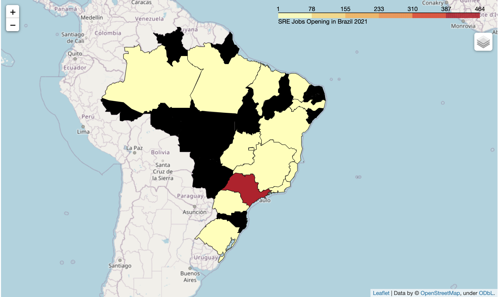

```python
import requests
import time
import pandas as pd
from selenium import webdriver
from selenium.webdriver.chrome.service import Service
from selenium.webdriver.chrome.options import Options
from selenium.webdriver.common.by import By
chrome_service = Service('/Users/rcsousa/Downloads/chromedriver')
import json
from bs4 import BeautifulSoup as soup
import random
import matplotlib.pyplot as plt
import requests
import json
import unidecode
import folium
from folium import plugins
import numpy as np
```

Gera lista de estados e coordenadas


```python
estados = json.loads(requests.get("https://servicodados.ibge.gov.br/api/v1/localidades/estados/").text)
UF = []
estado_nome = []
for x in estados:
    UF.append(x['sigla'])
    estado_nome.append(x['nome'])
    
coordenadas = []
for x in estados:
    coordenadas.append(json.loads(requests.get("http://servicodados.ibge.gov.br/api/v3/malhas/estados/"+x['sigla']+"/metadados").text))


latitude = []
longitude = []
for x in coordenadas:
    latitude.append(x[0]['centroide']['latitude'])
    longitude.append(x[0]['centroide']['longitude'])
    
coord = list(zip(UF, estado_nome, latitude, longitude))
df_coord = pd.DataFrame(coord, columns = ['UF', 'Location', 'latitude', 'longitude'])
coord_plot = list(zip(estado_nome, latitude, longitude))
```

Define parametros de busca


```python
url = 'https://www.linkedin.com/jobs/search?keywords=Site%20Reliability%20Engineer&location=Brasil&geoId=106057199&trk=public_jobs_jobs-search-bar_search-submit&position=1&pageNum=0'
options = Options()
options.headless = False
driver=webdriver.Chrome
s = driver(service=chrome_service, options=options)
n = random.randint(3,7)
s.get(url)
time.sleep(n)
scroll_pause_time = 1 
screen_height = s.execute_script("return window.screen.height;")
i = 1
```

Faz loop automático até último registro publico


```python
while True:
    # scroll one screen height each time
    s.execute_script("window.scrollTo(0, {screen_height}*{i});".format(screen_height=screen_height, i=i))  
    i += 1
    time.sleep(scroll_pause_time)
    # update scroll height each time after scrolled, as the scroll height can change after we scrolled the page
    scroll_height = s.execute_script("return document.body.scrollHeight;")  
    # Break the loop when the height we need to scroll to is larger than the total scroll height
    try:
        s.find_element(By.XPATH, "//button[@class='infinite-scroller__show-more-button infinite-scroller__show-more-button--visible']").click()
    except:
        pass
    if (screen_height) * i > scroll_height:
        break 
```


```python
bsobj = soup(s.page_source, 'html.parser')
```


```python
job_title = []
company = []
location = []
age = []
link = []

for item in bsobj.findAll('h3', {'class' : 'base-search-card__title'}):
    job_title.append(item.get_text().strip())
job_title
    
for item in bsobj.findAll('a', {'class' : 'hidden-nested-link'}):
    company.append(item.get_text().strip())
company
    
for item in bsobj.findAll('span', {'class' : 'job-search-card__location'}):
    location.append(item.get_text().strip())

    
for item in bsobj.findAll('time', {'class' : 'job-search-card__listdate'}):
    age.append(item.get_text().strip())
```


```python
postings = list(zip(job_title, company, location, age))
```


```python
df = pd.DataFrame(postings, columns = ['Job Opening', 'Company', 'Location', 'Age'])
```


```python
s.quit()
```

Consolida estados


```python
localidades = json.loads(requests.get("https://servicodados.ibge.gov.br/api/v1/localidades/municipios/").text)
for x in localidades:
    df.loc[df['Location'].str.contains(unidecode.unidecode(x['nome']), case=False), unidecode.unidecode('Location')] = x['microrregiao']['mesorregiao']['UF']['nome']
    df.loc[df['Location'].str.contains(x['microrregiao']['mesorregiao']['UF']['nome'], case=False), 'Location'] = x['microrregiao']['mesorregiao']['UF']['nome']
```

Tratamento de excessão


```python
df.loc[df['Location'].str.contains('Federal District', case=False), 'Location'] = 'Distrito Federal'
df.loc[df['Location'].str.contains('Ribeirão Preto', case=False), 'Location'] = 'São Paulo'
```


```python
jobs_per_company = df.groupby('Company').count()
```


```python
df = df.merge(df_coord, on='Location', how='left')
```


```python
df = df[df.latitude.notnull()]
```


```python
prep_chart_company = jobs_per_company.sort_values("Job Opening", ascending=False).head(10)
```


```python
df2 = pd.DataFrame(prep_chart_company['Job Opening'])
df2.plot(kind="barh", \
         legend=False, \
         figsize=(24, 12), \
         rot=0, \
         fontsize = 16, \
         sort_columns = False)
```


    <AxesSubplot:ylabel='Company'>


    

    


Gera Total de vagas por localidade


```python
df['Openings'] = df.groupby('Location')['Location'].transform('count')
```

Remove colunas desnecessárias


```python
for x in 'Company', 'Age', 'UF', 'Job Opening':
    df.drop(x, axis='columns', inplace=True)
```

Define HTTP Header


```python
headers = {
    'Content-Type': 'application/json;charset=UTF-8',
    'User-Agent': 'google-colab',
    'Accept': 'application/json, text/plain, */*',
    'Accept-Encoding': 'gzip, deflate, br',
    'Accept-Language': 'pt-BR,pt;q=0.9,en-US;q=0.8,en;q=0.7',
    'Connection': 'keep-alive',
}
```

Coleta Geojson do IBGE e atribui variável


```python
meshes_url = 'https://servicodados.ibge.gov.br/api/v2/malhas/?resolucao=2&formato=application/vnd.geo+json'
meshes_data = requests.get(meshes_url, headers=headers).json()
```

Coleta informacoes dos estados (com id) do IBGE e atribui variável


```python
states_url = 'https://servicodados.ibge.gov.br/api/v1/localidades/estados'
states_data = requests.get(states_url, headers=headers).json()
```


```python
# creating lists to be populated by IBGE requested data
meshes_ids = []
states_ids = []
states_names = []
states_codes = []

# populating information about meshes
for feature in meshes_data['features']:
    meshes_ids.append( str(feature['properties']['codarea']) )

meshes_ids.sort()

# populating information about Federative Units
for state in states_data:
    states_ids.append( str(state['id']) )
    states_names.append( state['nome'] )
    states_codes.append( state['sigla'] )

states_ids.sort()
```


```python
# creating a dataframe of Federative Units to be merged
states = pd.DataFrame( {'id': states_ids, 'nome': states_names, 'sigla': states_codes} )

# appending centroid coordinates columns
states['lat'] = 0
states['lng'] = 0

states.set_index('id', inplace=True)

# retrieving centroid data
for feature in meshes_data['features']:
    
    centroid = feature['properties']['centroide']
    lat = centroid[1]
    lng = centroid[0]
    
    cod = str(feature['properties']['codarea'])
    
    states.loc[cod,'lat'] = lat
    states.loc[cod,'lng'] = lng

states.reset_index(inplace=True)
```

Faz merge dos dataframes df e localidades com ids


```python
df = df.merge(states, left_on='Location', right_on='nome').drop(columns=['nome'])
```

Remove entradas duplicadas


```python
df = df.drop_duplicates()
```


Gera Mapa


```python
# Coordenadas de Brasilia
federal_district = [-15.7757875,-48.0778477]

# Cria objeto Mapa
basemap = folium.Map(
    location=federal_district,
    zoom_start=4,
    tiles='openstreetmap'
)

# Permite alterar tipo de layout do mapa
tiles = ['openstreetmap', 'cartodbpositron']

# iterating over the tiles and creating the maps
for tile in tiles:
  folium.TileLayer(tile).add_to(basemap)


# Define plot
legends = 'SRE Jobs Opening in Brazil 2021'
folium.Choropleth(
    geo_data=meshes_data,
    data=df,
    name=legends,
    columns=['id','Openings'],
    key_on='feature.properties.codarea',
    fill_color='YlOrRd',
    fill_opacity=1.0,
    line_opacity=0.7,
    legend_name=legends
).add_to(basemap)

# controles do mapa
folium.LayerControl().add_to(basemap)

# Renderiza Mapa
basemap
```




```python

```
